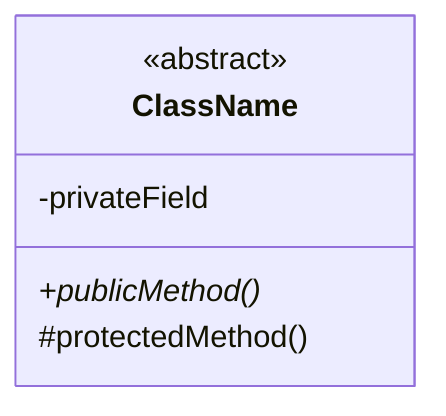
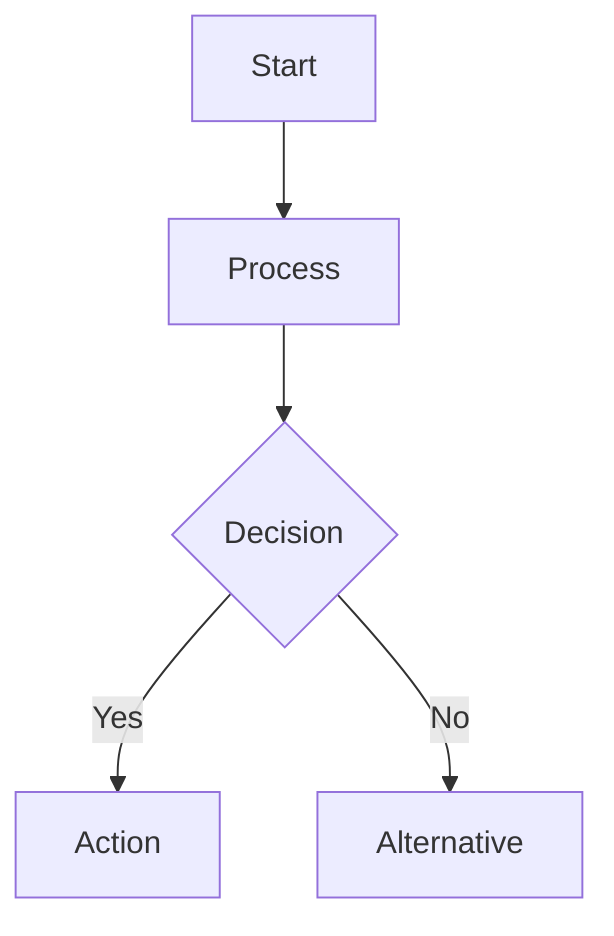

# CFD Content Standards

Rules for creating high-quality CFD learning content with proper formatting.

## LaTeX Standards

### Inline Math

Use single `$` for inline expressions:

```markdown
The divergence $\nabla \cdot \mathbf{U}$ equals zero.
```

### Display Math

Use double `$$` for display equations:

```markdown
$$
\nabla \cdot \mathbf{U} = 0
$$
```

### Nested LaTeX Rules

**❌ FORBIDDEN:** Nested math delimiters

```markdown
$$
Equation with $inline$ inside  # INVALID
```

**✅ CORRECT:** Use appropriate delimiter for context

```markdown
For display: $$equation$$
For inline: $equation$
```

### Common Operators

| Operation | LaTeX | Example |
|-----------|-------|---------|
| Gradient | `\nabla \phi` | $\nabla \phi$ |
| Divergence | `\nabla \cdot \mathbf{U}` | $\nabla \cdot \mathbf{U}$ |
| Laplacian | `\nabla^2 \phi` | $\nabla^2 \phi$ |
| Partial | `\frac{\partial}{\partial x}` | $\frac{\partial}{\partial x}$ |
| Absolute | `|r|` | $|r|$ |
| Vector | `\mathbf{U}` or `\vec{U}` | $\mathbf{U}$ |

## Mermaid Diagram Standards

### Class Diagrams

**Structure:**


**Rules:**
- Abstract classes: Mark with `<<abstract>>`
- Virtual methods: Mark with `*`
- Public: `+`, Private: `-`, Protected: `#`
- Inheritance: `--|>` (solid line with closed arrow)
- Relationships: Quote names with special characters: `"ClassName<Type>"`

### Flow Charts



### Common Issues

**❌ Don't:**
```mermaid
classDiagram
    classA --> classB  # Wrong relationship type
    surfaceInterpolationScheme<Type>  # Missing quotes!
```

**✅ Do:**
```mermaid
classDiagram
    classA --|> classB  # Correct inheritance
    class "surfaceInterpolationScheme<Type>" {  # Quotes!
        +interpolate()*
    }
```

## Code Block Standards

### Language Tags

**Always specify language:**

```markdown
```cpp
// C++ code
```

```python
# Python code
```

```bash
# Shell commands
```

### Code Block Balance

**❌ FORBIDDEN:** Unclosed code blocks

```markdown
```cpp
int x = 5;
# Missing closing ```
```

**Check:** Count ` ``` ` - must be even

## Header Standards

### Hierarchy

```
H1 (#) - Document title only
H2 (##) - Main sections
H3 (###) - Subsections
H4 (####) - Minor subdivisions
```

**❌ FORBIDDEN:** Skipping levels

```markdown
## Section 2
#### Subsection 2.1  # Skipped H3!
```

### Bilingual Format

**Required for all section headers:**

```markdown
## English Title (ชื่อภาษาไทย)
### Subsection (ชื่อย่อย)
```

## Visual Standards

### Emojis

Use emojis consistently:

| Emoji | Usage |
|-------|-------|
| ⭐ | Verified fact |
| ⚠️ | Warning / Unverified |
| ❌ | Incorrect / Don't |
| ✅ | Correct / Do |
| 🔒 | Critical rule |
| 📋 | Checklist |
| 🎯 | Target / Goal |
| 💡 | Insight / Tip |

### Callouts

**Standard callout types:**

```markdown
> **NOTE:** Important information

> **WARNING:** Potential issue

> **TIP:** Helpful suggestion

> **IMPORTANT:** Critical requirement

> **CAUTION:** Proceed with care
```

### Admonitions (Alternative)

```markdown
**NOTE:** Important information

**WARNING:** Potential issue

**TIP:** Helpful suggestion
```

## File Reference Standards

### Paths

Use absolute paths from project root:

```markdown
File: `openfoam_temp/src/finiteVolume/.../upwind.H`
Line: 42
```

### Code Citations

**Include file and line:**

```markdown
> **File:** `openfoam_temp/src/.../vanLeer.H`
> **Lines:** 67-69
> **Code:**
> ```cpp
> return (r + mag(r))/(1 + mag(r));
> ```
```

## Content Quality Standards

### Theory Sections

- **≥500 lines** of mathematical content
- Complete derivations (not just final formulas)
- Visual aids (diagrams, figures)
- All formulas ⭐ verified

### Code Sections

- **3-5 code snippets** minimum
- All code ⭐ verified
- Inline comments for key lines
- File paths and line numbers

### Implementation Sections

- **≥300 lines** of C++ code
- Step-by-step breakdown
- Compilation instructions
- Testing procedures

## Syntax Validation

**Before marking content complete:**

```bash
# Check code block balance
awk '/```/{count++} END{print count, (count%2==0 ? "OK" : "UNBALANCED")}' file.md

# Check nested LaTeX
grep -n '\$\$.*\$[^$]' file.md

# Check header hierarchy
grep -n '^#' file.md | sort -k1.1n
```

## Quality Checklist

- [ ] All formulas use correct LaTeX syntax
- [ ] All Mermaid diagrams render correctly
- [ ] All code blocks have language tags
- [ ] All code blocks are balanced
- [ ] Headers follow hierarchy (no skipped levels)
- [ ] Section headers are bilingual
- [ ] File references include paths and line numbers
- [ ] Technical facts are marked with ⭐
- [ ] Unverified content is marked with ⚠️
- [ ] No truncated content (lines ending with `**`)

---

**See also:** `source-first.md`, `verification-gates.md`
