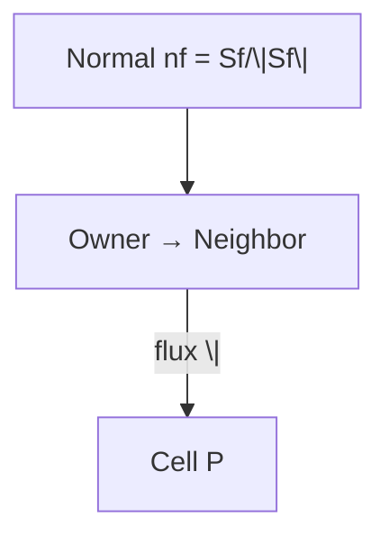

# Obsidian Syntax Prevention Strategy

## Root Causes & Solutions

### 1. LaTeX Math Delimiters (Most Common Issue)

**Problem:** DeepSeek often outputs `\(` `\)` for inline math and `\[` `\]` for block math instead of `$` and `$$`

**Prevention - Add to ALL content generation prompts:**

```markdown
## 🔒 CRITICAL MATH SYNTAX (Obsidian MathJax)

**❌ FORBIDDEN - These will NOT render in Obsidian:**
- `\[` and `\]` for block math (LaTeX style)
- `\(` and `\)` for inline math (LaTeX style)
- `\bfS`, `\bf{S}` - Invalid MathJax syntax

**✅ REQUIRED - Use ONLY these formats:**
- Block math: `$$equation$$` (double dollar signs)
- Inline math: `$equation$` (single dollar signs)
- Bold vectors: `\mathbf{S}`, `\mathbf{U}`, `\mathbf{n}` (always with braces)
- Magnitude: `|\mathbf{S}_f|` (single bars, NOT `\|S_f\|`)

**Self-Check:**
- If you type `\[`, immediately replace with `$$`
- If you type `\(`, immediately replace with `$`
- Never use LaTeX article-style delimiters in Markdown
```

---

### 2. Mermaid Diagram Special Characters

**Problem:** `|`, `(`, `)`, `{`, `}` break Mermaid parsing

**Prevention - Add to prompt:**

```markdown
## 🔒 CRITICAL MERMAID SYNTAX (Obsidian)

**❌ FORBIDDEN in Mermaid node text:**
- Unescaped pipe: `Text|with|pipes` → Use `Text\|with\|pipes` or `["Text|with|pipes"]`
- Unquoted special chars: `Node(text())` → Use `["Node(text())"]`
- Non-breaking spaces: Use only standard spaces (U+0020)

**✅ REQUIRED Mermaid format:**
- Quote ALL node text with special chars: `["node()text"]`
- Quote ALL edge labels with special chars: `-->|"label()"|`
- Use 2-space or 4-space indentation (consistent)
- Start with ```mermaid, end with ```

**✅ Example correct Mermaid:**

```

---

### 3. Code Block Balance

**Problem:** Truncated content leaves unclosed code blocks

**Prevention - Validation script:**

```bash
#!/bin/bash
# check_code_blocks.sh
FILE="$1"

# Count backticks - must be even
COUNT=$(grep -o '```' "$FILE" | wc -l)
if [ $((COUNT % 2)) -ne 0 ]; then
    echo "❌ UNBALANCED: Found $COUNT backticks (odd number)"
    exit 1
fi

# Check for language tags
if grep '```$' "$FILE" | grep -v '```[a-z]'; then
    echo "⚠️  WARNING: Code blocks without language tags found"
fi

echo "✅ Code blocks: $COUNT backticks (balanced)"
```

---

### 4. Content Validation Artifacts

**Problem:** Error messages copied into output

**Prevention - Prompt wrapper:**

```bash
#!/bin/bash
# clean_generation.sh
# Run DeepSeek content generation and strip error artifacts

INPUT_FILE="$1"
OUTPUT_FILE="$2"

# Strip common error patterns from start of file
sed -i '' '/^Content validation failed:/,/^[A-Z]/d' "$OUTPUT_FILE"
sed -i '' '/^⚠️  WARNING:/d' "$OUTPUT_FILE"

# Ensure file starts with # Day XX
if ! head -1 "$OUTPUT_FILE" | grep -q "^# Day [0-9]"; then
    echo "⚠️  File doesn't start with day header"
fi
```

---

### 5. Integrated Workflow Prompt Template

**Use this for ALL DeepSeek content generation:**

```markdown
# Content Generation Requirements

## Format Requirements (CRITICAL - OBSDIAN COMPATIBILITY)

### Math Syntax
- Use `$` for inline math (NOT `\(` or `\)`)
- Use `$$` for block math (NOT `\[` or `\]`)
- Use `\mathbf{}` for vectors (NOT `\bf{}` or plain text)
- Use `|` for magnitude (NOT `\|`)

### Mermaid Syntax
- Quote nodes with special chars: `["text()|[]{}"]`
- Quote edge labels: `-->|"label|()|"`
- Use only standard spaces (U+0020), never non-breaking (U+00A0)
- All code blocks must have closing ```

### Code Blocks
- Every block must start with ```cpp, ```python, ```bash, or ```mermaid
- Every block must end with closing ```
- Total backtick count must be even
- No orphaned code snippets

### Self-Check Before Output
1. Count `$` signs - must be even
2. Count ` ``` ` - must be even
3. Search for `\(`, `\[` - must be zero results
4. Search for `\bf` - must be zero results
5. Verify file starts with `# Day XX` header

[... rest of your content prompt ...]
```

---

### 6. Post-Generation Verification Script

```bash
#!/bin/bash
# verify_obsidian_syntax.sh
FILE="$1"

ERRORS=0

# Check 1: Code block balance
COUNT=$(awk '/```/{count++} END{print count}' "$FILE")
if [ $((COUNT % 2)) -ne 0 ]; then
    echo "❌ Code blocks unbalanced: $COUNT backticks"
    ((ERRORS++))
fi

# Check 2: LaTeX delimiters
if grep -E '\\\\\(|\\\[|\\\]' "$FILE" > /dev/null; then
    echo "❌ LaTeX delimiters found (use $/$$ instead)"
    ((ERRORS++))
fi

# Check 3: Wrong vector notation
if grep -E '\\\\\bfs?[^{]|\\bfs?{' "$FILE" > /dev/null; then
    echo "❌ Wrong vector notation (use \\\\mathbf{} instead of \\\\bf)"
    ((ERRORS++))
fi

# Check 4: File start
if ! head -1 "$FILE" | grep -q "^# Day [0-9]"; then
    echo "❌ File doesn't start with day header"
    ((ERRORS++))
fi

# Check 5: Mermaid pipes
if grep 'mermaid' "$FILE" -A20 | grep -E '\[[^"]*\|[^"]*\]' > /dev/null; then
    echo "⚠️  Possible unescaped pipe in Mermaid"
fi

if [ $ERRORS -eq 0 ]; then
    echo "✅ All syntax checks passed"
    exit 0
else
    echo "❌ Found $ERRORS error(s)"
    exit 1
fi
```

---

### 7. Update Content Creation Skill

**Edit: `.claude/skills/content-creation/SKILL.md`**

Add to Stage 4 prompt template:

```markdown
## 🔒 OBSIDIAN SYNTAX LOCKDOWN

Non-negotiable requirements for Obsidian MathJax rendering:

1. **MATH DELIMITERS**
   - Inline: `$x^2$` NEVER `\($x^2$\)`
   - Block: `$$x^2$$` NEVER `\[x^2\]`

2. **VECTOR NOTATION**
   - Bold: `\mathbf{U}` NEVER `\bfU` or `\bf{U}` or plain `U`
   - Magnitude: `|\mathbf{U}|` NEVER `\|U\|` or `\abs{U}`

3. **MERMAID DIAGRAMS**
   - Quote special chars: `["Text with |()[]{}"]`
   - Escape pipes: `Text\|with\|pipes` or use quotes

4. **CODE BLOCKS**
   - Language tag required: ```cpp, ```python, ```mermaid
   - Never use ``` alone

5. **VALIDATION**
   Output will be rejected if:
   - Any `\(`, `\)`, `\[`, `\]` found
   - Unbalanced code blocks (odd number of ```)
   - File starts with error text instead of header
```

---

### 8. Quick Reference Card

**Print this and keep handy:**

```
┌─────────────────────────────────────────┐
│  OBSDIAN SYNTAX QUICK REF              │
├─────────────────────────────────────────┤
│  Math:         $inline$  $$block$$     │
│  Vectors:      \mathbf{S}              │
│  Magnitude:    |\mathbf{S}|            │
│  Mermaid:      ["text|()[]"]           │
│  Code:         ```cpp  ``` (paired)    │
│  File Start:   # Day XX (no artifacts) │
└─────────────────────────────────────────┘
```

---

## Implementation Priority

1. **Immediate**: Update `content-creation` skill with syntax lockdown section
2. **Today**: Create `verify_obsidian_syntax.sh` script
3. **This week**: Add verification to content generation workflow
4. **Ongoing**: Run verification on all generated content before publishing

---

## Files to Update

1. `.claude/skills/content-creation/SKILL.md` - Add syntax requirements
2. `.claude/scripts/verify_obsidian_syntax.sh` - Create verification script
3. `.claude/templates/content_prompt_template.md` - Standard prompt template

---

## Testing

After implementing, test with:

```bash
# Test verification script
bash .claude/scripts/verify_obsidian_syntax.sh daily_learning/Phase_01_Foundation_Theory/05.md

# Should output: ✅ All syntax checks passed
```
