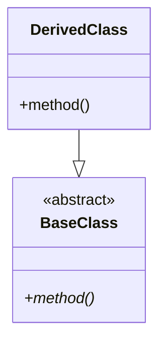
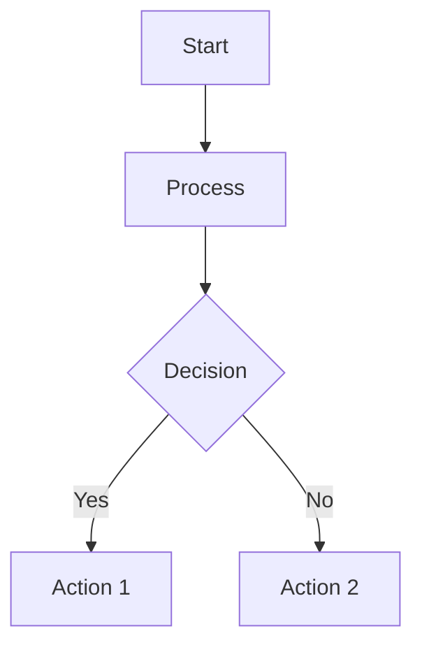

# Theory-Heavy Content Template

## Purpose

Template for creating theory-heavy CFD learning content (Phase 1: Days 01-11)

## Content Structure

```markdown
---
title: "Day XX: [Lesson Title]"
date: YYYY-MM-DD
phase: "Phase_01_Foundation_Theory"
---

# Day XX: [Lesson Title] ([หัวข้อภาษาไทย])

> 🎓 **Source-First:** All technical facts verified from OpenFOAM source code ⭐

---

## 📋 Table of Contents

- [Learning Objectives](#learning-objectives)
- [Prerequisites](#prerequisites)
- [Theory](#theory)
- [OpenFOAM Reference](#openfoam-reference)
- [Design](#design)
- [Implementation](#implementation)
- [Testing](#testing)
- [Exercises](#exercises)

---

## Learning Objectives (เป้าหมายการเรียนรู้)

By the end of this lesson, you will be able to:

1. [Objective 1]
2. [Objective 2]
3. [Objective 3]

---

## Prerequisites (ความรู้พื้นฐาน)

- [Prerequisite 1]
- [Prerequisite 2]

---

## Theory (ทฤษฎี)

### Mathematical Foundation (พื้นฐานคณิตศาสตร์)

#### Governing Equations

[Complete mathematical derivations with LaTeX]

#### Key Concepts (แนวคิดสำคัญ)

[Explain using Engineering Thai]

### ⭐ Verified Facts

> **Class Hierarchy:** Verified from [source file]
> ```mermaid
> [Mermaid diagram]
> ```
>
> **Formulas:** Verified from [source file]
> $$[formula]$$

---

## OpenFOAM Reference (อ้างอิง OpenFOAM)

### Class Structure (โครงสร้างคลาส)

[Explain actual OpenFOAM implementation]

### ⭐ Verified Code

> **File:** [path to source file]
> **Lines:** [line numbers]

```cpp
[Verified code snippet]
```

### Usage (การใช้งาน)

```cpp
[Example usage]
```

---

## Design (การออกแบบ)

### Architecture (สถาปัตยกรรม)

[Design decisions and rationale]

### Trade-offs (การแลกเปลี่ยน)

| ✅ Advantages | ❌ Disadvantages |
|---------------|------------------|
| [Advantage 1] | [Disadvantage 1] |
| [Advantage 2] | [Disadvantage 2] |

---

## Implementation (การ implement)

### Step-by-Step (ขั้นตอนการ implement)

1. **Step 1:** [Description]
   ```cpp
   [Code]
   ```

2. **Step 2:** [Description]
   ```cpp
   [Code]
   ```

### ⭐ Complete Implementation

> **Note:** Verified against OpenFOAM [version]

```cpp
[Full implementation - ≥300 lines]
```

---

## Testing (การทดสอบ)

### Unit Tests

```cpp
[Test code]
```

### Validation (การตรวจสอบ)

[Validation methods]

---

## Exercises (แบบฝึกหัด)

### Exercise 1: [Title]

**Problem:**
[Description]

**Solution:**
```cpp
[Solution code]
```

### Concept Checks (คำถามทบทวน)

1. **Question:** [Question]
   **Answer:** [Detailed answer]

2. **Question:** [Question]
   **Answer:** [Detailed answer]

---

## Summary (สรุป)

### Key Takeaways (สิ่งสำคัญ)

- [Point 1]
- [Point 2]
- [Point 3]

### Next Steps (ขั้นตอนถัดไป)

- [Related topic to explore]

---

## References (อ้างอิง)

- [Reference 1]
- [Reference 2]
```

## Content Guidelines

### Theory Section Requirements

- **≥500 lines** of mathematical content
- **Complete derivations** (not just final formulas)
- **Visual aids** (Mermaid diagrams, figures)
- **⭐ Verified formulas** from source code

### OpenFOAM Section Requirements

- **3-5 code snippets** with explanations
- **⭐ Verified class hierarchy** diagram
- **Actual file paths** and line numbers
- **Usage examples** for each major class/method

### Implementation Section Requirements

- **≥300 lines** of C++ code
- **Step-by-step** breakdown
- **Inline comments** explaining key lines
- **Compilation and testing** instructions

### Exercises Section Requirements

- **4-6 concept checks** with detailed answers
- **2-3 coding exercises** with solutions
- **Real-world scenarios** where possible

## LaTeX Guidelines

### Inline Math

Use single `$` for inline:
```markdown
The gradient $\nabla \phi$ is calculated...
```

### Block Math

Use double `$$` for display:
```markdown
$$
\nabla \phi = \frac{1}{V} \sum_f \phi_f \mathbf{S}_f
$$
```

### Common CFD Equations

**Divergence:**
$$
\nabla \cdot \mathbf{U} = 0
$$

**Gradient:**
$$
\nabla \phi = \frac{1}{V} \sum_f \phi_f \mathbf{S}_f
$$

**Laplacian:**
$$
\nabla^2 \phi = \nabla \cdot (\nabla \phi)
$$

**TVD Limiter:**
$$
\phi(r) = \frac{r + |r|}{1 + |r|}
$$

## Mermaid Diagram Guidelines

### Class Diagram



### Flow Chart



## Quality Checklist

Before marking content as complete:

- [ ] All sections present and complete
- [ ] Theory has complete derivations
- [ ] All formulas are ⭐ verified
- [ ] Code snippets are ⭐ verified
- [ ] Class diagrams are accurate
- [ ] Implementation ≥300 lines
- [ ] 4-6 concept checks with answers
- [ ] Bilingual headers throughout
- [ ] LaTeX renders correctly
- [ ] Mermaid diagrams render correctly

---

**Related Skills:** `source-first`, `ground-truth-verification`
