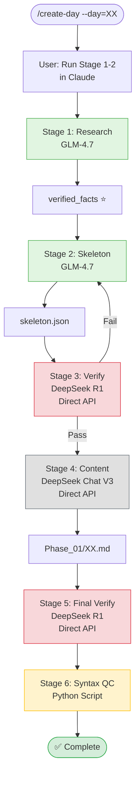

# /create-day

Generate daily CFD learning content (**English-only**) with Source-First methodology.

**Architecture:** Integrated workflow combining Claude (GLM-4.7) and DeepSeek (Direct API)

---

## Usage

```
/create-day --day=XX --topic="TOPIC"
```

Where:
- `XX` is day number (01-12)
- `"TOPIC"` is the topic (optional, will read from roadmap if not provided)

**Example:**
```bash
/create-day --day=05 --topic="Spatial Discretization Schemes"
```

---

## Quick Start

```bash
# Use the integrated workflow script
bash .claude/scripts/run_content_workflow.sh 05 "Spatial Discretization Schemes"
```

Or use `/create-day` for step-by-step guidance.

---

## Architecture

### Model Assignment

| Stage | Model | API Method | Purpose |
|-------|--------|-------------|---------|
| 1-2 | GLM-4.7 | **Via Claude** | Ground truth extraction + Skeleton creation |
| 3 | DeepSeek R1 | **Direct API** | Verify skeleton against ground truth |
| 4 | DeepSeek Chat V3 | **Direct API** | Expand to full English content |
| 5 | DeepSeek R1 | **Direct API** | Final technical verification |
| 6 | - | Python Script | Syntax QC |

### Workflow Flow



---

## Integrated Workflow

### Why Use Integrated Script?

The `.claude/scripts/run_content_workflow.sh` script:

**Combines:**
1. **Claude Main Agent** for stages 1-2 (WebSearch + Roadmap reading)
2. **Python Wrapper** for stages 3-5 (Direct DeepSeek API calls)
3. **Python QC Script** for stage 6 (Syntax validation)

**Benefits:**
- ✅ Guaranteed DeepSeek execution (no Task tool delegation issues)
- ✅ Interactive prompts at each stage
- ✅ Error handling and verification
- ✅ Clear progress indicators
- ✅ Summary of all outputs

---

## Stage-by-Stage Instructions

### Stage 1: Extract Ground Truth (GLM-4.7)

**Ask Claude:**
```
Research Day XX: [TOPIC]

Tasks:
1. Use WebSearch to find latest OpenFOAM documentation
2. Extract class hierarchy from source code in openfoam_temp/src/finiteVolume
3. Extract mathematical formulas with operators (|r| vs r)
4. Mark all facts with ⭐ (verified) or ⚠️ (from docs)

Output: /tmp/verified_facts_dayXX.json (JSON format)

Use this JSON structure:
{
  "class_hierarchy": {},
  "formulas": {},
  "documentation": []
}
```

**Output:** `/tmp/verified_facts_dayXX.json` ⭐

---

### Stage 2: Generate Skeleton (GLM-4.7)

**Ask Claude:**
```
Plan Day XX: [TOPIC]

GROUND TRUTH: /tmp/verified_facts_dayXX.json

Create ENGLISH-ONLY skeleton with:
- English headers only (no Thai translation)
- Roadmap-aligned structure (read roadmap.md)
- CFD standards compliance
- All verified facts marked with ⭐

Output: daily_learning/skeletons/dayXX_skeleton.json
```

**Output:** `skeletons/dayXX_skeleton.json`

---

### Stage 3: Verify Skeleton (DeepSeek R1 - Direct API)

**Or use integrated script:**
```bash
bash .claude/scripts/run_content_workflow.sh 05 "Spatial Discretization Schemes"
```

**Or manually:**
```bash
cat > /tmp/stage3_prompt.txt << 'PROMPT'
Verify skeleton for Day XX

SKELETON: $(cat daily_learning/skeletons/dayXX_skeleton.json)
GROUND TRUTH: $(cat /tmp/verified_facts_dayXX.json)

Verification tasks:
1. Class hierarchy matches ground truth exactly
2. Formulas match ground truth (check operators!)
3. No hallucinated classes or methods
4. All ⭐ facts are verified

Output format:
- PASS if all checks succeed
- FAIL with specific issues if any mismatch found
PROMPT

python3 .claude/scripts/deepseek_content.py \
  deepseek-reasoner \
  /tmp/stage3_prompt.txt \
  > /tmp/verification_report_dayXX.txt

cat /tmp/verification_report_dayXX.txt
```

**Output:** `/tmp/verification_report_dayXX.txt`

---

### Stage 4: Generate Content (DeepSeek Chat V3 - Direct API)

**Or use integrated script** (recommended)

**Or manually:**
```bash
cat > /tmp/stage4_prompt.txt << 'PROMPT'
Expand Day XX: [TOPIC] - ENGLISH ONLY

SKELETON: $(cat daily_learning/skeletons/dayXX_skeleton.json)

CRITICAL REQUIREMENTS:
- ENGLISH-ONLY content (no Thai translation)
- Theory: ≥500 lines with complete derivations
- Code: 3-5 snippets with file paths and line numbers
- Implementation: ≥300 lines C++ code
- Exercises: 4-6 concept checks
- All ⭐ facts remain unchanged

Write comprehensive technical content suitable for CFD learners.

Format:
- Use $$ for display math equations
- Use $ for inline math
- Include proper Mermaid diagrams
- All code blocks must have language tags
- Headers in English only

Output complete markdown file content.
PROMPT

python3 .claude/scripts/deepseek_content.py \
  deepseek-chat \
  /tmp/stage4_prompt.txt \
  > daily_learning/Phase_01_Foundation_Theory/XX.md
```

**Output:** `Phase_01_Foundation_Theory/XX.md`

---

### Stage 5: Final Verification (DeepSeek R1 - Direct API)

**Or use integrated script** (recommended)

**Or manually:**
```bash
cat > /tmp/stage5_prompt.txt << 'PROMPT'
Final verification for Day XX

CONTENT: $(cat daily_learning/Phase_01_Foundation_Theory/XX.md)
GROUND TRUTH: $(cat /tmp/verified_facts_dayXX.json)

Verification tasks:
1. All Mermaid diagrams match ground truth
2. All formulas in LaTeX match ground truth (check operators!)
3. Code snippets are syntactically correct
4. No ⚠️ claims without explanation

Output verification report with specific issues if any found.
PROMPT

python3 .claude/scripts/deepseek_content.py \
  deepseek-reasoner \
  /tmp/stage5_prompt.txt \
  > /tmp/final_verification_dayXX.txt

cat /tmp/final_verification_dayXX.txt
```

**Output:** `/tmp/final_verification_dayXX.txt`

---

### Stage 6: Syntax QC (Python Script)

**Or use integrated script** (recommended)

**Or manually:**
```bash
python3 .claude/scripts/qc_syntax_check.py \
  --file=daily_learning/Phase_01_Foundation_Theory/XX.md

# Check exit code
if [ $? -eq 0 ]; then
  echo "✅ Syntax QC PASSED"
else
  echo "❌ Syntax QC FAILED - Fix issues before publishing"
fi
```

**Output:** QC report + pass/fail status

---

## Content Requirements

| Section | Minimum | Details |
|---------|---------|---------|
| Theory | ≥500 lines | Equations + explanations + derivations |
| Code Analysis | 3-5 snippets | Must include file paths and line numbers |
| Implementation | ≥300 lines C++ | Step-by-step breakdown |
| Exercises | 4-6 questions | With detailed solutions |

---

## Using the Integrated Script

```bash
# Run the complete workflow interactively
bash .claude/scripts/run_content_workflow.sh 05 "Spatial Discretization Schemes"

# The script will:
# 1. Prompt you to run Stage 1 (Claude research)
# 2. Wait for you to complete, then prompt for Stage 2 (Claude skeleton)
# 3. Call DeepSeek R1 directly for verification
# 4. Call DeepSeek Chat V3 directly for content generation
# 5. Call DeepSeek R1 directly for final verification
# 6. Run syntax QC
# 7. Show summary of all outputs
```

### Script Features

- **Interactive prompts** at each stage
- **Error handling** with clear messages
- **Verification** between stages
- **Progress indicators** (colors)
- **Summary** of all generated files
- **Direct API calls** to DeepSeek (bypasses proxy)

---

## Verification

### After Running

```bash
# Verify DeepSeek was used directly (not through proxy)
grep -c "deepseek-chat" proxy.log  # Should return 0
grep -c "deepseek-reasoner" proxy.log  # Should return 0

# Verify direct API calls were made
ls -la /tmp/stage*_prompt.txt
ls -la /tmp/*verification*.txt
```

### Expected Behavior

```
Stage 1-2: Claude (GLM-4.7) → Uses proxy → OK
Stage 3-5: DeepSeek API Direct → BYPASSES proxy → OK
```

---

## Troubleshooting

### Integrated Script Fails

```bash
# Make script executable
chmod +x .claude/scripts/run_content_workflow.sh

# Check Python is available
python3 --version

# Test DeepSeek API directly
python3 .claude/scripts/deepseek_content.py deepseek-chat <(echo "test")
```

### Content Quality Issues

If DeepSeek generates poor content:

1. **Review prompt** - Ensure constraints are clear
2. **Check ground truth** - Verify skeleton JSON structure
3. **Adjust prompt** - Edit stage prompt files in `/tmp/`
4. **Retry** - Re-run that specific stage

### QC Script Not Found

```bash
# Check if QC script exists
ls -la .claude/scripts/qc_syntax_check.py

# If not found, skip Stage 6
echo "⚠️  QC script not found, skipping syntax check"
```

---

## Output Files

| Stage | Model | File | Description |
|-------|--------|------|-------------|
| 1 | GLM-4.7 | `/tmp/verified_facts_dayXX.json` | Ground truth ⭐ |
| 2 | GLM-4.7 | `skeletons/dayXX_skeleton.json` | CFD curriculum skeleton |
| 3 | DeepSeek R1 | `/tmp/verification_report_dayXX.txt` | Skeleton verification |
| 4 | DeepSeek Chat V3 | `Phase_01_Foundation_Theory/XX.md` | English content |
| 5 | DeepSeek R1 | `/tmp/final_verification_dayXX.txt` | Final verification |
| 6 | - | QC report | Syntax validation |

---

## Quick Reference

### Manual Stages (if not using integrated script)

```bash
# Stage 3: Verify Skeleton
python3 .claude/scripts/deepseek_content.py deepseek-reasoner /tmp/stage3_prompt.txt

# Stage 4: Generate Content
python3 .claude/scripts/deepseek_content.py deepseek-chat /tmp/stage4_prompt.txt

# Stage 5: Final Verify
python3 .claude/scripts/deepseek_content.py deepseek-reasoner /tmp/stage5_prompt.txt
```

### Integrated Script (Recommended)

```bash
# Run everything interactively
bash .claude/scripts/run_content_workflow.sh 05 "Spatial Discretization Schemes"
```

---

## Key Principles

### Source-First Rule

```
Ground Truth from Source > Documentation > AI Analysis
```

### Model Assignment

| Task | Model | Method |
|------|--------|---------|
| Ground Truth | GLM-4.7 | Claude Main Agent |
| Skeleton | GLM-4.7 | Claude Main Agent |
| Verify | DeepSeek R1 | **Direct API** |
| Content | DeepSeek Chat V3 | **Direct API** |
| Final Verify | DeepSeek R1 | **Direct API** |

### English-Only Content

- ✅ All content in English
- ✅ No Thai translation required
- ✅ Headers in English only
- ✅ Technical terms in English

---

**Last Updated:** 2026-01-26
**Approach:** Integrated workflow combining Claude (GLM-4.7) + Direct DeepSeek API
