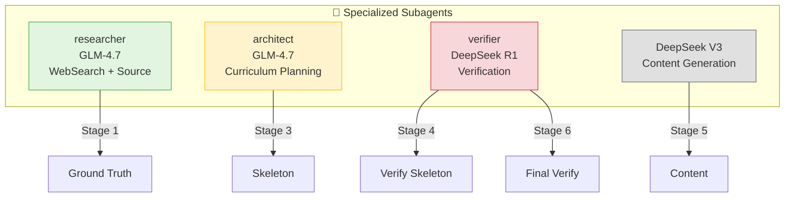
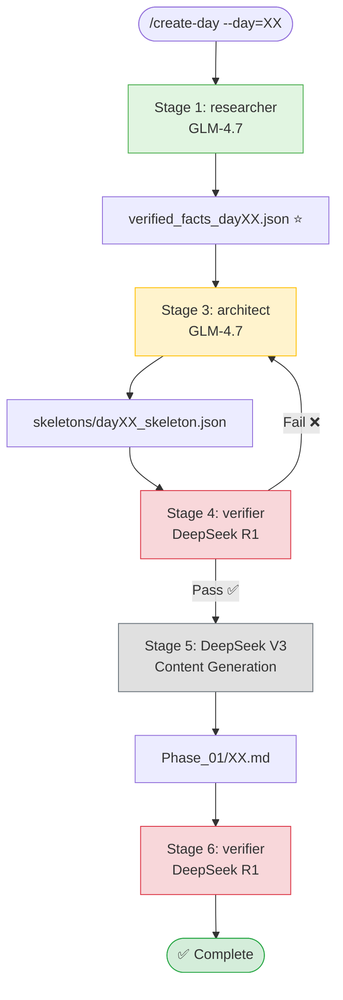

# /create-day

Generate daily CFD learning content (**English-only**) with Source-First methodology and **specialized subagents**.

## Usage

```
/create-day --day=XX
```

Where `XX` is the day number (01-12).

---

## Preflight Check: Proxy Server

**Before running the workflow, ensure the DeepSeek proxy is running:**

```bash
# Check if proxy is running
lsof -i :4000

# If not running, start it:
./start_proxy.sh

# Verify proxy is responding
curl -s http://localhost:4000 | grep -q "LiteLLM" && echo "✅ Proxy OK" || echo "❌ Proxy not responding"
```

**What the proxy does:**
- Routes requests for `deepseek-chat` and `verifier` agents
- Translates model names to actual API endpoints
- Handles API keys and authentication
- Logs all requests to `proxy.log`

**Monitor proxy during workflow:**
```bash
# In a separate terminal
tail -f proxy.log
```

---

## Workflow Overview

This skill executes a complete 6-stage pipeline with **specialized subagents** for **English-only content**:

| Stage | Agent/Model | Purpose | Type |
|-------|-------------|---------|------|
| 1 | `researcher` (GLM-4.7) | Ground truth extraction (WebSearch + Source) | Manual |
| 2 | - | Structure facts into JSON | Auto |
| 3 | `architect` (GLM-4.7) | CFD curriculum skeleton (English-only) | Manual |
| 4 | `verifier` (DeepSeek R1) | Verify skeleton against ground truth | Manual |
| 5 | DeepSeek Chat V3 | Expand to full English content | Manual |
| 6 | `verifier` (DeepSeek R1) | Final technical verification | Manual |

**All stages logged to `/tmp/workflow_debug.log`** with append mode.

---

## Quick Start

```
/create-day --day=05
```

This provides step-by-step instructions for each stage using specialized subagents.

---

## Agent Responsibilities

### All Agents Summary



| Agent | Model | Purpose | Key Tools |
|-------|-------|---------|-----------|
| `researcher` | GLM-4.7 | WebSearch + Source extraction | WebSearch, Read, Grep, Glob |
| `architect` | GLM-4.7 | CFD curriculum planning (English-only) | roadmap.md, CFD standards |
| `verifier` | DeepSeek R1 | Technical verification | Python, Interleaved Thinking |
| DeepSeek Chat V3 | deepseek-chat | English content generation | Math + Physics specialization |

---

## Stage-by-Stage Instructions

### Stage 1: Extract Ground Truth (`researcher` Agent)

**Agent:** `researcher` (GLM-4.7 with WebSearch)

**Purpose:** Extract verified facts from OpenFOAM source code AND find latest documentation

```
Task:
  subagent_type: researcher
  prompt: |
    Research Day XX: [TOPIC]

    Tasks:
    1. Use WebSearch to find latest OpenFOAM documentation
    2. Extract class hierarchy from source code
    3. Extract mathematical formulas with operators
    4. Mark all facts with ⭐ (verified) or ⚠️ (from docs)

    Output: /tmp/verified_facts_dayXX.json (JSON format)
```

**Example:**
```
Task:
  subagent_type: researcher
  prompt: |
    Research Day 05: Spatial Discretization Schemes

    1. WebSearch: "OpenFOAM upwind scheme documentation 2024"
    2. Find source files in: openfoam_temp/src/finiteVolume
    3. Extract class hierarchies for: upwind, linearUpwind, vanLeer
    4. Extract formulas with exact operators (|r| vs r)

    Output structured JSON with verification markers
```

**Output:** `/tmp/verified_facts_dayXX.json` ⭐

---

### Stage 2: Structure Facts (Automated)

**Purpose:** Ensure JSON structure is valid

```bash
# Validate JSON structure
python3 -c "import json; json.load(open('/tmp/verified_facts_dayXX.json'))"
```

**Expected structure:**
```json
{
  "class_hierarchy": {
    "className": {
      "base_class": "parentName",
      "verified": true,
      "source_file": "path/to/file.H"
    }
  },
  "formulas": {
    "schemeName": {
      "formula": "actual_formula",
      "verified": true,
      "source_file": "path/to/file.H"
    }
  },
  "documentation": [
    {
      "url": "https://...",
      "title": "...",
      "verified": false
    }
  ]
}
```

---

### Stage 3: Generate Skeleton (`architect` Agent)

**Agent:** `architect` (GLM-4.7)

**Purpose:** Create CFD curriculum structure from roadmap + ground truth (**English-only**)

```
Task:
  subagent_type: architect
  prompt: |
    Plan Day XX: [TOPIC]

    GROUND TRUTH: /tmp/verified_facts_dayXX.json

    Create ENGLISH-ONLY skeleton with:
    - English headers only (no Thai translation)
    - Roadmap-aligned structure (read roadmap.md)
    - CFD standards compliance
    - All verified facts marked with ⭐

    Output: daily_learning/skeletons/dayXX_skeleton.json
```

**Why `architect`:**
- ✅ Reads roadmap.md automatically
- ✅ Knows CFD curriculum structure
- ✅ Enforces CFD standards
- ✅ English-only structure

**Output:** `skeletons/dayXX_skeleton.json`

---

### Stage 4: Verify Skeleton (`verifier` Agent)

**Agent:** `verifier` (DeepSeek R1)

**Purpose:** Verify skeleton against ground truth using Interleaved Thinking

```
Task:
  subagent_type: verifier
  prompt: |
    Verify skeleton for Day XX

    SKELETON: daily_learning/skeletons/dayXX_skeleton.json
    GROUND TRUTH: /tmp/verified_facts_dayXX.json

    Verification tasks:
    1. Class hierarchy matches ground truth exactly
    2. Formulas match ground truth (check operators!)
    3. No hallucinated classes or methods
    4. All ⭐ facts are verified

    Use Interleaved Thinking for complex hierarchies

    Output: Verification report (PASS/FAIL with specific issues)
```

**What `verifier` checks:**

| Check | Example |
|-------|---------|
| Class Hierarchy | `upwind → limitedSurfaceInterpolationScheme → surfaceInterpolationScheme` |
| Formula Operators | `(r + \|r\|) / (1 + \|r\|)` NOT `(r + 1) / (1 + r)` |
| Hallucinations | Classes not in ground truth = ❌ |
| Source References | File paths and line numbers present |

**Output:** Verification report (PASS → proceed, FAIL → fix skeleton)

---

### Stage 5: Expand Content (DeepSeek Chat V3)

**Model:** DeepSeek Chat V3 (deepseek-chat)

**Purpose:** Generate full English content from verified skeleton

```
Task:
  subagent_type: deepseek-chat
  prompt: |
    Expand Day XX: [TOPIC] - ENGLISH ONLY

    VERIFIED SKELETON: {skeleton content}
    VERIFICATION REPORT: {from Stage 4}

    CRITICAL REQUIREMENTS:
    - ENGLISH-ONLY content (no Thai translation)
    - Theory: ≥500 lines with complete derivations
    - Code: 3-5 snippets with file paths and line numbers
    - Implementation: ≥300 lines C++ code
    - Exercises: 4-6 concept checks
    - All ⭐ facts remain unchanged

    Write comprehensive technical content suitable for CFD learners.

    Output: daily_learning/Phase_01_Foundation_Theory/XX.md
```

**Content Requirements:**

| Section | Minimum |
|---------|---------|
| Theory | ≥500 lines, equations + explanations |
| Code Analysis | 3-5 snippets with file paths |
| Implementation | ≥300 lines C++ code |
| Exercises | 4-6 questions + answers |

**Why DeepSeek Chat V3:**
- ✅ Superior mathematical reasoning for derivations
- ✅ Strong CFD physics intuition and explanations
- ✅ Better at explaining complex concepts (TVD, NVD, schemes)
- ✅ Still capable with C++ code examples
- ✅ Routed via proxy (localhost:4000)

**Output:** `Phase_01_Foundation_Theory/XX.md`

---

### Stage 6: Final Verification (`verifier` Agent)

**Agent:** `verifier` (DeepSeek R1)

**Purpose:** Final technical check before publishing

```
Task:
  subagent_type: verifier
  prompt: |
    Final verification for Day XX

    CONTENT: daily_learning/Phase_01_Foundation_Theory/XX.md
    GROUND TRUTH: /tmp/verified_facts_dayXX.json

    Verification tasks:
    1. All Mermaid diagrams match ground truth
    2. All formulas in LaTeX match ground truth
    3. Code snippets are syntactically correct
    4. No ⚠️ claims without explanation

    Output: Final verification report
```

**Then run syntax QC:**
```bash
python3 .claude/scripts/qc_syntax_check.py \
  --file=daily_learning/Phase_01_Foundation_Theory/XX.md
```

**Output:** ✅ Content ready for publishing

---

## Logging

### Log Agent Activity

```bash
# Stage 1: researcher
python3 .claude/scripts/log_event.py agent \
  --name "researcher" \
  --model "glm-4.7" \
  --backend "default" \
  --task "Research Day XX ground truth"

# Stage 3: architect
python3 .claude/scripts/log_event.py agent \
  --name "architect" \
  --model "glm-4.7" \
  --backend "default" \
  --task "Plan Day XX skeleton"

# Stage 4: verifier (skeleton)
python3 .claude/scripts/log_event.py agent \
  --name "verifier" \
  --model "deepseek-reasoner" \
  --backend "default" \
  --task "Verify Day XX skeleton"

# Stage 5: content generation
python3 .claude/scripts/log_event.py agent \
  --name "content-generator" \
  --model "deepseek-chat" \
  --backend "default" \
  --task "Expand Day XX content"

# Stage 6: verifier (final)
python3 .claude/scripts/log_event.py agent \
  --name "verifier" \
  --model "deepseek-reasoner" \
  --backend "default" \
  --task "Final verify Day XX"
```

### View Logs

```bash
# View workflow log
tail -50 /tmp/workflow_debug.log

# Search for specific agents
grep "researcher" /tmp/workflow_debug.log
grep "architect" /tmp/workflow_debug.log
grep "verifier" /tmp/workflow_debug.log
grep "deepseek-chat" /tmp/workflow_debug.log
```

---

## Output Files

| Stage | Agent/Model | File | Description |
|-------|-------------|------|-------------|
| 1 | `researcher` | `/tmp/verified_facts_dayXX.json` | Ground truth ⭐ |
| 2 | - | Validated JSON | Structured facts |
| 3 | `architect` | `skeletons/dayXX_skeleton.json` | CFD curriculum skeleton |
| 4 | `verifier` | Verification report | PASS/FAIL |
| 5 | DeepSeek V3 | `Phase_01_Foundation_Theory/XX.md` | English content |
| 6 | `verifier` + QC | Final report | Ready to publish ✅ |

---

## Workflow Visualization



---

## Troubleshooting

### Issue: Proxy Not Working

**Cause:** Proxy not started or not routing requests

**Solution:**
```bash
# 1. Check if proxy is running
lsof -i :4000

# 2. Start proxy if needed
./start_proxy.sh

# 3. Verify proxy responds
curl http://localhost:4000

# 4. Check proxy logs
tail -20 proxy.log

# 5. If proxy fails, check litellm_config.yaml
cat litellm_config.yaml
```

**Expected proxy log output during workflow:**
```
INFO: 127.0.0.1:XXXXX - "POST /v1/messages HTTP/1.1" 200 OK
```

### Issue: Skeleton has hallucinations

**Cause:** Ground truth constraints not strong enough

**Solution:**
1. Re-run Stage 3 (`architect`) with stronger prompt
2. Explicitly state: "Use ONLY classes from verified_facts_dayXX.json"
3. Add: "If not found in constraints, use 'UNKNOWN' not make up class"

### Issue: Verification fails on formulas

**Cause:** Operator mismatch (`|r|` vs `r`)

**Solution:**
1. Check `verifier` report for specific formula issues
2. Fix in Stage 3 skeleton OR Stage 5 content
3. Re-run Stage 4 verification

### Issue: WebSearch fails

**Cause:** `researcher` agent not used

**Solution:**
1. Ensure Stage 1 uses `researcher` subagent (has WebSearch)
2. Verify WebSearch tool is available in the environment

---

## Key Principles

### Source-First Rule

```
Ground Truth from Source > Documentation > AI Analysis
```

### Agent Specialization

| Task | Wrong Agent | Right Agent/Model | Why? |
|------|-------------|-------------------|------|
| Ground truth | `architect` | `researcher` | Has WebSearch |
| Curriculum | `researcher` | `architect` | Knows roadmap |
| Verification | DeepSeek V3 | `verifier` | DeepSeek R1 reasoning |
| Content (EN) | `verifier` | DeepSeek Chat V3 | Math + Physics specialization |

### Verification Gates

- Gate 1: Ground truth extracted ✅
- Gate 2: JSON structured ✅
- Gate 3: Skeleton verified (Stage 4) ⚠️
- Gate 4: Content verified (Stage 6) ⚠️

### English-Only Content

- ✅ All content in English
- ✅ No Thai translation required
- ✅ Headers in English only
- ✅ Technical terms in English

---

## Subagent Configurations

The subagent files define the behavior:
- `.claude/agents/researcher.md` - GLM-4.7 with WebSearch
- `.claude/agents/architect.md` - GLM-4.7 for curriculum planning
- `.claude/agents/verifier.md` - DeepSeek R1 for verification
- `.claude/agents/deepseek-chat.md` - DeepSeek Chat V3 for content generation

---

**Last Updated:** 2026-01-26
**Workflow:** Source-First with specialized subagents (researcher → architect → verifier → deepseek-chat → verifier) for **English-only** content
