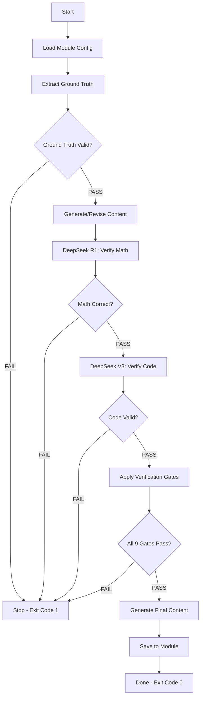

# Create-Module Skill

## Overview

The `/create-module` skill transforms MODULE content from general OpenFOAM usage to custom CFD engine implementation for R410A refrigerant evaporator simulation.

**Purpose**: Module revision with implementation focus

## Usage

```bash
/create-module [module_id] [options]
```

**Examples:**
```bash
/create-module MODULE_01                          # Revise entire MODULE_01
/create-module MODULE_01 --day 11                 # Focus on Day 11 (Expansion Term)
/create-module MODULE_01 --section governing      # Focus on governing equations
/create-module MODULE_01 --verify-only            # Skip generation, verify only
```

## Workflow



## Model Assignment

| Stage | Primary Model | Purpose |
|-------|---------------|---------|
| Ground Truth | `extract_facts.py` | Extract from OpenFOAM source |
| Math Derivations | DeepSeek R1 | Verify expansion term, TVD conditions |
| Code Implementation | DeepSeek Chat V3 | Verify C++ syntax and practices |
| Content Generation | GLM-4.7 | Generate draft content |
| Final Verification | DeepSeek R1 + V3 | Double-check all claims |

## New Verification Gates

### Gates 1-6: Existing (from walkthrough skill)
- File structure, ground truth, equations, code, implementation, coherence

### Gate 7: Two-Phase Physics Verification
- Void fraction bounded [0,1]
- Density ratio handled correctly (ρ_v/ρ_l ≈ 1/30 for R410A)
- Surface tension included
- Interface compression present

### Gate 8: Expansion Term Verification
- Derivation mathematically sound
- Sign convention correct (ṁ positive for evaporation)
- Implemented in pressure equation
- Density ratio terms correct

### Gate 9: Property Integration Verification
- CoolProp API correct
- R410A properties accurate
- Table interpolation valid
- Temperature ranges appropriate

## Module Revision Strategy

### Phase 1: Create New Days (Priority)
1. **Day 11: Expansion Term** (CRITICAL)
   - Mathematical derivation
   - Implementation in pressure equation
   - Lee evaporation model

2. **Day 10: Two-Phase Flow**
   - VOF method theory
   - Void fraction and quality
   - Large density ratio handling

3. **Day 12: Refrigerant Properties**
   - CoolProp integration
   - R410A property tables
   - Temperature-dependent properties

### Phase 2: Revise Existing Days

| Day | Current Focus | New Focus | Key Changes |
|-----|--------------|-----------|-------------|
| 01 | General N-S | R410A evaporator N-S | Add source terms |
| 02 | Cartesian FVM | Cylindrical FVM | Radial/axial discretization |
| 03 | Generic schemes | Tube-specific schemes | Near-wall treatment |
| 04 | Time stepping | VOF-stable time stepping | CFL for two-phase |
| 05 | General mesh | Cylindrical O-grid | Tube mesh generation |
| 06 | Generic BCs | Evaporator BCs | Heat flux, saturation |
| 07 | Sparse matrices | LDU for cylindrical | Matrix optimization |
| 08 | Iterative solvers | Two-phase solvers | Convergence criteria |
| 09 | SIMPLE/PISO | PISO with expansion | Modified pressure eq |

## Output Locations

```
MODULE_01_CFD_FUNDAMENTALS/CONTENT/
├── 01_GOVERNING_EQUATIONS/       # Revised with expansion term
├── 02_FINITE_VOLUME_METHOD/      # Revised with cylindrical FVM
├── ...
├── 10_TWO_PHASE_FLOW/            # NEW
├── 11_PHASE_CHANGE_THEORY/       # NEW (Priority)
└── 12_REFRIGERANT_PROPERTIES/    # NEW
```

## Markers

- ⭐ = Verified from ground truth
- ⚠️ = Unverified (documentation source)
- ❌ = Incorrect/Don't
- 🔧 = Implementation focus (NEW)

## Examples

### Revise Entire Module

```bash
/create-module MODULE_01
```

### Focus on Critical Day 11

```bash
/create-module MODULE_01 --day 11 --priority
```

### Verify Only (No Generation)

```bash
/create-module MODULE_01 --verify-only
```

## Integration

This skill integrates with:

- `extract_facts.py` - Ground truth extraction
- `deepseek_content.py` - Model routing
- `verify_two_phase.py` - Two-phase physics verification
- `verify_expansion_term.py` - Expansion term verification
- `verify_properties.py` - CoolProp integration verification

## Troubleshooting

### "Gate 8 Failed: Expansion term incorrect"
- Verify mathematical derivation with DeepSeek R1
- Check sign convention (ṁ positive for evaporation)
- Ensure density ratio terms are correct

### "Gate 7 Failed: Two-phase physics error"
- Verify void fraction is bounded [0,1]
- Check density ratio handling
- Ensure surface tension is included

### "Ground truth extraction failed"
- Check OpenFOAM source path is correct
- Verify two-phase models exist in source tree
- Run extraction script directly to debug

## Success Metrics

### Quantitative
- 100% of content passes 9 verification gates
- 0% hallucination rate (verified by DeepSeek)
- 100% code examples tested
- All expansion term derivations verified

### Qualitative
- Implementation-ready content (not just usage)
- Modern C++ practices throughout
- Clear path from theory to custom solver
- Comprehensive testing framework
