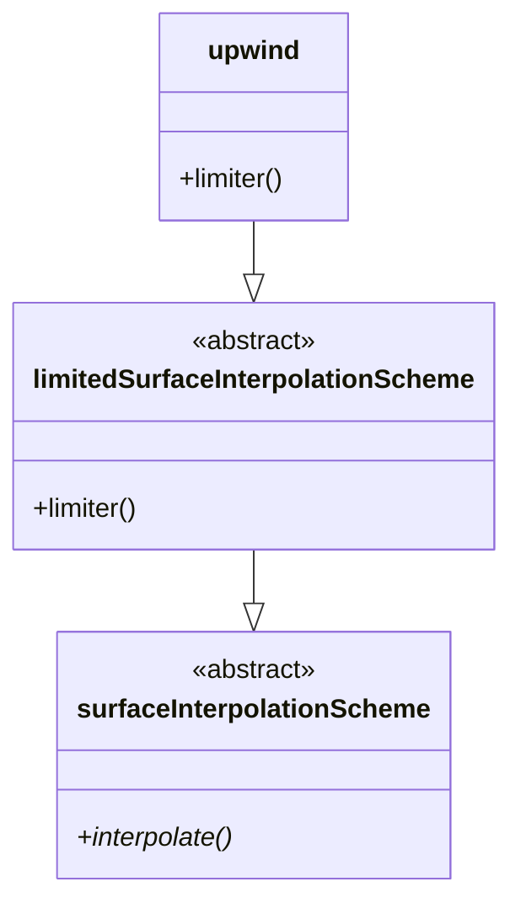
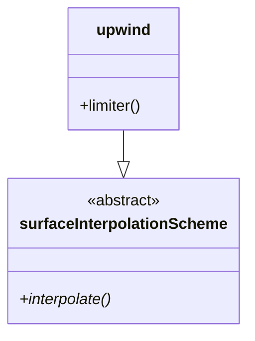

# Class Hierarchy Verification

## Purpose

Verify that AI-generated class hierarchies match the actual OpenFOAM source code.

## The Problem

AI models often hallucinate class hierarchies:

```
❌ Common Mistake: upwind : public surfaceInterpolationScheme
✅ Actual Reality: upwind : public limitedSurfaceInterpolationScheme : public surfaceInterpolationScheme
```

Missing intermediate classes → incorrect understanding → wrong code examples.

## Verification Process

### Step 1: Extract Actual Hierarchy

```bash
python3 .claude/scripts/extract_facts.py \
    --mode hierarchy \
    --path "openfoam_temp/src/finiteVolume/interpolation/surfaceInterpolation/limitedSchemes/upwind" \
    --output /tmp/upwind_hierarchy.txt
```

### Step 2: Find Claimed Hierarchy

Look for class hierarchy claims in AI content:
- Mermaid diagrams: `ClassA --> ClassB`
- Text descriptions: "ClassA inherits from ClassB"
- Code examples: `class ClassA : public ClassB`

### Step 3: Compare

| Claimed | Actual | Match? |
|---------|--------|--------|
| upwind → surfaceInterpolationScheme | upwind → limitedSurfaceInterpolationScheme → surfaceInterpolationScheme | ❌ |
| vanLeer → limitedSurfaceInterpolationScheme | vanLeer → limitedSurfaceInterpolationScheme | ✅ |

### Step 4: Report

```markdown
## Class Hierarchy Verification

### ✅ Verified
- vanLeer → limitedSurfaceInterpolationScheme → surfaceInterpolationScheme

### ❌ Incorrect
- upwind → surfaceInterpolationScheme (missing intermediate class)

**Correction:**
```
upwind --> limitedSurfaceInterpolationScheme --> surfaceInterpolationScheme
```
```

## Common Patterns

### Pattern 1: Template Classes

**Source:**
```cpp
template<class Type>
class limitedSurfaceInterpolationScheme
 : public surfaceInterpolationScheme<Type>
```

**Correct representation:**
```
limitedSurfaceInterpolationScheme<Type> --> surfaceInterpolationScheme<Type>
```

### Pattern 2: Multiple Inheritance

**Source:**
```cpp
class fvMesh
 : public polyMesh,
   public lduAddressing,
   public fvBoundaryMesh
```

**Correct representation:**
```
          polyMesh     lduAddressing
                 \         /
                  fvMesh
                 /
      fvBoundaryMesh
```

### Pattern 3: Virtual Inheritance

**Source:**
```cpp
class TypeName
 : public virtual word
```

**Correct representation:**
```
TypeName --> word (virtual)
```

## Automated Verification

Use `verify_class_hierarchy.py`:

```bash
python3 .claude/scripts/verify_class_hierarchy.py \
    --content file.md \
    --ground-truth /tmp/verified_facts.json \
    --output verification_report.md
```

## Mermaid Diagram Guidelines

### ✅ Correct



### ❌ Incorrect (missing intermediate class)



## When to Verify

Verify class hierarchy when:
- Generating new content with `/create-day`
- Creating walkthroughs with `/walkthrough`
- Reviewing existing content
- Updating documentation after OpenFOAM version changes

## Tips

1. **Always extract from headers** - .H files have the truth
2. **Follow the full chain** - Don't skip intermediate classes
3. **Note template parameters** - They matter for C++
4. **Mark abstract classes** - Use `<<abstract>>` stereotype
5. **Show virtual methods** - Mark with `*`

---

**Related Skills:** `source-first`, `verify-formulas`
