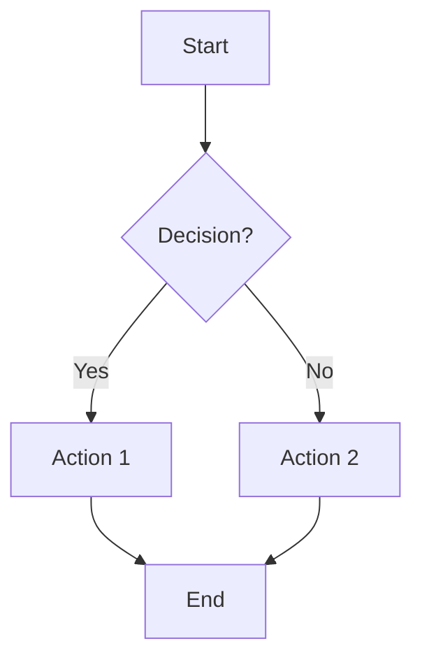
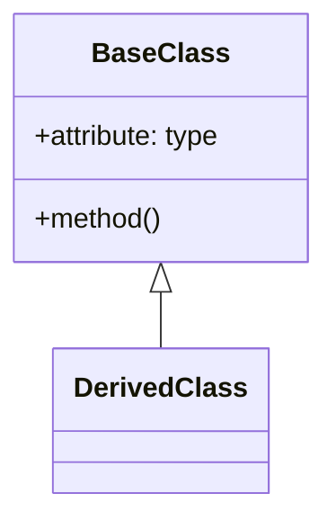
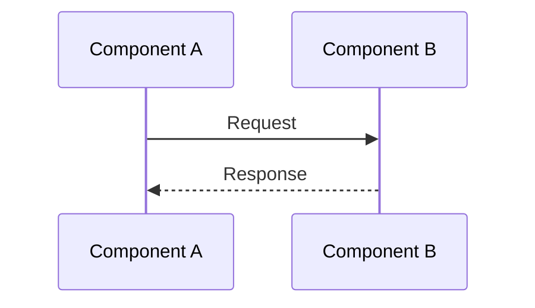
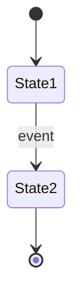
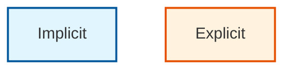
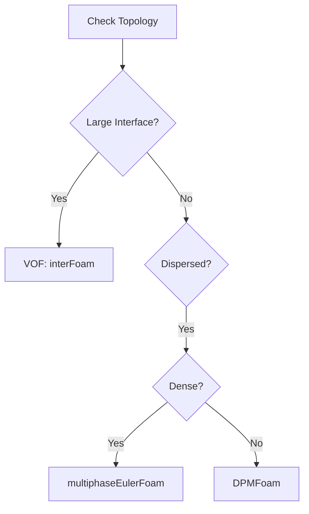
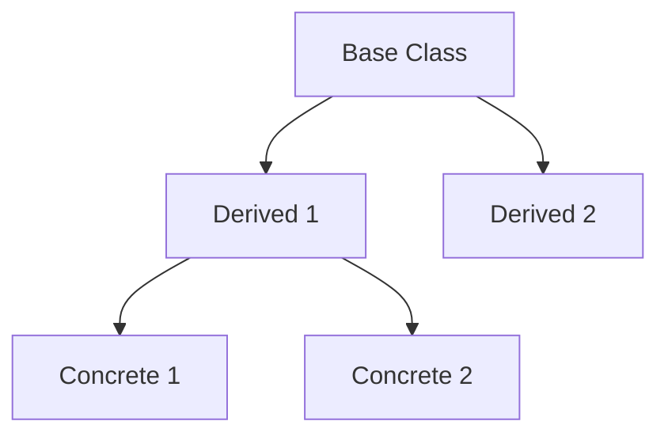
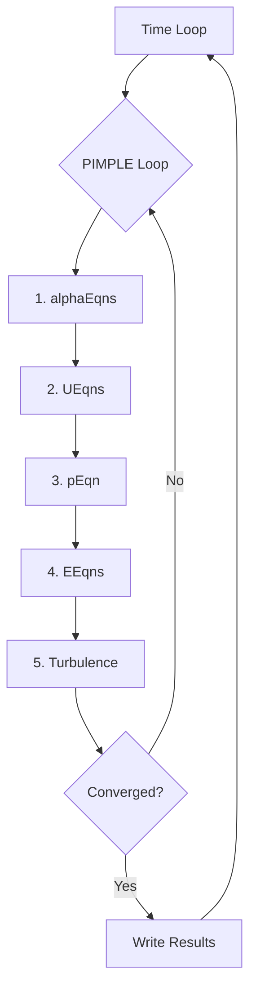
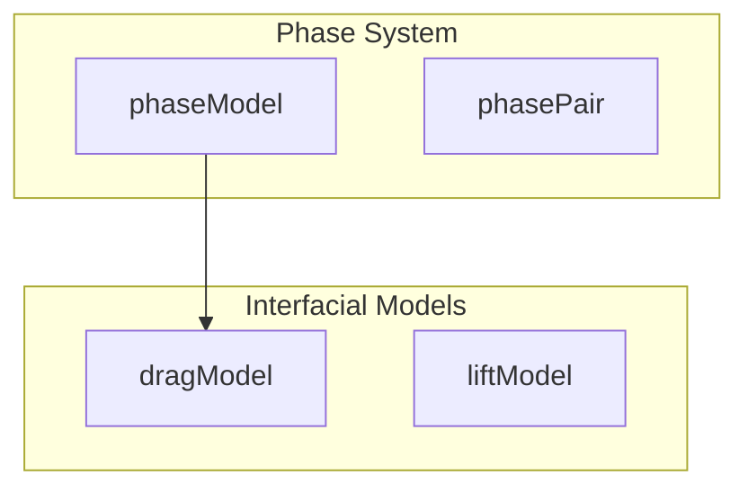

# Mermaid Diagram Generator

This skill provides guidance for creating effective Mermaid diagrams in documentation.

## Diagram Types

### Flowchart (Most Common)

For workflows, decision trees, algorithm steps:

### Class Diagram

For class hierarchies, inheritance:

### Sequence Diagram

For interactions, message passing:

### State Diagram

For state machines, transitions:

## Best Practices

### Naming Conventions

- Use descriptive node IDs: `phaseSystem` not `A`
- Keep labels concise but clear
- Use PascalCase for classes, camelCase for variables

### Styling

Use classDef for visual differentiation:

### Common Patterns

#### Solver Selection Flowchart

#### Class Hierarchy

#### PIMPLE Loop Structure

## Syntax Notes

### Avoid Common Errors

1. **Quote labels with special characters**:
   - ✅ `A["Label (with parens)"]`
   - ❌ `A[Label (with parens)]`

2. **Escape HTML in labels**:
   - Use `\n` for newlines, not ` `
   - Avoid HTML tags in labels

3. **Direction options**:
   - `TD` = Top to Down
   - `LR` = Left to Right
   - `BT` = Bottom to Top
   - `RL` = Right to Left

### Sub-graphs

Group related nodes:

## When to Use Diagrams

| Content Type | Diagram Type |
|--------------|--------------|
| Algorithm flow | Flowchart TD |
| Class hierarchy | Flowchart or classDiagram |
| Solver comparison | Flowchart with subgraphs |
| State transitions | stateDiagram |
| Communication | sequenceDiagram |
| Data flow | Flowchart LR |

## Integration with Content

Always include:
1. Caption/explanation above or below diagram
2. Reference in surrounding text
3. Key legend if using custom styles
