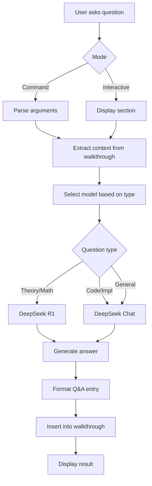

# QA Skill

## Overview

The `qa` skill enables active learning by capturing questions during walkthrough reading and recording AI-generated answers directly in the walkthrough document.

**Purpose**: Interactive Q&A + Personal knowledge base

## Usage

# QA Skill

## Overview

The `/qa` skill enables active learning by capturing questions during walkthrough reading and recording AI-generated answers directly in the walkthrough document.

**Purpose**: Interactive Q&A + Personal knowledge base

## Usage

```bash
# Ask a question about a specific day/section
/qa --day 1 --section theory "Why does RTT use control volume approach?"

# Specify question type
/qa --day 2 --type deeper-dive "Explain the upwind scheme derivation"

# Pipe question from stdin
echo "How does tmp<> work?" | /qa --day 1 --section code

# Interactive walkthrough mode
/interactive --day 1
```

## Workflow



## Model Assignment

| Question Type | Section | Model | Why |
|---------------|---------|-------|-----|
| clarification | theory | DeepSeek R1 | Theoretical explanations |
| deeper-dive | theory | DeepSeek R1 | Math derivations |
| implementation | code | DeepSeek Chat | Code examples |
| debugging | code | DeepSeek Chat | Troubleshooting |
| general | any | DeepSeek Chat | Default |

## Question Types

| Type | Purpose | Example |
|------|---------|---------|
| `clarification` | Explain unclear concepts | "What does $\nabla \cdot \mathbf{U}$ mean?" |
| `deeper-dive` | Explore beyond content | "Why is Gauss theorem used here?" |
| `implementation` | Practical coding questions | "How do I implement this in OpenFOAM?" |
| `debugging` | Troubleshooting help | "Why is my simulation diverging?" |
| `connection` | Link to other topics | "How does this relate to boundary conditions?" |

## Auto-Tagged Topics

Questions are automatically tagged for organization:

- `RTT` - Reynolds Transport Theorem
- `control-volume` - Control volume analysis
- `FVM` - Finite Volume Method
- `discretization` - Discretization schemes
- `boundary` - Boundary conditions
- `turbulence` - Turbulence modeling
- `mesh` - Mesh/grid topics
- `gradient` - Gradient operators
- `time-derivative` - Time derivatives (ddt)
- `conservation` - Conservation laws
- `gauss` - Gauss/divergence theorem
- `openfoam` - OpenFOAM-specific
- `matrix` - Matrix solvers, fvMatrix

## Output Location

Q&A entries are appended to:

```
daily_learning/walkthroughs/day_XX_walkthrough.md
```

In the `## Active Learning Q&A` section.

## Q&A Entry Format

```markdown
### 💬 Clarification Question
**Section:** Theory | **Asked:** 2026-01-28 21:30

**Question:**
Why does RTT use control volume approach?

**Answer:**
The RTT connects the system (Lagrangian) and control volume (Eulerian) viewpoints...
*(Answered by DeepSeek R1)*

**Tags:** `RTT` `control-volume` `turbulence` `conservation`

**Related Content:**
> Snippet from the walkthrough section...

---
```

## Interactive Mode Controls

When using `/interactive --day N`:

| Key | Action |
|-----|--------|
| `N` | Next section |
| `P` | Previous section |
| `Q` | Ask a question about current section |
| `J` | Jump to specific section |
| `S` | Show session summary |
| `H` | Help |
| `E` or Ctrl-D | Exit |

## Integration

This skill integrates with:

- `walkthrough_orchestrator.py` - Reads existing walkthroughs for context
- `DeepSeekMCPClient` - Model routing for DeepSeek R1/Chat
- MCP integration in `.claude/mcp/` - Direct API calls

## Context Extraction

The Q&A system extracts relevant context from the walkthrough:

1. **Section-based**: Matches question to theory/code/implementation sections
2. **Keyword search**: Finds relevant paragraphs in content
3. **Snippet inclusion**: Includes related content with each answer

## Troubleshooting

### "Walkthrough file not found"
- Generate walkthrough first: `/walkthrough --day N`
- Check file exists in `daily_learning/walkthroughs/`

### "No response from DeepSeek"
- Check API credentials are configured
- Verify MCP server is running
- Check network connection to DeepSeek API

### "Empty Q&A section"
- First question creates the section automatically
- Subsequent questions append properly

### "Wrong tags assigned"
- Tags are keyword-based; edit manually if needed
- Common topics: FVM, discretization, boundary, turbulence

## Example Usage

```bash
# 1. Generate walkthrough first
/walkthrough 1

# 2. Read and ask questions interactively
/interactive --day 1

# Navigation:
>>> N                    # Next section
>>> N                    # Next section
>>> Q                    # Ask a question

Your question: Why is Gauss theorem used in FVM?

Select type [1-5, default=1]: 2

Generating answer...
[Answer displayed...]

Save this Q&A? [Y/n]: Y
✅ Q&A saved!

>>> E                    # Exit when done
```

## Success Criteria

- ✅ Questions captured with context
- ✅ Routed to appropriate specialist model
- ✅ Auto-tagged by topic
- ✅ Appended to walkthrough document
- ✅ Timestamped and organized
- ✅ Interactive mode for real-time learning
- ✅ Command mode for on-demand questions
