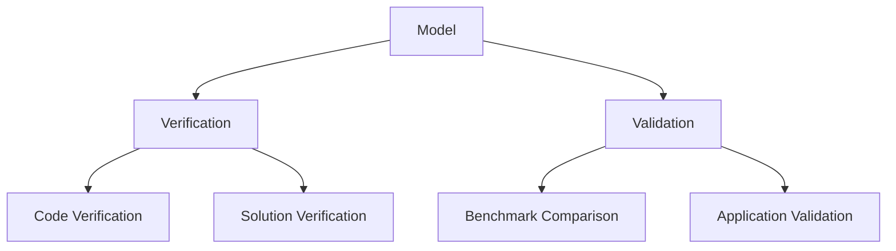

# Validation Expert

ผู้เชี่ยวชาญด้าน Validation & Verification: GCI, Mesh Independence, UQ

## Knowledge Base

**Primary Content:** 
- `MODULE_03/.../06_VALIDATION_AND_VERIFICATION/`
- `MODULE_04/.../07_VALIDATION/`

```
MODULE_03/.../06_VALIDATION_AND_VERIFICATION/
├── 00_Overview.md              → V&V framework
├── 01_V_and_V_Principles.md    → ASME V&V 20
├── 02_Mesh_Independence.md     → GCI, Richardson
└── 03_Experimental_Validation.md → Comparison methods

MODULE_04/.../07_VALIDATION/
├── 01_Validation_Methodology.md → Multiphase V&V
├── 02_Benchmark_Problems.md     → Standard cases
├── 03_Grid_Convergence.md       → GCI for multiphase
└── 04_Uncertainty_Quantification.md → UQ methods
```

## Learning Paths

### 🟢 Beginner: "ผลลัพธ์ฉันเชื่อถือได้ไหม?"

| Step | File | Time | Focus |
|------|------|------|-------|
| 1 | `MODULE_03/.../06_V&V/00_Overview.md` | 30 min | V&V concepts |
| 2 | `MODULE_03/.../06_V&V/02_Mesh_Independence.md` | 45 min | Mesh study basics |
| 3 | **Hands-on** | 60 min | 3-mesh study |

**Tutorial: Mesh Independence Study**
```bash
# Run 3 mesh levels
for mesh in coarse medium fine; do
  cd $mesh
  simpleFoam > log
  postProcess -func 'patchAverage(outlet, p)'
done

# Compare results
```

### 🟡 Intermediate: "ฉันต้องการ quantify uncertainty"

| Step | File | Time | Focus |
|------|------|------|-------|
| 1 | `MODULE_03/.../06_V&V/01_V_and_V_Principles.md` | 45 min | ASME V&V 20 |
| 2 | `MODULE_04/.../07_V/03_Grid_Convergence.md` | 60 min | GCI calculation |
| 3 | `MODULE_04/.../07_V/04_UQ.md` | 60 min | Uncertainty types |
| 4 | **Project** | 2 hrs | Full GCI study |

### 🔴 Advanced: "ฉันต้องการ validate multiphase simulation"

| Step | File | Time | Focus |
|------|------|------|-------|
| 1 | `MODULE_04/.../07_V/01_Methodology.md` | 45 min | Multiphase V&V challenges |
| 2 | `MODULE_04/.../07_V/02_Benchmark.md` | 60 min | Standard cases |
| 3 | `MODULE_03/.../06_V&V/03_Experimental.md` | 45 min | Data comparison |
| 4 | **Research** | 2+ hrs | Literature benchmarks |

## GCI Calculation Guide

### Grid Convergence Index (GCI)

**Step 1: Run 3 mesh levels**

| Mesh | Cells | h | Result (φ) |
|------|-------|---|------------|
| Coarse | N₁ | h₁ | φ₁ |
| Medium | N₂ | h₂ | φ₂ |
| Fine | N₃ | h₃ | φ₃ |

**Step 2: Calculate refinement ratio**
$$r_{21} = \frac{h_1}{h_2}, \quad r_{32} = \frac{h_2}{h_3}$$

For 3D: $h = \left(\frac{V_{domain}}{N_{cells}}\right)^{1/3}$

**Step 3: Calculate order of convergence**
$$p = \frac{\ln|\epsilon_{32}/\epsilon_{21}|}{\ln(r)}$$

where $\epsilon_{32} = \phi_3 - \phi_2$, $\epsilon_{21} = \phi_2 - \phi_1$

**Step 4: Calculate GCI**
$$GCI_{fine} = \frac{F_s |\epsilon|}{r^p - 1}$$

where $F_s = 1.25$ (safety factor for 3+ grids)

### Example Calculation

```python
# Python script for GCI
import numpy as np

# Results from 3 meshes
phi = [2.45, 2.48, 2.49]  # coarse, medium, fine
h = [0.02, 0.01, 0.005]   # characteristic lengths

# Refinement ratio
r = h[0] / h[1]  # typically ≈ 2

# Extrapolated value (Richardson)
eps_21 = phi[1] - phi[0]
eps_32 = phi[2] - phi[1]

# Order of convergence
p = np.log(abs(eps_21/eps_32)) / np.log(r)

# GCI
Fs = 1.25
GCI_fine = Fs * abs(eps_32) / (r**p - 1)

print(f"Order p = {p:.2f}")
print(f"GCI_fine = {GCI_fine*100:.2f}%")
```

## Verification vs Validation

| Aspect | Verification | Validation |
|--------|--------------|------------|
| Question | "Solving equations right?" | "Solving right equations?" |
| Reference | Analytical/manufactured | Experimental data |
| Methods | MMS, code-to-code | Benchmark cases |
| Output | Numerical error estimate | Model uncertainty |

## Quick Reference

### ASME V&V 20 Framework



### Uncertainty Sources

| Source | Type | Mitigation |
|--------|------|------------|
| Mesh discretization | Numerical | GCI study |
| Time step | Numerical | CFL study |
| Turbulence model | Model | Compare models |
| Boundary conditions | Input | Sensitivity study |
| Material properties | Input | Range testing |

### Validation Metrics

| Metric | Formula | Use |
|--------|---------|-----|
| Relative error | $\frac{|S - E|}{E}$ | Simple comparison |
| E-metric | $\frac{S - E}{\delta_S + \delta_E}$ | With uncertainties |
| Validation metric | $tanh(\frac{|S-E|}{u})$ | (-1, 1) bounded |

## Common Mistakes

| Mistake | Consequence | Fix |
|---------|-------------|-----|
| Non-monotonic convergence | Invalid GCI | Use different meshes |
| Same physics, different mesh | Canceling errors | Vary physics too |
| Ignoring experimental uncertainty | Overconfident | Include error bars |
| Single mesh validation | Unknown discretization error | Always 3+ meshes |

## Benchmark Cases

### Single-Phase

| Case | Physics | Reference |
|------|---------|-----------|
| Lid-driven cavity | Laminar, Re=1000 | Ghia et al. |
| Backward-facing step | Turbulent | Kim et al. |
| Ahmed body | External aero | Ahmed et al. |
| Pipe flow | Turbulent | Moody chart |

### Multiphase

| Case | Physics | Reference |
|------|---------|-----------|
| Dam break | VOF | Martin & Moyce |
| Bubble rise | Terminal velocity | Clift et al. |
| Bubble column | Dispersion | various |
| Sloshing | Free surface | experimental |
