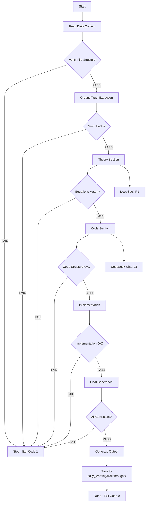

# Walkthrough Skill

## Overview

The `/walkthrough` skill provides interactive, step-by-step tutoring for daily_learning content with strict Source-First verification.

**Purpose**: Interactive tutoring + Content QA

## Usage

```bash
/walkthrough [day_number]
```

**Example:**
```bash
/walkthrough 04
```

## Workflow



## Model Assignment

| Stage | Primary Model | Backup |
|-------|---------------|--------|
| Ground Truth | `extract_facts.py` | N/A |
| Theory/Math | DeepSeek R1 | GLM-4.7 |
| Code Structure | DeepSeek Chat V3 | DeepSeek R1 |
| Final Synthesis | GLM-4.7 | DeepSeek Chat V3 |

## Output Location

```
daily_learning/walkthroughs/day_XX_walkthrough.md
```

## Verification Gates

### Gate 1: File Structure
- Input file exists
- Has valid sections (Theory, Code, Implementation)

### Gate 2: Ground Truth Extraction
- Minimum 5 facts extracted from source code
- Valid JSON output

### Gate 3: Theory Equations
- Equations match ground truth
- LaTeX syntax valid

### Gate 4: Code Structure
- Code structure aligns with ground truth
- No hallucinated classes/methods

### Gate 5: Implementation
- Implementation consistent with theory
- All references verified

### Gate 6: Final Coherence
- Overall consistency check
- All ⭐ markers present

**STRICT:** Workflow STOPS on ANY failure with non-zero exit code.

## Markers

- ⭐ = Verified from ground truth
- ⚠️ = Unverified (documentation source)
- ❌ = Incorrect/Don't

## Troubleshooting

### "Gate 1 Failed: Invalid file structure"
- Ensure input file exists in `daily_learning/Phase_01_Foundation_Theory/`
- Check file has proper H2 section headers

### "Gate 2 Failed: Insufficient ground truth"
- Run `python3 .claude/scripts/extract_facts.py` directly to debug
- Check OpenFOAM source code is accessible

### "Gate 3 Failed: Equation mismatch"
- Compare LaTeX equations with ground truth
- Check for nested delimiters (`$$` inside `$`)

### "Gate 4 Failed: Code structure mismatch"
- Verify class hierarchy matches extracted facts
- Check for hallucinated references

## Integration

This skill integrates with:

- `extract_facts.py` - Ground truth extraction
- `deepseek_content.py` - Model routing for DeepSeek R1/Chat V3
- Verification scripts in `.claude/scripts/`

## Example Output

```markdown
# Day 04 Walkthrough
**Generated**: 2026-01-26 10:30:00
**Verification Status**: ✅ All 6 gates passed

## Ground Truth Extraction
⭐ 15 facts extracted from OpenFOAM source code

## Theory Section Walkthrough
⭐ The upwind class inherits through two levels...

## Code Section Analysis
⭐ Implementation matches source code at upwind.H:42...

## Implementation Guidance
Step-by-step guidance for hands-on exercises...

## Verification Summary
| Gate | Status | Details |
|------|--------|---------|
| 1 | PASS | File structure valid |
| 2 | PASS | 15 facts extracted |
| 3 | PASS | All equations verified |
| 4 | PASS | Code structure matches |
| 5 | PASS | Implementation consistent |
| 6 | PASS | Coherence check passed |
```
