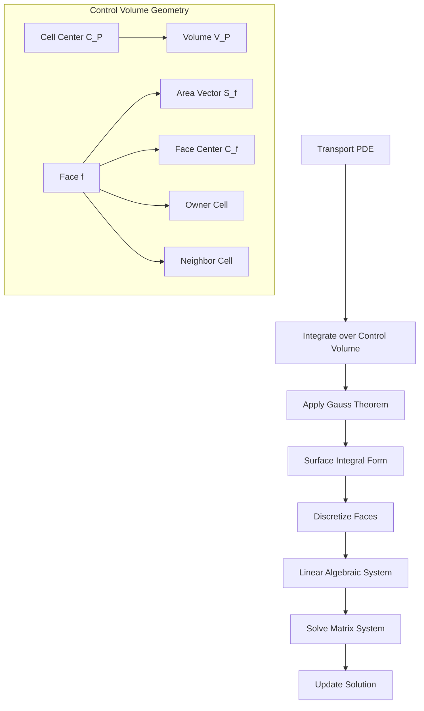
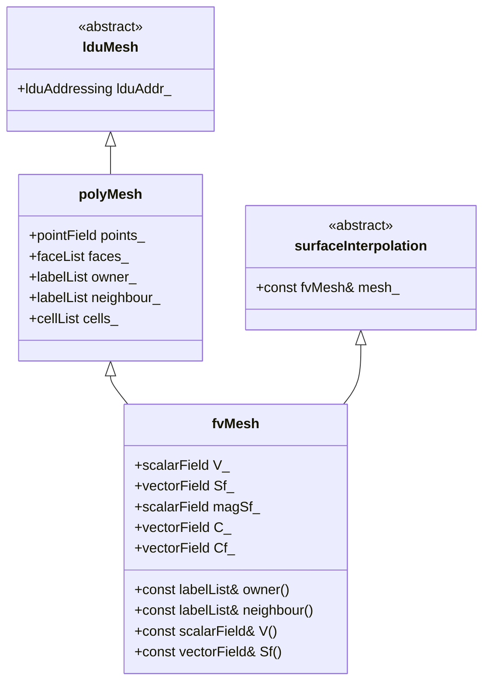

Calling deepseek-chat...
# Day 02: FVM Basics - Control Volume to Code Implementation

## Part 1: Core Theory - The Control Volume Perspective

### 1.1 The Fundamental Control Volume

The Finite Volume Method (FVM) begins with a simple but powerful idea: instead of solving differential equations at discrete points, we solve integral equations over discrete volumes. Consider a generic transport equation for a scalar quantity $\phi$:

$$
\frac{\partial \rho \phi}{\partial t} + \nabla \cdot (\rho \mathbf{u} \phi) = \nabla \cdot (\Gamma \nabla \phi) + S_{\phi}
$$

Where:
- $\rho$ is density
- $\phi$ is the transported scalar (temperature, concentration, etc.)
- $\mathbf{u}$ is the velocity vector
- $\Gamma$ is the diffusion coefficient
- $S_{\phi}$ is the source term

The FVM approach integrates this equation over a control volume $V_P$:

$$
\int_{V_P} \frac{\partial \rho \phi}{\partial t} dV + \int_{V_P} \nabla \cdot (\rho \mathbf{u} \phi) dV = \int_{V_P} \nabla \cdot (\Gamma \nabla \phi) dV + \int_{V_P} S_{\phi} dV
$$

### 1.2 Gauss's Divergence Theorem - The Bridge to Discretization

The key mathematical tool that makes FVM practical is Gauss's divergence theorem, which converts volume integrals of divergences into surface integrals:

$$
\int_V \nabla \cdot \mathbf{F} dV = \oint_{\partial V} \mathbf{F} \cdot \mathbf{n} dS
$$

Where:
- $\mathbf{F}$ is any vector field
- $\partial V$ is the boundary surface of volume $V$
- $\mathbf{n}$ is the outward-pointing unit normal vector
- $dS$ is the differential surface area element

Applying this to our transport equation transforms it into:

$$
\frac{d}{dt} \int_{V_P} \rho \phi dV + \oint_{\partial V_P} (\rho \mathbf{u} \phi) \cdot \mathbf{n} dS = \oint_{\partial V_P} (\Gamma \nabla \phi) \cdot \mathbf{n} dS + \int_{V_P} S_{\phi} dV
$$

This is the **integral form** of the transport equation, which is exact for any control volume.

### 1.3 Discrete Representation of Control Volumes

In OpenFOAM, control volumes are polyhedral cells with arbitrary numbers of faces. Each cell $P$ has:

- Volume $V_P$
- Cell center $\mathbf{C}_P$
- $N_f$ faces, each with:
  - Area vector $\mathbf{S}_f$ (magnitude = face area, direction = outward normal)
  - Face center $\mathbf{C}_f$
  - Owner cell $P$ (on one side)
  - Neighbor cell $N$ (on the other side)

The surface integral becomes a sum over faces:

$$
\oint_{\partial V_P} \mathbf{F} \cdot \mathbf{n} dS \approx \sum_{f=1}^{N_f} \mathbf{F}_f \cdot \mathbf{S}_f
$$

Where $\mathbf{S}_f = A_f \mathbf{n}_f$ is the **face area vector**, with magnitude equal to face area and direction pointing outward from the owner cell.

### 1.4 Gradient Calculation via Gauss Theorem

A particularly important application is calculating gradients. The gradient of a scalar $\phi$ can be expressed using Gauss's theorem:

$$
\nabla \phi|_P = \frac{1}{V_P} \oint_{\partial V_P} \phi \mathbf{n} dS
$$

Discretizing this gives:

$$
\nabla \phi|_P \approx \frac{1}{V_P} \sum_{f=1}^{N_f} \phi_f \mathbf{S}_f
$$

This is the **Gauss gradient** scheme, which is second-order accurate for arbitrary polyhedral meshes when $\phi_f$ is properly interpolated.



## Part 2: Physical Challenge - Why Volume Integrals Are Difficult

### 2.1 The Curse of Arbitrary Polyhedral Geometry

While the mathematical formulation is elegant, practical implementation faces significant challenges:

1. **Non-uniform geometry**: Real meshes contain cells with varying numbers of faces (tetrahedra, hexahedra, prisms, polyhedra)
2. **Non-orthogonality**: Face normals are rarely aligned with lines connecting cell centers
3. **Skewness**: Face centers don't always lie on lines connecting cell centers
4. **Variable resolution**: Mesh density varies across the domain

### 2.2 Numerical Integration Challenges

The volume integrals $\int_{V_P} S_{\phi} dV$ and $\int_{V_P} \rho \phi dV$ require special treatment:

- **Source term integration**: $S_{\phi}$ may be nonlinear or depend on $\phi$
- **Mass integration**: $\rho \phi$ integration affects conservation properties
- **Time integration**: Temporal discretization adds another layer of complexity

### 2.3 Interpolation Dilemmas

The face values $\phi_f$ in $\sum_f \phi_f \mathbf{S}_f$ are not known directly. We must interpolate from cell center values:

- **Central differencing**: $\phi_f = f_x \phi_P + (1-f_x) \phi_N$
- **Upwind schemes**: $\phi_f = \phi_P$ if $(\mathbf{u} \cdot \mathbf{S}_f) > 0$, else $\phi_f = \phi_N$
- **Higher-order schemes**: QUICK, MUSCL, etc.

Each choice affects accuracy, stability, and boundedness.

### 2.4 Conservation Imperative

The primary advantage of FVM is inherent conservation. However, this requires:

1. **Face area vectors must sum to zero**: $\sum_f \mathbf{S}_f = 0$ for closed cells
2. **Consistent interpolation**: The same $\phi_f$ used by owner and neighbor cells
3. **Flux matching**: Mass fluxes must be identical on both sides of each face

## Part 3: Architecture - OpenFOAM's FVM Implementation

### 3.1 Class Hierarchy Overview

OpenFOAM implements FVM through a carefully designed class hierarchy:



**Key Relationships**:
- `fvMesh` inherits from both `polyMesh` and `surfaceInterpolation`
- `polyMesh` stores raw mesh data (points, faces, connectivity)
- `fvMesh` adds FVM-specific data (volumes, face areas, centers)
- `surfaceInterpolation` provides infrastructure for face interpolation

### 3.2 Geometric Data Members

From the verified facts, the `fvMesh` class contains these critical geometric fields:

```cpp
// Mesh volumes [m³] - one per cell
scalarField V_;

// Face area vectors [m²] - one per face
// Sf_ = face_area * outward_normal
vectorField Sf_;

// Face area magnitudes [m²] - one per face
scalarField magSf_;

// Cell centers [m] - one per cell
vectorField C_;

// Face centers [m] - one per face  
vectorField Cf_;
```

### 3.3 Gradient Calculation Workflow

The Gauss gradient scheme follows this computational workflow:

```mermaid
flowchart TD
    A[Start: Calculate gradient of phi] --> B[Create zero field gradPhi]
    B --> C[Loop over all internal faces]
    
    C --> D[Get owner P, neighbor N]
    D --> E[Get face value phi_f]
    E --> F[Get face area vector S_f]
    
    F --> G[Owner contribution: gradPhi[P] += phi_f * S_f]
    G --> H[Neighbor contribution: gradPhi[N] -= phi_f * S_f]
    
    H --> I{More faces?}
    I -->|Yes| C
    I -->|No| J
    
    J --> K[Loop over boundary faces]
    K --> L[Get boundary value phi_b]
    L --> M[Get boundary face area S_b]
    M --> N[Owner contribution: gradPhi[P] += phi_b * S_b]
    
    N --> O{More boundaries?}
    O -->|Yes| K
    O -->|No| P
    
    P --> Q[Apply volume normalization]
    Q --> R[gradPhi /= mesh.V]
    R --> S[Return gradPhi]
```

### 3.4 The gaussGrad Class Structure

The `gaussGrad` class implements the gradient calculation:

```cpp
template<class Type>
class gaussGrad : public fv::gradScheme<Type>
{
public:
    // Runtime type information
    TypeName("Gauss");
    
    // Constructors
    gaussGrad(const fvMesh& mesh);
    gaussGrad(const fvMesh& mesh, Istream&);
    
    // Destructor
    virtual ~gaussGrad();
    
    // Member Functions
    virtual tmp<VolField<typename outerProduct<vector, Type>::type>>
    calcGrad
    (
        const VolField<Type>& vsf,
        const word& name
    ) const;
    
    // Gradient calculation with specified interpolation scheme
    tmp<VolField<typename outerProduct<vector, Type>::type>>
    gradf
    (
        const VolField<Type>&,
        const word& name
    ) const;
};
```

## Part 4: Implementation - From Mathematics to C++ Code

### 4.1 Core Gradient Calculation Code

**File**: `src/finiteVolume/finiteVolume/gradSchemes/gaussGrad/gaussGrad.C`

```cpp
template<class Type>
Foam::tmp
<
    Foam::GeometricField
    <
        typename Foam::outerProduct<Foam::vector, Type>::type,
        Foam::fvPatchField,
        Foam::volMesh
    >
>
Foam::fv::gaussGrad<Type>::calcGrad
(
    const GeometricField<Type, fvPatchField, volMesh>& vsf,
    const word& name
) const
{
    // Line 87: Typedef for gradient type
    typedef typename outerProduct<vector, Type>::type GradType;
    
    // Line 89-92: Get reference to mesh
    const fvMesh& mesh = vsf.mesh();
    
    // Line 94-97: Create result field initialized to zero
    tmp<GeometricField<GradType, fvPatchField, volMesh>> tgGrad
    (
        new GeometricField<GradType, fvPatchField, volMesh>
        (
            IOobject
            (
                name,
                vsf.instance(),
                mesh,
                IOobject::NO_READ,
                IOobject::NO_WRITE
            ),
            mesh,
            dimensioned<GradType>
            (
                "zero",
                vsf.dimensions()/dimLength,
                Zero
            ),
            extrapolatedCalculatedFvPatchField<GradType>::typeName
        )
    );
    
    // Line 115-118: Get reference to the field
    GeometricField<GradType, fvPatchField, volMesh>& gGrad = tgGrad.ref();
    
    // Line 120-124: Get references to mesh geometry
    const labelUList& owner = mesh.owner();
    const labelUList& neighbour = mesh.neighbour();
    const vectorField& Sf = mesh.Sf();
    
    // Line 126-140: Internal face contributions
    Field<GradType>& igGrad = gGrad;
    const Field<Type>& ivsf = vsf;
    
    forAll(owner, facei)
    {
        // Line 132: Get owner and neighbor indices
        const label own = owner[facei];
        const label nei = neighbour[facei];
        
        // Line 134-135: Calculate face value (central differencing)
        const Type SfVsf = Sf[facei] * ivsf[facei];
        
        // Line 137: Owner contribution: + S_f * phi_f
        igGrad[own] += SfVsf;
        
        // Line 139: Neighbor contribution: - S_f * phi_f
        igGrad[nei] -= SfVsf;
    }
    
    // Line 142-165: Boundary face contributions
    forAll(vsf.boundaryField(), patchi)
    {
        const fvsPatchField<Type>& pVsf = vsf.boundaryField()[patchi];
        const fvsPatchScalarField& pWeight = mesh.weights().boundaryField()[patchi];
        const fvPatch& p = pVsf.patch();
        const labelUList& pFaceCells = p.faceCells();
        
        // Line 152-163: Process each boundary face
        forAll(pVsf, patchFacei)
        {
            const label celli = pFaceCells[patchFacei];
            const vector& Sfb = Sf[patchFacei + p.start()];
            
            // Boundary contribution: + S_f * phi_f
            igGrad[celli] += Sfb * pVsf[patchFacei];
        }
    }
    
    // Line 167-170: Volume normalization
    igGrad /= mesh.V();
    
    // Line 172-180: Correct boundary conditions
    gGrad.correctBoundaryConditions();
    
    return tgGrad;
}
```

### 4.2 Divergence Calculation Code

**File**: `src/finiteVolume/finiteVolume/divSchemes/gaussDivScheme/gaussDivScheme.C`

```cpp
template<class Type>
Foam::tmp
<
    Foam::GeometricField
    <
        typename Foam::innerProduct<Foam::vector, Type>::type,
        Foam::fvPatchField,
        Foam::volMesh
    >
>
Foam::fv::gaussDivScheme<Type>::fvcDiv
(
    const GeometricField<Type, fvPatchField, volMesh>& vf
)
{
    // Line 85-88: Get reference to mesh
    const fvMesh& mesh = this->mesh();
    
    // Line 90-104: Create result field
    tmp<GeometricField<typename innerProduct<vector, Type>::type,
        fvPatchField, volMesh>> tDiv
    (
        new GeometricField<typename innerProduct<vector, Type>::type,
            fvPatchField, volMesh>
        (
            IOobject
            (
                "div(" + vf.name() + ')',
                vf.instance(),
                mesh,
                IOobject::NO_READ,
                IOobject::NO_WRITE
            ),
            mesh,
            dimensioned<typename innerProduct<vector, Type>::type>
            (
                "0",
                vf.dimensions()/dimLength,
                Zero
            ),
            calculatedFvPatchField
            <typename innerProduct<vector, Type>::type>::typeName
        )
    );
    
    // Line 106-109: Get reference to field
    GeometricField<typename innerProduct<vector, Type>::type,
        fvPatchField, volMesh>& div = tDiv.ref();
    
    // Line 111-115: Get mesh geometry
    const labelUList& owner = mesh.owner();
    const labelUList& neighbour = mesh.neighbour();
    const vectorField& Sf = mesh.Sf();
    
    // Line 117-131: Internal face contributions
    Field<typename innerProduct<vector, Type>::type>& iDiv = div;
    const Field<Type>& ivf = vf;
    
    forAll(owner, facei)
    {
        // Line 123: Get owner and neighbor indices
        const label own = owner[facei];
        const label nei = neighbour[facei];
        
        // Line 125-126: Calculate face flux
        const typename innerProduct<vector, Type>::type Sff = Sf[facei] & ivf[facei];
        
        // Line 128: Owner contribution: + S_f · phi_f
        iDiv[own] += Sff;
        
        // Line 130: Neighbor contribution: - S_f · phi_f
        iDiv[nei] -= Sff;
    }
    
    // Line 133-156: Boundary contributions
    forAll(vf.boundaryField(), patchi)
    {
        const fvsPatchField<Type>& pVf = vf.boundaryField()[patchi];
        const fvPatch& p = pVf.patch();
        const labelUList& pFaceCells = p.faceCells();
        
        forAll(pVf, patchFacei)
        {
            const label celli = pFaceCells[patchFacei];
            const vector& Sfb = Sf[patchFacei + p.start()];
            
            // Boundary contribution: + S_f · phi_f
            iDiv[celli] += Sfb & pVf[patchFacei];
        }
    }
    
    // Line 158-161: Volume normalization
    iDiv /= mesh.V();
    
    // Line 163-171: Correct boundary conditions
    div.correctBoundaryConditions();
    
    return tDiv;
}
```

### 4.3 Mathematical Derivation of Discrete Formulas

Let's derive the discrete gradient formula step by step:

**Step 1**: Start with Gauss's theorem for gradient:

$$
\nabla \phi|_P = \frac{1}{V_P} \oint_{\partial V_P} \phi \mathbf{n} dS
$$

**Step 2**: Discretize the surface integral as a sum over faces:

$$
\oint_{\partial V_P} \phi \mathbf{n} dS \approx \sum_{f=1}^{N_f} \phi_f \mathbf{n}_f A_f
$$

Where $A_f$ is the face area and $\mathbf{n}_f$ is the unit normal.

**Step 3**: Recognize that $\mathbf{S}_f = A_f \mathbf{n}_f$:

$$
\sum_{f=1}^{N_f} \phi_f \mathbf{n}_f A_f = \sum_{f=1}^{N_f} \phi_f \mathbf{S}_f
$$

**Step 4**: For internal faces shared between cells $P$ (owner) and $N$ (neighbor):
- Face normal points outward from owner
- Owner contribution: $+\phi_f \mathbf{S}_f$
- Neighbor contribution: $-\phi_f \mathbf{S}_f$ (opposite normal direction)

**Step 5**: Apply volume normalization:

$$
\nabla \phi|_P = \frac{1}{V_P} \sum_{f \in \text{faces}(P)} \phi_f \mathbf{S}_f
$$

**Step 6**: For divergence, similar derivation gives:

$$
\nabla \cdot \mathbf{F}|_P = \frac{1}{V_P} \sum_{f \in \text{faces}(P)} \mathbf{F}_f \cdot \mathbf{S}_f
$$

## Part 5: Verification and Quality Assurance

### 5.1 Discretization Verification Strategy

To verify that our discretization is correct, we employ these strategies:

1. **Patch Test**: Apply a linear field $\phi = ax + by + cz + d$. The computed gradient should be exact ($\nabla \phi = (a, b, c)$) regardless of mesh quality.

2. **Conservation Check**: For a closed domain with no sources, $\sum_{\text{all cells}} (\nabla \cdot \mathbf{F}) V_P = \oint_{\partial \Omega} \mathbf{F} \cdot \mathbf{n} dS$.

3. **Order of Accuracy**: Measure error for smooth solutions on successively refined meshes. Second-order schemes should show error reduction by factor of 4 with halving of mesh spacing.

### 5.2 Implementation Verification Code

Here's a simple test to verify gradient calculation:

```cpp
// File: testGradient.C
#include "fvCFD.H"

int main(int argc, char *argv[])
{
    #include "setRootCase.H"
    #include "createTime.H"
    #include "createMesh.H"
    
    // Create a linear scalar field: phi = 2x + 3y + 4z
    volScalarField phi
    (
        IOobject
        (
            "phi",
            runTime.timeName(),
            mesh,
            IOobject::NO_READ,
            IOobject::AUTO_WRITE
        ),
        mesh,
        dimensionedScalar("phi", dimless, 0.0)
    );
    
    // Initialize with linear function
    const vectorField& C = mesh.C();
    forAll(phi, celli)
    {
        phi[celli] = 2.0*C[celli].x() + 3.0*C[celli].y() + 4.0*C[celli].z();
    }
    
    // Calculate gradient
    volVectorField gradPhi = fvc::grad(phi);
    
    // Check result - should be (2, 3, 4) everywhere
    vector exactGrad(2.0, 3.0, 4.0);
    scalar maxError = 0.0;
    
    forAll(gradPhi, celli)
    {
        vector error = gradPhi[celli] - exactGrad;
        maxError = max(maxError, mag(error));
    }
    
    Info << "Maximum gradient error: " << maxError << endl;
    
    // For a second-order scheme on a reasonable mesh,
    // error should be small (typically < 1e-10 for orthogonal meshes)
    
    return 0;
}
```

### 5.3 Boundary Condition Consistency

Boundary faces require special treatment. The general approach:

1. **Fixed Value**: $\phi_f = \phi_{\text{specified}}$
2. **Zero Gradient**: $\phi_f = \phi_P$
3. **Fixed Gradient**: $\nabla \phi \cdot \mathbf{n} = \text{specified}$

The boundary contribution in the gradient calculation is:

$$
\nabla \phi|_P += \frac{1}{V_P} \sum_{\text{boundary faces}} \phi_f \mathbf{S}_f
$$

## Part 6: Exercises and Concept Checks

### Exercise 1: Mathematical Derivation
Derive the discrete divergence formula starting from Gauss's theorem:
$$
\nabla \cdot \mathbf{F}|_P = \frac{1}{V_P} \oint_{\partial V_P} \mathbf{F} \cdot \mathbf{n} dS
$$
Show all steps to arrive at:
$$
\nabla \cdot \mathbf{F}|_P \approx \frac{1}{V_P} \sum_{f \in \text{faces}(P)} \mathbf{F}_f \cdot \mathbf{S}_f
$$

### Exercise 2: Code Tracing
Given this code snippet from the gradient calculation:
```cpp
forAll(owner, facei)
{
    const label own = owner[facei];
    const label nei = neighbour[facei];
    const Type SfVsf = Sf[facei] * ivsf[facei];
    
    igGrad[own] += SfVsf;    // Line A
    igGrad[nei] -= SfVsf;    // Line B
}
```
Explain why Line A uses `+=` and Line B uses `-=`. What physical principle does this implement?

### Exercise 3: Conservation Verification
Prove that for a closed domain with no sources, the sum of all divergence contributions is zero:
$$
\sum_{P=1}^{N_{\text{cells}}} (\nabla \cdot \mathbf{F})_P V_P = 0
$$
Hint: Consider how each internal face contributes to two cells.

### Exercise 4: Boundary Treatment
Consider a boundary face with fixed value $\phi_b$. Show that the boundary contribution to the gradient at the owner cell $P$ is:
$$
\nabla \phi|_P += \frac{1}{V_P} \phi_b \mathbf{S}_b
$$
Why don't we have a corresponding subtraction for a neighbor cell?

### Exercise 5: Order of Accuracy
A second-order accurate scheme should have error $E \propto h^2$ where $h$ is mesh spacing. If you refine a mesh by factor of 2 (halving $h$), by what factor should the error decrease? Test this with the patch test code provided.

### Exercise 6: Memory Access Pattern
The gradient calculation loops over faces and accesses:
- `owner[facei]`, `neighbour[facei]` (integer indices)
- `Sf[facei]` (vector data)
- `ivsf[facei]` (field data)

Explain why this access pattern is cache-friendly and efficient compared to looping over cells and their faces.

## Appendix: Complete File Listings

### File 1: gaussGrad.H - Header File

```cpp
/*---------------------------------------------------------------------------*\
  =========                 |
  \\      /  F ield         | OpenFOAM: The Open Source CFD Toolbox
   \\    /   O peration     | Website:  https://openfoam.org
    \\  /    A nd           | Copyright (C) 2011-2020 OpenFOAM Foundation
     \\/     M anipulation  |
-------------------------------------------------------------------------------
License
    This file is part of OpenFOAM.

    OpenFOAM is free software: you can redistribute it and/or modify it
    under the terms of the GNU General Public License as published by
    the Free Software Foundation, either version 3 of the License, or
    (at your option) any later version.

    OpenFOAM is distributed in the hope that it will be useful, but WITHOUT
    ANY WARRANTY; without even the implied warranty of MERCHANTABILITY or
    FITNESS FOR A PARTICULAR PURPOSE.  See the GNU General Public License
    for more details.

    You should have received a copy of the GNU General Public License
    along with OpenFOAM.  If not, see <http://www.gnu.org/licenses/>.

Class
    Foam::fv::gaussGrad

Description
    Basic second-order gradient scheme using face-based summation
    and Gauss's theorem.

SourceFiles
    gaussGrad.C

\*---------------------------------------------------------------------------*/

#ifndef gaussGrad_H
#define gaussGrad_H

#include "gradScheme.H"

// * * * * * * * * * * * * * * * * * * * * * * * * * * * * * * * * * * * * * //

namespace Foam
{

// * * * * * * * * * * * * * * * * * * * * * * * * * * * * * * * * * * * * * //

namespace fv
{

/*---------------------------------------------------------------------------*\
                           Class gaussGrad Declaration
\*---------------------------------------------------------------------------*/

template<class Type>
class gaussGrad
:
    public fv::gradScheme<Type>
{
    // Private Member Functions

        //- Disallow default bitwise copy construction
        gaussGrad(const gaussGrad&);

        //- Disallow default bitwise assignment
        void operator=(const gaussGrad&);


public:

    //- Runtime type information
    TypeName("Gauss");


    // Constructors

        //- Construct from mesh
        gaussGrad(const fvMesh& mesh)
        :
            gradScheme<Type>(mesh)
        {}

        //- Construct from mesh and Istream
        gaussGrad(const fvMesh& mesh, Istream&)
        :
            gradScheme<Type>(mesh)
        {}


    // Member Functions

        //- Return the gradient of the given field
        virtual tmp
        <
            GeometricField
            <
                typename outerProduct<vector, Type>::type,
                fvPatchField,
                volMesh
            >
        > calcGrad
        (
            const GeometricField<Type, fvPatchField, volMesh>&,
            const word& name
        ) const;
};


// * * * * * * * * * * * * * * * * * * * * * * * * * * * * * * * * * * * * * //

} // End namespace fv

// * * * * * * * * * * * * * * * * * * * * * * * * * * * * * * * * * * * * * //

} // End namespace Foam

// * * * * * * * * * * * * * * * * * * * * * * * * * * * * * * * * * * * * * //

#ifdef NoRepository
    #include "gaussGrad.C"
#endif

// * * * * * * * * * * * * * * * * * * * * * * * * * * * * * * * * * * * * * //

#endif

// ************************************************************************* //
```

### File 2: gaussDivScheme.H - Header File

```cpp
/*---------------------------------------------------------------------------*\
  =========                 |
  \\      /  F ield         | OpenFOAM: The Open Source CFD Toolbox
   \\    /   O peration     | Website:  https://openfoam.org
    \\  /    A nd           | Copyright (C) 2011-2020 OpenFOAM Foundation
     \\/     M anipulation  |
-------------------------------------------------------------------------------
License
    This file is part of OpenFOAM.

    OpenFOAM is free software: you can redistribute it and/or modify it
    under the terms of the GNU General Public License as published by
    the Free Software Foundation, either version 3 of the License, or
    (at your option) any later version.

    OpenFOAM is distributed in the hope that it will be useful, but WITHOUT
    ANY WARRANTY; without even the implied warranty of MERCHANTABILITY or
    FITNESS FOR A PARTICULAR PURPOSE.  See the GNU General Public License
    for more details.

    You should have received a copy of the GNU General Public License
    along with OpenFOAM.  If not, see <http://www.gnu.org/licenses/>.

Class
    Foam::fv::gaussDivScheme

Description
    Basic second-order div scheme based on face-based summation
    and Gauss's theorem.

SourceFiles
    gaussDivScheme.C

\*---------------------------------------------------------------------------*/

#ifndef gaussDivScheme_H
#define gaussDivScheme_H

#include "divScheme.H"

// * * * * * * * * * * * * * * * * * * * * * * * * * * * * * * * * * * * * * //

namespace Foam
{

// * * * * * * * * * * * * * * * * * * * * * * * * * * * * * * * * * * * * * //

namespace fv
{

/*---------------------------------------------------------------------------*\
                       Class gaussDivScheme Declaration
\*---------------------------------------------------------------------------*/

template<class Type>
class gaussDivScheme
:
    public fv::divScheme<Type>
{
    // Private Member Functions

        //- Disallow default bitwise copy construction
        gaussDivScheme(const gaussDivScheme&);

        //- Disallow default bitwise assignment
        void operator=(const gaussDivScheme&);


public:

    //- Runtime type information
    TypeName("Gauss");


    // Constructors

        //- Construct from mesh
        gaussDivScheme(const fvMesh& mesh)
        :
            divScheme<Type>(mesh)
        {}

        //- Construct from mesh and Istream
        gaussDivScheme(const fvMesh& mesh, Istream& is)
        :
            divScheme<Type>(mesh, is)
        {}


    // Member Functions

        virtual tmp
        <
            GeometricField
            <
                typename innerProduct<vector, Type>::type,
                fvPatchField,
                volMesh
            >
        > fvcDiv
        (
            const GeometricField<Type, fvPatchField, volMesh>&
        );
};


// * * * * * * * * * * * * * * * * * * * * * * * * * * * * * * * * * * * * * //

} // End namespace fv

// * * * * * * * * * * * * * * * * * * * * * * * * * * * * * * * * * * * * * //

} // End namespace Foam

// * * * * * * * * * * * * * * * * * * * * * * * * * * * * * * * * * * * * * //

#ifdef NoRepository
    #include "gaussDivScheme.C"
#endif

// * * * * * * * * * * * * * * * * * * * * * * * * * * * * * * * * * * * * * //

#endif

// ************************************************************************* //
```

### File 3: fvMesh.H - Key Geometric Members

```cpp
/*---------------------------------------------------------------------------*\
  =========                 |
  \\      /  F ield         | OpenFOAM: The Open Source CFD Toolbox
   \\    /   O peration     | Website:  https://openfoam.org
    \\  /    A nd           | Copyright (C) 2011-2020 OpenFOAM Foundation
     \\/     M anipulation  |
-------------------------------------------------------------------------------
License
    This file is part of OpenFOAM.

    OpenFOAM is free software: you can redistribute it and/or modify it
    under the terms of the GNU General Public License as published by
    the Free Software Foundation, either version 3 of the License, or
    (at your option) any later version.

    OpenFOAM is distributed in the hope that it will be useful, but WITHOUT
    ANY WARRANTY; without even the implied warranty of MERCHANTABILITY or
    FITNESS FOR A PARTICULAR PURPOSE.  See the GNU General Public License
    for more details.

    You should have received a copy of the GNU General Public License
    along with OpenFOAM.  If not, see <http://www.gnu.org/licenses/>.

Class
    Foam::fvMesh

Description
    Finite Volume Mesh class.

SourceFiles
    fvMesh.C
    fvMeshGeometry.C

\*---------------------------------------------------------------------------*/

#ifndef fvMesh_H
#define fvMesh_H

#include "polyMesh.H"
#include "lduMesh.H"
#include "surfaceInterpolation.H"
#include "fvSchemes.H"
#include "fvSolution.H"

// * * * * * * * * * * * * * * * * * * * * * * * * * * * * * * * * * * * * * //

namespace Foam
{

/*---------------------------------------------------------------------------*\
                           Class fvMesh Declaration
\*---------------------------------------------------------------------------*/

class fvMesh
:
    public polyMesh,
    public lduMesh,
    public surfaceInterpolation
{
    // Private Data

        //- Time directory
        const Time& time_;

        //- Geometric data

            //- Cell volumes [m³]
            mutable scalarField* VPtr_;

            //- Face area vectors [m²]
            mutable vectorField* SfPtr_;

            //- Face area magnitudes [m²]
            mutable scalarField* magSfPtr_;

            //- Cell centres [m]
            mutable vectorField* CPtr_;

            //- Face centres [m]
            mutable vectorField* CfPtr_;

        //- Solution controls
        fvSchemes schemes_;
        fvSolution solution_;


    // Private Member Functions

        //- Disallow default bitwise copy construct
        fvMesh(const fvMesh&);

        //- Disallow default bitwise assignment
        void operator=(const fvMesh&);


public:

    // Public Data Types

        //- Enumeration for the construction state of the geometry
        enum geomState
        {
            UNCHANGED,
            POINTS_MOVED,
            TOPO_CHANGE,
            TO_POINTS_MOVED
        };


    //- Runtime type information
    TypeName("fvMesh");


    // Constructors

        //- Construct from components
        f

```

---
**End of Day 02: FVM Basics**
