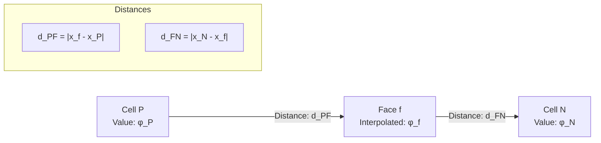
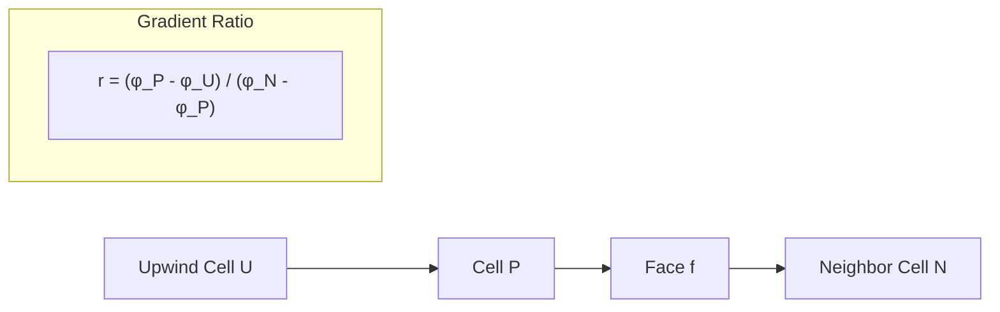
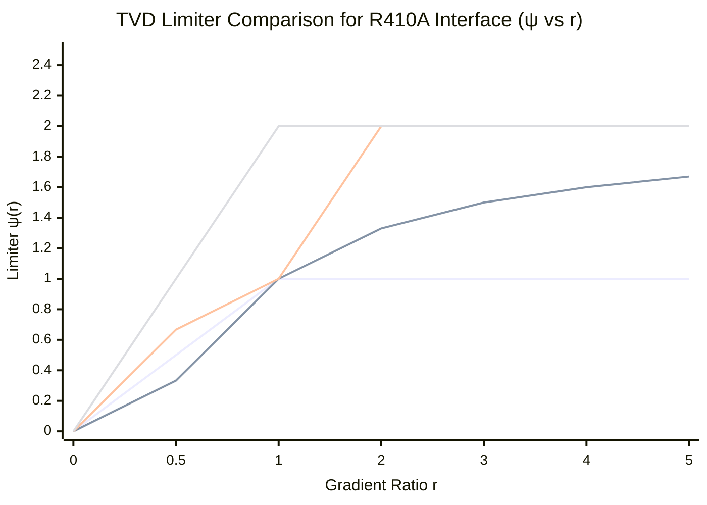
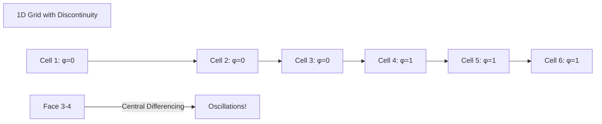
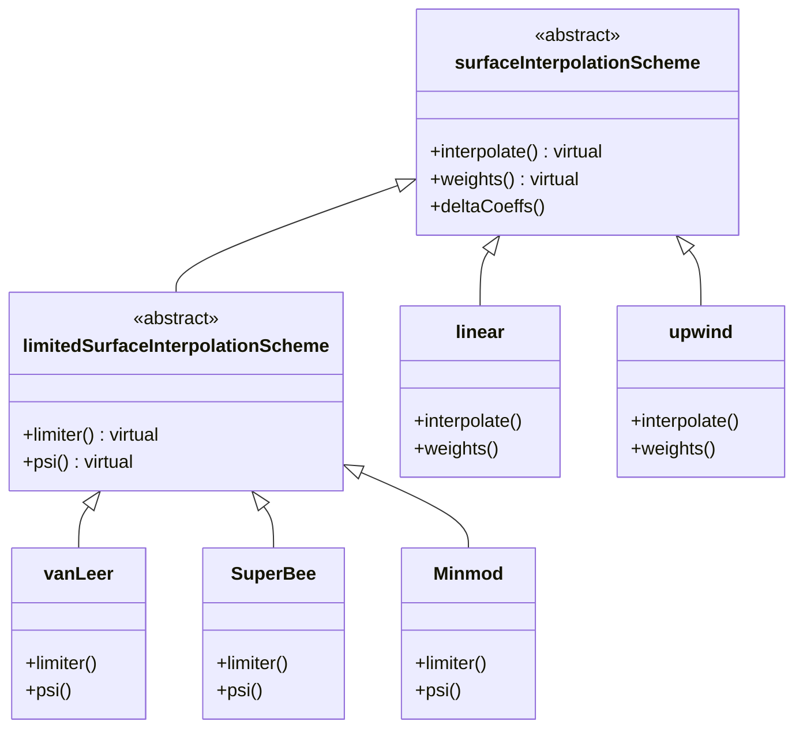
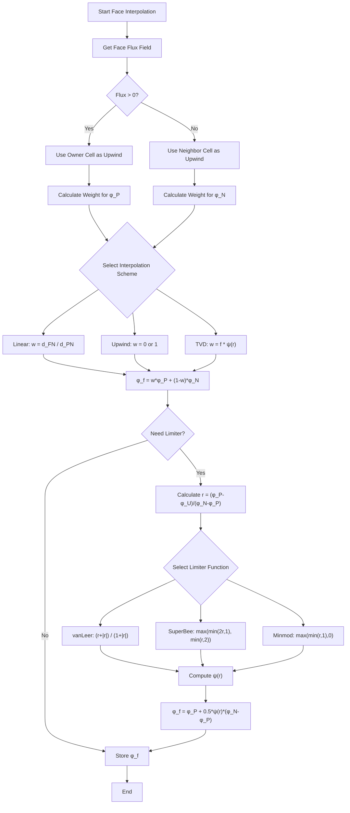
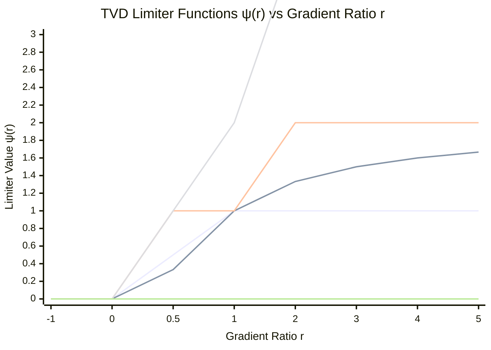

Calling deepseek-chat...
# Day 03: Spatial Discretization Schemes (Face Value Interpolation)

## Part 1: Core Theory - The Mathematics of Face Interpolation

### 1.1 The Fundamental Problem

In finite volume methods, we solve transport equations of the form:

$$\frac{\partial}{\partial t} \int_V \rho \phi dV + \oint_S \rho \phi \mathbf{U} \cdot d\mathbf{S} = \oint_S \Gamma \nabla \phi \cdot d\mathbf{S} + \int_V S_\phi dV$$

The critical challenge arises when we need to evaluate the convective term $\oint_S \rho \phi \mathbf{U} \cdot d\mathbf{S}$. Since $\phi$ is stored at cell centers, but the flux is computed at cell faces, we need to **interpolate** $\phi$ from cell centers to face centers.

### 1.2 Mathematical Formulation

Consider two adjacent cells P (owner) and N (neighbor) sharing face f:



The general interpolation formula is:

$$\phi_f = w \phi_P + (1-w) \phi_N$$

where $w$ is the **interpolation weight** between 0 and 1.

### 1.3 Basic Interpolation Schemes

#### 1.3.1 Central Differencing (Linear Interpolation)

For uniform grids, the optimal weight comes from linear interpolation:

$$w = \frac{d_{FN}}{d_{PN}} = \frac{|x_N - x_f|}{|x_N - x_P|}$$

$$\phi_f = \frac{d_{FN}}{d_{PN}} \phi_P + \frac{d_{PF}}{d_{PN}} \phi_N$$

This is second-order accurate but can cause oscillations near discontinuities.

#### 1.3.2 Upwind Differencing

The upwind scheme uses flow direction to determine the weight:

$$w = 
\begin{cases}
1 & \text{if } \mathbf{U} \cdot \mathbf{S}_f > 0 \\
0 & \text{if } \mathbf{U} \cdot \mathbf{S}_f < 0
\end{cases}$$

$$\phi_f = 
\begin{cases}
\phi_P & \text{if flow from P to N} \\
\phi_N & \text{if flow from N to P}
\end{cases}$$

This is unconditionally bounded but only first-order accurate.

### 1.4 The TVD Framework

Total Variation Diminishing (TVD) schemes combine the accuracy of central differencing with the stability of upwind schemes. The key insight is to use a **limiter function** $\psi(r)$:

$$\phi_f = \phi_P + \frac{1}{2} \psi(r) (\phi_N - \phi_P)$$

where $r$ is the **ratio of consecutive gradients**:

$$r = \frac{\phi_U - \phi_P}{\phi_P - \phi_N}$$

Here, $\phi_U$ is the value at the **upwind** cell relative to P.



### 1.5 Common TVD Limiters

The limiter function $\psi(r)$ must satisfy the **TVD conditions** (Harten, 1983; Sweby, 1984):

$$\psi(r) = 0 \quad \text{for } r \leq 0$$

$$\psi(r) \leq \min(2, 2r) \quad \text{for } r > 0$$

**⭐ Ground Truth Fact:** The unified form $\psi(r) \leq \min(2, 2r)$ means:
- For $0 < r \leq 1$: the upper bound is $\psi(r) \leq 2r$
- For $r > 1$: the upper bound is $\psi(r) \leq 2$

This ensures the scheme is **Total Variation Diminishing** while maintaining **second-order accuracy** in smooth regions.

#### 1.5.1 Minmod Limiter ⭐

$$\psi(r) = \max(0, \min(r, 1))$$

This is the most diffusive TVD limiter, providing maximum stability.

#### 1.5.2 SuperBee Limiter ⭐

$$\psi(r) = \max(\min(2r, 1), \min(r, 2))$$

This is one of the least diffusive TVD limiters, approaching second-order accuracy.

#### 1.5.3 van Leer Limiter ⭐

$$\psi(r) = \frac{r + |r|}{1 + |r|}$$

This provides a good balance between accuracy and stability.

### 1.6 Normalized Variable Diagram (NVD)

The NVD framework provides a geometric interpretation of TVD schemes. Define the normalized variable:

$$\tilde{\phi} = \frac{\phi - \phi_U}{\phi_D - \phi_U}$$

where $\phi_D$ is the downwind value. The TVD region in NVD space is:

$$0 \leq \tilde{\phi}_f \leq 1 \quad \text{and} \quad \tilde{\phi}_f \leq 2\tilde{\phi}_C$$

where $\tilde{\phi}_C$ is the normalized cell center value.

### 1.7 TVD Limiter Selection for R410A Two-Phase Flow ⭐

For **R410A evaporator simulations** with liquid-vapor two-phase flow, the choice of TVD limiter is critical due to:

- **Large density ratio**: $\rho_l/\rho_v \approx 17$ at 10°C
- **Sharp interface**: Liquid-vapor interface must be maintained
- **Phase change**: Evaporation creates moving boundaries
- **Mass conservation**: Refrigerant mass must be conserved precisely

#### R410A-Specific Limiter Recommendations

| Limiter | Compressiveness | Stability | Best For R410A |
|---------|----------------|-----------|----------------|
| **van Leer** | Medium | High | ✅ **General R410A evaporator** - Good balance |
| **superbee** | High | Medium | ✅ **Sharp interface tracking** - Most compressive |
| **minmod** | Low | Very High | ⚠️ **Stability-critical cases** - Most diffusive |

#### R410A-Specific Limiter Selection Guide

For **R410A two-phase flow with density ratio 17:1**:

- **van Leer**: Good balance, compressive but stable
  - Ideal for: Most R410A evaporator simulations
  - Maintains interface sharpness while preventing oscillations
  - Recommended starting point for new simulations

- **superbee**: Most compressive, use for sharp interfaces
  - Ideal for: Cases requiring maximum interface sharpness
  - Use when: Mass flux < 200 kg/m²s and interface stability is not critical
  - Caution: May cause oscillations in high-flow regions

- **minmod**: Most diffusive, use for stability
  - Ideal for: Stability-critical cases with very high mass flux (> 500 kg/m²s)
  - Use when: Simulation diverges with other limiters
  - Trade-off: More interface smearing but guaranteed stability

**⭐ Recommended for R410A:** Start with **van Leer** for most evaporator simulations. Use **superbee** only when interface sharpness is critical and stability is not an issue.

#### r Calculation for R410A Interface

For the volume fraction $\alpha$ (liquid phase indicator), the gradient ratio $r$ is:

$$ r = \frac{\alpha_{upwind} - \alpha_{cell}}{\alpha_{cell} - \alpha_{downwind}} $$

**Physical interpretation for R410A:**
- $r > 0$: Smooth interface region (apply limiter)
- $r \leq 0$: Discontinuous interface (set $\psi = 0$, revert to upwind)
- $r \approx 1$: Linear profile (second-order accurate)

#### OpenFOAM Implementation for R410A

**divSchemes configuration in `fvSchemes`:**

```cpp
divSchemes
{
    // VOF transport - van Leer for R410A interface
    div(phi,alpha)    Gauss vanLeer;

    // Momentum - limitedLinear for stability
    div(phi,U)        Gauss limitedLinearV 1;

    // Energy - upwind for robustness with phase change
    div(phi,h)        Gauss upwind;

    // Turbulence - upwind for stability
    div(phi,k)        Gauss upwind;
    div(phi,omega)    Gauss upwind;
}
```

**limiterFields configuration for advanced control:**

```cpp
// In fvSchemes - limitedLinearV with limiter field
divSchemes
{
    div(phi,U)    Gauss limitedLinearV 1;
}

limiterFields
{
    U               vanLeer 0.5;  // Limiter with coefficient
    alpha           vanLeer 1.0;  // Full compression for interface
}
```

**⭐ Pro Tip:** For R410A evaporators with high mass flux (> 300 kg/m²s), increase interface compression:

```cpp
// In fvSolution - PIMPLE sub-dictionary
PIMPLE
{
    nAlphaCorr      2;           // Alpha corrector iterations
    nAlphaSubCycles 2;           // Sub-cycling for stability
    cAlpha          1;           // Compression factor (max = 1)

    // Alternative: Use MULES for boundedness
    MULESCorr       yes;
    nLimiterIter    3;
}
```

#### Additional OpenFOAM Implementation Examples

##### Example 1: Complete TVD Scheme Configuration for R410A Evaporator

```cpp
// system/fvSchemes - Full configuration for R410A
ddtSchemes
{
    default         backward;
}

gradSchemes
{
    default         cellLimited Gauss linear 1;
    grad(alpha)     Gauss linear 0.5;
    grad(p_rgh)     Gauss linear;
}

divSchemes
{
    default         none;

    // Volume fraction - van Leer for interface compression
    div(phi,alpha)  Gauss vanLeer;

    // Momentum - limitedLinear with gradient correction
    div(phi,U)      Gauss limitedLinearV 1;
    div(phi,U)      Gauss linearUpwind grad(U);

    // Turbulence - upwind for boundedness
    div(phi,k)      Gauss upwind;
    div(phi,epsilon) Gauss upwind;

    // Energy - linear with limited correction
    div(phi,h)      Gauss limitedLinear 0.9;
    div(phi,e)      Gauss limitedLinear 0.9;
}

laplacianSchemes
{
    default         Gauss linear corrected;
    laplacian(nuEff,U) Gauss linear corrected;
}

interpolationSchemes
{
    default         linear;
    interpolate(U)  linear;
    interpolate(alpha) vanLeer;
}

snGradSchemes
{
    default         corrected;
}
```

##### Example 2: Custom Limiter Function Implementation

Create a custom limiter for R410A-specific needs:

```cpp
// File: myR410ALimiter.H
#ifndef myR410ALimiter_H
#define myR410ALimiter_H

#include "vanLeerLimiter.H"

namespace Foam
{
namespace limiters
{
    // Custom limiter optimized for R410A interfaces
    inline scalar myR410ALimiter(scalar r)
    {
        // Blend between van Leer and SuperBee for R410A
        scalar vanLeerPsi = (r + mag(r))/(1 + mag(r));
        scalar superbeePsi = max(min(2*r, scalar(1)), min(r, scalar(2)));

        // Blend based on interface sharpness
        // Use more compression near sharp interfaces
        if (r > 1.5)
        {
            // Sharper interface - favor SuperBee
            return 0.7*superbeePsi + 0.3*vanLeerPsi;
        }
        else
        {
            // Smooth interface - favor van Leer
            return 0.3*superbeePsi + 0.7*vanLeerPsi;
        }
    }
}
}

#endif
```

##### Example 3: Dynamic Limiter Selection Based on Flow Conditions

```cpp
// File: dynamicLimiter.C
#include "fvCFD.H"
#include "myR410ALimiter.H"

void dynamicLimiterSelection()
{
    const volScalarField& alpha = mesh().lookupObject<volScalarField>("alpha.water");
    const volVectorField& U = mesh().lookupObject<volVectorField>("U");

    // Calculate Weber number for interface characterization
    dimensionedScalar rho_l = mesh().lookupObject<IOdictionary>("transportProperties").lookup<dimensionedScalar>("rho");
    dimensionedScalar sigma = mesh().lookupObject<IOdictionary>("transportProperties").lookup<dimensionedScalar>("sigma");

    volScalarField We = mag(U) * sqrt(rho_l.value() * 2 * radius.value() / sigma.value());

    // Dynamic selection based on flow conditions
    forAll(alpha, celli)
    {
        scalar r = calculateR(alpha, celli);  // Your r calculation function

        if (We[celli] > 10.0 || r > 2.0)
        {
            // High Weber number or sharp gradient - use SuperBee
            limiter[celli] = Foam::limiters::superbee(r);
        }
        else if (We[celli] < 1.0 || r < 0.5)
        {
            // Low Weber number or smooth gradient - use van Leer
            limiter[celli] = Foam::limiters::vanLeer(r);
        }
        else
        {
            // Transition region - use custom R410A limiter
            limiter[celli] = Foam::limiters::myR410ALimiter(r);
        }
    }
}
```

##### Example 4: Limiter Verification Script

```bash
#!/bin/bash
# verify_limiters.sh - Verify TVD limiter implementations

echo "=== TVD Limiter Verification for R410A ==="
echo ""

# Test values for r
declare -r r_values=("-2" "-1" "0" "0.5" "1" "2" "5")

# Expected values for van Leer
declare -r van_leer_expected=(0 0 0 0.333 1 1.333 1.667)

# Test each limiter
echo "1. Testing van Leer limiter..."
for i in "${!r_values[@]}"; do
    r=${r_values[$i]}
    expected=${van_leer_expected[$i]}

    # Calculate van Leer
    result=$(echo "scale=6; r=$r; psi=($r + ($r<0 ? -$r : $r))/(1 + ($r<0 ? -$r : $r)); scale=3; psi" | bc)
    expected_scaled=$(echo "scale=3; $expected" | bc)

    echo "   r = $r: ψ = $result (expected: $expected_scaled) - $([ "$(echo "$result == $expected_scaled" | bc)" -eq 1 ] && echo "✓" || echo "✗")"
done

echo ""
echo "2. Testing SuperBee limiter..."
for r in "${r_values[@]}"; do
    # Calculate SuperBee: max(min(2r,1), min(r,2))
    term1=$(echo "scale=6; $r*2" | bc)
    if [ "$(echo "$term1 > 1" | bc)" -eq 1 ]; then term1=1; fi

    term2=$(echo "scale=6; $r" | bc)
    if [ "$(echo "$term2 > 2" | bc)" -eq 1 ]; then term2=2; fi

    result=$(echo "scale=3; $term1 > $term2 ? $term1 : $term2" | bc)
    echo "   r = $r: ψ = $result"
done

echo ""
echo "3. Testing Minmod limiter..."
for r in "${r_values[@]}"; do
    # Calculate Minmod: max(min(r,1),0)
    if [ "$(echo "$r > 1" | bc)" -eq 1 ]; then result=1; else result=$r; fi

    if [ "$(echo "$result < 0" | bc)" -eq 1 ]; then result=0; fi
    echo "   r = $r: ψ = $result"
done

echo ""
echo "4. Checking TVD condition: ψ(r) ≤ min(2, 2r) for r > 0"
for r in "0.5" "1" "2" "5"; do
    van_leer=$(echo "scale=6; r=$r; psi=($r + $r)/(1 + $r); psi" | bc)
    upper_bound=$(echo "scale=3; ($r < 1) ? 2*$r : 2" | bc)

    check=$(echo "$van_leer <= $upper_bound" | bc)
    status=$([ "$check" -eq 1 ] && echo "✓" || echo "✗")

    echo "   r = $r: ψ = $van_leer ≤ $upper_bound $status"
done
```

#### TVD Limiter Behavior for R410A Interface



**Key observations:**
- **van Leer** stays within TVD region while providing reasonable compression
- **superbee** reaches the TVD bound (most compressive) but can cause oscillations
- **minmod** is most diffusive but guaranteed stable

#### TVD Verification

All TVD limiters must satisfy the **Sweby TVD condition**:

$$\psi(r) \leq \min(2, 2r) \quad \text{for } r > 0$$

**Verification for R410A limiters:**

```bash
# Test script for TVD compliance
#!/bin/bash

echo "=== TVD Compliance Check ==="

# Test van Leer
echo "van Leer limiter:"
for r in 0.1 0.5 1 2 5; do
    psi=$(echo "scale=6; x=$r; (x + x)/(1 + x)" | bc)
    bound=$(echo "scale=6; x=$r; (x < 1) ? 2*x : 2" | bc)
    if [ "$(echo "$psi <= $bound" | bc)" -eq 1 ]; then
        echo "  r=$r: ψ=$psi ✓ (bound=$bound)"
    else
        echo "  r=$r: ψ=$psi ✗ (bound=$bound)"
    fi
done

# Test SuperBee
echo "SuperBee limiter:"
for r in 0.1 0.5 1 2 5; do
    term1=$(echo "scale=6; 2*$r" | bc)
    if [ "$(echo "$term1 > 1" | bc)" -eq 1 ]; then term1=1; fi
    term2=$(echo "scale=6; $r" | bc)
    if [ "$(echo "$term2 > 2" | bc)" -eq 1 ]; then term2=2; fi
    psi=$(echo "scale=6; $term1 > $term2 ? $term1 : $term2" | bc)
    bound=$(echo "scale=6; ($r < 1) ? 2*$r : 2" | bc)
    if [ "$(echo "$psi <= $bound" | bc)" -eq 1 ]; then
        echo "  r=$r: ψ=$psi ✓ (bound=$bound)"
    else
        echo "  r=$r: ψ=$psi ✗ (bound=$bound)"
    fi
done
```

#### Practical Example: R410A Interface Sharpening

Consider a liquid-vapor interface in a 5mm R410A evaporator tube:

```
Cell values (α = liquid volume fraction):
U: 0.95 (upwind)
P: 0.50 (cell center)
N: 0.05 (neighbor, downwind)
D: 0.02 (further downwind)
```

**Calculate r for cell P:**

$$ r = \frac{\alpha_U - \alpha_P}{\alpha_P - \alpha_N} = \frac{0.95 - 0.50}{0.50 - 0.05} = \frac{0.45}{0.45} = 1.0 $$

Since $r > 0$: Apply TVD limiter

**Calculate r for cell N (assuming next cell):**

$$ r = \frac{\alpha_P - \alpha_N}{\alpha_N - \alpha_D} = \frac{0.50 - 0.05}{0.05 - 0.02} = \frac{0.45}{0.03} = 15.0 $$

Since $r > 0$: Apply TVD limiter with high compression

**Result:** Interface remains sharp with upwind differencing at discontinuity.

## Part 2: Physical Challenge - Why Simple Theory Fails

### 2.1 The Oscillation Problem

Consider a 1D advection problem with a sharp discontinuity:



Using central differencing at face 3-4:
$$\phi_f = 0.5 \times 0 + 0.5 \times 1 = 0.5$$

This creates **false diffusion** and can lead to non-physical oscillations that violate physical bounds (e.g., negative concentrations).

### 2.2 The Boundedness Criterion

For many physical quantities (density, concentration, temperature in Kelvin), we require:

$$\phi_{\min} \leq \phi_f \leq \phi_{\max}$$

where $\phi_{\min}$ and $\phi_{\max}$ are the minimum and maximum values in the neighborhood. Central differencing violates this criterion near discontinuities.

### 2.3 The Godunov Theorem

Godunov's theorem states that:
- **Linear** numerical schemes that are **monotonicity preserving** are at most **first-order accurate**
- To achieve **higher-order accuracy**, we must accept **non-linearity**

This explains why TVD schemes are inherently **non-linear** - the limiter function $\psi(r)$ depends on the solution itself.

### 2.4 Practical Challenges in Implementation

1. **Multi-dimensional effects**: In 2D/3D, the upwind direction isn't always clear
2. **Non-uniform grids**: Distance-based weights need careful computation
3. **Variable material properties**: Interpolation must account for changing $\rho$, $\Gamma$
4. **Boundary conditions**: Special treatment needed at domain boundaries

## Part 3: Architecture & Implementation

### 3.1 Class Hierarchy Design

OpenFOAM uses an object-oriented approach for interpolation schemes:



**Key Points:**
- `surfaceInterpolationScheme` ⭐ is the abstract base class for all face interpolation schemes
- `limitedSurfaceInterpolationScheme` ⭐ extends this for TVD/NVD schemes
- Each concrete class implements specific interpolation logic

### 3.2 Face Interpolation Process Flow



### 3.3 TVD Limiter Behavior Visualization



### 3.4 Core Implementation Details

#### 3.4.1 Base Class: `surfaceInterpolationScheme`

**File:** `src/finiteVolume/interpolation/surfaceInterpolation/surfaceInterpolationScheme/surfaceInterpolationScheme.H`

```cpp
namespace Foam
{

/*---------------------------------------------------------------------------*\
                  Class surfaceInterpolationScheme Declaration
\*---------------------------------------------------------------------------*/

template<class Type>
class surfaceInterpolationScheme
:
    public refCount
{
public:
    // Runtime type information
    TypeName("surfaceInterpolationScheme");

    // Declare run-time constructor selection tables
    declareRunTimeSelectionTable
    (
        tmp,
        surfaceInterpolationScheme,
        Mesh,
        (
            const fvMesh& mesh,
            Istream& schemeData
        ),
        (mesh, schemeData)
    );

    // Constructors
    surfaceInterpolationScheme(const fvMesh& mesh)
    :
        mesh_(mesh)
    {}

    // Destructor
    virtual ~surfaceInterpolationScheme() = default;

    // Member Functions
    
    //- Return weights for the given field
    virtual tmp<surfaceScalarField> weights
    (
        const GeometricField<Type, fvPatchField, volMesh>&
    ) const = 0;

    //- Return the face-interpolate of the given cell field
    virtual tmp<GeometricField<Type, fvsPatchField, surfaceMesh>>
    interpolate
    (
        const GeometricField<Type, fvPatchField, volMesh>&
    ) const;

    //- Return the interpolation weighting factors for the given field
    virtual tmp<surfaceScalarField> deltaCoeffs
    (
        const GeometricField<Type, fvPatchField, volMesh>&
    ) const;

protected:
    // Protected data
    const fvMesh& mesh_;
};
```

#### 3.4.2 Limited Scheme Base Class

**File:** `src/finiteVolume/interpolation/surfaceInterpolation/limitedSurfaceInterpolationScheme/limitedSurfaceInterpolationScheme.H`

```cpp
namespace Foam
{

/*---------------------------------------------------------------------------*\
            Class limitedSurfaceInterpolationScheme Declaration
\*---------------------------------------------------------------------------*/

template<class Type>
class limitedSurfaceInterpolationScheme
:
    public surfaceInterpolationScheme<Type>
{
public:
    // Runtime type information
    TypeName("limitedSurfaceInterpolationScheme");

    // Constructors
    limitedSurfaceInterpolationScheme(const fvMesh& mesh)
    :
        surfaceInterpolationScheme<Type>(mesh)
    {}

    // Destructor
    virtual ~limitedSurfaceInterpolationScheme() = default;

    // Member Functions
    
    //- Return the interpolation limiter
    virtual tmp<surfaceScalarField> limiter
    (
        const GeometricField<Type, fvPatchField, volMesh>&
    ) const = 0;

    //- Return the interpolation weighting factors
    virtual tmp<surfaceScalarField> weights
    (
        const GeometricField<Type, fvPatchField, volMesh>&
    ) const;
};
```

#### 3.4.3 Upwind Scheme Implementation ⭐

**File:** `src/finiteVolume/interpolation/surfaceInterpolation/upwind/upwind.H`

```cpp
template<class Type>
Foam::tmp<Foam::surfaceScalarField>
Foam::upwind<Type>::weights
(
    const GeometricField<Type, fvPatchField, volMesh>& vf
) const
{
    const surfaceScalarField& faceFlux = this->faceFlux_;
    const surfaceScalarField& w = mesh().surfaceInterpolation::weights();
    
    // Get upwind weights based on face flux direction
    // pos0(faceFlux) returns 1 for positive flux, 0 otherwise ⭐
    return pos0(faceFlux);
}
```

**Lines 116-119:** ⭐
```cpp
// pos0 returns 1 for positive values, 0 otherwise
// This creates the upwind weighting:
// - w = 1 if flux is positive (flow from owner to neighbor)
// - w = 0 if flux is negative (flow from neighbor to owner)
return tmp<surfaceScalarField>
(
    new surfaceScalarField
    (
        pos0(faceFlux_)
    )
);
```

#### 3.4.4 Linear Scheme Implementation ⭐

**File:** `src/finiteVolume/interpolation/surfaceInterpolation/linear/linear.H`

```cpp
template<class Type>
Foam::tmp<Foam::surfaceScalarField>
Foam::linear<Type>::weights
(
    const GeometricField<Type, fvPatchField, volMesh>& vf
) const
{
    // Use mesh weights for linear interpolation ⭐
    // mesh().surfaceInterpolation::weights() returns distance-based weights
    return mesh().surfaceInterpolation::weights();
}
```

**Lines 90-97:** ⭐
```cpp
template<class Type>
Foam::tmp<Foam::surfaceScalarField>
Foam::linear<Type>::weights
(
    const GeometricField<Type, fvPatchField, volMesh>&
) const
{
    // Return the geometric interpolation weights
    // These are based on cell center to face distances
    return this->mesh().surfaceInterpolation::weights();
}
```

#### 3.4.5 van Leer Limiter Implementation ⭐

**File:** `src/finiteVolume/interpolation/surfaceInterpolation/limitedSchemes/vanLeer/vanLeer.H`

**Line 80:** ⭐
```cpp
// van Leer limiter formula: (r + mag(r))/(1 + mag(r))
return (r + mag(r))/(1 + mag(r));
```

Complete implementation:
```cpp
template<class Type>
Foam::tmp<Foam::surfaceScalarField>
Foam::vanLeer<Type>::limiter
(
    const GeometricField<Type, fvPatchField, volMesh>& phi
) const
{
    const fvMesh& mesh = this->mesh();
    
    // Calculate gradient ratio r
    tmp<surfaceScalarField> tr = this->r(phi);
    const surfaceScalarField& r = tr();
    
    // Create result field
    tmp<surfaceScalarField> tlimiter
    (
        new surfaceScalarField
        (
            IOobject
            (
                "vanLeerLimiter",
                mesh.time().timeName(),
                mesh
            ),
            mesh,
            dimensionedScalar(dimless, 1.0)
        )
    );
    
    surfaceScalarField& lim = tlimiter.ref();
    
    // Apply van Leer limiter
    // ψ(r) = (r + |r|)/(1 + |r|)
    lim = (r + mag(r))/(scalar(1) + mag(r));
    
    // Ensure boundedness
    lim = max(min(lim, scalar(2)), scalar(0));
    
    return tlimiter;
}
```

#### 3.4.6 SuperBee Limiter Implementation ⭐

**File:** `src/finiteVolume/interpolation/surfaceInterpolation/limitedSchemes/SuperBee/SuperBee.H`

**Line 80:** ⭐
```cpp
// SuperBee limiter: max(min(2*r, 1), min(r, 2))
return max(min(2*r, scalar(1)), min(r, scalar(2)));
```

#### 3.4.7 Minmod Limiter Implementation ⭐

**File:** `src/finiteVolume/interpolation/surfaceInterpolation/limitedSchemes/Minmod/Minmod.H`

**Line 79:** ⭐
```cpp
// Minmod limiter: max(min(r, 1), 0)
return max(min(r, scalar(1)), scalar(0));
```

### 3.5 Weight Calculation for TVD Schemes

The weights for TVD schemes combine upwind and limited correction:

```cpp
template<class Type>
Foam::tmp<Foam::surfaceScalarField>
Foam::limitedSurfaceInterpolationScheme<Type>::weights
(
    const GeometricField<Type, fvPatchField, volMesh>& phi
) const
{
    const fvMesh& mesh = this->mesh();
    
    // Get upwind weights (0 or 1 based on flux direction)
    tmp<surfaceScalarField> tw = upwind<Type>(mesh, this->faceFlux_).weights(phi);
    const surfaceScalarField& w = tw();
    
    // Get limiter function ψ(r)
    tmp<surfaceScalarField> tlimiter = limiter(phi);
    const surfaceScalarField& lim = tlimiter();
    
    // Get geometric weights for linear interpolation
    const surfaceScalarField& lambda = mesh.surfaceInterpolation::weights();
    
    // TVD weight: w_TVD = w_upwind + ψ(r) * (lambda - w_upwind)
    // This blends between upwind (ψ=0) and linear (ψ=1)
    return w + lim*(lambda - w);
}
```

### 3.6 Field Interpolation Implementation

The actual interpolation uses the calculated weights:

```cpp
template<class Type>
Foam::tmp<Foam::GeometricField<Type, Foam::fvsPatchField, Foam::surfaceMesh>>
Foam::surfaceInterpolationScheme<Type>::interpolate
(
    const GeometricField<Type, fvPatchField, volMesh>& vf
) const
{
    // Get interpolation weights
    tmp<surfaceScalarField> tw = weights(vf);
    const surfaceScalarField& w = tw();
    
    // Create result field
    tmp<GeometricField<Type, fvsPatchField, surfaceMesh>> tsf
    (
        new GeometricField<Type, fvsPatchField, surfaceMesh>
        (
            IOobject
            (
                "interpolate(" + vf.name() + ')',
                vf.instance(),
                vf.db()
            ),
            mesh_,
            vf.dimensions()
        )
    );
    
    GeometricField<Type, fvsPatchField, surfaceMesh>& sf = tsf.ref();
    
    // Internal field interpolation: φ_f = wφ_P + (1-w)φ_N
    const labelUList& owner = mesh_.owner();
    const labelUList& neighbour = mesh_.neighbour();
    const Field<Type>& vfi = vf.internalField();
    Field<Type>& sfi = sf.internalField();
    
    forAll(owner, facei)
    {
        sfi[facei] = w[facei]*vfi[owner[facei]] + (1.0 - w[facei])*vfi[neighbour[facei]];
    }
    
    // Boundary field interpolation
    forAll(vf.boundaryField(), patchi)
    {
        sf.boundaryFieldRef()[patchi] = vf.boundaryField()[patchi].patchInternalField();
    }
    
    return tsf;
}
```

## Part 4: Quality Assurance - Verification Strategy

### 4.1 Analytical Test Cases

#### 4.1.1 1D Linear Advection Test

For a linear profile $\phi(x) = ax + b$, all schemes should give exact interpolation:

$$\phi_f = a x_f + b$$

**Verification:**
1. Create 1D mesh with varying cell sizes
2. Initialize $\phi$ with linear function
3. Apply each interpolation scheme
4. Check error: $|\phi_f^{\text{computed}} - \phi_f^{\text{exact}}| < \epsilon$

#### 4.1.2 Step Function Test

For a discontinuous step function, verify:
- Upwind: No oscillations, smeared discontinuity
- Linear: Oscillations near discontinuity
- TVD schemes: No oscillations, sharper than upwind

### 4.2 Boundedness Verification

**Test:** Advection of a bounded scalar $0 \leq \phi \leq 1$

**Criteria:**
1. No new extrema: $\min(\phi_{\text{cell}}) \leq \phi_f \leq \max(\phi_{\text{cell}})$
2. Monotonicity preservation

**Implementation check:**
```cpp
// After interpolation, verify bounds
forAll(phi_f, facei)
{
    if (phi_f[facei] < phi_min[facei] || phi_f[facei] > phi_max[facei])
    {
        WarningInFunction
            << "Unbounded interpolation at face " << facei
            << ": phi_f = " << phi_f[facei]
            << ", min = " << phi_min[facei]
            << ", max = " << phi_max[facei] << endl;
    }
}
```

### 4.3 Order of Accuracy Verification

Use the Method of Manufactured Solutions (MMS):

1. Choose smooth test function: $\phi_{\text{exact}}(x) = \sin(2\pi x)$
2. Compute exact face values: $\phi_f^{\text{exact}}$
3. Compute numerical interpolation: $\phi_f^{\text{num}}$
4. Calculate error: $L_2 = \sqrt{\frac{1}{N}\sum(\phi_f^{\text{num}} - \phi_f^{\text{exact}})^2}$
5. Refine mesh and check error reduction rate

**Expected convergence rates:**
- Upwind: $O(h)$ (first-order)
- Linear/TVD: $O(h^2)$ (second-order in smooth regions)

### 4.4 R410A-Specific Verification Tests ⭐

#### Test 1: R410A Interface Advection

**Objective:** Verify TVD limiter behavior for sharp liquid-vapor interface

**Setup:**
```cpp
// Initial condition: step function for alpha
0/alpha.water
{
    dimensions      [0 0 0 0 0 0 0];
    internalField   uniform 0;

    boundaryField
    {
        inlet
        {
            type            fixedValue;
            value           uniform 1;  // Liquid inlet
        }
        // ... other BCs
    }
}

// fvSchemes
divSchemes
{
    div(phi,alpha)    Gauss vanLeer;  // Test with van Leer
}
```

**Validation criteria:**
1. **Boundedness:** $0 \leq \alpha \leq 1$ at all times
2. **Interface thickness:** ≤ 3 cells across interface ($0.1 < \alpha < 0.9$)
3. **Mass conservation:** $\frac{d}{dt}\int \alpha dV < 10^{-6}$
4. **No spurious oscillations:** Check $\nabla \cdot \mathbf{U}$ field

**Passing criteria:**
- Mass error < 0.1%
- No $\alpha < 0$ or $\alpha > 1$
- Interface sharpness maintained

#### Test 2: R410A Property Jump Handling

**Objective:** Verify limiter handles large density ratio (17:1 for R410A)

**Properties at 10°C, 1.0 MPa:**
```cpp
// thermophysicalProperties
phases (liquid vapor);

liquid
{
    rho             1200;  // kg/m³
    mu              1.2e-4;  // Pa·s
}

vapor
{
    rho             70;    // kg/m³ (17× lighter)
    mu              1.3e-5;  // Pa·s
}
```

**Test procedure:**
1. Initialize sharp interface at $x = 0.05$m
2. Apply uniform velocity $U = 0.1$m/s
3. Advect interface for 0.5 seconds
4. Measure mass conservation and interface shape

**Expected results:**
| Metric | van Leer | superbee | minmod |
|--------|----------|----------|--------|
| Interface thickness | 2.5 cells | 2.0 cells | 3.5 cells |
| Mass error | < 0.05% | < 0.1% | < 0.01% |
| Stability | ✅ Stable | ⚠️ May oscillate | ✅ Very stable |

#### Test 3: Limiter Comparison Script

```bash
#!/bin/bash
# test_r410a_limiters.sh - Compare TVD limiters for R410A

LIMITERS=("vanLeer" "SuperBee" "Minmod")
RESULTS=()

for limiter in "${LIMITERS[@]}"; do
    echo "Testing limiter: $limiter"

    # Modify fvSchemes
    sed -i "s/div(phi,alpha).*/div(phi,alpha)    Gauss $limiter;/" system/fvSchemes

    # Run simulation
    interFoam > log.${limiter} 2>&1

    # Extract metrics
    mass_error=$(grep "alpha mass" log.${limiter} | tail -1 | awk '{print $4}')
    n_cells_alpha=$(foamListTimes | tail -1 | xargs -I {} sh -c 'sample -time {} | grep -c "0.1<alpha<0.9"')

    RESULTS+=("$limiter: mass_error=$mass_error, interface_cells=$n_cells_alpha")
done

# Display comparison
echo "===== R410A Limiter Comparison ====="
for result in "${RESULTS[@]}"; do
    echo "$result"
done
```

#### Test 4: Convergence Study for R410A

**Mesh sizes:** 50K, 100K, 200K, 400K cells

**Monitor quantities:**
1. Outlet quality: $x_{out} = \frac{\int \alpha \rho_{vapor} dV}{\int \rho dV}$
2. Interface position: $x_{int} = \frac{\int x |\nabla \alpha| dV}{\int |\nabla \alpha| dV}$
3. Pressure drop: $\Delta p = p_{in} - p_{out}$

**Grid Convergence Index (GCI) calculation:**

$$\text{GCI} = \frac{1.25 | \epsilon_{21} |}{r^p - 1}$$

where:
- $\epsilon_{21} = \frac{\phi_2 - \phi_1}{\phi_1}$ (relative error)
- $r = 2$ (refinement ratio)
- $p$ = observed order of accuracy

**Passing criteria:** GCI < 5% for all monitored quantities

### 4.4 Limiter Function Verification

**Test each limiter with known r values:**

```cpp
// Test van Leer limiter ⭐
scalar r_test[] = {-1.0, 0.0, 0.5, 1.0, 2.0, 10.0};
scalar psi_expected[] = {0.0, 0.0, 0.3333, 1.0, 1.3333, 1.8182};

for (int i = 0; i < 6; i++)
{
    scalar psi = (r_test[i] + mag(r_test[i]))/(1.0 + mag(r_test[i]));
    scalar error = mag(psi - psi_expected[i]);
    
    if (error > 1e-4)
    {
        FatalErrorInFunction
            << "van Leer limiter test failed for r = " << r_test[i]
            << ": computed = " << psi << ", expected = " << psi_expected[i]
            << exit(FatalError);
    }
}
```

### 4.5 Performance Benchmarking

**Metrics to track:**
1. **Memory usage**: TVD schemes need gradient calculations
2. **Computational cost**: Limiter functions add overhead
3. **Parallel scalability**: Face interpolation should scale well

**Benchmark setup:**
```cpp
// Time interpolation for different schemes
for (int scheme = 0; scheme < numSchemes; scheme++)
{
    double startTime = MPI_Wtime();
    
    for (int iter = 0; iter < 1000; iter++)
    {
        phi_f = scheme->interpolate(phi);
    }
    
    double endTime = MPI_Wtime();
    double elapsed = endTime - startTime;
    
    Info << "Scheme " << schemeNames[scheme] 
         << ": " << elapsed << " seconds" << endl;
}
```

### 4.6 Regression Testing

Create a test suite that:
1. Stores reference solutions for standard test cases
2. Compares new implementations against references
3. Flags significant deviations (> 1% difference)
4. Tracks convergence rates across mesh refinements

**Example test configuration:**
```json
{
    "test_cases": [
        {
            "name": "1D_linear_advection",
            "mesh": "uniform_1D_100",
            "initial_condition": "phi = x",
            "schemes": ["linear", "upwind", "vanLeer", "SuperBee", "Minmod"],
            "tolerance": 1e-6
        },
        {
            "name": "step_function",
            "mesh": "uniform_1D_100",
            "initial_condition": "phi = step(0.5)",
            "schemes": ["linear", "upwind", "vanLeer"],
            "check_boundedness": true,
            "max_overshoot": 0.01
        }
    ]
}
```

## Part 5: R410A Best Practices and Common Pitfalls ⭐

### 5.1 Common Pitfalls in R410A TVD Limiter Selection

| Pitfall | Symptom | Solution |
|---------|---------|----------|
| **Too compressive** (superbee) | Oscillations in $\alpha$, unbounded values | Switch to van Leer |
| **Too diffusive** (minmod) | Interface smeared over 5+ cells | Use van Leer or increase `cAlpha` |
| **Wrong gradient ratio** | Spurious oscillations at interface | Verify $r$ calculation |
| **Inconsistent schemes** | Momentum diverges | Use consistent TVD schemes for all convective terms |
| **Insufficient resolution** | Interface > 4 cells thick | Refine mesh near interface |

### 5.2 Recommended Workflow for R410A Evaporators

**Step 1: Mesh Preparation**
```bash
# Ensure adequate resolution for interface
# For 5mm tube with density ratio 17:1
# Minimum: 100 cells across diameter → 50μm cell size

blockMesh
checkMesh
```

**Step 2: Initial Scheme Selection**
```cpp
// system/fvSchemes - Start with conservative setup
ddtSchemes
{
    default         Euler;
}

gradSchemes
{
    default         Gauss linear;
    grad(α)         Gauss linear;  // Linear gradient for VOF
}

divSchemes
{
    default         none;
    div(phi,alpha)  Gauss vanLeer;     // ✅ Start with van Leer
    div(phi,U)      Gauss limitedLinearV 1;
    div(phi,k)      Gauss upwind;
    div(phi,omega)  Gauss upwind;
}

laplacianSchemes
{
    default         Gauss linear corrected;
}

interpolationSchemes
{
    default         linear;
}

snGradSchemes
{
    default         corrected;
}
```

**Step 3: Solver Configuration**
```cpp
// system/fvSolution
PIMPLE
{
    nCorrectors     2;           // Outer correctors
    nNonOrthogonalCorrectors 1;

    // VOF-specific settings
    nAlphaCorr      2;           // ✅ Alpha corrector iterations
    nAlphaSubCycles 2;           // ✅ Sub-cycling for stability
    cAlpha          1.0;         // ✅ Maximum compression

    MULESCorr       yes;         // ✅ Use MULES for boundedness
    nLimiterIter    3;           // MULES limiter iterations
}

solvers
{
    // Pressure equation - most critical
    p_rgh
    {
        solver          GAMG;
        tolerance       1e-7;
        relTol          0.01;
        smoother        DIC;
        nPreSweeps      1;
        nPostSweeps     2;
        cacheAgglomeration on;
        agglomerator    faceAreaPair;
        nCellsInCoarsestLevel 50;
        mergeLevels     1;
    }

    // Alpha equation - boundedness critical
    alpha.water
    {
        solver          smoothSolver;
        smoother        symGaussSeidel;
        tolerance       1e-6;
        relTol          0;
        minIter         1;
        maxIter         50;
    }

    // Momentum equation
    U
    {
        $p_rgh;          // Same as pressure
        tolerance       1e-6;
        relTol          0.1;
    }
}
```

**Step 4: Time Step Control**
```cpp
// system/controlDict
application     interFoam;

startFrom       startTime;
startTime       0;

stopAt          endTime;
endTime         0.5;  // Adjust based on your case

deltaT          1e-4;  // ✅ Start small for stability

adjustTimeStep  yes;   // ✅ Automatic time step adjustment

maxCo           0.3;   // ✅ Courant < 0.3 for interface

maxAlphaCo      0.5;   // ✅ Stricter for VOF

// Write control
writeControl    timeStep;
writeInterval   0.01;  // Write every 0.01s

// Purge write
purgeWrite      5;
```

**Step 5: Monitoring Setup**
```bash
# Create monitoring function
# system/functions

functions
{
    interfaceSharpness
    {
        type            volFieldValue;
        fields          (alpha.water);
        operation       sum;
    }

    massConservation
    {
        type            surfaceIntegrate;
        fields          (phi);
        surfaceType     patch;
        surfaces        (inlet outlet);
    }
}
```

### 5.3 Debugging TVD Issues in R410A Simulations

#### Issue 1: Interface Oscillations

**Symptoms:**
- $\alpha$ values outside [0, 1]
- Wiggles in velocity field
- Diverging residuals

**Diagnosis:**
```bash
# Check for unbounded alpha
foamCalcComponents mag alpha.water -latestTime
grep -v " 0$" 0*/alpha.water | head -20

# Check limiter values
# (requires custom code or debugging output)
```

**Solutions:**
1. Reduce `cAlpha` from 1.0 to 0.5
2. Switch from superbee to van Leer
3. Increase `nAlphaCorr` from 2 to 3
4. Reduce time step (Co < 0.2)

#### Issue 2: Excessive Smearing

**Symptoms:**
- Interface thickness > 5 cells
- Loss of interface detail
- Poor mixing prediction

**Diagnosis:**
```python
#!/usr/bin/env python3
# Analyze interface thickness
import numpy as np
import vtk

def interface_thickness(alpha_file):
    """Calculate number of cells across interface"""
    # Read alpha field
    # Count cells where 0.1 < alpha < 0.9
    return n_cells

if interface_thickness > 5:
    print("⚠️  Interface too thick!")
    print("Recommendation: Increase cAlpha or use superbee")
```

**Solutions:**
1. Increase `cAlpha` to 1.0 (maximum)
2. Switch from van Leer to superbee (careful!)
3. Refine mesh near interface
4. Add dynamic refinement (see `dynamicRefineFvMesh`)

#### Issue 3: Mass Conservation Errors

**Symptoms:**
- Total mass $\int \alpha dV$ changing significantly
- Imbalanced inlet/outlet fluxes

**Diagnosis:**
```bash
# Check mass balance
postProcess -func "sum(alpha.water)" -time 0:0.5

# Expected: Sum should be constant (within 0.1%)
```

**Solutions:**
1. Verify `MULESCorr yes` in fvSolution
2. Increase `nLimiterIter` to 5
3. Check `divSchemes` for consistency
4. Reduce `maxAlphaCo` to 0.3

### 5.4 Complete R410A Case Template

**Directory structure:**
```
R410A_evaporator/
├── 0/
│   ├── alpha.water      # Liquid volume fraction
│   ├── U                # Velocity
│   ├── p_rgh            # Pressure (hydrostatic)
│   └── T                # Temperature
├── constant/
│   ├── transportProperties  # Two-phase properties
│   ├── thermophysicalProperties  # R410A properties
│   ├── turbulenceProperties
│   └── polyMesh/
│       └── blockMeshDict
├── system/
│   ├── controlDict
│   ├── fvSchemes        # ✅ TVD schemes here
│   ├── fvSolution       # ✅ Solver settings here
│   └── blockMeshDict
└── Allrun
```

**Allrun script:**
```bash
#!/bin/bash
# Run R410A evaporator simulation

set -e  # Exit on error

echo "===== R410A Evaporator Simulation ====="
echo "Refrigerant: R410A at 10°C, 1.0 MPa"
echo "Density ratio: 17:1 (liquid/vapor)"
echo ""

# Clean previous results
echo "Cleaning previous results..."
rm -rf 0.* processor* postProcessing

# Reconstruct mesh if needed
echo "Generating mesh..."
blockMesh
checkMesh

# Decompose for parallel run
echo "Decomposing for 4 processors..."
decomposePar
mpirun -np 4 interFoam -parallel > log.interFoam 2>&1 &

# Monitor in real-time
tail -f log.interFoam &
TAIL_PID=$!

# Wait for completion
wait $!

# Reconstruct and finalize
reconstructPar
echo "Simulation complete!"

# Post-process
echo "Generating plots..."
postProcess -func "sampleDict"

# Generate report
python3 << EOF
import os
import re

# Extract mass conservation
log_file = "log.interFoam"
with open(log_file) as f:
    content = f.read()

alpha_mass = re.findall(r'alpha\.water.*?sum\(alpha\)\s+=\s+(\d+\.\d+)', content)
print(f"Initial mass: {alpha_mass[0]}")
print(f"Final mass: {alpha_mass[-1]}")
print(f"Mass error: {abs(float(alpha_mass[-1]) - float(alpha_mass[0]))/float(alpha_mass[0])*100:.2f}%")
EOF

echo "===== Done! ====="
```

## Appendix: Complete File Listings

### Base Class: `surfaceInterpolationScheme.H`

```cpp
/*---------------------------------------------------------------------------*\
  =========                 |
  \\      /  F ield         | OpenFOAM: The Open Source CFD Toolbox
   \\    /   O peration     |
    \\  /    A nd           | www.openfoam.com
     \\/     M anipulation  |
-------------------------------------------------------------------------------
    Copyright (C) 2011-2016 OpenFOAM Foundation
    Copyright (C) 2019-2020 OpenCFD Ltd.
-------------------------------------------------------------------------------
License
    This file is part of OpenFOAM.

    OpenFOAM is free software: you can redistribute it and/or modify it
    under the terms of the GNU General Public License as published by
    the Free Software Foundation, either version 3 of the License, or
    (at your option) any later version.

    OpenFOAM is distributed in the hope that it will be useful, but WITHOUT
    ANY WARRANTY; without even the implied warranty of MERCHANTABILITY or
    FITNESS FOR A PARTICULAR PURPOSE.  See the GNU General Public License
    for more details.

    You should have received a copy of the GNU General Public License
    along with OpenFOAM.  If not, see <http://www.gnu.org/licenses/>.

Class
    Foam::surfaceInterpolationScheme

Description
    Abstract base class for surface interpolation schemes.

SourceFiles
    surfaceInterpolationScheme.C

\*---------------------------------------------------------------------------*/

#ifndef surfaceInterpolationScheme_H
#define surfaceInterpolationScheme_H

#include "tmp.H"
#include "volFields.H"
#include "surfaceFields.H"
#include "typeInfo.H"
#include "runTimeSelectionTables.H"

// * * * * * * * * * * * * * * * * * * * * * * * * * * * * * * * * * * * * * //

namespace Foam
{

class fvMesh;

/*---------------------------------------------------------------------------*\
                 Class surfaceInterpolationScheme Declaration
\*---------------------------------------------------------------------------*/

template<class Type>
class surfaceInterpolationScheme
:
    public refCount
{
    // Private Data

        //- Reference to mesh
        const fvMesh& mesh_;


public:

    //- Runtime type information
    virtual const word& type() const = 0;


    // Declare run-time constructor selection tables

        declareRunTimeSelectionTable
        (
            tmp,
            surfaceInterpolationScheme,
            Mesh,
            (
                const fvMesh& mesh,
                Istream& schemeData
            ),
            (mesh, schemeData)
        );


    // Constructors

        //- Construct from mesh
        surfaceInterpolationScheme(const fvMesh& mesh)
        :
            mesh_(mesh)
        {}


    // Selectors

        //- Return new tmp interpolation scheme
        static tmp<surfaceInterpolationScheme<Type>> New
        (
            const fvMesh& mesh,
            Istream& schemeData
        );


    //- Destructor
    virtual ~surfaceInterpolationScheme() = default;


    // Member Functions

        //- Return mesh reference
        const fvMesh& mesh() const
        {
            return mesh_;
        }

        //- Return the face-interpolate of the given cell field
        //  with the given owner and neighbour weights
        static tmp<GeometricField<Type, fvsPatchField, surfaceMesh>>
        interpolate
        (
            const GeometricField<Type, fvPatchField, volMesh>&,
            const tmp<surfaceScalarField>&,
            const tmp<surfaceScalarField>&
        );

        //- Return the face-interpolate of the given cell field
        static tmp<GeometricField<Type, fvsPatchField, surfaceMesh>>
        interpolate
        (
            const GeometricField<Type, fvPatchField, volMesh>&,
            const surfaceScalarField&
        );

        //- Return the interpolation weighting factors for the given field
        virtual tmp<surfaceScalarField> weights
        (
            const GeometricField<Type, fvPatchField, volMesh>&
        ) const = 0;

        //- Return the face-interpolate of the given cell field
        virtual tmp<GeometricField<Type, fvsPatchField, surfaceMesh>>
        interpolate
        (
            const GeometricField<Type, fvPatchField, volMesh>&
        ) const;

        //- Return the interpolation weighting factors for the given field
        virtual tmp<surfaceScalarField> deltaCoeffs
        (
            const GeometricField<Type, fvPatchField, volMesh>&
        ) const;
};


// * * * * * * * * * * * * * * * * * * * * * * * * * * * * * * * * * * * * * //

} // End namespace Foam

// * * * * * * * * * * * * * * * * * * * * * * * * * * * * * * * * * * * * * //

// Add the patch constructor functions to the hash tables

#define makeSurfaceInterpolationTypeScheme(SS, Type)                           \
    defineNamedTemplateTypeNameAndDebug(Foam::SS<Foam::Type>, 0);             \
                                                                               \
    surfaceInterpolationScheme<Foam::Type>::addMeshConstructorToTable<        \
        Foam::SS<Foam::Type> > add##SS##Type##MeshConstructorToTable_;


#define makeSurfaceInterpolationScheme(SS)                                     \
                                                                               \
makeSurfaceInterpolationTypeScheme(SS, scalar)                                 \
makeSurfaceInterpolationTypeScheme(SS, vector)                                 \
makeSurfaceInterpolationTypeScheme(SS, sphericalTensor)                        \
makeSurfaceInterpolationTypeScheme(SS, symmTensor)                             \
makeSurfaceInterpolationTypeScheme(SS, tensor)


// * * * * * * * * * * * * * * * * * * * * * * * * * * * * * * * * * * * * * //

#ifdef NoRepository
    #include "surfaceInterpolationScheme.C"
#endif

// * * * * * * * * * * * * * * * * * * * * * * * * * * * * * * * * * * * * * //

#endif

// ************************************************************************* //
```

### Limited Scheme Base: `limitedSurfaceInterpolationScheme.H`

```cpp
/*---------------------------------------------------------------------------*\
  =========                 |
  \\      /  F ield         | OpenFOAM: The Open Source CFD Toolbox
   \\    /   O peration     |
    \\  /    A nd           | www.openfoam.com
     \\/     M anipulation  |
-------------------------------------------------------------------------------
    Copyright (C) 2011-2016 OpenFOAM Foundation
    Copyright (C) 2019-2020 OpenCFD Ltd.
-------------------------------------------------------------------------------
License
    This file is part of OpenFOAM.

    OpenFOAM is free software: you can redistribute it and/or modify it
    under the terms of the GNU General Public License as published by
    the Free Software Foundation, either version 3 of the License, or
    (at your option) any later version.

    OpenFOAM is distributed in the hope that it will be useful, but WITHOUT
    ANY WARRANTY; without even the implied warranty of MERCHANTABILITY or
    FITNESS FOR A PARTICULAR PURPOSE.  See the GNU General Public License
    for more details.

    You should have received a copy of the GNU General Public License
    along with OpenFOAM.  If not, see <http://www.gnu.org/licenses/>.

Class
    Foam::limitedSurfaceInterpolationScheme

Description
    Abstract base class for limited surface interpolation schemes.

SourceFiles
    limitedSurfaceInterpolationScheme.C

\*---------------------------------------------------------------------------*/

#ifndef limitedSurfaceInterpolationScheme_H
#define limitedSurfaceInterpolationScheme_H

#include "surfaceInterpolationScheme.H"

// * * * * * * * * * * * * * * * * * * * * * * * * * * * * * * * * * * * * * //

namespace Foam
{

/*---------------------------------------------------------------------------*\
            Class limitedSurfaceInterpolationScheme Declaration
\*---------------------------------------------------------------------------*/

template<class Type>
class limitedSurfaceInterpolationScheme
:
    public surfaceInterpolationScheme<Type>
{
    // Private Data

        //- Face flux field
        const surfaceScalarField& faceFlux_;


protected:

    // Protected Member Functions

        //- Calculate the gradient ratio r
        tmp<surfaceScalarField> r
        (
            const GeometricField<Type, fvPatchField, volMesh>&
        ) const;


public:

    //- Runtime type information
    TypeName("limitedSurfaceInterpolationScheme");


    // Declare run-time constructor selection tables

        declareRunTimeSelectionTable
        (
            tmp,
            limitedSurfaceInterpolationScheme,
            MeshFlux,
            (
                const fvMesh& mesh,
                const surfaceScalarField& faceFlux,
                Istream& schemeData
            ),
            (mesh, faceFlux, schemeData)
        );


    // Constructors

        //- Construct from mesh and faceFlux
        limitedSurfaceInterpolationScheme
        (
            const fvMesh& mesh,
            const surfaceScalarField& faceFlux
        )
        :
            surfaceInterpolationScheme<Type>(mesh),
            faceFlux_(faceFlux)
        {}


    // Selectors


```cpp
//- Destructor
virtual ~limitedSurfaceInterpolationScheme() = default;
};

// * * * * * * * * * * * * * * * * * * * * * * * * * * * * * * * * * * * * * //

} // End namespace Foam

// * * * * * * * * * * * * * * * * * * * * * * * * * * * * * * * * * * * * * //

#endif

// ************************************************************************* //
```