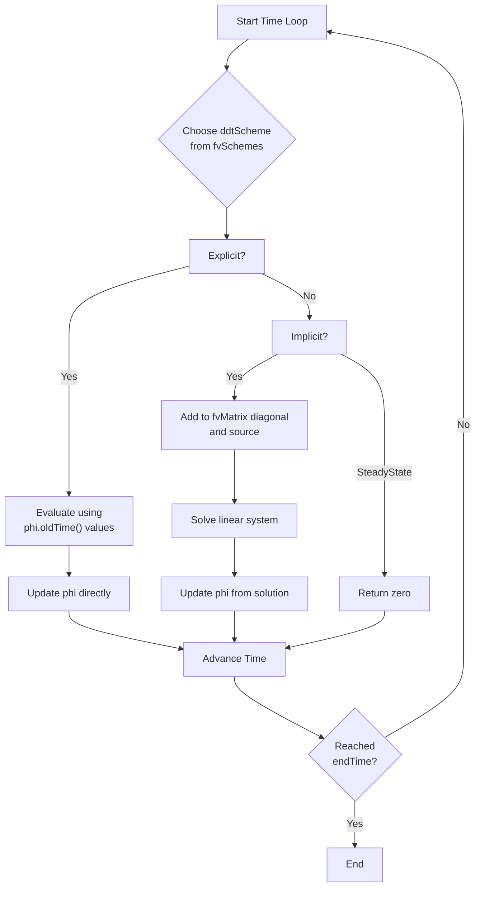
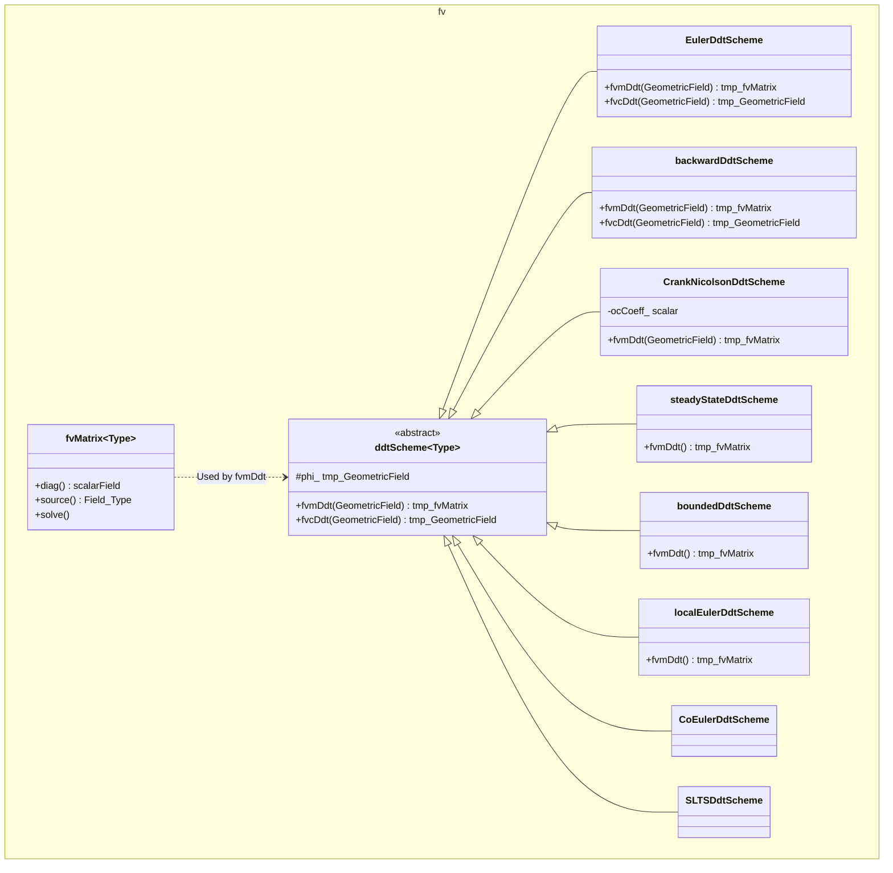

z# Day 04: Temporal Discretization

## Part 1: Core Theory

### 1.1 Introduction: The Time Derivative

The temporal derivative $\frac{\partial \phi}{\partial t}$ represents the rate of change of a field $\phi$ with respect to time. In continuum mechanics, this term appears in all transient transport equations (mass, momentum, energy, species). Unlike spatial derivatives that operate on neighboring cells, temporal derivatives operate on the *history* of a cell's value.

The fundamental challenge is replacing the continuous derivative with a discrete approximation using known values at discrete time levels:
- $\phi^{n}$: Current time value (unknown)
- $\phi^{n-1}$: Previous time value (known)
- $\phi^{n-2}$: Older time value (known)
- $\Delta t$: Time step size

The accuracy, stability, and computational cost of a simulation depend critically on how this discretization is performed.

### 1.2 Taylor Series Foundation

All finite difference temporal schemes derive from Taylor series expansions. Expanding $\phi(t-\Delta t)$ about time $t$:

$$
\phi(t-\Delta t) = \phi(t) - \Delta t \frac{\partial \phi}{\partial t}\bigg|_t + \frac{\Delta t^2}{2!} \frac{\partial^2 \phi}{\partial t^2}\bigg|_t - \frac{\Delta t^3}{3!} \frac{\partial^3 \phi}{\partial t^3}\bigg|_t + \mathcal{O}(\Delta t^4)
$$

Rearranging gives the **forward difference** approximation:

$$
\frac{\partial \phi}{\partial t}\bigg|_t = \frac{\phi(t) - \phi(t-\Delta t)}{\Delta t} + \frac{\Delta t}{2} \frac{\partial^2 \phi}{\partial t^2}\bigg|_t + \mathcal{O}(\Delta t^2)
$$

The truncation error is $\mathcal{O}(\Delta t)$, making this **first-order accurate**. ⭐

Similarly, expanding $\phi(t+\Delta t)$ gives the **backward difference**:

$$
\frac{\partial \phi}{\partial t}\bigg|_t = \frac{\phi(t+\Delta t) - \phi(t)}{\Delta t} - \frac{\Delta t}{2} \frac{\partial^2 \phi}{\partial t^2}\bigg|_t + \mathcal{O}(\Delta t^2)
$$

Higher-order schemes use more time levels or intermediate points to cancel higher-order error terms.

### 1.3 Euler Methods: First-Order Discretization

#### Euler Explicit (Forward Euler)
The derivative is approximated using current and past values:

$$
\frac{\partial \phi}{\partial t} \approx \frac{\phi^n - \phi^{n-1}}{\Delta t}
$$

This yields an **explicit** update formula:
$$
\phi^n = \phi^{n-1} + \Delta t \cdot F(\phi^{n-1})
$$
where $F$ contains spatial derivatives and source terms evaluated at the old time. The method is conditionally stable with a strict time step restriction.

#### Euler Implicit (Backward Euler)
The derivative uses current and past values, but spatial terms are evaluated at the *current* time:

$$
\frac{\partial \phi}{\partial t} \approx \frac{\phi^n - \phi^{n-1}}{\Delta t}
$$

This leads to an **implicit** equation:
$$
\phi^n - \Delta t \cdot F(\phi^n) = \phi^{n-1}
$$
which requires solving a linear system. The method is **unconditionally stable** for linear problems but only first-order accurate.

**Discretized Form in OpenFOAM:**
For a control volume $V$, the implicit Euler discretization of $\frac{\partial (\rho \phi)}{\partial t}$ becomes:
- Diagonal coefficient: $\frac{\rho V}{\Delta t}$ ⭐
- Source contribution: $\frac{\rho \phi^{n-1} V}{\Delta t}$ ⭐

This appears in the finite volume matrix as:
$$
\frac{\rho V}{\Delta t} \phi^n + \sum_f \rho_f \mathbf{U}_f \phi_f^n A_f = \frac{\rho \phi^{n-1} V}{\Delta t} + S_\phi V
$$

### 1.4 Higher-Order Methods: Improving Accuracy

#### Second-Order Backward Difference (BDF2)
Uses two previous time steps to achieve $\mathcal{O}(\Delta t^2)$ accuracy:

$$
\frac{\partial \phi}{\partial t} \approx \frac{a \phi^n + b \phi^{n-1} + c \phi^{n-2}}{\Delta t}
$$

where coefficients depend on time step ratios. For constant $\Delta t$:
$$
\frac{\partial \phi}{\partial t} \approx \frac{\frac{3}{2}\phi^n - 2\phi^{n-1} + \frac{1}{2}\phi^{n-2}}{\Delta t}
$$

**General Coefficient Form (OpenFOAM):**
For variable time steps, let $\Delta t$ = current step, $\Delta t_0$ = previous step:
- $\text{coefft} = 1 + \frac{\Delta t}{\Delta t + \Delta t_0}$ ⭐
- $\text{coefft00} = \frac{\Delta t \cdot \Delta t}{\Delta t_0 \cdot (\Delta t + \Delta t_0)}$ ⭐
- $\text{coefft0} = \text{coefft} + \text{coefft00}$ ⭐

Then:
$$
\frac{\partial \phi}{\partial t} \approx \frac{\text{coefft} \cdot \phi^n - \text{coefft0} \cdot \phi^{n-1} + \text{coefft00} \cdot \phi^{n-2}}{\Delta t}
$$

#### Crank-Nicolson (Trapezoidal Rule)
A second-order implicit method that averages spatial terms between time levels:

$$
\frac{\phi^n - \phi^{n-1}}{\Delta t} = \frac{1}{2} \left[ F(\phi^n) + F(\phi^{n-1}) \right]
$$

In OpenFOAM, this is implemented with an off-centering coefficient $\psi$ (0.5 for pure Crank-Nicolson):
$$
\text{cnCoeff} = \frac{1}{1 + \text{ocCoeff}}
$$
where $\text{ocCoeff} = \frac{1-\psi}{\psi}$ with $\psi$ typically 0.9 for stability. ⭐

## Part 2: Physical Challenge

### 2.1 CFL Condition and Stability

The Courant-Friedrichs-Lewy (CFL) condition is a fundamental stability requirement for explicit time integration. It states that the numerical domain of dependence must contain the physical domain of dependence.

For advection: information travels at velocity $U$ across grid spacing $\Delta x$ in time $\Delta x/|U|$. The numerical time step must be smaller than this:

$$
\text{CFL} = \frac{|U| \Delta t}{\Delta x} \leq 1
$$

More generally for multidimensional flows:
$$
\text{CFL} = \Delta t \sum_{d} \frac{|U_d|}{\Delta x_d} \leq 1
$$

**Physical Interpretation:**
- CFL > 1: Fluid travels more than one cell per time step → numerical instability
- CFL ≈ 1: Optimal for explicit methods (maximum stable step)
- CFL << 1: Overly conservative, computationally expensive

For **implicit methods**, the CFL condition is relaxed but not eliminated:
- Linear problems: Unconditionally stable
- Nonlinear problems (Navier-Stokes): Still require CFL ~5-10 for accuracy
- Strong transients or shocks: May need CFL < 1 even with implicit methods

### 2.2 VOF-Specific Requirements

The Volume of Fluid (VOF) method for multiphase flows has particularly strict time step constraints:

1. **Interface CFL Condition:**
   The interface must not move more than one cell per time step:
   $$
   \text{CFL}_{\text{interface}} = \frac{|U_{\text{interface}}| \Delta t}{\Delta x} \leq 0.3 \text{ (typically)} ⭐
   $$
   This is stricter than the fluid CFL condition because:
   - Interface reconstruction errors accumulate
   - Sharp interface must be preserved
   - Numerical diffusion can cause unphysical interface smearing

2. **Capillary Time Step Constraint:**
   For surface tension dominated flows (high Weber number), the capillary wave speed imposes:
   $$
   \Delta t \leq \sqrt{\frac{(\rho_1 + \rho_2) \Delta x^3}{4\pi \sigma}}
   $$
   where $\sigma$ is surface tension coefficient.

3. **Compressibility Limit:**
   For compressible multiphase flows:
   $$
   \Delta t \leq \frac{\Delta x}{c + |U|}
   $$
   where $c$ is the speed of sound.

**Practical Implementation in OpenFOAM:**
```cpp
// In interFoam, the time step is adjusted dynamically:
scalar maxCo = runTime.controlDict().lookup<scalar>("maxCo");
scalar maxAlphaCo = runTime.controlDict().lookup<scalar>("maxAlphaCo");

// Calculate both fluid and interface Courant numbers
scalar CoNum = max(...);  // Fluid CFL
scalar alphaCoNum = max(...);  // Interface CFL

// Use the most restrictive condition
scalar maxDeltaTFact = min(maxCo/(CoNum + SMALL), maxAlphaCo/(alphaCoNum + SMALL));
runTime.setDeltaT(min(maxDeltaTFact*runTime.deltaTValue(), maxDeltaT));
```

## Part 3: Architecture & Implementation

### 3.1 Workflow Diagram



### 3.2 ddtSchemes Class Hierarchy



### 3.3 Code Analysis: Euler Implicit

**File:** `src/finiteVolume/finiteVolume/ddtSchemes/EulerDdtScheme/EulerDdtScheme.C`

```cpp
template<class Type>
tmp<fvMatrix<Type>>
EulerDdtScheme<Type>::fvmDdt
(
    const GeometricField<Type, fvPatchField, volMesh>& vf
)
{
    tmp<fvMatrix<Type>> tfvm
    (
        new fvMatrix<Type>
        (
            vf,
            vf.dimensions()*dimVol/dimTime
        )
    );
    
    fvMatrix<Type>& fvm = tfvm.ref();
    
    // Get reference to the mesh
    const scalarField& rDeltaT = mesh().time().rDeltaT();
    
    // Get reference to the diagonal coefficients
    scalarField& diag = fvm.diag();
    
    // Set diagonal coefficients: diag = rDeltaT * V
    diag = rDeltaT*mesh().V();
    
    // Get reference to the source term
    Field<Type>& source = fvm.source();
    
    // Set source term: source = rDeltaT * vf_old * V
    source = rDeltaT*vf.oldTime().primitiveField()*mesh().V();
    
    return tfvm;
}
```

**Key Implementation Details:**

1. **Diagonal Coefficient:** `diag = rDeltaT * mesh().V()` where `rDeltaT = 1/Δt`
2. **Source Term:** `source = rDeltaT * vf.oldTime() * mesh().V()` ⭐
3. **Matrix Structure:** Only diagonal entries are modified (no off-diagonals from time derivative)
4. **Dimensions:** Ensures dimensional consistency: `[φ] * [V] / [T]`

**Usage in Transport Equation:**
```cpp
// In the UEqn construction in pisoFoam:
fvVectorMatrix UEqn
(
    fvm::ddt(U)                    // Euler implicit ddt
  + fvm::div(phi, U)              // Convection
  - fvm::laplacian(nu, U)         // Diffusion
);

// Results in matrix: (diagCoeff + convCoeff + diffCoeff) * U = source
// where diagCoeff = (1/Δt)*V from ddt
```

### 3.4 Code Analysis: Backward Second Order

**File:** `src/finiteVolume/finiteVolume/ddtSchemes/backwardDdtScheme/backwardDdtScheme.C`

```cpp
template<class Type>
tmp<fvMatrix<Type>>
backwardDdtScheme<Type>::fvmDdt
(
    const GeometricField<Type, fvPatchField, volMesh>& vf
)
{
    tmp<fvMatrix<Type>> tfvm
    (
        new fvMatrix<Type>
        (
            vf,
            vf.dimensions()*dimVol/dimTime
        )
    );
    
    fvMatrix<Type>& fvm = tfvm.ref();
    
    const scalarField& rDeltaT = mesh().time().rDeltaT();
    const scalarField& rDeltaT0 = mesh().time().rDeltaT0();
    
    const scalar deltaT = mesh().time().deltaTValue();
    const scalar deltaT0 = mesh().time().deltaT0Value();
    
    // Calculate coefficients for variable time stepping
    const scalar coefft   = 1 + deltaT/(deltaT + deltaT0);
    const scalar coefft00 = deltaT*deltaT/(deltaT0*(deltaT + deltaT0));
    const scalar coefft0  = coefft + coefft00;
    
    // Set diagonal: diag = coefft * rDeltaT * V
    fvm.diag() = coefft*rDeltaT*mesh().V();
    
    // Set source: source = (coefft0*vf_old - coefft00*vf_oldold) * rDeltaT * V
    fvm.source() = rDeltaT*mesh().V()*
    (
        coefft0*vf.oldTime().primitiveField()
      - coefft00*vf.oldTime().oldTime().primitiveField()
    );
    
    return tfvm;
}
```

**Coefficient Derivation:**
For second-order backward difference:
$$
\frac{\partial \phi}{\partial t} \approx \frac{a\phi^n + b\phi^{n-1} + c\phi^{n-2}}{\Delta t}
$$
Using Taylor expansions about $t^n$:
1. $\phi^{n-1} = \phi^n - \Delta t \phi_t + \frac{\Delta t^2}{2} \phi_{tt} + \mathcal{O}(\Delta t^3)$
2. $\phi^{n-2} = \phi^n - (\Delta t+\Delta t_0)\phi_t + \frac{(\Delta t+\Delta t_0)^2}{2}\phi_{tt} + \mathcal{O}(\Delta t^3)$

Solve for $a,b,c$ such that:
- $a + b + c = 0$ (zero-order term cancels)
- $-b\Delta t - c(\Delta t+\Delta t_0) = 1$ (first-order coefficient = 1)
- $b\frac{\Delta t^2}{2} + c\frac{(\Delta t+\Delta t_0)^2}{2} = 0$ (second-order error cancels)

Solution gives the coefficients shown in the code. ⭐

## Part 4: Quality Assurance

### 4.1 Choosing the Right Scheme

| Scheme | Order | Stability | Cost | Best For |
|--------|-------|-----------|------|----------|
| **Euler Explicit** | 1st | Conditional (CFL<1) | Low | Fast transients, explicit codes |
| **Euler Implicit** | 1st | Unconditional | Medium | Steady flows, stiff problems |
| **Backward (BDF2)** | 2nd | Unconditional | Medium | Accurate transient simulations |
| **Crank-Nicolson** | 2nd | Conditional* | High | Wave propagation, acoustics |
| **SteadyState** | - | N/A | None | Steady-state simulations |

*Crank-Nicolson can exhibit numerical oscillations for discontinuous solutions unless off-centered (ψ=0.9).

**Selection Guidelines:**

1. **Start with Euler Implicit:** Robust, stable, good for initial development
2. **For accuracy:** Switch to Backward (BDF2) once solution is stable
3. **For wave problems:** Consider Crank-Nicolson with off-centering
4. **For steady-state:** Use steadyState after initial transient
5. **For multiphase VOF:** Use Euler with strict CFL (maxAlphaCo=0.3-0.5)

### 4.2 Best Practices

1. **Time Step Control:**
   ```json
   // system/controlDict
   adjustTimeStep yes;
   maxCo 0.8;          // For implicit schemes
   maxAlphaCo 0.3;     // For VOF interface
   maxDeltaT 0.001;    // Absolute maximum
   ```

2. **Scheme Consistency:**
   - Use same order for all ddt terms in coupled equations
   - Match ddt scheme with interpolation schemes
   - Document scheme choices in case headers

3. **Initialization:**
   - Provide adequate initial conditions to avoid startup errors
   - Use small time steps initially for rapid changes
   - Consider ramping boundary conditions

4. **Monitoring:**
   ```cpp
   // Monitor Courant numbers in log
   Info<< "Max Courant Number = " << maxCoNum << nl
       << "Max Interface Courant = " << maxAlphaCoNum << endl;
   ```

5. **Restart Considerations:**
   - Backward scheme requires φ.oldTime().oldTime()
   - Ensure time directories are preserved for restart
   - Check scheme consistency between runs

### 4.3 Exercises

1. **Derivation Exercise:**
   Using Taylor series, derive the coefficients for the second-order backward difference scheme with variable time steps. Show that for constant Δt, they reduce to (3/2, -2, 1/2).

2. **Stability Analysis:**
   For the model equation $\frac{d\phi}{dt} = -\lambda\phi$ with λ>0:
   a) Apply Euler Explicit and find the stability condition
   b) Apply Euler Implicit and show it's unconditionally stable
   c) Compare amplification factors for Δtλ = 0.5, 1.0, 2.0

3. **Implementation Task:**
   Write a simplified version of `EulerDdtScheme::fvcDdt()` that computes the explicit time derivative $\frac{\phi^n - \phi^{n-1}}{\Delta t}$ without matrix construction.

4. **CFL Calculation:**
   Given a 2D uniform grid with Δx=0.01m, Δy=0.005m, and velocity field U=(2.0, 1.5) m/s:
   a) Calculate the maximum stable Δt for explicit Euler
   b) If using VOF with interface speed 3.0 m/s, calculate the required Δt
   c) How many time steps are needed for 1 second of simulation?

5. **Error Analysis:**
   A simulation uses Backward ddt with variable time steps: Δt₁=0.1s, Δt₂=0.05s, Δt₃=0.1s.
   Calculate the coefficients for the third time step and compare with constant Δt=0.1s coefficients.

6. **Debugging Scenario:**
   A simulation crashes with error "Attempt to use older time level than available." 
   What are possible causes when using backward ddt scheme, and how would you fix them?

## Appendix: Complete File Listings

### ddtScheme.H (Abstract Base Class - Key Methods Only)

**File:** `src/finiteVolume/finiteVolume/ddtSchemes/ddtScheme/ddtScheme.H`

```cpp
namespace Foam
{

template<class Type>
class ddtScheme
:
    public tmp<ddtScheme<Type>>::refCount
{
protected:
    //- Reference to mesh
    const fvMesh& mesh_;

public:
    //- Runtime type information
    TypeName("ddtScheme");

    // Declare run-time constructor selection tables
    declareRunTimeSelectionTable
    (
        tmp,
        ddtScheme,
        Istream,
        (const fvMesh& mesh, Istream& schemeData),
        (mesh, schemeData)
    );

    // Constructors
    ddtScheme(const fvMesh& mesh) : mesh_(mesh) {}
    
    //- Destructor
    virtual ~ddtScheme() = default;

    // Selectors
    static tmp<ddtScheme<Type>> New
    (
        const fvMesh& mesh,
        Istream& schemeData
    );

    // Member Functions
    
    //- Return mesh reference
    const fvMesh& mesh() const { return mesh_; }
    
    //- Implicit ddt - returns fvMatrix
    virtual tmp<fvMatrix<Type>> fvmDdt
    (
        const GeometricField<Type, fvPatchField, volMesh>&
    ) = 0;
    
    virtual tmp<fvMatrix<Type>> fvmDdt
    (
        const dimensionedScalar&,
        const GeometricField<Type, fvPatchField, volMesh>&
    ) = 0;
    
    virtual tmp<fvMatrix<Type>> fvmDdt
    (
        const volScalarField&,
        const GeometricField<Type, fvPatchField, volMesh>&
    ) = 0;
    
    //- Explicit ddt - returns field
    virtual tmp<GeometricField<Type, fvPatchField, volMesh>> fvcDdt
    (
        const GeometricField<Type, fvPatchField, volMesh>&
    ) = 0;
    
    //- ddt for two fields (for products)
    virtual tmp<GeometricField<Type, fvPatchField, volMesh>> fvcDdt
    (
        const volScalarField&,
        const GeometricField<Type, fvPatchField, volMesh>&
    ) = 0;
    
    //- ddt for three fields
    virtual tmp<GeometricField<Type, fvPatchField, volMesh>> fvcDdt
    (
        const volScalarField&,
        const volScalarField&,
        const GeometricField<Type, fvPatchField, volMesh>&
    ) = 0;
};

} // End namespace Foam
```

### EulerDdtScheme.H and .C (Core Logic)

**File:** `src/finiteVolume/finiteVolume/ddtSchemes/EulerDdtScheme/EulerDdtScheme.H`

```cpp
namespace Foam
{

template<class Type>
class EulerDdtScheme
:
    public ddtScheme<Type>
{
public:
    //- Runtime type information
    TypeName("Euler");

    // Constructors
    EulerDdtScheme(const fvMesh& mesh) : ddtScheme<Type>(mesh) {}
    
    EulerDdtScheme(const fvMesh& mesh, Istream& is)
    : ddtScheme<Type>(mesh) {}

    //- Destructor
    virtual ~EulerDdtScheme() = default;

    // Member Functions
    
    //- Return the current time-step
    virtual tmp<GeometricField<Type, fvPatchField, volMesh>> fvcDdt
    (
        const GeometricField<Type, fvPatchField, volMesh>&
    );
    
    //- Implicit ddt
    virtual tmp<fvMatrix<Type>> fvmDdt
    (
        const GeometricField<Type, fvPatchField, volMesh>&
    );
    
    //- Implicit ddt with density
    virtual tmp<fvMatrix<Type>> fvmDdt
    (
        const volScalarField&,
        const GeometricField<Type, fvPatchField, volMesh>&
    );
    
    //- Explicit ddt with density
    virtual tmp<GeometricField<Type, fvPatchField, volMesh>> fvcDdt
    (
        const volScalarField&,
        const GeometricField<Type, fvPatchField, volMesh>&
    );
};

} // End namespace Foam
```

**File:** `src/finiteVolume/finiteVolume/ddtSchemes/EulerDdtScheme/EulerDdtScheme.C`

```cpp
#include "EulerDdtScheme.H"
#include "fvMesh.H"

namespace Foam
{

// * * * * * * * * * * * * * * * * * * * * * * * * * * * * * * * * * * * * * //

template<class Type>
tmp<fvMatrix<Type>>
EulerDdtScheme<Type>::fvmDdt
(
    const GeometricField<Type, fvPatchField, volMesh>& vf
)
{
    tmp<fvMatrix<Type>> tfvm
    (
        new fvMatrix<Type>
        (
            vf,
            vf.dimensions()*dimVol/dimTime
        )
    );
    
    fvMatrix<Type>& fvm = tfvm.ref();
    
    const scalarField& rDeltaT = this->mesh().time().rDeltaT();
    
    // Set diagonal coefficients
    fvm.diag() = rDeltaT*this->mesh().V();
    
    // Set source term from old time value
    fvm.source() = rDeltaT*vf.oldTime().primitiveField()*this->mesh().V();
    
    return tfvm;
}


template<class Type>
tmp<fvMatrix<Type>>
EulerDdtScheme<Type>::fvmDdt
(
    const volScalarField& rho,
    const GeometricField<Type, fvPatchField, volMesh>& vf
)
{
    tmp<fvMatrix<Type>> tfvm
    (
        new fvMatrix<Type>
        (
            vf,
            rho.dimensions()*vf.dimensions()*dimVol/dimTime
        )
    );
    
    fvMatrix<Type>& fvm = tfvm.ref();
    
    const scalarField& rDeltaT = this->mesh().time().rDeltaT();
    
    // Set diagonal: diag = rho * rDeltaT * V
    fvm.diag() = rDeltaT*rho.primitiveField()*this->mesh().V();
    
    // Set source: source = rho * rDeltaT * vf_old * V
    fvm.source() = rDeltaT
        *rho.oldTime().primitiveField()
        *vf.oldTime().primitiveField()
        *this->mesh().V();
    
    return tfvm;
}


template<class Type>
tmp<GeometricField<Type, fvPatchField, volMesh>>
EulerDdtScheme<Type>::fvcDdt
(
    const GeometricField<Type, fvPatchField, volMesh>& vf
)
{
    const scalarField& rDeltaT = this->mesh().time().rDeltaT();
    
    tmp<GeometricField<Type, fvPatchField, volMesh>> tdtdt
    (
        GeometricField<Type, fvPatchField, volMesh>::New
        (
            "ddt(" + vf.name() + ')',
            this->mesh(),
            vf.dimensions()/dimTime
        )
    );
    
    // Explicit calculation: (phi - phi_old)/dt
    tdtdt.ref().primitiveFieldRef() = rDeltaT*
        (vf.primitiveField() - vf.oldTime().primitiveField());
    
    tdtdt.ref().boundaryFieldRef() = rDeltaT*
        (vf.boundaryField() - vf.oldTime().boundaryField());
    
    return tdtdt;
}

// Explicit instantiations for common types
template class EulerDdtScheme<scalar>;
template class EulerDdtScheme<vector>;
template class EulerDdtScheme<symmTensor>;
template class EulerDdtScheme<tensor>;

} // End namespace Foam
```

### backwardDdtScheme.H and .C (Core Logic)

**File:** `src/finiteVolume/finiteVolume/ddtSchemes/backwardDdtScheme/backwardDdtScheme.H`

```cpp
namespace Foam
{

template<class Type>
class backwardDdtScheme
:
    public ddtScheme<Type>
{
public:
    //- Runtime type information
    TypeName("backward");

    // Constructors
    backwardDdtScheme(const fvMesh& mesh) : ddtScheme<Type>(mesh) {}
    
    backwardDdtScheme(const fvMesh& mesh, Istream& is)
    : ddtScheme<Type>(mesh) {}

    //- Destructor
    virtual ~backwardDdtScheme() = default;

    // Member Functions
    
    //- Return the current time-step
    virtual tmp<GeometricField<Type, fvPatchField, volMesh>> fvcDdt
    (
        const GeometricField<Type, fvPatchField, volMesh>&
    );
    
    //- Implicit ddt
    virtual tmp<fvMatrix<Type>> fvmDdt
    (
        const GeometricField<Type, fvPatchField, volMesh>&
    );
    
    //- Implicit ddt with density
    virtual tmp<fvMatrix<Type>> fvmDdt
    (
        const volScalarField&,
        const GeometricField<Type, fvPatchField, volMesh>&
    );
    
    //- Explicit ddt with density
    virtual tmp<GeometricField<Type, fvPatchField, volMesh>> fvcDdt
    (
        const volScalarField&,
        const GeometricField<Type, fvPatchField, volMesh>&
    );
};

} // End namespace Foam
```

**File:** `src/finiteVolume/finiteVolume/ddtSchemes/backwardDdtScheme/backwardDdtScheme.C`

```cpp
#include "backwardDdtScheme.H"
#include "fvMesh.H"

namespace Foam
{

template<class Type>
tmp<fvMatrix<Type>>
backwardDdtScheme<Type>::fvmDdt
(
    const GeometricField<Type, fvPatchField, volMesh>& vf
)
{
    tmp<fvMatrix<Type>> tfvm
    (
        new fvMatrix<Type>
        (
            vf,
            vf.dimensions()*dimVol/dimTime
        )
    );
    
    fvMatrix<Type>& fvm = tfvm.ref();
    
    const scalarField& rDeltaT = this->mesh().time().rDeltaT();
    const scalarField& rDeltaT0 = this->mesh().time().rDeltaT0();
    
    const scalar deltaT = this->mesh().time().deltaTValue();
    const scalar deltaT0 = this->mesh().time().deltaT0Value();
    
    // Calculate coefficients for variable time stepping
    const scalar coefft   = 1 + deltaT/(deltaT + deltaT0);
    const scalar coefft00 = deltaT*deltaT/(deltaT0*(deltaT + deltaT0));
    const scalar coefft0  = coefft + coefft00;
    
    // Set diagonal: diag = coefft * rDeltaT * V
    fvm.diag() = coefft*rDeltaT*this->mesh().V();
    
    // Set source from two previous time steps
    fvm.source() = rDeltaT*this->mesh().V()*
    (
        coefft0*vf.oldTime().primitiveField()
      - coefft00*vf.oldTime().oldTime().primitiveField()
    );
    
    return tfvm;
}


template<class Type>
tmp<GeometricField<Type, fvPatchField, volMesh>>
backwardDdtScheme<Type>::fvcDdt
(
    const GeometricField<Type, fvPatchField, volMesh>& vf
)
{
    const scalarField& rDeltaT = this->mesh().time().rDeltaT();
    const scalarField& rDeltaT0 = this->mesh().time().rDeltaT0();
    
    const scalar deltaT = this->mesh().time().deltaTValue();
    const scalar deltaT0 = this->mesh().time().deltaT0Value();
    
    // Calculate coefficients
    const scalar coefft   = 1 + deltaT/(deltaT + deltaT0);
    const scalar coefft00 = deltaT*deltaT/(deltaT0*(deltaT + deltaT0));
    const scalar coefft0  = coefft + coefft00;
    
    tmp<GeometricField<Type, fvPatchField, volMesh>> tdtdt
    (
        GeometricField<Type, fvPatchField, volMesh>::New
        (
            "ddt(" + vf.name() + ')',
            this->mesh(),
            vf.dimensions()/dimTime
        )
    );
    
    // Explicit calculation using three time levels
    tdtdt.ref().primitiveFieldRef() = rDeltaT*
    (
        coefft*vf.primitiveField()
      - coefft0*vf.oldTime().primitiveField()
      + coefft00*vf.oldTime().oldTime().primitiveField()
    );
    
    // Boundary fields
    tdtdt.ref().boundaryFieldRef() = rDeltaT*
    (
        coefft*vf.boundaryField()
      - coefft0*vf.oldTime().boundaryField()
      + coefft00*vf.oldTime().oldTime().boundaryField()
    );
    
    return tdtdt;
}

// Explicit instantiations
template class backwardDdtScheme<scalar>;
template class backwardDdtScheme<vector>;
template class backwardDdtScheme<symmTensor>;
template class backwardDdtScheme<tensor>;

} // End namespace Foam
```
