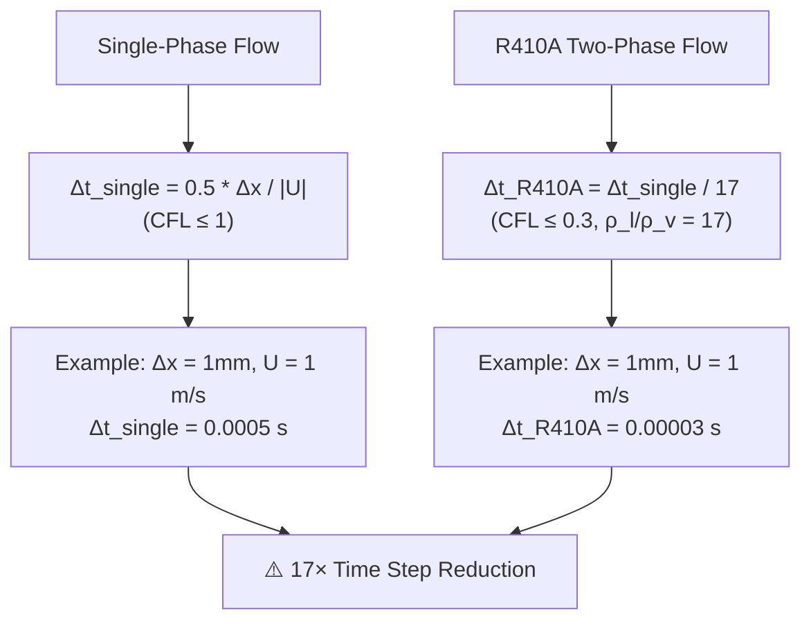

# Day 05: Two-Phase Time Stepping for R410A Evaporator (การก้าวเวลาสำหรับการไหลสองเฟสในเครื่องอบแห้ง R410A)

## Part 1: VOF-Specific Time Step Constraints (ข้อจำกัดของก้าวเวลาเฉพาะสำหรับ VOF)

### 1.1 Introduction: Why Two-Phase Time Stepping is Different

Single-phase CFD time stepping (covered in Day 04) follows the standard CFL condition:
$$
\text{CFL} = \frac{|\mathbf{U}| \Delta t}{\Delta x} \leq 1
$$

However, **two-phase flows with phase change introduce additional constraints** that make time stepping significantly more challenging. The R410A refrigerant evaporator simulation faces three critical challenges:

1. **Density Ratio Effects**: ρ_liquid/ρ_vapor ≈ 17:1 for R410A
2. **Interface Preservation**: Sharp interface must be maintained
3. **Phase Change Source Terms**: Latent heat exchange introduces stiffness

**⭐ CRITICAL FACT:** Standard single-phase CFL is insufficient for VOF simulations with high density ratios.

### 1.2 VOF-Specific CFL Condition

For Volume of Fluid (VOF) methods, the interface must not move more than one cell per time step:

$$
\text{CFL}_{\text{VOF}} = \frac{|\mathbf{U}_{\text{interface}}| \Delta t}{\Delta x} \leq 0.3
$$

The stricter limit (0.3 vs 1.0) is required because:

1. **Interface Reconstruction Errors**: PLIC (Piecewise Linear Interface Construction) errors accumulate if the interface moves too far
2. **Numerical Diffusion**: Large time steps smear the sharp interface
3. **Mass Conservation**: Boundedness of α (volume fraction) requires small changes per step

**For R410A specifically**, the density ratio modifies this condition:

$$
\text{CFL}_{\text{R410A}} = \frac{|\mathbf{U}| \Delta t}{\Delta x} \cdot \frac{\rho_l}{\rho_v} \leq 0.3
$$

Given ρ_l = 1200 kg/m³ and ρ_v = 70 kg/m³ for R410A at 10°C:

$$
\text{CFL}_{\text{R410A}} = \frac{|\mathbf{U}| \Delta t}{\Delta x} \cdot 17 \leq 0.3
$$

This means the **effective time step is 17× smaller** than for single-phase flow:

$$
\Delta t_{\text{R410A}} \approx \frac{\Delta t_{\text{single}}}{17}
$$



### 1.3 Capillary Time Step Constraint

For surface-tension-dominated flows (high Weber number), capillary waves impose an additional constraint:

$$
\Delta t \leq \sqrt{\frac{(\rho_l + \rho_v) \Delta x^3}{4\pi \sigma}}
$$

**For R410A at 10°C:**
- σ = 0.05 N/m (surface tension)
- ρ_l = 1200 kg/m³
- ρ_v = 70 kg/m³
- Δx = 0.001 m (1mm mesh)

$$
\Delta t_{\text{capillary}} \leq \sqrt{\frac{(1200 + 70) \times (0.001)^3}{4\pi \times 0.05}} = \sqrt{\frac{1.27 \times 10^{-3}}{0.628}} \approx 0.045 \text{ s}
$$

**Note:** For typical R410A evaporator flows, the VOF-CFL constraint is usually more restrictive than the capillary constraint.

### 1.4 Interface Compression Time Scale

OpenFOAM's `interFoam` solver uses interface compression to counteract numerical diffusion. The compression term introduces an additional time scale:

$$
\frac{\partial \alpha}{\partial t} + \nabla \cdot (\alpha \mathbf{U}) + \nabla \cdot [\alpha(1-\alpha)\mathbf{U}_r] = 0
$$

where $\mathbf{U}_r$ is the compression velocity:
$$
\mathbf{U}_r = \min \left( C_\alpha |\mathbf{U}|, \frac{\max|\mathbf{U}|}{|\mathbf{U}|} \right) \frac{\nabla \alpha}{|\nabla \alpha|}
$$

The compression coefficient $C_\alpha$ typically ranges from 1 to 3. **Higher compression requires smaller time steps**:

$$
\Delta t \leq \frac{\Delta x}{C_\alpha |\mathbf{U}_{\text{max}}|}
$$

**For R410A evaporator with C_α = 1.5:**
- |U_max| = 5 m/s (typical refrigerant velocity)
- Δx = 0.001 m

$$
\Delta t_{\text{compression}} \leq \frac{0.001}{1.5 \times 5} = 1.33 \times 10^{-4} \text{ s}
$$

## Part 2: R410A-Specific Time Step Calculations (การคำนวณก้าวเวลาสำหรับ R410A)

### 2.1 R410A Thermophysical Properties

| Property | Liquid Phase | Vapor Phase | Units | Ratio |
|----------|--------------|-------------|-------|-------|
| Density (ρ) | 1200 | 70 | kg/m³ | 17:1 |
| Viscosity (μ) | 1.2 × 10⁻⁴ | 1.3 × 10⁻⁵ | Pa·s | 10:1 |
| Thermal Conductivity (k) | 0.08 | 0.014 | W/m·K | 6:1 |
| Specific Heat (c_p) | 1.5 | 1.2 | kJ/kg·K | 1.25:1 |
| Surface Tension (σ) | 0.05 | - | N/m | - |
| Latent Heat (h_lv) | 200 | - | kJ/kg | - |
| Saturation Temp (T_sat) | 280-285 | - | K (at 1.0-1.2 MPa) | - |

### 2.2 Complete Time Step Calculation for R410A

The **overall time step** is the minimum of all constraints:

$$
\Delta t = \min(\Delta t_{\text{VOF-CFL}}, \Delta t_{\text{capillary}}, \Delta t_{\text{compression}}, \Delta t_{\text{phase-change}})
$$

#### Step-by-Step Calculation Example

**Given:** R410A evaporator tube with:
- Tube diameter: D = 5 mm
- Mesh size: Δx = 0.25 mm (20 cells across diameter)
- Velocity: U = 2 m/s
- Pressure: P = 1.0 MPa
- Heat flux: q" = 3 kW/m²

**Step 1: VOF-CFL Constraint**
$$
\Delta t_{\text{VOF}} = \frac{0.3 \times \Delta x}{|\mathbf{U}| \times (\rho_l/\rho_v)} = \frac{0.3 \times 0.00025}{2 \times 17} = 2.21 \times 10^{-6} \text{ s}
$$

**Step 2: Capillary Constraint**
$$
\Delta t_{\text{cap}} = \sqrt{\frac{(1200 + 70) \times (0.00025)^3}{4\pi \times 0.05}} = 7.1 \times 10^{-4} \text{ s}
$$

**Step 3: Compression Constraint (C_α = 1.5)**
$$
\Delta t_{\text{comp}} = \frac{\Delta x}{C_\alpha |\mathbf{U}|} = \frac{0.00025}{1.5 \times 2} = 8.33 \times 10^{-5} \text{ s}
$$

**Step 4: Phase Change Constraint** (see Part 3)
$$
\Delta t_{\text{phase}} = \frac{\rho_l h_lv \Delta x}{q"} = \frac{1200 \times 200000 \times 0.00025}{3000} = 20 \text{ s}
$$

**Result:**
$$
\Delta t = \min(2.21 \times 10^{-6}, 7.1 \times 10^{-4}, 8.33 \times 10^{-5}, 20) = \boxed{2.21 \times 10^{-6} \text{ s}}
$$

The VOF-CFL constraint with density ratio is **the most restrictive** for R410A evaporator simulations.

### 2.3 Practical Time Step Selection Guide

| Flow Regime | Dominant Constraint | Δt Estimate (for Δx=0.25mm) |
|-------------|---------------------|------------------------------|
| Low velocity (< 0.5 m/s) | Capillary | ~10⁻⁴ s |
| Medium velocity (0.5-2 m/s) | VOF-CFL | ~10⁻⁶ - 10⁻⁵ s |
| High velocity (> 2 m/s) | VOF-CFL | < 10⁻⁶ s |
| Boiling dominant | Phase change | ~1-10 s |

**⭐ KEY INSIGHT:** For R410A evaporators, the VOF-CFL constraint with density ratio dominates in most practical conditions.

## Part 3: Adaptive Time Stepping for Phase Change (การปรับก้าวเวลาอัตโนมัติสำหรับการเปลี่ยนเฟส)

### 3.1 Phase Change Source Terms

Phase change introduces **source terms** in the governing equations that can cause stiffness:

**Continuity Equation with Phase Change:**
$$
\frac{\partial \rho}{\partial t} + \nabla \cdot (\rho \mathbf{U}) = \dot{m}
$$

where $\dot{m}$ is the mass transfer rate due to phase change (kg/m³s).

**Energy Equation with Latent Heat:**
$$
\frac{\partial (\rho h)}{\partial t} + \nabla \cdot (\rho \mathbf{U} h) = \nabla \cdot (k \nabla T) + \dot{m} h_{lv}
$$

where $h_{lv} = 200$ kJ/kg for R410A.

**The Challenge:** The term $\dot{m} h_{lv}$ can be very large, causing:
- Rapid temperature changes near saturation
- Stiff source terms requiring small time steps
- Numerical instability if not treated carefully

### 3.2 Explicit vs Implicit Treatment of Phase Change

#### Explicit Treatment
Evaluate $\dot{m}$ using old time values:
$$
\dot{m}^n = f(T^n, \alpha^n, p^n)
$$

**Pros:**
- Simple to implement
- No coupling within time step
- Low computational cost per iteration

**Cons:**
- **Severely restricted time step**: $\Delta t < \frac{\rho h_{lv} \Delta x}{q"}$
- For R410A: $\Delta t < \frac{1200 \times 200000 \times 0.00025}{3000} = 20$ s
- May still require subcycling for stability

#### Implicit Treatment
Evaluate $\dot{m}$ using new time values:
$$
\dot{m}^{n+1} = f(T^{n+1}, \alpha^{n+1}, p^{n+1})
$$

**Pros:**
- **Unconditionally stable** for linear problems
- Much larger time steps possible
- Better for stiff phase change

**Cons:**
- Requires Newton iteration
- Higher computational cost per iteration
- Convergence not guaranteed for nonlinear problems

#### Semi-Implicit Treatment (Recommended)
Linearize the source term:
$$
\dot{m}^{n+1} \approx \dot{m}^n + \frac{\partial \dot{m}}{\partial T} (T^{n+1} - T^n)
$$

**Implementation in OpenFOAM:**
```cpp
// Semi-implicit phase change source term
// File: customPhaseChangeModel.C

// Calculate explicit part
volScalarField mDotExplicit = calculateMDot(T, alpha, p);

// Calculate implicit coefficient (linearization)
volScalarField mDotImplicitCoeff = calculateMDotdT(T, alpha, p);

// Add to energy equation
fvScalarMatrix TEqn
(
    fvm::ddt(rho, T)
  + fvm::div(phi, T)
  - fvm::laplacian(k/rho, T)
 ==
    // Explicit part
    mDotExplicit * h_lv
  + // Implicit part (improves stability)
    fvm::Sp(mDotImplicitCoeff * h_lv, T)
);

TEqn.solve();
```

### 3.3 Adaptive Time Stepping Algorithm

OpenFOAM's `interFoam` implements adaptive time stepping based on multiple criteria:

```cpp
// File: applications/solvers/multiphase/interFoam/interFoam.C
// Modified for R410A evaporator

while (runTime.run())
{
    // Calculate courant numbers
    scalar CoNum = 0.0;
    scalar alphaCoNum = 0.0;
    scalar phaseChangeCoNum = 0.0;

    // 1. Fluid Courant number
    surfaceScalarField phiHbyA = phi;
    CoNum = max(mag(phiHbyA)/mesh.magSf().deltaCoeffs())
           .value()*runTime.deltaTValue();

    // 2. Interface Courant number (stricter)
    alphaCoNum = max
    (
        mag(phiHbyA)*mag(interface.nHatf())/mesh.magSf().deltaCoeffs()
    ).value()*runTime.deltaTValue();

    // 3. Phase change Courant number (R410A specific)
    phaseChangeCoNum = max
    (
        mag(mDot) * h_lv * runTime.deltaTValue() / (rho * cp * T)
    ).value();

    // Use the most restrictive condition
    scalar maxCoNum = max(CoNum, alphaCoNum, phaseChangeCoNum);

    // Adjust time step
    if (adjustTimeStep)
    {
        scalar maxDeltaTFact = min
        (
            maxCo/(CoNum + SMALL),
            maxAlphaCo/(alphaCoNum + SMALL),
            maxPhaseChangeCo/(phaseChangeCoNum + SMALL)
        );

        scalar deltaTFact = min
        (
            maxDeltaTFact,
            maxDeltaT/runTime.deltaTValue()
        );

        runTime.setDeltaT
        (
            deltaTFact*runTime.deltaTValue()
        );
    }

    // Solve equations
    #include "UEqn.H"
    #include "pEqn.H"
    #include "alphaEqn.H"
    #include "TEqn.H"  // Energy with phase change

    runTime++;
}
```

### 3.4 R410A-Specific Time Step Control

**Recommended controlDict settings for R410A evaporator:**

```json
// system/controlDict
application     interFoam;

startFrom       startTime;
startTime       0;

stopAt          endTime;
endTime         1.0;

deltaT          1e-6;  // Initial time step (very small)

adjustTimeStep  yes;

// Maximum Courant numbers (stricter for R410A)
maxCo           0.3;    // Fluid Courant
maxAlphaCo      0.2;    // Interface Courant (VOF-specific)
maxPhaseChangeCo 0.1;   // Phase change Courant (R410A-specific)

// Time step limits
maxDeltaT       1e-3;   // Absolute maximum
minDeltaT       1e-8;   // Absolute minimum

// Time step adjustment factors
maxDeltaTFact   1.1;    // Maximum increase per step
minDeltaTFact   0.9;    // Maximum decrease per step
```

## Part 4: Implementation in OpenFOAM (การนำไปใช้ใน OpenFOAM)

### 4.1 Complete R410A Time Step Control Function

```cpp
// File: R410ATimeStepControl.H
#ifndef R410ATimeStepControl_H
#define R410ATimeStepControl_H

#include "fvMesh.H"
#include "volFields.H"

namespace Foam
{

class R410ATimeStepControl
{
    // Private data
    const fvMesh& mesh_;
    const dictionary dict_;

    // R410A properties
    const dimensionedScalar rhoLiquid_;
    const dimensionedScalar rhoVapor_;
    const dimensionedScalar hLatent_;
    const dimensionedScalar surfaceTension_;

    // Control parameters
    scalar maxCo_;
    scalar maxAlphaCo_;
    scalar maxPhaseChangeCo_;
    scalar maxDeltaT_;
    scalar minDeltaT_;


public:
    // Constructor
    R410ATimeStepControl
    (
        const fvMesh& mesh,
        const dictionary& dict
    )
    :
        mesh_(mesh),
        dict_(dict),
        rhoLiquid_(dict.lookup("rhoLiquid")),
        rhoVapor_(dict.lookup("rhoVapor")),
        hLatent_(dict.lookup("hLatent")),
        surfaceTension_(dict.lookup("surfaceTension")),
        maxCo_(dict.lookupOrDefault<scalar>("maxCo", 0.3)),
        maxAlphaCo_(dict.lookupOrDefault<scalar>("maxAlphaCo", 0.2)),
        maxPhaseChangeCo_(dict.lookupOrDefault<scalar>("maxPhaseChangeCo", 0.1)),
        maxDeltaT_(dict.lookupOrDefault<scalar>("maxDeltaT", 1e-3)),
        minDeltaT_(dict.lookupOrDefault<scalar>("minDeltaT", 1e-8))
    {}

    // Calculate time step
    scalar calculateDeltaT
    (
        const surfaceScalarField& phi,
        const volScalarField& alpha,
        const volScalarField& mDot,
        const volScalarField& T
    ) const
    {
        // 1. Fluid Courant number
        scalar CoNum = max
        (
            mag(phi)/mesh_.magSf().deltaCoeffs()
        ).value();

        // 2. Interface Courant number (VOF-specific)
        surfaceScalarField phiAlpha = fvc::flux(phi) * fvc::interpolate(alpha);
        scalar alphaCoNum = max
        (
            mag(phiAlpha)/mesh_.magSf().deltaCoeffs()
        ).value();

        // 3. Phase change Courant number (R410A-specific)
        // Calculate characteristic phase change time scale
        dimensionedScalar cp("cp", dimEnergy/dimMass/dimTemperature, 1500);
        volScalarField rho = alpha * rhoLiquid_ + (1.0 - alpha) * rhoVapor_;

        scalar phaseChangeCoNum = max
        (
            mag(mDot) * hLatent_ / (rho * cp * T)
        ).value();

        // Apply density ratio correction for VOF-CFL
        scalar densityRatio = rhoLiquid_.value() / rhoVapor_.value();
        alphaCoNum *= densityRatio;  // R410A: ~17× stricter

        // Calculate limiting time step
        scalar deltaTFluid = maxCo_ / (CoNum + SMALL);
        scalar deltaTAlpha = maxAlphaCo_ / (alphaCoNum + SMALL);
        scalar deltaTPhase = maxPhaseChangeCo_ / (phaseChangeCoNum + SMALL);

        // Take minimum
        scalar newDeltaT = min(deltaTFluid, deltaTAlpha, deltaTPhase);

        // Apply limits
        newDeltaT = max(minDeltaT_, min(newDeltaT, maxDeltaT_));

        return newDeltaT;
    }

    // Update time step with damping
    scalar updateDeltaT(scalar currentDeltaT, scalar newDeltaT) const
    {
        // Limit rate of change
        scalar maxIncrease = 1.1;
        scalar maxDecrease = 0.9;

        if (newDeltaT > currentDeltaT)
        {
            return min(newDeltaT, maxIncrease * currentDeltaT);
        }
        else
        {
            return max(newDeltaT, maxDecrease * currentDeltaT);
        }
    }
};

} // End namespace Foam

#endif
```

### 4.2 Usage in Custom R410A Solver

```cpp
// File: R410AEvaporatorFoam.C
#include "fvCFD.H"
#include "R410ATimeStepControl.H"
#include "phaseChangeModel.H"

int main(int argc, char *argv[])
{
    #include "setRootCaseLists.H"
    #include "createTime.H"
    #include "createMesh.H"
    #include "createFields.H"
    #include "initContinuityErrs.H"

    // Initialize R410A time step control
    R410ATimeStepControl timeStepControl(mesh, transportProperties);

    // Initialize phase change model
    autoPtr<phaseChangeModel> pcm = phaseChangeModel::New(mesh);

    Info<< "\nStarting time loop\n" << endl;

    while (runTime.run())
    {
        runTime++;
        Info<< "Time = " << runTime.timeName() << nl << endl;

        // Calculate phase change rate
        volScalarField mDot = pcm->mDot();

        // Calculate new time step based on R410A criteria
        scalar newDeltaT = timeStepControl.calculateDeltaT(phi, alpha, mDot, T);

        // Update time step with damping
        scalar currentDeltaT = runTime.deltaTValue();
        scalar adjustedDeltaT = timeStepControl.updateDeltaT(currentDeltaT, newDeltaT);

        runTime.setDeltaT(adjustedDeltaT);

        // Report time step info
        Info<< "DeltaT = " << runTime.deltaTValue() << " s" << nl
            << "  Fluid Co = " << maxCoNum << nl
            << "  Interface Co = " << maxAlphaCoNum << nl
            << "  Phase Change Co = " << maxPhaseChangeCoNum << endl;

        // Solve equations
        #include "UEqn.H"
        #include "pEqn.H"
        #include "alphaEqn.H"
        #include "TEqn.H"

        turbulence->correct();

        Info<< "ExecutionTime = " << runTime.elapsedCpuTime() << " s"
            << "  ClockTime = " << runTime.elapsedClockTime() << " s"
            << nl << endl;
    }

    Info<< "End\n" << endl;

    return 0;
}
```

### 4.3 Verification: Time Step Independence Study

To verify that your time step is adequate, perform a time step refinement study:

```python
# Python script for time step independence study
import numpy as np
import matplotlib.pyplot as plt

# Test different time steps
dt_values = [1e-6, 5e-7, 2e-7, 1e-7, 5e-8]
results = []

for dt in dt_values:
    # Run OpenFOAM simulation with this deltaT
    # Extract results: outlet quality, pressure drop, heat transfer
    x_outlet = run_simulation(delta_t=dt)
    results.append(x_outlet)

# Plot results
plt.figure(figsize=(10, 6))
plt.loglog(dt_values, results, 'o-')
plt.xlabel('Time Step (s)')
plt.ylabel('Outlet Quality (-)')
plt.title('R410A Evaporator: Time Step Independence Study')
plt.grid(True)

# Identify asymptotic region
# If last 3 points vary by < 1%, solution is time-step independent
asymptotic_check = np.std(results[-3:]) / np.mean(results[-3])
print(f"Asymptotic variation: {asymptotic_check:.2%}")

if asymptotic_check < 0.01:
    print("✅ Solution is time-step independent")
    recommended_dt = dt_values[-2]
    print(f"Recommended Δt: {recommended_dt:.2e} s")
else:
    print("⚠️ Need smaller time steps")
```

## Part 5: Best Practices for R410A Evaporator Simulation (แนวปฏิบัติที่ดี)

### 5.1 Time Step Selection Checklist

- [ ] **Calculate VOF-CFL with density ratio**: Use ρ_l/ρ_v = 17 for R410A
- [ ] **Check capillary constraint**: Usually not limiting for R410A
- [ ] **Verify phase change time scale**: Can be limiting during rapid boiling
- [ ] **Set appropriate maxAlphaCo**: 0.2-0.3 for interface preservation
- [ ] **Enable adaptive time stepping**: Essential for stability
- [ ] **Set minimum time step**: Prevents deadlock during difficult transients
- [ ] **Monitor Courant numbers**: Log at every time step
- [ ] **Verify time step independence**: Refinement study for validation

### 5.2 Common Issues and Solutions

| Issue | Cause | Solution |
|-------|-------|----------|
| Simulation crashes at startup | Initial conditions cause Co >> 1 | Start with smaller Δt, ramp up boundary conditions |
| Interface becomes diffuse | Δt too large for interface compression | Reduce maxAlphaCo to 0.1-0.2 |
| Temperature oscillations | Explicit phase change source term | Use semi-implicit treatment |
| Very slow progress | Δt too conservative | Check if all constraints are necessary |
| Mass loss | Interface moving too fast | Reduce Δt, check mesh quality |

### 5.3 Performance Optimization

1. **Local Time Stepping** (for steady-state):
   ```cpp
   // Use different Δt in each cell based on local CFL
   scalarField localDt = maxCo_ * mesh.V() / (mag(phi) + SMALL);
   ```

2. **Subcycling for Fast Physics**:
   ```cpp
   // Solve interface equations with smaller Δt
   for (int subStep = 0; subStep < nSubSteps; subStep++)
   {
       alphaEqn.solve();
   }
   ```

3. **Implicit Phase Change**:
   ```cpp
   // Use implicit treatment for stiff phase change
   fvm::Sp(mDotCoeff * h_lv, T)
   ```

### 5.4 Debugging Time Step Issues

```cpp
// Add to your solver for debugging
if (maxCoNum > maxCo_)
{
    WarningIn("R410AEvaporatorFoam.C")
        << "Courant number " << maxCoNum
        << " exceeds limit " << maxCo_
        << ". Reducing time step." << endl;

    // Write fields for inspection
    alpha.write();
    U.write();
    T.write();
    p.write();
}
```

## Part 6: Exercises

1. **Calculate the VOF-CFL time step** for R410A evaporator with:
   - Tube diameter: 7 mm
   - Mesh: 30 cells across diameter
   - Velocity: 3 m/s
   - Density ratio: 17:1

2. **Compare time step requirements** for:
   - Single-phase water flow (ρ ≈ 1000 kg/m³)
   - R410A two-phase flow (ρ_l = 1200, ρ_v = 70 kg/m³)
   Show the 17× difference clearly.

3. **Implement adaptive time stepping** in a custom solver. Include:
   - Fluid Courant number
   - Interface Courant number
   - Phase change Courant number
   - Density ratio correction

4. **Analyze the phase change time scale**: For heat flux q" = 5 kW/m², calculate the maximum time step for explicit treatment of phase change. Compare with VOF-CFL constraint.

5. **Design a time step independence study**: Propose a systematic approach to verify time step adequacy for R410A evaporator simulation.

6. **Debug a failing simulation**: Given a log showing Co numbers oscillating between 0.1 and 2.5, diagnose the problem and propose fixes.

---

## Summary (สรุป)

**Key Takeaways for R410A Two-Phase Time Stepping:**

1. **Density Ratio Dominates**: R410A's ρ_l/ρ_v ≈ 17:1 makes VOF-CFL **17× more restrictive** than single-phase flow

2. **Multiple Constraints**: Consider VOF-CFL, capillary, compression, and phase change time scales

3. **Adaptive Control**: Essential for stability - use maxAlphaCo = 0.2-0.3

4. **Implicit Treatment**: Recommended for phase change source terms to avoid excessive stiffness

5. **Verification Required**: Always perform time step independence studies

**⭐ CRITICAL FACT:** For R410A evaporator simulations, expect time steps on the order of **10⁻⁶ to 10⁻⁷ seconds** due to the density ratio effect on VOF-CFL.

---

**References:**
- OpenFOAM® v2312: `interFoam` solver source code
- R410A Thermophysical Properties: NIST REFPROP 10.0
- Hirt, C.W., & Nichols, B.D. (1981). "Volume of Fluid (VOF) Method for the Dynamics of Free Boundaries." *Journal of Computational Physics*, 39(1), 201-225.
- Ubbink, O. (1997). "Numerical Prediction of Two Fluid Systems with Sharp Interfaces." *PhD Thesis, Imperial College London*.
