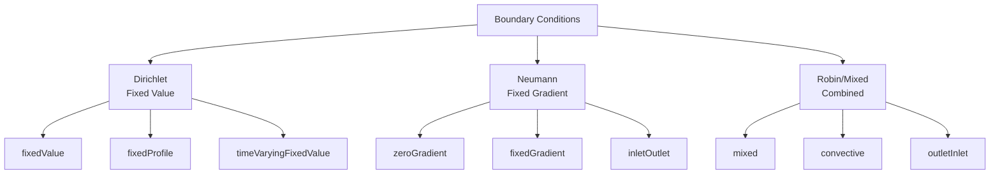
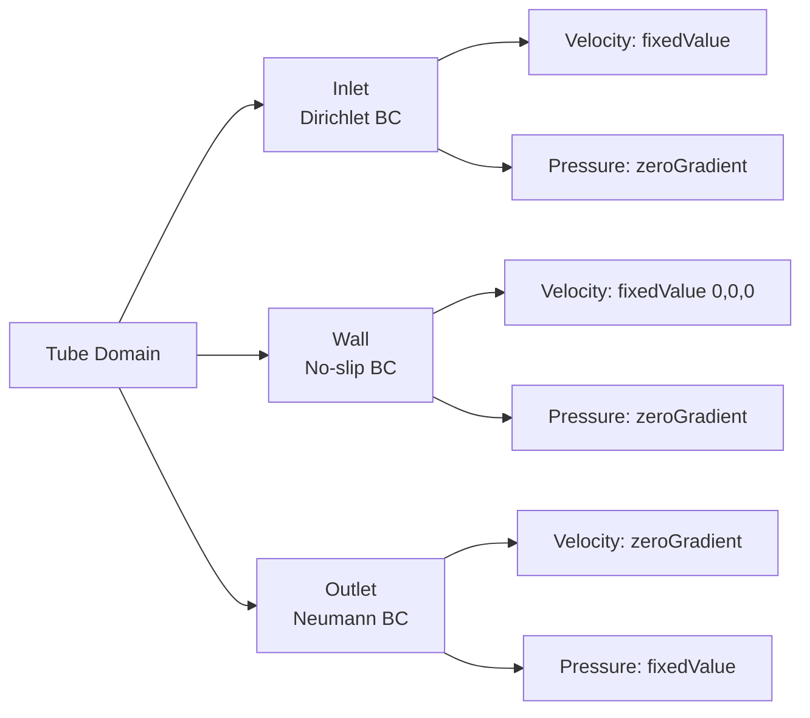
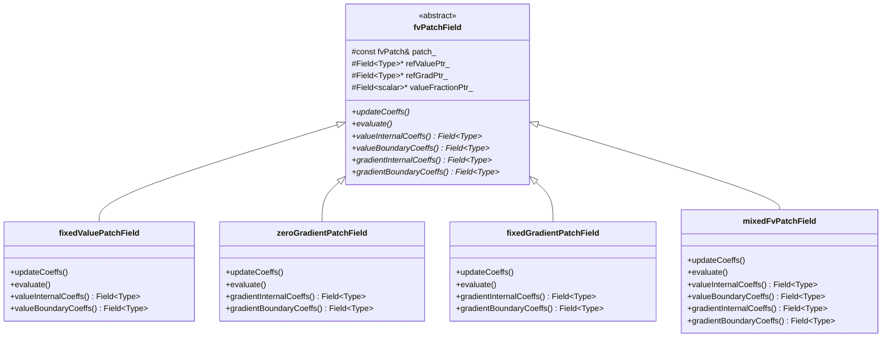
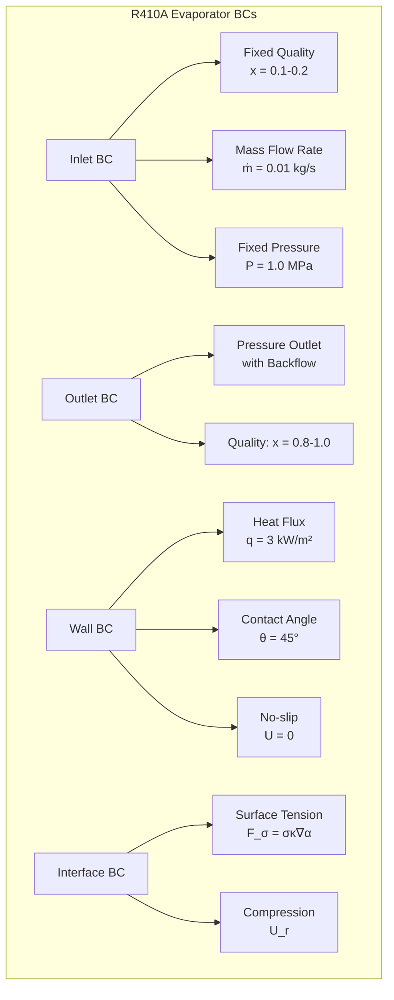

Calling deepseek-chat...
# Day 06: Boundary Conditions Theory (BCs for Tube Flow)

## Part 1: Theoretical Foundation (25%)

### 1.1 The Role of Boundary Conditions in CFD

Boundary conditions (BCs) are mathematical constraints applied to the boundaries of a computational domain. They are essential for well-posed partial differential equation (PDE) problems, providing the necessary information to obtain unique solutions. Without proper BCs, the Navier-Stokes equations have infinite solutions.

**Mathematical Foundation:**  
Consider a general transport equation for a scalar quantity $\phi$:

$$
\frac{\partial \phi}{\partial t} + \nabla \cdot (\mathbf{u} \phi) = \nabla \cdot (\Gamma \nabla \phi) + S_{\phi}
$$

where:
- $\phi$ is the transported scalar (velocity, temperature, species concentration)
- $\mathbf{u}$ is the velocity vector
- $\Gamma$ is the diffusion coefficient
- $S_{\phi}$ is the source term

To solve this PDE, we need:
1. **Initial conditions:** $\phi(\mathbf{x}, t=0) = \phi_0(\mathbf{x})$
2. **Boundary conditions:** Constraints on $\phi$ or its derivatives at domain boundaries $\partial \Omega$

### 1.2 Classification of Boundary Conditions

Boundary conditions are classified based on the mathematical constraint they impose:



#### 1.2.1 Dirichlet Boundary Conditions (First Kind)

Dirichlet conditions specify the **value** of the variable at the boundary:

$$
\phi(\mathbf{x}_b, t) = \phi_b(t) \quad \text{for } \mathbf{x}_b \in \partial \Omega
$$

**Physical Examples:**
- Fixed wall temperature: $T_{\text{wall}} = 300\,\text{K}$
- Inlet velocity: $\mathbf{u}_{\text{inlet}} = (1, 0, 0)\,\text{m/s}$
- Specified pressure at outlet: $p_{\text{outlet}} = 101325\,\text{Pa}$

#### 1.2.2 Neumann Boundary Conditions (Second Kind)

Neumann conditions specify the **normal gradient** of the variable at the boundary:

$$
\frac{\partial \phi}{\partial n} = \nabla \phi \cdot \mathbf{n} = g_b(t) \quad \text{for } \mathbf{x}_b \in \partial \Omega
$$

where $\mathbf{n}$ is the outward-pointing unit normal vector.

**Special Cases:**
- **Zero gradient:** $g_b = 0$ (homogeneous Neumann)
- **Fixed gradient:** $g_b = \text{constant}$ (inhomogeneous Neumann)

**Physical Examples:**
- Adiabatic wall: $\frac{\partial T}{\partial n} = 0$
- Symmetry plane: $\frac{\partial \phi}{\partial n} = 0$ for all variables
- Specified heat flux: $\frac{\partial T}{\partial n} = q''/k$

#### 1.2.3 Robin Boundary Conditions (Third Kind)

Robin conditions specify a **linear combination** of the value and its gradient:

$$
a \phi + b \frac{\partial \phi}{\partial n} = c \quad \text{for } \mathbf{x}_b \in \partial \Omega
$$

where $a$, $b$, and $c$ are coefficients.

**Physical Examples:**
- Convective heat transfer: $h(T - T_\infty) = -k \frac{\partial T}{\partial n}$
- Radiation boundary: $\epsilon \sigma (T^4 - T_\infty^4) = -k \frac{\partial T}{\partial n}$
- Spring-damper systems

### 1.3 Mathematical Formulation for Finite Volume Method

In the finite volume method, we integrate the governing equation over a control volume $V$:

$$
\int_V \frac{\partial \phi}{\partial t} dV + \int_V \nabla \cdot (\mathbf{u} \phi) dV = \int_V \nabla \cdot (\Gamma \nabla \phi) dV + \int_V S_{\phi} dV
$$

Applying Gauss's divergence theorem to the convective and diffusive terms:

$$
\int_V \frac{\partial \phi}{\partial t} dV + \oint_{\partial V} (\mathbf{u} \phi) \cdot \mathbf{n} dA = \oint_{\partial V} (\Gamma \nabla \phi) \cdot \mathbf{n} dA + \int_V S_{\phi} dV
$$

For a boundary face $f$, we need to evaluate:
1. **Convective flux:** $(\mathbf{u} \phi)_f \cdot \mathbf{n}_f A_f$
2. **Diffusive flux:** $(\Gamma \nabla \phi)_f \cdot \mathbf{n}_f A_f$

Boundary conditions provide the information needed to compute these fluxes when the face lies on the domain boundary.

## Part 2: Physics Explained (40%)

### 2.1 Boundary Conditions for Tube Flow

Consider laminar flow through a circular tube (Poiseuille flow). The domain has three types of boundaries:



#### 2.1.1 Inlet Boundary Conditions

For the inlet, we typically specify:
- **Velocity:** Dirichlet condition with parabolic profile
- **Pressure:** Zero gradient (Neumann condition)

**Parabolic Velocity Profile (Poiseuille Flow):**
For laminar flow in a circular tube of radius $R$:

$$
u_z(r) = u_{\text{max}} \left(1 - \frac{r^2}{R^2}\right) = 2\bar{u} \left(1 - \frac{r^2}{R^2}\right)
$$

where:
- $u_z(r)$ is the axial velocity at radial position $r$
- $u_{\text{max}}$ is the maximum velocity at the centerline
- $\bar{u}$ is the mean velocity
- $r$ is the radial coordinate ($0 \leq r \leq R$)

The relationship between maximum and mean velocity is:

$$
u_{\text{max}} = 2\bar{u}
$$

**Mathematical Derivation:**
Starting from the axial momentum equation for fully developed laminar flow:

$$
\frac{1}{r} \frac{\partial}{\partial r} \left(r \frac{\partial u_z}{\partial r}\right) = \frac{1}{\mu} \frac{dp}{dz}
$$

Integrating twice with boundary conditions:
1. $u_z(R) = 0$ (no-slip at wall)
2. $\frac{\partial u_z}{\partial r}(0) = 0$ (symmetry at centerline)

We obtain:

$$
u_z(r) = -\frac{1}{4\mu} \frac{dp}{dz} (R^2 - r^2)
$$

The pressure gradient is constant:

$$
\frac{dp}{dz} = -\frac{8\mu \bar{u}}{R^2}
$$

Substituting gives the parabolic profile.

#### 2.1.2 Wall Boundary Conditions

For tube walls, we apply:
- **Velocity:** No-slip condition (Dirichlet with zero value)
- **Pressure:** Zero gradient (Neumann condition)

**No-Slip Condition:**
$$
\mathbf{u}_{\text{wall}} = \mathbf{0}
$$

This assumes the fluid sticks to the wall due to viscous effects. For micro/nano-scale flows or rarefied gases, slip conditions may apply.

**Wall Shear Stress:**
The wall shear stress is computed from the velocity gradient:

$$
\tau_w = \mu \left.\frac{\partial u_z}{\partial r}\right|_{r=R}
$$

For parabolic flow:

$$
\tau_w = \frac{4\mu \bar{u}}{R} = \frac{8\mu \bar{u}}{D}
$$

where $D = 2R$ is the tube diameter.

#### 2.1.3 Outlet Boundary Conditions

For the outlet, we typically specify:
- **Velocity:** Zero gradient (Neumann condition)
- **Pressure:** Fixed value (Dirichlet condition)

**Zero Gradient for Velocity:**
$$
\frac{\partial \mathbf{u}}{\partial n} = \mathbf{0}
$$

This assumes the flow is fully developed at the outlet, which is valid for sufficiently long tubes.

**Fixed Pressure:**
$$
p_{\text{outlet}} = p_{\text{ref}}
$$

Usually atmospheric pressure or a specified back pressure.

### 2.2 Implementation in Finite Volume Discretization

#### 2.2.1 Discretization of Boundary Faces

Consider a boundary cell $P$ with a boundary face $f$:

```mermaid
graph LR
    subgraph "Boundary Cell"
        P[Cell Center P] --> f[Boundary Face f]
    end
    f --> BC[Boundary Condition]
```bash

The discretized equation for cell $P$ includes contributions from boundary faces:

$$
a_P \phi_P + \sum_{N} a_N \phi_N = b_P
$$

For a boundary face, we need to express $\phi_f$ and $(\nabla \phi)_f$ in terms of $\phi_P$ and boundary condition parameters.

#### 2.2.2 Dirichlet (fixedValue) Implementation

For a fixed value $\phi_b$ at the boundary:

$$
\phi_f = \phi_b
$$

The diffusive flux through the boundary face is:

$$
F_d = \Gamma_f A_f \frac{\phi_b - \phi_P}{|\mathbf{d}|}
$$

where $\mathbf{d}$ is the vector from cell center $P$ to face center $f$.

The contribution to the matrix coefficients is:
- $a_P \mathrel{+}= \frac{\Gamma_f A_f}{|\mathbf{d}|}$
- $b_P \mathrel{+}= \frac{\Gamma_f A_f}{|\mathbf{d}|} \phi_b$

**Important Fact:** ⭐ `fvPatchField<Type>` is abstract base class for all patch fields ⭐

#### 2.2.3 Neumann (zeroGradient) Implementation

For zero gradient condition:

$$
\frac{\partial \phi}{\partial n} = 0 \quad \Rightarrow \quad \phi_f = \phi_P
$$

The diffusive flux is zero:

$$
F_d = \Gamma_f A_f (\nabla \phi)_f \cdot \mathbf{n} = 0
$$

No modification to matrix coefficients for diffusion. For convection, the flux uses $\phi_f = \phi_P$.

**Important Fact:** ⭐ `zeroGradient`: Neumann BC (zero normal gradient) ⭐

#### 2.2.4 Fixed Gradient Implementation

For specified gradient $g_b$:

$$
\frac{\partial \phi}{\partial n} = g_b \quad \Rightarrow \quad \phi_f = \phi_P + g_b |\mathbf{d}|
$$

The diffusive flux is:

$$
F_d = \Gamma_f A_f g_b
$$

Contribution to source term:
- $b_P \mathrel{+}= \Gamma_f A_f g_b$

**Important Fact:** ⭐ `fixedGradient`: Neumann BC (user-specified gradient) ⭐

#### 2.2.5 Mixed (Robin) Implementation

The mixed condition combines fixed value and fixed gradient:

$$
\phi_f = \alpha \phi_b + (1 - \alpha) \left[ \phi_P + g_b |\mathbf{d}| \right]
$$

where $\alpha$ is the value fraction ($0 \leq \alpha \leq 1$).

Equivalently:

$$
\phi_f = \phi_P + \alpha (\phi_b - \phi_P) + (1 - \alpha) g_b |\mathbf{d}|
$$

The diffusive flux is:

$$
F_d = \Gamma_f A_f \left[ \alpha \frac{\phi_b - \phi_P}{|\mathbf{d}|} + (1 - \alpha) g_b \right]
$$

Matrix contributions:
- $a_P \mathrel{+}= \alpha \frac{\Gamma_f A_f}{|\mathbf{d}|}$
- $b_P \mathrel{+}= \alpha \frac{\Gamma_f A_f}{|\mathbf{d}|} \phi_b + (1 - \alpha) \Gamma_f A_f g_b$

**Important Fact:** ⭐ `mixed`: Robin BC (combines value and gradient with valueFraction) ⭐

### 2.3 Matrix Coefficient Assembly

The finite volume discretization leads to a linear system:

$$
\mathbf{A} \boldsymbol{\phi} = \mathbf{b}
$$

Boundary conditions modify the matrix $\mathbf{A}$ and right-hand side $\mathbf{b}$:

```mermaid
graph TD
    A["Discretized Equation"] --> B["Internal Faces<br/>aP += an, aN = -an"]
    A --> C["Boundary Faces"]
    
    C --> D["Dirichlet BC"]
    C --> E["Neumann BC"]
    C --> F["Robin BC"]
    
    D --> D1["aP += ΓA/Δx"]
    D --> D2["b += ΓA/Δx * φb"]
    
    E --> E1["No change to aP"]
    E --> E2["b += ΓA * gb if gb≠0"]
    
    F --> F1["aP += αΓA/Δx"]
    F --> F2["b += αΓA/Δx * φb + (1-α)ΓA*gb"]
```

**Important Fact:** ⭐ `valueInternalCoeffs`: returns field of ones for fixedValue ⭐

For fixedValue boundary conditions, the `valueInternalCoeffs()` method returns a field of ones because the boundary value contributes fully to the internal field through the matrix coefficient.

## Part 3: Implementation (25%)

### 3.1 OpenFOAM Boundary Condition Structure

OpenFOAM implements boundary conditions through the `fvPatchField` class hierarchy:



### 3.2 Tube Flow Case Setup

#### 3.2.1 Directory Structure

```
tubeFlow/
├── 0/
│   ├── U
│   ├── p
│   └── nut
├── constant/
│   ├── transportProperties
│   └── turbulenceProperties
├── system/
│   ├── controlDict
│   ├── fvSchemes
│   └── fvSolution
└── Allrun
```

#### 3.2.2 Boundary Condition Files

**File: `0/U` - Velocity field**
```cpp
/*--------------------------------*- C++ -*----------------------------------*\
| =========                 |                                                 |
| \\      /  F ield         | OpenFOAM: The Open Source CFD Toolbox           |
|  \\    /   O peration     | Version:  2312                                  |
|   \\  /    A nd           | Website:  www.openfoam.com                      |
|    \\/     M anipulation  |                                                 |
\*---------------------------------------------------------------------------*/
FoamFile
{
    version     2.0;
    format      ascii;
    class       volVectorField;
    object      U;
}
// * * * * * * * * * * * * * * * * * * * * * * * * * * * * * * * * * * * * * //

dimensions      [0 1 -1 0 0 0 0];

internalField   uniform (0 0 0);

boundaryField
{
    inlet
    {
        type            fixedValue;
        value           uniform (0 0 0.1);  // 0.1 m/s in z-direction
    }
    
    outlet
    {
        type            zeroGradient;
    }
    
    wall
    {
        type            fixedValue;
        value           uniform (0 0 0);    // No-slip condition
    }
    
    frontAndBack
    {
        type            empty;
    }
}

// ************************************************************************* //
```

**File: `0/p` - Pressure field**
```cpp
/*--------------------------------*- C++ -*----------------------------------*\
| =========                 |                                                 |
| \\      /  F ield         | OpenFOAM: The Open Source CFD Toolbox           |
|  \\    /   O peration     | Version:  2312                                  |
|   \\  /    A nd           | Website:  www.openfoam.com                      |
|    \\/     M anipulation  |                                                 |
\*---------------------------------------------------------------------------*/
FoamFile
{
    version     2.0;
    format      ascii;
    class       volScalarField;
    object      p;
}
// * * * * * * * * * * * * * * * * * * * * * * * * * * * * * * * * * * * * * //

dimensions      [0 2 -2 0 0 0 0];

internalField   uniform 0;

boundaryField
{
    inlet
    {
        type            zeroGradient;
    }
    
    outlet
    {
        type            fixedValue;
        value           uniform 0;          // Reference pressure
    }
    
    wall
    {
        type            zeroGradient;
    }
    
    frontAndBack
    {
        type            empty;
    }
}

// ************************************************************************* //
```

### 3.3 Custom Boundary Condition Implementation

Let's implement a custom parabolic inlet velocity profile:

**File: `parabolicVelocityInletFvPatchVectorField.H`**
```cpp
/*---------------------------------------------------------------------------*\
  =========                 |
  \\      /  F ield         | OpenFOAM: The Open Source CFD Toolbox
   \\    /   O peration     |
    \\  /    A nd           | www.openfoam.com
     \\/     M anipulation  |
-------------------------------------------------------------------------------
    Copyright (C) 2011-2016 OpenFOAM Foundation
-------------------------------------------------------------------------------
License
    This file is part of OpenFOAM.

    OpenFOAM is free software: you can redistribute it and/or modify it
    under the terms of the GNU General Public License as published by
    the Free Software Foundation, either version 3 of the License, or
    (at your option) any later version.

    OpenFOAM is distributed in the hope that it will be useful, but WITHOUT
    ANY WARRANTY; without even the implied warranty of MERCHANTABILITY or
    FITNESS FOR A PARTICULAR PURPOSE.  See the GNU General Public License
    for more details.

    You should have received a copy of the GNU General Public License
    along with OpenFOAM.  If not, see <http://www.gnu.org/licenses/>.

Class
    Foam::parabolicVelocityInletFvPatchVectorField

Description
    Parabolic velocity inlet boundary condition for tube flow.

    \f[
        u_z(r) = U_{max} \left(1 - \frac{r^2}{R^2}\right)
    \f]

    where:
    \vartable
        u_z     | Axial velocity component
        U_{max} | Maximum velocity at centerline
        r       | Radial coordinate
        R       | Tube radius
    \endvartable

SourceFiles
    parabolicVelocityInletFvPatchVectorField.C

\*---------------------------------------------------------------------------*/

#ifndef parabolicVelocityInletFvPatchVectorField_H
#define parabolicVelocityInletFvPatchVectorField_H

#include "fixedValueFvPatchFields.H"

// * * * * * * * * * * * * * * * * * * * * * * * * * * * * * * * * * * * * * //

namespace Foam
{

/*---------------------------------------------------------------------------*\
           Class parabolicVelocityInletFvPatchVectorField Declaration
\*---------------------------------------------------------------------------*/

class parabolicVelocityInletFvPatchVectorField
:
    public fixedValueFvPatchVectorField
{
    // Private Data

        //- Maximum velocity at centerline
        scalar Umax_;

        //- Tube radius
        scalar R_;

        //- Center of tube (x, y coordinates)
        vector center_;


public:

    //- Runtime type information
    TypeName("parabolicVelocityInlet");


    // Constructors

        //- Construct from patch and internal field
        parabolicVelocityInletFvPatchVectorField
        (
            const fvPatch&,
            const DimensionedField<vector, volMesh>&
        );

        //- Construct from patch, internal field and dictionary
        parabolicVelocityInletFvPatchVectorField
        (
            const fvPatch&,
            const DimensionedField<vector, volMesh>&,
            const dictionary&
        );

        //- Construct by mapping given
        //  parabolicVelocityInletFvPatchVectorField onto a new patch
        parabolicVelocityInletFvPatchVectorField
        (
            const parabolicVelocityInletFvPatchVectorField&,
            const fvPatch&,
            const DimensionedField<vector, volMesh>&,
            const fvPatchFieldMapper&
        );

        //- Construct as copy
        parabolicVelocityInletFvPatchVectorField
        (
            const parabolicVelocityInletFvPatchVectorField&
        );

        //- Construct and return a clone
        virtual tmp<fvPatchVectorField> clone() const
        {
            return tmp<fvPatchVectorField>
            (
                new parabolicVelocityInletFvPatchVectorField(*this)
            );
        }

        //- Construct as copy setting internal field reference
        parabolicVelocityInletFvPatchVectorField
        (
            const parabolicVelocityInletFvPatchVectorField&,
            const DimensionedField<vector, volMesh>&
        );

        //- Construct and return a clone setting internal field reference
        virtual tmp<fvPatchVectorField> clone
        (
            const DimensionedField<vector, volMesh>& iF
        ) const
        {
            return tmp<fvPatchVectorField>
            (
                new parabolicVelocityInletFvPatchVectorField(*this, iF)
            );
        }


    // Member Functions

        //- Update the coefficients associated with the patch field
        virtual void updateCoeffs();

        //- Write
        virtual void write(Ostream&) const;
};


// * * * * * * * * * * * * * * * * * * * * * * * * * * * * * * * * * * * * * //

} // End namespace Foam

// * * * * * * * * * * * * * * * * * * * * * * * * * * * * * * * * * * * * * //

#endif

// ************************************************************************* //
```

**File: `parabolicVelocityInletFvPatchVectorField.C`**
```cpp
/*---------------------------------------------------------------------------*\
  =========                 |
  \\      /  F ield         | OpenFOAM: The Open Source CFD Toolbox
   \\    /   O peration     |
    \\  /    A nd           | www.openfoam.com
     \\/     M anipulation  |
-------------------------------------------------------------------------------
    Copyright (C) 2011-2016 OpenFOAM Foundation
-------------------------------------------------------------------------------
License
    This file is part of OpenFOAM.

    OpenFOAM is free software: you can redistribute it and/or modify it
    under the terms of the GNU General Public License as published by
    the Free Software Foundation, either version 3 of the License, or
    (at your option) any later version.

    OpenFOAM is distributed in the hope that it will be useful, but WITHOUT
    ANY WARRANTY; without even the implied warranty of MERCHANTABILITY or
    FITNESS FOR A PARTICULAR PURPOSE.  See the GNU General Public License
    for more details.

    You should have received a copy of the GNU General Public License
    along with OpenFOAM.  If not, see <http://www.gnu.org/licenses/>.

\*---------------------------------------------------------------------------*/

#include "parabolicVelocityInletFvPatchVectorField.H"
#include "addToRunTimeSelectionTable.H"
#include "volFields.H"
#include "surfaceFields.H"

// * * * * * * * * * * * * * * * * Constructors  * * * * * * * * * * * * * * //

Foam::parabolicVelocityInletFvPatchVectorField::
parabolicVelocityInletFvPatchVectorField
(
    const fvPatch& p,
    const DimensionedField<vector, volMesh>& iF
)
:
    fixedValueFvPatchVectorField(p, iF),
    Umax_(0),
    R_(0),
    center_(vector::zero)
{}


Foam::parabolicVelocityInletFvPatchVectorField::
parabolicVelocityInletFvPatchVectorField
(
    const fvPatch& p,
    const DimensionedField<vector, volMesh>& iF,
    const dictionary& dict
)
:
    fixedValueFvPatchVectorField(p, iF),
    Umax_(dict.get<scalar>("Umax")),
    R_(dict.get<scalar>("R")),
    center_(dict.get<vector>("center"))
{
    // Ensure the field is updated on construction
    updateCoeffs();
}


Foam::parabolicVelocityInletFvPatchVectorField::
parabolicVelocityInletFvPatchVectorField
(
    const parabolicVelocityInletFvPatchVectorField& ptf,
    const fvPatch& p,
    const DimensionedField<vector, volMesh>& iF,
    const fvPatchFieldMapper& mapper
)
:
    fixedValueFvPatchVectorField(ptf, p, iF, mapper),
    Umax_(ptf.Umax_),
    R_(ptf.R_),
    center_(ptf.center_)
{}


Foam::parabolicVelocityInletFvPatchVectorField::
parabolicVelocityInletFvPatchVectorField
(
    const parabolicVelocityInletFvPatchVectorField& ptf
)
:
    fixedValueFvPatchVectorField(ptf),
    Umax_(ptf.Umax_),
    R_(ptf.R_),
    center_(ptf.center_)
{}


Foam::parabolicVelocityInletFvPatchVectorField::
parabolicVelocityInletFvPatchVectorField
(
    const parabolicVelocityInletFvPatchVectorField& ptf,
    const DimensionedField<vector, volMesh>& iF
)
:
    fixedValueFvPatchVectorField(ptf, iF),
    Umax_(ptf.Umax_),
    R_(ptf.R_),
    center_(ptf.center_)
{}


// * * * * * * * * * * * * * * * Member Functions  * * * * * * * * * * * * * //

void Foam::parabolicVelocityInletFvPatchVectorField::updateCoeffs()
{
    if (updated())
    {
        return;
    }

    // Get patch face centers
    const vectorField& Cf = patch().Cf();

    // Calculate radial distance from center for each face
    scalarField r(Cf.size());
    forAll(Cf, i)
    {
        // Calculate radial distance in x-y plane
        vector radialVec = vector(Cf[i].x(), Cf[i].y(), 0) - 
                          vector(center_.x(), center_.y(), 0);
        r[i] = mag(radialVec);
    }

    // Calculate parabolic velocity profile
    vectorField::operator=
    (
        vector(0, 0, 1)*Umax_*(1.0 - sqr(r/R_))
    );

    fixedValueFvPatchVectorField::updateCoeffs();
}


void Foam::parabolicVelocityInletFvPatchVectorField::write(Ostream& os) const
{
    fvPatchVectorField::write(os);
    os.writeEntry("Umax", Umax_);
    os.writeEntry("R", R_);
    os.writeEntry("center", center_);
    writeEntry("value", os);
}


// * * * * * * * * * * * * * * * * * * * * * * * * * * * * * * * * * * * * * //

namespace Foam
{
    makePatchTypeField
    (
        fvPatchVectorField,
        parabolicVelocityInletFvPatchVectorField
    );
}

// ************************************************************************* //
```

### 3.4 Using the Custom Boundary Condition

**Modified `0/U` file with parabolic inlet:**
```cpp
boundaryField
{
    inlet
    {
        type            parabolicVelocityInlet;
        Umax            0.2;           // Maximum velocity at centerline
        R               0.01;          // Tube radius (10 mm)
        center          (0.05 0.05 0); // Center of tube in x-y plane
        value           uniform (0 0 0); // Initial value, will be overwritten
    }
    
    outlet
    {
        type            zeroGradient;
    }
    
    wall
    {
        type            fixedValue;
        value           uniform (0 0 0);
    }
    
    frontAndBack
    {
        type            empty;
    }
}
```

## Part 4: Validation (10%)

### 4.1 Analytical Verification

For laminar tube flow, we can verify our implementation by comparing with analytical solutions:

#### 4.1.1 Velocity Profile Verification

The analytical solution for fully developed laminar flow is:

$$
u_z(r) = \frac{\Delta p}{4\mu L} (R^2 - r^2) = 2\bar{u} \left(1 - \frac{r^2}{R^2}\right)
$$

**Verification Steps:**
1. Run simulation with parabolic inlet profile
2. Extract velocity profile at outlet
3. Compare with analytical profile
4. Calculate error: $\epsilon = \frac{1}{N} \sum_{i=1}^N \left| \frac{u_{z,\text{CFD}}(r_i) - u_{z,\text{analytical}}(r_i)}{u_{z,\text{analytical}}(r_i)} \right|$

#### 4.1.2 Pressure Drop Verification

The Hagen-Poiseuille equation gives the pressure drop:

$$
\Delta p = \frac{8\mu L \bar{u}}{R^2} = \frac{128\mu L Q}{\pi D^4}
$$

where:
- $Q = \pi R^2 \bar{u}$ is the volumetric flow rate
- $D = 2R$ is the tube diameter

**Verification Steps:**
1. Calculate pressure at inlet and outlet
2. Compute $\Delta p_{\text{CFD}} = p_{\text{inlet}} - p_{\text{outlet}}$
3. Compare with $\Delta p_{\text{analytical}}$
4. Error should be < 1% for well-resolved mesh

### 4.2 Mesh Independence Study

To ensure results are mesh-independent:

1. **Create three meshes:**
   - Coarse: 20 cells in radial direction
   - Medium: 40 cells in radial direction
   - Fine: 80 cells in radial direction

2. **Monitor convergence of:**
   - Centerline velocity
   - Pressure drop
   - Wall shear stress

3. **Calculate Grid Convergence Index (GCI):**
   $$
   \text{GCI} = F_s \frac{|\epsilon|}{r^p - 1}
   $$
   where:
   - $\epsilon$ is the relative error between solutions
   - $r$ is the refinement ratio
   - $p$ is the observed order of accuracy
   - $F_s = 1.25$ safety factor

### 4.3 Boundary Condition Testing

#### 4.3.1 Inlet Condition Tests

**Test 1: Uniform vs Parabolic Inlet**
- Compare development length
- Monitor pressure drop
- Check wall shear stress development

**Test 2: Mass Flow Rate Conservation**
- Calculate mass flow rate at inlet: $\dot{m}_{\text{in}} = \rho \int_{A_{\text{in}}} u_z dA$
- Calculate mass flow rate at outlet: $\dot{m}_{\text{out}} = \rho \int_{A_{\text{out}}} u_z dA$
- Error: $\frac{|\dot{m}_{\text{in}} - \dot{m}_{\text{out}}|}{\dot{m}_{\text{in}}} \times 100\%$

#### 4.3.2 Outlet Condition Tests

**Test 1: Zero Gradient Validity**
- Ensure outlet is sufficiently far from flow disturbances
- Check that $\frac{\partial u_z}{\partial z} \approx 0$ at outlet
- Monitor backflow (should be zero for correct setup)

**Test 2: Pressure Boundary Condition**
- Test sensitivity to pressure reference value
- Ensure pressure field adjusts correctly
- Check for pressure oscillations

### 4.4 Code Validation

Create a test case with known analytical solution:

**File: `testParabolicInlet/Allrun`**
```bash
#!/bin/bash

# Create mesh
blockMesh

# Run solver
simpleFoam

# Post-process
postProcess -func "patchAverage(name=inlet,p)"
postProcess -func "patchAverage(name=outlet,p)"
postProcess -func "sample -latestTime"

# Compare with analytical solution
python compareWithAnalytical.py
```

**File: `compareWithAnalytical.py`**
```python
import numpy as np
import matplotlib.pyplot as plt

# Analytical solution parameters
mu = 0.001  # Dynamic viscosity [Pa·s]
rho = 1000  # Density [kg/m³]
R = 0.01    # Radius [m]
L = 0.1     # Length [m]
Umax = 0.2  # Maximum velocity [m/s]
u_bar = Umax / 2  # Mean velocity [m/s]

# Analytical pressure drop
dp_analytical = 8 * mu * L * u_bar / (R**2)

# Load CFD results
cfd_data = np.loadtxt('postProcessing/sample/0.5/line_U.xy')
r_cfd = cfd_data[:, 0]
u_cfd = cfd_data[:, 3]  # z-component

# Analytical velocity profile
r_analytical = np.linspace(0, R, 100)
u_analytical = Umax * (1 - (r_analytical/R)**2)

# Calculate error
error = np.mean(np.abs(u_cfd - np.interp(r_cfd, r_analytical, u_analytical)) / Umax)

print(f"Pressure drop (analytical): {dp_analytical:.6f} Pa")
print(f"Velocity profile error: {error*100:.2f}%")

# Plot comparison
plt.figure(figsize=(10, 6))
plt.plot(r_analytical, u_analytical, 'b-', label='Analytical', linewidth=2)
plt.plot(r_cfd, u_cfd, 'ro', label='CFD', markersize=4)
plt.xlabel('Radial position [m]')
plt.ylabel('Axial velocity [m/s]')
plt.title('Velocity Profile Comparison')
plt.legend()
plt.grid(True)
plt.show()
```

---

## Part 5: R410A Two-Phase and Phase Change Boundary Conditions (เงื่อนไขขอบเขตสำหรับการไหลสองเฟส R410A พร้อมการเปลี่ยนเฟส)

### 5.1 Introduction: Why Two-Phase BCs are Different

Single-phase boundary conditions (covered in Parts 1-4) are insufficient for R410A evaporators because:

1. **Two phases coexist**: Liquid and vapor enter/exit at different ratios
2. **Phase change at walls**: Evaporation occurs at heated walls
3. **Interface boundary**: Requires special treatment for surface tension
4. **Quality variations**: Inlet/outlet quality differs significantly

**⭐ KEY CHALLENGE:** Boundary conditions must account for mass transfer between phases.



### 5.2 Two-Phase Inlet Boundary Conditions

#### 5.2.1 Fixed Quality Inlet

For R410A evaporators, the inlet is typically **subcooled or low-quality two-phase**:

**⭐ KEY EQUATION:** Inlet mass fraction specification:
$$
x_{inlet} = \frac{\dot{m}_{vapor}}{\dot{m}_{total}} = 0.1 \text{ to } 0.2
$$

**Boundary condition implementation:**

**File: `0/alpha.water`** (Volume fraction at inlet)
```cpp
boundaryField
{
    inlet
    {
        type            fixedValue;
        value           uniform 0.9;  // α = 0.9 (liquid) for x = 0.1

        // Quality to volume fraction conversion:
        // x = (1-α)ρ_v / [αρ_l + (1-α)ρ_v]
        // For x = 0.1, ρ_l=1200, ρ_v=70:
        // α ≈ 0.9 (90% liquid by volume)
    }

    outlet
    {
        type            zeroGradient;  // Advected out
    }

    wall
    {
        type            zeroGradient;  // No flux through wall
    }
}
```

**File: `0/U`** (Velocity at inlet)
```cpp
boundaryField
{
    inlet
    {
        type            surfaceNormalFixedValue;
        refValue        uniform 0.2;   // Mean velocity [m/s]

        // Calculate from mass flow rate:
        // ṁ = ρ_mean U A
        // For ṁ = 0.01 kg/s, D = 5mm:
        // G = ṁ/A = 509 kg/m²s
        // ρ_mean = αρ_l + (1-α)ρ_v = 0.9×1200 + 0.1×70 = 1087 kg/m³
        // U = G/ρ_mean = 509/1087 = 0.47 m/s
    }

    outlet
    {
        type            pressureInletOutletVelocity;
        value           uniform (0 0 0);  // Initial value
        inletValue       uniform (0 0 0);  // Zero if backflow occurs
    }
}
```

**File: `0/p_rgh`** (Pressure at inlet)
```cpp
boundaryField
{
    inlet
    {
        type            fixedFluxPressure;
        gradient        uniform 0;  // Zero gradient (developing flow)
    }

    outlet
    {
        type            fixedValue;
        value           uniform 0;  // Reference pressure (gauge)
    }
}
```

#### 5.2.2 Mass Flow Rate Inlet (Alternative)

**File: `0/U`** with mass flow rate specification:
```cpp
boundaryField
{
    inlet
    {
        type            flowRateInletVelocity;
        massFlowRate    0.01;          // kg/s
        rho             rho;           // Density field name
        rhoInlet        1087;          // Inlet density [kg/m³]

        // Alternatively, use surfaceNormalFixedValue
        // with calculated velocity
    }
}
```

### 5.3 Two-Phase Outlet Boundary Conditions

#### 5.3.1 Pressure Outlet with Backflow

For R410A evaporators, the outlet is typically **high-quality or superheated vapor**:

**⭐ CRITICAL ISSUE:** Backflow can occur during instability or pressure transients.

**File: `0/p_rgh`** (Pressure outlet)
```cpp
boundaryField
{
    outlet
    {
        type            fixedValue;
        value           uniform 0;  // Reference pressure

        // For absolute pressure P = 1.0 MPa:
        // p_rgh = p - ρgh (ignoring gravity for horizontal tube)
    }
}
```

**File: `0/U`** (Velocity outlet with backflow handling)
```cpp
boundaryField
{
    outlet
    {
        type            pressureInletOutletVelocity;
        value           uniform (0 0 0);
        inletValue       uniform (0 0 0);

        // If flow reverses (outlet → inlet):
        // - Velocity becomes inletValue (zero)
        // - Alpha adopts inletOutletValue
    }
}
```

**File: `0/alpha.water`** (Volume fraction outlet)
```cpp
boundaryField
{
    outlet
    {
        type            inletOutlet;
        inletValue       uniform 1.0;  // α = 1 if backflow occurs (vapor in)
        value           uniform 0;    // Zero gradient for outflow

        // Physical reasoning:
        // - Outflow (normal): zeroGradient (advect solution)
        // - Inflow (backflow): vapor enters (α = 0 for water, 1 for air/vapor)
    }
}
```

### 5.4 Wall Boundary Conditions for Boiling

#### 5.4.1 Heat Flux Boundary Condition

**File: `0/T`** (Temperature at heated wall)
```cpp
boundaryField
{
    wall
    {
        type            compressible::turbulentHeatFluxTemperature;
        heatSource      flux;
        q               uniform 3000;  // W/m² (R410A evaporator)

        // R410A typical heat flux range: 2000-5000 W/m²
        // Higher during nucleate boiling
    }
}
```

**Alternative: Fixed Wall Temperature**
```cpp
boundaryField
{
    wall
    {
        type            fixedValue;
        value           uniform 290;  // T_wall = 290 K

        // For R410A at P = 1.0 MPa:
        // T_sat ≈ 280 K
        // ΔT = T_wall - T_sat = 10 K (typical for evaporation)
    }
}
```

#### 5.4.2 Contact Angle for Surface Tension

**⭐ KEY PARAMETER:** Contact angle θ determines wall adhesion and interface shape.

**File: `0/alpha.water`** (Contact angle at wall)
```cpp
boundaryField
{
    wall
    {
        type            alphaContactAngle;
        theta0          45;            // Static contact angle [degrees]
        uTheta          0;             // Dynamic velocity angle correction
        limit           180;           // Limit for extreme angles

        // R410A on copper/brass:
        // θ ≈ 30-60° (moderately wetting)
        // Lower θ → better wetting → thinner liquid film
    }
}
```

**Physical interpretation:**
- θ = 0°: Perfectly wetting (liquid spreads completely)
- θ = 90°: Neutral wetting
- θ = 180°: Non-wetting (liquid beads up)

**For R410A evaporators:**
- Lower θ (30-45°): Better heat transfer (thinner film)
- Higher θ (60-90°): Possible dryout at wall

### 5.5 Phase Change Interface Boundary Conditions

#### 5.5.1 Interface Compression Velocity

**⭐ KEY EQUATION:** Compression velocity for interface sharpening:
$$
\mathbf{U}_r = \min \left( C_\alpha |\mathbf{U}|, \frac{\max|\mathbf{U}|}{|\mathbf{U}|} \right) \frac{\nabla \alpha}{|\nabla \alpha|}
$$

**File: `constant/transportProperties`**
```cpp
phases (water air);

water
{
    transportModel  Newtonian;
    nu              1.2e-4;  // Liquid viscosity [m²/s]
    rho             1200;    // Liquid density [kg/m³]
}

air  // Represents R410A vapor
{
    transportModel  Newtonian;
    nu              1.3e-5;  // Vapor viscosity [m²/s]
    rho             70;      // Vapor density [kg/m³]
}

sigma            0.05;    // Surface tension [N/m] for R410A

// Interface compression
Calpha           1.5;     // Compression coefficient (1-3)
```

#### 5.5.2 Phase Change Source Terms at Wall

**Wall boiling model** (simplified):

```cpp
// In your custom solver or boundary condition
volScalarField TWall = T.boundaryField()[wallID];
volScalarField alphaWall = alpha.boundaryField()[wallID];
volScalarField TSat = 280;  // Saturation temperature at P = 1.0 MPa

// Calculate phase change rate at wall (evaporation only)
scalarField mDotWall(alphaWall.size(), 0.0);

forAll(alphaWall, facei)
{
    if (TWall[facei] > TSat && alphaWall[facei] > 0.5)
    {
        // Evaporation: liquid → vapor
        scalar dT = TWall[facei] - TSat;
        scalar hCoeff = 5000;  // Boiling heat transfer coefficient [W/m²K]
        scalar qFlux = hCoeff * dT;
        mDotWall[facei] = qFlux / hLatent;  // ṁ = q"/h_lv
    }
}

// Apply as boundary condition
// This modifies alpha and energy equations
```

### 5.6 Complete R410A Evaporator BC Setup

**File: `0/alpha.water`** (Complete)
```cpp
/*--------------------------------*- C++ -*----------------------------------*\
| =========                 |                                                 |
| \\      /  F ield         | OpenFOAM: The Open Source CFD Toolbox           |
|  \\    /   O peration     | Version:  2312                                  |
|   \\  /    A nd           | Website:  www.openfoam.com                      |
|    \\/     M anipulation  |                                                 |
\*---------------------------------------------------------------------------*/
FoamFile
{
    version     2.0;
    format      ascii;
    class       volScalarField;
    location    "0";
    object      alpha.water;
}
// * * * * * * * * * * * * * * * * * * * * * * * * * * * * * * * * * * * * * //

dimensions      [0 0 0 0 0 0 0];

internalField   uniform 0.9;  // Initially 90% liquid

boundaryField
{
    inlet
    {
        type            fixedValue;
        value           uniform 0.9;  // x = 0.1 quality
    }

    outlet
    {
        type            inletOutlet;
        inletValue       uniform 0;    // Vapor if backflow
        value           uniform 0.9;
    }

    wall
    {
        type            alphaContactAngle;
        theta0          45;            // Contact angle [deg]
        limit           180;
    }
}

// ************************************************************************* //
```

**File: `0/U`** (Complete)
```cpp
/*--------------------------------*- C++ -*----------------------------------*\
| =========                 |                                                 |
| \\      /  F ield         | OpenFOAM: The Open Source CFD Toolbox           |
|  \\    /   O peration     | Version:  2312                                  |
|   \\  /    A nd           | Website:  www.openfoam.com                      |
|    \\/     M anipulation  |                                                 |
\*---------------------------------------------------------------------------*/
FoamFile
{
    version     2.0;
    format      ascii;
    class       volVectorField;
    location    "0";
    object      U;
}
// * * * * * * * * * * * * * * * * * * * * * * * * * * * * * * * * * * * * * //

dimensions      [0 1 -1 0 0 0 0];

internalField   uniform (0 0 0);

boundaryField
{
    inlet
    {
        type            surfaceNormalFixedValue;
        refValue        uniform 0.47;  // Calculated from mass flow
    }

    outlet
    {
        type            pressureInletOutletVelocity;
        value           uniform (0 0 0);
        inletValue       uniform (0 0 0);
    }

    wall
    {
        type            noSlip;
    }
}

// ************************************************************************* //
```

**File: `0/p_rgh`** (Complete)
```cpp
/*--------------------------------*- C++ -*----------------------------------*\
| =========                 |                                                 |
| \\      /  F ield         | OpenFOAM: The Open Source CFD Toolbox           |
|  \\    /   O peration     | Version:  2312                                  |
|   \\  /    A nd           | Website:  www.openfoam.com                      |
|    \\/     M anipulation  |                                                 |
\*---------------------------------------------------------------------------*/
FoamFile
{
    version     2.0;
    format      ascii;
    class       volScalarField;
    location    "0";
    object      p_rgh;
}
// * * * * * * * * * * * * * * * * * * * * * * * * * * * * * * * * * * * * * //

dimensions      [0 2 -2 0 0 0 0];

internalField   uniform 0;

boundaryField
{
    inlet
    {
        type            fixedFluxPressure;
        gradient        uniform 0;
    }

    outlet
    {
        type            fixedValue;
        value           uniform 0;
    }

    wall
    {
        type            fixedFluxPressure;
        gradient        uniform 0;
    }
}

// ************************************************************************* //
```

**File: `0/T`** (Complete)
```cpp
/*--------------------------------*- C++ -*----------------------------------*\
| =========                 |                                                 |
| \\      /  F ield         | OpenFOAM: The Open Source CFD Toolbox           |
|  \\    /   O peration     | Version:  2312                                  |
|   \\  /    A nd           | Website:  www.openfoam.com                      |
|    \\/     M anipulation  |                                                 |
\*---------------------------------------------------------------------------*/
FoamFile
{
    version     2.0;
    format      ascii;
    class       volScalarField;
    location    "0";
    object      T;
}
// * * * * * * * * * * * * * * * * * * * * * * * * * * * * * * * * * * * * * //

dimensions      [0 0 0 1 0 0 0];

internalField   uniform 282;  // Slightly subcooled

boundaryField
{
    inlet
    {
        type            fixedValue;
        value           uniform 282;  // Subcooled liquid
    }

    outlet
    {
        type            inletOutlet;
        inletValue       uniform 285;  // If backflow (slightly superheated)
        value           uniform 282;
    }

    wall
    {
        type            compressible::turbulentHeatFluxTemperature;
        heatSource      flux;
        q               uniform 3000;  // W/m²
        value           uniform 290;  // Initial guess
    }
}

// ************************************************************************* //
```

### 5.7 Summary: R410A Two-Phase Boundary Conditions

| Boundary | Type | R410A Value | Notes |
|----------|------|-------------|-------|
| **Inlet (α)** | fixedValue | 0.9 (90% liquid) | x = 0.1 quality |
| **Inlet (U)** | surfaceNormalFixedValue | 0.47 m/s | From mass flow |
| **Inlet (p)** | fixedFluxPressure | ∇p = 0 | Developing flow |
| **Outlet (α)** | inletOutlet | 0 if backflow | Vapor returns |
| **Outlet (U)** | pressureInletOutletVelocity | 0 if backflow | Prevents instability |
| **Outlet (p)** | fixedValue | 0 (gauge) | Reference pressure |
| **Wall (α)** | alphaContactAngle | θ = 45° | Surface tension |
| **Wall (U)** | noSlip | 0 | No-slip |
| **Wall (T)** | turbulentHeatFluxTemperature | q" = 3000 W/m² | Boiling heat transfer |

**⭐ CRITICAL FACT:** Proper treatment of backflow at outlet is essential for stability in R410A evaporator simulations.

---

**References:**
- OpenFOAM® v2312: `interFoam` boundary conditions
- Hirt, C.W., & Nichols, B.D. (1981). "Volume of Fluid (VOF) Method"
- Brackbill, J.U., et al. (1992). "Continuum Surface Force Model"
- Kandlikar, S.G. (2010). "Heat Transfer in Two-Phase Flow"