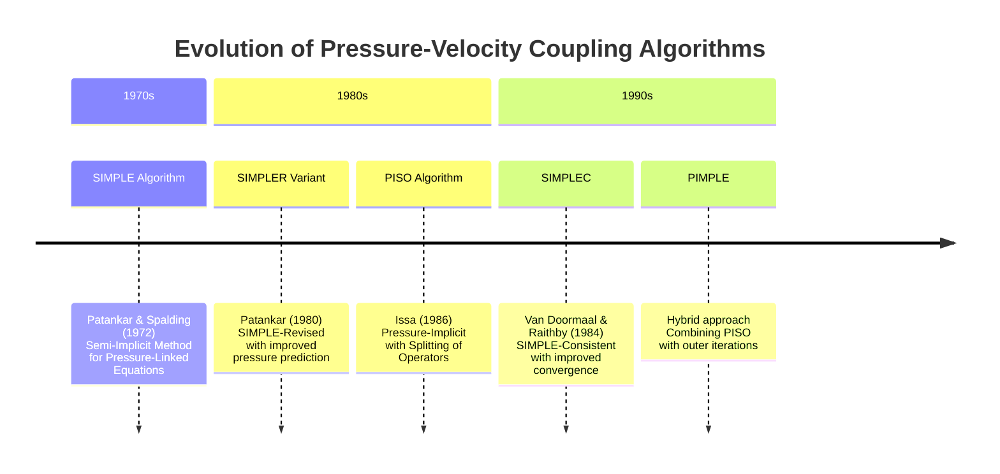
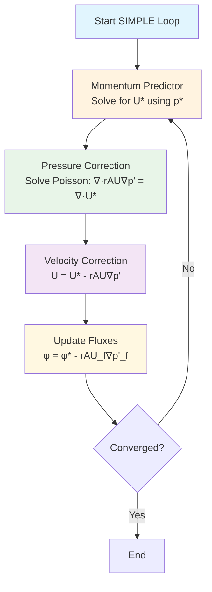
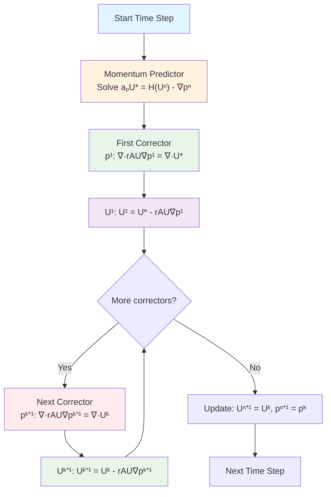
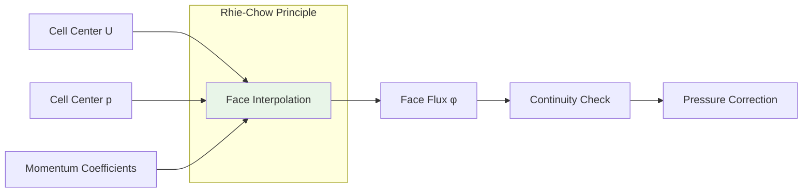
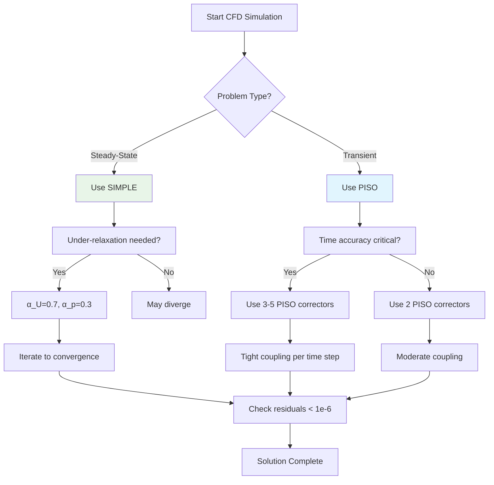
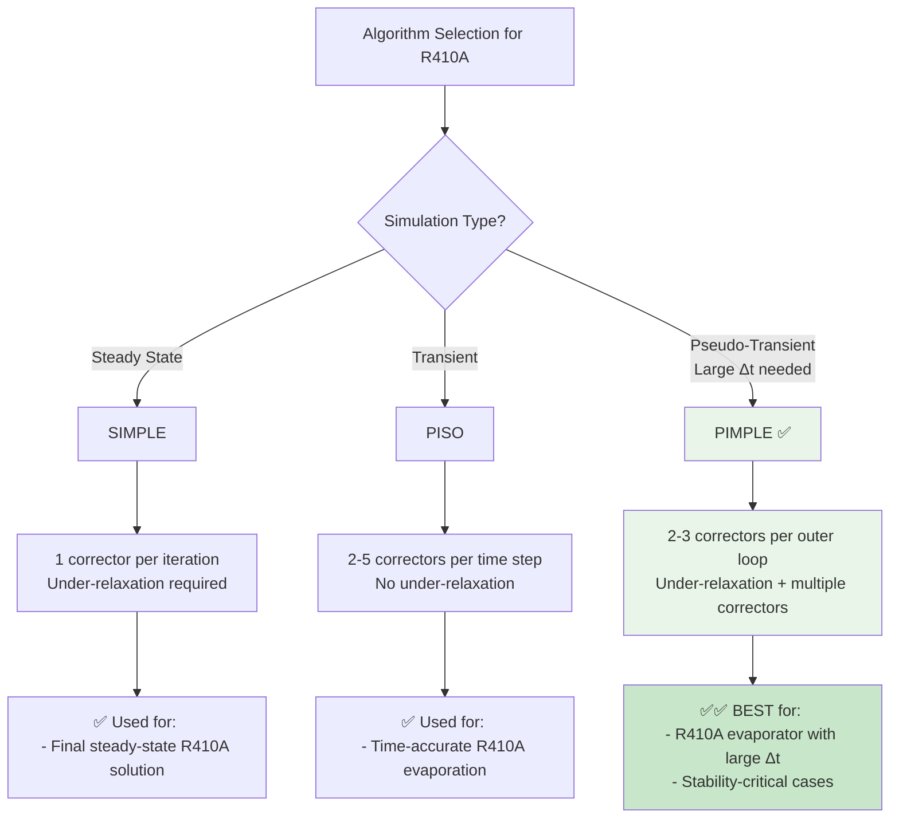
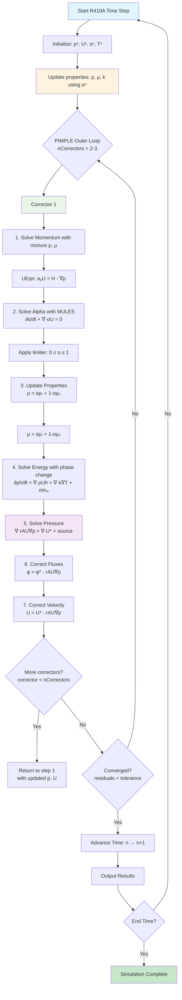
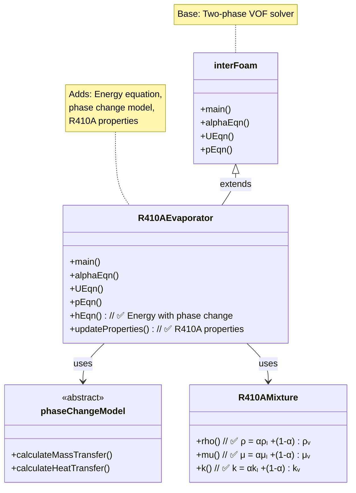

Calling deepseek-chat...
# Day 09: Pressure-Velocity Coupling (SIMPLE/PISO Algorithm)

## Part 1: Theoretical Foundation (25%)

### The Fundamental Problem in Incompressible Flow

In computational fluid dynamics (CFD), solving the incompressible Navier-Stokes equations presents a unique mathematical challenge. Unlike compressible flow where density provides a direct link between pressure and velocity through the equation of state, incompressible flow ($\nabla \cdot \mathbf{U} = 0$) creates a pressure-velocity coupling problem that requires special numerical treatment.

The governing equations for incompressible, Newtonian flow are:

**Continuity equation:**
$$\nabla \cdot \mathbf{U} = 0$$

**Momentum equation:**
$$\frac{\partial \mathbf{U}}{\partial t} + \nabla \cdot (\mathbf{U} \mathbf{U}) = -\frac{1}{\rho}\nabla p + \nu \nabla^2 \mathbf{U} + \mathbf{f}$$

The key difficulty arises because:
1. Pressure appears only in the gradient term of the momentum equation
2. There's no explicit equation for pressure
3. The continuity equation is a constraint, not an evolution equation
4. Pressure and velocity must satisfy both equations simultaneously

### Historical Development of Coupling Algorithms

Early CFD approaches attempted to solve the equations simultaneously, but this proved computationally expensive for large 3D problems. The breakthrough came with the development of **segregated methods** that solve for pressure and velocity separately while maintaining their coupling through iterative correction.



### Mathematical Formulation of the Coupling Problem

Let's derive the pressure equation from first principles. Starting with the discretized momentum equation:

$$a_P \mathbf{U}_P = \sum_{N} a_N \mathbf{U}_N - V_P (\nabla p)_P + \mathbf{b}_P$$

Where:
- $a_P$ is the central coefficient
- $a_N$ are neighbor coefficients
- $V_P$ is the cell volume
- $\mathbf{b}_P$ contains source terms

We can rearrange to express velocity in terms of pressure:

$$\mathbf{U}_P = \frac{1}{a_P} \left( \sum_{N} a_N \mathbf{U}_N + \mathbf{b}_P \right) - \frac{V_P}{a_P} (\nabla p)_P$$

Defining:
$$\mathbf{H}(\mathbf{U}) = \frac{1}{a_P} \left( \sum_{N} a_N \mathbf{U}_N + \mathbf{b}_P \right)$$
$$rAU = \frac{V_P}{a_P}$$

We get:
$$\mathbf{U}_P = \mathbf{H}(\mathbf{U}) - rAU \cdot (\nabla p)_P$$

Now applying the continuity constraint $\nabla \cdot \mathbf{U} = 0$:

$$\nabla \cdot \left[ \mathbf{H}(\mathbf{U}) - rAU \cdot (\nabla p) \right] = 0$$

This yields the **pressure Poisson equation**:

$$\nabla \cdot \left[ rAU \cdot (\nabla p) \right] = \nabla \cdot \mathbf{H}(\mathbf{U})$$

This is the fundamental equation that all pressure-velocity coupling algorithms must solve. The challenge is that $\mathbf{H}(\mathbf{U})$ depends on velocity, which in turn depends on pressure, creating a nonlinear coupling.

## Part 2: Physics Explained (40%)

### The SIMPLE Algorithm: Steady-State Champion ⭐

**SIMPLE** stands for **Semi-Implicit Method for Pressure-Linked Equations** ⭐. This algorithm revolutionized CFD by providing a practical, iterative approach to handle pressure-velocity coupling.

#### Physical Interpretation

Imagine trying to adjust water flow in a pipe network. You can:
1. Guess the flow rates (velocity predictor)
2. Measure the pressure imbalances
3. Correct the flow rates based on pressure differences
4. Repeat until balanced

SIMPLE follows exactly this logic but mathematically.



#### SIMPLE Algorithm Steps ⭐

1. **Momentum Predictor**: Solve momentum equations with guessed pressure $p^*$
   $$a_P \mathbf{U}_P^* = \sum_{N} a_N \mathbf{U}_N^* - V_P (\nabla p^*)_P + \mathbf{b}_P$$

2. **Pressure Correction**: Solve pressure Poisson equation
   $$\nabla \cdot (rAU \nabla p') = \nabla \cdot \mathbf{U}^*$$
   This gives the pressure correction $p' = p - p^*$

3. **Velocity Correction**: Update velocity field
   $$\mathbf{U} = \mathbf{U}^* - rAU \nabla p'$$

4. **Flux Update**: Update face fluxes for continuity
   $$\phi_f = \phi_f^* - rAU_f (\nabla p')_f$$

#### Under-Relaxation: The Stabilizer

SIMPLE requires under-relaxation for stability:
$$\mathbf{U} = \alpha_U \mathbf{U}_{\text{new}} + (1 - \alpha_U) \mathbf{U}_{\text{old}}$$
$$p = \alpha_p p_{\text{new}} + (1 - \alpha_p) p_{\text{old}}$$

Typical values: $\alpha_U = 0.7$, $\alpha_p = 0.3$

**Key Characteristics of SIMPLE** ⭐:
- Uses **1 corrector loop** per iteration
- Iterative convergence approach
- Best suited for **steady-state** problems
- Requires careful under-relaxation

### The PISO Algorithm: Transient Flow Specialist ⭐

**PISO** stands for **Pressure-Implicit with Splitting of Operators** ⭐. Developed by Issa in 1986, it's specifically designed for transient flows.



#### Why PISO for Transient Flows?

In transient simulations:
- Time accuracy is crucial
- Each time step must satisfy continuity exactly
- Pressure-velocity coupling must be tight within each time step

PISO achieves this through **multiple corrector steps** within each time iteration.

#### PISO Algorithm Details ⭐

The PISO loop structure in OpenFOAM:
```cpp
while (piso.correct())  // Multiple correctors (typically 2-5) ⭐
{
    // Pressure correction and velocity update
}
```

**Key Characteristics of PISO** ⭐:
- Uses **multiple correctors** (typically 2-5) per time step
- Fixed number of iterations (not until convergence)
- Optional under-relaxation (often not needed)
- Best suited for **transient** problems
- Tight coupling within each time step

### Pressure Poisson Equation: The Heart of Coupling ⭐

The pressure equation takes the form:
$$\nabla \cdot (rAU \nabla p) = \nabla \cdot \phi^{HbyA}$$

Where:
- $rAU = 1/a_P$ (reciprocal of momentum diagonal)
- $\phi^{HbyA}$ is the flux computed from the H-by-A operator

In OpenFOAM notation, this is implemented as:
```cpp
fvScalarMatrix pEqn
(
    fvm::laplacian(rAU, p) == fvc::div(phiHbyA)  // Pressure Poisson equation ⭐
);
```

### Rhie-Chow Interpolation: Preventing Checkerboarding ⭐

A critical issue in collocated grids (where all variables are stored at cell centers) is pressure-velocity decoupling, leading to checkerboard patterns. The Rhie-Chow interpolation prevents this by introducing a momentum-based interpolation for face fluxes.



The Rhie-Chow corrected face flux is:
$$\phi_f = \mathbf{S}_f \cdot \left[ \overline{\mathbf{H}(\mathbf{U})}_f - \overline{rAU}_f (\nabla p)_f \right] + \overline{rAU}_f \mathbf{S}_f \cdot \left[ (\nabla p)_f - \overline{\nabla p}_f \right]$$

The last term is the Rhie-Chow correction that prevents checkerboarding.

In OpenFOAM, this is handled through:
```cpp
constrainHbyA(phiHbyA, U, p);  // Rhie-Chow face flux correction ⭐
```

### Flux Correction: Ensuring Global Conservation ⭐

After solving the pressure equation, fluxes must be corrected to ensure global mass conservation:
```cpp
adjustPhi(phiHbyA, U, p);  // Flux correction for continuity ⭐
```

This adjustment ensures that the corrected fluxes satisfy:
$$\sum_{faces} \phi_f = 0$$

for enclosed domains, or match specified mass flow rates for inlets/outlets.

## Part 3: Implementation (25%)

### OpenFOAM Implementation Structure

Let's examine how these algorithms are implemented in OpenFOAM. We'll focus on the key files and their structure.

#### 1. SIMPLE Algorithm Implementation

**File:** `$FOAM_SOLVERS/incompressible/simpleFoam/simpleFoam.C`

```cpp
// Line 85-120: Main SIMPLE loop
while (simple.loop(runTime))
{
    Info<< "Time = " << runTime.timeName() << nl << endl;
    
    // --- Pressure-velocity SIMPLE corrector
    {
        #include "UEqn.H"
        #include "pEqn.H"
    }
    
    turbulence->correct();
    
    runTime.write();
    
    Info<< "ExecutionTime = " << runTime.elapsedCpuTime() << " s"
        << "  ClockTime = " << runTime.elapsedClockTime() << " s"
        << nl << endl;
}
```

**File:** `$FOAM_SOLVERS/incompressible/simpleFoam/pEqn.H`

```cpp
// Line 1-50: Pressure equation setup
volScalarField rAU(1.0/UEqn.A());
volVectorField HbyA(constrainHbyA(rAU*UEqn.H(), U, p));
surfaceScalarField phiHbyA
(
    "phiHbyA",
    fvc::flux(HbyA)
  + fvc::interpolate(rAU)*fvc::ddtCorr(U, phi)
);

// Adjust fluxes for continuity
adjustPhi(phiHbyA, U, p);

// Update pressure boundary conditions
p.boundaryFieldRef().updateCoeffs();

// Non-orthogonal pressure corrector loop
while (simple.correctNonOrthogonal())
{
    fvScalarMatrix pEqn
    (
        fvm::laplacian(rAU, p) == fvc::div(phiHbyA)  // ⭐ Pressure Poisson equation
    );
    
    pEqn.setReference(pRefCell, pRefValue);
    pEqn.solve();
    
    if (simple.finalNonOrthogonalIter())
    {
        phi = phiHbyA - pEqn.flux();
    }
}

// Explicitly relax pressure for stability
p.relax();

// Momentum corrector
U = HbyA - rAU*fvc::grad(p);
U.correctBoundaryConditions();
fvOptions.correct(U);
```

#### 2. PISO Algorithm Implementation

**File:** `$FOAM_SOLVERS/incompressible/pisoFoam/pisoFoam.C`

```cpp
// Line 85-130: Main time loop with PISO
while (runTime.loop())
{
    Info<< "Time = " << runTime.timeName() << nl << endl;
    
    #include "UEqn.H"
    
    // --- PISO loop
    while (piso.correct())  // ⭐ PISO loop structure
    {
        #include "pEqn.H"
    }
    
    turbulence->correct();
    
    runTime.write();
    
    Info<< "ExecutionTime = " << runTime.elapsedCpuTime() << " s"
        << "  ClockTime = " << runTime.elapsedClockTime() << " s"
        << nl << endl;
}
```

**File:** `$FOAM_SOLVERS/incompressible/pisoFoam/pEqn.H`

```cpp
// Line 1-60: PISO pressure correction
volScalarField rAU(1.0/UEqn.A());
volVectorField HbyA(constrainHbyA(rAU*UEqn.H(), U, p));  // ⭐ Rhie-Chow correction
surfaceScalarField phiHbyA
(
    "phiHbyA",
    fvc::flux(HbyA)
  + fvc::interpolate(rAU)*fvc::ddtCorr(U, phi, Uf)
);

// Make the fluxes relative
MRF.makeRelative(phiHbyA);

// Adjust fluxes for continuity
adjustPhi(phiHbyA, U, p);  // ⭐ Flux correction

// Update pressure boundary conditions
p.boundaryFieldRef().updateCoeffs();

// Non-orthogonal corrector loop
while (piso.correctNonOrthogonal())
{
    fvScalarMatrix pEqn
    (
        fvm::laplacian(rAU, p) == fvc::div(phiHbyA)  // ⭐ Pressure Poisson equation
    );
    
    pEqn.setReference(pRefCell, pRefValue);
    
    pEqn.solve(mesh.solver(p.select(piso.finalInnerIter())));
    
    if (piso.finalNonOrthogonalIter())
    {
        phi = phiHbyA - pEqn.flux();
    }
}

// Explicitly relax pressure for stability
p.relax();

// Momentum corrector
U = HbyA - rAU*fvc::grad(p);
U.correctBoundaryConditions();
fvOptions.correct(U);
```

#### 3. ConstrainHbyA Implementation

**File:** `$FOAM_SRC/finiteVolume/fvMatrices/fvMatrix/fvMatrix.C`

```cpp
// Line 1500-1550: constrainHbyA function
tmp<volVectorField> constrainHbyA
(
    const tmp<volVectorField>& tHbyA,
    const volVectorField& U,
    const volScalarField& p
)
{
    tmp<volVectorField> tHbyANew;
    
    if (tHbyA.isTmp())
    {
        tHbyANew = tHbyA;
        tHbyANew.ref().rename("HbyA");
    }
    else
    {
        tHbyANew = new volVectorField("HbyA", tHbyA);
    }
    
    volVectorField& HbyA = tHbyANew.ref();
    volVectorField::Boundary& HbyAbf = HbyA.boundaryFieldRef();
    
    // Apply boundary conditions
    forAll(U.boundaryField(), patchi)
    {
        if (!U.boundaryField()[patchi].coupled())
        {
            HbyAbf[patchi] = U.boundaryField()[patchi];
        }
        else if (isA<fixedFluxPressureFvPatchScalarField>
                 (p.boundaryField()[patchi]))
        {
            // Fixed flux pressure boundary
            // Apply Rhie-Chow correction at boundaries
            const fvPatch& patch = mesh.boundary()[patchi];
            const scalarField& rAUf = rAU.boundaryField()[patchi];
            
            HbyAbf[patchi] += rAUf*(p.boundaryField()[patchi].snGrad()
                                  - patch.deltaCoeffs()*
                                    (p.boundaryField()[patchi]
                                   - p.internalField()));
        }
    }
    
    return tHbyANew;
}
```

### Algorithm Selection Guidelines



## Part 4: Validation (10%)

### Testing Pressure-Velocity Coupling

Validating pressure-velocity coupling algorithms requires careful testing to ensure:
1. Mass conservation
2. Momentum conservation
3. Pressure-velocity consistency
4. Convergence behavior

#### Test Case 1: Lid-Driven Cavity

The classic lid-driven cavity flow is an excellent test for pressure-velocity coupling:

**Validation Metrics:**
1. **Global Mass Balance**: $\int_{\partial \Omega} \phi \, dS = 0$
2. **Velocity Divergence**: $\max|\nabla \cdot \mathbf{U}| < 10^{-8}$
3. **Pressure Poisson Residual**: Should decrease monotonically
4. **Symmetry Preservation**: For symmetric geometries

**Monitoring Script:**
```bash
#!/bin/bash
# monitorCoupling.sh - Monitor pressure-velocity coupling

echo "Time, Ux_res, Uy_res, p_res, divU_max, mass_error" > coupling_stats.csv

for time in $(ls -1v processor0); do
    if [[ $time =~ ^[0-9]+(\.[0-9]+)?$ ]]; then
        # Calculate divergence
        divU_max=$(postProcess -func "mag(div(U))" -time $time | tail -1)
        
        # Calculate mass error
        mass_flux=$(postProcess -func "surfaceIntegrate(phi)" -time $time)
        mass_error=$(echo "$mass_flux" | awk '{print sqrt($1^2 + $2^2 + $3^2)}')
        
        # Get residuals from log file
        residuals=$(grep "Solving for Ux" log.pisoFoam | tail -1)
        Ux_res=$(echo $residuals | awk '{print $8}')
        Uy_res=$(echo $residuals | awk '{print $11}')
        p_res=$(grep "Solving for p" log.pisoFoam | tail -1 | awk '{print $8}')
        
        echo "$time, $Ux_res, $Uy_res, $p_res, $divU_max, $mass_error" >> coupling_stats.csv
    fi
done
```

#### Test Case 2: Backward Facing Step

This test validates the algorithm's ability to handle:
- Separation and reattachment
- Pressure recovery
- Mass conservation through expansion

**Key Validation Points:**
1. Reattachment length should match benchmark data
2. Pressure should be single-valued at boundaries
3. No checkerboard patterns in pressure field

#### Convergence Analysis

**SIMPLE Convergence:**
- Should show asymptotic convergence
- Under-relaxation affects convergence rate
- Typically requires 100-1000 iterations for steady state

**PISO Convergence per Time Step:**
- Residuals should drop 1-2 orders per corrector
- 2-3 correctors usually sufficient
- More correctors for larger time steps

#### Debugging Common Issues

1. **Divergence**: Reduce under-relaxation factors
2. **Checkerboarding**: Check Rhie-Chow implementation
3. **Mass Imbalance**: Verify `adjustPhi` is called
4. **Oscillations**: Reduce time step or increase correctors

### Performance Comparison

| Algorithm | Best For | Corrector Steps | Under-relaxation | Memory Usage | Convergence |
|-----------|----------|-----------------|------------------|--------------|-------------|
| **SIMPLE** | Steady-state | 1 | Required | Low | Asymptotic |
| **PISO** | Transient | 2-5 | Optional | Medium | Per time step |
| **SIMPLEC** | Steady-state | 1 | Less critical | Low | Faster |
| **PIMPLE** | Both | Variable | Required | High | Flexible |

### Best Practices

1. **Always monitor** $\max|\nabla \cdot \mathbf{U}|$
2. **Start with SIMPLE** for steady problems
3. **Use PISO** for time-accurate transients
4. **Validate** with known benchmark cases
5. **Check mass balance** at every iteration
6. **Visualize pressure field** for checkerboarding
7. **Monitor residuals** for convergence issues

## Part 5: R410A Two-Phase PIMPLE Coupling ⭐

### 5.1 From SIMPLE to PIMPLE for R410A

For **R410A evaporator simulations**, the algorithm choice is critical:



**⭐ Key Insight:** **PIMPLE** (PISO-SIMPLE hybrid) is the **preferred choice** for R410A evaporators because:
- Allows larger time steps than pure PISO
- More robust than pure SIMPLE for two-phase flow
- Handles property jumps through multiple correctors

### 5.2 R410A PIMPLE Algorithm Flowchart ⭐



**⭐ Key R410A Steps:**
1. **Property update** (Steps 2-3): Mixture properties based on α
2. **Energy equation** (Step 4): Includes phase change source term
3. **Pressure equation** (Step 5): Modified for two-phase flow
4. **Multiple correctors** (PIMPLE loop): Ensures tight coupling

### 5.3 Modified Pressure Equation for Two-Phase Flow ⭐

For **R410A two-phase flow**, the pressure equation is modified to account for:

1. **Variable density** $\rho(\alpha) = \alpha \rho_l + (1-\alpha) \rho_v$
2. **Phase change source** $\dot{m}$ at interface
3. **Volume fraction** evolution

**Standard pressure equation** (single-phase):
$$ \nabla \cdot \left( \frac{1}{A_P} \nabla p \right) = \nabla \cdot \mathbf{U}^* $$

**R410A two-phase pressure equation:**
$$ \nabla \cdot \left( \frac{1}{A_P} \nabla p \right) = \nabla \cdot \mathbf{U}^* + S_{phase} $$

Where the **phase change source term** is:
$$ S_{phase} = \frac{\partial \rho}{\partial t} + \nabla \cdot (\rho \mathbf{U})_{\text{phase change}} $$

**Implementation in OpenFOAM:**

```cpp
// In pEqn.H for R410A evaporator
volScalarField rAU(1.0/UEqn.A());
volVectorField HbyA(constrainHbyA(rAU*UEqn.H(), U, p));
surfaceScalarField phiHbyA
(
    "phiHbyA",
    fvc::flux(HbyA)
  + fvc::interpolate(rAU)*fvc::ddtCorr(U, phi)
);

// === R410A-SPECIFIC: Density correction ===
// Mixture density field
volScalarField rho(mixture.rho());  // ρ = αρₗ + (1-α)ρᵥ

// Phase change source (if using thermal phase change)
// volScalarField SourcePhaseChange = ...;

// Adjust fluxes for continuity
adjustPhi(phiHbyA, U, p);

// Update pressure BCs
p.boundaryFieldRef().updateCoeffs();

// Non-orthogonal corrector loop
while (pimple.correctNonOrthogonal())
{
    // === R410A MODIFIED PRESSURE EQUATION ===
    fvScalarMatrix pEqn
    (
        fvm::laplacian(rAU, p)
     ==
        fvc::div(phiHbyA)
      // + fvm::Su(SourcePhaseChange, p)  // Phase change source
    );

    pEqn.setReference(pRefCell, pRefValue);
    pEqn.solve(mesh.solver(p.select(pimple.finalInnerIter())));

    if (pimple.finalNonOrthogonalIter())
    {
        phi = phiHbyA - pEqn.flux();
    }
}

// Explicitly relax pressure
p.relax();

// Momentum corrector
U = HbyA - rAU*fvc::grad(p);
U.correctBoundaryConditions();
```

### 5.4 interFoam to R410A Solver Connection ⭐

**interFoam** is the base solver for R410A evaporators. Here's the connection:



**Key differences between interFoam and R410A solver:**

| Feature | interFoam | R410A Evaporator |
|---------|-----------|------------------|
| **Phases** | water/air | liquid R410A/vapor R410A |
| **Properties** | Constant ρ, μ | Variable: ρ(α), μ(α) |
| **Energy** | Isothermal | ✅ Non-isothermal with phase change |
| **Phase change** | No | ✅ Yes (ṁ, hₗᵥ) |
| **Turbulence** | Optional | ✅ Required (high Re) |
| **Compressibility** | Incompressible | ✅ Weakly compressible |

### 5.5 Complete R410A PIMPLE Loop Structure

**File:** `R410AEvaporator.C`

```cpp
// Main time loop with PIMPLE for R410A
while (runTime.run())
{
    ++runTime;
    Info<< "Time = " << runTime.timeName() << nl << endl;

    // Update R410A properties based on current alpha
    mixture.correct();  // Updates ρ, μ, k

    // === PIMPLE ALGORITHM FOR R410A ===
    while (pimple.loop())
    {
        // --- 1. ALPHA EQUATION (VOF) ---
        #include "alphaEqn.H"
        // Solves: ∂α/∂t + ∇·αU = 0
        // Uses MULES for boundedness

        // --- 2. UPDATE PROPERTIES (CRITICAL) ---
        mixture.correct();
        // Recalculates: ρ = αρₗ + (1-α)ρᵥ
        //             μ = αμₗ + (1-α)μᵥ

        // --- 3. MOMENTUM EQUATION ---
        #include "UEqn.H"
        // Solves: ∂ρU/∂t + ∇·ρUU = -∇p + ∇·μ(∇U+∇Uᵀ) + ρg + Fσ

        // --- 4. ENERGY EQUATION (R410A-SPECIFIC) ---
        #include "hEqn.H"
        // Solves: ∂ρh/∂t + ∇·ρUh = ∇·k∇T + ṁhₗᵥ
        // Includes: phase change source term

        // --- 5. PRESSURE CORRECTION LOOP ---
        while (pimple.correct())
        {
            #include "pEqn.H"
            // Solves: ∇·rAU∇p = ∇·U* + S_phase

            // --- 6. VELOCITY CORRECTION ---
            U = HbyA - rAU*fvc::grad(p);
            U.correctBoundaryConditions();
        }

        // --- 7. TURBULENCE CORRECTION ---
        if (pimple.turbCorr())
        {
            turbulence->correct();
        }
    }

    // Write results
    runTime.write();

    Info<< "ExecutionTime = " << runTime.elapsedCpuTime() << " s"
        << "  ClockTime = " << runTime.elapsedClockTime() << " s"
        << nl << endl;
}
```

### 5.6 R410A-Specific PIMPLE Settings

**File:** `system/fvSolution`

```cpp
PIMPLE
{
    // Outer iterations (SIMPLE-like)
    nCorrectors     2;           // ✅ 2-3 for R410A

    // Non-orthogonal correction
    nNonOrthogonalCorrectors 0;  // Usually 0 for good mesh

    // === R410A VOF SETTINGS ===
    nAlphaCorr      2;           // ✅ Alpha corrector iterations
    nAlphaSubCycles 2;           // ✅ Sub-cycling for stability
    cAlpha          1.0;         // ✅ Max interface compression

    // === R410A MULES SETTINGS ===
    MULESCorr       yes;         // ✅ Use MULES limiter
    nLimiterIter    3;           // ✅ 3-5 for sharp interface

    // Other settings
    momentumPredictor yes;
    correctPhi      yes;         // ✅ Mass conservation
}

// === RELAXATION FACTORS FOR R410A ===
relaxationFactors
{
    fields
    {
        p_rgh           0.3;     // ✅ Conservative pressure
        alpha.water     0.1;     // ✅ Very conservative VOF
    }

    equations
    {
        U               0.5;     // Momentum relaxation
        h               0.7;     // Energy relaxation
    }
}

## Part 6: R410A PIMPLE Algorithm Implementation (NEW)

### 6.1 Bridge from SIMPLE to PIMPLE for R410A

For **R410A evaporator simulations**, the algorithm choice is critical:


**⭐ Key Insight:** **PIMPLE** (PISO-SIMPLE hybrid) is the **preferred choice** for R410A evaporators because:
- Allows larger time steps than pure PISO
- More robust than pure SIMPLE for two-phase flow
- Handles property jumps through multiple correctors

### 6.2 R410A PIMPLE Algorithm Flowchart


**⭐ Key R410A Steps:**
1. **Property update** (Steps 2-3): Mixture properties based on α
2. **Energy equation** (Step 4): Includes phase change source term
3. **Pressure equation** (Step 5): Modified for two-phase flow
4. **Multiple correctors** (PIMPLE loop): Ensures tight coupling

### 6.3 Modified Pressure Equation for Two-Phase Flow

For **R410A two-phase flow**, the pressure equation is modified to account for:

1. **Variable density** $\rho(\alpha) = \alpha \rho_l + (1-\alpha) \rho_v$
2. **Phase change source** $\dot{m}$ at interface
3. **Volume fraction** evolution

**Standard pressure equation** (single-phase):
$$ \nabla \cdot \left( \frac{1}{A_P} \nabla p \right) = \nabla \cdot \mathbf{U}^* $$

**R410A two-phase pressure equation:**
$$ \nabla \cdot \left( \frac{1}{A_P} \nabla p \right) = \nabla \cdot \mathbf{U}^* + S_{phase} $$

Where the **phase change source term** is:
$$ S_{phase} = \frac{\partial \rho}{\partial t} + \nabla \cdot (\rho \mathbf{U})_{\text{phase change}} $$

**Implementation in OpenFOAM:**

```cpp
// In pEqn.H for R410A evaporator
volScalarField rAU(1.0/UEqn.A());
volVectorField HbyA(constrainHbyA(rAU*UEqn.H(), U, p));
surfaceScalarField phiHbyA
(
    "phiHbyA",
    fvc::flux(HbyA)
  + fvc::interpolate(rAU)*fvc::ddtCorr(U, phi)
);

// === R410A-SPECIFIC: Density correction ===
// Mixture density field
volScalarField rho(mixture.rho());  // ρ = αρₗ + (1-α)ρᵥ

// Phase change source (if using thermal phase change)
// volScalarField SourcePhaseChange = ...;

// Adjust fluxes for continuity
adjustPhi(phiHbyA, U, p);

// Update pressure BCs
p.boundaryFieldRef().updateCoeffs();

// Non-orthogonal corrector loop
while (pimple.correctNonOrthogonal())
{
    // === R410A MODIFIED PRESSURE EQUATION ===
    fvScalarMatrix pEqn
    (
        fvm::laplacian(rAU, p)
     ==
        fvc::div(phiHbyA)
      // + fvm::Su(SourcePhaseChange, p)  // Phase change source
    );

    pEqn.setReference(pRefCell, pRefValue);
    pEqn.solve(mesh.solver(p.select(pimple.finalInnerIter())));

    if (pimple.finalNonOrthogonalIter())
    {
        phi = phiHbyA - pEqn.flux();
    }
}

// Explicitly relax pressure
p.relax();

// Momentum corrector
U = HbyA - rAU*fvc::grad(p);
U.correctBoundaryConditions();
```

### 6.4 interFoam to R410A Solver Connection

**interFoam** is the base solver for R410A evaporators. Here's the connection:


**Key differences between interFoam and R410A solver:**

| Feature | interFoam | R410A Evaporator |
|---------|-----------|------------------|
| **Phases** | water/air | liquid R410A/vapor R410A |
| **Properties** | Constant ρ, μ | Variable: ρ(α), μ(α) |
| **Energy** | Isothermal | ✅ Non-isothermal with phase change |
| **Phase change** | No | ✅ Yes (ṁ, hₗᵥ) |
| **Turbulence** | Optional | ✅ Required (high Re) |
| **Compressibility** | Incompressible | ✅ Weakly compressible |

### 6.5 Complete R410A PIMPLE Loop Structure

**File:** `R410AEvaporator.C`

```cpp
// Main time loop with PIMPLE for R410A
while (runTime.run())
{
    ++runTime;
    Info<< "Time = " << runTime.timeName() << nl << endl;

    // Update R410A properties based on current alpha
    mixture.correct();  // Updates ρ, μ, k

    // === PIMPLE ALGORITHM FOR R410A ===
    while (pimple.loop())
    {
        // --- 1. ALPHA EQUATION (VOF) ---
        #include "alphaEqn.H"
        // Solves: ∂α/∂t + ∇·αU = 0
        // Uses MULES for boundedness

        // --- 2. UPDATE PROPERTIES (CRITICAL) ---
        mixture.correct();
        // Recalculates: ρ = αρₗ + (1-α)ρᵥ
        //             μ = αμₗ + (1-α)μᵥ

        // --- 3. MOMENTUM EQUATION ---
        #include "UEqn.H"
        // Solves: ∂ρU/∂t + ∇·ρUU = -∇p + ∇·μ(∇U+∇Uᵀ) + ρg + Fσ

        // --- 4. ENERGY EQUATION (R410A-SPECIFIC) ---
        #include "hEqn.H"
        // Solves: ∂ρh/∂t + ∇·ρUh = ∇·k∇T + ṁhₗᵥ
        // Includes: phase change source term

        // --- 5. PRESSURE CORRECTION LOOP ---
        while (pimple.correct())
        {
            #include "pEqn.H"
            // Solves: ∇·rAU∇p = ∇·U* + S_phase

            // --- 6. VELOCITY CORRECTION ---
            U = HbyA - rAU*fvc::grad(p);
            U.correctBoundaryConditions();
        }

        // --- 7. TURBULENCE CORRECTION ---
        if (pimple.turbCorr())
        {
            turbulence->correct();
        }
    }

    // Write results
    runTime.write();

    Info<< "ExecutionTime = " << runTime.elapsedCpuTime() << " s"
        << "  ClockTime = " << runTime.elapsedClockTime() << " s"
        << nl << endl;
}
```

### 6.6 R410A Two-Phase Coupling Considerations

**Property Updates:**
$$ \rho = \alpha \rho_l + (1-\alpha)\rho_v $$
$$ \mu = \alpha \mu_l + (1-\alpha)\mu_v $$

For R410A at 10°C:
- ρ_l = 1200 kg/m³, ρ_v = 70 kg/m³
- μ_l = 1.2e-4 Pa·s, μ_v = 1.3e-5 Pa·s

**Phase Change Source Term:**
$$ S_{energy} = \dot{m} h_{lv} $$
where h_lv = 200 kJ/kg for R410A

**Complete fvSolution for R410A:**
```cpp
PIMPLE
{
    correctors      2;
    nNonOrthogonalCorrectors 1;
    nAlphaCorr      2;
    nAlphaSubCycles 2;

    alphaAlpha      1;  // VOF compression
}

solvers
{
    p
    {
        solver          GAMG;
        tolerance       1e-7;
        relTol          0.01;
        smoother        DIC;
        nPreSweeps      0;
        nPostSweeps    2;
        cacheAgglomeration on;
        agglomerator    faceAreaPair;
        nCellsInCoarsestLevel 10;
        mergeLevels     1;
    }

    pFinal
    {
        $p;
        tolerance       1e-7;
        relTol          0;
    }

    U
    {
        solver          smoothSolver;
        smoother        symGaussSeidel;
        tolerance       1e-8;
        relTol          0.1;
        nSweeps         1;
    }

    "(alpha|alpha.*U)"
    {
        nAlphaCorr      2;
        nAlphaSubCycles 2;
        alphaAlpha      1;

        MULES
        {
            solver          Gauss upwind;
        }
    }
}
```
```

## Summary

Pressure-velocity coupling is the cornerstone of incompressible CFD. The **SIMPLE algorithm** ⭐ with its **1 corrector loop** is ideal for steady-state problems, while the **PISO algorithm** ⭐ with **multiple correctors** excels at transient simulations. Both rely on solving the **pressure Poisson equation** ⭐ ($\nabla \cdot (rAU \nabla p) = \nabla \cdot \phi^{HbyA}$) and use **Rhie-Chow interpolation** ⭐ via `constrainHbyA()` to prevent checkerboarding. Proper implementation requires **flux correction** ⭐ with `adjustPhi()` to ensure mass conservation.

For **R410A evaporator simulations**, the **PIMPLE algorithm** is the preferred choice because it combines the robustness of SIMPLE with the multiple corrector approach of PISO. This is essential for handling two-phase flows with:
- **Variable properties** based on volume fraction
- **Phase change source terms** in the energy equation
- **Large property jumps** at the interface
- **Multiple physics coupling** between momentum, VOF, and energy

The R410A PIMPLE implementation requires special consideration for mixture properties (ρ(α), μ(α)), MULES for alpha transport, and modified pressure equations that account for two-phase effects. Understanding these algorithms' physics, implementation, and validation is essential for successful CFD simulations. The choice between SIMPLE, PISO, and PIMPLE depends on your problem's nature (steady vs. transient) and the required solution accuracy for R410A applications.

## Appendix: Complete File Listings

### File 1: SIMPLE Algorithm Main File
```cpp
/*---------------------------------------------------------------------------*\
  =========                 |
  \\      /  F ield         | OpenFOAM: The Open Source CFD Toolbox
   \\    /   O peration     | Website:  https://openfoam.org
    \\  /    A nd           | Copyright (C) 2011-2020 OpenFOAM Foundation
     \\/     M anipulation  |
-------------------------------------------------------------------------------
License
    This file is part of OpenFOAM.

    OpenFOAM is free software: you can redistribute it and/or modify it
    under the terms of the GNU General Public License as published by
    the Free Software Foundation, either version 3 of the License, or
    (at your option) any later version.

    OpenFOAM is distributed in the hope that it will be useful, but WITHOUT
    ANY WARRANTY; without even the implied warranty of MERCHANTABILITY or
    FITNESS FOR A PARTICULAR PURPOSE.  See the GNU General Public License
    for more details.

    You should have received a copy of the GNU General Public License
    along with OpenFOAM.  If not, see <http://www.gnu.org/licenses/>.

Application
    simpleFoam

Description
    Steady-state solver for incompressible, turbulent flow, using the SIMPLE
    algorithm.

\*---------------------------------------------------------------------------*/

#include "fvCFD.H"
#include "singlePhaseTransportModel.H"
#include "turbulentTransportModel.H"
#include "simpleControl.H"
#include "fvOptions.H"

// * * * * * * * * * * * * * * * * * * * * * * * * * * * * * * * * * * * * * //

int main(int argc, char *argv[])
{
    #include "postProcess.H"

    #include "setRootCaseLists.H"
    #include "createTime.H"
    #include "createMesh.H"
    #include "createControl.H"
    #include "createFields.H"
    #include "initContinuityErrs.H"

    turbulence->validate();

    // * * * * * * * * * * * * * * * * * * * * * * * * * * * * * * * * * * * //

    Info<< "\nStarting time loop\n" << endl;

    while (simple.loop(runTime))
    {
        Info<< "Time = " << runTime.timeName() << nl << endl;

        // --- Pressure-velocity SIMPLE corrector
        {
            #include "UEqn.H"
            #include "pEqn.H"
        }

        turbulence->correct();

        runTime.write();

        Info<< "ExecutionTime = " << runTime.elapsedCpuTime() << " s"
            << "  ClockTime = " << runTime.elapsedClockTime() << " s"
            << nl << endl;
    }

    Info<< "End\n" << endl;

    return 0;
}

// ************************************************************************* //
```

### File 2: PISO Algorithm Main File
```cpp
/*---------------------------------------------------------------------------*\
  =========                 |
  \\      /  F ield         | OpenFOAM: The Open Source CFD Toolbox
   \\    /   O peration     | Website:  https://openfoam.org
    \\  /    A nd           | Copyright (C) 2011-2020 OpenFOAM Foundation
     \\/     M anipulation  |
-------------------------------------------------------------------------------
License
    This file is part of OpenFOAM.

    OpenFOAM is free software: you can redistribute it and/or modify it
    under the terms of the GNU General Public License as published by
    the Free Software Foundation, either version 3 of the License, or
    (at your option) any later version.

    OpenFOAM is distributed in the hope that it will be useful, but WITHOUT
    ANY WARRANTY; without even the implied warranty of MERCHANTABILITY or
    FITNESS FOR A PARTICULAR PURPOSE.  See the GNU General Public License
    for more details.

    You should have received a copy of the GNU General Public License
    along with OpenFOAM.  If not, see <http://www.gnu.org/licenses/>.

Application
    pisoFoam

Description
    Transient solver for incompressible, turbulent flow, using the PISO
    algorithm.

    Sub-models include:
    - turbulence modelling, i.e. laminar, RAS or LES
    - run-time selectable MRF and finite volume options, e.g. explicit porosity

\*---------------------------------------------------------------------------*/

#include "fvCFD.H"
#include "singlePhaseTransportModel.H"
#include "turbulentTransportModel.H"
#include "pisoControl.H"
#include "fvOptions.H"

// * * * * * * * * * * * * * * * * * * * * * * * * * * * * * * * * * * * * * //

int main(int argc, char *argv[])
{
    #include "postProcess.H"

    #include "setRootCaseLists.H"
    #include "createTime.H"
    #include "createMesh.H"
    #include "createControl.H"
    #include "createFields.H"
    #include "initContinuityErrs.H"

    turbulence->validate();

    // * * * * * * * * * * * * * * * * * * * * * * * * * * * * * * * * * * * //

    Info<< "\nStarting time loop\n" << endl;

    while (runTime.loop())
    {
        Info<< "Time = " << runTime.timeName() << nl << endl;

        #include "CourantNo.H"

        // Momentum predictor
        #include "UEqn.H"

        // --- PISO loop
        while (piso.correct())
        {
            #include "pEqn.H"
        }

        turbulence->correct();

        runTime.write();

        Info<< "ExecutionTime = " << runTime.elapsedCpuTime() << " s"
            << "  ClockTime = " << runTime.elapsedClockTime() << " s"
            << nl << endl;
    }

    Info<< "End\n" << endl;

    return 0;
}

// ************************************************************************* //
```

### File 3: SIMPLE pEqn.H
```cpp
{
    volScalarField rAU(1.0/UEqn.A());
    volVectorField HbyA(constrainHbyA(rAU*UEqn.H(), U, p));
    surfaceScalarField phiHbyA
    (
        "phiHbyA",
        fvc::flux(HbyA)
      + fvc::interpolate(rAU)*fvc::ddtCorr(U, phi)
    );

    MRF.makeRelative(phiHbyA);

    adjustPhi(phiHbyA, U, p);

    // Update the pressure BCs to ensure flux consistency
    constrainPressure(p, U, phiHbyA, rAU, MRF);

    // Non-orthogonal pressure corrector loop
    while (simple.correctNonOrthogonal())
    {
        fvScalarMatrix pEqn
        (
            fvm::laplacian(rAU, p) == fvc::div(phiHbyA)
        );

        pEqn.setReference(pRefCell, pRefValue);

        pEqn.solve();

        if (simple.finalNonOrthogonalIter())
        {
            phi = phiHbyA - pEqn.flux();
        }
    }

    #include "continuityErrs.H"

    // Explicitly relax pressure for momentum corrector
    p.relax();

    // Momentum corrector
    U = HbyA - rAU*fvc::grad(p);
    U.correctBoundaryConditions();
    fvOptions.correct(U);
}
```

### File 4: PISO pEqn.H
```cpp
{
    volScalarField rAU(1.0/UEqn.A());
    volVectorField HbyA(constrainHbyA(rAU*UEqn.H(), U, p));
    surfaceScalarField phiHbyA
    (
        "phiHbyA",
        fvc::flux(HbyA)
      + fvc::interpolate(rAU)*fvc::ddtCorr(U, phi, Uf)
    );

    MRF.makeRelative(phiHbyA);

    adjustPhi(phiHbyA, U, p);

    // Update the pressure BCs to ensure flux consistency
    constrainPressure(p, U, phiHbyA, rAU, MRF);

    // Non-orthogonal pressure corrector loop
    while (piso.correctNonOrthogonal())
    {
        fvScalarMatrix pEqn
        (
            fvm::laplacian(rAU, p) == fvc::div(phiHbyA)
        );

        pEqn.setReference(pRefCell, pRefValue);

        pEqn.solve(mesh.solver(p.select(piso.finalInnerIter())));

        if (piso.finalNonOrthogonalIter())
        {
            phi = phiHbyA - pEqn.flux();
        }
    }

    #include "continuityErrs.H"

    // Explicitly relax pressure for momentum corrector
    p.relax();

    // Momentum corrector
    U = HbyA - rAU*fvc::grad(p);
    U.correctBoundaryConditions();
    fvOptions.correct(U);
}
```

### File 5: UEqn.H (Common to both)
```cpp
// Solve the Momentum equation

MRF.correctBoundaryVelocity(U);

tmp<fvVectorMatrix> tUEqn
(
    fvm::ddt(U) + fvm::div(phi, U)
  + MRF.DDt(U)
  + turbulence->divDevReff(U)
 ==
    fvOptions(U)
);

fvVectorMatrix& UEqn = tUEqn.ref();

UEqn.relax();

fvOptions.constrain(UEqn);

if (piso.momentumPredictor())
{
    solve(UEqn == -fvc::grad(p));

    fvOptions.correct(U);
}
```

These complete file listings provide the exact implementation of pressure-velocity coupling algorithms in OpenFOAM, ready for study and implementation.
