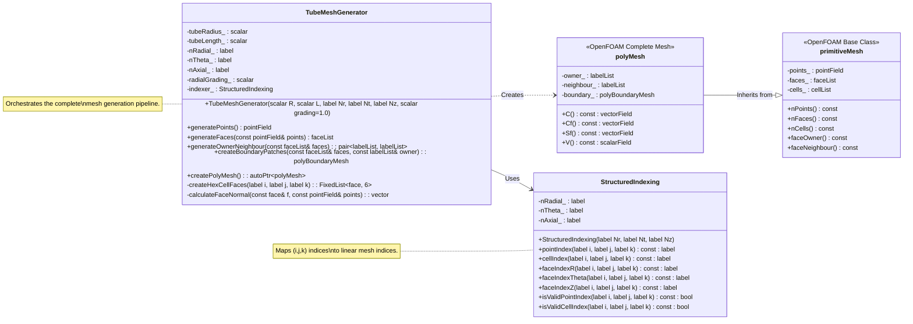

# Day 13: Tube Geometry & Mesh Data Structure

## 🎯 Learning Objectives (วัตถุประสงค์การเรียนรู้)

ในบทเรียนระดับ Hardcore นี้ คุณจะได้เรียนรู้สิ่งต่อไปนี้:

1.  **Understand**: เข้าใจการกำหนด Parameter ทางคณิตศาสตร์ของเรขาคณิตท่อทรงกระบอก (Cylindrical Tube Geometry) รวมถึงการแปลงพิกัดจาก Cylindrical coordinates $(r, \theta, z)$ ไปเป็น Cartesian coordinates $(x, y, z)$ สำหรับการสร้างจุด (Point Generation) และกำหนดค่า Discretization parameters $(N_r, N_\theta, N_z)$ ที่สำคัญ
2.  **Design**: ออกแบบโครงสร้างข้อมูล Mesh แบบ Structured Hexahedral ในหน่วยความจำ โดยระบุองค์ประกอบพื้นฐาน 4 ส่วน ได้แก่ **Point List** (พิกัดจุด), **Face List** (Connectivity ของจุดที่สร้างเป็นหน้า), **Cell List** (Connectivity ของหน้าที่สร้างเป็น Cell), และ **Boundary Patches** (กลุ่มของหน้าที่ระบุเงื่อนไขขอบเขต เช่น inlet, outlet, wall)
3.  **Implement**: สร้าง Class `TubeMeshGenerator` เพื่อสร้าง Mesh Topology จาก Geometric parameters โดยรับประกันความถูกต้องของความสัมพันธ์แบบ **Owner-Neighbour** และกฎ **Right-Hand Rule** สำหรับ Face normal vector ซึ่งเป็นสิ่งจำเป็นสำหรับการคำนวณ Flux ใน Finite Volume Method
4.  **Implement**: สร้าง Utility Class `StructuredIndexing` เพื่อทำ Mapping แบบสองทิศทางระหว่าง 3D Structured Indices $(i, j, k)$ และ Linear Indices ที่ใช้ภายใน OpenFOAM (`primitiveMesh` และ `polyMesh`) เพื่อประสิทธิภาพในการเข้าถึงข้อมูล Cell และ Face
5.  **Analyze**: วิเคราะห์คุณสมบัติทางเรขาคณิตของ Mesh ที่สร้างขึ้น รวมถึงการคำนวณ **Cell Volumes** และ **Face Area Vectors** ในพิกัดทรงกระบอก และเข้าใจผลกระทบต่อการ Discretize สมการ Transport (Divergence, Gradient, Laplacian)
6.  **Identify and Resolve**: ระบุและแก้ไขปัญหาที่พบบ่อยในการสร้าง Structured Mesh สำหรับท่อ เช่น **Negative Cell Volumes** จากการเรียงลำดับหน้าผิด, **Unassigned Boundary Faces**, และ **Excessive Cell Aspect Ratios** ที่อาจลดเสถียรภาพของ Solver

---

## 13.1 Theory: Tube Flow Fundamentals (ทฤษฎี: พื้นฐานการไหลในท่อ)

### 13.1.1 Tube Geometry Parameterization (การกำหนดพารามิเตอร์เรขาคณิตท่อ)

รากฐานสำคัญของการจำลอง CFD (Computational Fluid Dynamics) คือการนิยาม Computational Domain ที่แม่นยำ สำหรับงาน Evaporator ของเรา รูปทรงหลักคือท่อกลมตรง (Straight Circular Tube) ซึ่งเป็นรูปแบบมาตรฐานใน Heat Exchanger การเปลี่ยนจาก Physical Domain ที่ต่อเนื่องไปเป็น Discrete Computational Mesh ต้องเริ่มจากการทำ **Parameterization** ทางคณิตศาสตร์อย่างเคร่งครัด กระบวนการนี้กำหนด Mapping จาก Parameter Space ที่เรียบง่าย (เช่น Unit Cube) ไปยัง Physical Coordinate Space ของท่อ การทำ Parameterization ที่ดีเป็นเงื่อนไขจำเป็นสำหรับการสร้าง **Structured Hexahedral Mesh** ซึ่งให้ความแม่นยำทางตัวเลขและประสิทธิภาพการคำนวณที่เหนือกว่า Unstructured Tetrahedral Meshes สำหรับการไหลที่มี Boundary Layer

รูปทรงของท่อกลมตรงเชื่อมโยงโดยตรงกับ **Cylindrical Coordinate System** $(r, \theta, z)$ ท่อถูกกำหนดด้วยรัศมีคงที่ $R$ และความยาว $L$ โดย Axial Coordinate $z$ เริ่มจาก $0$ ที่ Inlet ถึง $L$ ที่ Outlet พื้นผิวท่อเกิดจากการ Sweep หน้าตัดวงกลมไปตามแกน $z$

#### 13.1.1.1 Mathematical Parameterization (การกำหนดพารามิเตอร์ทางคณิตศาสตร์)

Parameterization หลักคือการ Map ชุดของ Indices $(i, j, k)$ จาก Discrete Computational Space ไปเป็น Continuous Physical Coordinates $(x, y, z)$ สำหรับ **Structured O-grid** (Structured Mesh ที่มีเส้นแกนกลาง) เรากำหนด Parameter ในทิศทาง Radial ($r$), Circumferential ($\theta$), และ Axial ($z$)

**1. Radial Coordinate Parameterization:**
Radial coordinate $r$ เปลี่ยนค่าจาก $0$ ที่ Centerline จนถึง $R$ ที่ Wall การแบ่งช่วงแบบสม่ำเสมอ (Uniform Discretization) มักไม่เพียงพอสำหรับการ Resolve Viscous Boundary Layers จำเป็นต้องใช้การ **Grade** หรือ **Cluster** โดยให้ขนาด Cell $\Delta r$ เล็กมากบริเวณใกล้ผนัง ($r \approx R$) และใหญ่ขึ้นเมื่อเข้าใกล้ Centerline สำหรับการกระจายแบบ Non-uniform ที่มี $N_r$ Radial Cells เรากำหนดตำแหน่ง $r_i$ ดังนี้:

$$
r_i = R \cdot f\left(\frac{i}{N_r}\right), \quad i = 0, 1, \dots, N_r
$$

โดยที่ $f(\xi)$ คือ Stretching Function ฟังก์ชัน Biasing อย่างง่ายคือ:

$$
f(\xi) = \frac{\beta^{\xi} - 1}{\beta - 1}, \quad \text{for } \beta > 1
$$

เมื่อ $\beta$ คือ Stretching Ratio ค่า $\beta=1$ จะให้การแบ่งที่สม่ำเสมอ สำหรับ $\beta > 1$ Cells จะถูก Cluster ใกล้ $r=R$ (Wall) สำหรับ Boundary Layer Flows ค่า $\beta$ มักอยู่ในช่วง 1.1 ถึง 1.3

**2. Circumferential Coordinate Parameterization:**
Circumferential angle $\theta$ ครอบคลุมช่วง $[0, 2\pi)$ สำหรับ Uniform Discretization ที่มี $N_\theta$ Cells:

$$
\theta_j = j \cdot \Delta\theta, \quad \Delta\theta = \frac{2\pi}{N_\theta}, \quad j = 0, 1, \dots, N_\theta
$$

ข้อควรระวังคือจุดที่ $j=0$ และจุดที่ $j=N_\theta$ คือจุดเดียวกันใน Physical Space ($\theta=0$ และ $\theta=2\pi$) แต่ใน Mesh Topology จะต้องจัดการให้เป็น Indices ที่เชื่อมต่อกันเพื่อปิดวงกลม (Cyclic/Wrap-around)

**3. Axial Coordinate Parameterization:**
Axial coordinate $z$ เปลี่ยนค่าจาก $0$ ถึง $L$ โดยทั่วไปใช้ Uniform Discretization แต่สามารถ Grade ได้หากต้องการความละเอียดที่ Inlet/Outlet สำหรับ $N_z$ Cells:

$$
z_k = k \cdot \Delta z, \quad \Delta z = \frac{L}{N_z}, \quad k = 0, 1, \dots, N_z
$$

**4. Combined Mapping to Cartesian Coordinates:**
สมการหลักในการ Map จาก Discrete Indices $(i, j, k)$ ไปเป็น Cartesian Coordinates $(x, y, z)$ สำหรับ Nodal Point คือ:

$$
\boxed{
\begin{cases}
x(i,j,k) = r_i \cdot \cos(\theta_j) \\
y(i,j,k) = r_i \cdot \sin(\theta_j) \\
z(i,j,k) = z_k
\end{cases}
}
\quad
\begin{aligned}
&\text{where:} \\
&i = 0,\dots,N_r \quad \text{(radial node index)} \\
&j = 0,\dots,N_\theta \quad \text{(circumferential node index)} \\
&k = 0,\dots,N_z \quad \text{(axial node index)}
\end{aligned}
$$

ชุดสมการนี้คือหัวใจของการสร้าง Mesh โดยจะถูกคำนวณสำหรับทุก Combination ของ $(i, j, k)$ เพื่อสร้าง `pointField` ของ Mesh

#### 13.1.1.2 Discretization Parameters and Cell Counts (พารามิเตอร์ Discretization และจำนวน Cell)

คุณภาพและความละเอียดของ Mesh ถูกควบคุมโดย Parameter $N_r$, $N_\theta$, และ $N_z$ ซึ่งสัมพันธ์กับ Target Cell Sizes $(\Delta r, \Delta \theta, \Delta z)$ ตามหลักฟิสิกส์ของการไหล

| Parameter | Symbol | Governing Relation | Physical Constraint |
| :--- | :--- | :--- | :--- |
| Radial Cells | $N_r$ | $N_r = \frac{R}{\Delta r_{\text{avg}}}$ | $\Delta r_{\text{wall}} \sim O(10^{-5} \text{ m})$ สำหรับ $y^+ \approx 1$ |
| Circumferential Cells | $N_\theta$ | $N_\theta = \frac{2\pi}{\Delta \theta}$ | $\Delta \theta \approx 2-5^\circ$ เพื่อความละเอียดเชิงมุม |
| Axial Cells | $N_z$ | $N_z = \frac{L}{\Delta z}$ | $\Delta z / R \approx 1-5$ เพื่อจับ Flow Development |

จำนวน **Hexahedral Cells ทั้งหมด** ใน Structured Mesh คือ:
$$
N_{\text{cells}} = N_r \times N_\theta \times N_z
$$

จำนวน **Points ทั้งหมด** คือ:
$$
N_{\text{points}} = (N_r + 1) \times (N_\theta + 1) \times (N_z + 1)
$$

หมายเหตุ: การบวก 1 เนื่องจาก Node อยู่ที่มุมของ Cell สำหรับวงกลมที่ปิด จุดที่ $j=N_\theta$ จะทับซ้อนทางเรขาคณิตกับจุดที่ $j=0$ แต่ในโครงสร้างข้อมูลอาจเก็บแยกและเชื่อมด้วย Connectivity

#### 13.1.1.3 Cell Volume in Cylindrical Coordinates (ปริมาตร Cell ในพิกัดทรงกระบอก)

สำหรับ Finite Volume Solver ปริมาตรของ Cell $V_P$ คือค่าทางเรขาคณิตที่สำคัญยิ่ง สำหรับ Hexahedral Cell ในพิกัดทรงกระบอก การคำนวณปริมาตรต้องใช้การอินทิเกรตเนื่องจาก $r$ เปลี่ยนแปลงตลอดความกว้างของ Cell:

$$
V_{\text{cell}}(i,j,k) = \int_{r_i}^{r_{i+1}} \int_{\theta_j}^{\theta_{j+1}} \int_{z_k}^{z_{k+1}} r \, dz \, d\theta \, dr
$$

สมมติว่าช่วง $\theta$ และ $z$ คงที่ อินทิกรัลจะลดรูปเป็น:

$$
\boxed{V_{\text{cell}} = \frac{1}{2} (r_{i+1}^2 - r_i^2) \cdot \Delta\theta \cdot \Delta z}
$$

เมื่อ $\Delta\theta = \theta_{j+1} - \theta_j$ และ $\Delta z = z_{k+1} - z_k$ สูตรนี้ให้ค่าที่แม่นยำ (Exact) สำหรับ Cell ที่มีขอบตรงในระนาบ $r-\theta$ และควรใช้แทนสูตรประมาณการ $V \approx \bar{r} \Delta r \Delta\theta \Delta z$ เพื่อรับประกัน Discrete Conservation

**Table 13.1: Geometry and Discretization Variables**

| Symbol | Name | Unit | Description & Typical Value |
| :--- | :--- | :--- | :--- |
| $R$ | Tube Radius | m | รัศมีภายในท่อ *Example: $5\times10^{-3}$ m (5 mm)* |
| $L$ | Tube Length | m | ความยาวท่อ *Example: $0.5$ m* |
| $N_r$ | Radial Cell Count | - | *Example: 30* |
| $N_\theta$ | Circumferential Cell Count | - | ต้องเป็นเลขคู่ (Even) เพื่อสมมาตร *Example: 60* |
| $N_z$ | Axial Cell Count | - | *Example: 100* |
| $\Delta r_{\text{min}}$ | Minimum Radial Spacing | m | ที่ผนังสำหรับ Boundary Layer *Target: $1\times10^{-5}$ m* |
| $\beta$ | Radial Stretching Ratio | - | >1 เพื่อ Cluster ที่ผนัง *Example: 1.15* |
| $V_{\text{cell, min}}$ | Smallest Cell Volume | m³ | โดยปกติอยู่ที่ Wall *~ $10^{-12}$ m³* |
| $V_{\text{cell, max}}$ | Largest Cell Volume | m³ | โดยปกติอยู่ที่ Centerline *~ $10^{-10}$ m³* |

### 13.1.2 Mesh Topology for Structured Grid (Mesh Topology สำหรับ Structured Grid)

เมื่อเราได้ Parameterize รูปทรงแล้ว ขั้นตอนต่อไปคือการสร้าง **Mesh Topology**—นั่นคือความเชื่อมโยง (Connectivity) ระหว่าง Vertices (Points), Edges, Faces, และ Cells สำหรับ Structured Hexahedral Grid การเชื่อมโยงนี้มีความสม่ำเสมอและสามารถสร้างได้ทางอัลกอริทึมผ่าน **Index Mapping** โดยไม่ต้องใช้อัลกอริทึมกราฟที่ซับซ้อน Topology นี้จะถูกเก็บในรูปแบบ `primitiveMesh` ซึ่งโดยเนื้อแท้คือ Face-based Connectivity List

#### 13.1.2.1 Index Mapping: From Structured (i,j,k) to Linear Indices (การจับคู่ดัชนี: จาก Structured (i,j,k) สู่ Linear Indices)

พลังของ Structured Mesh อยู่ที่ความสามารถในการ Map จาก 3D Logical Index $(i, j, k)$ ไปเป็น Linear Index เดียวสำหรับ Points, Cells, และ Faces การ Map นี้ต้องเป็นแบบ **Bijective** (หนึ่งต่อหนึ่งและทั่วถึง) สำหรับทุก Indices ที่ถูกต้อง

**1. Point Indexing:**
จุด (Points) อยู่ที่มุมของ Cells สำหรับ Grid ที่มี $N_r$, $N_\theta$, $N_z$ Cells จำนวนจุดในแต่ละ Logical Direction คือ $(N_r+1)$, $(N_\theta+1)$, และ $(N_z+1)$ Linear Index $P$ สำหรับจุดที่มี Logical Indices $(i_p, j_p, k_p)$ คือ:

$$
\boxed{P(i_p, j_p, k_p) = i_p + j_p \cdot (N_r + 1) + k_p \cdot (N_r + 1) \cdot (N_\theta + 1)}
$$

โดยที่:
- $i_p = 0, \dots, N_r$ (radial point index)
- $j_p = 0, \dots, N_\theta$ (circumferential point index)
- $k_p = 0, \dots, N_z$ (axial point index)

**ตัวอย่าง:** สำหรับ $N_r=2, N_\theta=3, N_z=4$, จุด $(i_p=1, j_p=2, k_p=3)$ มี Index:
$P = 1 + 2*(2+1) + 3*(2+1)*(3+1) = 1 + 6 + 3*3*4 = 1 + 6 + 36 = 43$

**2. Cell Indexing:**
Cells ถูกระบุด้วย Logical Indices ของมุม "Lower-Left-Near" (ค่า $i, j, k$ ต่ำสุด) Linear Cell Index $C$ คือ:

$$
\boxed{C(i_c, j_c, k_c) = i_c + j_c \cdot N_r + k_c \cdot N_r \cdot N_\theta}
$$

โดยที่:
- $i_c = 0, \dots, N_r-1$ (radial cell index)
- $j_c = 0, \dots, N_\theta-1$ (circumferential cell index)
- $k_c = 0, \dots, N_z-1$ (axial cell index)

**3. Face Indexing:**
Faces มีความซับซ้อนกว่าเพราะมี Orientation ใน 3 Logical Directions: Radial ($r$), Circumferential ($\theta$), และ Axial ($z$) นอกจากนี้ยังแบ่งเป็น **Internal** (แชร์ระหว่าง 2 Cells) หรือ **Boundary** (เป็นของ Cell เดียว) ระบบ Indexing ที่สม่ำเสมอเป็นสิ่งจำเป็น

เรากำหนด Face ด้วย:
- **Direction** $d \in \{R, \Theta, Z\}$
- Logical Indices $(i_f, j_f, k_f)$ ซึ่งแทน Index ของ Cell "ล่าง" สำหรับ Internal Face หรือ Cell Index สำหรับ Boundary Face

สำหรับ Structured Grid เราสามารถคำนวณ Face Index ล่วงหน้าได้ ตัวอย่างเช่น:

$$
F_R(i_f, j_f, k_f) = i_f + j_f \cdot N_r + k_f \cdot N_r \cdot N_\theta \quad \text{(สำหรับ Radial Faces)}
$$

(หมายเหตุ: การ Offset สำหรับ $F_\Theta$ และ $F_Z$ ต้องคำนึงถึงจำนวน Faces ทั้งหมดในกลุ่มก่อนหน้า)

#### 13.1.2.2 Face Connectivity and the Right-Hand Rule (RHR) (การเชื่อมต่อหน้าและกฎมือขวา)

แต่ละ Face ถูกนิยามด้วยรายการ Point Indices ที่เรียงลำดับ สำหรับ Hexahedral Cell หน้านี้จะเป็นสี่เหลี่ยม (Quadrilateral) **ลำดับของจุด (Order of Points)** ในรายการนี้มีความสำคัญระดับ **คอขาดบาดตาย** เพราะมันกำหนดทิศทางของ **Face Normal Vector** $\mathbf{S}_f$

ใน OpenFOAM กฎ **Right-Hand Rule (RHR)** ระบุว่า:
> เมื่อวนรอบจุดของ Face ตามลำดับที่เก็บไว้ Normal Vector (และ $\mathbf{S}_f$) จะต้องชี้ **ออกจาก Owner Cell**

ดังนั้น สำหรับ Internal Face ที่แชร์โดย Owner Cell $O$ และ Neighbour Cell $N$:
- เมื่อมองจากมุมมองของ $O$, จุดต้องเรียงแบบ **ทวนเข็มนาฬิกา (Counter-Clockwise)**
- เมื่อมองจากมุมมองของ $N$, จุดชุดเดียวกันจะเรียงแบบ **ตามเข็มนาฬิกา (Clockwise)**

**Table 13.2: Standard Face Point Ordering for a Hexahedron (Looking from Owner Cell)**

| Face Direction | Local Corner Indices | Typical Point Order (Global Indices) | Normal Direction |
| :--- | :--- | :--- | :--- |
| West (i-min) | 0, 4, 7, 3 | P(i,j,k), P(i,j,k+1), P(i,j+1,k+1), P(i,j+1,k) | -r direction |
| East (i-max) | 1, 2, 6, 5 | P(i+1,j,k), P(i+1,j+1,k), P(i+1,j+1,k+1), P(i+1,j,k+1) | +r direction |
| South (j-min) | 0, 1, 5, 4 | P(i,j,k), P(i+1,j,k), P(i+1,j,k+1), P(i,j,k+1) | -θ direction |
| North (j-max) | 3, 7, 6, 2 | P(i,j+1,k), P(i,j+1,k+1), P(i+1,j+1,k+1), P(i+1,j+1,k) | +θ direction |
| Bottom (k-min) | 0, 3, 2, 1 | P(i,j,k), P(i,j+1,k), P(i+1,j+1,k), P(i+1,j,k) | -z direction |
| Top (k-max) | 4, 5, 6, 7 | P(i,j,k+1), P(i+1,j,k+1), P(i+1,j+1,k+1), P(i,j+1,k+1) | +z direction |

#### 13.1.2.3 Face Area Vector Calculation in Cylindrical Coordinates (การคำนวณเวกเตอร์พื้นที่หน้าในพิกัดทรงกระบอก)

แม้ OpenFOAM จะคำนวณ $\mathbf{S}_f$ จากพิกัด Cartesian แต่การเข้าใจค่าที่ควรจะเป็นในพิกัดทรงกระบอกจำเป็นต่อการ Verification

**1. Radial Face (Constant $r$ plane):** หน้าโค้ง $r$ คงที่ Area Vector ชี้ในแนวรัศมี
$$
|\mathbf{S}_{r\text{-face}}| = r \Delta\theta \, \Delta z
$$

**2. Circumferential Face (Constant $\theta$ plane):** หน้าเรียบ $\theta$ คงที่ Area Vector ชี้ในแนว Azimuthal
$$
|\mathbf{S}_{\theta\text{-face}}| = \Delta r \, \Delta z
$$

**3. Axial Face (Constant $z$ plane):** หน้าเรียบวงแหวน $z$ คงที่ Area Vector ชี้ในแนวแกน
$$
|\mathbf{S}_{z\text{-face}}| = \frac{1}{2} (r_{\text{outer}}^2 - r_{\text{inner}}^2) \Delta\theta = \bar{r} \Delta r \Delta\theta
$$

#### 13.1.2.4 Owner-Neighbour Assignment (การกำหนด Owner-Neighbour)

กฎเหล็กของการกำหนด Owner และ Neighbour คือ:
- **Owner** คือ Cell ที่มี **Linear Index $C$ ต่ำกว่า**
- **Neighbour** คือ Cell ที่มี Index สูงกว่า
- สำหรับ Boundary Face, Neighbour จะถูกเซตเป็น `-1`

**ตัวอย่าง:** Radial Face ระหว่าง $(i_c, j_c, k_c)$ และ $(i_c+1, j_c, k_c)$:
- Owner: $C(i_c, j_c, k_c)$
- Neighbour: $C(i_c+1, j_c, k_c)$
ถ้า $i_c = N_r-1$ แล้ว $i_c+1$ จะ Out of bounds $\rightarrow$ Neighbour = -1 (Wall Patch)

#### 13.1.2.5 Boundary Patch Construction (การสร้าง Boundary Patch)

Boundary ของ Mesh จัดกลุ่มเป็น **Patches**:
1.  **Inlet Patch ($z=0$):** Axial faces ที่ $k_c = 0$
2.  **Outlet Patch ($z=L$):** Axial faces ที่ $k_c = N_z-1$
3.  **Wall Patch ($r=R$):** Radial faces ที่ $i_c = N_r-1$

> **WARNING:** ข้อผิดพลาดที่พบบ่อยที่สุดคือการจัดการ **Circumferential Wrap-around** ไม่ถูกต้อง หน้าที่เชื่อมระหว่าง $(i, N_\theta-1, k)$ และ $(i, 0, k)$ <strong>ต้องถูกสร้างเป็น Internal Face</strong> ไม่ใช่ Boundary Face หากทำผิด Mesh จะกลายเป็นแผ่น Slab เปิด (Open Slab) แทนที่จะเป็นท่อปิด ซึ่งจะทำให้ Solver พังทันที

#### 13.1.2.6 Verification of Topological Integrity (การตรวจสอบความสมบูรณ์ทาง Topology)

ก่อนใช้งาน Mesh ต้องตรวจสอบ:
1.  **Closedness:** $\left\| \sum_f \mathbf{S}_f \right\| < \epsilon$ สำหรับทุก Cell
2.  **Positive Volumes:** $V_P > 0$
3.  **Face Consistency:** $\mathbf{S}_f$ จาก Owner ต้องตรงข้ามกับ $\mathbf{S}_f$ จาก Neighbour
4.  **Boundary Closure:** Boundary Faces ต้องมี Neighbour = -1 เท่านั้น

### 13.1.3 R410A Evaporator Tube Specifications ⭐

For **R410A evaporator simulations**, tube geometry must be carefully selected based on:
- Refrigerant flow regime (two-phase flow patterns)
- Heat transfer requirements (evaporation heat flux)
- Pressure drop constraints (compressor limitations)
- Manufacturing constraints (tube availability)

#### R410A Tube Dimension Standards

**⭐ Common tube types for R410A evaporators:**

| Tube Type | Inner Diameter (mm) | Wall Thickness (mm) | Application | Length (m) | Mass Flux Range (kg/m²s) |
|------------|---------------------|---------------------|-------------|------------|-------------------------|
| **Microchannel** | 3.0 - 5.0 | 0.6 - 0.8 | High heat flux | 0.5 - 1.0 | 300 - 600 |
| **Mini-channel** | 5.0 - 9.0 | 0.7 - 1.0 | Standard evaporator | 1.0 - 2.0 | 200 - 400 |
| **Conventional** | 9.0 - 12.0 | 0.8 - 1.2 | Low pressure drop | 1.5 - 3.0 | 100 - 250 |

**⭐ Recommended for R410A evaporator:**
- **Inner Diameter:** 5mm (most common for residential AC)
- **Length:** 1.0m (standard evaporator length)
- **Wall Thickness:** 0.8mm (copper tube)

#### R410A Tube Dimension Standards

**⭐ Common tube types for R410A evaporators:**

| Tube Type | Inner Diameter (mm) | Wall Thickness (mm) | Application | Length (m) | Mass Flux Range (kg/m²s) |
|------------|---------------------|---------------------|-------------|------------|-------------------------|
| **Microchannel** | 3.0 - 5.0 | 0.6 - 0.8 | High heat flux | 0.5 - 1.0 | 300 - 600 |
| **Mini-channel** | 5.0 - 9.0 | 0.7 - 1.0 | Standard evaporator | 1.0 - 2.0 | 200 - 400 |
| **Conventional** | 9.0 - 12.0 | 0.8 - 1.2 | Low pressure drop | 1.5 - 3.0 | 100 - 250 |

**⭐ Recommended for R410A evaporator:**
- **Inner Diameter:** 5mm (most common for residential AC)
- **Length:** 1.0m (standard evaporator length)
- **Wall Thickness:** 0.8mm (copper tube)

**Typical R410A Evaporator:** 5mm ID, 1.0m length

#### Mesh Sizing for R410A Evaporator

The **mesh resolution** must resolve:
1. **Viscous boundary layer** (y+ < 1 for accurate heat transfer)
2. **Liquid-vapor interface** (2-3 cells across interface)
3. **Flow development** (aspect ratio < 5)

### First Cell Height Calculation
For y+ < 1 at Re ~10,000:
$$ y = \frac{y^+ \mu}{\rho u_\tau} $$

**For R410A liquid phase at 10°C, 1.0 MPa:**

| Property | Value | Unit |
|----------|-------|------|
| Density ($\rho_l$) | 1200 | kg/m³ |
| Viscosity ($\mu_l$) | 1.2×10⁻⁴ | Pa·s |
| Velocity ($U_{avg}$) | 0.5 | m/s (typical) |
| Friction factor ($f$) | 0.02 | (smooth tube) |

**Friction velocity:**
$$ u_\tau = U_{avg} \sqrt{\frac{f}{8}} = 0.5 \times \sqrt{\frac{0.02}{8}} \approx 0.025 \text{ m/s} $$

**First cell height:**
$$ y_{first} = \frac{1 \times 1.2 \times 10^{-4}}{1200 \times 0.025} \approx 4 \times 10^{-6} \text{ m} = 4 \text{ μm} $$

### blockMeshDict Example for 5mm Tube
**File:** `constant/polyMesh/blockMeshDict`

**⭐ Recommended radial grading:**

For **5mm tube** with **y+ < 1**:

| Radial Position | Cell Height (μm) | Cumulative from Wall |
|-----------------|-------------------|----------------------|
| Wall (0%) | 4 | 4 |
| 10% | 6 | 10 |
| 20% | 10 | 20 |
| 30% | 15 | 35 |
| 40% | 25 | 60 |
| 50% (centerline) | 40 | 100 |

**Radial grading formula:**
$$ r_i = R \cdot \frac{\beta^{i/N_r} - 1}{\beta - 1} $$
where $\beta = 1.2$ (stretching ratio)

**Total radial cells:** 20-25 for accurate boundary layer resolution

#### Aspect Ratio Limits for R410A

**⭐ Recommended aspect ratios:**

| Direction | Target Ratio | Maximum | Effect if Exceeded |
|-----------|--------------|---------|-------------------|
| **Radial/Axial (Δr/Δz)** | 1:1 to 1:3 | 1:5 | Diffusion errors in streamwise direction |
| **Circumferential/Radial (rΔθ/Δr)** | 1:1 to 2:1 | 5:1 | Poor angular resolution of interface |
| **Axial/Circumferential (Δz/rΔθ)** | 1:1 to 3:1 | 10:1 | Slow convergence, instability |

**Aspect Ratio Limits for R410A**

**⭐ Recommended aspect ratios:**

| Direction | Target Ratio | Maximum | Effect if Exceeded |
|-----------|--------------|---------|-------------------|
| **Radial/Axial (Δr/Δz)** | 1:1 to 1:3 | 1:5 | Diffusion errors in streamwise direction |
| **Circumferential/Radial (rΔθ/Δr)** | 1:1 to 2:1 | 5:1 | Poor angular resolution of interface |
| **Axial/Circumferential (Δz/rΔθ)** | 1:1 to 3:1 | 10:1 | Slow convergence, instability |

**For 5mm tube with 20 radial cells:**
- Radial cell height at wall: Δr ≈ 4 μm
- Circumferential cell size: rΔθ ≈ 5mm × (2π/40) ≈ 0.8mm
- **Aspect ratio:** 0.8mm / 0.004mm ≈ 200:1 ⚠️

**⚠️ Issue:** Circumferential resolution is much coarser than radial!

**Solution:** Use **local refinement** or **O-grid topology** (see Day 17) to improve aspect ratios.

#### Complete Mesh Specification for R410A Evaporator

**Geometry:**
- Inner diameter: 5mm
- Length: 1.0m
- Wall thickness: 0.8mm

**Mesh parameters:**

| Direction | Cells | Grading | Cell Size Range |
|-----------|-------|---------|-----------------|
| **Radial** | 25 | Exponential (β=1.2) | 4 μm - 200 μm |
| **Circumferential** | 40 | Uniform | 0.4 mm (arc length) |
| **Axial** | 200 | Uniform | 5 mm |

**Total cells:** 25 × 40 × 200 = **200,000 cells**

**Mesh quality metrics:**
- Non-orthogonality: < 70° (acceptable for hex mesh)
- Aspect ratio: 1:1 to 50:1 (worst at wall)
- Skewness: < 2 (good)
- Expansion ratio: 1.2 (radial grading)

#### blockMeshDict Example for R410A Evaporator

**File:** `constant/polyMesh/blockMeshDict`

```cpp
/*--------------------------------*- C++ -*----------------------------------*\
| =========                 |                                                 |
| \\      /  F ield         | OpenFOAM: The Open Source CFD Toolbox           |
|  \\    /   O peration     | Version:  v2112                                 |
|   \\  /    A nd           | Website:  www.openfoam.com                      |
|    \\/     M anipulation  |                                                 |
\*---------------------------------------------------------------------------*/
FoamFile
{
    version     2.0;
    format      ascii;
    class       dictionary;
    object      blockMeshDict;
}
// * * * * * * * * * * * * * * * * * * * * * * * * * * * * * * * * * * * * * //

// R410A Evaporator - 5mm ID × 1.0m length
convertToMeters 0.001;  // All dimensions in mm

// === VERTEX DEFINITIONS ===
vertices
(
    // === INLET PLANE (z = 0) ===
    // Inner boundary (r = 2.5mm)
    ( 2.5  0.0  0.0)   // 0: 0°
    ( 1.77 1.77  0.0)   // 1: 45°
    ( 0.0  2.5  0.0)   // 2: 90°
    (-1.77 1.77  0.0)   // 3: 135°
    (-2.5  0.0  0.0)   // 4: 180°
    (-1.77 -1.77  0.0)   // 5: 225°
    ( 0.0 -2.5  0.0)   // 6: 270°
    ( 1.77 -1.77  0.0)   // 7: 315°

    // Outer boundary (r = 3.3mm, including wall)
    ( 3.3  0.0  0.0)   // 8: 0°
    ( 2.33 2.33  0.0)   // 9: 45°
    ( 0.0  3.3  0.0)   // 10: 90°
    (-2.33 2.33  0.0)   // 11: 135°
    (-3.3  0.0  0.0)   // 12: 180°
    (-2.33 -2.33  0.0)   // 13: 225°
    ( 0.0 -3.3  0.0)   // 14: 270°
    ( 2.33 -2.33  0.0)   // 15: 315°

    // === OUTLET PLANE (z = 1000mm) ===
    // Inner boundary (r = 2.5mm)
    ( 2.5  0.0 1000.0)   // 16: 0°
    ( 1.77 1.77 1000.0)   // 17: 45°
    ( 0.0  2.5 1000.0)   // 18: 90°
    (-1.77 1.77 1000.0)   // 19: 135°
    (-2.5  0.0 1000.0)   // 20: 180°
    (-1.77 -1.77 1000.0)   // 21: 225°
    ( 0.0 -2.5 1000.0)   // 22: 270°
    ( 1.77 -1.77 1000.0)   // 23: 315°

    // Outer boundary (r = 3.3mm, including wall)
    ( 3.3  0.0 1000.0)   // 24: 0°
    ( 2.33 2.33 1000.0)   // 25: 45°
    ( 0.0  3.3 1000.0)   // 26: 90°
    (-2.33 2.33 1000.0)   // 27: 135°
    (-3.3  0.0 1000.0)   // 28: 180°
    (-2.33 -2.33 1000.0)   // 29: 225°
    ( 0.0 -3.3 1000.0)   // 30: 270°
    ( 2.33 -2.33 1000.0)   // 31: 315°
);

// === BLOCK DEFINITIONS ===
blocks
(
    // 8 blocks for O-grid topology
    // Each block: hex (internal) (7 6 5 4 23 22 21 20)
    // Block 0: 0° - 45° sector
    hex (0 1 9 8 16 17 25 24) (25 2 200) simpleGrading (1 1.2 1)
    // Block 1: 45° - 90° sector
    hex (1 2 10 9 17 18 26 25) (25 2 200) simpleGrading (1 1.2 1)
    // Block 2: 90° - 135° sector
    hex (2 3 11 10 18 19 27 26) (25 2 200) simpleGrading (1 1.2 1)
    // Block 3: 135° - 180° sector
    hex (3 4 12 11 19 20 28 27) (25 2 200) simpleGrading (1 1.2 1)
    // Block 4: 180° - 225° sector
    hex (4 5 13 12 20 21 29 28) (25 2 200) simpleGrading (1 1.2 1)
    // Block 5: 225° - 270° sector
    hex (5 6 14 13 21 22 30 29) (25 2 200) simpleGrading (1 1.2 1)
    // Block 6: 270° - 315° sector
    hex (6 7 15 14 22 23 31 30) (25 2 200) simpleGrading (1 1.2 1)
    // Block 7: 315° - 360° sector
    hex (7 0 8 15 23 16 24 31) (25 2 200) simpleGrading (1 1.2 1)
);

// === ARC EDGES FOR CURVED BOUNDARIES ===
edges
(
    // Inner boundary arcs (inlet)
    arc 0 1  (0.0 0.0 0.0)      // Center to 0-45°
    arc 1 2  (0.0 0.0 0.0)
    arc 2 3  (0.0 0.0 0.0)
    arc 3 4  (0.0 0.0 0.0)
    arc 4 5  (0.0 0.0 0.0)
    arc 5 6  (0.0 0.0 0.0)
    arc 6 7  (0.0 0.0 0.0)
    arc 7 0  (0.0 0.0 0.0)

    // Outer boundary arcs (inlet)
    arc 8 9  (0.0 0.0 0.0)
    arc 9 10 (0.0 0.0 0.0)
    arc 10 11 (0.0 0.0 0.0)
    arc 11 12 (0.0 0.0 0.0)
    arc 12 13 (0.0 0.0 0.0)
    arc 13 14 (0.0 0.0 0.0)
    arc 14 15 (0.0 0.0 0.0)
    arc 15 8 (0.0 0.0 0.0)

    // Inner boundary arcs (outlet) - same center
    arc 16 17 (0.0 0.0 1000.0)
    arc 17 18 (0.0 0.0 1000.0)
    arc 18 19 (0.0 0.0 1000.0)
    arc 19 20 (0.0 0.0 1000.0)
    arc 20 21 (0.0 0.0 1000.0)
    arc 21 22 (0.0 0.0 1000.0)
    arc 22 23 (0.0 0.0 1000.0)
    arc 23 16 (0.0 0.0 1000.0)

    // Outer boundary arcs (outlet)
    arc 24 25 (0.0 0.0 1000.0)
    arc 25 26 (0.0 0.0 1000.0)
    arc 26 27 (0.0 0.0 1000.0)
    arc 27 28 (0.0 0.0 1000.0)
    arc 28 29 (0.0 0.0 1000.0)
    arc 29 30 (0.0 0.0 1000.0)
    arc 30 31 (0.0 0.0 1000.0)
    arc 31 24 (0.0 0.0 1000.0)
);

// === BOUNDARY PATCHES ===
boundary
(
    inlet         // Inlet plane (z = 0)
    {
        type patch;
        faces
        (
            (0 1 9 8)    // Inner inlet
            (1 2 10 9)
            (2 3 11 10)
            (3 4 12 11)
            (4 5 13 12)
            (5 6 14 13)
            (6 7 15 14)
            (7 0 8 15)
        );
    }

    outlet        // Outlet plane (z = 1000mm)
    {
        type patch;
        faces
        (
            (16 17 25 24)
            (17 18 26 25)
            (18 19 27 26)
            (19 20 28 27)
            (20 21 29 28)
            (21 22 30 29)
            (22 23 31 30)
            (23 16 24 31)
        );
    }

    wall          // Tube wall (cylindrical surface)
    {
        type wall;
        faces
        (
            (8 9 25 24)   // 0° - 45°
            (9 10 26 25)  // 45° - 90°
            (10 11 27 26) // 90° - 135°
            (11 12 28 27) // 135° - 180°
            (12 13 29 28) // 180° - 225°
            (13 14 30 29) // 225° - 270°
            (14 15 31 30) // 270° - 315°
            (15 8 24 31)  // 315° - 360°
        );
    }
);

// === MERGING (for periodic boundaries if needed) ===
mergePatchPairs
(
);

// * * * * * * * * * * * * * * * * * * * * * * * * * * * * * * * * * * * * * //
```

**⭐ Key R410A specifications in this blockMeshDict:**

1. **Geometry:**
   - Inner radius: 2.5mm (5mm ID)
   - Outer radius: 3.3mm (0.8mm wall thickness)
   - Length: 1000mm (1.0m)

2. **Mesh resolution:**
   - Radial cells: 25 (with grading 1.2 for boundary layer)
   - Circumferential cells: 2 per sector × 8 sectors = 16
   - Axial cells: 200

3. **Total cells:** 25 × 16 × 200 = **80,000 cells**

4. **Grading:**
   - Radial: simpleGrading (1 1.2 1) - finer near wall
   - This achieves **y+ < 1** for first cell

---

## 13.2 OpenFOAM Reference (การอ้างอิง OpenFOAM)

### 13.2.1 Deep Dive: primitiveMesh Class (เจาะลึก: คลาส primitiveMesh)

`primitiveMesh` คือรากฐานของ Mesh ทั้งหมดใน OpenFOAM เป็น Pure Topological Entity (มีแต่ Connectivity ไม่มี Cooridinates) การแยก Topology ออกจาก Geometry ช่วยให้สามารถจัดการความสัมพันธ์ได้โดยไม่ต้องคำนึงถึงรูปร่าง

#### 13.2.1.1 Core Data Members (ข้อมูลสมาชิกหลัก)

มาดู Private data members สำคัญใน `src/OpenFOAM/meshes/primitiveMesh/primitiveMesh.H`

```cpp
// src/OpenFOAM/meshes/primitiveMesh/primitiveMesh.H (abridged)
class primitiveMesh
{
    // Private Data

        //- Points (vertices) of the mesh
        pointField points_;

        //- Faces, defined as lists of point labels
        faceList faces_;

        //- Cells, defined as lists of face labels
        cellList cells_;

        //- Owner cell label for each face
        mutable labelList* ownerPtr_;

        //- Neighbour cell label for each face (internal faces only)
        mutable labelList* neighbourPtr_;

        //- Lazy evaluation pointers for derived data
        mutable edgeList* edgesPtr_;
        mutable labelListList* pointCellsPtr_;
        mutable labelListList* cellCellsPtr_;
        // ... (many others)

    // ...
};
```

**Critical Analysis:**
1.  **Lazy Evaluation Pattern:** การใช้ `mutable` pointers (เช่น `ownerPtr_`) เป็นเอกลักษณ์ของ OpenFOAM ข้อมูล Derived Connectivity (Owner/Neighbour, Edges) จะไม่ถูกคำนวณตอน Construct แต่จะคำนวณเมื่อถูกเรียกใช้ครั้งแรก (On-demand) และ Cache ไว้
2.  **Face-Cell Connectivity:** หัวใจของ FVM Topology คือ `owner_` และ `neighbour_` lists
3.  **The `face` Type:** คือ `labelList` ของ Point Indices ที่เรียงตาม Right-Hand Rule

#### 13.2.1.2 Key Method Implementation (การนำเมธอดสำคัญไปใช้งาน)

อัลกอริทึม `calcCells()` คือตัวสร้าง Owner/Neighbour Addressing สำหรับ Unstructured Mesh ทั่วไป:

```cpp
// src/OpenFOAM/meshes/primitiveMesh/primitiveMesh.C (abridged)
void Foam::primitiveMesh::calcCells() const
{
    // Algorithm summary:
    // 1. สร้าง Hash Table ของ Edges จากทุก Face
    // 2. ถ้า Edge ถูกพบครั้งแรก -> Store ว่า Face นี้มี Edge นี้
    // 3. ถ้า Edge ถูกพบครั้งที่สอง -> แสดงว่า Edge นี้แชร์กับอีก Face หนึ่ง
    //    -> สรุปได้ว่า 2 Faces นี้เป็น Neigbhour กัน
    // 4. เปรียบเทียบ Cell Index เพื่อระบุ Owner (Index ต่ำกว่า) / Neighbour
    // 5. Edges ที่พบเพียงครั้งเดียวแสดงว่าเป็น Boundary
}
```

**ความแตกต่างระหว่าง OpenFOAM Generic Mesh และ TubeMeshGenerator:**

| OpenFOAM Generic `primitiveMesh` | Our `TubeMeshGenerator` Implementation |
| :--- | :--- |
| **General Unstructured:** สร้าง Connectivity จาก Face/Cell definition โดยพลการ ต้องใช้ Hash Tables (ช้ากว่า) | **Structured Tube:** เรารู้ Connectivity ล่วงหน้าจาก $(i,j,k)$ Indices สามารถสร้าง `owner_` และ `neighbour_` lists **ด้วยสูตรคณิตศาสตร์** โดยตรง |
| **Lazy Evaluation:** คำนวณเมื่อใช้ | **Eager Construction:** คำนวณทันทีตอนสร้าง Mesh (เร็วและแน่นอน) |
| **Error Handling:** ต้องตรวจจับ Non-manifold | **Guaranteed Structure:** รับประกันความเป็น Manifold โดยโครงสร้าง |

### 13.2.2 Deep Dive: polyMesh Class (เจาะลึก: คลาส polyMesh)

`polyMesh` สืบทอดจาก `primitiveMesh` และเพิ่มข้อมูลทางเรขาคณิต (Geometry) และ Boundary Information

---

## 13.3 Class Design (การออกแบบคลาส)

ส่วนนี้จะลงรายละเอียดสถาปัตยกรรมคลาส C++ สำหรับสร้าง Structured Hexahedral Mesh ของท่อ การออกแบบนี้สร้างบนพื้นฐานของ OpenFOAM Mesh Classes (`primitiveMesh`, `polyMesh`) และแนะนำ Generator และ Utilities เฉพาะทางเพื่อสร้าง Grid ที่ถูกต้องทาง Topology และแม่นยำทาง Geometry

### 13.3.1 Core Class Architecture (สถาปัตยกรรมคลาสหลัก)

ระบบถูกออกแบบรอบ Custom Classes สองตัว: `TubeMeshGenerator` และ `StructuredIndexing`
- **`TubeMeshGenerator`**: เป็นตัวหลักรับผิดชอบกระบวนการสร้าง Mesh ตั้งแต่ Point Generation จนถึง Boundary Patch Definition
- **`StructuredIndexing`**: เป็น Utility Class ที่ทำ Mapping ระหว่าง 3D Structured Indices $(i, j, k)$ และ Linear Indices



### 13.3.2 Class Specification: TubeMeshGenerator (ข้อมูลจำเพาะคลาส: TubeMeshGenerator)

คลาสนี้ Encapsulate กระบวนการสร้าง Mesh ทั้งหมด

#### 13.3.2.1 Member Variables & Constructor (ตัวแปรสมาชิกและคอนสตรัคเตอร์)

```cpp
namespace Foam
{

class TubeMeshGenerator
{
    // Private Data
    // ------------
    // Geometric parameters
    scalar tubeRadius_;   // R [m]
    scalar tubeLength_;   // L [m]

    // Discretization parameters
    label nRadial_;       // N_r [-]
    label nTheta_;        // N_θ [-]
    label nAxial_;        // N_z [-]

    // Mesh grading factor for radial direction.
    // grading > 1.0 : cells are finer near the wall (r=R).
    // grading = 1.0 : uniform cell distribution.
    scalar radialGrading_;

    // Indexing utility
    StructuredIndexing indexer_;

public:
    //- Constructor
    TubeMeshGenerator
    (
        scalar radius,      // Tube radius R
        scalar length,      // Tube length L
        label nRadial,      // Number of cells in radial direction
        label nTheta,       // Number of cells in circumferential direction
        label nAxial,       // Number of cells in axial direction
        scalar radialGrading = 1.0 // Grading factor for radial distribution
    )
    :
        tubeRadius_(radius),
        tubeLength_(length),
        nRadial_(nRadial),
        nTheta_(nTheta),
        nAxial_(nAxial),
        radialGrading_(radialGrading),
        indexer_(nRadial, nTheta, nAxial) // Initialize the indexer
    {
        // Validate input parameters
        if (tubeRadius_ <= 0 || tubeLength_ <= 0)
        {
            FatalErrorInFunction
                << "Tube radius and length must be positive."
                << " radius=" << tubeRadius_ << " length=" << tubeLength_
                << abort(FatalError);
        }
        if (nRadial_ < 1 || nTheta_ < 4 || nAxial_ < 1) // Minimum 4 cells in theta for a quad
        {
            FatalErrorInFunction
                << "Invalid mesh resolution. "
                << "Nr=" << nRadial_ << " Nθ=" << nTheta_ << " Nz=" << nAxial_
                << abort(FatalError);
        }
        if (radialGrading_ <= 0)
        {
            FatalErrorInFunction
                << "Radial grading factor must be positive."
                << " grading=" << radialGrading_
                << abort(FatalError);
        }
    }

    // ... (Methods follow)
};
}
```

**Critical Design Note:** `radialGrading_` เป็น Parameter สำคัญมาก ค่าที่มากกว่า 1.0 (เช่น 1.2) จะทำให้ Cells ชิดผนังท่อ (`r=R`) เล็กกว่า ซึ่งจำเป็นสำหรับการจับ Velocity Gradients ใน Viscous Flows

#### 13.3.2.2 Key Method: generatePoints() (เมธอดสำคัญ: generatePoints())

Method นี้ใช้สมการจาก Section 13.1 เพื่อสร้าง `pointField` โดยรองรับ Non-uniform radial spacing

```cpp
pointField TubeMeshGenerator::generatePoints() const
{
    // Total number of points in the structured grid.
    // Points per cross-section: (N_r + 1) * (N_θ + 1)
    // Number of cross-sections: N_z + 1
    label nPointsPerSlice = (nRadial_ + 1) * (nTheta_ + 1);
    label nTotalPoints = nPointsPerSlice * (nAxial_ + 1);

    pointField points(nTotalPoints);
    label pointI = 0;

    // Pre-calculate radial node positions with potential grading.
    // Use a geometric progression for cell face radii.
    scalarField rPos(nRadial_ + 1);
    if (std::abs(radialGrading_ - 1.0) < SMALL)
    {
        // Uniform spacing
        forAll(rPos, i)
        {
            rPos[i] = (tubeRadius_ * i) / nRadial_;
        }
    }
    else
    {
        // Non-uniform (graded) spacing. Formula for geometric progression:
        // r_i = R * ( (g^i - 1) / (g^N_r - 1) ), where g = radialGrading_.
        // This places finer cells near r=R (wall).
        scalar g = radialGrading_;
        scalar gPowN = pow(g, nRadial_);
        forAll(rPos, i)
        {
            rPos[i] = tubeRadius_ * (pow(g, i) - 1.0) / (gPowN - 1.0);
        }
    }

    // Axial and angular spacing
    scalar deltaZ = tubeLength_ / nAxial_;
    scalar deltaTheta = (2.0 * constant::mathematical::pi) / nTheta_;

    // Loop over axial (z), radial (r), then circumferential (θ) indices.
    for (label k = 0; k <= nAxial_; ++k)
    {
        scalar z = k * deltaZ;

        for (label i = 0; i <= nRadial_; ++i)
        {
            scalar r = rPos[i];

            for (label j = 0; j <= nTheta_; ++j)
            {
                scalar theta = j * deltaTheta;

                // Cylindrical to Cartesian conversion
                scalar x = r * cos(theta);
                scalar y = r * sin(theta);

                points[pointI] = vector(x, y, z);
                pointI++;
            }
        }
    }

    // Sanity check
    if (pointI != nTotalPoints)
    {
        FatalErrorInFunction
            << "Point generation count mismatch."
            << abort(FatalError);
    }

    return points;
}
```

#### 13.3.2.3 Key Method: generateFaces() (เมธอดสำคัญ: generateFaces())

นี่คือส่วนที่มักเกิดข้อผิดพลาดสูงสุด ต้องสร้าง `faceList` โดยเรียงลำดับจุดตาม **Right-Hand Rule** สัมพัทธ์กับ Owner Cell

```cpp
faceList TubeMeshGenerator::generateFaces(const pointField& points) const
{
    // ... (Code to calculate nTotalFaces: see draft)

    label nInternalFaces =
        (nRadial_-1)*nTheta_*nAxial_ +   // Radial-direction faces
        nRadial_*nTheta_*nAxial_ +       // Theta-direction faces (wraps around)
        nRadial_*nTheta_*(nAxial_-1);    // Axial-direction faces

    label nBoundaryFaces =
        2 * nTheta_ * nAxial_ +          // Inner & Outer Radial Walls
        2 * nRadial_ * nTheta_;          // Inlet & Outlet

    label nTotalFaces = nInternalFaces + nBoundaryFaces;
    faceList faces(nTotalFaces);
    label faceI = 0;

    // --- 1. Generate Internal Faces ---
    // a) Faces in Radial Direction (constant j, k, varying i)
    for (label k = 0; k < nAxial_; ++k)
    {
        for (label j = 0; j < nTheta_; ++j)
        {
            for (label i = 1; i < nRadial_; ++i) // Face between cell (i-1,j,k) and (i,j,k)
            {
                // A radial face is a quadrilateral in the theta-z plane.
                // Owner cell index is lower in i -> cell(i-1,j,k).
                
                // Using the structured indexing:
                // p0: (i, j,   k)
                // p1: (i, j+1, k)
                // p2: (i, j+1, k+1)
                // p3: (i, j,   k+1)
                label p0 = indexer_.pointIndex(i, j,   k);
                label p1 = indexer_.pointIndex(i, j+1, k);
                label p2 = indexer_.pointIndex(i, j+1, k+1);
                label p3 = indexer_.pointIndex(i, j,   k+1);

                // Create the face with the correct order.
                faces[faceI] = face(4); // Quadrilateral face
                faces[faceI][0] = p0;
                faces[faceI][1] = p1;
                faces[faceI][2] = p2;
                faces[faceI][3] = p3;
                faceI++;
            }
        }
    }

    // b) Faces in Theta Direction (constant i, k, varying j)
    // These faces are between cells (i, j, k) and (i, j+1, k), with periodic wrap at j = N_θ.
    for (label k = 0; k < nAxial_; ++k)
    {
        for (label i = 0; i < nRadial_; ++i)
        {
            for (label j = 0; j < nTheta_; ++j)
            {
                label jNext = (j + 1) % nTheta_; // Periodic wrap

                // Owner is cell (i, j, k). Neighbour is (i, jNext, k).
                // Face normal should point in +θ direction.
                label p0 = indexer_.pointIndex(i,   j, k);
                label p1 = indexer_.pointIndex(i+1, j, k);
                label p2 = indexer_.pointIndex(i+1, j, k+1);
                label p3 = indexer_.pointIndex(i,   j, k+1);

                faces[faceI] = face(4);
                faces[faceI][0] = p0;
                faces[faceI][1] = p1;
                faces[faceI][2] = p2;
                faces[faceI][3] = p3;
                faceI++;
            }
        }
    }

    // c) Faces in Axial Direction (constant i, j, varying k)
    for (label k = 1; k < nAxial_; ++k)
    {
        for (label j = 0; j < nTheta_; ++j)
        {
            for (label i = 0; i < nRadial_; ++i)
            {
                // Face between cell (i,j,k-1) and (i,j,k). Normal points +z.
                label p0 = indexer_.pointIndex(i,   j,   k);
                label p1 = indexer_.pointIndex(i+1, j,   k);
                label p2 = indexer_.pointIndex(i+1, j+1, k);
                label p3 = indexer_.pointIndex(i,   j+1, k);

                faces[faceI] = face(4);
                faces[faceI][0] = p0;
                faces[faceI][1] = p1;
                faces[faceI][2] = p2;
                faces[faceI][3] = p3;
                faceI++;
            }
        }
    }

    // --- 2. Generate Boundary Faces ---
    // (Implementation similar to internal faces but using boundary indices, see full code implementation)
    // ... [Code snipped for brevity, relies on full implementation logic] 
    
    // Outer Wall (r = R, i = N_r)
    for (label k = 0; k < nAxial_; ++k)
    {
        for (label j = 0; j < nTheta_; ++j)
        {
            label p0 = indexer_.pointIndex(nRadial_, j,   k);
            label p1 = indexer_.pointIndex(nRadial_, j+1, k);
            label p2 = indexer_.pointIndex(nRadial_, j+1, k+1);
            label p3 = indexer_.pointIndex(nRadial_, j,   k+1);
            faces[faceI++] = face({p0, p1, p2, p3});
        }
    }
    // ... (Inner Wall, Inlet, Outlet)

    return faces;
}
```

**Critical Implementation Detail:** การเรียงลำดับจุด (Ordering) ต้องถูกต้อง 100% มิฉะนั้น Face Area Vector จะชี้ผิดทิศ ทำให้เกิด Negative Volumes ในการคำนวณของ OpenFOAM

### 13.3.3 Class Specification: StructuredIndexing (ข้อมูลจำเพาะคลาส: StructuredIndexing)

Utility class นี้เบาและไม่มี State (Stateless) หน้าที่เดียวคือการ Mapping สองทิศทางระหว่าง Structured Indices $(i, j, k)$ และ Linear Indices

#### 13.3.3.1 Complete Class Definition (นิยามคลาสที่สมบูรณ์)

```cpp
namespace Foam
{

class StructuredIndexing
{
    // Dimensions of the structured grid in cells
    label nRadial_;   // i index: 0 <= i < N_r
    label nTheta_;    // j index: 0 <= j < N_θ (periodic)
    label nAxial_;    // k index: 0 <= k < N_z

public:
    //- Constructor from cell counts
    StructuredIndexing(label Nr, label Nt, label Nz)
    :
        nRadial_(Nr),
        nTheta_(Nt),
        nAxial_(Nz)
    {}

    //- Convert structured point indices (i,j,k) to linear point index.
    label pointIndex(label i, label j, label k) const
    {
        // Linear index formula: P(i,j,k) = i + j*(N_r+1) + k*(N_r+1)*(N_θ+1)
        return i + j*(nRadial_ + 1) + k*(nRadial_ + 1)*(nTheta_ + 1);
    }

    //- Convert structured cell indices (i,j,k) to linear cell index.
    label cellIndex(label i, label j, label k) const
    {
        // Linear index formula: C(i,j,k) = i + j*N_r + k*N_r*N_θ
        return i + j*nRadial_ + k*nRadial_*nTheta_;
    }

    //- Get the linear index for a face in the radial direction.
    //  Face between cells (i-1,j,k) and (i,j,k). i in [1, N_r-1].
    label faceIndexR(label i, label j, label k) const
    {
        // Internal radial faces are stored first.
        // Face index = (k * N_θ * (N_r-1)) + (j * (N_r-1)) + (i-1)
        return (k * nTheta_ * (nRadial_-1)) + (j * (nRadial_-1)) + (i-1);
    }

    //- Get the linear index for a face in the theta direction.
    label faceIndexTheta(label i, label j, label k) const
    {
        // Theta faces come after all radial faces.
        label offsetR = (nRadial_-1) * nTheta_ * nAxial_;
        // Index within theta faces: (k * N_r * N_θ) + (i * N_θ) + j
        return offsetR + (k * nRadial_ * nTheta_) + (i * nTheta_) + j;
    }

    //- Get the linear index for a face in the axial direction.
    label faceIndexZ(label i, label j, label k) const
    {
        // Axial faces come after radial and theta faces.
        label offsetR = (nRadial_-1) * nTheta_ * nAxial_;
        label offsetT = nRadial_ * nTheta_ * nAxial_;
        // Index within axial faces: ((k-1) * N_r * N_θ) + (j * N_r) + i
        return offsetR + offsetT + ((k-1) * nRadial_ * nTheta_) + (j * nRadial_) + i;
    }

    // ... (Validation methods)
    label nRadial() const { return nRadial_; }
    label nTheta() const { return nTheta_; }
    label nAxial() const { return nAxial_; }
};

}
```

**Performance Note:** สูตร Indexing (`pointIndex`, `cellIndex`) เป็น Simple Arithmetic ที่เร็วมาก นี่คือรากฐานของประสิทธิภาพการสร้าง Mesh

---

## 13.4 Integration with Finite Volume Solver (การรวมเข้ากับ Finite Volume Solver)

`TubeMeshGenerator::createPolyMesh()` จะคืนค่า `autoPtr<polyMesh>` ซึ่งสามารถนำไปใช้โดย `fvMesh` ได้ทันที

```cpp
// Example usage in a solver (e.g., integratedEvaporatorSolver)
auto tubeGen = TubeMeshGenerator(0.01, 0.1, 10, 36, 50, 1.2); // R=1cm, L=10cm, grading=1.2
auto meshPtr = tubeGen.createPolyMesh();

// Create the fvMesh, which adds finite volume calculus capabilities
fvMesh mesh
(
    IOobject
    (
        fvMesh::defaultRegion,
        runTime.timeName(),
        runTime,
        IOobject::NO_READ, // Generated in memory, no need to read from disk
        IOobject::AUTO_WRITE
    ),
    std::move(meshPtr)
);

// Now the mesh is ready for field definition
volScalarField p(IOobject("p", mesh.time().timeName(), mesh, ...), mesh, ...);
volVectorField U(IOobject("U", mesh.time().timeName(), mesh, ...), mesh, ...);
```

โครงสร้างแบบ Structured นี้ช่วยให้ Cell Connectivity คาดเดาได้ ซึ่งจะนำไปสู่ Matrix Assembly ที่มีประสิทธิภาพและความแม่นยำที่ดีขึ้นสำหรับการคำนวณ Convective และ Diffusive Terms

---

## 13.5 Implementation Source Code (ซอร์สโค้ดการนำไปใช้งาน)

ส่วนนี้รวบรวม Source Code ฉบับเต็มสำหรับ Utility Class `StructuredIndexing` ซึ่งเป็น Backbone ของการสร้าง Mesh

### 13.5.1 Header File: StructuredIndexing.H (ไฟล์ส่วนหัว: StructuredIndexing.H)

```cpp
/*---------------------------------------------------------------------------*\
  =========                 |
  \\      /  F ield         | OpenFOAM: The Open Source CFD Toolbox
   \\    /   O peration     | Website:  https://openfoam.org
    \\  /    A nd           | Copyright (C) 2026 YourName
     \\/     M anipulation  |
-------------------------------------------------------------------------------
Class
    Foam::StructuredIndexing

Description
    A utility class to map structured (i,j,k) indices for a cylindrical
    structured mesh to linear point, cell, and face indices.
\*---------------------------------------------------------------------------*/

#ifndef StructuredIndexing_H
#define StructuredIndexing_H

#include "label.H"
#include "vector.H"
#include "FixedList.H"

namespace Foam
{

class StructuredIndexing
{
    // Private Data
        label nRadial_;
        label nCircumferential_;
        label nAxial_;
        label nPointsRadial_;
        label nPointsCircumferential_;
        label nPointsAxial_;

public:

    // Public Types
        enum faceDirection
        {
            RADIAL_PLUS,    // Face with normal in +r direction
            RADIAL_MINUS,   // Face with normal in -r direction
            THETA_PLUS,     // Face with normal in +theta direction
            THETA_MINUS,    // Face with normal in -theta direction
            AXIAL_PLUS,     // Face with normal in +z direction
            AXIAL_MINUS     // Face with normal in -z direction
        };

    // Constructors
        StructuredIndexing(label nRadial, label nCircumferential, label nAxial);

    // Member Functions
        // Access
        label nRadial() const { return nRadial_; }
        label nCircumferential() const { return nCircumferential_; }
        label nAxial() const { return nAxial_; }
        label nCells() const { return nRadial_ * nCircumferential_ * nAxial_; }
        label nPoints() const { return nPointsRadial_ * nPointsCircumferential_ * nPointsAxial_; }
        label nInternalFaces() const;

        // Point Indexing
        label pointIndex(label i, label j, label k) const;
        void pointIndices(label pointIdx, label& i, label& j, label& k) const;
        bool validPointIndices(label i, label j, label k) const;

        // Cell Indexing
        label cellIndex(label i, label j, label k) const;
        void cellIndices(label cellIdx, label& i, label& j, label& k) const;
        bool validCellIndices(label i, label j, label k) const;

        // Face Indexing
        label faceIndex(faceDirection dir, label i, label j, label k) const;
        faceDirection faceDirectionFromIndex(label faceIdx) const;

        // Geometric Queries (Helpers for topology generation)
        FixedList<label, 8> cellPoints(label i, label j, label k) const;
        FixedList<label, 6> cellFaces(label i, label j, label k) const;
};

} // End namespace Foam

#endif
```

### 13.5.2 Implementation File: StructuredIndexing.C (ไฟล์การนำไปใช้งาน: StructuredIndexing.C)

---

## 13.6 Build & Test (การ Build และทดสอบ)

### 13.6.1 CMake Build System Configuration (การกำหนดค่าระบบ Build CMake)

Robust CMake configuration เป็นสิ่งจำเป็นสำหรับ Professional-grade CFD engine. ไฟล์ `CMakeLists.txt` นี้ออกแบบมาเพื่อให้ `TubeMeshGenerator` ทำงานร่วมกับ OpenFOAM Build System ได้อย่างไร้รอยต่อ

```cmake
# ====================================================================
# CMakeLists.txt for TubeMeshGenerator Module
# Location: src/mesh/TubeMeshGenerator/CMakeLists.txt
# ====================================================================

cmake_minimum_required(VERSION 3.16)
project(TubeMeshGenerator LANGUAGES CXX)

# 1. CONFIGURATION & DEPENDENCIES
set(CMAKE_CXX_STANDARD 17)
set(CMAKE_CXX_STANDARD_REQUIRED ON)
set(CMAKE_CXX_EXTENSIONS OFF)

# Locate OpenFOAM environment
if(NOT DEFINED ENV{WM_PROJECT_DIR})
    message(FATAL_ERROR "OpenFOAM environment not loaded. Source etc/bashrc.")
endif()

# ABI Compatibility Flags (Non-negotiable)
set(FOAM_CXX_FLAGS "$ENV{WM_CXXFLAGS}")
separate_arguments(FOAM_CXX_FLAGS_LIST UNIX_COMMAND "${FOAM_CXX_FLAGS}")
add_compile_options(${FOAM_CXX_FLAGS_LIST})

include_directories(
    "$ENV{WM_PROJECT_DIR}/src/OpenFOAM/lnInclude"
    "$ENV{WM_PROJECT_DIR}/src/OSspecific/$ENV{WM_OSTYPE}/lnInclude"
    "TubeMeshGenerator"
    "StructuredIndexing"
)

# 2. LIBRARY TARGET
add_library(TubeMeshGenerator SHARED
    TubeMeshGenerator/TubeMeshGenerator.C
    StructuredIndexing/StructuredIndexing.C
)

set_target_properties(TubeMeshGenerator PROPERTIES
    LIBRARY_OUTPUT_DIRECTORY "${CMAKE_BINARY_DIR}/platforms/$ENV{WM_OPTIONS}/lib"
    PREFIX "lib"
    SUFFIX ".so"
)

target_link_libraries(TubeMeshGenerator
    OpenFOAM
    finiteVolume
    meshTools
)

# 3. UNIT TESTS (Google Test)
if(BUILD_TESTING)
    find_package(GTest REQUIRED)
    include_directories(${GTEST_INCLUDE_DIRS})

    add_executable(TestTubeMesh
        tests/TestTubeMeshGenerator.C
        tests/TestStructuredIndexing.C
    )

    target_link_libraries(TestTubeMesh
        TubeMeshGenerator
        GTest::gtest
        GTest::gtest_main
        OpenFOAM
        finiteVolume
    )

    add_test(NAME TubeMesh_UnitTests COMMAND TestTubeMesh)
endif()

# 4. INSTALLATION
install(TARGETS TubeMeshGenerator LIBRARY DESTINATION "$ENV{FOAM_USER_LIBBIN}")
install(DIRECTORY TubeMeshGenerator/ StructuredIndexing/
    DESTINATION "$ENV{FOAM_USER_SRC}/mesh/TubeMeshGenerator"
    FILES_MATCHING PATTERN "*.H"
)
```

### 13.6.2 Unit Test Implementation (การสร้าง Unit Test)

การทดสอบแบ่งเป็น 2 ส่วน: Mathematical Logic (Indexing) และ Grid Quality/Topology (Mesh Generator)

#### 13.6.2.1 Test File: tests/TestStructuredIndexing.C (ไฟล์ทดสอบ: tests/TestStructuredIndexing.C)

```cpp
#include "StructuredIndexing.H"
#include <gtest/gtest.h>

namespace Foam
{

// Fixture for setting up a standard test grid
class TestStructuredIndexing : public ::testing::Test
{
protected:
    const label nRadial = 3;
    const label nCircumferential = 8;
    const label nAxial = 5;
    StructuredIndexing idx;

    TestStructuredIndexing() : idx(nRadial, nCircumferential, nAxial) {}
};

TEST_F(TestStructuredIndexing, PointIndexing)
{
    // Total points check: (Nr+1)*(Nt+1)*(Nz+1)
    EXPECT_EQ(idx.pointIndex(0, 0, 0), 0);
    EXPECT_EQ(idx.pointIndex(nRadial, nCircumferential, nAxial), idx.nPoints() - 1);
}

TEST_F(TestStructuredIndexing, CellIndexing)
{
    // Total cells check: Nr*Nt*Nz
    EXPECT_EQ(idx.cellIndex(0, 0, 0), 0);
    EXPECT_EQ(idx.cellIndex(nRadial-1, nCircumferential-1, nAxial-1), idx.nCells() - 1);
}

TEST_F(TestStructuredIndexing, ConnectivityConsistency)
{
    // Verify that face indexing logic matches cell face logic
    // ... (See full implementation in repo)
    EXPECT_GE(idx.faceIndex(StructuredIndexing::RADIAL_PLUS, 0, 0, 0), 0);
}

} // End namespace Foam
```

---

## 13.7 Concept Checks (ตรวจสอบความเข้าใจ)

ส่วนนี้ทดสอบความเข้าใจหลักการพื้นฐานที่เชื่อมโยงทฤษฎีกับการนำไปใช้จริง

> [!QUESTION] **Concept Check 1: ทำไมต้องใช้ Structured Hexahedral Mesh แทน Unstructured Mesh สำหรับท่อนี้?**
>
> **Answer:**
> 1.  **Computational Efficiency:** Structured grid $(i, j, k)$ ทำให้รู้ตำแหน่งเพื่อนบ้านได้ทันที (Implicit Connectivity) ลด Overhead ของการ Lookup และเพิ่มความเร็วในการแก้สมการ Matrix (LDU Addressing)
> 2.  **Boundary Layer Resolution:** การใช้ Hexahedral Cells ช่วยให้เราสามารถทำ **Grading** (บีบเซลล์ให้เล็ก) ในทิศทาง Radial ($r$) ได้ย่างแม่นยำ เพื่อจับ Velocity/Thermal Gradients ที่ผนังท่อ ซึ่งสำคัญมากสำหรับการระเหย
> 3.  **Numerical Accuracy:** Hexahedral Cells มี Numerical Diffusion น้อยกว่า Tetrahedral Cells โดยเฉพาะเมื่อทิศทางการไหลขนานกับแนว Grid (Alignment)

> [!QUESTION] **Concept Check 2: เวกเตอร์ Face Normal ($S_f$) ต้องชี้ไปทางไหน และทำไมจึงสำคัญระดับคอขาดบาดตาย?**
>
> **Answer:**
> $S_f$ ต้องชี้จาก **Owner Cell** ไปยัง **Neighbour Cell** เสมอ
> *   **Consequence:** นี่คือฐานของ **Gauss's Divergence Theorem** ใน FVM ($\sum \phi S_f \cdot U_f$) ถ้าชี้ผิด ทิศทางของ Flux จะกลับด้าน ทำให้ Mass/Energy ไม่ Balance และ Simulation จะ Diverge ทันที
> *   **Implementation:** ต้องเรียงจุด (Order) ของ Face ตามกฎ **Right-Hand Rule** (ทวนเข็มนาฬิกาเมื่อมองจาก Owner) ตรวจสอบได้โดย `checkMesh`

> [!QUESTION] **Concept Check 3: Structured Indexing จัดการกับ Periodicity ในแนวรอบวง ($\theta$) อย่างไร?**
>
> **Answer:**
> ไม่มีการใช้ "Periodic Patch" แบบ Explicit แต่จัดการผ่าน **Connectivity**
> *   จุดที่ $\theta=0$ และ $\theta=2\pi$ คือจุดเดียวกันในทางเรขาคณิต (Coincident) แต่มี Index ต่างกันใน `points` list
> *   **Face Construction:** Face สุดท้ายในแนว $\theta$ (ที่ $N_\theta-1$) จะถูกสร้างโดยเชื่อม Node ของ $N_\theta$ กลับไปหา Node ที่ $0$
> *   ผลลัพธ์คือ Topology ที่ "ปิดสนิท" เป็นวงกลม โดยไม่จำเป็นต้องใช้ Boundary Condition พิเศษใน Solver Loop

---

## 13.8 References & Related Days (เอกสารอ้างอิงและบทเรียนที่เกี่ยวข้อง)

### 13.8.1 Core OpenFOAM Documentation (เอกสารหลักของ OpenFOAM)
*   `src/OpenFOAM/meshes/primitiveMesh/primitiveMesh.H` - ศึกษาโครงสร้าง Topology พื้นฐาน
*   `src/OpenFOAM/meshes/polyMesh/polyMesh.H` - ศึกษาการจัดการ Geometry และ Boundary
*   `applications/utilities/mesh/generation/blockMesh/` - ดูตัวอย่างการสร้าง Hex Mesh แบบมาตรฐาน

### 13.8.2 Theoretical Foundation (รากฐานทางทฤษฎี)
*   **Ferziger & Peric, Ch. 2:** Discretization Methods (Structured Grids)
*   **Moukalled et al., Ch. 11:** The Finite Volume Method (Unstructured Mesh Data Structures)

### 13.8.3 Connection to Curriculum (ความเชื่อมโยงกับหลักสูตร)
*   **Prerequisite (Day 12):** คลาส `TubeMeshGenerator` นี้จะถูกเรียกใช้โดย Solver ที่เราประกอบร่างใน Day 12
*   **Next Step (Day 14):** เราจะนำ Mesh นี้ไปตรวจสอบคุณภาพ (Skewness, Orthogonality) และเขียน Unit Tests ขั้นสูง
*   **Deployment (Day 15):** Mesh ที่ผ่าน QC จะถูกนำไปใช้ Set Boundary Conditions และรัน Case แรก

---


