# Day 16: Mesh Quality & Refinement | คุณภาพและการ Refine Mesh

*วันที่:** 2026-01-16
*ระดับความยาก:** hardcore
*เฟส:** 2 - Geometry & Mesh
*วันก่อนหน้า:** Day 15: Mesh Generation (blockMesh, snappyHexMesh)
*วันถัดไป:** Day 17: Parallel Computing (Domain Decomposition)

---

## 🎯 Learning Objectives | วัตถุประสงค์การเรียนรู้

เมื่อจบเซสชันระดับ Hardcore นี้ คุณจะสามารถ:

1.  **Understand **เข้าใจนิยามทางคณิตศาสตร์, การตีความทางกายภาพ และผลกระทบทางตัวเลขของค่าเมทริกซ์คุณภาพ mesh ที่สำคัญ** โดยเฉพาะ **Skewness**, **Aspect Ratio** และ **Non-orthogonality** รวมถึงอธิบายได้ว่าคุณภาพ mesh ที่แย่นั้นเหนี่ยวนำให้เกิด discretization errors โดยตรง, ลดการลู่เข้าของ solver และนำไปสู่การลู่ออกอย่างรุนแรง (catastrophic divergence) ในการจำลองการไหลแบบสองสถานะได้อย่างไร
2.  **Analyze **วิเคราะห์ polyhedral mesh ที่กำหนดให้โดยใช้โครงสร้างข้อมูล polyMesh ของ OpenFOAM และรูทีนการตรวจสอบคุณภาพ** โดยการคำนวณและสรุปค่าเมทริกซ์คุณภาพในเชิงโปรแกรมเพื่อวินิจฉัยจุดที่อาจเกิดความล้มเหลวก่อนเริ่มการจำลอง
3.  **Design **ออกแบบและ implement กลยุทธ์การทำ dynamic mesh refinement แบบหลายเกณฑ์ที่แข็งแกร่งสำหรับการไหลแบบระเหยสองสถานะ** โดยรวบรวมเกณฑ์ที่อิงตาม gradient, interface-capturing และ curvature เข้าด้วยกัน พร้อมทั้งกำหนดโครงสร้าง buffer layers ที่จำเป็นและการบังคับใช้ 2:1 balance เพื่อรักษาความถูกต้องของโทโพโลยี mesh
4.  **Implement คลาส DynamicRefiner ที่สมบูรณ์** ซึ่งสามารถระบุตำแหน่งเซลล์อิงตามฟิลด์คำตอบที่เปลี่ยนแปลง (`U`, `T`, `alpha`), ดำเนินการ refine ผ่านเอนจิน `hexRef8` ของ OpenFOAM และจัดการขั้นตอนสำคัญหลังการ refine คือ **conservative field mapping** สำหรับตัวแปรหลักทั้งหมด โดยเน้นเป็นพิเศษในการรักษาความคมชัด (sharpness) และขีดจำกัด (boundedness) ของฟิลด์ VOF (`alpha`)
5.  **Troubleshoot **แก้ไขปัญหา (Troubleshoot) อาการผิดปกติหลังการ refine ที่พบบ่อย** เช่น solver divergence, interface smearing และการเสื่อมสภาพของ mesh สะสม โดยการใช้มาตรการแก้ไข เช่น flux reconstruction, การทำ interface mapping ขั้นสูง (เช่น PLIC) และ mesh smoothing พร้อมทั้งเชื่อมโยงการแก้ไขเหล่านี้เข้ากับสาเหตุทางคณิตศาสตร์และอัลกอริทึมโดยตรง
6.  **Integrate **รวมวงจร dynamic refinement เข้ากับเวิร์กโฟลว์ของ IntegratedEvaporatorSolver ที่มีอยู่ได้อย่างราบรื่น** เพื่อให้แน่ใจว่าการอัปเดต mesh, การทำ field mapping และการคืนค่าปริมาณที่ขึ้นกับ mesh (เช่น face fluxes `phi`) ถูกดำเนินการในลำดับที่ถูกต้อง, เสถียร และมีประสิทธิภาพในแต่ละ adaptive time step

`END_OF_SECTION`
# Section 1: Theory | ส่วนที่ 1: ทฤษฎี

### Mesh Quality Metrics | เมทริกซ์คุณภาพของ Mesh

ในงาน Computational Fluid Dynamics (CFD) ตัว mesh (หรือ grid) คือการทำ spatial discretization ของ computational domain คุณภาพของมันไม่ใช่เพียงเรื่องของความสวยงาม แต่เป็นตัวกำหนดพื้นฐานของความแม่นยำทางตัวเลข, ความเสถียรของ solver และความถูกต้องทางกายภาพของการจำลอง mesh ที่คุณภาพแย่อาจเหนี่ยวนำให้เกิด discretization errors ที่ใหญ่กว่า error จาก numerical scheme เองหลายเท่าตัว นำไปสู่ระบบสมการเชิงเส้นที่มีสภาพแย่ (ill-conditioned linear systems) และทำให้ solver ลู่ออกอย่างรุนแรง (catastrophic divergence) สำหรับปรากฏการณ์ที่ซับซ้อนอย่างการไหลสองสถานะที่มีการเปลี่ยนสถานะ ซึ่งจะมี gradient ที่ชันมากของ velocity, temperature และ volume fraction เกิดขึ้นพร้อมกัน คุณภาพของ mesh จึงมีความสำคัญสูงสุด

ส่วนนี้จะวิเคราะห์เมทริกซ์ทางเรขาคณิตหลักที่ใช้ในการวัดคุณภาพ mesh เราจะก้าวข้ามคำจำกัดความง่ายๆ อย่าง "ดี/แย่" และให้คำนิยามทางคณิตศาสตร์, ผลกระทบต่อตัวดำเนินการ finite volume แบบ discrete และเกณฑ์การยอมรับ (thresholds) สำหรับการจำลองที่ทนทาน (robust)

#### 1.1 Skewness | ความเบ้ (Skewness)
Skewness วัดการเบี่ยงเบนของรูปร่างเซลล์จากองค์ประกอบในอุดมคติที่มีมุมเท่ากัน (เช่น สามเหลี่ยมด้านเท่าหรือสี่เหลี่ยมจัตุรัส) มันเป็นเมทริกซ์ที่ถูกปรับบรรทัดฐาน (normalized metric) โดยทั่วไปจะมีค่าตั้งแต่ 0 (เซลล์สมบูรณ์ในอุดมคติ) ถึง 1 (เซลล์ที่เสื่อมสภาพจนใช้งานไม่ได้)

*นิยามทางคณิตศาสตร์:**
สำหรับ polyhedral cell ค่า skewness จะถูกประเมินเป็นรายหน้า (per-face) เทียบกับมุมของหน้าที่เหมาะสมของรูปร่างฐานของเซลล์ สำหรับ tetrahedral cell มุมภายในหน้าที่เหมาะสม $\theta_e$ คือ 60° สำหรับ hexahedral (hex) cell มุมที่เหมาะสมคือ 90°

skewness สำหรับหน้าหนึ่งๆ ถูกกำหนดดังนี้:
$$
\text{Skewness}_f = \max\left(\frac{\theta_{\max} - \theta_e}{180 - \theta_e}, \frac{\theta_e - \theta_{\min}}{\theta_e}\right)
$$

โดยที่:
*   $\theta_{\max}$ คือมุมสูงสุด (เป็นองศา) ในบรรดามุมภายในของหน้า
*   $\theta_{\min}$ คือมุมต่ำสุดในบรรดามุมภายในของหน้า
*   $\theta_e$ คือมุมในอุดมคติสำหรับประเภทเซลล์นั้นๆ

จากนั้นค่า skewness ของเซลล์จะคิดจากค่า skewness สูงสุดในบรรดาหน้าทั้งหมดของมัน:
$$
\text{Skewness}_{\text{cell}} = \max_{f \in \text{cell}} (\text{Skewness}_f)
$$

*ผลกระทบทางกายภาพและตัวเลข:**
เซลล์ที่มีความเบ้สูงจะมีหน้าที่ห่างไกลจากรูปร่างในอุดมคติ ซึ่งส่งผลเสียหลายประการ:
1.  **Interpolation Error:** การคำนวณค่าที่หน้า $\phi_f$ จากค่าที่จุดศูนย์กลางเซลล์ $\phi_P$ และ $\phi_N$ (เช่น ใน `fvc::interpolate`) สมมติฐานว่าเส้นเชื่อมระหว่างจุดศูนย์กลางเซลล์เป็นเส้นตรงที่เหมาะสม ความเบ้ที่สูงทำให้สมมติฐานนี้ใช้ไม่ได้ นำไปสู่ความคลาดเคลื่อนที่สำคัญในการประมาณค่า gradient สำหรับเทอม convection $\nabla \cdot (\mathbf{U} \phi)$ ความผิดพลาดนี้อาจแสดงออกมาในรูปของ false diffusion หรือความไม่เสถียรทางตัวเลข
2.  **Gradient Computation Error:** ตัวดำเนินการ gradient แบบ discrete ซึ่งเป็นพื้นฐานในการคำนวณเทอมการแพร่ (`fvm::laplacian`) และเทอมแหล่งกำเนิด ขึ้นอยู่กับความสัมพันธ์ทางเรขาคณิตระหว่างจุดศูนย์กลางเซลล์และจุดศูนย์กลางหน้า ความเบ้จะบิดเบือนความสัมพันธ์นี้ทำให้การคำนวณ gradient ผิดพลาด
3.  **Solver Convergence:** เมทริกซ์สัมประสิทธิ์ $A$ ในระบบสมการเชิงเส้น $Ax=b$ อาจกลายเป็น ill-conditioned เนื่องจากการถ่วงน้ำหนักทางเรขาคณิตที่แย่ของสัมประสิทธิ์จากเซลล์ที่เบ้ ซึ่งจะทำให้การลู่เข้าของ iterative solvers อย่าง PBiCGStab ช้าลงหรือหยุดการลู่เข้า

*เกณฑ์การยอมรับ:**
*   **Excellent ดีเยี่ยม:** < 0.25
*   **Acceptable ยอมรับได้:** < 0.50
*   **Poor แย่:** 0.50 - 0.80
*   **Unacceptable ยอมรับไม่ได้ (เสื่อมสภาพ):** > 0.80

สำหรับบริเวณที่วิกฤต เช่น boundary layers หรือรอยต่อสถานะ (phase interfaces) แนะนำให้มีค่า skewness สูงสุดไม่เกิน 0.50

#### 1.2 Aspect Ratio | อัตราส่วนพิกัด (Aspect Ratio)
Aspect Ratio (AR) วัดความยาวหรือความยืดของเซลล์ ถูกกำหนดให้เป็นอัตราส่วนของความยาวลักษณะเฉพาะของเซลล์ในมิติที่ยาวที่สุดเทียบกับมิติที่สั้นที่สุด

*นิยามทางคณิตศาสตร์:**
นิยามทั่วไปที่ทนทานจะเกี่ยวข้องกับ bounding box ของเซลล์หรือ principal moments of inertia แต่นิยามที่ง่ายกว่าและได้ผลดีคือ:
$$
AR = \frac{L_{\max}}{L_{\min}}
$$
โดยที่:
*   $L_{\max}$ คือระยะทางสูงสุดระหว่างจุดยอด (vertices) สองจุดใดๆ (หรือจากจุดศูนย์กลางเซลล์ไปยังจุดศูนย์กลางหน้าที่ไกลที่สุด) ของเซลล์
*   $L_{\min}$ คือระยะทางขั้นต่ำระหว่างจุดศูนย์กลางหน้าสองจุดใดๆ (หรือการวัด "ความหนา" ของเซลล์)

สำหรับเซลล์ลูกบาศก์ที่สมบูรณ์ $AR = 1$ สำหรับเซลล์ที่บางมากเหมือนแผ่นแป้งหรือเหมือนเข็ม $AR \gg 1$

*ผลกระทบทางกายภาพและตัวเลข:**
Aspect ratio ที่สูงเกินไปส่งผลเสียอย่างยิ่งต่อกระบวนการที่ถูกควบคุมโดยการแพร่ (เช่น การนำความร้อน, ความเค้นจากความหนืด)
1.  **Anisotropic Diffusion Error:** ตัวดำเนินการ Laplacian แบบ discrete จะสมมติการแพร่แบบ isotropic ในเซลล์ที่มีความยาวมาก สัมประสิทธิ์การแพร่จะถูกสเกลแตกต่างกันตามแนวแกนยาวและแกนสั้น ส่งผลให้การแสดงอัตราการแพร่ทางกายภาพผิดเพี้ยนไป ซึ่งอาจทำให้ gradient ตามแนวแกนยาวดูเบลอ (smear) เกินความเป็นจริง
2.  **Condition Number Degradation:** สัมประสิทธิ์เมทริกซ์สำหรับเทอมการแพร่จะมีขนาดแตกต่างกันอย่างมากในทิศทางต่างๆ ซึ่งจะทำให้ condition number ของเมทริกซ์แย่ลงอย่างรุนแรง สิ่งนี้ส่งผลกระทบโดยตรงต่อประสิทธิภาพและความเสถียรของ pressure solvers (PCG) ที่กำลังแก้สมการ Poisson
3.  **Time-Step Limitation (Explicit Schemes):** สำหรับการทำ time integration แบบ explicit เกณฑ์ความเสถียร (CFL สำหรับ convection, Fourier number สำหรับการแพร่) จะถูกควบคุมโดยมิติของเซลล์ที่เล็กที่สุด $L_{\min}$ เซลล์ที่ยาวมากจะบังคับให้ใช้ global time step $\Delta t$ ที่สั้นเกินความจำเป็นอ้างอิงตามด้านที่สั้นของมัน ในขณะที่ด้านที่ยาวไม่ได้รับประโยชน์จากการละเอียดนี้ ทำให้การจำลองไม่มีประสิทธิภาพเชิงคำนวณ

*เกณฑ์การยอมรับ:**
*   **Boundary บริเวณผนัง:** < 20 (ในทิศทางตั้งฉากกับผนัง)
*   **General การไหลภายในทั่วไป:** < 5
*   **External อากาศพลศาสตร์ภายนอก (Far Field):** < 100 (ยอมรับได้เฉพาะในบริเวณที่นิ่งมากๆ)

#### 1.3 Non-Orthogonality | ความไม่ตั้งฉาก (Non-Orthogonality)
Non-orthogonality อาจกล่าวได้ว่าเป็นเมทริกซ์ที่วิกฤตที่สุดสำหรับ finite volume methods บน collocated grids มันวัดการเบี่ยงเบนระหว่างเส้นที่เชื่อมจุดศูนย์กลางเซลล์ที่อยู่ติดกันสองเซลล์ (เวกเตอร์ $\mathbf{d}$) และเวกเตอร์แนวตั้งฉากของหน้าที่ใช้ร่วมกัน ($\mathbf{S}_f$)

*นิยามทางคณิตศาสตร์:**
สำหรับหน้าภายใน $f$ ระหว่าง owner cell $P$ และ neighbor cell $N$:
$$
\mathbf{d} = \mathbf{C}_N - \mathbf{C}_P
$$
$$
\theta_{no} = \arccos\left(\frac{\mathbf{d} \cdot \mathbf{S}_f}{|\mathbf{d}| |\mathbf{S}_f|}\right)
$$
โดยที่:
*   $\mathbf{C}_P$ คือพิกัดจุดศูนย์กลางเซลล์
*   $\mathbf{S}_f$ คือเวกเตอร์พื้นที่หน้า (ขนาด = พื้นที่หน้า, ทิศทาง = แนวตั้งฉากของหน้า)
*   $\theta_{no}$ คือมุม non-orthogonality โดยที่ $0^\circ$ คือการตั้งฉากกันอย่างสมบูรณ์

*ผลกระทบทางกายภาพและตัวเลข:**
การทำ finite volume discretization ของเทอมการแพร่ $\nabla \cdot (\Gamma \nabla \phi)$ จะให้ผลลัพธ์ที่เป็นสัดส่วนกับ $(\nabla \phi)_f \cdot \mathbf{S}_f$ โดยธรรมชาติ ใน mesh ที่ตั้งฉากกัน $(\nabla \phi)_f \cdot \mathbf{S}_f \approx (\phi_N - \phi_P) \frac{|\mathbf{S}_f|}{|\mathbf{d}|}$ ซึ่งทำได้ง่ายและแม่นยำ

ใน mesh ที่ไม่ตั้งฉาก ความสัมพันธ์โดยตรงนี้จะใช้ไม่ได้ ต้องมีการแยก (split) gradient:
$$
(\nabla \phi)_f \cdot \mathbf{S}_f = \underbrace{(\nabla \phi)_f \cdot \mathbf{\Delta}}_{\text{Orthogonal Part}} + \underbrace{(\nabla \phi)_f \cdot \mathbf{k}}_{\text{Non-Orthogonal Correction}}
$$
โดยที่ $\mathbf{\Delta}$ คือส่วนประกอบของ $\mathbf{S}_f$ ที่ขนานกับ $\mathbf{d}$ และ $\mathbf{k} = \mathbf{S}_f - \mathbf{\Delta}$

1.  **Explicit Correction:** "ส่วนที่เป็น orthogonal" สามารถจัดการแบบ implicit ในเมทริกซ์ ($A$) ได้ ในขณะที่ "non-orthogonal correction" มักจะต้องจัดการแบบ explicit (ย้ายไปที่เทอมแหล่งกำเนิด $b$) non-orthogonality ที่สูงทำให้เทอมการแก้ไขนี้มีขนาดใหญ่ ซึ่งอาจทำให้กระบวนการหาคำตอบไม่เสถียรหากใช้จำนวนรอบ non-orthogonal corrector น้อยเกินไป
2.  **Pressure-Velocity Coupling:** การทำ Rhie-Chow interpolation ซึ่งสำคัญต่อการป้องกัน checkerboard pressure fields นั้นขึ้นอยู่กับสัมประสิทธิ์ $A_p$ ที่นิยามไว้ดีจากสมการ momentum ค่า non-orthogonality ที่รุนแรงจะทำให้การทำ interpolation นี้ซับซ้อนขึ้น
3.  **Solver Performance:** เช่นเดียวกับ skewness ค่า non-orthogonality ที่สูงจะทำให้ condition number ของเมทริกซ์แย่ลง

*เกณฑ์การยอมรับและการบรรเทาปัญหา:**
*   **Good ดี:** < $20^\circ$
*   **Acceptable ยอมรับได้ (หากมีการแก้ไข):** $20^\circ$ - $70^\circ$
*   **Problematic มีปัญหา:** > $70^\circ$ (อาจต้องทำการสร้าง mesh ใหม่)

ไฟล์ `fvSchemes` ของ OpenFOAM จะควบคุมการจัดการส่วนนี้:
```cpp
ddtSchemes
{
    default steadyState;
}
gradSchemes
{
    default Gauss linear;
}
divSchemes
{
    default none;
}
laplacianSchemes
{
    default Gauss linear orthogonal; // Uses no correction
    // default Gauss linear corrected; // Uses explicit correction
    // default Gauss linear limited 0.5; // Uses limited, partially implicit correction
}
```
scheme แบบ `corrected` และ `limited` จะเพิ่มเทอม non-orthogonal correction เข้าไป โดยแบบ `limited` จะมีความทนทาน (robust) มากกว่าเพราะมันผสมผสานส่วนหนึ่งของการแก้ไขเข้าไปในเมทริกซ์แบบ implicit

*ตาราง 16.1: สรุปเมทริกซ์คุณภาพ Mesh และผลกระทบ**
| Metric | Ideal Value | Acceptable Range | Primary Numerical Impact | Critical For |
| :--- | :--- | :--- | :--- | :--- |
| **Skewness** | 0.0 | < 0.5 | Interpolation & Gradient Error | All terms, especially convection (`fvm::div`) |
| **Aspect Ratio** | 1.0 | < 5 (internal), < 20 (BL) | Anisotropic Diffusion, Condition Number | Diffusion (`fvm::laplacian`), Time Step |
| **Non-Orthogonality** | $0^\circ$ | < $70^\circ$ (with correction) | Pressure-Velocity Coupling, Solver Stability | Diffusion, Pressure Poisson Equation |

### 16.2 Refinement Criteria for Two-Phase Flow | เกณฑ์การ Refinement สำหรับการไหลสองสถานะ

mesh แบบคงที่และสม่ำเสมอ (Static, uniform meshes) มักจะไม่มีประสิทธิภาพสำหรับการจำลองการไหลแบบสองสถานะ รอยต่อระหว่างสถานะ (interface) กินพื้นที่เพียงเศษเสี้ยวเล็กๆ ของโดเมน แต่ต้องการความละเอียดสูงเพื่อดึงค่า curvature, แรงจากแรงตึงผิว และการถ่ายโอนมวลจากการเปลี่ยนสถานะได้อย่างแม่นยำ ในทำนองเดียวกัน บริเวณที่มี shear สูง, boundary layers หรือ thermal gradients ก็ต้องการการละเอียด mesh เช่นกัน Dynamic mesh refinement จะปรับเปลี่ยน mesh *ระหว่างการจำลอง* ตามคำตอบที่เปลี่ยนแปลงไป เพื่อรวบรวมทรัพยากรการคำนวณไว้ในจุดที่จำเป็นที่สุด

หัวใจสำคัญของอัลกอริทึม dynamic refinement คือ **เกณฑ์การ refinement (refinement criterion)** ซึ่งเป็นกฎที่ตัดสินว่าจะ refine (แยก) หรือ coarsen (รวม) เซลล์ใด เกณฑ์ที่เหมาะสมควรจะ:
1.  **Physically **มีแรงจูงใจทางกายภาพ:** ช่วย refine บริเวณที่สำคัญต่อฟิสิกส์ของคำตอบ
2.  **Computationally **มีประสิทธิภาพเชิงคำนวณ:** คำนวณได้รวดเร็วไม่กินทรัพยากรมาก
3.  **Numerically **มีความทนทานทางตัวเลข:** นำไปสู่รอบการ refinement ที่เสถียรและรักษาคุณภาพของ mesh ไว้ได้
4.  **Bounded:** **มีขอบเขต:** ป้องกันการ refinement ที่ควบคุมไม่ได้หรือขยายตัวเกินขอบเขต

เราขอนำเสนอสามเกณฑ์พื้นฐานสำหรับการไหลแบบระเหยสองสถานะ

#### 2.1 Gradient-Based Refinement | การ Refinement ตาม Gradient
นี่เป็นเกณฑ์อเนกประสงค์ที่จะช่วย refine เซลล์ในจุดที่ตัวแปรฟิลด์ $\phi$ ที่เลือกไว้ (เช่น ขนาดความเร็ว $|\mathbf{U}|$, อุณหภูมิ $T$, พลังงานจลน์ของความปั่นป่วน $k$) มีค่า gradient ที่ชันมาก

*นิยามทางคณิตศาสตร์:**
มีการใช้การวัด gradient แบบปรับบรรทัดฐาน (normalized) เพื่อให้เกณฑ์นี้ไม่ขึ้นกับสเกล (scale-invariant):
$$
R_{\nabla \phi} = \frac{|\nabla \phi| \Delta}{\phi_{\max} - \phi_{\min}}
$$
โดยที่:
*   $|\nabla \phi|$ คือขนาดของ gradient ของฟิลด์ $\phi$ ในเซลล์
*   $\Delta$ คือค่าการวัดขนาดเซลล์เฉพาะที่ (เช่น รากที่สามของปริมาตรเซลล์ $V^{1/3}$)
*   $\phi_{\max}$ คือค่าสูงสุดและต่ำสุดของ $\phi$ ในโดเมน (หรือในบริเวณเฉพาะที่เพื่อหลีกเลี่ยงความอ่อนไหวต่อค่าที่ผิดปกติหรือ outliers)

เซลล์จะถูกทำเครื่องหมายเพื่อ refine หาก $R_{\nabla \phi} > \text{threshold}$ โดยทั่วไปค่า threshold จะอยู่ระหว่าง 0.01 ถึง 0.1

*การประยุกต์ใช้งาน:**
*   **Velocity Gradient:** ช่วย refine shear layers, boundary layers และบริเวณที่มี vorticity สูง จำเป็นสำหรับการดึงรายละเอียดของความปั่นป่วน (turbulence) หรือการแยกตัวของการไหล (flow separation)
    ```cpp
    // Example: Refine where velocity gradient is high
    scalarField gradU = mag(fvc::grad(U))();
    scalarField R = gradU * pow(mesh.V(), 1.0/3.0) / (max(gradU) - min(gradU));
    ```
*   **Temperature Gradient:** ช่วย refine thermal boundary layers และบริเวณใกล้รอยต่อสถานะที่มีการแลกเปลี่ยนความร้อนแฝง (latent heat exchange) เกิดขึ้น วิกฤตต่อการสร้างแบบจำลองการเปลี่ยนสถานะที่แม่นยำ

*ข้อดีและข้อเสีย:**
*   **Advantages ข้อดี:** เป็นแบบทั่วไป (General), ใช้กับฟิลด์ใดก็ได้, implement ง่าย
*   **Disadvantages ข้อเสีย:** อาจไม่ไวพอที่จะแยกตัว *interface* ออกมาหาก gradient ของ $\alpha$ ถูกทำให้เบลอโดยความคลาดเคลื่อนทางตัวเลข และต้องมีการสแกนฟิลด์ทั้งหมดเพื่อทำ normalization

#### 2.2 Interface Refinement (Volume Fraction-Based) | การ Refinement ตามรอยต่อ (อิงตาม Volume Fraction)
นี่เป็นเกณฑ์ที่สำคัญที่สุดสำหรับวิธีการแบบ interface-capturing เช่น VOF โดยจะพุ่งเป้าไปที่บริเวณที่ฟิลด์ตัวบ่งชี้สถานะ $\alpha$ เปลี่ยนจาก 0 (ไอ) เป็น 1 (ของเหลว) โดยตรง

*นิยามทางคณิตศาสตร์:**
เกณฑ์นี้มีความง่ายและสง่างาม:
$$
\text{Refine if } \epsilon < \alpha < (1 - \epsilon)
$$
โดยที่ $\epsilon$ คือค่าความคลาดเคลื่อนที่ยอมรับได้ขนาดเล็ก (tolerance) โดยทั่วไปอยู่ระหว่าง 0.01 ถึง 0.1 เซลล์จะถูก refine หากค่า volume fraction $\alpha$ บ่งชี้ว่ามันมีส่วนผสมของทั้งสองสถานะ นั่นคือรอยต่อ (interface) วิ่งผ่านเซลล์นั้น

*สมการ VOF `fvScalarMatrix alphaEqn` ทำหน้าที่ advect ค่า $\alpha$ รอยต่อที่คมชัดจะถูกรักษาไว้โดยเทอมการบีบอัด (compression term) อย่างไรก็ตาม รูปร่างทางเรขาคณิตของรอยต่อ (curvature) จะสามารถคำนวณได้อย่างแม่นยำก็ต่อเมื่อมันถูกดึงรายละเอียดด้วยเซลล์หลายเซลล์ในแนวขวางความหนาของมัน การ refine บริเวณ interface จึงช่วยให้ได้ความละเอียดนี้

*ข้อควรพิจารณาในการ Implement - Buffer Layers:**
การ refine *เฉพาะ* เซลล์ที่เป็นไปตามเกณฑ์ $\alpha$ จะนำไปสู่การเปลี่ยนขนาดเซลล์อย่างกะทันหัน ซึ่งอาจสร้างเซลล์ที่มีความเบ้สูง (highly skewed cells) ที่ขอบเขตระหว่างระดับการ refinement และทำให้เกิดความไม่เสถียรทางตัวเลข ดังนั้นจึงมีการเพิ่ม **buffer layers** เข้าไป:
1.  ทำเครื่องหมายเซลล์ทั้งหมดที่ $\epsilon < \alpha < (1-\epsilon)$
2.  ทำเครื่องหมายเซลล์ทั้งหมดที่อยู่ภายใน $N$ ชั้นเซลล์ของเซลล์ที่ถูกเลือกไว้แล้ว โดยทั่วไป $N$ คือ 1 หรือ 2
สิ่งนี้จะสร้างโซนการเปลี่ยนผ่านที่ราบรื่นและรักษาคุณภาพของ mesh ไว้ได้

#### 2.3 Curvature-Based Refinement | การ Refinement ตามความโค้ง (Curvature-Based)
ในขณะที่การ refinement ตามรอยต่อจะจับตำแหน่งของรอยต่อไว้ได้ แต่การ refinement ตามความโค้งจะจัดสรรความละเอียด *เพิ่มเติม* ให้กับบริเวณของรอยต่อที่มีความซับซ้อนทางเรขาคณิตอย่างชาญฉลาด แรงตึงผิวจะเป็นสัดส่วนกับความโค้งของรอยต่อ $\kappa$ การคำนวณ $\kappa$ ที่แม่นยำจึงจำเป็นอย่างยิ่งสำหรับการจำลองการรวมตัวของหยดน้ำ (droplet coalescence), การแตกตัว (breakup) และคลื่นคาพิลลารี (capillary waves)

*นิยามทางคณิตศาสตร์:**
ความโค้งของรอยต่อคำนวณจากฟิลด์ volume fraction:
$$
\mathbf{n} = \frac{\nabla \alpha}{|\nabla \alpha| + \delta}
$$
$$
\kappa = -\nabla \cdot \mathbf{n}
$$
โดยที่:
*   $\mathbf{n}$ คือหน่วยเวกเตอร์แนวตั้งฉากของรอยต่อ (โดยทั่วไปจะชี้จากของเหลวไปยังไอ)
*   $\delta$ คือค่าตัวประกอบการปรับสมดุล (regularization factor) ขนาดเล็กเพื่อป้องกันการหารด้วยศูนย์ในสถานะบริสุทธิ์
*   $\kappa$ คือความโค้ง (มีค่าเป็นบวกสำหรับหยดของเหลวที่นูนออก)

เกณฑ์การ refinement จะกลายเป็น:
$$
\text{Refine if } ( \epsilon < \alpha < (1-\epsilon) ) \ \text{AND} \ ( |\kappa| \Delta > \text{threshold} )
$$
สิ่งนี้จะช่วย refine เซลล์ที่รอยต่อ *ร่วมกับ* บริเวณที่ความโค้งเฉพาะที่สูงเมื่อเทียบกับขนาดเซลล์

*ผลกระทบทางกายภาพและตัวเลข:**
1.  **Accuracy of Surface Tension:** โมเดล continuum surface force (CSF) คำนวณแรงตึงผิวเป็น $\mathbf{F}_{st} = \sigma \kappa \nabla \alpha$ โดยที่ $\sigma$ คือสัมประสิทธิ์ความตึงผิว ความโค้งที่ถูกดึงรายละเอียดไม่เพียงพอ (under-resolved) จะทำให้คำนวณแรงนี้ผิดพลาด นำไปสู่ไดนามิกของรอยต่อที่ไม่ถูกต้อง (เช่น ความถี่ของการสั่นของหยดน้ำผิดเพี้ยน)
2.  **Spurious Currents:** ปัญหากวนใจที่โด่งดังใน VOF simulations คือการเกิดกระแสไหลขนาดเล็กที่ไม่เป็นไปตามฟิสิกส์ เรียกว่า "spurious" หรือ "parasitic" currents ใกล้รอยต่อ เนื่องจากความไม่สมดุลระหว่าง pressure gradient และแรงตึงผิว ความไม่สมดุลนี้จะรุนแรงขึ้นจากความผิดพลาดในการคำนวณความโค้ง ซึ่งสามารถลดลงได้ด้วยการทำ curvature-based refinement

*ตาราง 16.2: เกณฑ์การ Refinement สำหรับการไหลระเหยสองสถานะ**
| Criterion | Field | Purpose | Threshold / Condition | Key Consideration |
| :--- | :--- | :--- | :--- | :--- |
| **Gradient-Based** | $|\nabla \mathbf{U}|$, $\nabla T$ | Resolve shear, thermal layers | $R_{\nabla \phi} > 0.05$ | Use buffer layers; may need field normalization. |
| **Interface-Based** | $\alpha$ | Capture interface location | $0.01 < \alpha < 0.99$ | **Must use buffer layers** (1-2 cells). Most essential criterion. |
| **Curvature-Based** | $\kappa$ from $\alpha$ | Resolve complex interface shapes | $|\kappa| \Delta > 0.1$ | Computationally more expensive. Use in conjunction with interface criterion. |

#### 2.4 Integration into a Refinement Strategy | การรวบรวมเข้ากับกลยุทธ์การ Refinement
solver เกรดโปรดักชันสำหรับการไหลระเหยสองสถานะจะใช้ **แนวทางแบบหลายเกณฑ์ (multi-criterion approach)** ลำดับตรรกะทั่วไปภายในหนึ่ง time step คือ:

1.  **Solve** **แก้สมการควบคุม (Solve)** สำหรับ $\mathbf{U}$, $p$, $T$, $\alpha$ ที่เวลา $t$
2.  **Calculate คำนวณเกณฑ์:**
    *   ทำเครื่องหมายเซลล์เพื่อ refine ตาม $\alpha$ interface (เกณฑ์ 2.2)
    *   *เพิ่มเติม* ทำเครื่องหมายเซลล์จากชุดนี้ที่ความโค้ง $\kappa$ มีค่าสูง (เกณฑ์ 2.3)
    *   *เพิ่มเติม* ทำเครื่องหมายเซลล์ในบริเวณ shear สูง ($|\nabla \mathbf{U}|$) หรือบริเวณที่มี thermal gradient สูง ($|\nabla T|$) (เกณฑ์ 2.1)
3.  **Add **เพิ่ม Buffer Layers:** ขยายชุดเซลล์ที่ถูกทำเครื่องหมายไว้ด้วย $N$ ชั้นเพื่อให้แน่ใจว่าการเปลี่ยนผ่านราบรื่น
4.  **Apply **บังคับใช้ข้อจำกัด 2:1 Balance:** ก่อนดำเนินการ refine รูปแบบจะถูกปรับเพื่อให้แน่ใจว่าไม่มีเซลล์ใดที่มีเซลล์ข้างเคียงต่างระดับการ refinement กันเกินหนึ่งระดับ สิ่งนี้จะช่วยป้องกันการเกิด "hanging nodes" และรักษาความถูกต้องของ finite volume stencil ไว้ได้
5.  **Execute **ดำเนินการ Refinement (Execute Refinement):** mesh จะถูกปรับเปลี่ยน (เช่น ใช้ `hexRef8`) ฟิลด์ของเซลล์ ($\mathbf{U}$, $p$, $T$, $\alpha$) จะถูก map จาก mesh เดิมไปยัง mesh ใหม่
6.  **Update **อัปเดต Derived Fields:** ฟิลด์ face flux $\phi$ จะต้องถูกสร้างใหม่จากฟิลด์ $\mathbf{U}$ และเรขาคณิต mesh ใหม่ เพื่อให้แน่ใจว่ามีความสอดคล้องกัน ($\phi = \mathbf{U}_f \cdot \mathbf{S}_f$)

การเลือกค่า threshold และการเลือกว่าจะเปิดใช้เกณฑ์ใดบ้างนั้นขึ้นอยู่กับปัญหาและทักต้องใช้การศึกษาในเชิงพารามิเตอร์ เป้าหมายสูงสุดคือการทำ mesh แบบปรับตามคำตอบ (solution-adaptive meshing) ซึ่งความพยายามในการคำนวณจะถูกจัดตำแหน่งให้สอดคล้องกับความซับซ้อนทางกายภาพที่เปลี่ยนแปลงไปของการไหลแบบ dynamic

`END_OF_SECTION`
# Section 2: OpenFOAM Reference | ส่วนที่ 2: การอ้างอิง OpenFOAM

ส่วนนี้จะเจาะลึกวิเคราะห์คลาสหลักของ OpenFOAM แบบบรรทัดต่อบรรทัด ซึ่งเป็นกระดูกสันหลังของการทำ dynamic mesh refinement และการตรวจสอบคุณภาพ เราจะผ่าโครงสร้างคลาส `polyMesh`, `dynamicFvMesh` และ `hexRef8` โดยเน้นไปที่โครงสร้างข้อมูล, อัลกอริทึม และแนวทางการขยายความสามารถ (extend) สำหรับ solver เครื่องระเหยสองสถานะความแม่นยำสูงของเรา การเข้าใจคลาสเหล่านี้ในระดับ source-code เป็นเรื่องที่ต่อรองไม่ได้ในการสร้าง adaptive mesh refinement (AMR) ที่ทนทานและมีคุณภาพระดับโปรดักชัน

## 3.1 Class: `polyMesh` – The Unstructured Mesh Foundation | คลาส `polyMesh` – รากฐานของ Mesh แบบ Unstructured

**Header:** `src/OpenFOAM/meshes/polyMesh/polyMesh.H`
*คลาส `polyMesh` คือตัวแทนพื้นฐานทางเรขาคณิตของ mesh แบบ unstructured ที่ประกอบด้วยเซลล์แบบ polyhedral ใดๆ มันทำหน้าที่เก็บโทโพโลยีของ mesh (การเชื่อมต่อ) และเรขาคณิต (พิกัดจุด) ทุกตัวดำเนินการ finite-volume ใน OpenFOAM ตั้งแต่การคำนวณ gradient ไปจนถึงการประกอบเมทริกซ์ (matrix assembly) จะต้องเรียกใช้ (query) วัตถุนี้ ความสมบูรณ์ของมันจึงสำคัญที่สุด

### 3.1.1 Key Data Members: The Mesh Database | สมาชิกข้อมูลหลัก: ฐานข้อมูล Mesh

มาดูสมาชิกข้อมูล (private data members) ที่ประกอบกันเป็น mesh ซึ่งโดยปกติจะถูกเข้าถึงผ่าน member functions:

```cpp
// From polyMesh.H (simplified)
class polyMesh
:
    public objectRegistry
{
    // Private Data

        //- Points (vertices) of the mesh
        pointField points_;

        //- Faces, defined as lists of point labels
        faceList faces_;

        //- Owner cell label for each face
        labelList owner_;

        //- Neighbour cell label for each face (internal faces only)
        //  For boundary faces, neighbour_ is -1
        labelList neighbour_;

        //- Boundary mesh, containing patches
        polyBoundaryMesh boundary_;

        //- Communicator for parallel runs
        label comm_;
};
```

*วิเคราะห์สมาชิกที่สำคัญ:**

1.  **`pointField points_`:**
    *   **Type:** `Field<point>`. โดยที่ `point` คือ `Vector<scalar>`
    *   **Role:** เก็บพิกัด $(x, y, z)$ ของทุกๆ จุดยอด (vertex/node) ใน mesh นี่คือข้อมูลทางเรขาคณิตหลัก หลังจากการ refine จุดใหม่ๆ จะถูกแทรกลงในรายการนี้ รายการ `pointLevel_` ในคลาสการ refine (เช่น `hexRef8`) จะติดตามว่าจุดแต่ละจุดถูกสร้างขึ้นในระดับการ refine ใด
    *   **Memory Layout:** เป็นแถวลำดับต่อเนื่อง (contiguous array) ในหน่วยความจำ การดำเนินการอย่าง `mesh.points()[pointi]` จึงมีประสิทธิภาพระดับ $O(1)$

2.  **`faceList faces_`:**
    *   **Type:** `List<face>`. โดยที่ `face` คือ `List<label>`
    *   **Role:** กำหนดหน้าของ mesh โดยการระบุรายการดัชนีของจุด (จาก `points_`) ที่ประกอบกันเป็นหน้า ตาม**ลำดับกฎมือขวา (right-hand rule order)** (เวกเตอร์แนวตั้งฉากของหน้าจะชี้จาก owner ไปยัง neighbour สำหรับหน้าภายใน หรือชี้ออกนอกโดเมนสำหรับหน้าขอบเขต) สำหรับ hexahedron หนึ่งๆ จะประกอบด้วย 6 หน้า แต่ละหน้ามี 4 point labels
    *   **Critical Detail:** ลำดับของหน้าในรายการนี้**ไม่ใช่เรื่องสุ่ม** หน้าภายใน (internal faces) จะต้องอยู่ลำดับแรก ตามด้วยหน้าขอบเขต (boundary faces) ที่แยกกลุ่มตามแพตช์ (patches) ซึ่งถูกควบคุมโดย `polyBoundaryMesh`

3.  **`labelList owner_` and `labelList neighbour_`:**
    *   **Role:** แถวลำดับเหล่านี้ร่วมกันสร้างระบบ **owner-neighbour addressing** ซึ่งเป็นหัวใจสำคัญของ FVM ใน OpenFOAM สำหรับทุกๆ หน้า `facei`, `owner_[facei]` คือเซลล์ที่มีดัชนีต่ำกว่า ส่วน `neighbour_[facei]` คือเซลล์ข้างเคียงอีกฝั่ง **สำหรับหน้าภายในเท่านั้น** สำหรับหน้าขอบเขต `neighbour_[facei]` จะมีค่าเป็น `-1`
    *   **Algorithmic Importance:** การประกอบเมทริกซ์ (Matrix assembly) จะทำการวนลูปผ่านทุกๆ หน้า สำหรับหน้าภายใน ผลรวมจะถูกบวกเข้ากับสัมประสิทธิ์เมทริกซ์สำหรับเซลล์ `owner_[facei]` (แนวทะแยงมุม `d[owner]`, ส่วนล่าง `l[facei]`) และเซลล์ `neighbour_[facei]` (แนวทะแยงมุม `d[neighbour]`, ส่วนบน `u[facei]`) นี่คือวิธีที่ `fvm::laplacian(nu, U)` สร้างเมทริกซ์แบบสมมาตร
    *   **Example:** หากหน้าดัชนี 152 อยู่ระหว่างเซลล์ 42 และเซลล์ 87 จะได้ `owner_[152] = 42` และ `neighbour_[152] = 87` โดยเวกเตอร์แนวตั้งฉากของหน้าจะชี้จากเซลล์ 42 ไปยังเซลล์ 87

### 3.1.2 Key Methods: Operations and Queries | เมธอดหลัก: การดำเนินการและการสอบถามข้อมูล

```cpp
// Essential methods from polyMesh.H
class polyMesh
{
public:
    //- Check mesh integrity (topology and geometry)
    bool checkMesh(const bool verbose = true) const;

    //- Return cell centres as a vector field
    const volVectorField& C() const;
    tmp<volVectorField> cellCentres() const;

    //- Return face centres as a vector field
    const surfaceVectorField& Cf() const;
    tmp<surfaceVectorField> faceCentres() const;

    //- Return face area vectors (S_f)
    const surfaceVectorField& Sf() const;

    //- Return cell volumes
    const volScalarField& V() const;

    //- Mesh motion: move points and update geometry
    virtual void movePoints(const pointField& newPoints);

    //- Update mesh after topology change (refinement)
    virtual void updateMesh(const mapPolyMesh& mpm);
};
```

**Deep Dive: `checkMesh()`**
นี่คือด่านป้องกันด่านแรกของคุณ mesh ที่เสียหายจะส่งผลให้ solver ลู่ออกแบบเงียบๆ (silent divergence) หรือได้ผลลัพธ์ที่ไร้สาระ ยูทิลิตี้ `checkMesh` เป็น wrapper รอบเมธอดนี้ ซึ่งจะตรวจสอบ:
*   **Topology:** เซลล์ปิด (ผลรวมเวกเตอร์พื้นที่หน้าของแต่ละเซลล์ต้องเป็นศูนย์), ลำดับหน้าถูกต้อง, owner-neighbour addressing ถูกต้อง, ไม่มีหน้าที่ซ้ำกัน
*   **Geometry:** พื้นที่หน้าไม่เป็นศูนย์, ปริมาตรเซลล์เป็นบวก, ค่าความระนาบของหน้า (face planarity tolerance)
*   **Quality:** รายงานค่าสูงสุด/ต่ำสุดของ non-orthogonality, skewness, aspect ratio และ face volume ratio **สำหรับโปรเจกต์เครื่องระเหยของเรา เราต้องเรียกฟังก์ชันนี้หลังจากครบรอบการ refinement ทุกครั้ง**

**Deep Dive: `movePoints()` and `updateMesh()`**
สิ่งเหล่านี้สำคัญมากสำหรับ dynamic meshes:
*   `movePoints(newPoints)`: ถูกเรียกเมื่อจุดยอดของ mesh เคลื่อนที่แต่โทโพโลยี (การเชื่อมต่อ) ยังเหมือนเดิม (เช่น งาน mesh motion solvers) มันจะคำนวณคุณสมบัติทางเรขาคณิตใหม่: `C()`, `Sf()`, `V()`, `Cf()`
*   `updateMesh(mpm)`: ถูกเรียกหลังจากมีการ**เปลี่ยนโทโพโลยี** (refinement, coarsening) วัตถุ `mapPolyMesh` (`mpm`) จะเก็บรายการการจับคู่ (mapping lists) ระหว่าง ดัชนี เซลล์/หน้า/จุด ตัวเก่าและตัวใหม่ เมธอดนี้ต้องทำการอัปเดตฟิลด์ทั้งหมดที่อ้างอิงกับ mesh และอัปเดต `objectRegistry` นี่คือการดำเนินการที่ซับซ้อนและวิกฤตมาก

### 3.1.3 What We Do DIFFERENTLY: Enhanced `polyMesh` Diagnostics | สิ่งที่เราทำแตกต่าง: การวินิจฉัย `polyMesh` ขั้นสูง

แม้ว่า `checkMesh()` มาตรฐานของ OpenFOAM จะดีอยู่แล้ว แต่สำหรับการจำลองเครื่องระเหยที่วิกฤต เราต้องการการตรวจสอบที่เข้มงวดกว่าและสอดคล้องกับฟิสิกส์

| OpenFOAM Standard Implementation | Our Enhanced Implementation (in `MeshQualityChecker`) | Rationale for Enhancement |
| :--- | :--- | :--- |
| **Quality Reporting:** รายงานค่า max/min/avg ทั่วโลกของเมทริกซ์มาตรฐาน (skewness, non-orthogonality) | **Physics-Coupled Thresholds:** ใช้การกำหนดเกณฑ์ (tolerances) เฉพาะสำหรับ solver เช่น `maxNonOrthogonality` สำหรับสมการ pressure จะถูกตั้งค่าไว้เข้มงวดกว่า (เช่น < 60°) เมื่อเทียบกับสมการ passive scalar | non-orthogonality ที่สูงจะบิดเบือน pressure gradient ใน Rhie-Chow interpolation ทำให้เกิด spurious currents ที่รอยต่อ การตรวจสอบของเราจึง "Equation-aware" (รับรู้ถึงสมการที่ใช้) |
| **Static Check:** โดยปกติ `checkMesh` จะรันเพียงครั้งเดียวตอนเริ่มการจำลอง | **Runtime Monitoring:** รวมการตรวจสอบคุณภาพเข้ากับคลาส `DynamicRefiner` ทุกครั้งหลังจาก refine/coarsen จะมีการตรวจสอบย่อย (cell volume, max skewness) โดยอัตโนมัติ และสร้างรายงานวินิจฉัยทุกๆ N time steps | คุณภาพเมชสามารถเสื่อมลงได้เรื่อยๆ ระหว่างการทำ dynamic adaptation การตรวจพบความเสื่อมโทรมแต่เนิ่นๆ จะช่วยป้องกันการ crash ที่กู้คืนไม่ได้หลังจากจำลองไปหลายชั่วโมง |
| **Generic Metrics:** ใช้สูตรแบบเหมารวม (one-size-fits-all) สำหรับ polyhedra | **Interface-Proximity Weighting:** คำนวณเมทริกซ์คุณภาพแต่กำหนด **คะแนนความรุนแรง (severity score)** โดยถ่วงน้ำหนักตามระยะห่างจาก VOF interface (ฟิลด์ `alpha`) เซลล์ที่แย่ในบริเวณไกลๆ (bulk) อาจเป็นแค่คำเตือน; แต่เซลล์ที่แย่รอยต่อไอ-ของเหลวนับเป็น critical error ที่จะต้องสั่ง mesh smoothing หรือปรับจูน solver | ความแม่นยำของเทอมการถ่ายโอนมวลจากการเปลี่ยนสถานะ $\dot{m}$ นั้นอ่อนไหวอย่างมากต่อคุณภาพ mesh ที่รอยต่อ เราจึงให้ความสำคัญกับความเสถียรในจุดที่สำคัญที่สุด |
| **Passive:** ทำหน้าที่แค่ระบุปัญหา | **Prescriptive:** เมื่อเมทริกซ์คุณภาพละเมิดเกณฑ์ มันจะไม่เพียงแค่รายงาน error แต่มันสามารถแนะนำการดำเนินการได้: "พบ Skewness สูงในบริเวณ X พิจารณาเพิ่ม refinement region ใน `dynamicMeshDict`" หรือ "พบ Aspect ratio > 100 ตรวจสอบการจับฟีเจอร์พื้นผิวใน `snappyHexMeshDict`" | ช่วยให้เครื่องมือนี้ใช้งานได้จริงสำหรับวิศวกร CFD ลดเวลาในการดีบั๊ก |

## 3.2 Class: `dynamicFvMesh` – The Abstract Dynamic Mesh Interface | คลาส `dynamicFvMesh` – อินเทอร์เฟซ Mesh แบบไดนามิกนามธรรม

**Header:** `src/dynamicFvMesh/dynamicFvMesh/dynamicFvMesh.H`
*วัตถุประสงค์:** นี่คือ **คลาสฐานนามธรรม (abstract base class)** ที่กำหนดอินเทอร์เฟซสำหรับ mesh ที่สามารถเปลี่ยนแปลงตามเวลาได้ ทั้งทางเรขาคณิต (`movingMesh`) หรือโทโพโลยี (`refiningMesh`) คลาส `DynamicRefiner` ของเราจะสืบทอดมาจาก implementation ที่จับต้องได้จริงอย่าง `dynamicRefineFvMesh`

### 3.2.1 Key Members and Inheritance | สมาชิกหลักและการสืบทอด

```cpp
// Simplified from dynamicFvMesh.H
class dynamicFvMesh
:
    public fvMesh
{
public:
    //- Runtime type information
    TypeName("dynamicFvMesh");

    //- Declare run-time constructor selection table
    declareRunTimeSelectionTable
    (
        autoPtr,
        dynamicFvMesh,
        IOobject,
        (const IOobject& io),
        (io)
    );

    // Constructors
    dynamicFvMesh(const IOobject& io);

    //- Destructor
    virtual ~dynamicFvMesh() = default;

    // Member Functions

        //- Update the mesh for both motion and topology change
        virtual bool update() = 0;

        //- Map all fields in the registry following mesh change
        virtual void mapFields(const mapPolyMesh& mpm) const;

        //- Optional: Update corresponding to the given map
        virtual void topoChange(const polyTopoChange& ptc);
};
```

*วิเคราะห์อินเทอร์เฟซนามธรรม:**

1.  **`virtual bool update() = 0`:**
    *   นี่คือ **ฟังก์ชันเสมือนบริสุทธิ์ (pure virtual function)** ที่ทำให้คลาสนี้เป็นแบบ abstract ทุกๆ dynamic mesh ที่นำไปใช้งานจริง (เช่น `dynamicMotionSolverFvMesh`, `dynamicRefineFvMesh`) จะต้องมี implementation ของตัวเอง
    *   **Role:** ถูกเรียกเมื่อเริ่มแต่ละ time step (โดยปกติจะเรียกผ่าน `mesh.update()` ใน solver) มันจะทำหน้าที่ปรับเปลี่ยน mesh (การเคลื่อนที่, การ refine, การ coarsen) และคืนค่า `true` หาก mesh มีการเปลี่ยนแปลง
    *   **In our Refiner:** ฟังก์ชัน `DynamicRefiner::applyRefinement()` ของเราจะถูกเรียกจากภายในเมทริกซ์ `update()` ที่ถูก overridden

2.  **`virtual void mapFields(const mapPolyMesh& mpm) const`:**
    *   **Role:** นี่คือ **เมธอดที่ถูกเตรียมไว้ให้แล้ว (pre-implemented)** และมีความสำคัญมาก หลังจากโทโพโลยีของ mesh เปลี่ยนไป (คือหลังจาก `update()` แก้ไข mesh แล้ว) ฟังก์ชันนี้จะถูกเรียกเพื่อทำการ interpolate (map) ฟิลด์คำตอบที่มีอยู่ทั้งหมด (`U`, `p`, `T`, `alpha`, `phi`) จาก mesh เดิมไปยัง mesh ใหม่
    *   **Mechanism:** มันจะวนลูปผ่านทุกฟิลด์ที่ลงทะเบียนไว้ใน `objectRegistry` (ตัว mesh เอง) สำหรับแต่ละฟิลด์ มันจะเรียก member function `map()` ของฟิลด์นั้นๆ พร้อมส่งวัตถุ `mapPolyMesh` ไปให้ ซึ่งในวัตถุนี้จะเก็บรายการ `cellMap`, `faceMap`, `pointMap` และ `reverseCellMap` ที่กำหนดความสัมพันธ์ระหว่างดัชนีเก่าและใหม่
    *   **Default Behavior:** ใช้ **volume-weighted interpolation** สำหรับ `volField` และ **face-weighted interpolation** สำหรับ `surfaceField` **ซึ่งมักจะไม่เพียงพอสำหรับ VOF!**

### 3.2.2 What We Do DIFFERENTLY: Conservative and Sharp Field Mapping | สิ่งที่เราทำแตกต่าง: การทำ Field Mapping แบบอนุรักษ์และคมชัด

ฟังก์ชัน `mapFields` เริ่มต้นนั้นเป็นแบบทั่วไป สำหรับการไหลสองสถานะที่มีการเปลี่ยนสถานะ การทำ mapping แบบทั่วไปอาจเป็นหายนะ นำไปสู่การสูญเสียมวล (mass loss), การเบลอของรอยต่อ (interface smearing) และการละเมิดขีดจำกัด (boundedness) ของค่า `alpha`

| OpenFOAM Standard Implementation | Our Enhanced Implementation (in `DynamicRefiner::mapSolutionFields`) | Rationale for Enhancement |
| :--- | :--- | :--- |
| **Volume-Averaging for `alpha`:** ฟังก์ชัน `volScalarField::map()` เริ่มต้นจะใช้การเฉลี่ยถ่วงน้ำหนักตามปริมาตรจากเซลล์แม่ (parent) ไปยังเซลล์ลูก (child) สำหรับเซลล์ที่ถูกรอยต่อตัดผ่าน มันจะเฉลี่ย `alpha=1` และ `alpha=0` กลายเป็น `alpha=0.5` ในทุกจุด ซึ่ง**ทำลายรอยต่ออย่างสิ้นเชิง** | **VOF-Conservative Mapping:** เรา implement ตัว mapping พิเศษสำหรับฟิลด์ `alpha` 1) **การอนุรักษ์การอินทิเกรต:** คำนวณปริมาตรของเหลวรวมใน mesh เก่าก่อน: `V_liquid_old = sum(alpha_old * V_old)` 2) **การกำหนดค่าให้เซลล์ลูกโดยตรง:** สำหรับเซลล์แม่ที่ถูก refine เราจะ**ไม่มีการเฉลี่ย** แต่เราจะคำนวณค่า `alpha` ของแต่ละเซลล์ลูกตาม **ตำแหน่งรอยต่อที่สร้างใหม่ (PLIC)** ภายในเซลล์แม่ เซลล์ลูกที่อยู่ในฝั่งของเหลวทั้งหมดจะได้ `alpha=1` ในฝั่งไอจะได้ `alpha=0` ส่วนเซลล์ที่ถูกรอยต่อตัดผ่านจะได้ค่า `alpha` เท่ากับเศษส่วนปริมาตรที่ของเหลวครอบครอง 3) **การแก้ไข (Correction):** หลังจากกำหนดค่าแล้ว จะคำนวณ `V_liquid_new` และใช้ตัวคูณแก้ไขเล็กน้อยเพื่อให้เกิดการอนุรักษ์มวลอย่างแม่นยำ | วิธีนี้ช่วยรักษาความคมชัดของรอยต่อและรับประกันการอนุรักษ์มวลในระดับความแม่นยำของเครื่อง (machine precision) ซึ่งเป็นเรื่องที่ต่อรองไม่ได้สำหรับสมดุลมวลในการเปลี่ยนสถานะ |
| **Flux (`phi`) Mapping:** การทำ mapping เริ่มต้นสำหรับ `surfaceScalarField phi` อาจนำไปสู่การสูญเสียความต่อเนื่องทั่วโลก (global continuity) เมื่อ `sum(phi)` != 0 | **Flux Reconstruction:** เราจะ**ไม่ทำ mapping** ฟิลด์ `phi` แต่หลังจาก refine mesh และ map `U` เรียบร้อยแล้ว เราจะทำการ **สร้างใหม่ (reconstruct)** ฟิลด์ `phi` จากฟิลด์ `U` ใหม่และเวกเตอร์พื้นที่หน้าใหม่ `Sf()`: `phi = (U_f · Sf_f)` เราจะแน่ใจว่า `U_f` ถูก interpolate ไปที่หน้าด้วย scheme เดียวกับ solver หลัก เพื่อรับประกันว่า `phi` จะสอดคล้องกับฟิลด์ `U` ใหม่และเรขาคณิตใหม่ทุกประการ | ฟิลด์ `phi` ที่ไม่สอดคล้องเป็นสาเหตุหลักที่ทำให้ solver ลู่ออกหลังจากการ refinement การสร้างใหม่ (reconstruction) จึงทนทานกว่าการ interpolate |
| **Passive Scalar Mapping:** `T` (อุณหภูมิ) ถูก map โดยใช้ volume averaging มาตรฐาน | **Energy-Conservative Mapping:** สำหรับอุณหภูมิ เราจะ map ฟิลด์ **พลังงาน** (`rho * Cp * T * V`) แบบอนุรักษ์ แล้วจึงคำนวณค่า `T` กลับมา วิธีนี้รับประกันว่าพลังงานความร้อนรวมจะถูกรักษาไว้อย่างถูกต้องระหว่างการเปลี่ยน mesh ซึ่งวิกฤตความแม่นยำของโมเดลการเปลี่ยนสถานะที่ขึ้นกับ `T - T_sat` | ป้องกันการกระโดดของอุณหภูมิที่ผิดปกติ ซึ่งอาจไปสั่งให้เกิดการระเหย/ควบแน่นที่ไม่สอดคล้องกับฟิสิกส์หลังจากการ refinement |

## 3.3 Class: `hexRef8` – The Engine of 8:1 Hex Refinement | คลาส `hexRef8` – เอนจินของการทำ 8:1 Hex Refinement

**Header:** `src/dynamicMesh/polyTopoChange/polyTopoChange/hexRef/hexRef8.H`
*วัตถุประสงค์:** คลาสนี้รวบรวม **การดำเนินการทางโทโพโลยี (topological operation)** ในการ refine เซลล์แบบ hexahedral หนึ่งเซลล์ให้กลายเป็นเซลล์ลูก 8 เซลล์ มันทำหน้าที่จัดการระดับการ refinement, รักษา 2:1 balance และเก็บประวัติการ refinement เป็นคลาสตัวหลักที่ถูกเรียกใช้งานโดย `dynamicRefineFvMesh`

### 3.3.1 Key Data Members: Tracking the Refinement Tree | สมาชิกข้อมูลหลัก: การติดตามต้นไม้การ Refinement

```cpp
// Excerpt from hexRef8.H
class hexRef8
{
    // Private Data

        //- Reference to the underlying mesh
        const polyMesh& mesh_;

        //- Refinement level for each cell (0 = original, 1 = once refined, etc.)
        labelList cellLevel_;

        //- Refinement level for each point
        labelList pointLevel_;

        //- History of refinement (parent-child relationships)
        refinementHistory history_;

        //- Face removal handling
        PackedBoolList faceRemoved_;
};
```

*วิเคราะห์:**

1.  **`labelList cellLevel_`:**
    *   **Role:** กระดูกสันหลังของการทำ refinement แบบอิงตามระดับ `cellLevel_[celli]` จะเก็บจำนวนครั้งที่เซลล์ (หรือบรรพบุรุษของมัน) ถูก refine มาแล้ว เซลล์ระดับ `0` คือเมชฐานเดิม เมื่อเซลล์ระดับ `L` ถูก refine เซลล์ลูกทั้ง 8 จะกลายเป็นระดับ `L+1`
    *   **Usage:** กฎ 2:1 balance จะถูกบังคับใช้ดังนี้: `|cellLevel_[owner] - cellLevel_[neighbour]| <= 1` เพื่อป้องกันไม่ให้หน้าหนึ่งหน้ามีเซลล์ข้างเคียงเกินสองเซลล์ (ซึ่งคือการเกิด "hanging node" ในมุมมองของ finite-volume)

2.  **`labelList pointLevel_`:**
    *   **Role:** ติดตามระดับการ refinement ของแต่ละจุดที่ถูกสร้างขึ้น จุดจาก mesh เดิมจะเป็นระดับ `0` เมื่อเซลล์ถูก refine จุดใหม่ๆ จะถูกสร้างขึ้นบนขอบและตรงกลางของเซลล์ จุดใหม่เหล่านั้นจะมีระดับเท่ากับ `cellLevel_[parent] + 1`
    *   **Critical Function:** ใช้เพื่อ **ระบุจุดที่สร้างใหม่ให้ไม่ซ้ำซ้อน** ในระหว่างการ refinement เมื่อเซลล์ที่อยู่ติดกันสองเซลล์ถูก refine พวกมันจะสร้างจุดใหม่ขึ้นบนขอบที่ใช้ร่วมกัน `pointLevel_` จะทำให้มั่นใจว่าจุดนี้ถูกสร้างขึ้นเพียงครั้งเดียวและถูกใช้ร่วมกันโดยเซลล์ลูกของทั้งสองฝั่ง

3.  **`refinementHistory history_`:**
    *   **Role:** โครงสร้างข้อมูลถาวรที่บันทึกต้นไม้การ refinement ทั้งหมด สำหรับแต่ละเซลล์ มันจะรู้ดัชนีเซลล์แม่ (หรือ `-1` หากเป็นเซลล์เดิม) และดัชนีเซลล์ลูก (หากมันเคยถูก refine) สิ่งนี้จำเป็นสำหรับ:
        *   **Coarsening:** หากต้องการ unrefine เซลล์ชุดหนึ่ง คุณต้องระบุเซลล์พี่น้อง 8 เซลล์ที่แชร์แม่เดียวกัน `history_` จะเป็นตัวให้ข้อมูลส่วนนี้
        *   **Field Mapping:** ให้ข้อมูลการจับคู่แม่สู่ลูกสำหรับการทำ interpolation แบบอนุรักษ์
        *   **Parallel Consistency:** รับประกันว่าการตัดสินใจ refine/coarsen นั้นสอดคล้องกันข้ามขอบเขตของโปรเซสเซอร์

### 3.3.2 Key Methods: Executing Refinement | เมธอดหลัก: การดำเนินการ Refinement

```cpp
class hexRef8
{
public:
    //- Set refinement based on cell selection. Top-level method.
    autoPtr<mapPolyMesh> setRefinement
    (
        const labelList& cellLabels, // Cells to refine
        const labelList& faceLabels, // Faces to split (not used in 8:1)
        polyTopoChange& meshMod      // Object to accumulate changes
    );

    //- Enforce 2:1 balance after marking cells for refinement/coarsening
    void consistentRefinement
    (
        const bool maxSet,           // True for refine, false for unrefine
        labelList& cellsToRefine     // In/Out: List is modified to enforce balance
    ) const;

    //- Unrefine (coarsen) a set of cells
    autoPtr<mapPolyMesh> setUnrefinement
    (
        const labelList& cellLabels, // Coarse cells to remove
        polyTopoChange& meshMod
    );
};
```

**Deep Dive: `consistentRefinement()` - The 2:1 Balance Enforcer**
นี่คืออัลกอริทึมที่สำคัญที่สุดของคลาส มาไล่ล่าตรรกะของมันกัน:
1.  **Input:** รายการ `cellsToRefine` ที่ถูกทำเครื่องหมายโดย `RefinementCriterion` ของเรา (เช่น เซลล์ที่มี gradient สูง)
2.  **Iteration:** ฟังก์ชันจะเข้าสู่ลูปเพื่อตรวจสอบหน้าภายในทั้งหมด
3.  **Rule Check:** สำหรับแต่ละหน้า มันจะดูระดับของ owner (`levelO`) และ neighbour (`levelN`)
4.  **Violation:** หาก `(levelO - levelN) > 1` และ owner อยู่ใน `cellsToRefine` แสดงว่าระดับของ neighbour จะต่ำเกินไปหลังจาก refine ทำให้เกิดหน้าแบบ 4:1 เพื่อป้องกันปัญหานี้ เซลล์ neighbour จะถูก **เพิ่ม** เข้าไปในรายการ `cellsToRefine` ในทางกลับกัน หาก `(levelN - levelO) > 1` เซลล์ owner จะถูกเพิ่มเ้ขาไป
5.  **Propagation:** การเพิ่มเซลล์ใหม่อาจทำให้เกิดการละเมิดกฎในหน้าอื่นๆ ที่ติดกับเซลล์ที่เพิ่งถูกเพิ่ม ลูปจะทำงานต่อไปเรื่อยๆ จนกว่าจะวนครบทุึกจุดโดยไม่มีการเพิ่มเซลล์ใหม่
6.  **Output:** รายการ `cellsToRefine` ในตอนสุดท้ายจะถูก **Balance** แล้ว กระบวนการนี้มักจะทำให้เกิดการเพิ่ม "buffer layers" ของเซลล์รอบๆ บริเวณที่เราเลือกไว้ในตอนแรก

**Deep Dive: `setRefinement()` - The Topology Modifier**
เมธอดนี้ไม่ได้เปลี่ยนเมชโดยตรง แต่มันจะเติมข้อมูลลงในวัตถุ `polyTopoChange` (`meshMod`) ด้วยรายการ **คำสั่ง (instructions)**: "เพิ่มจุดนี้", "เพิ่มเซลล์นี้", "แก้ไขหน้านี้", "ลบเซลล์นี้"
1.  มันจะเอา `cellLabels` ที่ถูก balance แล้วมาใช้งาน
2.  สำหรับแต่ละเซลล์ที่จะ refine มันจะคำนวณรูปร่างเซลล์ลูก 8 เซลล์ใหม่, หน้าภายในใหม่ 36 หน้า และจุดใหม่ 27 จุด (อิงตามเซล์เดียว)
3.  มันจะจัดการตรรกะที่ซับซ้อนในการรวมจุด/หน้าที่สร้างใหม่เข้ากับของที่ถูกสร้างโดยการ refine เซลล์ข้างเคียง โดยใช้ `pointLevel_` ในการระบุ
4.  สุดท้าย มันจะคืนค่าวัตถุ `mapPolyMesh` ซึ่งจะถูกนำไปใช้โดย `polyMesh::updateMesh()` เพื่อดำเนินการเปลี่ยนโทโพโลยีจริง และใช้โดย `dynamicFvMesh::mapFields()` เพื่อทำอัปเดตคำตอบ

### 3.3.3 What We Do DIFFERENTLY: Advanced Criteria and Buffer Strategies | สิ่งที่เราทำแตกต่าง: เกณฑ์ขั้นสูงและกลยุทธ์ Buffer

คลาส `hexRef8` นั้นทำงานได้อย่างสมบูรณ์แบบในหน้าที่ของมัน การขยายความสามารถของเราจึงเป็นการสร้างรูทีนครอบล้อม **รอบๆ** มัน แทนที่จะไปแก้ไขมันโดยตรง

| OpenFOAM Standard Implementation (`dynamicRefineFvMesh`) | Our Enhanced Implementation (`DynamicRefiner` + `RefinementCriterion`) | Rationale for Enhancement |
| :--- | :--- | :--- |
| **Criteria:** มักจะใช้การตรวจสอบ threshold อย่างง่าย (เช่น `refineField > 0.5`) | **Multi-Criteria Fusion:** คลาสฐาน `RefinementCriterion` ของเราอนุญาตให้ใช้เกณฑ์หลายอย่างร่วมกัน (gradient, interface, curvature) ด้วยตรรกะ AND/OR และการถ่วงน้ำหนักที่ผู้ใช้กำหนด `GradientCriterion` จะใช้การวัดแบบ **normalized, dimensional gradient** $R = |\nabla \phi| \Delta / (\phi_{\max} - \phi_{\min})$ เพื่อให้ทำงานได้สอดคล้องกันทุกฟิลด์ | threshold เดียวไม่เพียงพอ การ refine ตาม gradient ของ `U` ใน boundary layers ร่วมกับ `alpha` interface และ gradient ของ `T` ใกล้ contact line คือสิ่งที่จำเป็นต่อการทำแบบจำลองที่แม่นยำ |
| **Buffer Layers:** อัลกอริทึม `consistentRefinement` จะเพิ่ม buffer เฉพาะเพื่อรักษา 2:1 balance ซึ่งอาจได้ buffer แค่ชั้นเดียว | **Aggressive Interface Buffering:** สำหรับเซลล์ที่ถูกเลือกโดย `InterfaceCriterion` (`0.01 < alpha < 0.99`) เราจะ **สั่งเพิ่ม buffer cells อีก 2-3 ชั้นด้วยตัวเอง** *ก่อน* ที่จะเรียก `consistentRefinement` เพื่อให้แน่ใจว่ารอยต่อจะจมอยู่ในบริเวณ mesh ที่ละเอียดเสมอ ป้องกันไม้ให้รอยต่อ "วิ่ง" ออกไปยังเซลล์ที่หยาบก่อนจะถึงรอบการ refinement ถัดไป | รอยต่อมีการเคลื่อนที่ (interface moves) buffer ที่น้อยเกินไปอาจถูกวิ่งแซงได้ใน time step เดียว ทำให้รอยต่อไม่ละเอียดพอ นำไปสู่ spurious currents และความผิดพลาดในการถ่ายโอนมวล |
| **Static Levels:** ระดับการ refine สูงสุดเป็นอินพุตคงที่ | **Dynamic Level Limiting:** เรา implement `enforceMaxLevel()` ซึ่งสามารถกำหนดระดับสูงสุดแบบ **แยกตามบริเวณ (region-specific)** ได้ เช่น บริเวณใกล้ผนังอาจอนุญาตให้ถึงระดับ 5 แต่ในฝั่งไอ (bulk vapor) จะจำกัดไว้ที่ระดับ 2 เพื่อประหยัดจำนวนเซลล์ | การใช้ทรัพยากรอย่างเหมาะสม (Optimal resource use) ไม่มีความจำเป็นต้องใช้ความละเอียดสูงสุดในบริเวณที่ฟิลด์ไม่ซับซ้อน ซึ่งสำคัญมากในการคุมจำนวนเซลล์ในงาน 3D |
| **Unrefinement:** การ coarsen มักจะใช้วิธีการตรวจสอบระดับแบบง่ายๆ | **Hysteresis-Based Unrefinement:** เพื่อป้องกันไม่ให้เซลล์สลับสถานะ refine/coarsen ไปมาอย่างรวดเร็ว (mesh "chatter") เราจึงใช้ hysteresis เซลล์จะถูก coarsen ก็ต่อเมื่อค่า refinement criterion ต่ำกว่าเกณฑ์ที่กำหนด (เช่น $R < 0.1$) ติดต่อกันเป็นจำนวน N time steps (เช่น 5 steps) | Mesh chatter สิ้นเปลืองการคำนวณและอาจรบกวนความเสถียรของคำตอบ hysteresis จะช่วย "หน่วง" และสร้างสมดุลให้กับกระบวนการ dynamic mesh |

---
จบส่วนที่ 2
# Section 3: Class Design | ส่วนที่ 3: การออกแบบคลาส

ส่วนนี้จะกางรายละเอียดสถาปัตยกรรมคลาส C++ ที่ครอบคลุมสำหรับการตรวจสอบคุณภาพ mesh แบบไดนามิกและการทำ adaptive refinement ภายใน solver เครื่องระเหยของเรา การออกแบบนี้ให้ความสำคัญกับความเป็นโมดูล (modularity), ความสามารถในการขยาย (extensibility) และการปฏิบัติตามหลักการเขียนโปรแกรมเชิงวัตถุอย่างเคร่งครัดของ OpenFOAM ความท้าทายหลักคือการผสมผสานการเปลี่ยนแปลงทางโทโพโลยีแบบไดนามิกเข้ากับฟิสิกส์ที่ซับซ้อนของการไหลสองสถานะที่มีการเปลี่ยนสถานะ โดยยังคงรักษาการอนุรักษ์ของคำตอบและความคมชัดของรอยต่อไว้ได้อย่างไร้รอยต่อ
## 4.1 Overall Architecture (Mermaid Diagram) | โครงสร้างสถาปัตยกรรมโดยรวม (แผนภาพ Mermaid)

ระบบนี้ถูกสร้างขึ้นบนพื้นฐานของ 3 คลาสหลัก พร้อมด้วยคลาสยูทิลิตี้เสริมและลำดับการพึ่งพา (dependency hierarchy) ที่เข้มงวด เพื่อจัดการกับความซับซ้อนของการดำเนินการด้าน dynamic mesh

```mermaid
classDiagram
    direction LR

    note for DynamicRefiner "Orchestrates the entire\nrefinement cycle. Manages\ncriteria, applies refinement\nvia hexRef8, and handles\nconservative field mapping. | ควบคุมวงจร refinement ทั้งหมด\nจัดการเกณฑ์ (criteria), สั่งการ\nrefinement ผ่าน hexRef8 และจัดการ\nconservative field mapping"

    note for MeshQualityChecker "Operates on polyMesh.\nCalculates metrics for\nall cells/faces. Used for\nvalidation pre/post refinement. | ทำงานบน polyMesh\nคำนวณเมทริกซ์คุณภาพสำหรับทุก\nเซลล์และทุกหน้า ใช้สำหรับการ\nตรวจสอบความถูกต้องก่อน/หลัง refinement"

    note for RefinementCriterion "Strategy Pattern: Enables\nruntime selection of refinement\ntriggers (gradient, interface,\ncurvature, combined). | รูปแบบ Strategy Pattern: ช่วยให้เลือกตัวจุดชนวน (triggers)\nของการ refinement ได้ในขณะรัน\n(gradient, interface, curvature, แบบผสม)"

    class dynamicFvMesh {
        <<OpenFOAM Base Class>>
        +const Time& time_
        +fvMesh& mesh_
        +update()* pure virtual
        +mapFields(const mapPolyMesh&)
    }

    class polyMesh {
        <<OpenFOAM Core Class>>
        +pointField points_
        +faceList faces_
        +labelList owner_
        +labelList neighbour_
        +checkMesh() bool
        +updateMesh(const mapPolyMesh&)
        +cellCentres() volVectorField
    }

    class hexRef8 {
        <<OpenFOAM Refinement Engine>>
        -labelList cellLevel_
        -labelList pointLevel_
        -refinementHistory history_
        +setRefinement(cellsToRefine) bool
        +consistentRefinement() void
        +unrefine(cellsToUnrefine) bool
    }

    class MeshQualityChecker {
        -const polyMesh& mesh_
        -scalar maxSkewness_
        -scalar maxAspectRatio_
        -scalar maxNonOrthogonality_
        +MeshQualityChecker(const polyMesh&)
        +calculateSkewness() volScalarField
        +calculateAspectRatio() volScalarField
        +calculateNonOrthogonality() surfaceScalarField
        +generateReport(Ostream&) void
        +validate() bool
    }

    class RefinementCriterion {
        <<Abstract Base Class>>
        #const fvMesh& mesh_
        #scalar refineLevel_
        #scalar unrefineLevel_
        +RefinementCriterion(const fvMesh&)
        +update(const word& fieldName) virtual
        +mark() virtual labelList =0
        +read(const dictionary&) virtual
    }

    class GradientCriterion {
        -scalar gradientThreshold_
        +GradientCriterion(const fvMesh&)
        +mark() override labelList
        +update(const word& fieldName) override
    }

    class InterfaceCriterion {
        -scalar lowerThreshold_
        -scalar upperThreshold_
        +InterfaceCriterion(const fvMesh&)
        +mark() override labelList
        +update(const volScalarField& alpha) void
    }

    class CurvatureCriterion {
        -scalar curvatureThreshold_
        +CurvatureCriterion(const fvMesh&)
        +mark() override labelList
        +calculateCurvature(const volScalarField& alpha) volScalarField
    }

    class CombinedCriterion {
        -PtrList~RefinementCriterion~ criteria_
        -List~scalar~ weights_
        +CombinedCriterion(const fvMesh&)
        +addCriterion(autoPtr~RefinementCriterion~, scalar weight)
        +mark() override labelList
    }

    class DynamicRefiner {
        -dynamicFvMesh& dynamicMesh_
        -autoPtr~hexRef8~ refiner_
        -PtrList~RefinementCriterion~ criteria_
        -label maxRefinementLevel_
        -label nBufferLayers_
        -MeshQualityChecker qualityChecker_
        +DynamicRefiner(dynamicFvMesh&, const dictionary&)
        +update() bool
        -markRefinementCells() labelList
        -applyRefinement(const labelList&) bool
        -mapSolutionFields(const mapPolyMesh&) void
        -enforceMaxLevel(labelList&) void
        -addBufferLayers(labelList&) void
    }

    DynamicRefiner --|> dynamicFvMesh : Inheritance
    DynamicRefiner *-- "1" hexRef8 : Composition
    DynamicRefiner *-- "1" MeshQualityChecker : Composition
    DynamicRefiner o-- "*" RefinementCriterion : Aggregation
    RefinementCriterion <|-- GradientCriterion : Inheritance
    RefinementCriterion <|-- InterfaceCriterion : Inheritance
    RefinementCriterion <|-- CurvatureCriterion : Inheritance
    RefinementCriterion <|-- CombinedCriterion : Inheritance
    MeshQualityChecker --> polyMesh : Uses
    DynamicRefiner --> polyMesh : Uses (via mesh_)
    hexRef8 --> polyMesh : Operates on
```


## 4.2 Core Class Specifications | รายละเอียดคลาสหลัก

### 4.2.1 Class: `MeshQualityChecker` | คลาส `MeshQualityChecker`

**Header:** `src/meshQuality/MeshQualityChecker.H`
*คลาสยูทิลิตี้ที่ครอบคลุมสำหรับการคำนวณ, วิเคราะห์ และรายงานเมทริกซ์คุณภาพ mesh ที่สำคัญสำหรับเซลล์แบบ polyhedral ทั่วไป มันทำงานโดยตรงบนวัตถุ `polyMesh` และสร้างฟิลด์เอาต์พุตสำหรับการจำลองภาพ (visualization) รวมถึงสถิติสเกลาร์สำหรับการตรวจสอบ

*รายละเอียดเฉพาะของคลาส:**

```cpp
namespace Foam
{

class MeshQualityChecker
{
    // Private Data

        //- Reference to the polyMesh (const) | การอ้างอิงไปยัง polyMesh (คงที่)
        const polyMesh& mesh_;

        //- Maximum allowable skewness (0-1) | ค่า skewness สูงสุดที่อนุญาต (0-1)
        const scalar maxSkewness_;

        //- Maximum allowable aspect ratio | ค่า aspect ratio สูงสุดที่อนุญาต
        const scalar maxAspectRatio_;

        //- Maximum allowable non-orthogonality [degrees] | ค่า non-orthogonality สูงสุดที่อนุญาต (องศา)
        const scalar maxNonOrthogonality_;

        //- Tolerance for geometric calculations | ค่าความคลาดเคลื่อนที่ยอมรับได้สำหรับการคำนวณทางเรขาคณิต
        static const scalar geomTol_;


    // Private Member Functions

        //- Calculate cell volume (robust for polyhedra) | คำนวณปริมาตรเซลล์ (ทนทานสำหรับ polyhedra)
        scalar cellVolume(const label celli) const;

        //- Calculate face area vector and centre | คำนวณเวกเตอร์พื้นที่หน้าและจุดศูนย์กลาง
        void faceGeometry
        (
            const face& f,
            vector& areaVec,
            point& centre
        ) const;

        //- Calculate tetrahedron quality from four points | คำนวณคุณภาพของ tetrahedron จาก 4 จุด
        scalar tetQuality
        (
            const point& p0,
            const point& p1,
            const point& p2,
            const point& p3
        ) const;


public:

    //- Runtime type information
    TypeName("MeshQualityChecker");


    // Constructors

        //- Construct from polyMesh and optional dictionary | สร้างจาก polyMesh และ dictionary เสริม
        MeshQualityChecker(const polyMesh& mesh, const dictionary& dict = dictionary());

        //- Disallow default bitwise copy construction | ไม่อนุญาตให้ใช้ copy constructor แบบ bitwise เริ่มต้น
        MeshQualityChecker(const MeshQualityChecker&) = delete;


    //- Destructor
    ~MeshQualityChecker() = default;


    // Member Functions

        // Access

            //- Return const reference to the mesh | คืนค่าการอ้างอิงคงที่ไปยัง mesh
            const polyMesh& mesh() const { return mesh_; }

            //- Return maximum allowable skewness | คืนค่า skewness สูงสุดที่อนุญาต
            scalar maxSkewness() const { return maxSkewness_; }

            //- Return maximum allowable aspect ratio | คืนค่า aspect ratio สูงสุดที่อนุญาต
            scalar maxAspectRatio() const { return maxAspectRatio_; }

            //- Return maximum allowable non-orthogonality | คืนค่า non-orthogonality สูงสุดที่อนุญาต
            scalar maxNonOrthogonality() const { return maxNonOrthogonality_; }


        // Quality Calculation

            //- Calculate skewness for all cells.
            //  Returns volScalarField where 0=perfect, 1=degenerate.
            //  For polyhedral cells, uses tetrahedral decomposition.
            //- คำนวณ skewness สำหรับทุกเซลล์ คืนค่าเป็น volScalarField โดยที่ 0 คือสมบูรณ์แบบ และ 1 คือเสื่อมสภาพ
            //  สำหรับเซลล์แบบ polyhedral จะใช้การแยกส่วนแบบ tetrahedral
            tmp<volScalarField> calculateSkewness() const;

            //- Calculate aspect ratio for all cells.
            //  Returns volScalarField (L_max / L_min).
            //  For polyhedral cells, uses bounding box.
            //- คำนวณ aspect ratio สำหรับทุกเซลล์ คืนค่าเป็น volScalarField (L_max / L_min)
            //  สำหรับเซลล์แบบ polyhedral จะใช้ bounding box ในการคำนวณ
            tmp<volScalarField> calculateAspectRatio() const;

            //- Calculate non-orthogonality for all internal faces.
            //  Returns surfaceScalarField in degrees.
            //- คำนวณ non-orthogonality สำหรับหน้าภายในทั้งหมด คืนค่าเป็น surfaceScalarField ในหน่วยองศา
            tmp<surfaceScalarField> calculateNonOrthogonality() const;

            //- Calculate cell openness (closed volume test).
            //  Returns volScalarField of |sum(S_f)| / sum(|S_f|).
            //- คำนวณความเป็นเซลล์เปิด (การทดสอบปริมาตรปิด) คืนค่า volScalarField ของ |sum(S_f)| / sum(|S_f|)
            tmp<volScalarField> calculateOpenness() const;


        // Analysis and Reporting

            //- Generate a detailed quality report to an Ostream.
            //  Includes min, max, average, and cells above threshold.
            //- สร้างรายงานคุณภาพอย่างละเอียดไปยัง Ostream รวมค่า min, max, average และเซลล์ที่เกินเกณฑ์
            void generateReport(Ostream& os) const;

            //- Validate mesh against thresholds.
            //  Returns true if all metrics are within limits.
            //  Throws FatalError if any cell exceeds critical limits.
            //- ตรวจสอบความถูกต้องของ mesh เทียบกับเกณฑ์ คืนค่า true หากทุกเมทริกซ์อยู่ในขีดจำกัด
            //  จะสั่ง FatalError หากมีเซลล์ใดเกินขีดจำกัดวิกฤต
            bool validate() const;

            //- Write quality fields for visualization in time directory. | เขียนฟิลด์คุณภาพเพื่อจำลองภาพลงในไดเรกทอรีเวลา
            void writeFields(const Time& runTime) const;


    // Member Operators

        //- Disallow default bitwise assignment | ไม่อนุญาตให้ใช้การกำหนดค่าแบบ bitwise เริ่มต้น
        void operator=(const MeshQualityChecker&) = delete;
};


// * * * * * * * * * * * * * * * * * * * * * * * * * * * * * * * * * * * * * //

} // End namespace Foam
```

*รายละเอียดการนำไปใช้งานที่สำคัญของ `MeshQualityChecker`:**
1.  **Polyhedral Support:** ความท้าทายหลักคือการทำให้เมทริกซ์อย่าง skewness สามารถใช้ได้กับ polyhedra ทั่วไป การนำไปใช้จริงต้องทำการแยกแต่ละเซลล์ออกเป็น tetrahedra (โดยใช้จุดศูนย์กลางเซลล์และรูปสามเหลี่ยมของหน้า) และคำนวณค่าเฉลี่ยหรือค่าที่แย่ที่สุดเป็นตัวแทน
2.  **Skewness Calculation:** สำหรับ tetrahedron หนึ่งๆ skewness ถูกกำหนดโดยเทียบกับองค์ประกอบในอุดมคติ (ฐานสามเหลี่ยมด้านเท่า) สูตร `$\max((\theta_{\text{max}} - \theta_e)/(180 - \theta_e), (\theta_e - \theta_{\text{min}})/\theta_e)$` จะถูกนำไปใช้ต่อ tetrahedron โดยที่ $\theta_e$ คือ 60 องศา
3.  **Aspect Ratio for Polyhedra:** ใช้ bounding box ของเซลล์ โดยที่ `$L_{\text{max}}$` คือความยาวของเส้นทะแยงมุมของกล่อง ส่วน `$L_{\text{min}}$` จะคำนวณจาก `$V_{\text{cell}} / (\sum |S_f|)$` ซึ่งเป็นการประมาณมิติเฉพาะที่ (local dimension) ที่เล็กที่สุด
4.  **Non-orthogonality:** ต้องคำนวณสำหรับแต่ละหน้าภายใน เวกเตอร์ $\mathbf{d}$ คือ $\mathbf{C}_N - \mathbf{C}_P$ (จุดศูนย์กลาง neighbour ลบด้วย owner) มุมคำนวณจาก `$\arccos((\mathbf{d} \cdot \mathbf{S}_f) / (|\mathbf{d}||\mathbf{S}_f| + \text{SMALL}))$` ผลลัพธ์จะถูกเก็บใน `surfaceScalarField`
5.  **Performance:** การคำนวณเหล่านี้มีราคาสูง (expensive) ควรเรียกใช้เพียงบางครั้ง (เช่น หลังจบรอบ refinement ใหญ่) และควรมีการเก็บแคช (cached) ผลลัพธ์หากต้องใช้ซ้ำภายในโมดูลเดียวกัน

### 4.2.2 Class: `RefinementCriterion` (Abstract Base Class) | คลาส `RefinementCriterion` (คลาสฐานนามธรรม)

**Header:** `src/dynamicMesh/refinementCriteria/refinementCriterion/refinementCriterion.H`
*กำหนดอินเทอร์เฟซนามธรรมสำหรับเกณฑ์การ refinement ทั้งหมด โดยใช้รูปแบบ **Strategy Design Pattern** เพื่อช่วยให้ `DynamicRefiner` สามารถทำงานร่วมกับการผสมผสานเกณฑ์ใดๆ (gradient, interface, curvature) ที่เลือกในขณะรันผ่านการตั้งค่าใน dictionary

*รายละเอียดเฉพาะของคลาส:**

```cpp
namespace Foam
{

class refinementCriterion
{
    // Private Data

        //- Reference to the mesh (const) | การอ้างอิงไปยัง mesh (คงที่)
        const fvMesh& mesh_;

        //- Refinement level (0 = coarsest) | ระดับการ refinement (0 = หยาบที่สุด)
        label maxRefinementLevel_;

        //- Threshold above which to refine | เกณฑ์ที่สูงกว่านี้จะทำการ refine
        scalar refineLevel_;

        //- Threshold below which to unrefine | เกณฑ์ที่ต่ำกว่านี้จะทำการ unrefine
        scalar unrefineLevel_;

        //- Cell level field (optional, for relative refinement) | ฟิลด์ระดับเซลล์ (ตัวเลือก สำหรับการ refine แบบสัมพัทธ์)
        const labelIOList* cellLevelPtr_;


protected:

    // Protected Member Functions

        //- Return cell level (if available) or 0 | คืนค่าระดับเซลล์ (ถ้ามี) หรือ 0
        label getCellLevel(const label celli) const;

        //- Normalize a field value for threshold comparison | ปรับมาตรฐานค่าฟิลด์สำหรับการเปรียบเทียบเกณฑ์
        scalar normalize
        (
            const scalar value,
            const scalar minVal,
            const scalar maxVal
        ) const;


public:

    //- Runtime type information
    TypeName("refinementCriterion");

    //- Declare runtime constructor selection table
    declareRunTimeSelectionTable
    (
        autoPtr,
        refinementCriterion,
        dictionary,
        (
            const fvMesh& mesh,
            const dictionary& dict
        ),
        (mesh, dict)
    );


    // Constructors

        //- Construct from mesh and dictionary | สร้างจาก mesh และ dictionary
        refinementCriterion(const fvMesh& mesh, const dictionary& dict);

        //- Disallow default bitwise copy construction | ไม่อนุญาตให้ใช้ copy constructor แบบ bitwise เริ่มต้น
        refinementCriterion(const refinementCriterion&) = delete;


    //- Selector
    static autoPtr<refinementCriterion> New
    (
        const fvMesh& mesh,
        const dictionary& dict
    );


    //- Destructor (virtual)
    virtual ~refinementCriterion() = default;


    // Member Functions

        // Access

            //- Return const reference to the mesh | คืนค่าการอ้างอิงคงที่ไปยัง mesh
            const fvMesh& mesh() const { return mesh_; }

            //- Return max refinement level | คืนค่าระดับการ refinement สูงสุด
            label maxRefinementLevel() const { return maxRefinementLevel_; }

            //- Return refine threshold | คืนค่าเกณฑ์การ refine
            scalar refineLevel() const { return refineLevel_; }

            //- Return unrefine threshold | คืนค่าเกณฑ์การ unrefine
            scalar unrefineLevel() const { return unrefineLevel_; }


        // Core Interface

            //- Update internal data based on a field (e.g., compute gradients)
            //  Called at the start of each refinement cycle.
            //- อัปเดตข้อมูลภายในตามฟิลด์ (เช่น คำนวณ gradients) ถูกเรียกเมื่อเริ่มวงรอบการ refinement แต่ละครั้ง
            virtual void update(const word& fieldName) = 0;

            //- Mark cells for refinement.
            //  Returns a labelList of cell indices to refine.
            //- ทำเครื่องหมายเซลล์สำหรับการ refine คืนค่ารายการดัชนีเซลล์ที่จะถูก refine
            virtual labelList markRefine() const = 0;

            //- Mark cells for possible unrefinement (coarsening).
            //  Returns a labelList of cell indices to unrefine.
            //- ทำเครื่องหมายเซลล์สำหรับการ unrefine (coarsening) คืนค่ารายการดัชนีเซลล์ที่จะถูก unrefine
            virtual labelList markUnrefine() const = 0;

            //- Read parameters from dictionary | อ่านพารามิเตอร์จาก dictionary
            virtual bool read(const dictionary& dict);


    // Member Operators

        //- Disallow default bitwise assignment | ไม่อนุญาตให้ใช้การกำหนดค่าแบบ bitwise เริ่มต้น
        void operator=(const refinementCriterion&) = delete;
};


// * * * * * * * * * * * * * * * * * * * * * * * * * * * * * * * * * * * * * //

} // End namespace Foam
```cpp

*คลาสที่สืบทอดไปใช้งานจริง:**

1.  **`gradientCriterion`:** ทำการ Refine ตามค่า normalized gradient ของฟิลด์ที่กำหนด (เช่น ขนาดความเร็ว `mag(U)`, อุณหภูมิ `T`)
    *   **Key Member:** `scalar gradientThreshold_` (เช่น 0.1)
    *   **`update()`:** คำนวณและเก็บฟิลด์ `volScalarField gradMag = mag(fvc::grad(field))`
    *   **`markRefine()`:** สำหรับแต่ละเซลล์ จะคำนวณ `$R = |\nabla \phi| \Delta / (\phi_{\text{max}} - \phi_{\text{min}})$` หาก `$R > \text{refineLevel\_}$` และ `cellLevel < maxRefinementLevel_` จะทำเครื่องหมายเพื่อ refine

2.  **`interfaceCriterion`:** ออกแบบมาสำหรับ VOF (`alpha`) โดยเฉพาะ ทำการ Refine เซลล์ที่ประกอบด้วยรอยต่อของเหลว-ก๊าซ
    *   **Key Members:** `scalar lowerThreshold_` (เริ่มต้น 0.01), `scalar upperThreshold_` (เริ่มต้น 0.99)
    *   **`update()`:** เก็บการอ้างอิงไปยังฟิลด์ `alpha`
    *   **`markRefine()`:** ทำเครื่องหมายเซลล์หาก `lowerThreshold_ < alpha[celli] < upperThreshold_`

3.  **`curvatureCriterion`:** Refine ตามค่าความโค้งเฉพาะที่ (local curvature) ของรอยต่อ `alpha` เพื่อดักจับหยดของเหลวขนาดเล็กหรือฟีเจอร์ที่แหลมคม
    *   **Key Member:** `scalar curvatureThreshold_` (เช่น 100 [1/m])
    *   **`update()`:** คำนวณความโค้งรอยต่อ `$\kappa = \nabla \cdot ( \nabla \alpha / |\nabla \alpha| )$` ซึ่งต้องมีการทำ smoothing ของฟิลด์ `alpha` บริเวณรอยต่อเพื่อเลี่ยงการหารด้วยศูนย์
    *   **`markRefine()`:** ทำเครื่องหมายเซลล์หาก `$|\kappa| > \text{curvatureThreshold\_}$` และอยู่ใกล้รอยต่อ

4.  **`combinedCriterion`:** รวมเกณฑ์หลายอย่างเข้าด้วยกันโดยมีการถ่วงน้ำหนักที่ผู้ใช้กำหนด
    *   **Key Members:** `PtrList<refinementCriterion> criteria_`, `List<scalar> weights_`
    *   **`markRefine()`:** สำหรับแต่ละเซลล์ จะคำนวณผลรวมถ่วงน้ำหนักของตัวบ่งชี้ (indicators) ที่ปรับมาตรฐานแล้วจากแต่ละเกณฑ์ย่อย และทำเครื่องหมายเซลล์หากตัวบ่งชี้รวมเกินค่า `refineLevel_`

### 4.2.3 Class: `DynamicRefiner` | คลาส `DynamicRefiner`

**Header:** `src/dynamicMesh/dynamicRefiner/dynamicRefiner.H`
*คลาสตัวจัดการหลัก (orchestrator) สืบทอดมาจาก `dynamicFvMesh` ทำหน้าที่จัดการวงจร adaptive mesh refinement (AMR) ทั้งหมด ตั้งแต่การประเมินเกณฑ์ผ่านวัตถุ `RefinementCriterion`, การดำเนินการเปลี่ยนโทโพโลยีด้วย `hexRef8` และการทำ conservative solution field mapping นอกจากนี้ยังมีหน้าที่รักษา 2:1 balance, ควบคุมขีดจำกัดระดับชั้น และรักษาคุณภาพเมช

*รายละเอียดเฉพาะของคลาส:**

```cpp
namespace Foam
{

class dynamicRefiner
:
    public dynamicFvMesh
{
    // Private Data

        //- Mesh refinement engine (8:1 hex refinement) | เอนจินสำหรับการทำ 8:1 hex refinement
        autoPtr<hexRef8> refiner_;

        //- List of refinement criteria (gradient, interface, etc.) | รายการเกณฑ์การ refinement
        PtrList<refinementCriterion> criteria_;

        //- Mesh quality checker/validator | ตัวตรวจสอบคุณภาพ/ความถูกต้องของ mesh
        MeshQualityChecker qualityChecker_;

        //- Maximum global refinement level | ระดับการ refinement สูงสุดทั่วโลก
        const label maxRefinementLevel_;

        //- Number of buffer layers to add around marked cells | จำนวนชั้น buffer ที่จะเพิ่มรอบๆ เซลล์ที่ถูกเลือก
        const label nBufferLayers_;

        //- Minimum refinement interval (time steps or seconds) | ช่วงเวลาขั้นต่ำระหว่างการ refinement
        const scalar refineInterval_;

        //- Time of last refinement | เวลาที่เกิดการ refinement ครั้งล่าสุด
        mutable scalar lastRefineTime_;

        //- Switch to enable/disable unrefinement (coarsening) | สวิตช์เปิด/ปิดการ unrefinement (coarsening)
        Switch enableUnrefinement_;

        //- Switch to enforce strict mesh quality checks post-refinement | สวิตช์บังคับตรวจสอบคุณภาพเมชอย่างเข้มงวดหลังการ refine
        Switch enforceQuality_;


    // Private Member Functions

        //- Mark cells for refinement based on all active criteria.
        //  Applies logical OR: a cell marked by any criterion is refined.
        //  Then adds buffer layers and enforces max level.
        //- ทำเครื่องหมายเซลล์ที่จะ refine ตามเกณฑ์ทั้งหมดที่เปิดใช้งาน โดยใช้ตรรกะ OR (หากเกณฑ์ใดเกณฑ์หนึ่งสั่งให้เซลล์นั้น refine เซลล์นั้นจะถูกเลือก)
        //  จากนั้นจะเพิ่มชั้น buffer และควบคุมระดับสูงสุด
        labelList markRefinementCells() const;

        //- Add n buffer layers of cells around the initially marked cells.
        //  Uses cell-cell adjacency to propagate the mark.
        //- เพิ่มชั้น buffer จำนวน n ชั้นรอบเซลล์ที่ถูกเลือกเริ่มแรก โดยใช้ความสัมพันธ์ระหว่างเซลล์เพื่อกระจายเครื่องหมาย
        void addBufferLayers(labelList& cellLevel) const;

        //- Enforce maximum refinement level limit. | บังคับใช้ขีดจำกัดระดับการ refinement สูงสุด
        void enforceMaxLevel(labelList& cellLevel) const;

        //- Apply the refinement/unrefinement using hexRef8.
        //  Returns true if mesh changed.
        //- สั่งดำเนินการ refine/unrefine โดยใช้ hexRef8 และคืนค่า true หากเมชมีการเปลี่ยนแปลง
        bool applyRefinement(const labelList& cellsToRefine);

        //- Map all solution fields (U, p, T, alpha, phi) to the new mesh.
        //  SPECIAL HANDLING FOR ALPHA (VOF): Uses conservative mapping.
        //- แมปฟิลด์คำตอบทั้งหมดไปยังเมชใหม่ โดยมีการจัดการพิเศษสำหรับค่า ALPHA (VOF) โดยใช้ conservative mapping
        void mapSolutionFields(const mapPolyMesh& mpm);

        //- Reconstruct face flux field (phi) from the mapped velocity field. | สร้างฟิลด์ flux หน้า (phi) ใหม่จากฟิลด์ความเร็วที่ถูกแมปมา
        void reconstructPhi();


public:

    //- Runtime type information
    TypeName("dynamicRefiner");


    // Constructors

        //- Construct from IOobject and dictionary | สร้างจาก IOobject และ dictionary
        dynamicRefiner
        (
            const IOobject& io,
            const dictionary& dict
        );

        //- Disallow default bitwise copy construction | ไม่อนุญาตให้ใช้ copy constructor แบบ bitwise เริ่มต้น
        dynamicRefiner(const dynamicRefiner&) = delete;


    //- Destructor
    ~dynamicRefiner() = default;


    // Member Functions

        //- Update the mesh for topology change.
        //  This is the main entry point, called by the solver each time step.
        //  Returns true if mesh was changed.
        //- อัปเดตเมชสำหรับการเปลี่ยนโทโพโลยี นี่คือจุดเข้าใช้งานหลัก โดย solver จะเรียกใช้ในแต่ละ time step
        //  จะคืนค่า true หากเมชมีการเปลี่ยนแปลง
        virtual bool update() override;

        //- Map all fields following mesh change (overrides base virtual). | แมปฟิลด์ทั้งหมดหลังการเปลี่ยนเมช
        virtual void mapFields(const mapPolyMesh& mpm) override;

        //- Read dynamic mesh dictionary | อ่าน dictionary ของ dynamic mesh
        virtual bool read(const dictionary& dict);

        //- Write refinement level field for visualization | เขียนฟิลด์ระดับการ refinement เพื่อนำไปจำลองภาพ
        virtual void write() const;


    // Member Operators

        //- Disallow default bitwise assignment | ไม่อนุญาตให้ใช้การกำหนดค่าแบบ bitwise เริ่มต้น
        void operator=(const dynamicRefiner&) = delete;
};


// * * * * * * * * * * * * * * * * * * * * * * * * * * * * * * * * * * * * * //

} // End namespace Foam
```

*รายละเอียดการนำไปใช้งานที่สำคัญสำหรับ `DynamicRefiner`:**
1.  **Refinement Cycle in `update()`:** ลำดับขั้นตอนเป็นเรื่องสำคัญมาก:
    a. ตรวจสอบว่าผ่านช่วง `refineInterval_` มาหรือยัง
    b. เรียก `markRefinementCells()`
    c. หากมีเซลล์ถูกเลือก ให้เรียก `applyRefinement()`
    d. หากเมชเปลี่ยน ให้เรียก `mapSolutionFields()` และ `reconstructPhi()`
    e. เรียก `qualityChecker_.validate()` หากตั้งค่าเปิดใช้งาน `enforceQuality_` ไว้
2.  **2:1 Balance:** ส่วนนี้จะถูกจัดการภายในโดย `hexRef8::consistentRefinement()` ซึ่งจะถูกเรียกจากข้างใน `hexRef8::setRefinement()` เพื่อรับประกันว่าไม่มีหน้าใดที่มีระดับความต่างระหว่างเซลล์ข้างเคียงเกิน 2:1 เพื่อป้องกันการเกิด "hanging nodes"
3.  **Conservative Field Mapping (`mapSolutionFields`):** นี่คือการดำเนินการที่อ่อนไหวที่สุด
    *   **Standard Fields (U, p, T):** ใช้ `meshInterpolation::mapConsistent()` ร่วมกับ volume-weighted averaging สำหรับฟิลด์แบบ cell-centred
    *   **VOF Field (alpha):** ต้องรักษา boundedness ($0 \leq \alpha \leq 1$) และค่าอินทิเกรตไว้ โดยใช้ตัวแมปพิเศษ (เช่น `plicVofMapping`) ที่ทำการสร้างโครงสร้างรอยต่อ (PLIC) ในเซลล์แม่ขึ้นมาใหม่แล้วทำการตัดผ่านเซลล์ลูก แทนที่จะใช้แค่การ interpolate แบบง่ายพื้นฐาน
    *   **Face Flux (phi):** ไม่สามารถแมปได้โดยตรง แต่จะต้องถูก **สร้างใหม่ (reconstructed)** จากฟิลด์ความเร็วที่ถูกแมปมา โดยใช้สูตร `phi = (U & mesh.Sf())` หลังจากแก้ไขค่า non-orthogonality แล้ว ซึ่งดำเนินการใน `reconstructPhi()`
4.  **Buffer Layers:** ฟังก์ชัน `addBufferLayers()` จำเป็นต่อการสร้างการเปลี่ยนผ่านของระดับความละเอียดที่ราบรื่น และป้องกันรอยต่อวิ่งเข้าหาเซลล์หยาบโดยทันที โดยจะใช้วิธี cell-based flood fill ตามจำนวนชั้น `nBufferLayers_` รอบที่กำหนด
5.  **Integration with Solver:** วัตถุ `dynamicRefiner` จะเข้ามาแทนที่ `fvMesh` แบบสเตติกในเครื่องที่รัน solver ผ่านไฟล์ `createMesh.H` ลูปหลักของ solver จะเรียก `mesh.update()` ทันทีหลังจากการแก้สมการฟิสิกส์ในแต่ละ time step
## 4.3 Integration into the Evaporator Solver | การรวมเข้ากับ Evaporator Solver

จุดเชื่อมต่อสุดท้ายอยู่ที่คลาส solver หลัก (`integratedEvaporatorSolver` จากวันที่ 12) โดยวัตถุ mesh จะเปลี่ยนไปใช้ประเภท `dynamicRefiner`

*การถปรับแต่งใน `integratedEvaporatorSolver.C`:**
```cpp
// In createFields.H or the solver constructor | ใน createFields.H หรือคอนสตรัคเตอร์ของ solver
autoPtr<dynamicFvMesh> meshPtr
(
    dynamicRefiner::New
    (
        IOobject
        (
            fvMesh::defaultRegion,
            runTime.timeName(),
            runTime,
            IOobject::MUST_READ
        ),
        dynamicMeshDict // Dictionary with refinement criteria | Dictionary ที่กำหนดเกณฑ์การ refinement
    )
);
dynamicFvMesh& mesh = meshPtr();

// In the main time loop | ในลูปเวลาหลัก
while (runTime.loop())
{
    // ... solve U, p, T, alpha equations ... | ... แก้สมการ U, p, T, alpha ...

    // Execute dynamic mesh refinement | ดำเนินการ dynamic mesh refinement
    if (mesh.update())
    {
        Info<< "Mesh refined. Updating dependent fields." << nl;
        // The mapSolutionFields call is inside mesh.update() | การเรียก mapSolutionFields จะอยู่ข้างใน mesh.update()
        // Recalculate gradients, turbulence fields, etc. | คำนวณ gradients, ฟิลด์ turbulence และอื่นๆ ใหม่
        turbulence->correct();
    }

    // ... write output, increment time ... | ... เขียนเอาต์พุต, เพิ่มเวลา ...
}
```

การออกแบบคลาสนี้มอบเฟรมเวิร์กสำหรับการทำ adaptive mesh refinement ที่ทนทาน, ขยายขีดความสามารถได้ และรับรู้ถึงฟิสิกส์ (physics-aware) ซึ่งตอบโจทย์ความต้องการของการจำลองการไหลสองสถานะพร้อมการเปลี่ยนสถานะที่มีระดับความแม่นยำสูงโดยตรง

[จบส่วนที่ 3]`
# Section 4: Implementation | ส่วนที่ 4: การนำไปใช้งาน (Implementation)

ส่วนนี้จะนำเสนอการเขียนโปรแกรม C++ ที่สมบูรณ์และคอมไพล์ได้สำหรับระบบตรวจสอบคุณภาพ mesh และระบบ dynamic refinement โค้ดถูกจัดโครงสร้างเป็น 3 คลาสหลัก ได้แก่ `MeshQualityChecker`, `RefinementCriterion` (พร้อมคลาสที่สืบทอดมา) และ `DynamicRefiner` ซึ่งคลาสเหล่านี้จะทำงานร่วมกับระบบจัดการ mesh และฟิลด์ดั้งเดิมของ OpenFOAM อย่างลงตัว
## 4.1 Class: `MeshQualityChecker` | คลาส `MeshQualityChecker`

คลาสนี้มีหน้าที่รับผิดชอบในการคำนวณ, จัดเก็บ และรายงานเมทริกซ์คุณภาพ mesh ที่สำคัญสำหรับ unstructured polyhedral mesh มันจัดการกับค่า skewness, aspect ratio และ non-orthogonality พร้อมให้สรุปผลเชิงสถิติ

### 4.1.1 Header File: `MeshQualityChecker.H` | ไฟล์ส่วนหัว: `MeshQualityChecker.H`

```cpp
#ifndef MeshQualityChecker_H
#define MeshQualityChecker_H

#include "fvMesh.H"
#include "volFields.H"
#include "surfaceFields.H"
#include "IOdictionary.H"
#include "Switch.H"
#include "OFstream.H"
#include "polyMesh.H"
#include "cellQuality.H"

// * * * * * * * * * * * * * * * * * * * * * * * * * * * * * * * * * * * * * //

namespace Foam
{

/*---------------------------------------------------------------------------*\
                      Class MeshQualityChecker Declaration
\*---------------------------------------------------------------------------*/

class MeshQualityChecker
{
    // Private Data

        //- Reference to the finite volume mesh | การอ้างอิงไปยัง finite volume mesh
        const fvMesh& mesh_;

        //- Dictionary containing quality thresholds | Dictionary ที่บรรจุเกณฑ์คุณภาพ
        const dictionary& qualityDict_;

        //- Cell-based skewness field | ฟิลด์สำหรับเก็บ skewness ตามรายเซลล์
        volScalarField skewness_;

        //- Cell-based aspect ratio field | ฟิลด์สำหรับเก็บ aspect ratio ตามรายเซลล์
        volScalarField aspectRatio_;

        //- Face-based non-orthogonality field (degrees) | ฟิลด์สำหรับเก็บ non-orthogonality ตามรายหน้า (หน่วยองศา)
        surfaceScalarField nonOrthogonality_;

        //- Switch to control detailed output | สวิตช์สำหรับควบคุมการแสดงเอาต์พุตโดยละเอียด
        const Switch verbose_;

        //- Minimum acceptable skewness (0=perfect, 1=bad) | ค่า skewness ขั้นต่ำที่ยอมรับได้
        const scalar minAcceptableSkewness_;

        //- Maximum acceptable aspect ratio | ค่า aspect ratio สูงสุดที่ยอมรับได้
        const scalar maxAcceptableAspectRatio_;

        //- Maximum acceptable non-orthogonality (degrees) | ค่า non-orthogonality สูงสุดที่ยอมรับได้ (หน่วยองศา)
        const scalar maxAcceptableNonOrthogonality_;

    // Private Member Functions

        //- Calculate skewness for all cells | คำนวณ skewness สำหรับทุกเซลล์
        void calculateSkewness();

        //- Calculate aspect ratio for all cells | คำนวณ aspect ratio สำหรับทุกเซลล์
        void calculateAspectRatio();

        //- Calculate non-orthogonality for all internal faces | คำนวณ non-orthogonality สำหรับหน้าภายในทั้งหมด
        void calculateNonOrthogonality();

        //- No copy construct | ห้ามใช้ copy constructor
        MeshQualityChecker(const MeshQualityChecker&) = delete;

        //- No copy assignment | ห้ามใช้ copy assignment
        void operator=(const MeshQualityChecker&) = delete;

public:

    //- Runtime type information
    TypeName("MeshQualityChecker");

    // Constructors

        //- Construct from mesh and dictionary | สร้างจาก mesh และ dictionary
        MeshQualityChecker
        (
            const fvMesh& mesh,
            const dictionary& dict
        );

    //- Destructor
    virtual ~MeshQualityChecker() = default;

    // Member Functions

        //- Calculate all quality metrics | คำนวณเมทริกซ์คุณภาพทั้งหมด
        void calculate();

        //- Generate a detailed quality report to output stream | สร้างรายงานคุณภาพที่ละเอียดส่งไปยังสตรีมเอาต์พุต
        void generateReport(Ostream& os) const;

        //- Check if mesh quality is acceptable based on thresholds | ตรวจสอบว่าคุณภาพ mesh อยู่ในเกณฑ์ที่ยอมรับได้หรือไม่
        bool isAcceptable() const;

        //- Write quality fields for visualization (e.g., ParaView) | เขียนฟิลด์คุณภาพเพื่อนำไปจำลองภาพ (เช่น ParaView)
        void writeFields() const;

        //- Accessors | ฟังก์ชันเข้าถึงข้อมูล

            //- Return const reference to skewness field | คืนค่าการอ้างอิงคงที่ไปยังฟิลด์ skewness
            const volScalarField& skewness() const
            {
                return skewness_;
            }

            //- Return const reference to aspect ratio field | คืนค่าการอ้างอิงคงที่ไปยังฟิลด์ aspect ratio
            const volScalarField& aspectRatio() const
            {
                return aspectRatio_;
            }

            //- Return const reference to non-orthogonality field | คืนค่าการอ้างอิงคงที่ไปยังฟิลด์ non-orthogonality
            const surfaceScalarField& nonOrthogonality() const
            {
                return nonOrthogonality_;
            }

            //- Return maximum cell skewness | คืนค่า skewness สูงสุดของเซลล์
            scalar maxSkewness() const;

            //- Return maximum cell aspect ratio | คืนค่า aspect ratio สูงสุดของเซลล์
            scalar maxAspectRatio() const;

            //- Return maximum face non-orthogonality | คืนค่า non-orthogonality สูงสุดของหน้า
            scalar maxNonOrthogonality() const;
};

// * * * * * * * * * * * * * * * * * * * * * * * * * * * * * * * * * * * * * //

} // End namespace Foam

#endif
```

### 4.1.2 Implementation File: `MeshQualityChecker.C` | ไฟล์การนำไปใช้งาน: `MeshQualityChecker.C`

```cpp
#include "MeshQualityChecker.H"
#include "polyMesh.H"
#include "primitiveMesh.H"
#include "cell.H"
#include "face.H"
#include "pointField.H"
#include "vectorField.H"
#include "transform.H"
#include "meshTools.H"
#include "unitConversion.H"

// * * * * * * * * * * * * * * * * * * * * * * * * * * * * * * * * * * * * * //

namespace Foam
{

// * * * * * * * * * * * * * * * Constructors  * * * * * * * * * * * * * * //

MeshQualityChecker::MeshQualityChecker
(
    const fvMesh& mesh,
    const dictionary& dict
)
:
    mesh_(mesh),
    qualityDict_(dict),
    skewness_
    (
        IOobject
        (
            "skewness",
            mesh_.time().timeName(),
            mesh_,
            IOobject::NO_READ,
            IOobject::AUTO_WRITE
        ),
        mesh_,
        dimensionedScalar(dimless, 0.0)
    ),
    aspectRatio_
    (
        IOobject
        (
            "aspectRatio",
            mesh_.time().timeName(),
            mesh_,
            IOobject::NO_READ,
            IOobject::AUTO_WRITE
        ),
        mesh_,
        dimensionedScalar(dimless, 1.0)
    ),
    nonOrthogonality_
    (
        IOobject
        (
            "nonOrthogonality",
            mesh_.time().timeName(),
            mesh_,
            IOobject::NO_READ,
            IOobject::AUTO_WRITE
        ),
        mesh_,
        dimensionedScalar(dimless, 0.0)
    ),
    verbose_(qualityDict_.lookupOrDefault<Switch>("verbose", false)),
    minAcceptableSkewness_
    (
        qualityDict_.lookupOrDefault<scalar>("minAcceptableSkewness", 0.85)
    ),
    maxAcceptableAspectRatio_
    (
        qualityDict_.lookupOrDefault<scalar>("maxAcceptableAspectRatio", 5.0)
    ),
    maxAcceptableNonOrthogonality_
    (
        qualityDict_.lookupOrDefault<scalar>("maxAcceptableNonOrthogonality", 70.0)
    )
{
    // Initial calculation | เริ่มต้นการคำนวณ
    calculate();
}

// * * * * * * * * * * * * * * * Member Functions  * * * * * * * * * * * * * //

void MeshQualityChecker::calculateSkewness()
{
    const polyMesh& pMesh = mesh_;
    const vectorField& cellCentres = pMesh.cellCentres();
    const pointField& points = pMesh.points();
    const faceList& faces = pMesh.faces();

    // Ideal face angles based on cell shape (simplified) | มุมหน้าในอุดมคติตามรูปร่างเซลล์ (แบบย่อ)
    // For general polyhedra, we use a reference of 90 degrees | สำหรับ polyhedra ทั่วไป เราใช้อ้างอิงที่ 90 องศา
    const scalar idealAngle = 90.0;

    forAll(pMesh.cells(), cellI)
    {
        const cell& cFaces = pMesh.cells()[cellI];
        scalar maxSkew = 0.0;

        // Loop over all faces of the cell | ลูปวนทุกหน้าของเซลล์
        forAll(cFaces, faceI)
        {
            label faceID = cFaces[faceI];
            const face& f = faces[faceID];

            // Calculate face center | คำนวณจุดศูนย์กลางหน้า
            point fc = f.centre(points);

            // Vector from cell center to face center | เวกเตอร์จากศูนย์กลางเซลล์ไปยังศูนย์กลางหน้า
            vector d = fc - cellCentres[cellI];

            // Calculate angles between this face and all other faces | คำนวณมุมระหว่างหน้านี้กับหน้าอื่นๆ
            for (label j = faceI + 1; j < cFaces.size(); ++j)
            {
                label otherFaceID = cFaces[j];
                const face& otherFace = faces[otherFaceID];
                point otherFc = otherFace.centre(points);
                vector otherD = otherFc - cellCentres[cellI];

                // Calculate angle between face vectors | คำนวณมุมระหว่างเวกเตอร์ของหน้า
                scalar cosAngle = (d & otherD) / (mag(d) * mag(otherD) + SMALL);
                scalar angle = radToDeg(acos(min(max(cosAngle, -1.0), 1.0)));

                // Calculate skewness based on deviation from ideal angle | คำนวณ skewness ตามการเบี่ยงเบนจากมุมในอุดมคติ
                scalar faceSkew = max
                (
                    (angle - idealAngle) / (180.0 - idealAngle),
                    (idealAngle - angle) / idealAngle
                );

                if (faceSkew > maxSkew)
                {
                    maxSkew = faceSkew;
                }
            }
        }

        skewness_[cellI] = maxSkew;
    }

    // Correct boundary faces | แก้ไขเงื่อนไขขอบเขต
    skewness_.correctBoundaryConditions();
}

void MeshQualityChecker::calculateAspectRatio()
{
    const polyMesh& pMesh = mesh_;
    const vectorField& cellCentres = pMesh.cellCentres();
    const pointField& points = pMesh.points();

    forAll(pMesh.cells(), cellI)
    {
        const labelList& cellPoints = pMesh.cellPoints(cellI);
        scalar maxDist = -GREAT;
        scalar minDist = GREAT;

        // Find maximum and minimum distance between cell center and vertices | หาค่าระยะห่างสูงสุดและต่ำสุดระหว่างศูนย์กลางเซลล์และจุดพิกัด (vertices)
        forAll(cellPoints, pointI)
        {
            scalar dist = mag(points[cellPoints[pointI]] - cellCentres[cellI]);
            maxDist = max(maxDist, dist);
            minDist = min(minDist, dist);
        }

        // Aspect ratio (handle zero minDist for degenerate cells) | Aspect ratio (จัดการกรณี minDist เป็นศูนย์สำหรับเซลล์ที่เสื่อมสภาพ)
        if (minDist > SMALL)
        {
            aspectRatio_[cellI] = maxDist / minDist;
        }
        else
        {
            aspectRatio_[cellI] = GREAT; // Flag degenerate cell | ทำเครื่องหมายเซลล์เสื่อมสภาพ
        }
    }

    aspectRatio_.correctBoundaryConditions();
}

void MeshQualityChecker::calculateNonOrthogonality()
{
    const polyMesh& pMesh = mesh_;
    const vectorField& faceCentres = pMesh.faceCentres();
    const vectorField& cellCentres = pMesh.cellCentres();
    const vectorField& faceAreas = pMesh.faceAreas();

    // Internal faces | หน้าภายใน
    for (label faceI = 0; faceI < pMesh.nInternalFaces(); faceI++)
    {
        vector d = cellCentres[pMesh.faceNeighbour()[faceI]]
                 - cellCentres[pMesh.faceOwner()[faceI]];
        vector S = faceAreas[faceI];

        scalar cosAngle = (d & S) / (mag(d) * mag(S) + SMALL);
        scalar angle = radToDeg(acos(min(max(cosAngle, -1.0), 1.0)));

        // Non-orthogonality is the deviation from 0 degrees | Non-orthogonality คือการเบี่ยงเบนจาก 0 องศา
        nonOrthogonality_[faceI] = min(angle, 180.0 - angle);
    }

    // Boundary faces - set to 0 (not used in quality check) | หน้าขอบเขต - ตั้งเป็น 0 (ไม่ใช้ในการตรวจสอบคุณภาพ)
    forAll(pMesh.boundaryMesh(), patchI)
    {
        const polyPatch& pp = pMesh.boundaryMesh()[patchI];
        label start = pp.start();

        forAll(pp, faceI)
        {
            nonOrthogonality_[start + faceI] = 0.0;
        }
    }
}

void MeshQualityChecker::calculate()
{
    if (verbose_)
    {
        Info<< "Calculating mesh quality metrics..." << endl;
    }

    calculateSkewness();
    calculateAspectRatio();
    calculateNonOrthogonality();

    if (verbose_)
    {
        Info<< "Mesh quality calculation complete." << endl;
    }
}

void MeshQualityChecker::generateReport(Ostream& os) const
{
    os << "==========================================" << endl;
    os << "         MESH QUALITY REPORT" << endl;
    os << "==========================================" << endl;
    os << "Mesh: " << mesh_.time().timeName() << endl;
    os << "Number of cells: " << mesh_.nCells() << endl;
    os << "Number of faces: " << mesh_.nFaces() << endl;
    os << endl;

    // Skewness statistics | สถิติ Skewness
    scalar minSkew = gMin(skewness_);
    scalar maxSkew = gMax(skewness_);
    scalar avgSkew = gAverage(skewness_);

    os << "SKEWNESS (0=perfect, 1=bad):" << endl;
    os << "  Minimum: " << minSkew << endl;
    os << "  Maximum: " << maxSkew << endl;
    os << "  Average: " << avgSkew << endl;
    os << "  Acceptable threshold: < " << minAcceptableSkewness_ << endl;
    os << "  Status: "
       << (maxSkew < minAcceptableSkewness_ ? "PASS" : "FAIL")
       << endl << endl;

    // Aspect ratio statistics | สถิติ Aspect ratio
    scalar minAR = gMin(aspectRatio_);
    scalar maxAR = gMax(aspectRatio_);
    scalar avgAR = gAverage(aspectRatio_);

    os << "ASPECT RATIO (L_max / L_min):" << endl;
    os << "  Minimum: " << minAR << endl;
    os << "  Maximum: " << maxAR << endl;
    os << "  Average: " << avgAR << endl;
    os << "  Acceptable threshold: < " << maxAcceptableAspectRatio_ << endl;
    os << "  Status: "
       << (maxAR < maxAcceptableAspectRatio_ ? "PASS" : "FAIL")
       << endl << endl;

    // Non-orthogonality statistics (internal faces only) | สถิติ Non-orthogonality (เฉพาะหน้าภายใน)
    scalarField internalNonOrtho
    (
        SubList<scalar>
        (
            nonOrthogonality_,
            mesh_.nInternalFaces()
        )
    );

    scalar minNonOrtho = gMin(internalNonOrtho);
    scalar maxNonOrtho = gMax(internalNonOrtho);
    scalar avgNonOrtho = gAverage(internalNonOrtho);

    os << "NON-ORTHOGONALITY (degrees):" << endl;
    os << "  Minimum: " << minNonOrtho << endl;
    os << "  Maximum: " << maxNonOrtho << endl;
    os << "  Average: " << avgNonOrtho << endl;
    os << "  Acceptable threshold: < " << maxAcceptableNonOrthogonality_ << endl;
    os << "  Status: "
       << (maxNonOrtho < maxAcceptableNonOrthogonality_ ? "PASS" : "FAIL")
       << endl << endl;

    // Count problematic cells | นับจำนวนเซลล์ที่มีปัญหา
    label nBadSkew = 0;
    label nBadAR = 0;

    forAll(mesh_.cells(), cellI)
    {
        if (skewness_[cellI] > minAcceptableSkewness_)
        {
            nBadSkew++;
        }
        if (aspectRatio_[cellI] > maxAcceptableAspectRatio_)
        {
            nBadAR++;
        }
    }

    os << "PROBLEMATIC CELLS:" << endl;
    os << "  High skewness: " << nBadSkew
       << " (" << 100.0 * nBadSkew / mesh_.nCells() << "%)" << endl;
    os << "  High aspect ratio: " << nBadAR
       << " (" << 100.0 * nBadAR / mesh_.nCells() << "%)" << endl;
    os << "==========================================" << endl;
}

bool MeshQualityChecker::isAcceptable() const
{
    scalar maxSkew = gMax(skewness_);
    scalar maxAR = gMax(aspectRatio_);

    scalarField internalNonOrtho
    (
        SubList<scalar>
        (
            nonOrthogonality_,
            mesh_.nInternalFaces()
        )
    );
    scalar maxNonOrtho = gMax(internalNonOrtho);

    return
    (
        maxSkew < minAcceptableSkewness_
     && maxAR < maxAcceptableAspectRatio_
     && maxNonOrtho < maxAcceptableNonOrthogonality_
    );
}

void MeshQualityChecker::writeFields() const
{
    if (mesh_.time().writeTime())
    {
        skewness_.write();
        aspectRatio_.write();
        nonOrthogonality_.write();
    }
}

scalar MeshQualityChecker::maxSkewness() const
{
    return gMax(skewness_);
}

scalar MeshQualityChecker::maxAspectRatio() const
{
    return gMax(aspectRatio_);
}

scalar MeshQualityChecker::maxNonOrthogonality() const
{
    scalarField internalNonOrtho
    (
        SubList<scalar>
        (
            nonOrthogonality_,
            mesh_.nInternalFaces()
        )
    );
    return gMax(internalNonOrtho);
}

// * * * * * * * * * * * * * * * * * * * * * * * * * * * * * * * * * * * * * //

} // End namespace Foam
```
## 4.2 Class: `RefinementCriterion` and Derived Classes | คลาส `RefinementCriterion` และคลาสที่สืบทอดมา

คลาสฐานนามธรรมนี้กำหนดอินเทอร์เฟซสำหรับเกณฑ์การ refinement โดยคลาสที่สืบทอดมาจะนำไปใช้งานตามเกณฑ์เฉพาะ ได้แก่: อิงตาม gradient, อิงตามอินเทอร์เฟซ และอิงตามความโค้ง

### 4.2.1 Header File: `RefinementCriterion.H` | ไฟล์ส่วนหัว: `RefinementCriterion.H`

```cpp
#ifndef RefinementCriterion_H
#define RefinementCriterion_H

#include "fvMesh.H"
#include "volFields.H"
#include "surfaceFields.H"
#include "IOdictionary.H"
#include "Switch.H"
#include "labelList.H"

// * * * * * * * * * * * * * * * * * * * * * * * * * * * * * * * * * * * * * //

namespace Foam
{

/*---------------------------------------------------------------------------*\
                      Class RefinementCriterion Declaration
\*---------------------------------------------------------------------------*/

class RefinementCriterion
{
protected:

    // Protected Data

        //- Reference to the mesh | การอ้างอิงไปยัง mesh
        const fvMesh& mesh_;

        //- Dictionary containing criterion parameters | Dictionary ที่บรรจุพารามิเตอร์ของเกณฑ์
        const dictionary& dict_;

        //- Name of the criterion | ชื่อของเกณฑ์
        const word name_;

        //- Active switch | สวิตช์เปิดใช้งาน
        const Switch active_;

        //- Cells marked for refinement (true = refine) | เซลล์ที่ถูกทำเครื่องหมายเพื่อ refine (true = refine)
        boolList refineCell_;

        //- Cells marked for unrefinement (true = unrefine) | เซลล์ที่ถูกทำเครื่องหมายเพื่อ unrefine (true = unrefine)
        boolList unrefineCell_;

        //- Buffer layers to add around marked cells | จำนวนชั้น buffer ที่จะเพิ่มรอบเซลล์ที่ถูกเลือก
        label bufferLayers_;

public:

    //- Runtime type information
    TypeName("RefinementCriterion");

    //- Declare run-time constructor selection table
    declareRunTimeSelectionTable
    (
        autoPtr,
        RefinementCriterion,
        dictionary,
        (
            const fvMesh& mesh,
            const dictionary& dict
        ),
        (mesh, dict)
    );

    // Constructors

        //- Construct from mesh and dictionary | สร้างจาก mesh และ dictionary
        RefinementCriterion
        (
            const fvMesh& mesh,
            const dictionary& dict
        );

    //- Destructor
    virtual ~RefinementCriterion() = default;

    // Selector

        //- Return a reference to the selected refinement criterion | คืนค่าการอ้างอิงไปยังเกณฑ์การ refinement ที่เลือก
        static autoPtr<RefinementCriterion> New
        (
            const fvMesh& mesh,
            const dictionary& dict
        );

    // Member Functions

        //- Update the criterion based on current fields | อัปเดตเกณฑ์ตามฟิลด์ปัจจุบัน
        virtual void update() = 0;

        //- Mark cells for refinement/unrefinement | ทำเครื่องหมายเซลล์เพื่อ refine/unrefine
        virtual void mark() = 0;

        //- Add buffer layers around marked cells | เพิ่มชั้น buffer รอบเซลล์ที่ถูกเลือก
        void addBufferLayers();

        //- Accessors | ฟังก์ชันเข้าถึงข้อมูล

            //- Return const reference to refineCell list | คืนค่าการอ้างอิงคงที่ไปยังรายการ refineCell
            const boolList& refineCell() const
            {
                return refineCell_;
            }

            //- Return const reference to unrefineCell list | คืนค่าการอ้างอิงคงที่ไปยังรายการ unrefineCell
            const boolList& unrefineCell() const
            {
                return unrefineCell_;
            }

            //- Return name of criterion | คืนค่าชื่อของเกณฑ์
            const word& name() const
            {
                return name_;
            }

            //- Return active status | คืนค่าสถานะการเปิดใช้งาน
            bool active() const
            {
                return active_;
            }

            //- Return number of cells marked for refinement | คืนค่าจำนวนเซลล์ที่ถูกเลือกเพื่อ refine
            label nRefine() const;

            //- Return number of cells marked for unrefinement | คืนค่าจำนวนเซลล์ที่ถูกเลือกเพื่อ unrefine
            label nUnrefine() const;
};

/*---------------------------------------------------------------------------*\
                    Class GradientCriterion Declaration
\*---------------------------------------------------------------------------*/

class GradientCriterion
:
    public RefinementCriterion
{
    // Private Data

        //- Name of the field to check gradient | ชื่อฟิลด์ที่ต้องการตรวจสอบ gradient
        const word fieldName_;

        //- Gradient threshold for refinement | เกณฑ์ gradient สำหรับการ refinement
        const scalar gradThreshold_;

        //- Reference to the field | การอ้างอิงไปยังฟิลด์
        const volScalarField* fieldPtr_;

public:

    //- Runtime type information
    TypeName("gradient");

    // Constructors

        //- Construct from mesh and dictionary | สร้างจาก mesh และ dictionary
        GradientCriterion
        (
            const fvMesh& mesh,
            const dictionary& dict
        );

    //- Destructor
    virtual ~GradientCriterion() = default;

    // Member Functions

        //- Update the criterion based on current fields | อัปเดตเกณฑ์ตามฟิลด์ปัจจุบัน
        virtual void update();

        //- Mark cells for refinement/unrefinement | ทำเครื่องหมายเซลล์เพื่อ refine/unrefine
        virtual void mark();
};

/*---------------------------------------------------------------------------*\
                    Class InterfaceCriterion Declaration
\*---------------------------------------------------------------------------*/

class InterfaceCriterion
:
    public RefinementCriterion
{
    // Private Data

        //- Name of the VOF field (alpha) | ชื่อฟิลด์ VOF (alpha)
        const word alphaName_;

        //- Lower threshold for interface detection | เกณฑ์ล่างสำหรับการตรวจหารอยต่อ
        const scalar lowerThreshold_;

        //- Upper threshold for interface detection | เกณฑ์บนสำหรับการตรวจหารอยต่อ
        const scalar upperThreshold_;

        //- Reference to the alpha field | การอ้างอิงไปยังฟิลด์ alpha
        const volScalarField* alphaPtr_;

public:

    //- Runtime type information
    TypeName("interface");

    // Constructors

        //- Construct from mesh and dictionary | สร้างจาก mesh และ dictionary
        InterfaceCriterion
        (
            const fvMesh& mesh,
            const dictionary& dict
        );

    //- Destructor
    virtual ~InterfaceCriterion() = default;

    // Member Functions

        //- Update the criterion based on current fields | อัปเดตเกณฑ์ตามฟิลด์ปัจจุบัน
        virtual void update();

        //- Mark cells for refinement/unrefinement | ทำเครื่องหมายเซลล์เพื่อ refine/unrefine
        virtual void mark();
};

/*---------------------------------------------------------------------------*\
                    Class CurvatureCriterion Declaration
\*---------------------------------------------------------------------------*/

class CurvatureCriterion
:
    public RefinementCriterion
{
    // Private Data

        //- Name of the VOF field (alpha) | ชื่อฟิลด์ VOF (alpha)
        const word alphaName_;

        //- Curvature threshold for refinement | เกณฑ์ความโค้งสำหรับการ refinement
        const scalar curvatureThreshold_;

        //- Reference to the alpha field | การอ้างอิงไปยังฟิลด์ alpha
        const volScalarField* alphaPtr_;

public:

    //- Runtime type information
    TypeName("curvature");

    // Constructors

        //- Construct from mesh and dictionary | สร้างจาก mesh และ dictionary
        CurvatureCriterion
        (
            const fvMesh& mesh,
            const dictionary& dict
        );

    //- Destructor
    virtual ~CurvatureCriterion() = default;

    // Member Functions

        //- Update the criterion based on current fields | อัปเดตเกณฑ์ตามฟิลด์ปัจจุบัน
        virtual void update();

        //- Mark cells for refinement/unrefinement | ทำเครื่องหมายเซลล์เพื่อ refine/unrefine
        virtual void mark();

private:

        //- Calculate interface curvature | คำนวณความโค้งรอยต่อ
        tmp<volScalarField> calculateCurvature() const;
};

// * * * * * * * * * * * * * * * * * * * * * * * * * * * * * * * * * * * * * //

} // End namespace Foam

#endif
```

### 4.2.2 Implementation File: `RefinementCriterion.C` | ไฟล์การนำไปใช้งาน: `RefinementCriterion.C`

```cpp
#include "RefinementCriterion.H"
#include "volFields.H"
#include "surfaceFields.H"
#include "fvcGrad.H"
#include "fvc.H"
#include "addToRunTimeSelectionTable.H"

// * * * * * * * * * * * * * * * * * * * * * * * * * * * * * * * * * * * * * //

namespace Foam
{

// * * * * * * * * * * * * * * * * * * * * * * * * * * * * * * * * * * * * * //

defineTypeNameAndDebug(RefinementCriterion, 0);
defineRunTimeSelectionTable(RefinementCriterion, dictionary);

// * * * * * * * * * * * * * * * * Constructors  * * * * * * * * * * * * * * //

RefinementCriterion::RefinementCriterion
(
    const fvMesh& mesh,
    const dictionary& dict
)
:
    mesh_(mesh),
    dict_(dict),
    name_(dict.lookup("name")),
    active_(dict.lookupOrDefault<Switch>("active", true)),
    refineCell_(mesh.nCells(), false),
    unrefineCell_(mesh.nCells(), false),
    bufferLayers_(dict.lookupOrDefault<label>("bufferLayers", 1))
{}

// * * * * * * * * * * * * * * * * Selectors * * * * * * * * * * * * * * * * //

autoPtr<RefinementCriterion> RefinementCriterion::New
(
    const fvMesh& mesh,
    const dictionary& dict
)
{
    const word criterionType(dict.lookup("type"));

    Info<< "Selecting refinement criterion: " << criterionType << endl;

    dictionaryConstructorTable::iterator cstrIter =
        dictionaryConstructorTablePtr_->find(criterionType);

    if (cstrIter == dictionaryConstructorTablePtr_->end())
    {
        FatalErrorInFunction
            << "Unknown refinement criterion type "
            << criterionType << nl << nl
            << "Valid refinement criterion types are :" << nl
            << dictionaryConstructorTablePtr_->sortedToc()
            << exit(FatalError);
    }

    return autoPtr<RefinementCriterion>(cstrIter()(mesh, dict));
}

// * * * * * * * * * * * * * * * Member Functions  * * * * * * * * * * * * * //

void RefinementCriterion::addBufferLayers()
{
    if (bufferLayers_ <= 0)
    {
        return;
    }

    const labelListList& cellCells = mesh_.cellCells();

    for (label layer = 0; layer < bufferLayers_; ++layer)
    {
        boolList newRefineCell = refineCell_;

        forAll(refineCell_, cellI)
        {
            if (refineCell_[cellI])
            {
                const labelList& neighbours = cellCells[cellI];
                forAll(neighbours, nbrI)
                {
                    newRefineCell[neighbours[nbrI]] = true;
                }
            }
        }

        refineCell_ = newRefineCell;
    }
}

label RefinementCriterion::nRefine() const
{
    label count = 0;
    forAll(refineCell_, cellI)
    {
        if (refineCell_[cellI])
        {
            ++count;
        }
    }
    return count;
}

label RefinementCriterion::nUnrefine() const
{
    label count = 0;
    forAll(unrefineCell_, cellI)
    {
        if (unrefineCell_[cellI])
        {
            ++count;
        }
    }
    return count;
}

// * * * * * * * * * * * * * * * GradientCriterion * * * * * * * * * * * * * //

defineTypeNameAndDebug(GradientCriterion, 0);
addToRunTimeSelectionTable(RefinementCriterion, GradientCriterion, dictionary);

GradientCriterion::GradientCriterion
(
    const fvMesh& mesh,
    const dictionary& dict
)
:
    RefinementCriterion(mesh, dict),
    fieldName_(dict.lookup("field")),
    gradThreshold_(readScalar(dict.lookup("gradThreshold"))),
    fieldPtr_(nullptr)
{
    // Get pointer to the field | รับพอยน์เตอร์ไปยังฟิลด์
    fieldPtr_ = &mesh_.lookupObject<volScalarField>(fieldName_);
}

void GradientCriterion::update()
{
    // Nothing to update for gradient criterion | ไม่มีอะไรต้องอัปเดตสำหรับเกณฑ์ gradient
}

void GradientCriterion::mark()
{
    if (!active_)
    {
        return;
    }

    const volScalarField& field = *fieldPtr_;

    // Calculate gradient magnitude | คำนวณขนาดของ gradient
    volScalarField gradMag = mag(fvc::grad(field));

    // Normalize by field range | ปรับมาตรฐานด้วยช่วงของฟิลด์
    scalar fieldMin = gMin(field);
    scalar fieldMax = gMax(field);
    scalar fieldRange = fieldMax - fieldMin + SMALL;

    // Mark cells for refinement | ทำเครื่องหมายเซลล์เพื่อ refine
    forAll(refineCell_, cellI)
    {
        scalar normalizedGrad = gradMag[cellI] * mesh_.V()[cellI] / fieldRange;
        refineCell_[cellI] = (normalizedGrad > gradThreshold_);
    }

    // Add buffer layers | เพิ่มชั้น buffer
    addBufferLayers();

    Info<< "Gradient criterion '" << name_ << "': "
        << nRefine() << " cells marked for refinement." << endl;
}

// * * * * * * * * * * * * * * * InterfaceCriterion * * * * * * * * * * * * * //

defineTypeNameAndDebug(InterfaceCriterion, 0);
addToRunTimeSelectionTable(RefinementCriterion, InterfaceCriterion, dictionary);

InterfaceCriterion::InterfaceCriterion
(
    const fvMesh& mesh,
    const dictionary& dict
)
:
    RefinementCriterion(mesh, dict),
    alphaName_(dict.lookupOrDefault<word>("alpha", "alpha")),
    lowerThreshold_(dict.lookupOrDefault<scalar>("lowerThreshold", 0.01)),
    upperThreshold_(dict.lookupOrDefault<scalar>("upperThreshold", 0.99)),
    alphaPtr_(nullptr)
{
    // Get pointer to the alpha field | รับพอยน์เตอร์ไปยังฟิลด์ alpha
    alphaPtr_ = &mesh_.lookupObject<volScalarField>(alphaName_);
}

void InterfaceCriterion::update()
{
    // Nothing to update for interface criterion | ไม่มีอะไรต้องอัปเดตสำหรับเกณฑ์อินเทอร์เฟซ
}

void InterfaceCriterion::mark()
{
    if (!active_)
    {
        return;
    }

    const volScalarField& alpha = *alphaPtr_;

    // Mark cells near the interface | ทำเครื่องหมายเซลล์บริเวณรอยต่อ
    forAll(refineCell_, cellI)
    {
        scalar alphaVal = alpha[cellI];
        refineCell_[cellI] =
            (alphaVal > lowerThreshold_ && alphaVal < upperThreshold_);
    }

    // Add buffer layers | เพิ่มชั้น buffer
    addBufferLayers();

    Info<< "Interface criterion '" << name_ << "': "
        << nRefine() << " cells marked for refinement." << endl;
}

// * * * * * * * * * * * * * * * CurvatureCriterion * * * * * * * * * * * * * //

defineTypeNameAndDebug(CurvatureCriterion, 0);
addToRunTimeSelectionTable(RefinementCriterion, CurvatureCriterion, dictionary);

CurvatureCriterion::CurvatureCriterion
(
    const fvMesh& mesh,
    const dictionary& dict
)
:
    RefinementCriterion(mesh, dict),
    alphaName_(dict.lookupOrDefault<word>("alpha", "alpha")),
    curvatureThreshold_(readScalar(dict.lookup("curvatureThreshold"))),
    alphaPtr_(nullptr)
{
    // Get pointer to the alpha field | รับพอยน์เตอร์ไปยังฟิลด์ alpha
    alphaPtr_ = &mesh_.lookupObject<volScalarField>(alphaName_);
}

tmp<volScalarField> CurvatureCriterion::calculateCurvature() const
{
    const volScalarField& alpha = *alphaPtr_;

    // Calculate gradient of alpha | คำนวณ gradient ของ alpha
    volVectorField gradAlpha = fvc::grad(alpha);

    // Calculate unit normal (interface normal) | คำนวณเวกเตอร์แนวฉากหนึ่งหน่วย (แนวฉากรอยต่อ)
    volVectorField n = gradAlpha / (mag(gradAlpha) + SMALL);

    // Calculate curvature: kappa = -div(n) | คำนวณความโค้ง: $\kappa = -\text{div}(\mathbf{n})$
    tmp<volScalarField> tkappa = -fvc::div(n);
    volScalarField& kappa = tkappa.ref();

    // Filter out noise (only significant where |grad(alpha)| is large) | กรองสัญญาณรบกวน (เฉพาะจุดที่ $|\nabla \alpha|$ มีค่ามาก)
    volScalarField gradMag = mag(gradAlpha);
    scalar maxGrad = gMax(gradMag);
    scalar threshold = 0.01 * maxGrad;

    forAll(kappa, cellI)
    {
        if (gradMag[cellI] < threshold)
        {
            kappa[cellI] = 0.0;
        }
    }

    return tkappa;
}

void CurvatureCriterion::update()
{
    // Nothing to update for curvature criterion | ไม่มีอะไรต้องอัปเดตสำหรับเกณฑ์ความโค้ง
}

void CurvatureCriterion::mark()
{
    if (!active_)
    {
        return;
    }

    const volScalarField& alpha = *alphaPtr_;

    // Calculate curvature | คำนวณความโค้ง
    tmp<volScalarField> tkappa = calculateCurvature();
    const volScalarField& kappa = tkappa();

    // Mark cells with high curvature | ทำเครื่องหมายเซลล์ที่ความโค้งสูง
    forAll(refineCell_, cellI)
    {
        // Only refine near interface | ทำเฉพาะใกล้รอยต่อ
        scalar alphaVal = alpha[cellI];
        bool nearInterface = (alphaVal > 0.01 && alphaVal < 0.99);

        refineCell_[cellI] = nearInterface && (mag(kappa[cellI]) > curvatureThreshold_);
    }

    // Add buffer layers | เพิ่มชั้น buffer
    addBufferLayers();

    Info<< "Curvature criterion '" << name_ << "': "
        << nRefine() << " cells marked for refinement." << endl;
}

// * * * * * * * * * * * * * * * * * * * * * * * * * * * * * * * * * * * * * //

} // End namespace Foam
```
## 4.3 Class: `DynamicRefiner` | คลาส `DynamicRefiner`

นี่คือคลาสผู้ควบคุมหลัก (orchestrator class) ที่จัดการกระบวนการ dynamic refinement มันทำงานร่วมกับเฟรมเวิร์ก `dynamicFvMesh` ของ OpenFOAM และใช้ `hexRef8` สำหรับการดำเนินการ refinement จริง

### 4.3.1 Header File: `DynamicRefiner.H` | ไฟล์ส่วนหัว: `DynamicRefiner.H`

```cpp
#ifndef DynamicRefiner_H
#define DynamicRefiner_H

#include "dynamicFvMesh.H"
#include "hexRef8.H"
#include "volFields.H"
#include "surfaceFields.H"
#include "MeshQualityChecker.H"
#include "RefinementCriterion.H"
#include "Pstream.H"
#include "mapPolyMesh.H"
#include "fvMeshMapper.H"
#include "volMesh.H"
#include "surfaceMesh.H"

// * * * * * * * * * * * * * * * * * * * * * * * * * * * * * * * * * * * * * //

namespace Foam
{

/*---------------------------------------------------------------------------*\
                        Class DynamicRefiner Declaration
\*---------------------------------------------------------------------------*/

class DynamicRefiner
:
    public dynamicFvMesh
{
    // Private Data

        //- Mesh quality checker | ตัวตรวจสอบคุณภาพ mesh
        autoPtr<MeshQualityChecker> qualityChecker_;

        //- List of refinement criteria | รายการเกณฑ์การ refinement
        PtrList<RefinementCriterion> criteria_;

        //- Hex refinement engine | เอนจินสำหรับการทำ hex refinement
        autoPtr<hexRef8> refiner_;

        //- Maximum refinement level | ระดับการ refinement สูงสุด
        const label maxRefinementLevel_;

        //- Minimum refinement level | ระดับการ refinement ต่ำสุด
        const label minRefinementLevel_;

        //- Switch to enforce 2:1 balance | สวิตช์เพื่อบังคับใช้สมดุล 2:1
        const Switch enforceBalance_;

        //- Switch to enable field mapping | สวิตช์เพื่อเปิดใช้งานการทำ field mapping
        const Switch mapFields_;

        //- Switch to enable mesh quality checking | สวิตช์เพื่อเปิดใช้งานการตรวจสอบคุณภาพ mesh
        const Switch checkMeshQuality_;

        //- Refinement interval (refine every N time steps) | ช่วงเวลาการ refinement (ทำทุกๆ N ขั้นเวลา)
        const label refineInterval_;

        //- Current time step counter | ตัวนับขั้นเวลาปัจจุบัน
        label timeStepCounter_;

        //- Dictionary reference | การอ้างอิง dictionary
        const IOdictionary dynamicMeshDict_;

    // Private Member Functions

        //- Read refinement criteria from dictionary | อ่านเกณฑ์การ refinement จาก dictionary
        void readCriteria();

        //- Mark cells for refinement based on all criteria | ทำเครื่องหมายเซลล์เพื่อ refinement ตามเกณฑ์ทั้งหมด
        labelList markRefinementCells() const;

        //- Mark cells for unrefinement | ทำเครื่องหมายเซลล์เพื่อ unrefinement
        labelList markUnrefinementCells() const;

        //- Enforce 2:1 balance between cell levels | บังคับใช้สมดุล 2:1 ระหว่างระดับของเซลล์
        void enforceBalancing(labelList& cellsToRefine);

        //- Map existing fields to new mesh | แมพฟิลด์ที่มีอยู่ไปยัง mesh ใหม่
        void mapFields(const mapPolyMesh& map);


public:

    //- Runtime type information
    TypeName("DynamicRefiner");


    // Constructors

        //- Construct from IOobject | สร้างจาก IOobject
        explicit DynamicRefiner(const IOobject& io);


    //- Destructor
    virtual ~DynamicRefiner();


    // Member Functions

        //- Update mesh (called at each time step) | อัปเดต mesh (ถูกเรียกในทุกขั้นเวลา)
        virtual bool update();

        //- Return mesh quality checker | คืนค่าตัวตรวจสอบคุณภาพ mesh
        const MeshQualityChecker& qualityChecker() const;

        //- Return refinement criteria list | คืนค่ารายการเกณฑ์การ refinement
        const PtrList<RefinementCriterion>& criteria() const;

        //- Get current refinement level for all cells | อ่านระดับการ refinement ปัจจุบันสำหรับทุกเซลล์
        const labelIOList& cellLevel() const;

        //- Get current refinement level for all points | อ่านระดับการ refinement ปัจจุบันสำหรับทุกจุด
        const labelIOList& pointLevel() const;
};

// * * * * * * * * * * * * * * * * * * * * * * * * * * * * * * * * * * * * * //

} // End namespace Foam

// * * * * * * * * * * * * * * * * * * * * * * * * * * * * * * * * * * * * * //

#endif

// ************************************************************************* //
```

<END_OF_SECTION>
# Section 5: Build & Test | ส่วนที่ 5: การ Build และการทดสอบ
## 5.1 CMake Configuration for Mesh Refinement Module | การกำหนดค่า CMake สำหรับโมดูล Mesh Refinement

การรวม dynamic mesh refinement เข้ากับ evaporator solver ของเราจำเป็นต้องมีการกำหนดค่า CMake อย่างระมัดระวัง เพื่อจัดการกับ dependencies, คอมไพล์คลาสใหม่ และเชื่อมโยง (link) เข้ากับไลบรารี dynamic mesh ด้านล่างนี้คือไฟล์ `CMakeLists.txt` ที่สมบูรณ์สำหรับโมดูล `MODULE_02_MESH_REFINEMENT`

```cmake
# =============================================
# MODULE_02_MESH_REFINEMENT - CMakeLists.txt
# =============================================
# Target: libphaseChangeMeshRefinement.so
# Dependencies: OpenFOAM dynamicMesh, finiteVolume
# =============================================

cmake_minimum_required(VERSION 3.16)
project(PhaseChangeMeshRefinement)

# Set OpenFOAM-specific compilation flags | ตั้งค่าแฟล็กการคอมไพล์เฉพาะของ OpenFOAM
set(CMAKE_CXX_STANDARD 14)
set(CMAKE_CXX_STANDARD_REQUIRED ON)
set(CMAKE_CXX_EXTENSIONS OFF) # Use standard C++, not GNU extensions | ใช้ C++ มาตรฐาน ไม่ใช้ส่วนขยายของ GNU

# Critical: Use the exact same compiler and flags as the parent OpenFOAM installation | สำคัญ: ใช้คอมไพเลอร์และแฟล็กเดียวกันกับที่ใช้ติดตั้ง OpenFOAM
# This ensures binary compatibility with OpenFOAM libraries | เพื่อให้แน่ใจว่า binary สามารถทำงานร่วมกับไลบรารีของ OpenFOAM ได้
set(CMAKE_CXX_COMPILER "mpicxx")
set(CMAKE_CXX_FLAGS "${CMAKE_CXX_FLAGS} -m64 -fPIC -std=c++14 -Wall -Wextra -Wno-unused-parameter -Wno-overloaded-virtual")
set(CMAKE_CXX_FLAGS_DEBUG "-O0 -g -DFULLDEBUG")
set(CMAKE_CXX_FLAGS_RELEASE "-O3 -DNoDebug")

# Locate OpenFOAM libraries - ABSOLUTELY CRITICAL for linking | ค้นหาไลบรารี OpenFOAM - สำคัญอย่างยิ่งสำหรับการเชื่อมโยง (linking)
find_package(OpenFOAM REQUIRED COMPONENTS
    dynamicMesh
    finiteVolume
    meshTools
    dynamicFvMesh
)

# Include directories - Must match OpenFOAM's include hierarchy | ไดเรกทอรี Include - ต้องตรงกับลำดับชั้น include ของ OpenFOAM
include_directories(
    ${OpenFOAM_INCLUDE_DIRS}
    ${PROJECT_SOURCE_DIR}/include
    ${PROJECT_BINARY_DIR} # For generated headers | สำหรับไฟล์ส่วนหัวที่ถูกสร้างขึ้น
)

# Source files for the Mesh Quality Checker | ไฟล์ซอร์สโค้ดสำหรับ Mesh Quality Checker
set(MESH_QUALITY_SOURCES
    src/meshQuality/MeshQualityChecker.C
    src/meshQuality/skewnessCalculator.C
    src/meshQuality/aspectRatioCalculator.C
    src/meshQuality/nonOrthogonalityCalculator.C
)

# Source files for Dynamic Refinement | ไฟล์ซอร์สโค้ดสำหรับ Dynamic Refinement
set(DYNAMIC_REFINEMENT_SOURCES
    src/dynamicRefinement/DynamicRefiner.C
    src/dynamicRefinement/RefinementCriterion.C
    src/dynamicRefinement/GradientCriterion.C
    src/dynamicRefinement/InterfaceCriterion.C
    src/dynamicRefinement/CurvatureCriterion.C
    src/dynamicRefinement/FieldMapper.C
    src/dynamicRefinement/VOFConservativeMapper.C
)

# Source files for Unit Tests | ไฟล์ซอร์สโค้ดสำหรับ Unit Tests
set(UNIT_TEST_SOURCES
    tests/unit/testMeshQuality.C
    tests/unit/testRefinementCriteria.C
    tests/unit/testFieldMapping.C
    tests/unit/testDynamicRefiner.C
)

# Main library target | เป้าหมายไลบรารีหลัก
add_library(phaseChangeMeshRefinement SHARED
    ${MESH_QUALITY_SOURCES}
    ${DYNAMIC_REFINEMENT_SOURCES}
)

# Link against OpenFOAM libraries - ORDER IS CRITICAL | เชื่อมโยงกับไลบรารี OpenFOAM - ลำดับมีความสำคัญมาก
target_link_libraries(phaseChangeMeshRefinement
    ${OpenFOAM_LIBRARIES}
    # Explicit linking order for dependency resolution | ระบุลำดับการเชื่อมโยงอย่างชัดเจนเพื่อจัดการ dependencies
    OpenFOAM::dynamicMesh
    OpenFOAM::finiteVolume
    OpenFOAM::meshTools
    OpenFOAM::dynamicFvMesh
)

# Set library properties | ตั้งค่าคุณสมบัติของไลบรารี
set_target_properties(phaseChangeMeshRefinement PROPERTIES
    OUTPUT_NAME "phaseChangeMeshRefinement"
    VERSION "1.0.0"
    SOVERSION "1"
    POSITION_INDEPENDENT_CODE TRUE
    CXX_VISIBILITY_PRESET "hidden"
    VISIBILITY_INLINES_HIDDEN TRUE
)

# Unit test executable | ไฟล์รันสำหรับ Unit test
add_executable(testMeshRefinement ${UNIT_TEST_SOURCES})
target_link_libraries(testMeshRefinement phaseChangeMeshRefinement)

# Integration test with the main solver | การทดสอบการรวมเข้ากับ solver หลัก
add_executable(testIntegratedRefinement
    tests/integration/testIntegratedRefinement.C
)
target_link_libraries(testIntegratedRefinement phaseChangeMeshRefinement)

# Installation directives | คำสั่งการติดตั้ง
install(TARGETS phaseChangeMeshRefinement
    LIBRARY DESTINATION ${FOAM_USER_LIBBIN}
    ARCHIVE DESTINATION ${FOAM_USER_LIBBIN}
    RUNTIME DESTINATION ${FOAM_USER_APPBIN}
)

install(DIRECTORY include/ DESTINATION ${FOAM_USER_SRC}/meshRefinement)
```

### Critical CMake Configuration Notes: | หมายเหตุสำคัญในการกำหนดค่า CMake:

1. **Compiler การใช้ `mpicxx` ช่วยให้มั่นใจว่าสามารถใช้งานร่วมกับ MPI ได้สำหรับการทำ parallel refinement ในอนาคต แฟล็ก `-m64 -fPIC` เป็นสิ่งที่ขาดไม่ได้เพื่อให้เข้ากับปลั๊กอินของ OpenFOAM

2. **Library ลำดับใน `target_link_libraries` มีความสำคัญมากบนระบบ Linux เนื่องจาก dependencies ในการเริ่มต้นระบบแบบสถิต (static initialization) โดย `dynamicMesh` จะต้องมาก่อน `finiteVolume`

3. **Visibility `CXX_VISIBILITY_PRESET "hidden"` ช่วยลดขนาดของตารางสัญลักษณ์ (symbol table) และป้องกันความขัดแย้งกับสัญลักษณ์ภายในของ OpenFOAM

4. **Installation การใช้ `FOAM_USER_LIBBIN` และ `FOAM_USER_APPBIN` จะช่วยให้แน่ใจว่าตัวเชื่อมโยงขณะรัน (runtime linker) ของ OpenFOAM จะค้นหาไลบรารีพบ
## 5.2 Unit Test Implementation | การนำ Unit Test ไปใช้งาน

การทดสอบ Unit Test ที่ครอบคลุมเป็นสิ่งจำเป็นอย่างยิ่งสำหรับอัลกอริทึม mesh refinement เนื่องจากความซับซ้อนและโอกาสที่จะเกิดข้อผิดพลาดที่ตรวจหายาก (subtle bugs) ด้านล่างนี้คือการนำ Unit Test หลักๆ ไปใช้งานโดยละเอียด

### 5.2.1 Mesh Quality Metrics Test | การทดสอบเมทริกซ์คุณภาพ Mesh

```cpp
// =============================================
// tests/unit/testMeshQuality.C
// =============================================
// Validates skewness, aspect ratio, and non-orthogonality calculations | ตรวจสอบความถูกต้องของการคำนวณ skewness, aspect ratio และ non-orthogonality
// =============================================

#include "MeshQualityChecker.H"
#include "fvMesh.H"
#include "Time.H"
#include "argList.H"
#include "polyMeshTools.H"
#include "unitTest.H"

using namespace Foam;

// Test 1: Perfect Hexahedron (Ideal Quality) | การทดสอบที่ 1: Perfect Hexahedron (คุณภาพในอุดมคติ)
void testPerfectHex()
{
    Info<< "Test 1: Perfect Unit Cube Hexahedron" << nl;
    
    // Create a simple 1x1x1 hex mesh | สร้าง hex mesh ขนาด 1x1x1 อย่างง่าย
    fvMesh mesh
    (
        IOobject
        (
            "testHex",
            runTime.timeName(),
            runTime,
            IOobject::NO_READ,
            IOobject::NO_WRITE
        ),
        pointField(8),
        faceList(6),
        labelList(6),
        labelList(6)
    );
    
    // Define perfect cube vertices | กำหนดจุดพิกัดของลูกบาศก์ที่สมบูรณ์
    pointField& points = const_cast<pointField&>(mesh.points());
    points[0] = point(0, 0, 0);
    points[1] = point(1, 0, 0);
    points[2] = point(1, 1, 0);
    points[3] = point(0, 1, 0);
    points[4] = point(0, 0, 1);
    points[5] = point(1, 0, 1);
    points[6] = point(1, 1, 1);
    points[7] = point(0, 1, 1);
    
    MeshQualityChecker checker(mesh);
    
    // Calculate metrics | คำนวณค่าเมทริกซ์
    scalarField skewness = checker.calculateSkewness();
    scalarField aspectRatio = checker.calculateAspectRatio();
    scalarField nonOrtho = checker.calculateNonOrthogonality();
    
    // Assertions for perfect hex | การตรวจสอบ (Assertions) สำหรับ perfect hex
    TEST(skewness[0] < 0.01);          // Skewness ~0
    TEST(aspectRatio[0] - 1.0 < 0.01); // AR = 1
    TEST(nonOrtho[0] < 1.0);           // Non-orthogonality ~0°
    
    Info<< "  Skewness: " << skewness[0] 
        << " (expected < 0.01)" << nl;
    Info<< "  Aspect Ratio: " << aspectRatio[0] 
        << " (expected 1.0)" << nl;
    Info<< "  Non-orthogonality: " << nonOrtho[0] 
        << "° (expected < 1°)" << nl;
}

// Test 2: Highly Skewed Tetrahedron (Poor Quality) | การทดสอบที่ 2: Highly Skewed Tetrahedron (คุณภาพต่ำ)
void testSkewedTet()
{
    Info<< nl << "Test 2: Highly Skewed Tetrahedron" << nl;
    
    // Create a degenerate tetrahedron | สร้าง tetrahedron ที่เสื่อมสภาพ
    fvMesh mesh = createTestTetMesh();
    
    MeshQualityChecker checker(mesh);
    scalarField skewness = checker.calculateSkewness();
    
    // Should detect high skewness | ควรตรวจพบ skewness สูง
    TEST(skewness[0] > 0.8); // Very skewed | บิดเบี้ยวมาก
    
    Info<< "  Skewness: " << skewness[0] 
        << " (expected > 0.8 - POOR QUALITY)" << nl;
    
    // Generate quality report | สร้างรายงานคุณภาพ
    auto report = checker.generateReport();
    TEST(report.contains("CRITICAL")); // Should flag critical cells | ควรแจ้งเตือนเซลล์ขั้นวิกฤต
}

// Test 3: High Aspect Ratio Cell | การทดสอบที่ 3: เซลล์ที่มี Aspect Ratio สูง
void testHighAspectRatio()
{
    Info<< nl << "Test 3: High Aspect Ratio Cell" << nl;
    
    // Create a cell that's 10x longer in one direction | สร้างเซลล์ที่ยาวกว่าในทิศทางเดียว 10 เท่า
    fvMesh mesh = createHighARCells();
    
    MeshQualityChecker checker(mesh);
    scalarField aspectRatio = checker.calculateAspectRatio();
    
    TEST(aspectRatio[0] > 9.5); // AR ~10
    
    Info<< "  Aspect Ratio: " << aspectRatio[0] 
        << " (expected ~10.0)" << nl;
    
    // Check report includes warning | ตรวจสอบว่ารายงานมีคำเตือน
    auto report = checker.generateReport();
    TEST(report.contains("WARNING: High aspect ratio"));
}

// Test 4: Non-orthogonal Faces | การทดสอบที่ 4: หน้าที่มี Non-orthogonality
void testNonOrthogonalFaces()
{
    Info<< nl << "Test 4: Non-orthogonal Face Alignment" << nl;
    
    // Create mesh with deliberately misaligned faces | สร้าง mesh ที่ขยับหน้าให้ไม่ตั้งฉากตั้งใจ
    fvMesh mesh = createNonOrthoMesh();
    
    MeshQualityChecker checker(mesh);
    scalarField nonOrtho = checker.calculateNonOrthogonality();
    
    // Should have faces with > 70° non-orthogonality | ควรมีหน้าที่มี non-orthogonality > 70 องศา
    scalar maxNonOrtho = max(nonOrtho);
    TEST(maxNonOrtho > 70.0);
    
    Info<< "  Maximum non-orthogonality: " << maxNonOrtho 
        << "° (expected > 70°)" << nl;
    
    // Verify correction would be needed | ยืนยันว่าจำเป็นต้องมีการแก้ไข (correction)
    TEST(checker.needsNonOrthogonalCorrection());
}

int main(int argc, char *argv[])
{
    argList::noParallel(); // Unit tests run in serial | Unit tests รันแบบ serial
    #include "setRootCase.H"
    #include "createTime.H"
    
    Info<< "========================================" << nl;
    Info<< "Mesh Quality Checker Unit Tests" << nl;
    Info<< "========================================" << nl;
    
    // Run all tests | รันการทดสอบทั้งหมด
    testPerfectHex();
    testSkewedTet();
    testHighAspectRatio();
    testNonOrthogonalFaces();
    
    // Summary | สรุปผล
    Info<< nl << "========================================" << nl;
    if (test::passCount > 0 && test::failCount == 0)
    {
        Info<< "ALL TESTS PASSED (" << test::passCount 
            << " assertions)" << nl;
    }
    else
    {
        Info<< "TESTS FAILED: " << test::failCount 
            << " failures out of " 
            << (test::passCount + test::failCount) 
            << " assertions" << nl;
    }
    Info<< "========================================" << nl;
    
    return test::failCount > 0 ? 1 : 0;
}
```

### 5.2.2 Refinement Criteria Test | การทดสอบเกณฑ์การ Refinement

```cpp
// =============================================
// tests/unit/testRefinementCriteria.C
// =============================================
// Tests gradient-based, interface, and curvature criteria | ทดสอบเกณฑ์อิงตาม gradient, อินเทอร์เฟซ และความโค้ง
// =============================================

#include "GradientCriterion.H"
#include "InterfaceCriterion.H"
#include "CurvatureCriterion.H"
#include "volFields.H"
#include "testCase.H"

// Test gradient criterion with synthetic scalar field | ทดสอบเกณฑ์อิงตาม gradient ด้วยฟิลด์สเกลาร์สังเคราะห์
void testGradientCriterion()
{
    Info<< "Test: Gradient-based Refinement Criterion" << nl;
    
    // Create test mesh and field with steep gradient | สร้าง test mesh และฟิลด์ที่มี gradient ชัน
    fvMesh mesh = createTestMesh();
    volScalarField T
    (
        IOobject("T", mesh),
        mesh,
        dimensionedScalar("T", dimTemperature, 300.0)
    );
    
    // Create sharp temperature gradient | สร้าง gradient อุณหภูมิที่ชัดเจน
    forAll(mesh.C(), celli)
    {
        const point& center = mesh.C()[celli];
        if (center.x() < 0.5)
        {
            T[celli] = 300.0; // Cold region | บริเวณเย็น
        }
        else
        {
            T[celli] = 500.0; // Hot region | บริเวณร้อน
        }
    }
    
    // Apply gradient criterion | ประยุกต์ใช้เกณฑ์ gradient
    GradientCriterion gradCrit(mesh, T, 0.1); // Threshold = 0.1
    boolList refineMask = gradCrit.mark();
    
    // Cells near x=0.5 should be marked | เซลล์ใกล้ x=0.5 ควรถูกทำเครื่องหมาย
    label nMarked = 0;
    forAll(refineMask, celli)
    {
        const point& center = mesh.C()[celli];
        if (center.x() > 0.45 && center.x() < 0.55)
        {
            TEST(refineMask[celli] == true);
            nMarked++;
        }
    }
    
    TEST(nMarked > 0);
    Info<< "  Marked " << nMarked << " cells near gradient" << nl;
}

// Test interface criterion with VOF field | ทดสอบเกณฑ์อินเทอร์เฟซด้วยฟิลด์ VOF
void testInterfaceCriterion()
{
    Info<< nl << "Test: Interface Refinement Criterion" << nl;
    
    fvMesh mesh = createTestMesh();
    volScalarField alpha
    (
        IOobject("alpha", mesh),
        mesh,
        dimensionedScalar("alpha", dimless, 0.0)
    );
    
    // Create circular interface | สร้างรอยต่อรูปวงกลม
    forAll(mesh.C(), celli)
    {
        const point& center = mesh.C()[celli];
        scalar r = mag(center - point(0.5, 0.5, 0.5));
        
        if (r < 0.3)
        {
            alpha[celli] = 1.0; // Liquid | ของเหลว
        }
        else if (r < 0.35)
        {
            alpha[celli] = 0.5; // Interface | รอยต่อ
        }
        else
        {
            alpha[celli] = 0.0; // Gas | ก๊าซ
        }
    }
    
    InterfaceCriterion interfaceCrit(mesh, alpha);
    boolList refineMask = interfaceCrit.mark();
    
    // Cells with 0.01 < alpha < 0.99 should be marked | เซลล์ที่มี 0.01 < alpha < 0.99 ควรถูกทำเครื่องหมาย
    label nInterfaceCells = 0;
    forAll(alpha, celli)
    {
        if (alpha[celli] > 0.01 && alpha[celli] < 0.99)
        {
            TEST(refineMask[celli] == true);
            nInterfaceCells++;
        }
    }
    
    TEST(nInterfaceCells > 0);
    Info<< "  Marked " << nInterfaceCells << " interface cells" << nl;
}

// Test curvature criterion | ทดสอบเกณฑ์ความโค้ง
void testCurvatureCriterion()
{
    Info<< nl << "Test: Curvature-based Refinement Criterion" << nl;
    
    fvMesh mesh = createTestMesh();
    volScalarField alpha = createWavyInterfaceField();
    
    CurvatureCriterion curvatureCrit(mesh, alpha, 10.0); // $\kappa_{\text{threshold}} = 10 \text{ m}^{-1}$
    boolList refineMask = curvatureCrit.mark();
    
    // Calculate actual curvature | คำนวณความโค้งจริง
    volScalarField kappa = curvatureCrit.calculateCurvature();
    
    // Cells with high curvature should be marked | เซลล์ที่มีความโค้งสูงควรถูกทำเครื่องหมาย
    label nHighCurvature = 0;
    scalar maxKappa = max(kappa).value();
    
    forAll(kappa, celli)
    {
        if (kappa[celli] > 10.0)
        {
            TEST(refineMask[celli] == true);
            nHighCurvature++;
        }
    }
    
    TEST(nHighCurvature > 0);
    Info<< "  Maximum curvature: " << maxKappa << " m⁻¹" << nl;
    Info<< "  Marked " << nHighCurvature << " high-curvature cells" << nl;
}
```

### 5.2.3 Conservative Field Mapping Test | การทดสอบการทำ Field Mapping แบบอนุรักษ์

```cpp
// =============================================
// tests/unit/testFieldMapping.C
// =============================================
// Validates conservative mapping of fields after refinement | ตรวจสอบความถูกต้องของการแมพฟิลด์แบบอนุรักษ์หลังการ refinement
// =============================================

#include "VOFConservativeMapper.H"
#include "FieldMapper.H"

// Critical test: Conservation of VOF integral | การทดสอบหัวใจสำคัญ: การอนุรักษ์อินทิกรัลของ VOF
void testVOFConservation()
{
    Info<< "Test: VOF Conservative Mapping" << nl;
    
    // Create coarse mesh with VOF field | สร้าง mesh แบบหยาบพร้อมฟิลด์ VOF
    fvMesh coarseMesh = createCoarseMesh();
    volScalarField alphaCoarse
    (
        IOobject("alpha", coarseMesh),
        coarseMesh,
        dimensionedScalar("alpha", dimless, 0.0)
    );
    
    // Initialize with specific volume fraction | กำหนดค่าเริ่มต้นด้วยสัดส่วนปริมาตรเฉพาะ
    forAll(alphaCoarse, celli)
    {
        const point& center = coarseMesh.C()[celli];
        if (center.x() < 0.7)
        {
            alphaCoarse[celli] = 1.0;
        }
    }
    
    // Calculate total liquid volume before refinement | คำนวณปริมาตรของเหลวรวมก่อนการ refinement
    scalar liquidVolumeBefore = sum(alphaCoarse * coarseMesh.V()).value();
    Info<< "  Liquid volume before: " << liquidVolumeBefore << " m³" << nl;
    
    // Create refined mesh (8:1 refinement in selected region) | สร้าง mesh แบบละเอียด (refinement แบบ 8:1 ในบริเวณที่เลือก)
    fvMesh fineMesh = refineRegion(coarseMesh, region(0.3, 0.7));
    
    // Map VOF field conservatively | แมพฟิลด์ VOF แบบอนุรักษ์
    VOFConservativeMapper mapper;
    volScalarField alphaFine = mapper.mapField(alphaCoarse, fineMesh);
    
    // Calculate total liquid volume after refinement | คำนวณปริมาตรของเหลวรวมหลังการ refinement
    scalar liquidVolumeAfter = sum(alphaFine * fineMesh.V()).value();
    Info<< "  Liquid volume after:  " << liquidVolumeAfter << " m³" << nl;
    
    // CRITICAL ASSERTION: Volume must be conserved within tolerance | การตรวจสอบสำคัญ: ปริมาตรต้องถูกอนุรักษ์ภายในช่วงความคลาดเคลื่อนที่ยอมรับได้
    scalar relError = mag(liquidVolumeAfter - liquidVolumeBefore) 
                    / liquidVolumeBefore;
    
    TEST(relError < 1e-10); // Machine precision tolerance | ความคลาดเคลื่อนระดับความแม่นยำของคอมพิวเตอร์
    
    Info<< "  Relative error: " << relError 
        << " (must be < 1e-10)" << nl;
    
    // Additional check: Bounds preservation | การตรวจสอบเพิ่มเติม: การรักษาขอบเขต (Bounds)
    scalar minAlpha = min(alphaFine).value();
    scalar maxAlpha = max(alphaFine).value();
    
    TEST(minAlpha >= -1e-12); // Allow tiny negative from round-off | ยอมรับค่าลบเล็กน้อยที่เกิดจากการปัดเศษ
    TEST(maxAlpha <= 1.0 + 1e-12);
    
    Info<< "  Bounds preserved: [" << minAlpha << ", " 
        << maxAlpha << "]" << nl;
}

// Test momentum conservation during mapping | ทดสอบการอนุรักษ์โมเมนตัมระหว่างการแมพ
void testMomentumConservation()
{
    Info<< nl << "Test: Momentum Conservative Mapping" << nl;
    
    fvMesh coarseMesh = createCoarseMesh();
    volVectorField UCoarse
    (
        IOobject("U", coarseMesh),
        coarseMesh,
        dimensionedVector("U", dimVelocity, vector(1.0, 0.0, 0.0))
    );
    
    // Calculate total momentum before | คำนวณโมเมนตัมรวมก่อนหน้า
    vector momentumBefore = sum(UCoarse * coarseMesh.V() * rho).value();
    
    // Refine and map | ทำ refinement และแมพ
    fvMesh fineMesh = refineRegion(coarseMesh);
    FieldMapper momentumMapper;
    volVectorField UFine = momentumMapper.mapField(UCoarse, fineMesh);
    
    // Calculate total momentum after | คำนวณโมเมนตัมรวมภายหลัง
    vector momentumAfter = sum(UFine * fineMesh.V() * rho).value();
    
    // Momentum should be conserved | โมเมนตัมควรถูกอนุรักษ์
    vector error = momentumAfter - momentumBefore;
    scalar relError = mag(error) / (mag(momentumBefore) + SMALL);
    
    TEST(relError < 1e-8);
    Info<< "  Momentum relative error: " << relError 
        << " (must be < 1e-8)" << nl;
}
```
## 5.3 Integration Test with Evaporator Solver | การทดสอบการรวมเข้ากับ Evaporator Solver

การตรวจสอบความถูกต้องขั้นสูงสุดคือการรวมเข้ากับ evaporator solver จาก Phase 1 การทดสอบนี้ช่วยให้แน่ใจว่าการทำ refinement ทำงานได้ถูกต้องภายในวงรอบผลเฉลย (solution loop) ที่สมบูรณ์

```cpp
// =============================================
// tests/integration/testIntegratedRefinement.C
// =============================================
// Full integration test with evaporator solver | การทดสอบการรวมเข้ากับ evaporator solver อย่างเต็มรูปแบบ
// =============================================

#include "IntegratedEvaporatorSolver.H"
#include "DynamicRefiner.H"
#include "Time.H"

int main(int argc, char *argv[])
{
    #include "setRootCase.H"
    #include "createTime.H"
    #include "createMesh.H"
    
    Info<< "========================================" << nl;
    Info<< "Integrated Mesh Refinement Test" << nl;
    Info<< "========================================" << nl;
    
    // Initialize evaporator solver | กำหนดค่าเริ่มต้นให้กับ evaporator solver
    IntegratedEvaporatorSolver solver(mesh);
    
    // Initialize dynamic refiner with multiple criteria | กำหนดค่าเริ่มต้นให้กับ dynamic refiner พร้อมเกณฑ์หลายชุด
    DynamicRefiner refiner(mesh);
    
    // Add refinement criteria | เพิ่มเกณฑ์การ refinement
    refiner.addCriterion(autoPtr<RefinementCriterion>
    (
        new GradientCriterion(mesh, solver.T(), 0.2)
    ));
    
    refiner.addCriterion(autoPtr<RefinementCriterion>
    (
        new InterfaceCriterion(mesh, solver.alpha())
    ));
    
    // Set refinement constraints | ตั้งค่าข้อจำกัดการ refinement
    refiner.setMaxRefinementLevel(3); // Max 3 levels | สูงสุด 3 ระดับ
    refiner.setBufferLayers(2);       // 2-cell buffer | บัฟเฟอร์ขนาด 2 เซลล์
    
    // Run simulation with adaptive refinement | รันการจำลองด้วย adaptive refinement
    scalar totalTime = 0.1;
    scalar deltaT = 0.001;
    
    Info<< "Running adaptive simulation..." << nl;
    Info<< "Total time: " << totalTime << " s" << nl;
    Info<< "Time step: " << deltaT << " s" << nl << nl;
    
    while (runTime.loop())
    {
        Info<< "Time = " << runTime.timeName() << nl;
        
        // Solve equations | แก้สมการ
        solver.solve();
        
        // Check refinement every 10 time steps | ตรวจสอบ refinement ทุกๆ 10 ขั้นเวลา
        if (runTime.timeIndex() % 10 == 0)
        {
            Info<< "  Checking refinement criteria..." << nl;
            
            // Mark cells based on current solution | ทำเครื่องหมายเซลล์ตามผลเฉลยปัจจุบัน
            labelList cellsToRefine = refiner.markRefinementCells();
            
            if (cellsToRefine.size() > 0)
            {
                Info<< "  Refining " << cellsToRefine.size() 
                    << " cells" << nl;
                
                // Apply refinement | เริ่มดำเนินการ refinement
                bool changed = refiner.applyRefinement(cellsToRefine);
                
                if (changed)
                {
                    // Map all solution fields | แมพฟิลด์ผลเฉลยทั้งหมด
                    refiner.mapSolutionFields(solver.fields());
                    
                    // Update solver for new mesh | อัปเดต solver สำหรับ mesh ใหม่
                    solver.updateMesh();
                    
                    Info<< "  Mesh updated. New cell count: " 
                        << mesh.nCells() << nl;
                }
            }
        }
        
        // Write output | เขียนไฟล์เอาต์พุต
        runTime.write();
        
        if (runTime.value() >= totalTime)
            break;
    }
    
    // Final validation | การตรวจสอบความถูกต้องขั้นสุดท้าย
    Info<< nl << "========================================" << nl;
    Info<< "Validation Checks:" << nl;
    
    // 1. Check mesh quality after refinement | ตรวจสอบคุณภาพ mesh หลังการ refinement
    MeshQualityChecker finalChecker(mesh);
    auto finalReport = finalChecker.generateReport();
    
    if (finalReport.contains("CRITICAL"))
    {
        WarningInFunction
            << "Mesh quality degraded during refinement!" << nl;
    }
    else
    {
        Info<< "✓ Mesh quality maintained" << nl;
    }
    
    // 2. Check VOF conservation | ตรวจสอบการอนุรักษ์ VOF
    scalar initialLiquidVol = solver.initialLiquidVolume();
    scalar finalLiquidVol = solver.currentLiquidVolume();
    scalar volError = mag(finalLiquidVol - initialLiquidVol) 
                    / initialLiquidVol;
    
    Info<< "  VOF conservation error: " << volError*100 << "%" << nl;
    TEST(volError < 0.01); // Less than 1% error | ข้อผิดพลาดน้อยกว่า 1%
    
    // 3. Check interface sharpness | ตรวจสอบความคมชัดของอินเทอร์เฟซ
    scalar interfaceWidth = solver.calculateInterfaceWidth();
    Info<< "  Average interface width: " << interfaceWidth 
        << " cells" << nl;
    TEST(interfaceWidth < 3.0); // Interface should be sharp | อินเทอร์เฟซควรมีความคมชัด
    
    Info<< nl << "Integration test completed." << nl;
    Info<< "========================================" << nl;
    
    return 0;
}
```
## 5.4 Test Case Configuration Files | ไฟล์การกำหนดค่าสำหรับกรณีทดสอบ (Test Case)

### 5.4.1 Dynamic Mesh Dictionary | ดิกชันนารีสำหรับ Dynamic Mesh

```cpp
// system/dynamicMeshDict
FoamFile
{
    version     2.0;
    format      ascii;
    class       dictionary;
    location    "system";
    object      dynamicMeshDict;
}

dynamicFvMesh   dynamicRefinerFvMesh;

dynamicRefinerFvMeshCoeffs
{
    // Refinement criteria | เกณฑ์การ refinement
    refinementCriteria
    (
        // Gradient of temperature | Gradient ของอุณหภูมิ
        gradient
        {
            field           T;
            lowerRefineLevel 0.1;  // Refine if gradient > 0.1 K/m | เริ่มทำ refine ถ้า gradient > 0.1 K/m
            upperRefineLevel 0.5;  // Unrefine if gradient < 0.5 K/m | เริ่มทำ unrefine ถ้า gradient < 0.5 K/m
        }
        
        // VOF interface | รอยต่อ (interface) ของ VOF
        interface
        {
            field           alpha;
            lowerRefineLevel 0.01; // Refine if 0.01 < alpha < 0.99 | เริ่มทำ refine ถ้า 0.01 < alpha < 0.99
            upperRefineLevel 0.99;
        }
        
        // Curvature | ความโค้ง
        curvature
        {
            field           alpha;
            curvatureThreshold 5.0; // Refine if curvature > 5 m⁻¹ | เริ่มทำ refine ถ้าความโค้ง > 5 m⁻¹
        }
    );
    
    // Refinement settings | การตั้งค่าการ refinement
    maxRefinement     3;     // Maximum refinement level | ระดับการ refinement สูงสุด
    nBufferLayers     2;     // Buffer layers around refined cells | ชั้นบัฟเฟอร์รอบเซลล์ที่ถูกทำละเอียด
    maxCells          500000; // Stop refining if exceeding this | หยุดทำ refining ถ้าจำนวนเซลล์เกินค่านี้
    
    // Quality constraints | ข้อจำกัดด้านคุณภาพ
    maxSkewness       0.8;   // Reject refinement if skewness > 0.8 | ปฏิเสธการ refinement ถ้า skewness > 0.8
    maxNonOrthogonality 75;  // Reject if non-ortho > 75° | ปฏิเสธถ้า non-ortho > 75 องศา
    
    // Field mapping | การแมพฟิลล์ (Field mapping)
    mapFields
    {
        // Conservative mapping for VOF | การแมพแบบอนุรักษ์สำหรับ VOF
        alpha
        {
            mapper       vofConservative;
            nLayerCells  1;  // Layers for donor-acceptor | จำนวนเลเยอร์สำหรับ donor-acceptor
        }
        
        // Standard mapping for others | การแมพมาตรฐานสำหรับฟิลด์อื่นๆ
        U
        {
            mapper       volumeWeighted;
        }
        
        p
        {
            mapper       volumeWeighted;
        }
        
        T
        {
            mapper       volumeWeighted;
        }
    }
}
```

### 5.4.2 Unit Test Control Dictionary | ดิกชันนารีควบคุมสำหรับ Unit Test

```cpp
// tests/controlDict
FoamFile
{
    version     2.0;
    format      ascii;
    class       dictionary;
    location    "tests";
    object      controlDict;
}

application     testMeshRefinement;

startFrom       startTime;
startTime       0;
stopAt          endTime;
endTime         0.1;
deltaT          0.001;
writeControl    timeStep;
writeInterval   10;
purgeWrite      0;
writeFormat     ascii;
writePrecision  6;
writeCompression off;
timeFormat      general;
timePrecision   6;
runTimeModifiable yes;

// Test-specific settings | การตั้งค่าเฉพาะสำหรับการทดสอบ
testTolerance   1e-10;
maxRuntime      300; // 5 minutes max | รันได้สูงสุด 5 นาที
```
## 5.5 Build and Test Execution Script | สคริปต์สำหรับรันการ Build และ Test

```bash
#!/bin/bash
# buildAndTest.sh
# Complete build and test pipeline for mesh refinement module | ไปป์ไลน์การ build และ test ที่สมบูรณ์สำหรับโมดูล mesh refinement

set -e  # Exit on error | ออกจากการทำงานเมื่อเกิดข้อผิดพลาด

echo "========================================"
echo "Mesh Refinement Module - Build & Test"
echo "========================================"

# 1. Configure with CMake | 1. กำหนดค่าด้วย CMake
echo "Phase 1: CMake Configuration"
mkdir -p build
cd build
cmake .. -DCMAKE_BUILD_TYPE=Debug \
         -DCMAKE_PREFIX_PATH=$FOAM_LIBBIN \
         -DOPENFOAM_DIR=$WM_PROJECT_DIR

# 2. Build the library | 2. สร้างไลบรารี
echo -e "\nPhase 2: Building Library"
make -j$(nproc) phaseChangeMeshRefinement

# 3. Build unit tests | 3. สร้าง unit tests
echo -e "\nPhase 3: Building Unit Tests"
make -j$(nproc) testMeshRefinement

# 4. Run unit tests | 4. รัน unit tests
echo -e "\nPhase 4: Running Unit Tests"
echo "----------------------------------------"
./testMeshRefinement
UNIT_TEST_RESULT=$?

# 5. Build integration test | 5. สร้าง integration test
echo -e "\nPhase 5: Building Integration Test"
make -j$(nproc) testIntegratedRefinement

# 6. Run integration test | 6. รัน integration test
echo -e "\nPhase 6: Running Integration Test"
echo "----------------------------------------"
cd ../testCases/integration
./Allrun
INTEGRATION_TEST_RESULT=$?

# 7. Summary | 7. สรุปผล
echo -e "\n========================================"
echo "Build & Test Summary"
echo "========================================"

if [ $UNIT_TEST_RESULT -eq 0 ]; then
    echo "✓ Unit Tests: PASSED"
else
    echo "✗ Unit Tests: FAILED"
fi

if [ $INTEGRATION_TEST_RESULT -eq 0 ]; then
    echo "✓ Integration Test: PASSED"
else
    echo "✗ Integration Test: FAILED"
fi

if [ $UNIT_TEST_RESULT -eq 0 ] && [ $INTEGRATION_TEST_RESULT -eq 0 ]; then
    echo -e "\nALL TESTS PASSED - Module is ready for use."
    exit 0
else
    echo -e "\nTESTS FAILED - Review errors above."
    exit 1
fi
```
## 5.6 Performance Benchmarking | การทดสอบประสิทธิภาพ (Performance Benchmarking)

เพื่อให้แน่ใจว่าอัลกอริทึม refinement ไม่สร้างภาระส่วนเกิน (overhead) ที่ไม่สามารถยอมรับได้ เราจึงรวมการทดสอบประสิทธิภาพไว้ดังนี้:

```cpp
// tests/performance/benchmarkRefinement.C
void benchmarkRefinementPerformance()
{
    Info<< "Performance Benchmark: Dynamic Refinement" << nl;
    
    // Test with increasing mesh sizes | ทดสอบด้วยขนาด mesh ที่เพิ่มขึ้น
    labelList meshSizes({1000, 10000, 100000});
    
    forAll(meshSizes, i)
    {
        label nCells = meshSizes[i];
        Info<< nl << "Mesh size: " << nCells << " cells" << nl;
        
        // Create mesh | สร้าง mesh
        fvMesh mesh = createUniformMesh(nCells);
        
        // Time refinement operations | จับเวลาการดำเนินการ refinement
        DynamicRefiner refiner(mesh);
        
        // Benchmark marking | ทดสอบความเร็วในการทำเครื่องหมาย (marking)
        scalar startMark = clockTime::elapsedClockTime();
        labelList cellsToRefine = refiner.markRefinementCells();
        scalar timeMark = clockTime::elapsedClockTime() - startMark;
        
        // Benchmark refinement application | ทดสอบความเร็วในการดำเนินการ refinement จริง
        scalar startApply = clockTime::elapsedClockTime();
        refiner.applyRefinement(cellsToRefine);
        scalar timeApply = clockTime::elapsedClockTime() - startApply;
        
        // Benchmark field mapping | ทดสอบความเร็วในการแมพฟิลด์ (field mapping)
        scalar startMap = clockTime::elapsedClockTime();
        refiner.mapSolutionFields(testFields);
        scalar timeMap = clockTime::elapsedClockTime() - startMap;
        
        Info<< "  Marking:        " << timeMark << " s" << nl;
        Info<< "  Refinement:     " << timeApply << " s" << nl;
        Info<< "  Field mapping:  " << timeMap << " s" << nl;
        Info<< "  Total:          " << (timeMark + timeApply + timeMap) 
            << " s" << nl;
        
        // Performance requirements (for 100k cells) | ข้อกำหนดด้านประสิทธิภาพ (สำหรับ 100,000 เซลล์)
        if (nCells == 100000)
        {
            TEST(timeMark < 1.0);    // Marking < 1s | การทำเครื่องหมาย < 1 วินาที
            TEST(timeApply < 5.0);   // Refinement < 5s | การทำ refinement < 5 วินาที
            TEST(timeMap < 2.0);     // Mapping < 2s | การแมพ < 2 วินาที
        }
    }
}
```
## 5.7 Validation Against Analytical Solutions | การตรวจสอบความถูกต้องด้วยผลเฉลยเชิงวิเคราะห์ (Analytical Solutions)

เพื่อการตรวจสอบที่เข้มงวด เราทดสอบการ refinement ด้วยผลเฉลยเชิงวิเคราะห์ที่ทราบค่า:

```cpp
// tests/validation/testAnalytical.C
void testRefinementConvergence()
{
    // Test convergence of gradient calculation with refinement | ทดสอบการลู่เข้าของการคำนวณ gradient ด้วยการ refinement
    Info<< "Convergence Test: Gradient Calculation" << nl;
    
    // Analytical function: f(x,y,z) = sin(πx) * cos(πy) | ฟังก์ชันเชิงวิเคราะห์
    auto analyticalFunc = [](const point& p) -> scalar
    {
        return sin(M_PI*p.x()) * cos(M_PI*p.y());
    };
    
    auto analyticalGrad = [](const point& p) -> vector
    {
        return vector(
            M_PI*cos(M_PI*p.x())*cos(M_PI*p.y()),
            -M_PI*sin(M_PI*p.x())*sin(M_PI*p.y()),
            0.0
        );
    };
    
    // Test different refinement levels | ทดสอบระดับการ refinement ที่แตกต่างกัน
    scalarField errors;
    labelList refinementLevels = {0, 1, 2, 3};
    
    forAll(refinementLevels, i)
    {
        label level = refinementLevels[i];
        fvMesh mesh = createRefinedMesh(level);
        
        // Create field from analytical function | สร้างฟิลด์จากฟังก์ชันเชิงวิเคราะห์
        volScalarField phi
        (
            IOobject("phi", mesh),
            mesh,
            dimensionedScalar("phi", dimless, 0.0)
        );
        
        forAll(phi, celli)
        {
            phi[celli] = analyticalFunc(mesh.C()[celli]);
        }
        
        // Calculate gradient numerically | คำนวณ gradient ด้วยวิธีเชิงตัวเลข
        volVectorField gradPhi = fvc::grad(phi);
        
        // Calculate L2 error | คำนวณค่าความคลาดเคลื่อน L2
        scalar error = 0.0;
        scalar norm = 0.0;
        
        forAll(gradPhi, celli)
        {
            vector exactGrad = analyticalGrad(mesh.C()[celli]);
            vector numGrad = gradPhi[celli];
            
            error += magSqr(exactGrad - numGrad) * mesh.V()[celli];
            norm += magSqr(exactGrad) * mesh.V()[celli];
        }
        
        error = sqrt(error/(norm + SMALL));
        errors.append(error);
        
        Info<< "  Level " << level << ": error = " << error << nl;
    }
    
    // Check convergence rate (should be ~2nd order) | ตรวจสอบอัตราการลู่เข้า (ควรจะประมาณอันดับที่ 2)
    for (label i = 1; i < errors.size(); i++)
    {
        scalar convergenceRate = log(errors[i-1]/errors[i]) / log(2.0);
        Info<< "  Convergence rate " << i << ": " 
            << convergenceRate << " (expected ~2.0)" << nl;
        
        TEST(convergenceRate > 1.5); // At least 1.5 order | อย่างน้อยอันดับที่ 1.5
    }
}
```cpp

ส่วนของการ Build และ Test ที่ครอบคลุมนี้ช่วยให้มั่นใจได้ว่าการนำระบบ mesh refinement มาใช้งานของเรานั้นมีความแข็งแกร่ง แม่นยำ และมีประสิทธิภาพ ก่อนที่จะนำไปรวมเข้ากับ solver หลัก การทดสอบแต่ละอย่างจะเป็นการตรวจสอบแง่มุมที่สำคัญของกระบวนการ refinement ตั้งแต่เมทริกซ์คุณภาพ mesh พื้นฐาน ไปจนถึงการรวมระบบเข้ากับ evaporator solver อย่างเต็มรูปแบบ

<จบส่วน>
# 7. Section 6: Concept Checks | บทที่ 6: การตรวจสอบแนวคิด

ส่วนนี้จะทดสอบความเข้าใจพื้นฐานของคุณเกี่ยวกับอัลกอริทึมและฟิสิกส์ที่ควบคุม dynamic mesh refinement สำหรับการไหลแบบสองสถานะ คำถามเหล่านี้จะเจาะลึกไปไกลกว่าเรื่องไวยากรณ์ (syntax) โดยเน้นไปที่ "ทำไม" และ "อย่างไร" เพื่อให้แน่ใจว่าคุณเข้าใจถึงผลกระทบของการตัดสินใจเลือกวิธีนำไปใช้งานที่มีต่อเสถียรภาพ ความแม่นยำ และการอนุรักษ์ของ solver

---

### **Concept Check 1: The Imperative of 2:1 Balance** | **Concept Check 1: ความจำเป็นของสมดุล 2:1**

***คำถาม:** ทำไมการรักษาสมดุล 2:1 (หรือข้อจำกัด 2:1) ระหว่างการทำ dynamic mesh refinement จึงมีความสำคัญอย่างยิ่ง และปัญหาทางตัวเลข (numerical pathologies) เฉพาะเจาะจงอะไรบ้างที่จะเกิดขึ้นหากกฎนี้ถูกละเมิด?

***ประเด็นสำคัญของคำตอบ:**

1.  **Prevention นี่คือสาเหตุทางเรขาคณิตหลัก "hanging node" คือจุดยอด (vertex) ที่อยู่บนขอบหรือหน้าของเซลล์ข้างเคียงที่ไม่ได้ถูกทำให้ละเอียด (refined) ในบริบทของ finite volume สิ่งนี้จะสร้างหน้าที่ถูกแชร์โดยเซลล์มากกว่าสองเซลล์ (เช่น เซลล์ขนาดใหญ่หนึ่งเซลล์ในด้านหนึ่ง และเซลล์ขนาดเล็กสองเซลล์หรือมากกว่าในอีกด้านหนึ่ง) การอ้างอิง `owner-neighbour` มาตรฐานใน `polyMesh` (รายการ `owner_` และ `neighbour_`) สันนิษฐานเป็นพื้นฐานว่าหน้าภายในแต่ละหน้าจะมี owner และ neighbour อย่างละหนึ่งเซลล์พอดี hanging node จะละเมิดโครงสร้างข้อมูลหลักนี้ ทำให้ไม่สามารถระบุค่าฟลักซ์ (flux) ที่ไม่ซ้ำกันข้ามหน้านั้นโดยใช้ Connectivity Arrays ที่มีอยู่ได้ mesh จะกลายเป็น topologically invalid

2.  **Consistency ค่าสัมประสิทธิ์ใน `lduMatrix` (diagonal, upper, lower) ถูกประกอบขึ้นตามความสัมพันธ์ทางเรขาคณิตระหว่าง owner cell `P` และ neighbour cell `N` เมื่อมี hanging node ชุดคำสั่ง discretization (stencil) สำหรับเซลล์ขนาดใหญ่จะเกิดความกำกวม ตัวอย่างเช่น เมื่อคำนวณเทอมการแพร่ (diffusion term) $\nabla \cdot (\Gamma \nabla \phi)$ ข้ามหน้าที่ไม่ปกติ ระยะห่างระหว่างกึ่งกลางเซลล์ $d$ คืออะไร? มันคือระยะทางไปยังจุดศูนย์กลาง (centroid) ของเซลล์ขนาดเล็กที่รวมกันหรือไม่? ความกำกวมนี้ทำลายความสอดคล้องของการขยายอนุกรม Taylor (Taylor series expansion) ซึ่งเป็นพื้นฐานของวิธี finite volume นำไปสู่ความคลาดเคลื่อนในการ discretization ที่ไม่มีขอบเขต และการสูญเสียอันดับความแม่นยำตามรูปแบบ (formal order of accuracy)

3.  **Interpolation แผนการประมาณค่ามาตรฐานหลายแบบสำหรับการคำนวณค่าที่หน้า $\phi_f$ (เช่น linear, upwind) ต้องการการระบุ `owner` และ `neighbour` ที่ชัดเจน แผนผังอย่าง linear interpolation, $\phi_f = f_x \phi_P + (1 - f_x) \phi_N$ จะไม่สามารถนิยามได้หากไม่มีค่า $\phi_N$ เพียงค่าเดียว แม้ว่าการประมาณค่าแบบ multi-resolution พิเศษจะสามารถสร้างขึ้นได้ แต่มันจะเพิ่มความซับซ้อนอย่างมากและไม่ได้รับการสนับสนุนโดยแผนการ `surfaceInterpolation` ดั้งเดิมใน OpenFOAM

4.  **Matrix ตัวแก้สมการพีชคณิตเชิงเส้น (เช่น PCG, PBiCGStab) และตัวปรับสภาพ (preconditioners อย่าง DIC, DILU) ถูกปรับให้เหมาะสมสำหรับรูปแบบ LDU มาตรฐานที่มีรูปแบบความเบาบาง (sparsity pattern) ที่คาดเดาได้ การเชื่อมต่อที่ไม่ปกติจากการ refinement ที่ไม่สมดุลจะสร้างรายการที่ไม่เป็นศูนย์แบบไม่คาดคิดในเมทริกซ์ ซึ่งอาจทำลายข้อสันนิษฐานของตัวปรับสภาพ (เช่น incomplete factorization อาจไม่เสถียร) และทำให้ iterative solver หยุดชะงักหรือลู่ออก (diverge)

***หมายเหตุการนำไปใช้งาน:** ในเมธอด `DynamicRefiner::applyRefinement()` คุณไม่ได้เป็นผู้เขียนตรรกะสำหรับการทำสมดุล 2:1 เอง แต่ต้องพึ่งพาเมธอดที่มีประสิทธิภาพซึ่งมีให้ในคลาส `hexRef8` หลังจากทำเครื่องหมายเซลล์เพื่อทำการ refinement ตามเกณฑ์ของคุณแล้ว คุณ **ต้อง** เรียก `hexRef8::consistentRefinement()` หรือคำสั่งที่เทียบเท่า เมธอดนี้จะดำเนินการ "closure": โดยจะทำการ refine เซลล์ใดๆ ที่อาจทำให้เกิดการละเมิดกฎ 2:1 กับเพื่อนบ้านซ้ำๆ จนกว่ารูปแบบการ refinement สุดท้ายจะสมดุล นี่คือสาเหตุที่การเพิ่ม "buffer layers" รอบเซลล์ที่ถูกทำเครื่องหมายโดยเกณฑ์หลัก (เช่น อินเทอร์เฟซ) จึงเป็นแนวทางมาตรฐาน เพื่อตอบสนองเงื่อนไขสมดุลในบริเวณที่สนใจไว้ล่วงหน้า

---

### **Concept Check 2: Conservative Field Mapping for VOF** | **Concept Check 2: การทำ Field Mapping แบบอนุรักษ์สำหรับ VOF**

***คำถาม:** การทำ Field mapping (การประมาณค่าผลเฉลยจาก mesh เดิมไปยัง mesh ใหม่ที่ถูกทำละเอียด) ต้องจัดการด้วยความระมัดระวังเป็นพิเศษ สำหรับฟิลด์สเกลาร์อย่างอุณหภูมิ $T$ การหาค่าเฉลี่ยแบบถ่วงน้ำหนักด้วยปริมาตร (volume-weighted average) มักจะเพียงพอ เหตุใดการแมพฟิลด์ Volume of Fluid (VOF) อย่าง `alpha` จึงมีความละเอียดอ่อนเป็นพิเศษ และอัลกอริทึมการแมพต้องรักษาคุณสมบัติเฉพาะอะไรบ้างเพื่อป้องกันความล้มเหลวขั้นหายนะของ solver?

***ประเด็นสำคัญของคำตอบ:**

1.  **Strict วิธี VOF มีคุณสมบัติการอนุรักษ์โดยเนื้อแท้ อินทิกรัล $\int_V \alpha \, dV$ แทนปริมาตรที่แน่นอนของของเหลวในโดเมน การดำเนินการแมพใดๆ **ต้อง** รักษาค่าอินทิกรัลนี้ไว้ให้คงเดิมพอดี: $\int_V \alpha_{\text{old}} \, dV = \int_V \alpha_{\text{new}} \, dV$ หากละเมิดข้อนี้ คุณกำลังสร้างหรือทำลายมวลของเฟสอย่างไม่ถูกต้องตามธรรมชาติ (artificially) สำหรับการไหลแบบอัดตัวไม่ได้ที่มีอัตราส่วนความหนาแน่นสูง (เช่น น้ำ/ไอน้ำ) แม้แต่ความคลาดเคลื่อนในการไม่คงมวลเพียงเล็กน้อยใน `alpha` ก็จะทำให้เกิด mass source/sink ที่ไม่เป็นไปตามหลักฟิสิกส์เข้าไปในสมการความต่อเนื่อง ซึ่งจะแสดงออกมาในรูปของการแกว่งของความดันอย่างรุนแรง และทำให้ solver ลู่ออกในทันที

2.  **Preservation ฟิลด์ `alpha` มีขอบเขตทางฟิสิกส์: $0 \le \alpha \le 1$ การใช้ linear interpolation แบบง่ายๆ จากค่าของ parent cell ไปยัง child cell centroids จะทำให้เกิดค่าอย่าง $\alpha_{\text{child}} = 0.98$ หรือ $0.02$ ในเซลล์ที่ควรจะเป็น $1$ หรือ $0$ อย่างสมบูรณ์อย่างหลีกเลี่ยงไม่ได้ สิ่งนี้จะทำให้รอยต่อ "พร่ามัว" (smears the interface) และเพิ่มความหนาของรอยต่อขึ้นเองในแต่ละรอบของ refinement การแพร่นี้จะทำลายการคำนวณความโค้งของรอยต่อ $\kappa = \nabla \cdot (\nabla \alpha / |\nabla \alpha|)$ และทำให้แรงตึงผิวอ่อนแอลง การแมพจะต้องมี **ขอบเขต (bounded)** เพื่อป้องกันการค่าที่เกินหรือต่ำกว่าความเป็นจริง (overshoots/undershoots)

3.  **Geometric Conservation:** เพื่อให้ได้ทั้งการอนุรักษ์และความคมชัด คุณไม่สามารถจัดการกับ `alpha` เป็นแค่สเกลาร์ธรรมดาได้ แต่ต้องจัดการในฐานะตัวบ่งชี้ทางเรขาคณิต วิธีการที่ทันสมัยที่สุดคือการใช้ **Piecewise Linear Interface Calculation (PLIC)** ก่อนการ refinement คุณจะสร้างระนาบอินเทอร์เฟซขึ้นมาใหม่ภายใน parent cell แต่ละเซลล์โดยใช้ `alpha` และ $\nabla \alpha$ ระหว่างการ refinement คุณจะตัดระนาบนี้เข้ากับ child cells ในเชิง *เรขาคณิต* เพื่อคำนวณสัดส่วนปริมาตรที่แน่นอนสำหรับแต่ละ child นี่คือการแมพแบบอนุรักษ์ มีขอบเขต และคมชัด หากไม่มี PLIC แผนผังแบบ **donor-acceptor** (เช่นที่ใช้ใน MULES) คือข้อกำหนดขั้นต่ำ ซึ่งใช้ตรรกะ upwinding เพื่อรักษาความคมชัด แม้ว่าความแม่นยำทางเรขาคณิตจะน้อยกว่าก็ตาม

4.  **Consistent ฟิลด์ volume flux `phi` เชื่อมโยงกับเรขาคณิตของหน้า mesh *เดิม* โดยเนื้อแท้ หลังจากการ refinement หน้าเหล่านี้จะถูกแบ่งย่อยหรือถูกลบออก การประมาณค่า `phi` แบบง่ายๆ จะไม่คงมวล แนวทางที่ถูกต้องคือการ **ละทิ้ง `phi` เก่าและสร้างขึ้นใหม่จากฟิลด์ความเร็ว `U` ที่ถูกแมพมา** โดยใช้เรขาคณิตของ mesh ใหม่: $\phi_{\text{new}} = (\mathbf{U}_{\text{new}} \cdot \mathbf{S}_{f, \text{new}})$ เพื่อให้แน่ใจว่าสมการความต่อเนื่องแบบไม่ต่อเนื่อง $\nabla \cdot \phi = 0$ (หรือเทอมการขยายตัว) ได้รับการตอบสนองบน mesh ใหม่

***หมายเหตุการนำไปใช้งาน:** ใน `DynamicRefiner::mapSolutionFields()` คุณไม่สามารถใช้ตัวแมพทั่วไปสำหรับ `alpha` ได้ OpenFOAM มีตัวแมพที่ออกแบบมาเฉพาะสำหรับงานนี้ โดยปกติคุณจะใช้ object `meshToMesh` ร่วมกับ **วิธีการประมาณค่าเฉพาะสำหรับ VOF** (เช่น `mapConsistent` หรือใช้ฟังก์ชัน `interpolate` จากไลบรารี `interpolation` ที่คำนึงถึงขอบเขต) การนำไปใช้งานจะเริ่มจากการแมพฟิลด์ `alpha` ในเชิงเรขาคณิตก่อน จากนั้นจึงบังคับขอบเขตอย่างชัดเจนผ่าน `alpha = max(min(alpha, 1), 0)` และสุดท้ายคือการสร้าง `phi` ใหม่จาก `U` ที่แมพมาและ `mesh_.Sf()` ตัวใหม่

---

### **Concept Check 3: Refinement Criterion Design & Buffer Layers** | **Concept Check 3: การออกแบบเกณฑ์การ Refinement และ Buffer Layers**

***คำถาม:** เกณฑ์ง่ายๆ อย่าง "refine เซลล์หาก $0.01 < \alpha < 0.99$" นั้นมีเป้าหมายที่อินเทอร์เฟซ เหตุใดการทำ refinement *เฉพาะ* เซลล์เหล่านี้จึงมักไม่เพียงพอ และจุดประสงค์ของการเพิ่ม "buffer layers" ของการ refinement รอบๆ เซลล์เหล่านั้นคืออะไร?

***ประเด็นสำคัญของคำตอบ:**

1.  **Maintaining ตามที่ได้พูดคุยใน Concept Check 1 การทำให้เซลล์ละเอียดขึ้นจะสร้างการกระโดดของระดับ (level jump) กับเพื่อนบ้าน หากคุณทำให้เซลล์อินเทอร์เฟซละเอียด เพื่อนบ้านที่ตึดกันด้วยหน้าทั้งหมดต้องมีระดับความละเอียดต่างกันไม่เกินหนึ่งระดับเพื่อรักษากฎ 2:1 หากคุณไม่ทำให้เซลล์ข้างเคียงเหล่านี้ละเอียดล่วงหน้า (proactively) อัลกอริทึม `consistentRefinement()` จะถูกบังคับให้ทำให้มันละเอียดอยู่ดีเพื่อแก้ไขการละเมิดกฎ การเปลี่ยนแปลงแบบตอบโต้ (reactive) นี้อาจไม่สอดคล้องกับเกณฑ์ทางฟิสิกส์ของคุณ การเพิ่ม buffer layers ล่วงหน้า 1-2 ชั้นจะช่วยนำทางรูปแบบการ refinement เพื่อให้แน่ใจว่าบริเวณที่สมดุลรอบรอยต่อเป็นบริเวณที่คุณต้องการความละเอียดสูงด้วย (เช่น เพื่อแก้ปัญหา velocity boundary layer รอบหยดของเหลว)

2.  **Capturing รอยต่อคือความรุนแรง (discontinuity) ในความหนาแน่นและความหนืด แต่ฟิสิกส์ที่เกี่ยวข้อง (เช่น แรงตึงผิว การถ่ายเทมวลจากการเปลี่ยนสถานะ $\dot{m}$) จะมีอิทธิพลเชิงพื้นที่ ตัวอย่างเช่น โมเดล continuum surface force (CSF) จะคำนวณแรงเป็น $\mathbf{f}_{sv} = \sigma \kappa \nabla \alpha$ ซึ่งจะมีค่าไม่เป็นศูนย์ในหลายเซลล์ที่มี $\nabla \alpha$ ไม่เป็นศูนย์ หากคุณทำการ refine เฉพาะเซลล์ที่ $alpha$ อยู่ระหว่าง 0.01 ถึง 0.99 การคำนวณ $\nabla \alpha$ ที่อินเทอร์เฟซจะใช้ทั้งเซลล์ละเอียดและเซลล์หยาบผสมกัน นำไปสู่ความโค้ง $\kappa$ ที่มีสัญญาณรบกวน (noisy) และไม่แม่นยำ buffer layers จะช่วยรับประกันว่าบริเวณทั้งหมดที่มี $\nabla \alpha$ สำคัญจะถูกจัดการที่ระดับความละเอียดสูงที่สม่ำเสมอกัน นำไปสู่การคำนวณคุณสมบัติของรอยต่อที่ราบรื่นและแม่นยำยิ่งขึ้น

3.  **Preventing ใน dynamic refinement เกณฑ์จะถูกประเมินทุกๆ ไม่กี่ขั้นเวลา เซลล์ที่ขอบของเกณฑ์อินเทอร์เฟซ (เช่น $\alpha \approx 0.011$) อาจแกว่งไปมารอบค่าขีดเริ่ม (threshold) เนื่องจากการเคลื่อนที่ของการไหลและการแพร่เชิงตัวเลข สิ่งนี้อาจทำให้เซลล์ถูกสลับไปมาระหว่างการทำละเอียดและการทำให้หยาบซ้ำๆ ซึ่งเป็นการสิ้นเปลืองทรัพยากรคำนวณและสร้างสัญญาณรบกวน buffer layers จะช่วยสร้าง hysteresis (ความหน่วง) ทำให้บริเวณที่ทำความละเอียดมีเสถียรภาพ และลดการเปลี่ยนแปลง mesh topology ที่มีราคาแพง

***หมายเหตุการนำไปใช้งาน:** ใน `DynamicRefiner::markRefinementCells()` หลังจากเกณฑ์หลัก (เช่น `interfaceCriterion.mark()`) คืนค่า `labelList` ของเซลล์ที่ต้องทำละเอียดแล้ว คุณต้องเรียกเมธอดอย่าง `hexRef8::extendMarkedCells(markedCells, nBufferLayers)` กระบวนการนี้จะทำการค้นหาแบบกว้าง (breadth-first search) เพื่อเพิ่มชั้นของเซลล์รอบๆ ตามจำนวนที่ระบุเข้าไปในชุดที่จะทำการ refinement ค่าของ `nBufferLayers` เป็นพารามิเตอร์การปรับแต่งที่สำคัญ โดยมักจะตั้งไว้ที่ 2 สำหรับการดักจับอินเทอร์เฟซ
### **Concept Check 4: Mesh Quality Degradation Over Cycles** | **Concept Check 4: การเสื่อมสภาพของคุณภาพ Mesh ตลอดวัฏจักร**

***คำถาม:** Dynamic refinement ไม่ใช่สิ่งที่ได้มาฟรี แม้ว่าจะช่วยปรับปรุงความละเอียดเชิงพื้นที่ในพื้นที่หนึ่งได้ แต่มันสามารถทำให้คุณภาพของ mesh โดยรวมแย่ลงได้ทีละน้อย กลไกเฉพาะตัวใดบ้างที่ทำให้การรันวัฏจักรการ refine และ coarsen ซ้ำๆ ทำให้เมทริกซ์คุณภาพอย่าง **skewness** และ **non-orthogonality** เสื่อมถอยลง และมีกลยุทธ์ทางอัลกอริทึมใดบ้างที่สามารถบรรเทาปัญหานี้ได้?

***ประเด็นสำคัญของคำตอบ:**

1.  **Inheritance อัลกอริทึม `hexRef8` จะแบ่งเซลล์หกเหลี่ยม (hexahedron) ออกเป็น 8 ส่วนโดยการเพิ่มจุดใหม่ที่กึ่งกลางขอบและกึ่งกลางเซลล์ ผลคือ **child cells จะสืบทอดลักษณะ skewness และ aspect ratio จาก parent cell** หากเซลล์แม่มีความบิดเบี้ยว (skewed) เล็กน้อยอยู่แล้ว ลูกทั้ง 8 เซลล์ก็จะบิดเบี้ยวเท่ากัน (หรืออาจจะมากกว่า) เมื่อผ่านไปหลายรอบ ความไม่สมบูรณ์นี้จะถูกทำซ้ำและสามารถขยายออกได้ โดยเฉพาะในบริเวณที่ถูก refine และ coarsen ซ้ำๆ เมื่อรอยต่อ (interface) เคลื่อนที่ผ่าน

2.  **Loss ข้อจำกัดสมดุล 2:1 จะสร้างรอยต่อระหว่างระดับความละเอียด (refinement levels) ที่รอยต่อเหล่านี้ หน้าที่อยู่ระหว่างเซลล์ละเอียดและเซลล์หยาบมักจะมีลักษณะ **non-orthogonal** สูงมาก เวกเตอร์ $\mathbf{d}$ ที่เชื่อมต่อจุดศูนย์กลางเซลล์ (owner และ neighbour) จะไม่ขนานกับเวกเตอร์ตั้งฉากของหน้า $\mathbf{S}_f$ เนื่องจากจุดกึ่งกลางไม่ได้วางตัวอย่างสมมาตรเมื่อเทียบกับหน้าที่แชร์กัน นี่คือข้อจำกัดทางเรขาคณิตพื้นฐานของการทำ localized refinement ค่า non-orthogonality ที่สูงจะลดความแม่นยำของเทอมการแพร่แบบ implicit และต้องการการแก้ไขด้วย non-orthogonal correctors ในแผนผัง `laplacian` ซึ่งสิ้นเปลืองทรัพยากรคำนวณ

3.  **Mitigation การควบคุมที่มีประสิทธิภาพที่สุดคือการกำหนดค่า `maxRefinementLevel` ที่เข้มงวด (เช่น 3-5) สิ่งนี้จะช่วยป้องกันไม่ให้ solver สร้างเซลล์ที่มีขนาดเล็กเกินไปในพื้นที่หนึ่งๆ ซึ่งอาจนำไปสู่ค่า aspect ratio ที่เลวร้ายและทำให้ปัญหา non-orthogonality รุนแรงขึ้น นอกจากนี้ยังช่วยจำกัดงบประมาณในการคำนวณอีกด้วย

4.  **Mitigation หลังจากการ refinement คุณสามารถประยุกต์ใช้การทำ **vertex smoothing** ได้ไม่กี่รอบ Laplacian smoother แบบง่ายจะย้ายจุดยอดภายในแต่ละจุดไปยังตำแหน่งเฉลี่ยของจุดที่เชื่อมต่ออยู่: $\mathbf{x}_{\text{new}} = (1-\lambda)\mathbf{x}_{\text{old}} + \lambda \text{avg}(\mathbf{x}_{\text{neighbors}})$ ซึ่งสามารถลดค่า skewness ได้ อย่างไรก็ตาม ต้องใช้อย่างระมัดระวังเนื่องจากมันอาจทำให้เซลล์หดตัวและเปลี่ยนปริมาตร ซึ่งอาจเป็นการละเมิดการอนุรักษ์มวล ควรใช้ร่วมกับพารามิเตอร์ผ่อนปรน (relaxation factor) $\lambda$ ขนาดเล็ก และควรดำเนินการภายใต้การควบคุมคุณภาพ (เช่น ย้ายจุดยอดก็ต่อเมื่อคุณภาพดีขึ้นเท่านั้น)

5.  **Mitigation กลยุทธ์การทำให้หยาบ (active coarsening strategy) ผ่าน `hexRef8::unrefine()` ไม่ใช่เพียงเพื่อประหยัดจำนวนเซลล์เท่านั้น แต่การทำให้เซลล์หยาบขึ้นในบริเวณที่ห่างไกลจากพื้นที่สนใจจะช่วยกำจัดเซลล์ละเอียดที่อาจมีคุณภาพแย่ลงจากการเคยอยู่ในชั้นบัฟเฟอร์เมื่อนานมาแล้ว สิ่งนี้จะช่วย "รีเซ็ต" คุณภาพ mesh ในบริเวณเหล่านั้น เกณฑ์การทำให้หยาบควรพิจารณาทั้งจากฟิลด์ (เช่น $|\nabla \alpha|$ มีค่าน้อยมาก) และเกณฑ์คุณภาพ mesh

***หมายเหตุการนำไปใช้งาน:** คลาส `MeshQualityChecker` ของคุณควรถูกเรียกใช้งานไม่เพียงแค่ตอนเริ่มต้น แต่ต้องเรียก **หลังจากจบวงรอบการ refinement แต่ละรอบ** ใน `DynamicRefiner::applyRefinement()` ด้วย ควรบันทึกค่าเมทริกซ์อย่างเช่น `maxNonOrthogonality` และ `maxSkewness` หากค่าเหล่านี้เกินขีดจำกัดวิกฤต (เช่น > 70 องศาสำหรับ non-orthogonality) โค้ดควรแจ้งเตือน (warning) จำกัดการทำ refinement เพิ่มเติมในพื้นที่ที่แย่ที่สุด หรือเรียกใช้ฟังก์ชันทำ mesh smoothing ไม่กี่ขั้นตอนก่อนจะดำเนินการหาผลเฉลยต่อไป

---

### **Concept Check 5: Cost-to-Benefit Analysis of Dynamic Refinement** | **Concept Check 5: การวิเคราะห์ต้นทุนและผลประโยชน์ของ Dynamic Refinement**

***คำถาม:** Dynamic adaptive mesh refinement (AMR) มีภาระ (overhead) ในการคำนวณที่สูง จงระบุต้นทุนการคำนวณหลักที่เกี่ยวข้องกับแต่ละวัฏจักรการ refinement และอธิบายสถานการณ์ในกระแสการไหลสองสถานะที่ผลประโยชน์ของ AMR มีค่ามากกว่าต้นทุนเหล่านี้อย่างชัดเจน

***ประเด็นสำคัญของคำตอบ:**

*ต้นทุนการคำนวณ:**

1.  **Mesh กลไก `polyTopoChange` ที่ดำเนินการโดย `hexRef8::setRefinement()` นั้นมีค่าใช้จ่ายสูง มันรวมถึงการสร้างรายการเชื่อมต่อของ `polyMesh` ใหม่ (`faces_`, `owner_`, `neighbour_`) การคำนวณคุณสมบัติทางเรขาคณิตทั้งหมดใหม่ (ปริมาตรเซลล์ $V$, พื้นที่หน้า $\mathbf{S}_f$, จุดศูนย์กลางเซลล์ $\mathbf{C}$) และการอัปเดตรีจิสตรีที่เกี่ยวข้องกับ mesh ทั้งหมด
2.  **Field การประมาณค่าฟิลด์ผลเฉลยทั้งหมด (`U`, `p`, `T`, `alpha`, `phi`, ฯลฯ) จาก mesh เดิมไปยัง mesh ใหม่นั้นเป็นการดำเนินการในระดับ $O(N)$ ที่มีต้นทุนไม่น้อย โดยเฉพาะอย่างยิ่งหากใช้การแมพ VOF เชิงเรขาคณิตหรือการสร้างเกรเดียนต์ใหม่
3.  **Matrix หลังจาก mesh เปลี่ยนแปลง ค่าสัมประสิทธิ์ `fvMatrix` ทั้งหมดจะไม่สามารถใช้งานได้ ขั้นเวลาถัดไปต้องมีการประกอบเมทริกซ์ของระบบใหม่ทั้งหมด (โมเมนตัม ความดัน พลังงาน) นอกจากนี้ iterative solvers และ preconditioners จะสูญเสียบริบทเดิมไป (เช่น incomplete factorization ถูกสร้างตามโครงสร้างเมทริกซ์เก่า) ดังนั้นจึงต้องเริ่มใหม่จากศูนย์ ซึ่งมักจะเพิ่มจำนวนรอบการดำเนินการ (iterations) ที่จำเป็นต่อการลู่เข้าทันทีหลังจบการทำ refinement
4.  **Load นี่คือสิ่งที่จะเชื่อมโยงไปยังเนื้อหาในวันที่ 17 การทำ refinement มักจะเกิดขึ้นเฉพาะจุด ทำให้เกิดบริเวณที่มีเซลล์ขนาดเล็กจำนวนมากและบริเวณที่มีเซลล์ขนาดใหญ่เพียงไม่กี่เซลล์ สิ่งนี้จะทำให้ภาระงานในการคำนวณต่อตัวประมวลผลไม่สมดุลอย่างรุนแรง ทำลายประสิทธิภาพในการประมวลผลแบบขนานจนกว่าจะมีการแบ่งส่วนโดเมนใหม่ (repartitioning) ซึ่งมีราคาแพง

*สถานการณ์ที่ผลประโยชน์มีค่ามากกว่าต้นทุน:**

1.  **Long-Distance พิจารณาการจำลองการเดือดในโดเมนขนาดใหญ่ที่ฟองเดี่ยวลอยตัวขึ้นผ่านความยาวเท่ากับเส้นผ่านศูนย์กลางเซลล์หลายร้อยเซลล์ หากไม่มี AMR คุณต้องทำความละเอียด mesh ให้สม่ำเสมอทั้งโดเมนเพื่อตรวจสอบอินเทอร์เฟซของฟองและร่องรอยด้านหลัง (wake) ของมัน แต่เมื่อใช้ AMR คุณสามารถใช้พื้นหลัง mesh แบบหยาบและใช้ "patch" ของ mesh ที่ละเอียดซึ่งเคลื่อนที่ไปพร้อมกับฟองได้ การประหยัดจำนวนเซลล์โดยรวม (มักจะอยู่ในช่วง 10 ถึง 100 เท่า) มีความสำคัญเหนือกว่าภาระส่วนเกินที่เกิดจากการทำ refine/coarsen เป็นระยะ
2.  **Capturing ระหว่างการแตกออกของหยดน้ำ (droplet breakup) หรือการรวมตัวของฟองอากาศ (bubble coalescence) เรขาคณิตของอินเทอร์เฟซจะเปลี่ยนแปลงอย่างรวดเร็วและมีลักษณะเฉพาะขนาดเล็ก (ligaments, thin films) เกิดขึ้นอย่างฉับพลัน การใช้ static mesh refinement จะต้องใช้ความละเอียดที่สูงมากทั่วทั้งโดเมนเพื่อที่จะ *อาจจะ* จับเหตุการณ์ที่คาดเดาไม่ได้เหล่านี้ได้ AMR สามารถตรวจจับความโค้งสูง ($\kappa$) หรือขนาดฟีเจอร์ที่เล็กได้โดยอัตโนมัติ และเพิ่มความละเอียดในพื้นที่ *ทันทีที่เหตุการณ์เกิดขึ้น* ทำให้การจำลองดังกล่าวเป็นไปได้จริง
3.  **Resolving ในการไหลแบบ falling film หรือการไหลในช่องทางที่มีพื้นผิวอิสระ (free surface) คุณต้องการความละเอียดสูงที่ผนัง (สำหรับ viscous boundary layer) *และ* ที่รอยต่อที่กำลังเคลื่อนที่ การใช้ static mesh จะทำให้ต้องทำความละเอียดสูงในทุกที่ AMR สามารถทำความละเอียดแยกกันได้ในบริเวณผนัง (ตามค่า $y^+$ หรือ $|\nabla \mathbf{U}|$) และบริเวณรอยต่อ (ตามค่า `alpha`) สร้าง mesh ที่เหมาะสมและไม่สม่ำเสมอซึ่งปรับเปลี่ยนตามการจัดเรียงการไหลในขณะนั้น

หัวใจสำคัญคือ AMR นั้น **ไม่มีประสิทธิภาพสำหรับการไหลที่อยู่ในสภาวะคงตัว (steady-state) หรือการไหลที่เปลี่ยนแปลงช้ามาก** เนื่องจากต้นทุนของการปรับฐาน mesh เกิดขึ้นบ่อยครั้งแต่ประโยชน์ที่ได้นั้นคงที่ พลังของมันจะถูกปลดปล่อยออกมาอย่างเต็มที่ใน **การไหลแบบไม่คงตัว (transient) ที่มีลักษณะการไหลที่เคลื่อนที่และเปลี่ยนรูปร่างไปมาด้วยเกรเดียนต์สูง** ซึ่งการประหยัดทรัพยากรจากการไม่ต้องทำความละเอียดทั่วทั้งโดเมนนั้นมหาศาลและเกิดต่อเนื่องตลอดเวลา

---

### **Concept Check 6: Integration with the Phase Change Expansion Term** | **Concept Check 6: การรวมเข้ากับเทอมการขยายตัวจากการเปลี่ยนสถานะ (Phase Change Expansion Term)**

***คำถาม:** ลองนึกถึงเทอมการขยายตัวที่สำคัญจากวันที่ 1 และวันที่ 11: $\nabla \cdot \mathbf{U} = \dot{m} (1/\rho_v - 1/\rho_l)$ การทำ dynamic mesh refinement มีปฏิสัมพันธ์กับเทอมนี้อย่างไร และต้องมีข้อควรพิจารณาพิเศษใดบ้างในการนำไปใช้งานเพื่อให้แน่ใจว่ามวลมีการอนุรักษ์ระหว่างการเปลี่ยนสถานะบน mesh ที่มีการปรับเปลี่ยน?

***ประเด็นสำคัญของคำตอบ:**

1.  **Source อัตราการถ่ายเทมวล $\dot{m}$ จะไม่เป็นศูนย์เฉพาะที่บริเวณอินเทอร์เฟซ โดยเฉพาะในเซลล์ที่ $0 < \alpha < 1$ และ $|T - T_{\text{sat}}| > 0$ สิ่งนี้คือ **กลไกหลักในการขับเคลื่อนการทำ refinement** เกณฑ์ `InterfaceCriterion` ไม่ควรพิจารณาเฉพาะ `alpha` เท่านั้น แต่ควรพิจารณาค่า $|\dot{m}|$ ด้วย เซลล์ที่กำลังมีการเปลี่ยนสถานะอย่างเข้มข้นจะต้องถูกระบุจุดเพื่อทำความละเอียดสูง เพื่อแยกแยะการกระโดดที่ชันมากของ $\nabla \cdot \mathbf{U}$ ซึ่งเป็น source term ในสมการความดัน Poisson (Poisson equation) หากความละเอียดของต้นกำเนิดนี้ไม่เพียงพอ จะนำไปสู่ผลเฉลยความดันที่ผิดพลาดและความเร็วปลอม (spurious velocities)
2.  **Conservative เทอมการขยายตัวเป็นต้นกำเนิดเชิงปริมาตร (volumetric source) ในสมการความต่อเนื่อง เมื่อ parent cell ที่มีต้นกำเนิดการเปลี่ยนสถานะถูกทำละเอียด ต้นกำเนิดรวมสำหรับเซลล์นั้น $S_{\text{parent}} = \dot{m}_{\text{parent}} V_{\text{parent}} (1/\rho_v - 1/\rho_l)$ จะต้องถูก **กระจายไปยังลูกๆ อย่างมีลักษณะของการอนุรักษ์** สิ่งนี้ไม่ใช่แค่การแบ่ง $\dot{m}$ ออกเป็นส่วนๆ เท่าๆ กัน การกระจายควรมีการถ่วงน้ำหนักตามปริมาตรของลูกเซลล์ และตามสัดส่วนของเหลว/ไอในอุดมคติ ตัวอย่างเช่น หากลูกเซลล์เป็นไอบริสุทธิ์ ($\alpha=0$) มันไม่ควรรับส่วนหนึ่งของต้นกำเนิดที่เปรียบเสมือนการระเหยจากของเหลว วิธีการที่เข้มงวดที่สุดคือการใช้การสร้าง PLIC เชิงเรขาคณิตแบบเดียวกันกับที่ใช้ในการแมพ `alpha` เพื่อแบ่งสัดส่วนฟิลด์ $\dot{m}$ (ซึ่งมักถูกกำหนดเป็น `volScalarField`) ตามพื้นที่รอยต่อในระดับย่อยของเซลล์ (sub-cell interface area)
3.  **Pressure-Velocity หลังจากจบการทำ refinement และ mapping ฟิลด์ความเร็ว `U` และฟลักซ์ที่หน้า `phi` อาจจะไม่สอดคล้องกับสมการความต่อเนื่องแบบไม่ต่อเนื่องร่วมกับเทอมการขยายตัวตัวใหม่ วงรอบ PISO/SIMPLE นั้นมีความแข็งแกร่งในการจัดการสิ่งนี้ แต่ **การแก้สมการความดัน (pressure correction solve) รอบแรกบน mesh ใหม่นั้นมีความสำคัญยิ่ง** เมทริกซ์ `fvMatrix` สำหรับสมการความดัน $\nabla \cdot (1/A_P \nabla p) = \nabla \cdot (HbyA) - S_{\text{expansion}}$ ต้องถูกประกอบขึ้นด้วยเรขาคณิตใหม่และฟิลด์ $S_{\text{expansion}}$ ที่แมพมาใหม่ การทำประมาณค่า Rhie-Chow ใน `fvc::reconstruct` ขึ้นอยู่กับปริมาตรและจุดกึ่งกลางเซลล์ที่เปลี่ยนไปเพื่อป้องกันการเกิด checkerboarding บน mesh ใหม่ที่ไม่สม่ำเสมอ
4.  **Time การทำ refinement จะลดขนาดเซลล์ในพื้นที่ $\Delta x_{\text{min}}$ เนื่องจากขั้นเวลาโดยรวม $\Delta t$ มักจะถูกจำกัดด้วยเงื่อนไข CFL $Co = U \Delta t / \Delta x < Co_{\text{max}}$ บริเวณที่ถูกทำความละเอียดเฉพาะจุดสามารถบีบให้ต้องลด $\Delta t$ ลงอย่างมาก เมื่อมีการเปลี่ยนสถานะเกิดขึ้น ความเร็วที่อินเทอร์เฟซ $\mathbf{U}$ สามารถมีค่าสูงได้เนื่องจากการขยายตัว ทำให้ผลกระทบนี้รุนแรงยิ่งขึ้น คลาส `CourantNumber` จากวันที่ 4 ต้องคำนวณค่า Co สูงสุดตาม **เซลล์ที่เล็กที่สุดของ mesh ใหม่** หลังจากจบวงรอบการทำ refinement แต่ละรอบ solver อาจจำเป็นต้องทำ sub-cycling ของขั้นเวลา หรือใช้กลยุทธ์ local time-stepping เพื่อรักษาประสิทธิภาพในการคำนวณ

***หมายเหตุการนำไปใช้งาน:** ในสถาปัตยกรรม `IntegratedEvaporatorSolver` จากวันที่ 12 วงรอบการทำ refinement ต้องถูกใส่เข้าไปในลูปเวลา (time loop) อย่างระมัดระวัง ลำดับขั้นตอนที่แข็งแกร่งคือ:
1. แก้สมการ U, p, T, alpha สำหรับหนึ่งขั้นเวลา (บน mesh ปัจจุบัน)
2. คำนวณ $\dot{m}$ จากโมเดลของ Lee โดยใช้ค่า T และ alpha ล่าสุด
3. คำนวณเกณฑ์การ refinement โดยใช้ `alpha`, $|\nabla T|$, และ $|\dot{m}|$
4. หากจำเป็นต้องทำ refinement:
    ทำเครื่องหมายเซลล์และดำเนินกระบวนการ refinement (`hexRef8`)
    **แมพฟิลด์ทั้งหมด:** `U`, `p`, `T`, `alpha`, และ **$\dot{m}$**
    **คำนวณใหม่** $S_{\text{expansion}}$ จาก $\dot{m}$ ที่ถูกแมพมา: $S_{\text{expansion}} = \dot{m} (1/\rho_v - 1/\rho_l)$
    สร้าง `phi` ใหม่จาก `U` และ `mesh_.Sf()` ชุดใหม่
    คำนวณค่า `Co` ใหม่และปรับเปลี่ยน $\Delta t$ หากจำเป็น
5. ดำเนินการขั้นเวลาถัดไป เทอมการขยายตัวซึ่งตอนนี้ได้รับการนิยามบน mesh ที่อัปเดตแล้ว จะได้รับการรวมเข้ากับการทำซ้ำของตัวเชื่อมโยงความดันและความเร็ว (pressure-velocity coupling iteration) ถัดไปได้อย่างถูกต้อง

---
<จบส่วน>
## 8. References & Related Days | 8. เอกสารอ้างอิงและเนื้อหาที่เกี่ยวข้อง

### 8.1 Core OpenFOAM Documentation & Source Code | เอกสารประกอบและซอร์สโค้ดหลักของ OpenFOAM

1.  **OpenFOAM® v2312 Source Code: Mesh and Dynamic Mesh Modules**
    *   **Primary Reference:** The definitive source for implementation details. The following directories are critical for this lesson:
        *   `src/OpenFOAM/meshes/polyMesh/` - Core `polyMesh` class, mesh checking utilities (`checkMesh`), and primitive mesh operations.
        *   `src/dynamicMesh/` - Contains all dynamic mesh manipulation classes.
        *   `src/dynamicFvMesh/` - Base classes for solvers with dynamic meshes.
        *   `src/finiteVolume/fvMesh/` - The `fvMesh` class extending `polyMesh` for finite volume calculus.
    *   **Key Files:**
        *   `polyMesh/polyMeshCheck.C` - Implementation of geometric quality checks (skewness, non-orthogonality, aspect ratio).
        *   `dynamicMesh/polyTopoChange/polyTopoChange/hexRef/hexRef8.C` - Implementation of the 8:1 hexahedral refinement algorithm, including 2:1 balancing logic.
        *   `dynamicFvMesh/dynamicRefineFvMesh/dynamicRefineFvMesh.C` - A working example of a runtime-selectable dynamic mesh refinement solver.

2.  **OpenFOAM® User Guide (v2312)**
    *   **Chapter 3: Mesh Generation and Conversion:** Provides the user-level perspective on mesh quality metrics, the `checkMesh` utility output, and an overview of dynamic mesh capabilities.
    *   **Chapter 5: Discretization and Solver Settings:** Discusses the impact of mesh non-orthogonality on the need for non-orthogonal correctors in the `fvSchemes` dictionary.
    *   **Utility Guide:** `checkMesh`, `refineMesh`, `topoSet` utilities are directly relevant.

3.  **OpenFOAM® Programming Tutorials & Doxygen**
    *   **The OpenFOAM Technology Primer:** Essential reading for understanding the object hierarchy (`polyMesh` $\to$ `fvMesh` $\to$ `dynamicFvMesh`) and the mesh data structure (points, faces, owner-neighbour).
    *   **Doxygen API Documentation:** Invaluable for understanding class inheritance, method signatures, and protected/private member functions of classes like `hexRef8` and `mapPolyMesh`.

### 8.2 Foundational CFD & Numerical Texts | ตำราพื้นฐาน CFD และระเบียบวิธีเชิงตัวเลข

1.  **Ferziger, J.H., Perić, M., Street, R.L. - *Computational Methods for Fluid Dynamics (4th ed.)*, Springer, 2020.**
    *   **Chapter 4: Finite Volume Methods:** The canonical text on FVM. Sections on grid generation and properties provide the theoretical underpinning for mesh quality metrics. Discusses the truncation error dependence on cell shape and size uniformity.
    *   **Relevance:** Establishes why skewed or high-aspect-ratio cells degrade formal accuracy and can lead to instability.

2.  **Moukalled, F., Mangani, L., Darwish, M. - *The Finite Volume Method in Computational Fluid Dynamics*, Springer, 2016.**
    *   **Chapter 11: Unstructured Meshes:** An excellent practical guide. Details the calculation of geometric quantities (face interpolation factors, cell gradients) on arbitrary polyhedra, directly explaining the origin of non-orthogonality errors.
    *   **Chapter 23: Adaptive Mesh Refinement:** Provides a high-level algorithmic overview of AMR for fluid flow, including criteria selection and solution mapping strategies.

3.  **Jasak, H. - *Error Analysis and Estimation for the Finite Volume Method with Applications to Fluid Flows*, PhD Thesis, Imperial College London, 1996.**
    *   **The Primary Source:** While a thesis, this is the foundational work for OpenFOAM's FVM implementation. Chapter 4 on "Discretization Procedures" rigorously derives the impact of mesh non-orthogonality on the Laplacian term and introduces the "non-orthogonal correction" loop used in OpenFOAM's `fvSchemes`. Essential for understanding the `warning` in Section 16.1.

### 8.3 Specialized Literature on AMR & Two-Phase Flows | เอกสารเฉพาะทางเกี่ยวกับ AMR และการไหลสองสถานะ

1.  **Popinet, S. - *An accurate adaptive solver for surface-tension-driven interfacial flows*, Journal of Computational Physics, 2009.**
    *   **Key Concept:** Presents the quad/octree-based AMR method used in the Gerris and Basilisk flow solvers. The discussion on curvature-based refinement ($\kappa$) and the use of a gradient threshold for interface detection ($0.01 < \alpha < 0.99$) is directly applicable to our `InterfaceCriterion` and `CurvatureCriterion` classes.
    *   **Relevance:** Justifies the use of buffer layers around refined interface cells to maintain a smooth transition in cell size and preserve interface sharpness.

2.  **Rider, W.J., Kothe, D.B. - *Reconstructing Volume Tracking*, Journal of Computational Physics, 1998.**
    *   **Key Concept:** The seminal paper on advanced VOF methods. Highlights the challenge of interface smearing during advection and reconstruction. This directly informs the `pitfall` regarding interface smearing post-refinement and the potential fix using PLIC (Piecewise Linear Interface Calculation) for field mapping, rather than simple linear interpolation.

3.  **Aulisa, E., Manservisi, S., Scardovelli, R., Zaleski, S. - *A geometrical area-preserving volume-of-fluid advection method*, Journal of Computational Physics, 2007.**
    *   **Key Concept:** Focuses on *conservative* interface advection. The principles are critical for the `DynamicRefiner::mapSolutionFields()` method, especially for the `alpha` field. It emphasizes that mapping must preserve the integral of $\alpha$ over the domain to maintain mass conservation of each phase, a key point in the `concept_checks`.

### 8.4 Related Days in This Curriculum | วันที่เกี่ยวข้องในหลักสูตรนี้

*   **Direct Prerequisite: Day 15: Mesh Generation (blockMesh, snappyHexMesh)**
    *   **Link:** Day 15 provides the *input* – the initial, baseline mesh. Day 16 operates *on* this mesh, assessing its quality (`MeshQualityChecker`) and dynamically improving it (`DynamicRefiner`). The skills from Day 15 are needed to generate a well-conditioned initial mesh that can withstand subsequent refinement cycles without catastrophic quality degradation.

*   **Direct Dependent: Day 17: Parallel Computing (Domain Decomposition)**
    *   **Link:** นี่คือจุดเชื่อมโยงไปข้างหน้าที่สำคัญที่สุด Dynamic refinement ก่อให้เกิด **load imbalance** อย่างรุนแรง; เซลล์ (และงานคำนวณ) จะกระจุกตัวอยู่ในบริเวณที่ถูก refine หัวข้อของ Day 17 เรื่อง domain decomposition และ dynamic load balancing (เช่นการใช้ `parMetis` หรือ `scotch`) คือทางแก้ที่จำเป็นในการกระจาย mesh ที่ถูก refine ไปยังโปรเซสเซอร์ต่างๆ อย่างมีประสิทธิภาพ ส่วน `connections` ระบุสิ่งนี้ว่าเป็น "key link" อย่างถูกต้อง

*   **Fundamental การสนับสนุนทางทฤษฎีพื้นฐาน:**
    *   **Day 03: Spatial Discretization:** The choice of gradient calculation scheme (`fvc::grad`) directly influences the effectiveness of `GradientCriterion`. A poor gradient scheme will fail to accurately identify regions needing refinement.
    *   **Day 05: Mesh Topology:** Understanding `lduAddressing`, owner-neighbour lists, and cell-to-face connectivity is paramount for implementing `MeshQualityChecker` for polyhedral cells and for understanding how `hexRef8` modifies the mesh topology.
    *   **Day 10: Two-Phase Fundamentals (VOF):** The entire `InterfaceCriterion` is built upon the `alpha` field equation and behavior from Day 10. Understanding MULES and interface compression is needed to know why and where to refine.
    *   **Day 11: Phase Change Theory:** The phase change source terms and the resulting steep temperature and velocity gradients near the interface are primary drivers for `GradientCriterion` in an evaporator simulation.

### 8.5 Online Resources & Communities | แหล่งข้อมูลออนไลน์และชุมชน

1.  **CFD Online - OpenFOAM® Forums:** The `Meshing & Mesh Conversion` and `Programming & Development` subforums contain years of discussions on mesh quality, `dynamicFvMesh` implementation pitfalls, and field mapping strategies. Searching for "hexRef8 2:1 balance" or "mapFields after refinement" yields practical insights.
2.  **ESI-OpenCFD® Issue Tracking (GitLab):** Reviewing issues and merge requests related to `dynamicRefineFvMesh`, `mapPolyMesh`, and `hexRef` can reveal edge cases and advanced usage patterns not covered in standard documentation.
3.  **Professional Training Modules:** Advanced courses on "OpenFOAM® Programming" and "Multiphase Flows" often dedicate sections to dynamic mesh handling and conservative interpolation, providing structured, expert-level explanations of the concepts implemented here.

---

## 7. R410A Density Ratio Refinement | การ Refinement สำหรับอัตราส่วนความหนาแน่นของ R410A

### ⭐ Refinement Criteria for R410A

For R410A with density ratio ρ_l/ρ_v = 17:1, the interface region requires special attention to maintain sharpness while avoiding excessive cell counts.

**Interface Detection:**
$$ |\nabla \alpha| > \frac{0.1}{\Delta x} $$

Where:
- α = liquid volume fraction
- Δx = local cell size
- Threshold = 0.1/Δx detects sharp gradients

**Minimum Refinement:**
- **2-3 cells across interface thickness** (minimum for VOF)
- **Interface thickness:** δ ≈ 3Δx (typical for MULES)
- **For δ = 0.15 mm:** Δx ≈ 0.05 mm (50 μm)

**Recommended Refinement Levels:**

| Level | Cell Size | Application | Cells (5mm tube) |
|-------|-----------|-------------|------------------|
| 0 (Base) | 1 mm | Far field | ~25K |
| 1 | 0.5 mm | Near walls | ~100K |
| 2 | 0.25 mm | Interface region | ~400K |
| 3 | 0.125 mm | Critical regions | ~1.6M |

### Dynamic Refinement Configuration

**Complete dynamicMeshDict:**
```cpp
/*--------------------------------*- C++ -*----------------------------------*\
| =========                 |                                                 |
| \\      /  F ield         | OpenFOAM: The Open Source CFD Toolbox           |
|  \\    /   O peration     | Version:  v2312                                 |
|   \\  /    A nd           | Website:  www.openfoam.com                      |
|    \\/     M anipulation  |                                                 |
\*---------------------------------------------------------------------------*/
FoamFile
{
    version     2.0;
    format      ascii;
    class       dictionary;
    object      dynamicMeshDict;
}
// * * * * * * * * * * * * * * * * * * * * * * * * * * * * * * * * * * * * * //

dynamicFvMesh   dynamicRefineFvMesh;

// How often to refine? (0 = every time step)
refineInterval  1;

// Fields to refine on
fields
(
    alpha
);

// Refinement regions (optional)
refinementRegions
{
    interface
    {
        mode            distance;
        levels          ((0.001 2)(0.0005 3)(0.0002 4));
    }

    nearWalls
    {
        mode            distance;
        levels          ((0.002 1)(0.001 2));
    }
}

// Define refinement boxes (optional)
refinementBoxes
{
    inletBox
    {
        box (0 -0.01 -0.01) (0.1 0.01 0.01);
        level 2;
        // Always refine to this level in this box
    }

    outletBox
    {
        box (0.9 -0.01 -0.01) (1.0 0.01 0.01);
        level 2;
    }
}

// Maximum refinement level
maxRefinement  3;

// Maximum number of cells (stop refining if exceeded)
maxCells       500000;

// Fluxes to map after refinement
fluxes
(
    phi
    phiAlpha
    rhoPhi
);

// ************************************************************************* //
```

### Gradient-Based Refinement

**Refinement Based on Alpha Gradient:**

The alpha field marks the interface between liquid (α=1) and vapor (α=0). Refinement where |∇α| is large captures the interface.

**OpenFOAM Implementation:**
```cpp
// In dynamicRefineFvMesh::refine()
const volScalarField& alpha = mesh_.lookupObject<volScalarField>("alpha");
const volVectorField gradAlpha(fvc::grad(alpha));

forAll(alpha, cellI)
{
    scalar magGradAlpha = mag(gradAlpha[cellI]);

    if (magGradAlpha > refinementThreshold)
    {
        refineCell(cellI);
    }
    else if (magGradAlpha < unrefineThreshold)
    {
        unrefineCell(cellI);
    }
}
```

**Recommended Thresholds for R410A:**

| Parameter | Base Mesh Δx = 1mm | Base Mesh Δx = 0.5mm |
|-----------|-------------------|---------------------|
| Refine threshold | 100 m⁻¹ | 200 m⁻¹ |
| Unrefine threshold | 50 m⁻¹ | 100 m⁻¹ |
| Result | Refines when |∇α| > 0.1 | Refines when |∇α| > 0.1 |

### Field Selection Guide

**For R410A evaporator simulation, choose refinement fields carefully:**

| Field | Refine? | Reason |
|-------|---------|--------|
| **alpha** | ✅ **Yes** | Primary interface marker, sharp gradient |
| **U.vapor** | ✅ **Yes** | Shear layer detection, velocity jumps |
| **T** | ⚠️ **Maybe** | Near wall only, generally smooth |
| **p** | ❌ **No** | Smooth field, no sharp gradients |
| **rho** | ❌ **No** | Discontinuous at interface, use alpha instead |
| **mag(grad(alpha))** | ✅ **Yes** | Direct interface detection |

**Recommended:**
```cpp
fields
(
    alpha           // Primary field
    U.vapor        // Secondary field (optional)
);
```

### Performance Analysis

**Refinement Overhead:**

| Mesh Size | Cells | Time/Iteration | Memory | Speedup (vs. finest) |
|-----------|-------|----------------|--------|---------------------|
| Level 0 (base) | 25K | 2 s | 200 MB | 75× |
| Level 1 | 100K | 8 s | 500 MB | 19× |
| Level 2 | 400K | 40 s | 1.5 GB | 3.8× |
| Level 3 | 1.6M | 150 s | 4 GB | 1× (baseline) |

**Key Insights:**
1. **Level 0-1:** Fast, good for initial development
2. **Level 2:** Good balance, recommended for production
3. **Level 3:** Only for validation or critical regions

**Dynamic vs. Static:**

| Approach | Avg. Cells | Time/Iter | Setup Time | When to Use |
|----------|-----------|-----------|------------|-------------|
| Static fine (Level 2) | 400K | 40 s | 10 min | Final simulations |
| Dynamic (0-2) | 150K | 15 s | 30 min | Moving interface |
| Dynamic (0-3) | 200K | 25 s | 45 min | Validation studies |

**Recommendation for R410A Evaporator:**
- Start with **static Level 1-2** mesh (100-400K cells)
- Enable **dynamic refinement** only in critical regions
- Use **Level 3 sparingly** (local refinement only)
- Monitor **cell count** and **memory usage** during run

### Memory Requirements

**Approximate Memory Usage:**

```python
# Memory per cell (rough estimate)
bytes_per_cell = 1000  # For double precision, 10 fields

# Total memory
memory_gb = n_cells * bytes_per_cell / (1024**3)

# Examples:
# Level 1: 100K cells → 100 MB (practical)
# Level 2: 400K cells → 400 MB (OK)
# Level 3: 1.6M cells → 1.6 GB (may need distributed memory)
```

### Best Practices for R410A

**1. Start Coarse:**
```cpp
// Initial mesh: Level 0-1
refineInterval  5;  // Refine every 5 steps
maxRefinement  2;   // Limit to Level 2
```

**2. Monitor Interface:**
```bash
# Check refinement during run
foamListTimes
paraFoam -builtin

# Visualize alpha gradient field
# Look for 2-3 cells across interface
```

**3. Validate Static Mesh:**
```bash
# Run with static mesh first
checkMesh
simpleFoam  # or interFoam

# Compare with dynamic refinement
# Should get similar results with fewer cells
```

**4. Use Region-Based Refinement:**
```cpp
// Instead of field-based
refinementBoxes
{
    evaporatorZone
    {
        box (0 -0.005 -0.005) (1.0 0.005 0.005);
        level 2;
    }
}
```

---
จบเอกสาร
