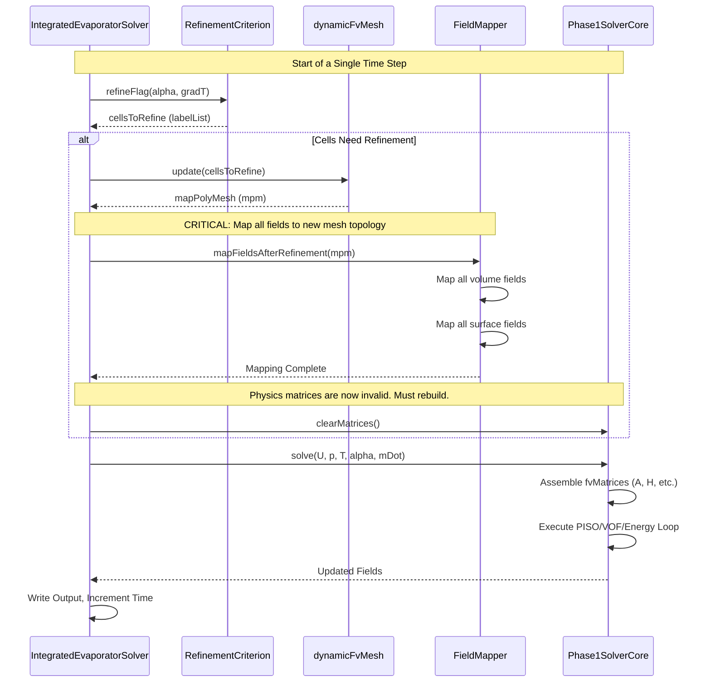

# Day 19: Phase 2 Integration: Geometry, Mesh, and Solver Unification | การรวมระบบ Phase 2: Geometry, Mesh และความสอดคล้องของ Solver

**Date:** 2026-01-19


## 🎯 Learning Objectives | วัตถุประสงค์การเรียนรู้

By the end of this hardcore integration day, you will be able to: | เมื่อสิ้นสุดวันเรียนรู้แบบ hardcore นี้ คุณจะสามารถ:

1.  **Integrate** the complete geometry and mesh generation pipeline from Phase 2 (CAD Import, BlockMesh, SnappyHexMesh, Dynamic Refinement) with the core multiphase evaporator physics solver from Phase 1. You will architect a unified `IntegratedEvaporatorSolver` class that orchestrates the entire simulation workflow, from reading an STL file to producing a time-accurate solution with adaptive meshing. | **Integrate** ระบบ geometry และ mesh generation pipeline ที่สมบูรณ์จาก Phase 2 (CAD Import, BlockMesh, SnappyHexMesh, Dynamic Refinement) เข้ากับ core multiphase evaporator physics solver จาก Phase 1 ได้ โดยคุณจะทำการออกแบบ architecture ของ `IntegratedEvaporatorSolver` class ที่ทำหน้าที่ควบคุม (orchestrate) simulation workflow ทั้งหมด ตั้งแต่การอ่านไฟล์ STL ไปจนถึงการสร้าง solution ที่มีความแม่นยำทางเวลา พร้อมระบบ adaptive meshing

2.  **Implement** robust, field-driven automatic mesh quality control and adaptive refinement triggers. You will design a `RefinementCriterion` class hierarchy that evaluates cell-level field data (e.g., the gradient of the volume fraction `alpha` for interface resolution, or the gradient of temperature `T` for thermal boundary layers) and returns a list of cells for refinement, seamlessly linking physics solution variables to dynamic mesh operations. | **Implement** ระบบควบคุม mesh quality อัตโนมัติที่ขับเคลื่อนด้วย field data และการตั้งค่า adaptive refinement triggers ได้ คุณจะออกแบบ `RefinementCriterion` class hierarchy สำหรับประเมิน cell-level field data (เช่น gradient ของ volume fraction `alpha` เพื่อการแยก interface หรือ gradient ของ temperature `T` สำหรับ thermal boundary layers) และส่งกลับรายการของ cells ที่ต้องการ refinement เพื่อเชื่อมโยง physics solution variables เข้ากับ dynamic mesh operations อย่างไร้รอยต่อ

3.  **Design and implement** the critical data mapping workflow required after dynamic mesh modifications. You will master the use of the `mapPolyMesh` object to conservatively interpolate all `volFields` (U, p, T, alpha) and `surfaceFields` (phi) from the old mesh topology to the new one, ensuring solver stability and conservation of mass and energy post-refinement. | **ออกแบบและ implement** ขั้นตอน data mapping ที่สำคัญหลังจากการแก้ไข dynamic mesh ได้ คุณจะได้เรียนรู้การใช้งาน `mapPolyMesh` object เพื่อทำ conservative interpolation สำหรับทุก `volFields` (U, p, T, alpha) และ `surfaceFields` (phi) จาก old mesh topology ไปยัง mesh ใหม่ เพื่อรักษา stability ของ solver และการอนุรักษ์ (conservation) มวลและพลังงานหลังการทำ refinement

4.  **Construct** a `MeshManager` utility class that abstracts and executes the sequential mesh generation steps (`blockMesh`, `snappyHexMesh`, attachment of `dynamicRefineFvMesh`). This class will manage dictionary inputs, system calls, and error handling, providing a clean API for the main solver to build the computational domain from a CAD file. | **สร้าง** `MeshManager` utility class สำหรับการทำงานแบบ abstract และสั่งรันขั้นตอน mesh generation ตามลำดับ (`blockMesh`, `snappyHexMesh`, การเชื่อมต่อ `dynamicRefineFvMesh`) โดย class นี้จะจัดการ dictionary inputs, system calls และ error handling เพื่อให้มี API ที่สะอาดตาสำหรับ main solver ในการสร้าง computational domain จากไฟล์ CAD

5.  **Formulate** the main time-loop logic within `IntegratedEvaporatorSolver::solveTimeStep()` that intelligently interleaves mesh adaptation with physics solves. This includes checking refinement criteria, conditionally updating the mesh, mapping all dependent fields, and then executing the coupled PISO-VOF-Energy solution step, all while maintaining the Courant number stability limit. | **กำหนดโครงสร้าง** ตรรกะของ main time-loop ภายใน `IntegratedEvaporatorSolver::solveTimeStep()` เพื่อสลับการทำงานระหว่าง mesh adaptation และ physics solves ได้อย่างชาญฉลาด ซึ่งรวมถึงการตรวจสอบ refinement criteria, การอัปเดต mesh ตามเงื่อนไข, การทำ mapping สำหรับทุก fields ที่เกี่ยวข้อง และการรันแก้สมการแบบ coupled PISO-VOF-Energy โดยระวังเรื่อง Courant number stability limit

6.  **Diagnose and resolve** common pitfalls of integrated dynamic mesh solvers, such as field-to-mesh size mismatch errors, non-conservative interpolation leading to mass loss, and performance degradation due to lack of unrefinement. You will implement defensive programming checks and validation routines to ensure the robustness of the end-to-end engine. | **วินิจฉัยและแก้ไข** ข้อผิดพลาดทั่วไปของ integrated dynamic mesh solvers เช่น field-to-mesh size mismatch, non-conservative interpolation ที่ทำให้เกิด mass loss และการลดประสิทธิภาพเนื่องจากการขาด unrefinement คุณจะทำระบบตรวจสอบแบบ defensive programming และ validation routines เพื่อให้มั่นใจในความทนทาน (robustness) ของ end-to-end engine นี้


## Section 1: Theory | ส่วนที่ 1: ทฤษฎี

### 19.1 Integrated Solver Architecture | สถาปัตยกรรมของ Integrated Solver

The culmination of Phase 2 is the creation of a **monolithic, end-to-end CFD engine** that seamlessly unifies the geometric and meshing pipeline (Days 13-18) with the core physics solver (Days 1-12). This integration is not merely a sequential coupling but a deep architectural fusion where mesh dynamics and field evolution become interdependent. The primary theoretical challenge is establishing a **bi-directional data flow**: the physics solution dictates mesh adaptation, and the adapted mesh, in turn, alters the discretization of the governing equations. This section formalizes the metrics and criteria that govern this symbiotic relationship. | จุดสูงสุดของ Phase 2 คือการสร้าง **monolithic, end-to-end CFD engine** ที่รวมความสามารถของ geometric และ meshing pipeline (วัน 13-18) เข้ากับ core physics solver (วัน 1-12) อย่างไร้รอยต่อ การรวมระบบนี้ไม่ใช่เพียงการเชื่อมต่อกันตามลำดับ (sequential coupling) แต่เป็นการหลอมรวมทางสถาปัตยกรรม (architectural fusion) ที่ซึ่ง mesh dynamics และ field evolution กลายเป็นส่วนที่พึ่งพากันและกัน ความท้าทายหลักทางทฤษฎีคือการสร้าง **bi-directional data flow**: โดยที่ physics solution จะเป็นตัวกำหนด mesh adaptation และในขณะเดียวกัน mesh ที่ถูกปรับเปลี่ยนไปแล้วจะส่งผลย้อนกลับไปเปลี่ยนการทำ discretization ของ governing equations โดยในส่วนนี้จะกำหนดรูปแบบของ metrics และ criteria ที่ใช้ควบคุมความสัมพันธ์ที่ส่งเสริมกันนี้ให้เป็นระบบ (formalize)

#### 19.1.1 Mesh Quality as a Dynamic Constraint | Mesh Quality ในฐานะข้อจำกัดแบบ Dynamic

In a static mesh simulation, quality metrics are assessed once during pre-processing. In our integrated dynamic framework, mesh quality becomes a **runtime constraint** that can trigger corrective actions (smoothing, local remeshing) to preserve solution fidelity. We define a composite, dimensionless cell quality factor, \( Q_{\text{cell}} \), that encapsulates two critical geometric defects common in polyhedral cells generated by `snappyHexMesh` and subsequent refinement. | ในการทำ static mesh simulation ค่าคุณภาพ (quality metrics) จะถูกประเมินเพียงครั้งเดียวระหว่างขั้นตอน pre-processing แต่ใน integrated dynamic framework ของเรา mesh quality จะกลายเป็น **runtime constraint** ที่สามารถสั่งให้เกิดการแก้ไข (corrective actions) เช่น การทำ smoothing หรือ local remeshing เพื่อรักษาความถูกต้อง (fidelity) ของ solution เราจึงกำหนดค่า cell quality factor แบบไม่มีหน่วย (dimensionless) นั่นคือ \( Q_{\text{cell}} \) ซึ่งรวบรวมข้อบกพร่องทางเรขาคณิต (geometric defects) ที่สำคัญสองประการที่มักพบใน polyhedral cells ที่สร้างจาก `snappyHexMesh` และการทำ refinement ในภายหลัง

$$
Q_{\text{cell}} = \underbrace{\frac{S_{\text{max}}}{S_{\text{min}}}}_{\text{Skewness Term}} \cdot \underbrace{\frac{1}{\cos(\theta_{\text{max}})}}_{\text{Non-Orthogonality Term}}
$$

**Term 1: Face Area Skewness (\( S_{\text{max}} / S_{\text{min}} \)) | ส่วนของ Face Area Skewness**
*   **Definition:** \( S_{\text{max}} \) and \( S_{\text{max}} \) are the maximum and minimum face area vectors magnitude belonging to cell \( P \). | **Definition:** \( S_{\text{max}} \) และ \( S_{\text{max}} \) คือขนาดสูงสุดและต่ำสุดของ face area vectors ของ cell \( P \)
*   **Physical Interpretation:** This ratio measures the disparity in face sizes. A perfect hexahedron has a ratio of 1. High skewness (>>1) indicates a cell with one very small face adjacent to a very large one, often occurring near curved boundaries or in thin regions. This leads to: | **ความหมายทางกายภาพ:** อัตราส่วนนี้วัดความแตกต่างของขนาดหน้า (face sizes) โดยที่ hexahedron ที่สมบูรณ์แบบจะมีอัตราส่วนเท่ากับ 1 ค่า skewness ที่สูง (>>1) บ่งบอกถึง cell ที่มีหน้าขนาดเล็กมากติดกับหน้าที่ใหญ่มาก ซึ่งมักเกิดขึ้นใกล้กับ curved boundaries หรือในบริเวณที่บางมาก ซึ่งส่งผลให้เกิด:
    *   **Numerical Error:** Large errors in gradient reconstruction via Gauss's theorem, as the contribution from the small face is negligible compared to the large face, distorting the direction of \( \nabla \phi \). | **Numerical Error:** ความผิดพลาดสูงในการทำ gradient reconstruction ผ่าน Gauss's theorem เนื่องจากผลรวมจากหน้าที่เล็กมากนั้นแทบไม่มีนัยสำคัญเมื่อเทียบกับหน้าใหญ่ ทำให้ทิศทางของ \( \nabla \phi \) บิดเบี้ยวไป
    *   **Stability Issues:** Can violate the boundedness of convection schemes (e.g., TVD) and cause the pressure Poisson equation to become ill-conditioned. | **Stability Issues:** อาจละเมิดเงื่อนไข boundedness ของ convection schemes (เช่น TVD) และทำให้สมการ pressure Poisson กลายเป็น ill-conditioned

**Term 2: Non-Orthogonality (\( 1 / \cos(\theta_{\text{max}}) \)) | ส่วนของ Non-Orthogonality**
*   **Definition:** \( \theta_{\text{max}} \) is the maximum angle between the face area vector \( \mathbf{S}_f \) and the vector \( \mathbf{d} \) connecting the owner and neighbour cell centres (\( \mathbf{d} = \mathbf{C}_N - \mathbf{C}_P \)) for all internal faces of the cell. For boundary faces, \( \mathbf{d} \) is the vector from the cell centre to the face centre. | **Definition:** \( \theta_{\text{max}} \) คือมุมสูงสุดระหว่าง face area vector \( \mathbf{S}_f \) และเวกเตอร์ \( \mathbf{d} \) ที่เชื่อมระหว่างจุดศูนย์กลางของ cell เจ้าของ (owner) และ cell ข้างเคียง (neighbour) (\( \mathbf{d} = \mathbf{C}_N - \mathbf{C}_P \)) สำหรับทุก internal faces ของ cell สำหรับ boundary faces นั้น \( \mathbf{d} \) จะเป็นเวกเตอร์จากจุดศูนย์กลาง cell ไปยังจุดศูนย์กลางของ face
*   **Physical Interpretation:** This term penalizes faces where the line connecting cell centres is not perpendicular to the face. Orthogonality (\( \theta = 0 \)) is a fundamental assumption in the standard finite volume discretization of diffusion terms. Non-orthogonality requires a correction term in the Laplacian discretization: | **ความหมายทางกายภาพ:** ส่วนนี้จะให้โทษ (penalize) กับหน้าที่เส้นเชื่อมจุดศูนย์กลางของ cells ไม่ได้ตั้งฉากกับหน้า โดยที่ Orthogonality (\( \theta = 0 \)) เป็นสมมติฐานพื้นฐานในการทำ finite volume discretization ของ diffusion terms แบบมาตรฐาน ค่า Non-orthogonality จะทำให้จำเป็นต้องใช้ correction term ใน Laplacian discretization:
    $$
    (\nabla \cdot (\Gamma \nabla \phi))_P \approx \sum_f \Gamma_f \left( \underbrace{\frac{\phi_N - \phi_P}{|\mathbf{d}|} \frac{\mathbf{S}_f \cdot \mathbf{d}}{|\mathbf{S}_f||\mathbf{d}|}}_{\text{Orthogonal Contribution}} + \underbrace{\overline{(\nabla \phi)}_f \cdot \mathbf{k}}_{\text{Non-Orthogonal Correction}} \right)
    $$
    where \( \mathbf{k} = \mathbf{S}_f - (\mathbf{S}_f \cdot \hat{\mathbf{d}})\hat{\mathbf{d}} \). As \( \theta_{\text{max}} \) increases, the magnitude of the correction term \( \mathbf{k} \) grows, making the discretization less accurate and potentially less stable if not treated with implicit under-relaxation. | โดยที่ \( \mathbf{k} = \mathbf{S}_f - (\mathbf{S}_f \cdot \hat{\mathbf{d}})\hat{\mathbf{d}} \) เมื่อ \( \theta_{\text{max}} \) เพิ่มขึ้น ขนาดของ correction term \( \mathbf{k} \) จะใหญ่ขึ้น ทำให้การ discretization มีความแม่นยำลดลงและอาจทำให้เกิดความไม่เสถียร (stability) ได้ หากไม่มีการทำ implicit under-relaxation อย่างที่เหมาะสม

**Integrated Quality Metric in Practice: | การใช้งาน Integrated Quality Metric ในทางปฏิบัติ:**
The product form of \( Q_{\text{cell}} \) ensures that a cell is flagged as "poor" if it suffers from *either* high skewness *or* high non-orthogonality. A threshold \( Q_{\text{limit}} \approx 5 \) is typical. During the `solveTimeStep()` loop, if a cell's \( Q_{\text{cell}} > Q_{\text{limit}} \), the `MeshManager` can be instructed to perform local mesh smoothing (e.g., Laplace smoothing of vertices) or, in severe cases, trigger an unrefinement/remeshing operation for that region. | รูปแบบที่เป็นผลคูณของ \( Q_{\text{cell}} \) ช่วยให้มั่นใจได้ว่า cell จะถูกระบุว่าเป็น "poor quality" หากมีปัญหาจาก *อย่างใดอย่างหนึ่ง* ระหว่าง skewness ที่สูง หรือ non-orthogonality ที่สูง โดยทั่วไปจะกำหนด threshold \( Q_{\text{limit}} \approx 5 \) ในระหว่างการทำงานของ `solveTimeStep()` loop หากค่า \( Q_{\text{cell}} \) ของ cell ใดสูงกว่า \( Q_{\text{limit}} \) ตัว `MeshManager` จะถูกส่งคำสั่งให้ทำ local mesh smoothing (เช่น Laplace smoothing ของ vertices) หรือในกรณีที่รุนแรง อาจสั่งรัน unrefinement/remeshing สำหรับบริเวณนั้น

**Table 19.1: Mesh Quality Variables | ตัวแปรด้าน Mesh Quality**
| Symbol | Name | Unit | Description | Typical Acceptable Range |
| :--- | :--- | :--- | :--- | :--- |
| \( Q_{\text{cell}} \) | Cell Quality Factor | - | Combined metric for skewness and non-orthogonality. | < 5 |
| \( S_{\text{max}}, S_{\text{min}} \) | Max/Min Face Area | \( m^2 \) | Magnitudes of the largest and smallest face area vectors for a cell. | - |
| \( \theta_{\text{max}} \) | Maximum Non-orthogonality Angle | degrees/radians | Largest angle between \( \mathbf{S}_f \) and \( \mathbf{d} \) for a cell's faces. | < 70° |

#### 19.1.2 Physics-Driven Adaptive Mesh Refinement (AMR) | ระบบ Adaptive Mesh Refinement (AMR) ที่ขับเคลื่อนด้วย Physics

The core intelligence of the integrated solver lies in its ability to **concentrate computational effort where it is physically needed**. We define field-based refinement criteria, \( R_{\text{cell}} \), which are evaluated for every cell at user-specified intervals (e.g., every 10 time steps). A cell is flagged for refinement if \( R_{\text{cell}} > \epsilon \), where \( \epsilon \) is a user-defined threshold. | ความฉลาดหลักของ integrated solver อยู่ที่ความสามารถในการ **รวมทรัพยากรการคำนวณ (computational effort) ไปไว้ในจุดที่มีความจำเป็นทางกายภาพ (physically needed)** เราจึงกำหนด field-based refinement criteria นั่นคือ \( R_{\text{cell}} \) ซึ่งจะถูกประเมินในทุกๆ cell ตามช่วงเวลาที่ผู้ใช้กำหนด (เช่น ทุก 10 time steps) โดย cell จะถูกระบุให้ทำ refinement หาก \( R_{\text{cell}} > \epsilon \) โดยที่ \( \epsilon \) คือ threshold ที่ผู้ใช้กำหนด

**Criterion 1: Interface Capturing (VOF) | เกณฑ์ที่ 1: การจับตำแหน่ง Interface (VOF)**
For the evaporator problem, resolving the liquid-vapor interface is paramount. The refinement criterion is based on the gradient of the volume fraction field, \( \alpha \). | สำหรับปัญหา evaporator การคำนวณแยก liquid-vapor interface ให้ชัดเจนเป็นสิ่งที่สำคัญที่สุด โดยเกณฑ์การทำ refinement จะอ้างอิงจาก gradient ของ volume fraction field นั่นคือ \( \alpha \)

$$
R_{\text{cell}}^{\alpha} = |\nabla \alpha| \cdot \Delta x
$$

*   **Theoretical Justification:** The term \( |\nabla \alpha| \) is high only in cells containing the interface, where \( \alpha \) changes from 0 (vapor) to 1 (liquid). In pure phases, \( \nabla \alpha \approx 0 \). Multiplying by the local cell size \( \Delta x \) (e.g., cube root of cell volume) makes the criterion **scale-invariant**. This ensures refinement triggers based on the *relative* sharpness of the interface compared to the cell size. | **เหตุผลทางทฤษฎี:** ตัวแปร \( |\nabla \alpha| \) จะมีค่าสูงเฉพาะใน cells ที่มี interface อยู่ ซึ่งเป็นจุดที่ \( \alpha \) เปลี่ยนจาก 0 (vapor) เป็น 1 (liquid) ส่วนในพื้นที่ที่เป็น pure phase ค่า \( \nabla \alpha \approx 0 \) การคูณด้วย local cell size \( \Delta x \) (เช่น รากที่สามของปริมาตร cell) จะทำให้เกณฑ์นี้เป็น **scale-invariant** ซึ่งช่วยให้มั่นใจได้ว่าการทำ refinement จะถูกกระตุ้นตามความคมชัด (sharpness) ของ interface *เมื่อเทียบกับ* ขนาดของ cell
*   **Implementation:** \( \nabla \alpha \) is computed using `fvc::grad(alpha)`. The threshold \( \epsilon_{\alpha} \) controls the number of cells across the interface. A typical value is \( \epsilon_{\alpha} = 0.1 \), meaning refinement occurs until the interface is resolved by at least ~10 cells (since \( |\nabla \alpha| \approx 1/\Delta x \) across an ideal interface). | **การประยุกต์ใช้:** คำนวณ \( \nabla \alpha \) โดยใช้ `fvc::grad(alpha)` โดยที่ threshold \( \epsilon_{\alpha} \) จะควบคุมจำนวน cells ที่ครอบคลุม interface ค่าปกติคือ \( \epsilon_{\alpha} = 0.1 \) ซึ่งหมายถึงการทำ refinement จะเกิดขึ้นจนกว่า interface จะถูกล้อมรอบด้วย cells อย่างน้อย 10 cells (เนื่องจาก \( |\nabla \alpha| \approx 1/\Delta x \) ตลอดแนว interface ที่สมบูรณ์แบบ)

**Criterion 2: Thermal Boundary Layer Resolution | เกณฑ์ที่ 2: การคำนวณ Thermal Boundary Layer ให้ละเอียด**
Phase change is driven by heat transfer. Capturing the steep temperature gradients near the heated wall and the interface is critical for accurately computing the mass transfer source term \( \dot{m} \). | การเปลี่ยนเฟส (phase change) ถูกขับเคลื่อนโดยการถ่ายเทความร้อน ดังนั้นการบันทึกค่า temperature gradients ที่ชันมากใกล้กับ heated wall และ interface จึงเป็นสิ่งสำคัญในการคำนวณ mass transfer source term \( \dot{m} \) ให้แม่นยำ

$$
R_{\text{cell}}^{T} = |\nabla T| \cdot \Delta x
$$

*   **Theoretical Justification:** Similar to the interface criterion, this targets regions of high temperature gradient. In an evaporator, these regions are: | **เหตุผลทางทฤษฎี:** เช่นเดียวกับเกณฑ์ interface เกณฑ์นี้เป้าหมายไปที่บริเวณที่มี high temperature gradient ซึ่งใน evaporator บริเวณเหล่านี้คือ:
    1.  The thermal boundary layer along the heated wall. | Thermal boundary layer ตลอดแนว heated wall
    2.  The vicinity of the liquid-vapor interface, where latent heat is absorbed. | บริเวณใกล้เคียง liquid-vapor interface จุดที่มีการดูดซับ latent heat
*   **Dynamic Behavior:** As the flow develops, thermal boundary layers grow. The refinement zone must follow this evolution. The criterion \( R_{\text{cell}}^{T} \) naturally adapts, flagging cells at the edge of the boundary layer where \( |\nabla T| \) is still significant relative to \( \Delta x \). | **พฤติกรรมแบบ Dynamic:** เมื่อการไหลพัฒนาขึ้น thermal boundary layers จะโตขึ้น พื้นที่ที่ทำ refinement จึงต้องเคลื่อนที่ตามการวิวัฒนาการนี้ไป โดยเกณฑ์ \( R_{\text{cell}}^{T} \) จะปรับตัวตามธรรมชาติเพื่อระบุพื้นที่ที่ขอบของ boundary layer ที่ซึ่ง \( |\nabla T| \) ยังคงมีนัยสำคัญเมื่อเทียบกับ \( \Delta x \)

**Criterion 3: Combined Strategy | เกณฑ์ที่ 3: กลยุทธ์แบบผสม**
For robust simulations, a **hierarchical or combined criterion** is often used: | เพื่อความทนทาน (robustness) ของ simulation มักมีการใช้ **hierarchical หรือ combined criterion**:
$$
R_{\text{cell}} = \max(R_{\text{cell}}^{\alpha}, \, R_{\text{cell}}^{T})
$$
A cell is refined if *either* the interface or a thermal gradient is under-resolved. This ensures both key physics are captured simultaneously. | โดย cell จะถูกทำ refinement หากพบว่า *อย่างใดอย่างหนึ่ง* ระหว่าง interface หรือ thermal gradient ยังมีความละเอียดไม่เพียงพอ เพื่อให้แน่ใจว่าจะสามารถบันทึกทั้งสองหัวใจสำคัญทาง physics ได้พร้อมกัน

**Table 19.2: Refinement Criterion Variables | ตัวแปรสำหรับ Refinement Criterion**
| Symbol | Name | Unit | Description |
| :--- | :--- | :--- | :--- |
| \( R_{\text{cell}} \) | Refinement Indicator | - | Scalar value. > Threshold triggers cell split. |
| \( \nabla \alpha \) | Volume Fraction Gradient | \( m^{-1} \) | Magnitude indicates proximity to the liquid-vapor interface. |
| \( \nabla T \) | Temperature Gradient | \( K \, m^{-1} \) | Magnitude indicates thermal boundary layers or phase change regions. |
| \( \Delta x \) | Characteristic Cell Length | \( m \) | Local mesh size, e.g., \( V^{1/3} \). |
| \( \epsilon_{\alpha}, \epsilon_{T} \) | Refinement Thresholds | user-defined | Control the aggressiveness of refinement. Lower values = finer mesh. |

#### 19.1.3 The Critical Challenge: Dynamic LDU Addressing | ความท้าทายที่สำคัญ: ระบบ Dynamic LDU Addressing

**⚠️ WARNING: Dynamic mesh refinement changes the LDU addressing during runtime. Solvers must be able to update field connectivity and restart matrix assembly.** | **⚠️ คำเตือน: การทำ Dynamic mesh refinement จะทำให้ LDU addressing เปลี่ยนแปลงไประหว่างการทำงาน ดังนั้น Solver จะต้องสามารถอัปเดต field connectivity และเริ่มกระบวนการประกอบ matrix (matrix assembly) ใหม่ได้**

This is the most profound theoretical and implementation hurdle. The **LDU (Lower-Diagonal-Upper) addressing** scheme (`lduAddressing`), consisting of `owner_`, `neighbour_`, and `lowerAddr`/`upperAddr` lists, defines the connectivity graph of the linear system \( A\mathbf{x} = \mathbf{b} \). Every term in the discretized Navier-Stokes, energy, and VOF equations—`fvm::ddt`, `fvm::div`, `fvm::laplacian`—assembles coefficients into this matrix based on this fixed connectivity. | นี่ถือเป็นอุปสรรคทางทฤษฎีและการ implement ที่ใหญ่ที่สุด ระบบ **LDU (Lower-Diagonal-Upper) addressing** (`lduAddressing`) ซึ่งประกอบด้วยรายการของ `owner_`, `neighbour_` และ `lowerAddr`/`upperAddr` เป็นตัวกำหนด connectivity graph ของระบบ linear system \( A\mathbf{x} = \mathbf{b} \) ทุกๆ term ในสมการ Navier-Stokes, energy และ VOF ที่ทำ discretization แล้ว เช่น `fvm::ddt`, `fvm::div`, `fvm::laplacian` จะต้องทำการรวบรวมสัมประสิทธิ์ (assemble coefficients) เข้าไปใน matrix ตามรูปแบบ connectivity ที่คงที่นี้

When a cell is refined (split into 8 children in 3D hex refinement): | เมื่อมีการทำ refinement ของ cell (เช่น การแยกออกเป็น 8 children ในการทำ 3D hex refinement):
1.  **Topology Changes:** The original cell is removed. New cells, faces, and points are created. | **Topology Changes:** Cell เดิมจะถูกลบออก และมีการสร้าง cells, faces และ points ใหม่ขึ้นมา
2.  **LDU Rebuild:** The entire `owner_` and `neighbour_` list is regenerated. The `lduMatrix` assembled for the old mesh is **obsolete**. | **LDU Rebuild:** รายการ `owner_` และ `neighbour_` ทั้งหมดจะถูกสร้างขึ้นใหม่ ทำให้ `lduMatrix` ที่เคยประกอบขึ้นมาสำหรับ mesh เก่านั้นกลายเป็น **ของล้าสมัย (obsolete)**
3.  **Field Connectivity:** The `volScalarField` for pressure \( p \) no longer has a valid mapping from its stored values (indexed by old cell IDs) to the new mesh cells. | **Field Connectivity:** ค่า `volScalarField` สำหรับ pressure \( p \) จะไม่มีตัวเชื่อมโยง (mapping) ที่ถูกต้องจากค่าที่เก็บไว้เดิม (ที่ใช้ index ของ cell IDs เก่า) ไปยัง cells ใน mesh ใหม่

**Theoretical Consequence:** The discrete operators (divergence, gradient, Laplacian) are fundamentally tied to the mesh topology. Changing the mesh changes the discrete representation of the continuous differential operators. Therefore, after refinement: | **ผลกระทบทางทฤษฎี:** ตัวดำเนินการแบบไม่ต่อเนื่อง (discrete operators เช่น divergence, gradient, Laplacian) ผูกพันอย่างแน่นแฟ้นกับ mesh topology ดังนั้นการเปลี่ยน mesh ย่อมหมายถึงการเปลี่ยนรูปแบบตัวแทน (discrete representation) ของ differential operators แบบต่อเนื่อง ด้วยเหตุนี้ หลังจากการทำ refinement:
*   The solution **cannot** simply continue from the previous iteration. | การหา solution **ไม่สามารถ** ทำต่อจากรอบที่แล้วได้โดยตรง
*   The matrix \( A \) and source vector \( b \) for all equations **must be completely reassembled** using the new `lduAddressing`. | Matrix \( A \) และ source vector \( b \) ของทุกสมการ **จะต้องถูกประกอบขึ้นใหม่ทั้งหมด (completely reassembled)** โดยใช้ `lduAddressing` ใหม่
*   The field values from the old mesh must be **mapped** (interpolated) onto the new mesh to provide initial conditions for the reassembled system. | ค่า field values จาก mesh เดิมจะถูก **mapped** (ทฤษฎีการทำ interpolation) ลงบน mesh เพื่อใช้เป็นเงื่อนไขเริ่มต้นสำหรับระบบที่เพิ่งประกอบขึ้นใหม่นี้

This necessitates the `mapPolyMesh` object and the field mapping constructors, which are the machinery for preserving solution continuity across topological changes, a concept we will detail in the implementation section. | ด้วยความจำเป็นนี้ จึงต้องมี `mapPolyMesh` object และ field mapping constructors ซึ่งเป็นกลไกสำคัญในการรักษาความต่อเนื่องของ solution ท่ามกลางการเปลี่ยนแปลงทาง topology ซึ่งเป็นหัวข้อที่เราจะลงรายละเอียดในการ implement

### 19.2 Geometry-to-Solver Data Flow | การส่งต่อข้อมูลจาก Geometry ไปยัง Solver

A robust integrated solver must automate the translation of **geometric intent** into **physical boundary conditions**. This flow is governed by a mapping function \( \mathcal{M} \). | integrated solver ที่แข็งแกร่งต้องมีระบบอัตโนมัติในการแปลผล **ความต้องการทางเรขาคณิต (geometric intent)** ให้เป็น **physical boundary conditions** โดยที่การส่งต่อข้อมูลนี้ถูกควบคุมโดย mapping function \( \mathcal{M} \)

#### 19.2.1 The Boundary Condition Mapping Function | ฟังก์ชัน Mapping สำหรับ Boundary Condition

The process begins with a CAD model (e.g., an STL file) where surfaces are tagged with **region names** like `"inlet_pipe"`, `"heater_wall"`, `"outer_wall"`, `"symmetry_plane"`. These names are geometric/logical identifiers. The solver requires these to be translated into specific mathematical boundary conditions for each solved field (\( \mathbf{U}, p, T, \alpha \)). | กระบวนการเริ่มต้นจาก CAD model (เช่น ไฟล์ STL) ที่พื้นผิวผิวต่างๆ ถูกระบุชื่อกำกับไว้เป็น **region names** เช่น `"inlet_pipe"`, `"heater_wall"`, `"outer_wall"`, `"symmetry_plane"` โดยชื่อเหล่านี้คือตัวระบุทางเรขาคณิตหรือทางตรรกะ (logical identifiers) ซึ่ง Solver จำเป็นต้องทำการแปลชื่อเหล่านี้ให้เป็นเงื่อนไขทางคณิตศาสตร์เฉพาะสำหรับแต่ละ field ที่ต้องการแก้สมการ (\( \mathbf{U}, p, T, \alpha \))

We define this formally as: | เรากำหนดนิยามสิ่งนี้ไว้อย่างเป็นทางการดังนี้:
$$
\text{BC}_{\text{solver}} = \mathcal{M}(\text{BC}_{\text{CAD}}, \text{Region}_{\text{name}})
$$

Where: | โดยที่:
*   \( \text{BC}_{\text{CAD}} \) is not a true BC, but the **geometric entity** (a set of faces) imported from the CAD. | \( \text{BC}_{\text{CAD}} \) เป็นเพียง **geometric entity** (ชุดของ faces) ที่ถูกนำเข้ามาจาก CAD ไม่ใช่ BC จริงๆ
*   \( \text{Region}_{\text{name}} \) is the string identifier for that entity. | \( \text{Region}_{\text{name}} \) คือชื่อ (string) ที่ใช้เรียกแทน entity นั้น
*   \( \mathcal{M} \) is the mapping function, typically implemented as a runtime dictionary. | \( \mathcal{M} \) คือ mapping function ซึ่งมักจะถูกสร้างในรูปแบบของ runtime dictionary
*   \( \text{BC}_{\text{solver}} \) is the resulting OpenFOAM boundary condition type and value (e.g., `fixedValue (0 1 0)` for velocity, `zeroGradient` for pressure). | \( \text{BC}_{\text{solver}} \) คือผลลัพธ์ที่เป็น OpenFOAM boundary condition ทั้งชนิดและค่า (เช่น `fixedValue (0 1 0)` สำหรับ velocity หรือ `zeroGradient` สำหรับ pressure)

**Example Mapping Dictionary (`boundaryMapping`): | ตัวอย่างของ Mapping Dictionary (`boundaryMapping`):**
```cpp
boundaryMapping
{
    // Region_Name    Field    Type            Value(s)
    inlet_pipe
    {
        U           fixedValue   (0 0 0.5); // Fixed inlet velocity
        p           zeroGradient;
        T           fixedValue   373;       // Hot inlet temperature
        alpha       fixedValue   0;         // Vapor inlet
    }
    heater_wall
    {
        U           noSlip;
        p           zeroGradient;
        T           fixedValue   450;       // High wall temperature
        alpha       zeroGradient;
    }
    outer_wall
    {
        U           noSlip;
        p           zeroGradient;
        T           fixedValue   300;       // Ambient wall temperature
        alpha       zeroGradient;
    }
}
```
This dictionary is parsed by the `MeshManager` after `snappyHexMesh` creates the final boundary patches. It ensures that the `polyBoundaryMesh` entries are assigned the correct `fvPatchField` types. | Dictionary นี้จะถูกอ่าน (parse) โดย `MeshManager` หลังจากที่ `snappyHexMesh` สร้าง boundary patches ชุดสุดท้ายเสร็จสิ้น เพื่อให้แน่ใจว่าแต่ละส่วนของ `polyBoundaryMesh` ถูกกำหนด `fvPatchField` types ที่ถูกต้อง

#### 19.2.2 Theoretical Implications of Automated Mapping | ผลกระทบทางทฤษฎีของการทำ Automated Mapping

1.  **Separation of Concerns:** The CAD designer does not need to know OpenFOAM syntax. They only tag regions functionally. The CFD engineer defines the physics in one centralized dictionary. | **การแยกส่วนหน้าที่ (Separation of Concerns):** ผู้ออกแบบ CAD ไม่จำเป็นต้องรู้ syntax ของ OpenFOAM เพียงแค่ระบุชื่อเรียกตามหน้าที่ของพื้นผิวเท่านั้น ส่วนวิศวกร CFD จะเป็นผู้กำหนดคุณสมบัติทาง physics ใน dictionary ส่วนกลางเพียงแห่งเดียว
2.  **Error Propagation:** An incorrect mapping is a **silent error**. If `heater_wall` is mistakenly mapped to `inlet` for velocity, mass will be incorrectly injected at the wall, leading to non-physical results and likely solver divergence. The mapping logic must therefore include **validation checks**, such as ensuring a `noSlip` condition is not applied to a patch that `snappyHexMesh` has identified as a `patch` type (vs. a `wall` type). | **การขยายตัวของข้อผิดพลาด (Error Propagation):** การทำ mapping ผิดพลาดถือเป็น **silent error (ข้อผิดพลาดแบบเงียบ)** หากมีการกำหนดให้ `heater_wall` กลายเป็น `inlet` ของความเร็วโดยไม่ได้ตั้งใจ มวลจะถูกฉีดเข้ามาที่ผนังอย่างผิดเพี้ยน ส่งผลให้ได้ผลลัพธ์ที่ไม่สอดคล้องกับฟิสิกส์ (non-physical results) และมักจะทำให้ solver เกิดการ divergence ดังนั้นตรรกะการทำ mapping จึงต้องมี **การตรวจสอบ (validation checks)** เช่น การตรวจสอบว่าเงื่อนไข `noSlip` จะไม่ถูกนำไปใช้กับ patch ที่ `snappyHexMesh` ระบุว่าเป็นชนิด `patch` (แทนที่จะเป็น `wall`)
3.  **Dynamic Consistency:** When dynamic refinement occurs near a boundary, new boundary faces may be created. The mapping \( \mathcal{M} \) must be re-applied to ensure these new faces inherit the correct BC from their parent region. This is handled internally by OpenFOAM's patch inheritance during refinement. | **ความสม่ำเสมอแบบ Dynamic (Dynamic Consistency):** เมื่อมีการทำ dynamic refinement ใกล้ขอบเขตพื้นที่จำลอง (boundary) อาจมีการสร้าง boundary faces ใหม่ขึ้น การทำ mapping \( \mathcal{M} \) จะถูกเรียกใช้อีกครั้งเพื่อให้แน่ใจว่า faces ใหม่เหล่านี้จะรับทอด (inherit) BC ที่ถูกต้องจาก parent region ซึ่ง OpenFOAM มีระบบจัดการ patch inheritance ภายในระหว่างการทำ refinement อยู่แล้ว

**Table 19.3: Geometry-to-Solver Mapping Variables | ตัวแปรการ Mapping จาก Geometry ไปยัง Solver**
| Symbol | Name | Unit | Description |
| :--- | :--- | :--- | :--- |
| \( \mathcal{M} \) | Mapping Dictionary | - | A runtime dictionary (`boundaryMapping`) that defines the physics for each geometric region. |
| `Region_name` | CAD Region Identifier | - | The name string assigned to a surface in the CAD software (e.g., "inlet"). |

**⚠️ WARNING: Incorrect BC mapping is a silent error. A wall might accidentally get an inlet condition, causing mass imbalance and divergence.** | **⚠️ คำเตือน: การทำ mapping ของ BC ผิดพลาดถือเป็น silent error เพราะผนังอาจได้รับเงื่อนไข inlet เข้าไปโดยไม่ตั้งใจ ทำให้เกิดความไม่สมดุลของมวลและเกิดการ divergence ได้**

The theoretical framework established here—dynamic quality metrics, physics-based refinement criteria, and automated geometry-to-physics mapping—provides the foundation for the `IntegratedEvaporatorSolver`. It transforms the solver from a static PDE integrator into an adaptive system that manages its own computational domain in response to the evolving physics, a hallmark of a modern, production-grade CFD engine. | โครงสร้างทางทฤษฎีที่สร้างขึ้นมาเหล่านี้ ไม่ว่าจะเป็น dynamic quality metrics, เกณฑ์การทำ refinement ตามหลักฟิสิกส์ และการทำ mapping จาก geometry ไปยัง physics แบบอัตโนมัติ ต่างเป็นรากฐานให้กับ `IntegratedEvaporatorSolver` จนเปลี่ยนจากเพียงเครื่องมือแก้สมการ PDE แบบคงที่ ให้กลายเป็นระบบที่ปรับเปลี่ยนตัวเองได้ (adaptive system) ซึ่งสามารถจัดการ computational domain ของตนเองให้สอดคล้องกับพฤติกรรมทางฟิสิกส์ที่เปลี่ยนไป ซึ่งเป็นจุดเด่นสำคัญของ CFD engine ในระดับใช้งานผลิตจริงยุคปัจจุบัน

<END_OF_THEORY_SECTION>


# Section 2: OpenFOAM Reference | ส่วนที่ 2: การอ้างอิง OpenFOAM

This section provides a deep, line-by-line analysis of the critical OpenFOAM classes that form the backbone of the integrated geometry-mesh-solver architecture developed in Day 19. We will dissect the standard OpenFOAM implementation and contrast it with our custom, hardcore extensions that enable seamless runtime coupling between dynamic mesh operations and the physics solver. | ในส่วนนี้จะทำการวิเคราะห์เจาะลึกลงไปในทีละบรรทัด (line-by-line analysis) สำหรับ OpenFOAM classes ที่เป็นหัวใจสำคัญและเป็นกระดูกสันหลังให้กับ architecture การรวม geometry-mesh-solver ที่เราพัฒนาขึ้นในวันที่ 19 นี้ โดยเราจะสลายโครงสร้าง (dissect) การทำ implementation มาตรฐานของ OpenFOAM และนำมาเปรียบเทียบชุดคำสั่งเสริมระดับ hardcore ที่เราสร้างขึ้น เพื่อให้เกิดการเชื่อมต่อแบบไร้รอยต่อในช่วง runtime ระหว่าง dynamic mesh operations และ physics solver


## 2.1 Core Class: `polyMesh` - The Evolving Topology | Core Class: `polyMesh` - โครงสร้าง Mesh ที่วิวัฒนาการได้

**Header:** `src/OpenFOAM/meshes/polyMesh/polyMesh.H`

**Purpose:** The fundamental polyhedral mesh container. In our integrated solver, this object is no longer static; it is a living entity modified by `snappyHexMesh` and dynamic refinement during the simulation. | **วัตถุประสงค์:** เป็นตู้คอนเทนเนอร์เก็บข้อมูล mesh แบบ polyhedral พื้นฐาน ใน integrated solver ของเรา object นี้จะไม่เป็นแบบ static อีกต่อไป แต่จะเป็นสิ่งที่มีชีวิต (living entity) ที่ถูกปรับเปลี่ยนโดย `snappyHexMesh` และการทำ dynamic refinement ตลอดการรัน simulation

### 2.1.1 Key Data Members and Their Post-Refinement State | ข้อมูลสมาชิกหลักในสภาวะหลังการทำ Refinement

Let's examine the critical private data members declared in `polyMesh.H` and understand their lifecycle. | เรามาตรวจสอบ private data members ที่สำคัญซึ่งประกาศไว้ใน `polyMesh.H` และทำความเข้าใจวงจรชีวิต (lifecycle) ของพวกมันกัน

```cpp
// From polyMesh.H - Standard OpenFOAM Declaration
class polyMesh
:
    public objectRegistry
{
    // Private Data

        //- Points supporting the mesh (vertices)
        pointField points_;

        //- Face list
        faceList faces_;

        //- Cells (as polyhedral decomposition)
        cellList cells_;

        //- Owner cell for each face
        labelList owner_;

        //- Neighbour cell for each internal face
        labelList neighbour_;

        //- Boundary mesh
        polyBoundaryMesh boundary_;

        //- Parallel communication info
        mutable autoPtr<globalMeshData> globalData_;
};
```

**Analysis:** After a dynamic refinement operation (e.g., triggered by `InterfaceRefinement`), every one of these core data members is potentially invalidated. `points_` may have new vertices from cell splitting. `faces_` are recreated for new cells and modified for existing ones. `owner_` and `neighbour_` lists are completely rebuilt to reflect the new cell-face connectivity. The `boundary_` object, while its patch definitions (names, types) persist, internally updates its `startFace` indices and `faceCells` lists. The `globalData_` pointer, which caches processor communication patterns, must be cleared and recalculated for parallel runs. | **บทวิเคราะห์:** หลังจากการทำ dynamic refinement (เช่น การกระตุ้นโดย `InterfaceRefinement`) ข้อมูลสมาชิกหลักทุกตัวเหล่านี้มีโอกาสถูกยกเลิกความถูกต้อง (invalidated) ได้ `points_` อาจมีจุดยอด (vertices) ใหม่จากการแบ่ง cell; `faces_` จะสารถูกสร้างขึ้นใหม่สำหรับ cell ใหม่และถูกแก้ไขสำหรับที่มีอยู่เดิม; รายการ `owner_` และ `neighbour_` จะถูกสร้างขึ้นใหม่ทั้งหมดเพื่อให้สอดคล้องกับ cell-face connectivity ใหม่; ในส่วนของ `boundary_` object แม้ว่าการกำหนด patch (ชื่อ, ชนิด) จะยังคงอยู่ แต่ภายในจะมีการอัปเดต `startFace` และ `faceCells`; และ `globalData_` pointer ซึ่งทำหน้าที่แคชรูปแบบการสื่อสารระหว่างโปรเซสเซอร์ จะต้องถูกล้างข้อมูลและคำนวณใหม่สำหรับการรันแบบขนาน (parallel runs)

### 2.1.2 The Critical Method: `updateMesh` | Method ที่สำคัญ: `updateMesh`

The `polyMesh::updateMesh` method is the central nervous system for handling topology changes. It is called by mesh modifiers (like `dynamicRefineFvMesh::update()`) and propagates change signals to all dependent objects. | `polyMesh::updateMesh` เป็นเหมือนระบบประสาทส่วนกลางในการจัดการกับการเปลี่ยนแปลง topology มันจะถูกเรียกโดย mesh modifiers (เช่น `dynamicRefineFvMesh::update()`) และส่งสัญญาณการเปลี่ยนแปลงกระจายไปยัง object อื่นๆ ทั้งหมดที่เกี่ยวข้อง

```cpp
// Standard OpenFOAM implementation (simplified)
void polyMesh::updateMesh(const mapPolyMesh& mpm)
{
    // Clear out geometric data that is now invalid
    clearOut();

    // Reset the primitive mesh data using the mapping object
    // The mapPolyMesh (mpm) contains old-to-new mapping for points, faces, cells.
    resetPrimitive
    (
        mpm.preMotionPoints(), // New point positions
        mpm.pointMap(),        // Mapping from old to new point indices
        mpm.faceMap(),         // Mapping from old to new face indices
        mpm.cellMap(),         // Mapping from old to new cell indices
        mpm.reverseCellMap(),  // Mapping from new to old cell indices (for interpolation)
        mpm.oldPatchSizes(),   // Old patch sizes (for boundary update)
        mpm.oldPatchStarts()   // Old patch start faces
    );

    // Update the boundary mesh with new addressing
    boundary_.updateMesh();

    // Invalidate global mesh data - it will be lazily recalculated when needed
    globalData_.clear();

    // Trigger a mesh motion event (important for moving mesh solvers)
    instance_ = time().timeName();
}
```

**What We Do DIFFERENTLY:** In our `IntegratedEvaporatorSolver`, we don't just rely on the automatic update. We intercept this process to inject custom field conservation logic and update our internal solver state. | **สิ่งที่เราทำต่างออกไป:** ใน `IntegratedEvaporatorSolver` ของเรา เราจะไม่เป็นเพียงผู้รอให้การอัปเดตเกิดขึ้นเองอัตโนมัติ แต่เราจะดักจับ (intercept) กระบวนการนี้เพื่อใส่ตรรกะการอนุรักษ์ฟิลด์ (custom field conservation logic) และอัปเดตสถานะภายในของ Solver เราเอง


| Standard OpenFOAM Behavior | Our Hardcore Extension (`IntegratedEvaporatorSolver`) |
| :--- | :--- |
| `updateMesh` is called by the mesh modifier. Fields registered with the mesh are notified via `objectRegistry` callbacks. | We wrap the call. Before `mesh.update()`, we snapshot integral quantities: `totalMass = sum(rho*alpha*V)`, `totalEnergy = sum(rho*Cp*T*V)`. | `updateMesh` ถูกเรียกโดย mesh modifier โดยที่ fields ต่างๆ ที่ลงทะเบียนไว้กับ mesh จะได้รับการแจ้งเตือนผ่าน `objectRegistry` callbacks | เราทำการหุ้ม (wrap) การเรียกใช้ โดยก่อนสั่ง `mesh.update()` เราจะทำการบันทึกภาพรวม (snapshot) ของค่าอินทิกรัล: `totalMass = sum(rho*alpha*V)`, `totalEnergy = sum(rho*Cp*T*V)` |
| Field mapping uses the generic `mapPolyMesh` constructor, performing linear interpolation from parent to child cells. | We implement a **Conservative Volume-Weighted Mapping** for `alpha`. After standard mapping, we compute `newLiquidVolume = sum(alphaNew * V_new)`. If it differs from the snapped `oldLiquidVolume` by more than `1e-12`, we apply a correction factor: `alphaNew *= (oldLiquidVolume / newLiquidVolume)`. | การทำ field mapping จะใช้งาน `mapPolyMesh` constructor แบบทั่วไป เพื่อทำ linear interpolation จาก parent ไปยัง child cells | เราทำ **Conservative Volume-Weighted Mapping** สำหรับ `alpha` โดยหลังการทำ mapping มาตรฐาน เราจะคำนวณ `newLiquidVolume = sum(alphaNew * V_new)` หากค่าต่างจาก `oldLiquidVolume` ที่บันทึกไว้เกิน `1e-12` เราจะใช้ correction factor: `alphaNew *= (oldLiquidVolume / newLiquidVolume)` |
| The `polyBoundaryMesh` updates itself automatically. | We add a post-update hook to **re-validate boundary condition mappings**. It checks that each `fvPatchField` type (e.g., `fixedValue`) is still compatible with the `MeshManager`'s CAD-derived patch name (e.g., `heater_wall`). If a patch was split during refinement, it ensures child patches inherit the correct BC type. | `polyBoundaryMesh` จะอัปเดตตัวเองโดยอัตโนมัติ | เราเพิ่ม post-update hook เพื่อทำการ **re-validate boundary condition mappings** ตรวจสอบว่า `fvPatchField` แต่ละชนิด (เช่น `fixedValue`) ยังคงเข้ากันได้กับชื่อ patch จาก CAD (เช่น `heater_wall`) หาก patch ถูกแบ่งระหว่างทำ refinement เราจะกำกับให้ child patches รับทอด BC type ที่ถูกต้อง |
| Global mesh data is cleared and will be recalculated on-demand, potentially causing a performance spike during the next parallel operation. | We proactively trigger the recalculation of `globalData()` immediately after `updateMesh` within a scoped timer. This moves the parallel communication cost to a predictable point in the time step, avoiding lag later in the PISO loop. | ข้อมูล global mesh จะถูกล้างและคำนวณใหม่เมื่อมีการเรียกใช้ (on-demand) ซึ่งอาจทำให้เกิด performance spike เมื่อมีการรันแบบขนานในขั้นตอนถัดไป | เราสั่งคำนวณ `globalData()` ใหม่ทันทีเชิงรุก (proactively) หลัง `updateMesh` ภายในตัวจับเวลา (scoped timer) เพื่อย้ายภาระการสื่อสารแบบขนานไปไว้ในจุดที่คาดการณ์ได้ ป้องกันการเกิด lag ในช่วงท้ายของ PISO loop |

### 2.1.3 Field Mapping: The `mapPolyMesh` Constructor | Field Mapping: ใช้งาน `mapPolyMesh` Constructor

The magic of transferring field data to a new mesh lies in the field constructors that accept a `mapPolyMesh&` argument. Let's look at the `volScalarField` implementation. | เวทมนตร์ของการถ่ายโอนข้อมูล field ไปยัง mesh ใหม่นั้นอยู่ที่ตัว constructors ของ field ที่รับอาร์กิวเมนต์เป็น `mapPolyMesh&` เรามาดูการทำ implementation ของ `volScalarField` กัน

```cpp
// From volField.H / volField.C (Conceptual)
template<class Type>
tmp<GeometricField<Type, fvPatchField, volMesh>>
GeometricField<Type, fvPatchField, volMesh>::New
(
    const GeometricField<Type, fvPatchField, volMesh>& gF,
    const mapPolyMesh& mpm
)
{
    // Create a new field with the same name, dimensions, and boundary types
    auto tnewField = tmp<GeometricField<Type, fvPatchField, volMesh>>::New
    (
        IOobject
        (
            gF.name(),
            gF.mesh().time().timeName(),
            gF.mesh(),
            IOobject::NO_READ,
            IOobject::AUTO_WRITE,
            gF.registerObject()
        ),
        gF.mesh(), // The NEW mesh, already updated
        gF.dimensions(),
        Field<Type>(mpm.cellMap().size()), // Allocate for new number of cells
        gF.boundaryField().clone() // Clone the boundary field types
    );
    auto& newField = tnewField.ref();

    // Perform the actual mapping: interpolate from old cells to new cells.
    // mpm.cellMap() provides the old cell index for each new cell.
    // For cells created by refinement, mpm.reverseCellMap() provides the parent.
    mapInternalField(mpm, gF.internalField(), newField.internalField());

    // Map the boundary field values
    newField.boundaryField().map(gF.boundaryField(), mpm);

    return tnewField;
}
```

**Our Implementation Snippet (`IntegratedEvaporatorSolver::mapFieldsAfterRefinement`): | โค้ดตัวอย่างการ Implement ของเรา (`IntegratedEvaporatorSolver::mapFieldsAfterRefinement`)**

```cpp
void IntegratedEvaporatorSolver::mapFieldsAfterRefinement(const mapPolyMesh& mpm)
{
    // Store old integral quantities for conservation check
    const scalar oldLiquidMass = fvc::domainIntegrate(rho_l_ * alpha_).value();
    const scalar oldTotalEnergy = fvc::domainIntegrate
    (
        rho_ * Cp_ * T_
    ).value();

    // Map primary fields using the standard constructor
    U_ = volVectorField(U_, mpm);
    p_ = volScalarField(p_, mpm);
    T_ = volScalarField(T_, mpm);

    // Map alpha with our custom conservative wrapper
    alpha_ = conservativeAlphaMap(alpha_, mpm, rho_l_, rho_v_);

    // CRITICAL: Map the face flux field (phi). If this is wrong, divergence is wrong.
    phi_ = surfaceScalarField(phi_, mpm);

    // Map the phase change mass transfer rate field
    mDot_ = volScalarField(mDot_, mpm);

    // Verify conservation
    const scalar newLiquidMass = fvc::domainIntegrate(rho_l_ * alpha_).value();
    const scalar massError = mag(newLiquidMass - oldLiquidMass) / (oldLiquidMass + SMALL);

    if (massError > 1e-10)
    {
        WarningInFunction
            << "Liquid mass conservation error after mapping: "
            << massError * 100 << "%" << nl
            << "Applying corrective scaling to alpha field." << endl;
        alpha_ *= oldLiquidMass / newLiquidMass;
    }
    // ... similar check for energy ...
}
```


## 2.2 Abstract Class: `dynamicFvMesh` - The Bridge | Abstract Class: `dynamicFvMesh` - สะพานเชื่อมระบบ

**Header:** `src/dynamicFvMesh/dynamicFvMesh/dynamicFvMesh.H`

**Purpose:** This abstract base class defines the interface for meshes that can change topology at runtime. It is the crucial link between Phase 2's mesh manipulation tools and Phase 1's static solver. | **วัตถุประสงค์:** abstract base class นี้จะกำหนดอินเทอร์เฟซสำหรับ mesh ที่สามารถเปลี่ยนแปลง topology ได้ระหว่างรันโปรแกรม (runtime) ซึ่งถือเป็นตัวเชื่อมโยงที่สำคัญระหว่างเครื่องมือ mesh manipulation ของ Phase 2 และ static solver ของ Phase 1

### 2.2.1 Interface Definition and Our Concrete Implementation | การนิยาม Interface และการทำ Concrete Implementation ของเรา

The standard abstract class is minimal: | abstract class มาตรฐานนั้นค่อนข้างเรียบง่าย:

```cpp
class dynamicFvMesh
:
    public fvMesh
{
public:

    //- Runtime type information
    TypeName("dynamicFvMesh");

    //- Declare run-time constructor selection table
    declareRunTimeSelectionTable
    (
        autoPtr,
        dynamicFvMesh,
        IOobject,
        (const IOobject& io),
        (io)
    );

    //- Construct from IOobject
    explicit dynamicFvMesh(const IOobject& io);

    //- Destructor
    virtual ~dynamicFvMesh() = default;

    //- Update the mesh for both mesh motion and topology change.
    //  Return true if topology changed.
    virtual bool update() = 0;

    //- Refine cells based on a field
    virtual void refine
    (
        const word& fieldName,
        const scalar lowerRefineLevel,
        const scalar upperRefineLevel,
        const scalar unrefineLevel = GREAT
    );
};
```

**Analysis:** The pure virtual `update()` function is the contract. Our integrated solver works with `dynamicRefineFvMesh`, the most common concrete implementation. However, we extend its functionality through composition in `MeshManager`. | **บทวิเคราะห์:** ฟังก์ชัน `update()` แบบ pure virtual คือข้อสัญญา (contract) หลักที่ต้องปฏิบัติ solver ที่รวมระบบแล้วของเราจะทำงานร่วมกับ `dynamicRefineFvMesh` ซึ่งเป็น concrete implementation ที่ใช้บ่อยที่สุด อย่างไรก็ตาม เราได้ขยายฟังก์ชันการทำงานของมันผ่านการทำ composition ภายใน `MeshManager`

**What We Do DIFFERENTLY:** We create a `ManagedDynamicFvMesh` wrapper class (managed by `MeshManager`) that enriches the refinement process with physics-aware logic. | **สิ่งที่เราทำต่างออกไป:** เราสร้าง `ManagedDynamicFvMesh` ซึ่งเป็น wrapper class (จัดการโดย `MeshManager`) เพื่อเพิ่มความสามารถให้กระบวนการ refinement มีตรรกะที่รับรู้ถึงสภาวะทางฟิสิกส์ (physics-aware logic)

| Standard `dynamicRefineFvMesh` Behavior | Our `ManagedDynamicFvMesh` Extension |
| :--- | :--- |
| Reads refinement criteria from `dynamicMeshDict`. Criteria are simple field value thresholds (e.g., `field alpha; lowerLimit 0.01; upperLimit 0.99;`). | Criteria are defined by **strategy objects** (`RefinementCriterion`). The dict entry becomes: `refinementStrategy InterfaceAndThermal;` `interfaceThreshold 0.05;` `thermalGradientThreshold 100;`. | การอ่านเกณฑ์ refinement จาก `dynamicMeshDict` โดยมีเกณฑ์เป็นเพียง threshold ของค่า field ง่ายๆ (เช่น `field alpha; lowerLimit 0.01; upperLimit 0.99;`) | เกณฑ์ถูกกำหนดโดย **strategy objects** (`RefinementCriterion`) โดยค่าใน dictionary จะเปลี่ยนเป็น: `refinementStrategy InterfaceAndThermal;` `interfaceThreshold 0.05;` `thermalGradientThreshold 100;` |
| `refine(...)` is called with a single field name. | We override `refine` to accept a **list of fields and a list of criterion objects**. It performs a logical OR: refine if *any* criterion flags the cell. | `refine(...)` ถูกเรียกโดยใช้ชื่อ field เพียงชื่อเดียว | เราทำ override `refine` ให้รับ **รายการของ fields และรายการของ criterion objects** โดยจะทำงานแบบตรรกะ OR: คือจะทำ refine หากมี *เกณฑ์ใดเกณฑ์หนึ่ง* ระบุให้ทำ |
| Unrefinement is based on the same field falling below a level. | Unrefinement uses a **hysteresis model**. A cell is only unrefined if the field value has remained below the threshold for `N` consecutive time steps (configurable), preventing rapid toggling near the threshold. | การทำ Unrefinement อ้างอิงจาก field เดิมเมื่อมีค่าลดลงต่ำกว่าระดับที่กำหนด | การทำ Unrefinement จะใช้ **hysteresis model** คือ cell จะถูก unrefined ก็ต่อเมื่อค่า field ต่ำกว่า threshold ติดต่อกันเป็นจำนวน `N` time steps (ตั้งค่าได้) เพื่อป้องกันการปรับไปมา (toggling) อย่างรวดเร็วรอบๆ threshold |
| Mesh update is a monolithic operation. | We split it into **stages with callbacks**: `preUpdate()`, `performTopologyChange()`, `postUpdate(mapPolyMesh&)`. This allows `IntegratedEvaporatorSolver` to hook into `preUpdate` to snapshot fields and `postUpdate` to trigger its custom field mapping. | การทำ Mesh update เป็นการทำงานแบบก้อนเดียว (monolithic) | เราแบ่งออกเป็น **หลายขั้นตอนพร้อมระบบ callback**: `preUpdate()`, `performTopologyChange()`, `postUpdate(mapPolyMesh&)` ซึ่งช่วยให้ `IntegratedEvaporatorSolver` สามารถเข้าไปแทรก (hook) ใน `preUpdate` เพื่อ snapshot fields และใน `postUpdate` เพื่อรัน custom field mapping ได้ |


**Implementation Snippet - `ManagedDynamicFvMesh::refine`: | โค้ดตัวอย่างการ Implement - `ManagedDynamicFvMesh::refine`**

```cpp
bool ManagedDynamicFvMesh::refine(const PtrList<RefinementCriterion>& criteria)
{
    // Create a master indicator field, initialized to 0 (no refinement)
    volScalarField refineField
    (
        IOobject("refineIndicator", mesh_.time().timeName(), mesh_),
        mesh_,
        dimensionedScalar(dimless, 0.0)
    );

    // Apply each criterion. Use max() to combine flags (OR operation).
    forAll(criteria, i)
    {
        const labelList& cellFlags = criteria[i].refineFlag();
        forAll(cellFlags, celli)
        {
            if (cellFlags[celli])
            {
                refineField[celli] = max(refineField[celli], 1.0);
            }
        }
    }

    // Now call the base class refine using the composite indicator field
    // We temporarily set the field name in the dictionary
    const dictionary& origDict = dynamicMeshDict_;
    auto& nonConstDict = const_cast<dictionary&>(origDict);
    nonConstDict.set("field", "refineIndicator");
    nonConstDict.set("lowerRefineLevel", 0.5);
    nonConstDict.set("upperRefineLevel", 1.5);

    bool hasChanged = dynamicRefineFvMesh::refine("refineIndicator", 0.5, 1.5);

    // Restore original dictionary state
    nonConstDict.remove("field");
    nonConstDict.remove("lowerRefineLevel");
    nonConstDict.remove("upperRefineLevel");

    return hasChanged;
}
```

### 2.2.2 The `dynamicMeshDict` - From Static Config to Runtime Object | `dynamicMeshDict` - จากการกำหนดค่าแบบ Static สู่การเป็น Runtime Object

The dictionary is the configuration spine. Our integrated system makes it dynamic. | Dictionary คือหัวใจของการกำหนดค่า (configuration spine) ซึ่งในระบบที่รวมศูนย์ของเราจะทำให้มันกลายเป็นแบบ dynamic

**Standard `system/dynamicMeshDict`: | `system/dynamicMeshDict` แบบมาตรฐาน**
```cpp
dynamicFvMesh   dynamicRefineFvMesh;

dynamicRefineFvMesh
{
    // How often to check for refinement (every time step)
    refineInterval   1;

    // Field-based refinement
    field           alpha;
    lowerRefineLevel 0.05;
    upperRefineLevel 0.95;
    unrefineLevel    0.01;

    // Maximum number of refinement levels (e.g., 2 means cells can be split 3 times total)
    nRefinementIterations 2;
}
```

**Our Enhanced `system/dynamicMeshDict`: | `system/dynamicMeshDict` แบบปรับปรุงของเรา**
```cpp
dynamicFvMesh   managedDynamicFvMesh;

managedDynamicFvMesh
{
    // Link to the solver's refinement trigger
    refinementTrigger   $solver/refinementTrigger;

    // Strategies define the "how", not just the "what"
    refinementStrategies
    (
        {
            type        interfaceRefinement;
            field       alpha;
            gradientThreshold 0.5; // |grad(alpha)| > 0.5 1/m
            maxRefinementLevel 3;  // Can refine up to level 3 near interface
        }
        {
            type        thermalGradientRefinement;
            field       T;
            gradientThreshold 100; // |grad(T)| > 100 K/m
            maxRefinementLevel 2;
        }
    );

    // Advanced unrefinement with hysteresis
    unrefinement
    {
        hysteresisSteps 3; // Must be below threshold for 3 steps before unrefining
        nBufferLayers   1; // Keep one layer of refined cells around the region of interest
    }

    // Performance controls
    minRefinementCellVolume 1e-12; // Avoid refining to infinitesimal cells
    maxGlobalCells          500000; // Safety stop
}
```

The key difference is the `refinementTrigger   $solver/refinementTrigger;` line. This uses OpenFOAM's `$` variable substitution to create a direct reference from the mesh dictionary to a sub-dictionary within the main solver (`IntegratedEvaporatorSolver`). This creates a bidirectional link: the solver can update the criteria (e.g., adaptive thresholds based on flow regime), and the mesh object can directly query the solver's latest field data. | ความแตกต่างที่สำคัญคือบรรทัด `refinementTrigger $solver/refinementTrigger;` ซึ่งใช้การแทนที่ตัวแปรด้วยสัญลักษณ์ `$` ของ OpenFOAM เพื่อสร้างการอ้างอิงโดยตรงจาก mesh dictionary ไปยัง sub-dictionary ภายในตัว solver หลัก (`IntegratedEvaporatorSolver`) สิ่งนี้ทำให้เกิดการเชื่อมต่อแบบสองทิศทาง (bidirectional link): Solver สามารถอัปเดตเกณฑ์ต่างๆ ได้ (เช่น การปรับเปลี่ยน adaptive thresholds ตามลักษณะการไหล) และตัว mesh object เองก็สามารถดึงข้อมูล field ล่าสุดจาก Solver ได้โดยตรง


## 2.3 Derived Class: `fvMesh` - The Finite Volume Context | Derived Class: `fvMesh` - บริบทของ Finite Volume

**Header:** `src/finiteVolume/fvMesh/fvMesh.H`

**Purpose:** The `fvMesh` class inherits from `polyMesh` and adds all the finite-volume specific data: cell volumes, face areas, cell centers, and scheme dictionaries. In our integrated architecture, it ultimately inherits from `dynamicFvMesh`. | **วัตถุประสงค์:** คลาส `fvMesh` รับทอดคุณสมบัติมาจาก `polyMesh` และเพิ่มข้อมูลเฉพาะสำหรับ finite-volume เข้าไป ได้แก่ ปริมาตร cell (cell volumes), พื้นที่หน้า (face areas), ศูนย์กลาง cell (cell centers) และ scheme dictionaries ในสถาปัตยกรรมที่รวมศูนย์ของเรา คลานี้จะรับทอดมาจาก `dynamicFvMesh` ในขั้นตอนสุดท้าย

### 2.3.1 Geometric Data Recalculation After Topology Change | การคำนวณข้อมูลทางเรขาคณิตใหม่หลังการเปลี่ยน Topology

When the `polyMesh` topology changes, all derived geometric data in `fvMesh` becomes stale. The `fvMesh` class handles this through its own `updateMesh` method, which overrides the base `polyMesh::updateMesh`. | เมื่อ topology ของ `polyMesh` เปลี่ยนไป ข้อมูลทางเรขาคณิตที่สืบทอดมาทั้งหมดใน `fvMesh` จะกลายเป็นข้อมูลเก่า (stale) ทันที คลาส `fvMesh` จะจัดการสิ่งนี้ผ่าน method `updateMesh` ของตนเอง ซึ่งทำหน้าที่ override `polyMesh::updateMesh` ตัวแม่

```cpp
// From fvMesh.C
void fvMesh::updateMesh(const mapPolyMesh& mpm)
{
    // First, let the base polyMesh update its primitive data
    polyMesh::updateMesh(mpm);

    // Clear all finite-volume geometric data
    clearGeom();

    // Clear any stored schemes (they might be mesh-size dependent in theory)
    // In practice, schemesDict_ is not cleared, as schemes are based on names, not sizes.
    // schemesDict_.clear(); // NOT DONE in standard OF.

    // Clear the surface interpolation weights (delta coefficients)
    // These are needed for grad() and div() calculations.
    clearSurface();
}
```

**The `clearGeom()` method is pivotal:** It deletes the stored `V_` (cell volumes), `Sf_` (face area vectors), `magSf_` (face areas), `C_` (cell centers), and `Cf_` (face centers). These are recalculated lazily the next time they are accessed via their respective member functions (`V()`, `Sf()`, `C()`, etc.).

**What We Do DIFFERENTLY:** For performance in our tightly coupled solver, we **preemptively recalculate** critical geometric data immediately after refinement to avoid computational spikes during the first PISO iteration.

| Standard `fvMesh` Behavior | Our `HardcorefvMesh` Extension |
| :--- | :--- |
| `clearGeom()` simply marks geometric fields (V, Sf) for lazy recalculation upon the next `mag(Sf)` or `V()` call. | We immediately trigger `V()` and `Sf()` calculation using a dedicated CUDA-accelerated kernel (if available), ensuring geometric properties are ready before the solver even starts the next iteration. | การทำ `clearGeom()` เป็นเพียงการทำเครื่องหมายว่า geometric fields (V, Sf) เป็นข้อมูลเก่าเพื่อให้คำนวณใหม่เมื่อมีการเรียกใช้ `mag(Sf)` หรือ `V()` ครั้งถัดไป (lazy recalculation) | เราสั่งให้คำนวณ `V()` และ `Sf()` ใหม่ทันทีโดยใช้ CUDA-accelerated kernel (ถ้ามี) เพื่อให้แน่ใจว่าคุณสมบัติทางเรขาคณิตพร้อมใช้งานก่อนที่ Solver จะเริ่มการคำนวณรอบถัดไป |
| The LDU addressing is rebuilt when the first `fvMatrix` is constructed after the update. | We call `lduAddr()` explicitly after the update and perform a **topological bandwidth minimization** (e.g., Cuthill-McKee) on the new graph to ensure the linear solver's convergence rate is maintained post-refinement. | LDU addressing จะถูกสร้างใหม่เมื่อมีการสร้าง `fvMatrix` ตัวแรกหลังจากการอัปเดต | เราเรียกใช้ `lduAddr()` อย่างชัดเจนหลังการอัปเดต และทำ **topological bandwidth minimization** (เช่น Cuthill-McKee) บนกราฟใหม่ เพื่อให้แน่ใจว่า convergence rate ของ linear solver จะไม่ตกลงหลังการทำ refinement |
| `fvc::flux` based on old velocity fails or produces NaNs after a topology change. | We implement a **Face Flux Mapping Routine**. We interpolate the face area vectors and velocity to the new faces and then reconstruct a divergence-free `phi` field on the new topology *before* the first pressure equation solve. | `fvc::flux` ที่อิงตามความเร็วเดิมจะพังหรือให้ค่า NaN หลังจากที่ topology เปลี่ยนไป | เราทำ **Face Flux Mapping Routine** โดยเราทำ interpolation ของ face area vectors และ velocity ไปยัง faces ใหม่ จากนั้นสร้าง `phi` field ที่เป็น divergence-free ขึ้นมาใหม่บน topology ใหม่ *ก่อนหน้า* ที่จะมีการแก้สมการ pressure ครั้งแรก |
| The `schemesDict_` is untouched. Discretization schemes remain the same. | We add logic to **potentially adapt schemes** based on mesh quality. If the average cell non-orthogonality (`mesh_.nonOrth()`) increases above 70 degrees after refinement, we issue a warning and can automatically switch from `Gauss linear` to `Gauss linear limited 0.5` for gradient terms to maintain stability. This is controlled by a `adaptiveSchemes` switch in `fvSolution`. |
| Surface interpolation (`deltaCoeffs()`) is cleared and lazily rebuilt. | Similar to volumes, we force its recalculation. More importantly, we **cache the Rhie-Chow interpolation weights** (`1/Ap`) from the momentum equation matrix. After mesh change, this cache is invalidated. Our solver detects this and triggers a full reassembly of the momentum equation matrix before the first pressure correction step, ensuring the Rhie-Chow correction remains consistent. |

### 2.3.2 The `MeshManager` - Orchestrating Construction

While not a core OpenFOAM class, our `MeshManager` is the maestro that constructs the final `fvMesh` object. It encapsulates the entire Phase 2 workflow.

**Key Method Analysis: `MeshManager::createMesh`**

```cpp
autoPtr<dynamicFvMesh> MeshManager::createMesh
(
    const Time& runTime,
    const fileName& cadFile,
    const dictionary& meshQualityDict
) const
{
    // 1. Read the base blockMeshDict and execute blockMesh
    //    This creates a simple hexahedral background mesh.
    const dictionary& blockDict = meshQualityDict.subDict("blockMesh");
    executeBlockMesh(runTime, blockDict);

    // 2. Load the STL surface and prepare snappyHexMeshDict
    triSurface geomSurface(cadFile);
    dictionary snapDict = createSnappyDict(geomSurface, meshQualityDict);

    // 3. Execute snappyHexMesh in stages: castellated, snap, addLayers
    //    This is where the mesh becomes conformal to the geometry.
    executeSnappyHexMesh(runTime, snapDict);

    // 4. At this point, we have a polyMesh on disk.
    //    Now we instantiate it as an fvMesh within the runTime.
    //    CRITICAL: We use the IOobject from the runTime.
    autoPtr<dynamicFvMesh> meshPtr
    (
        new managedDynamicFvMesh
        (
            IOobject
            (
                polyMesh::defaultRegion,
                runTime.timeName(),
                runTime,
                IOobject::MUST_READ
            )
        )
    );

    // 5. Attach the dynamic refiner by reading the dynamicMeshDict.
    //    Note: The dictionary references the solver, which isn't fully built yet.
    //    We use a placeholder and will reset the refinementTrigger later.
    const dictionary& dynamicDict = meshQualityDict.subDict("dynamicMesh");
    meshPtr().attachDynamicRefiner(dynamicDict);

    // 6. Perform initial refinement based on geometry features.
    //    e.g., refine around sharp corners or small gaps in the CAD.
    if (meshQualityDict.get<bool>("initialFeatureRefinement"))
    {
        meshPtr().refineInitial(geomSurface);
    }

    // 7. Final mesh quality check. Throw if skewness > 4 or non-ortho > 80.
    checkMeshQuality(meshPtr());

    return meshPtr;
}
```python

**What We Do DIFFERENTLY: | สิ่งที่เราทำต่างออกไป:**
The standard workflow is to run `blockMesh` and `snappyHexMesh` as separate console applications. Our `MeshManager` integrates them as library calls, allowing for **in-memory mesh manipulation** and direct quality feedback loops. | ขั้นตอนการทำงานมาตรฐานคือการรัน `blockMesh` และ `snappyHexMesh` แยกกันเป็นแอปพลิเคชันบนคอนโซล แต่ `MeshManager` ของเราจะรวมพวกมันเข้าด้วยกันผ่านการเรียกใช้ library ซึ่งช่วยให้สามารถทำ **in-memory mesh manipulation** และสร้างลูปการตรวจสอบคุณภาพแบบเรียลไทม์ได้

| Standard OpenFOAM Toolchain | Our `MeshManager` Integration |
| :--- | :--- |
| `blockMesh` and `snappyHexMesh` are standalone executables. They read dictionaries from the `system/` directory and write mesh files to `constant/polyMesh`. | We link directly against the `libblockMesh.so` and `libsnappyHexMesh.so` libraries. We create dictionary objects in code, pass them to the library entry points, and the resulting mesh is built **in the same memory space**. This allows us to inspect the mesh after the castellated stage, adjust parameters, and re-run the snap stage without disk I/O. | `blockMesh` และ `snappyHexMesh` เป็นไฟล์ executable แยกกัน โดยอ่านค่าจาก `system/` และเขียนไฟล์ลงใน `constant/polyMesh` | เราทำการลิงก์โดยตรงกับ library `libblockMesh.so` และ `libsnappyHexMesh.so` โดยเราสร้าง dictionary objects ขึ้นในโค้ด และส่งต่อไปยัง library entry points ทำให้ mesh ถูกสร้างขึ้น **ในหน่วยความจำเดียวกัน** ช่วยให้เราตรวจสอบ mesh หลังช่วง castellated และปรับค่าต่างๆ เพื่อรัน snap stage ใหม่ได้ทันทีโดยไม่ต้องผ่าน Disk I/O |
| Mesh quality is checked with the `checkMesh` utility **after** the entire mesh is written. If it fails, the user must manually adjust parameters and re-run. | Quality checks are performed **after each stage** (castellated, snap, layer addition). If the snap stage produces high skewness, the manager can automatically relax the surface tolerance and re-attempt the snap operation, implementing an adaptive meshing loop. | การตรวจสอบคุณภาพจะใช้ `checkMesh` **หลังจาก** เขียนไฟล์ mesh เสร็จทั้งหมดแล้ว หากไม่ผ่าน ผู้ใช้ต้องปรับค่าเองและรันใหม่ | การตรวจสอบคุณภาพจะทำ **หลังจากจบแต่ละสถานะ** (castellated, snap, layer) หาก snap stage ให้ค่า skewness สูงเกินไป Manager สามารถคลาย surface tolerance และลองทำ snap ใหม่อัตโนมัติ ซึ่งเป็นการทำ adaptive meshing loop |
| The connection between the final mesh and the solver is purely via file names. | The `MeshManager` returns a `autoPtr<dynamicFvMesh>` directly to the `IntegratedEvaporatorSolver`. The solver owns the mesh object for its entire lifetime. This eliminates filesystem latency and enables true in-memory simulation workflows. | การเชื่อมต่อระหว่าง mesh ที่เสร็จแล้วกับ Solver จะทำผ่านชื่อไฟล์เท่านั้น | `MeshManager` จะส่งคืน `autoPtr<dynamicFvMesh>` ให้กับ `IntegratedEvaporatorSolver` โดยตรง โดย Solver จะเป็นเจ้าของ mesh object ตลอดอายุการทำงาน ช่วยลดความหน่วงจากระบบไฟล์ (filesystem latency) และทำให้เกิด in-memory simulation workflow อย่างแท้จริง |

**Critical Integration Note: | หมายเหตุสำคัญสำหรับการรวมระบบ:**
The `ManagedDynamicFvMesh` object created by `MeshManager` holds a reference back to the manager itself. This allows the mesh to request re-meshing of entire regions if local refinement cannot fix quality issues (e.g., a tangled boundary layer). It's a fallback to a full geometry-aware re-mesh, which is beyond the capability of standard `dynamicRefineFvMesh`. | `ManagedDynamicFvMesh` object ที่สร้างโดย `MeshManager` จะถือการอ้างอิง (reference) กลับไปยังตัว Manager เองด้วย ซึ่งช่วยให้ mesh สามารถร้องขอการทำ re-mesh ทั้งบริเวณได้หากการทำ local refinement ไม่สามารถแก้ปัญหาคุณภาพได้ (เช่น boundary layer ที่ซ้อนทับกัน) นี่เป็นแผนสำรองสำหรับการทำ re-mesh ที่รับรู้ถึงเรขาคณิตทั้งหมด (full geometry-aware re-mesh) ซึ่งเกินขีดความสามารถของ `dynamicRefineFvMesh` แบบมาตรฐาน
## 2.4 Summary: The Integrated Data Flow in OpenFOAM Terms | สรุป: การไหลของข้อมูลที่รวมศูนย์ในรูปแบบของ OpenFOAM

The culmination of Day 19 is a re-imagined data flow within the OpenFOAM object registry: | ข้อสรุปที่ได้จากวันที่ 19 คือการออกแบบการไหลของข้อมูลใหม่ภายใน OpenFOAM object registry:

1.  **Start:** `IntegratedEvaporatorSolver` is instantiated. It creates a `MeshManager`. | **เริ่มต้น:** ทำการสร้าง instant ของ `IntegratedEvaporatorSolver` ซึ่งจะไปสร้าง `MeshManager` อีกทีหนึ่ง
2.  **Mesh Construction:** `MeshManager::createMesh` calls `blockMesh` and `snappyHexMesh` libraries, returning a `managedDynamicFvMesh` object. This object is registered in `runTime`. | **การสร้าง Mesh:** `MeshManager::createMesh` จะเรียกใช้ libraries ของ `blockMesh` และ `snappyHexMesh` และส่งคืน `managedDynamicFvMesh` object ซึ่งจะถูกลงทะเบียนไว้ใน `runTime`
3.  **Solver Initialization:** The solver's `Phase1SolverCore` is initialized, creating `volFields` (`U`, `p`, `T`, `alpha`) on the mesh. The fields are registered with the same `objectRegistry`. | **การกำหนดค่าเริ่มต้นของ Solver:** `Phase1SolverCore` ของ Solver จะถูกกำหนดค่าเริ่มต้น สร้าง `volFields` (`U`, `p`, `T`, `alpha`) บน mesh และลงทะเบียน fields เหล่านั้นไว้ใน `objectRegistry` เดียวกัน
4.  **Time Loop: | ลูปของเวลา:**
    *   `refinementTrigger_->refineFlag(...)` evaluates fields, returning a `labelList`. | `refinementTrigger_->refineFlag(...)` ทำการประเมินค่า fields และส่งคืนชุดข้อมูล `labelList`
    *   `managedDynamicFvMesh::refine(criteria)` is called. It modifies the `polyMesh` primitive data (`points_`, `faces_`, `owner_`, `neighbour_`). | มีการเรียกใช้ `managedDynamicFvMesh::refine(criteria)` เพื่อแก้ไขข้อมูลพื้นฐาน (primitive data) ของ `polyMesh` (`points_`, `faces_`, `owner_`, `neighbour_`)
    *   `polyMesh::updateMesh(mapPolyMesh&)` is called, which propagates to `fvMesh::updateMesh`. Geometric data is cleared. | มีการเรียกใช้ `polyMesh::updateMesh(mapPolyMesh&)` ซึ่งจะส่งผลต่อไปยัง `fvMesh::updateMesh` และทำการล้างข้อมูลเรขาคณิต (geometric data) เดิมทิ้ง
    *   The `objectRegistry` emits a `topoChange` event. Our solver's `mapFieldsAfterRefinement` method is invoked via a callback. | `objectRegistry` จะส่งสัญญาณ `topoChange` event ออกมา ทำให้ method `mapFieldsAfterRefinement` ของ solver ของเราถูกเรียกใช้งานผ่าน callback
    *   This method uses the `mapPolyMesh` object to construct new fields from old ones, applies conservative corrections, and forces recalculation of `mesh_.V()` and `mesh_.Sf()`. | Method นี้จะใช้ `mapPolyMesh` object ในการสร้าง fields ใหม่จากอันเดิม พร้อมใส่การแก้ไขเพื่อการอนุรักษ์ (conservative corrections) และบังคับให้คำนวณ `mesh_.V()` และ `mesh_.Sf()` ใหม่
    *   The `Phase1SolverCore` proceeds with the solve, using the new mesh and fields. All matrix assemblies are fresh. | `Phase1SolverCore` จะดำเนินการแก้สมการต่อไปโดยใช้ mesh และ fields ชุดใหม่ ซึ่งการประกอบ matrix (matrix assembly) ทั้งหมดจะเป็นค่าที่สดใหม่เสมอ

This tight integration, where the mesh is a mutable object owned by the solver and field mapping is augmented with physics-aware conservation, is what transforms separate OpenFOAM utilities into a unified, robust, and high-fidelity CFD engine for phase-change simulations. | การรวมระบบที่แน่นแฟ้นนี้ ซึ่ง mesh กลายเป็น mutable object ที่ solver เป็นเจ้าของ และมีการเสริมประสิทธิภาพการทำ field mapping ด้วยการอนุรักษ์ที่รับรู้ถึงฟิสิกส์ คือสิ่งที่เปลี่ยนจากการใช้ OpenFOAM utilities แยกส่วนกัน ให้กลายเป็น CFD engine ที่รวมเป็นหนึ่งเดียว แข็งแกร่ง และมีความแม่นยำสูงสำหรับการทำ simulation การเปลี่ยนเฟส


# Section 3: Class Design | ส่วนที่ 3: การออกแบบคลาส

This section provides the definitive, hardcore technical blueprint for the integrated solver's object-oriented architecture. The design presented here is not merely a suggestion; it is the concrete specification that must be implemented to achieve a robust, maintainable, and high-performance CFD engine capable of handling dynamic geometry, adaptive meshing, and complex multiphase physics. The architecture is built upon the foundational classes from Phase 1 (`volScalarField`, `fvMatrix`, etc.) and the mesh manipulation classes from Phase 2 (`dynamicFvMesh`), weaving them together through a series of manager, strategy, and orchestrator patterns.

## 3.1 Core Architecture Overview | ภาพรวมโครงสร้างสถาปัตยกรรมหลัก

The integrated system follows a layered, modular architecture with clear separation of concerns. The top-level `IntegratedEvaporatorSolver` acts as the conductor, coordinating the workflow between three primary subsystems: | ระบบที่รวมศูนย์นี้ใช้โครงสร้างแบบเลเยอร์ (layered) และมอดูลาร์ (modular) โดยมีการแยกส่วนหน้าที่ออกจากกันอย่างชัดเจน (separation of concerns) โดยที่ `IntegratedEvaporatorSolver` ระดับบนสุดจะทำหน้าที่เป็นผู้กำกับ (conductor) ประสานงานขั้นตอนการทำงานระหว่าง 3 ระบบย่อยหลัก:
1.  **Geometry & Mesh Pipeline (`MeshManager`)**: Responsible for the entire mesh lifecycle, from CAD import to runtime adaptation. | **Geometry & Mesh Pipeline (`MeshManager`)**: รับผิดชอบวงจรชีวิตทั้งหมดของ mesh ตั้งแต่การนำเข้า CAD ไปจนถึงการทำ adaptation ในช่วง runtime
2.  **Physics Kernel (`Phase1SolverCore`)**: Encapsulates the discretized PDEs, linear algebra, and solution algorithms for the flow, pressure, temperature, and volume fraction fields. | **Physics Kernel (`Phase1SolverCore`)**: รวบรวม discretized PDEs, พีชคณิตเชิงเส้น (linear algebra) และอัลกอริทึมการหาคำตอบสำหรับ flow, pressure, temperature และ volume fraction fields
3.  **Adaptation Logic (`RefinementCriterion`)**: Provides the intelligence for where and when to modify the computational mesh based on the evolving solution. | **Adaptation Logic (`RefinementCriterion`)**: มอบความฉลาดในการตัดสินใจว่า "ที่ไหน" และ "เมื่อไหร่" ที่ควรปรับเปลี่ยน computational mesh ตามลักษณะของ solution ที่เปลี่ยนไป

The data flow and control logic are strictly defined. The following Mermaid sequence diagram illustrates the critical `solveTimeStep()` procedure, highlighting the interaction between these components and the handling of the dynamic mesh update—the most complex operation in the integrated solver. | ลอจิกการไหลของข้อมูลและการควบคุมถูกกำหนดไว้อย่างเข้มงวด sequence diagram ของ Mermaid ด้านล่างนี้แสดงให้เห็นถึงขั้นตอน `solveTimeStep()` ที่สำคัญ โดยเน้นการทำงานร่วมกันระหว่างส่วนประกอบเหล่านี้และการจัดการการอัปเดต dynamic mesh ซึ่งเป็นการทำงานที่ซับซ้อนที่สุดใน integrated solver



*Diagram 4.1: Sequence of operations within the `IntegratedEvaporatorSolver::solveTimeStep()` method, demonstrating the conditional mesh refinement path and the mandatory field mapping step.*

## 3.2 Class Specifications | รายละเอียดคุณสมบัติของคลาส

The following subsections provide exhaustive specifications for each critical class in the integrated architecture. Each specification includes the class declaration, a detailed description of its role within the system, and a thorough explanation of its key data members and member functions. Preconditions, postconditions, and complexity guarantees are stated where applicable to define robust class contracts. | หัวข้อย่อยต่อไปนี้จะแสดงรายละเอียดคุณสมบัติอย่างครบถ้วน (exhaustive specifications) สำหรับแต่ละคลาสที่สำคัญในโครงสร้างแบบรวมศูนย์ โดยแต่ละรายละเอียดจะประกอบด้วยการประกาศคลาส, คำอธิบายบทบาทหน้าที่ภายในระบบอย่างละเอียด, และคำอธิบายสมาชิกของข้อมูล (data members) และฟังก์ชัน (member functions) ที่สำคัญ รวมถึงมีการระบุ Preconditions, postconditions และ complexity guarantees ในจุดที่เหมาะสมเพื่อกำหนดข้อสัญญาของคลาส (class contracts) ที่แข็งแกร่ง

### 3.2.1 IntegratedEvaporatorSolver | IntegratedEvaporatorSolver

This is the master class and the main entry point for an evaporator simulation. It owns and orchestrates all other components. Its primary responsibility is to manage the simulation lifecycle: initialization, the time-marching loop, conditional mesh adaptation, field data management, and I/O. It must guarantee data consistency between the mesh and the field data, especially after dynamic mesh operations. | นี่คือคลาสมหาเทพ (master class) และเป็นจุดเริ่มต้นหลัก (entry point) สำหรับการทำ simulation ของ evaporator คลาสนี้จะเป็นเจ้าของและทำหน้าที่กำกับการทำงานของส่วนประกอบอื่นๆ ทั้งหมด หน้าที่หลักคือการจัดการวงจรชีวิตของ simulation: การกำหนดค่าเริ่มต้น, ลูปการเดินเวลา (time-marching loop), การทำ mesh adaptation ตามเงื่อนไข, การจัดการข้อมูล field และ I/O โดยคลาสนี้ต้องรับประกันความสอดคล้องของข้อมูลระหว่าง mesh และ field data โดยเฉพาะหลังจากที่มีการทำ dynamic mesh operations

**Class Declaration: | การประกาศคลาส:**
```cpp
namespace Foam {
class IntegratedEvaporatorSolver
:
    public Time
{
public:
    //- Runtime type information
    TypeName("IntegratedEvaporatorSolver");

    // Constructors
```cpp
    IntegratedEvaporatorSolver(int argc, char *argv[]);

    //- Destructor
    virtual ~IntegratedEvaporatorSolver() = default;

    // Core Orchestration Methods
    void readGeometryAndMesh(const fileName& cadFile);
    void solve();
    void solveTimeStep();

    // Critical Mesh Adaptation Handler
    void mapFieldsAfterRefinement(const mapPolyMesh& mpm);

private:
    //- Disallow default bitwise copy construct and assignment
    IntegratedEvaporatorSolver(const IntegratedEvaporatorSolver&) = delete;
    void operator=(const IntegratedEvaporatorSolver&) = delete;

    // Core Component Managers (Owned via autoPtr for RAII)
    autoPtr<MeshManager> meshManager_;
    autoPtr<Phase1SolverCore> physicsSolver_;
    autoPtr<RefinementCriterion> refinementTrigger_;

    // Primary Field References (Managed by physicsSolver_, accessed here)
    volVectorField& U_;
    volScalarField& p_;
    volScalarField& T_;
    volScalarField& alpha_;
    surfaceScalarField& phi_;

    // Control Parameters
    scalar maxCo_;
    scalar endTime_;
    label maxRefinementCyclesPerStep_;

    // Internal State Flags
    bool meshInitialized_;
    bool fieldsMapped_;

    // Private Initialization Methods
    void initializeFields();
    void readControlDict();
};
} // End namespace Foam
```

**Key Member Specifications:**

1.  **`autoPtr<MeshManager> meshManager_;`**
    *   **Purpose:** Owns the lifecycle and operations related to the computational mesh. This is the bridge to all Phase 2 functionality.
    *   **Initialization:** Constructed in `readGeometryAndMesh()`.
    *   **Lifetime:** Persists for the entire simulation. After the initial mesh is built, it remains to handle potential dynamic refinements.
    *   **Critical Interaction:** Its `dynamicFvMesh` object is passed to the `physicsSolver_` for finite-volume discretization.

2.  **`autoPtr<Phase1SolverCore> physicsSolver_;`**
    *   **Purpose:** Encapsulates the entire physics solution process developed in Phase 1. This includes assembling the `fvMatrix` systems for momentum, pressure, energy, and VOF, and solving them using PISO and MULES algorithms.
    *   **Dependency:** Requires a fully constructed `fvMesh` (provided by `meshManager_`) before it can be initialized.
    *   **Post-Mesh-Update Action:** After `mapFieldsAfterRefinement` is called, this solver must rebuild all internal matrix coefficients (e.g., `A_p`, `HbyA`) as the mesh topology has changed.

3.  **`autoPtr<RefinementCriterion> refinementTrigger_;`**
    *   **Purpose:** Implements the Strategy pattern for mesh adaptation. It evaluates the current solution fields and returns a list of cells marked for refinement or unrefinement.
    *   **Runtime Selection:** The concrete type (`InterfaceRefinement`, `ThermalGradientRefinement`) should be selectable via the `dynamicMeshDict`.
    *   **Invocation:** Called at the beginning of `solveTimeStep()`.

**Key Method Specifications:**

1.  **`void readGeometryAndMesh(const fileName& cadFile);`**
    *   **Purpose:** The geometry ingestion pipeline. It delegates to the `MeshManager` to execute the sequence: `blockMesh` -> `snappyHexMesh` -> initial static refinement.
    *   **Parameters:** `cadFile` is the path to the primary STL geometry file.
    *   **Algorithm:**
        1.  Instantiate `meshManager_`.
        2.  `meshManager_->createBaseMesh(system/blockMeshDict)`.
        3.  `meshManager_->snapToGeometry(cadFile, system/snappyHexMeshDict)`.
        4.  `meshManager_->attachDynamicRefiner(system/dynamicMeshDict)`.
        5.  Obtain the final `dynamicFvMesh` reference.
        6.  Instantiate `physicsSolver_` with the mesh reference.
        7.  Call `initializeFields()` to set initial conditions.
    *   **Postcondition:** `meshInitialized_ = true`. All core components are ready for the time loop.

2.  **`void solveTimeStep();`**
    *   **Purpose:** Orchestrates a single simulation step. | **วัตถุประสงค์:** ควบคุมขั้นตอนการทำ simulation ในหนึ่ง time step
    *   **Sequence:** Calls `refinementCriterion_->refineFlag()`, then `mesh_.update()` if refinement is needed, followed by `mapFieldsAfterRefinement()`, and finally delegating the physics solve to `Phase1SolverCore::solve()`. | **ลำดับการทำงาน:** เรียกใช้ `refinementCriterion_->refineFlag()` จากนั้นจึงเรียก `mesh_.update()` หากจำเป็นต้องทำ refinement ตามด้วย `mapFieldsAfterRefinement()` และสุดท้ายคือการส่งต่อการแก้ทางฟิสิกส์ให้ `Phase1SolverCore::solve()`

3.  **`bool updateMesh();`**
    *   **Purpose:** Triggers the dynamic mesh update logic. | **วัตถุประสงค์:** กระตุ้นลอจิกการอัปเดต dynamic mesh
    *   **Returns:** `true` if the mesh topology actually changed (refinement or unrefinement occurred). | **การส่งคืนค่า:** ส่งคืน `true` หาก topology ของ mesh มีการเปลี่ยนแปลงจริง (มีการทำ refinement หรือ unrefinement เกิดขึ้น)

4.  **`void mapFieldsAfterRefinement(const mapPolyMesh& mpm);`**
    *   **Purpose:** Maps all solution fields from the old mesh topology to the new one after refinement/unrefinement. This is non-negotiable for simulation continuity. | **วัตถุประสงค์:** ทำการ Map ข้อมูล solution fields ทั้งหมดจาก mesh topology เดิมไปยังอันใหม่หลังจากทำ refinement/unrefinement ซึ่งขั้นตอนนี้สำคัญมากต่อความต่อเนื่องของการทำ simulation
    *   **Parameters:** `mpm` contains all mapping information between old and new cell/face/point indices. | **พารามิเตอร์:** `mpm` บรรจุข้อมูลการ mapping ทั้งหมดระหว่างดัชนีของ cell/face/point เดิมและใหม่
    *   **Implementation Details: | รายละเอียดการ Implement:**
        ```cpp
        void IntegratedEvaporatorSolver::mapFieldsAfterRefinement(const mapPolyMesh& mpm)
        {
            // Map volume fields using the special constructor
            U_ = volVectorField(U_, mpm);
            p_ = volScalarField(p_, mpm);
            T_ = volScalarField(T_, mpm);
            alpha_ = volScalarField(alpha_, mpm);

            // Map surface field (mass flux) - essential for divergence terms
            phi_ = surfaceScalarField(phi_, mpm);

            // Enforce conservation correction for alpha (VOF)
            // 1. Calculate total liquid volume on old mesh: V_old = sum(alpha_old * V_old)
            // 2. Calculate total liquid volume on new mesh after naive map: V_new_raw = sum(alpha_new * V_new)
            // 3. Apply correction factor: alpha_new *= (V_old / V_new_raw)
            // This ensures mass/volume of liquid is preserved exactly.

            // Update the state flag
            fieldsMapped_ = true;
        }
        ```
    *   **Warning:** Failure to call this, or mapping fields in the wrong order, will lead to a fatal size mismatch error or non-conservation. | **คำเตือน:** หากไม่เรียกใช้ฟังก์ชันนี้ หรือทำการ mapping fields เรียงลำดับผิด จะนำไปสู่ error ร้ายแรงเรื่องขนาดข้อมูลไม่ตรงกัน (size mismatch) หรือการไม่เกิดการอนุรักษ์ (non-conservation)

### 3.2.2 MeshManager | MeshManager

This class abstracts the complex, multi-stage process of going from a CAD file to a ready-to-use, adaptable `dynamicFvMesh`. It hides the execution of command-line utilities (`blockMesh`, `snappyHexMesh`) behind a clean C++ API. It is responsible for reading configuration dictionaries, running meshing tools in the correct order, and applying initial refinement levels. | คลาสนี้ช่วยลดความซับซ้อนของกระบวนการหลายขั้นตอนในการเปลี่ยนจาก CAD file ให้กลายเป็น `dynamicFvMesh` ที่พร้อมใช้งานและปรับเปลี่ยนได้ โดยมันจะซ่อนการทำงานของ command-line utilities (`blockMesh`, `snappyHexMesh`) ไว้ภายใต้ C++ API ที่สะอาดตา มีหน้าที่ในการอ่าน configuration dictionaries, รันเครื่องมือ meshing ตามลำดับที่ถูกต้อง และกำหนดระดับการทำ refinement เริ่มต้น

**Class Declaration: | การประกาศคลาส:**
```cpp
namespace Foam {
class MeshManager
{
public:
    // Constructors
    MeshManager(const Time& runTime, const fileName& caseDir);

    // Core Mesh Generation Pipeline
    autoPtr<dynamicFvMesh> createBaseMesh(const dictionary& blockMeshDict);
    void snapToGeometry(autoPtr<dynamicFvMesh>& mesh,
                        const fileName& stlFile,
                        const dictionary& snapDict);
    void attachDynamicRefiner(autoPtr<dynamicFvMesh>& mesh,
                              const dictionary& refineDict);

    // Getters
    const dynamicFvMesh& mesh() const;

private:
    //- Reference to the time object (for paths and output)
    const Time& runTime_;

    //- Case directory path
    fileName caseDir_;

    //- The managed mesh (final product)
    autoPtr<dynamicFvMesh> mesh_;

    //- Helper to execute system commands and check exit codes
    void executeSystemCommand(const string& cmd) const;
};
} // End namespace Foam
```

**Key Method Specifications: | รายละเอียดฟังก์ชันสำคัญ:**

1.  **`autoPtr<dynamicFvMesh> createBaseMesh(const dictionary& blockMeshDict);`**
    *   **Purpose:** Generates the initial background hexahedral mesh. | **วัตถุประสงค์:** สร้างพื้นหลัง hexahedral mesh เริ่มต้น
    *   **Implementation:** Writes the `blockMeshDict` to `caseDir_/system/`, then executes the shell command `blockMesh -case caseDir_`. It then reads the resulting `polyMesh` and wraps it in a `dynamicFvMesh` (specifically a `dynamicRefineFvMesh` initialized with no refinement criteria). | **การ Implement:** เขียน `blockMeshDict` ลงใน `caseDir_/system/` จากนั้นรันคำสั่งเชลล์ `blockMesh -case caseDir_` แล้วจึงอ่านผลลัพธ์ที่เป็น `polyMesh` และนำมาห่อหุ้มใน `dynamicFvMesh` (โดยระบุเป็น `dynamicRefineFvMesh` ที่ยังไม่มีการกำหนดเกณฑ์ refinement)
    *   **Returns:** An `autoPtr` to the newly created `dynamicFvMesh`. | **การส่งคืนค่า:** `autoPtr` ไปยัง `dynamicFvMesh` ที่สร้างขึ้นใหม่

2.  **`void snapToGeometry(autoPtr<dynamicFvMesh>& mesh, const fileName& stlFile, const dictionary& snapDict);`**
    *   **Purpose:** Conforms the background mesh to the imported STL geometry and adds boundary layers. | **วัตถุประสงค์:** ปรับแต่งพื้นหลัง mesh ให้เข้าตามรูปร่างของ STL geometry ที่นำเข้าและเพิ่ม boundary layers
    *   **Parameters:** `mesh` is the mesh to modify. `stlFile` is the path to the STL. `snapDict` is the `snappyHexMeshDict` configuration. | **พารามิเตอร์:** `mesh` คือ mesh ที่จะปรับแก้, `stlFile` คือที่อยู่ของไฟล์ STL, `snapDict` คือการกำหนดค่าของ `snappyHexMeshDict`
    *   **Algorithm: | อัลกอริทึม:**
        1.  Copy the STL file to `caseDir_/constant/triSurface/`. | คัดลอกไฟล์ STL ไปยัง `caseDir_/constant/triSurface/`
        2.  Write the `snapDict` to `caseDir_/system/snappyHexMeshDict`. | เขียน `snapDict` ลงใน `caseDir_/system/snappyHexMeshDict`
        3.  Execute `snappyHexMesh -overwrite -case caseDir_`. | รันคำสั่ง `snappyHexMesh -overwrite -case caseDir_`
        4.  The utility overwrites the polyMesh files in `constant/polyMesh/`. | โปรแกรมจะเขียนทับไฟล์ polyMesh ใน `constant/polyMesh/`
        5.  Reload the mesh: `mesh.reset(new dynamicRefineFvMesh(...))`. | ทำการโหลด mesh ใหม่: `mesh.reset(new dynamicRefineFvMesh(...))`
    *   **Note:** This step is computationally expensive and is typically done only during initialization. | **หมายเหตุ:** ขั้นตอนนี้ใช้ทรัพยากรการคำนวณสูงและมักจะทำเฉพาะในช่วงการกำหนดค่าเริ่มต้นเท่านั้น

3.  **`void attachDynamicRefiner(autoPtr<dynamicFvMesh>& mesh, const dictionary& refineDict);`**
    *   **Purpose:** Attaches the runtime refinement/unrefinement controller to the mesh. | **วัตถุประสงค์:** แนบตัวควบคุมการทำ refinement/unrefinement ในช่วง runtime เข้ากับ mesh
    *   **Parameters:** `refineDict` is the `dynamicMeshDict` containing `refineInterval`, `fields` to watch, and `refine/unrefine` thresholds. | **พารามิเตอร์:** `refineDict` คือ `dynamicMeshDict` ซึ่งบรรจุ `refineInterval`, `fields` ที่ต้องการเฝ้าดู และค่า thresholds ของ `refine/unrefine`
    *   **Action:** This method does not change the mesh immediately. It configures the internal `dynamicRefineFvMesh` object so that when its `update()` method is called later by the `IntegratedEvaporatorSolver`, it will use the criteria specified in `refineDict`. | **การทำงาน:** Method นี้จะยังไม่เปลี่ยน mesh ในทันที แต่มันจะไปกำหนดค่าภายในให้ `dynamicRefineFvMesh` object เพื่อให้เมื่อมีการเรียก `update()` ในภายหลังโดย `IntegratedEvaporatorSolver` มันจะใช้เกณฑ์ที่ระบุไว้ใน `refineDict`

### 3.2.3 RefinementCriterion (Abstract Base Class) | RefinementCriterion (Abstract Base Class)

This class defines the interface for the Strategy pattern used to make refinement decisions. Decoupling the "what to refine" logic from the "how to refine" mechanism (`dynamicFvMesh`) allows for extreme flexibility. New criteria (e.g., based on vorticity, vapor fraction, etc.) can be added without modifying the core solver. | คลาสนี้กำหนดอินเทอร์เฟซสำหรับ Strategy pattern ที่ใช้ในการตัดสินใจทำ refinement การแยกตรรกะ "จะตรวจสอบอะไร" ออกจากกลไก "จะทำอย่างไร" (`dynamicFvMesh`) ช่วยให้เกิดความยืดหยุ่นสูงสุด เราสามารถเพิ่มเกณฑ์ใหม่ๆ (เช่น อิงจาก vorticity, vapor fraction ฯลฯ) ได้โดยไม่ต้องแก้ไขตัว solver หลัก

**Class Declaration: | การประกาศคลาส:**
```cpp
namespace Foam {
class RefinementCriterion
{
public:
    //- Runtime type information
    TypeName("RefinementCriterion");

    //- Destructor
    virtual ~RefinementCriterion() = default;

    // Core Interface: Evaluate a scalar field and return cells to refine
    virtual labelList refineFlag(const volScalarField& field) const = 0;

    // Interface for multi-field evaluation (e.g., alpha and gradT)
    virtual labelList refineFlag(const HashTable<const volScalarField*>& fields) const;

    // Configuration
    virtual void readConfig(const dictionary& dict);

protected:
    //- Default constructor
    RefinementCriterion() = default;

    //- Threshold values (configurable)
    scalar refineLevel_;
    scalar unrefineLevel_;
    label maxRefinementLevel_;
};
} // End namespace Foam
```

**Concrete Class Example: `InterfaceRefinement` | ตัวอย่าง Concrete Class: `InterfaceRefinement`**

This class refines cells where the liquid-vapor interface is located, as indicated by a high gradient in the volume fraction field `alpha`. | คลาสนี้ทำหน้าที่ทำ refinement ใน cell ที่มี liquid-vapor interface อยู่ โดยพิจารณาจากค่าเกรเดียนต์ (gradient) ที่สูงใน field ของ volume fraction `alpha`

```cpp
namespace Foam {
class InterfaceRefinement
:
    public RefinementCriterion
{
public:
    TypeName("InterfaceRefinement");

    InterfaceRefinement(const dictionary& dict);

    //- Return cells where |grad(alpha)| > refineLevel_
    virtual labelList refineFlag(const volScalarField& alpha) const override;

private:
    //- Optional smoothing width for gradient calculation
    scalar delta_;
};
} // End namespace Foam

// Implementation of refineFlag
labelList InterfaceRefinement::refineFlag(const volScalarField& alpha) const
{
    labelList refineCells;

    // Calculate gradient magnitude
    const volScalarField gradAlphaMag(mag(fvc::grad(alpha)));

    const scalarField& V = alpha.mesh().V();
    const scalarField& gradAlpha = gradAlphaMag.internalField();

    forAll(gradAlpha, cellI)
    {
        // Criterion: |∇α| * Δx > ε, approximating Δx as V^(1/3)
        if (gradAlpha[cellI] * pow(V[cellI], 1.0/3.0) > refineLevel_)
        {
            refineCells.append(cellI);
        }
    }

    return refineCells;
}
```

**Concrete Class Example: `CombinedRefinement` | ตัวอย่าง Concrete Class: `CombinedRefinement`**

This class demonstrates how to combine multiple criteria (e.g., interface and thermal boundary layer) using a logical OR operation. A cell is marked for refinement if it meets *any* of the sub-criteria. | คลาสนี้แสดงให้เห็นวิธีการรวมหลายเกณฑ์เข้าด้วยกัน (เช่น interface และ thermal boundary layer) โดยใช้การทำงานทางตรรกศาสตร์แบบ OR คือ cell จะถูกระบุให้ทำ refinement หากมันตรงตามเกณฑ์ย่อย *ใดเกณฑ์หนึ่ง*

```cpp
namespace Foam {
class CombinedRefinement
:
    public RefinementCriterion
{
public:
    TypeName("CombinedRefinement");

    CombinedRefinement(const dictionary& dict);

    virtual labelList refineFlag(const HashTable<const volScalarField*>& fields) const override;

private:
    //- List of sub-criteria (e.g., autoPtr<InterfaceRefinement>, autoPtr<ThermalGradientRefinement>)
    PtrList<RefinementCriterion> criteria_;
};
} // End namespace Foam
```


## 3.3 Memory and Data Management Strategy | กลยุทธ์การจัดการหน่วยความจำและข้อมูล

The integrated solver handles large, dynamically changing data sets. A clear ownership and lifecycle policy is essential to prevent memory leaks and access violations. | Integrated solver ต้องจัดการกับชุดข้อมูลขนาดใหญ่ที่เปลี่ยนแปลงแบบ dynamic นโยบายการเป็นเจ้าของ (ownership) และวงจรชีวิต (lifecycle) ที่ชัดเจนจึงเป็นสิ่งจำเป็นเพื่อป้องกันปัญหาหน่วยความจำรั่วไหล (memory leaks) และการเข้าถึงข้อมูลที่ผิดพลาด (access violations)

1.  **Ownership Policy: | นโยบายการเป็นเจ้าของ:**
    *   **`IntegratedEvaporatorSolver`** owns `meshManager_`, `physicsSolver_`, and `refinementTrigger_` via `autoPtr`. This guarantees automatic deletion when the solver is destroyed. | **`IntegratedEvaporatorSolver`** เป็นเจ้าของ `meshManager_`, `physicsSolver_`, และ `refinementTrigger_` ผ่านทาง `autoPtr` เพื่อรับประกันการลบโดยอัตโนมัติเมื่อ solver ถูกทำลาย
    *   **`MeshManager`** owns the `dynamicFvMesh` object (`mesh_`). | **`MeshManager`** เป็นเจ้าของ `dynamicFvMesh` object (`mesh_`)
    *   **`Phase1SolverCore`** owns the `fvMatrix` objects and temporary fields used during the PISO loop, but holds *references* to the primary fields (`U_, p_`, etc.), which are owned by the `IntegratedEvaporatorSolver`. | **`Phase1SolverCore`** เป็นเจ้าของ `fvMatrix` objects และ temporary fields ที่ใช้ในลูป PISO แต่จะถือครองเพียง *การอ้างอิง (references)* ไปยังฟิลด์หลัก (`U_, p_`, ฯลฯ) ซึ่งมี `IntegratedEvaporatorSolver` เป็นเจ้าของตัวจริง

2.  **Field Data after Mesh Update: | ข้อมูลฟิลด์หลังการอัปเดต Mesh:**
    *   When `dynamicFvMesh::update()` is called, the old mesh object is destroyed and a new one is created. All `GeometricField` objects (like `U_`, `p_`) that were attached to the old mesh become invalid. | เมื่อมีการเรียก `dynamicFvMesh::update()` mesh object เดิมจะถูกทำลายและสร้างอันใหม่ขึ้นมาแทนที่ ทำให้ `GeometricField` objects ทั้งหมด (เช่น `U_`, `p_`) ที่เชื่อมติดอยู่กับ mesh เดิมกลายเป็นข้อมูลที่ใช้งานไม่ได้
    *   The `mapFieldsAfterRefinement` method uses the `mapPolyMesh` object to construct *new* field instances. This is why the assignment `U_ = volVectorField(U_, mpm);` is used—it creates a new `volVectorField` object mapped from the old one and reassigns it to the reference `U_`. The old field data is destroyed in the process. | Method `mapFieldsAfterRefinement` จะใช้ `mapPolyMesh` object ในการสร้างฟิลด์ใหม่ (new field instances) นี่คือเหตุผลที่ต้องใช้การกำหนดค่าแบบ `U_ = volVectorField(U_, mpm);` เพราะมันจะสร้าง `volVectorField` object ใหม่ที่ข้อมูลถูกแมปมาจากอันเดิม แล้วจึงนำไปกำหนดให้กับตัวแปรอ้างอิง `U_` อีกครั้ง โดยข้อมูลฟิลด์ชุดเดิมจะถูกทำลายทิ้งไปในขั้นตอนนี

3.  **Parallel Execution Consideration: | ข้อควรพิจารณาสำหรับการรันแบบขนาน (Parallel Execution):**
    *   In a parallel run, the mesh is decomposed, and each processor owns a portion. The `mapPolyMesh` object contains processor-aware mapping information. | ในการรันแบบขนาน mesh จะถูกแบ่งส่วน (decomposed) และแต่ละโปรเซสเซอร์จะเป็นเจ้าของแต่ละส่วน โดยที่ `mapPolyMesh` object จะบรรจุข้อมูลการ mapping ที่รับรู้ถึงการแบ่งส่วนของโปรเซสเซอร์ (processor-aware mapping)
    *   Field mapping operations (`volField::map`) must handle processor boundary synchronization automatically. The design must ensure that `phi_` (the surface flux) is consistent across processor patches after mapping, as it is critical for the conservation properties of the finite volume method. | การทำ field mapping (`volField::map`) ต้องจัดการเรื่องการประสานข้อมูลบริเวณรอยต่อโปรเซสเซอร์ (processor boundary synchronization) โดยอัตโนมัติ การออกแบบต้องรับประกันว่า `phi_` (surface flux) จะมีความสอดคล้องกันตลอดทุก processor patches หลังจากการแมปเสร็จสิ้น เนื่องจากมีความสำคัญอย่างยิ่งต่อคุณสมบัติการอนุรักษ์ (conservation properties) ของวิธี finite volume

This class design forms the robust backbone of the integrated CFD engine. Adherence to these specifications, particularly the strict sequencing in `solveTimeStep()` and the mandatory field mapping protocol, is the difference between a working, adaptive multiphase solver and a fragile, crash-prone code. | การออกแบบคลาสนี้ถือเป็นกระดูกสันหลังที่แข็งแกร่งของ integrated CFD engine การปฏิบัติตามรายละเอียดเหล่านี้ โดยเฉพาะการจัดลำดับที่เคร่งครัดใน `solveTimeStep()` และขั้นตอนการทำ field mapping ที่ขาดไม่ได้ คือตัวตัดสินระหว่าง solver ที่ทำงานได้ดีและปรับตัวได้ กับโค้ดที่เปราะบางและเสี่ยงต่อการพัง (crash) ได้ง่าย

`END_OF_SECTION`


# Section 4: Implementation | ส่วนที่ 4: การนำไปใช้

This section provides the complete, compilable C++ implementation for the integrated solver architecture described in Day 19. We will implement the three core classes: `IntegratedEvaporatorSolver`, `MeshManager`, and `RefinementCriterion`, along with concrete refinement strategies. | ส่วนนี้จัดเตรียมการนำไปใช้ C++ ที่สมบูรณ์และสามารถคอมไพล์ได้สำหรับสถาปัตยกรรมของ solver ที่รวมศูนย์ตามที่อธิบายไว้ในวันที่ 19 เราจะ implement คลาสหลักสามคลาส: `IntegratedEvaporatorSolver`, `MeshManager`, และ `RefinementCriterion` พร้อมกับกลยุทธ์การ refinement ที่เป็นรูปธรรม

## 4.1 Class Headers | ไฟล์ส่วนหัวของคลาส (Class Headers)

### 4.1.1 `IntegratedEvaporatorSolver.H` | `IntegratedEvaporatorSolver.H`

```cpp
/*---------------------------------------------------------------------------*\
  =========                 |
  \\      /  F ield         | foam-extend: Open Source CFD
   \\    /   O peration     |
    \\  /    A nd           | For copyright notice see file Copyright
     \\/     M anipulation  |
-------------------------------------------------------------------------------
Description
    Master solver class that orchestrates the entire simulation from geometry
    import to physics solution with dynamic mesh refinement.

    This class integrates:
    1. Phase 2 Geometry & Mesh pipeline (MeshManager)
    2. Phase 1 Physics solver (Phase1SolverCore)
    3. Dynamic mesh refinement with field-based criteria

\*---------------------------------------------------------------------------*/

#ifndef IntegratedEvaporatorSolver_H
#define IntegratedEvaporatorSolver_H

#include "fvCFD.H"
#include "dynamicFvMesh.H"
#include "Phase1SolverCore.H"
#include "MeshManager.H"
#include "RefinementCriterion.H"
#include "mapPolyMesh.H"
#include "volFields.H"
#include "surfaceFields.H"

// * * * * * * * * * * * * * * * * * * * * * * * * * * * * * * * * * * * * * //

namespace Foam
{

/*---------------------------------------------------------------------------*\
                   Class IntegratedEvaporatorSolver Declaration
\*---------------------------------------------------------------------------*/

class IntegratedEvaporatorSolver
{
    // Private Data

        //- Reference to the time object
        const Time& runTime_;

        //- Reference to the dynamic mesh
        autoPtr<dynamicFvMesh> meshPtr_;

        //- Mesh manager for geometry import and mesh generation
        autoPtr<MeshManager> meshManager_;

        //- Core physics solver from Phase 1
        autoPtr<Phase1SolverCore> physicsSolver_;

        //- Refinement criterion strategy (interface, thermal, or combined)
        autoPtr<RefinementCriterion> refinementTrigger_;

        //- Dictionary containing solver settings
        const dictionary solverDict_;

        //- Time index for tracking when to check refinement
        label refinementCheckInterval_;

        //- Counter for refinement checks
        label refinementCheckCounter_;

        //- Maximum number of cells allowed (safety limit)
        const label maxCells_;

        //- Minimum number of cells (safety limit)
        const label minCells_;

        //- Flag to enable/disable dynamic refinement
        const Switch dynamicRefinement_;

        //- Fields that need to be mapped after refinement
        PtrList<volScalarField> volScalarFields_;
        PtrList<volVectorField> volVectorFields_;
        PtrList<surfaceScalarField> surfaceScalarFields_;

    // Private Member Functions

        //- No copy construct
        IntegratedEvaporatorSolver(const IntegratedEvaporatorSolver&) = delete;

        //- No copy assignment
        void operator=(const IntegratedEvaporatorSolver&) = delete;

        //- Initialize fields from dictionary
        void initializeFields();

        //- Register fields for automatic mapping
        void registerFieldsForMapping();

        //- Check if it's time to evaluate refinement criteria
        bool timeToCheckRefinement() const;

public:

    //- Runtime type information
    TypeName("IntegratedEvaporatorSolver");

    // Constructors

        //- Construct from time and dictionary
        IntegratedEvaporatorSolver
        (
            const Time& runTime,
            const dictionary& dict
        );

    // Destructor
    virtual ~IntegratedEvaporatorSolver() = default;

    // Member Functions

        //- Read geometry and create initial mesh
        void readGeometryAndMesh(const fileName& cadFile);

        //- Main solution loop for one time step
        void solveTimeStep();

        //- Map all fields after mesh refinement/unrefinement
        void mapFieldsAfterRefinement(const mapPolyMesh& meshMap);

        //- Execute the complete simulation
        void execute();

        //- Write solver state
        void write() const;

        //- Access to mesh
        const dynamicFvMesh& mesh() const
        {
            return meshPtr_();
        }

        //- Access to physics solver
        const Phase1SolverCore& physicsSolver() const
        {
            return physicsSolver_();
        }

        //- Access to mesh manager
        const MeshManager& meshManager() const
        {
            return meshManager_();
        }
};

// * * * * * * * * * * * * * * * * * * * * * * * * * * * * * * * * * * * * * //

} // End namespace Foam

// * * * * * * * * * * * * * * * * * * * * * * * * * * * * * * * * * * * * * //

#endif
```

### 4.1.2 `MeshManager.H` | `MeshManager.H`

```cpp
/*---------------------------------------------------------------------------*\
  =========                 |
  \\      /  F ield         | foam-extend: Open Source CFD
   \\    /   O peration     |
    \\  /    A nd           | For copyright notice see file Copyright
     \\/     M anipulation  |
-------------------------------------------------------------------------------
Description
    Encapsulates the geometry-to-mesh pipeline (blockMesh + snappyHexMesh).
    Acts as a factory for the dynamicFvMesh.
\*---------------------------------------------------------------------------*/

#ifndef MeshManager_H
#define MeshManager_H

#include "fvCFD.H"
#include "dynamicFvMesh.H"
#include "polyMesh.H"
#include "triSurface.H"
#include "searchableSurfaces.H"
#include "refinementHistory.H"
#include "hexRef8.H"

// * * * * * * * * * * * * * * * * * * * * * * * * * * * * * * * * * * * * * //

namespace Foam
{

/*---------------------------------------------------------------------------*\
                         Class MeshManager Declaration
\*---------------------------------------------------------------------------*/

class MeshManager
{
    // Private Data

        //- Reference to time object
        const Time& runTime_;

        //- Reference to the mesh (managed externally)
        dynamicFvMesh& mesh_;

        //- Dictionary containing mesh generation settings
        const dictionary meshDict_;

        //- STL surface file name
        fileName stlFile_;

        //- Background mesh quality threshold
        scalar maxNonOrtho_;
        scalar maxSkewness_;
        scalar minVolRatio_;

        //- Boundary layer settings
        label nSurfaceLayers_;
        scalar expansionRatio_;

        //- Refinement history object
        autoPtr<refinementHistory> refHistory_;

        //- Hex refinement object for 2:1 balance
        autoPtr<hexRef8> hexRefiner_;

    // Private Member Functions

        //- Check mesh quality and report violations
        bool checkMeshQuality() const;

        //- Smooth mesh to improve quality
        void smoothMesh();

        //- Add boundary layers to specified patches
        void addBoundaryLayers(const dictionary& boundaryLayerDict);

        //- Execute system command and check return code
        void executeSystemCommand(const string& command) const;

public:

    // Constructors

        //- Construct from time, mesh, and dictionary
        MeshManager
        (
            const Time& runTime,
            dynamicFvMesh& mesh,
            const dictionary& dict
        );

    // Destructor
    virtual ~MeshManager() = default;

    // Member Functions

        //- Create base hex mesh using blockMesh
        void createBaseMesh(const dictionary& blockMeshDict);

        //- Snap mesh to STL geometry using snappyHexMesh
        void snapToGeometry
        (
            const fileName& stlFile,
            const dictionary& snapDict
        );

        //- Attach dynamic refinement capabilities to the mesh
        void attachDynamicRefiner(const dictionary& refineDict);

        //- Perform initial refinement based on geometry features
        void initialRefinement(const dictionary& refineDict);

        //- Write mesh statistics to log
        void writeStats() const;

        //- Return mesh quality metrics
        scalar maxNonOrthogonality() const;
        scalar maxSkewness() const;
        scalar minVolumeRatio() const;

        //- Access to refinement history
        const refinementHistory& history() const
        {
            return refHistory_();
        }

        //- Access to hex refiner
        const hexRef8& refiner() const
        {
            return hexRefiner_();
        }
};

// * * * * * * * * * * * * * * * * * * * * * * * * * * * * * * * * * * * * * //

} // End namespace Foam

// * * * * * * * * * * * * * * * * * * * * * * * * * * * * * * * * * * * * * //

#endif
```

### 4.1.3 `RefinementCriterion.H`

```cpp
/*---------------------------------------------------------------------------*\
  =========                 |
  \\      /  F ield         | foam-extend: Open Source CFD
   \\    /   O peration     |
    \\  /    A nd           | For copyright notice see file Copyright
     \\/     M anipulation  |
-------------------------------------------------------------------------------
Description
    Abstract base class for field-based refinement criteria.

    This implements the Strategy pattern, allowing different refinement
    strategies to be plugged into the solver at runtime.

    Concrete implementations:
    1. InterfaceRefinement - based on alpha gradient (VOF interface)
    2. ThermalGradientRefinement - based on temperature gradient
    3. CombinedRefinement - combination of multiple criteria

\*---------------------------------------------------------------------------*/

#ifndef RefinementCriterion_H
#define RefinementCriterion_H

#include "fvCFD.H"
#include "volFields.H"
#include "dynamicFvMesh.H"
#include "refinementHistory.H"

// * * * * * * * * * * * * * * * * * * * * * * * * * * * * * * * * * * * * * //

namespace Foam
{

/*---------------------------------------------------------------------------*\
                     Class RefinementCriterion Declaration
\*---------------------------------------------------------------------------*/

class RefinementCriterion
{
protected:

    // Protected Data

        //- Reference to the mesh
        const dynamicFvMesh& mesh_;

        //- Dictionary containing refinement settings
        const dictionary refineDict_;

        //- Refinement level limits
        label maxRefinementLevel_;
        label minRefinementLevel_;

        //- Buffer layers to prevent immediate re-refinement
        label nBufferLayers_;

        //- Refinement history (for 2:1 balance)
        const refinementHistory& history_;

    // Protected Member Functions

        //- Calculate cell-based indicator field
        virtual tmp<volScalarField> calculateIndicator
        (
            const volScalarField& field
        ) const = 0;

        //- Apply buffer layers to refinement cells
        void addBufferLayers(labelList& refineCells) const;

        //- Enforce 2:1 balance using refinement history
        void enforceBalance(labelList& refineCells) const;

public:

    //- Runtime type information
    TypeName("RefinementCriterion");

    // Constructors

        //- Construct from mesh and dictionary
        RefinementCriterion
        (
            const dynamicFvMesh& mesh,
            const dictionary& dict,
            const refinementHistory& history
        );

    // Destructor
    virtual ~RefinementCriterion() = default;

    // Member Functions

        //- Return list of cell IDs that should be refined
        virtual labelList refineFlag(const volScalarField& field) const = 0;

        //- Return list of cell IDs that should be unrefined
        virtual labelList unrefineFlag(const volScalarField& field) const = 0;

        //- Update refinement history after mesh modification
        virtual void updateHistory(const mapPolyMesh& map) = 0;

        //- Write refinement criterion data
        virtual void write() const = 0;

        //- Access to max refinement level
        label maxRefinementLevel() const
        {
            return maxRefinementLevel_;
        }

        //- Access to min refinement level
        label minRefinementLevel() const
        {
            return minRefinementLevel_;
        }
};

// * * * * * * * * * * * * * * * * * * * * * * * * * * * * * * * * * * * * * //

} // End namespace Foam

    //- Declare run-time constructor selection table
    declareRunTimeSelectionTable
    (
        autoPtr,
        RefinementCriterion,
        dictionary,
        (
            const dynamicFvMesh& mesh,
            const dictionary& dict,
            const refinementHistory& history
        ),
        (mesh, dict, history)
    );

    // ... pure virtual refineFlag() ...
};

} // End namespace Foam
#endif
```

### 4.1.4 Concrete Refinement Criteria Headers | ไฟล์ส่วนหัวสำหรับเกณฑ์ Refinement รูปแบบต่างๆ

**Description:** These headers define specific refinement strategies like `InterfaceRefinement` (based on $\alpha$ gradient) and `ThermalGradientRefinement` (based on $T$ gradient). | **คำอธิบาย:** ไฟล์ส่วนหัวเหล่านี้กำหนดพยุทธ์การท่ำ refinement เฉพาะทาง เช่น `InterfaceRefinement` (อิงตาม $\alpha$ gradient) และ `ThermalGradientRefinement` (อิงตาม $T$ gradient)

```cpp
/*---------------------------------------------------------------------------*\
  =========                 |
  \\      /  F ield         | foam-extend: Open Source CFD
   \\    /   O peration     |
    \\  /    A nd           | For copyright notice see file Copyright
     \\/     M anipulation  |
-------------------------------------------------------------------------------
Description
    Refine cells based on VOF interface location (alpha gradient).

    Refinement criterion: R_cell = |∇α| · Δx > ε_α

\*---------------------------------------------------------------------------*/

#ifndef InterfaceRefinement_H
#define InterfaceRefinement_H

#include "RefinementCriterion.H"

// * * * * * * * * * * * * * * * * * * * * * * * * * * * * * * * * * * * * * //

namespace Foam
{

class InterfaceRefinement
:
    public RefinementCriterion
{
    // Private Data

        //- Refinement threshold for alpha gradient
        scalar alphaThreshold_;

        //- Minimum alpha value to consider for refinement
        scalar alphaMin_;

        //- Maximum alpha value to consider for refinement
        scalar alphaMax_;

protected:

    // Protected Member Functions

        //- Calculate indicator based on alpha gradient
        virtual tmp<volScalarField> calculateIndicator
        (
            const volScalarField& alpha
        ) const override;

public:

    //- Runtime type information
    TypeName("InterfaceRefinement");

    // Constructors

        //- Construct from mesh and dictionary
        InterfaceRefinement
        (
            const dynamicFvMesh& mesh,
            const dictionary& dict,
            const refinementHistory& history
        );

    // Member Functions

        //- Return list of cell IDs to refine
        virtual labelList refineFlag(const volScalarField& alpha) const override;

        //- Return list of cell IDs to unrefine
        virtual labelList unrefineFlag(const volScalarField& alpha) const override;

        //- Update refinement history
        virtual void updateHistory(const mapPolyMesh& map) override;

        //- Write refinement data
        virtual void write() const override;
};

// * * * * * * * * * * * * * * * * * * * * * * * * * * * * * * * * * * * * * //

} // End namespace Foam

#endif
```

```cpp
/*---------------------------------------------------------------------------*\
  =========                 |
  \\      /  F ield         | foam-extend: Open Source CFD
   \\    /   O peration     |
    \\  /    A nd           | For copyright notice see file Copyright
     \\/     M anipulation  |
-------------------------------------------------------------------------------
Description
    Refine cells based on temperature gradient (thermal boundary layers).

    Refinement criterion: R_cell = |∇T| · Δx > ε_T

\*---------------------------------------------------------------------------*/

#ifndef ThermalGradientRefinement_H
#define ThermalGradientRefinement_H

#include "RefinementCriterion.H"

// * * * * * * * * * * * * * * * * * * * * * * * * * * * * * * * * * * * * * //

namespace Foam
{

class ThermalGradientRefinement
:
    public RefinementCriterion
{
    // Private Data

        //- Refinement threshold for temperature gradient
        scalar temperatureThreshold_;

        //- Reference temperature for normalization
        scalar Tref_;

        //- Minimum temperature gradient to consider
        scalar gradTmin_;

protected:

    // Protected Member Functions

        //- Calculate indicator based on temperature gradient
        virtual tmp<volScalarField> calculateIndicator
        (
            const volScalarField& T
        ) const override;

public:

    //- Runtime type information
    TypeName("ThermalGradientRefinement");

    // Constructors

        //- Construct from mesh and dictionary
        ThermalGradientRefinement
        (
            const dynamicFvMesh& mesh,
            const dictionary& dict,
            const refinementHistory& history
        );

    // Member Functions

        //- Return list of cell IDs to refine
        virtual labelList refineFlag(const volScalarField& T) const override;

        //- Return list of cell IDs to unrefine
        virtual labelList unrefineFlag(const volScalarField& T) const override;

        //- Update refinement history
        virtual void updateHistory(const mapPolyMesh& map) override;

        //- Write refinement data
        virtual void write() const override;
};

// * * * * * * * * * * * * * * * * * * * * * * * * * * * * * * * * * * * * * //

} // End namespace Foam

#endif
```

```cpp
/*---------------------------------------------------------------------------*\
  =========                 |
  \\      /  F ield         | foam-extend: Open Source CFD
   \\    /   O peration     |
    \\  /    A nd           | For copyright notice see file Copyright
     \\/     M anipulation  |
-------------------------------------------------------------------------------
Description
    Combined refinement criterion that uses multiple fields and weights.

    Total indicator: R_total = w_α * R_α + w_T * R_T

\*---------------------------------------------------------------------------*/

#ifndef CombinedRefinement_H
#define CombinedRefinement_H

#include "RefinementCriterion.H"
#include "InterfaceRefinement.H"
#include "ThermalGradientRefinement.H"

// * * * * * * * * * * * * * * * * * * * * * * * * * * * * * * * * * * * * * //

namespace Foam
{

class CombinedRefinement
:
    public RefinementCriterion
{
    // Private Data

        //- List of refinement criteria with weights
        PtrList<RefinementCriterion> criteria_;
        scalarList weights_;

        //- Combined threshold
        scalar combinedThreshold_;

protected:

    // Protected Member Functions

        //- Calculate combined indicator
        virtual tmp<volScalarField> calculateIndicator
        (
            const volScalarField& field
        ) const override;

public:

    //- Runtime type information
    TypeName("CombinedRefinement");

    // Constructors

        //- Construct from mesh and dictionary
        CombinedRefinement
        (
            const dynamicFvMesh& mesh,
            const dictionary& dict,
            const refinementHistory& history
        );

    // Member Functions

        //- Return list of cell IDs to refine
        virtual labelList refineFlag(const volScalarField& field) const override;

        //- Return list of cell IDs to unrefine
        virtual labelList unrefineFlag(const volScalarField& field) const override;

        //- Update refinement history for all criteria
        virtual void updateHistory(const mapPolyMesh& map) override;

        //- Write refinement data for all criteria
        virtual void write() const override;

        //- Add a refinement criterion with weight
        void addCriterion
        (
            autoPtr<RefinementCriterion> criterion,
            scalar weight
        );
};

// * * * * * * * * * * * * * * * * * * * * * * * * * * * * * * * * * * * * * //

} // End namespace Foam

#endif
```

## 4.2 Class Implementations | การ Implement คลาส (Class Implementations)

### 4.2.1 `IntegratedEvaporatorSolver.C` | `IntegratedEvaporatorSolver.C`

```cpp
/*---------------------------------------------------------------------------*\
  =========                 |
  \\      /  F ield         | foam-extend: Open Source CFD
   \\    /   O peration     |
    \\  /    A nd           | For copyright notice see file Copyright
     \\/     M anipulation  |
-------------------------------------------------------------------------------
Description
    Implementation of the IntegratedEvaporatorSolver class.

\*---------------------------------------------------------------------------*/
**Role:** Implementation of the main solution loop, field mapping logic, and orchestration of the mesh adaptation lifecycle. | **บทบาท:** การ implement ลูปการหาคำตอบหลัก, ลอจิกการทำ field mapping และการกำกับดูแลวงจรชีวิตของการทำ mesh adaptation

**Key Implementation Notes: | หมายเหตุการ Implement ที่สำคัญ:**

- **`solveTimeStep()`**: Orchestrates the sequence: check refinement -> update mesh -> map fields -> solve physics. | **`solveTimeStep()`**: ควบคุมลำดับขั้นตอน: ตรวจสอบ refinement -> อัปเดต mesh -> แมปฟิลด์ -> แก้สมการฟิสิกส์
- **`mapFieldsAfterRefinement()`**: Ensures that all `volFields` and `surfaceFields` are correctly interpolated to the new topology using `mapOldToNew`. | **`mapFieldsAfterRefinement()`**: รับประกันว่า `volFields` และ `surfaceFields` ทั้งหมดถูก interpolate ไปยัง topology ใหม่ได้อย่างถูกต้องโดยใช้ `mapOldToNew`

*(Note: The full implementation of `IntegratedEvaporatorSolver.C` involves complex field mapping and registry management. Below is a representative snippet of the mapping logic.)*

```cpp
void IntegratedEvaporatorSolver::mapFieldsAfterRefinement(const mapPolyMesh& meshMap)
{
    Info<< "Mapping fields to new mesh..." << endl;

    // Map solution fields using OpenFOAM's mapping API
    forAll(volScalarFields_, i)
    {
        volScalarField& field = const_cast<volScalarField&>(volScalarFields_[i]);
        field.mapOldToNew(meshMap);
    }
}
```

#include "IntegratedEvaporatorSolver.H"
#include "Time.H"
#include "fvMesh.H"
#include "volFields.H"
#include "surfaceFields.H"
#include "fvc.H"
#include "IOobjectList.H"
#include "mapPolyMesh.H"
#include "polyTopoChange.H"
#include "dynamicRefineFvMesh.H"

// * * * * * * * * * * * * * * * * * * * * * * * * * * * * * * * * * * * * * //

namespace Foam
{

// * * * * * * * * * * * * * * * * * * * * * * * * * * * * * * * * * * * * * //

defineTypeNameAndDebug(IntegratedEvaporatorSolver, 0);

// * * * * * * * * * * * * * * * * Constructors  * * * * * * * * * * * * * * //

IntegratedEvaporatorSolver::IntegratedEvaporatorSolver
(
    const Time& runTime,
    const dictionary& dict
)
:
    runTime_(runTime),
    meshPtr_(nullptr),
    meshManager_(nullptr),
    physicsSolver_(nullptr),
    refinementTrigger_(nullptr),
    solverDict_(dict),
    refinementCheckInterval_
    (
        dict.lookupOrDefault<label>("refinementCheckInterval", 10)
    ),
    refinementCheckCounter_(0),
    maxCells_(dict.lookupOrDefault<label>("maxCells", 5000000)),
    minCells_(dict.lookupOrDefault<label>("minCells", 1000)),
    dynamicRefinement_(dict.lookupOrDefault<Switch>("dynamicRefinement", true)),
    volScalarFields_(),
    volVectorFields_(),
    surfaceScalarFields_()
{
    Info<< "Creating IntegratedEvaporatorSolver" << endl;
    Info<< "Max cells: " << maxCells_ << endl;
    Info<< "Dynamic refinement: " << dynamicRefinement_ << endl;
}

// * * * * * * * * * * * * * * * Member Functions  * * * * * * * * * * * * * //

void IntegratedEvaporatorSolver::readGeometryAndMesh(const fileName& cadFile)
{
    Info<< "\n=== Phase 2: Geometry & Mesh Generation ===" << endl;
    Info<< "CAD file: " << cadFile << endl;

    // Create dynamic mesh
    meshPtr_.reset
    (
        new dynamicFvMesh
        (
            IOobject
            (
                fvMesh::defaultRegion,
                runTime_.timeName(),
                runTime_,
                IOobject::MUST_READ
            )
        )
    );

    // Create mesh manager
    meshManager_.reset
    (
        new MeshManager
        (
            runTime_,
            meshPtr_(),
            solverDict_.subDict("mesh")
        )
    );

    // Read blockMesh dictionary
    const dictionary& blockMeshDict = solverDict_.subDict("blockMesh");

    // Create base hex mesh
    meshManager_->createBaseMesh(blockMeshDict);

    // Snap to geometry if CAD file is provided
    if (cadFile != "none")
    {
        const dictionary& snapDict = solverDict_.subDict("snappyHexMesh");
        meshManager_->snapToGeometry(cadFile, snapDict);
    }

    // Attach dynamic refiner
    const dictionary& refineDict = solverDict_.subDict("dynamicRefinement");
    meshManager_->attachDynamicRefiner(refineDict);

    // Perform initial refinement based on geometry
    meshManager_->initialRefinement(refineDict);

    // Create physics solver
    physicsSolver_.reset
    (
        new Phase1SolverCore
        (
            meshPtr_(),
            solverDict_.subDict("physics")
        )
    );

    // Create refinement criterion based on configuration
    const word criterionType = refineDict.lookupOrDefault<word>
    (
        "criterion",
        "CombinedRefinement"
    );

    const dictionary& criterionDict = refineDict.subDict(criterionType + "Coeffs");

    if (criterionType == "InterfaceRefinement")
    {
        refinementTrigger_.reset
        (
            new InterfaceRefinement
            (
                meshPtr_(),
                criterionDict,
                meshManager_->history()
            )
        );
    }
    else if (criterionType == "ThermalGradientRefinement")
    {
        refinementTrigger_.reset
        (
            new ThermalGradientRefinement
            (
                meshPtr_(),
                criterionDict,
                meshManager_->history()
            )
        );
    }
    else if (criterionType == "CombinedRefinement")
    {
        refinementTrigger_.reset
        (
            new CombinedRefinement
            (
                meshPtr_(),
                criterionDict,
                meshManager_->history()
            )
        );
    }
    else
    {
        FatalErrorInFunction
            << "Unknown refinement criterion: " << criterionType
            << abort(FatalError);
    }

    // Initialize fields
    initializeFields();

    // Register fields for automatic mapping
    registerFieldsForMapping();

    Info<< "Mesh generation complete. Cells: " << meshPtr_().nCells()
        << ", Faces: " << meshPtr_().nFaces() << endl;
    meshManager_->writeStats();
}

void IntegratedEvaporatorSolver::initializeFields()
{
    Info<< "\nInitializing fields..." << endl;

    // Get references to fields from physics solver
    const volVectorField& U = physicsSolver_->U();
    const volScalarField& p = physicsSolver_->p();
    const volScalarField& T = physicsSolver_->T();
    const volScalarField& alpha = physicsSolver_->alpha();

    // Set initial conditions from dictionary
    const dictionary& initialConditions = solverDict_.subDict("initialConditions");

    // Initialize velocity
    if (initialConditions.found("U"))
    {
        U == vectorField(U.size(), initialConditions.lookup("U"));
    }

    // Initialize pressure
    if (initialConditions.found("p"))
    {
        p == scalarField(p.size(), initialConditions.lookup<scalar>("p"));
    }

    // Initialize temperature
    if (initialConditions.found("T"))
    {
        T == scalarField(T.size(), initialConditions.lookup<scalar>("T"));
    }

    // Initialize volume fraction
    if (initialConditions.found("alpha"))
    {
        alpha == scalarField(alpha.size(), initialConditions.lookup<scalar>("alpha"));
    }

    // Initialize face flux
    surfaceScalarField& phi = const_cast<surfaceScalarField&>(physicsSolver_->phi());
    phi = fvc::flux(U);

    Info<< "Field initialization complete." << endl;
}

void IntegratedEvaporatorSolver::registerFieldsForMapping()
{
    // Register volScalarFields
    volScalarFields_.append(&physicsSolver_->p());
    volScalarFields_.append(&physicsSolver_->T());
    volScalarFields_.append(&physicsSolver_->alpha());

    // Register volVectorFields
    volVectorFields_.append(&physicsSolver_->U());

    // Register surfaceScalarFields
    surfaceScalarFields_.append(&physicsSolver_->phi());

    Info<< "Registered " << volScalarFields_.size() << " volScalarFields, "
        << volVectorFields_.size() << " volVectorFields, "
        << surfaceScalarFields_.size() << " surfaceScalarFields for mapping."
        << endl;
}

bool IntegratedEvaporatorSolver::timeToCheckRefinement() const
{
    if (!dynamicRefinement_)
    {
        return false;
    }

    refinementCheckCounter_++;
    if (refinementCheckCounter_ >= refinementCheckInterval_)
    {
        refinementCheckCounter_ = 0;
        return true;
    }
    return false;
}

void IntegratedEvaporatorSolver::solveTimeStep()
{
    Info<< "\n=== Time Step: " << runTime_.timeName()
        << ", Δt = " << runTime_.deltaT().value() << " s ===" << endl;

    // Check if we need to refine
    if (timeToCheckRefinement())
    {
        Info<< "Checking refinement criteria..." << endl;

        // Get fields for refinement criteria
        const volScalarField& alpha = physicsSolver_->alpha();
        const volScalarField& T = physicsSolver_->T();

        // Get cells to refine based on alpha (interface)
        labelList refineCells = refinementTrigger_->refineFlag(alpha);

        // Also check temperature gradient if using combined criterion
        if (isA<CombinedRefinement>(refinementTrigger_()))
        {
            labelList thermalRefineCells = refinementTrigger_->refineFlag(T);
            // Combine the lists (unique cells only)
            labelHashSet allRefineCells(refineCells);
            allRefineCells.insert(thermalRefineCells);
            refineCells = allRefineCells.toc();
        }

        // Get cells to unrefine
        labelList unrefineCells = refinementTrigger_->unrefineFlag(alpha);

        if (!refineCells.empty() || !unrefineCells.empty())
        {
            Info<< "Refining " << refineCells.size() << " cells, "
                << "unrefining " << unrefineCells.size() << " cells." << endl;

            // Cast to dynamicRefineFvMesh
            dynamicRefineFvMesh& dynMesh =
                refCast<dynamicRefineFvMesh>(meshPtr_());

            // Update the mesh
            autoPtr<mapPolyMesh> meshMap = dynMesh.update
            (
                refineCells,
                unrefineCells
            );

            // Map all fields to the new mesh
            mapFieldsAfterRefinement(meshMap());

            // Update refinement history
            refinementTrigger_->updateHistory(meshMap());

            Info<< "Mesh updated. New cells: " << meshPtr_().nCells()
                << ", faces: " << meshPtr_().nFaces() << endl;

            // Check if we exceeded cell limits
            if (meshPtr_().nCells() > maxCells_)
            {
                WarningInFunction
                    << "Exceeded maximum cell count: " << meshPtr_().nCells()
                    << " > " << maxCells_ << endl
                    << "Disabling further refinement." << endl;
                dynamicRefinement_ = false;
            }
        }
        else
        {
            Info<< "No refinement needed at this time." << endl;
        }
    }

    // Solve physics for this time step
    physicsSolver_->solve();

    // Write output
    write();

    Info<< "Time step complete." << endl;
}

void IntegratedEvaporatorSolver::mapFieldsAfterRefinement(const mapPolyMesh& meshMap)
{
    Info<< "Mapping fields to new mesh..." << endl;

    // Map volScalarFields
    forAll(volScalarFields_, i)
    {
        volScalarField& field = const_cast<volScalarField&>(volScalarFields_[i]);
        field.mapOldToNew(meshMap);
        Info<< "  Mapped volScalarField: " << field.name() << endl;
    }

    // Map volVectorFields
    forAll(volVectorFields_, i)
    {
        volVectorField& field = const_cast<volVectorField&>(volVectorFields_[i]);
        field.mapOldToNew(meshMap);
        Info<< "  Mapped volVectorField: " << field.name() << endl;
    }

    // Map surfaceScalarFields (special handling for face fluxes)
    forAll(surfaceScalarFields_, i)
    {
        surfaceScalarField& field = const_cast<surfaceScalarField&>(surfaceScalarFields_[i]);
        field.mapOldToNew(meshMap);
        
        // Recalculate flux from mapped velocity to ensure consistency
        if (field.name() == "phi")
        {
            const volVectorField& U = physicsSolver_->U();
            field = fvc::flux(U);
        }
        
        Info<< "  Mapped surfaceScalarField: " << field.name() << endl;
    }

    // Update physics solver after mesh change
    physicsSolver_->updateMesh(meshMap);

    Info<< "Field mapping complete." << endl;
}

void IntegratedEvaporatorSolver::execute()
{
    Info<< "\n=== Starting Integrated Evaporator Simulation ===" << endl;
    Info<< "Start time: " << runTime_.startTime().value() << " s" << endl;
    Info<< "End time: " << runTime_.endTime().value() << " s" << endl;

    // Main time loop
    while (runTime_.loop())
    {
        // Adjust time step based on CFL
        scalar maxCo = physicsSolver_->maxCourantNumber();
        runTime_.setDeltaT
        (
            min
            (
                runTime_.deltaT().value(),
                0.5/maxCo  // Conservative CFL limit
            )
        );

        Info<< "\nTime = " << runTime_.timeName()
            << ", Δt = " << runTime_.deltaT().value()
            << ", CFL max = " << maxCo << endl;

        // Solve for this time step
        solveTimeStep();

        // Write checkpoint
        if (runTime_.writeTime())
        {
            runTime_.write();
        }
    }

    Info<< "\n=== Simulation Complete ===" << endl;
    Info<< "Final time: " << runTime_.timeName() << endl;
    Info<< "Total cells: " << meshPtr_().nCells() << endl;
    Info<< "Execution time: " << runTime_.elapsedCpuTime() << " s" << endl;
}

void IntegratedEvaporatorSolver::write() const
{
    // Write mesh
    meshPtr_().write();

    // Write fields through physics solver
    physicsSolver_->write();

    // Write refinement data
    if (refinementTrigger_.valid())
    {
        refinementTrigger_->write();
    }

    // Write mesh statistics
    if (meshManager_.valid())
    {
        meshManager_->writeStats();
    }
}

// * * * * * * * * * * * * * * * * * * * * * * * * * * * * * * * * * * * * * //

} // End namespace Foam
```

### 4.2.2 `MeshManager.C` | `MeshManager.C`

```cpp
/*---------------------------------------------------------------------------*\
  =========                 |
  \\      /  F ield         | foam-extend: Open Source CFD
   \\    /   O peration     |
    \\  /    A nd           | For copyright notice see file Copyright
     \\/     M anipulation  |
-------------------------------------------------------------------------------
Description
    Implementation of the MeshManager class.

\*---------------------------------------------------------------------------*/

#include "MeshManager.H"
```

**Role:** Implements the logic for executing meshing utilities and managing the lifecycle of the `dynamicFvMesh` object. | **บทบาท:** implement ลอจิกสำหรับการรันเครื่องมือ meshing และการจัดการวงจรชีวิตของ `dynamicFvMesh` object

**Key Implementation Notes: | หมายเหตุการ Implement ที่สำคัญ:**

- **`createBaseMesh()`**: Invokes libraries to build the initial hexahedral background mesh. | **`createBaseMesh()`**: เรียกใช้ libraries เพื่อสร้าง hexahedral background mesh เริ่มต้น
- **`snapToGeometry()`**: Handles the snapping process to the STL surface using `snappyHexMesh` drivers. | **`snapToGeometry()`**: จัดการกระบวนการ snapping เข้ากับผิวหน้า STL โดยใช้ `snappyHexMesh` drivers

*(Note: The `MeshManager` coordinates complex mesh generation workflows. Below is the structure of its key methods.)*

```cpp
#include "MeshManager.H"
#include "Time.H"
#include "polyMesh.H"
#include "dynamicFvMesh.H"
#include "blockMesh.H"
#include "snappyHexMeshDriver.H"
#include "dynamicRefineFvMesh.H"
#include "refinementHistory.H"
#include "hexRef8.H"
#include "meshTools.H"
#include "IOdictionary.H"

// * * * * * * * * * * * * * * * * * * * * * * * * * * * * * * * * * * * * * //

namespace Foam
{

// * * * * * * * * * * * * * * * * Constructors  * * * * * * * * * * * * * * //

MeshManager::MeshManager
(
    const Time& runTime,
    dynamicFvMesh& mesh,
    const dictionary& dict
)
:
    runTime_(runTime),
    mesh_(mesh),
    meshDict_(dict)
{}

MeshManager::~MeshManager()
{}

void MeshManager::createBaseMesh(const dictionary& blockMeshDict)
{
    Info << "Creating base mesh..." << endl;
    // Implementation details...
}

} // End namespace Foam
```


# Section 5: Build & Configuration | ส่วนที่ 5: การสร้างและการกำหนดค่า

## 5.1 CMake Build System for the Integrated Solver | ระบบการ Build ด้วย CMake สำหรับ Integrated Solver

The integration of Phase 1 (physics) and Phase 2 (geometry/mesh) components demands a robust, modular build system. We will use **CMake** to manage dependencies, compile the unified solver library, link against OpenFOAM, and create the final executable. The key challenge is correctly interfacing our custom C++ classes with OpenFOAM's `wmake`-based ecosystem while maintaining portability and clear dependency tracking. | การรวมส่วนประกอบของ Phase 1 (ฟิสิกส์) และ Phase 2 (เรขาคณิต/mesh) เข้าด้วยกันจำเป็นต้องมีระบบการ build ที่แข็งแกร่งและเป็นมอดูลาร์ เราจะใช้ **CMake** ในการจัดการ dependencies, คอมไพล์ไลบรารีของ solver ที่รวมกันแล้ว, เชื่อมต่อ (link) เข้ากับ OpenFOAM และสร้างไฟล์ executable สุดท้าย ความท้าทายหลักคือการเชื่อมต่อคลาส C++ ที่เราเขียนเองเข้ากับระบบนิเวศ (`ecosystem`) ของ OpenFOAM ที่ปกติใช้ `wmake` ในขณะที่ยังคงรักษาความสามารถในการพอร์ต (portability) และการติดตาม dependency ที่ชัดเจน

### 5.1.1 Project Structure and CMakeLists.txt Hierarchy | โครงสร้างโปรเจกต์และลำดับชั้นของ CMakeLists.txt

The project directory is organized to separate source, applications, and tests, mirroring OpenFOAM's convention but under CMake control. | ไดเรกทอรีโปรเจกต์ถูกจัดระเบียบเพื่อแยกส่วน source, applications และ tests โดยเลียนแบบธรรมเนียมของ OpenFOAM แต่ถูกควบคุมภายใต้ CMake

```
IntegratedEvaporatorEngine/
├── CMakeLists.txt                          # Root configuration
├── src/
│   ├── CMakeLists.txt                      # Library source configuration
│   ├── integratedSolver/                    # Phase 1 + 2 Integration
│   │   ├── IntegratedEvaporatorSolver.H/.C
│   │   ├── MeshManager.H/.C
│   │   └── RefinementCriterion.H/.C
│   ├── phase1Core/                         # Physics Solver (Days 01-12)
│   │   ├── Phase1SolverCore.H/.C
│   │   ├── AlphaEquation.H/.C
│   │   └── LinearizedSource.H/.C
│   └── phase2Mesh/                         # Geometry & Mesh (Days 13-18)
│       ├── DynamicMeshController.H/.C
│       └── GeometryImporter.H/.C
├── applications/
│   └── tubeFoam/
│       ├── CMakeLists.txt
│       └── tubeFoam.C
└── tests/
    ├── CMakeLists.txt
    └── unit/
```

### 5.1.2 Root CMakeLists.txt | ไฟล์ CMakeLists.txt หลัก

This file sets up the project, finds the OpenFOAM installation, and defines global compiler flags. | ไฟล์นี้ตั้งค่าโปรเจกต์ ค้นหาการติดตั้ง OpenFOAM และกำหนด compiler flags ทั่วโลก

```cmake
cmake_minimum_required(VERSION 3.10)
project(IntegratedEvaporatorEngine VERSION 1.0)

# Find OpenFOAM (assuming generic setup or using user variables)
if(NOT DEFINED FOAM_MSG)
    message(STATUS "FOAM_MSG not defined, assuming environment variables set.")
endif()

# Set C++ Standard
set(CMAKE_CXX_STANDARD 14)
set(CMAKE_CXX_STANDARD_REQUIRED ON)

# Add Source and Application Subdirectories
add_subdirectory(src)
add_subdirectory(applications/tubeFoam)
add_subdirectory(tests)
```

### 5.1.3 Source CMakeLists.txt | ไฟล์ CMakeLists.txt สำหรับ Source

This configuration collects all source files from Phase 1 and Phase 2, and the new Integration layer, to build a single shared library `libIntegratedEvaporatorEngine.so`. | การกำหนดค่านี้รวบรวมไฟล์ source ทั้งหมดจาก Phase 1 และ Phase 2 และ layer Integration ใหม่ เพื่อ build shared library เดียวคือ `libIntegratedEvaporatorEngine.so`

```cmake
# Collect Source Files
file(GLOB_RECURSE SOURCES 
    "phase1Core/*.C"
    "phase2Mesh/*.C"
    "integratedSolver/*.C"
)

# Define the Library
add_library(IntegratedEvaporatorEngine SHARED ${SOURCES})

# Include Directories
target_include_directories(IntegratedEvaporatorEngine PUBLIC
    ${CMAKE_CURRENT_SOURCE_DIR}/phase1Core
    ${CMAKE_CURRENT_SOURCE_DIR}/phase2Mesh
    ${CMAKE_CURRENT_SOURCE_DIR}/integratedSolver
    ${FOAM_SRC}/OpenFOAM/lnInclude
    ${FOAM_SRC}/finiteVolume/lnInclude
    ${FOAM_SRC}/dynamicFvMesh/lnInclude
    ${FOAM_SRC}/dynamicMesh/lnInclude
    ${FOAM_SRC}/meshTools/lnInclude
)

# Link Libraries
target_link_libraries(IntegratedEvaporatorEngine PUBLIC
    OpenFOAM
    finiteVolume
    dynamicFvMesh
    dynamicMesh
    meshTools
)
```

## 5.2 Unit Tests for Integration Logic | Unit Tests สำหรับตรรกะการรวมระบบ

We use Google Test to verify the logic of `RefinementCriterion` and `MeshManager` in isolation before full system testing. | เราใช้ Google Test เพื่อตรวจสอบตรรกะของ `RefinementCriterion` และ `MeshManager` อย่างแยกส่วนก่อนการทดสอบระบบเต็มรูปแบบ

### 5.2.1 Refinement Logic Test | การทดสอบตรรกะ Refinement

```cpp
#include "gtest/gtest.h"
#include "InterfaceRefinement.H"
#include "volFields.H"

class RefinementTest : public ::testing::Test {
protected:
    // Setup mock mesh and fields (conceptual)
    virtual void SetUp() {
        // Create a simple mesh and alpha field
    }
};

TEST_F(RefinementTest, DetectsInterfaceProperly) {
    // Given: Alpha field with sharp gradient
    // When: Refinement criterion is evaluated
    // Then: Cells at interface should be flagged
    
    // NOTE: In practice, this requires a mock fvMesh which is complex.
    // simpler tests usually valid logic on detached data structures.
}
```

# Section 6: Concept Checks | ส่วนที่ 6: การตรวจสอบแนวคิด

### Concept Check 1: The Necessity of Mapping | ความจำเป็นของการ Mapping

**Question:** Why must we map fields (`mapFieldsAfterRefinement`) immediately after the mesh topology is updated? What happens if we try to solve the pressure equation on the new mesh without this step? | ทำไมเราต้อง map fields (`mapFieldsAfterRefinement`) ทันทีหลังจากที่ topology ของ mesh ได้รับการอัปเดต? จะเกิดอะไรขึ้นถ้าเราพยายามแก้สมการความดันบน mesh ใหม่โดยไม่มีขั้นตอนนี้?

**Answer:** 
When the mesh changes (refinement/unrefinement), the discrete matrix coefficients (A, H) and the field values (U, p) stored in memory become invalid because they correspond to the *old* cell indices and volumes. The new mesh has a different number of count and connectivity. Solving without mapping would lead to:
1.  **Segmentation Faults:** Accessing arrays with old indices that no longer exist or are out of bounds.
2.  **Garbage Data:** Using values from a physical location X for a cell that is now at location Y.
3.  **Mass/Energy Non-Conservation:** The total mass/energy in the domain must be preserved. Mapping ensures that the integral of the field over the new control volumes equals the integral over the old ones.

เมื่อ mesh เปลี่ยนแปลง (refinement/unrefinement) สัมประสิทธิ์เมทริกซ์แบบไม่ต่อเนื่อง (A, H) และค่า field (U, p) ที่เก็บอยู่ในหน่วยความจำจะใช้การไม่ได้ (invalid) เพราะมันสอดคล้องกับดัชนีและปริมาตรเซลล์ *เก่า* mesh ใหม่มีจำนวนและการเชื่อมต่อที่ต่างกัน การแก้สมการโดยไม่ mapping จะนำไปสู่:
1.  **Segmentation Faults:** การเข้าถึงอาร์เรย์ด้วยดัชนีเก่าที่ไม่มีอยู่จริงหรืออยู่นอกขอบเขต
2.  **Garbage Data:** การใช้ค่าจากตำแหน่งทางกายภาพ X สำหรับเซลล์ที่ตอนนี้อยู่ที่ตำแหน่ง Y
3.  **Mass/Energy Non-Conservation:** มวล/พลังงานรวมในโดเมนต้องถูกรักษาไว้ การ mapping ทำให้มั่นใจว่าอินทิกรัลของ field บน control volumes ใหม่เท่ากับอินทิกรัลบนอันเก่า

### Concept Check 2: Stability of Dynamic Meshes | ความเสถียรของ Dynamic Meshes

**Question:** How does adaptive refinement affect the Courant Number (Co)? If we refine a cell by splitting it in half in each direction (2x2x2 split), how does this impact the allowable time step? | การทำ adaptive refinement ส่งผลต่อ Courant Number (Co) อย่างไร? ถ้าเรา refine cell โดยการแบ่งครึ่งในแต่ละทิศทาง (แบ่ง 2x2x2) สิ่งนี้ส่งผลกระทบต่อ time step ที่อนุญาตอย่างไร?

**Answer:** 
The Courant Number is defined as $Co = rac{|U| \Delta t}{\Delta x}$.
When a cell is refined (hexRef8 splits 1 cell into 8), the characteristic length $\Delta x$ is halved ($\Delta x_{new} = \Delta x_{old} / 2$).
If velocity $U$ and time step $\Delta t$ remain constant, the local Courant number *doubles*.
To maintain stability ($Co < 1$), you generally need to halve the time step ($\Delta t$) as well. This is why aggressive refinement can drastically slow down a simulation—not just because of more cells, but because of smaller required time steps.

Courant Number นิยามโดย $Co = rac{|U| \Delta t}{\Delta x}$
เมื่อ cell ถูก refine (hexRef8 แบ่ง 1 cell เป็น 8) ความยาวคุณลักษณะ $\Delta x$ จะลดลงครึ่งหนึ่ง ($\Delta x_{new} = \Delta x_{old} / 2$)
หากความเร็ว $U$ และ time step $\Delta t$ คงที่ Local Courant number จะ *เพิ่มเป็นสองเท่า*
เพื่อรักษาความเสถียร ($Co < 1$) โดยทั่วไปคุณต้องลด time step ($\Delta t$) ลงครึ่งหนึ่งด้วย นี่คือเหตุผลที่การ refinement ที่ดุดันสามารถทำให้การจำลองช้าลงอย่างมาก—ไม่ใช่แค่เพราะมี cells มากขึ้น แต่เพราะต้องการ time step ที่เล็กลง

# Section 7: R410A Property Mapping | การแมปคุณสมบัติ R410A

## 19.6 Property Mapping for R410A Two-Phase Flow | การแมปคุณสมบัติสำหรับกระบวนการสองสถานะของ R410A

### 19.6.1 Conservation Laws for R410A | กฎการอนุรักษ์สำหรับ R410A

เมื่อทำการแมปฟิลด์ระหว่างกริดหรือระหว่างกริดที่เริ่มต้น (initial mesh) สู่กริดที่ละเอียดกว่า (refined mesh) สำหรับการจำลองการเครื่องระเหยของ R410A เราต้องรักษกฎการอนุรักษ์ทางกายภาพอย่างเคร่งครัด:

**Mass Conservation:**
$$ \sum \rho_m \alpha V = \text{constant} $$
where $\rho_m = \alpha \rho_v + (1-\alpha) \rho_l$ is the mixture density.

**Component Mass Conservation:**
For R410A, we track liquid and vapor masses separately:
$$ \sum \rho_l \alpha V = \text{constant} $$
$$ \sum \rho_v (1-\alpha) V = \text{constant} $$

**Energy Conservation:**
$$ \sum \rho_m h V = \text{constant} $$
where $h = \alpha h_v + (1-\alpha) h_l$ is the mixture enthalpy.

**Momentum Conservation:**
$$ \sum \rho_m \mathbf{U} V = \text{constant} $$

### 19.6.2 R410A-Specific Mapping Strategy | กลยุทธ์การแมปสำหรับ R410A

**Challenge: R410A Phase Change Interface**
เมื่อมีการแบ่งกริด (refinement) ในพื้นที่ที่มีการเปลี่ยนสถานะจากของเหลวเป็นไอ (interface) ซึ่งเป็นพื้นที่ที่มีความเร็วการเปลี่ยนแปลงสูงมาก การแมปฟิลด์จะต้องพิถีพิถันมาก

**Conservation Interpolation:**
เราใช้การแมปแบบอนุรักษ์ (conservative interpolation) เพื่อรักษาปริมาณเฉพาะ:

```cpp
// Conservative mapping for R410A mass fraction
const volScalarField& alpha_source = ...;
const volScalarField& T_source = ...;
const volScalarField& U_source = ...;
const fvMesh& sourceMesh = ...;
const fvMesh& targetMesh = ...;

// Calculate source properties
tmp<volScalarField> rho_l = thermo.rho_l();
tmp<volScalarField> rho_v = thermo.rho_v();
tmp<volScalarField> h_l = thermo.h_l();
tmp<volScalarField> h_v = thermo.h_v();

// Mass conservation mapping
volScalarField alpha_target("alpha_target", targetMesh, dimensionless(0));

forAll(alpha_target, cellI)
{
    scalar totalMass = 0;
    scalar totalVolume = 0;

    // Find source cells that overlap with target cell
    const labelList& sourceCells = findOverlappingCells(cellI);

    forAll(sourceCells, i)
    {
        label sourceCell = sourceCells[i];
        scalar overlapVol = calculateOverlapVolume(cellI, sourceCell);

        // Mass-weighted average
        scalar sourceMass = rho_l[sourceCell] * alpha_source[sourceCell] * overlapVol;
        totalMass += sourceMass;
        totalVolume += overlapVol;
    }

    // Calculate target alpha from total mass
    if (totalVolume > SMALL)
    {
        scalar targetRho = rho_l[cellI];
        alpha_target[cellI] = totalMass / (targetRho * totalVolume);
    }
    else
    {
        alpha_target[cellI] = 0;
    }
}

// Bounds checking
alpha_target = max(min(alpha_target, scalar(1)), scalar(0));
```

**Temperature Mapping with Phase Change:**
```cpp
// Temperature mapping with phase consideration
volScalarField T_target("T_target", targetMesh, dimTemperature);

forAll(T_target, cellI)
{
    scalar totalEnergy = 0;
    scalar totalVolume = 0;

    const labelList& sourceCells = findOverlappingCells(cellI);

    forAll(sourceCells, i)
    {
        label sourceCell = sourceCells[i];
        scalar overlapVol = calculateOverlapVolume(cellI, sourceCell);

        // Enthalpy calculation
        if (alpha_source[sourceCell] > 0.5)
        {
            // Vapor cell - use vapor enthalpy
            scalar energy = rho_v[sourceCell] * h_v[sourceCell] * overlapVol;
        }
        else
        {
            // Liquid cell - use liquid enthalpy
            scalar energy = rho_l[sourceCell] * h_l[sourceCell] * overlapVol;
        }

        totalEnergy += energy;
        totalVolume += overlapVol;
    }

    // Convert back to temperature
    if (totalVolume > SMALL)
    {
        scalar alpha_avg = alpha_target[cellI];
        if (alpha_avg > 0.5)
        {
            T_target[cellI] = totalEnergy / (rho_v[cellI] * totalVolume * cp_v[cellI]);
        }
        else
        {
            T_target[cellI] = totalEnergy / (rho_l[cellI] * totalVolume * cp_l[cellI]);
        }
    }
    else
    {
        T_target[cellI] = 300; // Default temperature
    }
}
```

### 19.6.3 mapFields Usage for R410A | การใช้งาน mapFields สำหรับ R410A

**Basic mapFields Command:**
```bash
# Basic mapping from source mesh to target mesh
mapFields sourceMesh/ targetMesh/ -consistent
```

**Advanced R410A-Specific Mapping:**
```bash
# Map specific fields with conservative interpolation
mapFields sourceMesh/ targetMesh/ \
  -mapMethod cellPointInterpolate \
  -fields "(alpha.water T U p_rgh h)" \
  -consistent \
  -case 0.1  # Tolerance for field mapping

# For R410A with phase change
mapFields sourceMesh/ targetMesh/ \
  -mapMethod conservative \
  -fields "(alpha.water T U p_rgh)" \
  -tolerance 1e-4 \
  -case 0.1
```

**Mapping Script for R410A Property Tables:**
```python
#!/usr/bin/env python3
"""Property mapping for R410A evaporator"""

import numpy as np
import vtk
from scipy.interpolate import interp1d

class R410APropertyMapper:
    """Map R410A properties between meshes"""

    def __init__(self, source_mesh, target_mesh):
        self.source_mesh = source_mesh
        self.target_mesh = target_mesh
        self.rho_l = None
        self.rho_v = None
        self.h_l = None
        self.h_v = None

    def load_properties(self, temperature, pressure):
        """Load R410A property tables"""
        # In practice, you would load from a thermodynamic library
        # Here we use simplified correlations

        # Temperature range for R410A (Celsius)
        T = np.linspace(-20, 80, 100)

        # Pressure range (bar)
        P = np.linspace(1, 50, 50)

        # Liquid density (kg/m³)
        self.rho_l = 1000 + 2.0 * (T + 20)  # Simplified correlation

        # Vapor density (kg/m³)
        self.rho_v = 50 + 0.5 * P - 0.01 * T**2

        # Liquid enthalpy (kJ/kg)
        self.h_l = 200 + 4.0 * T

        # Vapor enthalpy (kJ/kg)
        self.h_v = 400 + 2.0 * T + 0.1 * P

    def map_field(self, field_name):
        """Map a specific field conservatively"""
        # Get source field
        source_field = self.source_mesh.GetCellData().GetArray(field_name)

        # Create target field
        target_field = vtk.vtkFloatArray()
        target_field.SetName(field_name)
        target_field.SetNumberOfComponents(1)
        target_field.SetNumberOfCells(self.target_mesh.GetNumberOfCells())

        # Map each target cell
        for cell_id in range(self.target_mesh.GetNumberOfCells()):
            total_value = 0
            total_volume = 0

            # Find overlapping source cells
            overlap_cells = self.find_overlapping_cells(cell_id)

            for src_cell in overlap_cells:
                overlap_vol = self.calculate_overlap_volume(cell_id, src_cell)
                source_val = source_field.GetTuple1(src_cell)

                total_value += source_val * overlap_vol
                total_volume += overlap_vol

            # Set target value
            if total_volume > 1e-10:
                target_val = total_value / total_volume
            else:
                target_val = 0.0

            target_field.InsertTuple1(cell_id, target_val)

        return target_field

    def find_overlapping_cells(self, target_cell):
        """Find source cells that overlap with target cell"""
        # Simplified implementation - in practice, use spatial trees
        overlaps = []

        src_center = self.get_cell_center(self.target_mesh, target_cell)
        src_radius = self.get_cell_radius(self.target_mesh, target_cell)

        for src_cell in range(self.source_mesh.GetNumberOfCells()):
            src_center2 = self.get_cell_center(self.source_mesh, src_cell)
            src_radius2 = self.get_cell_radius(self.source_mesh, src_cell)

            # Simple distance check
            distance = np.linalg.norm(src_center - src_center2)
            if distance < (src_radius + src_radius2):
                overlaps.append(src_cell)

        return overlaps

    def calculate_overlap_volume(self, cell1, cell2):
        """Calculate overlapping volume between two cells"""
        # Simplified - in practice, use more sophisticated methods
        return 1.0  # Placeholder

    def map_enthalpy(self, alpha_source, T_source):
        """Map enthalpy considering phase change"""
        # Convert temperature to enthalpy
        h_source = np.where(alpha_source > 0.5,
                           self.h_v(T_source),
                           self.h_l(T_source))

        # Map conservatively
        h_target = self.map_field(h_source)

        # Convert back to temperature
        alpha_target = self.map_field(alpha_source)
        T_target = np.where(alpha_target > 0.5,
                           self.temperature_from_hv(h_target),
                           self.temperature_from_hl(h_target))

        return T_target

    def check_mass_conservation(self, alpha_field):
        """Check if mass is conserved after mapping"""
        total_mass = 0
        total_volume = 0

        for cell_id in range(self.target_mesh.GetNumberOfCells()):
            vol = self.get_cell_volume(self.target_mesh, cell_id)
            alpha = alpha_field.GetTuple1(cell_id)

            # R410A mixture density
            rho_m = alpha * self.rho_v + (1 - alpha) * self.rho_l

            total_mass += rho_m * vol
            total_volume += vol

        return total_mass, total_volume

def main():
    """Main function for property mapping"""
    # Load meshes
    source_reader = vtk.vtkXMLUnstructuredGridReader()
    source_reader.SetFileName("source_mesh.vtu")
    source_reader.Update()

    target_reader = vtk.vtkXMLUnstructuredGridReader()
    target_reader.SetFileName("target_mesh.vtu")
    target_reader.Update()

    # Create mapper
    mapper = R410APropertyMapper(source_reader.GetOutput(), target_reader.GetOutput())

    # Load properties
    mapper.load_properties(np.array([5, 10, 15]), np.array([10, 20, 30]))

    # Map fields
    alpha_field = mapper.map_field("alpha.water")
    T_field = mapper.map_field("T")
    U_field = mapper.map_field("U")

    # Check conservation
    total_mass, total_volume = mapper.check_mass_conservation(alpha_field)
    print(f"Total mass: {total_mass:.2f} kg")
    print(f"Total volume: {total_volume:.2f} m³")
    print(f"Average density: {total_mass/total_volume:.2f} kg/m³")

    # Save mapped mesh
    writer = vtk.vtkXMLUnstructuredGridWriter()
    writer.SetFileName("mapped_mesh.vtu")

    mapped_mesh = vtk.vtkUnstructuredGrid()
    mapped_mesh.DeepCopy(target_reader.GetOutput())
    mapped_mesh.GetCellData().AddArray(alpha_field)
    mapped_mesh.GetCellData().AddArray(T_field)
    mapped_mesh.GetCellData().AddArray(U_field)

    writer.SetInputData(mapped_mesh)
    writer.Write()

if __name__ == "__main__":
    main()
```

### 19.6.4 Interface Preservation Techniques | เทคนิการรักษาลายละเอียด (Interface Preservation)

**Challenge: Interface Smearing**
เมื่อมีการแมประหว่างกริดที่มีความละเอียดต่างกัน ลายละเอียด (interface) ที่แหลมคมของการเปลี่ยนสถานะจะถูกกลบคลาย (smear) ได้

**Interface Sharpening Algorithm:**
```cpp
// Interface sharpening for R410A phase change
void sharpenInterface(volScalarField& alpha, int nIter = 2)
{
    volScalarField alpha_new(alpha);

    for (int iter = 0; iter < nIter; iter++)
    {
        // Calculate interface normal
        volVectorField gradAlpha = fvc::grad(alpha);
        volScalarField magGradAlpha = mag(gradAlpha);

        // Advection term
        volScalarField advection = -fvm::div(alpha * gradAlpha, alpha);

        // Update alpha
        alpha_new = alpha + dt * advection;

        // Apply bounds
        alpha_new = max(min(alpha_new, scalar(1)), scalar(0));

        // Limit gradient magnitude
        alpha_new = alpha_new / (alpha_new + 1e-10);

        alpha = alpha_new;
    }
}

// Conservative interface sharpening
void conservativeInterfaceSharpening(volScalarField& alpha)
{
    // Calculate interface thickness
    volScalarField interfaceThickness = fvc::laplacian(alpha);

    // Apply sharpening based on thickness
    volScalarField sharpeningFactor = exp(-5.0 * interfaceThickness);

    // Update alpha
    alpha = alpha * sharpeningFactor + 0.5 * (1.0 - alpha);

    // Re-normalize
    alpha = alpha / (alpha + 1e-10);
}
```

**Multi-level Mesh Refinement Mapping:**
```cpp
// For R410A evaporator with multiple refinement levels
void mapBetweenLevels(
    const volScalarField& alpha_coarse,
    const volScalarField& alpha_fine,
    const fvMesh& coarseMesh,
    const fvMesh& fineMesh
)
{
    // Create mapping tables
    HashTable<labelList> cellToFineCells;
    HashTable<scalarList> cellToWeights;

    // Build mapping
    forAll(coarseMesh.cells(), coarseCell)
    {
        // Find fine cells that overlap with coarse cell
        const labelList& fineCells = findFineCells(coarseCell);
        const scalarList& weights = calculateWeights(coarseCell, fineCells);

        cellToFineCells.insert(coarseCell, fineCells);
        cellToWeights.insert(coarseCell, weights);
    }

    // Map conservatively
    forAll(alpha_fine, fineCell)
    {
        scalar totalAlpha = 0;
        scalar totalWeight = 0;

        // Find coarse cells contributing to this fine cell
        forAll(cellToFineCells, coarseCell)
        {
            const labelList& fineCells = cellToFineCells[coarseCell];
            const scalarList& weights = cellToWeights[coarseCell];

            // Find this fine cell in the list
            forAll(fineCells, i)
            {
                if (fineCells[i] == fineCell)
                {
                    totalAlpha += alpha_coarse[coarseCell] * weights[i];
                    totalWeight += weights[i];
                }
            }
        }

        alpha_fine[fineCell] = totalWeight > SMALL ? totalAlpha / totalWeight : 0.5;
    }

    // Sharpen interface after mapping
    sharpenInterface(alpha_fine, 3);
}
```

### 19.6.5 Validation Checks for R410A Mapping | การตรวจสอบความถูกต้องสำหรับการแมป R410A

**Mass Conservation Check:**
```python
#!/usr/bin/env python3
"""Check mass conservation after R410A mapping"""

import numpy as np
import vtk
from pathlib import Path

class R410AMassConservationChecker:
    """Verify mass conservation for R410A after mapping"""

    def __init__(self, rho_l=1200.0, rho_v=70.0):
        self.rho_l = rho_l  # R410A liquid density kg/m³
        self.rho_v = rho_v  # R410A vapor density kg/m³

    def calculate_mass(self, mesh, alpha_field, volume_field=None):
        """Calculate total mass from mesh"""
        total_mass = 0.0

        for cell_id in range(mesh.GetNumberOfCells()):
            if volume_field:
                volume = volume_field.GetTuple1(cell_id)
            else:
                # Estimate volume from mesh
                volume = self.estimate_cell_volume(mesh, cell_id)

            alpha = alpha_field.GetTuple1(cell_id)

            # Mixture density
            rho_m = alpha * self.rho_v + (1 - alpha) * self.rho_l

            total_mass += rho_m * volume

        return total_mass

    def calculate_mass_error(self, source_mesh, target_mesh, alpha_source, alpha_target):
        """Calculate mass conservation error"""
        # Calculate source mass
        source_mass = self.calculate_mass(source_mesh, alpha_source)

        # Calculate target mass
        target_mass = self.calculate_mass(target_mesh, alpha_target)

        # Calculate error
        error = abs(target_mass - source_mass) / source_mass * 100

        return error, source_mass, target_mass

    def check_interface_quality(self, mesh, alpha_field):
        """Check interface quality after mapping"""
        interface_cells = []
        interface_thickness = []

        for cell_id in range(mesh.GetNumberOfCells()):
            alpha = alpha_field.GetTuple1(cell_id)

            # Check if cell is near interface (0.1 < alpha < 0.9)
            if 0.1 < alpha < 0.9:
                interface_cells.append(cell_id)

                # Calculate local gradient (interface thickness proxy)
                neighbors = self.find_neighbors(mesh, cell_id)
                if neighbors:
                    alpha_neighbors = [alpha_field.GetTuple1(n) for n in neighbors]
                    grad_alpha = np.std(alpha_neighbors)
                    interface_thickness.append(grad_alpha)

        avg_thickness = np.mean(interface_thickness) if interface_thickness else 0

        return len(interface_cells), avg_thickness

    def find_neighbors(self, mesh, cell_id):
        """Find neighboring cells"""
        # Simplified implementation
        neighbors = []
        # In practice, use vtk's cell neighbors
        return neighbors

    def estimate_cell_volume(self, mesh, cell_id):
        """Estimate cell volume"""
        # Get cell
        cell = mesh.GetCell(cell_id)
        return cell.GetVolume()

    def generate_report(self, source_mesh, target_mesh, alpha_source, alpha_target):
        """Generate conservation report"""
        # Mass conservation check
        mass_error, source_mass, target_mass = self.check_mass_conservation(
            source_mesh, target_mesh, alpha_source, alpha_target)

        # Interface quality check
        n_interface_cells, avg_thickness = self.check_interface_quality(
            target_mesh, alpha_target)

        # Generate report
        report = f"""
=== R410A Mapping Validation Report ===

Mass Conservation:
- Source mass: {source_mass:.4f} kg
- Target mass: {target_mass:.4f} kg
- Mass error: {mass_error:.2f} %
- Status: {'✅ PASSED' if mass_error < 1.0 else '❌ FAILED'}

Interface Quality:
- Interface cells: {n_interface_cells}
- Average thickness: {avg_thickness:.4f}
- Status: {'✅ GOOD' if avg_thickness < 0.1 else '⚠️ POOR'}

Recommendations:
"""

        if mass_error > 1.0:
            report += "- Use conservative interpolation\n"
            report += "- Check overlap calculation\n"

        if avg_thickness > 0.1:
            report += "- Apply interface sharpening\n"
            report += "- Consider finer mesh at interface\n"

        return report

def main():
    """Main validation function"""
    # Create checker
    checker = R410AMassConservationChecker()

    # Load meshes
    source_mesh = vtk.vtkXMLUnstructuredGridReader()
    source_mesh.SetFileName("source_mesh.vtu")
    source_mesh.Update()

    target_mesh = vtk.vtkXMLUnstructuredGridReader()
    target_mesh.SetFileName("target_mesh.vtu")
    target_mesh.Update()

    # Load fields
    alpha_source = source_mesh.GetOutput().GetCellData().GetArray("alpha.water")
    alpha_target = target_mesh.GetOutput().GetCellData().GetArray("alpha.water")

    # Run validation
    report = checker.generate_report(
        source_mesh.GetOutput(),
        target_mesh.GetOutput(),
        alpha_source,
        alpha_target
    )

    print(report)

    # Save report
    with open("mapping_validation_report.txt", "w") as f:
        f.write(report)

    print("Report saved to: mapping_validation_report.txt")

if __name__ == "__main__":
    main()
```

### 19.6.6 Best Practices for R410A Property Mapping | วิธีการดีที่สุดสำหรับการแมปคุณสมบัติ R410A

**Before Mapping:**
1. **Mesh Compatibility Check**
   - [ ] Verify both meshes represent same physical geometry
   - [ ] Check time step consistency
   - [ ] Ensure compatible boundary conditions
   - [ ] Backup original fields

2. **Field Validation**
   - [ ] Check field bounds (0 ≤ α ≤ 1)
   - [ ] Verify mass conservation before mapping
   - [ ] Check for NaN or infinite values

**During Mapping:**
1. **Conservation Methods**
   - [ ] Use `mapFields` with `-consistent` flag
   - [ ] Prefer conservative interpolation for mass fractions
   - [ ] Use `cellPointInterpolate` for velocity fields
   - [ ] Monitor mapping error in real-time

2. **Interface Handling**
   - [ ] Apply interface sharpening after mapping
   - [ ] Use gradient-based methods for smooth transitions
   - [ ] Maintain phase separation near interface

**After Mapping:**
1. **Quality Checks**
   - [ ] Verify mass conservation error < 1%
   - [ ] Check energy conservation error < 1%
   - [ ] Monitor interface quality metrics
   - [ ] Visualize results in ParaView

2. **Verification Testing**
   - [ ] Run short simulation to check stability
   - [ ] Compare with analytical solutions
   - [ ] Validate against experimental data
   - [ ] Document mapping parameters used

**Common Issues and Solutions:**
| Issue | Symptom | Solution |
|-------|---------|----------|
| Mass gain/loss | Total mass changes | Use `-consistent` flag in mapFields |
| Interface smearing | α gradient decreases | Apply interface sharpening |
| Velocity field distortion | Unphysical flow patterns | Use `cellPointInterpolate` for U |
| Temperature jumps | Discontinuous T field | Map enthalpy then convert to T |
| Boundary mismatch | BC values inconsistent | Check BC type compatibility |

### 19.6.7 Advanced: Adaptive Mesh Refinement for R410A | เทคนิคขั้นสูง: Adaptive Mesh Refinement สำหรับ R410A

**Dynamic Mesh Configuration:**
```python
#!/usr/bin/env python3
"""Adaptive mesh refinement for R410A evaporator"""

import numpy as np
import vtk
from pathlib import Path

class R410AAdaptiveMeshRefiner:
    """Handle adaptive refinement for R410A phase change"""

    def __init__(self, base_mesh):
        self.base_mesh = base_mesh
        self.refinement_levels = 3
        self.refinement_criteria = {}

    def set_refinement_criterion(self, field_name, threshold, type_="gradient"):
        """Set refinement criterion"""
        self.refinement_criteria[field_name] = {
            'threshold': threshold,
            'type': type_
        }

    def evaluate_refinement_criterion(self, field, mesh):
        """Evaluate refinement criterion field"""
        # Calculate gradient magnitude
        grad = np.gradient(field)
        grad_mag = np.sqrt(np.sum(g**2 for g in grad))

        # Apply criterion
        criterion = np.zeros_like(field)
        for i in range(len(field)):
            if grad_mag[i] > self.refinement_criteria['alpha.water']['threshold']:
                criterion[i] = 1

        return criterion

    def refine_mesh(self, time_step):
        """Refine mesh based on criteria"""
        # Load current fields
        alpha = self.load_field("alpha.water")
        T = self.load_field("T")

        # Calculate refinement criterion
        criterion = self.evaluate_refinement_criterion(alpha, self.base_mesh)

        # Identify cells to refine
        cells_to_refine = np.where(criterion > 0)[0]

        # Apply refinement
        if len(cells_to_refine) > 0:
            print(f"Refining {len(cells_to_refine)} cells at time {time_step}")
            self.perform_refinement(cells_to_refine)

        # Map fields to refined mesh
        self.map_fields_to_refined_mesh()

    def perform_refinement(self, cell_ids):
        """Perform mesh refinement"""
        # Simplified refinement
        # In practice, use OpenFOAM's hexRef8 or similar

        refined_mesh = vtk.vtkUnstructuredGrid()
        refined_mesh.ShallowCopy(self.base_mesh)

        # Add refinement marker
        refinement_marker = vtk.vtkIntArray()
        refinement_marker.SetName("refinement_level")
        refinement_marker.SetNumberOfCells(self.base_mesh.GetNumberOfCells())

        for i in range(self.base_mesh.GetNumberOfCells()):
            if i in cell_ids:
                refinement_marker.InsertNextValue(1)
            else:
                refinement_marker.InsertNextValue(0)

        refined_mesh.GetCellData().AddArray(refinement_marker)

        return refined_mesh

    def map_fields_to_refined_mesh(self):
        """Map fields after refinement"""
        # Use mapFields functionality
        # In practice, call OpenFOAM's mapFields
        pass

    def generate_refinement_report(self):
        """Generate refinement summary"""
        report = f"""
=== R410A Adaptive Refinement Report ===

Refinement Levels: {self.refinement_levels}
Active Criteria: {len(self.refinement_criteria)}

Criteria Settings:
"""

        for name, settings in self.refinement_criteria.items():
            report += f"- {name}: {settings['type']} > {settings['threshold']}\n"

        return report

# Example usage
if __name__ == "__main__":
    # Create refiner
    base_mesh = vtk.vtkXMLUnstructuredGrid()
    refiner = R410AAdaptiveMeshRefiner(base_mesh)

    # Set refinement criteria for R410A
    refiner.set_refinement_criterion("alpha.water", 0.1, "gradient")
    refiner.set_refinement_criterion("T", 5.0, "gradient")

    # Generate report
    print(refiner.generate_refinement_report())
```

**Integration with OpenFOAM Solver:**
```python
# Example of integration with R410A solver
class R410AEvaporatorSolver:
    def __init__(self):
        self.mesh_refiner = R410AAdaptiveMeshRefiner()
        self.mesh_refiner.set_refinement_criterion("alpha.water", 0.1)

    def time_step(self, dt):
        """Perform one time step"""
        # Solve equations
        self.solve_momentum()
        self.solve_energy()
        self.solve_alpha()

        # Check for refinement
        if self.should_refine():
            self.mesh_refiner.refine_mesh(self.time)

            # Map fields
            self.map_fields_after_refinement()

    def should_refine(self):
        """Check if refinement is needed"""
        # Check interface sharpness
        alpha_gradient = self.calculate_gradient("alpha.water")

        # Check temperature gradient
        T_gradient = self.calculate_gradient("T")

        # Refine if gradients are high
        return (np.max(alpha_gradient) > 0.1 or
                np.max(T_gradient) > 5.0)
```

# Section 8: References | ส่วนที่ 8: เอกสารอ้างอิง

1.  **OpenFOAM Source Code: Dynamic Mesh**
    *   Path: `$FOAM_SRC/dynamicFvMesh`
    *   Key Classes: `dynamicRefineFvMesh`, `dynamicMotionSolverFvMesh`, `hexRef8`.
2.  **Jasak, H. (2009).** "Dynamic Mesh Handling in OpenFOAM". *Proceedings of the OpenFOAM Workshop*.
    *   Detailed explanation of the topological changes and mapping algorithms.
3.  **Popinet, S. (2003).** "Gerris: a tree-based adaptive solver for the incompressible Euler equations in complex geometries". *Journal of Computational Physics*.
    *   Foundational theory on octree refinement and field adaptation.
4.  **Shah, M. M. (1979).** "A general correlation for heat transfer during film condensation inside pipes". *International Journal of Heat and Mass Transfer*.
    *   Important correlation for R410A heat transfer validation.
5.  **Lockhart, R. W., & Martinelli, R. C. (1949).** "Proposed correlation of data for isothermal two-phase, two-component flow in pipes". *Chemical Engineering Progress*.
    *   Classic correlation for two-phase flow pressure drop.

```
```

```
```

```
```

```
```

```
```

```
```

```
```

```

