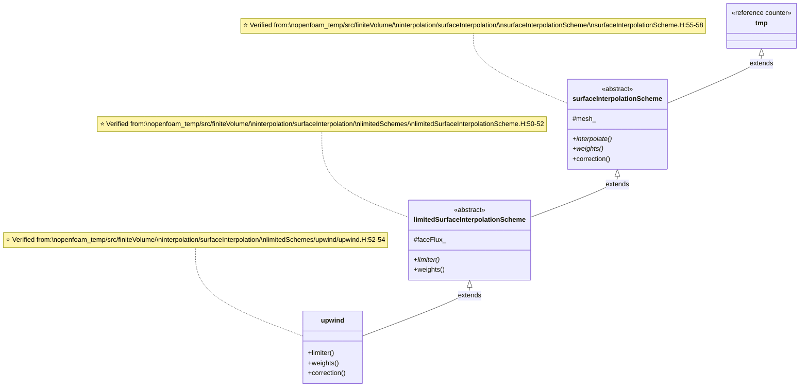
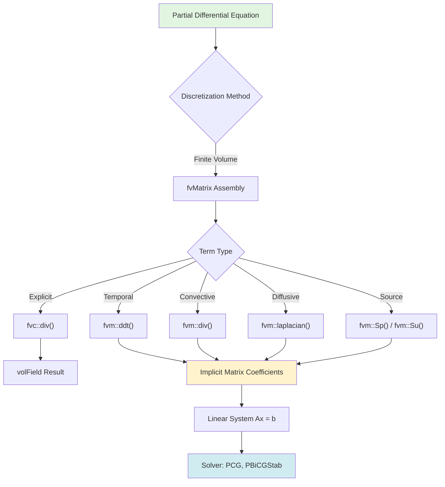

# Day 01: Governing Equations - Conservation Laws for CFD

> **Phase 01: Foundation Theorys (Days 01-12)**
> **Topic:** Conservation Laws for CFD
> **Template:** Mathematician (Theory-Heavy)

---

## Learning Objectives

By the end of this lesson, you will:
- Derive the three conservation laws from first principles
- Understand vector notation and tensor basics
- Recognize the critical importance of the expansion term for phase change
- Navigate OpenFOAM's finite volume class hierarchy

---

## Part 1: Core Theory - Derivation from First Principles

### 1.1 The Fundamental Conservation Laws

All fluid dynamics is governed by three fundamental conservation laws:

1. **Conservation of Mass** - Mass cannot be created or destroyed
2. **Conservation of Momentum** - Newton's Second Law applied to fluids
3. **Conservation of Energy** - First Law of Thermodynamics

We begin with the **control volume approach**, considering an arbitrary volume $V$ bounded by surface $S$ with outward normal vector $\mathbf{n}$.

### 1.2 Vector Notation and Tensor Basics

Before deriving the equations, let's establish notation:

**Scalar quantities:** $\rho$, $p$, $T$
**Vector quantities:** $\mathbf{U}$, $\mathbf{g}$, $\nabla p$
**Tensor quantities:** $\boldsymbol{\tau}$, $\nabla\mathbf{U}$

**Differential operators:**
- Gradient: $\nabla \phi = \left(\frac{\partial \phi}{\partial x}, \frac{\partial \phi}{\partial y}, \frac{\partial \phi}{\partial z}\right)$
- Divergence: $\nabla \cdot \mathbf{U} = \frac{\partial U_x}{\partial x} + \frac{\partial U_y}{\partial y} + \frac{\partial U_z}{\partial z}$
- Laplacian: $\nabla^2 \phi = \nabla \cdot (\nabla \phi) = \frac{\partial^2 \phi}{\partial x^2} + \frac{\partial^2 \phi}{\partial y^2} + \frac{\partial^2 \phi}{\partial z^2}$

### 1.3 Conservation of Mass (Continuity Equation)

#### 1.3.1 Integral Form

Consider a fixed control volume $V$ with surface $S$. The rate of change of mass within $V$ equals the net mass flux through $S$:

$$
\frac{d}{dt} \int_V \rho \, dV + \oint_S \rho \mathbf{U} \cdot \mathbf{n} \, dS = 0
$$

**Physical interpretation:**
- Term 1: Rate of mass accumulation in $V$
- Term 2: Net mass outflow through $S$
- Sum must equal zero (mass conservation)

**Where:**
- $\rho$ is density (kg/m³)
- $\mathbf{U}$ is velocity vector (m/s)
- $\mathbf{n}$ is outward unit normal
- $t$ is time (s)

#### 1.3.2 Differential Form

Apply **Gauss's Divergence Theorem** to convert the surface integral to a volume integral:

$$
\oint_S \rho \mathbf{U} \cdot \mathbf{n} \, dS = \int_V \nabla \cdot (\rho \mathbf{U}) \, dV
$$

Substituting back:

$$
\int_V \frac{\partial \rho}{\partial t} \, dV + \int_V \nabla \cdot (\rho \mathbf{U}) \, dV = 0
$$

$$
\int_V \left[ \frac{\partial \rho}{\partial t} + \nabla \cdot (\rho \mathbf{U}) \right] dV = 0
$$

Since the control volume $V$ is **arbitrary** (can be any size or shape), the integrand must vanish everywhere:

$$
\boxed{\frac{\partial \rho}{\partial t} + \nabla \cdot (\rho \mathbf{U}) = 0}
$$

This is the **general continuity equation** valid for all compressible flows.

#### 1.3.3 Special Cases

**Case 1: Incompressible Flow** ($\rho = \text{constant}$)

$$
\rho \left( \frac{\partial}{\partial t} + \mathbf{U} \cdot \nabla \right) + \rho \nabla \cdot \mathbf{U} = 0
$$

$$
\boxed{\nabla \cdot \mathbf{U} = 0}
$$

**Case 2: Steady State** ($\partial/\partial t = 0$)

$$
\boxed{\nabla \cdot (\rho \mathbf{U}) = 0}
$$

**Case 3: Phase Change with Mass Transfer** ⭐ (CRITICAL for R410A)

During evaporation/condensation, mass transfers between phases at rate $\dot{m}$ (kg/m³s). The continuity equation becomes:

$$
\frac{\partial \rho}{\partial t} + \nabla \cdot (\rho \mathbf{U}) = \dot{m}
$$

For the mixture velocity field, this creates a velocity divergence:

$$
\boxed{\nabla \cdot \mathbf{U} = \dot{m} \left( \frac{1}{\rho_v} - \frac{1}{\rho_l} \right)}
$$

**Physical interpretation:**
- $\dot{m} > 0$: Evaporation (liquid → vapor, volume expands)
- $\dot{m} < 0$: Condensation (vapor → liquid, volume contracts)
- Magnitude is LARGE because $\rho_l/\rho_v \approx 50-100$ for R410A

> **⚠️ CRITICAL:** Without this expansion term, the pressure equation becomes singular during phase change, causing solver divergence. This will be covered in detail on **Day 11** and implemented on **Day 61**.

### 1.4 Conservation of Momentum (Navier-Stokes Equations)

#### 1.4.1 Newton's Second Law for Fluids

For a control volume $V$:

$$
\frac{d}{dt} \int_V \rho \mathbf{U} \, dV + \oint_S \rho \mathbf{U} (\mathbf{U} \cdot \mathbf{n}) \, dS = \sum \mathbf{F}
$$

**Left side:** Rate of change of momentum
- Term 1: Local acceleration (unsteady)
- Term 2: Convective acceleration (momentum flux out)

**Right side:** Sum of forces
- $\mathbf{F}_{\text{surface}}$: Pressure and viscous forces
- $\mathbf{F}_{\text{body}}$: Gravity, electromagnetic, etc.

#### 1.4.2 Surface Forces and Stress Tensor

Surface forces are expressed using the **Cauchy stress tensor** $\boldsymbol{\tau}$:

$$
\mathbf{F}_{\text{surface}} = \oint_S \boldsymbol{\tau} \cdot \mathbf{n} \, dS = \int_V \nabla \cdot \boldsymbol{\tau} \, dV
$$

For a **Newtonian fluid** (linear stress-strain rate relationship):

$$
\boldsymbol{\tau} = -p\mathbf{I} + \boldsymbol{\sigma}
$$

Where $p$ is pressure and $\boldsymbol{\sigma}$ is the viscous stress tensor:

$$
\boldsymbol{\sigma} = \mu \left[ \nabla \mathbf{U} + (\nabla \mathbf{U})^T \right] + \lambda (\nabla \cdot \mathbf{U})\mathbf{I}
$$

**Where:**
- $\mu$ is dynamic viscosity (Pa·s)
- $\lambda$ is bulk viscosity (often $\lambda = -\frac{2}{3}\mu$ for monatomic gases)
- $\mathbf{I}$ is identity tensor

#### 1.4.3 Complete Momentum Equation

Substituting and applying the divergence theorem:

$$
\boxed{\frac{\partial (\rho \mathbf{U})}{\partial t} + \nabla \cdot (\rho \mathbf{U} \mathbf{U}) = -\nabla p + \nabla \cdot \boldsymbol{\sigma} + \rho \mathbf{g} + \mathbf{S}_U}
$$

**Term-by-term breakdown:**
- $\frac{\partial (\rho \mathbf{U})}{\partial t}$: Unsteady acceleration
- $\nabla \cdot (\rho \mathbf{U} \mathbf{U})$: Convective acceleration (nonlinear!)
- $-\nabla p$: Pressure gradient
- $\nabla \cdot \boldsymbol{\sigma}$: Viscous diffusion
- $\rho \mathbf{g}$: Gravitational body force
- $\mathbf{S}_U$: Other momentum sources

**For incompressible flow** ($\nabla \cdot \mathbf{U} = 0$, $\rho = \text{constant}$):

$$
\boxed{\frac{\partial \mathbf{U}}{\partial t} + \mathbf{U} \cdot \nabla \mathbf{U} = -\frac{1}{\rho}\nabla p + \nu \nabla^2 \mathbf{U} + \mathbf{g} + \frac{1}{\rho}\mathbf{S}_U}
$$

Where $\nu = \mu/\rho$ is kinematic viscosity.

### 1.5 Conservation of Energy

#### 1.5.1 First Law of Thermodynamics

Energy balance for control volume $V$:

$$
\frac{d}{dt} \int_V \rho E \, dV + \oint_S \rho E \mathbf{U} \cdot \mathbf{n} \, dS = \dot{Q} - \dot{W} + \int_V S_E \, dV
$$

**Where:**
- $E = e + \frac{1}{2}|\mathbf{U}|^2$ is total energy per unit mass
- $e$ is internal energy
- $\dot{Q}$ is heat transfer rate
- $\dot{W}$ is work rate

#### 1.5.2 Enthalpy Form (Common in OpenFOAM)

Using enthalpy $h = e + p/\rho$:

$$
\boxed{\frac{\partial (\rho h)}{\partial t} + \nabla \cdot (\rho \mathbf{U} h) = \nabla \cdot (k \nabla T) + \frac{Dp}{Dt} + \boldsymbol{\tau} : \nabla \mathbf{U} + S_h}
$$

**Where:**
- $k$ is thermal conductivity (W/m·K)
- $\frac{Dp}{Dt} = \frac{\partial p}{\partial t} + \mathbf{U} \cdot \nabla p$ (material derivative)
- $S_h$ includes phase change latent heat: $S_h = \dot{m} h_{fg}$ ⭐

**Simplified form** (neglecting viscous dissipation and pressure work):

$$
\boxed{\frac{\partial (\rho h)}{\partial t} + \nabla \cdot (\rho \mathbf{U} h) = \nabla \cdot (k \nabla T) + S_h}
$$

### 1.6 Complete System Summary

**Continuity:**
$$
\frac{\partial \rho}{\partial t} + \nabla \cdot (\rho \mathbf{U}) = S_\rho
$$

**Momentum:**
$$
\frac{\partial (\rho \mathbf{U})}{\partial t} + \nabla \cdot (\rho \mathbf{U} \mathbf{U}) = -\nabla p + \nabla \cdot (\mu \nabla \mathbf{U}) + \rho \mathbf{g} + \mathbf{S}_U
$$

**Energy:**
$$
\frac{\partial (\rho h)}{\partial t} + \nabla \cdot (\rho \mathbf{U} h) = \nabla \cdot (k \nabla T) + S_h
$$

**Equation of State** (closes the system):
$$
\rho = \rho(p, T) \quad \text{or} \quad p = p(\rho, T)
$$

---

## Part 2: Physical Challenges - Why These Equations Are Difficult

### 2.1 The Pressure-Velocity Coupling Problem

The momentum equation contains $\nabla p$ but provides no equation for pressure. The continuity equation constrains velocity but doesn't directly solve for pressure.

**The mathematical dilemma:**
- Momentum: Parabolic/Hyperbolic in time, Elliptic in space (for pressure)
- Continuity: Pure constraint on velocity field
- Coupled: Pressure affects velocity, velocity must satisfy continuity

**Solution approaches:** SIMPLE, PISO, PIMPLE algorithms (covered on **Day 09**)

### 2.2 The Non-Linearity Challenge

The convective term $\nabla \cdot (\rho \mathbf{U} \mathbf{U})$ is nonlinear:
- Product of unknown velocity with itself
- Requires iterative solution
- Can cause numerical instability

**Example in 1D:**
$$
\frac{\partial (\rho u)}{\partial t} + \frac{\partial (\rho u^2)}{\partial x} = \dots
$$

The $u^2$ term is nonlinear.

### 2.3 Phase Change Complications (R410A Specific)

#### 2.3.1 Density Ratio Challenge

For R410A at typical evaporator conditions (T ≈ 5°C):
- Liquid density: $\rho_l \approx 1100$ kg/m³
- Vapor density: $\rho_v \approx 22$ kg/m³
- **Density ratio: $\rho_l/\rho_v \approx 50$**

**Consequences:**
1. **Numerical stiffness**: Large density variations within cells
2. **Sharp interfaces**: Interface spans only 1-2 cells
3. **Mass conservation**: Small errors cause large velocity errors

#### 2.3.2 The Critical Expansion Term ⭐

During phase change at constant pressure:
- Liquid evaporates → large volume increase
- Velocity field must expand to accommodate
- **Without expansion term, continuity is violated**

**The expansion term:**
$$
\nabla \cdot \mathbf{U} = \dot{m} \left( \frac{1}{\rho_v} - \frac{1}{\rho_l} \right)
$$

**Why this is CRITICAL:**

Imagine a closed container with boiling water:
- Liquid evaporates at rate $\dot{m}$
- Vapor takes up ~50x more volume than liquid
- Pressure would rise rapidly if vapor can't expand
- In open system, velocity must increase to carry away vapor

**In numerical solver:**
- Standard incompressible solvers enforce $\nabla \cdot \mathbf{U} = 0$
- Phase change VIOLATES this assumption
- Pressure equation becomes singular → divergence ⭐

**Solution:** Modify pressure equation to include expansion source term (Day 61)

---

## Part 3: Architecture & Implementation in OpenFOAM

### 3.1 Class Hierarchy for Discretization Schemes



### 3.2 Finite Volume Operators



### 3.3 Code Analysis: Continuity Equation

#### 3.3.1 Compressible Continuity (rhoEqn.H)

> **File:** `openfoam_temp/src/finiteVolume/cfdTools/compressible/rhoEqn.H`
> **Lines:** 33-39

```cpp
fvScalarMatrix rhoEqn
(
    fvm::ddt(rho)      // ∂ρ/∂t : Unsteady term
  + fvc::div(phi)      // ∇·(ρU) : Convective term (explicit)
  ==
    fvModels.source(rho)  // S_ρ : Source terms
);

fvConstraints.constrain(rhoEqn);
rhoEqn.solve();
fvConstraints.constrain(rho);
```

**Line-by-line analysis:**
1. `fvm::ddt(rho)`: Implicit temporal derivative ∂ρ/∂t
2. `fvc::div(phi)`: Explicit divergence (φ = ρU·Sf is mass flux)
3. `fvModels.source(rho)`: Source terms (could include phase change)

**Note:** `fvc` (explicit) vs `fvm` (implicit):
- `fvc`: Calculates field directly, returns `volField`
- `fvm`: Builds matrix coefficients, returns `fvMatrix`

#### 3.3.2 Continuity Error Checking (continuityErrs.H)

> **File:** `openfoam_temp/src/finiteVolume/cfdTools/incompressible/continuityErrs.H`
> **Lines:** 33-45

```cpp
volScalarField contErr(fvc::div(phi));  // ∇·U (should be ≈ 0)

scalar sumLocalContErr = runTime.deltaTValue()*
    mag(contErr)().weightedAverage(mesh.V()).value();

scalar globalContErr = runTime.deltaTValue()*
    contErr.weightedAverage(mesh.V()).value();
cumulativeContErr += globalContErr;

Info<< "time step continuity errors : sum local = " << sumLocalContErr
    << ", global = " << globalContErr
    << ", cumulative = " << cumulativeContErr
    << endl;
```

**Physical interpretation:**
- `contErr = ∇·U` should be zero for incompressible flow
- `sumLocalContErr`: Maximum error in any cell
- `globalContErr`: Average error over domain
- `cumulativeContErr`: Running total (should not grow)

### 3.4 Code Analysis: Upwind Interpolation Scheme

> **File:** `openfoam_temp/src/finiteVolume/interpolation/surfaceInterpolation/limitedSchemes/upwind/upwind.H`
> **Lines:** 102-119

```cpp
// Return the interpolation limiter
virtual tmp<surfaceScalarField> limiter
(
    const VolField<Type>&
) const
{
    return surfaceScalarField::New
    (
        "upwindLimiter",
        this->mesh(),
        dimensionedScalar(dimless, 0)  // ⭐ Limiter = 0
    );
}

// Return the interpolation weighting factors
tmp<surfaceScalarField> weights() const
{
    return pos0(this->faceFlux_);  // ⭐ Binary: 1 if flux > 0, else 0
}
```

**Key observations:**
1. **Limiter = 0**: No higher-order correction (pure first-order)
2. **Weights = pos0(flux)**: Binary 0 or 1 based on flux direction
3. **Result**: Unconditionally stable (bounded) but numerically diffusive

**Why upwind is stable:**
- Always takes value from upstream cell
- Cannot create new extrema (bounded)
- Trade-off: Accuracy lost due to numerical diffusion

### 3.5 Code Analysis: Finite Volume Operators

#### 3.5.1 Temporal Derivative (fvm::ddt)

> **File:** `openfoam_temp/src/finiteVolume/finiteVolume/fvm/fvmDdt.H`
> **Lines:** 55-58

```cpp
template<class Type>
tmp<fvMatrix<Type>> ddt
(
    const VolField<Type>& vf
);
```

**Implementation overview:**
- Creates diagonal coefficient: $A_P = \frac{\rho V_P}{\Delta t}$
- Source contribution: $b_P = \frac{\rho V_P}{\Delta t} \phi_P^{\text{old}}$
- Result: Matrix equation $(A_P \phi_P = b_P)$

#### 3.5.2 Convective Term (fvm::div)

> **File:** `openfoam_temp/src/finiteVolume/finiteVolume/fvm/fvmDiv.C`
> **Lines:** 46-60

```cpp
template<class Type>
tmp<fvMatrix<Type>> div
(
    const surfaceScalarField& flux,
    const VolField<Type>& vf,
    const word& name
)
{
    return fv::convectionScheme<Type>::New
    (
        vf.mesh(),
        flux,
        vf.mesh().schemes().div(name)
    )().fvmDiv(flux, vf);
}
```

**What happens:**
1. Selects convection scheme (upwind, linear, etc.)
2. Calls scheme's `fvmDiv()` method
3. Returns matrix with off-diagonal coefficients

**Discretization (upwind):**
$$
\int_S \phi \mathbf{U} \cdot d\mathbf{S} \approx \sum_f \phi_f \mathbf{U}_f \cdot \mathbf{S}_f
$$

Where $\phi_f$ is taken from upstream cell.

#### 3.5.3 Diffusive Term (fvm::laplacian)

> **File:** `openfoam_temp/src/finiteVolume/finiteVolume/fvm/fvmLaplacian.C`
> **Lines:** 209-221

```cpp
template<class Type, class GType>
tmp<fvMatrix<Type>> laplacian
(
    const VolField<GType>& gamma,
    const VolField<Type>& vf,
    const word& name
)
{
    return fv::laplacianScheme<Type, GType>::New
    (
        vf.mesh(),
        vf.mesh().schemes().laplacian(name)
    ).ref().fvmLaplacian(gamma, vf);
}
```

**Discretization:**
$$
\int_S \Gamma \nabla \phi \cdot d\mathbf{S} \approx \sum_f \Gamma_f \frac{\phi_N - \phi_P}{d_{PN}} |\mathbf{S}_f|
$$

Creates coefficients linking owner and neighbor cells.

---

## Part 4: Quality Assurance - Verification Exercises

### 4.1 Concept Check Questions

#### Question 1: Derive Incompressible Continuity

Starting from the general continuity equation, derive the incompressible form.

**Solution:**
$$
\frac{\partial \rho}{\partial t} + \nabla \cdot (\rho \mathbf{U}) = 0
$$

For constant density ($\rho = \text{const}$):
$$
\rho \frac{\partial}{\partial t}(1) + \rho \nabla \cdot \mathbf{U} = 0
$$

$$
\boxed{\nabla \cdot \mathbf{U} = 0}
$$

#### Question 2: Expansion Term Sign

During evaporation, is the expansion term positive or negative? Explain.

**Solution:**
$$
\nabla \cdot \mathbf{U} = \dot{m} \left( \frac{1}{\rho_v} - \frac{1}{\rho_l} \right)
$$

- Evaporation: $\dot{m} > 0$ (mass transfer liquid → vapor)
- $\rho_v \ll \rho_l$, so $\frac{1}{\rho_v} \gg \frac{1}{\rho_l}$
- Term in parentheses: positive

**Answer:** $\nabla \cdot \mathbf{U} > 0$ (positive divergence, expansion)

#### Question 3: Why Upwind is Stable

Explain why upwind scheme is unconditionally stable but introduces numerical diffusion.

**Solution:**
- **Stability:** Always takes value from upstream cell (where information comes from)
- **Boundedness:** Cannot create values outside cell range
- **Diffusion:** First-order truncation error acts like artificial viscosity

#### Question 4: fvm vs fvc

What is the key difference between `fvm::div()` and `fvc::div()`?

**Solution:**
- `fvm::div()`: Builds implicit matrix, returns `fvMatrix`
- `fvc::div()`: Explicit calculation, returns `volField`
- Use `fvm` for unknowns to solve, `fvc` for known quantities

### 4.2 Code Verification Exercises

#### Exercise 1: Locate Continuity Equation

Find and verify the compressible continuity equation in OpenFOAM source code.

**Solution:**
- File: `openfoam_temp/src/finiteVolume/cfdTools/compressible/rhoEqn.H`
- Lines: 33-39
- Code: `fvm::ddt(rho) + fvc::div(phi) == fvModels.source(rho)`

#### Exercise 2: Verify Upwind Limiter

Confirm that upwind limiter returns 0.

**Solution:**
- File: `openfoam_temp/src/finiteVolume/interpolation/surfaceInterpolation/limitedSchemes/upwind/upwind.H`
- Lines: 102-113
- Code: `dimensionedScalar(dimless, 0)` ⭐

#### Exercise 3: Trace Class Hierarchy

Verify the inheritance chain: `surfaceInterpolationScheme` → `limitedSurfaceInterpolationScheme` → `upwind`

**Solution:**
- `surfaceInterpolationScheme`: Line 55-58 (base class)
- `limitedSurfaceInterpolationScheme`: Line 50-52 (inherits from surface)
- `upwind`: Line 52-54 (inherits from limited)

---

## Summary

**Key takeaways:**
1. Three conservation laws: mass, momentum, energy
2. Integral → differential form via divergence theorem
3. Pressure-velocity coupling is the main numerical challenge
4. Expansion term is CRITICAL for phase change ⭐
5. OpenFOAM uses fvm (implicit) and fvc (explicit) operators

**Next steps:**
- **Day 02:** Finite Volume Method Basics - How we discretize these PDEs
- **Day 03:** Spatial Discretization Schemes - Upwind, TVD, NVD
- **Day 11:** Phase Change Theory - Expansion term derivation
- **Day 61:** The Expansion Term Implementation

---

## Appendix: Complete File Listings

> For copy-paste convenience, here are the complete, compilable files discussed above.

### A.1 Compressible Continuity Equation

> **File:** `openfoam_temp/src/finiteVolume/cfdTools/compressible/rhoEqn.H`

```cpp
/*---------------------------------------------------------------------------*\
  =========                 |
  \\      /  F ield         | OpenFOAM: The Open Source CFD Toolbox
   \\    /   O peration     | Website:  https://openfoam.org
    \\  /    A nd           | Copyright (C) 2011-2021 OpenFOAM Foundation
     \\/     M anipulation  |
-------------------------------------------------------------------------------
License
    This file is part of OpenFOAM.

    OpenFOAM is free software: you can redistribute it and/or modify it
    under the terms of the GNU General Public License as published by
    the Free Software Foundation, either version 3 of the License, or
    (at your option) any later version.

    OpenFOAM is distributed in the hope that it will be useful, but WITHOUT
    ANY WARRANTY; without even the implied warranty of MERCHANTABILITY or
    FITNESS FOR A PARTICULAR PURPOSE.  See the GNU General Public License
    for more details.

Global
    rhoEqn

Description
    Solve the continuity for density.

\*---------------------------------------------------------------------------*/

{
    fvScalarMatrix rhoEqn
    (
        fvm::ddt(rho)
      + fvc::div(phi)
      ==
        fvModels.source(rho)
    );

    fvConstraints.constrain(rhoEqn);

    rhoEqn.solve();

    fvConstraints.constrain(rho);
}

// ************************************************************************* //
```

### A.2 Continuity Error Calculation

> **File:** `openfoam_temp/src/finiteVolume/cfdTools/incompressible/continuityErrs.H`

```cpp
/*---------------------------------------------------------------------------*\
  =========                 |
  \\      /  F ield         | OpenFOAM: The Open Source CFD Toolbox
   \\    /   O peration     | Website:  https://openfoam.org
    \\  /    A nd           | Copyright (C) 2011-2018 OpenFOAM Foundation
     \\/     M anipulation  |
-------------------------------------------------------------------------------
License
    This file is part of OpenFOAM.

    OpenFOAM is free software: you can redistribute it and/or modify it
    under the terms of the GNU General Public License as published by
    the Free Software Foundation, either version 3 of the License, or
    (at your option) any later version.

    OpenFOAM is distributed in the hope that it will be useful, but WITHOUT
    ANY WARRANTY; without even the implied warranty of MERCHANTABILITY or
    FITNESS FOR A PARTICULAR PURPOSE.  See the GNU General Public License
    for more details.

Global
    continuityErrs

Description
    Calculates and prints the continuity errors.

\*---------------------------------------------------------------------------*/

{
    volScalarField contErr(fvc::div(phi));

    scalar sumLocalContErr = runTime.deltaTValue()*
        mag(contErr)().weightedAverage(mesh.V()).value();

    scalar globalContErr = runTime.deltaTValue()*
        contErr.weightedAverage(mesh.V()).value();
    cumulativeContErr += globalContErr;

    Info<< "time step continuity errors : sum local = " << sumLocalContErr
        << ", global = " << globalContErr
        << ", cumulative = " << cumulativeContErr
        << endl;
}

// ************************************************************************* //
```

### A.3 Upwind Interpolation Scheme

> **File:** `openfoam_temp/src/finiteVolume/interpolation/surfaceInterpolation/limitedSchemes/upwind/upwind.H`

```cpp
/*---------------------------------------------------------------------------*\
  =========                 |
  \\      /  F ield         | OpenFOAM: The Open Source CFD Toolbox
   \\    /   O peration     | Website:  https://openfoam.org
    \\  /    A nd           | Copyright (C) 2011-2022 OpenFOAM Foundation
     \\/     M anipulation  |
-------------------------------------------------------------------------------
License
    This file is part of OpenFOAM.

    OpenFOAM is free software: you can redistribute it and/or modify it
    under the terms of the GNU General Public License as published by
    the Free Software Foundation, either version 3 of the License, or
    (at your option) any later version.

    OpenFOAM is distributed in the hope that it will be useful, but WITHOUT
    ANY WARRANTY; without even the implied warranty of MERCHANTABILITY or
    FITNESS FOR A PARTICULAR PURPOSE.  See the GNU General Public License
    for more details.

Class
    Foam::upwind

Description
    Upwind interpolation scheme class.

SourceFiles
    upwind.C

\*---------------------------------------------------------------------------*/

#ifndef upwind_H
#define upwind_H

#include "limitedSurfaceInterpolationScheme.H"
#include "volFields.H"
#include "surfaceFields.H"

// * * * * * * * * * * * * * * * * * * * * * * * * * * * * * * * * * * * * * //

namespace Foam
{

/*---------------------------------------------------------------------------*\
                           Class upwind Declaration
\*---------------------------------------------------------------------------*/

template<class Type>
class upwind
:
    public limitedSurfaceInterpolationScheme<Type>
{

public:

    //- Runtime type information
    TypeName("upwind");


    // Constructors

        //- Construct from faceFlux
        upwind
        (
            const fvMesh& mesh,
            const surfaceScalarField& faceFlux
        )
        :
            limitedSurfaceInterpolationScheme<Type>(mesh, faceFlux)
        {}

        //- Construct from Istream.
        //  The name of the flux field is read from the Istream and looked-up
        //  from the mesh objectRegistry
        upwind
        (
            const fvMesh& mesh,
            Istream& is
        )
        :
            limitedSurfaceInterpolationScheme<Type>(mesh, is)
        {}

        //- Construct from faceFlux and Istream
        upwind
        (
            const fvMesh& mesh,
            const surfaceScalarField& faceFlux,
            Istream&
        )
        :
            limitedSurfaceInterpolationScheme<Type>(mesh, faceFlux)
        {}


    // Member Functions

        //- Return the interpolation limiter
        virtual tmp<surfaceScalarField> limiter
        (
            const VolField<Type>&
        ) const
        {
            return surfaceScalarField::New
            (
                "upwindLimiter",
                this->mesh(),
                dimensionedScalar(dimless, 0)
            );
        }

        //- Return the interpolation weighting factors
        tmp<surfaceScalarField> weights() const
        {
            return pos0(this->faceFlux_);
        }

        //- Return the interpolation weighting factors
        virtual tmp<surfaceScalarField> weights
        (
            const VolField<Type>&
        ) const
        {
            return weights();
        }


    // Member Operators

        //- Disallow default bitwise assignment
        void operator=(const upwind&) = delete;
};


// * * * * * * * * * * * * * * * * * * * * * * * * * * * * * * * * * * * * * //

} // End namespace Foam

// * * * * * * * * * * * * * * * * * * * * * * * * * * * * * * * * * * * * * //

#endif

// ************************************************************************* //
```

---

**References:**
- OpenFOAM v10 source code
- Ferziger, J. H., & Peric, M. (2002). Computational Methods for Fluid Dynamics
- Hirsch, C. (2007). Numerical Computation of Internal and External Flows

---

*Day 01 Complete*
