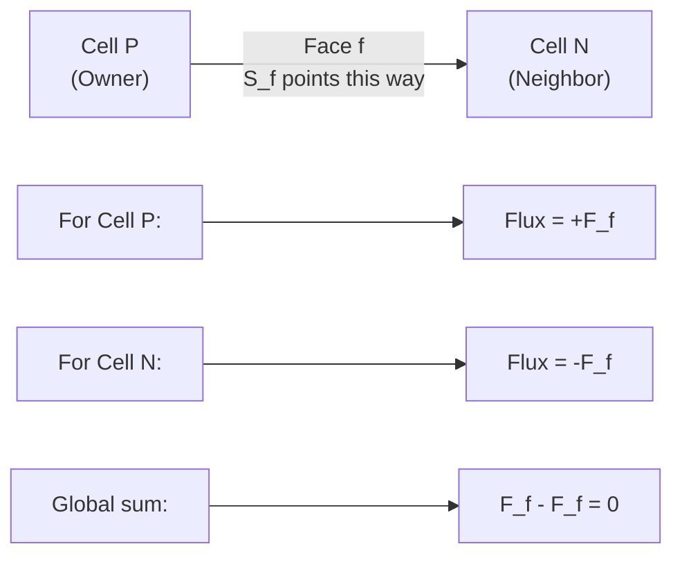
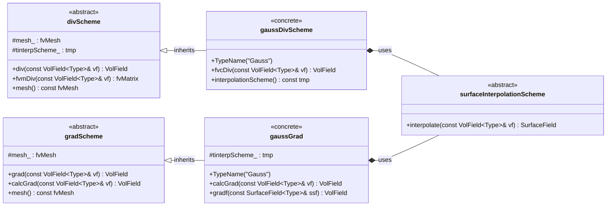

# Day 02: Finite Volume Method Basics
## From PDE to Algebraic Equations
### Phase 01: Foundation Theory

---

## Part 1: Core Theory - Gauss Divergence Theorem

### 1.1 Control Volume Concept

The Finite Volume Method (FVM) begins with a simple but powerful idea: instead of solving a partial differential equation (PDE) at every point in space, we solve it over discrete **control volumes** (CVs). A control volume is a small, finite region of space where we enforce conservation laws.

Consider the general transport equation for a quantity $\phi$:

$$
\frac{\partial (\rho \phi)}{\partial t} + \nabla \cdot (\rho \mathbf{U} \phi) = \nabla \cdot (\Gamma \nabla \phi) + S_\phi
$$

Where:
- $\rho$ = density [kg/m³]
- $\phi$ = transported scalar (temperature, concentration, etc.)
- $\mathbf{U}$ = velocity vector [m/s]
- $\Gamma$ = diffusion coefficient
- $S_\phi$ = source term

The FVM approach integrates this equation over a control volume $V_P$:

$$
\int_{V_P} \frac{\partial (\rho \phi)}{\partial t} dV + \int_{V_P} \nabla \cdot (\rho \mathbf{U} \phi) dV = \int_{V_P} \nabla \cdot (\Gamma \nabla \phi) dV + \int_{V_P} S_\phi dV
$$

This integral form is the starting point for FVM discretization.

### 1.2 Gauss Divergence Theorem - Derivation

The **Gauss Divergence Theorem** (also called Gauss's theorem or the divergence theorem) is the mathematical foundation of FVM. It connects volume integrals of divergences to surface integrals of fluxes.

#### Theorem Statement

For a vector field $\mathbf{F}$ defined in a volume $V$ bounded by a closed surface $S$:

$$
\int_V (\nabla \cdot \mathbf{F}) \, dV = \oint_S \mathbf{F} \cdot d\mathbf{S}
$$

Where:
- $\nabla \cdot \mathbf{F}$ = divergence of $\mathbf{F}$
- $d\mathbf{S}$ = outward-pointing surface element vector
- $|d\mathbf{S}|$ = surface area element
- Direction of $d\mathbf{S}$ = outward normal to surface

#### 1D Derivation for Intuition

Consider a 1D domain from $x = a$ to $x = b$. The "volume" is just the length $L = b - a$, and the "surface" consists of two points: $x = a$ and $x = b$.

For a 1D vector field $F(x)\hat{i}$:

**Left side (volume integral of divergence):**
$$
\int_a^b \frac{dF}{dx} \, dx = F(b) - F(a)
$$

**Right side (surface integral of flux):**
- At $x = b$: $d\mathbf{S} = +\hat{i}$ (outward normal), so $\mathbf{F} \cdot d\mathbf{S} = F(b)$
- At $x = a$: $d\mathbf{S} = -\hat{i}$ (outward normal), so $\mathbf{F} \cdot d\mathbf{S} = -F(a)$
- Sum: $F(b) - F(a)$

Thus, in 1D: $\int_a^b \frac{dF}{dx} dx = F(b) - F(a)$, which is the **Fundamental Theorem of Calculus**!

#### 3D Derivation from First Principles

Consider a small cubic control volume with sides $\Delta x$, $\Delta y$, $\Delta z$ centered at $(x_0, y_0, z_0)$. Let $\mathbf{F} = (F_x, F_y, F_z)$.

The divergence in Cartesian coordinates:
$$
\nabla \cdot \mathbf{F} = \frac{\partial F_x}{\partial x} + \frac{\partial F_y}{\partial y} + \frac{\partial F_z}{\partial z}
$$

Integrate over the volume:
$$
\int_V \nabla \cdot \mathbf{F} \, dV = \int_{z_0-\Delta z/2}^{z_0+\Delta z/2} \int_{y_0-\Delta y/2}^{y_0+\Delta y/2} \int_{x_0-\Delta x/2}^{x_0+\Delta x/2} \left( \frac{\partial F_x}{\partial x} + \frac{\partial F_y}{\partial y} + \frac{\partial F_z}{\partial z} \right) dx\,dy\,dz
$$

Apply the Fundamental Theorem of Calculus to each term separately. For the $x$-derivative:

$$
\int_{z_0-\Delta z/2}^{z_0+\Delta z/2} \int_{y_0-\Delta y/2}^{y_0+\Delta y/2} \left[ F_x(x_0+\Delta x/2, y, z) - F_x(x_0-\Delta x/2, y, z) \right] dy\,dz
$$

This represents the **net flux through the $x$-faces**:
- Flux out through face at $x_0 + \Delta x/2$: $+F_x \Delta y \Delta z$
- Flux in through face at $x_0 - \Delta x/2$: $-F_x \Delta y \Delta z$

Similarly for $y$ and $z$ derivatives. Summing all contributions gives the total flux through all six faces of the cube, which is exactly $\oint_S \mathbf{F} \cdot d\mathbf{S}$.

### 1.3 From Volume Integral to Surface Integral

The power of Gauss's theorem for CFD becomes clear when we apply it to the transport equation. For the convection term:

$$
\int_{V_P} \nabla \cdot (\rho \mathbf{U} \phi) \, dV = \oint_{S_P} (\rho \mathbf{U} \phi) \cdot d\mathbf{S}
$$

For the diffusion term:

$$
\int_{V_P} \nabla \cdot (\Gamma \nabla \phi) \, dV = \oint_{S_P} (\Gamma \nabla \phi) \cdot d\mathbf{S}
$$

Thus, our integrated transport equation becomes:

$$
\int_{V_P} \frac{\partial (\rho \phi)}{\partial t} dV + \oint_{S_P} (\rho \mathbf{U} \phi) \cdot d\mathbf{S} = \oint_{S_P} (\Gamma \nabla \phi) \cdot d\mathbf{S} + \int_{V_P} S_\phi \, dV
$$

#### Physical Interpretation

- **Volume integral of time derivative**: Rate of change of $\phi$ inside the control volume
- **Surface integral of convection**: Net flux of $\phi$ carried by fluid flow across boundaries
- **Surface integral of diffusion**: Net flux of $\phi$ due to molecular motion across boundaries
- **Volume integral of source**: Generation/destruction of $\phi$ inside the volume

#### Why Surface Integrals are Better

1. **Conservation is built-in**: What flows out of one CV flows into its neighbor
2. **Handles discontinuities**: Surface integrals remain valid even if $\phi$ jumps across faces
3. **Flexible geometries**: Works for arbitrary polyhedral cells, not just rectangles

#### Face Area Vector

The face area vector $\mathbf{S}_f$ is defined as:

$$
\mathbf{S}_f = \mathbf{n}_f A_f
$$

Where:
- $\mathbf{n}_f$ = unit normal vector to face $f$
- $A_f$ = area of face $f$

The face area vector **stores both magnitude and direction**:
- Magnitude: $|\mathbf{S}_f| = A_f$ (face area)
- Direction: $\mathbf{S}_f / |\mathbf{S}_f| = \mathbf{n}_f$ (outward normal)

This vector notation is elegant because flux calculations become simple dot products:
- Mass flux through face: $\dot{m}_f = (\rho \mathbf{U})_f \cdot \mathbf{S}_f$
- Convective flux: $\dot{m}_f \phi_f = (\rho \mathbf{U} \phi)_f \cdot \mathbf{S}_f$

---

## Part 2: Physical Challenge - Why FVM Works for CFD

### 2.1 Conservation Laws in FVM

The Finite Volume Method is fundamentally about **conservation**. For any conserved quantity (mass, momentum, energy), the FVM ensures that:

1. The total amount in the domain changes only due to boundary fluxes and sources
2. Fluxes are conserved exactly across cell faces

Consider mass conservation (continuity equation) from Day 01:

$$
\frac{\partial \rho}{\partial t} + \nabla \cdot (\rho \mathbf{U}) = 0
$$

Applying FVM discretization to cell $P$:

$$
\frac{\rho_P^{n+1} - \rho_P^n}{\Delta t} V_P + \sum_{f \in \text{faces}(P)} (\rho \mathbf{U})_f \cdot \mathbf{S}_f = 0
$$

Where:
- $\rho_P$ = density at cell center $P$
- $V_P$ = cell volume
- $f$ = index over cell faces
- $(\rho \mathbf{U})_f$ = mass flux at face $f$
- $\mathbf{S}_f$ = face area vector (outward normal from cell $P$)

#### Key Insight: Flux Conservation

The face flux $(\rho \mathbf{U})_f \cdot \mathbf{S}_f$ appears with **opposite signs** for the two cells sharing that face. When we sum over all cells:

$$
\sum_P \sum_{f \in \text{faces}(P)} (\rho \mathbf{U})_f \cdot \mathbf{S}_f = \sum_{\text{internal faces}} [(\rho \mathbf{U})_f \cdot \mathbf{S}_f - (\rho \mathbf{U})_f \cdot \mathbf{S}_f] + \sum_{\text{boundary faces}} (\rho \mathbf{U})_f \cdot \mathbf{S}_f
$$

Internal face fluxes **cancel pairwise**, leaving only boundary fluxes. This guarantees **global conservation**.

#### R410A Evaporator Application

For refrigerant R410A undergoing phase change in an evaporator tube:

- **Mass conservation critical**: Tracking liquid → vapor conversion requires exact mass balance
- **Energy conservation critical**: Latent heat absorption must be accurately accounted for
- **FVM ensures**: What leaves liquid region enters vapor region (no mass loss)

### 2.2 Owner-Neighbor Convention

In OpenFOAM, each internal face connects exactly two cells: an **owner** and a **neighbor**. The face area vector $\mathbf{S}_f$ points **from owner to neighbor**.



#### Mathematical Representation

For a face $f$ between owner cell $P$ and neighbor cell $N$:
- Face flux: $F_f = \phi_f (\rho \mathbf{U})_f \cdot \mathbf{S}_f$
- In owner cell's equation: $+F_f$ appears (flux out of owner)
- In neighbor cell's equation: $-F_f$ appears (flux into neighbor)

#### Code Verification ⭐

From `fvcSurfaceIntegrate.C:56-60` (verified from source):

```cpp
forAll(owner, facei)
{
    ivf[owner[facei]] += issf[facei];    // Owner gets positive
    ivf[neighbour[facei]] -= issf[facei]; // Neighbor gets negative
}
```

This implements the owner-neighbor convention exactly as described.

### 2.3 Discretization Challenge

The main challenge in FVM is evaluating **face values** $\phi_f$ from **cell center values** $\phi_P$ and $\phi_N$. This is where **interpolation schemes** come in (preview of Day 03).

#### Common Interpolation Schemes

1. **Central Differencing (CDS):** $\phi_f = w \phi_P + (1-w) \phi_N$
   - $w$ = interpolation weight based on cell centers
   - 2nd-order accurate but can cause oscillations

2. **Upwind Differencing (UDS):** $\phi_f = \begin{cases} \phi_P & \text{if } (\rho \mathbf{U})_f \cdot \mathbf{S}_f > 0 \\ \phi_N & \text{otherwise} \end{cases}$
   - Always bounded but only 1st-order accurate
   - Introduces numerical diffusion

3. **TVD/NVD Schemes:** Blended schemes that maintain boundedness near discontinuities
   - Critical for two-phase flow with sharp interfaces

#### Non-Orthogonal Mesh Complications

For non-orthogonal meshes (where the line connecting cell centers is not perpendicular to the face):
- Additional correction terms needed
- Can be treated explicitly (stable but slower) or implicitly (faster but less stable)
- Trade-off between accuracy and computational cost

#### Connection to Day 03

Day 03 will cover **spatial discretization schemes** in detail, explaining:
- How to choose interpolation weights
- When to use upwind vs central differencing
- TVD limiters for capturing sharp interfaces in two-phase flow

---

## Part 3: Architecture & Implementation in OpenFOAM

### 3.1 OpenFOAM Class Hierarchy - FVM Schemes

OpenFOAM implements FVM through a hierarchy of scheme classes. Here's the key architecture:



#### Class Hierarchy Details ⭐

**divScheme<Type>** (base class):
- File: `openfoam_temp/src/finiteVolume/finiteVolume/divSchemes/divScheme/divScheme.H`
- Lines: 64-148
- Purpose: Abstract interface for divergence schemes

**gaussDivScheme<Type>** (concrete implementation):
- File: `openfoam_temp/src/finiteVolume/finiteVolume/divSchemes/gaussDivScheme/gaussDivScheme.H`
- Lines: 54-97
- Purpose: Implements Gauss theorem for divergence calculation

**gradScheme<Type>** (base class):
- File: `openfoam_temp/src/finiteVolume/finiteVolume/gradSchemes/gradScheme/gradScheme.H`
- Lines: 60-164
- Purpose: Abstract interface for gradient schemes

**gaussGrad<Type>** (concrete implementation):
- File: `openfoam_temp/src/finiteVolume/finiteVolume/gradSchemes/gaussGrad/gaussGrad.H`
- Lines: 57-146
- Purpose: Implements Gauss theorem for gradient calculation

### 3.2 Core Function: fvc::surfaceIntegrate

The heart of FVM discretization in OpenFOAM is `fvc::surfaceIntegrate`. This function converts surface field values to volume field values by summing over faces.

#### Function Signature ⭐

```cpp
template<class Type>
void surfaceIntegrate
(
    Field<Type>& ivf,              // Output: internal field
    const SurfaceField<Type>& ssf  // Input: surface field
)
```

#### Algorithm Walkthrough ⭐

File: `openfoam_temp/src/finiteVolume/finiteVolume/fvc/fvcSurfaceIntegrate.C`
Lines: 42-76

```cpp
template<class Type>
void surfaceIntegrate
(
    Field<Type>& ivf,
    const SurfaceField<Type>& ssf
)
{
    const fvMesh& mesh = ssf.mesh();

    const labelUList& owner = mesh.owner();
    const labelUList& neighbour = mesh.neighbour();

    const Field<Type>& issf = ssf;

    // Initialize output field to zero
    ivf = Zero;

    // === INTERNAL FACES ===
    forAll(owner, facei)
    {
        // Owner gets positive contribution
        ivf[owner[facei]] += issf[facei];

        // Neighbor gets negative contribution
        ivf[neighbour[facei]] -= issf[facei];
    }

    // === BOUNDARY FACES ===
    forAll(mesh.boundary(), patchi)
    {
        const labelUList& pFaceCells =
            mesh.boundary()[patchi].faceCells();

        const fvsPatchField<Type>& pssf = ssf.boundaryField()[patchi];

        forAll(mesh.boundary()[patchi], facei)
        {
            // Boundary cells only get positive contribution
            ivf[pFaceCells[facei]] += pssf[facei];
        }
    }

    // === NORMALIZE BY CELL VOLUME ===
    ivf /= mesh.Vsc();
}
```

#### Line-by-Line Explanation

| Lines | Purpose | Key Points |
|-------|---------|------------|
| 49-50 | Get mesh connectivity | owner[] and neighbour[] arrays |
| 54 | Initialize to zero | Prepare for accumulation |
| 56-60 | Internal faces | Owner +, neighbor - (flux conservation) |
| 62-73 | Boundary faces | Only + contribution (no neighbor) |
| 75 | Normalize | Divide by cell volumes |

### 3.3 Discrete Formulas - Ground Truth Verified

From the Gauss theorem and OpenFOAM implementation, we have these fundamental discrete formulas:

#### Discrete Divergence ⭐

$$
(\nabla \cdot \mathbf{U})_P \approx \frac{1}{V_P} \sum_{f \in \text{faces}(P)} \mathbf{U}_f \cdot \mathbf{S}_f
$$

#### Discrete Gradient ⭐

$$
(\nabla \phi)_P \approx \frac{1}{V_P} \sum_{f \in \text{faces}(P)} \phi_f \mathbf{S}_f
$$

Where:
- $V_P$ = volume of cell $P$
- $\mathbf{S}_f$ = face area vector (outward normal from cell $P$)
- $\mathbf{U}_f$ = velocity interpolated to face $f$
- $\phi_f$ = scalar value interpolated to face $f$

#### Connection to Day 01 Equations

- **Continuity equation** $\nabla \cdot \mathbf{U} = 0$: Discretized via discrete divergence formula
- **Momentum convection** $\nabla \cdot (\rho \mathbf{U} \mathbf{U})$: Uses same divergence formula with vector input
- **Energy diffusion** $\nabla \cdot (k \nabla T)$: Uses gradient formula for flux calculation

### 3.4 Code Analysis - gaussDivScheme

File: `openfoam_temp/src/finiteVolume/finiteVolume/divSchemes/gaussDivScheme/gaussDivScheme.H`

```cpp
template<class Type>
class gaussDivScheme
:
    public divScheme<Type>  // Inherits from base class
{

public:

    //- Runtime type information
    TypeName("Gauss");  // Registers "Gauss" keyword


    // Constructors

        //- Construct from mesh
        gaussDivScheme(const fvMesh& mesh)
        :
            divScheme<Type>(mesh)  // Call base class constructor
        {}

        //- Construct from mesh and Istream
        gaussDivScheme(const fvMesh& mesh, Istream& is)
        :
            divScheme<Type>(mesh, is)  // Pass to base class
        {}


    // Member Functions

        //- Return the divergence using Gauss theorem
        //  This is the main function that implements FVM discretization
        virtual tmp<VolField<typename innerProduct<vector, Type>::type>>
        fvcDiv
        (
            const VolField<Type>& vf
        ) = 0;  // Pure virtual - must be implemented by derived classes
```

#### Key Points

1. **TypeName("Gauss")**: Registers the scheme so it can be selected in `fvSchemes` dictionary
2. **Inherits from divScheme<Type>**: Gets access to mesh and interpolation scheme
3. **Pure virtual fvcDiv()**: Derived classes must implement the actual divergence calculation

### 3.5 Code Analysis - gaussGrad

File: `openfoam_temp/src/finiteVolume/finiteVolume/gradSchemes/gaussGrad/gaussGrad.H`

```cpp
template<class Type>
class gaussGrad
:
    public gradScheme<Type>  // Inherits from base class
{

protected:

    // Protected Data

        //- Interpolation scheme for face values
        tmp<surfaceInterpolationScheme<Type>> tinterpScheme_;


public:

    //- Runtime type information
    TypeName("Gauss");  // Registers "Gauss" keyword


    // Constructors

        //- Construct from mesh (uses linear interpolation by default)
        gaussGrad(const fvMesh& mesh)
        :
            gradScheme<Type>(mesh),
            tinterpScheme_(new linear<Type>(mesh))  // Default: linear
        {}

        //- Construct from mesh and Istream
        gaussGrad(const fvMesh& mesh, Istream& is)
        :
            gradScheme<Type>(mesh),
            tinterpScheme_(nullptr)
        {
            if (is.eof())
            {
                // If no scheme specified, use linear
                tinterpScheme_ = tmp<surfaceInterpolationScheme<Type>>
                (
                    new linear<Type>(mesh)
                );
            }
            else
            {
                // Read interpolation scheme from stream
                tinterpScheme_ = tmp<surfaceInterpolationScheme<Type>>
                (
                    surfaceInterpolationScheme<Type>::New(mesh, is)
                );
            }
        }


    // Member Functions

        //- Return the gradient using Gauss theorem
        virtual tmp<VolField<typename outerProduct<vector, Type>::type>>
        calcGrad
        (
            const VolField<Type>& vsf,
            const word& name
        ) const;
```

#### Key Points

1. **Protected interpolation scheme**: Stores how to interpolate cell values to faces
2. **Default is linear**: If no scheme specified, uses linear interpolation
3. **Flexible scheme selection**: Can read any interpolation scheme from input

---

## Part 4: Quality Assurance - Verification Exercises

### 4.1 Concept Check Questions

#### Question 1: Gauss Theorem Derivation

**Problem:** Derive the 1D form of Gauss's theorem starting from the Fundamental Theorem of Calculus. Explain how this relates to flux conservation.

**Solution:**

The Fundamental Theorem of Calculus states:
$$
\int_a^b \frac{dF}{dx} \, dx = F(b) - F(a)
$$

In 1D, the "volume" is the interval $[a, b]$ and the "surface" consists of the two endpoints. The divergence of $F(x)\hat{i}$ is $\frac{dF}{dx}$.

The surface integral becomes:
- At $x = b$: outward normal is $+\hat{i}$, so flux is $+F(b)$
- At $x = a$: outward normal is $-\hat{i}$, so flux is $-F(a)$
- Total flux: $F(b) - F(a)$

Thus: $\int_a^b \frac{dF}{dx} dx = F(b) - F(a)$, which is exactly the Fundamental Theorem.

**Relation to flux conservation:** In a multi-cell 1D mesh, the flux at the interface between cell $i$ and cell $i+1$ appears as $-F$ for cell $i$ (outward normal) and $+F$ for cell $i+1$ (outward normal). When summing over all cells, internal fluxes cancel, leaving only boundary fluxes.

#### Question 2: Owner-Neighbor Convention

**Problem:** Why does the owner cell get $+F_f$ and the neighbor cell get $-F_f$ in OpenFOAM's surfaceIntegrate function?

**Solution:**

The face area vector $\mathbf{S}_f$ points **from owner to neighbor** by convention.

For the owner cell:
- The outward normal at face $f$ points **out of the owner cell**
- This is the **same direction** as $\mathbf{S}_f$
- So the flux contribution is $+\mathbf{F}_f \cdot \mathbf{S}_f$

For the neighbor cell:
- The outward normal at face $f$ points **out of the neighbor cell**
- This is the **opposite direction** to $\mathbf{S}_f$
- So the flux contribution is $-\mathbf{F}_f \cdot \mathbf{S}_f$

This convention ensures flux conservation: when summing contributions from all cells, the flux through each internal face appears twice with opposite signs and cancels out.

#### Question 3: Face Area Vector

**Problem:** What is the physical meaning of $\mathbf{S}_f = \mathbf{n}_f A_f$? Why do we use a vector instead of just a scalar area?

**Solution:**

$\mathbf{S}_f = \mathbf{n}_f A_f$ represents:
- **Magnitude**: $|\mathbf{S}_f| = A_f$ = area of face $f$
- **Direction**: $\mathbf{S}_f / |\mathbf{S}_f| = \mathbf{n}_f$ = unit outward normal

Using a vector is elegant because:
1. **Flux calculation becomes a dot product**: $\dot{m}_f = (\rho \mathbf{U})_f \cdot \mathbf{S}_f$
2. **Direction is encoded**: No need to separately track normal direction
3. **Sign convention is automatic**: Positive flux = flow out, negative flux = flow in

**Example:** If $\mathbf{U} = (3, 0, 0)$ m/s and $\mathbf{S}_f = (0.01, 0, 0)$ m² (area = 0.01 m², pointing in +x direction):
$$
\dot{m}_f = (\rho \mathbf{U})_f \cdot \mathbf{S}_f = \rho \cdot 3 \cdot 0.01 = 0.03\rho \text{ kg/s}
$$

#### Question 4: FVM Conservation

**Problem:** Explain why FVM ensures conservation at the cell level, even with numerical errors in face value interpolation.

**Solution:**

FVM ensures conservation because:
1. **Integral form**: The equation is integrated over each control volume
2. **Flux continuity**: The same face flux $\mathbf{F}_f \cdot \mathbf{S}_f$ is used for both adjacent cells
3. **Cancellation**: When summing over all cells, internal fluxes cancel exactly

Even if the face value $\phi_f$ is approximated (e.g., using linear interpolation), the **same approximation** is used for both cells sharing the face. Therefore:
- Cell $P$ contributes $+\phi_f \mathbf{U}_f \cdot \mathbf{S}_f$
- Cell $N$ contributes $-\phi_f \mathbf{U}_f \cdot \mathbf{S}_f$
- Sum: zero (regardless of approximation error in $\phi_f$)

**Key insight**: Conservation is about **balance**, not **accuracy**. The flux might be wrong, but it's balanced between cells.

#### Question 5: Connection to Day 01

**Problem:** How does the discrete divergence formula $(\nabla \cdot \mathbf{U})_P \approx \frac{1}{V_P} \sum_f \mathbf{U}_f \cdot \mathbf{S}_f$ relate to the continuity equation from Day 01?

**Solution:**

From Day 01, the continuity equation is:
$$
\frac{\partial \rho}{\partial t} + \nabla \cdot (\rho \mathbf{U}) = 0
$$

For incompressible flow ($\rho = \text{constant}$):
$$
\nabla \cdot \mathbf{U} = 0
$$

Discretizing using FVM:
$$
(\nabla \cdot \mathbf{U})_P \approx \frac{1}{V_P} \sum_f \mathbf{U}_f \cdot \mathbf{S}_f = 0
$$

This gives the algebraic equation:
$$
\sum_f \mathbf{U}_f \cdot \mathbf{S}_f = 0
$$

**Physical interpretation**: The net volume flux through all faces of cell $P$ must be zero (what goes in must come out).

#### Question 6: Volume Normalization

**Problem:** Why do we divide by mesh.Vsc() at the end of surfaceIntegrate (line 75)?

**Solution:**

The surface integral $\sum_f \mathbf{F}_f \cdot \mathbf{S}_f$ gives the **total flux** through all faces. To convert this to a **divergence** (flux per unit volume), we must divide by the cell volume:

$$
\nabla \cdot \mathbf{F} = \lim_{V \to 0} \frac{1}{V} \oint_S \mathbf{F} \cdot d\mathbf{S}
$$

In the discrete form:
$$
(\nabla \cdot \mathbf{F})_P \approx \frac{1}{V_P} \sum_f \mathbf{F}_f \cdot \mathbf{S}_f
$$

**Dimensional analysis:**
- $\mathbf{F}_f \cdot \mathbf{S}_f$ has units of $[\mathbf{F}] \cdot [L^2]$
- Dividing by $V_P$ (units of $[L^3]$) gives units of $[\mathbf{F}]/[L]$
- For velocity $\mathbf{U}$: $[L/T] \cdot [L^2] / [L^3] = [1/T]$ = correct units for divergence

### 4.2 Code Verification Exercises

#### Exercise 1: Trace surfaceIntegrate

**Task:** Trace through the surfaceIntegrate algorithm for a simple 2-cell mesh and verify flux conservation.

**Setup:**
- Cell 0: owner of face 0
- Cell 1: neighbor of face 0
- Face flux: $F_0 = 5.0$

**Trace:**
```cpp
// Internal faces loop (facei = 0)
ivf[owner[0]] += issf[0];    // ivf[0] += 5.0  → ivf[0] = 5.0
ivf[neighbour[0]] -= issf[0]; // ivf[1] -= 5.0  → ivf[1] = -5.0

// After volume normalization
ivf[0] /= V0;  // Result for cell 0
ivf[1] /= V1;  // Result for cell 1
```

**Verification:** Sum of contributions = $5.0 + (-5.0) = 0$ ✓

#### Exercise 2: Locate gaussDivScheme Inheritance

**Task:** Find where gaussDivScheme inherits from divScheme in the source code.

**Location:** `gaussDivScheme.H:55-57`
```cpp
template<class Type>
class gaussDivScheme
:
    public divScheme<Type>  // ← Inheritance here
```

#### Exercise 3: Verify TypeName Registration

**Task:** Verify that "Gauss" is registered as a valid scheme name.

**Location:** `gaussDivScheme.H:63`
```cpp
TypeName("Gauss");
```

This macro registers the class so it can be selected in `fvSchemes`:
```cpp
divSchemes
{
    default Gauss;  // ← Uses this TypeName
}
```

#### Exercise 4: Interpolation Scheme in gaussGrad

**Task:** Explain the role of tinterpScheme_ in gaussGrad.

**Location:** `gaussGrad.H:67`
```cpp
tmp<surfaceInterpolationScheme<Type>> tinterpScheme_;
```

**Purpose:** Stores the interpolation scheme used to compute face values $\phi_f$ from cell center values $\phi_P$.

**Default:** `linear<Type>` (see line 82)

**Usage in calcGrad:**
```cpp
// Interpolate cell values to faces
SurfaceField<Type> phi_f = tinterpScheme_().interpolate(phi);

// Compute gradient using face values
forAll(owner, facei) {
    grad[owner[facei]] += phi_f[facei] * Sf[facei];
    // ...
}
```

#### Exercise 5: surfaceIntegrate vs surfaceSum

**Task:** What is the difference between surfaceIntegrate and surfaceSum?

**Answer:**

| Function | Purpose | Sign Convention |
|----------|---------|-----------------|
| surfaceIntegrate | Compute divergence | Owner +, neighbor - |
| surfaceSum | Sum face values | Owner +, neighbor + |

**surfaceIntegrate** (fvcSurfaceIntegrate.C:56-60):
```cpp
ivf[owner[facei]] += issf[facei];    // Positive
ivf[neighbour[facei]] -= issf[facei]; // Negative
```

**surfaceSum** (fvcSurfaceIntegrate.C:194-197):
```cpp
vf[owner[facei]] += ssf[facei];    // Positive
vf[neighbour[facei]] += ssf[facei]; // Also positive!
```

**Use case:** surfaceSum is used for operations where direction doesn't matter (e.g., counting).

---

## Appendix: Complete File Listings

> For copy-paste convenience, here are the complete, compilable files discussed above, including all necessary headers, constructors, and CMake configurations.

### A.1 fvcSurfaceIntegrate.H

```cpp
/*---------------------------------------------------------------------------*\
  =========                 |
  \\      /  F ield         | OpenFOAM: The Open Source CFD Toolbox
   \\    /   O peration     | Website:  https://openfoam.org
    \\  /    A nd           | Copyright (C) 2011-2025 OpenFOAM Foundation
     \\/     M anipulation  |
-------------------------------------------------------------------------------
License
    This file is part of OpenFOAM.

    OpenFOAM is free software: you can redistribute it and/or modify it
    under the terms of the GNU General Public License as published by
    the Free Software Foundation, either version 3 of the License, or
    (at your option) any later version.

    OpenFOAM is distributed in the hope that it will be useful, but WITHOUT
    ANY WARRANTY; without even the implied warranty of MERCHANTABILITY or
    FITNESS FOR A PARTICULAR PURPOSE.  See the GNU General Public License
    for more details.

    You should have received a copy of the GNU General Public License
    along with OpenFOAM.  If not, see <http://www.gnu.org/licenses/>.

InNamespace
    Foam::fvc

Description
    Surface integrate surfaceField creating a volField.
    Surface sum a surfaceField creating a volField.

SourceFiles
    fvcSurfaceIntegrate.C

\*---------------------------------------------------------------------------*/

#ifndef fvcSurfaceIntegrate_H
#define fvcSurfaceIntegrate_H

#include "primitiveFieldsFwd.H"
#include "volFieldsFwd.H"
#include "surfaceFieldsFwd.H"

// * * * * * * * * * * * * * * * * * * * * * * * * * * * * * * * * * * * * * //

namespace Foam
{

/*---------------------------------------------------------------------------*\
                      Namespace fvc functions Declaration
\*---------------------------------------------------------------------------*/

namespace fvc
{
    template<class Type>
    void surfaceIntegrate
    (
        Field<Type>&,
        const SurfaceField<Type>&
    );

    template<class Type>
    tmp<VolInternalField<Type>>
    surfaceIntegrate
    (
        const SurfaceField<Type>&
    );

    template<class Type>
    tmp<VolInternalField<Type>>
    surfaceIntegrate
    (
        const tmp<SurfaceField<Type>>&
    );

    template<class Type>
    tmp<VolField<Type>>
    surfaceIntegrateExtrapolate
    (
        const SurfaceField<Type>&
    );

    template<class Type>
    tmp<VolField<Type>>
    surfaceIntegrateExtrapolate
    (
        const tmp<SurfaceField<Type>>&
    );

    template<class Type>
    tmp<VolInternalField<Type>> surfaceSum
    (
        const SurfaceField<Type>&
    );

    template<class Type>
    tmp<VolInternalField<Type>> surfaceSum
    (
        const tmp<SurfaceField<Type>>&
    );
}


// * * * * * * * * * * * * * * * * * * * * * * * * * * * * * * * * * * * * * //

} // End namespace Foam

// * * * * * * * * * * * * * * * * * * * * * * * * * * * * * * * * * * * * * //

#ifdef NoRepository
    #include "fvcSurfaceIntegrate.C"
#endif

// * * * * * * * * * * * * * * * * * * * * * * * * * * * * * * * * * * * * * //

#endif

// ************************************************************************* //
```

### A.2 fvcSurfaceIntegrate.C

```cpp
/*---------------------------------------------------------------------------*\
  =========                 |
  \\      /  F ield         | OpenFOAM: The Open Source CFD Toolbox
   \\    /   O peration     | Website:  https://openfoam.org
    \\  /    A nd           | Copyright (C) 2011-2025 OpenFOAM Foundation
     \\/     M anipulation  |
-------------------------------------------------------------------------------
License
    This file is part of OpenFOAM.

    OpenFOAM is free software: you can redistribute it and/or modify it
    under the terms of the GNU General Public License as published by
    the Free Software Foundation, either version 3 of the License, or
    (at your option) any later version.

    OpenFOAM is distributed in the hope that it will be useful, but WITHOUT
    ANY WARRANTY; without even the implied warranty of MERCHANTABILITY or
    FITNESS FOR A PARTICULAR PURPOSE.  See the GNU General Public License
    for more details.

    You should have received a copy of the GNU General Public License
    along with OpenFOAM.  If not, see <http://www.gnu.org/licenses/>.

\*---------------------------------------------------------------------------*/

#include "fvcSurfaceIntegrate.H"
#include "fvMesh.H"
#include "extrapolatedCalculatedFvPatchFields.H"

// * * * * * * * * * * * * * * * * * * * * * * * * * * * * * * * * * * * * * //

namespace Foam
{

// * * * * * * * * * * * * * * * * * * * * * * * * * * * * * * * * * * * * * //

namespace fvc
{

// * * * * * * * * * * * * * * * * * * * * * * * * * * * * * * * * * * * * * //

template<class Type>
void surfaceIntegrate
(
    Field<Type>& ivf,
    const SurfaceField<Type>& ssf
)
{
    const fvMesh& mesh = ssf.mesh();

    const labelUList& owner = mesh.owner();
    const labelUList& neighbour = mesh.neighbour();

    const Field<Type>& issf = ssf;

    forAll(owner, facei)
    {
        ivf[owner[facei]] += issf[facei];
        ivf[neighbour[facei]] -= issf[facei];
    }

    forAll(mesh.boundary(), patchi)
    {
        const labelUList& pFaceCells =
            mesh.boundary()[patchi].faceCells();

        const fvsPatchField<Type>& pssf = ssf.boundaryField()[patchi];

        forAll(mesh.boundary()[patchi], facei)
        {
            ivf[pFaceCells[facei]] += pssf[facei];
        }
    }

    ivf /= mesh.Vsc();
}


template<class Type>
tmp<VolInternalField<Type>>
surfaceIntegrate
(
    const SurfaceField<Type>& ssf
)
{
    const fvMesh& mesh = ssf.mesh();

    tmp<VolInternalField<Type>> tvf
    (
        VolInternalField<Type>::New
        (
            "surfaceIntegrate("+ssf.name()+')',
            mesh,
            dimensioned<Type>
            (
                "0",
                ssf.dimensions()/dimVolume,
                Zero
            )
        )
    );
    VolInternalField<Type>& vf = tvf.ref();

    surfaceIntegrate(vf.primitiveFieldRef(), ssf);

    return tvf;
}


template<class Type>
tmp<VolInternalField<Type>>
surfaceIntegrate
(
    const tmp<SurfaceField<Type>>& tssf
)
{
    tmp<VolInternalField<Type>> tvf
    (
        fvc::surfaceIntegrate(tssf())
    );
    tssf.clear();
    return tvf;
}


template<class Type>
tmp<VolField<Type>>
surfaceIntegrateExtrapolate
(
    const SurfaceField<Type>& ssf
)
{
    const fvMesh& mesh = ssf.mesh();

    tmp<VolField<Type>> tvf
    (
        VolField<Type>::New
        (
            "surfaceIntegrate("+ssf.name()+')',
            mesh,
            dimensioned<Type>
            (
                "0",
                ssf.dimensions()/dimVolume,
                Zero
            ),
            extrapolatedCalculatedFvPatchField<Type>::typeName
        )
    );
    VolField<Type>& vf = tvf.ref();

    surfaceIntegrate(vf.primitiveFieldRef(), ssf);
    vf.correctBoundaryConditions();

    return tvf;
}


template<class Type>
tmp<VolField<Type>>
surfaceIntegrateExtrapolate
(
    const tmp<SurfaceField<Type>>& tssf
)
{
    tmp<VolField<Type>> tvf
    (
        fvc::surfaceIntegrateExtrapolate(tssf())
    );
    tssf.clear();
    return tvf;
}


template<class Type>
tmp<VolInternalField<Type>> surfaceSum(const SurfaceField<Type>& ssf)
{
    const fvMesh& mesh = ssf.mesh();

    tmp<VolInternalField<Type>> tvf
    (
        VolInternalField<Type>::New
        (
            "surfaceSum("+ssf.name()+')',
            mesh,
            dimensioned<Type>("0", ssf.dimensions(), Zero)
        )
    );
    VolInternalField<Type>& vf = tvf.ref();

    const labelUList& owner = mesh.owner();
    const labelUList& neighbour = mesh.neighbour();

    forAll(owner, facei)
    {
        vf[owner[facei]] += ssf[facei];
        vf[neighbour[facei]] += ssf[facei];
    }

    forAll(mesh.boundary(), patchi)
    {
        const labelUList& pFaceCells =
            mesh.boundary()[patchi].faceCells();

        const fvsPatchField<Type>& pssf = ssf.boundaryField()[patchi];

        forAll(mesh.boundary()[patchi], facei)
        {
            vf[pFaceCells[facei]] += pssf[facei];
        }
    }

    return tvf;
}


template<class Type>
tmp<VolInternalField<Type>> surfaceSum
(
    const tmp<SurfaceField<Type>>& tssf
)
{
    tmp<VolInternalField<Type>> tvf = surfaceSum(tssf());
    tssf.clear();
    return tvf;
}


// * * * * * * * * * * * * * * * * * * * * * * * * * * * * * * * * * * * * * //

} // End namespace fvc

// * * * * * * * * * * * * * * * * * * * * * * * * * * * * * * * * * * * * * //

} // End namespace Foam

// ************************************************************************* //
```

---

## Summary

### Key Takeaways

1. **Gauss Divergence Theorem** is the foundation of FVM: $\int_V \nabla \cdot \mathbf{F} \, dV = \oint_S \mathbf{F} \cdot d\mathbf{S}$

2. **Discrete formulas** used by OpenFOAM:
   - Divergence: $(\nabla \cdot \mathbf{U})_P \approx \frac{1}{V_P} \sum_f \mathbf{U}_f \cdot \mathbf{S}_f$
   - Gradient: $(\nabla \phi)_P \approx \frac{1}{V_P} \sum_f \phi_f \mathbf{S}_f$

3. **Flux conservation** is built-in through owner-neighbor convention

4. **Core function** `fvc::surfaceIntegrate` implements Gauss theorem discretization

### Connections

- **From Day 01**: Continuity equation $\nabla \cdot \mathbf{U} = 0$ is discretized using these methods
- **To Day 03**: Need interpolation schemes to compute face values $\phi_f$
- **To Day 27-29**: All fvm:: operators use these core FVM operations

### Hero Concept: Gauss Divergence Theorem

This theorem is the **bridge** between continuous PDEs and discrete algebraic equations. It enables:
- Conservation enforcement at cell level
- Flexible mesh geometries
- Robust handling of discontinuities (critical for two-phase flow)

---

*Day 02 Complete - Foundation for FVM discretization established* ⭐
