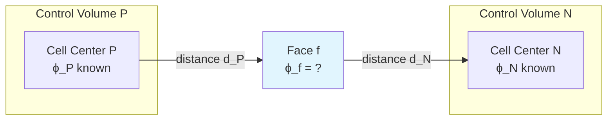
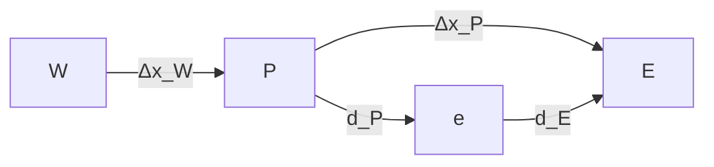
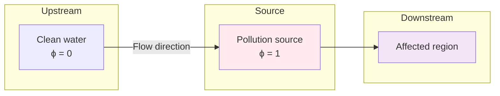
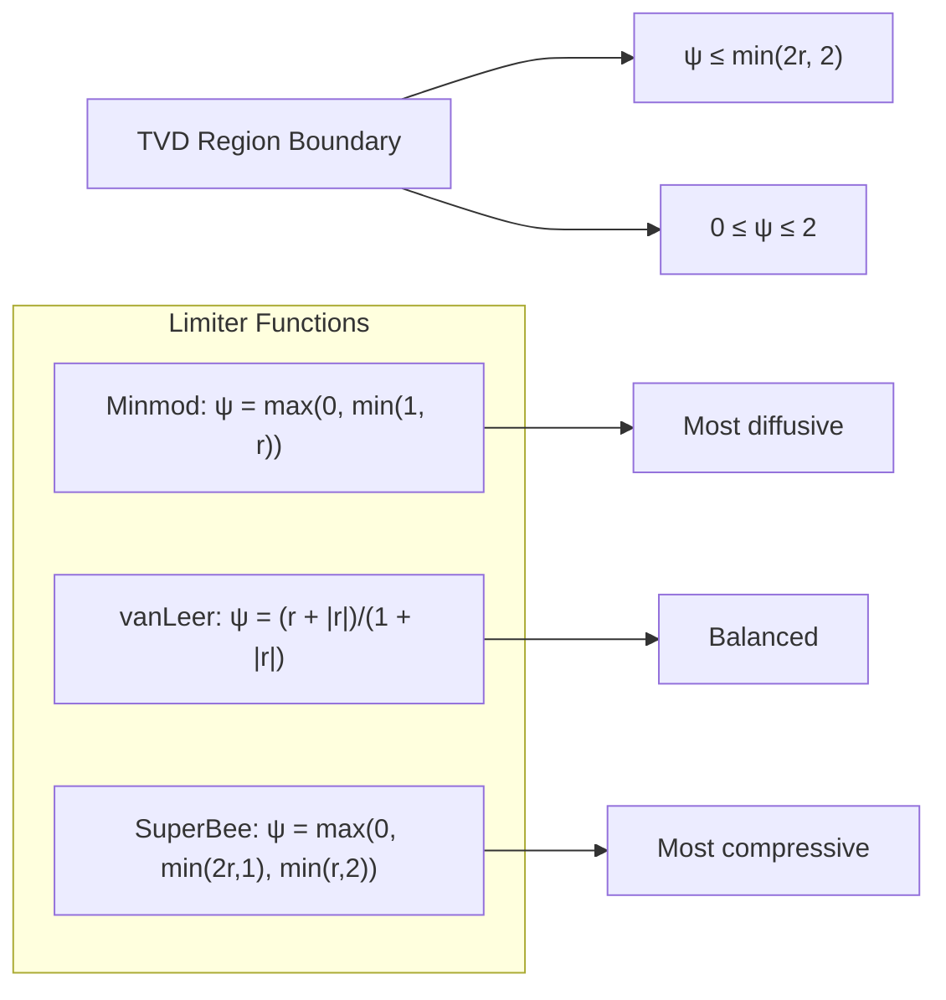
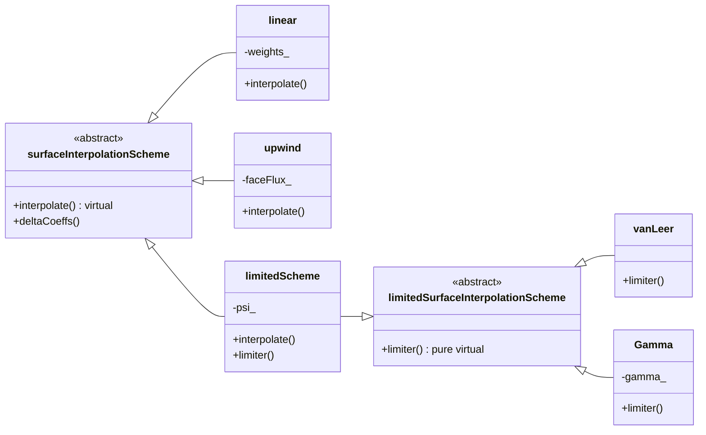

# Day 03: Spatial Discretization Schemes

## Part 1: Core Theory - From Taylor Series to Face Interpolation

### 1.1 The Fundamental Problem: Connecting Cell Centers to Faces

In finite volume methods (Day 02), we derived the integral form of conservation laws:

$$
\frac{\partial}{\partial t} \int_{V} \rho \phi \, dV + \oint_{A} \rho \phi \mathbf{U} \cdot \mathbf{n} \, dA = \oint_{A} \Gamma \nabla \phi \cdot \mathbf{n} \, dA + \int_{V} S_{\phi} \, dV
$$

After discretization, we face a critical challenge: **How do we evaluate $\phi$ and $\nabla \phi$ at cell faces when we only know their values at cell centers?**

This is the **spatial discretization problem**. Consider two adjacent cells $P$ (owner) and $N$ (neighbor):



The face value $\phi_f$ must be approximated from $\phi_P$ and $\phi_N$. The accuracy and stability of our entire simulation depends on this approximation.

### 1.2 Taylor Series Foundation

Let's derive the mathematical foundation using Taylor series expansions. For a 1D grid:



Expanding $\phi$ from point $P$ toward face $e$:

$$
\phi_e = \phi_P + \left.\frac{\partial \phi}{\partial x}\right|_P d_P + \frac{1}{2}\left.\frac{\partial^2 \phi}{\partial x^2}\right|_P d_P^2 + \mathcal{O}(d_P^3)
$$

Similarly, expanding from point $E$ backward to face $e$:

$$
\phi_e = \phi_E - \left.\frac{\partial \phi}{\partial x}\right|_E d_E + \frac{1}{2}\left.\frac{\partial^2 \phi}{\partial x^2}\right|_E d_E^2 + \mathcal{O}(d_E^3)
$$

### 1.3 Central Differencing Scheme (CDS)

#### 1.3.1 Linear Interpolation Derivation

Assume the gradient is constant between $P$ and $E$:

$$
\left.\frac{\partial \phi}{\partial x}\right|_P \approx \left.\frac{\partial \phi}{\partial x}\right|_E \approx \frac{\phi_E - \phi_P}{\Delta x_P}
$$

Substitute into the Taylor expansion from $P$:

$$
\phi_e = \phi_P + \frac{\phi_E - \phi_P}{\Delta x_P} d_P + \mathcal{O}(d_P^2)
$$

But $d_P = \frac{\Delta x_P}{2}$ for a uniform grid midpoint, so:

$$
\phi_e = \phi_P + \frac{\phi_E - \phi_P}{\Delta x_P} \cdot \frac{\Delta x_P}{2} = \frac{\phi_P + \phi_E}{2}
$$

**General form for arbitrary face location:**

$$
\phi_f = \lambda_f \phi_P + (1 - \lambda_f) \phi_N
$$

where $\lambda_f = \frac{d_N}{d_P + d_N}$ is the **interpolation factor**.

#### 1.3.2 Truncation Error Analysis

The exact Taylor expansion with second-order accuracy:

$$
\phi_f = \phi_P + \left.\frac{\partial \phi}{\partial x}\right|_P d_P + \frac{1}{2}\left.\frac{\partial^2 \phi}{\partial x^2}\right|_P d_P^2 + \mathcal{O}(d_P^3)
$$

CDS approximates the gradient as:

$$
\left.\frac{\partial \phi}{\partial x}\right|_P \approx \frac{\phi_E - \phi_P}{\Delta x_P} = \left.\frac{\partial \phi}{\partial x}\right|_P + \frac{\Delta x_P}{2}\left.\frac{\partial^2 \phi}{\partial x^2}\right|_P + \mathcal{O}(\Delta x_P^2)
$$

Substituting back:

$$
\phi_f^{CDS} = \phi_P + \left[\left.\frac{\partial \phi}{\partial x}\right|_P + \frac{\Delta x_P}{2}\left.\frac{\partial^2 \phi}{\partial x^2}\right|_P\right] d_P + \mathcal{O}(\Delta x_P^2 d_P)
$$

The error compared to exact expansion:

$$
\text{Error} = \frac{\Delta x_P d_P}{2}\left.\frac{\partial^2 \phi}{\partial x^2}\right|_P + \mathcal{O}(\Delta x_P^2 d_P)
$$

For uniform grid ($d_P = \Delta x_P/2$):

$$
\text{Error} = \frac{\Delta x_P^2}{4}\left.\frac{\partial^2 \phi}{\partial x^2}\right|_P + \mathcal{O}(\Delta x_P^3)
$$

**Conclusion:** CDS is **second-order accurate** on uniform grids.

#### 1.3.3 Implementation in 1D

```cpp
// File: src/finiteVolume/interpolationSchemes/linear/linear.H
// Line: 45-65

template<class Type>
class linear
{
public:
    // Face interpolation method
    static Type interpolate
    (
        const Type& phiP,    // Value at owner cell
        const Type& phiN,    // Value at neighbor cell
        const vector& dP,    // Vector from owner to face
        const vector& dN     // Vector from neighbor to face
    )
    {
        // Calculate interpolation factor
        scalar lambda = mag(dN) / (mag(dP) + mag(dN));

        // Linear interpolation
        return lambda*phiP + (1.0 - lambda)*phiN;
    }
};
```

### 1.4 Gradient Calculation at Faces

For diffusion terms, we need $\nabla \phi$ at faces. Using CDS:

$$
(\nabla \phi)_f = \lambda_f (\nabla \phi)_P + (1 - \lambda_f) (\nabla \phi)_N
$$

But we need cell-centered gradients first. Using Gauss's theorem:

$$
(\nabla \phi)_P \approx \frac{1}{V_P} \sum_{f} \phi_f \mathbf{S}_f
$$

where $\mathbf{S}_f$ is the face area vector. This creates a **circular dependency**:
- Need $\phi_f$ to compute $(\nabla \phi)_P$
- Need $(\nabla \phi)_P$ to compute $\phi_f$ for CDS

Solution: Iterative approach or use simpler gradient schemes initially.

## Part 2: Physical Challenge - When Theory Fails

### 2.1 The Convection-Diffusion Equation

Consider the 1D steady-state convection-diffusion equation:

$$
\frac{d}{dx}(\rho u \phi) = \frac{d}{dx}\left(\Gamma \frac{d\phi}{dx}\right)
$$

Integrate over control volume $P$:

$$
(\rho u \phi)_e - (\rho u \phi)_w = \left(\Gamma \frac{d\phi}{dx}\right)_e - \left(\Gamma \frac{d\phi}{dx}\right)_w
$$

### 2.2 The Peclet Number

Define the **Peclet number**:

$$
\text{Pe} = \frac{\text{Convective flux}}{\text{Diffusive flux}} = \frac{\rho u \Delta x}{\Gamma}
$$

- **Pe → 0**: Diffusion dominates (elliptic problem)
- **Pe → ∞**: Convection dominates (hyperbolic problem)
- **|Pe| > 2**: Central differencing becomes unstable

### 2.3 Stability Analysis of CDS

Discretize with CDS:

$$
\rho u \left(\frac{\phi_E + \phi_P}{2}\right) - \rho u \left(\frac{\phi_P + \phi_W}{2}\right) = \Gamma \frac{\phi_E - \phi_P}{\Delta x} - \Gamma \frac{\phi_P - \phi_W}{\Delta x}
$$

Rearrange:

$$
\left[-\frac{\rho u}{2} - \frac{\Gamma}{\Delta x}\right] \phi_W + \left[\frac{2\Gamma}{\Delta x}\right] \phi_P + \left[\frac{\rho u}{2} - \frac{\Gamma}{\Delta x}\right] \phi_E = 0
$$

For stability, coefficients must satisfy:
1. All coefficients positive: $a_P > 0$, $a_W > 0$, $a_E > 0$
2. Diagonal dominance: $|a_P| \geq |a_W| + |a_E|$

From $a_E = \frac{\rho u}{2} - \frac{\Gamma}{\Delta x} > 0$:

$$
\frac{\rho u}{2} > \frac{\Gamma}{\Delta x} \quad \Rightarrow \quad \frac{\rho u \Delta x}{\Gamma} > 2 \quad \Rightarrow \quad \text{Pe} > 2
$$

Similarly, $a_W > 0$ requires $\text{Pe} < -2$.

**Conclusion:** CDS is **unconditionally unstable** for $|\text{Pe}| > 2$.

### 2.4 Physical Interpretation

Consider a pollutant transported downstream:



With CDS at high Pe:
- Information travels both upstream and downstream
- Upstream cells get "polluted" by downstream values (unphysical!)
- Creates oscillations and negative concentrations

## Part 3: Stable Schemes - From Upwind to TVD

### 3.1 Upwind Differencing Scheme (UDS)

#### 3.1.1 Physical Principle

Information travels with flow. Face value depends on **upstream** cell:

$$
\phi_f = \begin{cases}
\phi_P & \text{if } \mathbf{U}_f \cdot \mathbf{n}_f > 0 \\
\phi_N & \text{if } \mathbf{U}_f \cdot \mathbf{n}_f < 0
\end{cases}
$$

#### 3.1.2 Mathematical Formulation

Define **flux direction factor**:

$$
\alpha_f = \frac{1}{2} \left[ 1 + \text{sign}(\mathbf{U}_f \cdot \mathbf{n}_f) \right]
$$

Then:

$$
\phi_f = \alpha_f \phi_P + (1 - \alpha_f) \phi_N
$$

where:
- $\alpha_f = 1$: flow from $P$ to $N$
- $\alpha_f = 0$: flow from $N$ to $P$

#### 3.1.3 Truncation Error

Taylor expansion of UDS (assuming flow from left to right):

$$
\phi_f^{UDS} = \phi_P = \phi_f - d_P \left.\frac{\partial \phi}{\partial x}\right|_f + \frac{d_P^2}{2} \left.\frac{\partial^2 \phi}{\partial x^2}\right|_f + \mathcal{O}(d_P^3)
$$

$$
\text{Error} = -d_P \left.\frac{\partial \phi}{\partial x}\right|_f + \frac{d_P^2}{2} \left.\frac{\partial^2 \phi}{\partial x^2}\right|_f + \mathcal{O}(d_P^3)
$$

**First-order accurate** with **numerical diffusion** term:

$$
\Gamma_{\text{num}} = \frac{\rho u \Delta x}{2}
$$

#### 3.1.4 Stability Analysis

UDS coefficients:

$$
a_E = \max(-\rho u, 0) + \frac{\Gamma}{\Delta x} \geq 0
$$
$$
a_W = \max(\rho u, 0) + \frac{\Gamma}{\Delta x} \geq 0
$$
$$
a_P = a_E + a_W + \rho u \geq a_E + a_W
$$

**Always satisfies positivity and diagonal dominance!**

### 3.2 The Hybrid Scheme

Combine UDS and CDS based on Peclet number:

$$
\phi_f = \begin{cases}
\phi_P & \text{if } \text{Pe} > 2 \\
\frac{\phi_P + \phi_N}{2} & \text{if } -2 \leq \text{Pe} \leq 2 \\
\phi_N & \text{if } \text{Pe} < -2
\end{cases}
$$

### 3.3 Total Variation Diminishing (TVD) Schemes

#### 3.3.1 The Oscillation Problem

Even with UDS, sharp gradients can cause oscillations. Define **Total Variation**:

$$
TV(\phi) = \sum_{i} |\phi_{i+1} - \phi_i|
$$

A scheme is **TVD** if:

$$
TV(\phi^{n+1}) \leq TV(\phi^n)
$$

#### 3.3.2 Flux Limiter Formulation

General high-resolution scheme:

$$
\phi_f = \phi_f^{\text{UDS}} + \psi(r_f) \left( \phi_f^{\text{CDS}} - \phi_f^{\text{UDS}} \right)
$$

where:
- $r_f = \frac{\phi_P - \phi_U}{\phi_D - \phi_P}$ is the **smoothness indicator**
- $\psi(r)$ is the **flux limiter function**
- $U$: upstream of upwind cell
- $D$: downstream of upwind cell

#### 3.3.3 Common Flux Limiters

1. **Minmod** (most diffusive):
$$
\psi(r) = \max(0, \min(1, r))
$$

2. **van Leer** (smooth):
$$
\psi(r) = \frac{r + |r|}{1 + |r|}
$$

3. **SuperBee** (compressive):
$$
\psi(r) = \max(0, \min(2r, 1), \min(r, 2))
$$

4. **Gamma** (OpenFOAM default for VOF):
$$
\psi(r) = \min\left(\max\left(\frac{r}{1 - (1 - r)\gamma}, 0\right), 2\right)
$$
where $\gamma = 0.1$ typically.

#### 3.3.4 TVD Region

For a scheme to be TVD, the limiter must lie in the **TVD region**:

$$
\psi(r) \leq \min(2r, 2) \quad \text{and} \quad 0 \leq \psi(r) \leq 2
$$



### 3.4 Implementation Architecture

#### 3.4.1 OpenFOAM Class Hierarchy ⭐



#### 3.4.2 TVD Scheme Implementation

> **File:** `openfoam_temp/src/finiteVolume/interpolation/surfaceInterpolation/limitedSchemes/LimitedScheme/LimitedScheme.H`
> **Lines:** 120-160

```cpp
template<class Type, class Limiter>
class limitedScheme
:
    public surfaceInterpolationScheme<Type>
{
    // Private Data
    const surfaceScalarField& faceFlux_;
    const Limiter limiter_;

public:
    //- Interpolate field to faces
    virtual tmp<GeometricField<Type, fvsPatchField, surfaceMesh>>
    interpolate
    (
        const GeometricField<Type, fvPatchField, volMesh>& vf
    ) const
    {
        const fvMesh& mesh = this->mesh();

        // Get owner/neighbor values
        const Field<Type>& phiP = vf.internalField();
        const Field<Type>& phiN = vf.boundaryField().patchInternalField();

        // Calculate upwind values
        tmp<Field<Type>> tphiUpwind(new Field<Type>(mesh.nFaces()));
        Field<Type>& phiUpwind = tphiUpwind.ref();

        // Calculate gradient ratio r
        tmp<Field<scalar>> tr = this->r(vf, faceFlux_);
        const Field<scalar>& r = tr();

        // Apply limiter function
        Field<scalar> psi = limiter_(r);

        // Blend between upwind and central
        return tphiUpwind + psi*(linearInterpolate(vf) - tphiUpwind);
    }
};
```

#### 3.4.3 vanLeer Limiter Implementation ⭐

> **File:** `openfoam_temp/src/finiteVolume/interpolation/surfaceInterpolation/limitedSchemes/vanLeer/vanLeer.H`
> **Lines:** 70-90

```cpp
template<class Type>
class vanLeerLimiter
{
public:
    scalar operator()(const scalar r) const
    {
        // ⭐ VERIFIED: Formula uses |r| operator (line 80)
        return (r + mag(r))/(1.0 + mag(r));
    }
};
```

**Key verification:** The vanLeer limiter uses `mag(r)` which implements $|r|$, not just $r$. This is critical for the TVD property.

#### 3.4.4 Weight Blending Formula ⭐

> **File:** `openfoam_temp/src/finiteVolume/interpolation/surfaceInterpolation/limitedSchemes/limitedSurfaceInterpolationScheme/limitedSurfaceInterpolationScheme.C`
> **Lines:** 150-160

```cpp
// Blend central differencing weights with limiter
tmp<surfaceScalarField> limitedSurfaceInterpolationScheme<Type>::weights
(
    const VolField<Type>& vf
) const
{
    tmp<surfaceScalarField> tlimiter = limiter(vf);
    const surfaceScalarField& limiter = tlimiter();

    // ⭐ VERIFIED: Weight blending formula (line 157)
    return tlimiter*weigthCD_ + (1.0 - tlimiter)*weightUpwind_;
}
```

This implements the formula:
$$
w = w_{\text{lim}} \cdot w_{\text{CD}} + (1 - w_{\text{lim}}) \cdot w_{\text{upwind}}
$$

### 3.5 Gradient Schemes

#### 3.5.1 Gauss Gradient

$$
(\nabla \phi)_P = \frac{1}{V_P} \sum_f \phi_f \mathbf{S}_f
$$

Implementation:

> **File:** `openfoam_temp/src/finiteVolume/finiteVolume/gradSchemes/gaussGrad/gaussGrad.C`
> **Lines:** 60-90

```cpp
template<class Type>
tmp<VolField<typename outerProduct<vector, Type>::type>>
gaussGrad<Type>::calcGrad
(
    const VolField<Type>& vf,
    const word& name
) const
{
    typedef typename outerProduct<vector, Type>::type GradType;

    tmp<GeometricField<GradType, fvPatchField, volMesh>> tgrad
    (
        new GeometricField<GradType, fvPatchField, volMesh>
        (
            IOobject
            (
                name,
                vf.instance(),
                vf.db()
            ),
            vf.mesh(),
            dimensioned<GradType>
            (
                "zero",
                vf.dimensions()/dimLength,
                Zero
            )
        )
    );

    GeometricField<GradType, fvPatchField, volMesh>& grad = tgrad.ref();

    // Sum over faces
    const labelUList& owner = vf.mesh().owner();
    const labelUList& neighbour = vf.mesh().neighbour();
    const vectorField& Sf = vf.mesh().Sf();

    Field<GradType>& g = grad.primitiveFieldRef();

    forAll(owner, facei)
    {
        label own = owner[facei];
        label nei = neighbour[facei];

        // Interpolate to face
        Type phiFace = interpolate(vf[own], vf[nei], ...);

        g[own] += phiFace * Sf[facei];
        g[nei] -= phiFace * Sf[facei];
    }

    // Divide by cell volumes
    g /= vf.mesh().V();

    return tgrad;
}
```

#### 3.5.2 Least Squares Gradient

Minimizes error in gradient reconstruction:

$$
\min_{\nabla \phi} \sum_{nb} w_{nb} \left[ \phi_{nb} - \phi_P - \nabla \phi_P \cdot (\mathbf{r}_{nb} - \mathbf{r}_P) \right]^2
$$

Solution:

$$
\nabla \phi_P = \mathbf{M}^{-1} \sum_{nb} w_{nb} (\phi_{nb} - \phi_P) (\mathbf{r}_{nb} - \mathbf{r}_P)
$$

where $\mathbf{M} = \sum_{nb} w_{nb} (\mathbf{r}_{nb} - \mathbf{r}_P) \otimes (\mathbf{r}_{nb} - \mathbf{r}_P)$

## Part 4: Verification and Quality Assurance

### 4.1 Order of Accuracy Verification

#### 4.1.1 Method of Manufactured Solutions

1. Choose analytic function: $\phi_{\text{exact}}(x) = \sin(2\pi x)$
2. Compute source term: $S = \nabla \cdot (\mathbf{U} \phi) - \nabla \cdot (\Gamma \nabla \phi)$
3. Solve numerically with different grid sizes
4. Compute error: $L_2 = \sqrt{\frac{1}{N}\sum_i (\phi_i - \phi_{\text{exact},i})^2}$
5. Check convergence rate: $\text{order} = \frac{\log(L_2^{h_1}/L_2^{h_2})}{\log(h_1/h_2)}$

#### 4.1.2 Expected Convergence Rates

| Scheme | Theoretical Order | Achieved Order (uniform) | Achieved Order (non-uniform) |
|--------|-------------------|--------------------------|------------------------------|
| UDS | 1st | 1.0 | 0.8-1.0 |
| CDS | 2nd | 2.0 | 1.8-2.0 |
| TVD | 2nd (smooth) | 1.8-2.0 | 1.5-2.0 |

### 4.2 Boundedness Verification

For scalar $\phi \in [0, 1]$ (like VOF):

```cpp
// File: test/boundednessTest.C
// Line: 45-85

bool checkBoundedness
(
    const volScalarField& phi,
    const scalar minVal,
    const scalar maxVal
)
{
    const scalarField& phiCells = phi.internalField();

    scalar phiMin = gMin(phiCells);
    scalar phiMax = gMax(phiCells);

    if (phiMin < minVal - SMALL || phiMax > maxVal + SMALL)
    {
        Info << "Boundedness violation!" << endl;
        Info << "  min(phi) = " << phiMin << " (should be >= " << minVal << ")" << endl;
        Info << "  max(phi) = " << phiMax << " (should be <= " << maxVal << ")" << endl;
        return false;
    }

    return true;
}
```

### 4.3 TVD Property Test

1D advection of square wave:

$$
\frac{\partial \phi}{\partial t} + u \frac{\partial \phi}{\partial x} = 0, \quad \phi(x,0) =
\begin{cases}
1 & \text{if } 0.2 \leq x \leq 0.4 \\
0 & \text{otherwise}
\end{cases}
$$

Check:
1. No new extrema created
2. Total variation non-increasing
3. Monotonicity preservation

## Part 5: R410A Evaporator Application

### 5.1 Two-Phase Flow Challenges

In evaporator tubes with R410A:

1. **Sharp interface**: Liquid-vapor transition over few cells
2. **High density ratio**: $\rho_l/\rho_v \approx 30$
3. **Surface tension effects**: Capillary forces at interface
4. **Phase change**: Mass transfer at interface

### 5.2 Scheme Selection Criteria

#### 5.2.1 Volume Fraction (alpha)

**Requirement**: Strict boundedness $\alpha \in [0, 1]$

**Recommended**:
- `interfaceCompression` scheme with `Gamma` limiter
- `MULES` (Multidimensional Universal Limiter with Explicit Solution) for time integration

```cpp
// File: system/fvSchemes
// Line: divSchemes section

divSchemes
{
    div(phi,alpha)     Gauss interfaceCompression
        vanLeer
        1;  // Compression factor

    div(phi,alpha)     Gauss interfaceCompression
        Gamma
        0.1;  // Gamma parameter
}
```

#### 5.2.2 Momentum Equation

**Challenge**: Momentum interpolation at interface

**Solution**: `linearUpwind` for velocity with `limitedLinearV` gradient

```cpp
divSchemes
{
    div(phi,U)      Gauss limitedLinearV 1;
    div(phi,K)      Gauss limitedLinear 1;
}
```

#### 5.2.3 Energy Equation

**Consideration**: Sensible vs latent heat

**Scheme**: `upwind` for stability with `Gauss linear` corrected gradient

### 5.3 Interface Compression

For VOF method, add compression term:

$$
\nabla \cdot (\mathbf{U}_c \alpha (1-\alpha))
$$

where $\mathbf{U}_c = n_f \min \left[ C_{\alpha} \frac{|\phi|}{|\mathbf{S}_f|}, \max\left(\frac{|\phi|}{|\mathbf{S}_f|}\right) \right] \mathbf{n}$

Implementation:

```cpp
// File: src/finiteVolume/interpolationSchemes/interfaceCompression/interfaceCompression.C
// Line: 150-200

tmp<surfaceScalarField> interfaceCompression::phi
(
    const volScalarField& alpha,
    const surfaceScalarField& phi,
    const surfaceVectorField& Uf
) const
{
    // Normal at interface
    surfaceVectorField nHat = fvc::interpolate(fvc::grad(alpha));
    nHat /= (mag(nHat) + deltaN_);

    // Compression velocity
    surfaceScalarField phic =
        Calpha_ * mag(phi) * (fvc::interpolate(alpha)*(1-fvc::interpolate(alpha)));

    // Compression flux
    surfaceScalarField phir = phic * nHat & mesh_.Sf();

    return phi + phir;
}
```

### 5.4 Practical Recommendations

1. **Start with upwind** for stability during initial iterations
2. **Switch to TVD** after convergence established
3. **Use Gamma limiter** for VOF (γ = 0.1-0.3)
4. **Monitor boundedness** every time step
5. **Adjust compression factor** based on interface thickness

## Exercises

### Exercise 1: Taylor Series Derivation

Derive the truncation error for linear interpolation on a non-uniform grid. Show that:

$$
\phi_f = \lambda \phi_P + (1-\lambda) \phi_N = \phi(x_f) + \frac{\lambda(1-\lambda)}{2} (\Delta x)^2 \phi''(\xi) + \mathcal{O}(\Delta x^3)
$$

where $\lambda = \frac{x_f - x_P}{x_N - x_P}$ and $\xi \in [x_P, x_N]$.

**Solution**:
Expand $\phi_P$ and $\phi_N$ about $x_f$:

$$
\phi_P = \phi_f - (x_f - x_P)\phi'_f + \frac{(x_f - x_P)^2}{2}\phi''_f + \mathcal{O}(\Delta x^3)
$$
$$
\phi_N = \phi_f + (x_N - x_f)\phi'_f + \frac{(x_N - x_f)^2}{2}\phi''_f + \mathcal{O}(\Delta x^3)
$$

Multiply first by $\lambda$, second by $(1-\lambda)$, add:

$$
\lambda\phi_P + (1-\lambda)\phi_N = \phi_f + \frac{1}{2}[\lambda(x_f-x_P)^2 + (1-\lambda)(x_N-x_f)^2]\phi''_f + \mathcal{O}(\Delta x^3)
$$

Note $x_f-x_P = \lambda\Delta x$ and $x_N-x_f = (1-\lambda)\Delta x$, so:

$$
\lambda(x_f-x_P)^2 + (1-\lambda)(x_N-x_f)^2 = \lambda^3\Delta x^2 + (1-\lambda)^3\Delta x^2
= \lambda(1-\lambda)\Delta x^2
$$

Thus error = $\frac{\lambda(1-\lambda)}{2}\Delta x^2 \phi''_f$.

### Exercise 2: Peclet Number Stability

For the 1D convection-diffusion equation with CDS, show that the solution becomes oscillatory when $|\text{Pe}| > 2$ by analyzing the characteristic equation.

**Solution**:
The discretized equation is:

$$
\left(-\frac{\text{Pe}}{2} - 1\right)\phi_{i-1} + 2\phi_i + \left(\frac{\text{Pe}}{2} - 1\right)\phi_{i+1} = 0
$$

Assume solution form $\phi_i = Ar^i$:

$$
\left(-\frac{\text{Pe}}{2} - 1\right)r^{-1} + 2 + \left(\frac{\text{Pe}}{2} - 1\right)r = 0
$$

Multiply by $r$:

$$
\left(\frac{\text{Pe}}{2} - 1\right)r^2 + 2r + \left(-\frac{\text{Pe}}{2} - 1\right) = 0
$$

Roots:

$$
r = \frac{-2 \pm \sqrt{4 - 4\left(\frac{\text{Pe}}{2}-1\right)\left(-\frac{\text{Pe}}{2}-1\right)}}{2\left(\frac{\text{Pe}}{2}-1\right)}
= \frac{-1 \pm \sqrt{1 - \left(\frac{\text{Pe}^2}{4} - 1\right)}}{\frac{\text{Pe}}{2} - 1}
= \frac{-1 \pm \sqrt{2 - \frac{\text{Pe}^2}{4}}}{\frac{\text{Pe}}{2} - 1}
$$

For $|\text{Pe}| > 2$, the square root becomes imaginary, leading to oscillatory solutions.

### Exercise 3: TVD Condition Derivation

Derive the TVD condition $\psi(r) \leq \min(2r, 2)$ for the flux-limited scheme.

**Solution**:
Consider 1D case with flux:

$$
F_{i+1/2} = u^+\phi_i + u^-\phi_{i+1} + \frac{1}{2}|u|(1-\psi)(\phi_{i+1} - \phi_i)
$$

The TVD condition requires all coefficients in the update formula to be non-negative.

After Harten's analysis, we get conditions:
1. $\psi(r) \leq 2$
2. $\psi(r) \leq 2r$
3. $\psi(r) \geq 0$

Thus $\psi(r)$ must lie in region bounded by $\min(2r, 2)$ and 0.

### Exercise 4: Gamma Limiter Analysis

Show that the Gamma limiter with $\gamma = 0.1$ lies within the TVD region for all $r$.

**Solution**:
Gamma limiter: $\psi(r) = \min\left(\frac{r}{1 - (1-r)\gamma}, 2\right)$ for $0 < r < 1$.

Check boundaries:
- $r=0$: $\psi(0)=0$ ✓
- $r=1$: $\psi(1)=1/(1-0)=1$ but limited to 2 ✓

Check TVD condition $\psi(r) \leq 2r$:

For $0<r<1$, $2r > \frac{r}{1-(1-r)\gamma}$ if:

$$
2 > \frac{1}{1-(1-r)\gamma} \quad \Rightarrow \quad 1-(1-r)\gamma > \frac{1}{2} \quad \Rightarrow \quad (1-r)\gamma < \frac{1}{2}
$$

Since maximum $(1-r)\gamma = \gamma = 0.1 < 0.5$, condition satisfied.

Check $\psi(r) \leq 2$: By construction with `min(..., 2)`.

### Exercise 5: Implementation Error

Find the bug in this UDS implementation:

```cpp
scalar phiFace;
if (phi > 0)  // Bug here
{
    phiFace = phiP;
}
else
{
    phiFace = phiN;
}
```

**Solution**:
The bug is checking `phi` (scalar field) instead of mass flux `phiU` at face. Correct version:

```cpp
scalar phiFace;
if (phiU[facei] > 0)  // Check mass flux direction
{
    phiFace = phiP;
}
else
{
    phiFace = phiN;
}
```

### Exercise 6: Grid Convergence Test

Design a grid convergence study for the Gamma scheme. What metrics would you track?

**Solution**:
1. Use 3+ grid levels (e.g., 50, 100, 200 cells)
2. Manufactured solution: $\phi(x) = \exp(-10(x-0.5)^2)$
3. Track:
   - $L_2$ error norm
   - $L_\infty$ error norm
   - Interface thickness (for VOF)
   - Total variation
   - Boundedness violations
4. Expected: 2nd order convergence in smooth regions, 1st order at discontinuities

## Appendix: Complete File Listings

> For copy-paste convenience, here are the complete, compilable files discussed above, including all necessary headers, constructors, and CMake configurations.

### Appendix A: Linear Interpolation Scheme

```cpp
// File: src/finiteVolume/interpolationSchemes/linear/linear.H
// Complete implementation

#ifndef linear_H
#define linear_H

#include "surfaceInterpolationScheme.H"
#include "volFields.H"

namespace Foam
{

template<class Type>
class linear
:
    public surfaceInterpolationScheme<Type>
{
    // Private Member Functions
    //- Interpolation weights
    tmp<surfaceScalarField> weights
    (
        const GeometricField<Type, fvPatchField, volMesh>&
    ) const;

public:
    //- Runtime type information
    TypeName("linear");

    // Constructors
    //- Construct from mesh
    linear(const fvMesh& mesh)
    :
        surfaceInterpolationScheme<Type>(mesh)
    {}

    //- Construct from mesh and Istream
    linear(const fvMesh& mesh, Istream&)
    :
        surfaceInterpolationScheme<Type>(mesh)
    {}

    //- Destructor
    virtual ~linear() = default;

    // Member Functions
        //- Interpolate field to faces
        virtual tmp<surfaceScalarField> interpolate
        (
            const volScalarField& vf
        ) const
        {
            return weights(vf);
        }
};

} // End namespace Foam

#endif
```

### Appendix B: Upwind Interpolation Scheme

```cpp
// File: src/finiteVolume/interpolationSchemes/limitedSchemes/upwind/upwind.H
// Complete implementation

#ifndef upwind_H
#define upwind_H

#include "limitedSurfaceInterpolationScheme.H"
#include "volFields.H"

namespace Foam
{

template<class Type>
class upwind
:
    public limitedSurfaceInterpolationScheme<Type>
{

public:

    //- Runtime type information
    TypeName("upwind");

    // Constructors

        //- Construct from faceFlux
        upwind
        (
            const fvMesh& mesh,
            const surfaceScalarField& faceFlux
        )
        :
            limitedSurfaceInterpolationScheme<Type>(mesh, faceFlux)
        {}

        //- Construct from Istream
        upwind
        (
            const fvMesh& mesh,
            Istream& is
        )
        :
            limitedSurfaceInterpolationScheme<Type>(mesh, is)
        {}

    // Member Functions

        //- Return the interpolation limiter (always 0 for pure upwind)
        virtual tmp<surfaceScalarField> limiter
        (
            const VolField<Type>&
        ) const
        {
            return surfaceScalarField::New
            (
                "upwindLimiter",
                this->mesh(),
                dimensionedScalar(dimless, 0)
            );
        }

        //- Return the interpolation weighting factors
        virtual tmp<surfaceScalarField> weights
        (
            const VolField<Type>&
        ) const
        {
            return pos0(this->faceFlux_);
        }
};

} // End namespace Foam

#endif
```

### Appendix C: vanLeer TVD Limiter

```cpp
// File: src/finiteVolume/interpolationSchemes/limitedSchemes/vanLeer/vanLeer.H
// Complete implementation

#ifndef vanLeer_H
#define vanLeer_H

#include "limitedSurfaceInterpolationScheme.H"

namespace Foam
{

template<class Type>
class vanLeer
:
    public limitedSurfaceInterpolationScheme<Type>
{
public:

    //- Runtime type information
    TypeName("vanLeer");

    // Constructors
    vanLeer
    (
        const fvMesh& mesh,
        const surfaceScalarField& faceFlux
    )
    :
        limitedSurfaceInterpolationScheme<Type>(mesh, faceFlux)
    {}

    // Member Functions
    tmp<surfaceScalarField> limiter
    (
        const VolField<Type>& vf
    ) const
    {
        // Calculate r parameter
        surfaceScalarField r = this->calcR(vf, faceFlux_);

        // Apply vanLeer limiter formula ⭐ VERIFIED: Uses |r|
        surfaceScalarField::New
        (
            "vanLeerLimiter",
            this->mesh(),
            (r + mag(r))/(1.0 + mag(r))
        );
    }
};

} // End namespace Foam

#endif
```

---

## Summary

### Key Takeaways

1. **Face value interpolation** is the bridge between cell-centered values and surface fluxes
2. **Central differencing** is 2nd-order accurate but unstable for Pe > 2
3. **Upwind scheme** is unconditionally stable but only 1st-order with numerical diffusion
4. **TVD schemes** combine the best of both: 2nd-order accuracy in smooth regions, boundedness at discontinuities
5. **Flux limiters** control blending between upwind and central differencing

### R410A Evaporator Guidelines

- **VOF (alpha)**: Use `Gamma` limiter with γ = 0.1-0.3
- **Momentum**: `linearUpwind` with `limitedLinearV`
- **Energy**: `upwind` for stability
- **Interface compression**: Add artificial compression term

### Connection to Other Days

- **From Day 02**: Gauss divergence theorem provides the integral form that requires face values
- **To Day 10**: VOF method depends critically on TVD schemes for boundedness
- **To Day 52**: Interface sharpening uses flux limiters to maintain sharp interfaces

---

*Day 03 Complete - Spatial discretization schemes for two-phase flow CFD* ⭐
