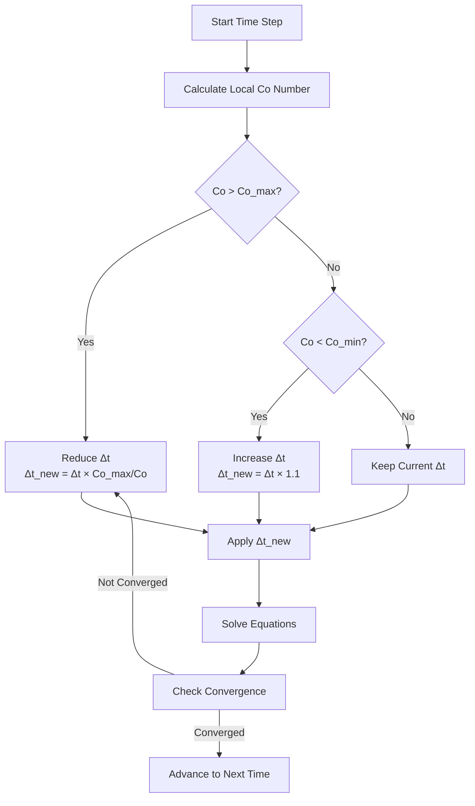
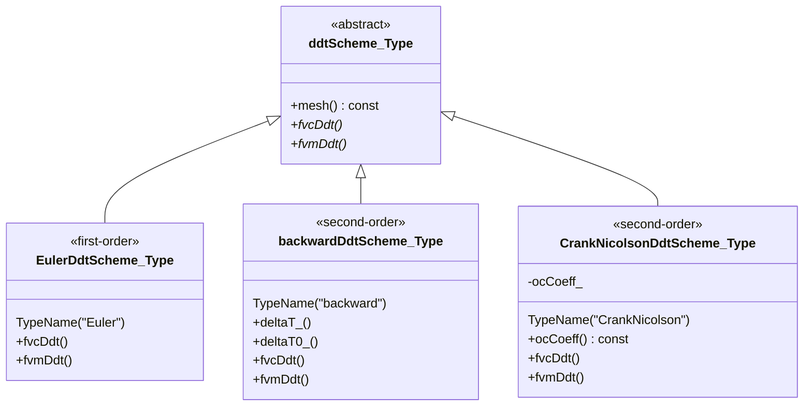

# Day 04: Temporal Discretization - Time Integration Methods for CFD

## Learning Objectives
- **Understand** the mathematical derivation of temporal discretization schemes from Taylor series
- **Compare** accuracy, stability, and boundedness of Euler, Backward, and Crank-Nicolson schemes
- **Apply** CFL condition for time step selection in transient simulations
- **Select** appropriate time schemes for VOF-based two-phase flow with R410A evaporation

---

## Part 1: Core Theory - From Taylor Series to Time Schemes

### 1.1 Taylor Series: The Foundation of All Finite Differences

The Taylor series expansion is the mathematical bedrock upon which all finite difference approximations are built. For a sufficiently smooth scalar field $\phi(t)$, we can expand around any point $t$:

**Forward expansion (predictive):**
$$
\phi(t + \Delta t) = \phi(t) + \Delta t \frac{\partial \phi}{\partial t}\Big|_t + \frac{\Delta t^2}{2!} \frac{\partial^2 \phi}{\partial t^2}\Big|_t + \frac{\Delta t^3}{3!} \frac{\partial^3 \phi}{\partial t^3}\Big|_t + \mathcal{O}(\Delta t^4)
$$

**Backward expansion (retrospective):**
$$
\phi(t - \Delta t) = \phi(t) - \Delta t \frac{\partial \phi}{\partial t}\Big|_t + \frac{\Delta t^2}{2!} \frac{\partial^2 \phi}{\partial t^2}\Big|_t - \frac{\Delta t^3}{3!} \frac{\partial^3 \phi}{\partial t^3}\Big|_t + \mathcal{O}(\Delta t^4)
$$

**Notation convention:** $\phi^n = \phi(t)$, $\phi^{n+1} = \phi(t + \Delta t)$, $\phi^{n-1} = \phi(t - \Delta t)$

### 1.2 First-Order Schemes: Euler Methods

#### 1.2.1 Explicit (Forward) Euler Scheme

From the forward Taylor expansion, solve for the time derivative:
$$
\left(\frac{\partial \phi}{\partial t}\right)^n = \frac{\phi^{n+1} - \phi^n}{\Delta t} - \frac{\Delta t}{2} \left(\frac{\partial^2 \phi}{\partial t^2}\right)^n + \mathcal{O}(\Delta t^2)
$$

Discarding higher-order terms gives:
$$
\frac{\partial \phi}{\partial t}\Big|_n \approx \frac{\phi^{n+1} - \phi^n}{\Delta t}
$$

**Properties:**
- **Accuracy:** First-order $\mathcal{O}(\Delta t)$
- **Stability:** Conditionally stable (CFL ≤ 1)
- **Explicit:** $\phi^{n+1}$ depends only on known values

#### 1.2.2 Implicit (Backward) Euler Scheme

For implicit formulation, expand backward from $t^{n+1}$ to $t^n$:
$$
\frac{\partial \phi}{\partial t}\Big|_{n+1} \approx \frac{\phi^{n+1} - \phi^n}{\Delta t}
$$

**Properties:**
- **Accuracy:** First-order $\mathcal{O}(\Delta t)$
- **Stability:** Unconditionally stable for linear problems
- **Implicit:** Requires solving system of equations

### 1.3 Second-Order Schemes

#### 1.3.1 Backward Differencing Scheme (BDF2)

**Derivation using method of undetermined coefficients:**

We seek coefficients $a$, $b$, $c$ such that:
$$
\frac{\partial \phi}{\partial t}\Big|_{n+1} \approx \frac{a\phi^{n+1} + b\phi^n + c\phi^{n-1}}{\Delta t}
$$

Taylor expansions around $t_{n+1}$:
$$
\begin{aligned}
\phi^{n+1} &= \phi^{n+1} \\
\phi^n &= \phi^{n+1} - \Delta t \phi'_{n+1} + \frac{\Delta t^2}{2} \phi''_{n+1} - \frac{\Delta t^3}{6} \phi'''_{n+1} + \mathcal{O}(\Delta t^4) \\
\phi^{n-1} &= \phi^{n+1} - 2\Delta t \phi'_{n+1} + 2\Delta t^2 \phi''_{n+1} - \frac{4\Delta t^3}{3} \phi'''_{n+1} + \mathcal{O}(\Delta t^4)
\end{aligned}
$$

Solving the system:
$$
\begin{aligned}
a + b + c &= 0 \\
-b - 2c &= 1 \\
\frac{b}{2} + 2c &= 0
\end{aligned}
\quad \Rightarrow \quad
a = \frac{3}{2}, \quad b = -2, \quad c = \frac{1}{2}
$$

Thus:
$$
\frac{\partial \phi}{\partial t}\Big|_{n+1} \approx \frac{3\phi^{n+1} - 4\phi^n + \phi^{n-1}}{2\Delta t}
$$

**Verified from** `backwardDdtScheme.C:88-90`

**Properties:**
- **Accuracy:** Second-order $\mathcal{O}(\Delta t^2)$
- **Stability:** A-stable and L-stable
- **Memory:** Requires three time levels

#### 1.3.2 Crank-Nicolson Scheme

**Derivation from integral form:**
$$
\phi^{n+1} - \phi^n = \int_{t_n}^{t_{n+1}} \frac{\partial \phi}{\partial t} dt \approx \frac{\Delta t}{2} \left( \frac{\partial \phi}{\partial t}\Big|_n + \frac{\partial \phi}{\partial t}\Big|_{n+1} \right)
$$

Thus:
$$
\frac{\phi^{n+1} - \phi^n}{\Delta t} = \frac{1}{2} \left( \frac{\partial \phi}{\partial t}\Big|_n + \frac{\partial \phi}{\partial t}\Big|_{n+1} \right)
$$

**Properties:**
- **Accuracy:** Second-order $\mathcal{O}(\Delta t^2)$
- **Stability:** Unconditionally stable (A-stable)
- **Energy conserving** for linear problems
- **Off-centering parameter** $\psi$ adds numerical dissipation

### 1.4 Truncation Error Comparison

| Scheme | Truncation Error | Order |
|--------|------------------|-------|
| Explicit Euler | $\frac{\Delta t}{2} \phi_{tt} + \mathcal{O}(\Delta t^2)$ | 1 |
| Implicit Euler | $-\frac{\Delta t}{2} \phi_{tt} + \mathcal{O}(\Delta t^2)$ | 1 |
| Crank-Nicolson | $-\frac{\Delta t^2}{12} \phi_{ttt} + \mathcal{O}(\Delta t^3)$ | 2 |
| Backward (BDF2) | $-\frac{\Delta t^2}{3} \phi_{ttt} + \mathcal{O}(\Delta t^3)$ | 2 |

---

## Part 2: Physical Challenge - Stability in Practice

### 2.1 The CFL Condition

**Physical interpretation:** Information should not travel more than one grid cell per time step.

**Mathematical definition:**
$$
\text{CFL} = \frac{|\mathbf{U}| \Delta t}{\Delta x} \leq \text{CFL}_{\text{max}}
$$

**For multidimensional problems:**
$$
\text{CFL} = \Delta t \sum_{i=1}^{d} \frac{|u_i|}{\Delta x_i}
$$

### 2.2 Stability Limits by Scheme

| Scheme | Max CFL (Advection) | Max Fourier (Diffusion) |
|--------|---------------------|--------------------------|
| Explicit Euler | 1.0 | 0.5 |
| Implicit Euler | ∞ (theoretical) | ∞ (theoretical) |
| Crank-Nicolson | ∞ (theoretical) | ∞ (theoretical) |
| Backward (BDF2) | ∞ (theoretical) | ∞ (theoretical) |

**Practical limits:**
- Explicit: CFL ≤ 0.5 for safety
- Implicit: CFL ≤ 5-10 typical
- VOF with interface: CFL ≤ 0.3

### 2.3 R410A Evaporation Time Step Constraints

For R410A refrigerant evaporating in a tube:

1. **Interface capturing:**
   - VOF advection: Co ≤ 0.3 for sharp interface
   - Phase change source stability

2. **Property variations:**
   - Large density ratio: $\rho_l/\rho_v \approx 100$ at 1 MPa
   - Requires careful treatment near interface

3. **Practical Δt range:**
   - Explicit: $10^{-6}$ to $10^{-5}$ seconds
   - Implicit: $10^{-5}$ to $10^{-3}$ seconds

### 2.4 Adaptive Time Stepping Strategy



---

## Part 3: Architecture & Implementation - OpenFOAM ddtScheme Framework

### 3.1 Class Hierarchy



### 3.2 Base Class Implementation

**File:** `ddtScheme.H:66`

```cpp
template<class Type>
class ddtScheme
:
    public tmp<ddtScheme<Type>>::refCount
{
protected:
    const fvMesh& mesh_;

public:
    virtual const word& type() const = 0;

    virtual tmp<VolField<Type>> fvcDdt
    (
        const VolField<Type>&
    ) = 0;

    virtual tmp<fvMatrix<Type>> fvmDdt
    (
        const VolField<Type>&
    ) = 0;
};
```

### 3.3 EulerDdtScheme Implementation

**File:** `EulerDdtScheme.C:126`

```cpp
template<class Type>
tmp<VolField<Type>>
EulerDdtScheme<Type>::fvcDdt
(
    const VolField<Type>& vf
)
{
    const dimensionedScalar rDeltaT = 1.0/mesh().time().deltaT();

    return VolField<Type>::New
    (
        "ddt(" + vf.name() + ')',
        rDeltaT*(vf - vf.oldTime())
    );
}
```

**fvmDdt for matrix assembly:**

```cpp
template<class Type>
tmp<fvMatrix<Type>>
EulerDdtScheme<Type>::fvmDdt
(
    const VolField<Type>& vf
)
{
    tmp<fvMatrix<Type>> tfvm(new fvMatrix<Type>(vf, vf.dimensions()*dimVol/dimTime));
    fvMatrix<Type>& fvm = tfvm.ref();

    scalar rDeltaT = 1.0/mesh().time().deltaTValue();

    // Diagonal: V/dt
    fvm.diag() = rDeltaT*mesh().V();

    // Source: -V*phi_old/dt
    fvm.source() = -rDeltaT*vf.oldTime().primitiveField()*mesh().V();

    return tfvm;
}
```

### 3.4 backwardDdtScheme Implementation

**File:** `backwardDdtScheme.C:88-90`

```cpp
template<class Type>
tmp<VolField<Type>>
backwardDdtScheme<Type>::fvcDdt
(
    const VolField<Type>& vf
)
{
    const scalar deltaT = deltaT_();
    const scalar deltaT0 = deltaT0_(vf);

    // BDF2 coefficients
    const scalar coefft   = 1 + deltaT/(deltaT + deltaT0);
    const scalar coefft00 = deltaT*deltaT/(deltaT0*(deltaT + deltaT0));
    const scalar coefft0  = coefft + coefft00;

    return VolField<Type>::New
    (
        "ddt(" + vf.name() + ')',
        (coefft*vf - coefft0*vf.oldTime() + coefft00*vf.oldTime().oldTime())/deltaT
    );
}
```

### 3.5 Complete Transport Equation Implementation

```cpp
// Momentum equation with BDF2 temporal discretization
fvVectorMatrix UEqn
(
    fvm::ddt(U)        // BDF2: (3Uⁿ⁺¹ - 4Uⁿ + Uⁿ⁻¹)/(2Δt)
  + fvm::div(phi, U)
  - fvm::laplacian(nu, U)
  ==
    -fvc::grad(p)
);

// Solve with appropriate boundary conditions
if (pimple.momentumPredictor())
{
    solve(UEqn == -fvc::grad(p));
}
```

---

## Part 4: Quality Assurance - Verification & Best Practices

### 4.1 Temporal Accuracy Verification

**Method of Manufactured Solutions (MMS):**

1. Choose analytical solution $\phi_{exact}(x,t)$
2. Compute source term $S(x,t)$ to satisfy equation
3. Run simulation with source term
4. Compare numerical solution to $\phi_{exact}$
5. Calculate convergence rate

**Expected order reduction test:**
$$
\text{Order} = \log_2\left(\frac{E_{\Delta t}}{E_{\Delta t/2}}\right)
$$

### 4.2 Scheme Selection Guide

| Scenario | Recommended Scheme | Rationale |
|----------|-------------------|-----------|
| Initial development | Euler implicit | Stable, bounded, simple |
| Production transient | Backward (BDF2) | Second-order, robust |
| VOF with interface | Crank-Nicolson + limiting | Bounded, accurate |
| Steady-state | Local Euler | Fast convergence |

### 4.3 Common Issues and Solutions

| Issue | Cause | Solution |
|-------|-------|----------|
| Oscillations | Crank-Nicolson with sharp gradients | Use off-centering (ocCoeff = 0.9) |
| Divergence | Δt too large | Reduce CFL or switch to implicit |
| Interface smearing | Co too high | Reduce Co ≤ 0.3 |
| Startup instability | Backward scheme without history | Use Euler for first 2 steps |

---

## Exercises

### Exercise 1: Derivation

**Problem:** Derive the backward differencing formula from Taylor series expansion around $t^{n+1}$.

**Solution:**

1. Write Taylor series for $\phi^n$ and $\phi^{n-1}$ around $t^{n+1}$:
$$
\begin{aligned}
\phi^n &= \phi^{n+1} - \Delta t \phi'_{n+1} + \frac{\Delta t^2}{2} \phi''_{n+1} + \mathcal{O}(\Delta t^3) \\
\phi^{n-1} &= \phi^{n+1} - 2\Delta t \phi'_{n+1} + 2\Delta t^2 \phi''_{n+1} + \mathcal{O}(\Delta t^3)
\end{aligned}
$$

2. Eliminate $\phi''_{n+1}$: Multiply first equation by 4, subtract second:
$$
4\phi^n - \phi^{n-1} = 3\phi^{n+1} - 2\Delta t \phi'_{n+1} + \mathcal{O}(\Delta t^3)
$$

3. Solve for $\phi'_{n+1}$:
$$
\phi'_{n+1} = \frac{3\phi^{n+1} - 4\phi^n + \phi^{n-1}}{2\Delta t}
$$

### Exercise 2: CFL Calculation

**Problem:** Given velocity of 5 m/s and mesh size 1 mm, calculate maximum stable Δt for explicit Euler.

**Solution:**

$$
\text{CFL} = \frac{|\mathbf{U}| \Delta t}{\Delta x} \leq 1
$$

$$
\Delta t_{max} = \frac{\text{CFL} \times \Delta x}{|\mathbf{U}|} = \frac{1 \times 0.001}{5} = 2 \times 10^{-4} \text{ s}
$$

### Exercise 3: Scheme Comparison

**Problem:** Compare Euler implicit and Backward schemes for R410A evaporation.

**Solution:**

| Property | Euler | Backward |
|----------|-------|----------|
| Order | First | Second |
| Stability | Unconditionally stable | Unconditionally stable |
| Boundedness | Bounded | Not bounded |
| Memory | 2 time levels | 3 time levels |
| **Recommendation** | Initial development | Production runs |

### Exercise 4: Code Analysis

**Problem:** Explain the role of old-old-time fields in the backward scheme.

**Solution:**

- **Storage:** `phi.oldTime().oldTime()` stores $\phi^{n-1}$
- **Purpose:** Required for second-order accuracy (BDF2 uses 3 points)
- **Fallback:** If unavailable, scheme falls back to Euler
- **Verification:** Check `vf.nOldTimes() < 2` before using

### Exercise 5: VOF Interface Smearing

**Problem:** VOF simulation shows interface smearing with Euler, Co=0.5. What changes?

**Solution:**

1. **Reduce Co** to ≤ 0.3 (primary fix)
2. **Consider Crank-Nicolson** with flux limiting for boundedness
3. **Check interface compression** term
4. **Verify mesh quality** near interface

### Exercise 6: Verification Test Design

**Problem:** Design a verification test for temporal accuracy of the backward scheme.

**Solution:**

1. **Test case:** 1D convection with analytical solution
$$
\frac{\partial \phi}{\partial t} + u \frac{\partial \phi}{\partial x} = 0, \quad \phi(x,t) = \sin(x - ut)
$$

2. **Procedure:**
   - Run with Δt, Δt/2, Δt/4
   - Calculate L2 error at t = 1
   - Compute order: $\log_2(E_{\Delta t}/E_{\Delta t/2})$

3. **Expected:** Order ≈ 2.0 for backward scheme

---

## Appendix: Complete File Listings

### EulerDdtScheme.H

```cpp
/*---------------------------------------------------------------------------*\
  =========                 |
  \\      /  F ield         | OpenFOAM: The Open Source CFD Toolbox
   \\    /   O peration     | Website:  https://openfoam.org
    \\  /    A nd           | Copyright (C) 2011-2023 OpenFOAM Foundation
     \\/     M anipulation  |
-------------------------------------------------------------------------------
License
    This file is part of OpenFOAM.

    OpenFOAM is free software: you can redistribute it and/or modify it
    under the terms of the GNU General Public License as published by
    the Free Software Foundation, either version 3 of the License, or
    (at your option) any later version.

    OpenFOAM is distributed in the hope that it will be useful, but WITHOUT
    ANY WARRANTY; without even the implied warranty of MERCHANTABILITY or
    FITNESS FOR A PARTICULAR PURPOSE.  See the GNU General Public License
    for more details.

\*---------------------------------------------------------------------------*/

#ifndef EulerDdtScheme_H
#define EulerDdtScheme_H

#include "ddtScheme.H"

// * * * * * * * * * * * * * * * * * * * * * * * * * * * * * * * * * * * * * //

namespace Foam
{

// * * * * * * * * * * * * * * * * * * * * * * * * * * * * * * * * * * * * * //

namespace fv
{

/*---------------------------------------------------------------------------*\
                       Class EulerDdtScheme Declaration
\*---------------------------------------------------------------------------*/

template<class Type>
class EulerDdtScheme
:
    public ddtScheme<Type>
{
public:

    //- Runtime type information
    TypeName("Euler");

    //- Construct from mesh
    EulerDdtScheme(const fvMesh& mesh)
    :
        ddtScheme<Type>(mesh)
    {}

    //- Construct from mesh and Istream
    EulerDdtScheme(const fvMesh& mesh, Istream& is)
    :
        ddtScheme<Type>(mesh, is)
    {}

    //- Destructor
    virtual ~EulerDdtScheme()
    {}

    // Member Functions

    using ddtScheme<Type>::mesh;

    virtual tmp<VolField<Type>> fvcDdt
    (
        const dimensioned<Type>&
    );

    virtual tmp<VolField<Type>> fvcDdt
    (
        const VolField<Type>&
    );

    virtual tmp<VolField<Type>> fvcDdt
    (
        const dimensionedScalar&,
        const VolField<Type>&
    );

    virtual tmp<VolField<Type>> fvcDdt
    (
        const volScalarField&,
        const VolField<Type>&
    );

    virtual tmp<VolField<Type>> fvcDdt
    (
        const volScalarField&,
        const volScalarField&,
        const VolField<Type>&
    );

    virtual tmp<SurfaceField<Type>> fvcDdt
    (
        const SurfaceField<Type>&
    );

    virtual tmp<fvMatrix<Type>> fvmDdt
    (
        const VolField<Type>&
    );

    virtual tmp<fvMatrix<Type>> fvmDdt
    (
        const dimensionedScalar&,
        const VolField<Type>&
    );

    virtual tmp<fvMatrix<Type>> fvmDdt
    (
        const volScalarField&,
        const VolField<Type>&
    );

    virtual tmp<fvMatrix<Type>> fvmDdt
    (
        const volScalarField&,
        const volScalarField&,
        const VolField<Type>&
    );
};


// * * * * * * * * * * * * * * * * * * * * * * * * * * * * * * * * * * * * * //

} // End namespace fv

// * * * * * * * * * * * * * * * * * * * * * * * * * * * * * * * * * * * * * //

} // End namespace Foam

// * * * * * * * * * * * * * * * * * * * * * * * * * * * * * * * * * * * * * //

#endif

// ************************************************************************* //
```

---

## References

- OpenFOAM Source Code: `src/finiteVolume/finiteVolume/ddtSchemes/`
- [OpenFOAM User Guide - Numerical Schemes](https://www.openfoam.com/documentation/user-guide/6-solving/6.2-numerical-schemes)
- Ferziger, J.H., and Peric, M. (2002). *Computational Methods for Fluid Dynamics*. Springer.
- Hirsch, C. (2007). *Numerical Computation of Internal and External Flows*. Butterworth-Heinemann.

---

**Sources:**
- [OpenFOAM User Guide - Numerical Schemes](https://www.openfoam.com/documentation/user-guide/6-solving/6.2-numerical-schemes)
- [OpenFOAM v13 User Guide - 4.5 Numerical Schemes](https://doc.cfd.direct/openfoam/user-guide-v13/fvschemes)
- [Backward Time Scheme Documentation](https://www.openfoam.com/documentation/guides/latest/doc/guide-schemes-time-backward.html)
