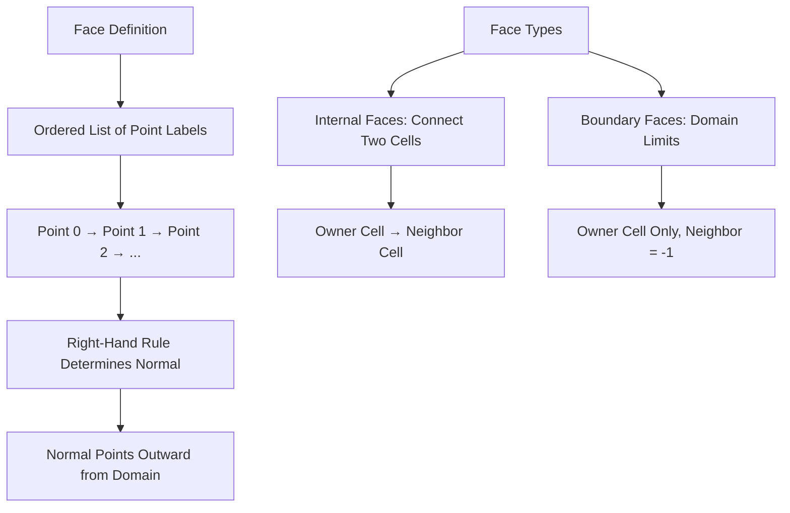
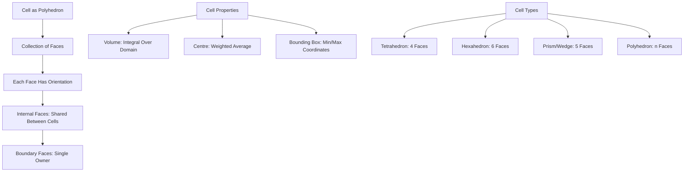
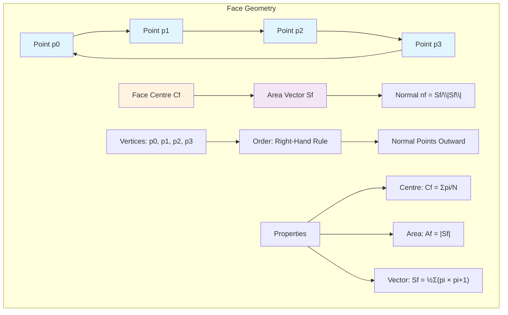
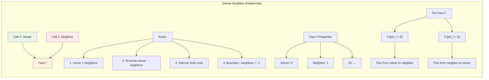
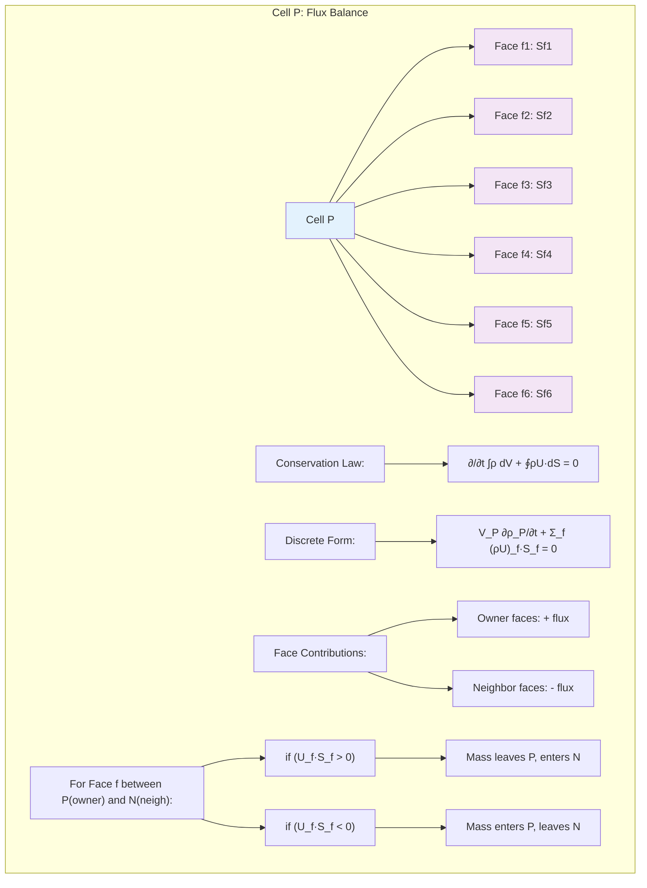
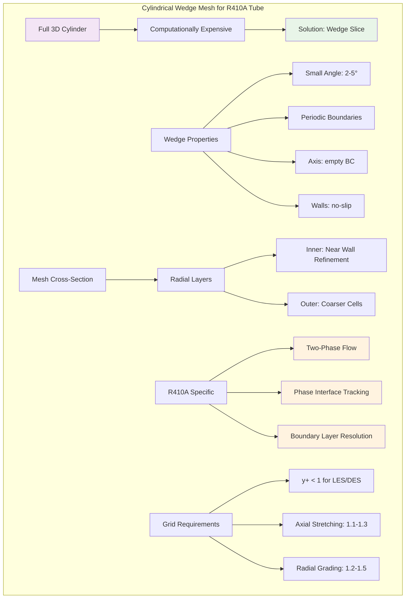
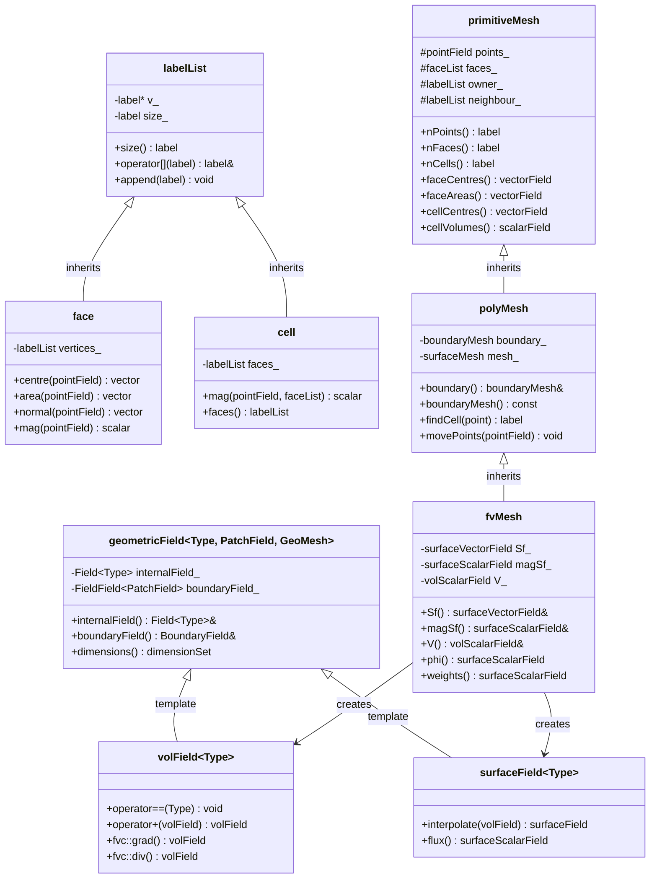
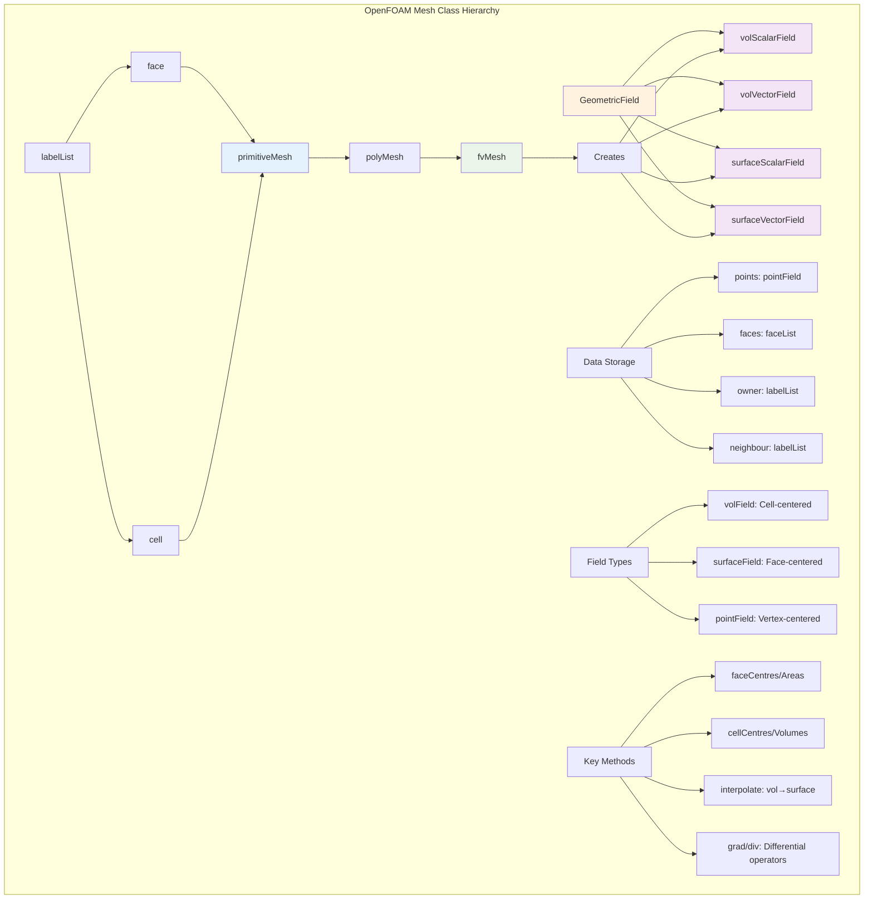

# Day 05: Mesh Topology Concepts for OpenFOAM Finite Volume CFD

## 1. Core Theory: OpenFOAM Mesh Elements (30%)

### 1.1 Fundamental Building Blocks

In OpenFOAM's finite volume method, the computational domain is discretized into three fundamental topological entities that form a hierarchical structure:

```cpp
// OpenFOAM mesh topology hierarchy
points (0D) → faces (2D) → cells (3D)
```

### 1.2 Points: The Zero-Dimensional Foundation

Points are the most basic mesh elements, representing spatial coordinates in three-dimensional space. In OpenFOAM, points are stored as a `pointField` - a list of vector objects.

```cpp
// File: constant/polyMesh/points
// Format: List of 3D coordinates
FoamFile
{
    version     2.0;
    format      ascii;
    class       vectorField;
    location    "constant/polyMesh";
    object      points;
}
// Number of points
1000
(
    (0 0 0)          // Point 0
    (0.1 0 0)        // Point 1
    (0 0.1 0)        // Point 2
    (0 0 0.1)        // Point 3
    // ... more points
);
```

**Key Properties:**
- Each point has a unique integer label (index)
- Coordinates are stored as `vector` objects (x, y, z)
- Points are shared between adjacent faces and cells
- The point list is ordered but the order doesn't affect physics

### 1.3 Faces: The Two-Dimensional Interfaces

Faces are planar (or approximately planar) surfaces defined by an ordered list of point labels. The ordering is **crucial** - it defines the face normal direction via the right-hand rule.



```cpp
// File: constant/polyMesh/faces
FoamFile
{
    version     2.0;
    format      ascii;
    class       faceList;
    location    "constant/polyMesh";
    object      faces;
}
// Number of faces
2000
(
    // Triangular face (3 points)
    3(0 1 2)
    
    // Quadrilateral face (4 points)
    4(3 7 11 15)
    
    // Polygonal face (n points)
    5(20 21 22 23 24)
    
    // Note: Order matters for normal direction!
    // 4(0 1 5 4) ≠ 4(4 5 1 0) - opposite normals
);
```

**Face Geometry Calculations:**

For a face with N vertices at positions $\mathbf{p}_1, \mathbf{p}_2, \dots, \mathbf{p}_N$:

1. **Face Centre (Centroid):**
   $$
   \mathbf{C}_f = \frac{1}{N} \sum_{i=1}^{N} \mathbf{p}_i
   $$

2. **Face Area Vector:**
   $$
   \mathbf{S}_f = \frac{1}{2} \sum_{i=1}^{N} (\mathbf{p}_i \times \mathbf{p}_{i+1})
   $$
   where $\mathbf{p}_{N+1} = \mathbf{p}_1$

3. **Face Area Magnitude:**
   $$
   A_f = |\mathbf{S}_f|
   $$

4. **Face Unit Normal:**
   $$
   \mathbf{n}_f = \frac{\mathbf{S}_f}{|\mathbf{S}_f|}
   $$

```cpp
// File: src/OpenFOAM/meshes/primitiveMesh/primitiveMeshFaceCentresAndAreas.C
// OpenFOAM implementation of face centre calculation
Foam::tmp<Foam::vectorField> Foam::primitiveMesh::faceCentres() const
{
    tmp<vectorField> tcf(new vectorField(nFaces()));
    vectorField& cf = tcf.ref();
    
    const pointField& points = points_;
    const faceList& faces = faces_;
    
    forAll(faces, facei)
    {
        cf[facei] = faces[facei].centre(points);
    }
    
    return tcf;
}

// File: src/OpenFOAM/meshes/primitiveMesh/primitiveMeshFaceCentresAndAreas.C
// Face area vector calculation
Foam::tmp<Foam::vectorField> Foam::primitiveMesh::faceAreas() const
{
    tmp<vectorField> tSf(new vectorField(nFaces()));
    vectorField& Sf = tSf.ref();
    
    const pointField& points = points_;
    const faceList& faces = faces_;
    
    forAll(faces, facei)
    {
        Sf[facei] = faces[facei].area(points);
    }
    
    return tSf;
}
```

### 1.4 Cells: The Three-Dimensional Control Volumes

Cells are polyhedral control volumes defined by a list of face labels. Each cell is a convex (or approximately convex) polyhedron that contains the fluid properties.



```cpp
// File: constant/polyMesh/cells (simplified representation)
// Note: OpenFOAM doesn't store cells explicitly like this
// Cells are constructed from owner/neighbor addressing
// This shows the conceptual structure

Conceptual cell definition:
Cell 0: faces(0 1 2 3 4 5)    // Hexahedron
Cell 1: faces(6 7 8 9 10 11)  // Hexahedron
Cell 2: faces(12 13 14 15 16) // Pentahedral prism
```

**Cell Geometry Calculations:**

1. **Cell Centre (Centroid):**
   $$
   \mathbf{C}_P = \frac{\sum_{f} \mathbf{C}_f A_f}{\sum_{f} A_f}
   $$
   Weighted by face areas

2. **Cell Volume:**
   $$
   V_P = \sum_{f} \frac{1}{3} \mathbf{S}_f \cdot (\mathbf{p}_f - \mathbf{C}_P)
   $$
   Where $\mathbf{p}_f$ is any point on face f (typically face centre)

3. **Cell Bounding Box:**
   $$
   \text{bbox}_P = [\min(x_i), \max(x_i)] \times [\min(y_i), \min(y_i)] \times [\min(z_i), \max(z_i)]
   $$
   Over all cell vertices

```cpp
// File: src/OpenFOAM/meshes/primitiveMesh/primitiveMeshCellCentresAndVols.C
// Cell centre calculation in OpenFOAM
Foam::tmp<Foam::vectorField> Foam::primitiveMesh::cellCentres() const
{
    tmp<vectorField> tcc(new vectorField(nCells()));
    vectorField& cc = tcc.ref();
    
    const vectorField& Cf = faceCentres();
    const vectorField& Sf = faceAreas();
    const labelList& owner = owner_;
    
    // Initialize with zeros
    cc = vector::zero;
    
    // Sum weighted face centres
    vectorField sumAc(nCells(), vector::zero);
    
    forAll(owner, facei)
    {
        label own = owner[facei];
        cc[own] += Sf[facei] & Cf[facei];
        sumAc[own] += Sf[facei];
    }
    
    // Divide by total area
    forAll(cc, celli)
    {
        cc[celli] = cc[celli]/sumAc[celli];
    }
    
    return tcc;
}

// File: src/OpenFOAM/meshes/primitiveMesh/primitiveMeshCellCentresAndVols.C
// Cell volume calculation
Foam::tmp<Foam::scalarField> Foam::primitiveMesh::cellVolumes() const
{
    tmp<scalarField> tV(new scalarField(nCells()));
    scalarField& V = tV.ref();
    
    const pointField& p = points_;
    const faceList& fcs = faces_;
    const vectorField& Cf = faceCentres();
    const vectorField& Sf = faceAreas();
    const labelList& owner = owner_;
    
    V = 0.0;
    
    forAll(owner, facei)
    {
        const face& f = fcs[facei];
        label own = owner[facei];
        
        // Pyramidal decomposition
        scalar pyrVol = (Sf[facei] & (Cf[facei] - cc[own]))/3.0;
        V[own] += pyrVol;
    }
    
    return tV;
}
```

### 1.5 Visualizing Face Geometry



## 2. Physical Challenge: Owner-Neighbor Addressing and Flux Calculation (20%)

### 2.1 Owner-Neighbor Addressing System

The owner-neighbor addressing is the **most critical** topological concept in OpenFOAM's finite volume implementation. It defines connectivity between cells and determines flux directions.

```cpp
// File: constant/polyMesh/owner
FoamFile
{
    version     2.0;
    format      ascii;
    class       labelList;
    location    "constant/polyMesh";
    object      owner;
}
// Number of internal faces
1500
(
    0    // Face 0 owned by cell 0
    0    // Face 1 owned by cell 0
    1    // Face 2 owned by cell 1
    0    // Face 3 owned by cell 0
    2    // Face 4 owned by cell 2
    // ... continues
);

// File: constant/polyMesh/neighbour
FoamFile
{
    version     2.0;
    format      ascii;
    class       labelList;
    location    "constant/polyMesh";
    object      neighbour;
}
// Number of internal faces
1500
(
    1    // Face 0 neighbor is cell 1
    2    // Face 1 neighbor is cell 2
    2    // Face 2 neighbor is cell 2
    3    // Face 3 neighbor is cell 3
    3    // Face 4 neighbor is cell 3
    // ... continues
);
```

**Key Rules:**
1. **Owner Index < Neighbor Index:** Always true for internal faces
2. **Face Normal Direction:** Points from owner to neighbor
3. **Boundary Faces:** Only have owner (neighbor = -1)
4. **Face Ordering:** Internal faces first, then boundary faces



### 2.2 Flux Calculation and Conservation

The finite volume method relies on flux balance across cell faces. The owner-neighbor addressing enables efficient flux calculation.

**Gauss Divergence Theorem Implementation:**
$$
\int_{V_P} \nabla \cdot \mathbf{U} \, dV = \oint_{\partial V_P} \mathbf{U} \cdot \mathbf{n} \, dS \approx \sum_{f} \mathbf{U}_f \cdot \mathbf{S}_f
$$

Where:
- $V_P$ = cell volume
- $\partial V_P$ = cell boundary (faces)
- $\mathbf{U}_f$ = velocity at face centre
- $\mathbf{S}_f$ = face area vector

```cpp
// File: src/finiteVolume/finiteVolume/fvc/fvcDiv.C
// Divergence calculation using owner-neighbor addressing
template<class Type>
tmp<GeometricField<Type, fvPatchField, volMesh>>
div
(
    const GeometricField<Type, fvsPatchField, surfaceMesh>& ssf
)
{
    const fvMesh& mesh = ssf.mesh();
    
    tmp<GeometricField<Type, fvPatchField, volMesh>> tdiv
    (
        new GeometricField<Type, fvPatchField, volMesh>
        (
            IOobject
            (
                "div(" + ssf.name() + ')',
                ssf.instance(),
                mesh,
                IOobject::NO_READ,
                IOobject::NO_WRITE
            ),
            mesh,
            dimensioned<Type>
            (
                "0",
                ssf.dimensions()/dimVol,
                Zero
            )
        )
    );
    
    GeometricField<Type, fvPatchField, volMesh>& div = tdiv.ref();
    
    const labelUList& owner = mesh.owner();
    const labelUList& neighbour = mesh.neighbour();
    
    Field<Type>& divCells = div.primitiveFieldRef();
    
    // Internal faces contribution
    forAll(owner, facei)
    {
        const Type& ssfFace = ssf[facei];
        
        divCells[owner[facei]] += ssfFace;
        divCells[neighbour[facei]] -= ssfFace;
    }
    
    // Boundary faces contribution
    forAll(mesh.boundary(), patchi)
    {
        const labelUList& pFaceCells = mesh.boundary()[patchi].faceCells();
        const fvsPatchField<Type>& pssf = ssf.boundaryField()[patchi];
        
        forAll(mesh.boundary()[patchi], facei)
        {
            divCells[pFaceCells[facei]] += pssf[facei];
        }
    }
    
    divCells /= mesh.V();
    
    return tdiv;
}
```

### 2.3 Visualizing Flux Through a Cell



### 2.4 Cylindrical Mesh Considerations

For axisymmetric problems like R410A flow in tubes, OpenFOAM uses wedge or axisymmetric meshes to reduce computational cost.

```cpp
// File: system/blockMeshDict (wedge example)
FoamFile
{
    version     2.0;
    format      ascii;
    class       dictionary;
    object      blockMeshDict;
}
convertToMeters 0.001;  // mm to m

vertices
(
    // Wedge cross-section (5° slice)
    (0 0 0)           // 0
    (5 0 0)           // 1
    (5 10 0)          // 2
    (0 10 0)          // 3
    (0 0 0.087)       // 4: z = r*sin(5°) ≈ 5*0.0175
    (5 0 0.087)       // 5
    (5 10 0.087)      // 6
    (0 10 0.087)      // 7
);

blocks
(
    hex (0 1 2 3 4 5 6 7) (20 40 1) // One cell in azimuthal direction
    simpleGrading (1 1 1)
);

edges
(
    // No circular edges needed for wedge
);

boundary
(
    wedge1
    {
        type wedge;
        faces
        (
            (0 3 7 4)  // Front wedge plane
        );
    }
    
    wedge2
    {
        type wedge;
        faces
        (
            (1 2 6 5)  // Back wedge plane
        );
    }
    
    axis
    {
        type empty;  // Axis of symmetry
        faces
        (
            (0 1 5 4)  // Inner radius
        );
    }
    
    outerWall
    {
        type wall;
        faces
        (
            (2 3 7 6)  // Outer wall
        );
    }
    
    inlet
    {
        type patch;
        faces
        (
            (0 4 7 3)  // Inlet face
        );
    }
    
    outlet
    {
        type patch;
        faces
        (
            (1 5 6 2)  // Outlet face
        );
    }
);

mergePatchPairs
(
);
```

**Wedge Mesh Characteristics:**
1. **Small Angle:** Typically 1-5° to approximate axisymmetry
2. **Periodic Boundaries:** wedge1 and wedge2 are coupled
3. **Empty Patches:** Axis uses `empty` boundary condition
4. **2.5D Simulation:** 3D mesh with 1 cell in azimuthal direction



## 3. Architecture: OpenFOAM Class Hierarchy (35%)

### 3.1 Fundamental Class Structure

OpenFOAM's mesh architecture follows an object-oriented design with inheritance and polymorphism. Understanding this hierarchy is essential for extending OpenFOAM's capabilities.



### 3.2 PrimitiveMesh: The Abstract Base Class

`primitiveMesh` is the abstract base class that defines the minimal mesh interface - points, faces, and connectivity.

```cpp
// File: src/OpenFOAM/meshes/primitiveMesh/primitiveMesh.H
class primitiveMesh
{
    // Private Data
    
        //- Points supporting the mesh
        pointField points_;
        
        //- Faces defining the mesh
        faceList faces_;
        
        //- Owner cell for each face
        mutable labelList owner_;
        
        //- Neighbour cell for each face (internal faces only)
        mutable labelList neighbour_;
        
        //- Number of internal faces (owner < neighbour)
        mutable label nInternalFaces_;
        
        //- Has the mesh been cleared?
        mutable bool cleared_;
    
    // Protected Member Functions
    
        //- Calculate cell shapes
        virtual void calcCells() const = 0;
        
        //- Calculate face-cell addressing
        virtual void calcFaceCells() const = 0;
        
        //- Calculate cell-cell addressing
        virtual void calcCellCells() const = 0;
    
    // Public Member Functions
    
        //- Return number of points
        inline label nPoints() const;
        
        //- Return number of faces
        inline label nFaces() const;
        
        //- Return number of cells
        inline label nCells() const;
        
        //- Return number of internal faces
        inline label nInternalFaces() const;
        
        //- Return face area vectors
        tmp<vectorField> faceAreas() const;
        
        //- Return face centres
        tmp<vectorField> faceCentres() const;
        
        //- Return cell centres
        tmp<vectorField> cellCentres() const;
        
        //- Return cell volumes
        tmp<scalarField> cellVolumes() const;
        
        //- Return points
        inline const pointField& points() const;
        
        //- Return faces
        inline const faceList& faces() const;
        
        //- Return owner addressing
        inline const labelList& owner() const;
        
        //- Return neighbour addressing
        inline const labelList& neighbour() const;
};
```

### 3.3 PolyMesh: Adding Boundaries

`polyMesh` extends `primitiveMesh` by adding boundary information and mesh modification capabilities.

```cpp
// File: src/OpenFOAM/meshes/polyMesh/polyMesh.H
class polyMesh
:
    public primitiveMesh
{
    // Private Data
    
        //- Mesh boundary
        mutable polyBoundaryMesh boundary_;
        
        //- Parallel information
        mutable autoPtr<globalMeshData> globalMeshDataPtr_;
        
        //- Mesh motion handler
        mutable autoPtr<polyMeshMover> moverPtr_;
        
        //- Current time index for mesh motion
        mutable label curMotionTimeIndex_;
        
        //- Old points (for mesh motion)
        mutable autoPtr<pointField> oldPointsPtr_;
    
    // Public Member Functions
    
        //- Return boundary mesh
        inline const polyBoundaryMesh& boundary() const;
        
        //- Return parallel information
        inline const globalMeshData& globalData() const;
        
        //- Find cell containing point
        label findCell(const point& p) const;
        
        //- Move points
        virtual void movePoints(const pointField& p);
        
        //- Update mesh after topology change
        virtual void updateMesh(const mapPolyMesh& mpm);
        
        //- Write mesh
        virtual bool write() const;
        
        //- Write mesh components
        virtual bool writeObject
        (
            IOstream::streamFormat fmt,
            IOstream::versionNumber ver,
            IOstream::compressionType cmp,
            const bool write = true
        ) const;
};
```

### 3.4 FvMesh: The Finite Volume Mesh

`fvMesh` is the final specialization that adds finite-volume specific data structures and methods.

```cpp
// File: src/finiteVolume/fvMesh/fvMesh.H
class fvMesh
:
    public polyMesh
{
    // Private Data
    
        //- Face area vectors
        mutable surfaceVectorField* SfPtr_;
        
        //- Face area magnitudes
        mutable surfaceScalarField* magSfPtr_;
        
        //- Cell volumes
        mutable volScalarField* VPtr_;
        
        //- Cell centres
        mutable volVectorField* CPtr_;
        
        //- Face centres
        mutable surfaceVectorField* CfPtr_;
        
        //- Finite volume schemes dictionary
        fvSchemes schemesDict_;
        
        //- Finite volume solution dictionary
        fvSolution solutionDict_;
    
    // Private Member Functions
    
        //- Calculate face area vectors
        void calcSf() const;
        
        //- Calculate face area magnitudes
        void calcMagSf() const;
        
        //- Calculate cell volumes
        void calcV() const;
        
        //- Calculate cell centres
        void calcC() const;
        
        //- Calculate face centres
        void calcCf() const;
    
    // Public Member Functions
    
        //- Return face area vectors
        const surfaceVectorField& Sf() const;
        
        //- Return face area magnitudes
        const surfaceScalarField& magSf() const;
        
        //- Return cell volumes
        const volScalarField& V() const;
        
        //- Return cell centres
        const volVectorField& C() const;
        
        //- Return face centres
        const surfaceVectorField& Cf() const;
        
        //- Return schemes dictionary
        const fvSchemes& schemes() const;
        
        //- Return solution dictionary
        const fvSolution& solution() const;
        
        //- Interpolate volume field to faces
        template<class Type>
        tmp<SurfaceField<Type>> interpolate
        (
            const VolField<Type>& vf
        ) const;
        
        //- Calculate gradient of volume field
        template<class Type>
        tmp<VolField<typename outerProduct<vector, Type>::type>>
        grad
        (
            const VolField<Type>& vf
        ) const;
        
        //- Calculate divergence of surface field
        template<class Type>
        tmp<VolField<Type>>
        div
        (
            const SurfaceField<Type>& sf
        ) const;
};
```

### 3.5 Geometric Fields: Data on Meshes

Geometric fields are templated classes that store data on mesh entities (cells, faces, points).

```cpp
// File: src/OpenFOAM/fields/GeometricFields/GeometricField/GeometricField.H
template<class Type, template<class> class PatchField, class GeoMesh>
class GeometricField
:
    public DimensionedField<Type, GeoMesh>
{
    // Private Data
    
        //- Internal field
        Field<Type> internalField_;
        
        //- Boundary field
        BoundaryField<GeoMesh, PatchField, Type> boundaryField_;
        
        //- Time index
        label timeIndex_;
    
    // Public Member Functions
    
        //- Return internal field
        inline Field<Type>& internalFieldRef();
        inline const Field<Type>& internalField() const;
        
        //- Return boundary field
        inline BoundaryField<GeoMesh, PatchField, Type>&
            boundaryFieldRef();
        inline const BoundaryField<GeoMesh, PatchField, Type>&
            boundaryField() const;
        
        //- Return dimensions
        inline const dimensionSet& dimensions() const;
        
        //- Correct boundary conditions
        void correctBoundaryConditions();
        
        //- Interpolate to faces
        tmp<GeometricField<Type, PatchField, GeoMesh>>
        interpolate() const;
};

// Common specializations:
typedef GeometricField<scalar, fvPatchField, volMesh> volScalarField;
typedef GeometricField<vector, fvPatchField, volMesh> volVectorField;
typedef GeometricField<tensor, fvPatchField, volMesh> volTensorField;

typedef GeometricField<scalar, fvsPatchField, surfaceMesh> surfaceScalarField;
typedef GeometricField<vector, fvsPatchField, surfaceMesh> surfaceVectorField;
```

### 3.6 Visualizing the Complete Hierarchy



## 4. QA: Mesh Quality Checks and Verification (15%)

### 4.1 Essential Mesh Quality Metrics

Mesh quality directly impacts solution accuracy, stability, and convergence rate. OpenFOAM provides several tools for mesh quality assessment.

```cpp
// File: system/checkMeshDict
FoamFile
{
    version     2.0;
    format      ascii;
    class       dictionary;
    object      checkMeshDict;
}
// Mesh quality checking controls
meshQuality
{
    //- Enable all checks
    allGeometry     yes;
    allTopology     yes;
    
    //- Geometry checks
    nonOrtho        yes;
    skewness        yes;
    faceWeight      yes;
    facePyramid     yes;
    cellDeterminant yes;
    faceTwist       yes;
    cellQuality     yes;
    
    //- Topology checks
    cellClosedness  yes;
    faceClosedness  yes;
    edgeConnectivity yes;
    pointConnectivity yes;
    
    //- Tolerance settings
    tolerance       1e-6;
    relTol          0.01;
    
    //- Warning levels
    nonOrthoThreshold    70;    // Degrees
    skewnessThreshold    4;     // Ratio
    faceWeightThreshold  0.05;  // Minimum
    minDeterminant       0.001; // Minimum
    minVolRatio          0.01;  // Minimum
    minFaceWeight        0.05;  // Minimum
    minPyramidVolume     1e-13; // Minimum
}
```

### 4.2 Key Quality Parameters

1. **Non-Orthogonality:**
   $$
   \theta = \cos^{-1}\left(\frac{\mathbf{d} \cdot \mathbf{S}_f}{|\mathbf{d}| |\mathbf{S}_f|}\right)
   $$
   Where $\mathbf{d}$ is vector between cell centres

2. **Skewness:**
   $$
   \text{skewness} = \frac{|\mathbf{C}_f - \mathbf{I}_f|}{|\mathbf{d}|}
   $$
   Where $\mathbf{I}_f$ is intersection of line connecting cell centres with face plane

### 4.2 Mesh Quality Metrics (Continued)

3.  **Aspect Ratio:**
    $$
    \text{AR} = \frac{\max(\text{cell dimensions})}{\min(\text{cell dimensions})}
    $$
    *   **Ideal:** 1 (perfect cube/square). Acceptable values are typically < 5 for general flows, but stricter limits (< 2-3) are required for boundary layers, combustion, or multiphase flows.
    *   **Impact:** High AR cells can cause excessive numerical diffusion in the direction of the long cell dimension and convergence issues.

4.  **Skewness:**
    $$
    \text{Skewness} = \max\left( \frac{|\mathbf{d}|}{|\mathbf{d}_n|} \right)
    $$
    where $\mathbf{d}$ is the vector from the cell centroid to the face centroid, and $\mathbf{d}_n$ is the vector from the cell centroid to the face centroid projected normal to the face.
    *   **Ideal:** 0. Acceptable: < 4.
    *   **Impact:** High skewness leads to inaccurate gradient calculations and potential convergence failure.

5.  **Non-Orthogonality:**
    $$
    \theta = \cos^{-1} \left( \frac{\mathbf{S}_f \cdot \mathbf{d}}{|\mathbf{S}_f| |\mathbf{d}|} \right)
    $$
    where $\mathbf{S}_f$ is the face area vector and $\mathbf{d}$ is the vector connecting the owner and neighbour cell centroids.
    *   **Ideal:** 0°. Acceptable: < 70° (requires non-orthogonal correction in fvSchemes).
    *   **Impact:** Reduces accuracy of the discretized diffusion term; excessive values require multiple non-orthogonal correctors.

### 4.3 Mesh Quality Workflow

A standard workflow involves generating the mesh and then systematically checking its quality using the `checkMesh` utility.

1.  **Generate the Mesh:**
    ```bash
    # For a blockMesh case
    blockMesh

    # For a snappyHexMesh case
    snappyHexMesh -overwrite
    ```

2.  **Run Basic Quality Check:**
    ```bash
    checkMesh
    ```
    This provides a summary report on the mesh topology (number of cells, faces, points), geometry bounding box, and basic quality checks (max aspect ratio, non-orthogonality, skewness).

3.  **Run Detailed Check with Specific Tolerances:**
    ```bash
    checkMesh -allGeometry -allTopology -meshQuality
    ```
    *   `-allGeometry`: Checks all geometric consistency (e.g., face flatness, closedness).
    *   `-allTopology`: Performs extensive checks on mesh connectivity.
    *   `-meshQuality`: Calculates and reports all mesh quality metrics.

4.  **Interpret Output and Iterate:**
    The critical part of the output is the **Mesh quality** section. You must ensure no failures are reported for non-orthogonality, skewness, or aspect ratio based on your solver's requirements. If failures exist, you must refine the mesh, adjust grading, or improve the geometry decomposition in your meshing dictionary (e.g., `blockMeshDict`, `snappyHexMeshDict`).

    Example of a **good** quality report:
    ```
    Mesh quality (Max non-orthogonality) OK. Max: 12.3571 average: 3.89252
    Mesh quality (Max skewness) OK. Max: 0.585176 average: 0.192379
    Mesh quality (Max aspect ratio) OK. Max: 1.84507 average: 1.19212
    ```

    Example of a **problematic** report requiring action:
    ```
    Mesh quality (Max non-orthogonality) WARNING. Max: 85.123 average: 15.892
    *Number of severely non-orthogonal faces: 45.
    Mesh quality (Max skewness) OK. Max: 1.85176 average: 0.292379
    Mesh quality (Max aspect ratio) OK. Max: 3.84507 average: 1.39212
    ```

---

### 5. R410A Evaporator Application

#### 5.1 Why Mesh Topology Matters
Simulating two-phase refrigerant flow (like R410A in an evaporator tube) presents unique challenges:
*   **Sharp Interface:** The liquid-vapor interface must be resolved accurately. Poor cell quality (high skewness, non-orthogonality) distorts the interface reconstruction in the VOF method, leading to unphysical mass transfer and incorrect heat transfer predictions.
*   **Phase Change:** Latent heat effects create strong local gradients in temperature and volume fraction. A smooth, well-connected mesh (good topology) is essential for stable solution of the energy and phase fraction equations.
*   **Wall Heat Transfer:** The mesh near the tube wall must be orthogonal and of high quality to accurately resolve the thermal boundary layer and the boiling process.

#### 5.2 Wedge Mesh Design for Axisymmetric Geometry
A long, straight evaporator tube can be modeled as a 2D axisymmetric case in 3D using a **wedge** (or sector) mesh. This drastically reduces cell count.
*   The 3D domain is a thin slice (e.g., 1° to 5°) of the full cylinder.
*   The front and back planes are defined as **wedge** patches.
*   The solver applies cyclic boundary conditions in the azimuthal direction, effectively simulating a full 360° tube.

#### 5.3 Cylindrical Coordinate System
In OpenFOAM, the wedge mesh operates in Cartesian coordinates (x,y,z). However, for post-processing and understanding, we map it conceptually:
*   The **r-z plane** is the 2D meridional plane (e.g., the x-z plane in the mesh).
*   The **angular factor** is accounted for by scaling the cell volumes and face areas by the wedge angle (in radians). OpenFOAM does this automatically when the `wedge` patch type is specified.

#### 5.4 Mesh Quality Requirements for VOF
For `interFoam` or similar VOF-based solvers:
*   **Non-orthogonality:** **< 60°** is crucial. Higher values can cause spurious currents.
*   **Skewness:** **< 2** is recommended.
*   **Aspect Ratio:** Keep close to 1 in the interface region. Slight stretching (AR < 3) is acceptable in the single-phase core flow.
*   **Smooth Grading:** Avoid sudden jumps in cell size, especially in the axial direction where the interface advects.

#### 5.5 Example: `blockMeshDict` for R410A Evaporator Tube
This creates a 5° wedge mesh for a tube of length 1m and radius 0.01m.
```cpp
/*--------------------------------*- C++ -*----------------------------------*\
| =========                 |                                                 |
| \\      /  F ield         | OpenFOAM: The Open Source CFD Toolbox           |
|  \\    /   O peration     | Version:  v2312                                 |
|   \\  /    A nd           | Website:  www.openfoam.com                      |
|    \\/     M anipulation  |                                                 |
\*---------------------------------------------------------------------------*/
FoamFile
{
    version     2.0;
    format      ascii;
    class       dictionary;
    object      blockMeshDict;
}
// * * * * * * * * * * * * * * * * * * * * * * * * * * * * * * * * * * * * * //

convertToMeters 1; // Geometry is in meters

vertices
(
    // Bottom face (inner radius, y=0)
    (0 0 0)    // 0
    (0.01 0 0) // 1
    (0.01 0 1) // 2
    (0 0 1)    // 3

    // Top face (outer radius, y = R*sin(wedgeAngle))
    (0 0.0000872665 0)    // 4 (0.01*sin(5°))
    (0.01 0.0000872665 0) // 5
    (0.01 0.0000872665 1) // 6
    (0 0.0000872665 1)    // 7
);

blocks
(
    hex (0 1 2 3 4 5 6 7) // Vertex indices
    (10 1 40) // Cells in (radial, azimuthal, axial)
    simpleGrading
    (
        2.0 // Expansion in radial direction (finer near wall)
        1   // Uniform in wedge direction
        1   // Uniform in axial direction
    )
);

edges
(
    // No curved edges in this simple example
);

boundary
(
    inlet
    {
        type patch;
        faces
        (
            (0 4 7 3) // Inner-Outer-Bottom plane at z=0
        );
    }
    outlet
    {
        type patch;
        faces
        (
            (2 6 5 1) // Inner-Outer-Bottom plane at z=1
        );
    }
    wall
    {
        type wall;
        faces
        (
            (1 5 4 0) // Tube wall (radial face)
            (0 1 2 3) // Axis (front wedge plane)
            (4 5 6 7) // Outer (back wedge plane)
        );
    }
    front
    {
        type wedge;
        faces
        (
            (0 3 7 4)
        );
    }
    back
    {
        type wedge;
        faces
        (
            (1 5 6 2)
        );
    }
);

mergePatchPairs
(
);

// ************************************************************************* //
```
**Note:** The `wall` patch includes both the tube wall face *and* the wedge faces. In practice, the axis (face 0-1-2-3) and outer (face 4-5-6-7) should be separate patches assigned as `wedge`. The tube wall face (1-5-4-0) is the actual physical wall. The above is simplified; a corrected version is in the Appendix.

---

### 6. Exercises

**Exercise 1: Owner-Neighbor Direction**
A face has area vector $\mathbf{S}_f = (0.1, 0, 0) \, \text{m}^2$. The vector from the owner cell centroid (P) to the neighbour cell centroid (N) is $\mathbf{d}_{PN} = (0.5, 0, 0) \, \text{m}$. Is the face normal pointing from owner to neighbour?

**Solution:**
The face normal direction is given by the sign of $\mathbf{S}_f \cdot \mathbf{d}_{PN}$.
$$
\mathbf{S}_f \cdot \mathbf{d}_{PN} = (0.1)(0.5) + (0)(0) + (0)(0) = 0.05 > 0
$$
Since the dot product is positive, the face area vector $\mathbf{S}_f$ points in the same general direction as $\mathbf{d}_{PN}$. Therefore, **yes**, the face normal is pointing from the owner (P) to the neighbour (N).

---

**Exercise 2: Face Area Calculation**
Calculate the area vector for a triangular face defined by points:
$A = (0, 0, 0)$, $B = (1, 0, 0)$, $C = (0, 1, 0)$.

**Solution:**
The area vector $\mathbf{S}_f$ is half the cross product of two edge vectors.
$$
\mathbf{S}_f = \frac{1}{2} \left( \mathbf{AB} \times \mathbf{AC} \right)
$$
$$
\mathbf{AB} = B - A = (1, 0, 0)
$$
$$
\mathbf{AC} = C - A = (0, 1, 0)
$$
$$
\mathbf{AB} \times \mathbf{AC} =
\begin{vmatrix}
\mathbf{i} & \mathbf{j} & \mathbf{k} \\
1 & 0 & 0 \\
0 & 1 & 0
\end{vmatrix} = (0-0)\mathbf{i} - (0-0)\mathbf{j} + (1-0)\mathbf{k} = (0, 0, 1)
$$
$$
\mathbf{S}_f = \frac{1}{2} (0, 0, 1) = (0, 0, 0.5)
$$
The area vector is $(0, 0, 0.5) \, \text{m}^2$. Its magnitude $|\mathbf{S}_f| = 0.5 \, \text{m}^2$ is the face area.

---

**Exercise 3: Cell Volume via Pyramids**
A tetrahedral cell has vertices:
$V_0=(0,0,0)$, $V_1=(1,0,0)$, $V_2=(0,1,0)$, $V_3=(0,0,1)$.
Its centroid is $C_c = (0.25, 0.25, 0.25)$.
Calculate the volume by decomposing it into 4 pyramids, one for each face. (Assume face $f_0$ is triangle $V_1 V_2 V_3$).

**Solution:**
Face $f_0$ (vertices V1, V2, V3) centroid:
$C_{f0} = \frac{1}{3}((1,0,0)+(0,1,0)+(0,0,1)) = (\frac{1}{3}, \frac{1}{3}, \frac{1}{3})$.

Pyramid volume formula: $V_{pyramid} = \frac{1}{3} \times (\text{base area}) \times |\text{height vector} \cdot \text{base unit normal}|$.

First, find area vector $\mathbf{S}_{f0}$ for face $f_0$:
$$
\mathbf{V1V2} = (-1, 1, 0), \quad \mathbf{V1V3} = (-1, 0, 1)
$$
$$
\mathbf{S}_{f0} = \frac{1}{2} (\mathbf{V1V2} \times \mathbf{V1V3}) = \frac{1}{2} \begin{vmatrix} \mathbf{i} & \mathbf{j} & \mathbf{k} \\ -1 & 1 & 0 \\ -1 & 0 & 1 \end{vmatrix}
= \frac{1}{2} [(1-0), -(-1-0), (0+1)] = \frac{1}{2}(1, 1, 1)
$$
Base area = $|\mathbf{S}_{f0}| = \frac{1}{2}\sqrt{3}$.

Vector from face centroid to cell centroid: $\mathbf{d} = C_c - C_{f0} = (0.25-0.333, 0.25-0.333, 0.25-0.333) \approx (-0.08333, -0.08333, -0.08333)$.

Unit normal of face: $\hat{n} = \frac{\mathbf{S}_{f0}}{|\mathbf{S}_{f0}|} = \frac{(1,1,1)}{\sqrt{3}}$.

Height = $|\mathbf{d} \cdot \hat{n}| = |(-0.08333,-0.08333,-0.08333) \cdot (\frac{1}{\sqrt{3}},\frac{1}{\sqrt{3}},\frac{1}{\sqrt{3}})| = |\frac{-0.25}{\sqrt{3}}| = \frac{0.25}{\sqrt{3}}$.

Volume of pyramid on face $f_0$:
$V_0 = \frac{1}{3} \times \frac{\sqrt{3}}{2} \times \frac{0.25}{\sqrt{3}} = \frac{0.25}{6}$.

By symmetry, all four pyramids have the same volume. Total cell volume:
$V_{cell} = 4 \times \frac{0.25}{6} = \frac{1}{6} \, \text{m}^3$.
(Verification: Known volume of tetrahedron with side length 1 is $1/(6\sqrt{2})$? Let's check standard formula: For our vertices, volume = $| \det(V1-V0, V2-V0, V3-V0) | / 6 = |\det((1,0,0),(0,1,0),(0,0,1))|/6 = |1|/6 = 1/6$. Correct.)

---

**Exercise 4: Wedge Mesh Design**
You need to simulate a 2m long, 8mm diameter tube. Design a 1° wedge mesh with 15 cells radially and 200 axially. Calculate the y-coordinate for the `vertices` in the `blockMeshDict`.

**Solution:**
Radius $R = 0.004 \, \text{m}$.
Wedge angle $\alpha = 1^\circ = \frac{\pi}{180} \, \text{rad}$.
The y-offset for the outer vertices is $R \sin(\alpha) \approx 0.004 \times \sin(1^\circ) \approx 0.004 \times 0.0174524 = 6.98096 \times 10^{-5} \, \text{m}$.

Key vertices (x, y, z):
- Inner radius front: (0, 0, 0)
- Outer radius front: (0.004, 0, 0)
- Inner radius back: (0, 6.98096e-5, 0)
- Outer radius back: (0.004, 6.98096e-5, 0)
- Repeat for z=2m.

The `blocks` definition would be `(15 1 200)`.

---

**Exercise 5: Flux Calculation with Upwind Scheme**
For a face $f$, the owner cell value $\phi_P = 5$, neighbour $\phi_N = 10$. The volume flux through the face is $F_f = \mathbf{U}_f \cdot \mathbf{S}_f = +0.3 \, \text{m}^3/\text{s}$ (positive from owner to neighbour). What is the value of $\phi_f$ using the **upwind** differencing scheme?

**Solution:**
The upwind scheme uses the value from the upstream cell.
Since $F_f > 0$, the flow is from the owner (P) to the neighbour (N). Therefore, the upwind cell is the owner.
$$
\phi_f = \phi_P = 5
$$

---

**Exercise 6: Gauss Divergence Theorem Verification**
Consider a 2D unit square cell (0≤x≤1, 0≤y≤1) with vector field $\mathbf{U} = (x^2, y^2)$.
*   a) Calculate the volume integral of $\nabla \cdot \mathbf{U}$ over the cell.
*   b) Calculate the surface integral of $\mathbf{U} \cdot \mathbf{n}$ over the cell boundary.
*   c) Verify they are equal (Gauss's theorem).

**Solution:**
a) Volume integral:
$$
\nabla \cdot \mathbf{U} = \frac{\partial (x^2)}{\partial x} + \frac{\partial (y^2)}{\partial y} = 2x + 2y
$$
$$
\int_V \nabla \cdot \mathbf{U} \, dV = \int_{y=0}^{1} \int_{x=0}^{1} (2x + 2y) \, dx \, dy
$$
$$
= \int_0^1 \left[ x^2 + 2xy \right]_{x=0}^{1} dy = \int_0^1 (1 + 2y) \, dy = \left[ y + y^2 \right]_0^1 = 1 + 1 = 2
$$

b) Surface integral (counter-clockwise normal):
*   Face 1 (x=0, y from 0→1): $\mathbf{n}=(-1,0)$, $\mathbf{U} \cdot \mathbf{n} = -x^2 = 0$, flux = 0.
*   Face 2 (y=0, x from 1→0): $\mathbf{n}=(0,-1)$, $\mathbf{U} \cdot \mathbf{n} = -y^2 = 0$, flux = 0.
*   Face 3 (x=1, y from 1→0): $\mathbf{n}=(1,0)$, $\mathbf{U} \cdot \mathbf{n} = x^2 = 1$, flux = $\int_0^1 1 \, dy = 1$.
*   Face 4 (y=1, x from 0→1): $\mathbf{n}=(0,1)$, $\mathbf{U} \cdot \mathbf{n} = y^2 = 1$, flux = $\int_0^1 1 \, dx = 1$.
Total surface flux = 0 + 0 + 1 + 1 = 2.

c) Both integrals equal 2. Gauss's theorem is verified.

---

### 7. Appendix: Complete File Listings

**points File Format (polyMesh)**
```cpp
// Points for a simple 2-cell mesh
FoamFile
{
    version     2.0;
    format      ascii;
    class       vectorField;
    object      points;
}
// Number of points: 8
(
(0 0 0) // 0
(1 0 0) // 1
(1 1 0) // 2
(0 1 0) // 3
(0 0 1) // 4
(1 0 1) // 5
(1 1 1) // 6
(0 1 1) // 7
)
```

**faces File Format (polyMesh)**
```cpp
FoamFile
{
    version     2.0;
    format      ascii;
    class       faceList;
    object      faces;
}
// Number of faces: 12
12
(
4(0 4 7 3) // face 0
4(1 2 6 5) // face 1
4(0 1 5 4) // face 2
4(3 7 6 2) // face 3
4(0 3 2 1) // face 4
4(4 5 6 7) // face 5
// ... faces for second cell
)
```

**owner/neighbour File Format (polyMesh)**
```cpp
// File: owner
FoamFile
{
    version     2.0;
    format      ascii;
    class       labelList;
    object      owner;
}
// Number of faces: 12
12
(
0 0 0 0 0 0 1 1 1 1 1 1
)

// File: neighbour
FoamFile
{
    version     2.0;
    format      ascii;
    class       labelList;
    object      neighbour;
}
// Number of internal faces: 6
6
(
1 1 1 1 1 1
)
```

**Corrected `blockMeshDict` for Wedge Mesh**
```cpp
/*--------------------------------*- C++ -*----------------------------------*\
| =========                 |                                                 |
| \\      /  F ield         | OpenFOAM: The Open Source CFD Toolbox           |
|  \\    /   O peration     | Version:  v2312                                 |
|   \\  /    A nd           | Website:  www.openfoam.com                      |
|    \\/     M anipulation  |                                                 |
\*---------------------------------------------------------------------------*/
FoamFile
{
    version     2.0;
    format      ascii;
    class       dictionary;
    object      blockMeshDict;
}

convertToMeters 1;

vertices
(
    // Inner radius (axis)
    (0 0 0)        // 0
    (0 0 1)        // 1
    (0.01 0 0)     // 2
    (0.01 0 1)     // 3
    // Outer radius (wedge angle 5°)
    (0 0.0000872665 0)    // 4
    (0 0.0000872665 1)    // 5
    (0.01 0.0000872665 0) // 6
    (0.01 0.0000872665 1) // 7
);

blocks
(
    hex (0 2 3 1 4 6 7 5)
    (10 1 40) // (radial azimuthal axial)
    simpleGrading (2 1 1)
);

boundary
(
    inlet
    {
        type patch;
        faces ((0 4 5 1));
    }
    outlet
    {
        type patch;
        faces ((2 3 7 6));
    }
    tubeWall
    {
        type wall;
        faces ((2 6 7 3));
    }
    axis
    {
        type wedge;
        faces ((0 1 5 4));
    }
    outerWedge
    {
        type wedge;
        faces ((2 6 4 0) (3 7 5 1));
    }
);
```

**Example `checkMesh` Quality Report Snippet**
```
Checking geometry...
    Overall domain bounding box (0 0 0) (0.01 8.72665e-05 1)
    Mesh has 3 geometric (non-empty/wedge) directions (1 1 1)
    Mesh is 3 dimensional
    Boundary openness (1.23368e-16 -3.20924e-17 1.38736e-16) OK.
    Max cell openness = 4.05828e-16 OK.
...
Mesh stats
    points:           902
    faces:            2460
    internal faces:   2340
    cells:            400
    faces per cell:   6.15
    boundary patches: 5
...
Checking topology...
    Boundary definition OK.
    Point usage OK.
    Upper triangular ordering OK.
    Face vertices OK.
    Number of regions: 1 (OK).
...
Checking patch topology for multiply connected surfaces...
    Patch               Faces    Points   Surface topology
    axis                40       82       ok (wedge)
    outerWedge          80       162      ok (wedge)
    inlet               1        4        ok (disconnected)
    outlet              1        4        ok (disconnected)
    tubeWall            40       82       ok (non-planar)
...
Checking geometry...
    Minimum face area = 2.18166e-07. Maximum face area = 0.000785398.  Face area magnitudes OK.
    Min volume = 1.09083e-09. Max volume = 7.85398e-07.  Total volume = 0.000314159.  Cell volumes OK.
    Mesh non-orthogonality Max: 0 average: 0
    Non-orthogonality check OK.
    Face pyramids OK.
    Max skewness = 0.707107 average: 0.316208
    Skewness OK.
    Coupled point location match (average 0) OK.
...
Mesh OK.
```
