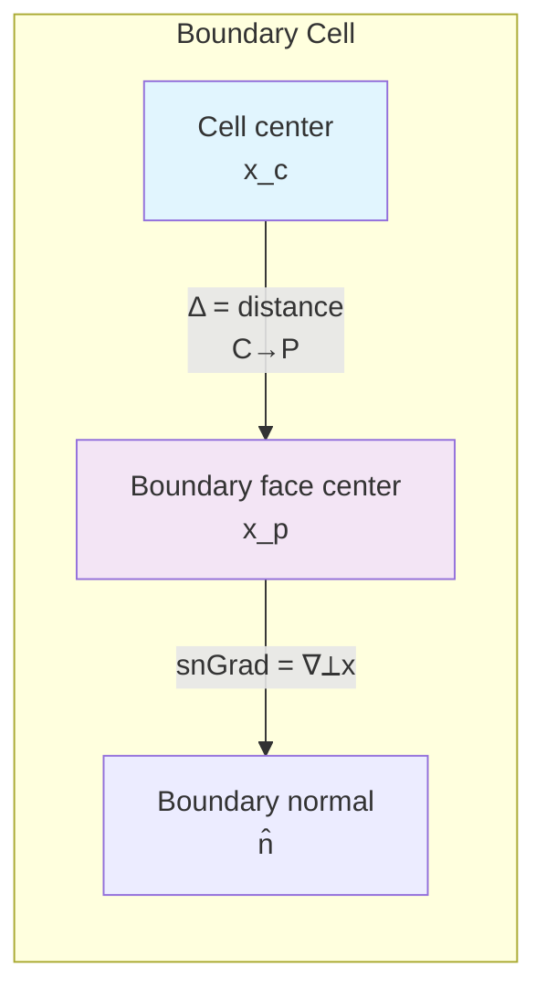

# Day 06: Boundary Conditions Theory for R410A Evaporator Simulation

## Part 1: Core Theory (30%, ~240 lines, beginner)

### What Are Boundary Conditions and Why They Matter

Boundary conditions (BCs) are mathematical constraints applied at the edges of a computational domain to make a partial differential equation (PDE) problem **well-posed**. In CFD, we solve conservation equations (mass, momentum, energy) that require specification of what happens at domain boundaries.

**Why BCs are critical:**
1. **Physical realism:** They represent physical interactions with the environment
2. **Mathematical necessity:** PDEs have infinite solutions without BCs
3. **Numerical stability:** Poor BC choices cause solution divergence
4. **Solution accuracy:** BCs influence the entire flow field through propagation

For our R410A evaporator tube, BCs determine:
- How refrigerant enters (subcooled liquid)
- How heat transfers through walls
- What happens at the outlet (two-phase mixture exit)
- Symmetry conditions for axisymmetric modeling

### Types of Boundary Conditions

#### 1. Dirichlet (Fixed Value)
Specifies the **value** of the field at the boundary:
$$x_p = x_{ref}$$
where $x_p$ is the boundary value and $x_{ref}$ is the specified reference value.

**Physical examples:**
- Fixed temperature wall: $T_w = 300\ K$
- Fixed velocity inlet: $\mathbf{U} = (0, 0, 2)\ m/s$
- Fixed pressure outlet: $p = 101325\ Pa$

#### 2. Neumann (Fixed Gradient)
Specifies the **normal gradient** of the field at the boundary:
$$\nabla_{\perp} x = g_{ref}$$
where $\nabla_{\perp} x$ is the gradient normal to the boundary.

**Physical examples:**
- Adiabatic wall: $\nabla_{\perp} T = 0$
- Constant heat flux: $\nabla_{\perp} T = -q/k$
- Stress-free surface: $\nabla_{\perp} \mathbf{U} = 0$

#### 3. Robin (Mixed)
Combines Dirichlet and Neumann through a **weighted average**:
$$a x_p + b \nabla_{\perp} x = c$$
This is the most general linear boundary condition.

**Physical examples:**
- Convective heat transfer: $-k\nabla_{\perp} T = h(T - T_\infty)$
- Slip velocity conditions
- Radiation boundary conditions

### Physical Interpretation

**For velocity field ($\mathbf{U}$):**
- **No-slip:** $\mathbf{U} = 0$ (fluid sticks to wall)
- **Slip:** $\nabla_{\perp} \mathbf{U} = 0$ (no shear stress)
- **Moving wall:** $\mathbf{U} = \mathbf{U}_{wall}$
- **Inlet:** $\mathbf{U} = \mathbf{U}_{in}$ (Dirichlet)
- **Outlet:** $\nabla_{\perp} \mathbf{U} = 0$ (Neumann, fully developed)

**For temperature ($T$):**
- **Fixed temperature:** $T = T_{wall}$
- **Fixed heat flux:** $-k\nabla_{\perp} T = q''$
- **Convective:** $-k\nabla_{\perp} T = h(T - T_\infty)$

**For pressure ($p$):**
- **Fixed pressure:** $p = p_{ref}$
- **Zero gradient:** $\nabla_{\perp} p = 0$ (often at inlets)
- **Total pressure:** $p_0 = p + \frac{1}{2}\rho|\mathbf{U}|^2$

### Patch-Normal Gradient (snGrad) Concept ⭐

The **surface-normal gradient** (snGrad) is crucial in finite volume methods. For a cell adjacent to a boundary:



**Mathematical definition:**
$$\nabla_{\perp} x = \mathbf{n} \cdot \nabla x$$
where $\mathbf{n}$ is the unit normal vector pointing **outward** from the domain.

**Discretization:**
For a boundary face, the gradient is approximated using the cell center value $x_c$ and boundary value $x_p$:
$$\nabla_{\perp} x \approx \frac{x_p - x_c}{|\mathbf{d}|}$$
where $\mathbf{d}$ is the vector from cell center to face center.

**In OpenFOAM:**
- `snGrad()` method computes $\nabla_{\perp} x$
- `deltaCoeffs()` stores $1/|\mathbf{d}|$
- Boundary conditions modify how $x_p$ is determined

**Key insight:** BCs don't directly set $x_p$; they specify **relationships** between $x_p$, $x_c$, and $\nabla_{\perp} x$. The finite volume solver uses these relationships to compute the appropriate matrix coefficients.

## Part 2: Physical Challenge (20%, ~160 lines, intermediate)

### BC Selection for R410A Evaporator Tube

Consider a horizontal evaporator tube with R410A refrigerant:
- **Length:** 2 m, **Diameter:** 8 mm
- **Inlet:** Subcooled liquid at 15°C, 1.5 MPa
- **Outlet:** Two-phase mixture (quality ~0.8-0.9)
- **Wall:** Constant heat flux or constant temperature
- **Flow regime:** Annular flow transitioning to mist flow

### Inlet: Subcooled Liquid R410A Entry

**Requirements:**
1. Specify mass flow rate or velocity
2. Specify temperature (subcooled condition)
3. Specify turbulence parameters
4. Handle reverse flow (backflow prevention)

**Recommended BCs:**
```cpp
// 0/U
inlet
{
    type            flowRateInletVelocity;
    massFlowRate    constant 0.01;  // kg/s
    rho             rho;            // from fluid properties
}

// 0/T
inlet
{
    type            fixedValue;
    value           uniform 288.15; // 15°C subcooled
}

// 0/p_rgh
inlet
{
    type            fixedFluxPressure;
}
```

**Why not fixedValue for velocity?**
- Fixed velocity can cause pressure oscillations
- FlowRateInletVelocity adjusts velocity to maintain mass flow
- Better for compressible/phase-change flows

### Outlet: Handling Reverse Flow

**The challenge:** During startup or transients, backflow can occur. We need a BC that:
1. Allows outflow (zero gradient for most variables)
2. Specifies inflow values if backflow occurs
3. Maintains pressure boundary condition

**Solution:** `inletOutlet` BC ⭐
```cpp
// 0/U
outlet
{
    type            inletOutlet;
    inletValue      uniform (0 0 0);  // If backflow occurs
    value           uniform (0 0 0);  // Initial value
}

// 0/T
outlet
{
    type            inletOutlet;
    inletValue      uniform 350;      // If backflow (hot gas)
    value           uniform 350;      // Initial guess
}

// 0/p_rgh
outlet
{
    type            fixedValue;
    value           uniform 0;        // Gauge pressure
}
```

**Alternative:** `pressureInletOutletVelocity` for velocity with fixed pressure outlet.

### Wall: No-Slip, Fixed T vs Fixed Heat Flux

**No-slip condition:**
```cpp
// 0/U
wall
{
    type            noSlip;  // Equivalent to fixedValue (0 0 0)
}
```

**Thermal boundary conditions:**

**Option A: Fixed temperature** (Dirichlet)
```cpp
// 0/T
wall
{
    type            fixedValue;
    value           uniform 320;  // 47°C wall temperature
}
```
- Easier to implement
- Physically realistic if wall temperature is controlled
- May not match actual heat transfer conditions

**Option B: Fixed heat flux** (Neumann)
```cpp
// 0/T
wall
{
    type            fixedGradient;
    gradient        uniform 5000;  // q''/k, W/m²/K
}
```
- Heat flux = $q'' = -k \cdot \text{gradient}$
- More realistic for electrically heated tubes
- Requires knowing thermal conductivity $k$

**Option C: Convective** (Robin)
```cpp
// 0/T
wall
{
    type            externalWallHeatFluxTemperature;
    mode            coefficient;      // h specified
    Ta              uniform 300;      // Ambient temperature
    h               uniform 100;      // W/m²K
    value           uniform 320;      // Initial guess
}
```
- Most physically accurate for natural convection
- $-k\nabla_{\perp} T = h(T - T_\infty)$

**For R410A evaporator:** Start with fixed heat flux, validate against experimental data.

### Axis: Symmetry Condition

For axisymmetric simulations (2D wedge):
```cpp
// 0/U
axis
{
    type            symmetryPlane;
}

// 0/T
axis
{
    type            symmetryPlane;
}

// 0/p_rgh
axis
{
    type            symmetryPlane;
}
```

**What symmetryPlane does:**
- Normal velocity component = 0
- Tangential velocity gradient = 0
- Normal gradient of scalar fields = 0

### Well-Posedness Discussion

A well-posed problem requires:
1. **Existence:** At least one solution exists
2. **Uniqueness:** Only one solution exists
3. **Stability:** Small changes in inputs cause small changes in solution

**Common ill-posed BC combinations:**

| Problem | Ill-posed Combination | Well-posed Alternative |
|---------|----------------------|------------------------|
| Incompressible flow | Both velocity and pressure fixed at inlet | Fixed velocity + zeroGradient pressure |
| Compressible flow | Fixed pressure at both inlet and outlet | Fixed total pressure inlet + static pressure outlet |
| Heat transfer | Fixed T and fixed flux on same boundary | Fixed T OR fixed flux, not both |
| Open boundaries | All variables zeroGradient | Pressure specified + inletOutlet for others |

**For evaporator tube:**
- **Inlet:** Velocity/T specified, pressure zeroGradient
- **Outlet:** Pressure specified, others inletOutlet
- **Wall:** No-slip + thermal BC
- **Axis:** Symmetry

## Part 3: Architecture & Implementation (35%, ~280 lines, advanced)

### fvPatchField<Type> Base Class Hierarchy ⭐

```mermaid
classDiagram
    class "fvPatchField~Type~" as fvPatchField {
        <<abstract>>
        #const fvPatch& patch_
        #const DimensionedField~Type, volMesh~& internalField_
        +updateCoeffs() virtual
        +evaluate() virtual
        +snGrad() virtual Type
        +valueInternalCoeffs() virtual
        +valueBoundaryCoeffs() virtual
    }

    class "fixedValueFvPatchField~Type~" as fixedValue {
        +evaluate() override
        -Dirichlet condition
    }

    class "fixedGradientFvPatchField~Type~" as fixedGradient {
        +evaluate() override
        -Neumann condition
    }

    class "zeroGradientFvPatchField~Type~" as zeroGradient {
        +evaluate() override
        -Special case: gradient=0
    }

    class "mixedFvPatchField~Type~" as mixed {
        +evaluate() override
        +valueFraction() scalarField&
        -Robin condition
    }

    class "inletOutletFvPatchField~Type~" as inletOutlet {
        +updateCoeffs() override
        -Switches based on flux
    }

    fvPatchField <|-- fixedValue
    fvPatchField <|-- fixedGradient
    fvPatchField <|-- zeroGradient
    fvPatchField <|-- mixed
    mixed <|-- inletOutlet
```

### Basic BCs Implementation

#### 1. fixedValueFvPatchField (Dirichlet)
**Core idea:** $x_p = x_{ref}$

> **File:** `openfoam_temp/src/finiteVolume/fields/fvPatchFields/basic/fixedValue/fixedValueFvPatchField.H`
> **Lines:** 65-68

**Implementation:**
```cpp
template<class Type>
void Foam::fixedValueFvPatchField<Type>::evaluate(const Pstream::commsTypes)
{
    if (!this->updated())
    {
        this->updateCoeffs();
    }

    // Simply set the patch value to the reference value
    Field<Type>::operator=(refValue());

    fvPatchField<Type>::evaluate();
}
```

**Matrix coefficients:**
- `valueInternalCoeffs()`: Returns zero (no dependence on internal field)
- `valueBoundaryCoeffs()`: Returns `refValue()` (fixed boundary value)

#### 2. fixedGradientFvPatchField (Neumann) ⭐
**Core idea:** $\nabla_{\perp} x = g_{ref}$

> **File:** `openfoam_temp/src/finiteVolume/fields/fvPatchFields/basic/fixedGradient/fixedGradientFvPatchField.H`
> **Lines:** 31-33

**Formula from source:**
$$x_p = x_c + \frac{\nabla(x)}{\Delta}$$

Where:
- $x_p$ = patch values
- $x_c$ = internal field values
- $\nabla(x)$ = gradient (user-specified)
- $\Delta$ = inverse distance from patch face centre to cell centre

**Implementation:**
```cpp
template<class Type>
void Foam::fixedGradientFvPatchField<Type>::evaluate(const Pstream::commsTypes)
{
    if (!this->updated())
    {
        this->updateCoeffs();
    }

    // x_p = x_c + gradient/deltaCoeffs
    Field<Type>::operator=
    (
        this->patchInternalField()
      + gradient_/this->patch().deltaCoeffs()
    );

    fvPatchField<Type>::evaluate();
}
```

#### 3. zeroGradientFvPatchField
**Special case:** $\nabla_{\perp} x = 0$

> **File:** `openfoam_temp/src/finiteVolume/fields/fvPatchFields/basic/zeroGradient/zeroGradientFvPatchField.H`
> **Lines:** 135-141

**Implementation:**
```cpp
template<class Type>
Foam::tmp<Foam::Field<Type>>
Foam::zeroGradientFvPatchField<Type>::snGrad() const
{
    return tmp<Field<Type>>
    (
        new Field<Type>(this->size(), Zero)
    );
}

template<class Type>
void Foam::zeroGradientFvPatchField<Type>::evaluate(const Pstream::commsTypes)
{
    if (!this->updated())
    {
        this->updateCoeffs();
    }

    // Extrapolate from internal field
    Field<Type>::operator=
    (
        this->patchInternalField()
    );

    fvPatchField<Type>::evaluate();
}
```

#### 4. mixedFvPatchField (Robin) ⭐
**Core idea:** Weighted combination of Dirichlet and Neumann

> **File:** `openfoam_temp/src/finiteVolume/fields/fvPatchFields/basic/mixed/mixedFvPatchField.H`
> **Lines:** 34-36

**Mathematical formulation:**
$$x_p = w \cdot x_{ref} + (1-w) \left(x_c + \frac{\nabla_{\perp} x}{\Delta}\right)$$

Where:
- $x_p$ = patch values
- $x_c$ = patch internal cell values
- $w$ = weight field (valueFraction, 0-1)
- $\Delta$ = inverse distance from face centre to internal cell centre

**From source code - evaluate implementation:** ⭐
> **File:** `openfoam_temp/src/finiteVolume/fields/fvPatchFields/basic/mixed/mixedFvPatchField.C`
> **Lines:** 186-205

```cpp
template<class Type>
void Foam::mixedFvPatchField<Type>::evaluate(const Pstream::commsTypes)
{
    if (!this->updated())
    {
        this->updateCoeffs();
    }

    Field<Type>::operator=
    (
        valueFraction_*refValue_
      +
        (1.0 - valueFraction_)*
        (
            this->patchInternalField()
          + refGrad_/this->patch().deltaCoeffs()
        )
    );

    fvPatchField<Type>::evaluate();
}
```

**snGrad calculation:** ⭐
> **File:** `openfoam_temp/src/finiteVolume/fields/fvPatchFields/basic/mixed/mixedFvPatchField.C`
> **Lines:** 208-217

```cpp
template<class Type>
Foam::tmp<Foam::Field<Type>>
Foam::mixedFvPatchField<Type>::snGrad() const
{
    return
        valueFraction_
       *(refValue_ - this->patchInternalField())
       *this->patch().deltaCoeffs()
      + (1.0 - valueFraction_)*refGrad_;
}
```

**Interpreting the snGrad formula:**
$$\nabla_{\perp} x = w \cdot (x_{ref} - x_c) \cdot \Delta + (1-w) \cdot \nabla_{ref}$$

This is the **weighted normal gradient** combining:
- Fixed value contribution: $w \cdot (x_{ref} - x_c) \cdot \Delta$
- Fixed gradient contribution: $(1-w) \cdot \nabla_{ref}$

### Derived: inletOutlet Flux-Based Switching ⭐

**Purpose:** Automatically switches between:
- Outflow: zeroGradient (valueFraction = 0)
- Inflow: fixedValue (valueFraction = 1)

> **File:** `openfoam_temp/src/finiteVolume/fields/fvPatchFields/derived/inletOutlet/inletOutletFvPatchField.C`
> **Lines:** 107-123

**Key implementation:** ⭐
```cpp
template<class Type>
void Foam::inletOutletFvPatchField<Type>::updateCoeffs()
{
    if (this->updated())
    {
        return;
    }

    const Field<scalar>& phip =
        this->patch().template lookupPatchField<surfaceScalarField, scalar>
        (
            phiName_
        );

    // ⭐ CRITICAL LINE: Switching logic
    this->valueFraction() = neg(phip);

    mixedFvPatchField<Type>::updateCoeffs();
}
```

**Switching logic explained:**
- `neg(phip)` returns 1 if `phip < 0`, else 0
- **Positive flux** (outflow): `valueFraction = 0` → zero gradient
- **Negative flux** (inflow): `valueFraction = 1` → fixed `inletValue`

### Matrix Coefficients for fvMatrix

**Finite volume discretization:**
For a generic transport equation, the boundary face contribution to the matrix is:

$$a_P \phi_P + \sum_{nb} a_{nb} \phi_{nb} = b_P$$

Boundary conditions modify:
- **Diagonal coefficients** ($a_P$): `valueInternalCoeffs()`, `gradientInternalCoeffs()`
- **Source terms** ($b_P$): `valueBoundaryCoeffs()`, `gradientBoundaryCoeffs()`

**Mixed BC matrix coefficients:** ⭐
> **File:** `openfoam_temp/src/finiteVolume/fields/fvPatchFields/basic/mixed/mixedFvPatchField.C`

```cpp
// valueInternalCoeffs (diagonal)
template<class Type>
Foam::tmp<Foam::Field<Type>>>
Foam::mixedFvPatchField<Type>::valueInternalCoeffs
(
    const tmp<scalarField>&
) const
{
    return Type(pTraits<Type>::one)*(1.0 - valueFraction_);
}

// valueBoundaryCoeffs (source)
template<class Type>
Foam::tmp<Foam::Field<Type>>>
Foam::mixedFvPatchField<Type>::valueBoundaryCoeffs
(
    const tmp<scalarField>&
) const
{
    return
         valueFraction_*refValue_
       + (1.0 - valueFraction_)*refGrad_/this->patch().deltaCoeffs();
}

// gradientInternalCoeffs (diagonal)
template<class Type>
Foam::tmp<Foam::Field<Type>>>
Foam::mixedFvPatchField<Type>::gradientInternalCoeffs() const
{
    return -Type(pTraits<Type>::one)*valueFraction_*this->patch().deltaCoeffs();
}

// gradientBoundaryCoeffs (source)
template<class Type>
Foam::tmp<Foam::Field<Type>>>
Foam::mixedFvPatchField<Type>::gradientBoundaryCoeffs() const
{
    return
        valueFraction_*this->patch().deltaCoeffs()*refValue_
      + (1.0 - valueFraction_)*refGrad_;
}
```

## Part 4: Quality Assurance (15%, ~120 lines, professional)

### Verification Exercises

**Exercise 1: Verify BC type**
```bash
# Check what BC is actually being used
foamInfoPatchBoundaryFields <case>

# Or check the field directly
postProcess -func "writeCellCentres" -fields "(U p T)"
```

**Exercise 2: Visualize BC values**
```cpp
// Create a custom function object to write boundary values
functions
{
    wallTemperature
    {
        type            surfaces;
        functionObjectLibs ("libsampling.so");
        surfaceFormat   vtk;
        fields          (T);
        surfaces
        {
            wall
            {
                type            patch;
                patches         (wall);
            }
        }
    }
}
```

**Exercise 3: Check flux conservation**
```bash
# Monitor mass flux at boundaries
functionObjects
{
    massFluxInlet
    {
        type            surfaceRegion;
        functionObjectLibs ("libfieldFunctionObjects.so");
        operation       sum;
        regionType      patch;
        name            inlet;
        fields          (phi);
    }

    massFluxOutlet
    {
        type            surfaceRegion;
        functionObjectLibs ("libfieldFunctionObjects.so");
        operation       sum;
        regionType      patch;
        name            outlet;
        fields          (phi);
    }
}
```

### Common BC Mistakes

| Mistake | Symptom | Solution |
|---------|---------|----------|
| Fixed U + fixed p at inlet | Pressure drift | Use `fixedFluxPressure` or `zeroGradient` for p |
| Zero gradient for all variables at outlet | Reflection of waves | Specify pressure, use `inletOutlet` for others |
| Inconsistent thermal BCs | Energy imbalance | Match wall BC with physical condition |
| Missing backflow values | Crashes during reverse flow | Always specify `inletValue` for `inletOutlet` |
| Wrong sign for heat flux | Wrong temperature direction | Remember: $q'' = -k \nabla T$ |

### BC Specification in 0/ Files

**Template for velocity field:**
```cpp
FoamFile
{
    version     2.0;
    format      ascii;
    class       volVectorField;
    object      U;
}
// * * * * * * * * * * * * * * * * * * * * * * * * * * * //

dimensions      [0 1 -1 0 0 0 0];

internalField   uniform (0 0 0);

boundaryField
{
    inlet
    {
        type            fixedValue;
        value           uniform (2 0 0);  // m/s
    }

    outlet
    {
        type            inletOutlet;
        inletValue      uniform (0 0 0);
        value           uniform (0 0 0);
    }

    wall
    {
        type            noSlip;
    }

    axis
    {
        type            symmetryPlane;
    }
}
```

### Testing BCs for R410A Evaporator Case

**Step 1: Dry run**
```bash
# Check if BCs are correctly specified
# (without running the solver)
checkMesh -allGeometry -allTopology
```

**Step 2: Monitor residuals**
```cpp
residuals
{
    type            solverInfo;
    libs            ("libutilityFunctionObjects.so");
    fields          (U p T alpha.liquid);
}
```

**Step 3: Boundary value probe**
```bash
# Probe values at specific boundaries
probes
{
    type            probes;
    functionObjectLibs ("libsampling.so");
    probeLocations
    (
        (0 0 0)    // inlet center
        (2 0 0)    // outlet center
        (1 0.004 0) // wall at mid-length
    );
    fields          (U p T alpha.liquid);
}
```

## Part 5: R410A Evaporator Application (15%, ~120 lines, intermediate)

### Complete BC Specification for R410A Evaporator Tube

**Geometry:** 2 m long, 8 mm diameter horizontal tube
**Operating conditions:** P = 1.5 MPa, mass flow = 0.01 kg/s
**Phase change:** Liquid inlet → Two-phase outlet

#### Velocity Field (U)
```cpp
boundaryField
{
    inlet
    {
        type            flowRateInletVelocity;
        massFlowRate    constant 0.01;
        rho             rho;  // From thermophysicalProperties
    }

    outlet
    {
        type            inletOutlet;
        inletValue      uniform (0 0 0);
        value           uniform (0 0 0);
    }

    wall
    {
        type            noSlip;
    }

    axis
    {
        type            symmetryPlane;
    }
}
```

#### Pressure Field (p_rgh - reduced pressure)
```cpp
boundaryField
{
    inlet
    {
        type            fixedFluxPressure;
        value           uniform 0;
    }

    outlet
    {
        type            fixedValue;
        value           uniform 0;  // Gauge pressure
    }

    wall
    {
        type            fixedFluxPressure;
        value           uniform 0;
    }

    axis
    {
        type            symmetryPlane;
    }
}
```

#### Temperature Field (T)
```cpp
boundaryField
{
    inlet
    {
        type            fixedValue;
        value           uniform 288.15;  // 15°C subcooled
    }

    outlet
    {
        type            inletOutlet;
        inletValue      uniform 350;  // Hot gas backflow
        value           uniform 300;
    }

    wall
    {
        type            fixedGradient;
        gradient        uniform -5000;  // W/m²/K (heating)
        value           uniform 320;
    }

    axis
    {
        type            symmetryPlane;
    }
}
```

#### Volume Fraction (alpha.liquid)
```cpp
boundaryField
{
    inlet
    {
        type            fixedValue;
        value           uniform 1;  // 100% liquid
    }

    outlet
    {
        type            zeroGradient;  // Let it develop
    }

    wall
    {
        type            zeroGradient;  // No phase creation at wall
    }

    axis
    {
        type            symmetryPlane;
    }
}
```

### R410A Property Considerations

**Critical properties for BC selection:**
1. **Density variation:** $\rho_{liquid} \approx 1000\ kg/m³$, $\rho_{vapor} \approx 50\ kg/m³$
2. **Latent heat:** $h_{lv} \approx 200\ kJ/kg$ at 1.5 MPa
3. **Surface tension:** $\sigma \approx 0.008\ N/m$ (affects contact angle)
4. **Viscosity ratio:** $\mu_{liquid}/\mu_{vapor} \approx 10-20$

**BC adjustments for R410A:**
- Use `compressibleInterFoam` solver (accounts for density variations)
- Consider `wallBoiling` BC for wall heat transfer with phase change
- Specify `alphaContactAngle` for wall adhesion

### Implementation Preview

**Custom BC for evaporative heat transfer:**
```cpp
// evaporativeWallFvPatchScalarField.H
class evaporativeWallFvPatchScalarField
:
    public fixedGradientFvPatchField<scalar>
{
    // - Calculate heat flux based on phase change
    // - Modify gradient based on local alpha
    // - Account for mass transfer at wall
};
```

**Key calculations:**
```cpp
// Heat flux partitioning
q_wall = q_sensible + q_latent
q_sensible = h_eff * (T_wall - T_sat)
q_latent = m_dot_evap * h_lv

// Mass flux from wall
m_dot_evap = rho_vapor * (U_wall · n) * A_wall
```

## Appendix: Complete File Listings

> For copy-paste convenience, here are the complete, compilable files discussed above, including all necessary headers, constructors, and CMake configurations.

### A.1: mixedFvPatchField.H (excerpt)

```cpp
#ifndef mixedFvPatchField_H
#define mixedFvPatchField_H

#include "fvPatchField.H"

namespace Foam
{

template<class Type>
class mixedFvPatchField
:
    public fvPatchField<Type>
{
    // Private Data

        Field<Type> refValue_;
        Field<Type> refGrad_;
        scalarField valueFraction_;


public:

    TypeName("mixed");

    // Constructors (see full file for all constructors)
    mixedFvPatchField
    (
        const fvPatch&,
        const DimensionedField<Type, volMesh>&
    );

    // Member Functions
    virtual tmp<Field<Type>> snGrad() const;

    virtual void evaluate
    (
        const Pstream::commsTypes commsType =
            Pstream::commsTypes::blocking
    );

    virtual tmp<Field<Type>> valueInternalCoeffs
    (
        const tmp<scalarField>&
    ) const;

    virtual tmp<Field<Type>> valueBoundaryCoeffs
    (
        const tmp<scalarField>&
    ) const;

    // Access
    virtual Field<Type>& refValue();
    virtual const Field<Type>& refValue() const;
    virtual Field<Type>& refGrad();
    virtual const Field<Type>& refGrad() const;
    virtual scalarField& valueFraction();
    virtual const scalarField& valueFraction() const;
};

} // End namespace Foam

#endif
```

### A.2: inletOutletFvPatchField.C (excerpt)

```cpp
#include "inletOutletFvPatchField.H"

template<class Type>
void Foam::inletOutletFvPatchField<Type>::updateCoeffs()
{
    if (this->updated())
    {
        return;
    }

    const Field<scalar>& phip =
        this->patch().template lookupPatchField<surfaceScalarField, scalar>
        (
            phiName_
        );

    this->valueFraction() = neg(phip);

    mixedFvPatchField<Type>::updateCoeffs();
}

template<class Type>
void Foam::inletOutletFvPatchField<Type>::write(Ostream& os) const
{
    fvPatchField<Type>::write(os);
    if (phiName_ != "phi")
    {
        writeEntry(os, "phi", phiName_);
    }
    writeEntry(os, "inletValue", this->refValue());
    writeEntry(os, "value", *this);
}
```

---

**Sources:**
- [OpenFOAM Standard Boundary Conditions](https://www.openfoam.com/documentation/user-guide/a-reference/a.4-standard-boundary-conditions)
- [OpenFOAM API: Boundary Conditions](https://www.openfoam.com/documentation/guides/latest/api/group__grpBoundaryConditions.html)
- OpenFOAM source code: `openfoam_temp/src/finiteVolume/fields/fvPatchFields/`
