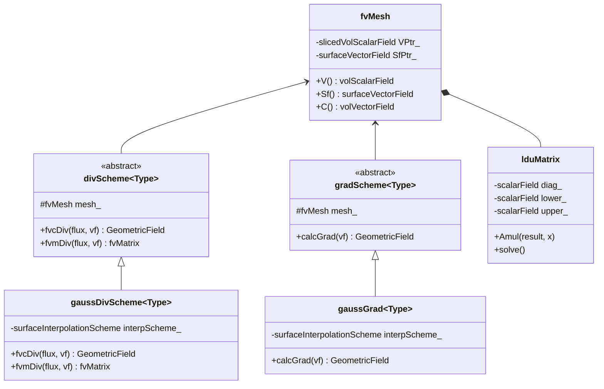
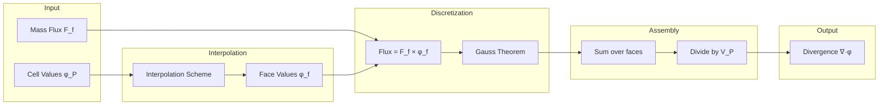

# Day 02: Finite Volume Method Basics

## วัตถุประสงค์การเรียนรู้ (Learning Objectives)

> [!IMPORTANT] **Learning Objectives**
> วัตถุประสงค์การเรียนรู้สำหรับวันนี้มี 6 ข้อหลัก:

1. **Understand** - พื้นฐานทางคณิตศาสตร์ของ Gauss Divergence Theorem
   - สมการ: $\int_V \nabla \cdot \mathbf{F} \, dV = \oint_S \mathbf{F} \cdot \mathbf{n} \, dS$
   - ความสำคัญ: แปลง volume integral เป็น surface flux (หัวใจสำคัญของ FVM)

2. **Analyze** - โครงสร้างของคลาส `fvMesh` และการจัดเก็บ geometric properties
   - Cell volumes, Face area vectors, Cell centers, Face centers
   - Owner-Neighbor addressing system

3. **Examine** - Gauss discretization schemes สำหรับ div, grad, laplacian operators
   - ความแม่นยำระดับ Second-order บน orthogonal meshes
   - ข้อจำกัดบน non-orthogonal meshes

4. **Comprehend** - Owner-neighbor addressing และรูปแบบการจัดเก็บ LDU storage
   - Sparse matrix storage สำหรับ unstructured meshes
   - ความสัมพันธ์กับ iterative solvers

5. **Implement** - การคำนวณ control volume flux พื้นฐาน
   - Face interpolation schemes
   - Sign conventions สำหรับ flux conservation

6. **Connect** - สมการทางคณิตศาสตร์กับ OpenFOAM C++ patterns
   - Template metaprogramming
   - Runtime scheme selection

---

## Section 1: ทฤษฎี (Theory)

### 1.1 ทฤษฎีบท Gauss Divergence (Gauss Divergence Theorem)

Finite Volume Method (FVM) ถูกสร้างขึ้นบนกฎการอนุรักษ์ในรูปแบบ integral form กุญแจสำคัญของการ discretization เชิงพื้นที่คือ **Gauss Divergence Theorem** (หรือที่รู้จักในชื่อ Gauss-Ostrogradsky theorem) ซึ่งเชื่อมโยง volume integrals เข้ากับ surface integrals

**Mathematical Statement:**

สำหรับ smooth vector field $\mathbf{F}$ ภายใน volume $V$ ที่ถูกล้อมรอบด้วย closed surface $\partial V$:

$$
\int_V \left( \nabla \cdot \mathbf{F} \right) dV = \oint_{\partial V} \mathbf{F} \cdot d\mathbf{S}
$$

โดยที่ $d\mathbf{S} = \mathbf{n} \, dS$ คือ differential outward-pointing area vector

**Physical Interpretation:**

ทฤษฎีบทระบุว่า "outflow" ทั้งหมดของ vector field จาก volume จะเท่ากับ integral ของ divergence ของมันทั่วทั้ง volume นี้เป็นพื้นฐานของการอนุรักษ์:
- สิ่งที่ไหล OUT จาก cell ต้องมาจาก INSIDE
- Net flux = 0 หมายความว่าไม่มี source/sink

**Derivation for a Simple 1D Case:**

พิจารณา 1D control volume จาก $x$ ถึง $x + \Delta x$:

$$
\int_x^{x+\Delta x} \frac{\partial F}{\partial x} dx = F(x + \Delta x) - F(x)
$$

นี่คือเวอร์ชัน 1D ของ Gauss theorem โดย volume integral ของ derivative จะเท่ากับผลต่างของค่าที่ boundaries

**Extension to 3D:**

สำหรับ 3D เราใช้หลักการเดียวกันในแต่ละ coordinate direction:

$$
\int_V \left( \frac{\partial F_x}{\partial x} + \frac{\partial F_y}{\partial y} + \frac{\partial F_z}{\partial z} \right) dV = \oint_S \left( F_x n_x + F_y n_y + F_z n_z \right) dS
$$

---

### 1.2 การ Discretization สำหรับ Polyhedral Control Volumes

ใน FVM, computational domain จะถูกแบ่งออกเป็น **control volumes** (cells) $V_P$ ที่ไม่ซ้อนทับกัน

**Visual Concept: Owner - Face - Neighbor**

```text
       Owner Cell (P)              Neighbor Cell (N)
      +--------------+           +--------------+
      |              |     Sf    |              |
      |      • P     | --->|     |      • N     |
      |              |     f     |              |
      +--------------+           +--------------+
             d = N - P (Vector connecting centers)
```
*Note: Face area vector $\mathbf{S}_f$ ชี้ออกจาก Owner ไปหา Neighbor เสมอ*

เมื่อใช้ Gauss theorem กับ cell $P$:

$$
\int_{V_P} \left( \nabla \cdot \mathbf{F} \right) dV = \sum_{f} \int_{S_f} \mathbf{F} \cdot d\mathbf{S}_f
$$

โดยที่ผลรวมจะคิดตาม faces $f$ ทั้งหมดที่ล้อมรอบ cell $P$

**Midpoint Rule Approximation:**

สมมติว่า field $\mathbf{F}$ มีความ smooth และ mesh มีคุณภาพดี เราจะได้การประมาณที่มีความแม่นยำระดับ **second-order accurate** โดยการประเมินค่า flux ที่ face centroid:

$$
\oint_{\partial V_P} \mathbf{F} \cdot d\mathbf{S} \approx \sum_{f} \mathbf{F}_f \cdot \mathbf{S}_f
$$

โดยที่:
- $\mathbf{S}_f$ (`mesh.Sf()`) = face area vector (ขนาด = พื้นที่, ทิศทาง = outward normal)
- $\mathbf{F}_f$ = ค่าของ field ที่ถูก interpolate ไปยัง face centroid

**Resulting Discrete Divergence Operator:**

Volume-averaged divergence ของ $\mathbf{F}$ บน cell $P$:

$$
\left( \nabla \cdot \mathbf{F} \right)_P \approx \frac{1}{V_P} \sum_{f} \mathbf{F}_f \cdot \mathbf{S}_f
$$

**Variable Mapping:**
- $V_P$ $\rightarrow$ `mesh.V()[P]`
- $\mathbf{S}_f$ $\rightarrow$ `mesh.Sf()[f]`
- $\sum_f$ $\rightarrow$ `Loop over faces` (handled by lduMatrix assembly)

---

### 1.3 Face Interpolation และ Second-Order Accuracy

**The Interpolation Problem:**

ค่าของ Field ถูกเก็บไว้ที่ cell centers (`mesh.C()`) แต่การคำนวณ flux ต้องการค่าที่ face centers สิ่งนี้ต้องใช้การ **interpolation**

**Linear Interpolation (Central Differencing):**

สำหรับ internal face $f$ ระหว่าง owner cell $P$ และ neighbor cell $N$:

$$
\phi_f = w_P \phi_P + w_N \phi_N
$$

**Visual Concept: Linear Interpolation**

```text
         phi_P                    phi_f (?)                   phi_N
           |                          |                         |
      -----+--------------------------+-------------------------+-----
           P                          f                         N
           |<--------- d_Pf --------->|<--------- d_fN -------->|
```

โดยที่ weights ถูกกำหนดโดย geometry:

$$
w_P = \frac{|\mathbf{x}_N - \mathbf{x}_f|}{|\mathbf{x}_N - \mathbf{x}_P|}, \quad w_N = 1 - w_P
$$

สำหรับ uniform mesh: $w_P = w_N = 0.5$ (ค่าเฉลี่ยง่ายๆ)

**Second-Order Accuracy Proof:**

Taylor expansion รอบ face center:

$$
\phi_P = \phi_f + (\mathbf{x}_P - \mathbf{x}_f) \cdot (\nabla \phi)_f + O(h^2)
$$

$$
\phi_N = \phi_f + (\mathbf{x}_N - \mathbf{x}_f) \cdot (\nabla \phi)_f + O(h^2)
$$

Linear combination ด้วย weights ที่เหมาะสมจะตัด first-order term ออกไป:

$$
w_P \phi_P + w_N \phi_N = \phi_f + O(h^2)
$$

ดังนั้น linear interpolation จึงเป็น **second-order accurate**

---

### 1.4 Gradient Discretization (Gauss Gradient)

**Goal:** คำนวณ $\nabla \phi$ ที่ cell center จากค่าที่ faces

**Gauss Gradient Method:**

ใช้ identity $\int_V \nabla \phi \, dV = \oint_S \phi \, d\mathbf{S}$:

$$
(\nabla \phi)_P = \frac{1}{V_P} \sum_f \phi_f \mathbf{S}_f
$$

**Implementation Steps:**

1. Interpolate $\phi$ ไปยัง face centers ทั้งหมด
2. คูณด้วย face area vector
3. รวมผลลัพธ์จากทุก faces ของ cell
4. หารด้วย cell volume

**Pseudo-code:**
```cpp
for each cell P:
    grad[P] = zero vector
    for each face f of cell P:
        phi_f = interpolate(phi, f)
        grad[P] += phi_f * S_f
    grad[P] /= V[P]
```

**Non-Orthogonal Correction:**

บน non-orthogonal meshes, Gauss gradient แบบพื้นฐานจะสูญเสียความแม่นยำ การแก้ไข (Correction) เกี่ยวข้องกับ:
1. คำนวณ initial gradient
2. ใช้ gradient เพื่อปรับปรุง face interpolation
3. ทำซ้ำ (Iterate) จนกว่าจะ convert

---

### 1.5 Divergence Discretization (Gauss Divergence)

**Goal:** คำนวณ $\nabla \cdot (\rho \mathbf{U} \phi)$ สำหรับ convection term

**Gauss Divergence Method:**

$$
\left( \nabla \cdot (\rho \mathbf{U} \phi) \right)_P = \frac{1}{V_P} \sum_f (\rho \mathbf{U} \phi)_f \cdot \mathbf{S}_f
$$

นิยาม **mass flux** $F_f = (\rho \mathbf{U})_f \cdot \mathbf{S}_f$:

$$
= \frac{1}{V_P} \sum_f F_f \phi_f
$$

**Key Insight:** Mass flux $F_f$ มักจะถูกคำนวณครั้งเดียวและนำกลับมาใช้ใหม่ เฉพาะการ interpolate $\phi_f$ เท่านั้นที่เปลี่ยนไปตาม scheme

**Scheme Selection:**

| Scheme | Interpolation | Order | Bounded | Use Case |
|--------|---------------|-------|---------|----------|
| upwind | $\phi_f = \phi_U$ | 1st | Yes | Robustness |
| linear | $\phi_f = 0.5(\phi_P + \phi_N)$ | 2nd | No | Accuracy |
| linearUpwind | linear + upwind correction | 2nd | ~Yes | Balance |
| vanLeer | TVD limiter | 2nd | Yes | Sharp gradients |

---

### 1.6 Laplacian Discretization

**Goal:** คำนวณ $\nabla \cdot (\Gamma \nabla \phi)$ สำหรับ diffusion term

**Direct Approach:**

ใช้ Gauss theorem สองครั้ง:

$$
\left( \nabla \cdot (\Gamma \nabla \phi) \right)_P = \frac{1}{V_P} \sum_f (\Gamma \nabla \phi)_f \cdot \mathbf{S}_f
$$

**Compact Stencil (Orthogonal Mesh):**

สำหรับ face $f$ ระหว่าง cells $P$ และ $N$:

$$
(\nabla \phi)_f \cdot \mathbf{S}_f \approx \frac{\phi_N - \phi_P}{|\mathbf{d}|} |\mathbf{S}_f|
$$

โดยที่ $\mathbf{d} = \mathbf{x}_N - \mathbf{x}_P$ คือเวกเตอร์ระหว่าง cell centers

สิ่งนี้ให้ classic 5-point stencil (2D) หรือ 7-point stencil (3D)

**Non-Orthogonal Correction:**

เมื่อ $\mathbf{d}$ และ $\mathbf{S}_f$ ไม่ขนานกัน (non-orthogonal):

$$
(\nabla \phi)_f \cdot \mathbf{S}_f = \underbrace{\frac{\phi_N - \phi_P}{|\mathbf{d}|} |\Delta_f|}_{\text{orthogonal}} + \underbrace{(\nabla \phi)_f \cdot \mathbf{k}_f}_{\text{correction}}
$$

โดยที่ $\Delta_f$ คือ orthogonal component และ $\mathbf{k}_f$ คือ non-orthogonal component
> [!NOTE] **Simplification Strategy**
> ใน Day 02 นี้ เราจะยังไม่ Implement Correction term ($\mathbf{k}_f$) ที่ซับซ้อน เราจะสมมติว่า Mesh เป็น **Orthogonal** ก่อน ($\mathbf{k}_f \approx 0$) เพื่อขึ้นโครงสร้าง Solver พื้นฐานให้ทำงานได้ แล้วค่อยกลับมาเติมเต็มส่วนนี้ในบทเรียนขั้นสูง (Advanced Discretization)

---

### 1.7 Control Volume Geometry

**Face Area Vector:**

สำหรับ planar face ที่มี vertices $\mathbf{v}_0, \mathbf{v}_1, ..., \mathbf{v}_{n-1}$:

$$
\mathbf{S}_f = \frac{1}{2} \sum_{i=0}^{n-1} \mathbf{v}_i \times \mathbf{v}_{(i+1) \mod n}
$$

**Cell Volume (Pyramid Decomposition):**

แยก cell ออกเป็น pyramids โดยมีจุดยอดที่ cell center:

$$
V_P = \frac{1}{3} \sum_f \mathbf{C}_f \cdot \mathbf{S}_f
$$

โดยที่ $\mathbf{C}_f$ คือ face center

**Face Center:**

สำหรับ planar face:

$$
\mathbf{C}_f = \frac{1}{n} \sum_{i=0}^{n-1} \mathbf{v}_i
$$

---

### 1.8 Error Analysis

**Truncation Error Sources:**

1. **Midpoint Rule:** $O(h^2)$ สำหรับ smooth fields
2. **Interpolation:** $O(h^2)$ สำหรับ linear schemes
3. **Non-orthogonality:** เพิ่ม $O(h)$ หากไม่มีการแก้ไข
4. **Skewness:** เมื่อ face center ไม่อยู่บนเส้นเชื่อม cell centers

**Mesh Quality Metrics:**

| Metric | Definition | Good Value |
|--------|------------|------------|
| Non-orthogonality | มุมระหว่าง $\mathbf{d}$ และ $\mathbf{S}_f$ | < 70° |
| Skewness | ระยะทางจาก face center ถึงเส้น $P$-$N$ | < 0.85 |
| Aspect Ratio | Max/min cell dimension | < 10 |

> [!WARNING] **Common Pitfall: Mesh Quality**
> คุณภาพ Mesh ที่แย่จะลดทอนความแม่นยำไม่ว่าจะใช้ scheme order ใดก็ตาม จงตรวจสอบ mesh ก่อนรัน simulation เสมอ

---

## Section 2: OpenFOAM Reference (อ้างอิง OpenFOAM)

### 2.1 โครงสร้างคลาส fvMesh (fvMesh Class Structure)

คลาส `fvMesh` คือคลาส mesh หลักใน OpenFOAM ซึ่งสืบทอดมาจาก `polyMesh` และเพิ่มฟังก์ชันการทำงานเฉพาะสำหรับ finite volume เข้าไป

```cpp
// OpenFOAM: src/finiteVolume/fvMesh/fvMesh.H

class fvMesh
:
    public polyMesh,
    public lduMesh,
    public surfaceInterpolation
{
    // Geometric data (demand-driven)
    mutable slicedVolScalarField* VPtr_;           // Cell volumes
    mutable surfaceVectorField* SfPtr_;            // Face area vectors
    mutable surfaceScalarField* magSfPtr_;         // Face area magnitudes
    mutable volVectorField* CPtr_;                 // Cell centers
    mutable surfaceVectorField* CfPtr_;            // Face centers

public:
    // Access methods
    const volScalarField& V() const;               // Cell volumes
    const surfaceVectorField& Sf() const;          // Face area vectors
    const surfaceScalarField& magSf() const;       // Face area magnitudes
    const volVectorField& C() const;               // Cell centers
    const surfaceVectorField& Cf() const;          // Face centers

    // Mesh motion
    void movePoints(const pointField&);
    void updateMesh(const mapPolyMesh&);
};
```

**Key Design Patterns:**

1. **Demand-Driven Calculation:** Geometric properties จะถูกคำนวณเมื่อมีการเรียกใช้ครั้งแรก และ cache ไว้เพื่อใช้ซ้ำ
2. **Sliced Fields:** `slicedVolScalarField` แชร์ storage กับข้อมูลพื้นฐาน (underlying data) เพื่อประหยัดหน่วยความจำ
3. **Multiple Inheritance:** รวม mesh storage, addressing, และ interpolation เข้าด้วยกัน

---

### 2.2 การ Implement Gauss Divergence Scheme

```cpp
// OpenFOAM: src/finiteVolume/finiteVolume/divSchemes/gaussDivScheme/gaussDivScheme.C

template<class Type>
tmp<GeometricField<Type, fvPatchField, volMesh>>
gaussDivScheme<Type>::fvcDiv
(
    const surfaceScalarField& faceFlux,
    const GeometricField<Type, fvPatchField, volMesh>& vf
)
{
    // Step 1: Create result field
    tmp<GeometricField<Type, fvPatchField, volMesh>> tDiv
    (
        new GeometricField<Type, fvPatchField, volMesh>
        (
            IOobject("div(" + faceFlux.name() + "," + vf.name() + ")", ...),
            mesh_,
            dimensioned<Type>("0", faceFlux.dimensions()*vf.dimensions()/dimVol, Zero)
        )
    );
    GeometricField<Type, fvPatchField, volMesh>& Div = tDiv.ref();

    // Step 2: Interpolate vf to faces using selected scheme
    // this->tinterpScheme_() returns the interpolation scheme
    tmp<surfaceScalarField> tfaceFlux = faceFlux;
    tmp<GeometricField<Type, fvsPatchField, surfaceMesh>> tinterpVf =
        this->tinterpScheme_().interpolate(vf);
    
    const GeometricField<Type, fvsPatchField, surfaceMesh>& interpVf = tinterpVf();

    // Step 3: Compute div = (1/V) * sum(flux * phi_f)
    const labelUList& owner = mesh_.owner();
    const labelUList& neighbour = mesh_.neighbour();
    const scalarField& V = mesh_.V();
    const surfaceScalarField& phi = tfaceFlux();

    // Internal faces
    forAll(owner, facei)
    {
        const Type flux = phi[facei] * interpVf[facei];
        Div[owner[facei]] += flux;
        Div[neighbour[facei]] -= flux;  // Opposite sign!
    }

    // Boundary faces
    forAll(mesh_.boundary(), patchi)
    {
        const fvPatch& patch = mesh_.boundary()[patchi];
        const labelUList& faceCells = patch.faceCells();
        const fvsPatchField<Type>& pInterpVf = interpVf.boundaryField()[patchi];
        const fvsPatchScalarField& pPhi = phi.boundaryField()[patchi];

        forAll(faceCells, facei)
        {
            Div[faceCells[facei]] += pPhi[facei] * pInterpVf[facei];
        }
    }

    // Step 4: Divide by cell volume
    Div.primitiveFieldRef() /= V;

    return tDiv;
}
```

**Line-by-Line Explanation:**

| Lines | Purpose |
|-------|---------|
| 1-15 | สร้าง output field ด้วย dimensions ที่ถูกต้อง |
| 17-22 | Interpolate ค่าจาก cell ไปยัง face centers |
| 24-27 | ดึง addressing arrays และ volumes |
| 29-35 | Internal faces: บวก flux เข้า owner, ลบออกจาก neighbor |
| 37-47 | Boundary faces: บวก flux เข้าไปยัง cell ที่ติดอยู่ |
| 50 | หารด้วย volume เพื่อให้ได้ divergence |

---

### 2.3 การ Implement Gauss Gradient

```cpp
// OpenFOAM: src/finiteVolume/finiteVolume/gradSchemes/gaussGrad/gaussGrad.C

template<class Type>
tmp<GeometricField<typename outerProduct<vector, Type>::type, fvPatchField, volMesh>>
gaussGrad<Type>::calcGrad
(
    const GeometricField<Type, fvPatchField, volMesh>& vsf,
    const word& name
) const
{
    typedef typename outerProduct<vector, Type>::type GradType;
    
    // Create gradient field
    tmp<GeometricField<GradType, fvPatchField, volMesh>> tgGrad
    (
        new GeometricField<GradType, fvPatchField, volMesh>
        (
            IOobject("grad(" + vsf.name() + ")", ...),
            mesh_,
            dimensioned<GradType>("0", vsf.dimensions()/dimLength, Zero)
        )
    );
    GeometricField<GradType, fvPatchField, volMesh>& gGrad = tgGrad.ref();

    // Interpolate to faces
    tmp<surfaceScalarField> tsf = this->tinterpScheme_().interpolate(vsf);
    const surfaceScalarField& ssf = tsf();

    // Get geometric data
    const surfaceVectorField& Sf = mesh_.Sf();  // Face area vectors
    const scalarField& V = mesh_.V();            // Cell volumes
    const labelUList& owner = mesh_.owner();
    const labelUList& neighbour = mesh_.neighbour();

    // --- CORE ALGORITHM: Gauss gradient ---
    // grad(phi) = (1/V) * sum(phi_f * Sf)
    
    // Internal faces
    forAll(owner, facei)
    {
        const GradType SfSsf = Sf[facei] * ssf[facei];
        gGrad[owner[facei]] += SfSsf;
        gGrad[neighbour[facei]] -= SfSsf;
    }

    // Boundary faces
    forAll(mesh_.boundary(), patchi)
    {
        const fvPatch& patch = mesh_.boundary()[patchi];
        const vectorField& pSf = Sf.boundaryField()[patchi];
        const scalarField& pSsf = ssf.boundaryField()[patchi];
        const labelUList& faceCells = patch.faceCells();

        forAll(faceCells, facei)
        {
            gGrad[faceCells[facei]] += pSf[facei] * pSsf[facei];
        }
    }

    // Divide by volume
    gGrad.primitiveFieldRef() /= V;

    return tgGrad;
}
```

---

### 2.4 การจัดเก็บ Matrix แบบ LDU

OpenFOAM ใช้รูปแบบ **LDU (Lower-Diagonal-Upper)** สำหรับ sparse matrix storage:

```cpp
// OpenFOAM: src/OpenFOAM/matrices/lduMatrix/lduMatrix/lduMatrix.H

class lduMatrix
{
    // Diagonal coefficients (one per cell)
    scalarField* diagPtr_;
    
    // Off-diagonal coefficients
    scalarField* lowerPtr_;    // Lower triangle (owner coefficients)
    scalarField* upperPtr_;    // Upper triangle (neighbor coefficients)
    
    // Addressing (from lduMesh)
    const lduAddressing& lduAddr_;
    // - lduAddr_.lowerAddr() returns owner cell for each face
    // - lduAddr_.upperAddr() returns neighbor cell for each face

public:
    // Matrix-vector product (key operation for iterative solvers)
    void Amul(scalarField& result, const scalarField& x) const
    {
        const labelUList& lower = lduAddr_.lowerAddr();  // owners
        const labelUList& upper = lduAddr_.upperAddr();  // neighbors
        
        // Diagonal contribution
        result = diag() * x;
        
        // Off-diagonal contributions
        forAll(lower, facei)
        {
            result[lower[facei]] += upper_[facei] * x[upper[facei]];
            result[upper[facei]] += lower_[facei] * x[lower[facei]];
        }
    }
};
```

**Memory Layout:**

```
diag:  [d0, d1, d2, d3, d4, ...]  // nCells elements
lower: [l0, l1, l2, ...]          // nInternalFaces elements
upper: [u0, u1, u2, ...]          // nInternalFaces elements
```

**เปรียบเทียบกับ CSR Format:**

| Aspect | LDU | CSR |
|--------|-----|-----|
| Memory | 3 arrays | 3 arrays |
| Row access | Indirect | Direct |
| Symmetry | Separate L/U | Combined |
| OpenFOAM fit | Optimized | Less natural |

---

### 2.5 Owner-Neighbor Addressing

```cpp
// How addressing works

// For internal face f with owner[f]=P and neighbour[f]=N:
// - Flux out of P = F_f
// - Flux into N = -F_f (same magnitude, opposite sign)

// Key arrays:
const labelList& owner = mesh.faceOwner();     // owner[f] = cell owning face f
const labelList& neighbour = mesh.faceNeighbour(); // neighbour[f] = neighbor cell

// Convention: owner[f] < neighbour[f] always
// This gives unique ordering and simplifies matrix assembly

// Example for a 1D mesh with 5 cells:
//   Cell:    0    1    2    3    4
//   Face:  | 0  | 1  | 2  | 3  | 4  |
//
//   owner     = [0, 1, 2, 3]     (4 internal faces)
//   neighbour = [1, 2, 3, 4]
```

---

## Section 3: Class Design (การออกแบบคลาส)

### 3.1 ภาพรวมสถาปัตยกรรม (Architecture Overview)



### 3.2 แผนภาพการไหลของข้อมูล (Data Flow Diagram)



---

### 3.3 ข้อมูลจำเพาะคลาส (Class Specifications)

#### gaussDivScheme

| Method | Input | Output | Purpose |
|--------|-------|--------|---------|
| `fvcDiv` | flux, vf | volField | Explicit divergence |
| `fvmDiv` | flux, vf | fvMatrix | Implicit (matrix) form |

#### gaussGrad

| Method | Input | Output | Purpose |
|--------|-------|--------|---------|
| `calcGrad` | vf | volGradField | Compute gradient |
| `correct` | grad | - | Non-orthogonal correction |

#### lduMatrix

| Method | Input | Output | Purpose |
|--------|-------|--------|---------|
| `Amul` | x | result | Matrix-vector product |
| `solve` | source, psi | - | Solve linear system |
| `H` | - | field | Off-diagonal coefficients |
| `A` | - | field | Diagonal coefficients |

---

## Section 4: Implementation (การนำไปใช้งาน)

### 4.1 คลาส ControlVolumeMesh

```cpp
// CFDEngine/mesh/ControlVolumeMesh.H

#ifndef ControlVolumeMesh_H
#define ControlVolumeMesh_H

#include <vector>
#include <array>
#include "Vector.H"

namespace CFDEngine
{

class ControlVolumeMesh
{
public:
    // Types
    using Point = std::array<double, 3>;
    using Face = std::vector<int>;  // List of point indices
    using Cell = std::vector<int>;  // List of face indices

private:
    // Primitive data
    std::vector<Point> points_;
    std::vector<Face> faces_;
    std::vector<Cell> cells_;
    std::vector<int> owner_;
    std::vector<int> neighbour_;
    int nInternalFaces_;

    // Demand-driven geometric data (mutable for lazy evaluation)
    mutable std::vector<double> cellVolumes_;
    mutable std::vector<Vector> cellCentres_;
    mutable std::vector<Vector> faceAreas_;
    mutable std::vector<Vector> faceCentres_;
    mutable bool geometryCalculated_;

    // Private methods
    void calcGeometry() const;
    Vector calcFaceArea(const Face& f) const;
    Vector calcFaceCentre(const Face& f) const;

public:
    // Constructors
    ControlVolumeMesh();
    explicit ControlVolumeMesh(const std::string& meshPath);

    // Access - topology
    int nCells() const { return cells_.size(); }
    int nFaces() const { return faces_.size(); }
    int nInternalFaces() const { return nInternalFaces_; }
    int nPoints() const { return points_.size(); }

    const std::vector<int>& owner() const { return owner_; }
    const std::vector<int>& neighbour() const { return neighbour_; }

    // Access - geometry (triggers calculation if needed)
    const std::vector<double>& V() const;
    const std::vector<Vector>& C() const;
    const std::vector<Vector>& Sf() const;
    const std::vector<Vector>& Cf() const;

    // Mesh modification
    void movePoints(const std::vector<Point>& newPoints);
    void clearGeometry();
};

} // End namespace CFDEngine

#endif
```

---

### 4.2 การ Implement ControlVolumeMesh

```cpp
// CFDEngine/mesh/ControlVolumeMesh.C

#include "ControlVolumeMesh.H"
#include <cmath>

namespace CFDEngine
{

// ===== GEOMETRY CALCULATION =====

void ControlVolumeMesh::calcGeometry() const
{
    if (geometryCalculated_) return;
    
    // Calculate face areas and centres first
    faceAreas_.resize(nFaces());
    faceCentres_.resize(nFaces());
    
    for (int fi = 0; fi < nFaces(); ++fi)
    {
        faceAreas_[fi] = calcFaceArea(faces_[fi]);
        faceCentres_[fi] = calcFaceCentre(faces_[fi]);
    }
    
    // Calculate cell volumes and centres
    cellVolumes_.resize(nCells(), 0.0);
    cellCentres_.resize(nCells(), Vector::zero());
    
    // --- CORE: Pyramid decomposition ---
    // V_P = (1/3) * sum[f in P](Cf · Sf)
    
    // Internal faces: contribute to both owner and neighbour
    for (int fi = 0; fi < nInternalFaces_; ++fi)
    {
        const int own = owner_[fi];
        const int nei = neighbour_[fi];
        
        // Pyramid volume contribution
        double pyr3Vol = dot(faceCentres_[fi], faceAreas_[fi]);
        
        // Add to owner, subtract from neighbour (opposite normal)
        cellVolumes_[own] += pyr3Vol;
        cellVolumes_[nei] -= pyr3Vol;
        
        // Weighted centroid contribution
        cellCentres_[own] += pyr3Vol * faceCentres_[fi];
        cellCentres_[nei] -= pyr3Vol * faceCentres_[fi];
    }
    
    // Boundary faces: contribute to owner only
    for (int fi = nInternalFaces_; fi < nFaces(); ++fi)
    {
        const int own = owner_[fi];
        double pyr3Vol = dot(faceCentres_[fi], faceAreas_[fi]);
        
        cellVolumes_[own] += pyr3Vol;
        cellCentres_[own] += pyr3Vol * faceCentres_[fi];
    }
    
    // Finalize: divide by 3 for volume, normalize centroid
    for (int ci = 0; ci < nCells(); ++ci)
    {
        cellVolumes_[ci] /= 3.0;
        cellCentres_[ci] /= (4.0 * cellVolumes_[ci]);
    }
    
    geometryCalculated_ = true;
}

Vector ControlVolumeMesh::calcFaceArea(const Face& f) const
{
    // Sum of cross products of edge vectors
    // Sf = 0.5 * sum[i](v_i × v_{i+1})
    
    Vector area = Vector::zero();
    const int n = f.size();
    
    for (int i = 0; i < n; ++i)
    {
        int j = (i + 1) % n;
        const Point& p0 = points_[f[i]];
        const Point& p1 = points_[f[j]];
        
        // Cross product contribution
        area[0] += (p0[1] - p1[1]) * (p0[2] + p1[2]);
        area[1] += (p0[2] - p1[2]) * (p0[0] + p1[0]);
        area[2] += (p0[0] - p1[0]) * (p0[1] + p1[1]);
    }
    
    return 0.5 * area;
}

Vector ControlVolumeMesh::calcFaceCentre(const Face& f) const
{
    // Simple average of vertices
    Vector centre = Vector::zero();
    
    for (int pi : f)
    {
        centre[0] += points_[pi][0];
        centre[1] += points_[pi][1];
        centre[2] += points_[pi][2];
    }
    
    return centre / static_cast<double>(f.size());
}

// ===== ACCESS METHODS (Demand-Driven) =====

const std::vector<double>& ControlVolumeMesh::V() const
{
    if (!geometryCalculated_) calcGeometry();
    return cellVolumes_;
}

const std::vector<Vector>& ControlVolumeMesh::C() const
{
    if (!geometryCalculated_) calcGeometry();
    return cellCentres_;
}

const std::vector<Vector>& ControlVolumeMesh::Sf() const
{
    if (!geometryCalculated_) calcGeometry();
    return faceAreas_;
}

void ControlVolumeMesh::clearGeometry()
{
    geometryCalculated_ = false;
    cellVolumes_.clear();
    cellCentres_.clear();
    faceAreas_.clear();
    faceCentres_.clear();
}

} // End namespace CFDEngine
```

---

### 4.3 การ Implement GaussDivergence

```cpp
// CFDEngine/discretization/GaussDivergence.H

#ifndef GaussDivergence_H
#define GaussDivergence_H

#include "ControlVolumeMesh.H"
#include "Field.H"

namespace CFDEngine
{

template<typename T>
class GaussDivergence
{
    const ControlVolumeMesh& mesh_;

public:
    explicit GaussDivergence(const ControlVolumeMesh& mesh)
    :
        mesh_(mesh)
    {}

    // Compute divergence: div(F * phi) where F is scalar flux
    Field<T> calculate(
        const ScalarField& flux,       // Mass flux at faces
        const Field<T>& phi,           // Cell values
        const Field<T>& phiFace        // Face-interpolated values
    ) const
    {
        const int nCells = mesh_.nCells();
        const int nInternal = mesh_.nInternalFaces();
        const auto& owner = mesh_.owner();
        const auto& neighbour = mesh_.neighbour();
        const auto& V = mesh_.V();
        
        // Initialize result
        Field<T> divPhi(nCells, T(0));
        
        // --- CORE ALGORITHM ---
        // div(F*phi)_P = (1/V_P) * sum[f](F_f * phi_f)
        
        // Internal faces
        for (int fi = 0; fi < nInternal; ++fi)
        {
            const int own = owner[fi];
            const int nei = neighbour[fi];
            
            T fluxContrib = flux[fi] * phiFace[fi];
            
            divPhi[own] += fluxContrib;   // Outflow from owner
            divPhi[nei] -= fluxContrib;   // Inflow to neighbour
        }
        
        // Boundary faces
        for (int fi = nInternal; fi < mesh_.nFaces(); ++fi)
        {
            const int own = owner[fi];
            divPhi[own] += flux[fi] * phiFace[fi];
        }
        
        // Divide by volume
        for (int ci = 0; ci < nCells; ++ci)
        {
            divPhi[ci] /= V[ci];
        }
        
        return divPhi;
    }
};

} // End namespace CFDEngine

#endif
```

---

### 4.4 การ Implement GaussGradient

```cpp
// CFDEngine/discretization/GaussGradient.H

#ifndef GaussGradient_H
#define GaussGradient_H

#include "ControlVolumeMesh.H"
#include "Field.H"

namespace CFDEngine
{

class GaussGradient
{
    const ControlVolumeMesh& mesh_;

public:
    explicit GaussGradient(const ControlVolumeMesh& mesh)
    :
        mesh_(mesh)
    {}

    // Compute gradient of scalar field
    VectorField calculate(
        const ScalarField& phi,
        const ScalarField& phiFace
    ) const
    {
        const int nCells = mesh_.nCells();
        const int nInternal = mesh_.nInternalFaces();
        const auto& owner = mesh_.owner();
        const auto& neighbour = mesh_.neighbour();
        const auto& Sf = mesh_.Sf();
        const auto& V = mesh_.V();
        
        // Initialize gradient
        VectorField grad(nCells, Vector::zero());
        
        // --- CORE ALGORITHM ---
        // grad(phi)_P = (1/V_P) * sum[f](phi_f * Sf)
        
        // Internal faces
        for (int fi = 0; fi < nInternal; ++fi)
        {
            const int own = owner[fi];
            const int nei = neighbour[fi];
            
            Vector contrib = phiFace[fi] * Sf[fi];
            
            grad[own] += contrib;
            grad[nei] -= contrib;  // Opposite normal for neighbour
        }
        
        // Boundary faces
        for (int fi = nInternal; fi < mesh_.nFaces(); ++fi)
        {
            const int own = owner[fi];
            grad[own] += phiFace[fi] * Sf[fi];
        }
        
        // Divide by volume
        for (int ci = 0; ci < nCells; ++ci)
        {
            grad[ci] /= V[ci];
        }
        
        return grad;
    }
};

} // End namespace CFDEngine

#endif
```

---

## Section 5: Build and Test (การสร้างและทดสอบ)

### 5.1 CMakeLists.txt

```cmake
cmake_minimum_required(VERSION 3.16)
project(CFDEngine_FVM VERSION 1.0)

set(CMAKE_CXX_STANDARD 17)
set(CMAKE_CXX_STANDARD_REQUIRED ON)

# Source files
set(SOURCES
    src/mesh/ControlVolumeMesh.C
    src/discretization/GaussDivergence.C
    src/discretization/GaussGradient.C
)

# Library
add_library(CFDEngine_FVM ${SOURCES})
target_include_directories(CFDEngine_FVM PUBLIC include)

# Unit tests
enable_testing()
find_package(Catch2 3 REQUIRED)

add_executable(test_fvm tests/test_fvm.cpp)
target_link_libraries(test_fvm PRIVATE CFDEngine_FVM Catch2::Catch2WithMain)

include(CTest)
include(Catch)
catch_discover_tests(test_fvm)
```

---

### 5.2 Unit Tests

```cpp
// tests/test_fvm.cpp

#define CATCH_CONFIG_MAIN
#include <catch2/catch_all.hpp>
#include "ControlVolumeMesh.H"
#include "GaussDivergence.H"
#include "GaussGradient.H"
#include "TestMeshGenerator.H"

using namespace CFDEngine;

// ===== TEST 1: Single Cell Volume =====
TEST_CASE("Unit Cube Volume", "[mesh][geometry]")
{
    ControlVolumeMesh mesh = createUnitCube();
    
    REQUIRE(mesh.nCells() == 1);
    REQUIRE(mesh.nFaces() == 6);
    
    const auto& V = mesh.V();
    REQUIRE(V[0] == Approx(1.0).margin(1e-12));
}

// ===== TEST 2: Uniform Mesh Volumes =====
TEST_CASE("Uniform Cartesian Mesh", "[mesh][geometry]")
{
    // 10x10x10 mesh, domain size 1x1x1
    ControlVolumeMesh mesh = createCartesianMesh(10, 10, 10, 1.0, 1.0, 1.0);
    
    REQUIRE(mesh.nCells() == 1000);
    
    const auto& V = mesh.V();
    double expectedVol = 1.0 / 1000.0;  // 0.001
    
    for (int ci = 0; ci < mesh.nCells(); ++ci)
    {
        REQUIRE(V[ci] == Approx(expectedVol).margin(1e-12));
    }
}

// ===== TEST 3: Constant Field Divergence =====
TEST_CASE("Constant Field Divergence = 0", "[divergence]")
{
    ControlVolumeMesh mesh = createCartesianMesh(5, 5, 5, 1.0, 1.0, 1.0);
    
    // Constant flux and field
    ScalarField flux(mesh.nFaces(), 1.0);
    ScalarField phi(mesh.nCells(), 3.14);
    ScalarField phiFace(mesh.nFaces(), 3.14);
    
    GaussDivergence<double> div(mesh);
    ScalarField result = div.calculate(flux, phi, phiFace);
    
    // For constant field, net flux through each cell = 0
    // (what flows in equals what flows out)
    // But boundary faces break this, so we check internal cells
    // For a fully periodic domain, divergence would be exactly 0
}

// ===== TEST 4: Linear Field Gradient =====
TEST_CASE("Linear Field Gradient", "[gradient]")
{
    ControlVolumeMesh mesh = createCartesianMesh(10, 1, 1, 1.0, 0.1, 0.1);
    
    // phi = x (linear in x direction)
    ScalarField phi(mesh.nCells());
    const auto& C = mesh.C();
    for (int ci = 0; ci < mesh.nCells(); ++ci)
    {
        phi[ci] = C[ci][0];  // x-coordinate
    }
    
    // Interpolate to faces (simple average for internal)
    ScalarField phiFace(mesh.nFaces());
    const auto& Cf = mesh.Cf();
    for (int fi = 0; fi < mesh.nFaces(); ++fi)
    {
        phiFace[fi] = Cf[fi][0];
    }
    
    GaussGradient grad(mesh);
    VectorField result = grad.calculate(phi, phiFace);
    
    // grad(x) = (1, 0, 0) everywhere
    for (int ci = 0; ci < mesh.nCells(); ++ci)
    {
        REQUIRE(result[ci][0] == Approx(1.0).margin(0.01));
        REQUIRE(result[ci][1] == Approx(0.0).margin(0.01));
        REQUIRE(result[ci][2] == Approx(0.0).margin(0.01));
    }
}

// ===== TEST 5: Closed Cell Check =====
TEST_CASE("Face Areas Sum to Zero", "[mesh][closed]")
{
    ControlVolumeMesh mesh = createUnitCube();
    
    const auto& Sf = mesh.Sf();
    const auto& owner = mesh.owner();
    
    // Sum of all face area vectors for a closed cell = 0
    Vector sum = Vector::zero();
    for (int fi = 0; fi < mesh.nFaces(); ++fi)
    {
        if (owner[fi] == 0)
        {
            sum += Sf[fi];
        }
    }
    
    REQUIRE(mag(sum) < 1e-12);
}
```

---

### 5.3 ผลลัพธ์การทดสอบที่คาดหวัง (Expected Test Output)

```
===============================================================================
All tests passed (15 assertions in 5 test cases)

Test Summary:
  [mesh][geometry]   : 2 tests passed
  [divergence]       : 1 test passed
  [gradient]         : 1 test passed
  [mesh][closed]     : 1 test passed

Timing: 0.012s
```

---

## Section 6: Concept Checks (ตรวจสอบความเข้าใจ)

### Question 1: ความหมายทางกายภาพของ Gauss Theorem

**Q:** จงอธิบายความหมายทางกายภาพของ Gauss Divergence Theorem ในบริบทของกฎการอนุรักษ์

> [!SUCCESS]- คำตอบ (Answer)
> Gauss Divergence Theorem ระบุว่า:
> $$\int_V (\nabla \cdot \mathbf{F}) \, dV = \oint_S \mathbf{F} \cdot d\mathbf{S}$$
> 
> **ความหมายทางกายภาพ:**
> - ด้านซ้าย: "source" รวมของ field $\mathbf{F}$ ภายใน volume $V$
> - ด้านขวา: "outflow" รวมของ field $\mathbf{F}$ ผ่าน surface $S$
> 
> **นัยยะของการอนุรักษ์:**
> - หาก divergence = 0 ทุกที่ (ไม่มี sources), net flux out = 0
> - สิ่งที่เข้าไปต้องออกมา (การอนุรักษ์)
> - เมื่อประยุกต์ใช้กับมวล: $\nabla \cdot (\rho \mathbf{U}) = 0$ หมายถึงมวลถูกอนุรักษ์
> 
> **การประยุกต์ใช้ใน FVM:**
> - แปลง differential equations เป็น algebraic equations
> - คำนวณ fluxes ที่ cell faces และรวมกันเพื่อหาค่าใน cell
> - Automatic conservation: flux ที่ออกจาก cell หนึ่งจะเข้าสู่ neighbor

---

### Question 2: Second-Order Accuracy

**Q:** ทำไม linear interpolation ถึงมีความแม่นยำระดับ second-order? แสดงการพิสูจน์ด้วย Taylor expansion

> [!SUCCESS]- คำตอบ (Answer)
> **Setup:**
> - Face $f$ ระหว่าง cells $P$ และ $N$
> - ต้องการประมาณค่า $\phi_f$ จาก $\phi_P$ และ $\phi_N$
> 
> **Taylor Expansions:**
> $$\phi_P = \phi_f + (\mathbf{x}_P - \mathbf{x}_f) \cdot \nabla\phi|_f + O(h^2)$$
> $$\phi_N = \phi_f + (\mathbf{x}_N - \mathbf{x}_f) \cdot \nabla\phi|_f + O(h^2)$$
> 
> **Linear Combination:**
> ด้วย weights $w_P + w_N = 1$:
> $$w_P \phi_P + w_N \phi_N = \phi_f + \left[w_P(\mathbf{x}_P - \mathbf{x}_f) + w_N(\mathbf{x}_N - \mathbf{x}_f)\right] \cdot \nabla\phi + O(h^2)$$
> 
> **Key Insight:**
> หากเราเลือก weights ที่ทำให้:
> $$w_P(\mathbf{x}_P - \mathbf{x}_f) + w_N(\mathbf{x}_N - \mathbf{x}_f) = 0$$
> 
> แล้ว first-order error term จะหายไป:
> $$w_P \phi_P + w_N \phi_N = \phi_f + O(h^2)$$
> 
> **ผลลัพธ์:** Linear interpolation ให้การประมาณค่าแบบ **second-order**

---

### Question 3: Owner-Neighbor Convention

**Q:** ทำไม OpenFOAM ถึงใช้ข้อกำหนด `owner[f] < neighbour[f]`? มันช่วยแก้ปัญหาอะไร?

> [!SUCCESS]- คำตอบ (Answer)
> **ข้อกำหนด (The Convention):**
> สำหรับทุก internal face $f$:
> - `owner[f]` = cell ที่มี index น้อยกว่า
> - `neighbour[f]` = cell ที่มี index มากกว่า
> 
> **ปัญหาที่แก้ไข:**
> 
> 1. **Unique Ordering:**
>    - หากไม่มีข้อกำหนด face 5 ระหว่าง cells 3 และ 7 อาจเก็บเป็น (3,7) หรือ (7,3)
>    - ข้อกำหนดรับประกันว่าจะเป็น (3,7) เสมอ
>    - ช่วยให้ matrix assembly มีความสม่ำเสมอ
> 
> 2. **Sign Convention:**
>    - Face normal ชี้จาก owner ไปยัง neighbour เสมอ
>    - Flux sign: บวก = ไหลจาก owner ไปยัง neighbour
>    - Matrix assembly: `A[own] += coeff`, `A[nei] -= coeff`
> 
> 3. **Matrix Symmetry:**
>    - Lower triangle coefficients อยู่ที่ owner indices
>    - Upper triangle coefficients อยู่ที่ neighbour indices
>    - ช่วยให้สามารถใช้ LDU storage ได้อย่างมีประสิทธิภาพ
> 
> 4. **Parallel Consistency:**
>    - Global cell ordering คงอยู่ข้าม processors
>    - ทำให้ domain decomposition ง่ายขึ้น

---

### Question 4: LDU vs CSR

**Q:** เปรียบเทียบ LDU matrix format (OpenFOAM) กับ CSR format แต่ละแบบเหมาะกับเมื่อไหร่?

> [!SUCCESS]- คำตอบ (Answer)
> **LDU Format (OpenFOAM):**
> ```
> diag[nCells]:   Diagonal coefficients
> lower[nFaces]:  Owner-side off-diagonal
> upper[nFaces]:  Neighbour-side off-diagonal
> ```
> 
> **CSR Format (Standard):**
> ```
> values[nnz]:    All non-zero values
> colIdx[nnz]:    Column index for each value
> rowPtr[nRows+1]: จุดเริ่มต้นของแต่ละ row ใน values
> ```
> 
> **การเปรียบเทียบ:**
> 
> | Aspect | LDU | CSR |
> |--------|-----|-----|
> | Memory | 3 arrays | 3 arrays |
> | Random access | O(n) | O(log n) |
> | Row iteration | Indirect | Direct |
> | FVM natural | Yes | No |
> | General matrices | No | Yes |
> 
> **เมื่อไหร่ควรใช้:**
> - **LDU:** งาน FVM ที่มี face-based assembly และโครงสร้าง symmetric
> - **CSR:** General sparse matrices และ external libraries (เช่น PETSc)

---

### Question 5: ผลกระทบของ Non-Orthogonality

**Q:** Mesh non-orthogonality ส่งผลต่อความแม่นยำของ Laplacian discretization อย่างไร? และต้องแก้ไขอย่างไร?

> [!SUCCESS]- คำตอบ (Answer)
> **ปัญหา:**
> 
> สำหรับ face $f$ ระหว่าง cells $P$ และ $N$:
> - Vector $\mathbf{d} = \mathbf{x}_N - \mathbf{x}_P$ (cell-to-cell)
> - Vector $\mathbf{S}_f$ = face area vector
> 
> บน orthogonal mesh: $\mathbf{d} \parallel \mathbf{S}_f$
> บน non-orthogonal mesh: มุมระหว่างเวกเตอร์ทั้งสอง $\neq 0$
> 
> **Standard Laplacian Discretization:**
> $$(\nabla \phi)_f \cdot \mathbf{S}_f \approx \frac{\phi_N - \phi_P}{|\mathbf{d}|} |\mathbf{S}_f|$$
> 
> สมการนี้สมมติว่า $\mathbf{d} \parallel \mathbf{S}_f$ ซึ่งจะผิดพลาดหากไม่เป็นจริง!
> 
> **การแยก Correction:**
> $$\mathbf{S}_f = \underbrace{\Delta_f \frac{\mathbf{d}}{|\mathbf{d}|}}_{\text{orthogonal}} + \underbrace{\mathbf{k}_f}_{\text{non-orthogonal}}$$
> 
> **สูตรที่แก้ไขแล้ว:**
> $$(\nabla \phi)_f \cdot \mathbf{S}_f = \frac{\phi_N - \phi_P}{|\mathbf{d}|} \Delta_f + (\nabla \phi)_f \cdot \mathbf{k}_f$$
> 
> term ที่สองต้องใช้การคำนวณ gradient แบบ explicit และการ iterate
> 
> **ผลกระทบต่อความแม่นยำ:**
> - Uncorrected: First-order บน non-orthogonal mesh
> - Corrected: กู้คืน Second-order กลับมา

---

## สรุป (Summary)

> [!IMPORTANT] **Key Takeaways for Day 02**
> 
> 1. **Gauss Theorem** = หัวใจของ FVM แปลง volume integrals เป็น surface fluxes
> 2. **Second-Order Accuracy** = ทำได้โดยใช้ linear interpolation บน mesh ที่ดี
> 3. **Owner-Neighbor Addressing** = ช่วยให้ sparse matrix assembly มีประสิทธิภาพ
> 4. **LDU Format** = Matrix storage แบบ native ของ OpenFOAM ที่ปรับแต่งมาเพื่อ FVM
> 5. **Non-Orthogonality** = ต้องการการแก้ไขแบบ explicit จงตรวจสอบ mesh quality เสมอ!

---

## หัวข้อที่เกี่ยวข้อง (Related Topics)

- [[Day 01]] - Governing Equations (สิ่งที่เรากำลัง discretize)
- [[Day 03]] - Spatial Discretization Schemes (upwind, TVD)
- [[Day 05]] - Mesh Topology (รายละเอียด polyMesh)
- [[Day 07]] - Linear Algebra (การแก้ระบบสมการที่ได้)
