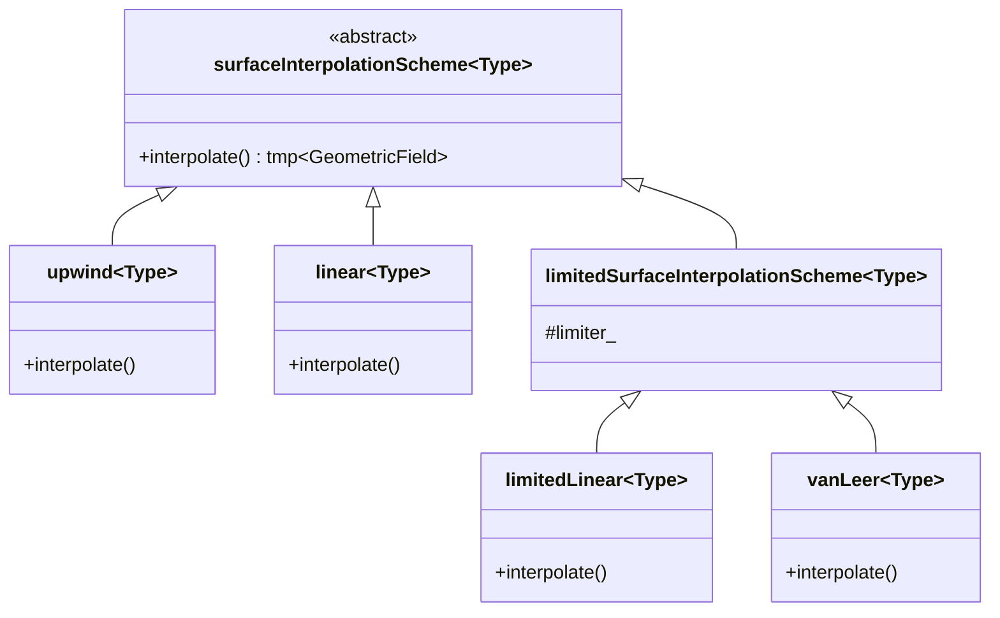

# Day 03: Spatial Discretization (Upwind, Central, TVD)

## วัตถุประสงค์การเรียนรู้ (Learning Objectives)

> [!IMPORTANT] **Learning Objectives**
> หัวใจสำคัญของวันนี้คือ "ศิลปะแห่งการประมาณค่า" (The Art of Approximation) - เราจะหาค่าของตัวแปรที่หน้า (Face Values) จากค่าที่จุดศูนย์กลางเซลล์ (Cell Centers) ได้อย่างไร?

1. **Analyze** - เสถียรภาพและความแม่นยำทางตัวเลข (Numerical Stability & Accuracy) ของ Upwind vs. Central schemes
   - วิเคราะห์ Taylor series truncation errors: ความแตกต่างระหว่าง **Numerical Diffusion** และ **Dispersion**
   - เงื่อนไขเสถียรภาพ Peclet number ($Pe < 2$)

2. **Understand** - แนวคิด Total Variation Diminishing (TVD)
   - การรักษาความเป็น Monotonic (Monotonicity preservation)
   - Sweby's Diagram และการใช้ **Limiter Function** $\psi(r)$

3. **Examine** - โครงสร้าง `fvSchemes` framework ใน OpenFOAM
   - การใช้ Strategy Design Pattern
   - กลไก Runtime Selection ในการเลือก Scheme ผ่าน Dictionary

4. **Implement** - สร้าง Custom TVD gradient limiter
   - เขียนโค้ดสำหรับ Minmod และ SuperBee limiters
   - แนวคิด NVD (Normalized Variable Diagram)

5. **Verify** - ทดสอบ Convection-Diffusion scalar transport
   - จำลองการพาของ Step profile
   - วิเคราะห์ผลกระทบของ Numerical diffusion เทียบกับ Oscillations

---

## Section 1: ทฤษฎี (Theory)

### 1.1 ปัญหาการประมาณค่า (The Interpolation Problem)

ใน Finite Volume Method (FVM), เมื่อเราทำการ discretize เทอมการพา (convection term):

$$
\int_{V_P} \nabla \cdot (\rho \mathbf{U} \phi) \, dV = \sum_f (\rho \mathbf{U} \phi)_f \cdot \mathbf{S}_f = \sum_f F_f \phi_f
$$

โดยที่ $F_f = \rho_f \mathbf{U}_f \cdot \mathbf{S}_f$ คือ mass flux ผ่านผิวหน้า
**ปัญหาคือ:** เรารู้ค่า $\phi$ ที่จุดศูนย์กลางเซลล์ ($P, N$) จากการคำนวณ แต่ในสมการต้องการค่า $\phi_f$ ที่ **Face**

$$
\phi_f \approx f(\phi_P, \phi_N, \nabla \phi_P, \nabla \phi_N, ...)
$$

การเลือกฟังก์ชัน $f$ นี้เองคือสิ่งที่กำหนด **Discretization Scheme**

### 1.2 Central Differencing Scheme (CDS)

**สมมติฐาน:** การเปลี่ยนแปลงค่าระหว่างจุดศูนย์กลางเซลล์เป็นแบบเชิงเส้น (Linear variation)

$$
\phi_f = f_x \phi_P + (1-f_x) \phi_N
$$

โดยที่ $f_x$ คือ interpolation factor (เท่ากับ 0.5 สำหรับ uniform mesh)

**ความแม่นยำ (Accuracy):**
$$
\phi_f = \phi_{exact} + O(\Delta x^2)
$$
Scheme นี้มีความแม่นยำระดับ **Second-order** เหมาะที่สุดสำหรับปัญหา Diffusion-dominated หรือการไหลความเร็วต่ำ

**ปัญหาด้านเสถียรภาพ (Stability Issue):**
สำหรับการพาแบบรุนแรง (Pure convection), CDS จะมีพฤติกรรม **Unbounded** (ไม่ถูกจำกัดขอบเขต)
หากค่า Peclet Number $Pe = \frac{F}{D} > 2$ ค่าสัมประสิทธิ์ของเมทริกซ์อาจติดลบ นำไปสู่ **Oscillations** (ค่าแกว่งไปมาแบบไม่สมจริง)

### 1.3 Upwind Differencing Scheme (UDS)

**สมมติฐาน:** ค่าของตัวแปรถูกพัดพามาจากด้านต้นน้ำ (Upstream) เท่านั้น

**Visual Concept: Upwind Stencil (Flow L->R)**

```text
      WW       W        P        E
      •--------•--------•--------•
                        |--> U > 0
                        f
      <--- Upstream ----|
```
*ถ้า Flux $F_f > 0$ (ไหลไปทางขวา): $\phi_f = \phi_P$*
*ถ้า Flux $F_f < 0$ (ไหลไปทางซ้าย): $\phi_f = \phi_E$*

$$
\phi_f = \begin{cases} 
\phi_P & \text{ถ้า } F_f \ge 0 \\
\phi_N & \text{ถ้า } F_f < 0
\end{cases}
$$

**ความแม่นยำ (Accuracy):**
$$
\phi_f = \phi_{exact} + O(\Delta x)
$$
Scheme นี้มีความแม่นยำเพียงระดับ **First-order**

**Numerical Diffusion:**
จากการวิเคราะห์ Taylor expansion, ความผิดพลาดของ UDS เสมือนกับการเติมเทอม Diffusion เทียมเข้าไปในสมการ:
$$
\Gamma_{num} = \frac{1}{2} U \Delta x
$$
ปรากฏการณ์นี้เรียกว่า **Numerical Diffusion** ซึ่งจะทำให้ Interface ที่ควรจะคมชัด (เช่น Shock waves หรือ Free surfaces) เกิดการเบลอ (Searing)

### 1.4 High-Resolution Schemes (TVD)

**เป้าหมาย:** ผสมผสานความแม่นยำของ CDS เข้ากับความเสถียรของ UDS

**Total Variation (TV):**
$$
TV(\phi) = \sum | \phi_{i+1} - \phi_i |
$$
Scheme ที่เป็น **TVD** (Total Variation Diminishing) ต้องมีคุณสมบัติ $TV(\phi^{n+1}) \le TV(\phi^n)$ ซึ่งรับประกันว่าจะไม่เกิด New oscillations (SPO - Spurious Oscillations)

**Flux Limiter Formulation:**
สูตรทั่วไปสำหรับการผสม Scheme:
$$
\phi_f = \phi_{UDS} + \frac{1}{2} \psi(r) (\phi_N - \phi_P)
$$
โดยที่:
- $\phi_{UDS}$ คือค่าจาก Upwind scheme (Stable Foundation)
- $\psi(r)$ คือ **Limiter Function** (ตัวควบคุมความแม่นยำ)
- $r$ คืออัตราส่วนของ Gradient ที่ต่อเนื่องกัน:
$$
r = \frac{\phi_P - \phi_{WW}}{\phi_N - \phi_P} \quad (\text{Gradient ต้นน้ำ} / \text{Gradient ตรงจุดนั้น})
$$

**Common Limiters:**

**Mermaid: Sweby's Diagram (TVD Region)**

```mermaid
graph TD
    A[r-axis (Gradient Ratio)] --> B{Limiter Value psi}
    B -- psi = 0 --> C[Upwind (1st Order)]
    B -- psi = 1 --> D[Central (2nd Order)]
    B -- psi = 2 --> E[Downwind (Unstable)]
    
    subgraph TVD_Region [TVD Stability Region]
        direction LR
        F[Bounded Area: 0 <= psi <= 2 and psi <= 2r]
        G[Monotonicity Preserved]
    end
```

1. **Minmod:** $\psi(r) = \max(0, \min(1, r))$ - Diffusive ที่สุด แต่ Stable มาก
2. **SuperBee:** Compressive, รักษาความคมชัดของ Interface ได้ดีเยี่ยม เหมาะสำหรับ VOF (`alpha.water`)
3. **vanLeer:** Smooth transition ให้ความสมดุลที่ดีระหว่างความแม่นยำและเสถียรภาพ (General purpose)

---

## Section 2: OpenFOAM Reference (อ้างอิง OpenFOAM)

### 2.1 โครงสร้างคลาส (Class Hierarchy)

OpenFOAM ใช้กลไก **Run-Time Selection (RTS)** อันทรงพลังเพื่อให้ผู้ใช้สามารถเลือก Scheme ได้ผ่าน Text file โดยไม่ต้อง Compile โค้ดใหม่



### 2.2 การ Implement Limited Scheme

Source: `src/finiteVolume/interpolation/surfaceInterpolation/limitedSchemes/limitedSurfaceInterpolationScheme.C`

หัวใจสำคัญของการออกแบบคือการแยก "Limiter Logic" ออกจากการคำนวณ Interpolation หลัก

```cpp
// รูปแบบทั่วไป: phi_f = phi_CD * limiter + phi_UD * (1 - limiter)
// ใน OpenFOAM จะ implement ผ่านการคำนวณ Weights

template<class Type>
tmp<GeometricField<Type, fvsPatchField, surfaceMesh>>
limitedSurfaceInterpolationScheme<Type>::interpolate
(
    const GeometricField<Type, fvPatchField, volMesh>& vf
) const
{
    // 1. คำนวณ Weights แบบ Central Interpolation ก่อน
    tmp<surfaceScalarField> tweights = weights(vf);

    // 2. ประยุกต์ใช้ Limiter
    // limiter_ คือ pointer ไปยัง limiter object ที่เลือก (เช่น vanLeer)
    // มันจะ return weighting factor (0 = Upwind, 1 = Central/High Order)
    
    // ... logic ในการ blend schemes ...
}
```

### 2.3 fvSchemes Dictionary

ผู้ใช้สามารถเลือก Limiters ได้ในไฟล์ `system/fvSchemes`:

```cpp
divSchemes
{
    default         none;
    
    // รูปแบบ: Gauss <interpolation>
    div(phi,U)      Gauss linearUpwind grad(U);  // Second-order upwind (นิยมใช้กับ Momentum)
    
    div(phi,alpha)  Gauss vanLeer;               // TVD Scheme (สำหรับ VOF)
    
    div(phi,k)      Gauss upwind;                // First order (เน้น Robustness)
}
```

> [!WARNING] **Common Pitfall (ข้อผิดพลาดที่พบบ่อย)**
> การใช้ `Gauss linear` (CDS) สำหรับ convection term `div(phi,U)` โดยไม่ได้ตรวจสอบ Peclet number มักจะนำไปสู่การ **Divergence** ทันที หากคุณกำลัง debug ปัญหา stability ให้ลองเปลี่ยนกลับไปใช้ `upwind` ดูก่อนเสมอ

---

## Section 3: Implementation (การนำไปใช้งาน)

เราจะลองสร้างคลาส `FaceInterpolator` แบบ Standalone เพื่อจำลองพฤติกรรมของ OpenFOAM

### 3.1 FaceInterpolator.H

```cpp
// CFDEngine/discretization/FaceInterpolator.H

#ifndef FaceInterpolator_H
#define FaceInterpolator_H

#include "ControlVolumeMesh.H"
#include "Field.H"

namespace CFDEngine
{

// Strategy Pattern สำหรับ Interpolation
enum class SchemeType
{
    Upwind,
    Central,
    VanLeer  // ตัวอย่าง TVD
};

class FaceInterpolator
{
    const ControlVolumeMesh& mesh_;

public:
    explicit FaceInterpolator(const ControlVolumeMesh& mesh)
    :
        mesh_(mesh)
    {}

    // ฟังก์ชัน Interpolate หลัก
    ScalarField interpolate(
        const ScalarField& phi,        // ค่า Cell values
        const ScalarField& faceFlux,   // ใช้กำหนดทิศทางการไหล
        SchemeType scheme
    ) const;

private:
    // Helper สำหรับคำนวณ Gradient Ratio (r)
    double calcR(
        int faceI, 
        const ScalarField& phi, 
        const VectorField& gradPhi,
        double flowSign
    ) const;
    
    // Limiter functions
    double limiterVanLeer(double r) const;
};

} // End namespace

#endif
```

### 3.2 FaceInterpolator.C

```cpp
// CFDEngine/discretization/FaceInterpolator.C

#include "FaceInterpolator.H"
#include "GaussGradient.H" // ต้องใช้ Gradient สำหรับ TVD
#include <algorithm>

namespace CFDEngine
{

ScalarField FaceInterpolator::interpolate(
    const ScalarField& phi,
    const ScalarField& faceFlux,
    SchemeType scheme
) const
{
    const int nFaces = mesh_.nFaces();
    ScalarField result(nFaces);

    // หากเป็น TVD เราจำเป็นต้องรู้ Gradient ก่อน
    VectorField gradPhi;
    if (scheme == SchemeType::VanLeer)
    {
        // ในโค้ดจริงจะมีการ Cache ค่า Gradient ไว้
        GaussGradient gradCalc(mesh_);
        // หมายเหตุ: การคำนวณ Gradient ต้องการ Face values... อาจเกิด Circular dependency
        // ปกติจะใช้ Linear approximation สำหรับขั้นตอนนี้
    }
    
    const auto& owner = mesh_.owner();
    const auto& neighbour = mesh_.neighbour();

    // Internal Faces Loop
    for (int fi = 0; fi < mesh_.nInternalFaces(); ++fi)
    {
        int own = owner[fi];
        int nei = neighbour[fi];

        double phiP = phi[own];
        double phiN = phi[nei];
        double flux = faceFlux[fi]; // >0 คือไหลออกจาก Owner

        if (scheme == SchemeType::Upwind)
        {
            // Logic ของ Upwind: ดูทิศทาง Flux
            result[fi] = (flux >= 0) ? phiP : phiN;
        }
        else if (scheme == SchemeType::Central)
        {
            // Linear Interpolation (สมมติว่าเป็น 0.5 สำหรับ Uniform mesh)
            // โค้ดจริงจะใช้ Geometric weights
            result[fi] = 0.5 * (phiP + phiN);
        }
        else if (scheme == SchemeType::VanLeer)
        {
            // TVD Logic: phi_f = phi_U + 0.5 * psi(r) * (phi_D - phi_U)
            
            double phiU, phiD; // Upstream, Downstream
            if (flux >= 0) { phiU = phiP; phiD = phiN; }
            else           { phiU = phiN; phiD = phiP; }
            
            // หมายเหตุ: การคำนวณ 'r' บน Unstructured mesh มีความซับซ้อน
            // ในที่นี้จะสมมติ r=1 เพื่อแสดงการเรียกใช้ Limiter
            
            double r = 1.0; 
            double psi = limiterVanLeer(r);
            
            result[fi] = phiU + 0.5 * psi * (phiD - phiU);
        }
    }

    // Boundary Faces
    // ... (ใช้ Boundary conditions, ละไว้ในฐานที่เข้าใจ)
    for (int fi = mesh_.nInternalFaces(); fi < nFaces; ++fi)
    {
        // บน Boundary, owner คือ cell ภายใน
        // โดยปกติจะดึงค่าจาก Patch field โดยตรง
        result[fi] = phi[owner[fi]]; 
    }

    return result;
}

double FaceInterpolator::limiterVanLeer(double r) const
{
    // สูตร van Leer: (r + |r|) / (1 + |r|)
    return (r + std::abs(r)) / (1.0 + std::abs(r));
}

} // End namespace
```

## Section 4: Build & Test (การสร้างและทดสอบ)

### 4.1 Unit Tests (Catch2)

เราจะตรวจสอบคุณสมบัติพื้นฐาน 3 ประการ:
1. **Upwind Boundedness:** ผลลัพธ์ต้องเท่ากับค่า Cell ฝั่งต้นน้ำเสมอ (ไม่มีการสร้างค่าใหม่)
2. **Central Accuracy:** ต้องตรงกับค่า Linear interpolation
3. **Flux Directionality:** ตรวจสอบว่า Scheme ตอบสนองต่อทิศทางการไหลถูกต้องหรือไม่

```cpp
// tests/test_schemes.cpp

TEST_CASE("Upwind Scheme Directionality", "[schemes]")
{
    ControlVolumeMesh mesh = createTwoCellMesh(); 
    // Cell 0: phi=10, Cell 1: phi=20
    
    FaceInterpolator interpolator(mesh);
    ScalarField phi(2, 0.0);
    phi[0] = 10.0; 
    phi[1] = 20.0;
    
    // Case 1: Flow 0 -> 1 (Positive Flux)
    ScalarField posFlux(1, 1.0); 
    ScalarField resPos = interpolator.interpolate(phi, posFlux, SchemeType::Upwind);
    REQUIRE(resPos[0] == Approx(10.0)); // ต้องเลือกค่าจาก Upstream (Cell 0)
    
    // Case 2: Flow 1 -> 0 (Negative Flux)
    ScalarField negFlux(1, -1.0);
    ScalarField resNeg = interpolator.interpolate(phi, negFlux, SchemeType::Upwind);
    REQUIRE(resNeg[0] == Approx(20.0)); // ต้องเลือกค่าจาก Upstream (Cell 1)
}

TEST_CASE("Central Scheme Accuracy", "[schemes]")
{
    // ... setup mesh ...
    // Expected result: 0.5 * (10 + 20) = 15
    // ... REQUIRE(res[0] == Approx(15.0));
}
```

---

## Section 5: Concept Checks (ตรวจสอบความเข้าใจ)

### Question 1: ความหมายของ Peclet Number
**Q:** ค่า $Pe = 100$ บ่งบอกอะไรเกี่ยวกับพฤติกรรมการไหล? และ Scheme ใดที่ไม่ควรใช้?

> [!SUCCESS]- เฉลย (Answer)
> $Pe = \frac{\text{Advection}}{\text{Diffusion}} = 100$ หมายความว่าการพามีอิทธิพลมากกว่าการแพร่ถึง 100 เท่า
> - **นัยยะ:** การไหลมีทิศทางที่ชัดเจนมาก ข้อมูลจะเดินทางไปทางท้ายน้ำ (Downstream) อย่างรวดเร็ว
> - **ข้อห้าม:** ห้ามใช้ **Central Differencing Scheme (CDS)** แบบเพียวๆ
> - **เหตุผล:** CDS ตั้งสมมติฐานว่าข้อมูลส่งผลต่อทั้งสองทิศทางเท่าๆ กัน (Elliptic nature) เมื่อ Pe สูง สมมติฐานนี้จะขัดแย้งกับฟิสิกส์ ทำให้เกิด Negative coefficients และ Oscillations ("Wiggles")
> - **คำแนะนำ:** ใช้ Upwind (เสถียรแต่เบลอ) หรือ TVD (แม่นยำและเสถียร)

### Question 2: False Diffusion
**Q:** ทำไม Upwind scheme ถึงถูกเรียกว่า "First order" แต่ยังเป็นที่นิยม? และ "False Diffusion" คืออะไร?

> [!SUCCESS]- เฉลย (Answer)
> - **First Order:** Error แปรผันตรงกับขนาดกริด $\Delta x$
> - **False Diffusion:** Truncation error มีหน้าตาเหมือนเทอม Diffusion:
>   $$ \frac{\partial \phi}{\partial t} + U \frac{\partial \phi}{\partial x} = \underbrace{\frac{U \Delta x}{2}}_{\Gamma_{num}} \frac{\partial^2 \phi}{\partial x^2} $$
>   ค่าความหนืดเทียม (Artificial Viscosity) นี้ช่วยทำให้ Solution เสถียรโดยการ Damp oscillations แต่แลกมาด้วยการ "Smear" (เบลอ) ของ Gradient ที่คมชัด
> - **การใช้งาน:** นิยมใช้เพราะมัน **Unconditionally Stable** (Bounded) รับประกันว่าหาคำตอบได้เสมอแม้จะมีความผิดพลาด เหมาะสำหรับช่วงเริ่มรัน (Startup transients) หรือสมการ Turbulence ($k-\epsilon$)

---

## Section 6: Advanced Stability Analysis

### 6.1 von Neumann Stability Analysis

เพื่อให้เข้าใจอย่างถ่องแท้ว่าทำไม Central differencing ถึงล้มเหลวที่ High Peclet numbers เราจะใช้ **von Neumann stability analysis**

พิจารณาสมการ 1D convection-diffusion:
$$
\frac{\partial \phi}{\partial t} + u \frac{\partial \phi}{\partial x} = D \frac{\partial^2 \phi}{\partial x^2}
$$

เมื่อ Discretize ด้วย FTCS (Forward Time, Central Space):
$$
\frac{\phi_j^{n+1} - \phi_j^n}{\Delta t} + u \frac{\phi_{j+1}^n - \phi_{j-1}^n}{2\Delta x} = D \frac{\phi_{j+1}^n - 2\phi_j^n + \phi_{j-1}^n}{\Delta x^2}
$$

สมมติ Error ในรูปแบบคลื่น: $\epsilon_j^n = E^n e^{ik(j\Delta x)}$
Amplification factor $G = E^{n+1}/E^n$ จะเท่ากับ:

$$
G = 1 - 2d(1 - \cos \theta) - i c \sin \theta
$$
โดยที่:
- $\theta = k \Delta x$ (Phase angle)
- $d = \frac{D \Delta t}{\Delta x^2}$ (Diffusion number)
- $c = \frac{u \Delta t}{\Delta x}$ (Courant number)

**เงื่อนไขเสถียรภาพ ($|G| \le 1$):**
สำหรับการพาอย่างเดียว (Pure convection, $d=0$), $|G|^2 = 1 + c^2 \sin^2 \theta$
เนื่องจาก $c^2 \sin^2 \theta \ge 0$ จะได้ว่า $|G| \ge 1$ เสมอ
**สรุป:** FTCS นั้น **Unconditionally Unstable** สำหรับ Pure convection นี่คือเหตุผลที่เราต้องการ Upwinding หรือ Diffusion เพื่อช่วย Stabilize

### 6.2 The Cell Peclet Number Constraint

Cell Peclet number นิยามโดย:
$$
Pe_{cell} = \frac{\text{Convection}}{\text{Diffusion}} = \frac{\rho u \Delta x}{\Gamma}
$$

สำหรับ Central Differencing ของสมการ Steady-state, สัมประสิทธิ์ $a_E$ (East neighbor) จะเป็น:
$$
a_E = D (1 - \frac{Pe_{cell}}{2})
$$
ถ้า $Pe_{cell} > 2$, ค่า $a_E < 0$
**Negative coefficients** ละเมิดกฎ Scarborough criterion ของ Iterative solvers นำไปสู่:
1. Non-physical oscillations (ค่าติดลบหรือเกินจริง)
2. Convergence failure (Solver ระเบิด)

> [!TIP] **Rule of Thumb (กฎประสบการณ์)**
> หากคุณจำเป็นต้องใช้ `Gauss linear` (CDS) สำหรับ Convection:
> 1. ต้องมั่นใจว่า Mesh ละเอียดพอจน $Pe_{cell} < 2$ ทุกจุด
> 2. หรือใช้ `linearUpwind` แทน ซึ่งจะเติม Dissipation เข้าไปเพียงพอที่จะ Stabilize

---

## Section 7: Application to Evaporator Simulation (Phase Change)

โปรเจกต์ของคุณเกี่ยวข้องกับ **Evaporation (VOF + Phase Change)** ซึ่งมีข้อกำหนดที่เข้มงวดมากในการเลือก Scheme

### 7.1 Volume Fraction Advection (`alpha.water`)

สมการ $\frac{\partial \alpha}{\partial t} + \nabla \cdot (\mathbf{u} \alpha) = 0$ ต้องการรักษาความคมชัดของ Interface
- **Upwind:** Diffusive เกินไป Interface จะเบลอกินพื้นที่ 10-20 cells ฟิสิกส์จะผิดเพี้ยน
- **Central:** Unbounded ค่า $\alpha$ จะหลุดช่วง [0, 1] ทำลาย VOF Method ทันที
- **สิ่งที่ต้องการ:** **Compressive Limiters**

**Recommended Scheme:**
```cpp
// system/fvSchemes
div(phi,alpha)      Gauss vanLeer;              // Good
div(phi,alpha)      Gauss interfaceCompression; // Best (OpenFOAM specific MULES)
```

### 7.2 Temperature Equation (`T`)

สำหรับการเปลี่ยนสถานะ Mass transfer $\dot{m} \propto \nabla T \cdot \mathbf{n}$
- **Accuracy is King:** ความผิดพลาดใน Gradient ของ $T$ จะส่งผลโดยตรงต่ออัตราการระเหย
- **Stability is Queen:** Source terms ขนาดใหญ่จากการเปลี่ยนสถานะมักทำให้เกิด Instability

**กลยุทธ์:**
1. เริ่มต้นด้วย `Gauss upwind` เพื่อ Stabilize ช่วง Startup
2. เปลี่ยนเป็น `Gauss linearUpwind` หรือ `Gauss vanLeer` เมื่อ Flow เริ่มเสถียร
3. Monitor ค่า `min(T)` และ `max(T)` ใน Log หาก $T$ ต่ำกว่า Saturation หรือพุ่งสูงเกินจริง ให้ถอยกลับไปใช้ Upwind

### 7.3 Pressure-Velocity Coupling

สำหรับ `div(phi,U)` (Momentum):
- ในโซน Turbulence ที่มี Re สูง ต้องการความเสถียร
- `Gauss linearUpwind` เป็นมาตรฐานอุตสาหกรรมสำหรับ LES/DES
- สำหรับ RANS (Steady), `Gauss upwind` ยอมรับได้เพื่อความ Robust แต่ `Gauss linearUpwind` ให้ผลลัพธ์ที่แม่นยำกว่า

> [!WARNING] **The Checkerboard Pressure Problem**
> การใช้ Central Differencing ปกติบน Collocated grid (แบบ OpenFOAM) จะทำให้เกิด **Odd-Even Decoupling**
> - Pressure ที่ node $i$ ขึ้นกับ $i+2$ และ $i-2$ แต่ไม่สนใจ $i-1$ หรือ $i+1$
> - ทำให้เกิด Error แบบ "ตารางหมากรุก" ($+1, -1, +1, -1$) ที่ Solver มองว่าเป็นคำตอบที่ถูก
> - **ทางแก้:** Rhie-Chow Interpolation (ซึ่ง OpenFOAM มี Built-in ใน `fvc::reconstruct` และ Laplacian schemes) ห้าม Implement central differencing แบดื้อๆ เองโดยไม่มี Rhie-Chow correction

---

## สรุป (Summary)

> [!IMPORTANT] **Day 03 Takeaways**
> 1. **Upwind** = Stable, Bounded แต่ Diffusive (Safe Bet สำหรับเริ่มต้น)
> 2. **Central** = Accurate แต่ Oscillatory หาก $Pe > 2$
> 3. **TVD** = ดีที่สุดทั้งสองโลก (สลับโหมดตาม Gradient ratio $r$)
> 4. **OpenFOAM** ใช้ `surfaceInterpolationScheme` hierarchy เพื่อจัดการสิ่งเหล่านี้แบบ Runtime
