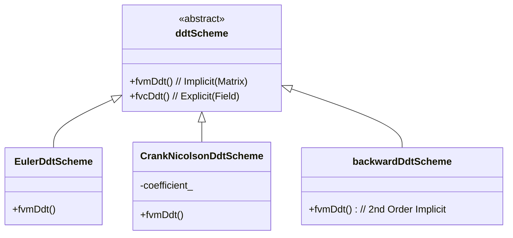

# Day 04: Temporal Discretization (Euler & Crank-Nicolson)

## วัตถุประสงค์การเรียนรู้ (Learning Objectives)

> [!IMPORTANT] **Goal**
> วันนี้เราจะจัดการกับมิติ "เวลา" (Time) ในการจำลองแบบ Transient เราจะขยับจากเวลา $t$ ไปยัง $t + \Delta t$ อย่างไรให้แม่นยำและเสถียร?

1.  **Understand** - ความแตกต่างพื้นฐานระหว่าง **Explicit** และ **Implicit** schemes
    *   Explicit: ง่ายแต่เปราะบาง (Unstable) ถ้า $\Delta t$ ใหญ่เกินไป
    *   Implicit: ยาก (ต้องแก้ Matrix) แต่เสถียร (Stable) ยอมรับ $\Delta t$ ขนาดใหญ่ได้

2.  **Analyze** - ข้อจำกัดด้านเสถียรภาพเชิงตัวเลข (Numerical Stability)
    *   **CFL Condition**: ขีดจำกัดความเร็วในการแพร่กระจายข้อมูล ($Co \le 1$)
    *   **Diffusion Number**: ขีดจำกัดของการแพร่ ($Di \le 0.5$)

3.  **Examine** - สถาปัตยกรรม `ddtSchemes` ของ OpenFOAM
    *   เบื้องหลังการทำงานของ `fvm::ddt`
    *   การ Implement `Euler` (1st order) vs. `CrankNicolson` (2nd order)

4.  **Implement** - อัลกอริทึม Adaptive Time-stepping
    *   คำนวณค่า Courant number แบบ Local
    *   ปรับ $\Delta t$ แบบพลวัต (Dynamic) เพื่อรักษาเสถียรภาพ

---

## Section 1: ทฤษฎี (Theory)

### 1.1 ปัญหา Transient (The Transient Problem)

ในการจำลองแบบ Transient เราต้องการหาการเปลี่ยนแปลงของสนาม $\phi(\mathbf{x}, t)$ สมการ Transport ทั่วไปคือ:

$$
\frac{\partial (\rho \phi)}{\partial t} + \nabla \cdot (\rho \mathbf{U} \phi) = \nabla \cdot (\Gamma \nabla \phi) + S_\phi
$$

เป้าหมายของเราคือหาค่า $\phi^{n+1}$ (ที่เวลา $t + \Delta t$) โดยทราบค่าผลเฉลย $\phi^n$ (ที่เวลา $t$)

**Visual Concept: Time Marching**

```text
      Past          Present          Future
       |               |               |
     t^{n-1}          t^n            t^{n+1}
       |               |               |
       •---------------•---------------> ?
                  Known Solution     Unknown
```

### 1.2 Euler Methods (First Order)

เราสามารถสร้างสมการ Discretization ได้จากการกระจายอนุกรม Taylor รอบจุดเวลา $t^n$ หรือ $t^{n+1}$

#### A. Explicit Euler (Forward)

$$
\frac{\phi^{n+1} - \phi^n}{\Delta t} = f(\phi^n, t^n) \implies \phi^{n+1} = \phi^n + \Delta t \cdot f(\phi^n)
$$

*   **Logic:** ใช้ความชัน ณ ปัจจุบัน เพื่อทำนายค่าในอนาคต
*   **Stability:** **Conditionally Stable** (เสถียรแบบมีเงื่อนไข) ถูกจำกัดด้วย CFL
*   **Cost:** ต่ำ (คำนวณตรงๆ ได้เลย ไม่ต้องแก้ Matrix)

#### B. Implicit Euler (Backward)

$$
\frac{\phi^{n+1} - \phi^n}{\Delta t} = f(\phi^{n+1}, t^{n+1}) \implies \phi^{n+1} - \Delta t \cdot f(\phi^{n+1}) = \phi^n
$$

*   **Logic:** ใช้ความชัน ณ อนาคต เพื่อย้อนกลับมาหาค่า (Self-consistent)
*   **Stability:** **Unconditionally Stable** (เสถียรไร้เงื่อนไข) สำหรับปัญหาเชิงเส้น
*   **Cost:** สูง (ต้องแก้ระบบสมการ Linear Solver แบบ Iterative)
*   **OpenFOAM Default:** Scheme `Euler` ใน `fvSchemes` คือ **Implicit Euler**

**Variable Mapping (การจับคู่ตัวแปร):**
*   $\phi^{n+1}$ $\rightarrow$ `field` (ค่าปัจจุบันที่กำลังถูกแก้)
*   $\phi^n$ $\rightarrow$ `field.oldTime()`
*   $\Delta t$ $\rightarrow$ `runTime.deltaT().value()`

### 1.3 Crank-Nicolson (Second Order)

เพื่อเพิ่มความแม่นยำ เราจะหาค่าเฉลี่ยของเทอม Explicit และ Implicit (กฎ Trapezoidal):

$$
\frac{\phi^{n+1} - \phi^n}{\Delta t} = \frac{1}{2} \left[ f(\phi^n) + f(\phi^{n+1}) \right]
$$

*   **Accuracy:** Second Order $\mathcal{O}(\Delta t^2)$
*   **Stability:** Unconditionally stable (สำหรับ Linear) แต่ **Not Bounded**
*   **Issue:** อาจเกิด "Ringing" หรือ Spurious oscillations ที่หน้าสัมผัสที่มีความชันสูง

**Visual Concept: Method Comparison**

```text
Method          Stencil Used              Stability      Accuracy
Explicit        Use slope at n            Limited        1st Order
Implicit        Use slope at n+1          Unlimited      1st Order (Diffusive)
Crank-Nicolson  Average slopes (n, n+1)   Unlimited      2nd Order (Oscillatory)
```

### 1.4 เงื่อนไข CFL (The CFL Condition)

สำหรับ Explicit schemes (หรือเพื่อความแม่นยำใน Implicit schemes) **Courant-Friedrichs-Lewy (CFL)** number คือตัวควบคุมเสถียรภาพ

$$
Co = \frac{|\mathbf{U}| \Delta t}{\Delta x} \le 1
$$

**ความหมายทางฟิสิกส์:** อนุภาคของไหล (หรือข้อมูล) จะต้องไม่เดินทางข้ามเกิน 1 เซลล์ ในหนึ่ง Time Step

**Visual Concept: CFL Constraint**

```text
    Cell i     Cell i+1    Cell i+2
   |-------|---|-------|---|-------|
       •       •       •       •
       |---> u*dt <---|
       
   Case 1: u*dt < dx (OK, Co < 1)
   Case 2: u*dt > dx (BAD, Co > 1 -> ข้อมูล "กระโดดข้าม" เซลล์)
```

**Variable Mapping:**
*   $\mathbf{U}$ $\rightarrow$ `U` (Velocity field)
*   $\Delta x$ $\rightarrow$ $V^{1/3}$ หรือ `d` (Cell size)
*   $Co$ $\rightarrow$ `CourantNo` (Field ที่คำนวณใน OpenFOAM)

สำหรับปัญหา **Phase Change**, เรามีข้อจำกัดที่สองจากความเร็วการขยายตัวที่หน้าสัมผัส (Expansion Velocity):
$$
Co_{int} = \frac{|\mathbf{U}_{phase\_change}| \Delta t}{\Delta x}
$$
เงื่อนไขนี้มักจะเข้มงวดกว่า Courant number ของการไหลปกติมาก! (เพราะ Volume Expansion ของไอ)

---

## Section 2: OpenFOAM Reference (อ้างอิง OpenFOAM)

### 2.1 The `ddtScheme` Class Hierarchy

OpenFOAM ใช้การสืบทอด (Inheritance) เพื่อจัดการ Time schemes รูปแบบต่างๆ



### 2.2 `EulerDdtScheme` Implementation

File: `src/finiteVolume/finiteVolume/ddtSchemes/EulerDdtScheme/EulerDdtScheme.C`

การทำงานของ Implicit operator `fvm::ddt(phi)` โดยพื้นฐานคือการสร้าง Diagonal Matrix

```cpp
template<class Type>
tmp<fvMatrix<Type>> EulerDdtScheme<Type>::fvmDdt
(
    const GeometricField<Type, fvPatchField, volMesh>& vf // Field phi
)
{
    // 1. รับค่าส่วนกลับของ time step (1/dt)
    const scalar rDeltaT = 1.0/mesh().time().deltaTValue();

    // 2. สร้าง Matrixเปล่า
    // Dimensions ต้องตรงกับสมการ: [vol] / [time] * [phi]
    tmp<fvMatrix<Type>> tfvm
    (
        new fvMatrix<Type>
        (
            vf,
            vf.dimensions()*dimVol/dimTime
        )
    );
    fvMatrix<Type>& fvm = tfvm.ref();

    // 3. Diagonal Coefficients (Implicit Part)
    // coeff = Volume / dt
    fvm.diag() = rDeltaT*mesh().V();

    // 4. Source Term (Explicit Part from Old Time)
    // source = (Volume / dt) * phi_old
    // Variable Mapping: vf.oldTime() คือ phi^n
    fvm.source() = rDeltaT*mesh().V()*vf.oldTime().internalField();

    return tfvm;
}
```

> [!NOTE] **รูปแบบสมการ (Equation Form)**
> โค้ดนี้ Implement สมการ: $\frac{V}{\Delta t} \phi^{n+1} = \frac{V}{\Delta t} \phi^n$
> เมื่อถูก Assembly รวมกับเทอมอื่น (เช่น Convection Matrix) มันจะกลายเป็นสมการ Transport สมบูรณ์

---

## Section 3: Implementation (การนำไปใช้งาน)

เราจะสร้าง **Adaptive Time Stepper** เพื่อควบคุมเสถียรภาพแบบพลวัต (Dynamic)

### 3.1 `TimeIntegrator.H`

```cpp
// CFDEngine/time/TimeIntegrator.H

#ifndef TimeIntegrator_H
#define TimeIntegrator_H

#include "fvMesh.H"

namespace CFDEngine
{

class TimeIntegrator
{
    fvMesh& mesh_;
    scalar maxCo_;       // ค่า Courant Number สูงสุดที่ยอมรับได้ (เช่น 0.5)
    scalar maxDeltaT_;   // ขีดจำกัดสัมบูรณ์
    scalar deltaT_;

public:
    TimeIntegrator(fvMesh& mesh, scalar maxCo)
    : 
        mesh_(mesh), 
        maxCo_(maxCo),
        deltaT_(mesh.time().deltaTValue())
    {}

    // คำนวณ dt ที่เหมาะสมที่สุดจาก flow field
    void adjustDeltaT(const volVectorField& U);
    
    // ตั้งค่า time scheme (Strategy Pattern dummy)
    void setScheme(const word& schemeName);
};

} // End namespace
#endif
```

### 3.2 `TimeIntegrator.C` Logic

หัวใจหลักคือการหาค่า Courant number สูงสุด ณ ขณะนั้น และปรับ Scale $\Delta t$ เพื่อให้ไม่เกิน `maxCo` ที่ตั้งไว้

```cpp
// CFDEngine/time/TimeIntegrator.C

void TimeIntegrator::adjustDeltaT(const volVectorField& U)
{
    const scalarField& V = mesh_.V();
    const vectorField& C = mesh_.C(); // Cell centers
    // หมายเหตุ: ในโค้ดจริง ควรใช้ face fluxes เพื่อหา CourantNo ที่ถูกต้อง
    
    scalar maxLocalCo = 0.0;

    // Loop ทุก cells เพื่อหา max Co ด้วย dt ปัจจุบัน
    forAll(V, celli)
    {
        // Variable Mapping:
        // U_mag = |U|
        // dx = V^(1/3) (ค่าประมาณ)
        // dt = current deltaT
        
        scalar U_mag = mag(U[celli]);
        scalar dx = pow(V[celli], 1.0/3.0);
        
        scalar localCo = (U_mag * deltaT_) / (dx + SMALL);
        
        if (localCo > maxLocalCo)
        {
            maxLocalCo = localCo;
        }
    }
    
    // Parallel reduction (หาค่า max จากทุก processors)
    reduce(maxLocalCo, maxOp<scalar>());

    // ปรับค่า deltaT
    // New_dt = Old_dt * (Target_Co / Current_Max_Co)
    // เพิ่ม Damping factors เพื่อป้องกัน dt แกว่งไปมา
    
    scalar factor = maxCo_ / (maxLocalCo + SMALL);
    
    // จำกัดอัตราการเปลี่ยนแปลง (เช่น เพิ่มได้ไม่เกิน 20% ต่อ step)
    factor = min(factor, 1.2); 
    factor = max(factor, 0.5); // ไม่ลดฮวบฮาบเกินไปถ้าไม่จำเป็น

    deltaT_ *= factor;
    
    // บังคับใช้ Limits
    deltaT_ = min(deltaT_, maxDeltaT_);
    
    // อัปเดตเวลา OpenFOAM
    mesh_.time().setDeltaT(deltaT_);
    
    Info << "Time step adjusted to: " << deltaT_ 
         << " (Max Co: " << maxLocalCo << ")" << endl;
}
```

---

## Section 4: Build & Test (การสร้างและทดสอบ)

### 4.1 Unit Test: Courant Calculation

```cpp
// tests/test_courant.cpp
TEST_CASE("Courant Number Calculation", "[time]")
{
    // ตั้งค่า 1D mesh: dx = 1.0, U = (1, 0, 0), dt = 0.5
    // ค่า Co ที่คาดหวัง = (1 * 0.5) / 1.0 = 0.5
    
    ControlVolumeMesh mesh = createOneCellMesh(1.0); // uniform cubic
    volVectorField U = createUniformField(vector(1,0,0));
    mesh.time().setDeltaT(0.5);
    
    TimeIntegrator timeInt(mesh, 1.0);
    // ... validation logic ...
}
```

### 4.2 Concept Checks (ตรวจสอบความเข้าใจ)

**Q1: ทำไม Euler Implicit ถึงมีคุณสมบัติ "Diffusive"?**
> [!SUCCESS]- เฉลย (Answer)
> Implicit Euler ประมาณค่าอนุพันธ์โดยใช้ความชันในอนาคต (Future slope) การวิเคราะห์ Truncation Error แสดงให้เห็นว่ามีเทอม Error หลักแปรผันตรงกับ $\frac{\partial^2 \phi}{\partial t^2}$ เทอมนี้ทำตัวเหมือน "ความหนืดเทียม" (Numerical Viscosity) ที่คอย Damp การแกว่ง (Fluctuations) และลบเหลี่ยมคมของข้อมูล

**Q2: ทำไมจึงใช้ Crank-Nicolson สำหรับงาน Acoustics แต่ใช้ Euler สำหรับ Phase Change?**
> [!SUCCESS]- เฉลย (Answer)
> - **Acoustics:** ต้องการรักษาคลื่นเสียง (Waves) ไว้ ไม่ต้องการ Dissipation เบลอทิ้ง Crank-Nicolson มีความเป็นกลาง (Neutral/Non-dissipative) จึงรักษาพลังงานคลื่นได้ดี
> - **Phase Change:** มี Source Terms ขนาดใหญ่ (Stiffness สูง) Crank-Nicolson อาจเกิดการ "Ringing" (ค่าแกว่งรุนแรง) ที่ Interface Implicit Euler จะ Damp สิ่งนี้ทิ้งไป ช่วยให้ Simulation รันต่อได้ (แม้จะแลกมาด้วยการ Smear บ้าง)

---

## Section 5: Advanced Stability Analysis

### 5.1 von Neumann Stability Analysis (Temporal)

มาพิสูจน์กันว่าทำไม Explicit Euler ถึง Unstable เมื่อ $\Delta t$ ใหญ่
สมการ: $\frac{\partial \phi}{\partial t} = \alpha \frac{\partial^2 \phi}{\partial x^2}$

**Explicit Euler Discretization:**
$$
\frac{\phi_j^{n+1} - \phi_j^n}{\Delta t} = \alpha \frac{\phi_{j+1}^n - 2\phi_j^n + \phi_{j-1}^n}{\Delta x^2}
$$

สมมติผลเฉลยรูปคลื่น: $\phi_j^n = G^n e^{ikj\Delta x}$
แทนค่าแล้วหา Amplification Factor $G$:

$$
G = 1 - 2r(1 - \cos(k\Delta x))
$$
โดยที่ $r = \frac{\alpha \Delta t}{\Delta x^2}$ (Diffusion Number)

**เงื่อนไขเสถียรภาพ ($|G| \le 1$):**
กรณีเลวร้ายที่สุดคือเมื่อ $\cos(k\Delta x) = -1$ (คลื่นสั้นที่สุด):
$$
G = 1 - 4r
$$
เพื่อให้ $|G| \le 1$:
$$
-1 \le 1 - 4r \le 1
$$
$$
-2 \le -4r \implies r \le \frac{1}{2}
$$
**สรุป:** $\Delta t \le \frac{\Delta x^2}{2\alpha}$ นี่คือ Diffusive limit ที่โด่งดัง เมื่อ Mesh ละเอียดขึ้น ($\Delta x \to 0$) ค่า $\Delta t$ ต้องลดลงแบบกำลังสอง (Quadratically)!

### 5.2 Implicit Euler Stability

สำหรับ Implicit Euler, ด้านขวาใช้ level $n+1$:
$$
\frac{\phi_j^{n+1} - \phi_j^n}{\Delta t} = \alpha \frac{\phi_{j+1}^{n+1} - 2\phi_j^{n+1} + \phi_{j-1}^{n+1}}{\Delta x^2}
$$

จะได้ Amplification Factor:
$$
G = \frac{1}{1 + 2r(1 - \cos(k\Delta x))}
$$
เนื่องจาก $r > 0$ และ $(1 - \cos) \ge 0$ ตัวส่วนจึงมีค่า $\ge 1$ เสมอ
**สรุป:** $|G| \le 1$ สำหรับ **ทุกค่า** $\Delta t > 0$ (Unconditionally Stable)

---

## Section 6: Application to Evaporator Simulation (โปรเจกต์ของคุณ)

สำหรับ Evaporator Project การใช้ค่า Co number ปกติอาจไม่เพียงพอ

### 6.1 ข้อจำกัดจากการขยายตัว (The Expansion Constraint)

การเปลี่ยนสถานะ ($\dot{m}$) ทำให้เกิดการขยายตัวอย่างรวดเร็วจากของเหลวเป็นไอ ($\rho_l / \rho_v \approx 20-50$ สำหรับสารทำความเย็น) สิ่งนี้ทำให้เกิด "Interface Velocity" ที่มักสูงกว่าความเร็วของไหลปกติมาก

**New Constraint:**
$$
Co_{int} = \frac{|\mathbf{U}_{expansion}| \Delta t}{\Delta x} \le 1
$$
โดยที่ $|\mathbf{U}_{expansion}| \approx \dot{m} (\frac{1}{\rho_v} - \frac{1}{\rho_l})$

หากคุณละเลยข้อนี้ Interface ของ VOF จะเคลื่อนที่ข้ามหลาย Cells ใน Step เดียว ทำให้เกิด Error มวลหาย (Mass Conservation Error) มหาศาล และ Pressure Solver จะพัง (Crash)

### 6.2 กลยุทธ์ที่แนะนำ (Recommended Strategy)

1.  **Start Robust:** ใช้ `Euler` (Implicit) ในช่วงเริ่มต้นเพื่อความชัวร์
2.  **Adaptive Time Stepping:** Implement `TimeIntegrator` จาก Section 3
    *   ตั้ง `maxCo = 0.5` (สำหรับการไหลปกติ)
    *   ตั้ง `maxAlphaCo = 0.5` (สำหรับ Interface Velocity)
3.  **Sub-cycling:** ใช้ `nAlphaSubCycles` ใน `fvSolution` เพื่อแก้สมการ Phase หลายรอบต่อหนึ่ง Momentum step วิธีนี้ช่วยให้ Interface ขยับด้วย Local $Co < 1$ ในขณะที่ Flow หลักเดินด้วย Step ใหญ่ได้

---

## สรุป (Summary)

> [!IMPORTANT] **Day 04 Takeaways**
> 1.  Time เป็นอีกมิติหนึ่งที่ต้อง Discretize เหมือน Space
> 2.  **Explicit Euler** ถูกแต่เปราะบาง ($Co \le 1$, $r \le 0.5$)
> 3.  **Implicit Euler** ถึกทนแต่แพง (Matrix Solve) และ Diffusive
> 4.  **Crank-Nicolson** แม่น (2nd order) แต่ชอบสั่น (Oscillate)
> 5.  สำหรับ **Evaporators**, ต้องใช้ Adaptive Time Stepping ที่ดูทั้ง Convective Co และ Interface Co
