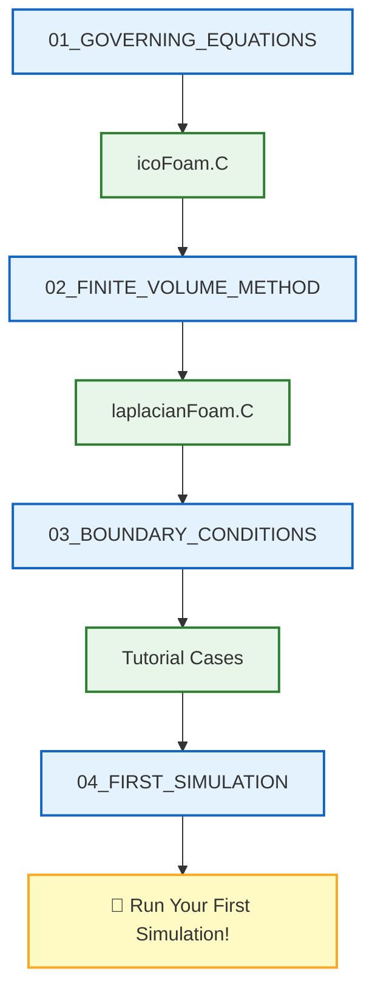

# 🗺️ Learning Navigator: CFD Fundamentals

> [!TIP] 💡 เหตุใด Navigator นี้สำคัญต่อการเรียนรู้ OpenFOAM
> เอกสารนี้เป็น **แผนที่เชื่อมโยง** ระหว่าง **ทฤษฎี CFD** และ **การนำไปใช้งานจริงใน OpenFOAM** โดย:
> - **เชื่อมโยง Content → Source Code**: ช่วยให้เข้าใจว่าสมการทางคณิตศาสตร์ถูกเขียนเป็นโค้ด C++ อย่างไร
> - **ลดระยะห่างระหว่างทฤษฎีและปฏิบัติ**: อ่านทฤษฎีแล้วสามารถดูการ implement จริงใน solver ได้ทันที
> - **เข้าใจโครงสร้าง OpenFOAM**: ช่วยให้คุ้นเคยกับ directory structure และ source code organization
> - **พัฒนาทักษะอ่านโค้ด**: ฝึกอ่าน C++ code ของ OpenFOAM ซึ่งเป็นทักษะสำคัญสำหรับการ customize solver ในอนาคต
>
> การใช้งาน Navigator อย่างมีประสิทธิภาพจะช่วยให้คุณเข้าใจ OpenFOAM **ลึกกว่าการใช้งานเพียงอย่างเดียว** และสามารถนำไปประยุกต์ใช้กับปัญหาที่ซับซ้อนได้

> **วัตถุประสงค์**: เอกสารนี้เป็น **เส้นทางการเรียนรู้แบบคู่ขนาน** ที่เชื่อมโยงเนื้อหาทฤษฎี (.md) กับ Source Code จริงใน OpenFOAM เพื่อให้เข้าใจทั้งแนวคิดและการนำไปใช้งานจริงพร้อมกัน

---

## 📋 สารบัญ

1. [Governing Equations](#1-governing-equations-สมการควบคุม)
2. [Finite Volume Method](#2-finite-volume-method-วิธีปริมาตรจำกัด)
3. [Boundary Conditions](#3-boundary-conditions-เงื่อนไขขอบเขต)
4. [First Simulation](#4-first-simulation-การจำลองแรก)
5. [OpenFOAM Implementation](#5-openfoam-implementation-การ-nำไปใช้-openfoam) ⭐ NEW
6. [Design Principles](#6-design-principles-หลักการออกแบบ) ⭐ NEW

---

## 1. Governing Equations (สมการควบคุม)

> [!NOTE] 📂 OpenFOAM Context
> **Domain:** Physics & Fields + Coding/Customization
>
> หัวข้อนี้เกี่ยวข้องกับ **การนำสมการควบคุมไปใช้ใน OpenFOAM** ซึ่งอยู่ใน 2 ส่วนหลัก:
> - **Source Code (`src/` และ `applications/solvers/`)**: การ implement สมการ N-S ในรูปแบบ C++ code
>   - ไฟล์หลัก: `icoFoam.C`, `createFields.H`
>   - Keywords: `fvVectorMatrix`, `fvm::ddt()`, `fvm::div()`, `fvm::laplacian()`, `solve()`
> - **Case Files (`0/`, `constant/`)**: การกำหนดค่าฟิลด์และคุณสมบัติของไหล
>   - Directory: `0/U`, `0/p`, `constant/transportProperties`, `constant/turbulenceProperties`
>   - Keywords: `nu` (viscosity), `rho` (density), `k`, `epsilon`, `omega`

### 📖 Content → 🔧 Source Code Mapping

| 📖 เนื้อหา | 📝 คำอธิบาย | 🔧 Source Code ที่เกี่ยวข้อง |
|-----------|------------|---------------------------|
| [[01_GOVERNING_EQUATIONS/00_Overview]] | ภาพรวมสมการควบคุม N-S | `solvers/incompressible/icoFoam/icoFoam.C` |
| [[01_GOVERNING_EQUATIONS/01_Introduction]] | แนะนำแนวคิดพื้นฐาน | `solvers/basic/laplacianFoam/laplacianFoam.C` |
| [[01_GOVERNING_EQUATIONS/02_Conservation_Laws]] | กฎการอนุรักษ์มวล โมเมนตัม พลังงาน | `solvers/incompressible/icoFoam/icoFoam.C` |
| [[01_GOVERNING_EQUATIONS/03_Equation_of_State]] | สมการสถานะ | `solvers/compressible/rhoPimpleFoam/` |
| [[01_GOVERNING_EQUATIONS/04_Dimensionless_Numbers]] | เลขไร้มิติ (Re, Ma, Pr) | - |
| [[01_GOVERNING_EQUATIONS/05_OpenFOAM_Implementation]] | การนำไปใช้ใน OpenFOAM | `solvers/incompressible/icoFoam/createFields.H` |
| [[01_GOVERNING_EQUATIONS/06_Boundary_Conditions]] | BCs สำหรับสมการควบคุม | `solvers/incompressible/icoFoam/` |
| [[01_GOVERNING_EQUATIONS/07_Initial_Conditions]] | เงื่อนไขเริ่มต้น | `solvers/incompressible/icoFoam/createFields.H` |
| [[01_GOVERNING_EQUATIONS/08_Key_Points_to_Remember]] | สรุปประเด็นสำคัญ | - |
| [[01_GOVERNING_EQUATIONS/09_Exercises]] | แบบฝึกหัด | - |

### 🎯 Study Guide

| ขั้นตอน | กิจกรรม | เวลาโดยประมาณ |
|--------|---------|--------------|
| 1 | อ่าน `00_Overview` และ `01_Introduction` | 30 นาที |
| 2 | เปิด `icoFoam.C` ดูโครงสร้าง solver | 20 นาที |
| 3 | เปรียบเทียบสมการใน `02_Conservation_Laws` กับโค้ด | 45 นาที |
| 4 | ศึกษา `createFields.H` สำหรับการสร้างฟิลด์ | 20 นาที |

---

## 2. Finite Volume Method (วิธีปริมาตรจำกัด)

> [!NOTE] 📂 OpenFOAM Context
> **Domain:** Numerics & Linear Algebra + Coding/Customization
>
> หัวข้อนี้เกี่ยวข้องกับ **การแบ่งส่วนและการแก้สมการเชิงตัวเลข** ใน OpenFOAM:
> - **Source Code (`applications/solvers/`)**: การ implement discretization schemes
>   - ไฟล์หลัก: `laplacianFoam.C`, `scalarTransportFoam.C`, `icoFoam.C`
>   - Keywords: `fvm::div()`, `fvm::laplacian()`, `fvm::ddt()`, `fvMatrix`, `solve()`
> - **Case Files (`system/fvSchemes`, `system/fvSolution`)**: การกำหนดวิธีการแบ่งส่วนและ solver settings
>   - File: `system/fvSchemes`
>     - Keywords: `gradSchemes`, `divSchemes`, `laplacianSchemes`, `interpolationSchemes`
>   - File: `system/fvSolution`
>     - Keywords: `solvers`, `solver`, `preconditioner`, `tolerance`, `relTol`

### 📖 Content → 🔧 Source Code Mapping

| 📖 เนื้อหา | 📝 คำอธิบาย | 🔧 Source Code ที่เกี่ยวข้อง |
|-----------|------------|---------------------------|
| [[02_FINITE_VOLUME_METHOD/00_Overview]] | ภาพรวม FVM | `solvers/basic/laplacianFoam/laplacianFoam.C` |
| [[02_FINITE_VOLUME_METHOD/01_Introduction]] | แนะนำหลักการ FVM | `solvers/basic/scalarTransportFoam/` |
| [[02_FINITE_VOLUME_METHOD/02_Fundamental_Concepts]] | แนวคิดพื้นฐาน: Cell, Face, Flux | `solvers/basic/laplacianFoam/laplacianFoam.C` |
| [[02_FINITE_VOLUME_METHOD/03_Spatial_Discretization]] | การแบ่งส่วนเชิงพื้นที่ | `solvers/basic/scalarTransportFoam/scalarTransportFoam.C` |
| [[02_FINITE_VOLUME_METHOD/04_Temporal_Discretization]] | การแบ่งส่วนเชิงเวลา | `solvers/incompressible/icoFoam/icoFoam.C` |
| [[02_FINITE_VOLUME_METHOD/05_Matrix_Assembly]] | การประกอบเมทริกซ์ | `solvers/basic/laplacianFoam/laplacianFoam.C` |
| [[02_FINITE_VOLUME_METHOD/06_OpenFOAM_Implementation]] | การนำไปใช้ใน OpenFOAM | `solvers/incompressible/simpleFoam/` |
| [[02_FINITE_VOLUME_METHOD/07_Best_Practices]] | แนวปฏิบัติที่ดี | - |
| [[02_FINITE_VOLUME_METHOD/08_Exercises]] | แบบฝึกหัด | - |

### 🎯 Study Guide

| ขั้นตอน | กิจกรรม | เวลาโดยประมาณ |
|--------|---------|--------------|
| 1 | อ่าน `00_Overview` เข้าใจหลักการ FVM | 30 นาที |
| 2 | เปิด `laplacianFoam.C` ดูโครงสร้างพื้นฐาน | 20 นาที |
| 3 | ศึกษา `03_Spatial_Discretization` + `scalarTransportFoam.C` | 45 นาที |
| 4 | เปรียบเทียบ Matrix assembly ใน content กับโค้ด | 30 นาที |

---

## 3. Boundary Conditions (เงื่อนไขขอบเขต)

> [!NOTE] 📂 OpenFOAM Context
> **Domain:** Physics & Fields
>
> หัวข้อนี้เกี่ยวข้องกับ **การกำหนดเงื่อนไขขอบเขต** ใน OpenFOAM:
> - **Case Files (`0/` directory)**: การกำหนด BC สำหรับแต่ละ field variable
>   - Directory: `0/U`, `0/p`, `0/T`, `0/k`, `0/epsilon`, ฯลฯ
>   - Keywords: `fixedValue`, `zeroGradient`, `noSlip`, `inletOutlet`, `pressureInletOutletVelocity`
> - **Source Code (`src/finiteVolume/`)**: การ implement BC classes
>   - Directory: `src/finiteVolume/fields/fvPatchFields/`
>   - Keywords: `fixedValueFvPatchField`, `zeroGradientFvPatchField`
> - **Selection**: เลือก BC ที่เหมาะสมกับปัญหา (Dirichlet, Neumann, Robin, Mixed)

### 📖 Content → 🔧 Source Code Mapping

| 📖 เนื้อหา | 📝 คำอธิบาย | 🔧 Source Code ที่เกี่ยวข้อง |
|-----------|------------|---------------------------|
| [[03_BOUNDARY_CONDITIONS/00_Overview]] | ภาพรวม Boundary Conditions | `solvers/incompressible/icoFoam/` |
| [[03_BOUNDARY_CONDITIONS/01_Introduction]] | แนะนำ BC ใน CFD | `solvers/incompressible/simpleFoam/` |
| [[03_BOUNDARY_CONDITIONS/02_Fundamental_Classification]] | การจำแนกประเภท BC | `solvers/incompressible/pimpleFoam/` |
| [[03_BOUNDARY_CONDITIONS/03_Selection_Guide_Which_BC_to_Use]] | คู่มือการเลือก BC | - |
| [[03_BOUNDARY_CONDITIONS/04_Mathematical_Formulation]] | สูตรทางคณิตศาสตร์ | `solvers/incompressible/icoFoam/` |
| [[03_BOUNDARY_CONDITIONS/05_Common_Boundary_Conditions_in_OpenFOAM]] | BC ที่ใช้บ่อย | `solvers/incompressible/simpleFoam/` |
| [[03_BOUNDARY_CONDITIONS/06_Advanced_Boundary_Conditions]] | BC ขั้นสูง | `solvers/multiphase/` |
| [[03_BOUNDARY_CONDITIONS/07_Troubleshooting_Boundary_Conditions]] | การแก้ปัญหา BC | - |
| [[03_BOUNDARY_CONDITIONS/08_Exercises]] | แบบฝึกหัด | - |

### 🎯 Study Guide

| ขั้นตอน | กิจกรรม | เวลาโดยประมาณ |
|--------|---------|--------------|
| 1 | อ่าน `00_Overview` และ `02_Fundamental_Classification` | 30 นาที |
| 2 | ศึกษาไฟล์ `0/U` และ `0/p` ใน tutorial cases | 30 นาที |
| 3 | เปรียบเทียบ BC ใน content กับ dictionary format | 30 นาที |
| 4 | ลองแก้ไข BC และรัน simulation | 45 นาที |

---

## 4. First Simulation (การจำลองแรก)

> [!NOTE] 📂 OpenFOAM Context
> **Domain:** Simulation Control + Meshing + Case Structure
>
> หัวข้อนี้เกี่ยวข้องกับ **การ setup และรัน simulation** แบบครบวงจร:
> - **Mesh Generation (`system/`)**: การสร้าง mesh ด้วย blockMesh
>   - File: `system/blockMeshDict`
>   - Keywords: `vertices`, `blocks`, `edges`, `boundary`, `hex`
> - **Simulation Control (`system/`)**: การควบคุมการรัน
>   - File: `system/controlDict`
>   - Keywords: `application`, `startFrom`, `startTime`, `stopAt`, `endTime`, `deltaT`, `writeControl`
> - **Numerics (`system/`)**: การกำหนด discretization schemes
>   - File: `system/fvSchemes`
>   - Keywords: `gradSchemes`, `divSchemes`, `laplacianSchemes`
> - **Solver Settings (`system/`)**: การตั้งค่า solver และ tolerances
>   - File: `system/fvSolution`
>   - Keywords: `solvers`, `PISO`, `SIMPLE`, `tolerance`, `relTol`

### 📖 Content → 🔧 Source Code Mapping

| 📖 เนื้อหา | 📝 คำอธิบาย | 🔧 Source Code ที่เกี่ยวข้อง |
|-----------|------------|---------------------------|
| [[04_FIRST_SIMULATION/00_Overview]] | ภาพรวมการจำลอง | `solvers/incompressible/icoFoam/icoFoam.C` |
| [[04_FIRST_SIMULATION/01_Introduction]] | แนะนำ Lid-Driven Cavity | `solvers/incompressible/icoFoam/` |
| [[04_FIRST_SIMULATION/02_The_Workflow]] | ขั้นตอนการทำงาน CFD | `utilities/mesh/generation/blockMesh/` |
| [[04_FIRST_SIMULATION/03_The_Lid-Driven_Cavity_Problem]] | ปัญหา Cavity Flow | `solvers/incompressible/icoFoam/icoFoam.C` |
| [[04_FIRST_SIMULATION/04_Step-by-Step_Tutorial]] | บทเรียนทีละขั้นตอน | `solvers/incompressible/icoFoam/` |
| [[04_FIRST_SIMULATION/05_Expected_Results]] | ผลลัพธ์ที่คาดหวัง | - |
| [[04_FIRST_SIMULATION/06_Exercises]] | แบบฝึกหัด | - |

### 🎯 Study Guide

| ขั้นตอน | กิจกรรม | เวลาโดยประมาณ |
|--------|---------|--------------|
| 1 | อ่าน `00_Overview` เข้าใจปัญหา | 20 นาที |
| 2 | ทำตาม `04_Step-by-Step_Tutorial` | 60 นาที |
| 3 | เปิด `icoFoam.C` ศึกษาโครงสร้าง solver ขณะรัน | 30 นาที |
| 4 | วิเคราะห์ผลลัพธ์และเปรียบเทียบกับ `05_Expected_Results` | 30 นาที |

---

---

## 5. OpenFOAM Implementation (การนำไปใช้ OpenFOAM) ⭐ NEW

> [!NOTE] 📂 OpenFOAM Context
> **Domain:** Coding/Customization + Solver Architecture
>
> หัวข้อนี้เป็น **สะพานเชื่อม** ระหว่างทฤษฎี CFD และการ implement ใน OpenFOAM:
> - **Solver Anatomy:** โครงสร้างภายในของ OpenFOAM solver
> - **Source Code Mapping:** การแปลงสมการให้เป็น C++ code
> - **Code Tracing:** การติดตามการทำงานของ solver ทีละขั้นตอน

### 📖 Content → 🔧 Source Code Mapping

| 📖 เนื้อหา | 📝 คำอธิบาย | 🔧 Source Code ที่เกี่ยวข้อง |
|-----------|------------|---------------------------|
| [[03_OPENFOAM_IMPLEMENTATION/01_Solver_Anatomy]] | กายวิภาค solver | `src/incompressible/simpleFoam/simpleFoam.C` |
| [[03_OPENFOAM_IMPLEMENTATION/02_Source_Code_Mapping]] | แม็พสมการไปยังโค้ด | `src/finiteVolume/` |
| [[03_OPENFOAM_IMPLEMENTATION/03_First_Simulation]] | ติดตามการทำงาน | `tutorials/incompressible/icoFoam/cavity/` |

### 🎯 Study Guide

| ขั้นตอน | กิจกรรม | เวลาโดยประมาณ |
|--------|---------|--------------|
| 1 | อ่าน `01_Solver_Anatomy` | 45 นาที |
| 2 | ศึกษา `simpleFoam.C` | 30 นาที |
| 3 | ทำความเข้าใจ code-to-math | 60 นาที |
| 4 | รัน cavity tutorial | 45 นาที |

---

## 6. Design Principles (หลักการออกแบบ) ⭐ NEW

> [!NOTE] 📂 OpenFOAM Context
> **Domain:** Software Architecture + Modern C++
>
> หัวข้อนี้สอน **หลักการออกแบบซอฟต์แวร์** สำหรับ CFD codes:
> - **Class Design:** Encapsulation, SRP สำหรับ CFD objects
> - **Modern C++:** Smart pointers, RAII, const correctness
> - **Architecture:** Layered architecture สำหรับ CFD solvers
> - **R410A Application:** ออกแบบ custom solver สำหรับ R410A

### 📖 Content → 🔧 Source Code Mapping

| 📖 เนื้อหา | 📝 คำอธิบาย | 🔧 Source Code ที่เกี่ยวข้อง |
|-----------|------------|---------------------------|
| [[04_DESIGN_PRINCIPLES/01_Class_Design_Basics]] | OOP สำหรับ CFD | `src/OpenFOAM/fields/GeometricFields/` |
| [[04_DESIGN_PRINCIPLES/02_Modern_CPP_Intro]] | Modern C++ features | `src/OpenFOAM/memory/autoPtr.H` |
| [[04_DESIGN_PRINCIPLES/03_Architecture_Overview]] | Solver architecture | `src/finiteVolume/` |

### 🎯 Study Guide

| ขั้นตอน | กิจกรรม | เวลาโดยประมาณ |
|--------|---------|--------------|
| 1 | อ่าน `01_Class_Design_Basics` | 45 นาที |
| 2 | ศึกษา smart pointers | 30 นาที |
| 3 | วิเคราะห์ R410A architecture | 60 นาที |
| 4 | ออกแบบ custom class | 45 นาที |

## 📁 OpenFOAM Source Code Directory Structure

> [!NOTE] 📂 OpenFOAM Context
> **Domain:** Coding/Customization + Directory Structure
>
> หัวข้อนี้แสดง **โครงสร้าง directory ของ OpenFOAM source code** ซึ่งเป็นพื้นฐานสำคัญในการ:
> - **ค้นหา solver ที่ต้องการ**: `applications/solvers/` แบ่งเป็น `basic/`, `incompressible/`, `compressible/`, ฯลฯ
> - **อ่าน source code ของ solver**: เข้าใจการ implement สมการและ algorithms
> - **Customize หรือสร้าง solver ใหม่**: ศึกษาโครงสร้างและการจัดการ files
> - **ใช้ utilities**: `applications/utilities/` สำหรับ mesh generation, post-processing, ฯลฯ
>
> **Key Directories:**
> - `$FOAM_SOLVERS`: ที่เก็บ solvers ทั้งหมด
> - `$FOAM_APP`: applications ทั้ง solvers และ utilities
> - `$WM_PROJECT_DIR`: root directory ของ OpenFOAM installation

```
applications/
├── solvers/
│   ├── basic/
│   │   ├── laplacianFoam/          ← สมการ Laplacian พื้นฐาน
│   │   ├── potentialFoam/          ← Potential flow
│   │   └── scalarTransportFoam/    ← Scalar transport equation
│   │
│   ├── incompressible/
│   │   ├── icoFoam/                ← 🌟 Solver หลักสำหรับ Module นี้
│   │   ├── simpleFoam/             ← Steady-state (SIMPLE algorithm)
│   │   ├── pimpleFoam/             ← Transient (PIMPLE algorithm)
│   │   └── pisoFoam/               ← Transient (PISO algorithm)
│   │
│   └── compressible/               ← สำหรับ Module ขั้นสูง
│
└── utilities/
    └── mesh/
        └── generation/
            └── blockMesh/          ← การสร้าง mesh
```

---

## 🎓 Learning Path Recommendation

> [!NOTE] 📂 OpenFOAM Context
> **Domain:** Study Strategy + Learning Workflow
>
> หัวข้อนี้เป็น **แนวทางการเรียนรู้แบบ systematic** ที่เชื่อมโยง:
> - **Content (ทฤษฎี)** → **Code (การ implement)** → **Practice (การทดลอง)**
> - **การเรียนแบบขั้นตอน**: เริ่มจากทฤษฎี → ดูโค้ด → ลงมือทำ
> - **การเชื่อมโยง cross-references**: ดูว่าแต่ละหัวข้อเกี่ยวข้องกับ solver หรือ file ไหนใน OpenFOAM
>
> **ขั้นตอนที่แนะนำ:**
> 1. **อ่าน Content** เพื่อเข้าใจ concept
> 2. **เปิด Source Code** ตามที่ระบุในตาราง mapping
> 3. **เปรียบเทียบ** สมการใน content กับโค้ด C++
> 4. **ลองรัน** tutorial case และแก้ไข parameters
> 5. **ทดลอง customize** เล็กน้อยเพื่อเข้าใจมากขึ้น



---

## 🔗 Quick Links

> [!NOTE] 📂 OpenFOAM Context
> **Domain:** Quick Reference + Common Use Cases
>
> หัวข้อนี้เป็น **การรวบรวม links สำคัญ** สำหรับการเข้าถึง:
> - **Content ที่ใช้บ่อย**: หัวข้อที่จำเป็นต้องเข้าใจเป็นพิเศษ
> - **Source code ที่เกี่ยวข้อง**: solver และ utilities ที่ใช้ใน module นี้
> - **การใช้งานเบื้องต้น**: Quick start สำหรับผู้เริ่มต้น
>
> **Recommended Flow:**
> - **Beginner**: เริ่มจาก "เริ่มต้นเร็ว" → ทำตาม tutorial → ย้อนกลับไปอ่านทฤษฎี
> - **Intermediate**: อ่าน "ทฤษฎี N-S" + "FVM พื้นฐาน" → ศึกษา source code → ลอง customize
> - **Advanced**: ศึกษา "BC ที่ใช้บ่อย" → implement custom BC → optimize simulation

| หมวด | Content | Source Code |
|------|---------|-------------|
| **เริ่มต้นเร็ว** | [[04_FIRST_SIMULATION/04_Step-by-Step_Tutorial]] | `icoFoam/icoFoam.C` |
| **ทฤษฎี N-S** | [[01_GOVERNING_EQUATIONS/02_Conservation_Laws]] | `icoFoam/icoFoam.C` |
| **FVM พื้นฐาน** | [[02_FINITE_VOLUME_METHOD/02_Fundamental_Concepts]] | `laplacianFoam/laplacianFoam.C` |
| **BC ที่ใช้บ่อย** | [[03_BOUNDARY_CONDITIONS/05_Common_Boundary_Conditions_in_OpenFOAM]] | `simpleFoam/` |

---

> [!TIP] 💡 วิธีใช้งาน Navigator นี้
> 1. **เลือกหัวข้อ** ที่ต้องการศึกษาจากตาราง
> 2. **เปิด Content** (.md) เพื่อเข้าใจทฤษฎี
> 3. **เปิด Source Code** ควบคู่กันเพื่อเห็นการนำไปใช้จริง
> 4. **ลองแก้ไขโค้ด** และสังเกตผลลัพธ์

---

*Last Updated: 2025-12-26*
