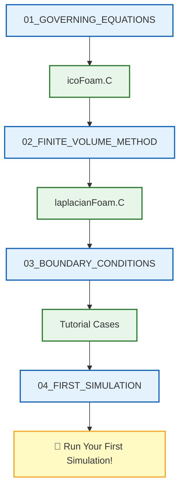

# 🗺️ Learning Navigator: CFD Fundamentals

> **วัตถุประสงค์**: เอกสารนี้เป็น **เส้นทางการเรียนรู้แบบคู่ขนาน** ที่เชื่อมโยงเนื้อหาทฤษฎี (.md) กับ Source Code จริงใน OpenFOAM เพื่อให้เข้าใจทั้งแนวคิดและการนำไปใช้งานจริงพร้อมกัน

---

## 📋 สารบัญ

1. [Governing Equations](#1-governing-equations-สมการควบคุม)
2. [Finite Volume Method](#2-finite-volume-method-วิธีปริมาตรจำกัด)
3. [Boundary Conditions](#3-boundary-conditions-เงื่อนไขขอบเขต)
4. [First Simulation](#4-first-simulation-การจำลองแรก)

---

## 1. Governing Equations (สมการควบคุม)

### 📖 Content → 🔧 Source Code Mapping

| 📖 เนื้อหา | 📝 คำอธิบาย | 🔧 Source Code ที่เกี่ยวข้อง |
|-----------|------------|---------------------------|
| [[01_GOVERNING_EQUATIONS/00_Overview]] | ภาพรวมสมการควบคุม N-S | `solvers/incompressible/icoFoam/icoFoam.C` |
| [[01_GOVERNING_EQUATIONS/01_Introduction]] | แนะนำแนวคิดพื้นฐาน | `solvers/basic/laplacianFoam/laplacianFoam.C` |
| [[01_GOVERNING_EQUATIONS/02_Conservation_Laws]] | กฎการอนุรักษ์มวล โมเมนตัม พลังงาน | `solvers/incompressible/icoFoam/icoFoam.C` |
| [[01_GOVERNING_EQUATIONS/03_Equation_of_State]] | สมการสถานะ | `solvers/compressible/rhoPimpleFoam/` |
| [[01_GOVERNING_EQUATIONS/04_Dimensionless_Numbers]] | เลขไร้มิติ (Re, Ma, Pr) | - |
| [[01_GOVERNING_EQUATIONS/05_OpenFOAM_Implementation]] | การนำไปใช้ใน OpenFOAM | `solvers/incompressible/icoFoam/createFields.H` |
| [[01_GOVERNING_EQUATIONS/06_Boundary_Conditions]] | BCs สำหรับสมการควบคุม | `solvers/incompressible/icoFoam/` |
| [[01_GOVERNING_EQUATIONS/07_Initial_Conditions]] | เงื่อนไขเริ่มต้น | `solvers/incompressible/icoFoam/createFields.H` |
| [[01_GOVERNING_EQUATIONS/08_Key_Points_to_Remember]] | สรุปประเด็นสำคัญ | - |
| [[01_GOVERNING_EQUATIONS/09_Exercises]] | แบบฝึกหัด | - |

### 🎯 Study Guide

| ขั้นตอน | กิจกรรม | เวลาโดยประมาณ |
|--------|---------|--------------|
| 1 | อ่าน `00_Overview` และ `01_Introduction` | 30 นาที |
| 2 | เปิด `icoFoam.C` ดูโครงสร้าง solver | 20 นาที |
| 3 | เปรียบเทียบสมการใน `02_Conservation_Laws` กับโค้ด | 45 นาที |
| 4 | ศึกษา `createFields.H` สำหรับการสร้างฟิลด์ | 20 นาที |

---

## 2. Finite Volume Method (วิธีปริมาตรจำกัด)

### 📖 Content → 🔧 Source Code Mapping

| 📖 เนื้อหา | 📝 คำอธิบาย | 🔧 Source Code ที่เกี่ยวข้อง |
|-----------|------------|---------------------------|
| [[02_FINITE_VOLUME_METHOD/00_Overview]] | ภาพรวม FVM | `solvers/basic/laplacianFoam/laplacianFoam.C` |
| [[02_FINITE_VOLUME_METHOD/01_Introduction]] | แนะนำหลักการ FVM | `solvers/basic/scalarTransportFoam/` |
| [[02_FINITE_VOLUME_METHOD/02_Fundamental_Concepts]] | แนวคิดพื้นฐาน: Cell, Face, Flux | `solvers/basic/laplacianFoam/laplacianFoam.C` |
| [[02_FINITE_VOLUME_METHOD/03_Spatial_Discretization]] | การแบ่งส่วนเชิงพื้นที่ | `solvers/basic/scalarTransportFoam/scalarTransportFoam.C` |
| [[02_FINITE_VOLUME_METHOD/04_Temporal_Discretization]] | การแบ่งส่วนเชิงเวลา | `solvers/incompressible/icoFoam/icoFoam.C` |
| [[02_FINITE_VOLUME_METHOD/05_Matrix_Assembly]] | การประกอบเมทริกซ์ | `solvers/basic/laplacianFoam/laplacianFoam.C` |
| [[02_FINITE_VOLUME_METHOD/06_OpenFOAM_Implementation]] | การนำไปใช้ใน OpenFOAM | `solvers/incompressible/simpleFoam/` |
| [[02_FINITE_VOLUME_METHOD/07_Best_Practices]] | แนวปฏิบัติที่ดี | - |
| [[02_FINITE_VOLUME_METHOD/08_Exercises]] | แบบฝึกหัด | - |

### 🎯 Study Guide

| ขั้นตอน | กิจกรรม | เวลาโดยประมาณ |
|--------|---------|--------------|
| 1 | อ่าน `00_Overview` เข้าใจหลักการ FVM | 30 นาที |
| 2 | เปิด `laplacianFoam.C` ดูโครงสร้างพื้นฐาน | 20 นาที |
| 3 | ศึกษา `03_Spatial_Discretization` + `scalarTransportFoam.C` | 45 นาที |
| 4 | เปรียบเทียบ Matrix assembly ใน content กับโค้ด | 30 นาที |

---

## 3. Boundary Conditions (เงื่อนไขขอบเขต)

### 📖 Content → 🔧 Source Code Mapping

| 📖 เนื้อหา | 📝 คำอธิบาย | 🔧 Source Code ที่เกี่ยวข้อง |
|-----------|------------|---------------------------|
| [[03_BOUNDARY_CONDITIONS/00_Overview]] | ภาพรวม Boundary Conditions | `solvers/incompressible/icoFoam/` |
| [[03_BOUNDARY_CONDITIONS/01_Introduction]] | แนะนำ BC ใน CFD | `solvers/incompressible/simpleFoam/` |
| [[03_BOUNDARY_CONDITIONS/02_Fundamental_Classification]] | การจำแนกประเภท BC | `solvers/incompressible/pimpleFoam/` |
| [[03_BOUNDARY_CONDITIONS/03_Selection_Guide_Which_BC_to_Use]] | คู่มือการเลือก BC | - |
| [[03_BOUNDARY_CONDITIONS/04_Mathematical_Formulation]] | สูตรทางคณิตศาสตร์ | `solvers/incompressible/icoFoam/` |
| [[03_BOUNDARY_CONDITIONS/05_Common_Boundary_Conditions_in_OpenFOAM]] | BC ที่ใช้บ่อย | `solvers/incompressible/simpleFoam/` |
| [[03_BOUNDARY_CONDITIONS/06_Advanced_Boundary_Conditions]] | BC ขั้นสูง | `solvers/multiphase/` |
| [[03_BOUNDARY_CONDITIONS/07_Troubleshooting_Boundary_Conditions]] | การแก้ปัญหา BC | - |
| [[03_BOUNDARY_CONDITIONS/08_Exercises]] | แบบฝึกหัด | - |

### 🎯 Study Guide

| ขั้นตอน | กิจกรรม | เวลาโดยประมาณ |
|--------|---------|--------------|
| 1 | อ่าน `00_Overview` และ `02_Fundamental_Classification` | 30 นาที |
| 2 | ศึกษาไฟล์ `0/U` และ `0/p` ใน tutorial cases | 30 นาที |
| 3 | เปรียบเทียบ BC ใน content กับ dictionary format | 30 นาที |
| 4 | ลองแก้ไข BC และรัน simulation | 45 นาที |

---

## 4. First Simulation (การจำลองแรก)

### 📖 Content → 🔧 Source Code Mapping

| 📖 เนื้อหา | 📝 คำอธิบาย | 🔧 Source Code ที่เกี่ยวข้อง |
|-----------|------------|---------------------------|
| [[04_FIRST_SIMULATION/00_Overview]] | ภาพรวมการจำลอง | `solvers/incompressible/icoFoam/icoFoam.C` |
| [[04_FIRST_SIMULATION/01_Introduction]] | แนะนำ Lid-Driven Cavity | `solvers/incompressible/icoFoam/` |
| [[04_FIRST_SIMULATION/02_The_Workflow]] | ขั้นตอนการทำงาน CFD | `utilities/mesh/generation/blockMesh/` |
| [[04_FIRST_SIMULATION/03_The_Lid-Driven_Cavity_Problem]] | ปัญหา Cavity Flow | `solvers/incompressible/icoFoam/icoFoam.C` |
| [[04_FIRST_SIMULATION/04_Step-by-Step_Tutorial]] | บทเรียนทีละขั้นตอน | `solvers/incompressible/icoFoam/` |
| [[04_FIRST_SIMULATION/05_Expected_Results]] | ผลลัพธ์ที่คาดหวัง | - |
| [[04_FIRST_SIMULATION/06_Exercises]] | แบบฝึกหัด | - |

### 🎯 Study Guide

| ขั้นตอน | กิจกรรม | เวลาโดยประมาณ |
|--------|---------|--------------|
| 1 | อ่าน `00_Overview` เข้าใจปัญหา | 20 นาที |
| 2 | ทำตาม `04_Step-by-Step_Tutorial` | 60 นาที |
| 3 | เปิด `icoFoam.C` ศึกษาโครงสร้าง solver ขณะรัน | 30 นาที |
| 4 | วิเคราะห์ผลลัพธ์และเปรียบเทียบกับ `05_Expected_Results` | 30 นาที |

---

## 📁 OpenFOAM Source Code Directory Structure

```
applications/
├── solvers/
│   ├── basic/
│   │   ├── laplacianFoam/          ← สมการ Laplacian พื้นฐาน
│   │   ├── potentialFoam/          ← Potential flow
│   │   └── scalarTransportFoam/    ← Scalar transport equation
│   │
│   ├── incompressible/
│   │   ├── icoFoam/                ← 🌟 Solver หลักสำหรับ Module นี้
│   │   ├── simpleFoam/             ← Steady-state (SIMPLE algorithm)
│   │   ├── pimpleFoam/             ← Transient (PIMPLE algorithm)
│   │   └── pisoFoam/               ← Transient (PISO algorithm)
│   │
│   └── compressible/               ← สำหรับ Module ขั้นสูง
│
└── utilities/
    └── mesh/
        └── generation/
            └── blockMesh/          ← การสร้าง mesh
```

---

## 🎓 Learning Path Recommendation



---

## 🔗 Quick Links

| หมวด | Content | Source Code |
|------|---------|-------------|
| **เริ่มต้นเร็ว** | [[04_FIRST_SIMULATION/04_Step-by-Step_Tutorial]] | `icoFoam/icoFoam.C` |
| **ทฤษฎี N-S** | [[01_GOVERNING_EQUATIONS/02_Conservation_Laws]] | `icoFoam/icoFoam.C` |
| **FVM พื้นฐาน** | [[02_FINITE_VOLUME_METHOD/02_Fundamental_Concepts]] | `laplacianFoam/laplacianFoam.C` |
| **BC ที่ใช้บ่อย** | [[03_BOUNDARY_CONDITIONS/05_Common_Boundary_Conditions_in_OpenFOAM]] | `simpleFoam/` |

---

> [!TIP] 💡 วิธีใช้งาน Navigator นี้
> 1. **เลือกหัวข้อ** ที่ต้องการศึกษาจากตาราง
> 2. **เปิด Content** (.md) เพื่อเข้าใจทฤษฎี
> 3. **เปิด Source Code** ควบคู่กันเพื่อเห็นการนำไปใช้จริง
> 4. **ลองแก้ไขโค้ด** และสังเกตผลลัพธ์

---

*Last Updated: 2025-12-26*
