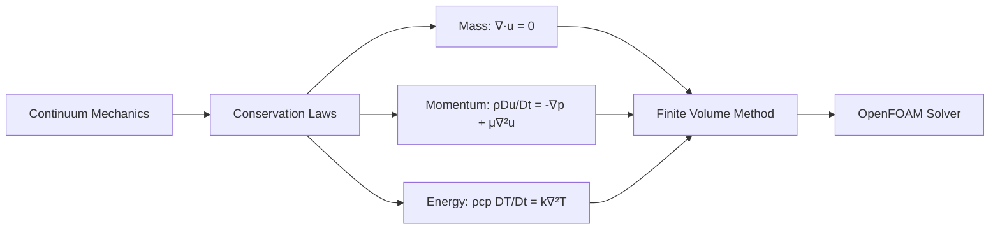

# ภาพรวม: สมการควบคุมของพลศาสตร์ของไหล

สมการควบคุม (Governing Equations) คือ **รากฐานคณิตศาสตร์** ที่บังคับการทำงานของทุก solver ใน OpenFOAM

> **ทำไมต้องเข้าใจ Governing Equations?**
> - **เป็นพื้นฐานของทุกสิ่งใน CFD** — solver, BCs, stability ล้วนมาจากที่นี่
> - ถ้าไม่เข้าใจสมการ = debug ไม่ได้เมื่อ simulation มีปัญหา
> - เลือก solver ถูกต้อง = รู้ว่า solver แต่ละตัวแก้สมการอะไร

---

## เนื้อหาในบทนี้

| ไฟล์ | หัวข้อ | เนื้อหา |
|------|--------|---------|
| [01_Introduction.md](01_Introduction.md) | บทนำ | ภาพรวมสมการ, Conservative form, Reynolds number |
| [02_Conservation_Laws.md](02_Conservation_Laws.md) | กฎการอนุรักษ์ | มวล, โมเมนตัม, พลังงาน พร้อมการพิสูจน์ |
| [03_Equation_of_State.md](03_Equation_of_State.md) | สมการสถานะ | Ideal gas, Incompressible, การเลือก EOS |
| [04_Dimensionless_Numbers.md](04_Dimensionless_Numbers.md) | ตัวเลขไร้มิติ | Re, Ma, Pr และความหมายทางกายภาพ |
| [05_OpenFOAM_Implementation.md](05_OpenFOAM_Implementation.md) | การนำไปใช้ | fvm vs fvc, Field classes, Discretization |
| [06_Boundary_Conditions.md](06_Boundary_Conditions.md) | เงื่อนไขขอบเขต | Dirichlet, Neumann, Mixed BCs |
| [07_Initial_Conditions.md](07_Initial_Conditions.md) | เงื่อนไขเริ่มต้น | การตั้งค่าเริ่มต้นสำหรับ fields |
| [08_Key_Points_to_Remember.md](08_Key_Points_to_Remember.md) | ประเด็นสำคัญ | สรุปและข้อควรจำ |
| [09_Exercises.md](09_Exercises.md) | แบบฝึกหัด | โจทย์ฝึกทักษะ |

---

## สมการควบคุมพื้นฐาน

### 1. การอนุรักษ์มวล (Continuity)

$$\nabla \cdot \mathbf{u} = 0 \quad \text{(incompressible)}$$

**ความหมาย:** ปริมาตรของไหลที่ไหลเข้า control volume ต้องเท่ากับที่ไหลออก

### 2. การอนุรักษ์โมเมนตัม (Navier-Stokes)

$$\rho \frac{D\mathbf{u}}{Dt} = -\nabla p + \mu \nabla^2 \mathbf{u} + \mathbf{f}$$

**ความหมาย:** แรงสุทธิ = มวล × ความเร่ง (กฎข้อ 2 ของนิวตัน)

### 3. การอนุรักษ์พลังงาน

$$\rho c_p \frac{DT}{Dt} = k \nabla^2 T + Q$$

**ความหมาย:** พลังงานไม่สูญหาย เพียงเปลี่ยนรูป

> **⚠️ ข้อควรระวังเรื่อง Temperature Units:**
> - **Incompressible solvers** (`icoFoam`, `simpleFoam`): ใช้ `T` เป็น **temperature** [K] หรือ [°C]
> - **Compressible solvers** (`rhoSimpleFoam`, `sonicFoam`): ใช้ `T` เป็น **static temperature** [K]
> - **Energy equation** บาง solver ใช้ `h` (enthalpy) [J/kg] แทน `T`
> - อ่าน `ThermophysicalModels` ใน solver guide ให้ดีก่อนรัน!

---

## ความเชื่อมโยงกับ OpenFOAM

| สมการ | ไฟล์ OpenFOAM | Solver ตัวอย่าง |
|-------|---------------|-----------------|
| Continuity + Momentum | `0/U`, `0/p` | `simpleFoam`, `pimpleFoam` |
| + Energy | `0/T` | `buoyantSimpleFoam` |
| + Multiphase | `0/alpha.water` | `interFoam` |
| + Turbulence | `0/k`, `0/epsilon` | `simpleFoam` (RAS) |

### ไฟล์ที่ควบคุมการแก้สมการ

| ไฟล์ | บทบาท |
|------|-------|
| `system/fvSchemes` | วิธี discretization (divSchemes, laplacianSchemes) |
| `system/fvSolution` | Linear solvers และ algorithms (SIMPLE, PISO, PIMPLE) |
| `constant/transportProperties` | คุณสมบัติทางกายภาพ ($\nu$, $\rho$) |

---

## แนวคิดสำคัญ

### Conservative Form

สมการเขียนในรูป:
$$\frac{\partial \phi}{\partial t} + \nabla \cdot (\phi \mathbf{u}) = \text{source terms}$$

ข้อดี:
- รักษาคุณสมบัติการอนุรักษ์ใน FVM
- จับ shock waves ได้แม่นยำ
- เข้ากันได้กับ Gauss's divergence theorem

### Pressure-Velocity Coupling

ในการไหล incompressible ความดันไม่ได้มาจากสมการสถานะ แต่ทำหน้าที่ **บังคับให้ $\nabla \cdot \mathbf{u} = 0$**

อัลกอริทึมที่ใช้:
- **SIMPLE** → steady-state
- **PISO** → transient, small time step
- **PIMPLE** → transient, large time step

---

## Concept Check

<b>1. ทำไมต้องเข้าใจสมการควบคุมก่อนใช้ OpenFOAM?</b>

เพราะทุกอย่างใน OpenFOAM (solver, schemes, BCs) มาจากสมการเหล่านี้ ถ้าไม่เข้าใจ จะไม่รู้ว่าทำไม simulation diverge หรือผลลัพธ์ไม่ถูกต้อง

<b>2. สมการอนุรักษ์มวลสำหรับ incompressible flow คืออะไร?</b>

$\nabla \cdot \mathbf{u} = 0$ หมายความว่า velocity field ต้องเป็น divergence-free (ไหลเข้า = ไหลออก)

<b>3. SIMPLE, PISO, PIMPLE ใช้ทำอะไร?</b>

เป็นอัลกอริทึมสำหรับ pressure-velocity coupling ใช้แก้ปัญหาที่ความดันและความเร็ว coupled กันผ่านสมการความต่อเนื่อง

---

## เอกสารที่เกี่ยวข้อง

- **บทถัดไป:** [01_Introduction.md](01_Introduction.md) — บทนำสู่สมการควบคุม
- **การนำไปใช้:** [05_OpenFOAM_Implementation.md](05_OpenFOAM_Implementation.md) — การ implement ใน OpenFOAM