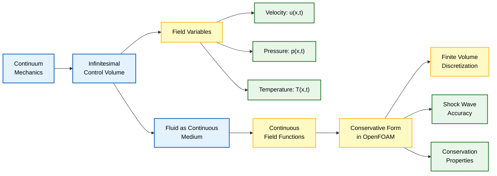
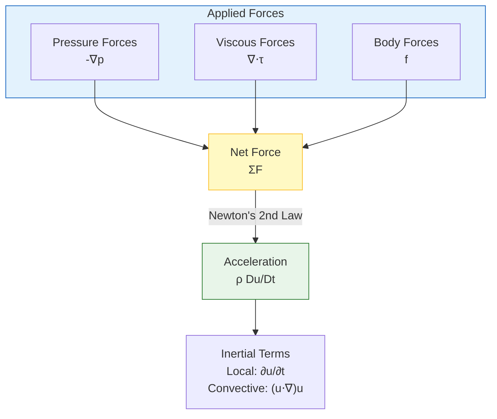
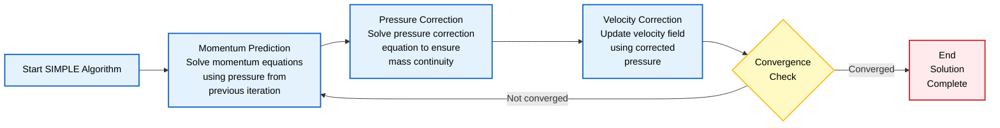
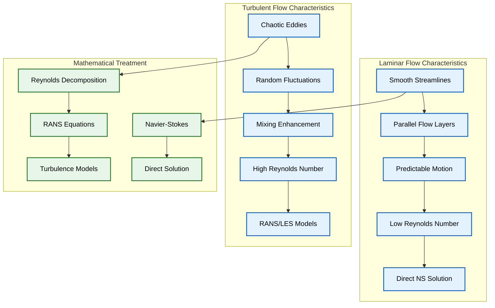

# ภาพรวมสมการควบคุมของพลศาสตร์ของไหล

## บทนำ

สมการควบคุมของพลศาสตร์ของไหลเป็น **รากฐานทางคณิตศาสตร์** ของ Computational Fluid Dynamics (CFD) สมการเหล่านี้อธิบายถึง **การอนุรักษ์มวล, โมเมนตัม, และพลังงาน** ในการไหลของไหล และถูกแก้ปัญหาด้วยวิธีเชิงตัวเลขใน OpenFOAM


> **Figure 1:** รากฐานทางทฤษฎีของ CFD ซึ่งเชื่อมโยงแนวคิดของกลศาสตร์ตัวกลางต่อเนื่องเข้ากับการนำไปใช้งานแบบ Finite Volume ใน OpenFOAM ผ่านตัวแปรสนามและกฎการอนุรักษ์
## พัฒนาการทางประวัติศาสตร์

รากฐานของพลศาสตร์ของไหลมาจาก **หลักการของกลศาสตร์ตัวกลางต่อเนื่อง** ซึ่งได้รับการพัฒนาอย่างเป็นระบบครั้งแรกโดย Claude-Louis Navier และ George Gabriel Stokes ในช่วงต้นศตวรรษที่ 19

### สมมติฐานพื้นฐาน

- **ของไหลถูกพิจารณาว่าเป็นตัวกลางต่อเนื่อง** แทนที่จะเป็นอนุภาคแยกส่วน
- **ตัวแปรสนามเป็นฟังก์ชันต่อเนื่อง**:
  - ความเร็ว: $\mathbf{u}(\mathbf{x},t)$
  - ความดัน: $p(\mathbf{x},t)$
  - อุณหภูมิ: $T(\mathbf{x},t)$

### Conservative Form ใน OpenFOAM

สมการควบคุมแสดงใน **Conservative form** เพื่อ:
- ให้การแสดงผลที่แม่นยำของคลื่นกระแทก (shock waves)
- รักษาคุณสมบัติการอนุรักษ์ในปริมาตรควบคุม
- **เข้ากันได้กับวิธี Finite Volume discretization** ของ OpenFOAM

---

## กฎการอนุรักษ์พื้นฐาน

### 1. การอนุรักษ์มวล (สมการความต่อเนื่อง)

หลักการนี้ระบุว่า **มวลไม่สามารถถูกสร้างหรือทำลายได้** ภายในปริมาตรควบคุม

**สำหรับของไหลอัดตัวได้**:
$$\frac{\partial \rho}{\partial t} + \nabla \cdot (\rho \mathbf{u}) = 0$$

โดยที่:
- $\rho$ = ความหนาแน่นของของไหล
- $\mathbf{u}$ = เวกเตอร์ความเร็ว
- $\nabla \cdot$ = Divergence operator

**สำหรับของไหลอัดตัวไม่ได้** ($\rho = \text{constant}$):
$$\nabla \cdot \mathbf{u} = 0$$

> [!INFO] **ความสำคัญ**
> เงื่อนไข **divergence-free condition** นี้ทำให้มั่นใจได้ว่าอัตราการไหลเชิงปริมาตร (volumetric flow rate) ที่ไหลเข้าสู่ปริมาตรควบคุมขนาดเล็กมาก ๆ จะเท่ากับอัตราการไหลเชิงปริมาตรที่ไหลออก ซึ่งเป็นการรักษาสภาพการอนุรักษ์มวลตลอดทั่วทั้งโดเมน (domain)

### 2. การอนุรักษ์โมเมนตัม (สมการ Navier-Stokes)

สมการนี้ได้มาจากการประยุกต์ใช้ **กฎข้อที่สองของนิวตัน** โดยสร้างสมดุลระหว่างแรงต่างๆ:

$$\rho \frac{\partial \mathbf{u}}{\partial t} + \rho (\mathbf{u} \cdot \nabla) \mathbf{u} = -\nabla p + \nabla \cdot \boldsymbol{\tau} + \mathbf{f}$$

โดยที่:
- $p$ = ความดัน
- $\boldsymbol{\tau}$ = Viscous stress tensor
- $\mathbf{f}$ = Body forces (เช่น แรงโน้มถ่วง)

**Viscous stress tensor สำหรับ Newtonian fluid**:
$$\boldsymbol{\tau} = \mu \left[ \nabla \mathbf{u} + (\nabla \mathbf{u})^T \right] - \frac{2}{3} \mu (\nabla \cdot \mathbf{u}) \mathbf{I}$$

โดยที่:
- $\mu$ = Dynamic viscosity
- $\mathbf{I}$ = Identity tensor


> **Figure 2:** การแยกส่วนของแรงในสมการโมเมนตัม (กฎข้อที่สองของนิวตัน) แสดงให้เห็นว่าแรงดัน แรงหนืด และแรงภายนอก ส่งผลต่อความเร่งของของไหล (พจน์ความเฉื่อย) อย่างไร


### 3. การอนุรักษ์พลังงาน

สมการนี้อิงตาม **กฎข้อที่หนึ่งของอุณหพลศาสตร์**:

$$\rho c_p \frac{\partial T}{\partial t} + \rho c_p (\mathbf{u} \cdot \nabla) T = k \nabla^2 T + \Phi + Q$$

โดยที่:
- $c_p$ = Specific heat capacity ที่ความดันคงที่
- $k$ = Thermal conductivity
- $\Phi$ = Viscous dissipation
- $Q$ = แหล่งกำเนิดหรือตัวรับความร้อน

**Viscous dissipation**:
$$\Phi = \boldsymbol{\tau} : \nabla \mathbf{u}$$

---

## การนำไปใช้งานใน OpenFOAM

### การทำให้เป็นส่วนย่อยด้วย Finite Volume

OpenFOAM ใช้ **Finite Volume Method (FVM)** ในการจัดการสมการบน **polyhedral meshes**:

**Integral form ของสมการการอนุรักษ์**:
$$\int_V \frac{\partial \phi}{\partial t} \, \mathrm{d}V + \oint_S \phi \mathbf{u} \cdot \mathbf{n} \, \mathrm{d}S = \int_V S_\phi \, \mathrm{d}V$$

โดยที่:
- $\phi$ = ปริมาณที่ถูกขนส่ง (transported quantity)
- $V$ = Control volume
- $S$ = Control surface
- $\mathbf{n}$ = เวกเตอร์แนวฉากที่ชี้ออก (outward normal vector)

**การทำให้เป็นส่วนย่อยใน OpenFOAM**:
```cpp
// การทำให้เป็นส่วนย่อยด้วย Finite Volume ใน OpenFOAM
fvScalarMatrix TEqn
(
    fvm::ddt(rho, T)                   // พจน์อนุพันธ์เทียบกับเวลา
  + fvm::div(phi, T)                   // พจน์การพาความร้อน/มวล
  - fvm::laplacian(k/rho, T)           // พจน์การแพร่
 ==
    sources/rho                        // พจน์แหล่งกำเนิด
);

TEqn.solve();                          // แก้ระบบสมการเชิงเส้น
```

### คลาส Field แบบ Template-Based

OpenFOAM ใช้ **Templated field classes** เพื่อจัดการปริมาณทางกายภาพ:

```cpp
// ตัวอย่างการประกาศ Field ใน OpenFOAM
volScalarField p(mesh);           // Field ความดัน
volVectorField U(mesh);           // Field ความเร็ว
volScalarField T(mesh);           // Field อุณหภูมิ
surfaceScalarField phi(mesh);     // Field ฟลักซ์
```

**การหาอนุพันธ์อัตโนมัติ**:
```cpp
// ตัวอย่างการหาอนุพันธ์อัตโนมัติ
volVectorField gradP = fvc::grad(p);              // Gradient ความดัน
volScalarField divU = fvc::div(U);                // Divergence ความเร็ว
volTensorField gradU = fvc::grad(U);              // Tensor Gradient ความเร็ว
```

### Time Discretization Schemes

OpenFOAM รองรับ Time discretization ที่หลากหลาย:

| Scheme | ความแม่นยำ | ประเภท | ข้อดี | เหมาะสำหรับ |
|--------|------------|---------|--------|-------------|
| Euler | อันดับหนึ่ง | Explicit/Implicit | เสถียร, ง่าย | Transient problems ทั่วไป |
| Crank-Nicolson | อันดับสอง | Implicit | ความแม่นยำสูง | ปัญหาที่ต้องการความแม่นยำ |
| Backward | อันดับสอง | Implicit | เสถียรมาก | Stiff problems |

**การตั้งค่าใน OpenFOAM**:
```cpp
// การเลือก Time scheme
ddtSchemes
{
    default         Euler;               // อันดับหนึ่ง
    // default        CrankNicolson 0.9;  // อันดับสองแบบผสม
    // default        backward;            // อันดับสอง
}
```

---

## ความไม่เป็นเชิงเส้นและการเชื่อมโยงความดัน-ความเร็ว

### ความไม่เป็นเชิงเส้น

**พจน์ Convective** $(\mathbf{u} \cdot \nabla)\mathbf{u}$ ทำให้เกิด **ความไม่เป็นเชิงเส้น** ซึ่งต้องใช้วิธีการแก้ปัญหาแบบวนซ้ำ:

```cpp
// การจัดการพจน์ไม่เป็นเชิงเส้น
fvVectorMatrix UEqn
(
    fvm::ddt(rho, U)
  + fvm::div(phi, U)
  + fvc::div((rho*phi), U) - fvm::Sp(fvc::div(phi*rho), U)  // Treat nonlinearity
);
```

### การเชื่อมโยงความดัน-ความเร็ว

สมการเหล่านี้มี **การเชื่อมโยงกันอย่างมาก** ผ่าน Pressure-velocity coupling โดย OpenFOAM ใช้อัลกอริทึม:

#### อัลกอริทึม SIMPLE (Semi-Implicit Method for Pressure-Linked Equations)

**ขั้นตอนอัลกอริทึม SIMPLE**:
1. **Momentum Prediction**: แก้สมการโมเมนตัมโดยใช้ความดันจาก time step ก่อนหน้า
2. **Pressure Correction**: แก้สมการแก้ไขความดันเพื่อให้เกิดความต่อเนื่องของมวล
3. **Velocity Correction**: แก้ไขความเร็วโดยใช้ความดันที่ถูกแก้ไข
4. **Convergence Check**: ตรวจสอบการลู่เข้าและทำซ้ำถ้าจำเป็น

**การนำไปใช้ใน OpenFOAM**:
```cpp
// อัลกอริทึม SIMPLE
while (simple.correctNonOrthogonal())
{
    // สมการโมเมนตัม
    tmp<fvVectorMatrix> UEqn(fvm::ddt(U) + fvm::div(phi, U));
    UEqn().relax();

    // สมการความดัน
    adjustPhi(phi, U, p);

    // ลูปการเชื่อมโยงความดัน-ความเร็ว
    for (int corr = 0; corr < nCorr; corr++)
    {
        // แก้โมเมนตัม
        solve(UEqn() == -fvc::grad(p));

        // แก้ความดัน
        solve(fvm::laplacian(rAU, p) == fvc::div(phi));
    }
}
```


> **Figure 3:** ลำดับขั้นตอนของอัลกอริทึม SIMPLE (Semi-Implicit Method for Pressure-Linked Equations) แสดงรายละเอียดขั้นตอนการทำนายและแก้ไข (prediction-correction) สำหรับการเชื่อมโยงสนามความเร็วและความดันเข้าด้วยกัน
---

## การวิเคราะห์มิติและการทำให้ไร้มิติ

เพื่อความเข้าใจและการเปรียบเทียบที่ดีขึ้น สมการควบคุมมักจะถูกทำให้ไร้มิติโดยใช้ **Characteristic scales**:

### Characteristic Scales

- **มาตราส่วนความยาว (Length scale)**: $L$
- **มาตราส่วนความเร็ว (Velocity scale)**: $U_{\text{ref}}$
- **มาตราส่วนเวลา (Time scale)**: $t_{\text{ref}} = L/U_{\text{ref}}$
- **มาตราส่วนความดัน (Pressure scale)**: $p_{\text{ref}} = \rho U_{\text{ref}}^2$

### Reynolds Number

**Reynolds number แบบไร้มิติ**:
$$\text{Re} = \frac{\rho U_{\text{ref}} L}{\mu}$$

**สมการโมเมนตัมแบบไร้มิติ**:
$$\frac{\partial \mathbf{u}^*}{\partial t^*} + (\mathbf{u}^* \cdot \nabla^*) \mathbf{u}^* = -\nabla^* p^* + \frac{1}{\text{Re}} \nabla^{*2} \mathbf{u}^* + \mathbf{f}^*$$

โดยที่เครื่องหมายดอกจัน (*) แทนปริมาณไร้มิติ

> [!TIP] **ความสำคัญของเลขไร้มิติ**
> เลขไร้มิติเป็นพารามิเตอร์พื้นฐานในพลศาสตร์ของไหลที่บ่งบอกถึงความสำคัญสัมพัทธ์ของปรากฏการณ์ทางฟิสิกส์ที่แข่งขันกัน ซึ่งช่วยให้วิศวกรและนักวิจัยสามารถ:
> - คาดการณ์ระบอบการไหล (Flow Regimes)
> - ระบุกลไกการถ่ายโอนที่สำคัญ
> - ตัดสินใจอย่างมีข้อมูลเกี่ยวกับแนวทางการสร้างแบบจำลองที่เหมาะสม

---

## กรณีพิเศษและการลดรูป

### การไหลที่อัดตัวไม่ได้ (Incompressible Flow)

สำหรับ **incompressible flows** ($\rho = \text{constant}$) สมการจะลดรูปเป็น:

$$\nabla \cdot \mathbf{u} = 0$$
$$\rho \left( \frac{\partial \mathbf{u}}{\partial t} + (\mathbf{u} \cdot \nabla) \mathbf{u} \right) = -\nabla p + \mu \nabla^2 \mathbf{u} + \mathbf{f}$$

### Laminar vs Turbulent Flow

| ลักษณะ | Laminar Flow | Turbulent Flow |
|---------|--------------|---------------|
| การเคลื่อนที่ | แบบชั้นๆ สมมาตร | ไม่สมมาตร มีปั่นป่วน |
| การผสม | การแพร่โมเลกุล | การพาอย่างมาก |
| สมการ | Navier-Stokes ตรงๆ | RANS/LES/DES |
| ความซับซ้อน | น้อย | สูงมาก |

**Reynolds Decomposition สำหรับ Turbulent Flow**:
$$\mathbf{u} = \overline{\mathbf{u}} + \mathbf{u}'$$
$$p = \overline{p} + p'$$

**RANS Equations**:
$$\rho \left( \frac{\partial \overline{\mathbf{u}}}{\partial t} + (\overline{\mathbf{u}} \cdot \nabla) \overline{\mathbf{u}} \right) = -\nabla \overline{p} + \mu \nabla^2 \overline{\mathbf{u}} - \nabla \cdot (\rho \overline{\mathbf{u}' \mathbf{u}'}) + \mathbf{f}$$


> **Figure 4:** การเปรียบเทียบระบอบการไหลแบบราบเรียบ (Laminar) และแบบปั่นป่วน (Turbulent) โดยเน้นลักษณะทางกายภาพและการจัดการทางคณิตศาสตร์ที่แตกต่างกัน (Direct NS เทียบกับ RANS/LES) ใน CFD
---

## สรุป

ความแม่นยำทางคณิตศาสตร์และการนำไปใช้งานที่ครอบคลุมใน OpenFOAM ช่วยให้สามารถจำลองการไหลของของไหลที่ซับซ้อนได้อย่างแม่นยำในงานวิศวกรรมและวิทยาศาสตร์ ตั้งแต่ **การไหลแบบ Laminar ในท่อ** ไปจนถึง **การเผาไหม้แบบ Turbulent และระบบ Multiphase**

สมการควบคุมของพลศาสตร์ของไหลเป็นรากฐานที่จำเป็นสำหรับการเข้าใจและใช้งาน OpenFOAM อย่างมีประสิทธิภาพ โดยมีประเด็นสำคัญที่ควรจดจำ:

1. **กฎการอนุรักษ์** - รากฐานของ CFD
2. **สมการความต่อเนื่อง** - หลักการอนุรักษ์มวล
3. **สมการ Navier-Stokes** - กฎข้อที่สองของนิวตันสำหรับของไหล
4. **ไวยากรณ์ OpenFOAM** - การแปลสัญลักษร์ทางคณิตศาสตร์
5. **Boundary Conditions** - สิ่งจำเป็นสำหรับ Physical Solutions

สำหรับรายละเอียดเพิ่มเติมเกี่ยวกับแต่ละหัวข้อ สามารถศึกษาได้ในบทความที่เกี่ยวข้อง:
- [[01_Introduction]] - บทนำสู่สมการควบคุม
- [[02_Conservation_Laws]] - กฎการอนุรักษ์อย่างละเอียด
- [[03_Equation_of_State]] - สมการสภาวะ
- [[04_Dimensionless_Numbers]] - เลขไร้มิติใน CFD
- [[05_OpenFOAM_Implementation]] - การนำไปใช้ใน OpenFOAM
- [[06_Boundary_Conditions]] - เงื่อนไขขอบเขต
- [[07_Initial_Conditions]] - เงื่อนไขเริ่มต้น
- [[08_Key_Points_to_Remember]] - สรุปประเด็นสำคัญ
- [[09_Exercises]] - แบบฝึกหัด
