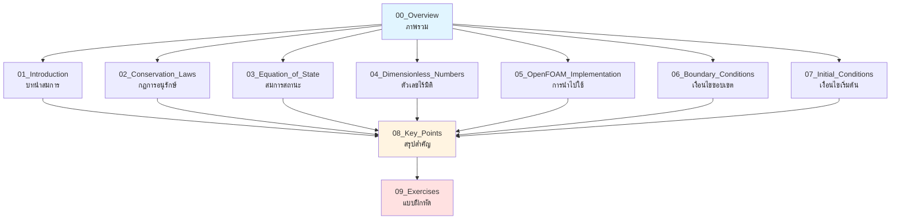
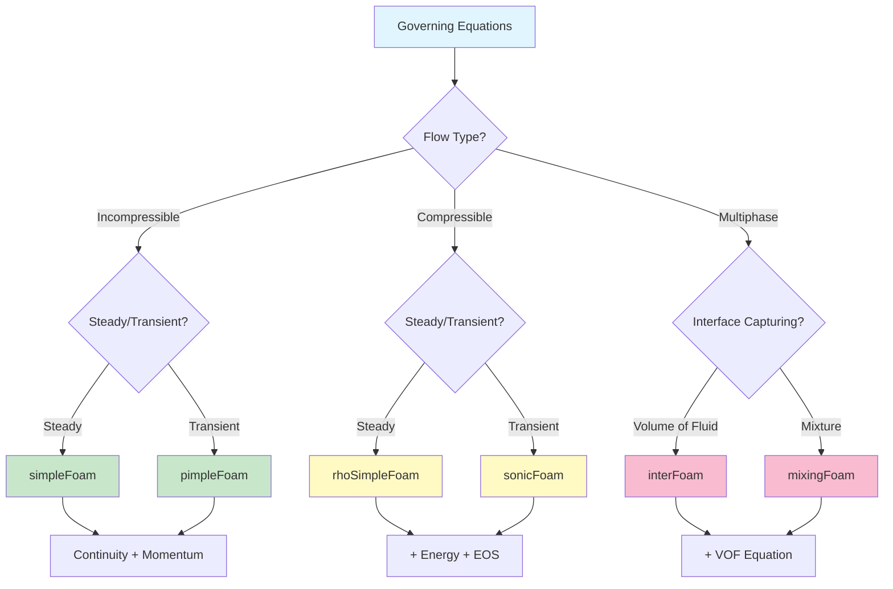
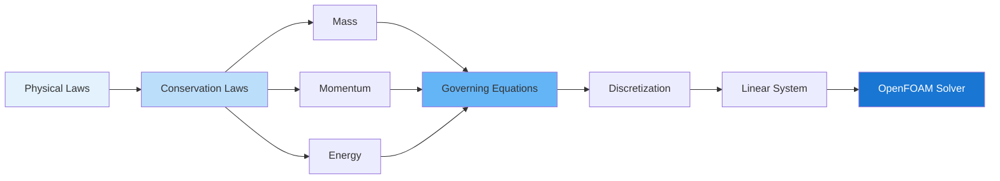

# ภาพรวม: สมการควบคุมของพลศาสตร์ของไหล

สมการควบคุม (Governing Equations) คือ **รากฐานคณิตศาสต์** ที่บังคับการทำงานของทุก solver ใน OpenFOAM

> **ทำไมต้องเข้าใจ Governing Equations?**
> - **เป็นพื้นฐานของทุกสิ่งใน CFD** — solver, BCs, stability ล้วนมาจากที่นี่
> - ถ้าไม่เข้าใจสมการ = debug ไม่ได้เมื่อ simulation มีปัญหา
> - **เลือก solver ถูกต้อง = รู้ว่า solver แต่ละตัวแก้สมการอะไร**

---

## Learning Objectives

เมื่ออ่านบทนี้แล้ว คุณควรจะสามารถ:

1. **อธิบาย** ความสำคัญของสมการควบคุมต่อการเลือก solver ใน OpenFOAM
2. **เชื่อมโยง** สมการแต่ละประเภท (มวล, โมเมนตัม, พลังงาน) กับ solver ที่เหมาะสม
3. **ทำนาย** ไฟล์และการตั้งค่าที่ต้องการจากปัญหา CFD ที่กำหนด
4. **อ้างอิง** กลับไปยังเนื้อหารายละเอียดในไฟล์ที่เกี่ยวข้องอย่างถูกต้อง

---

## แผนที่เนื้อหา (Module Flow)

---

## เนื้อหาในบทนี้

| ไฟล์ | หัวข้อ | เนื้อหาหลัก | Prerequisite |
|------|--------|-------------|-------------|
| [01_Introduction.md](01_Introduction.md) | บทนำ | ภาพรวมสมการ, Conservative form, Continuum hypothesis | บทนี้ |
| [02_Conservation_Laws.md](02_Conservation_Laws.md) | กฎการอนุรักษ์ | มวล, โมเมนตัม, พลังงาน พร้อมการพิสูจน์ | 01 |
| [03_Equation_of_State.md](03_Equation_of_State.md) | สมการสถานะ | Ideal gas, Incompressible, **⚠️ Temperature units** | 01, 02 |
| [04_Dimensionless_Numbers.md](04_Dimensionless_Numbers.md) | ตัวเลขไร้มิติ | **Re**, Ma, Pr, **y+ calculation**, Physical meaning | 01, 02 |
| [05_OpenFOAM_Implementation.md](05_OpenFOAM_Implementation.md) | การนำไปใช้ | fvm vs fvc, Field classes, Discretization | 01-04 |
| [06_Boundary_Conditions.md](06_Boundary_Conditions.md) | เงื่อนไขขอบเขต | Dirichlet, Neumann, Mixed, **Wall function selection** | 01-04 |
| [07_Initial_Conditions.md](07_Initial_Conditions.md) | เงื่อนไขเริ่มต้น | การตั้งค่าเริ่มต้นสำหรับ fields | 05 |
| [08_Key_Points_to_Remember.md](08_Key_Points_to_Remember.md) | ประเด็นสำคัญ | สรุปและข้อควรจำ | 01-07 |
| [09_Exercises.md](09_Exercises.md) | แบบฝึกหัด | โจทย์ฝึกทักษะ | 01-07 |

> **📖 คำแนะนำการอ่าน:** เริ่มจากบทนี้เพื่อภาพรวม แล้วอ่านตามลำดับ 01 → 02 → 03 → 04 → 05 → 06 → 07 เพื่อความเข้าใจที่ลึกซึ้ง

---

## Equation → Solver Mapping

### เลือก Solver จากสมการที่ต้องการ

| สมการที่เกี่ยวข้อง | Solver ที่เหมาะสม | ไฟล์ fields ที่ต้องการ |
|---------------------|-------------------|---------------------|
| **Continuity + Momentum** | `simpleFoam`, `pimpleFoam` | `0/U`, `0/p` |
| **+ Energy** | `buoyantSimpleFoam`, `rhoPimpleFoam` | `0/T` หรือ `0/h` |
| **+ Equation of State** | `rhoSimpleFoam`, `sonicFoam` | `0/rho`, `0/p`, `0/T` |
| **+ Multiphase (VOF)** | `interFoam` | `0/alpha.water` |
| **+ Turbulence (RANS)** | solver ข้างบน + k-ε/k-ω SST | `0/k`, `0/omega` หรือ `0/epsilon` |

> **💡 Key Insight:** แต่ละ solver ใน OpenFOAM ถูกออกแบบมาเพื่อแก้ชุดสมการที่เฉพาะเจาะจง การรู้ว่าปัญหาของคุณมีสมการอะไรบ้าง = การเลือก solver ที่ถูกต้อง

---

## สมการควบคุมพื้นฐาน

### สมการหลักที่ใช้ใน OpenFOAM

**1. การอนุรักษ์มวล (Continuity Equation)**
$$\nabla \cdot \mathbf{u} = 0 \quad \text{(incompressible)}$$
$$\frac{\partial \rho}{\partial t} + \nabla \cdot (\rho \mathbf{u}) = 0 \quad \text{(compressible)}$$

**2. การอนุรักษ์โมเมนตัม (Navier-Stokes Equation)**
$$\rho \frac{D\mathbf{u}}{Dt} = -\nabla p + \mu \nabla^2 \mathbf{u} + \mathbf{f}$$

**3. การอนุรักษ์พลังงาน (Energy Equation)**
$$\rho c_p \frac{DT}{Dt} = k \nabla^2 T + Q$$

> **📖 รายละเอียดเพิ่มเติม:** ดูการพิสูจน์และคำอธิบายละเอียดใน [02_Conservation_Laws.md](02_Conservation_Laws.md)

---

## ความเชื่อมโยงกับ OpenFOAM

### ไฟล์ที่ควบคุมการแก้สมการ

| ไฟล์ OpenFOAM | บทบาท | สมการที่เกี่ยวข้อง | เรียนรายละเอียด |
|---------------|-------|-------------------|-------------------|
| `0/U` | Velocity field | Momentum | [06_Boundary_Conditions.md](06_Boundary_Conditions.md) |
| `0/p` | Pressure field | Continuity + Pressure-velocity coupling | [05_OpenFOAM_Implementation.md](05_OpenFOAM_Implementation.md) |
| `0/T` หรือ `0/h` | Temperature/Enthalpy | Energy | [03_Equation_of_State.md](03_Equation_of_State.md) ⚠️ |
| `system/fvSchemes` | Discretization methods | ทุกสมการ | [05_OpenFOAM_Implementation.md](05_OpenFOAM_Implementation.md) |
| `system/fvSolution` | Linear solvers & algorithms | Pressure-velocity coupling | [05_OpenFOAM_Implementation.md](05_OpenFOAM_Implementation.md) |
| `constant/transportProperties` | Physical properties | ν, ρ, cp, k | [03_Equation_of_State.md](03_Equation_of_State.md) |

### Pressure-Velocity Coupling

ในการไหล incompressible ความดันไม่ได้มาจากสมการสถานะ แต่ทำหน้าที่ **บังคับให้ $\nabla \cdot \mathbf{u} = 0$**

| อัลกอริทึม | การใช้งาน | Solver ตัวอย่าง |
|-----------|-----------|----------------|
| **SIMPLE** | Steady-state | `simpleFoam` |
| **PISO** | Transient, small time step | `icoFoam`, `pisoFoam` |
| **PIMPLE** | Transient, large time step | `pimpleFoam` |

> **📖 รายละเอียด:** ดูเทคนิคการแก้สมการใน [05_OpenFOAM_Implementation.md](05_OpenFOAM_Implementation.md)

---

## Common Pitfalls (ข้อผิดพลาดที่พบบ่อย)

<b>❌ 1. เลือก solver ผิดจากปัญหาที่ไม่ match กับสมการ</b>

**ตัวอย่าง:** ใช้ `simpleFoam` (incompressible, steady) กับปัญหาที่มีความหนาแน่นเปลี่ยนอย่างมาก  
**ผล:** ผลลัพธ์ไม่ถูกต้อง เพราะ solver ไม่แก้สมการอนุรักษ์มวลแบบเต็ม  
**วิธีแก้:** ใช้ solver ที่รองรับ compressible flow เช่น `rhoSimpleFoam`

**การป้องกัน:** เช็กตาราง "Equation → Solver Mapping" ด้านบน หรือดูใน [01_Introduction.md](01_Introduction.md)

<b>❌ 2. ไม่เข้าใจความแตกต่างของ Temperature field ระหว่าง solver</b>

**ตัวอย่าง:** ใช้ `T` เป็น enthalpy ใน `simpleFoam` แต่ solver นี้ไม่มี energy equation  
**ผล:** Field `T` ถูกมองว่าเป็น passive scalar เท่านั้น  
**วิธีแก้:** ใช้ `buoyantSimpleFoam` ถ้าต้องการแก้ energy equation

**⚠️ IMPORTANT:** รายละเอียดเรื่อง temperature units และ enthalpy อยู่ใน [03_Equation_of_State.md](03_Equation_of_State.md) — อ่านก่อนรัน simulation ที่เกี่ยวกับพลังงาน!

<b>❌ 3. กำหนด BC ที่ละเมิดสมการอนุรักษ์มวล</b>

**ตัวอย่าง:** กำหนด velocity inlet ทุก boundary โดยไม่มี outlet  
**ผล:** Mass imbalance → simulation diverge  
**วิธีแก้:** ต้องมี inlet และ outlet ที่ balance กัน

**การป้องกัน:** ดูเงื่อนไข BC ที่ถูกต้องใน [06_Boundary_Conditions.md](06_Boundary_Conditions.md)

---

## Key Takeaways

✅ **สมการควบคุมคือรากฐาน** — solver, schemes, BCs ทุกอย่างใน OpenFOAM มาจากที่นี่

✅ **เลือก solver = รู้สมการ** — แต่ละ solver แก้ชุดสมการที่ต่างกัน ต้อง match กับปัญหาของคุณ

✅ **ความดันใน incompressible flow** ไม่ใช่ thermodynamic pressure แต่เป็นตัวแปร Lagrange multiplier ที่บังคับ continuity

✅ **Temperature/Enthalpy ขึ้นกับ solver** — อ่าน [03_Equation_of_State.md](03_Equation_of_State.md) ก่อนใช้ energy equation

✅ **Discretization สำคัญ** — schemes ใน `fvSchemes` มีผลต่อความแม่นยำและความเสถียร

---

## Concept Check

<b>1. ทำไมต้องเข้าใจสมการควบคุมก่อนใช้ OpenFOAM?</b>

เพราะทุกอย่างใน OpenFOAM (solver, schemes, BCs) มาจากสมการเหล่านี้ ถ้าไม่เข้าใจ จะไม่รู้ว่า:
- ทำไม simulation diverge
- ทำไมผลลัพธ์ไม่ถูกต้อง
- solver ไหนเหมาะกับปัญหาของคุณ

<b>2. จากสมการ Navier-Stokes ควรเลือก solver ไหน?</b>

- **Steady-state, incompressible:** `simpleFoam`
- **Transient, incompressible:** `pimpleFoam`
- **Compressible:** `rhoSimpleFoam` (steady) หรือ `rhoPimpleFoam` (transient)

ดูตาราง "Equation → Solver Mapping" ด้านบนสำหรับรายละเอียดเพิ่มเติม

<b>3. Pressure-velocity coupling คืออะไร ทำไมสำคัญ?</b>

ใน incompressible flow, ความดันไม่ได้มาจากสมการสถานะ แต่ทำหน้าที่บังคับให้ velocity field เป็น divergence-free ($\nabla \cdot \mathbf{u} = 0$)

อัลกอริทึมที่ใช้:
- **SIMPLE:** steady-state
- **PISO:** transient, small time step  
- **PIMPLE:** transient, large time step

ดูรายละเอียดใน [05_OpenFOAM_Implementation.md](05_OpenFOAM_Implementation.md)

<b>4. ไฟล์ไหนใน OpenFOAM ที่ control discretization ของสมการ?</b>

`system/fvSchemes` — ประกอบด้วย:
- `divSchemes`: convection terms
- `laplacianSchemes`: diffusion terms  
- `interpolationSchemes`: face interpolation

ดูรายละเอียดใน [05_OpenFOAM_Implementation.md](05_OpenFOAM_Implementation.md)

---

## เอกสารที่เกี่ยวข้อง

### บทถัดไป (แนะนำให้อ่านตามลำดับ)

1. **[01_Introduction.md](01_Introduction.md)** — บทนำสู่สมการควบคุม (Continuum hypothesis, Reynolds transport theorem)
2. **[02_Conservation_Laws.md](02_Conservation_Laws.md)** — กฎการอนุรักษ์มวล, โมเมนตัม, พลังงาน
3. **[03_Equation_of_State.md](03_Equation_of_State.md)** — สมการสถานะและ **⚠️ Temperature units warning**

### เอกสารอ้างอิง

- **การนำไปใช้:** [05_OpenFOAM_Implementation.md](05_OpenFOAM_Implementation.md) — Discretization และ solver algorithms
- **ตัวเลขไร้มิติ:** [04_Dimensionless_Numbers.md](04_Dimensionless_Numbers.md) — **Reynolds number**, y+ calculation (สำคัญต่อการเลือก turbulence model!)
- **เงื่อนไขขอบเขต:** [06_Boundary_Conditions.md](06_Boundary_Conditions.md) — วิธีกำหนด BC ที่ถูกต้อง
- **เงื่อนไขเริ่มต้น:** [07_Initial_Conditions.md](07_Initial_Conditions.md) — การตั้งค่าเริ่มต้นที่ดี

---

## Glossary of Symbols

| Symbol | ความหมาย | หน่วย | ปรากฏใน |
|--------|----------|--------|----------|
| $\mathbf{u}$ | Velocity | m/s | ทุกสมการ |
| $p$ | Pressure | Pa | Momentum |
| $\rho$ | Density | kg/m³ | Mass, Momentum |
| $\mu$ | Dynamic viscosity | Pa·s | Momentum |
| $\nu$ | Kinematic viscosity | m²/s | Momentum |
| $T$ | Temperature | K | Energy |
| $h$ | Enthalpy | J/kg | Energy |
| $k$ | Thermal conductivity | W/(m·K) | Energy |
| $c_p$ | Specific heat | J/(kg·K) | Energy |
| $\mathbf{f}$ | Body force | N/m³ | Momentum |

---

**📍 คุณอยู่ที่นี่:** `00_Overview.md` → บทถัดไป: [`01_Introduction.md`](01_Introduction.md)
