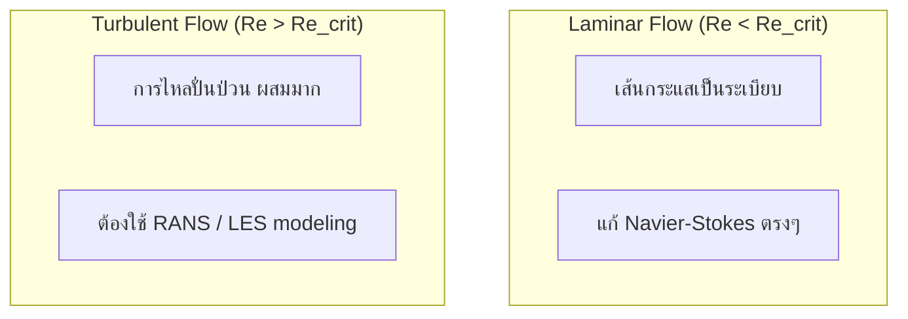

# สมการควบคุมของพลศาสตร์ของไหล: รากฐานทางคณิตศาสตร์สำหรับ CFD

สมการควบคุม (Governing Equations) คือ **หัวใจของการจำลอง CFD** ทุกสิ่งใน OpenFOAM เริ่มต้นที่นี่ — การเลือก solver, การตั้งค่า boundary conditions, และความเสถียรของการคำนวณ ล้วนมาจากความเข้าใจในฟิสิกส์ของสมการเหล่านี้

---

## พัฒนาการทางประวัติศาสตร์

รากฐานของพลศาสตร์ของไหลมาจาก **กลศาสตร์ตัวกลางต่อเนื่อง (Continuum Mechanics)** ซึ่งพัฒนาโดย Claude-Louis Navier และ George Gabriel Stokes ในช่วงต้นศตวรรษที่ 19 แนวคิดหลักคือการมองของไหลเป็น **ตัวกลางต่อเนื่อง** แทนที่จะเป็นอนุภาคแยกส่วน

### สมมติฐานพื้นฐาน

- **ของไหลเป็นตัวกลางต่อเนื่อง** — ไม่จำเป็นต้องติดตามโมเลกุลแต่ละตัว
- **ตัวแปรสนามเป็นฟังก์ชันต่อเนื่อง** — ความเร็ว $\mathbf{u}(\mathbf{x},t)$, ความดัน $p(\mathbf{x},t)$, อุณหภูมิ $T(\mathbf{x},t)$

สมการควบคุมเขียนใน **Conservative Form** เพื่อ:
- รักษาคุณสมบัติการอนุรักษ์ในทุก control volume
- จับ shock waves ได้อย่างแม่นยำ
- เข้ากันได้กับ Finite Volume Method ของ OpenFOAM

---

## กฎการอนุรักษ์พื้นฐาน

ฟิสิกส์ของการไหลถูกควบคุมโดยกฎการอนุรักษ์ 3 ข้อ ซึ่งเป็นหลักการพื้นฐานที่ไม่มีข้อยกเว้น

### 1. การอนุรักษ์มวล (Continuity Equation)

**"มวลไม่สามารถถูกสร้างหรือทำลายได้"**

สำหรับของไหลอัดตัวได้ (Compressible):
$$\frac{\partial \rho}{\partial t} + \nabla \cdot (\rho \mathbf{u}) = 0$$

สำหรับของไหลอัดตัวไม่ได้ (Incompressible, $\rho = \text{constant}$):
$$\nabla \cdot \mathbf{u} = 0$$

เงื่อนไข **divergence-free** นี้หมายความว่า: ปริมาตรของของไหลที่ไหลเข้า control volume ต้องเท่ากับที่ไหลออก

### 2. การอนุรักษ์โมเมนตัม (Navier-Stokes Equations)

**"แรงสุทธิ = มวล × ความเร่ง"** — กฎข้อที่สองของนิวตัน

$$\rho \frac{\partial \mathbf{u}}{\partial t} + \rho (\mathbf{u} \cdot \nabla) \mathbf{u} = -\nabla p + \nabla \cdot \boldsymbol{\tau} + \mathbf{f}$$

แต่ละพจน์มีความหมายทางกายภาพ:

| พจน์ | ความหมาย |
|------|----------|
| $\rho \frac{\partial \mathbf{u}}{\partial t}$ | การเปลี่ยนแปลงโมเมนตัมตามเวลา (Local acceleration) |
| $\rho (\mathbf{u} \cdot \nabla) \mathbf{u}$ | การพาโมเมนตัม (Convective acceleration) |
| $-\nabla p$ | แรงดัน (Pressure force) |
| $\nabla \cdot \boldsymbol{\tau}$ | แรงหนืด (Viscous force) |
| $\mathbf{f}$ | แรงภายนอก เช่น แรงโน้มถ่วง (Body force) |

**Viscous stress tensor** สำหรับ Newtonian fluid:
$$\boldsymbol{\tau} = \mu \left[ \nabla \mathbf{u} + (\nabla \mathbf{u})^T \right] - \frac{2}{3} \mu (\nabla \cdot \mathbf{u}) \mathbf{I}$$

### 3. การอนุรักษ์พลังงาน (Energy Equation)

**"พลังงานไม่สูญหาย เพียงเปลี่ยนรูป"** — กฎข้อที่หนึ่งของอุณหพลศาสตร์

$$\rho c_p \frac{\partial T}{\partial t} + \rho c_p (\mathbf{u} \cdot \nabla) T = k \nabla^2 T + \Phi + Q$$

โดยที่:
- $c_p$ = ความจุความร้อนจำเพาะ [J/(kg·K)]
- $k$ = สัมประสิทธิ์การนำความร้อน [W/(m·K)]
- $\Phi$ = Viscous dissipation (พลังงานกลที่กลายเป็นความร้อน)
- $Q$ = แหล่งกำเนิด/ตัวรับความร้อน

---

## สัญกรณ์เทนเซอร์ (Tensor Notation)

สมการสามารถเขียนในรูป **Index notation** ที่กระชับกว่า โดยใช้ Einstein summation convention:

**สมการความต่อเนื่อง:**
$$\frac{\partial \rho}{\partial t} + \frac{\partial}{\partial x_i} (\rho u_i) = 0$$

**สมการโมเมนตัม:**
$$\rho \frac{\partial u_i}{\partial t} + \rho u_j \frac{\partial u_i}{\partial x_j} = -\frac{\partial p}{\partial x_i} + \frac{\partial \tau_{ij}}{\partial x_j} + f_i$$

โดยที่ $i,j = 1,2,3$ แทนสามมิติเชิงพื้นที่

---

## การวิเคราะห์มิติและตัวเลขไร้มิติ

### Characteristic Scales

เพื่อทำให้สมการไร้มิติ เราใช้ค่ามาตรฐาน:
- **ความยาว:** $L$ [m]
- **ความเร็ว:** $U_{\text{ref}}$ [m/s]
- **เวลา:** $t_{\text{ref}} = L/U_{\text{ref}}$ [s]
- **ความดัน:** $p_{\text{ref}} = \rho U_{\text{ref}}^2$ [Pa]

### Reynolds Number

ตัวเลขที่สำคัญที่สุดใน CFD:

$$\text{Re} = \frac{\rho U_{\text{ref}} L}{\mu} = \frac{\text{แรงเฉื่อย}}{\text{แรงหนืด}}$$

**สมการโมเมนตัมแบบไร้มิติ:**
$$\frac{\partial \mathbf{u}^*}{\partial t^*} + (\mathbf{u}^* \cdot \nabla^*) \mathbf{u}^* = -\nabla^* p^* + \frac{1}{\text{Re}} \nabla^{*2} \mathbf{u}^* + \mathbf{f}^*$$

Reynolds number บอกเราว่า:
- **Re ต่ำ** → แรงหนืดมาก → การไหลแบบ Laminar (ราบเรียบ)
- **Re สูง** → แรงเฉื่อยมาก → การไหลแบบ Turbulent (ปั่นป่วน)

---

## Laminar vs Turbulent Flow

สำหรับ Turbulent flow เราใช้ **Reynolds Decomposition**:
$$\mathbf{u} = \overline{\mathbf{u}} + \mathbf{u}'$$

โดย $\overline{\mathbf{u}}$ คือค่าเฉลี่ย และ $\mathbf{u}'$ คือค่าผันผวน (fluctuation)

**RANS Equations** มีพจน์เพิ่มเติมคือ **Reynolds stress** $-\rho \overline{\mathbf{u}' \mathbf{u}'}$ ที่ต้องใช้ Turbulence model (เช่น k-ε, k-ω) ในการประมาณค่า

---

## ความท้าทายหลักในการแก้สมการ

### 1. ความไม่เป็นเชิงเส้น (Nonlinearity)

พจน์ convective $(\mathbf{u} \cdot \nabla)\mathbf{u}$ ทำให้สมการไม่เป็นเชิงเส้น ต้องใช้วิธีแก้แบบวนซ้ำ (iterative methods)

### 2. Pressure-Velocity Coupling

ในการไหลแบบ incompressible ความดันไม่ได้มาจากสมการสถานะ แต่ทำหน้าที่เป็น **ตัวบังคับ** ให้ $\nabla \cdot \mathbf{u} = 0$ จึงต้องใช้อัลกอริทึมพิเศษ เช่น **SIMPLE**, **PISO**, **PIMPLE**

### 3. Boundary Conditions

การกำหนด boundary conditions ที่ถูกต้องเป็นสิ่งจำเป็น:
- **Inlet:** กำหนดความเร็ว/ความดัน
- **Outlet:** มักใช้ zero gradient
- **Wall:** No-slip condition ($\mathbf{u} = 0$)
- **Symmetry:** สะท้อนสมมาตร

---

## สรุป

สมการควบคุมทั้งหมดนี้ — การอนุรักษ์มวล, โมเมนตัม, และพลังงาน — เป็นฐานของทุกอย่างใน CFD:

| สมการ | หลักการ | ผลลัพธ์ |
|-------|---------|---------|
| Continuity | มวลคงที่ | $\nabla \cdot \mathbf{u} = 0$ |
| Navier-Stokes | F = ma | สนามความเร็ว $\mathbf{u}$, ความดัน $p$ |
| Energy | พลังงานคงที่ | สนามอุณหภูมิ $T$ |

**Reynolds Number** เป็นตัวกำหนดว่าการไหลเป็น Laminar หรือ Turbulent ซึ่งส่งผลโดยตรงต่อการเลือก solver และ turbulence model ใน OpenFOAM

สำหรับรายละเอียดเกี่ยวกับการนำสมการเหล่านี้ไปใช้ใน OpenFOAM ดูที่ [05_OpenFOAM_Implementation.md](05_OpenFOAM_Implementation.md)

---

## Concept Check

<b>1. ทำไมสมการควบคุมต้องเขียนในรูป Conservative Form?</b>

เพื่อรักษาคุณสมบัติการอนุรักษ์ (มวล, โมเมนตัม, พลังงาน) อย่างแม่นยำในทุก control volume โดยเฉพาะเมื่อมี shock waves หรือการเปลี่ยนแปลงที่รุนแรง

<b>2. Reynolds Number บอกอะไรเราเกี่ยวกับการไหล?</b>

Re เป็นอัตราส่วนระหว่างแรงเฉื่อยและแรงหนืด ถ้า Re ต่ำ → Laminar flow (หนืดครอบงำ) ถ้า Re สูง → Turbulent flow (เฉื่อยครอบงำ) ซึ่งกำหนดว่าต้องใช้ turbulence model หรือไม่

<b>3. ในการไหลแบบ Incompressible ความดันมีบทบาทอย่างไร?</b>

ความดันไม่ได้เป็นตัวแปรสถานะ (ไม่กำหนด $\rho$) แต่ทำหน้าที่เป็น Lagrange multiplier เพื่อบังคับให้ $\nabla \cdot \mathbf{u} = 0$ (การอนุรักษ์มวล)

---

## เอกสารที่เกี่ยวข้อง

- **บทก่อนหน้า:** [00_Overview.md](00_Overview.md) — ภาพรวมของโมดูล
- **บทถัดไป:** [02_Conservation_Laws.md](02_Conservation_Laws.md) — รายละเอียดกฎการอนุรักษ์
- **การนำไปใช้:** [05_OpenFOAM_Implementation.md](05_OpenFOAM_Implementation.md) — การ implement ใน OpenFOAM