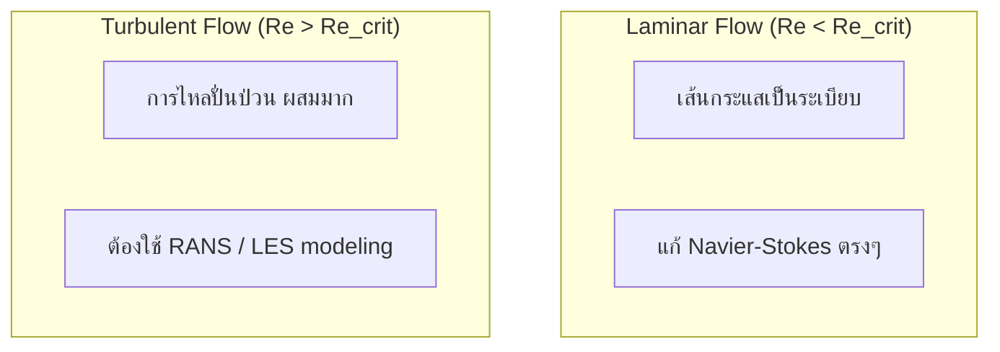

# สมการควบคุมของพลศาสตร์ของไหล: รากฐานทางคณิตศาสตร์สำหรับ CFD

## Learning Objectives

หลังจากศึกษาบทนี้ คุณจะสามารถ:
- ระบุและอธิบายกฎการอนุรักษ์ 3 ข้อที่ควบคุมการไหลของไหล
- อธิบายสมมติฐาน continuum และเงื่อนไขที่ยังคงถูกต้อง
- คำนวณและตีความ Reynolds number เพื่อจำแนกชนิดการไหล
- เชื่อมโยงสมการควบคุมกับการเลือก solver ใน OpenFOAM

---

## ทำไมสมการควบคุมมีความสำคัญ?

สมการควบคุม (Governing Equations) คือ **หัวใจของการจำลอง CFD** ทุก solver ใน OpenFOAM ถูกออกแบบมาเพื่อแก้สมการเหล่านี้ การเข้าใจสมการควบคุมจึงเป็นพื้นฐานที่จำเป็นก่อนการใช้งาน OpenFOAM

### ผลกระทบต่อการเลือก Solver ใน OpenFOAM

แต่ละ solver แก้สมการชุดที่แตกต่างกัน ขึ้นอยู่กับฟิสิกส์ที่ต้องการ:

| Solver | สมการที่แก้ | ใช้สำหรับ |
|--------|--------------|----------|
| **simpleFoam** | Continuity + Momentum (steady) | การไหลแบบ incompressible, steady-state |
| **pimpleFoam** | Continuity + Momentum (transient) | การไหลแบบ incompressible, transient |
| **sonicFoam** | Continuity + Momentum + Energy | การไหลแบบ compressible ที่ความเร็วสูง |
| **buoyantSimpleFoam** | Continuity + Momentum + Energy | การไหลที่มีการถ่ายเทความร้อน + ลอยตัว |
| **interFoam** | Continuity + Momentum + VOF | การไหล 2 เฟส (free surface) |

> 💡 **Key Insight:** ถ้าคุณไม่เข้าใจว่า solver แก้สมการอะไร คุณอาจเลือก solver ผิดและได้ผลลัพธ์ที่ไม่ถูกต้อง

### ผลกระทบต่อการตั้งค่า Boundary Conditions

การตั้งค่า BCs ที่ถูกต้องต้องอาศัยความเข้าใจสมการ:
- **Pressure inlet vs Velocity inlet:** เลือก BC ผิด = ไม่收敛
- **Wall BC:** ต้องรู้ว่าสมการกำหนด no-slip condition อย่างไร
- **Outlet BC:** ต้องเข้าใจ zero gradient condition ที่มาจาก conservative form

### ผลกระทบต่อการเลือก Numerical Schemes

เลือก discretization schemes ที่เหมาะสมกับฟิสิกส์:
- **Convective schemes:** Gauss upwind vs Gauss linear → ความแม่นยำ vs เสถียรภาพ
- **Divergence schemes:** ต้อง preserve conservation property
- **Time integration:** Euler implicit vs Crank-Nicolson → ความเร็ว vs ความแม่นยำ

---

## Continuum Hypothesis: พื้นฐานของ CFD

สมการ Navier-Stokes ถูกพัฒนาภายใต้สมมติฐานว่าของไหลเป็น **ตัวกลางต่อเนื่อง** (continuous medium) แทนที่จะเป็นอนุภาคแยกส่วน

### สมมติฐานพื้นฐาน

1. **ของไหลเป็นตัวกลางต่อเนื่อง** — ไม่จำเป็นต้องติดตามโมเลกุลแต่ละตัว
2. **ตัวแปรสนามเป็นฟังก์ชันต่อเนื่อง** — ความเร็ว $\mathbf{u}(\mathbf{x},t)$, ความดัน $p(\mathbf{x},t)$, อุณหภูมิ $T(\mathbf{x},t)$

### เมื่อไหร่ที่ Continuum Assumption ถูกละเมิด?

**Knudsen Number (Kn):** ตัวชี้วัดความถูกต้องของ continuum assumption

$$Kn = \frac{\lambda}{L}$$

โดยที่:
- $\lambda$ = mean free path [m] (ระยะห่างเฉลี่ยระหว่างโมเลกุล)
- $L$ = characteristic length scale [m] (ขนาดของปัญหา)

| Flow Regime | Kn Range | Validity of N-S |
|-------------|----------|----------------|
| **Continuum** | Kn < 0.01 | ✓ ใช้สมการ N-S ได้ |
| **Slip / Transition** | Kn > 0.01 | ✗ ต้องใช้วิธีอื่น |

> 💡 **สำหรับงาน CFD ทั่วไป:** Continuum assumption ถือเป็นจริงเสมอ ยกเว้นในกรณีพิเศษ เช่น microfluidics หรือ high-altitude aerodynamics

---

## กฎการอนุรักษ์ 3 ข้อ

ฟิสิกส์ของการไหลถูกควบคุมโดยกฎการอนุรักษ์ 3 ข้อ ซึ่งเป็นหลักการพื้นฐานที่ไม่มีข้อยกเว้น

### 1. การอนุรักษ์มวล (Continuity Equation)

**"มวลไม่สามารถถูกสร้างหรือทำลายได้"**

สำหรับของไหลอัดตัวได้ (Compressible):
$$\frac{\partial \rho}{\partial t} + \nabla \cdot (\rho \mathbf{u}) = 0$$

สำหรับของไหลอัดตัวไม่ได้ (Incompressible, $\rho = \text{constant}$):
$$\nabla \cdot \mathbf{u} = 0$$

เงื่อนไข **divergence-free** นี้หมายความว่า: ปริมาตรของของไหลที่ไหลเข้า control volume ต้องเท่ากับที่ไหลออก

### 2. การอนุรักษ์โมเมนตัม (Navier-Stokes Equations)

**"แรงสุทธิ = มวล × ความเร่ง"** — กฎข้อที่สองของนิวตัน

$$\rho \frac{\partial \mathbf{u}}{\partial t} + \rho (\mathbf{u} \cdot \nabla) \mathbf{u} = -\nabla p + \nabla \cdot \boldsymbol{\tau} + \mathbf{f}$$

แต่ละพจน์มีความหมายทางกายภาพ:

| พจน์ | ความหมาย |
|------|----------|
| $\rho \frac{\partial \mathbf{u}}{\partial t}$ | การเปลี่ยนแปลงโมเมนตัมตามเวลา (Local acceleration) |
| $\rho (\mathbf{u} \cdot \nabla) \mathbf{u}$ | การพาโมเมนตัม (Convective acceleration) |
| $-\nabla p$ | แรงดัน (Pressure force) |
| $\nabla \cdot \boldsymbol{\tau}$ | แรงหนืด (Viscous force) |
| $\mathbf{f}$ | แรงภายนอก เช่น แรงโน้มถ่วง (Body force) |

> 📖 **รายละเอียดเพิ่มเติม:** สำหรับรายละเอียดของ viscous stress tensor $\boldsymbol{\tau}$ ดูที่ [02_Conservation_Laws.md](02_Conservation_Laws.md)

### 3. การอนุรักษ์พลังงาน (Energy Equation)

**"พลังงานไม่สูญหาย เพียงเปลี่ยนรูป"** — กฎข้อที่หนึ่งของอุณหพลศาสตร์

$$\rho c_p \frac{\partial T}{\partial t} + \rho c_p (\mathbf{u} \cdot \nabla) T = k \nabla^2 T + \Phi + Q$$

โดยที่:
- $c_p$ = ความจุความร้อนจำเพาะ [J/(kg·K)]
- $k$ = สัมประสิทธิ์การนำความร้อน [W/(m·K)]
- $\Phi$ = Viscous dissipation (พลังงานกลที่กลายเป็นความร้อน)
- $Q$ = แหล่งกำเนิด/ตัวรับความร้อน

---

## Reynolds Number: ตัวกำหนดลักษณะการไหล

ตัวเลขไร้มิติที่สำคัญที่สุดใน CFD:

$$\text{Re} = \frac{\rho U_{\text{ref}} L}{\mu} = \frac{\text{แรงเฉื่อย}}{\text{แรงหนืด}}$$

โดยที่:
- $\rho$ = ความหนาแน่น [kg/m³]
- $U_{\text{ref}}$ = ความเร็วอ้างอิง [m/s]
- $L$ = ความยาว特性 [m]
- $\mu$ = ความหนืดพลศาสตร์ [Pa·s]

### การตีความ Reynolds Number

| Re Range | ลักษณะการไหล | แรงที่ครอบงำ | วิธีการแก้สมการ |
|----------|--------------|-------------|----------------|
| **Re < 2300** | Laminar | แรงหนืด | แก้ N-S ตรงๆ |
| **Re > 4000** | Turbulent | แรงเฉื่อย | ต้องใช้ turbulence model |
| **2300 < Re < 4000** | Transition | ผสมกัน | ใช้ transition model |

> 💡 **Critical Note:** ค่า Re_crit ขึ้นอยู่กับ geometry เช่น ในท่อเรียบ Re_crit ≈ 2300 แต่ใน boundary layer บนแผ่นเรียบ Re_crit ≈ 5×10⁵

### ผลต่อการเลือก Solver ใน OpenFOAM

- **Re ต่ำ (Laminar):** ใช้ solver แบบง่าย (เช่น `simpleFoam`, `pimpleFoam`) โดยไม่ต้องมี turbulence model
- **Re สูง (Turbulent):** ต้องเลือก solver ที่มี turbulence model (เช่น `kEpsilon`, `kOmegaSST`) หรือใช้ LES/DNS

---

## Laminar vs Turbulent Flow

### ความท้าทายของ Turbulent Flow

สำหรับ Turbulent flow เราใช้ **Reynolds Decomposition**:
$$\mathbf{u} = \overline{\mathbf{u}} + \mathbf{u}'$$

โดย $\overline{\mathbf{u}}$ คือค่าเฉลี่ย และ $\mathbf{u}'$ คือค่าผันผวน (fluctuation)

**⚠️ ปัญหา Closure:**
เมื่อแทนค่า decomposition ลงในสมการ N-S และทำการ averaging จะเกิด **Reynolds Stress Tensor**:
$$-\rho \overline{\mathbf{u}' \mathbf{u}'}$$

ปัญหาคือ: เรามีสมการ 4 คือ (continuity + 3 momentum components) แต่มี unknowns เพิ่มขึ้น 6 ตัว (Reynolds stresses) → **ระบบไม่สมบูรณ์ (under-determined)**

**ทางออก: Turbulence Modeling** (รายละเอียดใน [04_Turbulence_Modeling.md](04_Turbulence_Modeling.md))

---

## ความท้าทายหลักในการแก้สมการ

### 1. ความไม่เป็นเชิงเส้น (Nonlinearity)

พจน์ convective $(\mathbf{u} \cdot \nabla)\mathbf{u}$ ทำให้สมการไม่เป็นเชิงเส้น ต้องใช้วิธีแก้แบบวนซ้ำ (iterative methods)

### 2. Pressure-Velocity Coupling

ในการไหลแบบ incompressible ความดันไม่ได้มาจากสมการสถานะ แต่ทำหน้าที่เป็น **ตัวบังคับ** ให้ $\nabla \cdot \mathbf{u} = 0$ จึงต้องใช้อัลกอริทึมพิเศษ เช่น **SIMPLE**, **PISO**, **PIMPLE** (รายละเอียดใน [05_OpenFOAM_Implementation.md](05_OpenFOAM_Implementation.md))

### 3. Boundary Conditions

การกำหนด boundary conditions ที่ถูกต้องเป็นสิ่งจำเป็น:
- **Inlet:** กำหนดความเร็ว/ความดัน
- **Outlet:** มักใช้ zero gradient
- **Wall:** No-slip condition ($\mathbf{u} = 0$)
- **Symmetry:** สะท้อนสมมาตร

---

## Common Pitfalls

<b>❌ ผิดทั่วไป: เลือก solver โดยไม่พิจารณาสมการที่ต้องการ</b>

**ตัวอย่าง:** ใช้ `simpleFoam` (steady, incompressible) สำหรับปัญหา transient flow  
**ผลกระทบ:** ไม่สามารถ capture temporal variations ได้  
**วิธีแก้:** ใช้ `pimpleFoam` หรือ `transientSimpleFoam` แทน

<b>❌ ผิดทั่วไป: ไม่ตรวจสอบ Reynolds number ก่อนเริ่ม</b>

**ตัวอย่าง:** สมมติว่า flow เป็น laminar โดยไม่คำนวณ Re  
**ผลกระทบ:** ผลลัพธ์ไม่ถูกต้องเมื่อ Re สูงกว่าค่า critical  
**วิธีแก้:** คำนวณ Re เสมอก่อนเลือกวิธีการแก้

<b>❌ ผิดทั่วไป: ใช้ turbulence model กับ laminar flow</b>

**ตัวอย่าง:** ใช้ k-ε model กับ flow ที่มี Re < 100  
**ผลกระทบ:** เสียเวลาคำนวณและอาจได้ผลลัพธ์ที่แย่ลง  
**วิธีแก้:** ตรวจสอบ Re และปิด turbulence model ถ้าเป็น laminar

---

## สรุปและ Takeaways

| แนวคิดสำคัญ | ข้อควรจำ |
|-------------|----------|
| **สมการควบคุม** | ทุก solver ใน OpenFOAM แก้สมการ conservation 3 ข้อ (mass, momentum, energy) |
| **Continuum assumption** | ถูกต้องเมื่อ Kn < 0.01 ซึ่งครอบคลุมงาน CFD ทั่วไปทั้งหมด |
| **Reynolds number** | ตัวกำหนดว่าการไหลเป็น laminar หรือ turbulent → ส่งผลต่อการเลือก solver |
| **Pressure-velocity coupling** | ความดันใน incompressible flow เป็น Lagrange multiplier ที่บังคับ mass conservation |
| **Nonlinearity** | ทำให้ต้องใช้ iterative methods และ linear solvers |

### เชื่อมโยงกับบทถัดไป

- **บทถัดไป [02_Conservation_Laws.md](02_Conservation_Laws.md):** รายละเอียดเชิงลึกของแต่ละกฎการอนุรักษ์ รวมถึง viscous stress tensor
- **บท [04_Turbulence_Modeling.md](04_Turbulence_Modeling.md):** การคำนวณ Reynolds number อย่างละเอียดและการเลือก turbulence model
- **บท [05_OpenFOAM_Implementation.md](05_OpenFOAM_Implementation.md):** การนำสมการเหล่านี้ไปใช้ใน OpenFOAM รวมถึง pressure-velocity coupling algorithms

---

## Concept Check

<b>1. ทำไมสมการควบคุมต้องเขียนในรูป Conservative Form?</b>

เพื่อรักษาคุณสมบัติการอนุรักษ์ (มวล, โมเมนตัม, พลังงาน) อย่างแม่นยำในทุก control volume โดยเฉพาะเมื่อมี shock waves หรือการเปลี่ยนแปลงที่รุนแรง

<b>2. Reynolds Number บอกอะไรเราเกี่ยวกับการไหล?</b>

Re เป็นอัตราส่วนระหว่างแรงเฉื่อยและแรงหนืด ถ้า Re ต่ำ → Laminar flow (หนืดครอบงำ) ถ้า Re สูง → Turbulent flow (เฉื่อยครอบงำ) ซึ่งกำหนดว่าต้องใช้ turbulence model หรือไม่

<b>3. ในการไหลแบบ Incompressible ความดันมีบทบาทอย่างไร?</b>

ความดันไม่ได้เป็นตัวแปรสถานะ (ไม่กำหนด $\rho$) แต่ทำหน้าที่เป็น Lagrange multiplier เพื่อบังคับให้ $\nabla \cdot \mathbf{u} = 0$ (การอนุรักษ์มวล)

<b>4. Solver ไหนควรใช้สำหรับ steady incompressible flow?</b>

ควรใช้ `simpleFoam` ซึ่งแก้ continuity equation และ momentum equation สำหรับ steady-state incompressible flow โดยใช้อัลกอริทึม SIMPLE

---

## เอกสารที่เกี่ยวข้อง

- **บทก่อนหน้า:** [00_Overview.md](00_Overview.md) — ภาพรวมของโมดูล
- **บทถัดไป:** [02_Conservation_Laws.md](02_Conservation_Laws.md) — รายละเอียดกฎการอนุรักษ์และ viscous stress tensor
- **บทที่เกี่ยวข้อง:** 
  - [04_Turbulence_Modeling.md](04_Turbulence_Modeling.md) — การคำนวณ Reynolds number และ turbulence models
  - [05_OpenFOAM_Implementation.md](05_OpenFOAM_Implementation.md) — การ implement ใน OpenFOAM และ pressure-velocity coupling