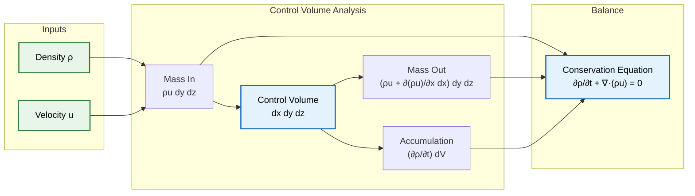
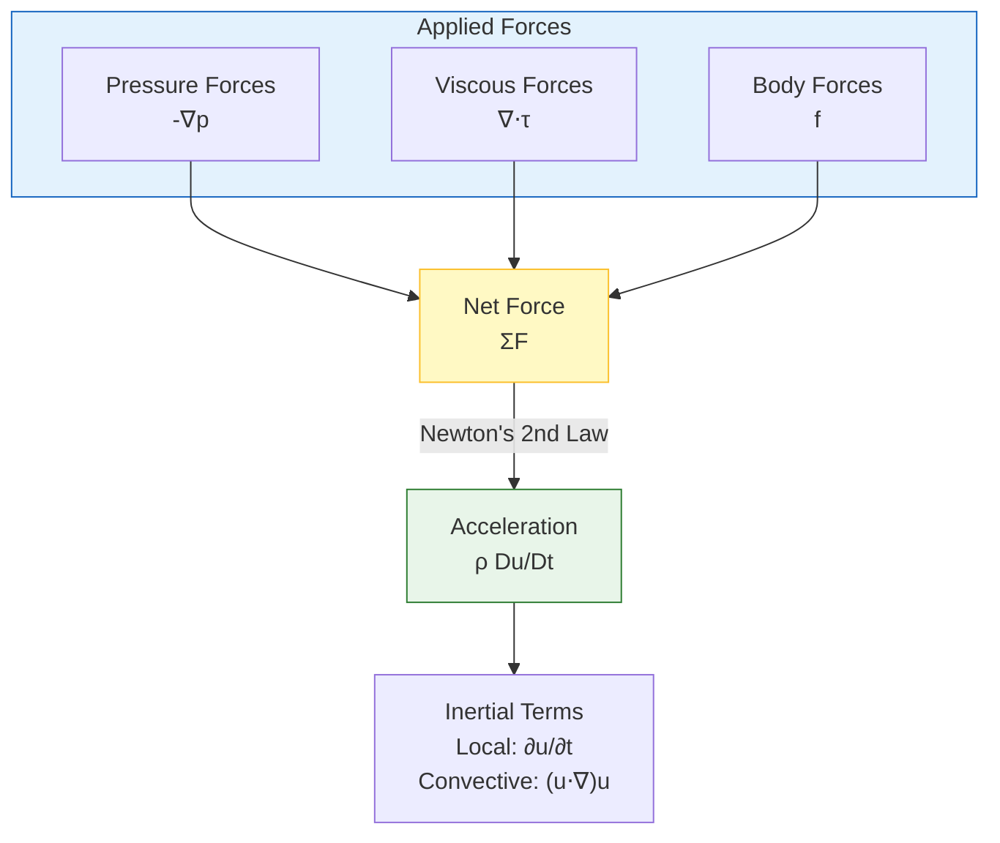
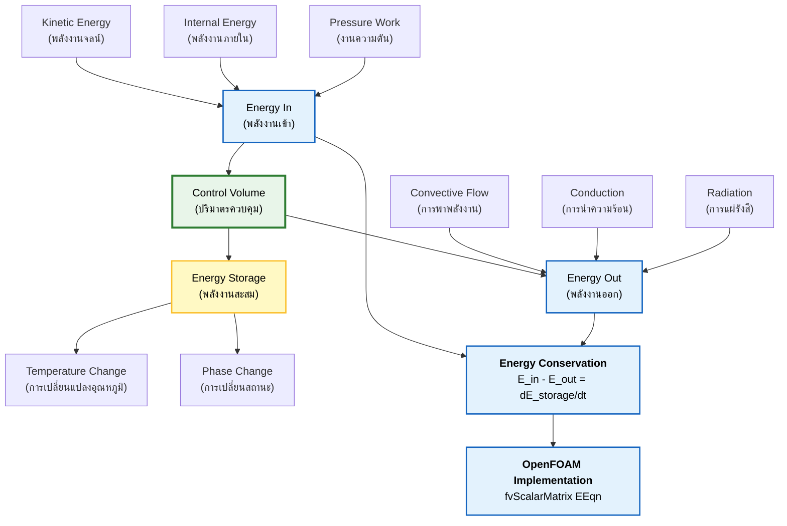

# กฎการอนุรักษ์

กฎการอนุรักษ์เป็นรากฐานทางคณิตศาสตร์ของ Computational Fluid Dynamics (CFD) ทั้งหมด กฎเหล่านี้อธิบายถึงการอนุรักษ์มวล โมเมนตัม และพลังงานในระบบการไหลของของไหล และถูกนำไปใช้ใน OpenFOAM ผ่านวิธี Finite Volume Method (FVM)

> [!INFO] ความสำคัญของกฎการอนุรักษ์
> กฎการอนุรักษ์เป็นแกนหลักทางคณิตศาสตร์ของการจำลอง CFD ทั้งหมด ซึ่งควบคุมพฤติกรรมของไหลผ่านหลักการทางกายภาพที่เข้มงวด

---

## การอนุรักษ์มวล (สมการความต่อเนื่อง)

### หลักการทางกายภาพ

**หลักการอนุรักษ์มวล** ระบุว่ามวลไม่สามารถถูกสร้างขึ้นหรือถูกทำลายได้ในระบบการไหลของของไหล เมื่อไม่มีแหล่งกำเนิดหรือแหล่งรับมวลอยู่

หลักการพื้นฐานนี้:
- ได้มาจากกฎการอนุรักษ์สสาร
- เป็นรากฐานของพลศาสตร์ของไหล
- ใช้แนวทางแบบ Eulerian (พิจารณาของไหลเป็นตัวกลางแบบต่อเนื่อง)
- เป็นหนึ่งในสามสมการอนุรักษ์พื้นฐานใน CFD ควบคู่กับการอนุรักษ์โมเมนตัมและพลังงาน


> **Figure 1:** การวิเคราะห์ปริมาตรควบคุมสำหรับการอนุรักษ์มวล แสดงให้เห็นว่าฟลักซ์มวล (เข้า/ออก) และการสะสมมวลนำไปสู่สมการความต่อเนื่อง $\frac{\partial \rho}{\partial t} + \nabla \cdot (\rho \mathbf{u}) = 0$ ได้อย่างไร

### รูปแบบสมการทั่วไป

**สำหรับของไหลแบบอัดตัวได้ (Compressible Flow)**:

$$\frac{\partial \rho}{\partial t} + \nabla \cdot (\rho \mathbf{u}) = 0$$

โดยที่:
- $\rho$ = ความหนาแน่นของของไหล [kg/m³]
- $\mathbf{u}$ = เวกเตอร์ความเร็ว [m/s]
- $\nabla \cdot$ = Divergence operator
- $t$ = เวลา [s]

**สำหรับของไหลแบบอัดตัวไม่ได้ (Incompressible Flow)** เมื่อ $\rho = \text{constant}$:

$$\nabla \cdot \mathbf{u} = 0$$

เงื่อนไข divergence-free condition นี้ทำให้มั่นใจได้ว่าปริมาตรของ fluid elements ยังคงที่เมื่อเคลื่อนที่ผ่าน flow field

### การพิสูจน์แบบทีละขั้นตอน (Step-by-Step Derivation)

พิจารณาปริมาตรควบคุมเชิงอนุพันธ์ (differential control volume) ที่มีความยาว $dx, dy, dz$

**ขั้นตอนที่ 1: คำนวณมวลไหลเข้า**
มวลเข้าสู่หน้าที่ตั้งฉากกับแกน x ณ ตำแหน่ง $x$:
$$\dot{m}_{in,x} = (\rho u_x) dy dz$$

**ขั้นตอนที่ 2: คำนวณมวลไหลออก**
มวลออกจากหน้าตรงข้าม ณ ตำแหน่ง $x + dx$:
$$\dot{m}_{out,x} = \left( \rho u_x + \frac{\partial (\rho u_x)}{\partial x} dx \right) dy dz$$

**ขั้นตอนที่ 3: ฟลักซ์มวลสุทธิในทิศทาง X**
$$\text{Net Flux}_x = \dot{m}_{in,x} - \dot{m}_{out,x} = - \frac{\partial (\rho u_x)}{\partial x} dV$$

**ขั้นตอนที่ 4: รวมสำหรับทุกทิศทาง**
$$\text{Total Net Flux} = - \left( \frac{\partial (\rho u_x)}{\partial x} + \frac{\partial (\rho u_y)}{\partial y} + \frac{\partial (\rho u_z)}{\partial z} \right) dV = - (\nabla \cdot (\rho \mathbf{u})) dV$$

**ขั้นตอนที่ 5: อัตราการสะสมมวล**
$$\frac{\partial (\rho dV)}{\partial t} = \frac{\partial \rho}{\partial t} dV$$

**ขั้นตอนที่ 6: ประยุกต์ใช้หลักการอนุรักษ์**
$$\frac{\partial \rho}{\partial t} dV = - (\nabla \cdot (\rho \mathbf{u})) dV$$

**สมการสุดท้าย**:
$$\boxed{\frac{\partial \rho}{\partial t} + \nabla \cdot (\rho \mathbf{u}) = 0}$$

### ความเข้าใจเชิงกายภาพ (Physical Interpretation)

สมการความต่อเนื่องปรับสมดุลระหว่าง:

1. **การเปลี่ยนแปลงความหนาแน่นเฉพาะที่** ($\frac{\partial \rho}{\partial t}$):
   - บวก = ของไหลมีความหนาแน่นเพิ่มขึ้น (สะสมมวล)
   - ลบ = ของไหลมีความหนาแน่นลดลง (สูญเสียมวล)

2. **ไดเวอร์เจนซ์ของฟลักซ์มวลแบบพา** ($\nabla \cdot (\rho \mathbf{u})$):
   - บวก = มวลออกจากจุดมากกว่าเข้า (การไหลแบบลู่ออก)
   - ลบ = มวลเข้าสู่จุดมากกว่าออก (การไหลแบบลู่เข้า)

> [!TIP] ความเข้าใจแบบเรียบง่าย
> การเปลี่ยนแปลงความหนาแน่น ณ จุดหนึ่ง (เทอมที่ 1) บวกกับการไหลสุทธิของมวลออกจากจุดนั้น (เทอมที่ 2) จะต้องเป็นศูนย์

### กรณีพิเศษ (Special Cases)

**การไหลแบบอัดตัวไม่ได้** ($\rho = \text{constant}$):
$$\nabla \cdot \mathbf{u} = 0$$

สนามความเร็วจะต้องเป็นแบบโซเลนอยด์ (divergence-free) ซึ่งเป็นพื้นฐานสำหรับ Solver เช่น `icoFoam` และ `simpleFoam`

**การไหลแบบสภาวะคงตัว** ($\frac{\partial}{\partial t} = 0$):
$$\nabla \cdot (\rho \mathbf{u}) = 0$$

ใช้กับการไหลแบบอัดตัวได้ในสภาวะคงตัว

### OpenFOAM Code Implementation

สมการความต่อเนื่องใน OpenFOAM ถูกนำไปใช้ในหลาย Solver:

```cpp
// การคำนวณ divergence ของ flux
fvScalarMatrix divPhi
(
    fvc::div(phi)                     // คำนวณ divergence ของ flux
);

// ใน simpleFoam สำหรับการไหลแบบอัดตัวไม่ได้
fvScalarMatrix UEqn
(
    fvm::div(phi, U)                  // convection term
  + turbulence->divDevRhoReff(U)      // turbulent diffusion
 ==
    fvOptions(rho, U)                 // source terms
);
```

---

## การอนุรักษ์โมเมนตัม (สมการ Navier-Stokes)

### หลักการทางกายภาพ

**หลักการอนุรักษ์โมเมนตัม** เป็นการขยายกฎข้อที่สองของนิวตันไปสู่กลศาสตร์ของไหลแบบต่อเนื่อง:

> อัตราการเปลี่ยนแปลงโมเมนตัมขององค์ประกอบของไหลเท่ากับผลรวมของแรงทั้งหมดที่กระทำต่อมัน

จุดสำคัญ:
- ต้องคำนึงถึงการเปลี่ยนแปลงโมเมนตัมทั้งแบบเฉพาะที่และแบบพา
- ใช้อนุพันธ์เชิงสสาร (material derivative) เพื่อติดตามการเปลี่ยนแปลงตามการเคลื่อนที่ของของไหล
- สมการ Navier-Stokes ปรับสมดุลระหว่างแรงเฉื่อย, แรงดัน, แรงหนืด, และแรงภายนอก


> **Figure 2:** โครงสร้างของสมการการอนุรักษ์โมเมนตัม โดยจับคู่แรงที่กระทำ (แรงดัน, แรงหนืด, แรงภายนอก) เข้ากับพจน์ความเร่งที่เกิดขึ้นตามกฎข้อที่สองของนิวตัน

### แรงที่กระทำต่อองค์ประกอบของไหล

**1. แรงกระทำทั่วปริมาตน (Body forces)**:

| ประเภท | สมการ | คำอธิบาย |
|--------|---------|----------|
| แรงโน้มถ่วง | $\mathbf{F}_g = \rho \mathbf{g} dV$ | แรงโน้มถ่วงที่กระทำต่อองค์ประกอบของไหล |
| แรงแม่เหล็กไฟฟ้า | $\mathbf{F}_{em} = \mathbf{J} \times \mathbf{B} dV$ | สำหรับของไหลนำไฟฟ้าในสนามแม่เหล็ก |
| แรง Coriolis | $\mathbf{F}_c = -2\rho \boldsymbol{\Omega} \times \mathbf{u} dV$ | ในกรอบอ้างอิงแบบหมุน |

**2. แรงกระทำที่ผิว (Surface forces)**:

| ประเภท | สมการ | คำอธิบาย |
|--------|---------|----------|
| แรงดัน | $\mathbf{F}_p = -p\mathbf{n} dA$ | กระทำตั้งฉากกับพื้นผิว |
| แรงหนืด | $\mathbf{F}_v = \boldsymbol{\tau} \cdot \mathbf{n} dA$ | เกิดจากการเสียดสีของของไหล |
| แรงตึงผิว | $\mathbf{F}_{st} = \sigma \kappa \mathbf{n} dA$ | สำหรับการไหลแบบหลายเฟส |

### รูปแบบสมการโมเมนตัม

**รูปแบบทั่วไป (General Form)**:

$$\rho \frac{\partial \mathbf{u}}{\partial t} + \rho (\mathbf{u} \cdot \nabla) \mathbf{u} = -\nabla p + \mu \nabla^2 \mathbf{u} + \mathbf{f}$$

โดยที่:
- $p$ = ความดันสถิต [Pa]
- $\mu$ = ความหนืดจลน์ (dynamic viscosity) [Pa·s]
- $\mathbf{f}$ = แรงกระทำต่อปริมาตน (body forces) [N/m³]

### การวิเคราะห์แต่ละเทอม (Term-by-Term Analysis)

**ด้านซ้ายมือ (Left-Hand Side) - อัตราการเปลี่ยนแปลงโมเมนตัม**:
- $\rho \frac{\partial \mathbf{u}}{\partial t}$ = ความเร่งเฉพาะที่ (local acceleration)
- $\rho (\mathbf{u} \cdot \nabla) \mathbf{u}$ = ความเร่งแบบพา (convective acceleration)

**ด้านขวามือ (Right-Hand Side) - แรงทั้งหมด**:
- $-\nabla p$ = แรงเกรเดียนต์ความดัน (pressure gradient forces)
- $\mu \nabla^2 \mathbf{u}$ = แรงหนืด (viscous forces)
- $\mathbf{f}$ = แรงภายนอก (external body forces)

### เทนเซอร์ความเค้นสำหรับของไหลแบบนิวตัน

ความสัมพันธ์เชิงโครงสร้าง (constitutive relation):
$$\boldsymbol{\tau} = \mu \left( \nabla \mathbf{u} + (\nabla \mathbf{u})^T \right) - \frac{2}{3}\mu (\nabla \cdot \mathbf{u})\mathbf{I}$$

โดยที่:
- $\mu$ = ความหนืดจลน์ (dynamic viscosity)
- $\nabla \mathbf{u} + (\nabla \mathbf{u})^T$ = เทนเซอร์อัตราการเปลี่ยนรูป (rate-of-strain tensor)
- $-\frac{2}{3}\mu (\nabla \cdot \mathbf{u})\mathbf{I}$ = เทอมความหนืดเชิงปริมาตน (bulk viscosity term)
- $\mathbf{I}$ = เทนเซอร์เอกลักษณ์ (identity tensor)

### รูปแบบที่ง่ายขึ้น (Simplified Forms)

**ของไหลแบบนิวตันที่อัดตัวไม่ได้** (Incompressible Newtonian Fluid):
$$\boxed{\rho \left(\frac{\partial \mathbf{u}}{\partial t} + \mathbf{u} \cdot \nabla \mathbf{u}\right) = -\nabla p + \mu \nabla^2 \mathbf{u} + \rho \mathbf{g}}$$

ใช้กันอย่างแพร่หลายใน Solver เช่น `icoFoam` และ `pimpleFoam`

**สมการ Euler** (การไหลแบบไม่มีความหนืด, $\mu = 0$):
$$\rho \left(\frac{\partial \mathbf{u}}{\partial t} + \mathbf{u} \cdot \nabla \mathbf{u}\right) = -\nabla p + \rho \mathbf{g}$$

เป็นพื้นฐานสำหรับทฤษฎีการไหลแบบศักย์ และใช้ใน `potentialFoam`

### OpenFOAM Code Implementation

การแก้สมการ Navier-Stokes ใน OpenFOAM:

```cpp
// จาก UEqn.H ใน pimpleFoam
fvVectorMatrix UEqn
(
    fvm::ddt(rho, U)              // เทอมความเร่งเฉพาะที่
  + fvm::div(rhoPhi, U)           // เทอม convection (พา)
  + turbulence->divDevRhoReff(U)  // เทอมความเค้นหนืด (รวมความปั่นป่วน)
 ==
    fvOptions(rho, U)             // เทอมแรงภายนอก
);

// การจัดการความดัน (pressure-velocity coupling)
while (pimple.correctNonOrthogonal())
{
    fvScalarMatrix pEqn
    (
        fvm::laplacian(rho/AU, p) == fvc::div(rho*AU*HbyA)
    );
}
```

---

## การอนุรักษ์พลังงาน

### หลักการทางกายภาพ

**หลักการอนุรักษ์พลังงาน** เป็นการขยายกฎข้อที่หนึ่งของอุณหพลศาสตร์:

> พลังงานไม่สามารถถูกสร้างขึ้นหรือถูกทำลายได้ แต่สามารถเปลี่ยนรูปหรือถูกถ่ายโอนระหว่างรูปแบบต่างๆ ได้

ในกลศาสตร์ของไหล พลังงานปรากฏในรูปแบบ:
- **พลังงานจลน์**: เนื่องจากการเคลื่อนที่ของของไหล
- **พลังงานภายใน**: พลังงานความร้อน
- **พลังงานศักย์**: แรงโน้มถ่วง
- **งานกล**: งานจากความดัน

สมการพลังงานสำคัญสำหรับ:
- การไหลแบบอัดตัวได้
- การจำลองการเผาไหม้
- การประยุกต์ใช้การถ่ายเทความร้อน

ใช้ใน Solver เช่น `buoyantBoussinesqSimpleFoam` และ `reactingFoam`


> **Figure 3:** สมดุลพลังงานบนปริมาตรควบคุม โดยคำนึงถึงฟลักซ์ของพลังงานจลน์ พลังงานภายใน และพลังงานศักย์ พจน์ของงาน และการถ่ายเทความร้อน เพื่อหาอนุพันธ์ของสมการการอนุรักษ์พลังงานรวม
### การกำหนดสมการพลังงาน

พลังงานรวมต่อหน่วยมวล:
$$E = e + \frac{1}{2}|\mathbf{u}|^2$$

- $e$ = พลังงานภายในจำเพาะ (specific internal energy)
- $\frac{1}{2}|\mathbf{u}|^2$ = พลังงานจลน์จำเพาะ (specific kinetic energy)

**สมการอนุรักษ์พลังงานแบบครบถ้วน**:

$$\frac{\partial (\rho E)}{\partial t} + \nabla \cdot (\rho E \mathbf{u}) = \nabla \cdot (k \nabla T) - \nabla \cdot (p \mathbf{u}) + \rho \mathbf{g} \cdot \mathbf{u} + \Phi$$

### การแยกย่อยแต่ละเทอม (Detailed Term Analysis)

| เทอม                                   | ความหมาย                                                      |
| -------------------------------------- | ------------------------------------------------------------- |
| $\frac{\partial (\rho E)}{\partial t}$ | อัตราการสะสมพลังงานต่อหน่วยปริมาตร                            |
| $\nabla \cdot (\rho E \mathbf{u})$     | การขนส่งพลังงานแบบพา (convective energy transport)            |
| $\nabla \cdot (k \nabla T)$            | การนำความร้อนตามกฎของ Fourier (heat conduction)               |
| $-\nabla \cdot (p \mathbf{u})$         | งานที่ทำโดยแรงดัน (pressure work)                             |
| $\rho \mathbf{g} \cdot \mathbf{u}$     | งานที่ทำโดยแรงโน้มถ่วง (gravitational work)                   |
| $\Phi$                                 | ฟังก์ชันการสลายพลังงานเนื่องจากความหนืด (viscous dissipation) |

**ฟังก์ชันการสลายพลังงานเนื่องจากความหนืด**:
$$\Phi = \boldsymbol{\tau} : \nabla \mathbf{u}$$

### รูปแบบทางเลือก (Alternative Forms)

**สมการอุณหภูมิ (Temperature Equation)**:

$$\rho c_p \frac{DT}{Dt} = k \nabla^2 T + \frac{Dp}{Dt} + \Phi$$

โดยที่:
- $c_p$ = ความร้อนจำเพาะที่ความดันคงที่ (specific heat capacity)
- $\frac{DT}{Dt} = \frac{\partial T}{\partial t} + \mathbf{u} \cdot \nabla T$ = อนุพันธ์เชิงสสารของอุณหภูมิ (material derivative)
- $\frac{Dp}{Dt}$ = งานที่ทำผ่านการเปลี่ยนแปลงความดัน

### OpenFOAM Code Implementation

```cpp
// จาก EEqn.H ใน buoyantBoussinesqSimpleFoam
fvScalarMatrix EEqn
(
    fvm::div(phi, h)                // การพาของเอนทาลปี
  + fvm::Sp(divU, h)                // source term จากการอัดตัว
 ==
    fvm::laplacian(turbulence->alphaEff(), h)  // การแพร่ของความร้อน
  + fvc::div(phi, K)                // การพาของพลังงานจลน์
  + radiation->Sh(thermo)           // แหล่งกำเนิดความร้อน
);
```

### ขั้นตอนการแก้ปัญหาใน OpenFOAM (Solution Procedure)

**ขั้นตอนการแก้สมการอนุรักษ์แบบ coupled**:

1. **Initialize fields**: อ่านค่าเริ่มต้นจาก directory `0/`
2. **Time loop advancement**: ขั้นตอนเวลาใหม่
3. **Momentum predictor**: ทำนายความเร็วโดยใช้สมการโมเมนตัม
4. **Pressure correction**: แก้ไขความดันเพื่อให้เป็นไปตามสมการความต่อเนื่อง
5. **Energy equation solve**: แก้สมการพลังงานสำหรับอุณหภูมิหรือเอนทาลปี
6. **Turbulence model update**: อัปเดตโมเดลความปั่นป่วน
7. **Convergence check**: ตรวจสอบการลู่เข้า

```cpp
// ตัวอย่างขั้นตอนการแก้ปัญหาแบบ PISO
while (runTime.loop())
{
    // Momentum predictor
    tmp<fvVectorMatrix> UEqn
    (
        fvm::ddt(rho, U)
      + fvm::div(rhoPhi, U)
      - fvm::Sp(fvc::ddt(rho) + fvc::div(rhoPhi), U)
    );

    // Pressure correction loops
    while (pimple.correct())
    {
        volScalarField rAU(1.0/UEqn.A());
        // ... pressure-velocity coupling
    }

    // Energy equation
    fvScalarMatrix EEqn
    (
        fvm::ddt(rho, e) + fvm::div(phi, e)
      - fvm::laplacian(turbulence->alphaEff(), e)
    );

    EEqn.solve();
}
```

---

## สูตรสมการการขนส่งทั่วไป (General Transport Equation)

สำหรับคุณสมบัติทั่วไป $\phi$ สมการการอนุรักษ์สามารถแสดงได้ในรูปแบบทั่วไป:

$$\frac{\partial (\rho \phi)}{\partial t} + \nabla \cdot (\rho \phi \mathbf{u}) = \nabla \cdot (\Gamma \nabla \phi) + S_\phi$$

โดยที่:
- $\rho$ = density (ความหนาแน่น)
- $\mathbf{u}$ = velocity vector (เวกเตอร์ความเร็ว)
- $\Gamma$ = diffusion coefficient (สัมประสิทธิ์การแพร่)
- $S_\phi$ = source terms (เทอมแหล่งกำเนิด)

> [!INFO] ความสำคัญของสมการการขนส่งทั่วไป
> สมการนี้เป็นแม่แบบ (template) สำหรับสมการการอนุรักษ์ทั้งหมดใน CFD โดยที่ $\phi$ แทนปริมาณทางกายภาพที่แตกต่างกันขึ้นอยู่กับสมการเฉพาะที่กำลังถูกแก้

### การใช้ Gauss's Divergence Theorem

การนำ finite volume มาใช้ใน OpenFOAM จะทำการ discretize สมการอินทิกรัลเหล่านี้โดยการประยุกต์ใช้ **Gauss's Divergence Theorem**:

$$\int_V \nabla \cdot \mathbf{F} \, \mathrm{d}V = \oint_S \mathbf{F} \cdot \mathbf{n} \, \mathrm{d}S$$

โดยที่:
- $\mathbf{F}$ = flux vector
- $\mathbf{n}$ = outward normal vector ที่ cell faces

การ discretization นี้ทำให้มั่นใจถึงการอนุรักษ์ที่แม่นยำในระดับ discrete

---

## สรุปเปรียบเทียบสมการทั้งสาม

| สมการ | ปริมาณที่อนุรักษ์ | สมการ | สภาวะอัดตัวไม่ได้ |
|---------|---------------------|---------|---------------------|
| **ความต่อเนื่อง** | มวล | $\frac{\partial \rho}{\partial t} + \nabla \cdot (\rho \mathbf{u}) = 0$ | $\nabla \cdot \mathbf{u} = 0$ |
| **โมเมนตัม** | โมเมนตัม $\rho \mathbf{u}$ | $\rho \frac{\partial \mathbf{u}}{\partial t} + \rho (\mathbf{u} \cdot \nabla) \mathbf{u} = -\nabla p + \mu \nabla^2 \mathbf{u} + \mathbf{f}$ | รูปแบบเดียวกัน |
| **พลังงาน** | พลังงาน $\rho E$ | $\frac{\partial (\rho E)}{\partial t} + \nabla \cdot (\rho E \mathbf{u}) = \nabla \cdot (k \nabla T) - \nabla \cdot (p \mathbf{u}) + \rho \mathbf{g} \cdot \mathbf{u} + \Phi$ | ขึ้นกับรูปแบบ |

> [!TIP] ความเข้าใจเชิงลึก
> กฎการอนุรักษ์ทั้งสามนี้เป็นหลักการที่ไม่อาจละเลยได้ใน CFD การเข้าใจความสัมพันธ์ระหว่างสมการเหล่านี้จะช่วยให้คุณสามารถ:
> - เลือก Solver ที่เหมาะสม
> - ตั้งค่า Boundary Conditions ได้อย่างถูกต้อง
> - ตีความผลการจำลองได้อย่างแม่นยำ
