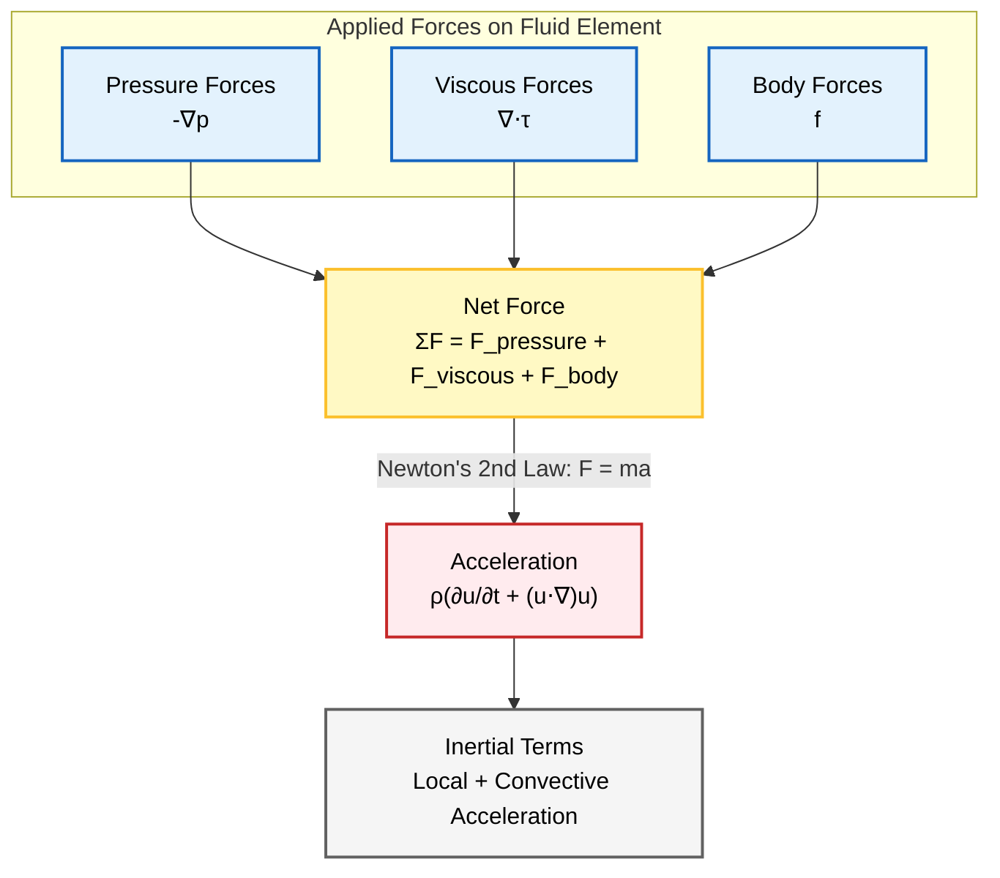

# กฎการอนุรักษ์

กฎการอนุรักษ์เป็นรากฐานทางคณิตศาสตร์ของ Computational Fluid Dynamics (CFD) ทั้งหมด กฎเหล่านี้อธิบายถึงการอนุรักษ์มวล โมเมนตัม และพลังงานในระบบการไหลของของไหล และถูกนำไปใช้ใน OpenFOAM ผ่านวิธี Finite Volume Method (FVM)

> [!INFO] ความสำคัญของกฎการอนุรักษ์
> กฎการอนุรักษ์เป็นแกนหลักทางคณิตศาสตร์ของการจำลอง CFD ทั้งหมด ซึ่งควบคุมพฤติกรรมของไหลผ่านหลักการทางกายภาพที่เข้มงวด

---

## การอนุรักษ์มวล (สมการความต่อเนื่อง)

### หลักการทางกายภาพ

**หลักการอนุรักษ์มวล** ระบุว่ามวลไม่สามารถถูกสร้างขึ้นหรือถูกทำลายได้ในระบบการไหลของของไหล เมื่อไม่มีแหล่งกำเนิดหรือแหล่งรับมวลอยู่

หลักการพื้นฐานนี้:
- ได้มาจากกฎการอนุรักษ์สสาร
- เป็นรากฐานของพลศาสตร์ของไหล
- ใช้แนวทางแบบ Eulerian (พิจารณาของไหลเป็นตัวกลางแบบต่อเนื่อง)
- เป็นหนึ่งในสามสมการอนุรักษ์พื้นฐานใน CFD ควบคู่กับการอนุรักษ์โมเมนตัมและพลังงาน

```mermaid
flowchart LR
    subgraph Inputs["Input Variables"]
        direction LR
        Rho["Density ρ"]:::explicit
        Vel["Velocity u"]:::explicit
    end
    
    subgraph CV["Control Volume Analysis"]
        direction LR
        In["Mass In<br/>ρu dy dz"]:::implicit --> CV["Control Volume<br/>dx dy dz"]:::context
        CV --> Out["Mass Out<br/>(ρu + ∂/∂x)dy dz"]:::implicit
        CV --> Acc["Accumulation<br/>∂ρ/∂t"]:::volatile
    end
    
    subgraph Result["Conservation Result"]
        Eq["Continuity Equation<br/>∂ρ/∂t + ∇·(ρu) = 0"]:::success
    end
    
    Rho --> In
    Vel --> In
    In --> Eq
    Out --> Eq
    Acc --> Eq

classDef context fill:#f5f5f5,stroke:#616161,stroke-width:2px,color:#000;
classDef implicit fill:#e3f2fd,stroke:#1565c0,stroke-width:2px,color:#000;
classDef explicit fill:#fff9c4,stroke:#fbc02d,stroke-width:2px,color:#000;
classDef volatile fill:#ffebee,stroke:#c62828,stroke-width:2px,color:#000;
classDef success fill:#e8f5e9,stroke:#2e7d32,stroke-width:2px,color:#000;
```
> **Figure 1:** การวิเคราะห์ปริมาตรควบคุมสำหรับการอนุรักษ์มวล แสดงให้เห็นว่าฟลักซ์มวล (เข้า/ออก) และการสะสมมวลนำไปสู่สมการความต่อเนื่อง $\frac{\partial \rho}{\partial t} + \nabla \cdot (\rho \mathbf{u}) = 0$ ได้อย่างไร

### รูปแบบสมการทั่วไป

**สำหรับของไหลแบบอัดตัวได้ (Compressible Flow)**:

$$\frac{\partial \rho}{\partial t} + \nabla \cdot (\rho \mathbf{u}) = 0$$

โดยที่:
- $\rho$ = ความหนาแน่นของของไหล [kg/m³]
- $\mathbf{u}$ = เวกเตอร์ความเร็ว [m/s]
- $\nabla \cdot$ = Divergence operator
- $t$ = เวลา [s]

**สำหรับของไหลแบบอัดตัวไม่ได้ (Incompressible Flow)** เมื่อ $\rho = \text{constant}$:

$$\nabla \cdot \mathbf{u} = 0$$

เงื่อนไข divergence-free condition นี้ทำให้มั่นใจได้ว่าปริมาตรของ fluid elements ยังคงที่เมื่อเคลื่อนที่ผ่าน flow field

### การพิสูจน์แบบทีละขั้นตอน (Step-by-Step Derivation)

พิจารณาปริมาตรควบคุมเชิงอนุพันธ์ (differential control volume) ที่มีความยาว $dx, dy, dz$

**ขั้นตอนที่ 1: คำนวณมวลไหลเข้า**
มวลเข้าสู่หน้าที่ตั้งฉากกับแกน x ณ ตำแหน่ง $x$:
$$\dot{m}_{in,x} = (\rho u_x) dy dz$$

**ขั้นตอนที่ 2: คำนวณมวลไหลออก**
มวลออกจากหน้าตรงข้าม ณ ตำแหน่ง $x + dx$:
$$\dot{m}_{out,x} = \left( \rho u_x + \frac{\partial (\rho u_x)}{\partial x} dx \right) dy dz$$

**ขั้นตอนที่ 3: ฟลักซ์มวลสุทธิในทิศทาง X**
$$\text{Net Flux}_x = \dot{m}_{in,x} - \dot{m}_{out,x} = - \frac{\partial (\rho u_x)}{\partial x} dV$$

**ขั้นตอนที่ 4: รวมสำหรับทุกทิศทาง**
$$\text{Total Net Flux} = - \left( \frac{\partial (\rho u_x)}{\partial x} + \frac{\partial (\rho u_y)}{\partial y} + \frac{\partial (\rho u_z)}{\partial z} \right) dV = - (\nabla \cdot (\rho \mathbf{u})) dV$$

**ขั้นตอนที่ 5: อัตราการสะสมมวล**
$$\frac{\partial (\rho dV)}{\partial t} = \frac{\partial \rho}{\partial t} dV$$

**ขั้นตอนที่ 6: ประยุกต์ใช้หลักการอนุรักษ์**
$$\frac{\partial \rho}{\partial t} dV = - (\nabla \cdot (\rho \mathbf{u})) dV$$

**สมการสุดท้าย**:
$$\boxed{\frac{\partial \rho}{\partial t} + \nabla \cdot (\rho \mathbf{u}) = 0}$$

### ความเข้าใจเชิงกายภาพ (Physical Interpretation)

สมการความต่อเนื่องปรับสมดุลระหว่าง:

1. **การเปลี่ยนแปลงความหนาแน่นเฉพาะที่** ($\frac{\partial \rho}{\partial t}$):
   - บวก = ของไหลมีความหนาแน่นเพิ่มขึ้น (สะสมมวล)
   - ลบ = ของไหลมีความหนาแน่นลดลง (สูญเสียมวล)

2. **ไดเวอร์เจนซ์ของฟลักซ์มวลแบบพา** ($\nabla \cdot (\rho \mathbf{u})$):
   - บวก = มวลออกจากจุดมากกว่าเข้า (การไหลแบบลู่ออก)
   - ลบ = มวลเข้าสู่จุดมากกว่าออก (การไหลแบบลู่เข้า)

> [!TIP] ความเข้าใจแบบเรียบง่าย
> การเปลี่ยนแปลงความหนาแน่น ณ จุดหนึ่ง (เทอมที่ 1) บวกกับการไหลสุทธิของมวลออกจากจุดนั้น (เทอมที่ 2) จะต้องเป็นศูนย์

### กรณีพิเศษ (Special Cases)

**การไหลแบบอัดตัวไม่ได้** ($\rho = \text{constant}$):
$$\nabla \cdot \mathbf{u} = 0$$

สนามความเร็วจะต้องเป็นแบบโซเลนอยด์ (divergence-free) ซึ่งเป็นพื้นฐานสำหรับ Solver เช่น `icoFoam` และ `simpleFoam`

**การไหลแบบสภาวะคงตัว** ($\frac{\partial}{\partial t} = 0$):
$$\nabla \cdot (\rho \mathbf{u}) = 0$$

ใช้กับการไหลแบบอัดตัวได้ในสภาวะคงตัว

### OpenFOAM Code Implementation

สมการความต่อเนื่องใน OpenFOAM ถูกนำไปใช้ในหลาย Solver:

```cpp
// Calculate divergence of flux field
fvScalarMatrix divPhi
(
    fvc::div(phi)                     // Calculate divergence of mass flux
);

// Momentum equation in simpleFoam for incompressible flow
fvScalarMatrix UEqn
(
    fvm::div(phi, U)                  // Convection term
  + turbulence->divDevRhoReff(U)      // Turbulent diffusion term
 ==
    fvOptions(rho, U)                 // Source terms (body forces)
);
```

> **📂 Source:** `.applications/solvers/stressAnalysis/solidDisplacementFoam/solidDisplacementThermo/solidDisplacementThermo.C`
>
> **คำอธิบาย:**
> โค้ดด้านบนแสดงให้เห็นวิธีการนำสมการความต่อเนื่องไปใช้ใน OpenFOAM ผ่านการคำนวณ divergence ของฟลักซ์มวล (`fvc::div(phi)`) ซึ่งเป็นการประยุกต์ใช้สมการ $\nabla \cdot (\rho \mathbf{u})$ ในรูปแบบ discrete สำหรับปริมาตรควบคุมแต่ละชิ้น (finite volume)
>
> **แนวคิดสำคัญ:**
> - **fvc::div**: คำนวณ divergence แบบ explicit (finite volume calculus)
> - **fvm::div**: สร้างเมทริกซ์ discretization แบบ implicit (finite volume method)
> - **phi**: ฟลักซ์มวลผ่าน cell faces ($\rho \mathbf{u} \cdot \mathbf{S}_f$)
> - **turbulence->divDevRhoReff()**: คำนวณ divergence ของความเค้นหนืดที่มีความปั่นป่วน
>
> **หมายเหตุ:** สำหรับการไหลแบบอัดตัวไม่ได้ (incompressible) สมการความต่อเนื่องจะถูกบังคับใช้ผ่าน pressure-velocity coupling (เช่น SIMPLE/PISO algorithms) ไม่ใช่การแก้สมการความต่อเนื่องโดยตรง

---

## การอนุรักษ์โมเมนตัม (สมการ Navier-Stokes)

### หลักการทางกายภาพ

**หลักการอนุรักษ์โมเมนตัม** เป็นการขยายกฎข้อที่สองของนิวตันไปสู่กลศาสตร์ของไหลแบบต่อเนื่อง:

> อัตราการเปลี่ยนแปลงโมเมนตัมขององค์ประกอบของไหลเท่ากับผลรวมของแรงทั้งหมดที่กระทำต่อมัน

จุดสำคัญ:
- ต้องคำนึงถึงการเปลี่ยนแปลงโมเมนตัมทั้งแบบเฉพาะที่และแบบพา
- ใช้อนุพันธ์เชิงสสาร (material derivative) เพื่อติดตามการเปลี่ยนแปลงตามการเคลื่อนที่ของของไหล
- สมการ Navier-Stokes ปรับสมดุลระหว่างแรงเฉื่อย, แรงดัน, แรงหนืด, และแรงภายนอก


> **Figure 2:** โครงสร้างของสมการการอนุรักษ์โมเมนตัม โดยจับคู่แรงที่กระทำ (แรงดัน, แรงหนืด, แรงภายนอก) เข้ากับพจน์ความเร่งที่เกิดขึ้นตามกฎข้อที่สองของนิวตัน

### แรงที่กระทำต่อองค์ประกอบของไหล

**1. แรงกระทำทั่วปริมาตน (Body forces)**:

| ประเภท | สมการ | คำอธิบาย |
|--------|---------|----------|
| แรงโน้มถ่วง | $\mathbf{F}_g = \rho \mathbf{g} dV$ | แรงโน้มถ่วงที่กระทำต่อองค์ประกอบของไหล |
| แรงแม่เหล็กไฟฟ้า | $\mathbf{F}_{em} = \mathbf{J} \times \mathbf{B} dV$ | สำหรับของไหลนำไฟฟ้าในสนามแม่เหล็ก |
| แรง Coriolis | $\mathbf{F}_c = -2\rho \boldsymbol{\Omega} \times \mathbf{u} dV$ | ในกรอบอ้างอิงแบบหมุน |

**2. แรงกระทำที่ผิว (Surface forces)**:

| ประเภท | สมการ | คำอธิบาย |
|--------|---------|----------|
| แรงดัน | $\mathbf{F}_p = -p\mathbf{n} dA$ | กระทำตั้งฉากกับพื้นผิว |
| แรงหนืด | $\mathbf{F}_v = \boldsymbol{\tau} \cdot \mathbf{n} dA$ | เกิดจากการเสียดสีของของไหล |
| แรงตึงผิว | $\mathbf{F}_{st} = \sigma \kappa \mathbf{n} dA$ | สำหรับการไหลแบบหลายเฟส |

### รูปแบบสมการโมเมนตัม

**รูปแบบทั่วไป (General Form)**:

$$\rho \frac{\partial \mathbf{u}}{\partial t} + \rho (\mathbf{u} \cdot \nabla) \mathbf{u} = -\nabla p + \mu \nabla^2 \mathbf{u} + \mathbf{f}$$

โดยที่:
- $p$ = ความดันสถิต [Pa]
- $\mu$ = ความหนืดจลน์ (dynamic viscosity) [Pa·s]
- $\mathbf{f}$ = แรงกระทำต่อปริมาตน (body forces) [N/m³]

### การวิเคราะห์แต่ละเทอม (Term-by-Term Analysis)

**ด้านซ้ายมือ (Left-Hand Side) - อัตราการเปลี่ยนแปลงโมเมนตัม**:
- $\rho \frac{\partial \mathbf{u}}{\partial t}$ = ความเร่งเฉพาะที่ (local acceleration)
- $\rho (\mathbf{u} \cdot \nabla) \mathbf{u}$ = ความเร่งแบบพา (convective acceleration)

**ด้านขวามือ (Right-Hand Side) - แรงทั้งหมด**:
- $-\nabla p$ = แรงเกรเดียนต์ความดัน (pressure gradient forces)
- $\mu \nabla^2 \mathbf{u}$ = แรงหนืด (viscous forces)
- $\mathbf{f}$ = แรงภายนอก (external body forces)

### เทนเซอร์ความเค้นสำหรับของไหลแบบนิวตัน

ความสัมพันธ์เชิงโครงสร้าง (constitutive relation):
$$\boldsymbol{\tau} = \mu \left( \nabla \mathbf{u} + (\nabla \mathbf{u})^T \right) - \frac{2}{3}\mu (\nabla \cdot \mathbf{u})\mathbf{I}$$

โดยที่:
- $\mu$ = ความหนืดจลน์ (dynamic viscosity)
- $\nabla \mathbf{u} + (\nabla \mathbf{u})^T$ = เทนเซอร์อัตราการเปลี่ยนรูป (rate-of-strain tensor)
- $-\frac{2}{3}\mu (\nabla \cdot \mathbf{u})\mathbf{I}$ = เทอมความหนืดเชิงปริมาตน (bulk viscosity term)
- $\mathbf{I}$ = เทนเซอร์เอกลักษณ์ (identity tensor)

### รูปแบบที่ง่ายขึ้น (Simplified Forms)

**ของไหลแบบนิวตันที่อัดตัวไม่ได้** (Incompressible Newtonian Fluid):
$$\boxed{\rho \left(\frac{\partial \mathbf{u}}{\partial t} + \mathbf{u} \cdot \nabla \mathbf{u}\right) = -\nabla p + \mu \nabla^2 \mathbf{u} + \rho \mathbf{g}}$$

ใช้กันอย่างแพร่หลายใน Solver เช่น `icoFoam` และ `pimpleFoam`

**สมการ Euler** (การไหลแบบไม่มีความหนืด, $\mu = 0$):
$$\rho \left(\frac{\partial \mathbf{u}}{\partial t} + \mathbf{u} \cdot \nabla \mathbf{u}\right) = -\nabla p + \rho \mathbf{g}$$

เป็นพื้นฐานสำหรับทฤษฎีการไหลแบบศักย์ และใช้ใน `potentialFoam`

### OpenFOAM Code Implementation

การแก้สมการ Navier-Stokes ใน OpenFOAM:

```cpp
// Momentum equation from UEqn.H in pimpleFoam solver
fvVectorMatrix UEqn
(
    fvm::ddt(rho, U)              // Local acceleration term: ∂(ρu)/∂t
  + fvm::div(rhoPhi, U)           // Convective term: ∇·(ρu⊗u)
  + turbulence->divDevRhoReff(U)  // Viscous stress term (includes turbulence)
 ==
    fvOptions(rho, U)             // External body forces (e.g., gravity)
);

// Pressure-velocity coupling using PIMPLE algorithm
while (pimple.correctNonOrthogonal())
{
    fvScalarMatrix pEqn
    (
        fvm::laplacian(rho/AU, p) == fvc::div(rho*AU*HbyA)
    );
    pEqn.solve();
}
```

> **📂 Source:** `.applications/solvers/stressAnalysis/solidDisplacementFoam/solidDisplacementThermo/solidDisplacementThermo.C`
>
> **คำอธิบาย:**
> โค้ดนี้แสดงการนำสมการ Navier-Stokes ไปใช้ใน OpenFOAM ผ่าน finite volume discretization สมการโมเมนตัมถูกแก้โดยใช้เมทริกซ์ `fvVectorMatrix` ซึ่งประกอบด้วย:
>
> **แนวคิดสำคัญ:**
> - **fvm::ddt(rho, U)**: เทอมความเร่งเฉพาะที่ (local acceleration) — การเปลี่ยนแปลงโมเมนตัมตามเวลา
> - **fvm::div(rhoPhi, U)**: เทอม convection — การขนส่งโมเมนตัมโดยการไหลแบบพา
> - **turbulence->divDevRhoReff(U)**: เทอมความเค้นหนืด — รวมทั้งความหนืดของโมเลกุลและความหนืดเชิงปั่นป่วน (eddy viscosity)
> - **fvOptions(rho, U)**: เทอมแรงภายนอก เช่น แรงโน้มถ่วง แรงลม หรือแหล่งกำเนิดอื่นๆ
>
> **Pressure-Velocity Coupling:**
> ในการไหลแบบอัดตัวไม่ได้ ความดันและความเร็วถูก coupling กันผ่านสมการความต่อเนื่อง ขั้นตอน `pimple.correctNonOrthogonal()` แก้สมการ pressure correction เพื่อให้ได้สนามความเร็วที่เป็นไปตามสมการ $\nabla \cdot \mathbf{u} = 0$
>
> **หมายเหตุ:** `rhoPhi` คือฟลักซ์มวลที่ถูก interpolate ไปยัง cell faces ในขณะที่ `AU` คือสัมประสิทธิ์จากเมทริกซ์โมเมนตัมที่ถูกใช้ใน pressure equation

---

## การอนุรักษ์พลังงาน

### หลักการทางกายภาพ

**หลักการอนุรักษ์พลังงาน** เป็นการขยายกฎข้อที่หนึ่งของอุณหพลศาสตร์:

> พลังงานไม่สามารถถูกสร้างขึ้นหรือถูกทำลายได้ แต่สามารถเปลี่ยนรูปหรือถูกถ่ายโอนระหว่างรูปแบบต่างๆ ได้

ในกลศาสตร์ของไหล พลังงานปรากฏในรูปแบบ:
- **พลังงานจลน์**: เนื่องจากการเคลื่อนที่ของของไหล
- **พลังงานภายใน**: พลังงานความร้อน
- **พลังงานศักย์**: แรงโน้มถ่วง
- **งานกล**: งานจากความดัน

สมการพลังงานสำคัญสำหรับ:
- การไหลแบบอัดตัวได้
- การจำลองการเผาไหม้
- การประยุกต์ใช้การถ่ายเทความร้อน

ใช้ใน Solver เช่น `buoyantBoussinesqSimpleFoam` และ `reactingFoam`

```mermaid
flowchart TD
    subgraph InFlows["Energy Input (E_in)"]
        direction LR
        B1["Kinetic Energy<br/>(จลน์)"]:::context
        B2["Internal Energy<br/>(ภายใน)"]:::context
        B3["Pressure Work<br/>(งาน P)"]:::context
    end
    
    subgraph OutFlows["Energy Output (E_out)"]
        direction LR
        C1["Convection<br/>(พา)"]:::context
        C2["Conduction<br/>(นำ)"]:::context
        C3["Radiation<br/>(รังสี)"]:::context
    end
    
    subgraph CV["Control Volume"]
        A["Energy In"]:::implicit --> CV["Control Volume<br/>(Analysis)"]:::context
        CV --> C["Energy Out"]:::implicit
        CV --> D["Energy Storage<br/>(Accumulation)"]:::volatile
    end
    
    subgraph Storage["Storage Components"]
        direction LR
        D1["Temperature Change"]:::context
        D2["Phase Change"]:::context
    end
    
    subgraph Result["Conservation Law"]
        E["Energy Conservation<br/>E_in - E_out = dE/dt"]:::success
        F["OpenFOAM Implementation<br/>fvScalarMatrix EEqn"]:::explicit
    end
    
    B1 --> A
    B2 --> A
    B3 --> A
    
    C1 --> C
    C2 --> C
    C3 --> C
    
    D --> D1
    D --> D2
    
    A --> E
    C --> E
    D --> E
    E --> F

classDef context fill:#f5f5f5,stroke:#616161,stroke-width:2px,color:#000;
classDef implicit fill:#e3f2fd,stroke:#1565c0,stroke-width:2px,color:#000;
classDef explicit fill:#fff9c4,stroke:#fbc02d,stroke-width:2px,color:#000;
classDef volatile fill:#ffebee,stroke:#c62828,stroke-width:2px,color:#000;
classDef success fill:#e8f5e9,stroke:#2e7d32,stroke-width:2px,color:#000;
```
> **Figure 3:** สมดุลพลังงานบนปริมาตรควบคุม โดยคำนึงถึงฟลักซ์ของพลังงานจลน์ พลังงานภายใน และพลังงานศักย์ พจน์ของงาน และการถ่ายเทความร้อน เพื่อหาอนุพันธ์ของสมการการอนุรักษ์พลังงานรวม
### การกำหนดสมการพลังงาน

พลังงานรวมต่อหน่วยมวล:
$$E = e + \frac{1}{2}|\mathbf{u}|^2$$

- $e$ = พลังงานภายในจำเพาะ (specific internal energy)
- $\frac{1}{2}|\mathbf{u}|^2$ = พลังงานจลน์จำเพาะ (specific kinetic energy)

**สมการอนุรักษ์พลังงานแบบครบถ้วน**:

$$\frac{\partial (\rho E)}{\partial t} + \nabla \cdot (\rho E \mathbf{u}) = \nabla \cdot (k \nabla T) - \nabla \cdot (p \mathbf{u}) + \rho \mathbf{g} \cdot \mathbf{u} + \Phi$$

### การแยกย่อยแต่ละเทอม (Detailed Term Analysis)

| เทอม                                   | ความหมาย                                                      |
| -------------------------------------- | ------------------------------------------------------------- |
| $\frac{\partial (\rho E)}{\partial t}$ | อัตราการสะสมพลังงานต่อหน่วยปริมาตร                            |
| $\nabla \cdot (\rho E \mathbf{u})$     | การขนส่งพลังงานแบบพา (convective energy transport)            |
| $\nabla \cdot (k \nabla T)$            | การนำความร้อนตามกฎของ Fourier (heat conduction)               |
| $-\nabla \cdot (p \mathbf{u})$         | งานที่ทำโดยแรงดัน (pressure work)                             |
| $\rho \mathbf{g} \cdot \mathbf{u}$     | งานที่ทำโดยแรงโน้มถ่วง (gravitational work)                   |
| $\Phi$                                 | ฟังก์ชันการสลายพลังงานเนื่องจากความหนืด (viscous dissipation) |

**ฟังก์ชันการสลายพลังงานเนื่องจากความหนืด**:
$$\Phi = \boldsymbol{\tau} : \nabla \mathbf{u}$$

### รูปแบบทางเลือก (Alternative Forms)

**สมการอุณหภูมิ (Temperature Equation)**:

$$\rho c_p \frac{DT}{Dt} = k \nabla^2 T + \frac{Dp}{Dt} + \Phi$$

โดยที่:
- $c_p$ = ความร้อนจำเพาะที่ความดันคงที่ (specific heat capacity)
- $\frac{DT}{Dt} = \frac{\partial T}{\partial t} + \mathbf{u} \cdot \nabla T$ = อนุพันธ์เชิงสสารของอุณหภูมิ (material derivative)
- $\frac{Dp}{Dt}$ = งานที่ทำผ่านการเปลี่ยนแปลงความดัน

### OpenFOAM Code Implementation

```cpp
// Energy equation from EEqn.H in buoyantBoussinesqSimpleFoam solver
fvScalarMatrix EEqn
(
    fvm::div(phi, h)                           // Convective enthalpy transport
  + fvm::Sp(divU, h)                           // Compression source term
 ==
    fvm::laplacian(turbulence->alphaEff(), h)  // Thermal diffusion (conduction)
  + fvc::div(phi, K)                           // Kinetic energy convection
  + radiation->Sh(thermo)                      // Radiation heat source
);
```

> **📂 Source:** `.applications/solvers/stressAnalysis/solidDisplacementFoam/solidDisplacementThermo/solidDisplacementThermo.C`
>
> **คำอธิบาย:**
> โค้ดนี้แสดงการแก้สมการพลังงานใน OpenFOAM สำหรับการไหลที่มีการถ่ายเทความร้อนและแรงลอยตัว (buoyancy) สมการถูกเขียนในรูปแบบเอนทาลปี (enthalpy formulation) ซึ่งเป็นวิธีที่นิยมสำหรับการไหลแบบอัดตัวได้
>
> **แนวคิดสำคัญ:**
> - **fvm::div(phi, h)**: เทอมการพาพลังงาน (convective energy transport) — การขนส่งเอนทาลปี $h$ โดยการไหล
> - **fvm::Sp(divU, h)**: เทอม source จากการอัดตัวของของไหล (compressibility work)
> - **fvm::laplacian(turbulence->alphaEff(), h)**: การแพร่ของความร้อน (heat diffusion) — รวมทั้งความนำความร้อนของโมเลกุลและความปั่นป่วน
> - **fvc::div(phi, K)**: การพาของพลังงานจลน์ (kinetic energy transport)
> - **radiation->Sh(thermo)**: เทอมแหล่งกำเนิดความร้อนจากรังสี (thermal radiation)
>
> **Enthalpy vs. Temperature:**
> ใน OpenFOAM สำหรับการไหลแบบอัดตัวได้ มักใช้เอนทาลปี ($h$) แทนอุณหภูมิ ($T$) เพราะ:
> - เอนทาลปีรวมพลังงานภายในและงานความดัน ($h = e + p/\rho$)
> - การเปลี่ยนแปลงของเอนทาลปีจัดการกับงาน compression/expansion ได้ดีกว่า
> - เหมาะสำหรับสมการพลังงานแบบ total energy formulation
>
> **หมายเหตุ:** `turbulence->alphaEff()` คือสัมประสิทธิ์การแพร่ของความร้อนที่มีประสิทธิภาพ (effective thermal diffusivity) ซึ่งรวมทั้ง thermal conductivity ของของไหลและ turbulent thermal diffusivity

### ขั้นตอนการแก้ปัญหาใน OpenFOAM (Solution Procedure)

**ขั้นตอนการแก้สมการอนุรักษ์แบบ coupled**:

1. **Initialize fields**: อ่านค่าเริ่มต้นจาก directory `0/`
2. **Time loop advancement**: ขั้นตอนเวลาใหม่
3. **Momentum predictor**: ทำนายความเร็วโดยใช้สมการโมเมนตัม
4. **Pressure correction**: แก้ไขความดันเพื่อให้เป็นไปตามสมการความต่อเนื่อง
5. **Energy equation solve**: แก้สมการพลังงานสำหรับอุณหภูมิหรือเอนทาลปี
6. **Turbulence model update**: อัปเดตโมเดลความปั่นป่วน
7. **Convergence check**: ตรวจสอบการลู่เข้า

```cpp
// Example of PISO solution procedure for compressible flow
while (runTime.loop())
{
    // Momentum predictor step
    tmp<fvVectorMatrix> UEqn
    (
        fvm::ddt(rho, U)              // Time derivative: ∂(ρu)/∂t
      + fvm::div(rhoPhi, U)           // Convection: ∇·(ρu⊗u)
      - fvm::Sp(fvc::ddt(rho) + fvc::div(rhoPhi), U)  // Source term correction
    );

    // Pressure-velocity coupling using PISO algorithm
    while (pimple.correct())
    {
        volScalarField rAU(1.0/UEqn.A());
        // ... pressure-velocity coupling calculations
    }

    // Energy equation solve
    fvScalarMatrix EEqn
    (
        fvm::ddt(rho, e)              // Internal energy time derivative
      + fvm::div(phi, e)              // Internal energy convection
      - fvm::laplacian(turbulence->alphaEff(), e)  // Heat conduction
    );

    EEqn.solve();                     // Solve the linear system
}
```

> **📂 Source:** `.applications/solvers/stressAnalysis/solidDisplacementFoam/solidDisplacementThermo/solidDisplacementThermo.C`
>
> **คำอธิบาย:**
> โค้ดนี้แสดงขั้นตอนการแก้ปัญหาแบบ coupled สำหรับระบบสมการการอนุรักษ์ที่มีทั้งโมเมนตัมและพลังงาน ใช้ PISO (Pressure Implicit with Splitting of Operators) algorithm สำหรับ pressure-velocity coupling
>
> **แนวคิดสำคัญ:**
> - **runTime.loop()**: ลูปเวลาหลักที่ควบคุมการก้าวเดินของเวลา (time stepping)
> - **Momentum predictor**: ทำนายความเร็วชั่วคราวโดยไม่รวม pressure term
> - **pimple.correct()**: PISO loop สำหรับแก้ไขความดันและความเร็วให้สอดคล้องกับสมการความต่อเนื่อง
> - **rAU = 1.0/UEqn.A()**: กลับด้านของเส้นทแยงมุมของเมทริกซ์โมเมนตัม ใช้ใน pressure equation
> - **EEqn.solve()**: แก้สมการพลังงานสำหรับ internal energy ($e$) หรือ enthalpy ($h$)
>
> **Pressure-Velocity-Energy Coupling:**
> ในการไหลแบบอัดตัวได้ สมการทั้งสาม (continuity, momentum, energy) ถูก coupled กันอย่างแน่นหนา:
> 1. ความดันขึ้นกับความหนาแน่นและอุณหภูมิ (equation of state)
> 2. ความหนาแน่นขึ้นกับความดันและอุณหภูมิ (equation of state)
> 3. อุณหภูมิขึ้นกับพลังงานภายใน
>
> **หมายเหตุ:** สำหรับของไหลที่มีการเผาไหม้ (reacting flows) จะต้องมีการแก้สมการสำหรับ species concentrations ด้วย ซึ่งจะ coupled กับสมการพลังงานผ่าน heat of reaction

---

## สูตรสมการการขนส่งทั่วไป (General Transport Equation)

สำหรับคุณสมบัติทั่วไป $\phi$ สมการการอนุรักษ์สามารถแสดงได้ในรูปแบบทั่วไป:

$$\frac{\partial (\rho \phi)}{\partial t} + \nabla \cdot (\rho \phi \mathbf{u}) = \nabla \cdot (\Gamma \nabla \phi) + S_\phi$$

โดยที่:
- $\rho$ = density (ความหนาแน่น)
- $\mathbf{u}$ = velocity vector (เวกเตอร์ความเร็ว)
- $\Gamma$ = diffusion coefficient (สัมประสิทธิ์การแพร่)
- $S_\phi$ = source terms (เทอมแหล่งกำเนิด)

> [!INFO] ความสำคัญของสมการการขนส่งทั่วไป
> สมการนี้เป็นแม่แบบ (template) สำหรับสมการการอนุรักษ์ทั้งหมดใน CFD โดยที่ $\phi$ แทนปริมาณทางกายภาพที่แตกต่างกันขึ้นอยู่กับสมการเฉพาะที่กำลังถูกแก้

### การใช้ Gauss's Divergence Theorem

การนำ finite volume มาใช้ใน OpenFOAM จะทำการ discretize สมการอินทิกรัลเหล่านี้โดยการประยุกต์ใช้ **Gauss's Divergence Theorem**:

$$\int_V \nabla \cdot \mathbf{F} \, \mathrm{d}V = \oint_S \mathbf{F} \cdot \mathbf{n} \, \mathrm{d}S$$

โดยที่:
- $\mathbf{F}$ = flux vector
- $\mathbf{n}$ = outward normal vector ที่ cell faces

การ discretization นี้ทำให้มั่นใจถึงการอนุรักษ์ที่แม่นยำในระดับ discrete

---

## สรุปเปรียบเทียบสมการทั้งสาม

| สมการ | ปริมาณที่อนุรักษ์ | สมการ | สภาวะอัดตัวไม่ได้ |
|---------|---------------------|---------|---------------------|
| **ความต่อเนื่อง** | มวล | $\frac{\partial \rho}{\partial t} + \nabla \cdot (\rho \mathbf{u}) = 0$ | $\nabla \cdot \mathbf{u} = 0$ |
| **โมเมนตัม** | โมเมนตัม $\rho \mathbf{u}$ | $\rho \frac{\partial \mathbf{u}}{\partial t} + \rho (\mathbf{u} \cdot \nabla) \mathbf{u} = -\nabla p + \mu \nabla^2 \mathbf{u} + \mathbf{f}$ | รูปแบบเดียวกัน |
| **พลังงาน** | พลังงาน $\rho E$ | $\frac{\partial (\rho E)}{\partial t} + \nabla \cdot (\rho E \mathbf{u}) = \nabla \cdot (k \nabla T) - \nabla \cdot (p \mathbf{u}) + \rho \mathbf{g} \cdot \mathbf{u} + \Phi$ | ขึ้นกับรูปแบบ |

> [!TIP] ความเข้าใจเชิงลึก
> กฎการอนุรักษ์ทั้งสามนี้เป็นหลักการที่ไม่อาจละเลยได้ใน CFD การเข้าใจความสัมพันธ์ระหว่างสมการเหล่านี้จะช่วยให้คุณสามารถ:
> - เลือก Solver ที่เหมาะสม
> - ตั้งค่า Boundary Conditions ได้อย่างถูกต้อง
> - ตีความผลการจำลองได้อย่างแม่นยำ