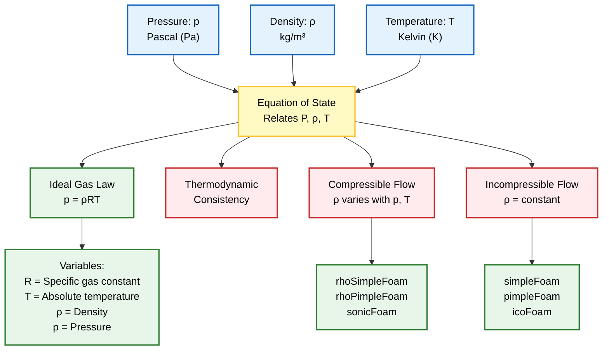
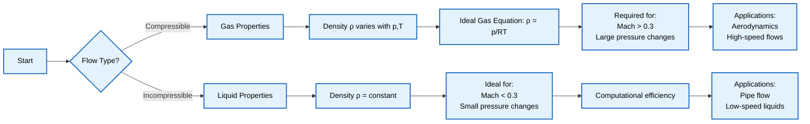

# สมการสถานะ (Equation of State - EOS)

**สมการสถานะ** เป็นความสัมพันธ์พื้นฐานในพลศาสตร์ของไหลที่เชื่อมโยงสมบัติทางอุณหพลศาสตร์ เช่น ความดัน ความหนาแน่น และอุณหภูมิ ซึ่งเป็นการปิดระบบสมการควบคุม (governing equations) ให้สมบูรณ์

ใน **OpenFOAM**, EOS มีความสำคัญอย่างยิ่งต่อการกำหนดพฤติกรรมทางกายภาพของของไหลในการจำลอง:

- **การไหลแบบอัดตัวได้** (Compressible Flow)
- **การไหลแบบอัดตัวไม่ได้** (Incompressible Flow)

---

## ภาพรวมความสำคัญของสมการสถานะ

สมการสถานะทำหน้าที่เชื่อมโยงตัวแปรทางอุณหพลศาสตร์สามตัวที่สำคัญที่สุดในพลศาสตร์ของไหล:


> **Figure 1:** บทบาทของสมการสถานะ (EOS) ใน CFD โดยเชื่อมโยงตัวแปรทางอุณหพลศาสตร์ ($p, \rho, T$) และจำแนกระบอบการไหล (แบบอัดตัวได้และอัดตัวไม่ได้) เพื่อใช้ในการเลือก Solver ของ OpenFOAM ที่เหมาะสม


---

## กฎแก๊สอุดมคติ (Ideal Gas Law)

### รูปแบบสมการ

สำหรับการไหลแบบอัดตัวได้ กฎแก๊สอุดมคติให้ความสัมพันธ์ระหว่างความดัน ($p$) ความหนาแน่น ($\rho$) และอุณหภูมิ ($T$) ดังนี้:

$$p = \rho R T$$

**โดยที่:**
- $p$ คือ ความดันสัมบูรณ์ [Pa]
- $\rho$ คือ ความหนาแน่นของไหล [kg/m³]
- $R$ คือ ค่าคงที่แก๊สจำเพาะ [J/(kg·K)]
- $T$ คือ อุณหภูมิสัมบูรณ์ [K]

### ข้อสมมติพื้นฐาน

กฎแก๊สอุดมคติอาศัยข้อสมมติต่อไปนี้:

> [!INFO] ข้อสมมติของแก๊สอุดมคติ
> - ของไหลมีพฤติกรรมเป็นแก๊สอุดมคติ
> - ใช้ได้กับแก๊สส่วนใหญ่ที่อุณหภูมิและความดันปกติ
> - ปฏิสัมพันธ์ระดับโมเลกุลมีค่าน้อยมาก
> - ปริมาตรของโมเลกุลแก๊สเมื่อเทียบกับปริมาตรรวมเพิกเฉยได้

### ความสัมพันธ์กับค่าคงที่แก๊สสากล

ค่าคงที่แก๊สจำเพาะ ($R$) เกี่ยวข้องกับค่าคงที่แก๊สสากล ($R_{universal}$) ดังนี้:

$$R = \frac{R_{universal}}{M}$$

โดยที่:
- $R_{universal} = 8314$ J/(kmol·K)
- $M$ คือ มวลโมเลกุล [kg/kmol]

ตัวอย่าง:
- อากาศ ($M \approx 29$ kg/kmol): $R \approx 287$ J/(kg·K)
- ฮีเลียม ($M \approx 4$ kg/kmol): $R \approx 2077$ J/(kg·K)

### OpenFOAM Code Implementation

```cpp
// Thermodynamic model for ideal gas
thermoType
{
    type            hePsiThermo;      // Enthalpy-based thermodynamics with compressibility
    mixture         pureMixture;      // Single species fluid
    transport       const;            // Constant transport properties
    thermo          hConst;           // Constant specific heat capacity
    equationOfState perfectGas;       // Implementation: p = ρRT
    specie          specie;           // Species properties
    energy          sensibleEnthalpy; // Sensible enthalpy as energy variable
}

// Definition of specific gas constant
specie
{
    molWeight       28.9;             // Molecular weight [g/mol] for air
}
```

> **📚 Source:** `src/thermophysicalModels/specie/equationOfState/perfectGas/perfectGas.H`
>
> **คำอธิบาย:**
> โค้ดด้านบนแสดงการตั้งค่าโมเดลทางอุณหพลศาสตร์สำหรับแก๊สอุดมคติใน OpenFOAM โดยมีคอมโพเนนต์หลักดังนี้:
>
> - **`equationOfState perfectGas`**: ระบุใช้สมการสถานะแก๊สอุดมคติที่ implement ความสัมพันธ์ $p = \rho R T$
> - **`type hePsiThermo`**: ใช้การคำนวณอุณหพลศาสตร์แบบ enthalpy-based ซึ่งเหมาะสำหรับการไหลแบบอัดตัวได้
> - **`specie molWeight`**: กำหนดมวลโมเลกุลเพื่อคำนวณค่าคงที่แก๊สจำเพาะ $R$ โดยอัตโนมัติ
>
> **แนวคิดสำคัญ:**
> 1. OpenFOAM คำนวณความหนาแน่นจากสมการ $\rho = p/(RT)$ ในแต่ละ time step
> 2. ความดันและอุณหภูมิเป็นตัวแปรอิสระที่ถูกคำนวณจากสมการโมเมนตัมและพลังงาน
> 3. การเปลี่ยนแปลงความหนาแน่นส่งผลต่อสมการความต่อเนื่องและโมเมนตัม

> [!TIP] การเลือก Solver สำหรับแก๊สอุดมคติ
> สำหรับการไหลแบบอัดตัวได้ที่ใช้กฎแก๊สอุดมคติ ให้ใช้ Solver:
> - `rhoSimpleFoam` - สำหรับสภาวะคงตัว (Steady-state)
> - `rhoPimpleFoam` - สำหรับไม่คงที่ (Transient)
> - `sonicFoam` - สำหรับการไหล Transonic/Supersonic

---

## ของไหลที่อัดตัวไม่ได้ (Incompressible Fluid)

### รูปแบบสมการ

สำหรับของเหลว เช่น น้ำ ความหนาแน่นยังคงที่โดยพื้นฐาน:

$$\rho = \text{constant}$$

### เงื่อนไขที่ใช้ได้

> [!WARNING] เงื่อนไขการใช้แบบจำลอง Incompressible
> - การเปลี่ยนแปลงความดันมีค่าน้อยเมื่อเทียบกับ Bulk Modulus
> - การเปลี่ยนแปลงอุณหภูมิไม่ส่งผลกระทบต่อความหนาแน่นอย่างมีนัยสำคัญ
> - **เลข Mach โดยทั่วไปน้อยกว่า 0.3**

### ความสำคัญของเลข Mach

เลข Mach ($Ma$) เป็นตัวบ่งชี้ที่สำคัญว่าจะใช้สมการสถานะแบบใด:

$$Ma = \frac{U}{c} = \frac{\text{Flow Velocity}}{\text{Speed of Sound}}$$

| ค่า Mach Number | ระบอบการไหล | สมการสถานะที่เหมาะสม |
|-----------------|---------------|------------------------------|
| $Ma < 0.3$ | Incompressible | $\rho = \text{constant}$ |
| $0.3 < Ma < 0.8$ | Subsonic Compressible | $p = \rho R T$ |
| $Ma > 0.8$ | Transonic/Supersonic | $p = \rho R T$ + Shock Capturing |

### ประโยชน์ของการใช้แบบจำลอง Incompressible

- ✅ ช่วยลดความต้องการในการคำนวณลงอย่างมาก
- ✅ ยังคงความแม่นยำสำหรับการไหลของของเหลวที่ความเร็วต่ำ
- ✅ ไม่จำเป็นต้องแก้สมการพลังงานสำหรับการคำนวณความหนาแน่น


> **Figure 2:** กระบวนการตัดสินใจเลือกแนวทางการจำลองการไหลตามเลขมัค (Mach number) และการเปลี่ยนแปลงความหนาแน่น โดยแยกความแตกต่างระหว่างข้อสมมติแก๊สอุดมคติสำหรับการไหลแบบอัดตัวได้และความหนาแน่นคงที่สำหรับการไหลแบบอัดตัวไม่ได้


### OpenFOAM Code Implementation

```cpp
// Thermodynamic model for incompressible fluid
thermoType
{
    type            hePsiThermo;      // Enthalpy-based thermodynamics
    mixture         pureMixture;      // Single species fluid
    transport       const;            // Constant transport properties
    thermo          hConst;           // Constant specific heat capacity
    equationOfState incompressible;   // Implementation: ρ = constant
    specie          specie;           // Species properties
    energy          sensibleEnthalpy; // Sensible enthalpy as energy variable
}

// Definition of fluid density
specie
{
    molWeight       18.0;             // Molecular weight [g/mol] for water
    rho             1000;             // Density [kg/m³]
}
```

> **📚 Source:** `src/thermophysicalModels/specie/equationOfState/incompressible/incompressible.H`
>
> **คำอธิบาย:**
> โค้ดด้านบนแสดงการตั้งค่าโมเดลทางอุณหพลศาสตร์สำหรับของไหลแบบอัดตัวไม่ได้:
>
> - **`equationOfState incompressible`**: ระบุใช้สมการสถานะแบบความหนาแน่นคงที่
> - **`specie rho`**: กำหนดค่าความหนาแน่นที่คงที่ตลอดการจำลอง
> - **`type hePsiThermo`**: ยังคงใช้ enthalpy-based thermodynamics แต่ความหนาแน่นไม่เปลี่ยนแปลง
>
> **แนวคิดสำคัญ:**
> 1. ความหนาแน่นเป็นค่าคงที่ที่กำหนดจากไฟล์ `thermophysicalProperties`
> 2. สมการความต่อเนื่องลดรูปเป็น $\nabla \cdot \mathbf{u} = 0$
> 3. สมการโมเมนตัมและพลังงานสามารถแก้แยกกันได้ (uncoupled)

---

## การนำไปใช้ใน OpenFOAM

### ไฟล์ `thermophysicalProperties`

**ไฟล์ `thermophysicalProperties`** เป็นที่ที่ EOS จะถูกระบุในแอปพลิเคชัน OpenFOAM ไฟล์นี้ปกติอยู่ในโฟลเดอร์ `constant/` ของ case ของคุณ

```cpp
// File: constant/thermophysicalProperties

/*--------------------------------*- C++ -*----------------------------------*\
| =========                 |                                                 |
| \\      /  F ield         | OpenFOAM: The Open Source CFD Toolbox           |
|  \\    /   O peration     | Version:  10                                    |
|   \\  /    A nd           | Web:      www.OpenFOAM.org                      |
|    \\/     M anipulation  |                                                 |
\*---------------------------------------------------------------------------*/
FoamFile
{
    version     2.0;               // File format version
    format      ascii;             // ASCII text format
    class       dictionary;        // Dictionary class type
    location    "constant";        // Directory location
    object      thermophysicalProperties;  // Object name
}
// * * * * * * * * * * * * * * * * * * * * * * * * * * * * * * * * * * * * * //

thermoType
{
    type            hePsiThermo;      // Thermodynamics type
    mixture         pureMixture;      // Pure fluid mixture
    transport       sutherland;       // Sutherland viscosity law
    thermo          hConst;           // Constant specific heat
    equationOfState perfectGas;       // Ideal gas equation of state
    specie          specie;           // Species definition
    energy          sensibleEnthalpy; // Energy formulation
}

mixture
{
    specie
    {
        molWeight       28.9;         // Molecular weight [g/mol]
    }
    thermodynamics
    {
        Cp              1007;        // Specific heat capacity [J/kg·K]
        Hf              0;           // Formation enthalpy [J/kg]
    }
    transport
    {
        mu              1.8e-05;     // Dynamic viscosity [Pa·s]
        Pr              0.7;         // Prandtl number
    }
}

// ************************************************************************* //
```

> **📚 Source:** `tutorials/compressible/rhoSimpleFoam/airFoil2D/constant/thermophysicalProperties`
>
> **คำอธิบาย:**
> ไฟล์ `thermophysicalProperties` เป็นไฟล์หลักที่ใช้กำหนดคุณสมบัติทางอุณหพลศาสตร์ของของไหลใน OpenFOAM:
>
> - **`thermoType`**: ระบุชุดของโมเดลทางอุณหพลศาสตร์ที่จะใช้รวมกัน
> - **`equationOfState perfectGas`**: ส่วนที่กำหนดสมการสถานะ
> - **`transport sutherland`**: กำหนดโมเดลความหนืดแบบ Sutherland ที่ขึ้นกับอุณหภูมิ
> - **`Cp`**: ความจุความร้อนจำเพาะที่คงที่
>
> **แนวคิดสำคัญ:**
> 1. การเลือก `equationOfState` ต้องสอดคล้องกับประเภทของของไหลและเงื่อนไขการไหล
> 2. ค่าคงที่ต่างๆ เช่น `molWeight`, `Cp`, `mu` ต้องได้มาจากข้อมูลอ้างอิงที่เชื่อถือได้
> 3. ไฟล์นี้ถูกอ่านเมื่อเริ่มการจำลองและใช้ตลอดการคำนวณ

### ผลกระทบต่อสมการควบคุม

การเลือกสมการสถานะส่งผลโดยตรงต่อ:

#### 1. สมการความต่อเนื่อง (Continuity Equation)

**สำหรับการไหลแบบอัดตัวได้:**
$$\frac{\partial \rho}{\partial t} + \nabla \cdot (\rho \mathbf{u}) = 0$$

**สำหรับการไหลแบบอัดตัวไม่ได้:**
$$\nabla \cdot \mathbf{u} = 0$$

#### 2. การเชื่อมโยงระหว่างสมการโมเมนตัมและสมการพลังงาน

ในการไหลแบบอัดตัวได้:
- ความหนาแน่น $\rho$ เปลี่ยนแปลงตามความดันและอุณหภูมิ
- สมการโมเมนตัมและพลังงาน **จะต้องถูกแก้แบบ coupled**
- ต้องใช้ Equation of State ในการคำนวณความหนาแน่นในแต่ละ time step

ในการไหลแบบอัดตัวไม่ได้:
- ความหนาแน่น $\rho$ เป็นค่าคงที่
- สมการโมเมนตัมและพลังงาน **สามารถถูกแก้แยกกันได้**
- ลดความซับซ้อนของการคำนวณ

---

## ตารางเปรียบเทียบประเภทของไหล

| ประเภทของไหล | สมการสถานะ | OpenFOAM Model | ข้อดี | ข้อเสีย | การใช้งาน |
|-------------|-------------|----------------|---------|---------|-------------|
| อัดตัวได้ | $p = \rho R T$ | `perfectGas` | แม่นยำสูง, สามารถจำลองการไหลความเร็วสูง, คลื่นกระแทก | คำนวณซับซ้อน, ใช้เวลานาน, ต้องแก้สมการ coupled | การไหลความเร็วสูง, แก๊ส, อากาศพลศาสตร์, การเผาไหม้ |
| อัดตัวไม่ได้ | $\rho = \text{const}$ | `incompressible` | คำนวณเร็ว, เสถียร, ใช้หน่วยความจำน้อย | ความแม่นยำจำกัดสำหรับความเร็วสูง, ไม่สามารถจำลองคลื่นกระแทก | ของเหลว, การไหลความเร็วต่ำ, ระบบท่อ, การไหลในช่อง |

---

## สรุปความสำคัญ

สมการสถานะเป็นส่วนสำคัญที่เชื่อมโยงสมการควบคุมทั้งหมดให้เป็นระบบที่สมบูรณ์:

1. **การเลือก EOS ที่เหมาะสม** ขึ้นอยู่กับชนิดของของไหลและเงื่อนไขการไหล (โดยเฉพาะ Mach number)

2. **ผลกระทบต่อ Solver** - EOS กำหนดว่าจะต้องใช้ Solver แบบใด (incompressible vs. compressible)

3. **ความซับซ้อนในการคำนวณ** - การไหลแบบอัดตัวได้ต้องการ computational resources มากกว่า

4. **ความแม่นยำ** - การเลือก EOS ที่ผิดอาจทำให้ผลลัพธ์มีความคลาดเคลื่อนอย่างมีนัยสำคัญ

---

## แหล่งอ้างอิงเพิ่มเติม

- [[00_Overview]] - ภาพรวมสมการควบคุม
- [[02_Conservation_Laws]] - กฎการอนุรักษ์มวล โมเมนตัม และพลังงาน
- [[04_Dimensionless_Numbers]] - เลขไร้มิติที่เกี่ยวข้องกับการเลือก EOS
- [[05_OpenFOAM_Implementation]] - การนำไปใช้ใน OpenFOAM อย่างละเอียด