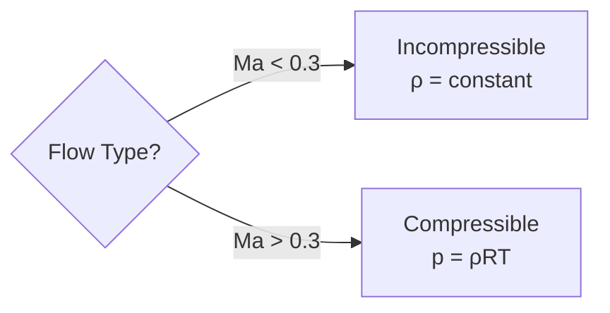

# สมการสถานะ (Equation of State)

สมการสถานะ (EOS) เป็นความสัมพันธ์ที่เชื่อมโยง **ความดัน ($p$)**, **ความหนาแน่น ($\rho$)**, และ **อุณหภูมิ ($T$)** เข้าด้วยกัน ซึ่งเป็นการปิดระบบสมการควบคุมให้สมบูรณ์

---

## ทำไมสมการสถานะถึงสำคัญ?

การเลือก EOS ที่เหมาะสมมีผลโดยตรงต่อ:

| ปัจจัย | ผลกระทบ |
|--------|---------|
| **ความถูกต้อง** | EOS ผิด → ความหนาแน่นคลาดเคลื่อน → สมการโมเมนตัมผิดพลาด |
| **เสถียรภาพ** | Compressible flow ต้องแก้สมการ coupled ซึ่งซับซ้อนกว่า |
| **เวลาคำนวณ** | Incompressible เร็วกว่าเพราะไม่ต้อง couple สมการพลังงาน |

---

## กฎแก๊สอุดมคติ (Ideal Gas Law)

สำหรับการไหลแบบอัดตัวได้:

$$p = \rho R T$$

โดยที่:
- $p$ = ความดันสัมบูรณ์ [Pa]
- $\rho$ = ความหนาแน่น [kg/m³]
- $R$ = ค่าคงที่แก๊สจำเพาะ [J/(kg·K)]
- $T$ = อุณหภูมิสัมบูรณ์ [K]

### ค่าคงที่แก๊สจำเพาะ

$$R = \frac{R_{universal}}{M}$$

โดยที่ $R_{universal} = 8314$ J/(kmol·K) และ $M$ = มวลโมเลกุล

| แก๊ส | $M$ [kg/kmol] | $R$ [J/(kg·K)] |
|------|---------------|----------------|
| อากาศ | 29 | 287 |
| ฮีเลียม | 4 | 2077 |
| CO₂ | 44 | 189 |

### ข้อสมมติพื้นฐาน

กฎแก๊สอุดมคติใช้ได้เมื่อ:
- ปฏิสัมพันธ์ระดับโมเลกุลมีค่าน้อยมาก
- ปริมาตรโมเลกุลเล็กมากเมื่อเทียบกับปริมาตรรวม
- อุณหภูมิและความดันไม่สูงเกินไป (ไม่ใกล้ critical point)

---

## ของไหลที่อัดตัวไม่ได้ (Incompressible)

สำหรับของเหลว หรือแก๊สที่ความเร็วต่ำ:

$$\rho = \text{constant}$$

### เมื่อไหร่ใช้ Incompressible ได้?

ตัวบ่งชี้สำคัญคือ **Mach Number**:

$$Ma = \frac{U}{c} = \frac{\text{ความเร็วการไหล}}{\text{ความเร็วเสียง}}$$

| Mach Number | ระบอบการไหล | แนวทาง |
|-------------|-------------|--------|
| $Ma < 0.3$ | Incompressible | $\rho = \text{constant}$ |
| $0.3 < Ma < 0.8$ | Subsonic Compressible | $p = \rho R T$ |
| $Ma > 0.8$ | Transonic/Supersonic | $p = \rho R T$ + Shock Capturing |

### ข้อดีของ Incompressible

- ✅ คำนวณเร็วกว่ามาก
- ✅ ไม่ต้องแก้สมการพลังงานสำหรับหาความหนาแน่น
- ✅ สมการโมเมนตัมและพลังงาน uncoupled

---

## ผลกระทบต่อสมการควบคุม

### สมการความต่อเนื่อง

| ประเภท | สมการ |
|--------|-------|
| Compressible | $\frac{\partial \rho}{\partial t} + \nabla \cdot (\rho \mathbf{u}) = 0$ |
| Incompressible | $\nabla \cdot \mathbf{u} = 0$ |

### การ Coupling ของสมการ

**Compressible Flow:**
- ความหนาแน่น $\rho$ เปลี่ยนตาม $p$ และ $T$
- สมการ continuity, momentum, energy ต้องแก้ **พร้อมกัน** (coupled)
- ต้องใช้ EOS คำนวณ $\rho$ ทุก time step

**Incompressible Flow:**
- $\rho$ คงที่
- สมการ momentum และ energy แก้ **แยกกันได้** (uncoupled)
- ลดความซับซ้อนอย่างมาก

---

## การเลือก Solver ตาม EOS

| EOS | OpenFOAM Keyword | Solver ตัวอย่าง |
|-----|------------------|-----------------|
| Ideal Gas | `perfectGas` | `rhoSimpleFoam`, `rhoPimpleFoam`, `sonicFoam` |
| Incompressible | `incompressible` | `simpleFoam`, `pimpleFoam`, `interFoam` |

---

## ตารางเปรียบเทียบ

| ประเภท | สมการสถานะ | ข้อดี | ข้อเสีย | การใช้งาน |
|--------|------------|-------|---------|-----------|
| **Compressible** | $p = \rho R T$ | แม่นยำ, จำลอง shock ได้ | ช้า, ซับซ้อน | การไหลความเร็วสูง, แก๊ส |
| **Incompressible** | $\rho = \text{const}$ | เร็ว, เสถียร | ไม่รองรับ shock | ของเหลว, ความเร็วต่ำ |

---

## Concept Check

<b>1. Mach Number มีผลต่อการเลือก EOS อย่างไร?</b>

ถ้า $Ma < 0.3$ สามารถใช้ incompressible ได้ ถ้า $Ma > 0.3$ ต้องพิจารณา compressibility และใช้ ideal gas law

<b>2. ใน OpenFOAM กำหนด EOS ที่ไฟล์ใด?</b>

ไฟล์ `constant/thermophysicalProperties` โดยใช้ keyword `equationOfState` (เช่น `perfectGas` หรือ `incompressible`)

<b>3. ทำไม Incompressible simulation ใช้ทรัพยากรน้อยกว่า?</b>

เพราะสมการพลังงานไม่ถูก couple กับสมการโมเมนตัม ($\rho$ ไม่ขึ้นกับ $T$) ทำให้ไม่ต้องแก้สมการพลังงานเพื่อหาความหนาแน่นในแต่ละ time step

---

## เอกสารที่เกี่ยวข้อง

- **บทก่อนหน้า:** [02_Conservation_Laws.md](02_Conservation_Laws.md) — กฎการอนุรักษ์
- **บทถัดไป:** [04_Dimensionless_Numbers.md](04_Dimensionless_Numbers.md) — ตัวเลขไร้มิติ
- **การนำไปใช้:** [05_OpenFOAM_Implementation.md](05_OpenFOAM_Implementation.md) — การ implement ใน OpenFOAM