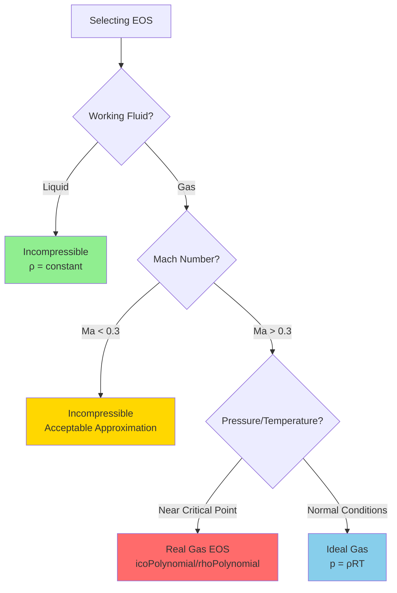

# 03 Equation of State (สมการสถานะ)

---

## 🎯 Learning Objectives

After completing this section, you will be able to:
1. **Choose the appropriate equation of state** for your simulation based on flow physics
2. **Apply compressibility criteria** using Mach number with confidence
3. **Specify EOS correctly** in OpenFOAM thermophysicalProperties files
4. **Troubleshoot common EOS-related errors** that cause simulation instability
5. **Recognize when compressibility effects matter** in engineering applications

---

## What is an Equation of State?

An **Equation of State (EOS)** establishes the relationship between **pressure ($p$)**, **density ($\rho$)**, and **temperature ($T$)**. This relationship closes the system of governing equations, making them mathematically solvable.

```
┌─────────────────────────────────────────────────────────────┐
│                     GOVERNING EQUATIONS                      │
├─────────────────────────────────────────────────────────────┤
│  Continuity:     ∂ρ/∂t + ∇·(ρu) = 0                         │
│  Momentum:       ∂(ρu)/∂t + ∇·(ρuu) = -∇p + ∇·τ            │
│  Energy:         ∂(ρE)/∂t + ∇·(ρuE) = -∇·pu + ∇·(τ·u) + ∇·q│
│  ─────────────────────────────────────────────────────────   │
│  EOS:             p = f(ρ, T) ← CLOSES THE SYSTEM          │
└─────────────────────────────────────────────────────────────┘
```

---

## ⚠️ Critical Temperature Units Warning

**Always use absolute temperature (Kelvin) in EOS calculations!**

```python
# ❌ WRONG - Using Celsius
T_celsius = 25
p = rho * R * T_celsius  # This will give WRONG results!

# ✅ CORRECT - Convert to Kelvin first
T_celsius = 25
T_kelvin = T_celsius + 273.15
p = rho * R * T_kelvin  # Correct calculation
```

| Temperature Scale | Valid for EOS? | Why? |
|-------------------|----------------|------|
| Kelvin (K) | ✅ YES | Absolute scale, directly proportional to molecular energy |
| Celsius (°C) | ❌ NO | Relative scale, has an offset that breaks EOS |
| Fahrenheit (°F) | ❌ NO | Relative scale, wrong reference point |

**Common Error:** Using Celsius in boundary conditions or initial conditions while the solver expects Kelvin. This causes density errors of ~10% at room temperature and grows with temperature.

---

## Why Does EOS Choice Matter?

| Factor | Impact of Wrong Choice | Example |
|--------|----------------------|---------|
| **Accuracy** | Wrong density → Wrong momentum → Wrong velocities | Underpredicting drag on aircraft by 15-20% |
| **Stability** | Compressible solvers are more sensitive to initialization | Blowing up simulation in first few iterations |
| **Compute Time** | Compressible solves 3-5× slower due to energy coupling | Waiting hours instead of minutes for simple flow |
| **Physical Realism** | Missing shock waves, density variations | Inability to capture supersonic flow features |

---

## Comparison: EOS Types in OpenFOAM

| EOS Type | Equation | OpenFOAM Keyword | When to Use | Not Capable Of |
|----------|----------|------------------|-------------|----------------|
| **Ideal Gas** | $p = \rho R T$ | `perfectGas` | Compressible gas flow, Ma > 0.3 | Near-critical conditions, real gas effects |
| **Incompressible** | $\rho = \text{constant}$ | `incompressible` | Liquids, low-speed gas (Ma < 0.3) | Shock waves, significant density changes |
| **Real Gas** | Complex (e.g., Peng-Robinson) | `icoPolynomial`, `rhoPolynomial` | High-pressure, near-critical | Quick calculations (computationally expensive) |

### Visual Decision Tree



---

## Ideal Gas Law

### Mathematical Form

$$p = \rho R T$$

Where:
- $p$ = Absolute pressure [Pa]
- $\rho$ = Density [kg/m³]
- $R$ = Specific gas constant [J/(kg·K)]
- $T$ = Absolute temperature [K] ⚠️

### Gas Constant Calculation

$$R = \frac{R_{universal}}{M}$$

Where $R_{universal} = 8314$ J/(kmol·K) and $M$ = Molecular mass [kg/kmol]

| Gas | $M$ [kg/kmol] | $R$ [J/(kg·K)] | Typical Applications |
|-----|---------------|----------------|---------------------|
| Air | 29 | 287 | HVAC, aerodynamics, combustion |
| Helium | 4 | 2077 | Cryogenics, leak detection |
| CO₂ | 44 | 189 | Carbon capture, beverage industry |
| Water Vapor | 18 | 462 | Humidity, steam systems |

### When Is Ideal Gas Valid?

Ideal gas assumes:
1. **Negligible molecular interactions** → Molecules don't attract/repel each other significantly
2. **Negligible molecular volume** → Molecules are point masses compared to container
3. **Elastic collisions** → No energy loss in molecular collisions

**Valid range:**
- ✅ Low to moderate pressures ($p < 10$ bar typically)
- ✅ Temperatures well above critical point
- ❌ High pressure or near-critical conditions → Use real gas EOS

---

## Mach Number: Your Compressibility Decision Tool

### Definition

$$Ma = \frac{U}{c} = \frac{\text{Flow velocity}}{\text{Speed of sound}}$$

Where speed of sound in ideal gas: $c = \sqrt{\gamma R T}$

### Physical Interpretation

| Mach Range | Physical Meaning | Flow Regime | Example Applications |
|------------|------------------|-------------|---------------------|
| **Ma < 0.3** | Density changes < 5% | Incompressible | 
| - Automotive cooling (Ma ~ 0.05) |
| - Building ventilation (Ma ~ 0.1) |
| - Industrial mixers (Ma ~ 0.2) |
| **0.3 < Ma < 0.8** | Density changes 5-25% | Subsonic compressible | 
| - Passenger aircraft (Ma ~ 0.7-0.85) |
| - Turbojet compressors (Ma ~ 0.5) |
| **0.8 < Ma < 1.2** | Shock waves appear | Transonic | 
| - Helicopter rotors (tip Ma ~ 1.1) |
| - Rocket nozzles (design point) |
| **Ma > 1.2** | Supersonic | Supersonic | 
| - Military jets (Ma ~ 2) |
| - Spacecraft re-entry (Ma > 20) |

### Real-World Examples

```
🚗 CAR (60 km/h): 
   U ≈ 17 m/s, c ≈ 343 m/s → Ma ≈ 0.05
   Decision: Incompressible ✅ (saves 80% compute time)

✈️ AIRCRAFT (cruising at 900 km/h):
   U ≈ 250 m/s, c ≈ 296 m/s (at 10km altitude) → Ma ≈ 0.84
   Decision: Compressible required ⚠️ (density change ~40%)

🚀 ROCKET NOZZLE (Mach 3 at exit):
   Decision: Compressible with shock capturing required 🔥
```

### Decision Threshold Explained

**Why Ma = 0.3?**
- At Ma = 0.3, density variation is approximately 5%
- For most engineering applications, < 5% error is acceptable
- Below this threshold, incompressible assumption is valid
- Above this threshold, compressibility effects become significant

**Rule of thumb:** When in doubt, use compressible for gases. It's safer and more accurate, just slower.

---

## Incompressible Flow

### Mathematical Simplification

$$\rho = \text{constant}$$

### Validity Criteria

Use incompressible when **all** of these apply:
1. ✅ Working fluid is liquid OR gas at Ma < 0.3
2. ✅ No significant heat transfer causing density changes
3. ✅ No shock waves or large pressure gradients

### Benefits

```
Incompressible Simulation Advantages:
├── ⚡ Speed: 3-5× faster (no energy coupling)
├── 🎯 Stability: Easier to converge
├── 💾 Memory: Smaller matrix systems
└── 🔧 Simplicity: Fewer boundary conditions to specify
```

---

## Impact on Governing Equations

### Continuity Equation

| Flow Type | Continuity Equation | Physical Meaning |
|-----------|-------------------|------------------|
| **Compressible** | $\frac{\partial \rho}{\partial t} + \nabla \cdot (\rho \mathbf{u}) = 0$ | Mass conservation with density variation |
| **Incompressible** | $\nabla \cdot \mathbf{u} = 0$ | Volume conservation (divergence-free) |

### Equation Coupling

#### Compressible Flow
```
┌─────────────────────────────────────────┐
│         FULLY COUPLED SYSTEM            │
│  Continuity ↔ Momentum ↔ Energy ↔ EOS  │
│                                         │
│  Solve all TOGETHER at each timestep   │
└─────────────────────────────────────────┘

Flowchart:
ρ changes with p,T (from EOS) →
Momentum depends on ρ →
Energy depends on velocity and ρ →
Back to EOS...

Result: Physically accurate but computationally expensive
```

#### Incompressible Flow
```
┌─────────────────────────────────────────┐
│         DECOUPLED SYSTEM                │
│                                         │
│  Momentum → Continuity (uncoupled)     │
│  Energy → Solved separately if needed  │
│                                         │
│  ρ = constant (known a priori)         │
└─────────────────────────────────────────┘

Flowchart:
ρ is known constant →
Momentum independent of energy →
Solve momentum & continuity →
Optionally solve energy equation

Result: Fast and stable
```

---

## OpenFOAM Implementation

### Specifying EOS in thermophysicalProperties

**File Location:** `constant/thermophysicalProperties`

#### Example 1: Ideal Gas (Compressible)

```cpp
thermoType
{
    type            heRhoThermo;
    mixture         pureMixture;
    transport       const;
    thermo          hConst;
    equationOfState perfectGas;     // ← IDEAL GAS EOS
    specie          specie;
    energy          sensibleEnthalpy;
}

mixture
{
    specie
    {
        nMoles          1;
        molWeight       28.9;           // Air molecular weight
    }
    thermodynamics
    {
        Cp              1007;           // [J/(kg·K)]
        Hf              0;              // [J/kg]
    }
    transport
    {
        mu              1.8e-05;        // [Pa·s]
        Pr              0.7;            // Prandtl number
    }
}
```

#### Example 2: Incompressible (Constant Density)

```cpp
thermoType
{
    type            hePsiThermo;
    mixture         pureMixture;
    transport       const;
    thermo          hConst;
    equationOfState incompressible;     // ← CONSTANT DENSITY
    specie          specie;
    energy          sensibleEnthalpy;
}

mixture
{
    specie
    {
        molWeight       28.9;
    }
    thermodynamics
    {
        Cp              1007;
        Hf              0;
    }
    equationOfState
    {
        R               287;            // Gas constant [J/(kg·K)]
        rho             1.225;          // Density [kg/m³] ← CONSTANT
    }
    transport
    {
        mu              1.8e-05;
        Pr              0.7;
    }
}
```

### Solver Selection Guide

| EOS Type | Solver Family | Specific Solvers | Use Case |
|----------|---------------|------------------|----------|
| **Ideal Gas** | `rho*Foam` | `rhoSimpleFoam` | Steady-state compressible |
| | | `rhoPimpleFoam` | Transient compressible |
| | | `sonicFoam` | High-speed compressible |
| **Incompressible** | `*Foam` | `simpleFoam` | Steady-state incompressible |
| | | `pimpleFoam` | Transient incompressible |
| | | `interFoam` | Multiphase incompressible |

---

## 🔧 When EOS Choice Goes Wrong: Troubleshooting

### Problem 1: Simulation Diverges Immediately

**Symptoms:**
- Courant number explodes in first few iterations
- Temperature becomes negative or unrealistic
- Pressure waves don't propagate correctly

**Diagnosis:** Wrong EOS for flow regime

**Solution:**
```bash
# Check your Mach number
# Post-process velocity field → calculate Ma field

# If Ma < 0.3 but using compressible:
# Switch to incompressible solver and boundary conditions

# If Ma > 0.3 but using incompressible:
# Switch to compressible solver with proper EOS
```

---

### Problem 2: Density Values Are Unphysical

**Symptoms:**
- Density shows checkerboard pattern
- Density is negative or zero
- Density doesn't change when it should (compressible flow)

**Common Causes:**

| Error | Example | Fix |
|-------|---------|-----|
| **Temperature in Celsius** | `T 300;` means 300°C not 300 K | Always use Kelvin: `T 300;` means 300 K |
| **Wrong gas constant** | Using R=287 for helium | Use correct R for your gas |
| **Inconsistent units** | Mixing Pa and bar | Use SI units throughout |

**Quick Check:**
```python
# Verify your EOS calculation
p = 101325  # [Pa]
T = 300     # [K]  ← Must be Kelvin!
R = 287     # [J/(kg·K)] for air
rho = p / (R * T)
print(f"Density = {rho:.3f} kg/m³")  # Should be ~1.18 kg/m³
```

---

### Problem 3: Wrong Velocity Magnitude

**Symptom:** Velocities are 10-20% off from expected values

**Root Cause:** Using incompressible assumption for compressible flow (Ma > 0.3)

**Why it happens:** Incompressible simulation assumes constant density, leading to mass conservation errors when density should change

**Fix:** Recalculate Mach number from velocity field. If Ma > 0.3, switch to compressible solver.

---

### Problem 4: Compressible Solver Too Slow

**Symptom:** Simulation takes forever, but flow is actually low-speed

**Diagnosis:** Over-engineering the problem

**Solution:**
1. Calculate maximum Mach in domain
2. If Ma < 0.3 everywhere → Use incompressible
3. Gain: 3-5× speed-up with acceptable accuracy loss (< 5%)

---

## Common Pitfalls

### ❌ Pitfall 1: Using Incompressible for "Almost" Incompressible

**Scenario:** Ma = 0.35 (just above threshold)

**Wrong decision:** "It's close enough, I'll use incompressible"

**Consequence:** Density errors ~10%, velocity errors ~5-8%

**Better approach:** 
- If accuracy matters → Use compressible
- If exploring design space → Start incompressible, verify with compressible

---

### ❌ Pitfall 2: Forgetting Temperature Dependence

**Scenario:** Incompressible liquid with heat transfer

**Wrong assumption:** "Incompressible means density never changes"

**Reality:** Liquids DO change density with temperature (just less than gases)

**Solution:** Use Boussinesq approximation or temperature-dependent density if ΔT is large

---

### ❌ Pitfall 3: Mixing EOS in Same Simulation

**Scenario:** Multiphase flow with gas and liquid

**Wrong approach:** Using single EOS for both phases

**Correct approach:** 
- Use multiphase solver (e.g., `interFoam`)
- Each phase has its own thermophysicalProperties
- Phase fraction determines local EOS

---

## Summary & Key Takeaways

| Concept | Key Point | Remember |
|---------|-----------|----------|
| **EOS Purpose** | Closes governing equations by relating p, ρ, T | Without EOS, system is unsolvable |
| **Temperature Units** | Must use Kelvin | Celsius breaks EOS by 273.15 offset |
| **Compressibility Criterion** | Ma < 0.3 → incompressible | Ma = 0.3 gives ~5% density error |
| **Physical Examples** | Car (Ma~0.05), Aircraft (Ma~0.85), Rocket (Ma>3) | Context helps intuition |
| **Computational Cost** | Compressible: 3-5× slower | Trade accuracy vs. speed wisely |
| **OpenFOAM Specification** | `constant/thermophysicalProperties` | `equationOfState perfectGas` or `incompressible` |

---

## Concept Check

<details>
<summary><b>📝 1. You're simulating air flow at 25°C through a ventilation duct. Maximum velocity is 15 m/s. Which EOS do you choose?</b></summary>

**Solution:**
1. Calculate speed of sound: $c = \sqrt{\gamma R T} = \sqrt{1.4 \times 287 \times 298} = 346$ m/s
2. Calculate Mach number: $Ma = 15/346 = 0.043$
3. Since Ma << 0.3 → **Use incompressible EOS**

**Result:** Simulation will be ~4× faster with < 1% accuracy loss
</details>

<details>
<summary><b>📝 2. Your compressible simulation shows density = 1500 kg/m³ for air at standard conditions. What went wrong?</b></summary>

**Most likely error:** Temperature specified in Celsius instead of Kelvin

**Check:**
- If T = 25 (interpreted as 25 K): $\rho = 101325 / (287 \times 25) = 14.1$ kg/m³ ❌
- If T = 25°C but should be 298 K: $\rho = 101325 / (287 \times 298) = 1.18$ kg/m³ ✅

**Fix:** Ensure all temperature BCs use Kelvin
</details>

<details>
<summary><b>📝 3. When should you use real gas EOS instead of ideal gas?</b></summary>

**Use real gas when:**
1. Near critical point (high pressure + moderate temperature)
2. Very high pressure (> 10-50 bar, depending on gas)
3. High accuracy required for condensation/vaporization
4. Supercritical fluids (CO₂ cycles, refrigeration)

**Example:** CO₂ at 100 bar, 300 K (near critical point at 73.8 bar, 304 K)

**OpenFOAM keywords:** `icoPolynomial`, `rhoPolynomial`
</details>

<details>
<summary><b>📝 4. How does EOS choice affect matrix size in linear solvers?</b></summary>

**Incompressible:**
- Solves for: pressure, velocity (4 variables in 3D)
- Smaller, more sparse matrices
- Faster convergence

**Compressible:**
- Solves for: pressure, velocity, density, temperature (5+ variables in 3D)
- Larger, denser matrices due to coupling
- More iterations per timestep
- Stronger pressure-velocity-density coupling requires more solver iterations

**Practical impact:** Compressible simulations need 3-5× more memory and 5-10× more CPU time
</details>

---

## 📚 Related Documents

### Prerequisites
- **Previous:** [02_Conservation_Laws.md](02_Conservation_Laws.md) — Conservation laws form the foundation that EOS closes
- **Previous:** [01_Introduction.md](01_Introduction.md) — Continuum hypothesis and thermodynamics basics

### Next Steps
- **Next:** [04_Dimensionless_Numbers.md](04_Dimensionless_Numbers.md) — Reynolds, Mach, and other dimensionless numbers (expanded Mach discussion)
- **Next:** [05_OpenFOAM_Implementation.md](05_OpenFOAM_Implementation.md) — Complete thermophysicalProperties examples

### Cross-References
- **Wall Treatment:** [06_Turbulence_Modeling.md](06_Turbulence_Modeling.md) — How compressibility affects wall functions
- **Boundary Conditions:** [07_Boundary_Conditions.md](07_Boundary_Conditions.md) — Compressible vs incompressible BCs

---

## Navigation

```
Module Structure:
├── 00_Overview (Module roadmap)
├── 01_Introduction (Continuum, thermodynamics)
├── 02_Conservation_Laws (Mass, momentum, energy)
├── 03_Equation_of_State ← YOU ARE HERE (p-ρ-T relationship)
├── 04_Dimensionless_Numbers (Re, Ma, Pr, etc.)
├── 05_OpenFOAM_Implementation (Files, solvers)
├── 06_Turbulence_Modeling (RANS, LES, wall functions)
└── 07_Boundary_Conditions (BC types and specification)

Next: 04_Dimensionless_Numbers (Mach number in turbulence context)
```

---

**Last Updated:** 2025-12-30  
**Version:** 2.0 (Opus 4.5 Refactor)  
**Feedback:** Please report errors or suggest improvements via repository issues