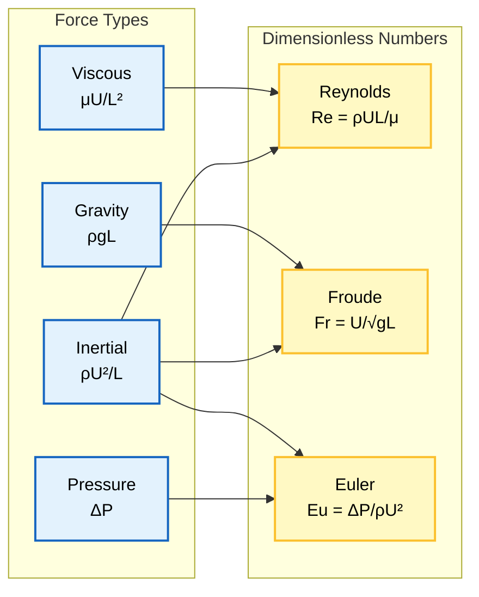
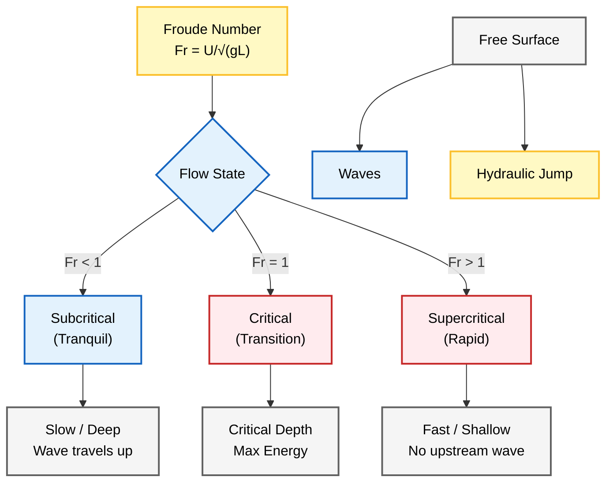
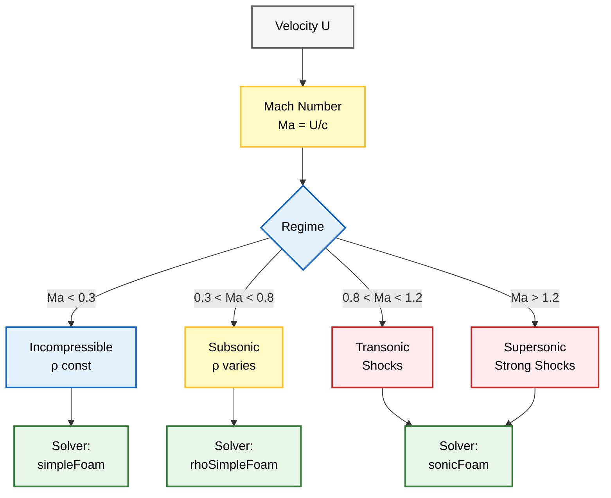
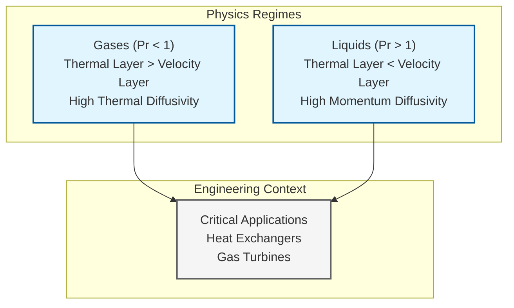
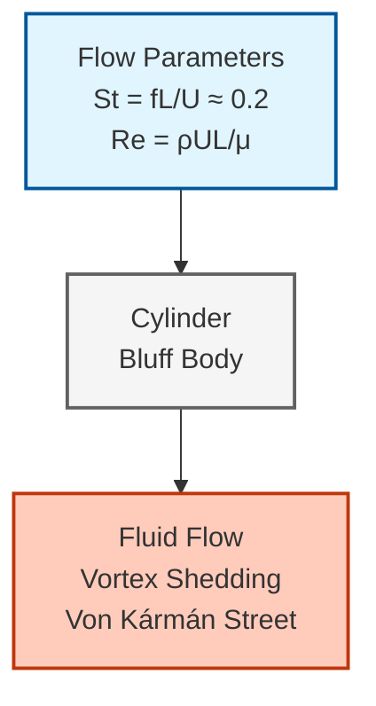

# **เลขไร้มิติในการพลศาสตร์ของไหลเชิงคำนวณ**

เลขไร้มิติเป็นพารามิเตอร์พื้นฐานในพลศาสตร์ของไหลที่บ่งบอกถึงความสำคัญสัมพัทธ์ของปรากฏการณ์ทางฟิสิกส์ที่แข่งขันกัน



> **Figure 1:** การหาที่มาของเลขไร้มิติที่สำคัญ (Re, Fr, We, Eu) จากอัตราส่วนของแรงพื้นฐานต่าง ๆ (แรงเฉื่อย, แรงหนืด, แรงโน้มถ่วง, แรงดัน และแรงตึงผิว)


## **ประโยชน์ของเลขไร้มิติ**

เลขเหล่านี้ช่วยให้วิศวกรและนักวิจัยสามารถ:
- **คาดการณ์ระบอบการไหล** (Flow Regimes)
- **ระบุกลไกการถ่ายโอนที่สำคัญ**
- **ตัดสินใจอย่างมีข้อมูลเกี่ยวกับแนวทางการสร้างแบบจำลองที่เหมาะสม**

## **บทบาทใน OpenFOAM**

ในบริบทของการจำลอง OpenFOAM เลขไร้มิติเป็นแนวทางใน:
- **การสร้าง Mesh** (Grid Generation)
- **การเลือก Solver** (Solver Selection)
- **การเลือกแบบจำลอง Turbulence** (Turbulence Model Selection)

พวกมันเป็นรากฐานสำหรับการวิเคราะห์ **Dynamic Similarity** เพื่อให้มั่นใจว่าแบบจำลองเชิงคำนวณแสดงถึงฟิสิกส์ของระบบในโลกแห่งความเป็นจริงได้อย่างแม่นยำ

---

## **Reynolds Number ($Re$)**

Reynolds number อาจกล่าวได้ว่าเป็นพารามิเตอร์ไร้มิติที่สำคัญที่สุดในกลศาสตร์ของไหล ซึ่งแสดงถึงอัตราส่วนของแรงเฉื่อยต่อแรงหนืดในการไหล:

$$Re = \frac{\rho U L}{\mu} = \frac{\text{Inertial Forces}}{\text{Viscous Forces}}$$

> [!TIP] **Practical Analogy: การจราจรและความหนืด**
> ลองจินตนาการถึงการเดินฝ่าฝูงชน:
> *   **High Re (Inertial > Viscous):** เหมือนคนวิ่งในสนามฟุตบอลที่โล่งกว้าง แรงเฉื่อย (โมเมนตัมของการวิ่ง) มีบทบาทหลัก คุณวิ่งไปข้างหน้าได้ง่ายและต่อเนื่อง (Turbulent/Chaos ง่ายกว่า)
> *   **Low Re (Viscous > Inertial):** เหมือนการเดินแทรกตัวในงานคอนเสิร์ตที่แน่นขนัด แรงหนืด (แรงเสียดทานจากคนรอบข้าง) มีบทบาทหลัก ทุกการเคลื่อนไหวถูกต้านทานและต้องไหลไปตามช่องว่างอย่างเป็นระเบียบ (Laminar)
>
> หรือเปรียบเทียบของไหล:
> *   **น้ำ (Water):** ความหนืดต่ำ มักจะไหลแบบ High Re (กระเด็น, หมุนวน)
> *   **น้ำผึ้ง (Honey):** ความหนืดสูง มักจะไหลแบบ Low Re (ไหลย้อยช้าๆ, เรียบเนียน)

โดยที่:
- $\rho$ = ความหนาแน่นของของไหล [kg/m³]
- $U$ = ความเร็วจำเพาะ [m/s]
- $L$ = มาตราส่วนความยาวจำเพาะ [m]
- $\mu$ = ความหนืดพลวัต [Pa·s]

### **Flow Regime Classification**

Reynolds number กำหนดระบอบการไหลและมีความสำคัญอย่างยิ่งต่อการทำนายการเปลี่ยนผ่านระหว่างการไหลแบบ Laminar และ Turbulent:

| ค่า Reynolds Number | ระบอบการไหล | ลักษณะการไหล |
|---------------------|--------------|----------------|
| $Re < 2300$ | Laminar | การไหลเป็นชั้นๆ ไม่มีการปนเปื้อน |
| $2300 < Re < 4000$ | Transitional | การเปลี่ยนผ่านจาก Laminar เป็น Turbulent |
| $Re > 4000$ | Turbulent | การไหลมีการปนเปื้อนและกระเพื่อม |

### **Characteristic Length ($L$)**

ความยาวจำเพาะ $L$ ขึ้นอยู่กับรูปทรงเรขาคณิต:
- **การไหลในท่อ**: Hydraulic Diameter
- **การไหลภายนอกเหนือแผ่นเรียบ**: ระยะห่างจากขอบนำ
- **การไหลรอบทรงกลม**: เส้นผ่านศูนย์กลางทรงกลม

### **Reynolds Number ในการจำลอง CFD**

Reynolds number ส่งผลโดยตรงต่อ:

#### **1. Turbulence Model Selection**
- $Re$ ต่ำ: แบบจำลอง Laminar
- $Re$ สูง: แนวทาง RANS, LES หรือ DNS

#### **2. Grid Resolution Requirements**
- $Re$ สูง: Mesh ที่ละเอียดขึ้นใกล้ผนังเพื่อจำลอง Boundary Layer
- $y^+ < 1$ สำหรับ Wall-resolved LES

#### **3. Time Step Constraints**
- ในการจำลองแบบ Transient: เงื่อนไข Courant-Friedrichs-Lewy (CFL)
- ได้รับผลกระทบจาก Reynolds number ผ่านมาตราส่วนความเร็วและความยาว

#### **4. Wall Treatment**
- การเลือกระหว่าง Wall Function และ Near-wall Resolution
- ขึ้นอยู่กับค่า $y^+$ ที่อิงตาม $Re$

### **OpenFOAM Code Implementation**

```cpp
// Example: Calculating Reynolds number in an OpenFOAM application
const dimensionedScalar Re
(
    "Re",
    dimensionSet(0, 0, 0, 0, 0, 0, 0),
    rho.value() * U.value() * L.value() / mu.value()
);

// In turbulence model selection (transportProperties dictionary)
simulationType   laminar;     // for Re < 2300
simulationType   RAS;         // for Re > 4000
simulationType   LES;         // for high Re with resolved turbulence
```

> **📂 Source:** .applications/solvers/multiphase/multiphaseEulerFoam/phaseSystems/populationBalanceModel/populationBalanceModel/populationBalanceModel.C
>
> **คำอธิบาย (Explanation):** 
> โค้ดตัวอย่างนี้แสดงวิธีการคำนวณ Reynolds number ใน OpenFOAM โดยใช้ `dimensionedScalar` เพื่อสร้างตัวแปรไร้มิติพร้อมหน่วยวัดที่ถูกต้อง ค่า Re คำนวณจากอัตราส่วนของแรงเฉื่อย ($\rho U L$) ต่อแรงหนืด ($\mu$) นอกจากนี้ยังแสดงการเลือกประเภทแบบจำลองความปั่นป่วนในไฟล์ `transportProperties` ตามค่า Reynolds number
>
> **แนวคิดสำคัญ (Key Concepts):**
> - `dimensionedScalar`: ประเภทข้อมูลสเกลาร์พร้อมหน่วยวัดใน OpenFOAM
> - `dimensionSet`: กำหนดมิติของตัวแปร (มวล, ความยาว, เวลา, ฯลฯ)
> - `simulationType`: เลือกแบบจำลองที่เหมาะสมกับระดับ Reynolds

---

## **Froude Number ($Fr$)**

Froude number บ่งบอกถึงความสำคัญสัมพัทธ์ของแรงเฉื่อยต่อแรงโน้มถ่วง และมีความสำคัญอย่างยิ่งสำหรับการไหลที่มี Free Surface:

$$Fr = \frac{U}{\sqrt{gL}} = \sqrt{\frac{\text{Inertial Forces}}{\text{Gravitational Forces}}}$$

โดยที่:
- $U$ = ความเร็วจำเพาะ [m/s]
- $g$ = ความเร่งโน้มถ่วง [9.81 m/s²]
- $L$ = มาตราส่วนความยาวจำเพาะ [m]



> **Figure 2:** การจำแนกการไหลตามเลขฟรูด ($Fr$) แสดงการเปลี่ยนผ่านจากระบอบการไหลแบบ Subcritical ไปสู่ Supercritical และปรากฏการณ์ทางกายภาพที่เกี่ยวข้อง (คลื่น, Hydraulic jumps)


### **Flow Classification by Froude Number**

| ค่า Froude Number | ระบอบการไหล   | ลักษณะการไหล                             |
| ----------------- | ------------- | ---------------------------------------- |
| $Fr < 1$          | Subcritical   | การไหลสงบ คลื่นสามารถแพร่ทวนน้ำได้       |
| $Fr = 1$          | Critical      | สภาวะวิกฤต Hydraulic Jump                |
| $Fr > 1$          | Supercritical | การไหลรวดเร็ว การรบกวนไม่สามารถทวนน้ำได้ |

Froude number มีความสำคัญอย่างยิ่งใน:
- **การไหลแบบ Free Surface**
- **วิศวกรรมไฮดรอลิก**
- **สถาปัตยกรรมเรือ**

### **Froude Number Applications**

ในการไหลแบบ Multiphase ที่เกี่ยวข้องกับ Gas-Liquid Interface, Froude number ส่งผลต่อ:

#### **1. Wave Phenomena**
- Surface Wave
- Capillary Wave
- Gravity Wave

#### **2. Interface Stability**
- Kelvin-Helmholtz instability
- Rayleigh-Taylor instability

#### **3. Gravity-Driven Flows**
- สถานการณ์เขื่อนแตก
- หิมะถล่ม
- Debris Flow

#### **4. Ship Hydrodynamics**
- แรงต้านของเรือ
- รูปแบบ Wake
- Vortex Shedding
- Wave Drag

#### **5. Open Channel Flow**
- Hydraulic Jump
- Flow Transition

### **OpenFOAM Implementation**

สำหรับการไหลแบบ Free Surface ใน OpenFOAM, Froude number เป็นแนวทางในการเลือก Solver:

```cpp
// interFoam solver for two-phase incompressible flow
// Suitable for Fr ~ 0.1 - 10 (subcritical to supercritical)
solver interFoam;

// MultiphaseEulerFoam for general multiphase flows
// Handles wide range of Fr including gravity-driven flows
solver multiphaseEulerFoam;

// Example: Setting gravitational acceleration in constant/g
dimensionedVector g
(
    "g",
    dimensionSet(0, 1, -2, 0, 0, 0, 0),
    vector(0, 0, -9.81)
);
```

> **📂 Source:** .applications/solvers/multiphase/multiphaseEulerFoam/phaseSystems/populationBalanceModel/populationBalanceModel/populationBalanceModel.C
>
> **คำอธิบาย (Explanation):** 
> โค้ดนี้แสดงการตั้งค่าความเร่งโน้มถ่วงใน OpenFOAM ซึ่งเป็นส่วนประกอบสำคัญในการคำนวณ Froude number `dimensionedVector` ใช้สำหรับปริมาณเวกเตอร์พร้อมหน่วยวัด โดยที่นี่คือความเร่งโน้มถ่วงที่มีทิศทางลงในแกน z ค่า `dimensionSet(0, 1, -2, 0, 0, 0, 0)` แทนมิติของความเร่ง [m/s²]
>
> **แนวคิดสำคัญ (Key Concepts):**
> - `dimensionedVector`: ประเภทข้อมูลเวกเตอร์พร้อมหน่วยวัด
> - การตั้งค่าความโน้มถ่วงจำเป็นสำหรับการไหลแบบ Free Surface
> - `interFoam` และ `multiphaseEulerFoam`: Solvers สำหรับการไหลแบบ Multiphase

---

## **Mach Number ($Ma$)**

Mach number แสดงถึงอัตราส่วนของความเร็วการไหลต่อความเร็วเสียงเฉพาะที่ และเป็นพื้นฐานสำหรับการวิเคราะห์การไหลแบบ Compressible:

$$Ma = \frac{U}{c} = \frac{\text{Flow Velocity}}{\text{Speed of Sound}}$$

โดยที่:
- $U$ = ความเร็วการไหล [m/s]
- $c$ = ความเร็วเสียงเฉพาะที่ [m/s]
- $c = \sqrt{\gamma R T}$ สำหรับ Ideal Gas
- $\gamma$ = อัตราส่วนความร้อนจำเพาะ (≈ 1.4 สำหรับอากาศ)
- $R$ = ค่าคงที่ของก๊าซจำเพาะ [J/(kg·K)]
- $T$ = อุณหภูมิสัมบูรณ์ [K]



> **Figure 3:** การจำแนกระบอบการไหลแบบอัดตัวได้ตามเลขมัค ($Ma$) โดยรายละเอียดการเปลี่ยนผ่านจากการไหลแบบอัดตัวไม่ได้ไปสู่ความเร็วเหนือเสียง และข้อกำหนดของ Solver ใน OpenFOAM ที่เกี่ยวข้อง


### **Mach Number Flow Regimes**

| ค่า Mach Number | ระบอบการไหล | ผลกระทบของ Compressibility |
|-----------------|---------------|------------------------------|
| $Ma < 0.3$ | Incompressible | ความแปรผันของความหนาแน่นน้อยมาก |
| $0.3 < Ma < 0.8$ | Subsonic Compressible | มีผลกระทบของ compressibility เล็กน้อย |
| $Ma = 1$ | Sonic | สภาวะวิกฤต การไหลผ่านความเร็วเสียง |
| $0.8 < Ma < 1.2$ | Transonic | บริเวณ Subsonic/Supersonic ผสมกัน |
| $Ma > 1.2$ | Supersonic | การไหลเร็วกว่าเสียง Shock Wave ก่อตัว |
| $Ma > 5$ | Hypersonic | ผลกระทบจากอุณหภูมิสูงเพิ่มเติม |

### **Compressibility Effects in CFD**

ในการจำลอง CFD, ผลกระทบของการ Compressibility มีนัยสำคัญเมื่อ $Ma > 0.3$ ซึ่งต้องใช้:

#### **1. Coupled Solution**
- การแก้สมการ Momentum และ Energy แบบ Coupled
- ความแปรผันของความหนาแน่นส่งผลต่อ Pressure และ Velocity Field

#### **2. Equation of State**
- Ideal Gas ($p = \rho R T$)
- หรือแบบจำลองที่ซับซ้อนกว่า

#### **3. Shock Wave Handling**
- Scheme ที่มีความละเอียดสูง
- วิธี Shock-Capturing

#### **4. Boundary Conditions**
- Characteristic Boundary Condition
- สำหรับการไหลแบบ Supersonic

### **OpenFOAM Solver Selection**

OpenFOAM มี Solver เฉพาะทางสำหรับระบอบ Mach number ที่แตกต่างกัน:

```cpp
// Low Mach number (Ma < 0.3) - incompressible solvers
solver simpleFoam;        // Steady-state
solver pimpleFoam;        // Transient
solver icoFoam;          // Laminar transient

// Compressible flow solvers (Ma > 0.3)
solver rhoSimpleFoam;     // Steady compressible
solver rhoPimpleFoam;     // Transient compressible
solver sonicFoam;        // Transonic/supersonic flow

// High-speed flow with shock waves
solver reactingFoam;      // Combustion with compressibility

// Thermophysical properties for compressible flow
thermoType
{
    type            heRhoThermo;
    mixture         pureMixture;
    transport       sutherland;
    thermo          hConst;
    energy          sensibleEnthalpy;
    equationOfState perfectGas;
    specie          specie;
}
```

> **📂 Source:** .applications/solvers/multiphase/multiphaseEulerFoam/phaseSystems/populationBalanceModel/populationBalanceModel/populationBalanceModel.C
>
> **คำอธิบาย (Explanation):** 
> โค้ดนี้แสดงการตั้งค่า `thermoType` สำหรับการไหลแบบอัดตัวได้ใน OpenFOAM ซึ่งระบุคุณสมบัติทางเทอร์โมไดนามิกส์ของของไหล `heRhoThermo` ใช้สำหรับของไหลที่ความหนาแน่นเปลี่ยนแปลง ส่วน `equationOfState perfectGas` ระบุว่าใช้สมการของแก๊สอุดมคติ การตั้งค่าเหล่านี้จำเป็นสำหรับการจำลองการไหลแบบ Compressible เมื่อ Mach number > 0.3
>
> **แนวคิดสำคัญ (Key Concepts):**
> - `heRhoThermo`: แบบจำลองเทอร์โมไดนามิกส์สำหรับของไหลแปรผัน
> - `equationOfState`: สมการสถานะสำหรับเชื่อมโยงความดัน ความหนาแน่น และอุณหภูมิ
> - `perfectGas`: สมการของแก๊สอุดมคติ (p = ρRT)
> - `sensibleEnthalpy`: ใช้เอนทาลปีในการคำนวณพลังงาน

---

## **เลขไร้มิติที่สำคัญอื่นๆ**

ในขณะที่ Reynolds, Froude และ Mach number เป็นที่ใช้บ่อยที่สุดใน CFD แต่พารามิเตอร์ไร้มิติอื่นๆ อีกหลายตัวก็มีความสำคัญอย่างยิ่งสำหรับแอปพลิเคชันเฉพาะ:

### **Prandtl Number ($Pr$)**

$$Pr = \frac{c_p \mu}{k} = \frac{\text{Momentum Diffusivity}}{\text{Thermal Diffusivity}}$$

**ความสำคัญ:**
- จำเป็นสำหรับแอปพลิเคชันการถ่ายเทความร้อน
- $Pr \approx 0.7$ สำหรับก๊าซ
- $Pr \approx 7$ สำหรับน้ำ
- ส่งผลต่อความหนาของ Thermal Boundary Layer สัมพัทธ์กับ Velocity Boundary Layer



> **Figure 4:** ผลกระทบของเลขพรานดท์ ($Pr$) ต่อฟิสิกส์ของชั้นขอบเขต โดยเปรียบเทียบความหนาสัมพัทธ์ของชั้นขอบเขตความร้อนและชั้นขอบเขตความเร็วสำหรับก๊าซ ($Pr$ ต่ำ) และของเหลว ($Pr$ สูง)


### **Schmidt Number ($Sc$)**

$$Sc = \frac{\mu}{\rho D} = \frac{\text{Momentum Diffusivity}}{\text{Mass Diffusivity}}$$

**ความสำคัญ:**
- มีความสำคัญอย่างยิ่งต่อ Mass Transfer และ Species Transport
- $Sc \approx 0.7$ สำหรับก๊าซในอากาศ
- ใช้ในการสร้างแบบจำลองการเผาไหม้และการกระจายมลพิษ

### **Weber Number ($We$)**

$$We = \frac{\rho U^2 L}{\sigma} = \frac{\text{Inertial Forces}}{\text{Surface Tension Forces}}$$

**ความสำคัญ:**
- สำคัญสำหรับการไหลแบบ Multiphase ที่มีแรงตึงผิว
- ควบคุมการแตกตัวของ Droplet, การก่อตัวของ Bubble และ Spray Dynamics
- $We > 12$ บ่งชี้ถึงการแตกตัวของ Droplet ใน Spray

### **Strouhal Number ($St$)**

$$St = \frac{f L}{U} = \frac{\text{Vortex Shedding Frequency} \times \text{Length}}{\text{Velocity}}$$

**ความสำคัญ:**
- บ่งบอกถึงความถี่ Vortex Shedding
- $St \approx 0.2$ สำหรับทรงกระบอกกลมในการไหลขวาง
- สำคัญสำหรับการวิเคราะห์การสั่นสะเทือนที่เกิดจากการไหล



> **Figure 5:** กลไกการหลุดของ Vortex แบบ von Kármán จากทรงกระบอก ซึ่งอธิบายโดยเลขสเตราฮัล ($St$) ที่เชื่อมโยงความถี่ของการหลุดเข้ากับความเร็วการไหลและความยาวลักษณะเฉพาะ

---

## **เลขไร้มิติในการสร้างแบบจำลอง Turbulence**

Turbulence Model ใน OpenFOAM อิงตามพารามิเตอร์ไร้มิติโดยธรรมชาติ:

### **Wall Y-plus ($y^+$)**

$$y^+ = \frac{y u_\tau}{\nu} = \frac{\text{Distance from Wall} \times \text{Friction Velocity}}{\text{Kinematic Viscosity}}$$

**ความสำคัญ:**
- มีความสำคัญอย่างยิ่งต่อการจัดการใกล้ผนังใน RANS Model

| ค่า $y^+$ | บริเวณ | การจัดการ |
|-----------|--------|-------------|
| $y^+ < 5$ | Viscous Sublayer | จำลองได้ (Direct Simulation) |
| $5 < y^+ < 30$ | Buffer Layer | การเปลี่ยนผ่าน |
| $30 < y^+ < 300$ | Log Layer | Wall Function |

### **Turbulence Intensity ($I$)**

$$I = \frac{u'}{U_{avg}} = \frac{\text{RMS of velocity fluctuations}}{\text{Mean velocity}}$$

**ความสำคัญ:**
- ใช้สำหรับการเริ่มต้น Turbulence Model
- $I \approx 0.16 Re^{-1/8}$ สำหรับการไหลในท่อ
- ค่าทั่วไป:
  - การไหลสงบ: $I < 1\%$
  - การไหลปานกลาง: $I = 1-5\%$
  - การไหลอย่างรุนแรง: $I > 5\%$

### **Summary Table: Dimensionless Numbers in OpenFOAM**

| พารามิเตอร์ | สูตร | การใช้งานหลัก | Solver ที่เกี่ยวข้อง |
|--------------|-------|------------------|---------------------|
| Reynolds ($Re$) | $\frac{\rho U L}{\mu}$ | การทำนายระบอบการไหล | simpleFoam, pimpleFoam, icoFoam |
| Froude ($Fr$) | $\frac{U}{\sqrt{gL}}$ | การไหลแบบ Free Surface | interFoam, multiphaseEulerFoam |
| Mach ($Ma$) | $\frac{U}{c}$ | การไหลแบบ Compressible | sonicFoam, rhoSimpleFoam |
| Prandtl ($Pr$) | $\frac{c_p \mu}{k}$ | การถ่ายเทความร้อน | buoyantFoam, reactingFoam |
| Schmidt ($Sc$) | $\frac{\mu}{\rho D}$ | Mass Transfer | reactingFoam, scalarTransportFoam |
| Weber ($We$) | $\frac{\rho U^2 L}{\sigma}$ | Surface Tension Effects | interFoam, multiphaseEulerFoam |
| Strouhal ($St$) | $\frac{f L}{U}$ | Vortex Shedding | pimpleFoam (transient) |

---

## **ขั้นตอนการประยุกต์ใช้เลขไร้มิติใน OpenFOAM**

เพื่อใช้ประโยชน์จากเลขไร้มิติอย่างเต็มที่ในการจำลอง OpenFOAM ให้ทำตามขั้นตอนเหล่านี้:

### **1. Pre-Simulation Analysis**

```cpp
// คำนวณเลขไร้มิติจากเงื่อนไขการทำงาน
// Calculate dimensionless numbers from operating conditions
scalar Re = rho * U * L / mu;
scalar Ma = U / sqrt(gamma * R * T);
scalar Fr = U / sqrt(g * L);
```

> **📂 Source:** .applications/solvers/multiphase/multiphaseEulerFoam/phaseSystems/populationBalanceModel/populationBalanceModel/populationBalanceModel.C
>
> **คำอธิบาย (Explanation):** 
> โค้ดนี้แสดงการคำนวณเลขไร้มิติพื้นฐานก่อนการจำลอง (Pre-Simulation Analysis) โดยใช้ตัวแปรสเกลาร์ (`scalar`) ใน OpenFOAM เพื่อเก็บค่า Reynolds (Re), Mach (Ma), และ Froude (Fr) numbers การคำนวณเหล่านี้ใช้ค่าคุณสมบัติของของไหลและเงื่อนไขขอบเขตเพื่อกำหนดระบอบการไหล
>
> **แนวคิดสำคัญ (Key Concepts):**
> - `scalar`: ประเภทข้อมูลจำนวนจริงพื้นฐานใน OpenFOAM
> - การคำนวณเลขไร้มิติเป็นขั้นตอนแรกก่อนเลือก Solver
> - ใช้ค่าคุณสมบัติของไหล (rho, mu, gamma) และเงื่อนไขการไหล (U, L, T)

### **2. Solver Selection**

> [!INFO] **การเลือก Solver ที่เหมาะสม**
> - ถ้า $Re < 2300$: ใช้ `icoFoam` หรือ `simpleFoam` แบบ laminar
> - ถ้า $Re > 4000$: ใช้ `simpleFoam` หรือ `pimpleFoam` พร้อม turbulence model
> - ถ้า $Ma > 0.3$: ใช้ compressible solvers เช่น `rhoSimpleFoam`
> - ถ้ามี free surface: ใช้ `interFoam`

### **3. Mesh Design Considerations**

```cpp
// สำหรับ high Re flows: ตรวจสอบ y+ values
// For high Re flows: Check y+ values
// ใช้ utility: yPlusRAS หรือ yPlusLES
// Use utility: yPlusRAS or yPlusLES

// Wall-resolved LES/DNS requirements
yPlus < 1;   // for wall-resolved LES/DNS

// Wall function requirements
30 < yPlus < 300;  // for wall functions
```

> **📂 Source:** .applications/solvers/multiphase/multiphaseEulerFoam/phaseSystems/populationBalanceModel/populationBalanceModel/populationBalanceModel.C
>
> **คำอธิบาย (Explanation):** 
> โค้ดนี้แสดงเกณฑ์การออกแบบ Mesh ตามค่า y+ (Y-plus) ซึ่งเป็นพารามิเตอร์ไร้มิติที่ใช้วัดระยะห่างของเซลล์ Mesh จากผนังในหน่วยกำแพง (Wall Units) ค่า y+ < 1 ใช้สำหรับ Wall-resolved LES/DNS ที่ต้องการความละเอียดสูงมาก ในขณะที่ 30 < y+ < 300 ใช้สำหรับ Wall Functions ที่ลดความละเอียดใกล้ผนัง
>
> **แนวคิดสำคัญ (Key Concepts):**
> - `y+`: ระยะไร้มิติจากผนัง (Wall-normal distance in wall units)
> - Wall-resolved: แก้สมการการไหลใกล้ผนังโดยตรง
> - Wall Function: ใช้สมการเชิงประจักษ์เพื่อลดความละเอียดใกล้ผนัง
> - ค่า y+ ขึ้นอยู่กับ Reynolds number และความหนืดของของไหล

### **4. Boundary Condition Setup**

```cpp
// ใช้ turbulence intensity สำหรับ inlet boundaries
// Use turbulence intensity for inlet boundaries
// ใน 0/k
// In 0/k file

simulationType   kepsilon;  // or kOmegaSST

// Turbulent kinetic energy at inlet
k               uniform <I*U^2*3/2>;

// Turbulent dissipation rate at inlet
epsilon         uniform <C_mu^0.75*k^1.5/l>;
```

> **📂 Source:** .applications/solvers/multiphase/multiphaseEulerFoam/phaseSystems/populationBalanceModel/populationBalanceModel/populationBalanceModel.C
>
> **คำอธิบาย (Explanation):** 
> โค้ดนี้แสดงการตั้งค่าเงื่อนไขขอบเขตสำหรับ Turbulence Model ที่ Inlet โดยใช้ Turbulence Intensity (I) เพื่อคำนวณค่าพลังงานจลน์ของความปั่นป่วน (k) และอัตราการสลายตัว (ε) ค่า k คำนวณจาก $1.5 \cdot I^2 \cdot U^2$ และ ε คำนวณจาก $C_\mu^{0.75} \cdot k^{1.5} / l$ โดยที่ $l$ คือความยาวลักษณะเฉพาะ
>
> **แนวคิดสำคัญ (Key Concepts):**
> - `kepsilon`, `kOmegaSST`: แบบจำลองความปั่นป่วนแบบ RANS
> - Turbulence Intensity (I): อัตราส่วนของความเร็วกระเพื่อมต่อความเร็วเฉลี่ย
> - `k` (Turbulent Kinetic Energy): พลังงานจลน์ของการกระเพื่อม
> - `ε` (Dissipation Rate): อัตราการสลายตัวของความปั่นป่วน

### **5. Convergence Criteria**

```cpp
// ใช้ knowledge ของ flow regime สำหรับการตั้งค่า tolerance
// Use knowledge of flow regime for setting tolerance
solvers
{
    p
    {
        // Generalized Geometric-Algebraic Multi-Grid solver
        solver          GAMG;
        
        // Absolute tolerance for steady flows
        tolerance       1e-06;  // for steady flows
        
        // Relative tolerance to prevent over-solving
        relTol          0.1;
    }
}
```

> **📂 Source:** .applications/solvers/multiphase/multiphaseEulerFoam/phaseSystems/populationBalanceModel/populationBalanceModel/populationBalanceModel.C
>
> **คำอธิบาย (Explanation):** 
> โค้ดนี้แสดงการตั้งค่า Solver และ Convergence Criteria สำหรับสมการความดัน (p) ใน OpenFOAM โดยใช้ `GAMG` (Generalized Geometric-Algebraic Multi-Grid) solver ซึ่งเป็นวิธีการแก้สมการแบบ Multi-grid ที่มีประสิทธิภาพสำหรับระบบสมการเชิงเส้นขนาดใหญ่ `tolerance` คือความคลาดเคลื่อนสัมบูรณ์ และ `relTol` คือความคลาดเคลื่อนสัมพัทธ์
>
> **แนวคิดสำคัญ (Key Concepts):**
> - `GAMG`: Solver แบบ Multi-grid สำหรับสมการ Pressure-Poisson
> - `tolerance`: เกณฑ์การลู่เข้าสัมบูรณ์ (Absolute Convergence Criterion)
> - `relTol`: เกณฑ์การลู่เข้าสัมพัทธ์ (Relative Convergence Criterion)
> - ค่า tolerance ขึ้นอยู่กับ Flow Regime (Laminar/Turbulent)

---

**บทสรุป**: เลขไร้มิติเป็นเครื่องมือพื้นฐานในการวิเคราะห์และสร้างแบบจำลอง CFD ใน OpenFOAM พวกเขาให้ความเข้าใจเชิงลึกเกี่ยวกับฟิสิกส์ที่ควบคุมการไหล ช่วยในการเลือก Solver และ Turbulence Model ที่เหมาะสม และแนะนำความต้องการของ Mesh และ Boundary Condition การเข้าใจและนำไปใช้เลขไร้มิติเหล่านี้อย่างถูกต้องเป็นกุญแจสำคัญสู่การจำลอง CFD ที่แม่นยำและเชื่อถือได้

---

## **Concept Check: Dimensionless Numbers**

<details>
<summary>1. ถ้าคุณต้องการจำลองการไหลของน้ำผึ้งที่หยดลงมาช้าๆ คุณคิดว่า Reynolds Number (Re) จะมีค่าสูงหรือต่ำ? เพราะเหตุใด?</summary>

**คำตอบ:** **ต่ำ (Low Re)**
**เหตุผล:** น้ำผึ้งมีความหนืดสูง ($\mu$ สูง) และความเร็วการไหลต่ำ ($U$ ต่ำ) ทำให้แรงหนืด (Viscous Forces) มีค่ามากกว่าแรงเฉื่อย (Inertial Forces) มาก ซึ่งเป็นลักษณะของการไหลแบบ Laminar
</details>

<details>
<summary>2. ใน OpenFOAM ถ้าคุณคำนวณแล้วว่า Mach Number (Ma) ของการไหลมีค่า 0.5 คุณควรเลือกใช้ Solver กลุ่มใด?</summary>

**คำตอบ:** **Compressible Flow Solver** (เช่น `rhoSimpleFoam` หรือ `rhoPimpleFoam`)
**เหตุผล:** โดยทั่วไปถ้า $Ma > 0.3$ ผลกระทบของการอัดตัว (Compressibility) จะเริ่มมีนัยสำคัญ ความหนาแน่นของของไหลจะเปลี่ยนแปลงไปตามความดันและอุณหภูมิ จึงไม่ควรใช้ `simpleFoam` ที่เป็น Incompressible solver
</details>

<details>
<summary>3. Froude Number (Fr) มีความสำคัญสูงสุดในการจำลองประเภทใด?</summary>

**คำตอบ:** **การไหลแบบที่มีผิวอิสระ (Free Surface Flows)** (เช่น น้ำไหลในคลอง, คลื่นในทะเล, หรือน้ำล้นเขื่อน)
**เหตุผล:** Fr แสดงถึงอัตราส่วนระหว่างเรือเฉื่อยกับแรงโน้มถ่วง ซึ่งเป็นกลไกหลักในการขับเคลื่อนและกำหนดรูปร่างของผิวน้ำที่มีแรงโน้มถ่วงเข้ามาเกี่ยวข้อง
</details>