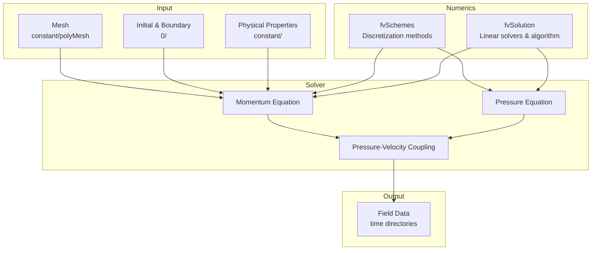

# การนำ OpenFOAM ไปใช้งาน

เมื่อเราเข้าใจสมการควบคุม (Navier-Stokes) และการแบ่ง mesh แล้ว คำถามถัดไปคือ: **OpenFOAM แปลงคณิตศาสตร์เหล่านี้เป็นโค้ดอย่างไร?**

> **ทำไมบทนี้สำคัญมาก?**
> - เข้าใจ **fvm:: vs fvc::** → เลือก implicit/explicit ถูก
> - เข้าใจ **SIMPLE/PISO/PIMPLE** → เลือก algorithm ถูก
> - เข้าใจ **fvSchemes/fvSolution** → ตั้งค่าได้ถูกต้อง

---

## จากสมการสู่ Matrix

Finite Volume Method (FVM) ที่ OpenFOAM ใช้นั้น มีหลักการสำคัญคือ: **อะไรก็ตามที่ไหลเข้าเซลล์หนึ่ง ต้องไหลออกจากเซลล์ข้างเคียง** (conservation property)

กระบวนการแปลงสมการมีขั้นตอนดังนี้:

1. **แบ่งพื้นที่เป็น Control Volumes** — แต่ละเซลล์ใน mesh คือ control volume หนึ่งอัน โดยเก็บค่าตัวแปร (เช่น U, p) ไว้ที่จุดกลางเซลล์

2. **Integrate สมการบน Volume** — เรานำสมการเชิงอนุพันธ์ไป integrate บนแต่ละ control volume

3. **ใช้ Gauss Theorem แปลง Volume Integral เป็น Surface Integral** — เทอม ∇·F กลายเป็น flux ที่ไหลผ่านผิวหน้าเซลล์

4. **Approximate Fluxes ที่ผิวหน้า** — ใช้ interpolation schemes ต่างๆ ประมาณค่าที่ face จาก cell-centered values

5. **สร้างระบบ Linear Equations** — ความสัมพันธ์ระหว่างเซลล์กลายเป็น matrix equation: **[A]{x} = {b}**

ยกตัวอย่างสมการ diffusion อย่างง่าย: ∇²T = 0

สำหรับเซลล์ P ที่มีเซลล์ข้างเคียง N, S, E, W สมการหลัง discretization จะมีรูป:

```
aP·TP = aE·TE + aW·TW + aN·TN + aS·TS
```

เมื่อเขียนสำหรับทุกเซลล์รวมกัน จะได้ sparse matrix ขนาดใหญ่ที่ต้องแก้ด้วย iterative methods

---

## fvm:: และ fvc:: — สองวิธีคิดเรื่องการ Discretization

ใน OpenFOAM คุณจะเห็น namespace สองตัวที่ใช้บ่อยมาก: `fvm::` และ `fvc::` ความแตกต่างนี้เป็นหัวใจสำคัญที่ต้องเข้าใจ

**`fvm::` (Finite Volume Method)** สร้าง matrix coefficients เพื่อใส่ในฝั่งซ้ายของสมการ [A]{x} = {b} นี่คือการทำ **implicit discretization** — ค่าที่จะแก้หา (unknown) อยู่ในสมการ ต้องแก้ matrix จึงจะได้คำตอบ

**`fvc::` (Finite Volume Calculus)** คำนวณค่าตรงๆ จาก field ที่มีอยู่แล้ว แล้วใส่เป็น source term ในฝั่งขวา {b} นี่คือ **explicit discretization** — ใช้ค่าจาก time step ก่อนหน้า คำนวณได้ทันทีไม่ต้องแก้ matrix

ทำไมต้องมีทั้งสองแบบ? เพราะแต่ละแบบมีจุดเด่นต่างกัน:

- **Implicit (fvm::)** เสถียรกว่า สามารถใช้ time step ใหญ่ได้ แต่ต้องแก้ matrix ทำให้ช้า
- **Explicit (fvc::)** เร็วกว่า แต่มี stability limit (Courant number constraint)

ในทางปฏิบัติ เราใช้ทั้งสองแบบผสมกันตามความเหมาะสม ลองดูตัวอย่างสมการโมเมนตัม:

```cpp
fvVectorMatrix UEqn
(
    fvm::ddt(U)           // implicit: ∂U/∂t
  + fvm::div(phi, U)      // implicit: convection term
    ==
    fvm::laplacian(nu, U) // implicit: diffusion term
  - fvc::grad(p)          // explicit: pressure gradient
);
```

สังเกตว่า `-fvc::grad(p)` ใช้ explicit เพราะ pressure p ยังไม่รู้ค่าจริงใน iteration นี้ เราใช้ค่าจาก iteration ก่อนหน้าไปก่อน แล้วจะแก้ไขในขั้นตอน pressure correction ทีหลัง

Operators ที่ใช้บ่อย:

| Operator | สมการ | ความหมาย |
|----------|-------|----------|
| `ddt(φ)` | ∂φ/∂t | อนุพันธ์เทียบเวลา |
| `div(F, φ)` | ∇·(Fφ) | Convection (การพา) |
| `laplacian(Γ, φ)` | ∇·(Γ∇φ) | Diffusion (การแพร่) |
| `grad(p)` | ∇p | Gradient |
| `Sp(S, φ)` | S·φ | Source term |

---

## สมการโมเมนตัม: Compressible vs Incompressible

OpenFOAM แยก solvers ออกเป็นสองกลุ่มใหญ่ตามการจัดการกับความหนาแน่น:

**Compressible Flow** — ความหนาแน่น ρ เปลี่ยนแปลงได้ ใช้กับการไหลความเร็วสูง (Mach > 0.3) หรือกระบวนการที่มีการเปลี่ยนแปลงอุณหภูมิมาก

```cpp
fvVectorMatrix UEqn
(
    fvm::ddt(rho, U)          // ∂(ρU)/∂t
  + fvm::div(rhoPhi, U)       // ∇·(ρUU) — ใช้ mass flux
    ==
    fvm::laplacian(muEff, U)  // ∇·(μ∇U)
);
```

**Incompressible Flow** — ρ คงที่ สมการถูกหารด้วย ρ ทำให้ง่ายขึ้น ใช้กับน้ำหรืออากาศความเร็วต่ำ

```cpp
fvVectorMatrix UEqn
(
    fvm::ddt(U)              // ∂U/∂t — ไม่มี ρ
  + fvm::div(phi, U)         // ∇·(UU) — ใช้ volumetric flux
    ==
    fvm::laplacian(nu, U)    // ∇·(ν∇U) — kinematic viscosity
);
```

ข้อแตกต่างสำคัญ: ใน incompressible flow ความดันที่เราแก้หาคือ **kinematic pressure** (p/ρ) ซึ่งมีหน่วยเป็น m²/s² ไม่ใช่ Pa แบบ absolute pressure

---

## ปัญหา Pressure-Velocity Coupling

ใน incompressible flow มีปัญหาพิเศษ: **ไม่มีสมการวิวัฒนาการของ pressure โดยตรง**

สมการโมเมนตัมเกี่ยวข้องกับ U และ p แต่สมการความต่อเนื่อง (∇·U = 0) เป็นแค่ constraint ไม่ได้บอกว่า p มีค่าเท่าไหร่ นี่คือที่มาของ **pressure equation**

หลักการทำงาน:

1. **Predictor Step** — แก้สมการโมเมนตัมโดยใช้ pressure เก่า ได้ velocity ที่ทำนายไว้ U* แต่ U* นี้อาจไม่สอดคล้องกับ mass conservation (∇·U* ≠ 0)

2. **Pressure Equation** — นำ momentum equation มา rearrange แล้วแทนลงใน continuity equation ได้สมการ Poisson สำหรับ pressure: ∇²p = ∇·H

3. **Corrector Step** — เมื่อได้ p ใหม่แล้ว แก้ไข velocity: U = U* - (∇p)/A ทำให้ ∇·U ≈ 0 ตาม mass conservation

```cpp
// Pressure equation
fvScalarMatrix pEqn
(
    fvm::laplacian(rAUf, p) == fvc::div(phiHbyA)
);
pEqn.solve();

// Correct velocity
U = HbyA - rAU * fvc::grad(p);
```

เนื่องจากสมการ Poisson เป็น elliptic type ข้อมูลจากทุกจุดใน domain มีผลต่อคำตอบทุกที่ ทำให้การแก้สมการนี้เป็นขั้นตอนที่ใช้เวลานานที่สุดใน simulation ดังนั้นการเลือก linear solver ที่ดี (เช่น GAMG) จึงสำคัญมาก

---

## SIMPLE, PISO, และ PIMPLE Algorithms

ทั้งสาม algorithms นี้ใช้หลักการ pressure-velocity coupling เดียวกัน แต่ต่างกันที่โครงสร้างการ iterate:

### SIMPLE (Steady-State)

Semi-Implicit Method for Pressure-Linked Equations ออกแบบมาสำหรับปัญหา **steady-state** ที่เราไม่สนใจการเปลี่ยนแปลงตามเวลา แต่สนใจคำตอบสุดท้ายเท่านั้น

```
วนซ้ำจนกว่า residuals จะต่ำพอ:
    1. Solve momentum equation (พร้อม under-relaxation)
    2. Solve pressure equation
    3. Correct velocity
    4. Update turbulence
```

**Under-relaxation** จำเป็นใน SIMPLE เพราะเราใช้ค่าจาก iteration ก่อนหน้าในหลายจุด ถ้าไม่ชะลอการเปลี่ยนแปลง solution จะ oscillate หรือ diverge

การตั้งค่าทั่วไป:
```cpp
SIMPLE
{
    residualControl { p 1e-4; U 1e-4; }
    
    relaxationFactors
    {
        p       0.3;    // ต้อง relax มาก
        U       0.7;
    }
}
```

### PISO (Transient, Small Time Step)

Pressure Implicit with Splitting of Operators ใช้สำหรับ **transient simulation** ที่ต้องการ time accuracy สูง

```
ทุก time step:
    Inner loop (2-3 ครั้ง):
        1. Solve momentum
        2. Solve pressure
        3. Correct velocity
```

PISO ไม่ต้อง under-relaxation เพราะ time derivative term ทำหน้าที่เป็น **pseudo-relaxation** อยู่แล้ว แต่ข้อจำกัดคือต้องใช้ time step เล็กมาก (Courant number < 1)

```cpp
PISO
{
    nCorrectors     2;
    nNonOrthogonalCorrectors 1;
}
```

### PIMPLE (Best of Both Worlds)

PIMPLE รวมข้อดีของทั้งสอง: **outer loop แบบ SIMPLE + inner loop แบบ PISO**

```
ทุก time step:
    Outer loop (SIMPLE-like):
        Inner loop (PISO-like):
            1. Solve momentum
            2. Solve pressure (หลายรอบ)
            3. Correct velocity
```

ข้อดีคือสามารถใช้ time step ใหญ่กว่า PISO ได้ (Courant > 1) เหมาะสำหรับ simulation ระยะยาวที่ยอมเสีย temporal accuracy บ้าง นี่คือ algorithm ที่แนะนำสำหรับงาน transient ส่วนใหญ่

```cpp
PIMPLE
{
    nOuterCorrectors   2;      // ถ้า > 1 ต้องมี relaxation
    nCorrectors        2;
    
    relaxationFactors
    {
        U       0.7;
        p       0.3;
    }
}
```

**กฎง่ายๆ ในการเลือก:**
- Steady-state → SIMPLE
- Transient, Δt เล็ก (Co < 1) → PISO หรือ PIMPLE (nOuter=1)
- Transient, Δt ใหญ่ (Co > 1) → PIMPLE (nOuter ≥ 2)

---

## Field Types

OpenFOAM จัดการข้อมูลเป็น **fields** ที่เก็บค่าบน mesh โดยมีสองตำแหน่งหลัก:

**Volume Fields** — เก็บค่าที่ **จุดกลางเซลล์** (cell-centered)

- `volScalarField` — scalar เช่น p (pressure), T (temperature), k (turbulent kinetic energy)
- `volVectorField` — vector เช่น U (velocity)
- `volTensorField` — tensor เช่น stress tensor

**Surface Fields** — เก็บค่าที่ **ผิวหน้าเซลล์** (face-centered)

- `surfaceScalarField` — เช่น phi (volumetric flux)
- `surfaceVectorField` — เช่น Sf (face area vector)

การประกาศ field:

```cpp
volScalarField p
(
    IOobject
    (
        "p",                    // ชื่อ field
        runTime.timeName(),     // time directory (เช่น "0")
        mesh,                   // mesh object
        IOobject::MUST_READ     // อ่านจากไฟล์
    ),
    mesh
);

volVectorField U
(
    IOobject("U", runTime.timeName(), mesh, IOobject::MUST_READ),
    mesh
);
```

### Dimensional Checking

OpenFOAM มีระบบตรวจสอบหน่วยอัตโนมัติ หน่วยถูกแทนด้วย 7 ตัวเลข: `[mass length time temperature moles current luminosity]`

| ปริมาณ | หน่วย SI | dimensions |
|--------|----------|------------|
| Velocity | m/s | [0 1 -1 0 0 0 0] |
| Pressure (absolute) | Pa | [1 -1 -2 0 0 0 0] |
| Kinematic pressure | m²/s² | [0 2 -2 0 0 0 0] |
| Kinematic viscosity | m²/s | [0 2 -1 0 0 0 0] |

ถ้าคุณเขียนสมการที่หน่วยไม่ลงตัว OpenFOAM จะ error ทันที — นี่คือ safety net ที่ช่วยหาบั๊กได้เยอะมาก

---

## fvSchemes: การเลือกวิธี Discretization

ไฟล์ `system/fvSchemes` กำหนดว่าจะ discretize แต่ละเทอมในสมการอย่างไร:

```cpp
ddtSchemes          // ∂/∂t
{
    default         Euler;          // 1st order, stable
    // default      backward;       // 2nd order, accurate
}

gradSchemes         // ∇φ
{
    default         Gauss linear;   // 2nd order
}

divSchemes          // ∇·(Fφ)
{
    default         none;           // บังคับให้กำหนดทุกเทอม
    div(phi,U)      Gauss linearUpwind grad(U);  // 2nd order, bounded
    div(phi,k)      Gauss upwind;   // 1st order สำหรับ turbulence
}

laplacianSchemes    // ∇·(Γ∇φ)
{
    default         Gauss linear corrected;
}
```

**หลักการเลือก schemes:**

สำหรับ **convection (div schemes)**:
- `upwind` — 1st order, stable มาก แต่มี numerical diffusion เริ่มต้นด้วยตัวนี้เสมอ
- `linearUpwind` — 2nd order, bounded ใช้หลังจาก solution ลู่เข้าแล้ว
- `linear` — 2nd order, unbounded ระวัง oscillations
- `TVD schemes` (vanLeer, limitedLinear) — bounded, เหมาะกับ high-gradient flows

สำหรับ **time (ddt schemes)**:
- `Euler` — 1st order, stable เริ่มต้นตัวนี้
- `backward` — 2nd order ใช้เมื่อต้องการ temporal accuracy
- `CrankNicolson` — 2nd order, อาจมี oscillations

---

## fvSolution: การตั้งค่า Linear Solvers

ไฟล์ `system/fvSolution` กำหนดวิธีแก้ matrix equation:

```cpp
solvers
{
    p
    {
        solver          GAMG;           // Multigrid — แนะนำสำหรับ pressure
        tolerance       1e-06;
        relTol          0.01;           // 1% ของ initial residual
        smoother        GaussSeidel;
    }
    
    pFinal
    {
        $p;                             // คัดลอกจาก p
        relTol          0;              // แก้จน residual < tolerance
    }
    
    U
    {
        solver          smoothSolver;
        smoother        GaussSeidel;
        tolerance       1e-05;
        relTol          0.1;
    }
    
    "(k|epsilon|omega)"                 // Turbulence fields
    {
        solver          smoothSolver;
        smoother        symGaussSeidel;
        tolerance       1e-06;
        relTol          0.1;
    }
}
```

**Linear solvers ที่ใช้บ่อย:**

- **GAMG** — Geometric-Algebraic Multi-Grid เร็วมากสำหรับ elliptic equations (pressure) แนะนำเป็น default สำหรับ p
- **smoothSolver** — Simple iterative solver ใช้กับ U, k, ε
- **PBiCGStab** — Preconditioned Bi-Conjugate Gradient Stabilized สำหรับ non-symmetric matrices
- **PCG** — Preconditioned Conjugate Gradient สำหรับ symmetric positive definite

---

## Boundary Conditions ที่สอดคล้องกัน

กฎสำคัญที่ต้องจำ: **boundary ที่กำหนด velocity ต้องปล่อย pressure ลอย และในทางกลับกัน**

```cpp
inlet
{
    U:  fixedValue;    value uniform (10 0 0);   // กำหนด velocity
    p:  zeroGradient;                             // ปล่อย pressure
}

outlet
{
    U:  zeroGradient;                             // ปล่อย velocity ไหลออก
    p:  fixedValue;    value uniform 0;           // reference pressure
}

wall
{
    U:  noSlip;                                   // no-slip condition
    p:  zeroGradient;
}
```

ถ้าคุณใส่ fixedValue ทั้ง U และ p ที่ boundary เดียวกัน ระบบจะ over-specified และ solution จะไม่ถูกต้อง

---

## Time Step และ Courant Number

Courant number (Co) คือ ratio ระหว่าง distance ที่ fluid เดินทางใน time step หนึ่ง กับ cell size:

$$\text{Co} = \frac{|u| \cdot \Delta t}{\Delta x}$$

**ความหมายทางกายภาพ:** Co = 1 หมายความว่า fluid เดินทางข้าม 1 cell ใน 1 time step

**Guidelines:**
- Explicit schemes ต้องการ **Co < 1** (CFL condition)
- Implicit schemes ควรใช้ **Co < 5-10** เพื่อ stability และ accuracy
- ถ้าต้องการ resolve transient dynamics ใช้ **Co < 0.5**

การตั้งค่าใน `controlDict`:

```cpp
deltaT          0.001;
adjustTimeStep  yes;
maxCo           0.9;
maxDeltaT       1;
```

---

## เมื่อ Simulation ไม่ลู่เข้า (Divergence)

ปัญหาที่พบบ่อยที่สุดคือ simulation diverge ลองแก้ไขตามลำดับนี้:

1. **ลด Time Step** — ลด `maxCo` เหลือ 0.5 หรือน้อยกว่า

2. **เปลี่ยนเป็น upwind** — ใช้ 1st order scheme สำหรับ convection ก่อน

3. **ตรวจสอบ Mesh** — รัน `checkMesh` ดู quality metrics โดยเฉพาะ non-orthogonality และ skewness

4. **เพิ่ม Relaxation** — ลด relaxation factor (เช่น p จาก 0.3 เป็น 0.2) ทำให้ solution เปลี่ยนช้าลง

5. **ตรวจสอบ Boundary Conditions** — ให้แน่ใจว่า U-p สอดคล้องกัน

6. **Initialize ด้วย potentialFoam** — สร้าง initial velocity field ที่ดีกว่า uniform

---

## ภาพรวมการทำงานของ OpenFOAM



---

## 🧠 Concept Check

<details>
<summary><b>1. controlDict, fvSchemes, และ fvSolution มีหน้าที่ต่างกันอย่างไร?</b></summary>

| ไฟล์ | หน้าที่ |
|------|--------|
| **controlDict** | ควบคุมการรัน: เวลา, timestep, output |
| **fvSchemes** | วิธี Discretization: grad, div, laplacian |
| **fvSolution** | วิธีแก้สมการ: solver, tolerances, relaxation |

</details>

<details>
<summary><b>2. PISO และ SIMPLE แตกต่างกันอย่างไร?</b></summary>

| Algorithm | ลักษณะ | ใช้เมื่อ |
|-----------|--------|---------|
| **SIMPLE** | Steady-state, ใช้ relaxation | การไหลคงตัว |
| **PISO** | Transient, predictor-corrector | การไหลไม่คงตัว |
| **PIMPLE** | ผสมทั้งสอง | Transient + sub-cycling |

</details>

---

## 📖 เอกสารที่เกี่ยวข้อง

- **บทก่อนหน้า:** [04_Dimensionless_Numbers.md](04_Dimensionless_Numbers.md) — เลขไร้มิติในงาน CFD
- **ภาพรวม:** [00_Overview.md](00_Overview.md) — ภาพรวมของหัวข้อ Governing Equations
- [← 00_Overview.md](00_Overview.md) — ภาพรวมของหัวข้อ Governing Equations