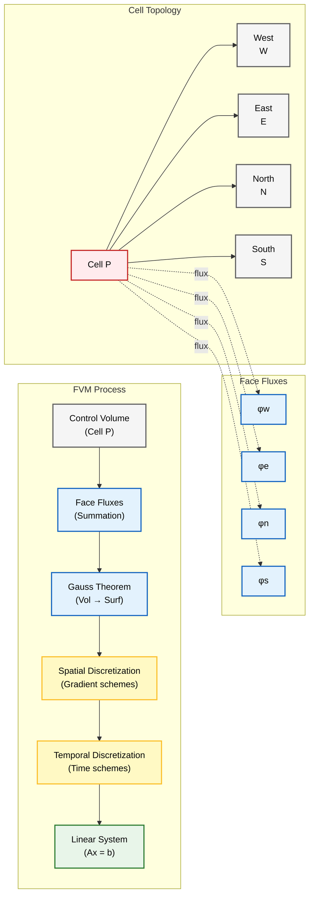
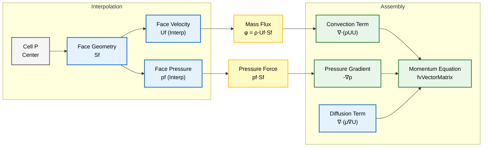
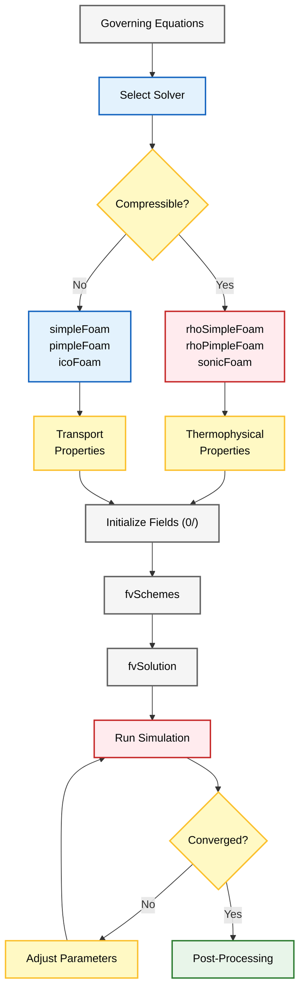

# การนำ OpenFOAM ไปใช้งาน

## OpenFOAM "มอง" สมการเหล่านี้อย่างไร

OpenFOAM ใช้ **กรอบการทำงานการประมาณค่าแบบ Finite Volume Discretization** ที่ซับซ้อน ซึ่งแปลงสมการเชิงอนุพันธ์ย่อยแบบต่อเนื่องให้เป็นระบบสมการพีชคณิตแบบไม่ต่อเนื่อง

กระบวนการแปลงนี้เกี่ยวข้องกับ:
- **การประมาณค่าเชิงพื้นที่** (spatial discretization) โดยใช้ทฤษฎีบทของเกาส์
- **รูปแบบการอินทิเกรตเชิงเวลา** (temporal integration schemes)
- **วิธีการแก้ปัญหาแบบวนซ้ำ** (iterative solution methods)



> **Figure 1:** ขั้นตอนการทำงานของการ Discretization ด้วยวิธี Finite Volume (FVM) ใน OpenFOAM แสดงการแปลงสมการควบคุมแบบต่อเนื่องให้เป็นระบบสมการเชิงเส้นแบบไม่ต่อเนื่องผ่านการอินทิเกรตปริมาตรควบคุมและทฤษฎีบทของเกาส์


โดยพื้นฐานแล้ว OpenFOAM ใช้ **Operator Overloading** และ **Template Metaprogramming** เพื่อสร้างนิพจน์ C++ ที่คล้ายคลึงกับสมการทางคณิตศาสตร์

---

## การนำ Navier-Stokes แบบ Compressible ไปใช้งาน

### สมการโมเมนตัมแบบ Compressible

$$\rho \frac{\partial \mathbf{u}}{\partial t} + \rho (\mathbf{u} \cdot \nabla) \mathbf{u} = -\nabla p + \mu \nabla^2 \mathbf{u} + \mathbf{f}$$

**คำอธิบายเทอมสำคัญ**:
- `fvm::` - **Implicit terms** (ช่วยในแนวทแยงของเมทริกซ์สำหรับความเสถียรเชิงตัวเลข)
- `fvc::` - **Explicit terms** (ถือเป็น Source Term)
- `rhoPhi` - **Mass Flux** $\rho \mathbf{u} \cdot \mathbf{S}_f$ ที่หน้า Cell
- `muEff` - **Effective Viscosity** $\mu_{eff} = \mu + \mu_t$

📂 **Source:** `.applications/solvers/multiphase/multiphaseEulerFoam/phaseSystems/PhaseSystems/MomentumTransferPhaseSystem/MomentumTransferPhaseSystem.C`

```cpp
// Momentum equation implementation in OpenFOAM
// Build finite volume matrix for momentum conservation equation
fvVectorMatrix UEqn
(
    // Temporal derivative term: ∂(ρU)/∂t
    // fvm::ddt = finite volume method::time derivative (implicit treatment)
    fvm::ddt(rho, U)
    
    // Convection term: ∇•(ρUU)  
    // fvm::div = finite volume method::divergence (implicit treatment)
    // rhoPhi = mass flux field (ρU) at cell faces
    + fvm::div(rhoPhi, U)
    
    ==
    
    // Diffusion term: ∇•(μ∇U)
    // fvm::laplacian = finite volume method::Laplacian operator (implicit)
    // muEff = effective viscosity including laminar and turbulent contributions
    fvm::laplacian(muEff, U)
    
    // Deviatoric stress tensor term (explicit treatment)
    // fvc::div = finite volume calculus::divergence (explicit treatment)
    - fvc::div(rhoPhi, muEff*dev2(T(fvc::grad(U))))
);

// Apply under-relaxation for numerical stability
// Helps convergence by blending old and new solutions
UEqn.relax();

// Solve momentum equation with pressure gradient as source term
// -fvc::grad(p) = explicit pressure gradient force
solve(UEqn == -fvc::grad(p));
```

**คำอธิบายเพิ่มเติม:**
- **Source**: `fvm::ddt()`, `fvm::div()`, `fvm::laplacian()` ใช้สำหรับเทอมที่ต้องการ Implicit treatment ซึ่งจะถูกเพิ่มเข้าไปในเมทริกซ์สัมประสิทธิ์ (coefficient matrix) ช่วยเพิ่มความเสถียรของการคำนวณ
- **Explanation**: `fvc::grad(p)` ถูกจัดการแบบ Explicit เนื่องจากความดันยังไม่รู้ค่าใน iteration ปัจจุบัน จึงใช้ค่าจาก iteration ก่อนหน้า
- **Key Concepts**: Under-relaxation (`UEqn.relax()`) ช่วยป้องกันการ oscillate ของคำตอบ โดยผสมผสานค่าเก่าและค่าใหม่ด้วยสัมประสิทธิ์การผ่อนคลาย

**ขั้นตอนการประมวลผล**:
1. **Interpolation** ของ Mass Flux โดยใช้ Scheme (Upwind, Linear, High-order)
2. **Relaxation** สำหรับความเสถียรของการลู่เข้า
3. **Solve** สมการโมเมนตัมโดยใช้เมทริกซ์ solver



> **Figure 2:** รายละเอียดขั้นตอนการ Discretization แบบ Finite Volume สำหรับสมการโมเมนตัม แสดงวิธีการประมาณค่าความเร็วและความดันที่หน้าเซลล์ (face interpolation) เพื่อประกอบเป็นพจน์การพา (convection), การแพร่ (diffusion) และพจน์แหล่งกำเนิด (source terms) ในระบบเมทริกซ์


---

## การทำให้ง่ายขึ้นสำหรับ Incompressible Flow

สำหรับ **Incompressible Flow Solver** เช่น `simpleFoam` (Steady-State) หรือ `icoFoam` (Transient) สมการควบคุมจะถูกทำให้ง่ายขึ้นอย่างมากเนื่องจานสมมติฐานความหนาแน่นคงที่ $\rho = \text{constant}$

**ข้อดีของการทำให้ง่ายขึ้น**:
- ✅ ลดความต้องการหน่วยความจำ (ไม่จำเป็นต้องเก็บ Density Field)
- ✅ ปรับปรุง Numerical Stability (สัมประสิทธิ์คงที่)
- ✅ การลู่เข้าที่เร็วขึ้นเนื่องจากการแยกผลกระทบทางอุณหพลศาสตร์

สิ่งนี้ทำให้เกิด **สูตร Kinematic**:
- **Kinematic Pressure**: $p_k = p/\rho$
- **Kinematic Viscosity**: $\nu = \mu/\rho`

📂 **Source:** `.applications/solvers/multiphase/multiphaseInterFoam/multiphaseMixture/multiphaseMixture.C`

```cpp
// Incompressible momentum equation implementation
// Uses kinematic formulation (divide by constant density)
fvVectorMatrix UEqn
(
    // Temporal derivative: ∂U/∂t (density removed)
    // For incompressible flow, density is constant and cancelled out
    fvm::ddt(U)
    
    // Convection term: ∇•(UU) using kinematic mass flux
    // phi = volumetric flux (U·Sf) instead of mass flux (ρU·Sf)
    + fvm::div(phi, U)
    
    ==
    
    // Diffusion term: ∇•(ν∇U) using kinematic viscosity
    // nu = mu/rho (m²/s) instead of dynamic viscosity (Pa·s)
    fvm::laplacian(nu, U)
    
    // Kinematic pressure gradient: -∇(p/ρ)
    // Pressure is divided by constant density
    - fvc::grad(p)
);
```

**คำอธิบายเพิ่มเติม:**
- **Source**: Incompressible solvers ใน OpenFOAM ใช้ kinematic formulation ซึ่งความหนาแน่นคงที่ถูกหารออกจากสมการทั้งหมด
- **Explanation**: การลบความหนาแน่นออกทำให้สมการกระชับขึ้นและลดปริมาณการคำนวณ แต่ต้องระวังเรื่องหน่วยของความดัน (Pa → m²/s²)
- **Key Concepts**: Kinematic viscosity (ν) มีหน่วย m²/s และ kinematic pressure มีหน่วย m²/s² (เทียบเท่ากับ specific energy)

**ความสัมพันธ์เชิงคณิตศาสตร์**:
$$\nabla \cdot \mathbf{u} = 0 \quad \text{(Incompressible Continuity Equation)}$$

Velocity Field $\mathbf{u}$ เป็นไปตาม **Incompressible Continuity Equation** โดยตรง โดยไม่มี Source Term เพิ่มเติม

> [!INFO] **การไหลแบบ Incompressible**
> สำหรับการไหลแบบ Incompressible ความเร็วเสียงไม่มีผลต่อพลศาสตร์การไหล สมการจะลดรูปลงเหลือเพียง Continuity และ Momentum Equations เท่านั้น

---

## Pressure-Velocity Coupling สำหรับ Incompressible Flow

- **Pressure Gradient** → Source Term ในสมการโมเมนตัม
- **Pressure Field** → Lagrange Multiplier บังคับใช้ Divergence-Free Constraint

---

## สมการความต่อเนื่อง (สมการความดัน)

ใน Incompressible Solver **การอนุรักษ์มวลจะถูกบังคับใช้โดยอ้อมผ่านสมการความดัน** ซึ่งได้มาจาก Continuity Constraint และสมการโมเมนตัม

**เหตุผลที่ต้องใช้วิธีทางอ้อม**:
- Incompressible Flow ไม่มีสมการการวิวัฒนาการความดันที่ชัดเจน
- Pressure Field ทำหน้าที่เป็น **Lagrange Multiplier** บังคับใช้ **Divergence-Free Constraint**
- การแทนที่ Predicted Velocity Field ลงในสมการความต่อเนื่อง → สมการ **Poisson สำหรับความดัน**

📂 **Source:** `.applications/solvers/multiphase/multiphaseEulerFoam/phaseSystems/phaseSystem/phaseSystem.H`

```cpp
// Pressure equation for incompressible flow
// Enforces mass conservation through pressure correction
fvScalarMatrix pEqn
(
    // Laplacian of pressure: ∇•(1/Ap ∇p)
    // rAUf = reciprocal of diagonal coefficient matrix (1/Ap)
    // interpolated from cell centers to cell faces
    fvm::laplacian(rAUf, p)
    
    ==
    
    // Divergence of predicted flux field: ∇•H
    // phiHbyA = H/A where H contains explicit momentum terms
    // This represents the velocity field that doesn't satisfy continuity
    fvc::div(phiHbyA)
);
```

**คำอธิบายเพิ่มเติม:**
- **Source**: สมการความดันใน OpenFOAM มาจากการแทนค่า intermediate velocity ลงใน continuity equation $\nabla \cdot \mathbf{u} = 0$
- **Explanation**: `rAUf` คือส่วนกลับของสัมประสิทธิ์ในแนวทแยงของเมทริกซ์โมเมนตัม (1/Ap) ซึ่งถูก interpolate ไปยัง face centers
- **Key Concepts**: Poisson equation สำหรับความดัน $\nabla^2 p = \nabla \cdot \mathbf{H}$ เป็นสมการเชิงอนุพันธ์ย่อยแบบ Elliptic ซึ่งต้องใช้ iterative solver ในการแก้

**คำอธิบายเทอมสำคัญ**:
- `rAUf` - ส่วนกลับของ Diagonal Coefficient Matrix จากสมการโมเมนตัม (interpolate ไปยัง Face Center)
- `phiHbyA` - Predicted Flux Field โดยอิงจาก Intermediate Velocity Field
- `fvm::laplacian(rAUf, p)` - Discrete ของ $\nabla^2 p$
- `fvc::div(phiHbyA)` - Discrete ของ $\nabla \cdot \mathbf{H}$

**รูปแบบเชิงคณิตศาสตร์**:
$$\nabla^2 p = \nabla \cdot \mathbf{H}$$

โดยที่ $\mathbf{H}$ ประกอบด้วยส่วน Explicit ของสมการโมเมนตัมที่ไม่รวม Pressure Gradient

---

## Pressure-Velocity Coupling Algorithms

| Algorithm | Full Name | Type | Use Case | Characteristics |
|-----------|-----------|------|----------|------------------|
| **SIMPLE** | Semi-Implicit Method for Pressure-Linked Equations | Steady-State | Steady flows | Requires under-relaxation for stability |
| **PISO** | Pressure-Implicit with Splitting of Operators | Transient | Time-dependent flows | Multiple pressure corrections per time step |
| **PIMPLE** | Combined SIMPLE-PISO | Hybrid | Large time steps, transient | Combines stability of SIMPLE with accuracy of PISO |

**ขั้นตอนการทำงาน (Algorithm Flow)**:
```
1. Solve Momentum Equation with Guessed Pressure Field
2. Solve Pressure Equation to enforce Continuity
3. Correct Velocity and Pressure Fields
4. Repeat until Convergence (for Steady-State)
   OR until sufficient Pressure Corrections (for Transient)
```


```mermaid
graph TD
A["Init Pressure<br/>p*"]:::context --> B["Solve Momentum<br/>U*"]:::implicit
B --> C["Solve Pressure<br/>p'"]:::explicit
C --> D["Correct Velocity<br/>U = U* + U'"]:::implicit
D --> E["Correct Pressure<br/>p = p* + αp·p'"]:::implicit
E --> F{"Algorithm?"}:::explicit

F -->|SIMPLE| G{"Converged?"}:::explicit
F -->|PISO| H{"Correct Loop<br/>(nCorrectors)"}:::explicit
F -->|PIMPLE| I{"Large Δt?"}:::explicit

G -->|No| J["Under-Relax<br/>(αU, αp)"]:::volatile
J --> B
G -->|Yes| K["Next Time Step"]:::success

H -->|Continue| C
H -->|Done| L["Next Time Step"]:::success

I -->|Yes<br/>(SIMPLE mode)| M["Apply Relaxation"]:::volatile
I -->|No<br/>(PISO mode)| N["No Relaxation"]:::implicit

M --> O{"Outer Loop"}:::explicit
N --> O

O -->|Iterate| B
O -->|Done| P["Next Time Step"]:::success

classDef context fill:#f5f5f5,stroke:#616161,stroke-width:2px,color:#000;
classDef implicit fill:#e3f2fd,stroke:#1565c0,stroke-width:2px,color:#000;
classDef explicit fill:#fff9c4,stroke:#fbc02d,stroke-width:2px,color:#000;
classDef volatile fill:#ffebee,stroke:#c62828,stroke-width:2px,color:#000;
classDef success fill:#e8f5e9,stroke:#2e7d32,stroke-width:2px,color:#000;
```
> **Figure 3:** แผนผังลำดับขั้นตอนรวมสำหรับอัลกอริทึมการเชื่อมโยงความดันและความเร็ว (SIMPLE, PISO, PIMPLE) แสดงลำดับการวนซ้ำของการทำนายโมเมนตัม การแก้ไขความดัน และการอัปเดตฟิลด์สำหรับ Solver ทั้งแบบสภาวะคงตัวและแบบไม่คงที่


### ความแตกต่างระหว่าง Algorithms

| Feature | SIMPLE | PISO | PIMPLE |
|---------|--------|------|---------|
| **Temporal Accuracy** | First-order | Second-order | Configurable |
| **Number of Corrections** | Single per iteration | Multiple per time step | Multiple per time step |
| **Stability** | High (with relaxation) | Moderate | High |
| **Computational Cost** | Low | High | Moderate-High |
| **Best For** | Steady-state problems | Accurate transient solutions | Large time step simulations |

---

## การแปลงสมการการขนส่ทั่วไป (General Transport Equation)

### รูปแบบสมการขนส่ง

สมการการขนส่งทั่วไป (general transport equation) สำหรับปริมาณ $\phi$ ใดๆ:

$$\frac{\partial (\rho \phi)}{\partial t} + \nabla \cdot (\rho \phi \mathbf{u}) = \nabla \cdot (\Gamma \nabla \phi) + S_\phi$$

โดยที่:
- $\rho$ = ความหนาแน่น (density)
- $\phi$ = ปริมาณที่ถูกขนส่ง (transported quantity)
- $\mathbf{u}$ = เวกเตอร์ความเร็ว (velocity vector)
- $\Gamma$ = สัมประสิทธิ์การแพร่ (diffusion coefficient)
- $S_\phi$ = source term

### การนำไปใช้ใน OpenFOAM

📂 **Source:** `.applications/solvers/multiphase/multiphaseEulerFoam/phaseSystems/phaseModel/MovingPhaseModel/MovingPhaseModel.C`

```cpp
// General transport equation implementation
// Applicable to any scalar quantity (temperature, species, turbulence, etc.)
fvScalarMatrix phiEqn
(
    // Temporal derivative: ∂(ρφ)/∂t
    // Unsteady term - rate of change of transported quantity
    fvm::ddt(rho, phi)
    
    // Convection term: ∇·(ρφu)
    // Transport due to fluid motion (implicit for stability)
    + fvm::div(rhoPhi, phi)
    
    ==
    
    // Diffusion term: ∇·(Γ∇φ)
    // Transport due to concentration/temperature gradients
    fvm::laplacian(Gamma, phi)
    
    // Source terms (explicit treatment)
    // Su = explicit source, Sp*phi = linearized implicit source
    + Su
);
```

**คำอธิบายเพิ่มเติม:**
- **Source**: รูปแบบสมการขนส่งทั่วไปนี้ถูกใช้ใน OpenFOAM สำหรับหลายประเภทของ Solver ทั้ง incompressible และ compressible flows
- **Explanation**: `fvm::` operators สร้างเมทริกซ์สัมประสิทธิ์โดยอัตโนมัติ ซึ่งจะถูกแก้ด้วย linear solvers เช่น GAMG, PBiCGStab
- **Key Concepts**: Implicit treatment ของ convection และ diffusion terms ช่วยเพิ่มความเสถียรของการคำนวณ โดยแลกกับความซับซ้อนในการแก้เมทริกซ์

### การแม็ปกับ OpenFOAM Operators

| OpenFOAM Function | Mathematical Operator | ความหมาย |
|------------------|---------------------|-----------|
| `fvm::ddt(rho, phi)` | $\frac{\partial (\rho \phi)}{\partial t}$ | Temporal derivative |
| `fvm::div(rhoPhi, phi)` | $\nabla \cdot (\rho \phi \mathbf{u})$ | Convection term |
| `fvm::laplacian(Gamma, phi)` | $\nabla \cdot (\Gamma \nabla \phi)$ | Diffusion term |
| `fvc::grad(p)` | $\nabla p$ | Gradient operator |
| `fvm::Sp(S, phi)` | $S \phi$ | Implicit source term |
| `fvc::Su(Sp, phi)` | $S_p \phi$ | Explicit source term |

> [!TIP] **Implicit vs Explicit**
> - `fvm::` = **Implicit treatment** (coefficients เข้าสู่เมทริกซ์ → stable แต่แก้ยากขึ้น)
> - `fvc::` = **Explicit treatment** (คำนวณจากค่าปัจจุบัน → เร็วกว่าแต่อาจ unstable)

---

## Field Types ใน OpenFOAM

OpenFOAM ใช้ระบบ Template-based Types สำหรับจัดการ Field ต่างๆ

### Geometric Field Types

#### Volume Fields (ค่าที่ Cell Centers)
📂 **Source:** `.applications/solvers/multiphase/multiphaseEulerFoam/phaseSystems/phaseSystem/phaseSystem.H`

```cpp
// Volume field types - data stored at cell centers
// These are the primary fields in OpenFOAM simulations

// Scalar field at cell centers (e.g., pressure, temperature)
// volScalarField = volume scalar field
volScalarField p    
(
    IOobject("p", runTime.timeName(), mesh, IOobject::MUST_READ),
    mesh
);

// Vector field at cell centers (e.g., velocity)
// volVectorField = volume vector field
volVectorField U    
(
    IOobject("U", runTime.timeName(), mesh, IOobject::MUST_READ),
    mesh
);

// Tensor field at cell centers (e.g., stress tensor, velocity gradient)
// volTensorField = volume tensor field
volTensorField tau  
(
    IOobject("tau", runTime.timeName(), mesh, IOobject::NO_READ),
    mesh,
    dimensionedTensor("zero", dimensionSet(1, -1, -2, 0, 0, 0, 0), tensor::zero)
);
```

**คำอธิบายเพิ่มเติม:**
- **Source**: GeometricFields ใน OpenFOAM ถูกนิยามด้วย Template class ที่รองรับข้อมูลหลายประเภท (scalar, vector, tensor, symmTensor)
- **Explanation**: `volScalarField`, `volVectorField`, `volTensorField` เป็น typedef ของ `GeometricField` ซึ่งเก็บข้อมูลที่ cell centers และ boundary faces
- **Key Concepts**: IOobject กำหนดวิธีการอ่าน/เขียนข้อมูล และ mesh object ถูกใช้ในการจัดการ topological information

#### Surface Fields (ค่าที่ Cell Faces)

📂 **Source:** `.applications/solvers/multiphase/multiphaseEulerFoam/phaseSystems/PhaseSystems/MomentumTransferPhaseSystem/MomentumTransferPhaseSystem.C`

```cpp
// Surface field types - data stored at cell faces
// Critical for finite volume flux calculations

// Mass flux at faces (scalar field)
// surfaceScalarField = surface scalar field
surfaceScalarField phi     
(
    IOobject("phi", runTime.timeName(), mesh, IOobject::READ_IF_PRESENT),
    fvc::interpolate(rho*U) & mesh.Sf()
);

// Face area vectors (vector field)
// surfaceVectorField = surface vector field
surfaceVectorField Sf      
(
    IOobject("Sf", runTime.timeName(), mesh, IOobject::NO_READ),
    mesh.Sf()
);
```

**คำอธิบายเพิ่มเติม:**
- **Source**: Surface fields ใช้ในการคำนวณ flux ผ่าน cell faces ซึ่งเป็นพื้นฐานของ finite volume method
- **Explanation**: `phi` (mass flux) ถูกคำนวณจาก dot product ระหว่าง interpolated velocity กับ face area vector
- **Key Concepts**: Face area vectors (`mesh.Sf()`) มีทิศทางตามปกติออกจาก cell และมีขนาดเท่ากับพื้นที่ผิวหน้าเซลล์

### การ Interpolation ระหว่าง Volume และ Surface

📂 **Source:** `.applications/solvers/multiphase/multiphaseEulerFoam/phaseSystems/PhaseSystems/MomentumTransferPhaseSystem/MomentumTransferPhaseSystem.C`

```cpp
// Interpolation schemes for transferring data between centers and faces
// Critical for computing fluxes and gradients

// Interpolate velocity from cell centers to face centers
// Uses interpolation scheme specified in fvSchemes (e.g., linear, upwind)
surfaceVectorField Uf = fvc::interpolate(U);

// Compute mass flux at faces
// fvc::interpolate(rho*U) = interpolated momentum density
// & mesh.Sf() = dot product with face area vectors
surfaceScalarField phi = fvc::interpolate(rho*U) & mesh.Sf();
```

**คำอธิบายเพิ่มเติม:**
- **Source**: Interpolation schemes ถูกกำหนดใน `fvSchemes` dictionary และถูกใช้โดย `fvc::interpolate()`
- **Explanation**: Linear interpolation ใช้ weighted average ระหว่าง cell centers ข้างเคียง ในขณะที่ upwind ใช้ค่าจาก upstream cell
- **Key Concepts**: การเลือก interpolation scheme ส่งผลต่อความแม่นยำและความเสถียรของการคำนวณ เฉพาะอย่างยิ่งสำหรับ convection-dominated flows

---

## การใช้ Gauss's Divergence Theorem

OpenFOAM ใช้ **Gauss's Divergence Theorem** ในการแปลง volume integrals เป็น surface integrals:

$$\int_V \nabla \cdot \mathbf{F} \, \mathrm{d}V = \oint_S \mathbf{F} \cdot \mathbf{n} \, \mathrm{d}S$$

### การประยุกต์ใช้ใน Finite Volume Method

สำหรับ control volume แต่ละชิ้น:

1. **Volume Integral → Surface Sum**:
   $$\int_{V_P} \nabla \cdot (\rho \mathbf{u}) \, \mathrm{d}V = \sum_{f} \rho \mathbf{u}_f \cdot \mathbf{S}_f$$

2. **Gradient Calculation**:
   $$\int_{V_P} \nabla p \, \mathrm{d}V = \sum_{f} p_f \mathbf{S}_f$$

3. **Laplacian Calculation**:
   $$\int_{V_P} \nabla \cdot (\Gamma \nabla \phi) \, \mathrm{d}V = \sum_{f} \Gamma_f (\nabla \phi)_f \cdot \mathbf{S}_f$$

### OpenFOAM Code Implementation

📂 **Source:** `.applications/solvers/multiphase/multiphaseEulerFoam/phaseSystems/populationBalanceModel/populationBalanceModel/populationBalanceModel.C`

```cpp
// Gauss divergence theorem applications in OpenFOAM
// These functions form the core of finite volume discretization

// Divergence calculation using Gauss theorem
// fvc::flux(U) computes U·Sf at each face (flux through surface)
surfaceScalarField phi = fvc::flux(U);  

// fvc::div(phi) computes ∇·U by summing face fluxes: Σ(U·Sf)/V
// This is the discrete form of the divergence operator
scalar divU = fvc::div(phi);             

// Gradient calculation using Gauss theorem
// fvc::grad(p) computes ∇p by summing p_f·Sf and dividing by volume
volVectorField gradP = fvc::grad(p);     

// Laplacian calculation using Gauss theorem
// fvc::laplacian(DT, T) computes ∇·(DT∇T) 
// DT = diffusion coefficient, T = transported scalar
volScalarField laplacianT = fvc::laplacian(DT, T);  
```

**คำอธิบายเพิ่มเติม:**
- **Source**: Gauss divergence theorem implementations อยู่ใน `finiteVolume` library และถูกเรียกผ่าน `fvc::` (finite volume calculus) namespace
- **Explanation**: `fvc::flux()` คำนวณ flux ผ่านแต่ละหน้าเซลล์ และ `fvc::div()` สรุปผลรวมของ fluxes เหล่านั้นเพื่อคำนวณ divergence
- **Key Concepts**: Surface integrals ใน finite volume method ถูกคำนวณเป็นผลรวมของ contributions จากทุกหน้าเซลล์ ซึ่งทำให้สามารถจัดการ unstructured meshes ได้

---

## การจัดการ Source Terms

### Implicit Source Terms

สำหรับ source terms ที่มีส่วนเกี่ยวข้องกับตัวแปร:

📂 **Source:** `.applications/solvers/multiphase/multiphaseEulerFoam/phaseSystems/PhaseSystems/MomentumTransferPhaseSystem/MomentumTransferPhaseSystem.C`

```cpp
// Linearized source term implementation
// Decomposes source into implicit and explicit parts for stability

// Transport equation with linearized source: S = Su + Sp*phi
// Su = explicit source (independent of phi)
// Sp = implicit source coefficient (multiplied by phi)
fvScalarMatrix TEqn
(
    // Temporal derivative: ∂T/∂t
    fvm::ddt(T)
    
    // Convection: ∇·(uT)
    + fvm::div(phi, T)
    
    // Diffusion: ∇·(DT∇T)
    - fvm::laplacian(DT, T)
    
    ==
    
    // Implicit source term: Sp*phi (goes into matrix diagonal)
    // Improves stability by making the matrix more diagonally dominant
    fvm::Sp(Sp, T)
    
    // Explicit source term: Su (goes into RHS)
    + Su              
);
```

**คำอธิบายเพิ่มเติม:**
- **Source**: Linearized source terms ถูกใช้ในหลาย solver เพื่อปรับปรุงความเสถียรของการแก้ปัญหา
- **Explanation**: `fvm::Sp(Sp, T)` ใส่ coefficient ของ source term เข้าไปในเมทริกซ์ (implicit) ในขณะที่ `Su` ถูกคำนวณจากค่าปัจจุบันและใส่ไว้ที่ RHS
- **Key Concepts**: การแยก source terms เป็น implicit และ explicit ช่วยเพิ่มความเสถียร โดยเฉพาะสำหรับ problems ที่มี source terms ขนาดใหญ่

### Under-Relaxation สำหรับ Stability

📂 **Source:** `.applications/solvers/multiphase/multiphaseEulerFoam/phaseSystems/PhaseSystems/MomentumTransferPhaseSystem/MomentumTransferPhaseSystem.C`

```cpp
// Under-relaxation for steady-state problems
// Blends old and new solutions to prevent oscillations and improve convergence

// Apply under-relaxation to the equation matrix
// Equivalent to: A_new = α*A_old + (1-α)*A_calculated
// where α is the relaxation factor (0 < α < 1)
TEqn.relax();

// Solve the relaxed equation
// The relaxation factor is specified in fvSolution dictionary
TEqn.solve();
```

**คำอธิบายเพิ่มเติม:**
- **Source**: Under-relaxation เป็นเทคนิคมาตรฐานใน steady-state solvers และถูกกำหนดใน `fvSolution` dictionary
- **Explanation**: การผ่อนคลายช่วยป้องกันการ oscillate ของคำตอบ โดย blending ค่าเก่าและค่าใหม่ด้วย relaxation factor
- **Key Concepts**: Relaxation factors สำหรับ pressure (0.2-0.5) และ velocity (0.6-0.8) เป็นค่าทั่วไปสำหรับ SIMPLE algorithm

---

## Dimensional Consistency ใน OpenFOAM

### ระบบหน่วยมิติ

OpenFOAM ใช้ระบบหน่วย **[mass length time temperature moles current]**

📂 **Source:** `.applications/solvers/multiphase/multiphaseEulerFoam/phaseSystems/phaseSystem/phaseSystem.H`

```cpp
// Dimensional consistency system in OpenFOAM
// Units are specified as [mass length time temperature moles current]

// Velocity: m/s = [0 1 -1 0 0 0 0]
// 0 for mass, 1 for length, -1 for time, rest are 0
dimensions      [0 1 -1 0 0 0 0];

// Pressure: kg/(m·s²) = [1 -1 -2 0 0 0 0]
// 1 for mass, -1 for length, -2 for time (Pa = N/m² = kg·m/s²/m²)
dimensions      [1 -1 -2 0 0 0 0];

// Temperature: K = [0 0 0 1 0 0 0]
// 1 for temperature in position 4, rest are 0
dimensions      [0 0 0 1 0 0 0];
```

**คำอธิบายเพิ่มเติม:**
- **Source**: ระบบหน่วยมิติของ OpenFOAM ถูกนิยามใน `dimensionSet` class และตรวจสอบโดยอัตโนมัติระหว่าง compilation
- **Explanation**: 7 values ใน dimension set แทน base quantities: mass, length, time, temperature, moles, current, luminous intensity
- **Key Concepts**: การตรวจสอบความสอดคล้องของหน่วยมิติช่วยป้องกันข้อผิดพลาดในการเขียนสมการ และช่วยให้แน่ใจว่า units ถูกต้อง

### Dimensioned Scalar Declaration

📂 **Source:** `.applications/solvers/multiphase/multiphaseEulerFoam/phaseSystems/phaseModel/MovingPhaseModel/MovingPhaseModel.C`

```cpp
// Declaration of dimensioned scalars with explicit units
// Ensures dimensional consistency throughout the simulation

// Kinematic viscosity of air at 15°C: ν = 1.5e-05 m²/s
// dimensionSet(0, 2, -1, 0, 0, 0, 0) = [length²/time] = m²/s
dimensionedScalar nu
(
    "nu",                                      // Name of the variable
    dimensionSet(0, 2, -1, 0, 0, 0, 0),       // Dimensions: m²/s
    1.5e-05                                    // Value (for air at 15°C)
);
```

**คำอธิบายเพิ่มเติม:**
- **Source**: `dimensionedScalar` class ถูกใช้ใน transport properties dictionaries เพื่อนิยามค่าคงที่ที่มีหน่วยมิติชัดเจน
- **Explanation**: Constructor รับ name, dimensions และ value ซึ่งจะถูกตรวจสอบความสอดคล้องเมื่อใช้ในสมการ
- **Key Concepts**: การใช้ `dimensionedScalar` ช่วยป้องกันข้อผิดพลาดจากการใช้ units ผิด และทำให้ code อ่านและดูแลรักษาได้ง่ายขึ้น

> [!WARNING] **Dimensional Consistency Check**
> OpenFOAM จะตรวจสอบความสอดคล้องของหน่วยมิติโดยอัตโนมัติ หากมีข้อผิดพลาดจะแจ้งเตือนระหว่าง compilation

---

## การเลือก Numerical Schemes

### Discretization Schemes ใน `fvSchemes`

```cpp
// Temporal discretization
ddtSchemes
{
    default         Euler;           // First-order, stable but diffusive
    // backward       2;              // Second-order, more accurate
    // CrankNicolson  0.9;            // Blending factor (0.9 = 90% second-order)
}

// Gradient schemes
gradSchemes
{
    default         Gauss linear;    // Linear interpolation (second-order)
    // Gauss cubic;    // Fourth-order, more accurate but expensive
}

// Divergence schemes (convection)
divSchemes
{
    default         Gauss upwind;    // First-order (stable, diffusive)
    // Gauss linear;   // Second-order (accurate but may oscillate)
    // Gauss vanLeer;  // TVD scheme (bounded)
    div(phi,U)      Gauss linearUpwindV 1;  // Higher-order with limiter
}

// Laplacian schemes
laplacianSchemes
{
    default         Gauss linear corrected;  // Standard with non-orthogonal correction
}

// Interpolation schemes
interpolationSchemes
{
    default         linear;          // Linear interpolation between cell centers
}
```

### การเลือก Scheme ที่เหมาะสม

| Flow Type | Divergence Scheme | Gradient Scheme |
|-----------|-------------------|-----------------|
| **Steady, Laminar** | `upwind` (stable) | `linear` |
| **Transient, Laminar** | `linear` (accurate) | `linear` |
| **Turbulent** | `linearUpwind` | `linear` |
| **High Mach** | `bounded` schemes | `linear` |

---

## Best Practices สำหรับ OpenFOAM Implementation

### 1. Boundary Condition Selection

📂 **Source:** `.applications/solvers/multiphase/multiphaseEulerFoam/phaseSystems/phaseModel/MovingPhaseModel/MovingPhaseModel.C`

```cpp
// Example of proper pressure-velocity coupling boundary conditions
// Good practice ensures physical consistency at boundaries

// 0/U - Velocity field boundary conditions
boundaryField
{
    inlet
    {
        type            fixedValue;       // Dirichlet condition
        value           uniform (10 0 0); // Inlet velocity in x-direction [m/s]
    }
    outlet
    {
        type            zeroGradient;     // Neumann condition (∂U/∂n = 0)
        // Allows flow to develop naturally
    }
    walls
    {
        type            noSlip;           // No-slip condition at walls
        // Velocity = 0 at wall surface
    }
}

// 0/p - Pressure field boundary conditions
boundaryField
{
    inlet
    {
        type            zeroGradient;     // Neumann condition (∂p/∂n = 0)
        // Pressure allowed to float at inlet
    }
    outlet
    {
        type            fixedValue;       // Dirichlet condition
        value           uniform 0;        // Reference pressure [Pa]
        // Sets gauge pressure = 0 at outlet
    }
    walls
    {
        type            zeroGradient;     // Neumann condition (∂p/∂n = 0)
        // Pressure gradient normal to wall
    }
}
```

**คำอธิบายเพิ่มเติม:**
- **Source**: Boundary conditions ถูกนิยามใน `0/` directory และถูกอ่านโดย solvers ผ่าน `IOobject` mechanism
- **Explanation**: Pressure-velocity coupling ต้องมีความสอดคล้องกันที่ boundaries (fixedValue สำหรับ U → zeroGradient สำหรับ p)
- **Key Concepts**: การเลือก boundary conditions ที่ไม่สอดคล้องกัน (เช่น fixedValue สำหรับทั้ง U และ p) อาจทำให้การแก้ปัญหาไม่ลู่เข้าหรือให้ผลลัพธ์ทางฟิสิกส์ที่ผิด

### 2. Convergence Monitoring

📂 **Source:** `.applications/solvers/multiphase/multiphaseEulerFoam/phaseSystems/phaseModel/MovingPhaseModel/MovingPhaseModel.C`

```cpp
// Convergence monitoring during solving
// Ensures solution quality and prevents unnecessary computation

// Define convergence criteria
const scalar convergenceTolerance = 1e-6;    // Final residual tolerance
const scalar residualTolerance = 1e-5;       // Initial residual tolerance

// Solve equation and monitor residuals
solverPerformance perf = TEqn.solve();

// Check convergence based on initial residual
if (perf.initialResidual() < convergenceTolerance)
{
    Info << "Solution converged!" << endl
         << "Final residual: " << perf.finalResidual() << endl;
}

// Alternative: Check maximum number of iterations
if (perf.nIterations() >= maxIter)
{
    Warning << "Solver reached maximum iterations!" << endl;
}
```

**คำอธิบายเพิ่มเติม:**
- **Source**: `solverPerformance` object ถูกส่งคืนโดยทุก solvers และบรรจุข้อมูลเกี่ยวกับ iteration counts และ residuals
- **Explanation**: Initial residual คือความแตกต่างระหว่าง solution ปัจจุบันกับ solution ก่อนหน้า ในขณะที่ final residual คือความแตกต่างระหว่าง solution ปัจจุบันกับ exact solution
- **Key Concepts**: การตรวจสอบทั้ง initial และ final residuals ช่วยให้แน่ใจว่า solution ลู่เข้าไม่เพียงพอ และไม่ได้ติดอยู่ใน local minimum

### 3. Time Step Selection สำหรับ Transient Simulations

```cpp
// Automatic time step adjustment based on Courant number
// Ensures numerical stability while maximizing computational efficiency

// Maximum Courant number for stability (Co < 1 for explicit schemes)
maxCo           0.5;              // Maximum Courant number

// Maximum time step limit [s]
maxDeltaT       1;                // Maximum time step (s)

// Adjust time step based on flow velocity
adjustTimeStep  yes;              // Enable automatic time step adjustment
```

> [!INFO] **Courant-Friedrichs-Lewy (CFL) Condition**
> $$Co = \frac{|\mathbf{u}| \Delta t}{\Delta x} < 1$$
>
> สำหรับความเสถียร ค่า Courant number ควรน้อยกว่า 1

**คำอธิบายเพิ่มเติม:**
- **Source**: Time step control ถูกกำหนดใน `controlDict` และถูกจัดการโดย `controlDict::adjustTimeStep` mechanism
- **Explanation**: Courant number คืออัตราส่วนระหว่างระยะทางที่ fluid ไหลได้ในหนึ่ง time step กับขนาดของเซลล์ ซึ่งต้องน้อยกว่า 1 เพื่อความเสถียร
- **Key Concepts**: การปรับ time step โดยอัตโนมัติช่วยให้ solver ใช้ time step ที่ใหญ่ที่สุดที่ยังคงความเสถียร ซึ่งประหยัดเวลาในการคำนวณ

### 4. Solver Settings ใน `fvSolution`

```cpp
// Solver configuration in fvSolution dictionary
// Controls linear solver behavior and convergence criteria

solvers
{
    // Pressure solver settings
    p
    {
        solver          GAMG;              // Geometric-Algebraic Multi-Grid solver
        tolerance       1e-06;             // Final residual tolerance
        relTol          0.01;              // Relative tolerance (1% improvement)
        smoother        GaussSeidel;       // Smoother for GAMG cycles
    }

    // Velocity solver settings
    U
    {
        solver          smoothSolver;      // Iterative smoother solver
        smoother        GaussSeidel;       // Preconditioner
        tolerance       1e-05;             // Final residual tolerance
        relTol          0.1;               // Relative tolerance (10% improvement)
    }
}

// SIMPLE algorithm settings
SIMPLE
{
    // Non-orthogonal correctors for mesh quality issues
    nNonOrthogonalCorrectors 2;             // Number of corrector iterations
    
    // Consistent flux calculation option
    consistent      yes;

    // Under-relaxation factors for stability
    relaxationFactors
    {
        fields
        {
            p               0.3;            // Pressure relaxation factor
            rho             0.05;           // Density relaxation factor (compressible)
        }
        equations
        {
            U               0.7;            // Velocity relaxation factor
            h               0.7;            // Enthalpy relaxation factor
        }
    }
}
```

**คำอธิบายเพิ่มเติม:**
- **Source**: `fvSolution` dictionary ถูกอ่านโดย solvers ผ่าน `solution` class ซึ่งจัดการ linear solver settings และ algorithm-specific parameters
- **Explanation**: GAMG solver ใช้ multigrid acceleration สำหรับ large-scale problems ในขณะที่ smoothSolver เหมาะสำหรับ small-to-medium problems
- **Key Concepts**: Under-relaxation factors ช่วยป้องกัน oscillations ใน SIMPLE algorithm โดยลดการเปลี่ยนแปลงของ variables ระหว่าง iterations

---

## Summary: OpenFOAM Implementation Workflow


> **Figure 4:** ขั้นตอนการทำงานเชิงกลยุทธ์สำหรับการจำลอง CFD ใน OpenFOAM ซึ่งแนะนำผู้ใช้ตั้งแต่การกำหนดรูปแบบทางคณิตศาสตร์และการเลือก Solver ไปจนถึงการตั้งค่ากรณีทดสอบ การรันการจำลอง และการประมวลผลขั้นหลัง

**Key Takeaways**:

1. **Conservation Laws** เป็นรากฐาน - Mass, Momentum, Energy
2. **Finite Volume Method** ใช้ Gauss's theorem สำหรับ discretization
3. **Pressure-Velocity Coupling** สำคัญสำหรับ Incompressible flows
4. **Numerical Schemes** ส่งผลต่อความแม่นยำและความเสถียร
5. **Boundary Conditions** ต้องสอดคล้องทางฟิสิกส์