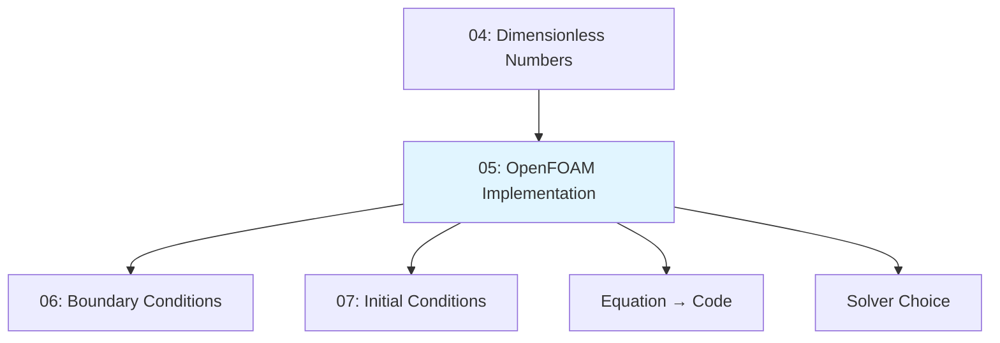
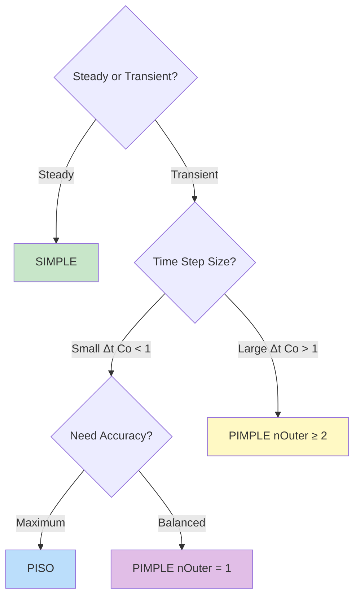
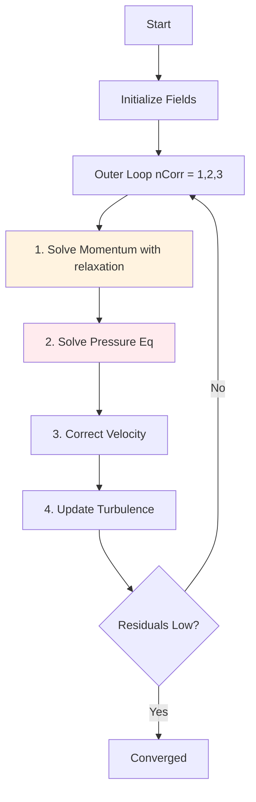
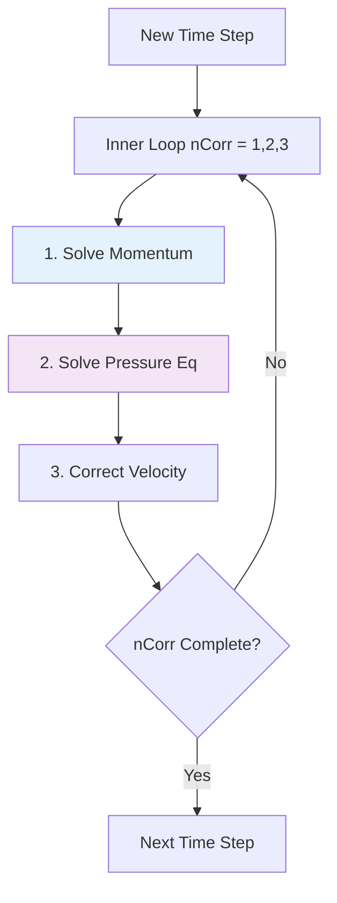
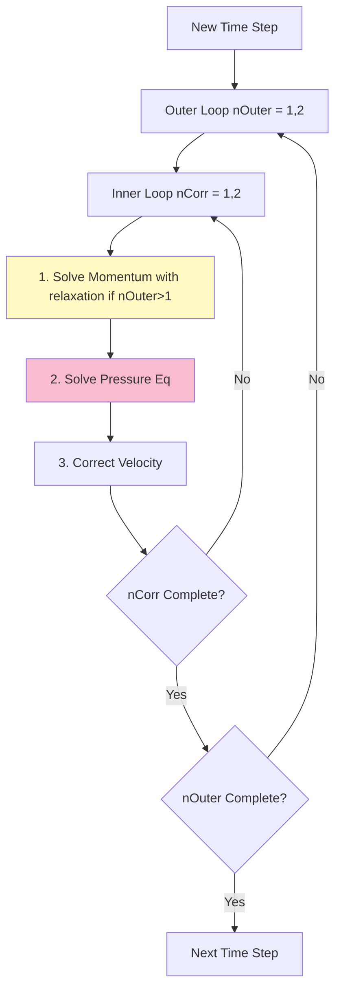

# การนำ OpenFOAM ไปใช้งาน

> **Learning Objectives (3W Framework)**
> - **WHAT:** วิธีแปลงสมการควบคุม (Navier-Stokes) เป็นโค้ด C++ และระบบ linear equations ใน OpenFOAM
> - **WHY:** เพื่อเลือก discretization method, solver algorithm, และ numerical schemes ที่เหมาะสมกับปัญหาของคุณ
> - **WHEN:** ก่อนเริ่ม simulation ทุกครั้ง เพื่อตั้งค่า `fvSchemes` และ `fvSolution` อย่างถูกต้อง

---

## Navigation Diagram

```
┌─────────────────────────────────────────────────────────────────────────────┐
│                         FROM EQUATIONS TO SIMULATION                        │
├─────────────────────────────────────────────────────────────────────────────┤
│                                                                             │
│  [Physical Laws]                                                            │
│       │                                                                     │
│       ▼                                                                     │
│  [Governing Equations] ← 02_Conservation_Laws.md                           │
│       │                                                                     │
│       ▼                                                                     │
│  [Dimensionless Analysis] ← 04_Dimensionless_Numbers.md (Re, Ma, y+)        │
│       │                                                                     │
│       ▼                                                                     │
│  ┌─────────────────────────────────────────────────────────────────────┐   │
│  │                    05: OPENFOAM IMPLEMENTATION                     │   │
│  ├─────────────────────────────────────────────────────────────────────┤   │
│  │                                                                     │   │
│  │  1. From Equation to Code (Matrix Assembly)                        │   │
│  │  2. fvm:: vs fvc:: (Implicit vs Explicit)                           │   │
│  │  3. Pressure-Velocity Coupling Algorithms                           │   │
│  │  4. Field Types & Dimensional Checking                             │   │
│  │  5. fvSchemes (Discretization)                                      │   │
│  │  6. fvSolution (Linear Solvers)                                     │   │
│  │  7. Boundary Condition Compatibility                                │   │
│  │                                                                     │   │
│  └─────────────────────────────────────────────────────────────────────┘   │
│       │                                                                     │
│       ▼                                                                     │
│  [Boundary Conditions] ← 06_Boundary_Conditions.md                          │
│       │                                                                     │
│       ▼                                                                     │
│  [Initial Conditions] ← 07_Initial_Conditions.md                            │
│                                                                             │
└─────────────────────────────────────────────────────────────────────────────┘
```

---

## Module Flow



---

## Section 1: From Equation to Matrix

### Discretization Process in FVM

Finite Volume Method (FVM) ใน OpenFOAM มีหลักการ: **อะไรก็ตามที่ไหลเข้าเซลล์หนึ่ง ต้องไหลออกจากเซลล์ข้างเคียง** (conservation property)

| Step | Process | Result |
|------|---------|--------|
| **1** | Divide domain into Control Volumes | Each cell = one control volume |
| **2** | Integrate equations over Volume | PDE → integral form |
| **3** | Apply Gauss Theorem | Volume integral → Surface integral (flux) |
| **4** | Approximate Fluxes at faces | Use interpolation schemes |
| **5** | Create Linear Equations | **[A]{x} = {b}** |

### From Conservation Law to Matrix: Step-by-Step

**Example:** สมการ diffusion อย่างง่าย: $\nabla^2 T = 0$

```
Step 1: Continuous Equation
        ∇²T = 0

Step 2: Integrate over Control Volume
        ∫ (∇·∇T) dV = 0

Step 3: Apply Gauss Divergence Theorem
        ∫ (∇T)·dS = 0

Step 4: Discretize (Sum over faces)
        Σ (∇T)_f · S_f = 0

Step 5: Linear System
        [A]{T} = {b}
```

### From Equation to Code Mapping Table

| Conservation Law | Continuous Form | OpenFOAM Code (fvMatrix) | Matrix Type |
|------------------|-----------------|--------------------------|-------------|
| **Continuity** | $\nabla \cdot \mathbf{u} = 0$ | `fvc::div(phi)` in pressure eqn | Scalar (pressure) |
| **Momentum** | $\frac{\partial \mathbf{u}}{\partial t} + \nabla \cdot (\mathbf{u}\mathbf{u}) = -\nabla p + \nu \nabla^2 \mathbf{u}$ | `fvm::ddt(U) + fvm::div(phi, U) == -fvc::grad(p) + fvm::laplacian(nu, U)` | Vector (3× scalar) |
| **Energy** | $\frac{\partial T}{\partial t} + \nabla \cdot (\mathbf{u} T) = \alpha \nabla^2 T$ | `fvm::ddt(T) + fvm::div(phi, T) == fvm::laplacian(alpha, T)` | Scalar |
| **Mass (compressible)** | $\frac{\partial \rho}{\partial t} + \nabla \cdot (\rho \mathbf{u}) = 0$ | `fvm::ddt(rho) + fvm::div(rhoPhi, rho)` | Scalar |

> **📖 รายละเอียดสมการ:** ดูการพิสูจน์ใน [02_Conservation_Laws.md](02_Conservation_Laws.md)

### Single Cell Discretization Example

สำหรับเซลล์ P ที่มีเซลล์ข้างเคียง N, S, E, W:

```
Continuous:  ∇²T = 0

Discretized:  aP·TP = aE·TE + aW·TW + aN·TN + aS·TS

Matrix Form:  [A] · {T} = {b}
             ┌───────────────────────┐
             │ aP  -aE  -aW  -aN  -aS │
             │ -aE  aP'  ...  ...  ...│
             │ -aW  ...  aP'  ...  ...│
             │ -aN  ...  ...  aP'  ...│
             │ -aS  ...  ...  ...  aP'│
             └───────────────────────┘
```

เมื่อรวมทุกเซลล์ จะได้ **sparse matrix** ขนาดใหญ่ที่ต้องแก้ด้วย iterative methods

---

## Section 2: fvm:: vs fvc:: — Implicit vs Explicit

### Fundamental Difference

| Aspect | **fvm::** (Finite Volume Method) | **fvc::** (Finite Volume Calculus) |
|--------|----------------------------------|------------------------------------|
| **Discretization** | **Implicit** — unknown ใน matrix | **Explicit** — ใช้ค่าจาก iteration ก่อนหน้า |
| **Position in Equation** | Left side [A] in [A]{x} = {b} | Right side {b} (source term) |
| **Solve Matrix?** | ✓ Yes | ✗ No |
| **Stability** | More stable, larger Δt | Stability limit (CFL) |
| **Speed** | Slower (solve matrix) | Faster (direct calculation) |
| **Memory** | Higher (store matrix) | Lower |

### Timing & Stability Tradeoffs

| Configuration | Time Step | Stability | Accuracy | Computational Cost | Use When |
|---------------|-----------|-----------|----------|--------------------|----------|
| **All fvm::** | Large (Co > 1) | ✓ Very stable | Medium | High | Steady-state |
| **All fvc::** | Small (Co < 1) | ✗ Less stable | High | Low | Explicit solvers |
| **Mixed** | Medium | ✓ Stable | High | Medium | Most cases (recommended) |

### Choosing fvm:: vs fvc::

```cpp
// Momentum equation example
fvVectorMatrix UEqn
(
    fvm::ddt(U)           // ✓ implicit: ∂U/∂t — stability
  + fvm::div(phi, U)      // ✓ implicit: convection — stability
    ==
    fvm::laplacian(nu, U) // ✓ implicit: diffusion — stability
  - fvc::grad(p)          // ✗ explicit: pressure gradient — coupling
);
```

**ทำไมใช้ `-fvc::grad(p)` (explicit)?**  
Pressure p ยังไม่รู้ค่าจริงใน iteration นี้ เราใช้ค่าจาก iteration ก่อนหน้า แล้วแก้ไขใน pressure correction step

### Common Operators

| Operator | Equation | Meaning | fvm:: / fvc:: |
|----------|----------|---------|---------------|
| `ddt(φ)` | ∂φ/∂t | Time derivative | Both |
| `div(F, φ)` | ∇·(Fφ) | Convection | Both |
| `laplacian(Γ, φ)` | ∇·(Γ∇φ) | Diffusion | fvm:: (usually) |
| `grad(p)` | ∇p | Gradient | fvc:: only |
| `Sp(S, φ)` | S·φ | Source term (implicit) | fvm:: |
| `Su(S, φ)` | S | Source term (explicit) | fvc:: |

---

## Section 3: Pressure-Velocity Coupling Algorithms

### The Incompressible Flow Problem

ใน incompressible flow มีปัญหา: **ไม่มีสมการวิวัฒนาการของ pressure โดยตรง**

- Momentum equation เกี่ยวข้องกับ **U และ p**
- Continuity (∇·U = 0) เป็น **constraint**
- ไม่มีสมการที่บอก **p มีค่าเท่าไหร่** โดยตรง

นี่คือที่มาของ **Pressure-Velocity Coupling Algorithms**

<details>
<summary><b>📐 Pressure Poisson Equation Derivation (Click to expand)</b></summary>

**Step 1: Momentum Equation (discretized)**  
$$\mathbf{H}(\mathbf{U}) - \nabla p = 0$$

where $\mathbf{H}(\mathbf{U})$ = convection + diffusion + time terms

**Step 2: Isolate velocity**  
$$\mathbf{U} = \frac{1}{A_P} \mathbf{H}(\mathbf{U}) - \frac{1}{A_P} \nabla p$$

Let $\mathbf{H}^* = \mathbf{H}/A_P$ and $rAU = 1/A_P$:
$$\mathbf{U} = \mathbf{H}^* - rAU \nabla p$$

**Step 3: Apply Divergence (from continuity: ∇·U = 0)**  
$$\nabla \cdot (\mathbf{H}^* - rAU \nabla p) = 0$$

**Step 4: Pressure Poisson Equation**  
$$\boxed{\nabla \cdot (rAU \nabla p) = \nabla \cdot \mathbf{H}^*}$$

</details>

### Algorithm Decision Tree



---

### 3.1 SIMPLE Algorithm (Steady-State)

**Semi-Implicit Method for Pressure-Linked Equations**



**fvSolution setup:**
```cpp
SIMPLE
{
    nNonOrthogonalCorrectors 0;
    
    residualControl
    {
        p       1e-4;
        U       1e-4;
    }
    
    relaxationFactors
    {
        fields { p 0.3; }
        equations { U 0.7; }
    }
}
```

**⚠️ Under-relaxation required** — prevents oscillation/divergence

---

### 3.2 PISO Algorithm (Transient, Small Time Step)

**Pressure Implicit with Splitting of Operators**



**fvSolution setup:**
```cpp
PISO
{
    nCorrectors 2;
    nNonOrthogonalCorrectors 1;
    // No relaxation — time derivative = pseudo-relaxation
}
```

**✓ No under-relaxation needed** — but requires small time step (Co < 1)

---

### 3.3 PIMPLE Algorithm (Best of Both Worlds)

**PISO + SIMPLE**



**fvSolution setup:**
```cpp
PIMPLE
{
    nOuterCorrectors 2;  // > 1 → needs relaxation
    nCorrectors 2;
    
    residualControl { p 1e-4; U 1e-4; }
    
    relaxationFactors
    {
        fields { p 0.3; }
        equations { U 0.7; }
    }
}
```

**✓ Can use larger time steps** (Co > 1) with outer loop convergence

---

### Algorithm Comparison

| Algorithm | Type | Time Step | Under-relaxation | Speed | Accuracy | Solver |
|-----------|------|-----------|------------------|-------|----------|--------|
| **SIMPLE** | Steady-state | N/A | ✓ Required | Slower | Final state | `simpleFoam` |
| **PISO** | Transient | Small (Co < 1) | ✗ Not needed | Fast | High temporal | `icoFoam` |
| **PIMPLE** | Transient | Large/Small | ✓ (if nOuter>1) | Medium | Adjustable | `pimpleFoam` |

---

## Section 4: Field Types & Dimensional Checking

### Field Types in OpenFOAM

#### Volume Fields (Cell-Centered)

| Type | Description | Example Fields |
|------|-------------|----------------|
| `volScalarField` | scalar at cell centers | p, T, k, ε, ω |
| `volVectorField` | vector at cell centers | U (velocity) |
| `volTensorField` | tensor at cell centers | stress tensor |
| `volSymmTensorField` | symmetric tensor | Reynolds stress |

#### Surface Fields (Face-Centered)

| Type | Description | Example Fields |
|------|-------------|----------------|
| `surfaceScalarField` | scalar at faces | φ (flux), mesh.Sf.mag() |
| `surfaceVectorField` | vector at faces | Sf (face area vector) |

### Field Declaration

```cpp
volScalarField p
(
    IOobject
    (
        "p",
        runTime.timeName(),
        mesh,
        IOobject::MUST_READ,
        IOobject::AUTO_WRITE
    ),
    mesh
);
```

### Dimensional Checking

OpenFOAM validates units automatically using 7 dimensions:

```
[mass length time temperature moles current luminosity]
```

| Quantity | SI Unit | dimensions | Usage |
|----------|---------|------------|-------|
| Velocity | m/s | [0 1 -1 0 0 0 0] | `U` |
| Pressure (absolute) | Pa | [1 -1 -2 0 0 0 0] | compressible |
| Kinematic pressure | m²/s² | [0 2 -2 0 0 0 0] | incompressible |
| Kinematic viscosity | m²/s | [0 2 -1 0 0 0 0] | `nu` |

> **⚠️ IMPORTANT:** Incompressible flow uses **kinematic pressure** (p/ρ) with units m²/s², NOT Pa

---

## Section 5: fvSchemes — Discretization Methods

### File Structure

```cpp
ddtSchemes
{
    default Euler;          // 1st order, stable
    // default backward;     // 2nd order, accurate
}

gradSchemes
{
    default Gauss linear;
}

divSchemes
{
    default none;
    
    div(phi,U) Gauss upwind;                   // 1st order — start
    div(phi,U) Gauss linearUpwind grad(U);     // 2nd order — after convergence
    div(phi,U) Gauss vanLeer;                  // TVD, bounded
}

laplacianSchemes
{
    default Gauss linear corrected;
}

interpolationSchemes
{
    default linear;
}

snGradSchemes
{
    default corrected;
}
```

### Scheme Comparison

#### Time Schemes

| Scheme | Order | Stability | Accuracy | Use When |
|--------|-------|-----------|----------|----------|
| **Euler** | 1st | ✓ Very stable | Low | Starting, steady-state |
| **backward** | 2nd | ✓ Stable | High | Transient, temporal accuracy |
| **CrankNicolson** | 2nd | ✗ May oscillate | Very high | Detailed transient |

#### Convection Schemes

| Scheme | Order | Bounded | Numerical Diffusion | Use When |
|--------|-------|---------|---------------------|----------|
| **upwind** | 1st | ✓ Yes | Very high | Starting, ensure convergence |
| **linearUpwind** | 2nd | ✓ Yes | Medium | After convergence |
| **vanLeer** | 2nd | ✓ Yes | Low | High-gradient flows |
| **limitedLinear** | 2nd | ✓ Yes | Low | General purpose |

**💡 Best Practice:** Start with `upwind` → switch to `linearUpwind` after convergence

---

## Section 6: fvSolution — Linear Solvers

### File Structure

```cpp
solvers
{
    p
    {
        solver GAMG;
        tolerance 1e-06;
        relTol 0.01;
        smoother GaussSeidel;
    }
    
    pFinal
    {
        $p;
        relTol 0;
    }
    
    U
    {
        solver smoothSolver;
        smoother GaussSeidel;
        tolerance 1e-05;
        relTol 0.1;
    }
}

SIMPLE
{
    nNonOrthogonalCorrectors 0;
    residualControl { p 1e-4; U 1e-4; }
    relaxationFactors { p 0.3; U 0.7; }
}
```

### Linear Solvers Comparison

| Solver | Matrix Type | Speed | Memory | Use For | Recommended |
|--------|-------------|-------|--------|---------|-------------|
| **GAMG** | Symmetric | Very fast | Medium | Pressure | ✓ Pressure (start) |
| **smoothSolver** | All | Slow | Low | U, k, ε, ω | ✓ Starting |
| **PBiCGStab** | Non-symmetric | Fast | Medium | Velocity | ✓ Large meshes |
| **PCG** | Symmetric PD | Fast | Medium | Pressure (incomp) | ✓ If GAMG fails |

---

## Section 7: Boundary Condition Compatibility

### U-p Complementary Rule

**Boundary ที่กำหนด velocity ต้องปล่อย pressure ลอย และในทางกลับกัน**

```
┌───────────────────────────────────────────────────────────────────────────┐
│                    BOUNDARY CONDITION COMPATIBILITY                       │
├───────────────────────────────────────────────────────────────────────────┤
│                                                                           │
│  Velocity (U)                    Pressure (p)                            │
│  ─────────────                   ─────────────                            │
│  fixedValue          <───  INCOMPATIBLE  ───>            fixedValue      │
│       │                             ✗                              │      │
│       ▼                             ✓                              ▼      │
│  fixedValue   ──────────────────────►         zeroGradient              │
│       ▼                             ✓                              ▼      │
│  zeroGradient  ──────────────────────►         fixedValue               │
│                                                                           │
└───────────────────────────────────────────────────────────────────────────┘
```

### Correct BC Examples

```cpp
// INLET
inlet { type fixedValue; value uniform (10 0 0); }  // U
inlet { type zeroGradient; }                        // p

// OUTLET
outlet { type zeroGradient; }                       // U
outlet { type fixedValue; value uniform 0; }        // p

// WALL
wall { type noSlip; }                               // U
wall { type zeroGradient; }                         // p
```

> **⚠️ WARNING:** Never use `fixedValue` for both U and p at same boundary — over-specified!

---

## Common Pitfalls

<details>
<summary><b>❌ Pitfall 1: Simulation Diverges</b></summary>

**Fix in order:**
1. Reduce time step → `maxCo < 0.5`
2. Switch to `upwind` scheme
3. Check mesh → `checkMesh` (non-orthogonality < 70°, skewness < 4)
4. Increase relaxation → reduce factors
5. Verify BCs compatibility
6. Initialize with `potentialFoam`
</details>

<details>
<summary><b>❌ Pitfall 2: Using fvc:: for fvm:: terms</b></summary>

**Example:** `fvc::laplacian(nu, U)` instead of `fvm::laplacian(nu, U)`

**Result:** Fast solve but unstable, requires tiny time step

**Fix:** Use `fvm::` for unknown terms (ddt, div, laplacian)
</details>

<details>
<summary><b>❌ Pitfall 3: Wrong solver for equation type</b></summary>

**Example:** Using `PCG` (symmetric) for velocity (non-symmetric)

**Result:** Solver fails to converge

**Fix:** Use `PBiCGStab` for non-symmetric matrices
</details>

<details>
<summary><b>❌ Pitfall 4: No non-orthogonal correction</b></summary>

**Example:** Mesh has 65° non-orthogonality but uses `Gauss linear uncorrected`

**Result:** Poor accuracy

**Fix:** Use `Gauss linear corrected` + increase `nNonOrthogonalCorrectors`
</details>

<details>
<summary><b>❌ Pitfall 5: Over-specified BCs</b></summary>

**Example:** Both U and p set to `fixedValue` at same inlet

**Result:** Mass imbalance → divergence

**Fix:** Follow BC compatibility table
</details>

---

## Key Takeaways

✅ **fvm:: vs fvc::** — Implicit (stable, slow) vs Explicit (fast, stability limit)

✅ **Algorithm Selection:**
   - Steady-state → SIMPLE
   - Transient, Co < 1 → PISO
   - Transient, Co > 1 → PIMPLE (nOuter ≥ 2)

✅ **fvSchemes** — Start with `upwind` → switch to `linearUpwind` after convergence

✅ **fvSolution** — Use `GAMG` for pressure, `smoothSolver` for velocity

✅ **BCs** — Fix U → float p, Fix p → float U

✅ **Courant Number** — Explicit: Co < 1, Implicit: Co < 5-10, PISO: Co < 1

---

## Concept Check

<details>
<summary><b>1. controlDict, fvSchemes, และ fvSolution มีหน้าที่ต่างกันอย่างไร?</b></summary>

| File | Purpose |
|------|---------|
| **controlDict** | Time control: timestep, output, Co |
| **fvSchemes** | Discretization: grad, div, laplacian, ddt |
| **fvSolution** | Solvers: algorithms, tolerances, relaxation |
</details>

<details>
<summary><b>2. SIMPLE, PISO, และ PIMPLE แตกต่างกันอย่างไร?</b></summary>

| Algorithm | Type | Time Step | Relaxation | Use When |
|-----------|------|-----------|------------|----------|
| **SIMPLE** | Steady-state | N/A | ✓ Required | Steady flow |
| **PISO** | Transient | Small (Co < 1) | ✗ Not needed | Accurate transient |
| **PIMPLE** | Transient | Large/Small | ✓ (if nOuter>1) | General transient |
</details>

<details>
<summary><b>3. เมื่อไหร่ควรใช้ fvm:: และเมื่อไหร์ควรใช้ fvc::?</b></summary>

**Use fvm:: (implicit):**
- Need stability (ddt, div, laplacian)
- Can use larger time steps
- Main unknown terms

**Use fvc:: (explicit):**
- Gradient terms (e.g., `grad(p)`)
- Non-critical source terms
- Terms referencing previous iteration values
</details>

---

## Glossary of Symbols

| Symbol | Meaning | SI Unit |
|--------|---------|---------|
| $\mathbf{u}$, $U$ | Velocity | m/s |
| $p$ | Pressure | Pa (compressible), m²/s² (incompressible) |
| $\phi$ | Flux ($\mathbf{u} \cdot \mathbf{S}_f$) | m³/s |
| $\rho$ | Density | kg/m³ |
| $\nu$ | Kinematic viscosity | m²/s |
| $A_P$ | Diagonal coefficient | — |
| $rAU$ | Reciprocal of $A_U$ | — |
| $\mathbf{H}^*$ | $\mathbf{H}/A_P$ | — |
| Co | Courant number | — |

---

## Navigation

### ← Previous
**[04_Dimensionless_Numbers.md](04_Dimensionless_Numbers.md)** — Dimensionless numbers (Re, Ma, y+)

### → Next
**[06_Boundary_Conditions.md](06_Boundary_Conditions.md)** — Boundary conditions, wall functions

### See Also
- **[02_Conservation_Laws.md](02_Conservation_Laws.md)** — Conservation laws
- **[03_Equation_of_State.md](03_Equation_of_State.md)** — Equation of state (⚠️ Temperature units)
- **[00_Overview.md](00_Overview.md)** — Governing equations overview

---

**📍 You are here:** `05_OpenFOAM_Implementation.md` → Next: [`06_Boundary_Conditions.md`](06_Boundary_Conditions.md)