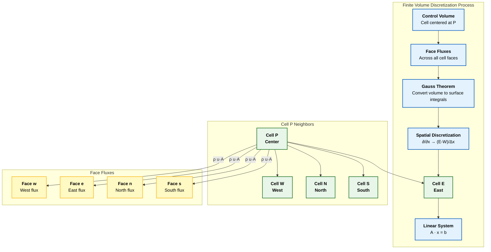
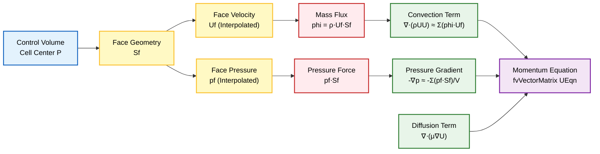
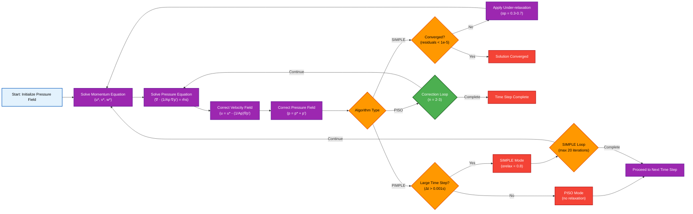
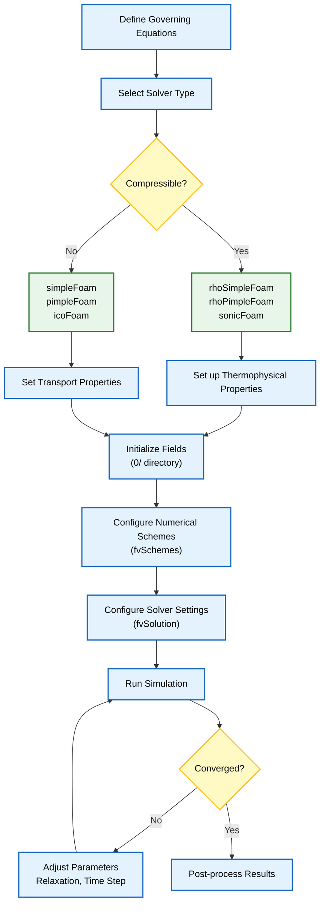

# การนำ OpenFOAM ไปใช้งาน

## OpenFOAM "มอง" สมการเหล่านี้อย่างไร

OpenFOAM ใช้ **กรอบการทำงานการประมาณค่าแบบ Finite Volume Discretization** ที่ซับซ้อน ซึ่งแปลงสมการเชิงอนุพันธ์ย่อยแบบต่อเนื่องให้เป็นระบบสมการพีชคณิตแบบไม่ต่อเนื่อง

กระบวนการแปลงนี้เกี่ยวข้องกับ:
- **การประมาณค่าเชิงพื้นที่** (spatial discretization) โดยใช้ทฤษฎีบทของเกาส์
- **รูปแบบการอินทิเกรตเชิงเวลา** (temporal integration schemes)
- **วิธีการแก้ปัญหาแบบวนซ้ำ** (iterative solution methods)



> **Figure 1:** ขั้นตอนการทำงานของการ Discretization ด้วยวิธี Finite Volume (FVM) ใน OpenFOAM แสดงการแปลงสมการควบคุมแบบต่อเนื่องให้เป็นระบบสมการเชิงเส้นแบบไม่ต่อเนื่องผ่านการอินทิเกรตปริมาตรควบคุมและทฤษฎีบทของเกาส์


โดยพื้นฐานแล้ว OpenFOAM ใช้ **Operator Overloading** และ **Template Metaprogramming** เพื่อสร้างนิพจน์ C++ ที่คล้ายคลึงกับสมการทางคณิตศาสตร์

---

## การนำ Navier-Stokes แบบ Compressible ไปใช้งาน

### สมการโมเมนตัมแบบ Compressible

$$\rho \frac{\partial \mathbf{u}}{\partial t} + \rho (\mathbf{u} \cdot \nabla) \mathbf{u} = -\nabla p + \mu \nabla^2 \mathbf{u} + \mathbf{f}$$

**คำอธิบายเทอมสำคัญ**:
- `fvm::` - **Implicit terms** (ช่วยในแนวทแยงของเมทริกซ์สำหรับความเสถียรเชิงตัวเลข)
- `fvc::` - **Explicit terms** (ถือเป็น Source Term)
- `rhoPhi` - **Mass Flux** $\rho \mathbf{u} \cdot \mathbf{S}_f$ ที่หน้า Cell
- `muEff` - **Effective Viscosity** $\mu_{eff} = \mu + \mu_t$

**OpenFOAM Code Implementation**:
```cpp
// Momentum equation (UEqn.H)
fvVectorMatrix UEqn
(
    fvm::ddt(rho, U)              // Time derivative: ∂(ρU)/∂t
  + fvm::div(rhoPhi, U)           // Convection: ∇•(ρUU)
 ==
    fvm::laplacian(muEff, U)      // Diffusion: ∇•(μ∇U)
  - fvc::div(rhoPhi, muEff*...)   // Reynolds stress / deviatoric part
);

UEqn.relax();                     // Numerical stability trick
solve(UEqn == -fvc::grad(p));     // Solve: LHS = -∇p
```

**ขั้นตอนการประมวลผล**:
1. **Interpolation** ของ Mass Flux โดยใช้ Scheme (Upwind, Linear, High-order)
2. **Relaxation** สำหรับความเสถียรของการลู่เข้า
3. **Solve** สมการโมเมนตัมโดยใช้เมทริกซ์ solver



> **Figure 2:** รายละเอียดขั้นตอนการ Discretization แบบ Finite Volume สำหรับสมการโมเมนตัม แสดงวิธีการประมาณค่าความเร็วและความดันที่หน้าเซลล์ (face interpolation) เพื่อประกอบเป็นพจน์การพา (convection), การแพร่ (diffusion) และพจน์แหล่งกำเนิด (source terms) ในระบบเมทริกซ์


---

## การทำให้ง่ายขึ้นสำหรับ Incompressible Flow

สำหรับ **Incompressible Flow Solver** เช่น `simpleFoam` (Steady-State) หรือ `icoFoam` (Transient) สมการควบคุมจะถูกทำให้ง่ายขึ้นอย่างมากเนื่องจานสมมติฐานความหนาแน่นคงที่ $\rho = \text{constant}$

**ข้อดีของการทำให้ง่ายขึ้น**:
- ✅ ลดความต้องการหน่วยความจำ (ไม่จำเป็นต้องเก็บ Density Field)
- ✅ ปรับปรุง Numerical Stability (สัมประสิทธิ์คงที่)
- ✅ การลู่เข้าที่เร็วขึ้นเนื่องจากการแยกผลกระทบทางอุณหพลศาสตร์

สิ่งนี้ทำให้เกิด **สูตร Kinematic**:
- **Kinematic Pressure**: $p_k = p/\rho$
- **Kinematic Viscosity**: $\nu = \mu/\rho$

**OpenFOAM Code Implementation**:
```cpp
// Momentum equation
fvVectorMatrix UEqn
(
    fvm::ddt(U) + fvm::div(phi, U) // Kinematic terms only (divide by ρ)
 ==
    fvm::laplacian(nu, U)          // Kinematic viscosity ν
  - fvc::grad(p)                   // Kinematic pressure (p/ρ)
);
```

**ความสัมพันธ์เชิงคณิตศาสตร์**:
$$\nabla \cdot \mathbf{u} = 0 \quad \text{(Incompressible Continuity Equation)}$$

Velocity Field $\mathbf{u}$ เป็นไปตาม **Incompressible Continuity Equation** โดยตรง โดยไม่มี Source Term เพิ่มเติม

> [!INFO] **การไหลแบบ Incompressible**
> สำหรับการไหลแบบ Incompressible ความเร็วเสียงไม่มีผลต่อพลศาสตร์การไหล สมการจะลดรูปลงเหลือเพียง Continuity และ Momentum Equations เท่านั้น

---

## Pressure-Velocity Coupling สำหรับ Incompressible Flow

- **Pressure Gradient** → Source Term ในสมการโมเมนตัม
- **Pressure Field** → Lagrange Multiplier บังคับใช้ Divergence-Free Constraint

---

## สมการความต่อเนื่อง (สมการความดัน)

ใน Incompressible Solver **การอนุรักษ์มวลจะถูกบังคับใช้โดยอ้อมผ่านสมการความดัน** ซึ่งได้มาจาก Continuity Constraint และสมการโมเมนตัม

**เหตุผลที่ต้องใช้วิธีทางอ้อม**:
- Incompressible Flow ไม่มีสมการการวิวัฒนาการความดันที่ชัดเจน
- Pressure Field ทำหน้าที่เป็น **Lagrange Multiplier** บังคับใช้ **Divergence-Free Constraint**
- การแทนที่ Predicted Velocity Field ลงในสมการความต่อเนื่อง → สมการ **Poisson สำหรับความดัน**

**OpenFOAM Code Implementation**:
```cpp
// Pressure equation (pEqn.H)
fvScalarMatrix pEqn
(
    fvm::laplacian(rAUf, p) == fvc::div(phiHbyA)
);
```

**คำอธิบายเทอมสำคัญ**:
- `rAUf` - ส่วนกลับของ Diagonal Coefficient Matrix จากสมการโมเมนตัม (interpolate ไปยัง Face Center)
- `phiHbyA` - Predicted Flux Field โดยอิงจาก Intermediate Velocity Field
- `fvm::laplacian(rAUf, p)` - Discrete ของ $\nabla^2 p$
- `fvc::div(phiHbyA)` - Discrete ของ $\nabla \cdot \mathbf{H}$

**รูปแบบเชิงคณิตศาสตร์**:
$$\nabla^2 p = \nabla \cdot \mathbf{H}$$

โดยที่ $\mathbf{H}$ ประกอบด้วยส่วน Explicit ของสมการโมเมนตัมที่ไม่รวม Pressure Gradient

---

## Pressure-Velocity Coupling Algorithms

| Algorithm | Full Name | Type | Use Case | Characteristics |
|-----------|-----------|------|----------|------------------|
| **SIMPLE** | Semi-Implicit Method for Pressure-Linked Equations | Steady-State | Steady flows | Requires under-relaxation for stability |
| **PISO** | Pressure-Implicit with Splitting of Operators | Transient | Time-dependent flows | Multiple pressure corrections per time step |
| **PIMPLE** | Combined SIMPLE-PISO | Hybrid | Large time steps, transient | Combines stability of SIMPLE with accuracy of PISO |

**ขั้นตอนการทำงาน (Algorithm Flow)**:
```
1. Solve Momentum Equation with Guessed Pressure Field
2. Solve Pressure Equation to enforce Continuity
3. Correct Velocity and Pressure Fields
4. Repeat until Convergence (for Steady-State)
   OR until sufficient Pressure Corrections (for Transient)
```



> **Figure 3:** แผนผังลำดับขั้นตอนรวมสำหรับอัลกอริทึมการเชื่อมโยงความดันและความเร็ว (SIMPLE, PISO, PIMPLE) แสดงลำดับการวนซ้ำของการทำนายโมเมนตัม การแก้ไขความดัน และการอัปเดตฟิลด์สำหรับ Solver ทั้งแบบสภาวะคงตัวและแบบไม่คงที่


### ความแตกต่างระหว่าง Algorithms

| Feature | SIMPLE | PISO | PIMPLE |
|---------|--------|------|---------|
| **Temporal Accuracy** | First-order | Second-order | Configurable |
| **Number of Corrections** | Single per iteration | Multiple per time step | Multiple per time step |
| **Stability** | High (with relaxation) | Moderate | High |
| **Computational Cost** | Low | High | Moderate-High |
| **Best For** | Steady-state problems | Accurate transient solutions | Large time step simulations |

---

## การแปลงสมการการขนส่ทั่วไป (General Transport Equation)

### รูปแบบสมการขนส่ง

สมการการขนส่งทั่วไป (general transport equation) สำหรับปริมาณ $\phi$ ใดๆ:

$$\frac{\partial (\rho \phi)}{\partial t} + \nabla \cdot (\rho \phi \mathbf{u}) = \nabla \cdot (\Gamma \nabla \phi) + S_\phi$$

โดยที่:
- $\rho$ = ความหนาแน่น (density)
- $\phi$ = ปริมาณที่ถูกขนส่ง (transported quantity)
- $\mathbf{u}$ = เวกเตอร์ความเร็ว (velocity vector)
- $\Gamma$ = สัมประสิทธิ์การแพร่ (diffusion coefficient)
- $S_\phi$ = source term

### การนำไปใช้ใน OpenFOAM

```cpp
// OpenFOAM implementation of general transport equation
fvScalarMatrix phiEqn
(
    fvm::ddt(rho, phi)           // Temporal term: ∂(ρφ)/∂t
  + fvm::div(rhoPhi, phi)        // Convection: ∇·(ρφu)
 ==
    fvm::laplacian(Gamma, phi)   // Diffusion: ∇·(Γ∇φ)
  + Su                            // Source terms
);
```

### การแม็ปกับ OpenFOAM Operators

| OpenFOAM Function | Mathematical Operator | ความหมาย |
|------------------|---------------------|-----------|
| `fvm::ddt(rho, phi)` | $\frac{\partial (\rho \phi)}{\partial t}$ | Temporal derivative |
| `fvm::div(rhoPhi, phi)` | $\nabla \cdot (\rho \phi \mathbf{u})$ | Convection term |
| `fvm::laplacian(Gamma, phi)` | $\nabla \cdot (\Gamma \nabla \phi)$ | Diffusion term |
| `fvc::grad(p)` | $\nabla p$ | Gradient operator |
| `fvm::Sp(S, phi)` | $S \phi$ | Implicit source term |
| `fvc::Su(Sp, phi)` | $S_p \phi$ | Explicit source term |

> [!TIP] **Implicit vs Explicit**
> - `fvm::` = **Implicit treatment** (coefficients เข้าสู่เมทริกซ์ → stable แต่แก้ยากขึ้น)
> - `fvc::` = **Explicit treatment** (คำนวณจากค่าปัจจุบัน → เร็วกว่าแต่อาจ unstable)

---

## Field Types ใน OpenFOAM

OpenFOAM ใช้ระบบ Template-based Types สำหรับจัดการ Field ต่างๆ

### Geometric Field Types

#### Volume Fields (ค่าที่ Cell Centers)
```cpp
volScalarField    p    // Pressure: scalar at cell centers
volVectorField    U    // Velocity: vector at cell centers
volTensorField    tau  // Stress tensor: tensor at cell centers
```

#### Surface Fields (ค่าที่ Cell Faces)
```cpp
surfaceScalarField phi     // Mass flux: scalar at faces
surfaceVectorField Sf      // Face area vectors: vector at faces
```

### การ Interpolation ระหว่าง Volume และ Surface

```cpp
// Interpolate from cell centers to faces
surfaceVectorField Uf = fvc::interpolate(U);

// Compute mass flux at faces
surfaceScalarField phi = fvc::interpolate(rho*U) & mesh.Sf();
```

---

## การใช้ Gauss's Divergence Theorem

OpenFOAM ใช้ **Gauss's Divergence Theorem** ในการแปลง volume integrals เป็น surface integrals:

$$\int_V \nabla \cdot \mathbf{F} \, \mathrm{d}V = \oint_S \mathbf{F} \cdot \mathbf{n} \, \mathrm{d}S$$

### การประยุกต์ใช้ใน Finite Volume Method

สำหรับ control volume แต่ละชิ้น:

1. **Volume Integral → Surface Sum**:
   $$\int_{V_P} \nabla \cdot (\rho \mathbf{u}) \, \mathrm{d}V = \sum_{f} \rho \mathbf{u}_f \cdot \mathbf{S}_f$$

2. **Gradient Calculation**:
   $$\int_{V_P} \nabla p \, \mathrm{d}V = \sum_{f} p_f \mathbf{S}_f$$

3. **Laplacian Calculation**:
   $$\int_{V_P} \nabla \cdot (\Gamma \nabla \phi) \, \mathrm{d}V = \sum_{f} \Gamma_f (\nabla \phi)_f \cdot \mathbf{S}_f$$

### OpenFOAM Code Implementation

```cpp
// Divergence calculation using Gauss theorem
surfaceScalarField phi = fvc::flux(U);  // φ = U·Sf
scalar divU = fvc::div(phi);             // ∇·U

// Gradient calculation
volVectorField gradP = fvc::grad(p);     // ∇p

// Laplacian calculation
volScalarField laplacianT = fvc::laplacian(DT, T);  // ∇·(DT∇T)
```

---

## การจัดการ Source Terms

### Implicit Source Terms

สำหรับ source terms ที่มีส่วนเกี่ยวข้องกับตัวแปร:

```cpp
// Linearized source: S = Su + Sp*phi
fvScalarMatrix TEqn
(
    fvm::ddt(T)
  + fvm::div(phi, T)
  - fvm::laplacian(DT, T)
 ==
    fvm::Sp(Sp, T)  // Implicit part: goes into matrix diagonal
  + Su              // Explicit part: goes into RHS
);
```

### Under-Relaxation สำหรับ Stability

```cpp
// Apply under-relaxation for steady-state problems
TEqn.relax();  // Equivalent to: A = α*A_old + (1-α)*A_new

TEqn.solve();
```

---

## Dimensional Consistency ใน OpenFOAM

### ระบบหน่วยมิติ

OpenFOAM ใช้ระบบหน่วย **[mass length time temperature moles current]**

```cpp
// Examples of dimensional sets
dimensions      [0 1 -1 0 0 0 0];  // Velocity: m/s
dimensions      [1 -1 -2 0 0 0 0]; // Pressure: kg/(m·s²)
dimensions      [0 0 0 1 0 0 0];   // Temperature: K
```

### Dimensioned Scalar Declaration

```cpp
dimensionedScalar nu
(
    "nu",                              // Name
    dimensionSet(0, 2, -1, 0, 0, 0, 0), // Dimensions: m²/s
    1.5e-05                            // Value (for air at 15°C)
);
```

> [!WARNING] **Dimensional Consistency Check**
> OpenFOAM จะตรวจสอบความสอดคล้องของหน่วยมิติโดยอัตโนมัติ หากมีข้อผิดพลาดจะแจ้งเตือนระหว่าง compilation

---

## การเลือก Numerical Schemes

### Discretization Schemes ใน `fvSchemes`

```cpp
// Temporal discretization
ddtSchemes
{
    default         Euler;           // First-order
    // backward       2;              // Second-order
    // CrankNicolson  0.9;            // Blending factor
}

// Gradient schemes
gradSchemes
{
    default         Gauss linear;    // Linear interpolation
    // Gauss cubic;    // Fourth-order
}

// Divergence schemes (convection)
divSchemes
{
    default         Gauss upwind;    // First-order (stable)
    // Gauss linear;   // Second-order (may oscillate)
    // Gauss vanLeer;  // TVD scheme
    div(phi,U)      Gauss linearUpwindV 1;  // Higher-order
}

// Laplacian schemes
laplacianSchemes
{
    default         Gauss linear corrected;
}

// Interpolation schemes
interpolationSchemes
{
    default         linear;
}
```

### การเลือก Scheme ที่เหมาะสม

| Flow Type | Divergence Scheme | Gradient Scheme |
|-----------|-------------------|-----------------|
| **Steady, Laminar** | `upwind` (stable) | `linear` |
| **Transient, Laminar** | `linear` (accurate) | `linear` |
| **Turbulent** | `linearUpwind` | `linear` |
| **High Mach** | `bounded` schemes | `linear` |

---

## Best Practices สำหรับ OpenFOAM Implementation

### 1. Boundary Condition Selection

```cpp
// Good: Proper pressure-velocity coupling
// 0/U
inlet
{
    type            fixedValue;
    value           uniform (10 0 0);
}
outlet
{
    type            zeroGradient;  // Let flow develop naturally
}

// 0/p
inlet
{
    type            zeroGradient;
}
outlet
{
    type            fixedValue;
    value           uniform 0;    // Reference pressure
}
```

### 2. Convergence Monitoring

```cpp
// Monitor residuals during solving
const scalar convergenceTolerance = 1e-6;
const scalar residualTolerance = 1e-5;

// Check convergence
if (initialResidual < convergenceTolerance)
{
    Info << "Solution converged!" << endl;
}
```

### 3. Time Step Selection สำหรับ Transient Simulations

```cpp
// Automatic time step adjustment based on Courant number
maxCo           0.5;              // Maximum Courant number
maxDeltaT       1;                // Maximum time step (s)
```

> [!INFO] **Courant-Friedrichs-Lewy (CFL) Condition**
> $$Co = \frac{|\mathbf{u}| \Delta t}{\Delta x} < 1$$
>
> สำหรับความเสถียร ค่า Courant number ควรน้อยกว่า 1

### 4. Solver Settings ใน `fvSolution`

```cpp
solvers
{
    p
    {
        solver          GAMG;
        tolerance       1e-06;
        relTol          0.01;
        smoother        GaussSeidel;
    }

    U
    {
        solver          smoothSolver;
        smoother        GaussSeidel;
        tolerance       1e-05;
        relTol          0.1;
    }
}

SIMPLE
{
    nNonOrthogonalCorrectors 2;
    consistent      yes;

    relaxationFactors
    {
        fields
        {
            p               0.3;
            rho             0.05;
        }
        equations
        {
            U               0.7;
            h               0.7;
        }
    }
}
```

---

## Summary: OpenFOAM Implementation Workflow


> **Figure 4:** ขั้นตอนการทำงานเชิงกลยุทธ์สำหรับการจำลอง CFD ใน OpenFOAM ซึ่งแนะนำผู้ใช้ตั้งแต่การกำหนดรูปแบบทางคณิตศาสตร์และการเลือก Solver ไปจนถึงการตั้งค่ากรณีทดสอบ การรันการจำลอง และการประมวลผลขั้นหลัง

**Key Takeaways**:

1. **Conservation Laws** เป็นรากฐาน - Mass, Momentum, Energy
2. **Finite Volume Method** ใช้ Gauss's theorem สำหรับ discretization
3. **Pressure-Velocity Coupling** สำคัญสำหรับ Incompressible flows
4. **Numerical Schemes** ส่งผลต่อความแม่นยำและความเสถียร
5. **Boundary Conditions** ต้องสอดคล้องทางฟิสิกส์
