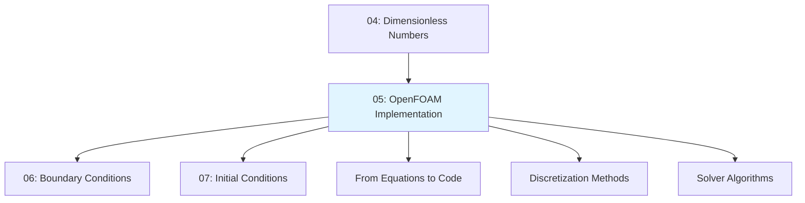
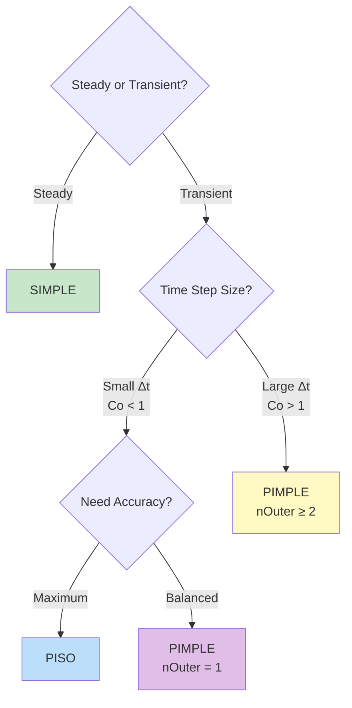
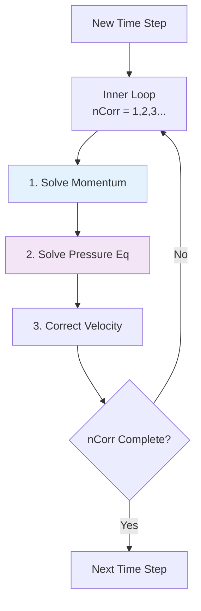

# การนำ OpenFOAM ไปใช้งาน

> **Learning Objectives (3W Framework)**
> - **WHAT:** วิธีแปลงสมการควบคุม (Navier-Stokes) เป็นโค้ด C++ และระบบ linear equations ใน OpenFOAM
> - **WHY:** เพื่อเลือก discretization method, solver algorithm, และ numerical schemes ที่เหมาะสมกับปัญหาของคุณ
> - **WHEN:** ก่อนเริ่ม simulation ทุกครั้ง เพื่อตั้งค่า `fvSchemes` และ `fvSolution` อย่างถูกต้อง

เมื่อเราเข้าใจสมการควบคุม (Navier-Stokes) แล้ว คำถามถัดไปคือ: **OpenFOAM แปลงคณิตศาสต์เหล่านี้เป็นโค้ดอย่างไร?**

> **ทำไมบทนี้สำคัญมาก?**
> - เข้าใจ **fvm:: vs fvc::** → เลือก implicit/explicit ถูก
> - เข้าใจ **SIMPLE/PISO/PIMPLE** → เลือก algorithm ถูก
> - เข้าใจ **fvSchemes/fvSolution** → ตั้งค่าได้ถูกต้อง
> - เข้าใจ **Pressure-Velocity Coupling** → แก้ปัญหา divergence ได้

---

## แผนที่เนื้อหา (Module Flow)



---

## Navigation Diagram

```
┌─────────────────────────────────────────────────────────────────────────────┐
│                         FROM EQUATIONS TO SIMULATION                        │
├─────────────────────────────────────────────────────────────────────────────┤
│                                                                             │
│  [Physical Laws]                                                            │
│       │                                                                     │
│       ▼                                                                     │
│  [Governing Equations] ← 02_Conservation_Laws.md                           │
│       │                                                                     │
│       ▼                                                                     │
│  [Dimensionless Analysis] ← 04_Dimensionless_Numbers.md (Re, Ma, y+)        │
│       │                                                                     │
│       ▼                                                                     │
│  ┌─────────────────────────────────────────────────────────────────────┐   │
│  │                    05: OPENFOAM IMPLEMENTATION                     │   │
│  ├─────────────────────────────────────────────────────────────────────┤   │
│  │                                                                     │   │
│  │  1. From Equation to Code (Matrix Assembly)                        │   │
│  │  2. fvm:: vs fvc:: (Implicit vs Explicit)                           │   │
│  │  3. Pressure-Velocity Coupling (Poisson Equation)                  │   │
│  │  4. SIMPLE / PISO / PIMPLE Algorithms                               │   │
│  │  5. Field Types & Dimensional Checking                             │   │
│  │  6. fvSchemes (Discretization)                                      │   │
│  │  7. fvSolution (Linear Solvers)                                     │   │
│  │                                                                     │   │
│  └─────────────────────────────────────────────────────────────────────┘   │
│       │                                                                     │
│       ▼                                                                     │
│  [Boundary Conditions] ← 06_Boundary_Conditions.md                          │
│       │                                                                     │
│       ▼                                                                     │
│  [Initial Conditions] ← 07_Initial_Conditions.md                            │
│                                                                             │
└─────────────────────────────────────────────────────────────────────────────┘
```

---

## ส่วนที่ 1: จากสมการสู่ Matrix (From Equation to Code)

### กระบวนการ Discretization ใน FVM

Finite Volume Method (FVM) ที่ OpenFOAM ใช้นั้น มีหลักการสำคัญคือ: **อะไรก็ตามที่ไหลเข้าเซลล์หนึ่ง ต้องไหลออกจากเซลล์ข้างเคียง** (conservation property)

| ขั้นตอน | กระบวนการ | ผลลัพธ์ |
|----------|-------------|----------|
| **1** | แบ่งพื้นที่เป็น Control Volumes | แต่ละเซลล์ใน mesh = control volume หนึ่ง |
| **2** | Integrate สมการบน Volume | แปลง PDE → integral form |
| **3** | ใช้ Gauss Theorem | Volume integral → Surface integral (flux) |
| **4** | Approximate Fluxes ที่ผิวหน้า | ใช้ interpolation schemes |
| **5** | สร้าง Linear Equations | **[A]{x} = {b}** |

### From Conservation Law to Matrix: Step-by-Step

**ตัวอย่าง:** สมการ diffusion อย่างง่าย: $\nabla^2 T = 0$

```
Step 1: Continuous Equation
        ∇²T = 0

Step 2: Integrate over Control Volume
        ∫ (∇·∇T) dV = 0

Step 3: Apply Gauss Divergence Theorem
        ∫ (∇T)·dS = 0

Step 4: Discretize (Sum over faces)
        Σ (∇T)_f · S_f = 0

Step 5: Linear System
        [A]{T} = {b}
```

### From Equation to Code Mapping Table

| สมการควบคุม | Continuous Form | OpenFOAM Code (fvMatrix) | Matrix Type |
|--------------|----------------|-------------------------|-------------|
| **Continuity** | $\nabla \cdot \mathbf{u} = 0$ | `fvc::div(phi)` ใน pressure eqn | Scalar (pressure) |
| **Momentum** | $\frac{\partial \mathbf{u}}{\partial t} + \nabla \cdot (\mathbf{u}\mathbf{u}) = -\nabla p + \nu \nabla^2 \mathbf{u}$ | `fvm::ddt(U) + fvm::div(phi, U) == -fvc::grad(p) + fvm::laplacian(nu, U)` | Vector (3× scalar) |
| **Energy** | $\frac{\partial T}{\partial t} + \nabla \cdot (\mathbf{u} T) = \alpha \nabla^2 T$ | `fvm::ddt(T) + fvm::div(phi, T) == fvm::laplacian(alpha, T)` | Scalar |
| **Mass (compressible)** | $\frac{\partial \rho}{\partial t} + \nabla \cdot (\rho \mathbf{u}) = 0$ | `fvm::ddt(rho) + fvm::div(rhoPhi, rho)` | Scalar |

> **📖 รายละเอียดสมการ:** ดูการพิสูจน์ใน [02_Conservation_Laws.md](02_Conservation_Laws.md)

### ตัวอย่าง Discretization ของเซลล์เดียว

สำหรับเซลล์ P ที่มีเซลล์ข้างเคียง N, S, E, W:

```
Continuous:  ∇²T = 0

Discretized:  aP·TP = aE·TE + aW·TW + aN·TN + aS·TS

Matrix Form:  [A] · {T} = {b}
             ┌───────────────────────┐
             │ aP  -aE  -aW  -aN  -aS │
             │ -aE  aP'  ...  ...  ...│
             │ -aW  ...  aP'  ...  ...│
             │ -aN  ...  ...  aP'  ...│
             │ -aS  ...  ...  ...  aP'│
             └───────────────────────┘
```

เมื่อเขียนสำหรับทุกเซลล์รวมกัน จะได้ **sparse matrix** ขนาดใหญ่ที่ต้องแก้ด้วย iterative methods

---

## ส่วนที่ 2: fvm:: และ fvc:: — Implicit vs Explicit

### ความแตกต่างพื้นฐาน

ใน OpenFOAM คุณจะเห็น namespace สองตัวที่ใช้บ่อยมาก: `fvm::` และ `fvc::`

| Aspect | **fvm::** (Finite Volume Method) | **fvc::** (Finite Volume Calculus) |
|--------|--------------------------------|-----------------------------------|
| **Discretization** | **Implicit** — ค่า unknown อยู่ใน matrix | **Explicit** — ใช้ค่าจาก iteration ก่อนหน้า |
| **ตำแหน่งในสมการ** | ฝั่งซ้าย [A] ใน [A]{x} = {b} | ฝั่งขวา {b} (source term) |
| **ต้องแก้ matrix?** | ✓ ใช่ | ✗ ไม่ใช่ |
| **เสถียรภาพ** | เสถียรกว่า, ใช้ Δt ใหญ่ได้ | มี stability limit (CFL) |
| **ความเร็ว** | ช้ากว่า (ต้อง solve matrix) | เร็วกว่า (คำนวณตรงๆ) |
| **หน่วยความจำ** | สูงกว่า (เก็บ matrix) | ต่ำกว่า |

### Timing & Stability Tradeoffs

| Configuration | Time Step | Stability | Accuracy | Computational Cost | ใช้เมื่อ |
|--------------|-----------|-----------|----------|-------------------|----------|
| **All fvm::** | Large (Co > 1) | ✓ เสถียรมาก | Medium | สูง | Steady-state |
| **All fvc::** | Small (Co < 1) | ✗ เสถียรน้อย | High | ต่ำ | Explicit solvers |
| **Mixed** | Medium | ✓ เสถียร | High | ปานกลาง | ส่วนใหญ่ (แนะนำ) |

### การเลือกใช้ fvm:: vs fvc::

```cpp
// ตัวอย่างสมการโมเมนตัม
fvVectorMatrix UEqn
(
    fvm::ddt(U)           // ✓ implicit: ∂U/∂t — stability
  + fvm::div(phi, U)      // ✓ implicit: convection — stability
    ==
    fvm::laplacian(nu, U) // ✓ implicit: diffusion — stability
  - fvc::grad(p)          // ✗ explicit: pressure gradient — coupling requirement
);
```

**ทำไมใช้ `-fvc::grad(p)` (explicit)?**
เพราะ pressure p ยังไม่รู้ค่าจริงใน iteration นี้ เราใช้ค่าจาก iteration ก่อนหน้าไปก่อน แล้วจะแก้ไขในขั้นตอน pressure correction ทีหลัง

### Operators ที่ใช้บ่อย

| Operator | สมการ | ความหมาย | fvm:: / fvc:: |
|----------|----------|------------|---------------|
| `ddt(φ)` | ∂φ/∂t | อนุพันธ์เทียบเวลา | ทั้งคู่ |
| `div(F, φ)` | ∇·(Fφ) | Convection (การพา) | ทั้งคู่ |
| `laplacian(Γ, φ)` | ∇·(Γ∇φ) | Diffusion (การแพร่) | fvm:: (ส่วนใหญ่) |
| `grad(p)` | ∇p | Gradient | fvc:: เท่านั้ง |
| `Sp(S, φ)` | S·φ | Source term (implicit) | fvm:: |
| `Su(S, φ)` | S | Source term (explicit) | fvc:: |

---

## ส่วนที่ 3: Pressure-Velocity Coupling

### ปัญหาพื้นฐานใน Incompressible Flow

ใน incompressible flow มีปัญหาพิเศษ: **ไม่มีสมการวิวัฒนาการของ pressure โดยตรง**

- สมการโมเมนตัมเกี่ยวข้องกับ **U และ p**
- สมการความต่อเนื่อง (∇·U = 0) เป็นแค่ **constraint**
- ไม่มีสมการที่บอกว่า **p มีค่าเท่าไหร่** โดยตรง

นี่คือที่มาของ **Pressure Poisson Equation**

<details>
<summary><b>📐 การพัฒนา Pressure Poisson Equation (Click to expand)</b></summary>

**Step 1: เริ่มจาก Momentum Equation (discretized form)**

$$\mathbf{H}(\mathbf{U}) - \nabla p = 0$$

โดยที่:
- $\mathbf{H}(\mathbf{U})$ = พจน์ทั้งหมดจาก convection + diffusion + time derivative (เป็นฟังก์ชันของ $\mathbf{U}$)
- $\nabla p$ = pressure gradient

**Step 2: Isolate velocity terms**

$$\mathbf{U} = \frac{1}{A_P} \mathbf{H}(\mathbf{U}) - \frac{1}{A_P} \nabla p$$

โดยที่ $A_P$ = diagonal coefficient จาก matrix assembly

ให้:
- $\mathbf{H}/A_P = \mathbf{H}^*$ (HbyA ใน OpenFOAM)
- $1/A_P = rAU$ (reciprocal of A_U ใน OpenFOAM)

ดังนั้น:
$$\mathbf{U} = \mathbf{H}^* - rAU \nabla p$$

**Step 3: Apply Divergence (จาก Continuity: ∇·U = 0)**

$$\nabla \cdot (\mathbf{H}^* - rAU \nabla p) = 0$$

$$\nabla \cdot \mathbf{H}^* - \nabla \cdot (rAU \nabla p) = 0$$

**Step 4: Rearrange ได้ Pressure Poisson Equation**

$$\boxed{\nabla \cdot (rAU \nabla p) = \nabla \cdot \mathbf{H}^*}$$

นี่คือสมการที่เราแก้ใน OpenFOAM!

</details>

### Pressure-Velocity Coupling Algorithm

```mermaid
graph TB
    A[Start: U*, p* from previous step] --> B[Solve Momentum Equation<br/>with old pressure]
    B --> C[Get Predicted Velocity U*<br/>(∇·U* ≠ 0)]
    C --> D[Solve Pressure Poisson Eq<br/>∇·rAU∇p = ∇·H*]
    D --> E[Get Corrected Pressure p']
    E --> F[Correct Velocity<br/>U = U* - rAU∇p']
    F --> G{Check Convergence?}
    G -->|No| B
    G -->|Yes| H[Next Time Step]

    style D fill:#ffcccc
    style F fill:#ccffcc
```

### Implementation ใน OpenFOAM

```cpp
// 1. Predictor: Solve momentum with old pressure
fvVectorMatrix UEqn
(
    fvm::ddt(U) + fvm::div(phi, U) - fvm::laplacian(nu, U)
);
UEqn.solve();

// 2. Calculate HbyA = H/A
volVectorField HbyA("HbyA", U);
HbyA = rAU*UEqn.H();

// 3. Solve Pressure Poisson Equation
fvScalarMatrix pEqn
(
    fvm::laplacian(rAUf, p) == fvc::div(phiHbyA)  // ∇·(rAU∇p) = ∇·H*
);
pEqn.solve();

// 4. Corrector: Correct velocity
U = HbyA - rAU * fvc::grad(p);  // U = H* - rAU∇p
```

> **💡 Key Point:** สมการ Poisson เป็น **elliptic type** — ข้อมูลจากทุกจุดใน domain มีผลต่อคำตอบทุกที่ ทำให้การแก้สมการนี้เป็นขั้นตอนที่ใช้เวลานานที่สุด (60-80% ของเวลา simulation)

### Compressible vs Incompressible Momentum Equations

| ประเภท | ความหนาแน่น | สมการโมเมนตัม | ความดัน | Solver |
|--------|--------------|------------------|----------|--------|
| **Incompressible** | ρ = คงที่ | `fvm::ddt(U) + fvm::div(phi, U) == -fvc::grad(p) + fvm::laplacian(nu, U)` | Kinematic (p/ρ) [m²/s²] | `simpleFoam`, `pimpleFoam` |
| **Compressible** | ρ = ผันแปร | `fvm::ddt(rho, U) + fvm::div(rhoPhi, U) == -fvc::grad(p) + fvm::laplacian(muEff, U)` | Absolute [Pa] | `rhoSimpleFoam`, `sonicFoam` |

> **⚠️ IMPORTANT:** ใน incompressible flow ความดันที่เราแก้หาคือ **kinematic pressure** (p/ρ) ซึ่งมีหน่วยเป็น m²/s² ไม่ใช่ Pa แบบ absolute pressure

---

## ส่วนที่ 4: SIMPLE, PISO, และ PIMPLE Algorithms

ทั้งสาม algorithms นี้ใช้หลักการ pressure-velocity coupling เดียวกัน แต่ต่างกันที่โครงสร้างการ iterate

### Decision Tree: Choosing Your Algorithm



### Algorithm Comparison Table

| Algorithm | Full Name | ประเภท | Time Step | Under-relaxation | ความเร็ว | ความแม่นยำ | Solver |
|-----------|-----------|--------|-----------|------------------|----------|--------------|--------|
| **SIMPLE** | Semi-Implicit Method for Pressure-Linked Equations | Steady-state | N/A | ✓ จำเป็น | ช้ากว่า | เฉพี่ยตอบสุดท้าย | `simpleFoam` |
| **PISO** | Pressure Implicit with Splitting of Operators | Transient | เล็ก (Co < 1) | ✗ ไม่ต้อง | เร็ว | สูง (temporal) | `icoFoam`, `pisoFoam` |
| **PIMPLE** | PISO + SIMPLE | Transient | ใหญ่/เล็กได้ | ✓ (ถ้า nOuter > 1) | ปานกลาง | ปรับได้ | `pimpleFoam` |

### SIMPLE Algorithm (Steady-State)

```mermaid
graph TD
    A[Start] --> B[Initialize Fields]
    B --> C[Outer Loop<br/>nCorr = 1,2,3...]
    C --> D[1. Solve Momentum<br/>(with under-relaxation)]
    D --> E[2. Solve Pressure Eq]
    E --> F[3. Correct Velocity]
    F --> G[4. Update Turbulence]
    G --> H{Residuals Low?}
    H -->|No| C
    H -->|Yes| I[Converged]

    style D fill:#fff3e0
    style E fill:#ffebee
```

**การตั้งค่า fvSolution:**
```cpp
SIMPLE
{
    nNonOrthogonalCorrectors 0;

    residualControl
    {
        p       1e-4;
        U       1e-4;
        k       1e-4;
        omega   1e-4;
    }

    relaxationFactors
    {
        fields
        {
            p       0.3;    // ต้อง relax มาก
        }
        equations
        {
            U       0.7;    // moderate relaxation
            k       0.7;
            omega   0.7;
        }
    }
}
```

**Under-relaxation จำเป็นใน SIMPLE** เพราะเราใช้ค่าจาก iteration ก่อนหน้าในหลายจุด ถ้าไม่ชะลอการเปลี่ยนแปลง solution จะ oscillate หรือ diverge

### PISO Algorithm (Transient, Small Time Step)



**การตั้งค่า fvSolution:**
```cpp
PISO
{
    nCorrectors             2;      // 2-3 corrections ต่อ time step
    nNonOrthogonalCorrectors 1;

    // ไม่ต้องการ relaxation — time derivative act as pseudo-relaxation
}
```

PISO ไม่ต้อง under-relaxation เพราะ time derivative term ทำหน้าที่เป็น **pseudo-relaxation** อยู่แล้ว แต่ข้อจำกัดคือต้องใช้ time step เล็กมาก (Courant number < 1)

### PIMPLE Algorithm (Best of Both Worlds)

PIMPLE รวมข้อดีของทั้งสอง: **outer loop แบบ SIMPLE + inner loop แบบ PISO**

```mermaid
graph TD
    A[New Time Step] --> B[Outer Loop<br/>nOuterCorr = 1,2...]
    B --> C[Inner Loop<br/>nCorr = 1,2...]
    C --> D[1. Solve Momentum<br/>(with relaxation if nOuter>1)]
    D --> E[2. Solve Pressure Eq]
    E --> F[3. Correct Velocity]
    F --> G{nCorr Complete?}
    G -->|No| C
    G -->|Yes| H{nOuterCorr Complete?}
    H -->|No| B
    H -->|Yes| I[Next Time Step]

    style D fill:#fff9c4
    style E fill:#f8bbd0
```

**การตั้งค่า fvSolution:**
```cpp
PIMPLE
{
    nOuterCorrectors    2;      // > 1 → ต้องมี relaxation
    nCorrectors         2;      // PISO corrections

    residualControl
    {
        p               1e-4;
        U               1e-4;
    }

    relaxationFactors
    {
        fields
        {
            p           0.3;
        }
        equations
        {
            U           0.7;
        }
    }
}
```

ข้อดี: สามารถใช้ time step ใหญ่กว่า PISO ได้ (Courant > 1) เหมาะสำหรับ simulation ระยะยาวที่ยอมเสีย temporal accuracy บ้าง

### Choosing Your Algorithm — Quick Reference

| สถานการณ์ | Algorithm | nOuterCorrectors | Time Step | ตัวอย่าง |
|-----------|-----------|------------------|-----------|----------|
| Steady-state | SIMPLE | N/A | N/A | การไหลในท่อ, แผงระบายความร้อน |
| Transient, Co < 1, ต้องการความแม่นยำสูง | PISO | 1 | เล็ก | Vortex shedding, Acoustic |
| Transient, Co < 1, ยอมแลกเปลี่ยนความแม่นยำ | PIMPLE | 1 | เล็ก | การไหลทั่วไป |
| Transient, Co > 1 | PIMPLE | ≥ 2 | ใหญ่ | Mixing tanks, ระยะเวลานาน |

---

## ส่วนที่ 5: Field Types และ Dimensional Checking

### Field Types ใน OpenFOAM

OpenFOAM จัดการข้อมูลเป็น **fields** ที่เก็บค่าบน mesh โดยมีสองตำแหน่งหลัก:

#### Volume Fields (Cell-Centered)

| Type | Description | ตัวอย่าง Field |
|------|-------------|------------------|
| `volScalarField` | scalar at cell centers | p, T, k, epsilon, omega |
| `volVectorField` | vector at cell centers | U (velocity) |
| `volTensorField` | tensor at cell centers | stress tensor, grad(U) |
| `volSymmTensorField` | symmetric tensor | Reynolds stress |

#### Surface Fields (Face-Centered)

| Type | Description | ตัวอย่าง Field |
|------|-------------|------------------|
| `surfaceScalarField` | scalar at faces | phi (volumetric flux), mesh.Sf.mag() |
| `surfaceVectorField` | vector at faces | Sf (face area vector) |

### การประกาศ Field

```cpp
// ประกาศ volScalarField (pressure)
volScalarField p
(
    IOobject
    (
        "p",                    // ชื่อ field
        runTime.timeName(),     // time directory (เช่น "0")
        mesh,                   // mesh object
        IOobject::MUST_READ,    // อ่านจากไฟล์
        IOobject::AUTO_WRITE   // เขียนอัตโนมัติ
    ),
    mesh
);

// ประกาศ volVectorField (velocity)
volVectorField U
(
    IOobject("U", runTime.timeName(), mesh, IOobject::MUST_READ),
    mesh
);
```

### Dimensional Checking

OpenFOAM มีระบบตรวจสอบหน่วยอัตโนมัติ หน่วยถูกแทนด้วย 7 ตัวเลข:

```
[mass length time temperature moles current luminosity]
```

| ปริมาณ | หน่วย SI | dimensions | การใช้ใน OpenFOAM |
|--------|----------|------------|---------------------|
| Velocity | m/s | [0 1 -1 0 0 0 0] | `U` |
| Pressure (absolute) | Pa = N/m² | [1 -1 -2 0 0 0 0] | compressible solvers |
| Kinematic pressure | m²/s² | [0 2 -2 0 0 0 0] | incompressible solvers |
| Dynamic viscosity | Pa·s | [1 -1 -1 0 0 0 0] | `mu` |
| Kinematic viscosity | m²/s | [0 2 -1 0 0 0 0] | `nu` |
| Density | kg/m³ | [1 -3 0 0 0 0 0] | `rho` |
| Temperature | K | [0 0 0 1 0 0 0] | `T` |

**ประโยชน์:** ถ้าคุณเขียนสมการที่หน่วยไม่ลงตัว OpenFOAM จะ error ทันที — นี่คือ safety net ที่ช่วยหาบั๊กได้เยอะมาก

```cpp
// ตัวอย่าง dimensional checking
dimensionedScalar nu
(
    "nu",
    dimViscosity,           // [0 2 -1 0 0 0 0]
    1e-6                    // value [m²/s]
);

// ถ้ากำหนดผิด:
dimensionedScalar nu("nu", dimPressure, 1e-6);  // ERROR! dimensions don't match
```

---

## ส่วนที่ 6: fvSchemes — Discretization Methods

ไฟล์ `system/fvSchemes` กำหนดว่าจะ discretize แต่ละเทอมในสมการอย่างไร

### โครงสร้างไฟล์ fvSchemes

```cpp
// อนุพันธ์เทียบเวลา — ∂/∂t
ddtSchemes
{
    default         Euler;          // 1st order, stable
    // default      backward;       // 2nd order, accurate
    // default      CrankNicolson;  // 2nd order, อาจ oscillate
}

// Gradient — ∇φ
gradSchemes
{
    default         Gauss linear;   // 2nd order central differencing
    //              Gauss linearUpwind grad(U);  // สำหรับ high Re
}

// Convection — ∇·(Fφ)
divSchemes
{
    default         none;           // บังคับให้กำหนดทุกเทอม (safety)

    div(phi,U)      Gauss upwind;                       // 1st order — เริ่มต้น
    div(phi,k)      Gauss upwind;                       // 1st order — turbulence
    div(phi,epsilon) Gauss upwind;
    div(phi,omega)   Gauss upwind;

    // หลังจากลู่เข้าแล้ว เปลี่ยนเป็น:
    // div(phi,U)      Gauss linearUpwind grad(U);     // 2nd order, bounded
    // div(phi,U)      Gauss vanLeer;                  // TVD, bounded
    // div(phi,U)      Gauss limitedLinearV 1;         // TVD, adjustable
}

// Diffusion — ∇·(Γ∇φ)
laplacianSchemes
{
    default         Gauss linear corrected;  // 2nd order, non-orthogonal correction
    //              Gauss linear uncorrected; // เร็วกว่า แต่น้อยกว่าถ้า mesh non-orthogonal
}

// Interpolation ที่ face
interpolationSchemes
{
    default         linear;
}

// Surface normal gradient
snGradSchemes
{
    default         corrected;
}
```

### Discretization Schemes Comparison

#### Time Schemes (ddtSchemes)

| Scheme | Order | Stability | Accuracy | ใช้เมื่อ |
|--------|-------|-----------|----------|----------|
| **Euler** | 1st | ✓ เสถียรมาก | ต่ำ | เริ่มต้น, steady-state |
| **backward** | 2nd | ✓ เสถียร | สูง | Transient, ต้องการ temporal accuracy |
| **CrankNicolson** | 2nd | ✗ อาจ oscillate | สูงสุด | Transient ที่ละเอียดมาก |

#### Convection Schemes (divSchemes)

| Scheme | Order | Bounded | Numerical Diffusion | ใช้เมื่อ |
|--------|-------|---------|---------------------|----------|
| **upwind** | 1st | ✓ ใช่ | สูงมาก | เริ่มต้น, ensure convergence |
| **linearUpwind** | 2nd | ✓ ใช่ | ปานกลาง | หลังจาก solution ลู่เข้าแล้ว |
| **linear** | 2nd | ✗ ไม่ | ต่ำ | Mesh ดีมาก, simple flows |
| **vanLeer** | 2nd | ✓ ใช่ | ต่ำ | High-gradient flows (shocks) |
| **limitedLinear** | 2nd | ✓ ใช่ | ต่ำ | General purpose, adjustable |

> **💡 Best Practice:** เริ่มต้นด้วย `upwind` → พอลู่เข้าแล้วเปลี่ยนเป็น `linearUpwind` หรือ `limitedLinear`

#### Laplacian Schemes

| Scheme | Non-Orthogonal Correction | เร็ว | ใช้เมื่อ |
|--------|---------------------------|------|----------|
| **Gauss linear** | ✗ ไม่ | ✓ เร็ว | Orthogonal mesh |
| **Gauss linear corrected** | ✓ ใช่ | ช้ากว่า | Non-orthogonal mesh (ส่วนใหญ่) |

---

## ส่วนที่ 7: fvSolution — Linear Solvers และ Algorithms

ไฟล์ `system/fvSolution` กำหนดวิธีแก้ matrix equation และค่าควบคุมการ convergence

### โครงสร้างไฟล์ fvSolution

```cpp
// ==================== SOLVERS ====================
solvers
{
    // Pressure equation
    p
    {
        solver          GAMG;           // Multigrid — แนะนำสำหรับ pressure
        tolerance       1e-06;          // Absolute tolerance
        relTol          0.01;           // Relative tolerance (1% ของ initial residual)
        smoother        GaussSeidel;

        // GAMG settings
        nPreSweeps      0;
        nPostSweeps     2;
        nFinestSweeps   2;

        // Agglomeration
        cacheAgglomeration on;
        nCellsInCoarsestLevel 10;
        directSolveCoarsest off;
    }

    // Final pressure solve (convergence)
    pFinal
    {
        $p;                             // คัดลอกการตั้งค่าจาก p
        relTol          0;              // แก้จน residual < tolerance
        tolerance       1e-06;
    }

    // Velocity equation
    U
    {
        solver          smoothSolver;
        smoother        GaussSeidel;
        tolerance       1e-05;
        relTol          0.1;            // 10% relaxation per iteration
    }

    // Turbulence fields
    "(k|epsilon|omega)"
    {
        solver          smoothSolver;
        smoother        symGaussSeidel;
        tolerance       1e-06;
        relTol          0.1;
    }
}

// ==================== ALGORITHMS ====================
SIMPLE
{
    nNonOrthogonalCorrectors 0;

    residualControl
    {
        p       1e-4;
        U       1e-4;
    }

    relaxationFactors
    {
        p       0.3;
        U       0.7;
    }
}
```

### Linear Solvers Comparison

| Solver | ชนิด Matrix | ความเร็ว | หน่วยความจำ | ใช้กับ | แนะนำ |
|--------|-------------|----------|--------------|---------|--------|
| **GAMG** | Symmetric | เร็วมาก | ปานกลาง | Pressure | ✓ Pressure (เริ่มต้น) |
| **smoothSolver** | ทั้งหมด | ช้า | ต่ำ | U, k, ε, ω | ✓ เริ่มต้น, small meshes |
| **PBiCGStab** | Non-symmetric | เร็ว | ปานกลาง | U, velocity | ✓ Large meshes, non-symmetric |
| **PCG** | Symmetric positive-definite | เร็ว | ปานกลาง | Pressure (incomp) | ✓ ถ้า GAMG ไม่ลู่เข้า |

### Solver Parameters Explained

| Parameter | ความหมาย | ค่าแนะนำ | หมายเหตุ |
|-----------|----------|-----------|----------|
| **tolerance** | Absolute residual | 1e-6 to 1e-5 | ค่าที่ยอมรับได้ |
| **relTol** | Relative tolerance | 0.01 (p), 0.1 (U) | หยุดเมื่อ residual < relTol × initial |
| **nSweeps** | Iterations per solve | 2-4 | smoothSolver |
| **maxIter** | Maximum iterations | 1000 | Safety limit |

### Residual Control

```cpp
residualControl
{
    p           1e-4;    // Stop when p residual < 1e-4
    U           1e-4;
    k           1e-4;
    epsilon     1e-4;
}
```

---

## ส่วนที่ 8: Boundary Conditions ที่สอดคล้องกัน

### กฎสำคัญ: U-p Complementary

**boundary ที่กำหนด velocity ต้องปล่อย pressure ลอย และในทางกลับกัน**

```
┌───────────────────────────────────────────────────────────────────────────┐
│                    BOUNDARY CONDITION COMPATIBILITY                       │
├───────────────────────────────────────────────────────────────────────────┤
│                                                                           │
│  Velocity (U)                    Pressure (p)                            │
│  ─────────────                   ─────────────                            │
│  fixedValue          <───  INCOMPATIBLE  ───>            fixedValue      │
│       │                             ✗                              │      │
│       │  ใช่อย่างใดอย่างหนึ่งเท่านั้น                          │      │
│       ▼                             ✓                              ▼      │
│  fixedValue   ──────────────────────►         zeroGradient              │
│       │                                                                   │
│       ▼                             ✓                              ▼      │
│  zeroGradient  ──────────────────────►         fixedValue               │
│                                                                           │
└───────────────────────────────────────────────────────────────────────────┘
```

### ตัวอย่าง BC ที่ถูกต้อง

```cpp
// INLET — กำหนด velocity
inlet
{
    type            fixedValue;
    value           uniform (10 0 0);  // [m/s]
}

inlet
{
    type            zeroGradient;      // ปล่อย pressure ลอย
}

// OUTLET — กำหนด pressure
outlet
{
    type            zeroGradient;      // ปล่อย velocity ไหลออก
}

outlet
{
    type            fixedValue;        // reference pressure
    value           uniform 0;         // [Pa] หรือ [m²/s²] สำหรับ kinematic
}

// WALL — no-slip
wall
{
    type            noSlip;            // หรือ fixedValue uniform (0 0 0)
}

wall
{
    type            zeroGradient;      // ปล่อย pressure ลอย
}
```

> **⚠️ WARNING:** ถ้าคุณใส่ fixedValue ทั้ง U และ p ที่ boundary เดียวกัน ระบบจะ over-specified และ solution จะไม่ถูกต้อง

---

## ส่วนที่ 9: Time Step และ Courant Number

### Courant Number (Co)

$$\text{Co} = \frac{|\mathbf{u}| \cdot \Delta t}{\Delta x}$$

**ความหมายทางกายภาพ:** Co = 1 หมายความว่า fluid เดินทางข้าม **1 cell** ใน **1 time step**

### Time Step Guidelines

| Scheme | Max Co | Accuracy | Stability | ใช้เมื่อ |
|--------|--------|----------|-----------|----------|
| **Explicit (fvc::)** | < 1 | สูง | ✗ Conditionally stable | เวลาสำคัญมาก |
| **Implicit (fvm::)** | < 5-10 | ปานกลาง | ✓ Unconditionally stable | General purpose |
| **PISO** | < 1 | สูง | ✓ Stable (pseudo-relaxation) | Transient ละเอียด |
| **SIMPLE** | N/A | N/A | ✓ Steady | Steady-state |
| **PIMPLE (nOuter > 1)** | > 1 ได้ | ปานกลาง | ✓ Stable | Long transients |

### การตั้งค่าใน controlDict

```cpp
application     simpleFoam;

startFrom       latestTime;

startTime       0;

stopAt          endTime;

endTime         1000;

deltaT          0.001;             // Fixed time step

// หรือ automatic time step adjustment:
adjustTimeStep  yes;
maxCo           0.9;               // Target Co < 0.9
maxDeltaT       1;                 // Maximum time step

writeControl    timeStep;
writeInterval   100;

purgeWrite      5;

writeFormat     ascii;
writePrecision  6;
```

---

## Common Pitfalls (ข้อผิดพลาดที่พบบ่อย)

<details>
<summary><b>❌ Pitfall 1: Simulation Diverge — ทำยังไงดี?</b></summary>

**อาการ:** Residuals เพิ่มขึ้นเรื่อยๆ จน overflow

**แก้ตามลำดับนี้:**

1. **ลด Time Step** → ลด `maxCo` เหลือ 0.5 หรือน้อยกว่า
2. **เปลี่ยนเป็น upwind** → ใช้ 1st order scheme สำหรับ convection ก่อน
3. **ตรวจสอบ Mesh** → รัน `checkMesh` ดู:
   - non-orthogonality < 70°
   - skewness < 4
   - aspect ratio < 1000
4. **เพิ่ม Relaxation** → ลด relaxation factor (เช่น p จาก 0.3 เป็น 0.2)
5. **ตรวจสอบ BCs** → ให้แน่ใจว่า U-p สอดคล้องกัน
6. **Initialize ด้วย potentialFoam** → สร้าง initial velocity field ที่ดีกว่า uniform
</details>

<details>
<summary><b>❌ Pitfall 2: ใช้ fvc:: กับ terms ที่ควรใช้ fvm::</b></summary>

**ตัวอย่าง:** ใช้ `fvc::laplacian(nu, U)` แทน `fvm::laplacian(nu, U)`

**ผล:** แก้สมการได้เร็ว แต่ไม่เสถียร ต้องใช้ time step เล็กมาก

**วิธีแก้:** ใช้ `fvm::` สำหรับ terms ที่เกี่ยวกับ unknown (ddt, div, laplacian)
</details>

<details>
<summary><b>❌ Pitfall 3: เลือก solver ผิดกับ equation type</b></summary>

**ตัวอย่าง:** ใช้ `PCG` (symmetric) กับ velocity equation (non-symmetric)

**ผล:** Solver ไม่ลู่เข้า หรือลู่เข้าช้ามาก

**วิธีแก้:** ใช้ `PBiCGStab` สำหรับ non-symmetric matrices (เช่น velocity)
</details>

<details>
<summary><b>❌ Pitfall 4: ไม่ใช้ non-orthogonal correction</b></summary>

**ตัวอย่าง:** Mesh มี non-orthogonality = 65° แต่ใช้ `Gauss linear uncorrected`

**ผล:** ความแม่นยำต่ำ ผลลัพธ์ผิดพลาด

**วิธีแก้:** ใช้ `Gauss linear corrected` และเพิ่ม `nNonOrthogonalCorrectors`
</details>

<details>
<summary><b>❌ Pitfall 5: Over-specified boundary conditions</b></summary>

**ตัวอย่าง:** กำหนดทั้ง U และ p เป็น `fixedValue` ที่ inlet เดียวกัน

**ผล:** Mass imbalance → simulation diverge

**วิธีแก้:** ดูตาราง "Boundary Condition Compatibility" ด้านบน
</details>

---

## Key Takeaways

✅ **fvm:: vs fvc::** — Implicit (stable, slow) vs Explicit (fast, stability limit)

✅ **Pressure-Velocity Coupling** — ไม่มีสมการ pressure โดยตรง ต้องแก้ Poisson equation

✅ **เลือก Algorithm ตามปัญหา:**
   - Steady-state → SIMPLE
   - Transient, Co < 1 → PISO
   - Transient, Co > 1 → PIMPLE (nOuter ≥ 2)

✅ **fvSchemes** — เริ่มด้วย `upwind` → เปลี่ยนเป็น `linearUpwind` หลังลู่เข้า

✅ **fvSolution** — ใช้ `GAMG` สำหรับ pressure, `smoothSolver` สำหรับ velocity

✅ **Boundary Conditions** — กำหนด U ต้องปล่อย p ลอย และในทางกลับกัน

✅ **Courant Number** — Explicit: Co < 1, Implicit: Co < 5-10, PISO: Co < 1

---

## Concept Check

<details>
<summary><b>1. controlDict, fvSchemes, และ fvSolution มีหน้าที่ต่างกันอย่างไร?</b></summary>

| ไฟล์ | หน้าที่ |
|------|--------|
| **controlDict** | ควบคุมการรัน: เวลา, timestep, output, Co |
| **fvSchemes** | วิธี Discretization: grad, div, laplacian, ddt |
| **fvSolution** | วิธีแก้สมการ: solver, tolerances, relaxation, algorithms |

</details>

<details>
<summary><b>2. PISO และ SIMPLE แตกต่างกันอย่างไร?</b></summary>

| Algorithm | ประเภท | Time Step | Relaxation | ใช้เมื่อ |
|-----------|--------|-----------|-----------|----------|
| **SIMPLE** | Steady-state | N/A | ✓ จำเป็น | การไหลคงตัว |
| **PISO** | Transient | เล็ก (Co < 1) | ✗ ไม่ต้อง | การไหลไม่คงตัว |
| **PIMPLE** | Transient | ใหญ่/เล็กได้ | ✓ (ถ้า nOuter>1) | General transient |

</details>

<details>
<summary><b>3. เมื่อไหร่ควรใช้ fvm:: และเมื่อไหร่ควรใช้ fvc::?</b></summary>

**ใช้ fvm:: (implicit):**
- เมื่อต้องการ stability (ddt, div, laplacian)
- เมื่อสามารถใช้ time step ใหญ่ได้
- Terms ที่มี unknowns หลัก

**ใช้ fvc:: (explicit):**
- Gradient terms (เช่น `grad(p)`)
- Source terms ที่ไม่ได้เป็น unknown หลัก
- Terms ที่ต้องอ้างอิงค่าจาก iteration ก่อนหน้า
</details>

<details>
<summary><b>4. Pressure Poisson equation คืออะไร ทำไมสำคัญ?</b></summary>

Pressure Poisson equation คือสมการที่แปลงจาก continuity equation (∇·U = 0) โดยใช้ momentum equation มาช่วย ทำให้เราสามารถแก้หา pressure field ได้

สมการรูปแบบ: $\nabla \cdot (rAU \nabla p) = \nabla \cdot \mathbf{H}^*$

สำคัญเพราะ:
1. Pressure ไม่มีสมการวิวัฒนาการโดยตรงใน incompressible flow
2. เป็นขั้นตอนที่ใช้เวลานานที่สุด (60-80% ของเวลา simulation)
3. กำหนด coupling ระหว่าง pressure และ velocity

</details>

---

## Glossary of Symbols & Notations

| Symbol | ความหมาย | หน่วย SI | ปรากฏใน |
|--------|----------|------------|----------|
| $\mathbf{u}$, $U$ | Velocity | m/s | ทุกสมการ |
| $p$ | Pressure | Pa (compressible), m²/s² (incompressible) | Momentum |
| $\phi$ | Flux ($\mathbf{u} \cdot \mathbf{S}_f$) | m³/s | convection terms |
| $\rho$ | Density | kg/m³ | Mass, Momentum (compressible) |
| $\mu$ | Dynamic viscosity | Pa·s | Momentum |
| $\nu$ | Kinematic viscosity | m²/s | Momentum (incompressible) |
| $A_P$ | Diagonal coefficient | — | Matrix assembly |
| $rAU$ | Reciprocal of $A_U$ | — | Pressure equation |
| $\mathbf{H}^*$, HbyA | $\mathbf{H}/A_P$ | — | Pressure equation |
| $[A]\{x\} = \{b\}$ | Linear system | — | Matrix solver |
| Co | Courant number | — | Time stepping |
| $\Delta t$ | Time step | s | Time discretization |

---

## Navigation

### ← Previous
- **[04_Dimensionless_Numbers.md](04_Dimensionless_Numbers.md)** — เลขไร้มิติ (Re, Ma, y+), ใช้คำนวณเพื่อเลือก solver และ schemes

### → Next
- **[06_Boundary_Conditions.md](06_Boundary_Conditions.md)** — เงื่อนไขขอบเขต (Dirichlet, Neumann, Mixed), Wall functions ตาม y+

### See Also
- **[02_Conservation_Laws.md](02_Conservation_Laws.md)** — กฎการอนุรักษ์มวล, โมเมนตัม, พลังงาน
- **[03_Equation_of_State.md](03_Equation_of_State.md)** — สมการสถานะและ **⚠️ Temperature units warning**
- **[00_Overview.md](00_Overview.md)** — ภาพรวมของ Governing Equations

---

**📍 คุณอยู่ที่นี่:** `05_OpenFOAM_Implementation.md` → บทถัดไป: [`06_Boundary_Conditions.md`](06_Boundary_Conditions.md)