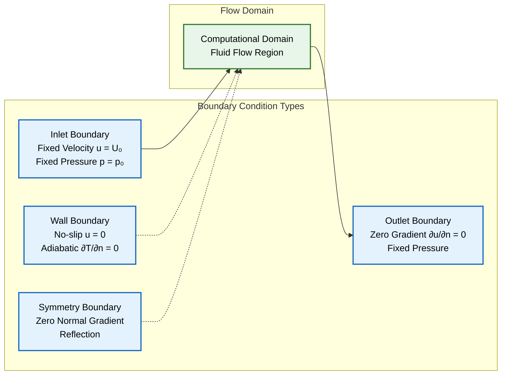
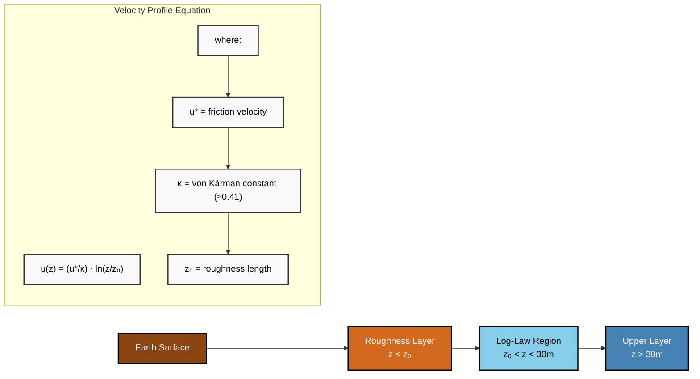
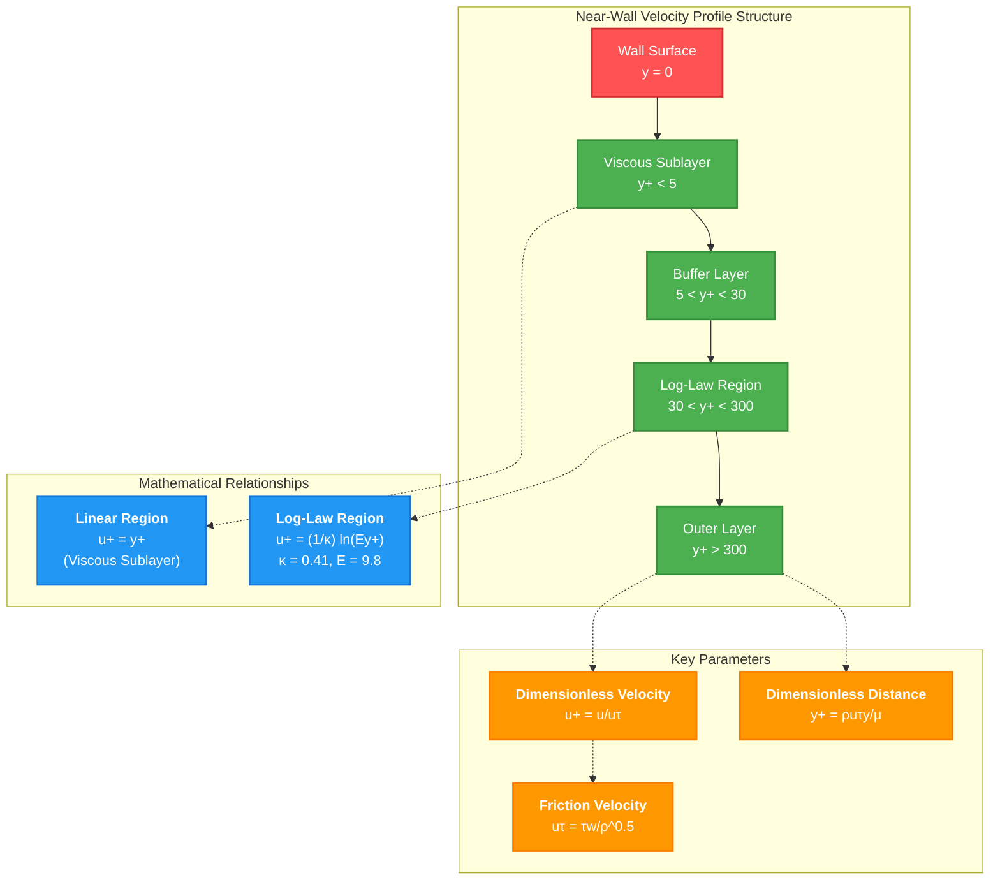
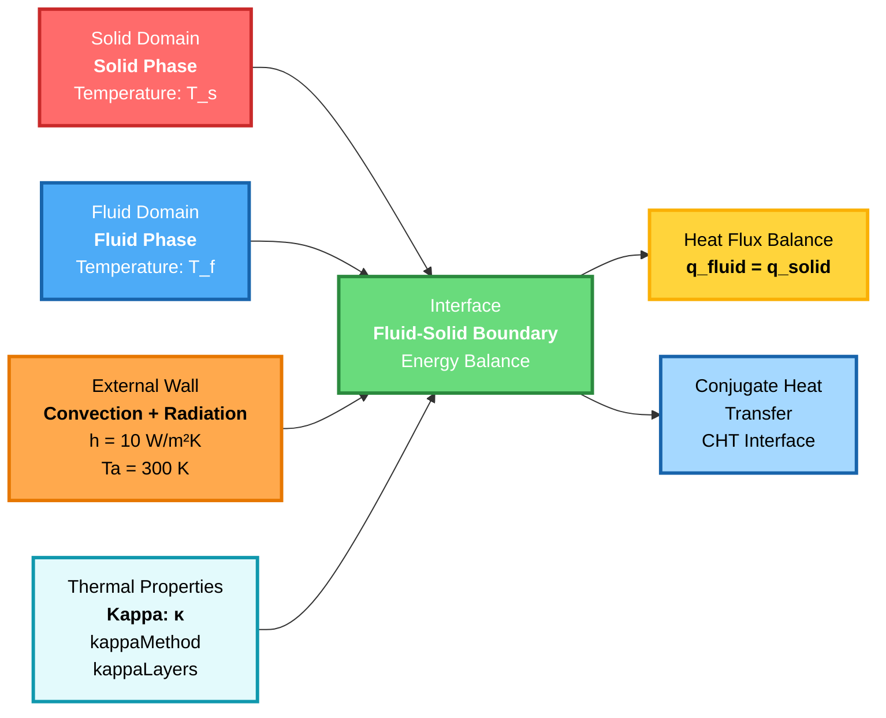
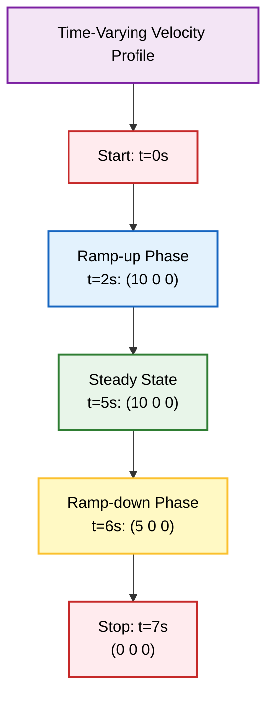

# Boundary Conditions

**Boundary conditions** เป็นข้อจำกัดทางคณิตศาสตร์พื้นฐานที่กำหนดพฤติกรรมทางกายภาพของการไหลของของไหลที่ขอบเขตของโดเมน ในพลศาสตร์ของไหลเชิงคำนวณ (computational fluid dynamics) เงื่อนไขเหล่านี้ช่วยให้มั่นใจได้ว่าสมการควบคุม (governing equations) มีความสมบูรณ์ (well-posedness) โดยการให้ผลเฉลยที่ไม่ซ้ำกันซึ่งแสดงถึงฟิสิกส์การไหลในโลกแห่งความเป็นจริงได้อย่างแม่นยำ



> **Figure 1:** การจำแนกประเภทเงื่อนไขขอบเขตพื้นฐานใน CFD โดยจับคู่ขอบเขตทางกายภาพ (Inlet, Outlet, Wall, Symmetry) เข้ากับข้อจำกัดทางคณิตศาสตร์ที่เกี่ยวข้อง (Dirichlet, Neumann) บนโดเมนการคำนวณ


การนำ Boundary conditions ไปใช้ทางคณิตศาสตร์ส่งผลโดยตรงต่อ:
- **ความแม่นยำของผลเฉลย** (solution accuracy)
- **เสถียรภาพ** (stability)
- **ลักษณะการลู่เข้า** (convergence characteristics)

---

## Physical Types

**Boundary conditions** ใน CFD แสดงถึงคำอธิบายทางคณิตศาสตร์ของการปฏิสัมพันธ์ทางกายภาพระหว่างโดเมนของไหลและสภาพแวดล้อม Boundary type แต่ละประเภทกำหนดข้อจำกัดทางคณิตศาสตร์เฉพาะสำหรับตัวแปรการไหล เพื่อให้มั่นใจว่าสมการ Navier-Stokes และสมการความต่อเนื่อง (continuity equation) มีผลเฉลยที่ไม่ซ้ำกันและมีความหมายทางกายภาพ

| Type | Description | Mathematical Condition |
| :--- | :--- | :--- |
| **Inlet** | ของไหลเข้าสู่โดเมนการคำนวณด้วยคุณสมบัติการไหลที่กำหนด | $\mathbf{u} = \mathbf{u}_{in}$ (Dirichlet)<br>$p = p_{in}$ (optional)<br>$T = T_{in}$ (thermal problems) |
| **Outlet** | ของไหลออกจากโดเมนด้วยการพัฒนาการไหลตามธรรมชาติ | $\nabla \mathbf{u} \cdot \mathbf{n} = 0$ (Neumann)<br>$\nabla p \cdot \mathbf{n} = 0$ (fixed pressure)<br>$\nabla T \cdot \mathbf{n} = 0$ (adiabatic) |
| **No-Slip Wall** | พื้นผิวแข็งที่ความเร็วของไหลตรงกับความเร็วของผนัง | $\mathbf{u} = \mathbf{u}_{wall}$ (Dirichlet)<br>For stationary walls: $\mathbf{u} = 0$<br>$\nabla p \cdot \mathbf{n} = 0$ (impermeable) |
| **Symmetry** | ระนาบกระจกที่แสดงพฤติกรรมการไหลแบบสมมาตร | $\mathbf{u} \cdot \mathbf{n} = 0$ (zero normal velocity)<br>$\nabla \mathbf{u}_{tan} \cdot \mathbf{n} = 0$ (zero shear)<br>$\nabla p \cdot \mathbf{n} = 0$ (symmetric pressure) |
| **Moving Wall** | พื้นผิวแข็งที่มีการเคลื่อนที่แบบเลื่อนตำแหน่งหรือหมุนที่กำหนด | $\mathbf{u} = \mathbf{u}_{wall}$ (prescribed)<br>$\omega = \omega_{wall}$ (rotational)<br>$\nabla p \cdot \mathbf{n} = 0$ (impermeable) |
| **Periodic** | เงื่อนไขการไหลที่เหมือนกันทั่วทั้งคู่ของหน้าขอบเขต | $\mathbf{u}|_{+} = \mathbf{u}|_{-}$ (field matching)<br>$p|_{+} = p|_{-}$ (pressure continuity)<br>$\Delta p$ optional for driven flow |

ความแตกต่างทางคณิตศาสตร์ระหว่าง **Dirichlet (ค่าคงที่)** และ **Neumann (gradient คงที่)** Boundary conditions กำหนดว่าอัลกอริทึมเชิงตัวเลขจะจัดการกับขอบเขตอย่างไรในระหว่างการประกอบเมทริกซ์และขั้นตอนการหาผลเฉลย

- **เงื่อนไข Dirichlet**: กำหนดค่าตัวแปร Field โดยตรง
- **เงื่อนไข Neumann**: จำกัดอนุพันธ์เชิงพื้นที่ ทำให้ Field การไหลพัฒนาไปตามธรรมชาติ

---

## Mathematical Foundation

การนำ Boundary conditions ไปใช้ใน **Finite Volume Methods** ต้องพิจารณาการทำให้เป็นส่วนย่อย (discretization) ที่หน้าขอบเขตอย่างรอบคอบ สำหรับ Control Volume ที่อยู่ติดกับขอบเขต รูปแบบอินทิกรัลของสมการอนุรักษ์ (conservation equations) จะกลายเป็น:

$$\int_{V} \frac{\partial \phi}{\partial t} \mathrm{d}V + \oint_{A} \phi \mathbf{u} \cdot \mathbf{n} \mathrm{d}A = \oint_{A} \Gamma \nabla \phi \cdot \mathbf{n} \mathrm{d}A + \int_{V} S_{\phi} \mathrm{d}V$$

**ตัวแปรในสมการ:**
- $\phi$ = ตัวแปรการไหล (velocity, pressure, temperature)
- $\mathbf{u}$ = เวกเตอร์ความเร็ว
- $\mathbf{n}$ = เวกเตอร์หน้าปกติ
- $\Gamma$ = สัมประสิทธิ์การแพร่
- $S_{\phi}$ = source term
- $V$ = ปริมาตรควบคุม
- $A$ = พื้นที่ผิวหน้า


> [!TIP] **Finite Volume Boundary Implementation**
> การประยุกต์ใช้ Gauss's Divergence Theorem ที่ขอบเขต:
> $$\int_V \nabla \cdot \mathbf{F} \, \mathrm{d}V = \oint_S \mathbf{F} \cdot \mathbf{n} \, \mathrm{d}S$$
>
> โดยที่:
> - $\mathbf{F}$ = flux vector
> - $\mathbf{n}$ = outward normal vector ที่ cell faces
>
> การ discretization นี้ทำให้มั่นใจถึงการอนุรักษ์ที่แม่นยำในระดับ discrete

**Surface Integrals** รวมถึงส่วนที่มาจากทั้ง **Internal Faces** และ **Boundary Faces** ส่วนที่มาจาก Boundary Face จะถูกประเมินโดยใช้ Boundary conditions ที่กำหนด:

- **Dirichlet boundaries**: $\phi_{f} = \phi_{boundary}$ (การกำหนดค่าโดยตรง)
- **Neumann boundaries**: $(\nabla \phi)_{f} \cdot \mathbf{n} = (\nabla \phi)_{boundary} \cdot \mathbf{n}$ (ข้อจำกัด Gradient)

การจัดการกับ Boundary conditions เหล่านี้ในระบบเชิงเส้นเกี่ยวข้องกับการปรับเปลี่ยน **Coefficient Matrix** และ **Source Terms** เพื่อบังคับใช้ข้อจำกัดที่กำหนดไว้ ในขณะที่ยังคงรักษา Matrix Symmetry และ Numerical Stability

---

## OpenFOAM Syntax

OpenFOAM Boundary conditions ถูกกำหนดผ่าน **Dictionary-based Syntax** ใน Field Files ที่อยู่ใน Directory `0/` Boundary condition type แต่ละประเภทสอดคล้องกับ OpenFOAM Class เฉพาะที่นำเสนอสูตรทางคณิตศาสตร์และการจัดการเชิงตัวเลขของ Boundary condition นั้นๆ

### Basic Boundary Condition Examples

```cpp
// Example: Velocity inlet with turbulent profile
inlet
{
    // Fixed value boundary condition type
    type            fixedValue;
    
    // Uniform velocity of 10 m/s in x-direction
    value           uniform (10 0 0);  // m/s uniform velocity
    
    // Alternative: time-varying inlet
    // type            timeVaryingMappedFixedValue;
    // setAverage      false;
    // outOfBounds     clamp;           // Clamp to end values
}

// Example: Pressure outlet with backflow prevention
outlet
{
    // Zero gradient allows natural development
    type            zeroGradient;      // Natural development
    
    // Alternative for backflow:
    // type            outletInlet;
    // outletValue     uniform 0;
    // inletValue      uniform 0;
    // value           $outletValue;
}
```

> **📂 Source:** OpenFOAM Field File Dictionary (`0/` directory)
> 
> **คำอธิบาย:**
> - `fixedValue`: กำหนดค่าคงที่ที่ขอบเขต (Dirichlet condition)
> - `zeroGradient`: อนุญาตให้ค่าตัวแปรพัฒนาตามธรรมชาติ (Neumann condition)
> - `outletInlet`: จัดการกับการไหลย้อนกลับอัตโนมัติ
> 
> **แนวคิดสำคัญ:**
> - Boundary conditions ใน OpenFOAM ถูกกำหนดผ่าน dictionary entries ใน field files
> - แต่ละ patch ต้องมี `type` ที่ระบุ boundary condition class
> - `value` สามารถเป็น `uniform` (ค่าเดียวทั้ง patch) หรือ `nonuniform` (field data)

### Wall Boundary Conditions

```cpp
// Example: No-slip wall with heat transfer
walls
{
    // No-slip condition: velocity fixed to zero
    type            fixedValue;        // Fixed at zero for no-slip
    value           uniform (0 0 0);
}

// Example: Wall temperature for thermal analysis
walls
{
    // Fixed temperature boundary
    type            fixedValue;
    value           uniform 300;       // K
    
    // Alternative: adiabatic wall (no heat transfer)
    // type            zeroGradient;
}

// Example: Moving wall (rotating cylinder)
rotatingWall
{
    // Rotating wall velocity boundary condition
    type            rotatingWallVelocity;
    origin          (0 0 0);          // Rotation axis origin
    axis            (0 0 1);          // Rotation axis direction
    omega           constant 3.14159; // rad/s
}
```

> **📂 Source:** OpenFOAM Boundary Condition Classes (`fixedValueFvPatchField`, `rotatingWallVelocityFvPatchVectorField`)
> 
> **คำอธิบาย:**
> - No-slip condition: ความเร็วของไหลเป็นศูนย์ที่ผนัง
> - Fixed temperature: กำหนดอุณหภูมิผนังแบบคงที่
> - Rotating wall: จำลองผนังที่หมุนด้วยความเร็วเชิงมุมที่กำหนด
> 
> **แนวคิดสำคัญ:**
> - No-slip condition สำคัญสำหรับการไหลแบบ viscous
> - Adiabatic wall ใช้ `zeroGradient` สำหรับอุณหภูมิ
> - Moving wall ต้องระบุ origin, axis และ omega

### Special Boundary Conditions

```cpp
// Example: Symmetry plane
symmetryPlane
{
    // Symmetry condition type
    type            symmetry;
    // No additional parameters required
}

// Example: Periodic boundary
periodic1
{
    // Cyclic boundary for periodic conditions
    type            cyclic;
    // Automatically paired with periodic2 through
    // mesh definition in constant/polyMesh/boundary
}
```

> **📂 Source:** OpenFOAM Boundary Condition Classes (`symmetryFvPatchField`, `cyclicFvPatchField`)
> 
> **คำอธิบาย:**
> - `symmetry`: บังคับใช้เงื่อนไขสมมาตร ทำให้ gradient ปกติเป็นศูนย์
> - `cyclic`: เชื่อมโยง patches คู่หนึ่งเพื่อการไหลแบบ periodic
> 
> **แนวคิดสำคัญ:**
> - Symmetry ลดขนาดโดเมนการคำนวณโดยใช้ความสมมาตรทางกายภาพ
> - Cyclic boundaries ต้องถูกกำหนดใน mesh definition ก่อน
> - ทั้งสองประเภทนี้ไม่ต้องการพารามิเตอร์เพิ่มเติม

การนำ Boundary condition ไปใช้ใน OpenFOAM เป็นไปตามแนวทาง **Finite Volume Method** โดยที่ค่าขอบเขตจะถูกรวมเข้าใน **Discretized Equations** ผ่านการคำนวณ **Face Value** และ **Gradient Computations**

- `type` ที่ระบุจะกำหนดการจัดการทางคณิตศาสตร์
- พารามิเตอร์เพิ่มเติมจะให้ข้อมูลทางกายภาพสำหรับการนำ Boundary condition เฉพาะนั้นไปใช้

---

## Advanced Boundary Condition Features

OpenFOAM มี **Boundary Condition Classes** ที่ซับซ้อนสำหรับสถานการณ์การไหลที่ซับซ้อน:

### Turbulence-Specific Conditions

```cpp
// Turbulence-specific inlet conditions
inlet
{
    // Turbulent inlet with fluctuating velocity
    type            turbulentInlet;
    fluctuationScale 0.1;             // 10% velocity fluctuations
    referenceField uniform (10 0 0);  // Mean velocity
    alpha          0.1;               // Filter coefficient
}

// Atmospheric boundary layer
atmInlet
{
    // Atmospheric boundary layer velocity profile
    type            atmBoundaryLayerInletVelocity;
    flowDir         (1 0 0);          // Flow direction
    zDir            (0 0 1);          // Vertical direction
    Uref            10;               // Reference velocity
    Zref            10;               // Reference height
    z0              0.1;              // Roughness length
    d               0;                // Displacement height
}
```

> **📂 Source:** OpenFOAM Boundary Condition Classes (`turbulentInletFvPatchVectorField`, `atmBoundaryLayerInletVelocityFvPatchVectorField`)
> 
> **คำอธิบาย:**
> - `turbulentInlet`: สร้างความปั่นป่วนเทียมที่ขอบเขตขาเข้า
> - `atmBoundaryLayerInlet`: สร้างโปรไฟล์ความเร็วชั้นขอบเขตบรรยากาศ
> 
> **แนวคิดสำคัญ:**
> - Turbulent inflow จำเป็นสำหรับการจำลองแบบ LES/DES
> - Atmospheric boundary layer ใช้ log-law profile
> - Parameters: z0 (roughness length), d (displacement height)

### Pressure-Dependent Outlets

```cpp
// Pressure-dependent outlet
outlet
{
    // Fixed value pressure outlet
    type            fixedValue;
    value           uniform 0;        // Gauge pressure
    
    // For reverse flow:
    // type            outletInlet;
    // outletValue     uniform 0;
    // inletValue      uniform 0;
}
```

> **📂 Source:** OpenFOAM Boundary Condition Classes (`fixedValueFvPatchScalarField`, `outletInletFvPatchScalarField`)
> 
> **คำอธิบาย:**
> - `fixedValue`: กำหนดค่าความดันคงที่ที่ outlet
> - `outletInlet`: จัดการกับการไหลย้อนกลับโดยอัตโนมัติ
> 
> **แนวคิดสำคัญ:**
> - Fixed pressure outlets ใช้ gauge pressure โดยทั่วไป
> - OutletInlet สำคัญเมื่อมีโอกาสเกิด backflow
> - ค่า pressure = 0 หมายถึง atmospheric pressure



> **Figure 2:** โครงสร้างของชั้นขอบเขตบรรยากาศ แสดงการแบ่งส่วนในแนวตั้งออกเป็นชั้นความขรุขระ (roughness layer), บริเวณกฎลอการิทึม (log-law region) และชั้นบน ซึ่งควบคุมโดยสมการโปรไฟล์ความเร็วแบบลอการิทึม


Boundary conditions ขั้นสูงเหล่านี้ช่วยให้สามารถจำลองสถานการณ์การไหลในโลกแห่งความเป็นจริงได้อย่างแม่นยำ รวมถึง:

- **Atmospheric Flows**
- **Turbulent Inflow Conditions**
- **Complex Pressure-Velocity Coupling** ที่ขอบเขตของโดเมน

---

## Wall Function Implementation

สำหรับการไหลแบบ **Turbulent** ที่มี Reynolds Number สูง **Wall Functions** ให้การจัดการบริเวณใกล้ผนังอย่างประหยัดโดยไม่ต้องแก้ปัญหา **Viscous Sublayer**:

```cpp
walls
{
    // Wall function for turbulent eddy viscosity
    type            nutkWallFunction;
    value           uniform 0;        // Eddy viscosity at wall
    
    // Optional: roughness specification
    // roughnessHeight 0.001;
    // roughnessType  sandGrain;
}

// Velocity wall functions
walls
{
    type            wallFunction;
    // Automatically applied based on y+ values
}

// Thermal wall functions
walls
{
    // Compressible thermal wall function
    type            compressible::alphatWallFunction;
    
    // Prandtl number specification
    Prt             0.9;              // Turbulent Prandtl number
}
```

> **📂 Source:** `.applications/solvers/multiphase/multiphaseEulerFoam/multiphaseCompressibleMomentumTransportModels/derivedFvPatchFields/alphatPhaseChangeWallFunction/alphatPhaseChangeWallFunctionFvPatchScalarField.H`
> 
> **คำอธิบาย:**
> - `nutkWallFunction`: คำนวณค่า eddy viscosity ใกล้ผนังโดยใช้ wall function
> - `alphatWallFunction`: คำนวณ thermal conductivity แบบปั่นป่วนสำหรับ CHT
> - Wall functions ใช้ log-law relationship เพื่อหลีกเลี่ยงการ discretize บริเวณ viscous sublayer
> 
> **แนวคิดสำคัญ:**
> - Wall functions ช่วยลดจำนวน cell ที่จำเป็นใกล้ผนัง
> - ต้องตรวจสอบค่า y+ เพื่อให้แน่ใจว่าอยู่ในช่วงที่เหมาะสม (30 < y+ < 300)
> - Roughness parameters ใช้สำหรับผนังที่ไม่เรียบ

แนวทาง Wall Function เชื่อมต่อ **Viscous Sublayer** และ **Log-Law Region** โดยใช้ Empirical Correlations:

$$u^+ = \frac{1}{\kappa} \ln(Ey^+)$$

**ตัวแปรในสมการ:**
- $u^+ = \frac{u}{u_\tau}$ = Dimensionless Velocity
- $y^+ = \frac{\rho u_\tau y}{\mu}$ = Dimensionless Distance จากผนัง
- $\kappa$ = Von Kármán Constant (≈ 0.41)
- $E$ = Roughness Parameter (≈ 9.8 for smooth walls)
- $u_\tau$ = Friction velocity



> **Figure 3:** การแบ่งโซนของชั้นขอบเขตแบบปั่นป่วนใกล้ผนัง โดยกำหนดชั้นย่อยหนืด (viscous sublayer, $y^+ < 5$), ชั้นกันชน (buffer layer) และบริเวณกฎลอการิทึม (log-law region, $y^+ > 30$) สัมพันธ์กับระยะห่างจากผนังแบบไร้มิติ ($y^+$)

---

## Conjugate Heat Transfer Boundaries

สำหรับปัญหา **Coupled Fluid-Solid Heat Transfer** นั้น OpenFOAM มี Boundary Conditions พิเศษให้:

```cpp
fluidSolidInterface
{
    // Coupled thermal boundary for CHT
    type            compressible::turbulentTemperatureCoupledBaffleMixed;
    
    // Name of temperature field in neighbor region
    Tnbr            T;                // Neighbor field name
    
    // Thermal conductivity method
    kappa           solidThermo;      // Thermal conductivity method
    kappaMethod     fluidThermo;      // Alternative method specification
}

// External wall with convection and radiation
externalWall
{
    // External wall with heat transfer coefficient
    type            externalWallHeatFluxTemperature;
    mode            coefficient;      // Heat transfer coefficient mode
    
    // Convection parameters
    h               uniform 10;       // W/m²K heat transfer coefficient
    Ta              uniform 300;      // K ambient temperature
    
    // Multi-layer wall specification
    thicknessLayers (0.01 0.02);      // m wall layer thicknesses
    kappaLayers     (0.5 0.1);        // W/mK layer thermal conductivities
}
```

> **📂 Source:** OpenFOAM Boundary Condition Classes (`compressible::turbulentTemperatureCoupledBaffleMixedFvPatchScalarField`, `externalWallHeatFluxTemperatureFvPatchScalarField`)
> 
> **คำอธิบาย:**
> - `turbulentTemperatureCoupledBaffleMixed`: เชื่อมโยงอุณหภูมิระหว่างโดเมนของไหลและของแข็ง
> - `externalWallHeatFluxTemperature`: จำลองการถ่ายเทความร้อนด้วย convection และ radiation
> 
> **แนวคิดสำคัญ:**
> - CHT ต้องการ coupled solver (เช่น `chtMultiRegionFoam`)
> - Continuity of heat flux: $q_{fluid} = q_{solid}$
> - Layered walls ใช้สำหรับจำลองการแพร่ความร้อนผ่านวัสดุหลายชั้น



> **Figure 4:** กลไกการถ่ายโอนความร้อนแบบคอนจูเกต (CHT) ที่รอยต่อระหว่างของไหลและของแข็ง โดยเน้นการบังคับใช้สมดุลพลังงานและความต่อเนื่องของฟลักซ์ความร้อน ($q_{fluid} = q_{solid}$) ข้ามขอบเขตโดเมน

Boundary Conditions เหล่านี้แก้สมดุลพลังงานที่ Interface:

$$q_{fluid} = q_{solid} = q_{convection} + q_{radiation}$$

---

## Transient and Time-Dependent Boundaries

OpenFOAM รองรับ **Time-Varying Boundary Conditions** ที่ซับซ้อนสำหรับการจำลองแบบ **Dynamic**:

### Time-Varying Inlet

```cpp
// Time-varying velocity inlet
inlet
{
    // Uniform fixed value with time table
    type            uniformFixedValue;
    uniformValue    table
    (
        (0 (0 0 0))           // t=0s
        (1 (5 0 0))           // t=1s
        (2 (10 0 0))          // t=2s ramp-up
        (5 (10 0 0))          // t=5s steady
        (6 (5 0 0))           // t=6s ramp-down
        (7 (0 0 0))           // t=7s stop
    );
}
```

### Oscillating Boundaries

```cpp
// Oscillating boundary condition
oscillatingWall
{
    // Oscillating fixed value boundary
    type            oscillatingFixedValue;
    
    // Oscillation parameters
    amplitude       (0 1 0);           // m/s oscillation amplitude
    frequency       2;                 // Hz oscillation frequency
    offset          (0 0 0);           // m/s mean velocity
    refValue        uniform (0 0 0);   // Reference value
}
```

### Wave Generation

สำหรับการสร้างคลื่นในงานวิศวกรรมทางทะเล:

```cpp
inlet
{
    // Wave generation boundary for ocean applications
    type            waveAlpha;
    waveTheory      stokesFirst;       // Wave theory type
    
    // Wave parameters
    waveHeight      2;                 // m wave height
    wavePeriod      8;                 // s wave period
    waveDirection   (1 0 0);           // Wave propagation direction
    liquidLevel     0;                 // m mean water level
}
```

> **📂 Source:** OpenFOAM Boundary Condition Classes (`uniformFixedValueFvPatchField`, `oscillatingFixedValueFvPatchField`, `waveAlphaFvPatchScalarField`)
> 
> **คำอธิบาย:**
> - `uniformFixedValue`: กำหนดค่าที่เปลี่ยนตามเวลาโดยใช้ table lookup
> - `oscillatingFixedValue`: สร้างการสั่นแบบ sin wave ที่ขอบเขต
> - `waveAlpha`: สร้างคลื่นน้ำสำหรับการวิเคราะห์ ocean engineering
> 
> **แนวคิดสำคัญ:**
> - Time-varying BCs ใช้ table interpolation หรือ mathematical functions
> - Oscillating BCs ใช้สำหรับ dynamic mesh หรือ pulsatile flow
> - Wave theories: Stokes first, second, fifth order หรือ stream function



> **Figure 5:** วิวัฒนาการเชิงเวลาของเงื่อนไขขอบเขตขาเข้าที่เปลี่ยนแปลงตามเวลา แสดงลำดับของช่วงเพิ่มความเร็ว (ramp-up), สภาวะคงตัว (steady-state) และช่วงลดความเร็ว (ramp-down) ซึ่งมีประโยชน์สำหรับการจำลองพลวัตแบบไม่คงที่

---

## Numerical Stability Considerations

การเลือก **Boundary Condition** มีผลอย่างมากต่อ **Numerical Stability** และ **Convergence**:

### Key Stability Guidelines

1. **Well-posed problems**: ตรวจสอบให้แน่ใจว่าปัญหาทางคณิตศาสตร์ถูกจำกัดอย่างเหมาะสมด้วยการรวมกันของเงื่อนไข Dirichlet และ Neumann ที่เหมาะสม

2. **Pressure-velocity coupling**: สำหรับ **Incompressible Flows** ให้หลีกเลี่ยงการระบุทั้ง Velocity และ Pressure ที่ขอบเขตเดียวกันเพื่อรักษา Numerical Stability

3. **Backflow treatment**: **Outlet Boundaries** ควรจัดการกับการไหลย้อนกลับที่อาจเกิดขึ้นโดยใช้ `outletInlet` หรือ Outlet Conditions เฉพาะทาง

4. **Temporal consistency**: สำหรับ **Transient Simulations** ตรวจสอบให้แน่ใจว่า Boundary Conditions เปลี่ยนแปลงอย่างราบรื่นเพื่อหลีกเลี่ยง Numerical Oscillations

### Mathematical Stability Analysis

เกณฑ์ Stability สามารถวิเคราะห์ได้ผ่าน **Mathematical Conditioning** ของ **Coefficient Matrix**:

$$\text{cond}(A) = \frac{\sigma_{\max}(A)}{\sigma_{\min}(A)}$$

**ตัวแปรในสมการ:**
- $\sigma_{\max}$ และ $\sigma_{\min}$ = Maximum และ Minimum Singular Values ของ System Matrix $A$
- `cond(A)` = Condition number (ค่าต่ำ = stable, ค่าสูง = unstable)

---

## Best Practices

### 1. Physical Realism
- ตรวจสอบให้แน่ใจว่า **Boundary Conditions** แสดงถึงข้อจำกัดทางกายภาพที่สมจริง
- ตรงกับข้อมูลจากการทดลองหรือภาคสนามเมื่อมี

### 2. Mesh Quality
- วาง Mesh ที่ละเอียดเพียงพอใกล้ **Boundary Layers**
- แก้ปัญหา Gradient ที่ชัน โดยเฉพาะอย่างยิ่งสำหรับการไหลที่ถูกจำกัดด้วยผนัง (wall-bounded flows)

### 3. Convergence Monitoring
- ตรวจสอบ **Residuals** และ **Integral Quantities** (Mass Flow, Drag, Lift)
- ให้แน่ใจว่า Boundary Conditions สร้างผลเฉลยที่สมเหตุสมผลทางกายภาพ

### 4. Sensitivity Analysis
- ทำ **Parametric Studies** เพื่อประเมินผลกระทบของความไม่แน่นอนของ Boundary Condition
- วิเคราะห์ต่อความแม่นยำของผลเฉลย

### 5. Validation
- เปรียบเทียบผลการจำลองกับ **Analytical Solutions** หรือ **Experimental Data**
- ใช้กรณีที่ง่ายขึ้นเพื่อตรวจสอบการนำ Boundary Condition ไปใช้

---

## Boundary Condition Summary Table

| ประเภท | ตัวอย่างใน OpenFOAM | การใช้งาน |
|---------|-------------------|-----------|
| **Dirichlet conditions** | `fixedValue` | ระบุค่าที่แน่นอนที่ boundaries |
| **Neumann conditions** | `fixedGradient` | ระบุค่า gradient (zero-gradient สำหรับ fully developed flow) |
| **Mixed conditions** | `mixed` | รวมการระบุค่าและ gradient |
| **Wall functions** | ต่างๆ | การจัดการเฉพาะทางสำหรับการจำลอง near-wall turbulence |
| **Open boundary conditions** | `inletOutlet`, `outletInlet` | อนุญาตให้ flow reversal และระบุเงื่อนไขตาม local flow direction |

### Advanced Boundary Condition Capabilities

OpenFOAM มีความสามารถด้าน boundary condition ที่ซับซ้อนซึ่งขยายไปไกลกว่าการระบุค่าและ gradient พื้นฐาน:

- **Time-varying conditions**: `uniformFixedValue` พร้อมฟังก์ชันที่ขึ้นกับเวลา
- **Coupled boundaries**: `thermalBaffle` สำหรับ conjugate heat transfer
- **Cyclic conditions**: `cyclicAMI` สำหรับ rotating machinery interfaces
- **Atmospheric boundaries**: `atmBoundaryLayerInlet` สำหรับ atmospheric boundary layer modeling
- **Wave generation**: `waveAlpha` และ `waveSurfaceHeight` สำหรับ ocean engineering applications

แต่ละ boundary condition type จะนำเสนอการกำหนดทางคณิตศาสตร์และการจัดการเชิงตัวเลขที่เหมาะสมสำหรับปรากฏการณ์ทางกายภาพที่กำหลังถูกจำลอง ทำให้มั่นใจว่า computational solution ยังคงสอดคล้องทางกายภาพตลอดทั้ง simulation domain