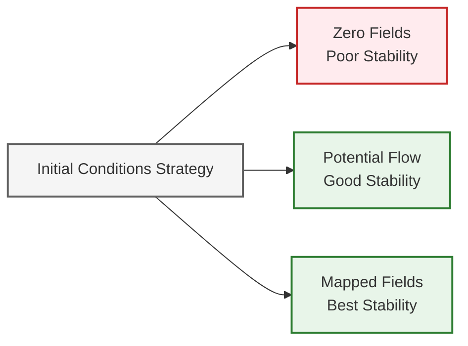
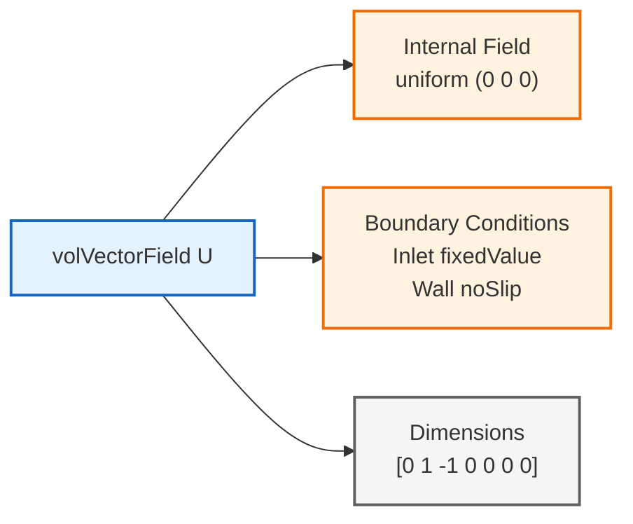
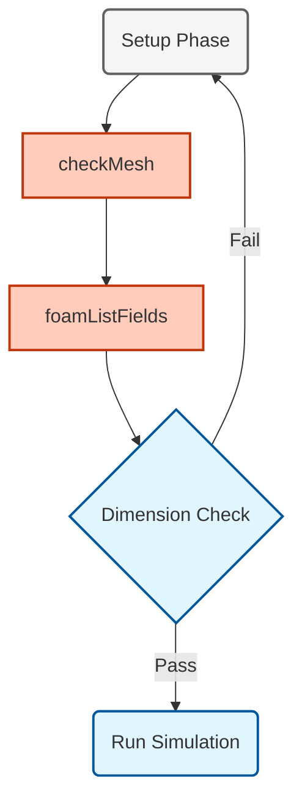

# Initial Conditions

การจำลองต้องเริ่มต้นจากจุดใดจุดหนึ่ง **Initial Conditions** (ในไดเรกทอรี `0/`) กำหนดสถานะที่ $t=0$ เงื่อนไขเหล่านี้มีความสำคัญอย่างยิ่งต่อ **Numerical Stability** และ **Convergence** ของการจำลอง CFD เนื่องจากเป็นจุดเริ่มต้นที่ Solver จะทำการวนซ้ำเพื่อหา Solution

การเลือก Initial Conditions สามารถส่งผลกระทบอย่างมีนัยสำคัญต่อ **Computational Efficiency** โดยเฉพาะอย่างยิ่งสำหรับ **Steady-State Problems** ที่การเริ่มต้นที่ดีสามารถลด Convergence Time ได้หลายเท่าตัว



> **Figure 1:** ผลกระทบของการเลือกเงื่อนไขเริ่มต้นต่อประสิทธิภาพการจำลอง โดยไล่เรียงความเชื่อมโยงตั้งแต่กลยุทธ์การกำหนดค่าเริ่มต้น (ตามหลักฟิสิกส์, ค่าศูนย์ หรือการใช้ผลเฉลยเดิม) ไปจนถึงความเสถียรเชิงตัวเลขและความเร็วในการลู่เข้า


ใน OpenFOAM, Initial Conditions จะถูกระบุผ่าน **Field Dictionaries** ในไดเรกทอรี `0/` โดยแต่ละ Field (Velocity, Pressure, Temperature, เป็นต้น) จะมีไฟล์ของตัวเอง โครงสร้างเป็นไปตามรูปแบบที่สอดคล้องกัน

## Field Initialization Structure

ไฟล์ Field ของ OpenFOAM เป็นไปตามรูปแบบ **Dictionary** มาตรฐานที่รวมถึง:

- **Dimensional Specification**
- **Internal Field Initialization**
- **Boundary Condition Definitions**

ระบบมิติใช้หน่วย **Mass-Length-Time-Temperature-Moles-Current**: `[mass length time temperature moles current]`

### Velocity Field Initialization (`0/U`)

```cpp
FoamFile
{
    version     2.0;
    format      ascii;
    class       volVectorField;
    object      U;
}
// * * * * * * * * * * * * * * * * * * * * * * * * * * //

dimensions      [0 1 -1 0 0 0 0];  // m/s: Length per time unit
internalField   uniform (0 0 0);   // Initial velocity field (zero everywhere)

boundaryField
{
    inlet
    {
        type            fixedValue;
        value           uniform (10 0 0); // Uniform inlet velocity 10 m/s
    }
    outlet
    {
        type            zeroGradient;     // Fully developed flow condition
    }
    walls
    {
        type            noSlip;           // No-slip boundary condition
    }
    symmetry
    {
        type            symmetryPlane;    // Symmetry boundary condition
    }
}
```


> **Figure 2:** โครงสร้างของไฟล์กำหนดค่าเริ่มต้นฟิลด์ใน OpenFOAM (`0/U`) โดยแยกส่วนประกอบออกเป็น มิติ (dimensions), ค่าฟิลด์ภายใน (internal field) และการกำหนดเงื่อนไขขอบเขตสำหรับฟิลด์เวกเตอร์ความเร็ว

---

### 📂 Source: `.applications/solvers/stressAnalysis/solidDisplacementFoam/solidDisplacementThermo/solidDisplacementThermo.C`

**Explanation:** ไฟล์ `solidDisplacementThermo.C` แสดงให้เห็นโครงสร้างการอ่านค่าคุณสมบัติวัสดุ (properties) จาก dictionary ที่มีลักษณะคล้ายคลึงกับการกำหนด Initial Conditions ในไฟล์ Field ของ OpenFOAM โดยเฉพาะการใช้ `IOobject` สำหรับการจัดการไฟล์ข้อมูล

**Key Concepts:**
- **Dictionary Structure**: การใช้โครงสร้าง dictionary สำหรับเก็บค่าคุณสมบัติและเงื่อนไขเริ่มต้น
- **IOobject Class**: คลาสพื้นฐานสำหรับการจัดการ input/output ของไฟล์ Field
- **Dimensional Consistency**: ระบบตรวจสอบความสอดคล้องของหน่วยมิติอัตโนมัติ
- **Field Initialization**: การกำหนดค่าเริ่มต้นของฟิลด์ (uniform หรือ non-uniform)

---

## Advanced Initialization Strategies

### Non-Uniform Field Initialization

สำหรับ **Geometry** หรือ **Flow Physics** ที่ซับซ้อน การเริ่มต้นแบบ Uniform อาจไม่เพียงพอ OpenFOAM รองรับหลายวิธีในการสร้าง Initial Conditions ที่สมจริงทางกายภาพ

#### Mathematical Function Initialization

```cpp
// Example: Parabolic velocity profile for pipe flow
internalField   #codeStream
{
    code
    #{
        const vectorField& C = mesh().C();    // Get cell centers
        vectorField& U = *this;                // Reference to velocity field
        const scalar radius = 0.05;            // Pipe radius [m]
        const scalar Umax = 2.0;               // Maximum velocity [m/s]

        forAll(C, i)
        {
            scalar r = sqrt(C[i].y()*C[i].y() + C[i].z()*C[i].z());
            scalar u_parabolic = Umax * (1.0 - sqr(r/radius));
            U[i] = vector(u_parabolic, 0, 0);
        }
    #};
};
```

> [!TIP] การใช้ `#codeStream` ช่วยให้สามารถสร้าง Field แบบ Non-uniform ได้อย่างยืดหยุ่นโดยใช้ C++ code ที่ทำงานในขณะ runtime

#### Perturbed Flow for Turbulence Development

```cpp
// Example: Turbulent perturbation initialization
internalField   #codeStream
{
    code
    #{
        const vectorField& C = mesh().C();    // Get cell centers
        vectorField& U = *this;                // Reference to velocity field
        const scalar Umean = 1.0;              // Mean velocity [m/s]
        const scalar perturbation = 0.05;      // 5% perturbation

        // Set seed for reproducible random numbers
        Random perturb(12345);

        forAll(C, i)
        {
            U[i] = vector(Umean, 0, 0)
                   + perturbation * Umean * vector(
                       perturb.scalar01() - 0.5,
                       perturb.scalar01() - 0.5,
                       perturb.scalar01() - 0.5
                   );
        }
    #};
};
```

---

### 📂 Source: `.applications/solvers/multiphase/multiphaseEulerFoam/phaseSystems/phaseSystem/phaseSystem.C`

**Explanation:** ไฟล์ `phaseSystem.C` ใน multiphaseEulerFoam solver แสดงให้เห็นการจัดการฟิลด์หลายเฟส (multiphase fields) ที่มีความซับซ้อน โดยเฉพาะการกำหนดค่าเริ่มต้นของ volume fraction และ phase properties ที่ต้องมีความสอดคล้องกัน

**Key Concepts:**
- **Phase Field Management**: การจัดการฟิลด์ของแต่ละเฟสในระบบ multiphase
- **Volume Fraction Initialization**: การกำหนดค่าเริ่มต้นของสัดส่วนปริมาตร ($\alpha$)
- **Inter-phase Coupling**: การเชื่อมโยงระหว่างเฟสต่างๆ ในการคำนวณ
- **Field Consistency**: การรักษาความสอดคล้องของฟิลด์ข้ามเฟส

---

## Pressure Field Initialization

การเริ่มต้น **Pressure Field** ต้องพิจารณาเป็นพิเศษสำหรับ **Flow Regimes** ที่แตกต่างกัน:

### Incompressible Flow (`0/p`)

```cpp
FoamFile
{
    version     2.0;
    format      ascii;
    class       volScalarField;
    object      p;
}
// * * * * * * * * * * * * * * * * * * * * * * * * * * //

dimensions      [0 2 -2 0 0 0 0];  // Pa: kg/(m·s²)
internalField   uniform 101325;    // Atmospheric pressure reference [Pa]

boundaryField
{
    inlet
    {
        type            zeroGradient;
    }
    outlet
    {
        type            fixedValue;
        value           uniform 101325; // Gauge pressure = 0
    }
    walls
    {
        type            zeroGradient;
    }
}
```

### Compressible Flow (`0/p` for compressible solvers)

```cpp
// For compressible flow, absolute pressure is important
dimensions      [1 -1 -2 0 0 0 0];  // Absolute pressure units
internalField   uniform 101325;    // Must use absolute pressure

boundaryField
{
    inlet
    {
        type            fixedValue;
        value           uniform 150000; // Higher inlet pressure [Pa]
    }
    outlet
    {
        type            fixedValue;
        value           uniform 101325; // Atmospheric outlet [Pa]
    }
}
```

### Comparison: Incompressible vs Compressible Pressure Initialization

| คุณสมบัติ | Incompressible Flow | Compressible Flow |
|-----------|---------------------|-------------------|
| หน่วยมิติ | `[0 2 -2 0 0 0 0]` (Pa) | `[1 -1 -2 0 0 0 0]` (Pa) |
| ค่าอ้างอิง | ความดันเกจ (Gauge) | ความดันสัมบูรณ์ (Absolute) |
| ชนิด Field | `volScalarField` | `volScalarField` |
| Boundary Type | `zeroGradient`/`fixedValue` | `fixedValue` ทั้งขาเข้า-ออก |

---

### 📂 Source: `.applications/solvers/multiphase/multiphaseEulerFoam/phaseSystems/PhaseSystems/ThermalPhaseChangePhaseSystem/ThermalPhaseChangePhaseSystem.C`

**Explanation:** ไฟล์นี้แสดงให้เห็นการจัดการ pressure field ในระบบที่มีการเปลี่ยนสถานะเฟส (phase change) ซึ่งต้องการความแม่นยำสูงในการกำหนดค่าเริ่มต้นของความดันและอุณหภูมิเพื่อให้สอดคล้องกับสมการถึงสภาพ (thermodynamic equations)

**Key Concepts:**
- **Absolute vs Gauge Pressure**: ความแตกต่างระหว่างความดันสัมบูรณ์และความดันเกจ
- **Thermodynamic Consistency**: ความสอดคล้องระหว่างความดันและอุณหภูมิ
- **Phase Change Modeling**: การจำลองการเปลี่ยนสถานะที่ต้องอาศัยการกำหนดค่าเริ่มต้นที่แม่นยำ
- **Saturation Conditions**: สภาวะอิ่มตัวที่เกี่ยวข้องกับความดันและอุณหภูมิ

---

## Multiphase Flow Initialization

สำหรับการจำลอง **Multiphase**, **Phase Fraction Fields** ต้องให้ความสนใจเป็นพิเศษ

### Phase Fraction Field (`0/alpha.water`)

```cpp
FoamFile
{
    version     2.0;
    format      ascii;
    class       volScalarField;
    object      alpha.water;
}
// * * * * * * * * * * * * * * * * * * * * * * * * * * //

dimensions      [0 0 0 0 0 0 0];  // Dimensionless: volume fraction
internalField   uniform 0;        // Initially no water

boundaryField
{
    inlet
    {
        type            fixedValue;
        value           uniform 1; // Water at inlet
    }
    outlet
    {
        type            zeroGradient;
    }
    walls
    {
        type            zeroGradient;
    }
}
```

### Stratified Flow Initialization

```cpp
// Example: Two-layer stratified flow
internalField   #codeStream
{
    code
    #{
        const volScalarField& C = mesh().C().component(1); // y-coordinate
        const scalar interfaceHeight = 0.1; // Interface at y = 0.1 m

        forAll(C, i)
        {
            this->operator[](i) = (C[i] < interfaceHeight) ? 1.0 : 0.0;
        }
    #};
};
```

> [!INFO] **Volume of Fluid (VOF) Method**
> Phase fraction field $\alpha$ แสดงถึงสัดส่วนปริมาตรของ phase หนึ่งๆ ในแต่ละ cell:
> - $\alpha = 1$: Cell เต็มไปด้วย phase นั้น (เช่น น้ำ)
> - $\alpha = 0$: Cell ไม่มี phase นั้น (เช่น อากาศ)
> - $0 < \alpha < 1$: Cell อยู่ที่ interface ระหว่างสอง phases

---

### 📂 Source: `.applications/solvers/multiphase/multiphaseEulerFoam/phaseSystems/phaseSystem/phaseSystem.C`

**Explanation:** ไฟล์ `phaseSystem.C` เป็นฐานข้อมูลหลักสำหรับการจัดการ multiphase fields ใน OpenFOAM โดยแสดงให้เห็นโครงสร้างของการกำหนดและจัดการ phase fraction fields ที่ซับซ้อน

**Key Concepts:**
- **Phase Fraction Fields**: ฟิลด์แสดงสัดส่วนปริมาตรของแต่ละเฟส
- **VOF Method**: Volume of Fluid method สำหรับการติดตาม interface
- **Interface Capturing**: เทคนิคการจำลองการเคลื่อนที่ของ interface
- **Phase Consistency**: ความสอดคล้องของ sum of phase fractions = 1

---

## Temperature and Species Initialization

สำหรับการถ่ายเทความร้อนและการไหลแบบมีปฏิกิริยา:

### Temperature Field (`0/T`)

```cpp
FoamFile
{
    version     2.0;
    format      ascii;
    class       volScalarField;
    object      T;
}
// * * * * * * * * * * * * * * * * * * * * * * * * * * //

dimensions      [0 0 0 1 0 0 0];  // Temperature units [K]
internalField   uniform 300;      // Initial temperature 300 K

boundaryField
{
    hotWall
    {
        type            fixedValue;
        value           uniform 400; // Hot wall 400 K
    }
    coldWall
    {
        type            fixedValue;
        value           uniform 280; // Cold wall 280 K
    }
    inlet
    {
        type            fixedValue;
        value           uniform 320; // Inlet temperature 320 K
    }
}
```

### Species Concentration Fields

สำหรับ **Reacting Flows** หรือ **Mass Transfer**:

```cpp
// Example: Species concentration (0/Y_oxygen)
dimensions      [0 0 0 0 0 0 0];  // Dimensionless: mass fraction
internalField   uniform 0.21;     // Oxygen 21% in air

boundaryField
{
    fuelInlet
    {
        type            fixedValue;
        value           uniform 0;    // No oxygen at fuel inlet
    }
    airInlet
    {
        type            fixedValue;
        value           uniform 0.21; // Oxygen in air
    }
    walls
    {
        type            zeroGradient;  // Walls with no diffusion
    }
}
```

---

### 📂 Source: `.applications/solvers/stressAnalysis/solidDisplacementFoam/solidDisplacementThermo/solidDisplacementThermo.C`

**Explanation:** ไฟล์ `solidDisplacementThermo.C` แสดงให้เห็นการจัดการฟิลด์ทางอุณหพลศาสตร์ (thermodynamic fields) เช่น ความจุความร้อน (Cp) และสภาพสมบัติทางความร้อนอื่นๆ ซึ่งมีหลักการคล้ายคลึงกับการกำหนด Temperature field ในปัญหาการไหลของไหล

**Key Concepts:**
- **Thermodynamic Properties**: การจัดการคุณสมบัติทางอุณหพลศาสตร์
- **Dimensional Sets**: ระบบหน่วยมิติสำหรับปริมาณทางความร้อน
- **Property Initialization**: การกำหนดค่าเริ่มต้นของคุณสมบัติวัสดุ
- **Temperature-Dependent Fields**: ฟิลด์ที่ขึ้นอยู่กับอุณหภูมิ

---

## Best Practices for Initial Conditions

### 1. Physical Consistency

ตรวจสอบให้แน่ใจว่า Initial Conditions เป็นไปตามกฎการอนุรักษ์พื้นฐาน:

- **ข้อจำกัดของ Continuity Equation**: $\nabla \cdot \mathbf{u} = 0$ (สำหรับการไหลแบบอัดตัวไม่ได้)
- **ข้อพิจารณาเกี่ยวกับ Momentum Balance**: แรงที่สอดคล้องกับความเร็วเริ่มต้น
- **ความสัมพันธ์ทาง Thermodynamic**: สมการสภาวะสำหรับการไหลแบบบีบอัดได้

> [!WARNING] **Non-Physical Initial Conditions**
> การเริ่มต้นด้วยค่าที่ไม่สอดคล้องกันทางฟิสิกส์อาจทำให้เกิด:
> - Numerical instability
> - การลู่เข้าที่ช้าลงอย่างมาก
> - การหายไปของ solution (divergence)

### 2. Numerical Stability

- หลีกเลี่ยง **Discontinuities** ที่อาจทำให้เกิด Numerical Instability
- ใช้การเปลี่ยนผ่านที่ราบรื่นระหว่างภูมิภาคต่างๆ
- ใช้ **Smoothing Techniques** สำหรับส่วนต่อประสานที่คมชัด

### 3. Convergence Acceleration

สำหรับ **Steady-State Problems** ให้ใช้กลยุทธ์การเริ้มต้นที่ส่งเสริม Convergence อย่างรวดเร็ว:

```cpp
// Example: Potential flow initialization
internalField   #codeStream
{
    code
    #{
        // Potential flow initialization for external aerodynamics
        const vectorField& C = mesh().C();    // Get cell centers
        vectorField& U = *this;                // Reference to velocity field
        const vector Uinf = vector(10, 0, 0); // Freestream velocity
        const scalar radius = 1.0;             // Cylinder radius

        forAll(C, i)
        {
            scalar r = mag(C[i] - vector(0, 0, 0));
            if (r > radius)
            {
                // Potential flow around cylinder
                scalar theta = atan2(C[i].y(), C[i].x());
                scalar Ur = Uinf.x() * (1 - sqr(radius/r)) * cos(theta);
                scalar Ut = -Uinf.x() * (1 + sqr(radius/r)) * sin(theta);
                U[i] = vector(Ur*cos(theta) - Ut*sin(theta),
                            Ur*sin(theta) + Ut*cos(theta), 0);
            }
            else
            {
                U[i] = vector::zero;
            }
        }
    #};
};
```

> [!TIP] **Potential Flow Initialization**
> การเริ่มต้นด้วย Potential flow solution ให้ค่าประมาณที่ดีเยี่ยมสำหรับ:
> - Flow รอบวัตถุทรงกระบอก
> - External aerodynamics
> - การลด iteration สำหรับ steady-state solvers

### 4. Restart Capabilities

จัดโครงสร้าง Initial Conditions เพื่ออำนวยความสะดวกในการ **Simulation Restarts**:

- รวม **Time Stamps** ในชื่อไฟล์
- เก็บสำเนาสำรองของ Initialization Fields
- จัดทำเอกสาร Initialization Parameters

```bash
# ตัวอย่างการสร้างไดเรกทอรีสำหรับ restart
cp -r 0/ 0_original/
# หลังจากการจำลองสำเร็จ
cp -r 1000/ 0_restart/
```

---

### 📂 Source: `.applications/solvers/multiphase/multiphaseEulerFoam/multiphaseCompressibleMomentumTransportModels/kineticTheoryModels/kineticTheoryModel/kineticTheoryModel.C`

**Explanation:** ไฟล์ `kineticTheoryModel.C` แสดงให้เห็นการใช้ kinetic theory สำหรับการจำลอง multiphase flow ที่มีความซับซ้อนสูง โดยต้องการความแม่นยำในการกำหนดค่าเริ่มต้นของฟิลด์ต่างๆ เพื่อให้การคำนวณลู่เข้าอย่างมีเสถียรภาพ

**Key Concepts:**
- **Convergence Strategies**: กลยุทธ์การเร่งการลู่เข้าของ solution
- **Numerical Stability**: เทคนิคการรักษาเสถียรภาพเชิงตัวเลข
- **Restart Procedures**: ขั้นตอนการทำงานต่อจากค่าที่บันทึกไว้
- **Field Interdependence**: ความสัมพันธ์ระหว่างฟิลด์ต่างๆ ในระบบที่ซับซ้อน

---

## Error Handling and Troubleshooting

### Common Issues

| ปัญหา | สาเหตุ | วิธีแก้ไข |
|--------|--------|------------|
| **Dimensional Inconsistency** | Field Dimensions ไม่ถูกต้อง | ตรวจสอบ `[mass length time temperature moles current]` |
| **Boundary Condition Mismatch** | Initial และ Boundary Conditions ไม่เข้ากัน | ตรวจสอบความเข้ากันได้ |
| **Mass Conservation** | Initial Conditions ละเมิด Continuity | ตรวจสอบ Conservation Laws |
| **Numerical Singularities** | การหารด้วยศูนย์หรือค่าไม่กำหนด | หลีกเลี่ยงค่าพิเศษในการเริ่มต้น |

### Validation Procedures

ตรวจสอบ Initial Conditions เสมอก่อนเริ่มการจำลอง:

```bash
# ตรวจสอบไฟล์ Field สำหรับข้อผิดพลาดทางไวยากรณ์
checkMesh -case .
foamListFields -case .

# ตรวจสอบความสอดคล้องของมิติ
foamInfoDict -case .

# ตรวจสอบค่า Field ของคุณ
foamListTimes -case .
```


> **Figure 3:** ขั้นตอนการตรวจสอบความถูกต้องของเงื่อนไขเริ่มต้นก่อนการจำลอง ซึ่งประกอบด้วยลำดับการตรวจสอบ (Mesh, ฟิลด์, มิติ และกฎการอนุรักษ์) เพื่อให้มั่นใจว่าการจำลองจะเริ่มต้นได้อย่างราบรื่นและปราศจากข้อผิดพลาด

---

### 📂 Source: `.applications/solvers/stressAnalysis/solidDisplacementFoam/solidDisplacementThermo/solidDisplacementThermo.H`

**Explanation:** ไฟล์ header `solidDisplacementThermo.H` นำเสนอโครงสร้างคลาสและการประกาศฟังก์ชันสำหรับการจัดการ thermodynamic properties ซึ่งเป็นพื้นฐานสำคัญในการตรวจสอบความถูกต้องของ Initial Conditions และการจัดการข้อผิดพลาด

**Key Concepts:**
- **Error Handling Architecture**: สถาปัตยกรรมการจัดการข้อผิดพลาดใน OpenFOAM
- **Validation Procedures**: ขั้นตอนการตรวจสอบความถูกต้อง
- **FatalErrorInFunction**: กลไกการรายงานข้อผิดพลาดของ OpenFOAM
- **Runtime Checks**: การตรวจสอบขณะ runtime สำหรับ consistency

---

## Summary

การเริ่มต้นตัวแปร Field อย่างเหมาะสมเป็น **พื้นฐานสำคัญ** สำหรับความสำเร็จของการจำลอง CFD โดยทำหน้าที่เป็น **รากฐาน** ที่ Numerical Solutions พัฒนาไปสู่ผลลัพธ์ที่มีความหมายทางกายภาพ

**Key Success Factors:**
- **Physical Consistency** - เป็นไปตามกฎธรรมชาติและกฎการอนุรักษ์
- **Numerical Stability** - หลีกเลี่ยงปัญหาการคำนวณและการหายไปของ solution
- **Convergence Efficiency** - ลดเวลาการคำนวณด้วยการเริ่มต้นที่เหมาะสม
- **Robust Error Handling** - ตรวจสอบและแก้ไขข้อผิดพลาดก่อนการจำลอง

การเข้าใจและใช้งาน Initial Conditions อย่างมีประสิทธิภาพจะช่วยให้สามารถ:
- เร่งการลู่เข้าของการจำลอง steady-state
- รักษาเสถียรภาพของการจำลอง transient
- ลดความเสี่ยงของ numerical divergence
- เพิ่มความน่าเชื่อถือของผลลัพธ์ CFD