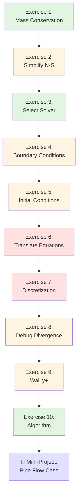

# 09_Exercises: Governing Equations & OpenFOAM Practice

> **ทำไมต้องทำแบบฝึกหัด?**
> - **ทฤษฎีอย่างเดียวไม่พอ** — ต้องลองคำนวณด้วยตัวเองจึงจะเข้าใจ
> - ฝึก **debug** ปัญหาที่พบบ่อยในการใช้งานจริง
> - เตรียมพร้อมสำหรับโปรเจคจริงที่ซับซ้อนกว่า
> - สร้างความมั่นใจในการตั้งค่า OpenFOAM case ด้วยตัวเอง

---

## 📍 Visual Learning Path



**Legend:**
- 🟢 Green (Beginner): Fundamental concepts
- 🟡 Yellow (Intermediate): Requires some experience
- 🔴 Red (Advanced): Complex problem-solving
- 🔵 Blue (Mini-Project): Comprehensive application

---

## Learning Objectives

หลังจากผ่านแบบฝึกหัดนี้ คุณจะสามารถ:

1. **อนุพันธ์** (Derive) สมการ conservation จาก first principles
2. **ลดรูป** (Simplify) สมการ Navier-Stokes สำหรับเงื่อนไขเฉพาะ
3. **เลือก** (Select) solver และ discretization schemes ที่เหมาะสม
4. **ตั้งค่า** (Configure) boundary conditions และ initial conditions ที่ถูกต้อง
5. **คำนวณ** (Calculate) ค่า turbulence parameters และ mesh requirements
6. **Debug** ปัญหา simulation divergence อย่าง systematic
7. **ตั้งค่า** (Set up) OpenFOAM case ตั้งแต่เริ่มจนจบ

---

## 📋 Exercise Index

| # | แบบฝึกหัด | ระดับ | เวลา | Prerequisites | Skills Developed |
|---|------------|--------|--------|---------------|------------------|
| 1 | [การอนุรักษ์มวล](#exercise-1-การอนุรักษ์มวล) | 🟢 Beginner | 15 นาที | [02_Conservation_Laws.md](02_Conservation_Laws.md) | Derivation, Control volume analysis |
| 2 | [ลดรูป Navier-Stokes](#exercise-2-ลดรูป-navier-stokes) | 🟡 Intermediate | 20 นาที | [01_Introduction.md](01_Introduction.md) | Equation simplification, Assumptions |
| 3 | [เลือก Solver](#exercise-3-เลือก-solver) | 🟢 Beginner | 10 นาที | [05_OpenFOAM_Implementation.md](05_OpenFOAM_Implementation.md) | Solver selection, Flow classification |
| 4 | [Boundary Conditions](#exercise-4-boundary-conditions) | 🟡 Intermediate | 25 นาที | [06_Boundary_Conditions.md](06_Boundary_Conditions.md) | BC syntax, U-p coupling |
| 5 | [Initial Conditions](#exercise-5-initial-conditions-for-turbulence) | 🟡 Intermediate | 15 นาที | [04_Dimensionless_Numbers.md](04_Dimensionless_Numbers.md), [07_Initial_Conditions.md](07_Initial_Conditions.md) | Turbulence parameters, IC calculation |
| 6 | [แปลสมการเป็น OpenFOAM](#exercise-6-แปลสมการเป็น-openfoam) | 🔴 Advanced | 20 นาที | [05_OpenFOAM_Implementation.md](05_OpenFOAM_Implementation.md) | fvm vs fvc, fvMatrix format |
| 7 | [Discretization Schemes](#exercise-7-เลือก-discretization-scheme) | 🔴 Advanced | 15 นาที | [05_OpenFOAM_Implementation.md](05_OpenFOAM_Implementation.md) | Scheme selection, Accuracy vs stability |
| 8 | [Debug Divergence](#exercise-8-debug-divergence) | 🟡 Intermediate | 20 นาที | [05_OpenFOAM_Implementation.md](05_OpenFOAM_Implementation.md), [06_Boundary_Conditions.md](06_Boundary_Conditions.md), [07_Initial_Conditions.md](07_Initial_Conditions.md) | Diagnostic workflow, Troubleshooting |
| 9 | [Wall y+ Calculation](#exercise-9-wall-y-calculation) | 🟡 Intermediate | 15 นาที | [04_Dimensionless_Numbers.md](04_Dimensionless_Numbers.md), [06_Boundary_Conditions.md](06_Boundary_Conditions.md) | y+ calculation, Mesh design |
| 10 | [Algorithm Selection](#exercise-10-algorithm-selection) | 🟢 Beginner | 10 นาที | [05_OpenFOAM_Implementation.md](05_OpenFOAM_Implementation.md) | SIMPLE/PISO/PIMPLE usage |
| **🎯** | [Mini-Project: Pipe Flow](#-mini-project-set-up-your-first-pipe-flow-case) | 🔴 Advanced | 2-3 ชม. | ทั้งหมด | End-to-end case setup |

---

## 📖 Glossary of Symbols & Notations

| Symbol | Meaning | Typical Units | Used In |
|--------|---------|---------------|---------|
| $\rho$ | Density | kg/m³ | Continuity, Momentum |
| $\mathbf{u}$ or $u, v, w$ | Velocity | m/s | All equations |
| $p$ | Pressure | Pa (or m²/s² for kinematic) | Momentum |
| $\mu$ | Dynamic viscosity | Pa·s | Momentum |
| $\nu$ | Kinematic viscosity | m²/s | N-S equation |
| $k$ | Turbulent kinetic energy | m²/s² | Turbulence modeling |
| $\epsilon$ | Dissipation rate | m²/s³ | k-ε model |
| $y^+$ | Dimensionless wall distance | - | Wall treatment |
| $Re$ | Reynolds number | - | Flow classification |
| $Ma$ | Mach number | - | Compressibility |
| $C_f$ | Skin friction coefficient | - | Wall y+ calculation |
| $u_\tau$ | Friction velocity | m/s | Wall y+ calculation |
| $\phi$ | General scalar variable | varies | Transport equation |
| $\alpha$ | Under-relaxation factor | - | Solver settings |

---

## Exercise 1: การอนุรักษ์มวล

**⚙️ ระดับ:** 🟢 Beginner | **⏱️ เวลา:** 15 นาที | **📖 Prerequisites:** [02_Conservation_Laws.md](02_Conservation_Laws.md)

### Learning Outcomes
- เข้าใจการอนุพันธ์สมการ continuity จาก control volume analysis
- เชื่อมโยงรูปแบบ integral กับ differential form
- ประยุกต์ใช้ Reynolds Transport Theorem

### โจทย์

หาสมการ Continuity สำหรับการไหล 1 มิติโดยใช้ control volume analysis

### ขั้นตอน

1. พิจารณา control volume ขนาด $dx$ และพื้นที่หน้าตัด $A$
2. คำนวณ:
   - มวลไหลเข้า: $\dot{m}_{in} = \rho u A$
   - มวลไหลออก: $\dot{m}_{out} = \left(\rho u + \frac{\partial(\rho u)}{\partial x}dx\right)A$
   - การสะสมมวล: $\frac{\partial \rho}{\partial t} A\, dx$

3. สมดุลมวล: สะสม = เข้า − ออก

### Common Pitfalls
- ❌ ลืมพิจารณา temporal term ($\partial \rho/\partial t$) สำหรับ unsteady flow
- ❌ สับสนระหว่าง Eulerian และ Lagrangian descriptions
- ❌ ไม่ระบุ assumptions (ในที่นี้ 1D, constant area)
- ❌ ลืมตรวจสอบ dimensional consistency

<details>
<summary><b>💡 คำใบ้ (Hint)</b></summary>

**Step-by-step guidance:**

1. **เริ่มจากสมการ:**
   $$\frac{\partial}{\partial t}(\rho A dx) = \dot{m}_{in} - \dot{m}_{out}$$

2. **แทนค่า mass flow rates:**
   $$\frac{\partial}{\partial t}(\rho A dx) = \rho u A - \left(\rho u + \frac{\partial(\rho u)}{\partial x}dx\right)A$$

3. **ตัด $A$ และ $dx$ ออก** (assuming constant area):
   $$\frac{\partial \rho}{\partial t} = -\frac{\partial(\rho u)}{\partial x}$$

4. **จัดรูปแบบให้สวยงาม:**
   $$\frac{\partial \rho}{\partial t} + \frac{\partial(\rho u)}{\partial x} = 0$$

**Physical interpretation:**
- Term 1: การเปลี่ยนแปลงของความหนาแน่นใน control volume
- Term 2: Net mass flow out of control volume
- Sum = 0: Conservation of mass
</details>

<details>
<summary><b>✅ ดูคำตอบ (Answer)</b></summary>

**สมการ Continuity 1D:**

$$\frac{\partial \rho}{\partial t} + \frac{\partial(\rho u)}{\partial x} = 0$$

**สำหรับ incompressible flow** ($\rho = \text{constant}$):
$$\frac{\partial u}{\partial x} = 0$$

**สำหรับ steady flow** ($\partial/\partial t = 0$):
$$\frac{\partial(\rho u)}{\partial x} = 0 \quad \Rightarrow \quad \rho u = \text{constant}$$

**ใน OpenFOAM:** สมการนี้ถูกบังคับผ่าน pressure correction ใน SIMPLE/PISO algorithm (ดูรายละเอียดใน [05_OpenFOAM_Implementation.md](05_OpenFOAM_Implementation.md))

**Self-Verification:**
- [ ] Dimensional analysis: แต่ละ term มีหน่วย [kg/(m³·s)] หรือไม่?
- [ ] เมื่อ $\rho$ = constant, ได้ $\nabla \cdot \mathbf{u} = 0$ หรือไม่?
- [ ] สมการสอดคล้องกับ mass balance หรือไม่?

**Physical Insight:**
- สมการ continuity คือ การแสดงว่า "มวลไม่หายไปไหน"
- ใน incompressible flow: volume flow rate คงที่ (ไม่ใช่ mass flow rate)
- ใน OpenFOAM: pressure equation คือ continuity equation ในรูปแบบอื่น
</details>

**🔗 Related Topics:**
- → [Exercise 2: ลดรูป Navier-Stokes](#exercise-2-ลดรูป-navier-stokes)
- → [Exercise 4: Boundary Conditions](#exercise-4-boundary-conditions)

---

## Exercise 2: ลดรูป Navier-Stokes

**⚙️ ระดับ:** 🟡 Intermediate | **⏱️ เวลา:** 20 นาที | **📖 Prerequisites:** [01_Introduction.md](01_Introduction.md)

### Learning Outcomes
- ฝึกลดรูปสมการ N-S ด้วย assumptions ที่กำหนด
- เข้าใจการแยกสมการ momentum ในแต่ละทิศทาง
- รู้จักว่า term ใดจะหายไปเมื่อใช้ assumptions ต่างๆ

### โจทย์

ลดรูปสมการ Navier-Stokes สำหรับ **steady, incompressible, 2D flow**

### สมการเต็ม (Vector Form)

$$\rho \left(\frac{\partial \mathbf{u}}{\partial t} + \mathbf{u} \cdot \nabla \mathbf{u}\right) = -\nabla p + \mu \nabla^2 \mathbf{u} + \mathbf{f}$$

### Common Pitfalls
- ❌ ลดรูปไม่ครบทุก term — ทำทีละขั้นตอน
- ❌ ลืมว่า $\rho$ = constant ทำให้ลดออกจาก viscous term ได้
- ❌ สับสน $\nabla^2 \mathbf{u}$ กับ $\nabla(\nabla \cdot \mathbf{u})$
- ❌ ลืมแยกสมการ momentum ในแต่ละทิศทาง
- ❌ ไม่ตรวจสอบ dimensional consistency หลังจากลดรูป

<details>
<summary><b>💡 คำใบ้ (Hint)</b></summary>

**Assumptions และผลกระทบ:**

1. **Steady flow** ($\frac{\partial}{\partial t} = 0$):
   - Unsteady term $\frac{\partial \mathbf{u}}{\partial t}$ หายไป
   - ไม่มี time derivative ในทุก equations

2. **Incompressible** ($\rho = \text{constant}$, $\nabla \cdot \mathbf{u} = 0$):
   - $\rho$ สามารถย้ายออกจาก derivatives ได้
   - Continuity: $\nabla \cdot \mathbf{u} = 0$

3. **2D flow** ($\frac{\partial}{\partial z} = 0$, $w = 0$):
   - Z-components หายไป
   - เหลือเฉพาะ x และ y directions

**Step-by-step:**
1. ใช้ steady assumption → remove $\partial/\partial t$
2. ใช้ 2D assumption → remove z-components
3. ใช้ incompressible → simplify $\rho$
4. แยกสมการ momentum ในแต่ละทิศทาง (x, y)

**Term-by-term breakdown:**
```
Steady:        ρ(∂u/∂t) = 0
2D:           w = 0, ∂/∂z = 0
Incompressible: ∇·u = ∂u/∂x + ∂v/∂y = 0
```
</details>

<details>
<summary><b>✅ ดูคำตอบ (Answer)</b></summary>

**ขั้นที่ 1: Apply Steady Assumption** ($\partial/\partial t = 0$)

$$\rho \mathbf{u} \cdot \nabla \mathbf{u} = -\nabla p + \mu \nabla^2 \mathbf{u} + \mathbf{f}$$

**ขั้นที่ 2: Apply 2D Assumption** ($\partial/\partial z = 0$, $w = 0$)

สมการ momentum ใน 2D แยกเป็น 2 components:

**X-momentum:**
$$\rho \left(u \frac{\partial u}{\partial x} + v \frac{\partial u}{\partial y}\right) = -\frac{\partial p}{\partial x} + \mu \left(\frac{\partial^2 u}{\partial x^2} + \frac{\partial^2 u}{\partial y^2}\right) + f_x$$

**Y-momentum:**
$$\rho \left(u \frac{\partial v}{\partial x} + v \frac{\partial v}{\partial y}\right) = -\frac{\partial p}{\partial y} + \mu \left(\frac{\partial^2 v}{\partial x^2} + \frac{\partial^2 v}{\partial y^2}\right) + f_y$$

**ขั้นที่ 3: Apply Incompressible Continuity**

$$\frac{\partial u}{\partial x} + \frac{\partial v}{\partial y} = 0$$

**ใน OpenFOAM:**
```cpp
// system/fvSchemes
ddtSchemes
{
    default         steadyState;  // ไม่มี unsteady terms
}

// Solver: simpleFoam
```

**Self-Verification:**
- [ ] Unsteady terms หายไปหมือนไม่?
- [ ] Z-components หายไปหรือไม่?
- [ ] แต่ละ term มี dimension ถูกต้องหรือไม่? ([Pa/m] หรือ [kg/(m²·s²)])
- [ ] Continuity equation ถูกต้องหรือไม่? ($\nabla \cdot \mathbf{u} = 0$)

**Physical Interpretation:**
- **Convection terms** ($u \frac{\partial u}{\partial x} + v \frac{\partial u}{\partial y}$): Non-linear terms ที่ทำให้ N-S ยาก
- **Pressure gradient** ($-\frac{\partial p}{\partial x}$): Driving force
- **Viscous terms** ($\mu \nabla^2 \mathbf{u}$): Diffusion ของ momentum
- **Body force** ($\mathbf{f}$): เช่น gravity

**Alternative Notation:**
ในหนังสือบางเล่ม ใช้ kinematic viscosity $\nu = \mu/\rho$:
$$u \frac{\partial u}{\partial x} + v \frac{\partial u}{\partial y} = -\frac{1}{\rho}\frac{\partial p}{\partial x} + \nu \left(\frac{\partial^2 u}{\partial x^2} + \frac{\partial^2 u}{\partial y^2}\right) + \frac{f_x}{\rho}$$
</details>

**🔗 Related Topics:**
- → [Exercise 1: Continuity Equation](#exercise-1-การอนุรักษ์มวล)
- → [Exercise 3: Solver Selection](#exercise-3-เลือก-solver)

---

## Exercise 3: เลือก Solver

**⚙️ ระดับ:** 🟢 Beginner | **⏱️ เวลา:** 10 นาที | **📖 Prerequisites:** [05_OpenFOAM_Implementation.md](05_OpenFOAM_Implementation.md)

### Learning Outcomes
- เลือก solver ที่เหมาะสมจาก flow parameters
- เข้าใจความแตกต่างระหว่าง solvers ต่างๆ
- จำแนก flow ตาม Reynolds number และ Mach number

### โจทย์

เลือก solver ที่เหมาะสมสำหรับสถานการณ์ต่อไปนี้

| กรณี | $Re$ | $Ma$ | ประเภท | Solver? |
|------|------|------|--------|---------|
| A | 1500 | 0.1 | Steady | ? |
| B | 50000 | 0.05 | Transient | ? |
| C | 10000 | 0.5 | Steady | ? |
| D | 500 | 0.02 | Transient + Free Surface | ? |

### Common Pitfalls
- ❌ ไม่พิจารณา turbulence vs laminar (ใช้ k-ε กับ low Re)
- ❌ ไม่พิจารณา compressibility (ใช้ incompressible solver กับ Ma > 0.3)
- ❌ สับสน steady vs transient solvers
- ❌ ลืมพิจารณา special physics (free surface, multiphase, etc.)

<details>
<summary><b>💡 คำใบ้ (Hint)</b></summary>

**Decision Tree:**

**1. Reynolds Number ($Re$):** ตัดสินใจ laminar หรือ turbulent
- $Re < 2300$: **Laminar** (pipe flow)
- $2300 < Re < 4000$: **Transition** (hard to predict)
- $Re > 4000$: **Turbulent** (need turbulence model)
- *ดูเพิ่มใน [04_Dimensionless_Numbers.md](04_Dimensionless_Numbers.md)*

**2. Mach Number ($Ma$):** ตัดสินใจ incompressible หรือ compressible
- $Ma < 0.3$: **Incompressible** (density ≈ constant)
- $Ma > 0.3$: **Compressible** (density varies significantly)

**3. Steady vs Transient:**
- **SIMPLE** สำหรับ steady-state
- **PISO** สำหรับ transient with small time steps
- **PIMPLE** สำหรับ transient with large time steps

**4. Special Physics:**
- **Free Surface:** ต้องใช้ VOF method (interFoam, interIsoFoam)
- **Multiphase:** multiphaseInterFoam, twoPhaseEulerFoam
- **Heat Transfer:** buoyantSimpleFoam, buoyantPimpleFoam

**Solver Families:**
```
Incompressible:
├── Steady:    simpleFoam
├── Transient: pimpleFoam, pisoFoam
└── Free Surface: interFoam

Compressible:
├── Steady:    rhoSimpleFoam
└── Transient: rhoPimpleFoam, rhoPisoFoam
```
</details>

<details>
<summary><b>✅ ดูคำตอบ (Answer)</b></summary>

| กรณี | Solver | เหตุผล |
|------|--------|--------|
| A | `simpleFoam` (laminar) | Steady, Incomp, Laminar ($Re < 2300$) |
| B | `pimpleFoam` + kEpsilon | Transient, Incomp, Turbulent ($Re > 4000$) |
| C | `rhoSimpleFoam` | Steady, Compressible ($Ma > 0.3$), Turbulent |
| D | `interFoam` (laminar) | Transient, Free surface, Laminar |

**Detailed Analysis:**

**กรณี A:**
- $Re = 1500 < 2300$ → Laminar flow
- $Ma = 0.1 < 0.3$ → Incompressible
- Steady → Use SIMPLE algorithm
- **Solver:** `simpleFoam` (no turbulence model needed)

**กรณี B:**
- $Re = 50,000 > 4000$ → Turbulent flow
- $Ma = 0.05 < 0.3$ → Incompressible
- Transient → Use PISO/PIMPLE
- **Solver:** `pimpleFoam` with k-ε model

**กรณี C:**
- $Re = 10,000 > 4000$ → Turbulent flow
- $Ma = 0.5 > 0.3$ → Compressible
- Steady → Use SIMPLE for compressible
- **Solver:** `rhoSimpleFoam`

**กรณี D:**
- $Re = 500 < 2300$ → Laminar flow
- $Ma = 0.02 < 0.3$ → Incompressible
- Transient + Free Surface → Use VOF method
- **Solver:** `interFoam`

**Self-Verification:**
- [ ] กรณี A: Re = 1500 → laminar ใช่หรือไม่?
- [ ] กรณี B: Re = 50,000 → turbulent ใช่หรือไม่?
- [ ] กรณี C: Ma = 0.5 → compressible ใช่หรือไม่?
- [ ] กรณี D: free surface ต้องใช้ VOF solver ใช่หรือไม่?

**หมายเหตุเพิ่มเติม:**
- กรณี C อาจใช้ `rhoPimpleFoam` ถ้าต้องการ transient
- กรณี D ถ้า $Re$ สูงกว่า 4000 ต้องใช้ `interFoam` + turbulence model
</details>

**🔗 Related Topics:**
- → [Exercise 10: Algorithm Selection](#exercise-10-algorithm-selection)
- → [Mini-Project: Pipe Flow](#mini-project-set-up-your-first-pipe-flow-case)

---

## Exercise 4: Boundary Conditions

**⚙️ ระดับ:** 🟡 Intermediate | **⏱️ เวลา:** 25 นาที | **📖 Prerequisites:** [06_Boundary_Conditions.md](06_Boundary_Conditions.md)

### Learning Outcomes
- เขียน BCs สำหรับ OpenFOAM อย่างถูกต้อง
- เข้าใจความสัมพันธ์ระหว่าง U และ p BCs
- หลีกเลี่ยงข้อผิดพลาดที่พบบ่อยในการตั้งค่า BCs

### โจทย์

เขียน BCs สำหรับ pipe flow ที่มี inlet velocity = 10 m/s

```
case/
├── 0/
│   ├── U     ← เขียน BC
│   └── p     ← เขียน BC
```

### Common Pitfalls
- ❌ **BC ขัดแย้ง:** fixedValue ทั้ง inlet และ outlet สำหรับทั้ง U และ p
- ❌ **ผิด dimensions:** ลืมระบุ dimensions หรือระบุผิด
- ❌ **ไม่ตรงกัน:** U inlet และ p outlet ไม่อยู่ตรงข้ามกัน
- ❌ **ผิด syntax:** ลืม semicolon `;` ปิดวงเล็บ `}`
- ❌ **ผิดประเภท:** ใช้ `fixedValue` แทนที่จะใช้ `zeroGradient` สำหรับ gradient BCs

<details>
<summary><b>💡 คำใบ้ (Hint)</b></summary>

**Golden Rule:** BC ของ U และ p ต้อง **ตรงกันข้าม** (opposite)

**Velocity-Pressure Coupling:**
```
Boundary | Velocity (U) | Pressure (p)
----------|-------------|---------------
Inlet     | fixedValue  | zeroGradient
Outlet    | zeroGradient| fixedValue
Walls     | noSlip      | zeroGradient
```

**Why opposite?**
- ถ้า fix ทั้ง velocity และ pressure ที่ inlet → over-constrained (ไม่มี degrees of freedom)
- Pressure-velocity coupling ใน incompressible flow ต้องการ BC ที่สมดุล

**Dimensions สำคัญมาก:**
- **Velocity (U):** `[0 1 -1 0 0 0 0]` = [m/s]
- **Pressure (p):** `[0 2 -2 0 0 0 0]` = [m²/s²] = [Pa/kg/m³] (kinematic pressure)

**Boundary Types:**
- `fixedValue`: กำหนดค่าคงที่
- `zeroGradient`: gradient = 0 (∂φ/∂n = 0)
- `noSlip`: velocity = 0 ที่ wall (special case of fixedValue)

**Common BC Combinations:**
```
Inlet-Outlet (Pipe flow):
  U_inlet = fixedValue (velocity specified)
  U_outlet = zeroGradient (fully developed)
  p_inlet = zeroGradient
  p_outlet = fixedValue 0 (reference pressure)

Wall:
  U_wall = noSlip
  p_wall = zeroGradient
```
</details>

<details>
<summary><b>✅ ดูคำตอบ: 0/U</b></summary>

```cpp
dimensions      [0 1 -1 0 0 0 0];
internalField   uniform (0 0 0);

boundaryField
{
    inlet
    {
        type    fixedValue;
        value   uniform (10 0 0);
    }
    outlet
    {
        type    zeroGradient;
    }
    walls
    {
        type    noSlip;
    }
}
```

**Explanation:**
- `inlet`: fixedValue (10 0 0) → กำหนด velocity 10 m/s ในทิศทาง x
- `outlet`: zeroGradient → velocity gradient = 0 (fully developed flow)
- `walls`: noSlip → velocity = 0 ที่ผนัง
</details>

<details>
<summary><b>✅ ดูคำตอบ: 0/p</b></summary>

```cpp
dimensions      [0 2 -2 0 0 0 0];
internalField   uniform 0;

boundaryField
{
    inlet
    {
        type    zeroGradient;
    }
    outlet
    {
        type    fixedValue;
        value   uniform 0;
    }
    walls
    {
        type    zeroGradient;
    }
}
```

**Explanation:**
- `inlet`: zeroGradient → pressure gradient = 0
- `outlet`: fixedValue 0 → reference pressure = 0 (gauge pressure)
- `walls`: zeroGradient → pressure gradient = 0 ที่ผนัง

**Self-Verification Checklist:**
- [ ] U inlet ใช้ fixedValue (10 0 0)
- [ ] U outlet ใช้ zeroGradient
- [ ] p inlet ใช้ zeroGradient
- [ ] p outlet ใช้ fixedValue 0
- [ ] ไม่มี BC ขัดแย้ง (inlet และ outlet ตรงข้ามกัน)
- [ ] dimensions ถูกต้องสำรอทั้ง U และ p
- [ ] Syntax ถูกต้อง (semicolons, braces)

**ถ้า simulation ไม่ converge:**
- ตรวจสอบ BC ว่าขัดแย้งกันหรือไม่
- ตรวจสอบว่า outlet pressure ถูกต้อง (reference pressure)
- ลองเปลี่ยน outlet BC เป็น `zeroGradient` ชั่วคราว

**Advanced BC Types:**
- `flowRateInletVelocity`: กำหนด flow rate แทน velocity
- `totalPressure`: กำหนด total pressure (p + ½ρu²)
- `fixedFluxPressure`: กำหนด pressure gradient
</details>

**🔗 Related Topics:**
- → [Exercise 5: Initial Conditions](#exercise-5-initial-conditions-for-turbulence)
- → [Exercise 8: Debug Divergence](#exercise-8-debug-divergence)

---

## Exercise 5: Initial Conditions for Turbulence

**⚙️ ระดับ:** 🟡 Intermediate | **⏱️ เวลา:** 15 นาที | **📖 Prerequisites:** [04_Dimensionless_Numbers.md](04_Dimensionless_Numbers.md), [07_Initial_Conditions.md](07_Initial_Conditions.md)

### Learning Outcomes
- คำนวณค่าเริ่มต้น k และ ε จาก flow parameters
- ตั้งค่า IC ที่เหมาะสมสำหรับ turbulent flow
- หลีกเลี่ยงข้อผิดพลาดจากการใช้ค่า IC = 0

### โจทย์

คำนวณค่าเริ่มต้น k และ epsilon สำหรับ:
- Velocity: $U = 10$ m/s
- Turbulence intensity: $I = 5\%$
- Length scale: $l = 0.01$ m

### Common Pitfalls
- ❌ **ใช้ค่า 0:** k = 0 หรือ ε = 0 → ทำให้ ν_t = 0 → simulation diverge
- ❌ **สมการผิด:** ใช้สูตรไม่ถูกต้องสำหรับ k และ ε
- ❌ **หน่วยผิด:** dimensions ของ k และ ε ไม่ถูกต้อง
- ❌ **ค่ามากเกินไป:** k หรือ ε สูงเกินไป → unstable
- ❌ **ลืม wall functions:** ไม่ใช้ wall function BCs สำหรับ k และ ε

<details>
<summary><b>💡 คำใบ้ (Hint)</b></summary>

**สูตรคำนวณ (ดูรายละเอียดใน [04_Dimensionless_Numbers.md](04_Dimensionless_Numbers.md)):**

**Turbulent Kinetic Energy (k):**
$$k = \frac{3}{2}(I \cdot U)^2$$

เมื่อ:
- $I$ = turbulence intensity (5% = 0.05)
- $U$ = mean velocity magnitude

**Dissipation Rate (ε):**
$$\epsilon = C_\mu^{0.75} \cdot k^{1.5} / l$$

เมื่อ:
- $C_\mu = 0.09$ (ค่าคงที่สำหรับ k-ε model)
- $l$ = turbulence length scale

**Unit Check:**
- $k$: [m²/s²] (specific turbulent kinetic energy)
- $\epsilon$: [m²/s³] (dissipation rate per unit mass)

**Typical Values:**
- **Low turbulence** (quiet flow): $I \approx 1\%$
- **Medium turbulence** (typical): $I \approx 5\%$
- **High turbulence** (jet, mixing): $I \approx 10-20\%$

**Length Scale Estimates:**
- Pipe flow: $l \approx 0.07 \times D$
- Channel flow: $l \approx 0.1 \times h$
- Free shear layer: $l \approx 0.1 \times \delta$ (layer thickness)

**หมายเหตุ:**
- ค่าเหล่านี้เป็นการประมาณเบื้องต้น
- ค่าจริงจะ converge ระหว่างการรัน simulation
- ค่า IC ไม่ต้องแม่นยำมาก แต่ต้องไม่เป็น 0
</details>

<details>
<summary><b>✅ ดูคำตอบ (Answer)</b></summary>

**ขั้นที่ 1: คำนวณ k**

$$k = \frac{3}{2}(I \cdot U)^2 = \frac{3}{2}(0.05 \times 10)^2 = \frac{3}{2}(0.5)^2 = 0.375 \text{ m}^2/\text{s}^2$$

**ขั้นที่ 2: คำนวณ ε**

$$\epsilon = C_\mu^{0.75} \cdot k^{1.5} / l = 0.09^{0.75} \times 0.375^{1.5} / 0.01$$

$$\epsilon = 0.165 \times 0.229 / 0.01 \approx 3.78 \text{ m}^2/\text{s}^3$$

**ไฟล์ 0/k:**
```cpp
dimensions      [0 2 -2 0 0 0 0];
internalField   uniform 0.375;

boundaryField
{
    inlet
    {
        type    fixedValue;
        value   uniform 0.375;
    }
    outlet
    {
        type    zeroGradient;
    }
    walls
    {
        type    kqRWallFunction;
        value   uniform 0.375;
    }
}
```

**ไฟล์ 0/epsilon:**
```cpp
dimensions      [0 2 -3 0 0 0 0];
internalField   uniform 3.78;

boundaryField
{
    inlet
    {
        type    fixedValue;
        value   uniform 3.78;
    }
    outlet
    {
        type    zeroGradient;
    }
    walls
    {
        type    epsilonWallFunction;
        value   uniform 3.78;
    }
}
```

**Self-Verification:**
- [ ] k มี dimension [0 2 -2 0 0 0 0] ถูกต้องหรือไม่?
- [ ] ε มี dimension [0 2 -3 0 0 0 0] ถูกต้องหรือไม่?
- [ ] k และ ε ไม่เป็น 0
- [ ] คำนวณถูกต้อง: k ≈ 0.375, ε ≈ 3.78
- [ ] ใช้ wall functions ที่ walls?

**Physical Interpretation:**
- k = 0.375 m²/s² → พลังงานจลน์ของ turbulence (เฉลี่ย)
- ε = 3.78 m²/s³ → อัตราการสลายตัวของ turbulence
- อัตราส่วน k/ε → time scale ของ turbulence: τ = k/ε ≈ 0.1 s

**ถ้า Simulation Diverge:**
- ลองลดค่า k และ ε ลง (เช่น ครึ่งหนึ่ง)
- หรือใช้ค่า I ต่ำกว่า (เช่น 1-2%)
</details>

**🔗 Related Topics:**
- → [Exercise 4: Boundary Conditions](#exercise-4-boundary-conditions)
- → [Exercise 9: Wall y+ Calculation](#exercise-9-wall-y-calculation)

---

## Exercise 6: แปลสมการเป็น OpenFOAM

**⚙️ ระดับ:** 🔴 Advanced | **⏱️ เวลา:** 20 นาที | **📖 Prerequisites:** [05_OpenFOAM_Implementation.md](05_OpenFOAM_Implementation.md)

### Learning Outcomes
- แปลสมการ PDE เป็น fvMatrix format
- เลือกใช้ `fvm::` กับ `fvc::` อย่างถูกต้อง
- เข้าใจความแตกต่างระหว่าง implicit และ explicit discretization

### โจทย์

แปลสมการ scalar transport เป็น fvMatrix

$$\frac{\partial T}{\partial t} + \nabla \cdot (\mathbf{u} T) = \nabla \cdot (D \nabla T) + S$$

เมื่อ:
- $T$ = scalar field (เช่น temperature)
- $\mathbf{u}$ = velocity field (known)
- $D$ = diffusivity coefficient
- $S$ = source term

### Common Pitfalls
- ❌ **ใช้ fvc แทน fvm:** สำหรับ unknown field → ไม่ converge
- ❌ **ใช้ fvm แทน fvc:** สำหรับ known field → เสียเวลาคำนวณ
- ❌ **ลืม source term:** ไม่รวม S ในสมการ
- ❌ **ลืม relax:** ไม่ใช้ under-relaxation สำหรับ non-linear problems
- ❌ **สับสน phi:** ลืมว่า `phi = rho*U*f` (flux field)

<details>
<summary><b>💡 คำใบ้ (Hint)</b></summary>

**Implicit vs Explicit:**

**`fvm::` (Finite Volume Matrix):** Implicit discretization
- Field เป็น **unknown** ที่ต้องการแก้
- สร้าง matrix coefficients: $[A]\{x\} = \{b\}$
- แก้ร่วมกับ unknown values ใน system of equations
- เสถียรกว่า สำหรับ time stepping ขนาดใหญ่
- ตัวอย่าง: `fvm::ddt(T)`, `fvm::div(phi, T)`, `fvm::laplacian(D, T)`

**`fvc::` (Finite Volume Calculus):** Explicit discretization
- Field เป็น **known** จาก time step ก่อนหน้า
- คำนวณจาก field ปัจจุบันที่รู้ค่าแล้ว
- ใส่ใน source term (right-hand side)
- เร็วกว่า แต่อาจ unstable สำหรับ large time steps
- ตัวอย่าง: `fvc::grad(p)`, `fvc::div(phi)`, `fvc::laplacian(nu, U)`

**Mapping PDE to OpenFOAM:**

| PDE Term | OpenFOAM | Implicit/Explicit | Note |
|----------|----------|-------------------|------|
| $\frac{\partial T}{\partial t}$ | `fvm::ddt(T)` | Implicit | T เป็น unknown |
| $\nabla \cdot (\mathbf{u} T)$ | `fvm::div(phi, T)` | Implicit | T เป็น unknown |
| $\nabla \cdot (D \nabla T)$ | `fvm::laplacian(D, T)` | Implicit | T เป็น unknown |
| $-\nabla p$ | `-fvc::grad(p)` | Explicit | p เป็น known |
| $S$ | `fvOptions(T)` | Either | Depends on setup |

**Guideline:**
- ใช้ `fvm::` เมื่อ field เป็น unknown ที่ต้องการแก้
- ใช้ `fvc::` เมื่อ field เป็นค่าที่รู้แล้ว หรือต้องการคำนวณ explicit
- Pressure gradient ใช้ `fvc::` เพราะ pressure ถูกแก้แยกจาก velocity

**Special Note:**
- `phi` = surface flux field = $\rho \mathbf{u} \cdot \mathbf{S}_f$ (where $\mathbf{S}_f$ = face area vector)
- ใน incompressible flow: `phi = U & mesh.Sf()` (if rho = 1)
</details>

<details>
<summary><b>✅ ดูคำตอบ (Answer)</b></summary>

**Implicit Implementation (Recommended):**

```cpp
fvScalarMatrix TEqn
(
    fvm::ddt(T)                    // ∂T/∂t - implicit
  + fvm::div(phi, T)               // ∇·(uT) - implicit (T เป็น unknown)
  - fvm::laplacian(D, T)           // -∇·(D∇T) - implicit
 ==
    fvOptions(T)                   // Source term S
);

TEqn.relax();                      // Under-relaxation (optional)
TEqn.solve();                      // Solve linear system
```

**คำอธิบาย:**
- `fvm::ddt(T)`: Time derivative - implicit (T เป็น unknown)
- `fvm::div(phi, T)`: Convection - implicit (T เป็น unknown)
- `fvm::laplacian(D, T)`: Diffusion - implicit (T เป็น unknown)
- `fvOptions(T)`: Source terms (explicit/implicit ขึ้นกับการตั้งค่า)
- `TEqn.relax()`: Under-relaxation เพื่อ stability
- `TEqn.solve()`: Solve linear system $[A]\{T\} = \{b\}$

**Explicit Convection Alternative:**

```cpp
solve
(
    fvm::ddt(T)
  + fvc::div(phi, T)     // Explicit convection (เร็วกว่า แต่อาจ unstable)
  - fvm::laplacian(D, T)
 ==
    fvOptions(T)
);
```

**ข้อดี/ข้อเสีย:**

| Method | Pros | Cons |
|--------|------|------|
| **Fully implicit** | เสถียรกว่า, ใช้ time step ใหญ่ได้ | ช้ากว่า, ใช้ memory มาก |
| **Explicit convection** | เร็วกว่า, ใช้ memory น้อย | อาจ unstable, ต้องใช้ time step เล็ก |

**Self-Verification:**
- [ ] ใช้ `fvm::` สำหรับทุก term ที่มี T เป็น unknown?
- [ ] สมการมีรูปแบบ `fvScalarMatrix TEqn(...);`?
- [ ] มีการเรียก `TEqn.solve()`?
- [ ] ถ้าใช้ explicit, ได้ตรวจสอบ Courant number หรือไม่?

**Physical Interpretation:**
- **Transient term** ($\partial T/\partial t$): การเปลี่ยนแปลงของ T เมื่อเวลาผ่านไป
- **Convection term** ($\nabla \cdot (\mathbf{u} T)$): การลากของ T โดย velocity field
- **Diffusion term** ($\nabla \cdot (D \nabla T)$): การแพร่ของ T จาก gradient
- **Source term** ($S$): generation/destruction ของ T

**Advanced: Pressure-Velocity Coupling**

ใน momentum equation, pressure gradient ใช้ `fvc::`:
```cpp
// Momentum equation
solve
(
    fvm::ddt(U)
  + fvm::div(phi, U)
  - fvm::laplacian(nu, U)
 ==
  - fvc::grad(p)  // Explicit - p เป็น known จาก iteration ก่อนหน้า
);
```

ทำไม? เพราะ:
1. Pressure ถูกแก้แยกจาก velocity (pressure correction equation)
2. เมื่อแก้ momentum equation, pressure field เป็น "known" จาก iteration ก่อนหน้า
3. ดังนั้น $-\nabla p$ จึงเป็น **explicit force term**
</details>

**🔗 Related Topics:**
- → [Exercise 7: Discretization Schemes](#exercise-7-เลือก-discretization-scheme)
- → [Concept Check 1: fvm vs fvc](#concept-check)

---

## Exercise 7: เลือก Discretization Scheme

**⚙️ ระดับ:** 🔴 Advanced | **⏱️ เวลา:** 15 นาที | **📖 Prerequisites:** [05_OpenFOAM_Implementation.md](05_OpenFOAM_Implementation.md)

### Learning Outcomes
- เลือก discretization schemes ที่เหมาะสมกับ flow characteristics
- เข้าใจ trade-off ระหว่าง accuracy และ stability
- รู้จัก schemes ที่พบบ่อยใน OpenFOAM

### โจทย์

เลือก scheme ใน `fvSchemes` สำหรับ **high-Re turbulent flow**

| Term | Scheme? | เหตุผล? |
|------|---------|---------|
| `div(phi,U)` | ? | ? |
| `laplacian(nuEff,U)` | ? | ? |
| `grad(p)` | ? | ? |

### Common Pitfalls
- ❌ **ใช้ linear ทั้งหมด:** อาจ unstable สำหรับ high-Re flow
- ❌ **ใช้ upwind ทั้งหมด:** numerical diffusion สูงเกินไป
- ❌ **ไม่พิจารณา mesh quality:** ใช้ `linear` กับ non-orthogonal mesh
- ❌ **ลืม corrected:** ใช้ `Gauss linear` แทน `Gauss linear corrected`
- ❌ **ไม่ใช้ limiter:** ใช้ `linear` สำหรับ turbulence → oscillations

<details>
<summary><b>💡 คำใบ้ (Hint)</b></summary>

**Convection Schemes (divSchemes):**

| Scheme | Order | Accuracy | Stability | Boundedness | Use Case |
|--------|-------|----------|-----------|-------------|----------|
| `upwind` | 1st | Low | High | Guaranteed | Initial iterations, turbulence |
| `linear` | 2nd | High | Low | Not guaranteed | Simple cases, low Re |
| `linearUpwind` | 2nd | High | Medium-High | Not guaranteed | Momentum (stable) |
| `limitedLinear` | 2nd | High | Medium | Guaranteed | Final converged solutions |
| `quick` | 3rd | Very High | Low | Not guaranteed | Structured meshes, research |

**Laplacian Schemes:**

| Scheme | Description | Use Case |
|--------|-------------|----------|
| `Gauss linear` | 2nd order central differencing | Orthogonal meshes |
| `Gauss linear corrected` | + non-orthogonal correction | Non-orthogonal meshes (recommended) |
| `Gauss linear uncorrected` | No correction | Debugging only |

**Gradient Schemes:**

| Scheme | Description | Use Case |
|--------|-------------|----------|
| `Gauss linear` | Standard central differencing | General use |
| `cellLimited Gauss linear` | Limited to prevent overshoots | High gradient flows |
| `leastSquares` | For non-orthogonal meshes | Poor quality meshes |

**Guidelines for High-Re Turbulent Flow:**

1. **Momentum (div(phi,U)):**
   - `linearUpwind` → 2nd order, stable
   - หรือ `limitedLinear` → 2nd order + bounded

2. **Turbulence (div(phi,k), div(phi,epsilon)):**
   - `upwind` → bounded, stable
   - turbulence sensitive ต่อ oscillations

3. **Laplacian:**
   - `linear corrected` → สำคัญสำหรับ non-orthogonal mesh

4. **Gradient:**
   - `cellLimited` → prevent overshoots

**Trade-off Summary:**
```
Accuracy vs Stability:
  upwind    → Low accuracy, High stability
  linear    → High accuracy, Low stability
  linearUpwind  → High accuracy, Medium stability
  limitedLinear → High accuracy, Medium stability, Bounded
```
</details>

<details>
<summary><b>✅ ดูคำตอบ (Answer)</b></summary>

**Recommended Configuration:**

```cpp
divSchemes
{
    default         none;
    div(phi,U)      Gauss linearUpwind grad(U);  // 2nd order, stable
    div(phi,k)      Gauss upwind;                // 1st order for turbulence
    div(phi,epsilon) Gauss upwind;
}

laplacianSchemes
{
    default         Gauss linear corrected;      // 2nd order, correct non-ortho
}

gradSchemes
{
    default         Gauss linear;                // Standard central
    grad(U)         cellLimited Gauss linear 1;  // Limited for stability
}
```

**เหตุผล:**

**1. Convection (divSchemes):**
- **`div(phi,U)`:** `Gauss linearUpwind grad(U)`
  - 2nd order accuracy
  - More stable than `linear` (upwind-biased)
  - Good for momentum in turbulent flows

- **`div(phi,k)`, `div(phi,epsilon)`:** `Gauss upwind`
  - 1st order accuracy
  - Bounded (no negative values)
  - Turbulence quantities sensitive ต่อ oscillations
  - k, ε must be > 0

**2. Laplacian:**
- **`Gauss linear corrected`:**
  - 2nd order central differencing
  - **Corrected** สำคัญมากสำหรับ non-orthogonal meshes
  - แก้ไข error จาก non-orthogonality

**3. Gradient:**
- **`grad(U)`:** `cellLimited Gauss linear 1`
  - Limited to prevent overshoots
  - 1 = limiter coefficient (0 = most limiting, 1 = no limiting)
  - สำคัญสำหรับ flows ที่มี high gradients

**Self-Verification:**
- [ ] ใช้ 2nd order scheme สำหรับ momentum?
- [ ] ใช้ bounded scheme สำหรับ turbulence?
- [ ] มี non-orthogonality correction สำหรับ laplacian?
- [ ] ใช้ limiter สำหรับ gradients?

**Alternative (More Aggressive):**

```cpp
divSchemes
{
    div(phi,U)      Gauss limitedLinear 1;       // 2nd order + limiter
    div(phi,k)      Gauss limitedLinear 1;       // 2nd order for k (risky)
}
```

**Progressive Strategy (Recommended for Hard Cases):**

1. **Initial iterations:**
   ```cpp
   div(phi,U)      Gauss upwind;  // Stable, start with this
   ```

2. **Intermediate:**
   ```cpp
   div(phi,U)      Gauss linearUpwind grad(U);  // Switch to this
   ```

3. **Final convergence:**
   ```cpp
   div(phi,U)      Gauss limitedLinear 1;  // For final accuracy
   ```

**Scheme Comparison:**

| Scheme | Numerical Diffusion | Stability | CPU Time | Recommendation |
|--------|---------------------|-----------|----------|----------------|
| `upwind` | High | Very High | Low | Initial iterations |
| `linearUpwind` | Low-Medium | High | Medium | **Recommended** |
| `limitedLinear` | Low | Medium | Medium | Final convergence |
| `linear` | Very Low | Low | Low | Simple cases only |

**ถ้า Unstable:**
- เปลี่ยนจาก `linearUpwind` → `upwind`
- หรือใช้ `limitedLinear` ด้วย limiter ที่เข้มขึ้น
- ลด under-relaxation factors

**ถ้า Diffusive (ค่าลดเร็วเกินไป):**
- เปลี่ยนจาก `upwind` → `linearUpwind`
- หรือใช้ `limitedLinear` ด้วย limiter ที่น้อยลง
</details>

**🔗 Related Topics:**
- → [Exercise 6: Translate Equations](#exercise-6-แปลสมการเป็น-openfoam)
- → [Concept Check 5: Scheme Differences](#concept-check)

---

## Exercise 8: Debug Divergence

**⚙️ ระดับ:** 🟡 Intermediate | **⏱️ เวลา:** 20 นาที | **📖 Prerequisites:** [05-07](05_OpenFOAM_Implementation.md), [06_Boundary_Conditions.md](06_Boundary_Conditions.md), [07_Initial_Conditions.md](07_Initial_Conditions.md)

### Learning Outcomes
- วินิจฉัยสาเหตุของ simulation divergence
- แก้ไขปัญหา divergence อย่าง systematic
- ใช้เครื่องมือ diagnostic ใน OpenFOAM

### โจทย์

Simulation diverge ที่ time step แรก เห็นใน log:

```
Solving for Ux, Initial residual = 1, Final residual = 1e+20, No Iterations 1
Floating point exception
```

สาเหตุที่เป็นไปได้? วิธีแก้?

### Common Pitfalls
- ❌ **เริ่มจาก solver settings ก่อน:** ต้องเริ่มจากพื้นฐานก่อน (IC, BC, mesh)
- ❌ **ไม่ check mesh:** mesh quality แย่มักเป็นสาเหตุหลัก
- ❌ **ปรับมากเกินไป:** เพิ่ม under-relaxation มากเกินไป → ช้ามาก
- ❌ **ลืม check log:** ไม่ดู error messages อย่างละเอียด
- ❌ **แก้ผิดจุด:** เปลี่ยน solver แทนที่จะแก้ BCs

<details>
<summary><b>💡 คำใบ้ (Hint)</b></summary>

**Debug Workflow (เรียงลำดับความน่าจะเป็น):**

```
1. Mesh Quality (15%)
   ↓
2. Initial Conditions (40%)
   ↓
3. Boundary Conditions (30%)
   ↓
4. Time Step (10%)
   ↓
5. Solver Settings (5%)
```

**สาเหตุที่พบบ่อย:**

**1. Initial Conditions ไม่ถูกต้อง (40%)**
- k = 0 หรือ epsilon = 0 → ν_t = 0 → viscous term หาย
- U = 0 ทั่วหมด → ไม่มี convection
- Pressure = 0 ทั่วหมด → ไม่มี driving force

**2. Boundary Conditions ขัดแย้งกัน (30%)**
- fixedValue ทั้ง U และ p ที่ outlet
- ไม่มี pressure reference point
- Inlet/outlet ไม่ตรงข้ามกัน

**3. Mesh Quality Problems (15%)**
- Non-orthogonality สูง (> 70°)
- Aspect ratio สูง (> 1000)
- Skewness สูง (> 2)

**4. Time Step ใหญ่เกินไป (10%)**
- Courant number (Co) > 1
- สำหรับ transient cases

**5. Under-Relaxation สูงเกินไป (5%)**
- ค่าเริ่มต้นสูงเกินไปสำหรับ hard case

**Diagnostic Tools:**
```bash
checkMesh -allTopology -allGeometry  # ตรวจสอบ mesh
foamListTimes                        # ดู time steps
grep "Solving for" log.*             # ดู residuals
grep "continuity" log.*              # ดู mass balance
```

**Diagnostic Commands:**
```bash
# Check mesh
checkMesh

# View residuals in real-time
tail -f log.simpleFoam | grep "Solving for"

# Check Courant number (transient)
foamListTimes
grep "Courant" log.simpleFoam
```
</details>

<details>
<summary><b>✅ ดูคำตอบ (Answer)</b></summary>

**สาเหตุที่เป็นไปได้ (เรียงจากมากไปน้อย):**

### 1. Initial Conditions ไม่ถูกต้อง (40%)

**Symptoms:**
- k = 0 หรือ epsilon = 0
- U = 0 ทั่วหมด
- Diverge ที่ iteration แรกๆ

**แก้ไข:**
```cpp
// 0/k
internalField   uniform 0.375;  // ไม่ใช่ 0!

// 0/epsilon
internalField   uniform 3.73;   // ไม่ใช่ 0!

// 0/U
internalField   uniform (5 0 0);  // ไม่ใช่ (0 0 0)
```

**Physical Explanation:**
- k = 0 → ν_t = 0 → ไม่มี turbulent viscosity
- ใน high-Re flow, ν_t >> ν (molecular viscosity)
- ถ้า ν_t = 0, effective viscosity ต่ำเกินไป → unstable

### 2. Boundary Conditions ขัดแย้งกัน (30%)

**Symptoms:**
- Residuals ไม่ลดลง
- "floating point exception"
- Continuity errors สูง

**แก้ไข:**
- Inlet: fixedValue U + zeroGradient p
- Outlet: zeroGradient U + fixedValue p = 0
- Walls: noSlip U + zeroGradient p

```cpp
// CORRECT:
// 0/U
inlet   { type fixedValue; value uniform (10 0 0); }
outlet  { type zeroGradient; }

// 0/p
inlet   { type zeroGradient; }
outlet  { type fixedValue; value uniform 0; }
```

### 3. Mesh Quality Problems (15%)

**Symptoms:**
- "floating point exception"
- สมการไม่ converge แม้จะปรับ settings แล้ว

**Check:**
```bash
checkMesh -allTopology -allGeometry
```

**แก้ไข:**
- Non-orthogonality > 70° → สร้าง mesh ใหม่
- หรือเพิ่ม nNonOrthogonalCorrectors:
  ```cpp
  SIMPLE
  {
      nNonOrthogonalCorrectors 2;  // เพิ่มจาก 1
  }
  ```

### 4. Time Step ใหญ่เกินไป (10%)

**Symptoms:**
- Courant number > 1
- Diverge หลังจาก few iterations

**Check:**
```bash
grep "Courant number" log.simpleFoam
```

**แก้ไข:**
```cpp
// controlDict
deltaT          0.001;
adjustTimeStep  yes;
maxCo           0.5;  // หรือ 0.3 สำหรับ stability
```

### 5. Under-Relaxation สูงเกินไป (5%)

**Symptoms:**
- Oscillating residuals
- Diverge หลังจากหลาย iterations

**แก้ไข:**
```cpp
// fvSolution
relaxationFactors
{
    fields
    {
        p   0.2;  // ลดจาก 0.3
    }
    equations
    {
        U       0.4;  // ลดจาก 0.5
        k       0.4;
        epsilon 0.4;
    }
}
```

**Common Pitfalls Summary:**
- ❌ ลืมกำหนด k และ epsilon สำหรับ turbulent flow
- ❌ ใช้ fixedValue p ทั้ง inlet และ outlet
- ❌ ไม่ check mesh ก่อนรัน
- ❌ Time step ใหญ่เกินไปสำหรับ transient
- ❌ IC = 0 ทั่วหมด → divergence

**Self-Verification Checklist:**
- [ ] `checkMesh` passes without severe errors?
- [ ] k > 0 และ epsilon > 0?
- [ ] BCs ไม่ขัดแย้งกัน?
- [ ] Courant number < 1?
- [ ] Under-relaxation factors สมเหตุสมผล?

**Debugging Flowchart:**
```
Start
  ↓
Check mesh → Fail? → Remesh
  ↓ Pass
Check ICs → k,ε = 0? → Fix ICs
  ↓ OK
Check BCs → Conflict? → Fix BCs
  ↓ OK
Check Co → Co > 1? → Reduce Δt
  ↓ OK
Check relaxation → Too high? → Reduce
  ↓ OK
Should converge now!
```
</details>

**🔗 Related Topics:**
- → [Exercise 4: Boundary Conditions](#exercise-4-boundary-conditions)
- → [Exercise 5: Initial Conditions](#exercise-5-initial-conditions-for-turbulence)
- → [Mini-Project: Pipe Flow](#mini-project-set-up-your-first-pipe-flow-case)

---

## Exercise 9: Wall y+ Calculation

**⚙️ ระดับ:** 🟡 Intermediate | **⏱️ เวลา:** 15 นาที | **📖 Prerequisites:** [04_Dimensionless_Numbers.md](04_Dimensionless_Numbers.md), [06_Boundary_Conditions.md](06_Boundary_Conditions.md)

### Learning Outcomes
- คำนวณ first cell height จากค่า y+ ที่ต้องการ
- เข้าใจความสัมพันธ์ระหว่าง y+, mesh, และ wall treatment
- เลือก wall treatment ที่เหมาะสมกับ mesh resolution

### โจทย์

คำนวณ first cell height สำหรับ:
- $y^+ = 50$ (wall functions)
- $U = 20$ m/s
- $L = 1$ m (ความยาวลักษณะเฉพาะ)
- $\nu = 1.5 \times 10^{-5}$ m²/s (air at 20°C)

### Common Pitfalls
- ❌ **ไม่คำนวณ y+:** เลยกำหนด first cell height แบบสุ่ม
- ❌ **ใช้สูตรผิด:** ใช้สูตรที่ไม่เหมาะสมกับ flow
- ❌ **ไม่ปรับ mesh:** ไม่ตรวจสอบ y+ หลังจากรัน
- ❌ **สับสน y+ กับ y*:** y* ต่างจาก y+ (y* ใช้สำหรับ compressible)
- ❌ **ไม่รู้จัก wall treatments:** ใช้ wall function กับ low-Re mesh

<details>
<summary><b>💡 คำใบ้ (Hint)</b></summary>

**ขั้นตอนการคำนวณ:**

**1. คำนวณ Reynolds number:**
$$Re = \frac{UL}{\nu}$$

**2. ประมาณ skin friction coefficient:**
$$C_f \approx 0.058 \cdot Re^{-0.2}$$

(suitable for turbulent pipe/plate flow)

**3. คำนวณ friction velocity:**
$$u_\tau = U \sqrt{C_f/2}$$

**4. คำนวณ first cell height:**
$$y = \frac{y^+ \cdot \nu}{u_\tau}$$

**Wall Treatment Guidelines (ดูเพิ่มใน [06_Boundary_Conditions.md](06_Boundary_Conditions.md)):**

| Wall Treatment | y+ Range | First Cell | Solver | Use Case |
|----------------|----------|------------|--------|----------|
| **Wall Functions** | 30-100 | Thick | Standard | High-Re, limited mesh |
| **Low-Re Models** | ~1 | Very thin | Special | High accuracy, fine mesh |

**ความสัมพันธ์:**
- $y^+ = \frac{y u_\tau}{\nu}$ (dimensionless wall distance)
- $y = y^+ \cdot \nu / u_\tau$ (physical distance)
- $u_\tau$ = friction velocity (≈ 3-5% ของ U สำหรับ turbulent flow)

**Typical Values:**
- $y^+ \approx 1$: First cell ≈ 0.01-0.1 mm (very fine)
- $y^+ \approx 50$: First cell ≈ 0.5-2 mm (moderate)
- $y^+ \approx 100$: First cell ≈ 1-5 mm (coarse)

**หมายเหตุสำคัญ:**
- นี่เป็นการประมาณค่าเบื้องต้น
- ค่าจริงอาจต่างจากนี้ → ต้องตรวจสอบหลังรัน
- ใช้ `yPlusRAS` หรือ `yPlusLES` utilities เพื่อตรวจสอบค่าจริง
</details>

<details>
<summary><b>✅ ดูคำตอบ (Answer)</b></summary>

**ขั้นที่ 1:** คำนวณ Re และ $C_f$

$$Re = \frac{UL}{\nu} = \frac{20 \times 1}{1.5 \times 10^{-5}} = 1.33 \times 10^6$$

$$C_f \approx 0.058 \cdot Re^{-0.2} = 0.058 \times (1.33 \times 10^6)^{-0.2} \approx 0.00345$$

**ขั้นที่ 2:** คำนวณ $u_\tau$ (friction velocity)

$$u_\tau = U \sqrt{C_f/2} = 20 \times \sqrt{0.00345/2} \approx 0.83 \text{ m/s}$$

**ขั้นที่ 3:** คำนวณ $y$ (first cell height)

$$y = \frac{y^+ \cdot \nu}{u_\tau} = \frac{50 \times 1.5 \times 10^{-5}}{0.83} \approx 0.0009 \text{ m} = 0.9 \text{ mm}$$

**สรุป:** First cell height ≈ 0.9 mm สำหรับ $y^+ = 50$

**ใน OpenFOAM:**

**1. สร้าง mesh:**
```cpp
// system/blockMeshDict
// กำหนด grading เพื่อให้ first cell ≈ 0.9 mm
boundary
(
    inlet { ... }
    outlet { ... }
    walls
    {
        // ใช้ grading เพื่อให้ first cell บาง
        type wall;
    }
);
```

**2. รัน simulation:**
```bash
simpleFoam > log.simpleFoam 2>&1 &
```

**3. ตรวจสอบ y+:**
```bash
yPlusRAS -latestTime
```

**4. ตรวจสอบผล:**
```bash
paraFoam -builtin
# View y+ contour on walls
# ต้องอยู่ในช่วง 30-100
```

**5. ถ้า y+ ไม่อยู่ในช่วง 30-100:**
- y+ < 30: เพิ่ม first cell height
- y+ > 100: ลด first cell height
- ปรับ mesh และรันใหม่

**Self-Verification:**
- [ ] Re = 1.33 × 10⁶ (turbulent)
- [ ] Cf ≈ 0.00345 (reasonable สำหรับ turbulent flow)
- [ ] u_τ ≈ 0.83 m/s (≈ 4% ของ U)
- [ ] y ≈ 0.9 mm (reasonable สำหรับ wall functions)
- [ ] Units ถูกต้องทุกขั้นตอน?

**Physical Interpretation:**
- **Friction velocity** $u_\tau$ = velocity scale ใกล้ผนัง
- $u_\tau \approx 0.04U$ สำหรับ turbulent flow (ดังนั้น $u_\tau \approx 0.83$ m/s)
- **y+** = dimensionless distance จากผนัง
  - y+ < 5: Viscous sublayer (linear velocity profile)
  - y+ = 30-100: Buffer layer (logarithmic region)
  - y+ > 100: Outer layer

**Alternative: สำหรับ y+ = 1 (Low-Re Model)**

ถ้าต้องการ y+ = 1 (low-Re model):
$$y = \frac{1 \times 1.5 \times 10^{-5}}{0.83} \approx 0.000018 \text{ m} = 0.018 \text{ mm}$$

→ First cell ต้องบางมาก (~18 μm) → computational cost สูงมาก

**Trade-off:**

| Approach | First Cell | Mesh Size | CPU Time | Accuracy |
|----------|-----------|-----------|----------|----------|
| **Wall Functions (y+ ≈ 50)** | ~1 mm | Moderate | Moderate | Good for engineering |
| **Low-Re (y+ ≈ 1)** | ~0.02 mm | Very large | Very high | High accuracy |

**y+ Ranges:**
- **y+ < 11:** Viscous sublayer → use low-Re model
- **11 < y+ < 30:** Buffer region → avoid
- **30 < y+ < 100:** Logarithmic region → wall functions OK
- **y+ > 100:** Wake region → wall functions OK
- **y+ > 300:** Too coarse → inaccurate

**ถ้า y+ ไม่ถูกต้อง:**
- **y+ น้อยเกินไป (< 30):** เพิ่ม first cell height
- **y+ มากเกินไป (> 100):** ลด first cell height
- **y+ แตกต่างมากบน wall ต่างๆ:** ใช้ non-uniform mesh
</details>

**🔗 Related Topics:**
- → [Exercise 5: Initial Conditions](#exercise-5-initial-conditions-for-turbulence)
- → [Mini-Project: Pipe Flow](#mini-project-set-up-your-first-pipe-flow-case)

---

## Exercise 10: Algorithm Selection

**⚙️ ระดับ:** 🟢 Beginner | **⏱️ เวลา:** 10 นาที | **📖 Prerequisites:** [05_OpenFOAM_Implementation.md](05_OpenFOAM_Implementation.md)

### Learning Outcomes
- เลือก SIMPLE, PISO, หรือ PIMPLE ที่เหมาะสม
- เข้าใจ trade-offs ระหว่าง algorithms
- ตั้งค่า parameters ใน fvSolution อย่างถูกต้อง

### โจทย์

เมื่อไหร่ใช้ SIMPLE, PISO, PIMPLE?

### Common Pitfalls
- ❌ **ใช้ SIMPLE กับ transient:** ผิด concept — SIMPLE สำหรับ steady
- ❌ **ใช้ PISO กับ large time step:** อาจ unstable
- ❌ **ใช้ PIMPLE กับ steady:** เสียเวลา — SIMPLE เร็วกว่า
- ❌ **ไม่พิจารณา nOuterCorrectors:** ลืมตั้งค่าให้ถูกต้อง
- ❌ **สับสน nCorrectors vs nOuterCorrectors:** ใช้ผิด context

<details>
<summary><b>💡 คำใบ้ (Hint)</b></summary>

**Algorithm Overview:**

| Algorithm | ใช้เมื่อ | Time Step | Outer Loop | nCorrectors | nOuterCorrectors |
|-----------|-----------|-----------|------------|-------------|------------------|
| **SIMPLE** | Steady-state | N/A | ใช่ | ไม่มี | ใช่ |
| **PISO** | Transient | เล็ก (Co < 1) | ไม่ใช่ | ใช่ | ไม่มี |
| **PIMPLE** | Transient | ใหญ่ (Co > 1) | ใช่ | ใช่ | ใช่ |

**Considerations:**

**1. Steady vs Transient:**
- SIMPLE สำหรับ steady-state
- PISO/PIMPLE สำหรับ transient

**2. Courant Number:**
- PISO: Co < 1 (small time steps)
- PIMPLE: Co > 1 (large time steps)

**3. Convergence:**
- SIMPLE/PIMPLE: มี outer loop (iterate จน converge)
- PISO: ไม่มี outer loop (single pass per time step)

**4. Speed:**
- SIMPLE > PIMPLE > PISO (สำหรับ time step ใหญ่)

**Algorithm Origins:**
- **SIMPLE:** Semi-Implicit Method for Pressure-Linked Equations
- **PISO:** Pressure-Implicit with Splitting of Operators
- **PIMPLE:** PISO + SIMPLE (merged algorithm)

**Key Parameters:**
- `nCorrectors`: Number of pressure corrections per iteration/time step
- `nOuterCorrectors`: Number of outer iterations (SIMPLE/PIMPLE only)
- `nNonOrthogonalCorrectors`: Number of non-orthogonal corrections

**Guidelines:**
```
Steady-state                → SIMPLE
Transient, Co < 0.5         → PISO
Transient, Co = 0.5-1       → PIMPLE (nOuterCorrectors = 1-2)
Transient, Co > 1           → PIMPLE (nOuterCorrectors = 2-3)
```
</details>

<details>
<summary><b>✅ ดูคำตอบ (Answer)</b></summary>

| Algorithm | ใช้เมื่อ | ข้อดี | ข้อเสีย |
|-----------|---------|-------|---------|
| **SIMPLE** | Steady-state | วนซ้ำจนลู่เข้า, เสถียร, เร็ว | ไม่เหมาะกับ transient |
| **PISO** | Transient, $\Delta t$ เล็ก (Co < 1) | ไม่ต้อง outer loop, เร็ว | อาจ unstable ถ้า $\Delta t$ ใหญ่ |
| **PIMPLE** | Transient, $\Delta t$ ใหญ่ (Co > 1) | Outer corrections รองรับ Co > 1 | ช้ากว่า PISO |

**การตั้งค่าใน fvSolution:**

**SIMPLE - Steady state:**
```cpp
SIMPLE
{
    nNonOrthogonalCorrectors 1;

    residualControl
    {
        p   1e-4;
        U   1e-4;
        // k   1e-4;
        // epsilon 1e-4;
    }

    // ไม่มี nCorrectors สำหรับ SIMPLE
    // ใช้ residualControl แทน
}
```

**PISO - Transient with small time steps:**
```cpp
PISO
{
    nCorrectors                 2;    // Pressure corrections per time step
    nNonOrthogonalCorrectors    1;

    // ไม่มี nOuterCorrectors
    // ไม่มี residualControl
}
```

**PIMPLE - Transient with large time steps:**
```cpp
PIMPLE
{
    nOuterCorrectors            2;    // Like SIMPLE iterations (per time step)
    nCorrectors                 1;    // PISO corrections (per outer iteration)
    nNonOrthogonalCorrectors    0;

    residualControl
    {
        p   1e-3;
        U   1e-3;
        // k   1e-3;
        // epsilon 1e-3;
    }
}
```

**Key Differences:**

1. **SIMPLE:**
   - ไม่มี `nCorrectors`
   - มี `residualControl`
   - มี `nOuterCorrectors` (default = number of iterations)

2. **PISO:**
   - มี `nCorrectors`
   - ไม่มี `nOuterCorrectors`
   - ไม่มี `residualControl`

3. **PIMPLE:**
   - มีทั้งหมด — เป็นการรวม SIMPLE + PISO
   - `nOuterCorrectors` ควบคุม SIMPLE-like iterations
   - `nCorrectors` ควบคุม PISO-like corrections

**Self-Verification:**
- [ ] SIMPLE ใช้กับ steady-state เท่านั้น?
- [ ] PISO ใช้กับ transient ที่มี Co < 1?
- [ ] PIMPLE ใช้กับ transient ที่มี Co > 1?
- [ ] nOuterCorrectors > 0 สำหรับ SIMPLE/PIMPLE เท่านั้น?
- [ ] nCorrectors ใช้กับ PISO/PIMPLE เท่านั้น?

**Guidelines:**
```cpp
// ถ้า Co < 0.5: ใช้ PISO
// ถ้า Co = 0.5-1: ใช้ PIMPLE (nOuterCorrectors = 1-2)
// ถ้า Co > 1: ใช้ PIMPLE (nOuterCorrectors = 2-3)
```

**Algorithm Selection Flowchart:**
```
Start
  ↓
Steady-state?
  Yes → SIMPLE
  No  ↓
  Courant number?
    Co < 0.5 → PISO
    Co > 0.5 → PIMPLE
```

**Performance Comparison:**

| Algorithm | Iterations/Time Step | CPU Time/Step | Total CPU Time |
|-----------|---------------------|---------------|----------------|
| SIMPLE | 10-100 (until converge) | Medium | Low (steady only) |
| PISO | 2-4 | Low | Medium (many steps) |
| PIMPLE | 5-20 | High | High (large steps) |

**Common Pitfalls:**
- ❌ ใช้ SIMPLE กับ transient → wrong algorithm
- ❌ ใช้ PISO กับ Co > 1 → unstable
- ❌ ใช้ PIMPLE กับ steady → waste of time
- ❌ ลืมตั้ง nOuterCorrectors → PIMPLE ทำงานเหมือน PISO
</details>

**🔗 Related Topics:**
- → [Exercise 3: Solver Selection](#exercise-3-เลือก-solver)
- → [Concept Check 3: nNonOrthogonalCorrectors](#concept-check)

---

## 🎯 Mini-Project: Set Up Your First Pipe Flow Case

> **"ความรู้ทางทฤษฎีไม่เพียงพอ — ต้องลงมือปฏิบัติจริง"**

**⚙️ ระดับ:** 🔴 Advanced | **⏱️ เวลา:** 2-3 ชั่วโมง | **📖 Prerequisites:** ทุกไฟล์ในบทนี้

### Learning Outcomes
- ตั้งค่า OpenFOAM case ตั้งแต่เริ่มจนจบ
- ประยุกต์ใช้ทฤษฎีทั้งหมดในบทนี้
- Analyze และ validate ผลลัพธ์
- Debug ปัญหาที่เกิดขึ้นระหว่างการรัน

### ภารกิจ

สร้าง OpenFOAM case สำหรับ simulation การไหลในท่อ (pipe flow) แบบ turbulent, steady-state ด้วยเงื่อนไขต่อไปนี้:

**Parameters:**
- Pipe diameter: $D = 0.1$ m
- Pipe length: $L = 1$ m
- Inlet velocity: $U_{inlet} = 5$ m/s
- Working fluid: น้ำ ($\nu = 10^{-6}$ m²/s)
- Wall treatment: Wall functions ($y^+ \approx 30-100$)

**Success Criteria:**
1. ✅ Simulation converges ภายใน 1000 iterations
2. ✅ Final y+ อยู่ในช่วง 30-100
3. ✅ Pressure drop สอดคล้องกับ Darcy-Weisbach correlation (± 20%)
4. ✅ Velocity profile แสดงลักษณะ turbulent

### 📊 Evaluation Rubric

| Criteria | Excellent (10 pts) | Good (7 pts) | Satisfactory (4 pts) | Needs Improvement (0 pts) |
|----------|-------------------|--------------|---------------------|--------------------------|
| **Convergence** | < 500 iterations, residuals < 1e-6 | 500-1000 iterations, residuals < 1e-5 | 1000-1500 iterations, residuals < 1e-4 | > 1500 iterations or residuals > 1e-4 |
| **y+ Compliance** | 45-55 (ideal range) | 30-100 (acceptable) | 20-30 or 100-120 (borderline) | < 20 or > 120 (unacceptable) |
| **Physics Accuracy** | Δp within ±10% of theory | Δp within ±20% of theory | Δp within ±30% of theory | Δp error > ±30% |
| **Code Quality** | Clean, documented, reusable | Mostly clean, some comments | Basic structure, minimal comments | Disorganized, hard to follow |
| **Documentation** | Complete with screenshots | Good documentation | Basic documentation | Little to no documentation |

**Passing Score:** 28/40 points (70%)

### Common Pitfalls
- ❌ **ไม่คำนวณพารามิเตอร์เริ่มต้น:** กำหนด mesh แบบสุ่ม
- ❌ **BC ขัดแย้ง:** เรื่องที่พบบ่อยที่สุด
- ❌ **ไม่ตรวจสอบ convergence:** ไม่ดู residuals
- ❌ **ไม่ validate ผลลัพธ์:** เชื่อผลที่ได้โดยไม่ตรวจสอบ

---

### Step 1: Pre-processing (30 นาที)

**Tasks:**
1. ✅ คำนวณ Reynolds number
2. ✅ คำนวณ first cell height
3. ✅ สร้าง mesh
4. ✅ ตรวจสอบ mesh quality

<details>
<summary><b>💡 Hint: Calculations</b></summary>

**1. Reynolds Number:**
$$Re = \frac{U D}{\nu} = \frac{5 \times 0.1}{10^{-6}} = 500,000 \text{ (Turbulent)}$$

**2. First Cell Height (สำหรับ y+ = 50):**
- $C_f \approx 0.058 \times Re^{-0.2} = 0.058 \times 500,000^{-0.2} \approx 0.0038$
- $u_\tau = U \sqrt{C_f/2} = 5 \times \sqrt{0.0038/2} \approx 0.22$ m/s
- $y = \frac{y^+ \cdot \nu}{u_\tau} = \frac{50 \times 10^{-6}}{0.22} \approx 0.00023$ m = **0.23 mm**

**3. Mesh Requirements:**
- First cell height: ≈ 0.23 mm
- Growth ratio: ≤ 1.2
- Minimum cells: ≈ 1-2 million cells (for good results)

**4. BlockMesh Template:**
```cpp
// system/blockMeshDict
convertToMeters 1;

vertices
(
    (0 0 0)              // 0
    (1 0 0)              // 1
    (1 0.05 0)           // 2  (radius = 0.05 m)
    (0 0.05 0)           // 3
    (0 0 0.1)            // 4
    (1 0 0.1)            // 5
    (1 0.05 0.1)         // 6
    (0 0.05 0.1)         // 7
);

blocks
(
    hex (0 1 2 3 4 5 6 7) (200 50 20) simpleGrading (1 1 1)
);

boundary
(
    inlet    { type patch; faces ((0 3 7 4)); }
    outlet   { type patch; faces ((1 2 6 5)); }
    walls    { type wall;  faces ((3 2 6 7)); }
    axis     { type empty; faces ((0 1 5 4)); }
    frontAndBack { type empty; faces ((0 1 2 3)(4 5 6 7)); }
);
```

**5. Check Mesh:**
```bash
blockMesh
checkMesh -allTopology -allGeometry
```
</details>

**Self-Verification (Step 1):**
- [ ] Re = 500,000 → turbulent?
- [ ] First cell ≈ 0.23 mm (สำหรับ y+ = 50)?
- [ ] `checkMesh` passes?
- [ ] Non-orthogonality < 70°?

---

### Step 2: Boundary Conditions (45 นาที)

**Tasks:**
1. ✅ สร้าง 0/U
2. ✅ สร้าง 0/p
3. ✅ สร้าง 0/k
4. ✅ สร้าง 0/epsilon

<details>
<summary><b>💡 Hint: Turbulence Parameters</b></summary>

สำหรับ internal pipe flow ($I \approx 5\%$):
- $k = \frac{3}{2}(I \cdot U)^2 = \frac{3}{2}(0.05 \times 5)^2 = 0.094$ m²/s²
- $l \approx 0.07 \times D = 0.007$ m (hydraulic length scale)
- $\epsilon = C_\mu^{0.75} \cdot k^{1.5} / l = 0.09^{0.75} \times 0.094^{1.5} / 0.007 \approx 2.1$ m²/s³

**Boundary Conditions:**

**0/U:**
```cpp
dimensions      [0 1 -1 0 0 0 0];
internalField   uniform (5 0 0);

boundaryField
{
    inlet
    {
        type    fixedValue;
        value   uniform (5 0 0);
    }
    outlet
    {
        type    zeroGradient;
    }
    walls
    {
        type    noSlip;
    }
    axis
    {
        type    empty;
    }
    frontAndBack
    {
        type    empty;
    }
}
```

**0/p:**
```cpp
dimensions      [0 2 -2 0 0 0 0];
internalField   uniform 0;

boundaryField
{
    inlet
    {
        type    zeroGradient;
    }
    outlet
    {
        type    fixedValue;
        value   uniform 0;  // Reference pressure
    }
    walls
    {
        type    zeroGradient;
    }
    axis
    {
        type    empty;
    }
    frontAndBack
    {
        type    empty;
    }
}
```

**0/k:**
```cpp
dimensions      [0 2 -2 0 0 0 0];
internalField   uniform 0.094;

boundaryField
{
    inlet
    {
        type    fixedValue;
        value   uniform 0.094;
    }
    outlet
    {
        type    zeroGradient;
    }
    walls
    {
        type    kqRWallFunction;
        value   uniform 0.094;
    }
    axis
    {
        type    empty;
    }
    frontAndBack
    {
        type    empty;
    }
}
```

**0/epsilon:**
```cpp
dimensions      [0 2 -3 0 0 0 0];
internalField   uniform 2.1;

boundaryField
{
    inlet
    {
        type    fixedValue;
        value   uniform 2.1;
    }
    outlet
    {
        type    zeroGradient;
    }
    walls
    {
        type    epsilonWallFunction;
        value   uniform 2.1;
    }
    axis
    {
        type    empty;
    }
    frontAndBack
    {
        type    empty;
    }
}
```

**constant/turbulenceProperties:**
```cpp
simulationType  RAS;
RAS
{
    RASModel        kEpsilon;
    turbulence      on;

    printCoeffs     on;
}
```
</details>

**Self-Verification (Step 2):**
- [ ] U inlet = 5 m/s?
- [ ] p outlet = 0 (reference)?
- [ ] BCs ไม่ขัดแย้งกัน?
- [ ] k ≈ 0.09 m²/s²?
- [ ] ε ≈ 2 m²/s³?
- [ ] ใช้ wall functions ที่ walls?

---

### Step 3: Solver Settings (30 นาที)

**Tasks:**
1. ✅ สร้าง system/controlDict
2. ✅ สร้าง system/fvSchemes
3. ✅ สร้าง system/fvSolution

<details>
<summary><b>💡 Hint: Settings</b></summary>

**system/controlDict:**
```cpp
application     simpleFoam;

startFrom       startTime;
startTime       0;
stopAt          endTime;
endTime         1000;
deltaT          1;

writeControl    timeStep;
writeInterval   100;

functions
{
    #includeFunc residuals
}
```

**system/fvSchemes:**
```cpp
ddtSchemes
{
    default         steadyState;
}

gradSchemes
{
    default         Gauss linear;
    grad(p)         Gauss linear;
    grad(U)         cellLimited Gauss linear 1;
}

divSchemes
{
    default         none;
    div(phi,U)      Gauss linearUpwind grad(U);
    div(phi,k)      Gauss upwind;
    div(phi,epsilon) Gauss upwind;
}

laplacianSchemes
{
    default         Gauss linear corrected;
}

interpolationSchemes
{
    default         linear;
}

snGradSchemes
{
    default         corrected;
}
```

**system/fvSolution:**
```cpp
solvers
{
    p
    {
        solver          GAMG;
        tolerance       1e-06;
        relTol          0.1;
        smoother        GaussSeidel;
    }

    pFinal
    {
        $p;
        relTol          0;
    }

    U
    {
        solver          smoothSolver;
        smoother        GaussSeidel;
        tolerance       1e-05;
        relTol          0.1;
    }

    k
    {
        solver          smoothSolver;
        smoother        GaussSeidel;
        tolerance       1e-05;
        relTol          0.1;
    }

    epsilon
    {
        $k;
    }
}

SIMPLE
{
    nNonOrthogonalCorrectors 1;

    residualControl
    {
        p       1e-5;
        U       1e-5;
        k       1e-5;
        epsilon 1e-5;
    }
}

relaxationFactors
{
    fields
    {
        p       0.3;
    }
    equations
    {
        U       0.5;
        k       0.5;
        epsilon 0.5;
    }
}
```

**constant/transportProperties:**
```cpp
transportModel  Newtonian;
nu              [0 2 -1 0 0 0 0] 1e-6;  // Water
```
</details>

**Self-Verification (Step 3):**
- [ ] Application = `simpleFoam`?
- [ ] `ddtSchemes` = `steadyState`?
- [ ] ใช้ `linearUpwind` สำหรับ div(phi,U)?
- [ ] ใช้ `linear corrected` สำหรับ laplacian?
- [ ] มี `residualControl` สำหรับ SIMPLE?
- [ ] Under-relaxation factors สมเหตุสมผล?

---

### Step 4: Run and Post-process (45 นาที)

**Tasks:**
1. ✅ รัน simulation
2. ✅ ตรวจสอบ convergence
3. ✅ คำนวณ y+
4. ✅ ดูผลลัพธ์ใน ParaView
5. ✅ Validate ผลลัพธ์

<details>
<summary><b>💡 Hint: Commands and Analysis</b></summary>

**1. Run Simulation:**
```bash
# Remove old results
foamCleanTutorials

# Run
simpleFoam > log.simpleFoam 2>&1 &

# Monitor convergence
tail -f log.simpleFoam

# หรือดู residuals
grep "Solving for p" log.simpleFoam
grep "Solving for U" log.simpleFoam
```

**2. Check Convergence:**
```bash
# ดู residuals ทุก iteration
grep "time step continuity" log.simpleFoam

# Plot residuals (ถ้ามี gnuplot)
gnuplot
plot "< cat log.simpleFoam" using 1 with lines
```

**Expected behavior:**
- Residuals ลดลงอย่างต่อเนื่อง
- Converge ภายใน 1000 iterations
- Final residuals < 1e-5

**3. Calculate y+:**
```bash
# หลังจาก converge
yPlusRAS -latestTime

# ดูผล
paraFoam -latestTime
```

**Expected y+:**
- y+ อยู่ในช่วง 30-100 (wall functions)
- ถ้าไม่อยู่ในช่วง → ปรับ mesh และรันใหม่

**4. ParaView Analysis:**
```bash
paraFoam -builtin
```

**What to check:**
- **Velocity profile:**
  - ตรงกลางท่อ → แบน (flat) สำหรับ turbulent
  - ใกล้ผนัง → velocity gradient สูง
- **Pressure drop:**
  - Linear decrease ตามความยาวท่อ
- **Wall y+:**
  - ดู contour ของ y+ บน wall
  - ต้องอยู่ในช่วง 30-100

**5. Validate Results:**

**Darcy-Weisbach Equation:**
$$\Delta p = f \cdot \frac{L}{D} \cdot \frac{1}{2} \rho U^2$$

สำหรับ smooth pipe (Re = 500,000):
- Friction factor: $f \approx 0.012$ (จาก Moody chart หรือ Blasius correlation: $f = 0.316 \cdot Re^{-0.25} = 0.316 \times 500,000^{-0.25} \approx 0.011$)

$$\Delta p \approx 0.012 \times \frac{1}{0.1} \times \frac{1}{2} \times 1000 \times 5^2 \approx 1500 \text{ Pa}$$

**ใน OpenFOAM:**
```bash
# ดู pressure ที่ inlet และ outlet
sample -latestTime -dict system/sampleDict

# หรือใช้ ParaView:
# 1. Open file
# 2. Point sampling ที่ inlet และ outlet
# 3. Plot pressure
```
</details>

**Self-Verification (Step 4):**
- [ ] Simulation converges ภายใน 1000 iterations?
- [ ] Final residuals < 1e-5?
- [ ] y+ อยู่ในช่วง 30-100?
- [ ] Velocity profile แสดงลักษณะ turbulent?
- [ ] Pressure drop ≈ 1500 Pa (± 20%)?

---

### Answer Key (Full Solution Template)

<details>
<summary><b>✅ Complete Directory Structure</b></summary>

```
pipeFlow/
├── 0/
│   ├── U
│   ├── p
│   ├── k
│   └── epsilon
├── constant/
│   ├── polyMesh/
│   │   └── blockMeshDict
│   ├── turbulenceProperties
│   └── transportProperties
├── system/
│   ├── controlDict
│   ├── fvSchemes
│   ├── fvSolution
│   └── blockMeshDict
└── Allrun  (optional script)
```
</details>

<details>
<summary><b>✅ Key Results to Check</b></summary>

| Parameter | Expected Value | Your Result | Pass/Fail |
|-----------|---------------|-------------|-----------|
| Re | 500,000 | ___ | [ ] |
| First cell | ≈ 0.23 mm | ___ | [ ] |
| k | ≈ 0.09 m²/s² | ___ | [ ] |
| ε | ≈ 2 m²/s³ | ___ | [ ] |
| y+ | 30-100 | ___ | [ ] |
| Residuals | < 1e-5 | ___ | [ ] |
| Δp | ≈ 1500 Pa | ___ | [ ] |

**Success Criteria:**
- [ ] Simulation converges ภายใน 1000 iterations
- [ ] Final y+ อยู่ในช่วง 30-100
- [ ] Pressure drop สอดคล้องกับ Darcy-Weisbach (± 20%)
- [ ] Velocity profile แสดงลักษณะ turbulent (flatter กว่า laminar)

**ถ้า Fail:**
- **y+ น้อยเกินไป (< 30):** เพิ่ม first cell height
- **y+ มากเกินไป (> 100):** ลด first cell height
- **ไม่ converge:** ลด under-relaxation factors
- **Pressure drop ผิด:** ตรวจสอบ BCs, mesh quality, turbulence model
</details>

---

## 🧠 Concept Check

ทดสอบความเข้าใจของคุณด้วยคำถามเหล่านี้:

### 1. fvm กับ fvc ต่างกันอย่างไร?

<details>
<summary><b>คำตอบ</b></summary>

**คำตอบ:**

**`fvm::` (Finite Volume Matrix):** Implicit discretization
- สร้าง matrix coefficients
- แก้ร่วมกับ unknown values ใน system of equations
- Field เป็น unknown ที่ต้องการแก้
- เสถียรกว่า สำหรับ large time steps
- ตัวอย่าง: `fvm::ddt(T)`, `fvm::div(phi, T)`, `fvm::laplacian(D, T)`

**`fvc::` (Finite Volume Calculus):** Explicit discretization
- คำนวณจาก field ปัจจุบันที่รู้ค่าแล้ว
- ใส่ใน source term (right-hand side)
- Field เป็น known value
- เร็วกว่า แต่อาจ unstable
- ตัวอย่าง: `fvc::grad(p)`, `fvc::div(phi)`, `fvc::laplacian(nu, U)`

**เลือกใช้:**
- `fvm::` เมื่อ field เป็น unknown ที่ต้องการแก้
- `fvc::` เมื่อ field เป็นค่าที่รู้แล้ว หรือต้องการคำนวณ explicit

**ตัวอย่าง:**
```cpp
// fvm:: สำหรับ T (unknown)
fvm::ddt(T)
+ fvm::div(phi, T)
- fvm::laplacian(D, T)

// fvc:: สำหรับ p (known จาก iteration ก่อนหน้า)
-fvc::grad(p)  // Explicit ใช้ใน momentum equation
```
</details>

---

### 2. ทำไม pressure gradient ใช้ fvc ไม่ใช่ fvm?

<details>
<summary><b>คำตอบ</b></summary>

**คำตอบ:** เพราะ $-\nabla p$ ไม่มี unknown $\mathbf{u}$ อยู่ใน term นั้นโดยตรง

**Reasoning:**
1. Pressure ถูกแก้แยกจาก velocity (pressure correction equation)
2. เมื่อแก้ momentum equation, pressure field เป็น "known" จาก iteration ก่อนหน้า
3. ดังนั้น $-\nabla p$ จึงเป็น **explicit force term** ที่คำนวณจาก pressure field ปัจจุบัน
4. ใช้ `fvc::grad(p)` เพื่อคำนวณ gradient จาก pressure field ที่รู้ค่า

**ใน momentum equation:**
```cpp
solve
(
    fvm::ddt(U)           // Implicit - U เป็น unknown
  + fvm::div(phi, U)      // Implicit - U เป็น unknown
  - fvm::laplacian(nu, U) // Implicit - U เป็น unknown
 ==
  - fvc::grad(p)          // Explicit - p เป็น known จาก iteration ก่อนหน้า
);
```

**หมายเหตุ:** ถ้าใช้ `fvm::grad(p)` จะเกิด matrix coupling ระหว่าง U และ p ทำให้แก้ยากขึ้น — นั่นคือทฤษฎีของ SIMPLE/PISO algorithm
</details>

---

### 3. เมื่อไหร่ต้องใช้ nNonOrthogonalCorrectors > 0?

<details>
<summary><b>คำตอบ</b></summary>

**คำตอบ:** เมื่อ mesh มี **non-orthogonality สูง** (มุมระหว่าง face normal และ cell-to-cell vector > 70°)

**รายละเอียด:**
- Standard OpenFOAM discretization ใช้ **orthogonal mesh assumption**
- เมื่อ mesh non-orthogonal, gradient calculation มี error
- `nNonOrthogonalCorrectors` ทำการ solve pressure equation ซ้ำเพื่อแก้ไข error นี้

**Guideline:**
- Non-orthogonality < 50°: `nNonOrthogonalCorrectors 0`
- Non-orthogonality 50-70°: `nNonOrthogonalCorrectors 1`
- Non-orthogonality > 70°: `nNonOrthogonalCorrectors 2-3` หรือสร้าง mesh ใหม่

**ตรวจสอบด้วย:**
```bash
checkMesh | grep "Non-orthogonality"
```

**ตัวอย่าง output:**
```
Non-orthogonality check Max: 75.2 average: 15.3
```
→ Max > 70°: ต้องใช้ `nNonOrthogonalCorrectors 2-3`

**ค่าใช้จ่าย:**
- ยิ่ง `nNonOrthogonalCorrectors` สูง ยิ่งช้า (solve pressure equation หลายรอบ)
- แต่ถ้า mesh คุณภาพต่ำ ต้องใช้ค่าสูงถึงจะ converge
</details>

---

### 4. ทำไมต้องใช้ under-relaxation factors?

<details>
<summary><b>คำตอบ</b></summary>

**คำตอบ:** เพื่อ **ป้องกัน divergence** และ **ช่วยให้ converge** ใน non-linear problems

**Reasoning:**
1. Navier-Stokes equations เป็น **non-linear** (จาก convection term $\mathbf{u} \cdot \nabla \mathbf{u}$)
2. แก้ด้วย iterative methods, แต่ละ iteration อาจเปลี่ยนค่ามากเกินไป
3. Under-relaxation จำกัดการเปลี่ยนแปลงของ solution ระหว่าง iterations:
   $$\phi^{new} = \phi^{old} + \alpha \cdot (\phi^{calc} - \phi^{old})$$
   เมื่อ $\alpha$ = under-relaxation factor (0 < $\alpha$ < 1)

**Typical values:**
- Pressure: 0.2-0.3 (sensitive)
- Velocity: 0.5-0.7
- Turbulence: 0.5-0.8
- Temperature: 0.8-0.9

**Trade-off:**
- ค่าน้อย (α ↓) = เสถียร แต่ช้า (iterations มาก)
- ค่ามาก (α ↑) = เร็ว แต่อาจ diverge

**ตัวอย่าง:**
```cpp
relaxationFactors
{
    fields
    {
        p   0.3;  // Pressure - ใช้ค่าต่ำ เพราะ sensitive
    }
    equations
    {
        U   0.5;  // Velocity - ใช้ค่าปานกลาง
        k   0.5;  // Turbulence - ใช้ค่าปานกลาง
    }
}
```

**ถ้า simulation diverge:**
- ลด under-relaxation factors (เช่น p จาก 0.3 → 0.2)
- แต่จะช้าลง

**ถ้า simulation converge ช้าเกินไป:**
- เพิ่ม under-relaxation factors (เช่น p จาก 0.3 → 0.4)
- แต่อาจ unstable
</details>

---

### 5. ความแตกต่างระหว่าง Gauss upwind กับ Gauss linearUpwind?

<details>
<summary><b>คำตอบ</b></summary>

**คำตอบ:**

| Scheme | Order | Accuracy | Stability | Boundedness | Use Case |
|--------|-------|----------|-----------|-------------|----------|
| **Gauss upwind** | 1st | Low | High | Guaranteed | Initial iterations, turbulence |
| **Gauss linearUpwind** | 2nd | High | Medium-High | Not guaranteed | Final converged solutions |

**Gauss upwind:**
- ใช้ค่าจาก upstream cell
- Numerical diffusion สูง (diffuse gradients)
- ไม่มี oscillations (bounded)
- เหมาะสำหรับ:
  - Initial iterations (stability)
  - Turbulence quantities (k, epsilon, omega)
  - Cases ที่ accuracy ไม่สำคัญ

**Gauss linearUpwind:**
- ใช้ linear reconstruction จาก upstream, พิจารณา gradient
- แม่นยำกว่า (2nd order)
- Stable กว่า `linear` เพราะใช้ upwind-biased reconstruction
- เหมาะสำหรับ:
  - Momentum equations
  - Final converged solutions
  - Cases ที่ต้องการ accuracy สูง

**Recommendation:**
```cpp
divSchemes
{
    div(phi,U)      Gauss linearUpwind grad(U);  // 2nd order, stable
    div(phi,k)      Gauss upwind;                // 1st order, bounded
    div(phi,epsilon) Gauss upwind;
}
```

**Trade-off:**
- `upwind`: เสถียร แต่ diffuse (ค่าลดเร็วเกินไป)
- `linearUpwind`: แม่นยำ แต่อาจ unstable ในบาง cases
- `linear`: แม่นยำที่สุด แต่ unstable ที่สุด (ไม่แนะนำสำหรับ high-Re)

**ถ้า unstable:**
- เปลี่ยนจาก `linearUpwind` → `upwind`
- หรือใช้ `limitedLinear` (2nd order + limiter)
</details>

---

## 📊 Quick Reference: Exercise Solutions Summary

| Exercise | Key Takeaway | Common Mistake | Fix |
|----------|--------------|----------------|-----|
| 1 | Conservation law → differential equation | ลืม control volume analysis | เริ่มจาก integral form |
| 2 | Simplify N-S เริ่มจาก assumptions | ลดรูปไม่ครบทุกขั้นตอน | ทีละ assumption |
| 3 | Solver selection ขึ้นกับ Re, Ma, steady/transient | ไม่พิจารณา compressibility | ตรวจสอบ Ma < 0.3? |
| 4 | BC inlet/outlet ต้องตรงกันข้าม | fixedValue ทั้ง inlet และ outlet | U: fixed→zero, p: zero→fixed |
| 5 | k, ε ต้องไม่เป็น 0 | ใช้ค่า default ที่ผิด | คำนวณจาก I, U, l |
| 6 | fvm (implicit) vs fvc (explicit) | ใช้ผิดประเภท | fvm = unknown, fvc = known |
| 7 | Scheme selection: accuracy vs stability | ใช้ linear ทั้งหมด → unstable | linearUpwind for U, upwind for k |
| 8 | Debug: check IC, BC, mesh, Δt | มองข้าม basic checks | เริ่มจาก checkMesh |
| 9 | y+ calculation → first cell height | ไม่คำนวณ y+ เลย | ใช้สูตร y = y+·ν/u_τ |
| 10 | SIMPLE/PISO/PIMPLE usage | ใช้ SIMPLE กับ transient | SIMPLE = steady, PISO = transient |

---

## 🔗 Navigation

### ในบทนี้

1. **[00_Overview.md](00_Overview.md)** — ภาพรวมสมการควบคุม
2. **[01_Introduction.md](01_Introduction.md)** — บทนำสู่สมการควบคุม
3. **[02_Conservation_Laws.md](02_Conservation_Laws.md)** — กฎการอนุรักษ์
4. **[03_Equation_of_State.md](03_Equation_of_State.md)** — สมการสถานะ
5. **[04_Dimensionless_Numbers.md](04_Dimensionless_Numbers.md)** — จำนวนไร้มิติ
6. **[05_OpenFOAM_Implementation.md](05_OpenFOAM_Implementation.md)** — การนำไปใช้ใน OpenFOAM
7. **[06_Boundary_Conditions.md](06_Boundary_Conditions.md)** — เงื่อนไขขอบ
8. **[07_Initial_Conditions.md](07_Initial_Conditions.md)** — เงื่อนไขเริ่มต้น
9. **[08_Key_Points_to_Remember.md](08_Key_Points_to_Remember.md)** — สรุปสำคัญ
10. **[09_Exercises.md]** (ไฟล์นี้) — แบบฝึกหัด

### บทถัดไป

👉 **[MODULE_02: Finite Volume Method](../../02_FINITE_VOLUME_METHOD/00_Overview.md)** — วิธีการปริมาตรจำกัด

---

## 📚 Additional Resources

- **[OpenFOAM User Guide](https://www.openfoam.com/documentation/user-guide/)** — เอกสารอ้างอิงอย่างเป็นทางการ
- **[CFD Online](https://www.cfd-online.com/)** — ฟอรัมและเวิร์กช็อป CFD
- **[OpenFOAM Tutorials](https://github.com/OpenFOAM/OpenFOAM-dev/tree/master/tutorials)** — ตัวอย่าง cases ต่างๆ
- **[NSF Grid](https://www.nsfgrids.org/)** — HPC resources สำหรับ CFD

---

<div align="center">

**🎓 ยินดีด้วย! คุณได้เรียนรู้สมการควบคุมและการนำไปใช้ใน OpenFOAM**

**ขั้นตอนต่อไป:** ทำ Mini-Project เพื่อฝึกทักษะการตั้งค่า case จริง

[← กลับไปยัง Key Points](08_Key_Points_to_Remember.md) | [ไปยัง Module 2 →](../../02_FINITE_VOLUME_METHOD/00_Overview.md)

</div>
